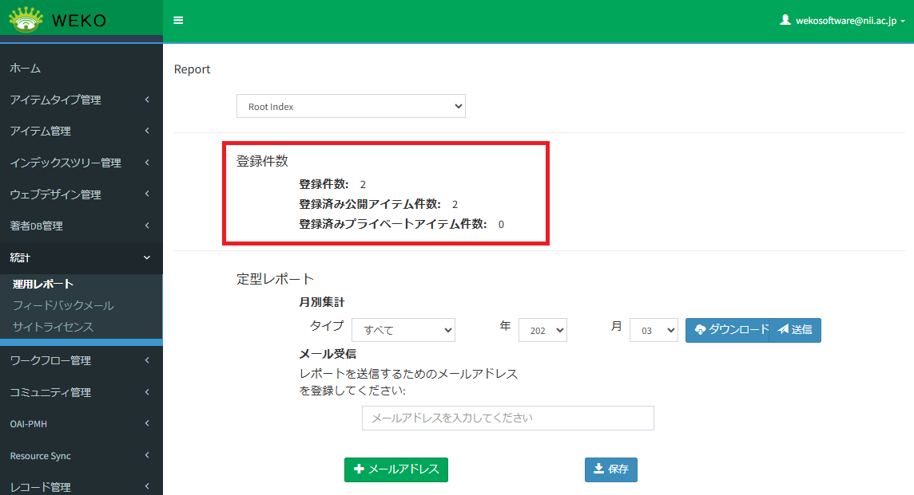
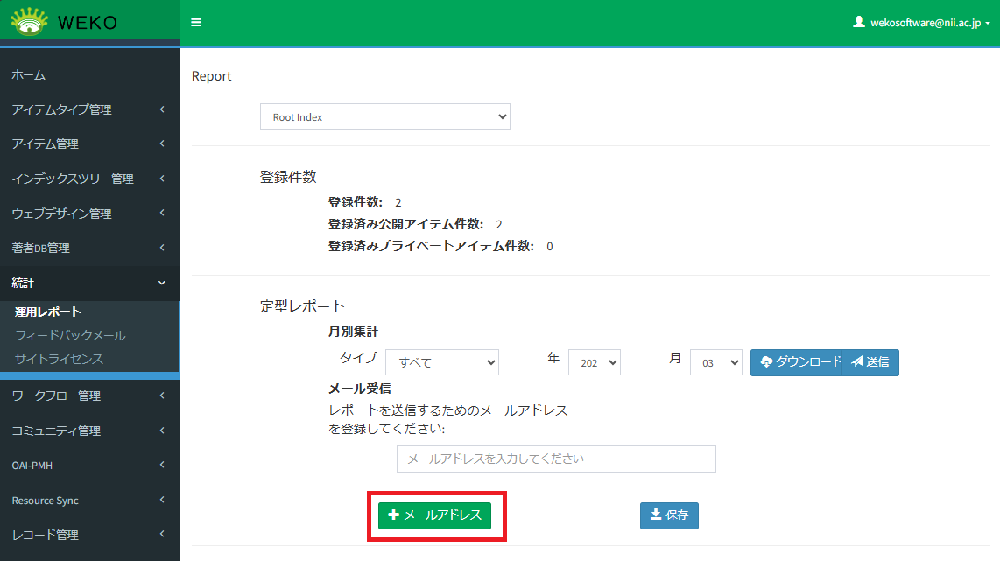
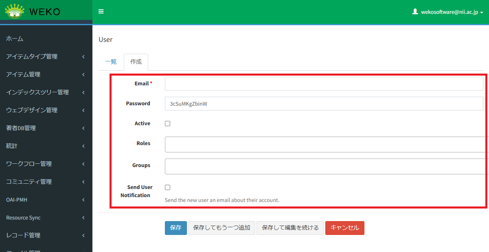

# システム管理マニュアル

（コミュニティ管理者、リポジトリ管理者、およびシステム管理者）

V1.0.7

## はじめに

このマニュアルは、WEKO3システム（以下、システムと称す）の操作方法を説明したものです。データの登録、参照などを行う管理者が参照してください。

  - 対象読者

データを登録するコミュニティ管理者、リポジトリ管理者およびシステム管理者を対象としています。

  - マニュアルの構成

このマニュアルは、次に示す章と付録から構成されています。

第１章　システムの概要

システムの概要について説明しています。

第２章　アイテムタイプ管理

アイテムタイプの管理に関する操作手順を説明しています。

第３章　アイテム管理

アイテムの管理に関する操作手順を説明しています。

第４章　インデックスツリー管理

インデックスツリーの管理に関する操作手順を説明しています。

第５章　ウェブデザイン管理

ウェブデザインの管理に関する操作手順を説明しています。

第６章　著者DB管理

著者DBの管理に関する操作手順を説明しています。

第７章　利用統計の設定

統計に関する操作手順を説明しています。

第８章　ワークフロー管理

ワークフロー管理に関する操作手順を説明しています。

第９章　コミュニティ管理

コミュニティの管理に関する操作手順を説明しています。

第10章　OAI-PMH設定

OAI-PMHの管理に関する操作手順を説明しています。

第11章　Resource Syncの設定

Resource Syncの管理に関する操作手順を説明しています。

第12章　レコード管理

レコードの管理に関する操作手順を説明しています。

第13章　ファイル管理

ファイルの管理に関する操作手順を説明しています。

第14章　ユーザ管理

ユーザの管理に関する操作手順を説明しています。

第15章　システム設定

システム設定に関する操作手順を説明しています。

第16章　ユーザカウントの管理

ユーザカウントの管理に関する操作手順を説明しています。

  - このマニュアルで使用する書式

本書で使用する書式を説明します。

<table>
<tbody>
<tr class="odd">
<td>書式</td>
<td>説明</td>
</tr>
<tr class="even">
<td><em>文字列</em></td>
<td>
可変の値を示します。

（例）日付は<em>yyyy-mm-dd</em>の形式で指定します。
</td>
</tr>
<tr class="odd">
<td>［　］</td>
<td>ウィンドウ、ダイアログボックス、メニュー、ボタンなどの画面上の要素名を示します。</td>
</tr>
</tbody>
</table>

## 目次

[1. システムの概要 12](#システムの概要)

[1.1 システムとは 13](#システムとは)

[1.2 用語解説 15](#用語解説)

[1.3 システムの機能 18](#システムの機能)

[1.4 管理画面を表示する 23](#管理画面を表示する)

[2. アイテムタイプ管理 25](#アイテムタイプ管理)

[2.1 プロパティを設定する 26](#プロパティを設定する)

[2.1.1 プロパティを追加する 26](#プロパティを追加する)

[2.1.2 プロパティを編集する 32](#プロパティを編集する)

[2.2 アイテムタイプを管理する 34](#アイテムタイプを管理する)

[2.2.1 アイテムタイプの種類ごとに実行できる操作 34](#アイテムタイプの種類ごとに実行できる操作)

[2.2.2 デフォルトアイテムタイプ 35](#デフォルトアイテムタイプ)

[2.2.3 アイテムタイプを追加する 36](#アイテムタイプを追加する)

[2.2.4 アイテムタイプをコピーする 38](#アイテムタイプをコピーする)

[2.2.5 アイテムタイプを編集する 39](#アイテムタイプを編集する)

[2.2.6 アイテムタイプの名前を変更する 46](#アイテムタイプの名前を変更する)

[2.2.7 アイテムタイプを削除する 47](#アイテムタイプを削除する)

[2.2.8 アイテムタイプを復元する 50](#アイテムタイプを復元する)

[2.2.9 アイテムタイプをエクスポートする 51](#アイテムタイプをエクスポートする)

[2.2.10 アイテムタイプをインポートする 51](#アイテムタイプをインポートする)

[2.3 OAI Schemaを設定する 52](#oai-schemaを設定する)

[2.3.1 マッピングに対応しているスキーマについて 52](#マッピングに対応しているスキーマについて)

[2.3.2 スキーマを追加する 53](#スキーマを追加する)

[2.3.3 スキーマを削除する 54](#スキーマを削除する)

[2.4 アイテムタイプをスキーマにマッピングする 55](#アイテムタイプをスキーマにマッピングする)

[2.4.1 アイテムタイプをマッピングする 55](#アイテムタイプをマッピングする)

[2.4.2 システムが付与したアイテムタイプをマッピングする 58](#システムが付与したアイテムタイプをマッピングする)

[3. アイテム管理 61](#アイテム管理)

[3.1 ライセンスまたはエンバーゴを一括更新する 62](#ライセンスまたはエンバーゴを一括更新する)

[3.2 一括削除する 65](#一括削除する)

[3.3 エクスポートする 66](#エクスポートする)

[3.4 インポートする 68](#インポートする)

[4. インデックスツリー管理 89](#インデックスツリー管理)

[4.1 インデックスツリーを管理する 90](#インデックスツリーを管理する)

[4.1.1 インデックスの表示を設定する 90](#インデックスの表示を設定する)

[4.1.2 インデックスを追加する 90](#インデックスを追加する)

[4.1.3 インデックスを変更する 96](#インデックスを変更する)

[4.1.4 インデックスを削除する 98](#インデックスを削除する)

[4.2 雑誌情報を管理する 100](#雑誌情報を管理する)

[4.2.1 雑誌情報を編集する 100](#雑誌情報を編集する)

[4.2.2 雑誌情報を閲覧する 106](#雑誌情報を閲覧する)

[4.3 並び順を編集する 107](#並び順を編集する)

[5. ウェブデザイン管理 109](#ウェブデザイン管理)

[5.1 ウィジェットを管理する 110](#ウィジェットを管理する)

[5.1.1 ウィジェットを参照する 110](#ウィジェットを参照する)

[5.1.2 ウィジェットを作成する 111](#ウィジェットを作成する)

[5.1.3 ウィジェットを編集する 132](#ウィジェットを編集する)

[5.1.4 ウィジェットを削除する 132](#ウィジェットを削除する)

[5.2 ページレイアウトを管理する 135](#ページレイアウトを管理する)

[5.2.1 ページにウィジェットを追加または削除する 135](#ページにウィジェットを追加または削除する)

[5.2.2 ページを追加する 138](#ページを追加する)

[5.2.3 ページを変更する 140](#ページを変更する)

[5.2.4 ページを削除する 141](#ページを削除する)

[5.2.5 ページ内にあるウィジェットを編集する 142](#ページ内にあるウィジェットを編集する)

[6. 著者DB管理 143](#著者db管理)

[6.1 著者情報を管理する 144](#著者情報を管理する)

[6.1.1 著者名典拠を管理する 144](#著者名典拠を管理する)

[6.1.2 外部著者ID Prefixを管理する 154](#外部著者id-prefixを管理する)

[6.1.3 組織ID Prefixを管理する 158](#組織id-prefixを管理する)

[6.2 著者情報を一括出力する 161](#著者情報を一括出力する)

[6.3 著者情報を一括登録する 164](#著者情報を一括登録する)

[7. 利用統計の設定 173](#利用統計の設定)

[7.1 Reportを設定する 174](#reportを設定する)

[7.1.1 アイテム登録件数を確認する 174](#アイテム登録件数を確認する)

[7.1.2 定型レポートをダウンロードする 175](#定型レポートをダウンロードする)

[7.1.3 定型レポートのタイプ一覧 177](#定型レポートのタイプ一覧)

[7.1.4 定型レポートをメールで送信する 182](#定型レポートをメールで送信する)

[7.1.5 カスタムレポートを設定する 187](#カスタムレポートを設定する)

[7.2 Feedback Mailを設定する 189](#feedback-mailを設定する)

[7.3 Site Licenseを設定する 191](#site-licenseを設定する)

[7.3.1 Site Licenseの統計情報を自動送信する 191](#site-licenseの統計情報を自動送信する)

[7.3.2 Site Licenseの統計情報を手動で送信する 192](#site-licenseの統計情報を手動で送信する)

[7.3.3 サイトライセンス利用統計 193](#サイトライセンス利用統計)

[8. ワークフロー管理 194](#ワークフロー管理)

[8.1 フローを設定する 195](#フローを設定する)

[8.1.1 フローを追加する 195](#フローを追加する)

[8.1.2 フローのアクションを編集する 197](#フローのアクションを編集する)

[8.1.3 フローを削除する 203](#フローを削除する)

[8.2 ワークフローを設定する 205](#ワークフローを設定する)

[8.2.1 ワークフローを追加する 205](#ワークフローを追加する)

[8.2.2 ワークフローを編集する 207](#ワークフローを編集する)

[8.2.3 ワークフローを削除する 208](#ワークフローを削除する)

[9. コミュニティ管理 210](#コミュニティ管理)

[9.1 コミュニティを管理する 211](#コミュニティを管理する)

[9.1.1 コミュニティを参照する 211](#コミュニティを参照する)

[9.1.2 コミュニティを作成する 212](#コミュニティを作成する)

[9.1.3 コミュニティを編集する 213](#コミュニティを編集する)

[9.2 お気に入りのコミュニティを管理する 214](#お気に入りのコミュニティを管理する)

[9.2.1 お気に入りのコミュニティを参照する 214](#お気に入りのコミュニティを参照する)

[9.2.2 お気に入りのコミュニティを作成する 215](#お気に入りのコミュニティを作成する)

[9.2.3 お気に入りのコミュニティを編集する 216](#お気に入りのコミュニティを編集する)

[9.2.4 お気に入りのコミュニティを削除する 217](#お気に入りのコミュニティを削除する)

[9.3 コミュニティ参加要求を管理する 218](#コミュニティ参加要求を管理する)

[9.3.1 コミュニティ参加要求を参照する 218](#コミュニティ参加要求を参照する)

[9.3.2 コミュニティ参加要求を削除する 219](#コミュニティ参加要求を削除する)

[10. OAI-PMH設定 220](#oai-pmh設定)

[10.1 ハーベスティングを設定する 221](#ハーベスティングを設定する)

[10.1.1 ハーベスティングのプランを実行する 221](#ハーベスティングのプランを実行する)

[10.1.2 ハーベスティングのプランを作成する 228](#ハーベスティングのプランを作成する)

[10.1.3 ハーベスティングのプランを編集する 229](#ハーベスティングのプランを編集する)

[10.1.4 ハーベスティングのプランを削除する 231](#ハーベスティングのプランを削除する)

[10.2 Identify 233](#identify)

[10.2.1 出力セットを参照する 233](#出力セットを参照する)

[10.2.2 出力セットを作成する 234](#出力セットを作成する)

[10.2.3 出力セットを編集する 235](#出力セットを編集する)

[10.3 Sets 236](#sets)

[10.3.1 Setを参照する 236](#setを参照する)

[10.3.2 Setを作成する 237](#setを作成する)

[10.3.3 Setを編集する 238](#setを編集する)

[11. Resource Syncの設定 240](#resource-syncの設定)

[11.1 Resource Listを管理する 241](#resource-listを管理する)

[11.1.1 Resource Listを出力する 241](#resource-listを出力する)

[11.1.2 Resource Listを作成する 243](#resource-listを作成する)

[11.1.3 Resource Listを編集する 244](#resource-listを編集する)

[11.1.4 Resource Listを削除する 245](#resource-listを削除する)

[11.2 Change Listを管理する 246](#change-listを管理する)

[11.2.1 Change Listを出力する 246](#change-listを出力する)

[11.2.2 Change Listを作成する 249](#change-listを作成する)

[11.2.3 Change Listを編集する 251](#change-listを編集する)

[11.2.4 Change Listを削除する 252](#change-listを削除する)

[11.3 Resyncを管理する 253](#resyncを管理する)

[11.3.1 データを取集する 253](#データを取集する)

[11.3.2 Resyncを作成する 256](#resyncを作成する)

[11.3.3 Resyncを編集する 258](#resyncを編集する)

[11.3.4 Resyncを削除する 258](#resyncを削除する)

[12. レコード管理 259](#レコード管理)

[12.1 Persistent Identifierを参照する 260](#persistent-identifierを参照する)

[12.2 Record Metadataを管理する 261](#record-metadataを管理する)

[12.2.1 Record Metadataを参照する 261](#record-metadataを参照する)

[12.2.2 Record Metadataを削除する 261](#record-metadataを削除する)

[13. ファイル管理 263](#ファイル管理)

[13.1 Bucketを管理する 264](#bucketを管理する)

[13.1.1 Bucketを参照する 264](#bucketを参照する)

[13.1.2 Bucketを作成する 264](#bucketを作成する)

[13.1.3 Bucketを編集する 266](#bucketを編集する)

[13.2 File Instanceを管理する 267](#file-instanceを管理する)

[13.2.1 File Instanceを参照する 267](#file-instanceを参照する)

[13.2.2 ファイルの固定性をチェックする 268](#ファイルの固定性をチェックする)

[13.3 Locationを管理する 269](#locationを管理する)

[13.3.1 Locationを参照する 269](#locationを参照する)

[13.3.2 Locationを作成する 270](#locationを作成する)

[13.3.3 Locationを編集する 271](#locationを編集する)

[13.3.4 Locationを削除する 272](#locationを削除する)

[13.4 Multipart Objectを管理する 273](#multipart-objectを管理する)

[13.4.1 Multipart Objectを参照する 273](#multipart-objectを参照する)

[13.5 Object Versionを管理する 274](#object-versionを管理する)

[13.5.1 Object Versionを参照する 274](#object-versionを参照する)

[14. ユーザ管理 275](#ユーザ管理)

[14.1 Access: Roles 276](#access-roles)

[14.1.1 ロールのアクションを参照する 276](#ロールのアクションを参照する)

[14.1.2 ロールにアクションを追加する 277](#ロールにアクションを追加する)

[14.1.3 ロールのアクションを変更する 278](#ロールのアクションを変更する)

[14.1.4 ロールのアクションを削除する 279](#ロールのアクションを削除する)

[14.2 Access: System Roles 281](#access-system-roles)

[14.2.1 システムロールのアクションを参照する 281](#システムロールのアクションを参照する)

[14.2.2 システムロールにアクションを追加する 282](#システムロールにアクションを追加する)

[14.2.3 システムロールのアクションを変更する 283](#システムロールのアクションを変更する)

[14.2.4 システムロールのアクションを削除する 284](#システムロールのアクションを削除する)

[14.3 Access: Users 286](#access-users)

[14.3.1 ユーザのアクションを参照する 286](#ユーザのアクションを参照する)

[14.3.2 ユーザにアクションを追加する 287](#ユーザにアクションを追加する)

[14.3.3 ユーザのアクションを変更する 288](#ユーザのアクションを変更する)

[14.3.4 ユーザのアクションを削除する 289](#ユーザのアクションを削除する)

[14.4 Linked account identitiesを管理する 291](#linked-account-identitiesを管理する)

[14.4.1 identityを参照する 291](#identityを参照する)

[14.4.2 identityを削除する 292](#identityを削除する)

[14.5 Linked account tokensを管理する 293](#linked-account-tokensを管理する)

[14.5.1 Linked accountのトークンを参照する 293](#linked-accountのトークンを参照する)

[14.5.2 Linked accountのトークンを作成する 294](#linked-accountのトークンを作成する)

[14.5.3 Linked accountのトークンを編集する 295](#linked-accountのトークンを編集する)

[14.5.4 Linked accountのトークンを削除する 295](#linked-accountのトークンを削除する)

[14.6 Linked accountsを管理する 296](#linked-accountsを管理する)

[14.6.1 Linked accountを参照する 296](#linked-accountを参照する)

[14.6.2 Linked accountを作成する 297](#linked-accountを作成する)

[14.6.3 Linked accountを編集する 298](#linked-accountを編集する)

[14.6.4 Linked accountを削除する 299](#linked-accountを削除する)

[14.7 OAuth Application Tokensを管理する 301](#oauth-application-tokensを管理する)

[14.7.1 OAuth Application Tokensを参照する 301](#oauth-application-tokensを参照する)

[14.7.2 OAuth Application Tokensを削除する 302](#oauth-application-tokensを削除する)

[14.8 OAuth Applicationを管理する 303](#oauth-applicationを管理する)

[14.8.1 OAuth Applicationを参照する 303](#oauth-applicationを参照する)

[14.8.2 OAuth Applicationを削除する 304](#oauth-applicationを削除する)

[14.9 ロールを管理する 305](#ロールを管理する)

[14.9.1 ロールを参照する 305](#ロールを参照する)

[14.9.2 ロールを作成する 306](#ロールを作成する)

[14.9.3 ロールを編集する 307](#ロールを編集する)

[14.9.4 ロールを削除する 308](#ロールを削除する)

[14.10 Session Activityを管理する 310](#session-activityを管理する)

[14.10.1 Session Activityを参照する 310](#session-activityを参照する)

[14.10.2 Session Activityを削除する 310](#session-activityを削除する)

[14.11 ユーザを管理する 311](#ユーザを管理する)

[14.11.1 ユーザを参照する 311](#ユーザを参照する)

[14.11.2 ユーザを追加する 312](#ユーザを追加する)

[14.11.3 ユーザを編集する 313](#ユーザを編集する)

[14.11.4 ユーザを無効または有効にする 314](#ユーザを無効または有効にする)

[14.12 User Profileを管理する 315](#user-profileを管理する)

[14.12.1 User Profileを参照する 315](#user-profileを参照する)

[14.12.2 User Profileを削除する 316](#user-profileを削除する)

[15. 設定 317](#設定)

[15.1 著者表示の設定を変更する 318](#著者表示の設定を変更する)

[15.2 インデックスリンクを表示する 319](#インデックスリンクを表示する)

[15.3 言語を設定する 320](#言語を設定する)

[15.4 PDFのカバーページを表示する 321](#pdfのカバーページを表示する)

[15.5 ランキング表示を設定する 325](#ランキング表示を設定する)

[15.6 統計設定を変更する 326](#統計設定を変更する)

[15.7 Webページのスタイルを変更する 327](#webページのスタイルを変更する)

[15.8 Identifierを設定する 330](#identifierを設定する)

[15.8.1 Identifierを参照する 330](#identifierを参照する)

[15.8.2 Identifierを作成する 331](#identifierを作成する)

[15.8.3 Identifierを編集する 333](#identifierを編集する)

[15.9 アイテムをエクスポートするときの設定を変更する 335](#アイテムをエクスポートするときの設定を変更する)

[15.10 ログ解析時の設定をする 336](#ログ解析時の設定をする)

[15.11 検索条件、結果表示件数及び初期表示を設定する 337](#検索条件結果表示件数及び初期表示を設定する)

[15.11.1 著者検索を設定する 337](#著者検索を設定する)

[15.11.2 検索結果の表示内容を設定する 338](#検索結果の表示内容を設定する)

[15.11.3 詳細検索時の表示項目を設定する 339](#詳細検索時の表示項目を設定する)

[15.11.4 詳細検索のラベルを変更する 341](#詳細検索のラベルを変更する)

[15.11.5 詳細検索をカスタマイズする 342](#詳細検索をカスタマイズする)

[15.11.6 インデックスツリー/ファセットの表示を設定する 343](#インデックスツリーファセットの表示を設定する)

[15.11.7 汎用詳細検索項目を設定する 345](#汎用詳細検索項目を設定する)

[15.11.8 初期表示を設定する 346](#初期表示を設定する)

[15.12 ファセット検索機能を管理する 349](#ファセット検索機能を管理する)

[15.12.1 ファセット検索機能を設定する 349](#ファセット検索機能を設定する)

[15.13 サイトの情報を設定する 353](#サイトの情報を設定する)

[15.14 サイトライセンスを設定する 355](#サイトライセンスを設定する)

[15.15 サイトマップを作成する 357](#サイトマップを作成する)

[15.16 メール送信を設定する 358](#メール送信を設定する)

[15.17 WebAPIのアカウントを設定する 360](#webapiのアカウントを設定する)

[15.18 File Previewを設定する 361](#file-previewを設定する)

[15.19 Shibbolethユーザを許可する 362](#shibbolethユーザを許可する)

[15.20 制限公開機能を管理する 363](#制限公開機能を管理する)

[15.20.1 制限公開機能を設定する 363](#制限公開機能を設定する)

[15.20.2 制限公開機能の承認メール内容 367](#_Toc137111756)

[15.20.3 制限公開機能の通知メール内容 367](#_Toc137111757)

[15.21 機関名を設定する 368](#_Toc137111758)

[16. メンテナンス 369](#メンテナンス)

[16.1 ElasticSearchインデックスを設定する 370](#elasticsearchインデックスを設定する)

[17. ユーザカウントの管理 371](#ユーザカウントの管理)

[17.1 プロフィールを更新する 372](#プロフィールを更新する)

[17.2 パスワードを変更する 373](#パスワードを変更する)

[17.3 アカウントにログインしたデバイスを確認する 374](#アカウントにログインしたデバイスを確認する)

[17.4 アプリケーションを管理する 375](#アプリケーションを管理する)

[17.5 グループを管理する 376](#グループを管理する)

[17.5.1 グループへの参加要求および招待を許可する 376](#グループへの参加要求および招待を許可する)

[17.5.2 グループを作成する 377](#グループを作成する)

[17.5.3 グループにメンバーを招待する 378](#グループにメンバーを招待する)

[17.5.4 グループを編集する 380](#グループを編集する)

[17.5.5 グループを削除する 381](#グループを削除する)

[17.6 セッションの有効時間を変更する 383](#セッションの有効時間を変更する)

[17.7 管理画面を表示する 384](#管理画面を表示する-1)

## システムの概要

この章では、システムの概要について説明します。

### システムとは

システムを使用すると、学術成果を保管して公開することができます。このシステムのリポジトリには、PDFファイル、動画、画像などさまざまな形式のコンテンツを保管できます。また、研究成果を分かりやすく管理できるように、保存した学術成果を分類してツリー形式で表示したり、研究成果を参照する際にもキーワードや全文検索などで探したりすることができます。また、リポジトリは、ほかのリポジトリともデータを同期させることができます。アイテムやインデックスなどの用語の意味については、「1.2用語解説」を参照してください。

図 1‑1システムのデータ管理

アイテムを登録する場合、データ登録者はワークフローを作成してアイテムを登録し、査読者や承認者の承認を経てデータを登録・公開をします。

図 1‑2データの登録

### 用語解説

システムで使用する用語を説明します。

表 1‑1システムの用語

<table>
<thead>
<tr class="header">
<th>用語</th>
<th>意味</th>
</tr>
</thead>
<tbody>
<tr class="odd">
<td>DDI</td>
<td>
DDI（Data Documentation Initiative）は、データアーカイブの国際化や、共同利用・共同研究拠点といった事業の一環で利用する、社会調査メタデータの国際規格のメタデータスキーマです（https://ddialliance.org/）。

WEKO3モジュールでは、OAI-PMHのメタデータスキーマとしてDDIを使用できます。
</td>
</tr>
<tr class="even">
<td>DublinCore</td>
<td>国際標準（ISO 15836）のメタデータスキーマです（http://dublincore.org/）。WEKO3モジュールでは、OAI-PMHのメタデータスキーマとしてDublinCoreを使用できます。</td>
</tr>
<tr class="odd">
<td>JPCOAR</td>
<td>
オープンアクセスリポジトリ推進協会（JPCOAR : Japan Consortium for Open Access Repositories）が策定したメタデータスキーマです（https://schema.irdb.nii.ac.jp/ja）。

WEKO3モジュールでは、OAI-PMHのメタデータスキーマとしてJPCOARを使用できます。
</td>
</tr>
<tr class="even">
<td>junii2</td>
<td>
国立情報学研究所（NII）が公開したメタデータスキーマです（http://www.nii.ac.jp/irp/archive/system/junii2.html）。

WEKO3モジュールでは、OAI-PMHのメタデータスキーマとしてjunii2は使用しません。
</td>
</tr>
<tr class="odd">
<td>OAI-PMH</td>
<td>OAI-PMH（The Open Archives Initiative Protocol for Metadata Harvesting）は、リポジトリ間でメタデータを交換する目的でOpen Archives Initiativeによって開発されたプロトコルです（http://www.openarchives.org/OAI/openarchivesprotocol.html）。リポジトリを含む外部システムは、WEKO3モジュールに登録されたアイテムのメタデータをOAI-PMHを利用して収集できます。</td>
</tr>
<tr class="even">
<td>UI</td>
<td>User Interfaceの略語です。システムとユーザの間で情報をやりとりするためのインターフェイスです。</td>
</tr>
<tr class="odd">
<td>WEKO3リポジトリ</td>
<td>WEKO3モジュールおよび関連ソフトを用いて構築したリポジトリです。</td>
</tr>
<tr class="even">
<td>アイテム</td>
<td>
リポジトリに保管する情報の１単位です。アイテムを構成するデータは、コンテンツファイルおよびメタデータです。メタデータには、メタデータスキーマに規定されている記述項目や記述形式に準拠した情報が記載されています。

各アイテムにはWEKO3リポジトリ内で一意となるアイテムIDが割り当てられます。アイテムは1つのアイテムタイプに紐付いており、複数のアイテムタイプと紐付けることはできません。

異なるメタデータで構成させるアイテムを登録したい場合、新たなアイテムタイプを作成することで対応できます。
</td>
</tr>
</tbody>
</table>

<table>
<thead>
<tr class="header">
<th>アイテムタイプ</th>
<th>
アイテムに登録するメタデータのデータ型を定義します。アイテムタイプは、JPCOARなどのメタデータスキーマで規定される要素から構成されます。

リポジトリ管理者はアイテムに必要なメタデータを検討し、アイテムタイプを独自に作成します。

例）

紀要論文と研究データをリポジトリに保管する場合、紀要論文のメタデータ項目と研究データのメタデータ項目は異なります。このような場合に、紀要論文向けのアイテムタイプと、研究データ向けのアイテムタイプをそれぞれ作成できます。
</th>
</tr>
</thead>
<tbody>
<tr class="odd">
<td>インデックス</td>
<td>WEKO3リポジトリに登録したアイテムをまとめる単位（カテゴリ）です。WEKO3リポジトリに登録したアイテムは必ず1つ以上のインデックスに所属します。インデックスは複数の子インデックスとアイテムを持つことができます。</td>
</tr>
<tr class="even">
<td>インデックスツリー</td>
<td>入れ子的に作成されたインデックスのツリー構造です。１つのWEKO3リポジトリは１つのリポジトリツリーを持ちます。</td>
</tr>
<tr class="odd">
<td>コミュニティ</td>
<td>リポジトリにアクセスできるユーザのグループです。コミュニティのユーザに限定したアイテムの公開などができます。</td>
</tr>
<tr class="even">
<td>コミュニティ管理者</td>
<td>コミュニティを管理するロールを持つユーザです。</td>
</tr>
<tr class="odd">
<td>コンテンツ</td>
<td>リポジトリに登録している研究論文や資料などの研究データです。本マニュアルではアイテムと同じ意味で使用します。</td>
</tr>
<tr class="even">
<td>コンテンツファイル</td>
<td>アイテムを構成する論文などのファイルを指します。</td>
</tr>
<tr class="odd">
<td>システム</td>
<td>WEKO3システムです。</td>
</tr>
<tr class="even">
<td>システム管理者</td>
<td>システムを管理するロールを持つユーザです。</td>
</tr>
<tr class="odd">
<td>スキーマ</td>
<td>リポジトリのデータベースの構造の定義です。データベースを構成するテーブルやリストといったオブジェクトの関係を定義しています。</td>
</tr>
<tr class="even">
<td>ダイアログ</td>
<td>主にメッセージおよび注意喚起の表示に使用するUIです。表示中も画面に表示したUIの操作を受け付けます。</td>
</tr>
<tr class="odd">
<td>登録ユーザ</td>
<td>保存されている学術成果を参照したり、学術の成果のデータをリポジトリに登録したりすることができるユーザです。</td>
</tr>
<tr class="even">
<td>ハーベスティング</td>
<td>外部システムがリポジトリのデータを定期的に収集することです。専用のプロトコルを使用します。メタデータをプロトコルにマッピングする必要があります。</td>
</tr>
<tr class="odd">
<td>フロー</td>
<td>アイテムをシステムに保存するまでの一連の作業をグループ化したものです。リポジトリへのデータの追加、メタデータの入力、査読・承認といった作業を定義します。</td>
</tr>
<tr class="even">
<td>メタデータ</td>
<td>アイテムに関連した情報です。例えば、タイトル、著者、ファイルサイズなどの情報が該当します。メタデータは、内容メタデータ、管理メタデータから構成されます。内容メタデータは、アイテムを要約した内容です。管理メタデータは、内容メタデータの作成者や、アイテムのアクセス数などの情報です。</td>
</tr>
<tr class="odd">
<td>リポジトリ</td>
<td>
大学とその構成員が創造したデジタル資料の管理や発信を行うために、大学がそのコミュニティの構成員に提供する一連のサービスです。原則として大学や学術団体（1機関）が1つのリポジトリを運用することができます。

このマニュアルでは、研究データ（アイテム）とそのメタデータを保管する領域の意味で使用しています。
</td>
</tr>
<tr class="even">
<td>リポジトリ管理者</td>
<td>リポジトリを管理するロールを持つユーザです。WEKO3モジュールの設定、インデックスツリー設定、アイテムタイプ設定ができます。</td>
</tr>
</tbody>
</table>

<table>
<thead>
<tr class="header">
<th>ログイン</th>
<th>コンピュータやインターネット上の様々なサービスを利用する際に、予め登録しておいたアカウント情報を用いて個々人のデータにアクセスする認証行為を指します。</th>
</tr>
</thead>
<tbody>
<tr class="odd">
<td>ログアウト</td>
<td>ログインによって認証された個々人のデータにアクセスするための権限を失効することです。</td>
</tr>
<tr class="even">
<td>ロール</td>
<td>システムやリポジトリなどを操作するための権限です。追加・変更・削除が可能です。</td>
</tr>
<tr class="odd">
<td>ワークフロー</td>
<td>
業務の一連の処理手続きを定義すること、またその業務の一連の流れを指します。WEKO3リポジトリでは、

リポジトリへのデータの追加、メタデータの入力、査読・承認といった作業（アイテムの登録から公開まで）の処理の流れを指します。
</td>
</tr>
<tr class="even">
<td>異体字</td>
<td>
旧字などで、読み方と意味が同じで表記の異なる字体、文字のことです。

例）「会」と「會」、「一」と「壱」など。
</td>
</tr>
</tbody>
</table>

### システムの機能

システムの管理者ロールを、次の表に示します。

表 1‑2システムの管理者ロール一覧

| 管理者ロール    | 説明                                                                                    |
| --------- | ------------------------------------------------------------------------------------- |
| システム管理者   | ユーザ管理、ワークフロー管理、OAI-PMH連携などを行います。コミュニティ管理やユーザ管理など、システム管理者だけが実行できる操作があります。              |
| リポジトリ管理者  | リポジトリにスキーマを登録する、アイテムタイプを作成する、メタデータのマッピングなどを行います。                                      |
| コミュニティ管理者 | 学部や学科などの研究カテゴリ（インデックスツリーの各インデックス）ごとに存在します。ハーベスティングの実行、インデックスツリーの編集や、ウィジェットの登録などを行います。 |

次の表に、システムの管理機能および各機能を実行できる管理者ロールを示します。

表 1‑3システムの機能と管理者ロール

<table>
<thead>
<tr class="header">
<th>（凡例：〇 実行できる、× 実行できない）</th>
<th></th>
<th></th>
<th></th>
<th></th>
<th></th>
</tr>
</thead>
<tbody>
<tr class="odd">
<td>機能</td>
<td>管理者ロール</td>
<td>参照先</td>
<td></td>
<td></td>
<td></td>
</tr>
<tr class="even">
<td></td>
<td>システム</td>
<td>リポジトリ</td>
<td>コミュニティ</td>
<td></td>
<td></td>
</tr>
<tr class="odd">
<td>アイテムタイプ管理</td>
<td>-</td>
<td>-</td>
<td>-</td>
<td>2. アイテムタイプ管理</td>
<td></td>
</tr>
<tr class="even">
<td></td>
<td>メタデータ</td>
<td>〇</td>
<td>〇</td>
<td>×</td>
<td></td>
</tr>
<tr class="odd">
<td></td>
<td>マッピング</td>
<td>〇</td>
<td>〇</td>
<td>×</td>
<td></td>
</tr>
<tr class="even">
<td></td>
<td>OAIスキーマ</td>
<td>〇</td>
<td>×</td>
<td>×</td>
<td></td>
</tr>
<tr class="odd">
<td></td>
<td>プロパティ</td>
<td>〇</td>
<td>×</td>
<td>×</td>
<td></td>
</tr>
<tr class="even">
<td>アイテム管理</td>
<td>-</td>
<td>-</td>
<td>-</td>
<td>3. アイテム管理</td>
<td></td>
</tr>
<tr class="odd">
<td></td>
<td>一括更新</td>
<td>〇</td>
<td>〇</td>
<td>×</td>
<td></td>
</tr>
<tr class="even">
<td></td>
<td>一括削除</td>
<td>〇</td>
<td>〇</td>
<td>×</td>
<td></td>
</tr>
<tr class="odd">
<td></td>
<td>一括エクスポート</td>
<td>〇</td>
<td>〇</td>
<td>×</td>
<td></td>
</tr>
<tr class="even">
<td></td>
<td>インポート</td>
<td>〇</td>
<td>〇</td>
<td>×</td>
<td></td>
</tr>
<tr class="odd">
<td>インデックスツリー管理</td>
<td>-</td>
<td>-</td>
<td>-</td>
<td>4. インデックスツリー管理</td>
<td></td>
</tr>
<tr class="even">
<td></td>
<td>ツリー編集</td>
<td>〇</td>
<td>〇</td>
<td>
〇

(*2)
</td>
<td></td>
</tr>
<tr class="odd">
<td></td>
<td>雑誌情報</td>
<td>〇</td>
<td>〇</td>
<td>
〇

(*2)
</td>
<td></td>
</tr>
<tr class="even">
<td></td>
<td>カスタムソート</td>
<td>〇</td>
<td>〇</td>
<td>
〇

(*2)
</td>
<td></td>
</tr>
<tr class="odd">
<td>ウェデザイン管理</td>
<td>-</td>
<td>-</td>
<td>-</td>
<td>5. ウェブデザイン管理</td>
<td></td>
</tr>
<tr class="even">
<td></td>
<td>ウィジェット</td>
<td>〇</td>
<td>〇</td>
<td>
〇

(*2)
</td>
<td></td>
</tr>
<tr class="odd">
<td></td>
<td>ページレイアウト</td>
<td>〇</td>
<td>〇</td>
<td>
〇

(*2)
</td>
<td></td>
</tr>
</tbody>
</table>

<table>
<thead>
<tr class="header">
<th>著者DB管理</th>
<th>-</th>
<th>-</th>
<th>-</th>
<th>6. 著者DB管理</th>
<th></th>
</tr>
</thead>
<tbody>
<tr class="odd">
<td></td>
<td>編集</td>
<td>〇</td>
<td>〇</td>
<td>×</td>
<td></td>
</tr>
<tr class="even">
<td></td>
<td>一括出力</td>
<td>〇</td>
<td>〇</td>
<td>×</td>
<td></td>
</tr>
<tr class="odd">
<td></td>
<td>一括登録</td>
<td>〇</td>
<td>〇</td>
<td>×</td>
<td></td>
</tr>
<tr class="even">
<td>統計</td>
<td>-</td>
<td>-</td>
<td>-</td>
<td>7. 利用統計の設定</td>
<td></td>
</tr>
<tr class="odd">
<td></td>
<td>運用レポート</td>
<td>〇</td>
<td>〇</td>
<td>
〇

(*2)
</td>
<td></td>
</tr>
<tr class="even">
<td></td>
<td>フィードバックメール</td>
<td>〇</td>
<td>〇</td>
<td>×</td>
<td></td>
</tr>
<tr class="odd">
<td></td>
<td>サイトライセンス</td>
<td>〇</td>
<td>〇</td>
<td>×</td>
<td></td>
</tr>
<tr class="even">
<td>ワークフロー管理</td>
<td>-</td>
<td>-</td>
<td>-</td>
<td>8. ワークフロー管理</td>
<td></td>
</tr>
<tr class="odd">
<td></td>
<td>フロー</td>
<td>〇</td>
<td>〇</td>
<td>×</td>
<td></td>
</tr>
<tr class="even">
<td></td>
<td>ワークフロー</td>
<td>〇</td>
<td>〇</td>
<td>×</td>
<td></td>
</tr>
<tr class="odd">
<td>コミュニティ管理</td>
<td>-</td>
<td>-</td>
<td>-</td>
<td>9. コミュニティ管理</td>
<td></td>
</tr>
<tr class="even">
<td></td>
<td>コミュニティ</td>
<td>〇</td>
<td>〇</td>
<td>
〇

(*2)
</td>
<td></td>
</tr>
<tr class="odd">
<td></td>
<td>注目のコミュニティ</td>
<td>〇</td>
<td>×</td>
<td>×</td>
<td></td>
</tr>
<tr class="even">
<td></td>
<td>参加リクエスト</td>
<td>〇</td>
<td>×</td>
<td>×</td>
<td></td>
</tr>
<tr class="odd">
<td>OAI-PMH</td>
<td>-</td>
<td>-</td>
<td>-</td>
<td>10. OAI-PMH設定</td>
<td></td>
</tr>
<tr class="even">
<td></td>
<td>ハーベスト</td>
<td>〇</td>
<td>〇</td>
<td>
〇

(*2)
</td>
<td></td>
</tr>
<tr class="odd">
<td></td>
<td>Identify</td>
<td>〇</td>
<td>〇</td>
<td>×</td>
<td></td>
</tr>
<tr class="even">
<td></td>
<td>Sets</td>
<td>〇</td>
<td>×</td>
<td>×</td>
<td></td>
</tr>
<tr class="odd">
<td>Resource Sync</td>
<td>-</td>
<td>-</td>
<td>-</td>
<td>11. Resource Syncの設定</td>
<td></td>
</tr>
<tr class="even">
<td></td>
<td>Resource List</td>
<td>〇</td>
<td>×</td>
<td>×</td>
<td></td>
</tr>
<tr class="odd">
<td></td>
<td>Change List</td>
<td>〇</td>
<td>×</td>
<td>×</td>
<td></td>
</tr>
<tr class="even">
<td></td>
<td>Resync</td>
<td>〇</td>
<td>×</td>
<td>×</td>
<td></td>
</tr>
<tr class="odd">
<td>レコード管理</td>
<td>-</td>
<td>-</td>
<td>-</td>
<td>12. レコード管理</td>
<td></td>
</tr>
<tr class="even">
<td></td>
<td>永続識別子</td>
<td>〇</td>
<td>×</td>
<td>×</td>
<td></td>
</tr>
<tr class="odd">
<td></td>
<td>レコードメタデータ</td>
<td>〇</td>
<td>×</td>
<td>×</td>
<td></td>
</tr>
<tr class="even">
<td>ファイル管理</td>
<td>-</td>
<td>-</td>
<td>-</td>
<td>3. ファイル管理</td>
<td></td>
</tr>
<tr class="odd">
<td></td>
<td>バケット</td>
<td>〇</td>
<td>×</td>
<td>×</td>
<td></td>
</tr>
<tr class="even">
<td></td>
<td>ファイルインスタンス</td>
<td>〇</td>
<td>×</td>
<td>×</td>
<td></td>
</tr>
<tr class="odd">
<td></td>
<td>ロケーション</td>
<td>〇</td>
<td>
〇

(*1)
</td>
<td></td>
<td></td>
</tr>
<tr class="even">
<td></td>
<td>マルチパートオブジェクト</td>
<td>〇</td>
<td>×</td>
<td>×</td>
<td></td>
</tr>
<tr class="odd">
<td></td>
<td>オブジェクトバージョン</td>
<td>〇</td>
<td>×</td>
<td>×</td>
<td></td>
</tr>
</tbody>
</table>

<table>
<thead>
<tr class="header">
<th>ユーザ管理</th>
<th>-</th>
<th>-</th>
<th>-</th>
<th>14. ユーザ管理</th>
<th></th>
</tr>
</thead>
<tbody>
<tr class="odd">
<td></td>
<td>アクセス: ロール</td>
<td>〇</td>
<td>×</td>
<td>×</td>
<td></td>
</tr>
<tr class="even">
<td></td>
<td>アクセス: システムロール</td>
<td>〇</td>
<td>×</td>
<td>×</td>
<td></td>
</tr>
<tr class="odd">
<td></td>
<td>アクセス: ユーザ</td>
<td>〇</td>
<td>×</td>
<td>×</td>
<td></td>
</tr>
<tr class="even">
<td></td>
<td>連結アカウント識別子</td>
<td>〇</td>
<td>×</td>
<td>×</td>
<td></td>
</tr>
<tr class="odd">
<td></td>
<td>連結アカウントトークン</td>
<td>〇</td>
<td>×</td>
<td>×</td>
<td></td>
</tr>
<tr class="even">
<td></td>
<td>連結アカウント</td>
<td>〇</td>
<td>×</td>
<td>×</td>
<td></td>
</tr>
<tr class="odd">
<td></td>
<td>OAuthアプリケーショントークン</td>
<td>〇</td>
<td>×</td>
<td>×</td>
<td></td>
</tr>
<tr class="even">
<td></td>
<td>OAuthアプリケーション</td>
<td>〇</td>
<td>×</td>
<td>×</td>
<td></td>
</tr>
<tr class="odd">
<td></td>
<td>ロール</td>
<td>〇</td>
<td>×</td>
<td>×</td>
<td></td>
</tr>
<tr class="even">
<td></td>
<td>セッションアクティビティ</td>
<td>〇</td>
<td>〇</td>
<td>×</td>
<td></td>
</tr>
<tr class="odd">
<td></td>
<td>ユーザ</td>
<td>〇</td>
<td>〇(*1)</td>
<td>×</td>
<td></td>
</tr>
<tr class="even">
<td></td>
<td>ユーザプロファイル</td>
<td>〇</td>
<td>〇(*1)</td>
<td>×</td>
<td></td>
</tr>
<tr class="odd">
<td>設定</td>
<td>-</td>
<td>-</td>
<td>-</td>
<td>15. システム設定</td>
<td></td>
</tr>
<tr class="even">
<td></td>
<td>アイテム表示</td>
<td>〇</td>
<td>〇</td>
<td>×</td>
<td></td>
</tr>
<tr class="odd">
<td></td>
<td>インデックスリンク表示</td>
<td>〇</td>
<td>〇</td>
<td>×</td>
<td></td>
</tr>
<tr class="even">
<td></td>
<td>インデックスツリー表示</td>
<td>〇</td>
<td>〇</td>
<td>×</td>
<td></td>
</tr>
<tr class="odd">
<td></td>
<td>言語表示</td>
<td>〇</td>
<td>〇</td>
<td>×</td>
<td></td>
</tr>
<tr class="even">
<td></td>
<td>PDFカバーページ表示</td>
<td>〇</td>
<td>〇</td>
<td>×</td>
<td></td>
</tr>
<tr class="odd">
<td></td>
<td>ランキング表示</td>
<td>〇</td>
<td>〇</td>
<td>×</td>
<td></td>
</tr>
<tr class="even">
<td></td>
<td>統計情報表示</td>
<td>〇</td>
<td>〇</td>
<td>×</td>
<td></td>
</tr>
<tr class="odd">
<td></td>
<td>画面背景色</td>
<td>〇</td>
<td>〇</td>
<td>×</td>
<td></td>
</tr>
<tr class="even">
<td></td>
<td>識別子</td>
<td>〇</td>
<td>〇</td>
<td>
〇

(*2)
</td>
<td></td>
</tr>
<tr class="odd">
<td></td>
<td>アイテム一括出力</td>
<td>〇</td>
<td>〇</td>
<td>
〇

(*2)
</td>
<td></td>
</tr>
<tr class="even">
<td></td>
<td>ログ解析</td>
<td>〇</td>
<td>〇</td>
<td>×</td>
<td></td>
</tr>
<tr class="odd">
<td></td>
<td>検索設定</td>
<td>〇</td>
<td>〇</td>
<td>×</td>
<td></td>
</tr>
<tr class="even">
<td></td>
<td>ファセット検索</td>
<td>〇</td>
<td>〇</td>
<td>×</td>
<td></td>
</tr>
<tr class="odd">
<td></td>
<td>サイト情報</td>
<td>〇</td>
<td>〇</td>
<td>×</td>
<td></td>
</tr>
<tr class="even">
<td></td>
<td>サイトライセンス</td>
<td>〇</td>
<td>〇</td>
<td>×</td>
<td></td>
</tr>
<tr class="odd">
<td></td>
<td>サイトマップ</td>
<td>〇</td>
<td>〇</td>
<td>×</td>
<td></td>
</tr>
<tr class="even">
<td></td>
<td>メール送信</td>
<td>〇</td>
<td>×</td>
<td>×</td>
<td></td>
</tr>
<tr class="odd">
<td></td>
<td>WebAPIアカウント</td>
<td>〇</td>
<td>×</td>
<td>×</td>
<td></td>
</tr>
<tr class="even">
<td></td>
<td>ファイルプレビュー</td>
<td>〇</td>
<td>×</td>
<td>×</td>
<td></td>
</tr>
<tr class="odd">
<td></td>
<td>Shibboleth</td>
<td>〇</td>
<td>×</td>
<td>×</td>
<td></td>
</tr>
<tr class="even">
<td></td>
<td>制限公開</td>
<td>〇</td>
<td>×</td>
<td>×</td>
<td></td>
</tr>
<tr class="odd">
<td></td>
<td>その他</td>
<td>〇</td>
<td>〇</td>
<td>×</td>
<td></td>
</tr>
<tr class="even">
<td>ユーザカウント管理</td>
<td>〇</td>
<td>〇</td>
<td>〇</td>
<td>16. ユーザカウントの管理</td>
<td></td>
</tr>
<tr class="odd">
<td>メンテナンス</td>
<td>-</td>
<td>-</td>
<td>-</td>
<td></td>
<td></td>
</tr>
<tr class="even">
<td></td>
<td>Elasticsearchインデックス</td>
<td>〇</td>
<td>×</td>
<td>×</td>
<td></td>
</tr>
</tbody>
</table>

(\*1) 読み込み権限のみ可能

(\*2) 管理者の管理対象となるインデックスのみ可能とするように対応予定

### 管理画面を表示する

［Administration］画面を表示する手順を説明します。このマニュアルで説明しているシステム管理の操作は、［Administration］画面で行います。各メニューの設定画面を表示する場合、次のように操作してください。

1.  管理者のアカウントでログインしてください。
    
    ログインの方法については、「データ登録ガイド」を参照してください。

2.  画面右上のユーザカウントのプルダウンメニューから［Administration］を選択します。
    
    
    
    ［Administration］画面が表示されます。

3.  画面左側のメニューをクリックして開き、項目を選択します。
    
    設定画面が表示されます。

管理画面メニューの一覧と、それぞれのメニューを操作できるロールは表1-3をご確認ください。

  - 教員権限の場合、Administratorメニューが表示されますが、アクセスすることはできません。

## アイテムタイプ管理

この章では、アイテムタイプを管理する方法について説明します。

アイテムタイプは、プロパティを組み合わせて作成します。作成したアイテムタイプは、アイテムを登録するためのフォーマット(テンプレート)として使用します。

### プロパティを設定する

プロパティ画面は、［アイテムタイプ管理］をクリックして［プロパティ］をクリックすると表示されます。この画面は、プロパティの新規登録、保存済みプロパティの更新ができます。

#### プロパティを追加する

プロパティを新規追加する方法を説明します。

1.  プロパティ名を入力します。
    
    

<!-- end list -->

4.  ［+Add］をクリックします。
    
    属性の項目が追加されます。
    
    

5.  テキストエリアに項目名を入力し、ドロップダウンリストからメタデータ属性を選択します。入力が必須な属性にする場合、［Required］をチェックします。入力内容を削除する場合、［×］をクリックします。

6.  入力形式の設定内容については、「表 2-1メタデータ属性の入力形式の項目」を参照してください。
    
    

表 2‑1メタデータ属性の入力形式の項目

<table>
<thead>
<tr class="header">
<th>入力形式</th>
<th>表示例</th>
<th>説明</th>
</tr>
</thead>
<tbody>
<tr class="odd">
<td>テキスト</td>
<td></td>
<td>1行のテキストで値を入力します。</td>
</tr>
<tr class="even">
<td>テキストエリア</td>
<td></td>
<td>複数行のテキストで値を入力します。</td>
</tr>
<tr class="odd">
<td>チェックボックス※</td>
<td></td>
<td>複数選択のチェックボックスで値を入力します。</td>
</tr>
<tr class="even">
<td>選択式(ラジオ)※</td>
<td></td>
<td>単一選択のラジオボタンで値を入力します。</td>
</tr>
<tr class="odd">
<td>選択式(プルダウン)※</td>
<td></td>
<td>単一選択のプルダウンメニューで値を入力します。</td>
</tr>
<tr class="even">
<td>日付</td>
<td></td>
<td>
次のどちらかの形式で値を入力します。

<ul>
<li>
<em>yyyy-mm-dd、yyyy-mm、yyyy</em>形式で入力
</li>
<li>
エリアフォーカス時に表示するカレンダーで日付を選択して入力します。
</li>
</ul></td>
</tr>
<tr class="odd">
<td>オブジェクト</td>
<td></td>
<td>複数の項目を入力します。入力項目がセットになっています。例えば、「作成者」プロパティの「作成者所属」が該当します。</td>
</tr>
<tr class="even">
<td>リスト</td>
<td></td>
<td>複数の項目を繰り返し入力できます。入力項目がセットになっています。例えば、「権利者情報」プロパティの「権利者識別子」が該当します。</td>
</tr>
</tbody>
</table>

> 注※

  - > 入力形式で、チェックボックス、選択式(ラジオ)、または選択式(プルダウン)を選択した場合、選択肢入力欄が表示されます。選択肢入力欄には、各選択肢を「|」（半角パイプ）区切りで入力します。

> 例：AAA|BBB|CCC

  - > また、選択式(プルダウン)を選択した場合、未選択という選択肢を作成するため、選択肢入力欄には、「|」（半角パイプ）を先頭に追加します。  
    > 例：|AAA|BBB|CCC

<!-- end list -->

7.  ［JSONスキーマ］をクリックします。
    
    設定したプロパティ情報が、項目の下のテキストエリア、［フォーム(単数)］及び［フォーム(複数)］にJSON形式で表示されます。
    
    

【注意事項】

入力形式で、選択式(プルダウン)を選択した場合、未選択という選択肢を作成するため、以下のような設定を追加する必要があります。

該当subitemのenumとtypeに「null」要素を以下のように追加します。

例：

入力形式で、チェックボックス、選択式(ラジオ)、または選択式(プルダウン)を選択した場合、該当subitemに「"editAble": true」を追加することで［メタデータ］画面で選択肢を編集できるようになります。

例：

プロパティや属性に対してのコメントを設定することができます。

［フォーム(単数)］、［フォーム(複数)］に［description］タグを追加し、コメント内容を［description］に定義することで、アイテム登録画面に該当項目のコメントを表示するようになります。

例：

8.  項目の下のテキストエリアに直接設定して、［×リセット］をクリックします。
    
    設定した内容がプロパティ情報に反映されます。
    
    【注意事項】
    
    ［enum］に対して、設定した内容がプロパティ情報に反映できません。

9.  ［保存］をクリックします。
    
    プロパティが追加されます。

#### プロパティを編集する

既存のプロパティを編集する方法を説明します。

1.  プロパティを選択します。
    
    

【注意事項】

システムプロパティは編集不可とし、プロパティ一覧に表示されていません。

システムプロパティは以下の通りです。

  - ファイル情報

  - 課金ファイル

  - サムネイル

  - 作成者

  - 寄与者

  - 権利者

  - 書誌情報

  - 資源タイプ

  - 出版タイプ

  - アクセス権

<!-- end list -->

10. メタデータの項目を編集します。
    
    テキストエリアに項目名を入力し、ドロップダウンリストから入力形式を選択します。入力形式の設定内容については、「表 2-1メタデータ属性の入力形式の項目」を参照してください。
    
    入力が必須な属性にする場合、［Required］をチェックします。入力内容を削除する場合、［×］をクリックします。
    
    属性の項目を追加する場合、［+Add］をクリックします。
    
    

11. ［JSONスキーマ］をクリックします。
    
    設定したプロパティ情報が、項目の下のテキストエリア、［フォーム(単数)］及び［フォーム(複数)］にJSON形式で表示されます。
    
    

12. ［保存］をクリックします。
    
    プロパティが追加されます。

### アイテムタイプを管理する

アイテム登録に利用するアイテムタイプを作成または編集できます。

アイテムタイプを管理する画面は、［アイテムタイプ管理］をクリックして［メタデータ］をクリックすると表示されます。

#### アイテムタイプの種類ごとに実行できる操作

メタデータの編集画面で、アイテムタイプを切り替えることができます。

［標準アイテムタイプ］を選択すると、アイテム登録に利用できるアイテムタイプが表示されます。

［ハーベスト用アイテムタイプ］を選択すると、ハーベストだけで利用できるアイテムタイプが表示されます。このアイテムタイプは、アイテム登録では利用できず、ハーベストしたときのみ使用されるアイテムタイプとなります。

［削除済みアイテムタイプ］を選択すると、削除されたアイテムタイプが表示されます。

アイテムタイプに実施できる操作を次に示します。

表 2‑2アイテムタイプに実施できる操作

| （凡例：〇 できる、× できない） |           |               |             |
| ----------------- | --------- | ------------- | ----------- |
| 操作                | 標準アイテムタイプ | ハーベスト用アイテムタイプ | 削除済みアイテムタイプ |
| 追加                | 〇         | 〇             | ×           |
| メタデータ編集           | 〇         | 〇             | ×           |
| マッピング設定           | 〇         | 〇             | ×           |
| 名前の変更             | 〇         | 〇             | ×           |
| コピー               | 〇         | 〇             | ×           |
| 削除                | 〇         | ×             | ×           |
| 復元                | ×         | ×             | 〇           |
| エクスポート            | ○         | ×             | ×           |
| インポート             | ○         | ×             | ×           |

#### デフォルトアイテムタイプ

デフォルトアイテムタイプとして、以下の２種類が用意されています。

・　デフォルトアイテムタイプ（シンプル）

・　デフォルトアイテムタイプ（フル）

制限公開用のアイテムタイプとして、以下の２種類が用意されています。

・利用申請

・利用報告

また、DDIのアイテムタイプが１つ用意されています。

それぞれ詳細は、「【別紙】アイテムタイプ.docx」を参照してください。

#### アイテムタイプを追加する

アイテムタイプを追加する方法を説明します。

1.  ［標準アイテムタイプ］または［ハーベスト用アイテムタイプ］のラジオボタンをチェックします。
    
    

<!-- end list -->

13. ［新規登録］のラジオボタンをチェックします。
    
    

14. ［アイテムタイプ］にアイテムタイプの名前を入力します。
    
    

15. メタデータ属性を追加する場合、［メタデータ追加］をクリックします。
    
    空のメタデータ属性が追加されます。
    
    

16. ［保存］をクリックします。
    
    アイテムタイプが保存されます。
    
    アイテムタイプの名前を入力しない場合、［保存］をクリックすると、エラーメッセージ「 アイテムタイプ名が空白です」が表示されます。
    
    
    
    新規作成されたアイテムタイプは「標準アイテムタイプ」のリストの末尾に「(1)」が追加されます。
    
    ［公開日］はデフォルトの項目として常に表示されています。アイテム登録画面で入力必須の項目のため、オプションの「必須」はチェックありで変更できません。

#### アイテムタイプをコピーする

指定したアイテムタイプをコピーする方法を説明します。

1.  アイテムタイプを選択します。
    
    

<!-- end list -->

17. ［新規登録］のラジオボタンをチェックします。
    
    

18. アイテムタイプの名前を入力します。
    
    

19. ［保存］をクリックします。
    
    アイテムタイプがコピーされます。
    
    アイテムタイプの名前をコピー元から変えていない場合、［保存］をクリックすると、エラーメッセージ「Error: Failed to register Item type. Item type name is already in use.」が表示されます。

#### アイテムタイプを編集する

##### メタデータ項目名を編集する

メタデータ項目名を変更する方法を説明します。

1.  アイテムタイプを選択します。
    
    アイテムタイプのメタデータ項目が表示されます。
    
    ※アイテムタイプに存在する各プロパティの変更はできません（非活性となっています）。なお、テキストエリアとテキストフィールドのみ相互に変更可能です。
    
    

<!-- end list -->

20. メタデータ項目での［アイテム名］カラムで、［Localization Settings］をクリックします。
    
    多言語の項目名の名称入力エリアが表示されます。
    
    

21. 項目の多言語設定を編集します。
    
    設定された項目名はアイテム登録・編集画面、アイテム詳細画面に表示されます。対応言語は日本語及び英語です。システム言語が日本語の場合、［Japanese］での設定された項目名が表示されます。システム言語が日本語以外の場合、［English］での設定された項目名が表示されます。
    
    設定しない場合は、表示言語設定に関わらず、当該画面で設定している項目名が表示されます。
    
    

22. メタデータ項目での［属性］カラムにある［Localization Setting］をクリックします。
    
    多言語の子項目の名称入力エリアが表示されます。
    
    

23. 子項目の多言語設定を編集します。
    
    設定内容はアイテム登録・編集画面、アイテム詳細画面に表示されます。
    
    対応言語は日本語と英語です。WEKO3の表示言語設定が日本語の場合は［Japanese］での設定された子項目名、日本語以外の場合は［English］での設定された子項目名が表示されます。
    
    子項目名を設定しない場合、［プロパティ］画面に設定された子項目名が表示されます。
    
    

24. ［保存］をクリックします。
    
    編集した内容がアイテムタイプに保存されます。

##### メタデータ属性を編集する

属性の追加や項目の位置を変更する方法を説明します。

1.  アイテムタイプを選択します。
    
    アイテムタイプのメタデータ項目が表示されます。

<!-- end list -->

25. メタデータ項目の最下行で、［+メタデータ追加］をクリックします。
    
    項目が追加されます。
    
    

26. ［X］をクリックします。
    
    ［X］ボタンをクリックすると、メタデータ項目が削除されます。
    
    

27. メタデータ項目の子項目の入力形式を編集します。
    
    子項目の入力形式が［Select］、［Radios］、［Checkboxes］の場合、メタデータ画面で入力形式の変更ができます。
    
    変更可能な入力形式は［Select］、［Radios］、［Checkboxes］でいずれかです。各入力形式の設定内容については、「表 2-1メタデータ属性の入力形式の項目」を参照してください。
    
    

28. メタデータ項目の子項目の選択肢を編集します。
    
    ［プロパティ］画面で「"editAble": true」を設定した子項目は、当該画面で設定内容を編集できます。
    
    「"editAble": true」が設定されていない場合、選択肢の入力エリアは編集不可で表示されます。
    
    「"editAble": true」の設定についは、「2.1.1 プロパティを追加する」にある「注意事項」を参照してください。
    
    

29. メタデータ項目のオプションを編集します。
    
    項目のオプションは［オプション］カラムに表示されている［Required］、［Allow Multiple］、［Show List］、［Specify Newline］、［Hide］にチェックを入れることで設定できます。
    
    また、子項目のオプションは該当子項目の直下に表示されている［Required］、［Show List］、［Specify Newline］、［Hide］にチェックを入れることで設定できます。

表 2‑3［オプション］の項目

| オプション           | 説明                                                         |
| --------------- | ---------------------------------------------------------- |
| Required        | アイテム登録時に「」を表示し、必須入力のメタデータにします。 |
| Allow Multiple  | アイテム登録時に［+New］を表示し、メタデータの複数入力を可能にします。                      |
| Show List       | アイテム一覧画面にメタデータをカンマ区切りで一覧に表示されます。                           |
| Specify Newline | アイテム一覧画面にメタデータを改行で表示されます。                                  |
| Hide            | インデックス、キーワードサーチ結果およびアイテム詳細にメタデータの詳細を表示しないようにできます。          |

親要素と子要素のオプションの優先度は、「表 2-4オプションの優先度」を参照してください。

表 2-4オプションの優先度

> （凡例：〇 チェックあり、- チェックなし）

| 親要素 | 子要素 | オプション                 |
| --- | --- | --------------------- |
| 〇   | \-  | 子要素全体に適用します。          |
| \-  | 〇   | 指定された子要素のみ適用します。      |
| 〇   | 〇   | 親要素のみ選択された状況と同様になります。 |

30. 項目の表示位置を編集します。
    
    ［↑］または［↓］ボタンをクリックすると、メタデータ属性入力エリアの表示位置が入れ替わります。
    
    1番上の項目は、［↑］ボタンが無効になります。1番下の項目は、［↓］ボタンが無効になります。
    
    

31. ［保存］をクリックします。
    
    編集した内容がアイテムタイプに保存されます。
    
    【補足】
    
    アイテムタイプのバージョンを更新するか、更新しないかをコンフィグファイルに制御できます。
    
    アイテムタイプのバージョンを更新しないと設定される場合、アイテムタイプバージョンを変更せずに、編集した内容を保存します。
    
    アイテムタイプのバージョンを更新すると設定される場合でも、以下の操作は更新の対象外です。

<!-- end list -->

  - > オプションを変更します。

  - > 項目の表示位置を並び替えます。

  - > ［Notes］にメモを変更します。

  - > 変更しないで、［保存］をクリックします。
    
    アイテムタイプのプロパティの変更は、テキストプロパティとテキストエリアプロパティ間でのみ可能です。
    
    以下のプロパティの子要素については「Separate options with|character」と表示されます。これらの項目はプロパティ画面では情報を管理せず、アイテム登録／編集時に自動的に選択肢が表示されます。

  - > 作成者プロパティ「作成者識別子Scheme」

  - > 寄与者プロパティ「寄与者識別子Scheme」

  - > 権利者情報プロパティ「権利者識別子Scheme」

  - > ファイル情報プロパティ「日付タイプ」「グループ」「ライセンス」
    
    ※アイテム登録／編集時に表示される「作成者識別子Scheme」,「寄与者識別子Scheme」,「権利者識別子Scheme」の選択肢はAuthor Management画面のID PrefixタブにあるSchemeを参照しています。

#### アイテムタイプの名前を変更する

アイテムタイプの名前を変更する方法を説明します

1.  アイテムタイプを選択します。
    
    ［アイテムタイプ］に名前が表示されます。［バージョンアップ］が選択されていることを確認してください。
    
    

<!-- end list -->

32. アイテムタイプの名前を変更します。
    
    

33. ［保存］をクリックします。
    
    変更後のアイテムタイプの名前が保存されます。

#### アイテムタイプを削除する

指定したアイテムタイプを削除する方法を説明します。

【注意事項】

削除したアイテムタイプを使用してアイテムを新規作成することはできません。

1.  アイテムタイプを選択します。
    
    ［アイテムタイプ］に名前が表示されます。

<!-- end list -->

34. ［削除］をクリックします。
    
    削除確認用のダイアログが表示されます。
    
    【注意事項】
    
    ハーベスト用アイテムタイプは削除できません。［削除］をクリックした場合、ハーベスト用アイテムは削除できない旨のメッセージ「Cannot delete item type for harvesting.」が表示されます。

35. ［継続］をクリックします。
    
    アイテムタイプが削除されます。
    
    【注意事項】
    
    標準アイテムタイプのうち、登録されているアイテムに使用しているアイテムタイプは削除できません。［継続］をクリックすると、該当するアイテムが存在するため削除できない旨のメッセージが表示されます。
    
    

#### アイテムタイプを復元する

削除したアイテムタイプを復元する方法を説明します。この操作は、システム管理者だけが実行できます。

1.  ［削除済みアイテムタイプ］を選択します。
    
    

<!-- end list -->

36. アイテムタイプを選択します。
    
    メタデータの項目が表示されます。ただし、項目やボタンは非活性です。
    
    

37. ［復元］をクリックします。
    
    アイテムタイプが復元されます。
    
    復元されたアイテムタイプが標準アイテムタイプ一覧に追加されます。

#### アイテムタイプをエクスポートする

アイテムタイプをZIPファイルとしてエクスポートすることができます。エクスポートしたアイテムタイプはインポートにより取り込むことができます。

1.  ［標準アイテムタイプ］を選択します。

<!-- end list -->

38. ［エクスポート］をクリックします。

39. アイテムタイプの定義を含んだZIPファイルがダウンロードされます。

#### アイテムタイプをインポートする

エクスポートされたアイテムタイプをアイテムタイプとしてインポートすることができます。

1.  ［標準アイテムタイプ］を選択します。

<!-- end list -->

40. ［インポート］をクリックします。
    
    

41. ［ファイルを開く］をクリックし、エクスポートされたアイテムタイプのZIPファイルを読み込みます。

42. ［Item Type］にインポートするアイテムタイプの名称を入力します。

43. ［Execute Import］をクリックすると、入力した名称でアイテムタイプが取り込まれます。
    
    ※本機能を利用する場合は、事前にアイテムタイプと同じプロパティが定義されている必要があります。

## OAI Schemaを設定する

OAI Schema画面は、［アイテムタイプ管理］をクリックして［OAIスキーマ］をクリックすると表示されます。この画面は、マッピングに使用するスキーマ一覧を表示し、スキーマを追加または削除できます。

#### マッピングに対応しているスキーマについて

WEKO3システムは、OAI-PMHやBIBTEXなどのメタデータ・ハーベスティング・プロトコルを利用して、メタデータを外部のシステムに提供できます。

アイテムのメタデータとプロトコルのエレメントを結びつけるためには、各メタデータがどのような意味を持つ情報であるかを把握する必要があります。

アイテムタイプの各メタデータ属性に、次のスキーマとの関連づけおよび言語を設定します。

  - JPCOAR

  - JPCOAR v1

  - JPCOAR v2

  - Dublin Core

  - DDI

  - lom
    
    メタデータ提供機能は、アイテムタイプのマッピング情報に基づき、メタデータを出力します。なお、各語彙の詳細仕様については、それぞれの公式サイトをご覧ください。

#### スキーマを追加する

WEKO3システムは、JPCOAR, JPCOAR v1, JPCOAR v2, Dublin Core, DDI, lomのスキーマを追加・設定することができます。

1.  ［+Add Schema］をクリックします。
    
    設定画面が表示されます。
    
    

<!-- end list -->

44. スキーママッピングファイルを追加して、必須項目を入力します。
    
    
    
    【注意事項】
    
    ［Schema Name］について、OAI-PMH出力ができるようにするため、以下のようなスキーマ名を設定する必要があります。

<!-- end list -->

  - > Dublin Coreスキーマ：「oai\_dc」

  - > JPCOARスキーマ：「jpcoar」

  - > JPCOAR v1スキーマ：「jpcoar\_v1」

  - > JPCOAR v1スキーマ：「jpcoar\_v2」(v1.0.7追加)

  - > DDIスキーマ：「ddi」

  - > lomスキーマ：「lom」
    
    ［Root Name］について、以下のようなスキーマ名を設定する必要があります。

  - > Dublin Coreスキーマ：「dc」

  - > JPCOARスキーマ：「jpcoar」

  - > JPCOAR v1スキーマ：「jpcoar」

  - > DDIスキーマ：「codeBook」

  - > lomスキーマ：「lom」

<!-- end list -->

45. ［保存］をクリックします。
    
    スキーマが追加されます。

#### スキーマを削除する

1.  ［削除］をクリックします。
    
    スキーマが削除されます。
    
    

### アイテムタイプをスキーマにマッピングする

#### アイテムタイプをマッピングする

アイテムタイプをスキーマにマッピングする方法を説明します。事前にスキーマを追加する必要があります。スキーマの追加については、OAI Schemaを設定するを参照してください。

マッピングの編集画面は、［アイテムタイプ管理］をクリックして［マッピング］をクリックすると表示されます。

本画面で設定したマッピングの情報は、アイテム詳細画面にあるOAI-PMH出力をする際に、本画面の情報を参照してOAI-PMH出力を行います。

1.  ［アイテムタイプリスト］からアイテムタイプ、［スキーマリスト］からスキーマを選択します。
    
    ［アイテムタイプ(親)］と［スキーマ(親)］に値が表示されます。
    
    

<!-- end list -->

46. ［アイテムタイプ(親)］にマッピングする［スキーマ(親)］の属性をプルダウンリストから選択するか、または［スキーマ(親)］の左のラジオボタンをチェックします。
    
    (子)の属性が表示されます。
    
    

47. (子)の属性をプルダウンリストから選択します。
    
    

48. 属性を追加する場合は、［+ 追加］をクリックします。
    
    項目が追加されます。
    
    

49. ［保存］をクリックします。
    
    設定した内容が保存されます。

50. 複数の(子)プロパティを1つの子要素にマッピングさせる場合は［Join］をクリックします。
    
    入力欄に「,」(半角カンマ)を入れることで、複数の(子)プロパティを1つの子要素にマッピングさせることができます。
    
    

51. \[Add static value\]をクリックすると、指定した値を子要素に出力させることができます。
    
    

<!-- end list -->

  - マッピングによりエラーが発生した場合は、もとのマッピング設定に戻してください。解決しない場合は、システム管理者に連絡してください。

#### システムが付与したアイテムタイプをマッピングする

本機能はシステム管理者のみが実行可能な機能です。

1.  ［アイテムタイプリスト］からアイテムタイプ、［スキーマリスト］からスキーマを選択します。
    
    ［アイテムタイプ(親)］と［スキーマ(親)］に値が表示されます。
    
    

<!-- end list -->

52. ［システムが付与したアイテムタイプ (親)］をクリックします。
    
    ［システムが付与したアイテムタイプ (親)］のマッピングエリアが表示されます。
    
    

53. ［**永続識別子（DOI）**］にマッピングする［スキーマ(親)］の属性をプルダウンリストから選択してから、［スキーマ(親)］の左のラジオボタンをチェックします。
    
    (子)の属性が表示されます。
    
    

54. **［ファイル情報］**にマッピングする［スキーマ(親)］の属性をプルダウンリストから選択してから、［スキーマ(親)］の左のラジオボタンをチェックします。
    
    ［**ファイル情報**］の項目に対して、ファイルURLがOAI-PMH出力できるために、［アイテムタイプ（親）］での［ファイル情報］または［課金ファイル情報］項目のマッピングとあわせて、JPCOARでのスキーマ（親）の［system\_file］とマッピングする必要があります。
    
    

55. ［保存］をクリックします。
    
    設定した内容が保存されます。

【注意事項】

・異なるプロパティに対して同じスキーマをマッピングさせる場合は、Schema (子)含めて全て同じようにマッピングさせる必要があります。同じマッピングではない場合は、保存時に「Duplicate mapping as below」とメッセージが表示され、マッピング情報を保存できません。

## アイテム管理

この章では、アイテムを管理する方法について説明します。

### ライセンスまたはエンバーゴを一括更新する

インデックスに属するアイテムのファイル属性に、ライセンスまたはエンバーゴを一括設定する方法を説明します。

1.  ［アイテム管理］をクリックして［一括更新］をクリックします。
    
    アイテムを一括更新する画面が表示されます。

<!-- end list -->

56. ［インデックスツリー］でアイテムを一括更新するインデックスを選択します。
    
    

57. ［更新用のフィールド］で［Access Type］または［Licence］を選択します。
    
    入力欄が表示されます。
    
    

58. 値を入力します。
    
    

59. ［アイテムリスト］で更新対象のアイテムを選択します。
    
    すべてのアイテムを選択する場合、［全選択］をクリックします。個別のアイテムを選択する場合、チェックボックスを選択します。
    
    

60. ［更新］をクリックします。
    
    確認ダイアログに選択したアイテムの更新情報が表示されます。
    
    

61. ［Continue］をクリックします。
    
    確認ダイアログに表示されているアイテムの情報が更新されます。アイテムのバージョンも更新されます。
    
    

### 一括削除する

アイテムを一括削除する方法を説明します。

1.  ［アイテム管理］をクリックして［一括削除］をクリックします。
    
    アイテムを一括削除する画面が表示されます。

<!-- end list -->

62. ［インデックスツリー］でアイテムを一括削除するインデックスを選択します。
    
    ［子インデックスのアイテムも削除する］をチェックすると、再帰的に子インデックスに所属するアイテムも削除されます。
    
    

63. ［削除］をクリックします。
    
    アイテムの一括削除が実行されます。
    
    アイテムが削除された時は該当アイテムの旧バージョンもすべて論理削除されます。
    
    

### エクスポートする

アイテムの全件エクスポートを行う方法を説明します。

1.  ［アイテム管理］をクリックして［一括エクスポート］をクリックします。
    
    ファイルをエクスポートする画面が表示されます。

<!-- end list -->

64. ［アイテムタイプ］を選択すると指定したアイテムタイプのアイテムをエクスポートします。アイテムIDを指定すると、指定したアイテムID範囲のアイテムをエクスポートできます。

65. 処理を行う場合は、［エクスポート］をクリックします。
    
    ［エクスポート］をクリックすると、全件出力を実行してよいかの確認ダイアログが表示されます。表示されたダイアログのボタンを操作します。

66. ［実行］を選択します。全件エクスポート処理が実行されます。
    
    正常に処理が完了するとダウンロードのURLが画面上に表示されます。
    
    URLをクリックするとzipファイル(export-all.zip)がダウンロード出来ます。
    
    エクスポートファイルの構成は以下の通りです。

**出力されるtsvファイルは、「アイテムタイプ名（アイテムタイプID）」の形でアイテムタイプ毎にtsvファイルが出力されます。各アイテムのコンテンツファイルは出力されません。**

67. 処理を行わない場合は、［キャンセル］をクリックします。
    
    ボタンの初期状態は非活性です。エクスポートを実行中は活性となり、クリックすることが出来ます。
    
    **［キャンセル］をクリックすると、全件エクスポートの処理をキャンセルしてよいかの確認ダイアログを表示します。表示されたダイアログのボタンを操作します。**

エクスポートファイル作成時のテンポラリファイルは以下となります。

/home/invenio/.virtualenvs/invenio/var/instance/data/tmp/weko\_export\_xxxxxxxx

  - **大量のアイテムをエクスポートしようとすると、失敗しやすくなることが報告されています。アイテムIDを指定する等により数百件単位でのエクスポートをお願いします。**

### インポートする

ファイルを指定してアイテムをインポートする方法を説明します。インポートするファイルは、ZIPファイルです。ZIPファイルは、dataフォルダ下にインポートするアイテムのアイテムタイプのtsvファイルとコンテンツファイルをまとめたものになります。詳細を以下で説明します。

1.  ［アイテム管理］をクリックして［インポート］をクリックします。
    
    ［選択］タブにファイルをインポートする画面が表示されます。

一括登録を実行中に他の端末が Admin\>Items\>Import 画面を開いた場合、メッセージ日本語は［他の端末でインポートを実行中です。］、英語は［Import is in progress on another device. ］が表示されます。

一括登録を実行している端末が Admin\>Items\>Import 画面を開いた場合（他のブラウザで開いたとき，"Result"タブから再度"Import"タブに遷移したとき等）、メッセージ日本語は［インポートを実行中です。］、英語は［Import is in progress. ］が表示されます。

インポート中はアイテムタイプ削除やインデックス操作ができないようにする。

68. ［アイテムタイプ］を選択して［ダウンロード］をクリックします。  
    選択したアイテムタイプのヘッダ情報をTSV形式でダウンロードします。ファイル名は「*アイテムタイプ名(アイテムタイプID).tsv*」です。

注

アイテムタイプリストが取得できない場合、エラーメッセージ「アイテムタイプリストの取得に失敗しました。」が表示されます。

アイテムタイプのダウンロード時にエラーが発生した場合、エラーメッセージ「ダウンロードに失敗しました。」が表示されます。

表 3‑1ダウンロードされるアイテムタイプのテンプレートの項目

<table>
<thead>
<tr class="header">
<th>行目</th>
<th>説明</th>
</tr>
</thead>
<tbody>
<tr class="odd">
<td>1行目</td>
<td>
アイテムタイプの名称を記載します。

<ul>
<li>
1カラム目 ： #ItemType(固定)
</li>
<li>
2カラム目 ： アイテムタイプの名称を記載します。
</li>
<li>
3カラム目 ： アイテムタイプのjsonschemaのURLを記載します。
</li>
</ul></td>
</tr>
<tr class="even">
<td>2行目</td>
<td>
各メタデータ項目の内部キーを記載します。

出力される項目は以下の通りです。

<ul>
<li>
ID
</li>
<li>
URI
</li>
<li>
IndexID##
</li>
<li>
POS_INDEX##
</li>
<li>
FEEDBACK_MAIL
</li>
<li>
PUBLISH_STATUS
</li>
<li>
CNRI
</li>
<li>
DOI_RA
</li>
<li>
DOI
</li>
<li>
EDIT_MODE
</li>
<li>
アイテムタイプに定義されているメタデータ
</li>
</ul></td>
</tr>
</tbody>
</table>

<table>
<thead>
<tr class="header">
<th>3行目</th>
<th>
各メタデータ項目のラベルを記載します。

<ul>
<li>
メタデータの階層に応じて、各階層のラベルを"."で連結します。
</li>
<li>
繰り返し可能な項目については、ラベルのサフィックスとして"#"+連番(1〜)を記載します。
</li>
</ul></th>
</tr>
</thead>
<tbody>
<tr class="odd">
<td>4行目</td>
<td>アイテム登録画面でユーザが編集できない（自動で設定される）項目について「System」が出力されています。例外的に、ファイルのサイズ、本文URLはファイルがあり、指定がない場合は自動設定されます。</td>
</tr>
<tr class="even">
<td>5行目</td>
<td>
各アイテムタイプ項目に設定されているオプション情報を記載します。

オプションは［Required］、［Hide］、［Allow Multiple］です。
</td>
</tr>
</tbody>
</table>

「アイテムタイプに定義されているメタデータファイル」以外の項目については、章末の【補足資料】を参照してください。

69. ［ファイル選択］をクリックしてZIPファイルを指定します。
    
    ファイル名が表示されます。

一括登録用のファイル形式は以下の二つの形式です。

  - > Bagit形式

  - > Bagit無し形式

アイテムタイプの異なるTSVファイルを複数配置して登録することができます。

70. ［識別子変更モード］を指定してインポートする場合

<!-- end list -->

1)  > ［識別子変更モード］をクリックします。

*  
*

2)  > ［次へ］をクリックします。
    
    ［識別子変更モード］ダイアログに免責事項が表示されます。
    
    
    
    ［利用規約に同意します］をクリックして［OK］をクリックします。  
    ファイルの読み込みとチェックが実行されて、［インポート］タブが表示されます。［インポート］タブには、読み込んだファイルのチェック結果が表示されます。  
    

3)  > ［チェック結果］が［Register］または［Update］であることを確認します。
    
    ［インポート］ボタンの上にメッセージ「「識別子変更モード」で登録します。」が表示されます。
    
    ［エラー］が表示されている場合、インポートできません。ファイルを確認して、再度手順2.から操作してください。

表 3‑2［インポート］タブの項目

<table>
<thead>
<tr class="header">
<th>項目</th>
<th>説明</th>
</tr>
</thead>
<tbody>
<tr class="odd">
<td>インポート</td>
<td>読み込んだファイルのアイテムを登録します。</td>
</tr>
<tr class="even">
<td>ダウンロード※</td>
<td>
画面に表示されているアイテムのリストをTSV形式でダウンロードします。

<ul>
<li>
文字コードはBOM無しUTF-8、改行コードはLFです。
</li>
<li>
ファイル名には、ダウンロードした日付が、「check_<em>YYYY</em>-<em>MM</em>-<em>DD</em>.tsv」で表示されます。
</li>
</ul></td>
</tr>
<tr class="odd">
<td>サマリー</td>
<td>
読み込んだファイルの情報が表示されます。

<ul>
<li>
合計(Total)：読み込んだファイルのアイテム数です。
</li>
<li>
新規登録(New Item)：読み込んだファイルのアイテムの内、新規登録となるアイテム数です。
</li>
<li>
更新登録(Update Item)：読み込んだファイルのアイテムの内、更新のアイテム数です。
</li>
<li>
エラー数(Result Error)：チェックによってエラーとなったアイテム数です。
</li>
</ul></td>
</tr>
<tr class="even">
<td>No</td>
<td>読み込んだファイルのアイテムの通し番号が表示されます。</td>
</tr>
<tr class="odd">
<td>アイテムタイプ</td>
<td>読み込んだファイルのアイテムについて、登録されるアイテムタイプ名が表示されます。</td>
</tr>
<tr class="even">
<td>アイテムID</td>
<td>
読み込んだファイルのアイテムについて、新規登録なのか更新なのかが表示されます。

<ul>
<li>
New Item：新規登録のアイテムです。
</li>
<li>
<em>アイテムID</em>：内容を更新するアイテムです。
</li>
</ul></td>
</tr>
<tr class="odd">
<td>タイトル</td>
<td>読み込んだファイルのアイテム名が表示されます。</td>
</tr>
<tr class="even">
<td>チェック結果</td>
<td>
読み込んだファイルの各アイテムについて、インポートが可能かどうかをチェックした結果が表示されます。

<ul>
<li>
エラー(ERROR): XXXXX：バリデーションエラーがあります。
</li>
<li>
警告(Warning): XXXXX：バリデーション警告があります。
</li>
<li>
登録(Register)：新規のアイテムです。
</li>
<li>
更新(Update)：内容を更新するアイテムです。
</li>
</ul></td>
</tr>
</tbody>
</table>

注※

ダウンロード時にエラーが発生する場合、エラーメッセージ「ダウンロードに失敗しました。」が表示されます。

表 3‑3TSVフォーマット不正のバリデーションチェック

<table>
<thead>
<tr class="header">
<th>タイプ</th>
<th>英語</th>
<th>日本語</th>
<th>説明</th>
</tr>
</thead>
<tbody>
<tr class="odd">
<td>エラー</td>
<td>There is an error in the format of the first line of the header of the TSV file.</td>
<td>TSVファイルのヘッダ１行目の形式に誤りがあります。</td>
<td>TSVファイルの1行目のフォーマットが正しくない場合（不正な文字が含まれているなど）</td>
</tr>
<tr class="even">
<td>エラー</td>
<td>Cannot read tsv file correctly.</td>
<td>tsvファイルが正しく読み込めません。</td>
<td>TSVファイルに改行が含まれている場合</td>
</tr>
<tr class="odd">
<td>エラー</td>
<td>The item does not consistent with the specified item type.</td>
<td>指定されたアイテムタイプと項目が一致しません。</td>
<td>指定された項目が一括登録対象のアイテムタイプと一致しない場合（項目不足）</td>
</tr>
<tr class="even">
<td>警告</td>
<td>The following items are not registered because they do not exist in the specified item type. {}</td>
<td>次の項目は指定されたアイテムタイプに存在しないため登録されません。{}</td>
<td>指定された項目が一括登録対象のアイテムタイプと一致しない場合（項目追加）</td>
</tr>
<tr class="odd">
<td>エラー</td>
<td>The format of the specified file {} does not support import. Please specify a zip format file.</td>
<td>指定されたインポートファイル{}の形式はインポートに対応していません。zip形式のファイルを指定してください。</td>
<td>指定された圧縮ファイルの形式がzip以外</td>
</tr>
<tr class="even">
<td>エラー</td>
<td>The TSV file was not found in the specified file {}. Check if the directory structure is correct.</td>
<td>指定されたインポートファイル{}にTSVファイルが見つかりませんでした。ディレクトリ構成が正しいか確認してください。</td>
<td>
指定された圧縮ファイル内でTSVファイルが見つからない場合（フォルダ構成誤り）

TSVファイルはdataフォルダ下に格納してください。フォルダ構成は以下の通りです。

xxxxx.zip

└data

　└{ItemType name(ItemType ID)}.tsv

※{ItemType name(ItemType ID)}はアイテムタイプ名＋アイテムタイプIDで記載します
</td>
</tr>
<tr class="odd">
<td>エラー</td>
<td>The TSV file could not be read. Make sure the file format is TSV and that the file is UTF-8 encoded.</td>
<td>TSVファイルを読み込めませんでした。ファイル形式がTSVであること、またそのファイルがUTF-8でエンコードされているかを確認してください。</td>
<td>TSVファイルが正しいフォーマットになっていない、またはUTF-8でエンコードされていない場合</td>
</tr>
<tr class="even">
<td>エラー</td>
<td>The item type ID specified in the TSV file does not exist.</td>
<td>TSVファイルで指定されたアイテムタイプIDは存在しません。</td>
<td>指定したアイテムタイプが存在しない場合</td>
</tr>
<tr class="odd">
<td>エラー</td>
<td>Cannot register because the specified item type is not the latest version.</td>
<td>指定されたアイテムタイプが最新のバージョンでないため登録できません。</td>
<td>指定したアイテムタイプが一括登録可能（最新版）でない場合</td>
</tr>
<tr class="even">
<td>エラー</td>
<td>The file specified in (.file_path [#]) does not exist.</td>
<td>（.file_path[#]）に指定したファイルが存在しません。</td>
<td>新規登録時に指定したパスに該当するファイルが存在しない場合</td>
</tr>
<tr class="odd">
<td>エラー</td>
<td>The file name specified in file_path[#] and {} do not match.</td>
<td>.file_path[#]に指定されたファイル名と{}が一致しません。</td>
<td>ファイルパスで指定したファイル名とメタデータに設定されたファイル名が一致しない場合</td>
</tr>
<tr class="even">
<td>ワーニング</td>
<td>The file specified in (.file_path [#]) does not exist.The file will not be updated. Update only the metadata with tsv contents.</td>
<td>file_path[#]）に指定したファイルが存在しません。ファイルの更新はしません。tsv内容でメタデータのみ更新します。</td>
<td>更新時に指定したパスに該当するファイルが存在しない場合</td>
</tr>
<tr class="odd">
<td>エラー</td>
<td>Internal server error</td>
<td>サーバ内部エラー</td>
<td>Runtimeエラーの場合（ElasticSearchがロックされた、サーバ接続不可、ネットワーク接続不可など）</td>
</tr>
<tr class="even">
<td>エラー</td>
<td>The specified {} does not exist in system.</td>
<td></td>
<td>存在しないインデックスへインポートしようとした場合</td>
</tr>
<tr class="odd">
<td>エラー</td>
<td>Your role cannot register items in this index.</td>
<td>ロールの権限が足りずこのインデックスにアイテム登録ができません。</td>
<td>権限のないインデックスへインポートしようとした場合</td>
</tr>
<tr class="even">
<td>エラー</td>
<td>Upload_id is invalid format</td>
<td>アップロードIDを正しく入力してください</td>
<td>アップロードIDがUUID型でない</td>
</tr>
<tr class="odd">
<td>エラー</td>
<td>Specified upload_id is not found</td>
<td>指定されたアップロードIDが見つかりません</td>
<td>アップロードIDが見つからない</td>
</tr>
<tr class="even">
<td>エラー</td>
<td>Specified upload_id not completed or already linked to the item</td>
<td>指定されたアップロードIDは完了していないか、すでにアイテムに紐づけられています</td>
<td>未完了かすでにアイテムのバケットに紐づいているアップロードIDを指定している</td>
</tr>
<tr class="odd">
<td>エラー</td>
<td>Duplicate upload_id</td>
<td>アップロードIDが重複していますIDが</td>
<td>アップロードIDがファイル内で被っている</td>
</tr>
<tr class="even">
<td>エラー</td>
<td>Total file size exceeds bucket size</td>
<td>ファイルの合計サイズがバケットのサイズを超えています</td>
<td>クォータサイズ超過</td>
</tr>
<tr class="odd">
<td>エラー</td>
<td>Please enter only file_path or upload_id</td>
<td>ファイルパスかアップロードIDのみ入力してください</td>
<td>ファイルパス[0],.ファイルアップロードID[0]が同時に入力</td>
</tr>
<tr class="even">
<td>エラー</td>
<td>Please set the file format corrctly</td>
<td>ファイル形式を正しく設定してください</td>
<td>.ファイルアップロードID[0]が入力されているが、File[0].フォーマットが未入力</td>
</tr>
<tr class="odd">
<td>エラー</td>
<td>Files and Items have different locations</td>
<td>ファイルとアイテムのロケーションが異なります</td>
<td>アップロードIDで指定されているファイルと、ロケーションが異なる。</td>
</tr>
</tbody>
</table>

表 3‑4メタデータ項目以外の不正のバリデーションチェック

<table>
<thead>
<tr class="header">
<th>タイプ</th>
<th>対象</th>
<th>英語</th>
<th>日本語</th>
<th>説明</th>
</tr>
</thead>
<tbody>
<tr class="odd">
<td>エラー</td>
<td>[ID]</td>
<td>Please specify item ID by half-width number.</td>
<td>アイテムIDは半角数字で指定してください。</td>
<td>指定された内容が存在しない場合</td>
</tr>
<tr class="even">
<td>エラー</td>
<td>[ID]・[URI]</td>
<td>Specified URI and system URI do not match.</td>
<td>指定されたURIとシステムURIが一致しません。</td>
<td>アイテムIDとURIの組み合わせが一致しない、または半角英数記号(: / . _ -)以外の場合</td>
</tr>
<tr class="odd">
<td>エラー</td>
<td>[.IndexID#n]</td>
<td>The specified IndexID does not exist in the system.</td>
<td>指定されたIndexIDはシステムに存在しません。</td>
<td>指定された内容が存在しない場合</td>
</tr>
<tr class="even">
<td>エラー</td>
<td>[.POS_INDEX#n]</td>
<td>The specified POS_INDEX does not exist in the system.</td>
<td>指定されたPOS_INDEXはシステムに存在しません。</td>
<td>IndexIDが指定されていない際、指定したPOS_INDEXが存在しない場合</td>
</tr>
<tr class="odd">
<td>ワーニング</td>
<td>[.IndexID#n]・[.POS_INDEX#n]</td>
<td>Specified POS_INDEX does not match with existing index.</td>
<td>指定されたPOS_INDEXはシステムのものと一致していません。</td>
<td>組合せチェック（IndexID→存在している、POS_INDEX→指定されたIndexIDと一致しない）</td>
</tr>
<tr class="even">
<td>エラー</td>
<td>[.IndexID#n]・[.POS_INDEX#n]</td>
<td>The specified IndexID does not exist in the system.</td>
<td>指定されたIndexIDはシステムに存在しません。</td>
<td>組合せチェック（IndexID→存在していない、POS_INDEX→存在している）</td>
</tr>
<tr class="odd">
<td>エラー</td>
<td>[.IndexID#n]・[.POS_INDEX#n]</td>
<td>The specified IndexID, POS_INDEX does not exist in the system.</td>
<td>指定されたIndexID,POS_INDEXはシステムに存在しません。</td>
<td>組合せチェック（指定されたIndexIDとPOS_INDEXがどちらも存在しない）</td>
</tr>
<tr class="even">
<td>エラー</td>
<td>[.IndexID#n]・[.POS_INDEX#n]</td>
<td>Both of Index ID and POS INDEX are not being set.</td>
<td>IndexID,POS_INDEXがどちらも設定されていません。</td>
<td>組合せチェック（IndexIDとPOS_INDEXIDがどちらも指定されていない）</td>
</tr>
<tr class="odd">
<td>エラー</td>
<td>[.PUBLISH_STATUS]</td>
<td>{} is required item.</td>
<td>{}は必須項目です。</td>
<td>
以下の値が指定されていない場合

{}:PUBLISH_STATUS, DOI_RA, DOI
</td>
</tr>
<tr class="even">
<td>エラー</td>
<td>[.PUBLISH_STATUS]</td>
<td>Please set "public" or "private" for PUBLISH_STATUS.</td>
<td>PUBLISH_STATUSはpublic,privateのいずれかを設定してください。</td>
<td>指定された内容が不正（public/private）</td>
</tr>
<tr class="odd">
<td>エラー</td>
<td>[.FEEDBACK_MAIL#n]</td>
<td>Specified {} is invalid.</td>
<td>指定された{}が不正です。</td>
<td>
以下の値が不正な形式で指定された場合

{}:メールアドレスの形式、DOIの形式
</td>
</tr>
<tr class="even">
<td>エラー</td>
<td>[.CNRI]</td>
<td>CNRI cannot be set.</td>
<td>CNRIは設定できません。</td>
<td>通常モードで新規登録時に指定、またはCNRI使用フラグが「False」の時にCNRIを設定した場合</td>
</tr>
<tr class="odd">
<td>エラー</td>
<td>[.CNRI]</td>
<td>Specified CNRI is different from existing CNRI.</td>
<td>指定されたCNRIは登録済みCNRIと異なっています。</td>
<td>通常モードで更新時に登録内容から変更した場合</td>
</tr>
<tr class="even">
<td>エラー</td>
<td>[.CNRI]</td>
<td>Please specify CNRI.</td>
<td>CNRIを設定してください。</td>
<td>識別子変更モードで新規／更新時にCNRIを設定しない場合</td>
</tr>
</tbody>
</table>

| エラー | \[.CNRI\]             | Specified Prefix of CNRI is incorrect.                                                                       | 指定されたCNRIのPrefixが誤っています。                       | 形式チェック（管理画面で登録されているPrefixと一致しない)         |
| --- | --------------------- | ------------------------------------------------------------------------------------------------------------ | ---------------------------------------------- | ---------------------------------------- |
| エラー | \[.CNRI\]             | Suffix of CNRI can only be used with half-width alphanumeric characters and half-width symbols "\_-.; () /". | CNRIのSuffixは半角英数字、半角記号「\_-.;()/」以外使用できません。     | 形式チェック（Suffixに半角英数字、半角記号「\_-.;()/」以外を使用) |
| エラー | \[.CNRI\]             | The specified CNRI exceeds the maximum length.                                                               | 指定された{}が最大長を超えています。                            | 形式チェック（最大長超え)                            |
| エラー | \[.DOI\_RA\]・\[.DOI\] | DOI cannot be set.                                                                                           | DOIは設定できません。                                   | 組合せチェック（通常モードで新規登録時にどちらも指定）              |
| エラー | \[.DOI\_RA\]・\[.DOI\] | Specified {DOI\_RA/DOI} is different from existing {DOI\_RA/DOI}.                                            | 指定された{DOI\_RA/DOI}が登録済みの{DOI\_RA/DOI}と異なっています。 | 組合せチェック（通常モードで更新時に登録内容から変更）              |
| エラー | \[.DOI\_RA\]・\[.DOI\] | Please specify DOI\_RA.                                                                                      | DOI\_RAを設定してください。                              | 組合せチェック（識別子変更モードで新規登録時にDOIのみ指定）          |
| エラー | \[.DOI\_RA\]・\[.DOI\] | Please specify DOI.                                                                                          | DOIを設定してください。                                  | 組合せチェック（識別子変更モードで新規登録時にDOI\_RAのみ指定）      |

| エラー | \[.DOI\_RA\] | DOI\_RA should be set by one of JaLC, Crossref, DataCite, NDL JaLC.                                        | DOI\_RAはJaLC,Crossref,DataCite,NDL JaLCのいずれかを設定してください。 | 指定された内容が不正の場合                            |
| --- | ------------ | ---------------------------------------------------------------------------------------------------------- | ------------------------------------------------------ | ---------------------------------------- |
| エラー | \[.DOI\]     | Specified Prefix of DOI is incorrect.                                                                      | 指定されたDOIのPrefixが誤っています。                                | 形式チェック（管理画面で登録されているPrefixと一致しない)         |
| エラー | \[.DOI\]     | Suffix of {} can only be used with half-width alphanumeric characters and half-width symbols "\_-.; () /". | DOIのSuffixは半角英数字、半角記号「\_-.;()/」以外使用できません。              | 形式チェック（Suffixに半角英数字、半角記号「\_-.;()/」以外を使用) |
| エラー | \[.DOI\]     | The specified DOI exceeds the maximum length.                                                              | 指定されたDOIが最大長を超えています。                                   | 形式チェック（最大長超え)                            |
| エラー | \[バージョン\]    | Please specify either Keep or Upgrade.                                                                     | Keep、Upgradeのいずれかを指定してください。                            | 指定されていない、指定された内容が不正の場合                   |
| エラー | \[公開日\]      | Please specify PubDate with YYYY-MM-DD.                                                                    | 公開日はYYYY-MM-DDで指定してください。                               | 形式チェック（YYYY-MM-DD）                       |
| エラー | \[公開日\]      | 'pubdate' is a required property.                                                                          | 'pubdate'は必須項目です。                                      | 'pubdate'が指定されていない場合                     |
| エラー | \[サムネイルパス\]  | Please specify the image file(gif, jpg, jpe, jpeg, png, bmp) for the thumbnail.                            | サムネイルは画像ファイル（gif, jpg, jpe, jpeg, png, bmp）を指定してください   | 画像ファイル以外を指定する場合                          |

表 3‑5メタデータ項目不正のバリデーションチェック

| タイプ | 対象                               | 英語                                                                                                                                     | 日本語                                                              | 説明                                                            |
| --- | -------------------------------- | -------------------------------------------------------------------------------------------------------------------------------------- | ---------------------------------------------------------------- | ------------------------------------------------------------- |
| エラー | 入力形式がselect,checkboxes,radiosの項目 | {} is not one of {}                                                                                                                    | {}は次の決められた選択肢に含まれていません。{}                                        | プロパティに定義されている選択肢以外を指定した場合                                     |
| エラー | Optionで「Required」を指定している項目       | {} is a required property.                                                                                                             | {}は必須項目です。                                                       | 指定されていない場合                                                    |
| エラー | Multipleで繰り返しの上限数が指定されている        | {} is too long.                                                                                                                        | {} の数が上限数を超えています。                                                | 繰り返しの上限数を超えている場合                                              |
| エラー | 各項目                              | PID does not meet the conditions.                                                                                                      | PID付与の条件を満たしていません。                                               | DOIを指定した際に入力項目が不足している場合                                       |
| エラー | 項目                               | The following metadata keys are duplicated.{}                                                                                          | 以下のメタデータキーが重複しています。｛｝                                            | メタデータキーが重複指定している場合                                            |
| エラー | 日付の項目                            | Please specify the date with any format of YYYY-MM-DD, YYYY-MM, YYYY.                                                                  | 日付はYYYY-MM-DD、YYYY-MM、YYYYのいずれかで指定してください。                        | 日付形式チェック（YYYY-MM-DD、YYYY-MM、YYYY以外で指定）                        |
| エラー | DOIに関するエラー                       | You cannot keep an item private because it has a DOI.                                                                                  | アイテムにDOIが付与されているため、アイテムを非公開にすることはできません。                          | DOIが付与されているアイテムに対して、アイテムを非公開として更新しようとした場合                     |
| エラー | DOIに関するエラー                       | Since the item has a DOI, it must be associated with an index whose index status is "Public" and whose Harvest Publishing is "Public". | アイテムにDOIが付与されているため、インデックス状態が「公開」かつハーベスト公開が「公開」のインデックスに関連付けが必要です。 | インデックス状態が「公開」かつハーベスト公開が「公開」のインデックスに紐づいていないアイテムにDOIを付与しようとした場合 |
| エラー | DOIに関するエラー                       | Specified {DOI} is different from existing {DOI}.                                                                                      | 指定された{DOI}が登録済みの{DOI}と異なっています                                    | 既存アイテムに付与されているDOIとインポートファイルで指定されたDOIの値が異なる場合                  |

4)  > ［インポート］をクリックします。
    
    ファイルがインポートされます。［結果］タブが表示されます。
    
    アイテムのインポート先のインデックスは、インデックスID及びPOS\_INDEXの値を元に指定します。
    
    新規で一括登録するアイテムに指定したDOI、CNRIの登録を行います。
    
    既存のアイテムに登録しているDOI、CNRIの変更を行います。
    
    個別のアイテム編集中に、一括登録を実施した場合、メッセージ日本語は［該当アイテムが編集中のため更新できません。］、英語は［Cannot update because the corresponding item is being edited. ］ が表示されます。
    
    個別のアイテム削除後に、一括登録を実施した場合、メッセージ日本語は［該当アイテムは削除済です。］、英語は［The corresponding item has been deleted. ］ が表示されます。
    
    ユーザのセッション有効時間を超過した場合でもインポート処理は実行されます。

<!-- end list -->

71. ［識別子変更モード］を指定しないでインポートする場合

<!-- end list -->

1)  > ［次へ］をクリックします。
    
    ファイルの読み込みとチェックが実行されて、［インポート］タブが表示されます。［インポート］タブには、読み込んだファイルのチェック結果が表示されます。

2)  > ［チェック結果］が［Register］または［Update］であることを確認します。
    
    ［エラー］が表示されている場合、インポートできません。ファイルを確認して、再度手順2.から操作してください。

［インポート］タブの項目は、「表 3-2［インポート］タブの項目」の説明に参照します。  
インポートファイルのバリデーションチェックは、「表 3-3 TSVフォーマット不正のバリデーションチェック」、「表 3-4 メタデータ項目以外の不正のバリデーションチェック」、「表 3-5 メタデータ項目不正のバリデーションチェック」の説明に参照します。

3)  > ［インポート］をクリックします。
    
    ファイルがインポートされます。［結果］タブが表示されます。  
    アイテムのインポート先のインデックスは、インデックスID及びPOS\_INDEX値を元に指定します。  
    新規で一括登録するアイテムにCNRIの登録を行い、［DOI\_RA］を指定したら、DOIの登録も行います。  
    既存のアイテムに登録しているDOI、CNRIと指定された内容のチェックを行います。
    
    個別のアイテム編集中に、一括登録を実施した場合、メッセージ日本語は［該当アイテムが編集中のため更新できません。］、英語は［Cannot update because the corresponding item is being edited. ］ が表示されます。
    
    個別のアイテム削除後に、一括登録を実施した場合、メッセージ日本語は［該当アイテムは削除済です。］、英語は［The corresponding item has been deleted. ］ が表示されます。

<!-- end list -->

72. ［結果］タブの情報を確認します。
    
    

表 3‑6［結果］タブの項目

<table>
<thead>
<tr class="header">
<th>項目</th>
<th>説明</th>
</tr>
</thead>
<tbody>
<tr class="odd">
<td>ダウンロード※</td>
<td>
画面に表示されているアイテムのリストをTSV形式でダウンロードできます。

<ul>
<li>
文字コードは日本語(Shift-JIS) 、改行コードはCR+LFです。
</li>
<li>
ファイル名は「List_Download_ダウンロード日付.tsv」です。
</li>
</ul></td>
</tr>
<tr class="even">
<td>No</td>
<td>インポートしたファイルのアイテムの通し番号が表示されます。</td>
</tr>
<tr class="odd">
<td>開始日</td>
<td>［インポート］をクリックした後、アイテムの登録処理を開始した日時が表示されます。</td>
</tr>
<tr class="even">
<td>終了日</td>
<td>アイテムの登録処理が完了した日時が表示されます。</td>
</tr>
<tr class="odd">
<td>アイテムID</td>
<td>各アイテムのアイテムIDが表示されます。</td>
</tr>
<tr class="even">
<td>アクション</td>
<td>各アイテムのワークフローのアクションが表示されます。</td>
</tr>
<tr class="odd">
<td>ワークフローステータス</td>
<td>アイテムのワークフローのステータスが表示されます。</td>
</tr>
</tbody>
</table>

注※

ダウンロード時にエラーが発生する場合、エラーメッセージ「ダウンロードに失敗しました。」が表示されます。

インポートされたアイテムを編集する場合のワークフローは、該当アイテムタイプのワークフローが存在する場合、このワークフローが対象とし、該当アイテムタイプのワークフローが存在しない場合、新しいワークフローを以下の情報通りに作成します。

  - > フロー名：［Registration Flow］

  - > アクション：［Start］ -\> ［Item Registration］ -\> ［End］

  - > ワークフロー名：該当アイテムタイプ名
    
    **【補足資料】**
    
    **ファイルに指定する項目について**

<table>
<thead>
<tr class="header">
<th>項目名</th>
<th>説明</th>
</tr>
</thead>
<tbody>
<tr class="odd">
<td>ID</td>
<td>アイテムID。新規登録の際は空とします。</td>
</tr>
<tr class="even">
<td>URI</td>
<td>WEKO3のURI。新規登録の際は空とします。</td>
</tr>
<tr class="odd">
<td>IndexID##</td>
<td>
アイテムを紐づけるインデックスのID。※1

インデックスID。Web画面でインデックスツリーを選択した際に「&lt; &gt;」で囲まれて表示される値です。

(例)
</td>
</tr>
<tr class="even">
<td>POS_INDEX##</td>
<td>アイテムを紐づけるインデックスの名称。階層を指定して記述する。階層の区切り文字はデフォルト設定では「///」となる。※1</td>
</tr>
<tr class="odd">
<td>FEEDBACK_MAIL</td>
<td>フィードバックメール送信先メールアドレス。</td>
</tr>
<tr class="even">
<td>PUBLISH_STATUS</td>
<td>アイテムの公開／非公開。public,privateのいずれかであること。</td>
</tr>
<tr class="odd">
<td>CNRI</td>
<td>
CNRIハンドル。※2

入力規則は以下の通りです。

長さ：「Prefx/Suffix」あわせて290文字以内

Suffix使用可能文字：半角英数字, 半角記号「_-.;()/」
</td>
</tr>
<tr class="even">
<td>DOI_RA</td>
<td>DOI種別。JaLC、Datacite,Crossref、NDL JaLCのいずれかであること(現時点では、NDL JaLC DOIを付与することはできません)。※2</td>
</tr>
<tr class="odd">
<td>DOI</td>
<td>
DOI。※2

入力規則は以下の通りです。

長さ：「Prefx/Suffix」あわせて290文字以内

Suffix使用可能文字：半角英数字, 半角記号「_-.;()/」
</td>
</tr>
<tr class="even">
<td>Keep/Upgrade Version</td>
<td>アイテムバージョンの変更／維持。Keep,Upgradeのいずれかであること。</td>
</tr>
</tbody>
</table>

TSV**ファイル**での**ファイル**情報の登録

<table>
<thead>
<tr class="header">
<th>ラベル名</th>
<th>説明</th>
</tr>
</thead>
<tbody>
<tr class="odd">
<td>.ファイルパス[0]</td>
<td>
登録するコンテンツファイルのパスを入力する。パスはdataフォルダ下から記載する。

例）/tmp/Sample.pdf と指定した場合、インポートファイルの/data/tmpフォルダ下にあるSample.pdfを登録対象とする
</td>
</tr>
<tr class="even">
<td>ファイルアップロードID[0]</td>
<td>
.ファイルパス[0]を記載する代わりに、

大容量ファイルアップロードタブからアップロードしたファイルのアップロードIDを記載する。

※「File[0].フォーマット」の記載が必須になる。
</td>
</tr>
<tr class="odd">
<td>File[0].アクセス</td>
<td>
対象のコンテンツファイルのアクセス範囲を入力する。選択できる項目は以下の通り。なお、空欄の場合は「open_access」を自動設定する。

・open_access ：オープンアクセス

・open_date ：オープンアクセス日を指定する

・open_login ：ログインユーザのみ

・open_no ：公開しない
</td>
</tr>
<tr class="even">
<td>File[0].オープンアクセスの日付[0].日付タイプ</td>
<td>登録するコンテンツファイルのオープンアクセス日の日付タイプを入力する。本項目は「Available」固定となる。</td>
</tr>
<tr class="odd">
<td>File[0].オープンアクセスの日付[0].日付</td>
<td>
登録するコンテンツファイルのオープンアクセス日の日付(YYYY-MM-DD)を入力する。

File[0].アクセスで「open_date」を設定した場合はオープンアクセス日となる日付を入力する。File[0].アクセスが「open_access」または空欄のときは登録日がオープンアクセス日となる。
</td>
</tr>
<tr class="even">
<td>File[0].表示形式</td>
<td>
登録するコンテンツファイルの表示形式を入力する。選択できる項目は以下の通り。

・detail ：詳細表示

・simple ：簡易表示

・preview ：プレビュー表示
</td>
</tr>
<tr class="odd">
<td>File[0].日付[0].日付タイプ</td>
<td>
登録するコンテンツファイルの日付タイプを入力する。（※オープンアクセス日とは別に日付を設定できます）

選択できる項目は以下の通り。

・Accepted

・Collected

・Copyrighted

・Created

・Issued

・Submitted

・Updated

・Valid
</td>
</tr>
<tr class="even">
<td>File[0].日付[0].日付</td>
<td>登録するコンテンツファイルの日付(YYYY-MM-DD)を入力する。（※オープンアクセス日とは別に日付を設定できます）</td>
</tr>
<tr class="odd">
<td>File[0].表示名</td>
<td>登録するコンテンツファイルの表示名を入力する。空欄の場合は登録するコンテンツファイルのファイル名が設定される。</td>
</tr>
<tr class="even">
<td>File[0].サイズ[0].サイズ</td>
<td>登録するコンテンツファイルのファイルサイズを入力する。空欄の場合は自動で算出して設定する。</td>
</tr>
<tr class="odd">
<td>File[0].フォーマット</td>
<td>登録するコンテンツファイルのファイル形式を入力する。空欄の場合は自動で設定する。</td>
</tr>
<tr class="even">
<td>File[0].グループ</td>
<td>File[0].アクセスで「open_login」を設定した際に、グループを設定する場合にグループ名を入力する。</td>
</tr>
<tr class="odd">
<td>File[0].自由ライセンス</td>
<td>File[0].ライセンスで「license_free」を設定した際に、ライセンス情報を手入力する。</td>
</tr>
<tr class="even">
<td>File[0].ライセンス</td>
<td>
登録するコンテンツファイルのライセンス情報を入力する。空欄の場合は設定しない。

選択できる項目は以下の通り。

license_0 ：CC BY 4.0

license_1 ：CC BY-SA 4.0

license_2 ：CC BY-ND 4.0

license_3 ：CC BY-NC 4.0

license_4 ：CC BY-NC-SA 4.0

license_5 ：CC BY-NC-ND 4.0

license_6 ：CC BY 3.0

license_7 ：CC BY-SA 3.0

license_8 ：CC BY-ND 3.0

license_9 ：CC BY-NC 3.0

license_10 ：CC BY-NC-SA 3.0

license_11 ：CC BY-NC-ND 3.0

license_12 ：CC 0

license_free ：自由ライセンス
</td>
</tr>
<tr class="odd">
<td>File[0].本文URL.ラベル</td>
<td>
登録するコンテンツファイルのラベル名を入力する。ラベル名はアイテム詳細画面のコンテンツファイルのリンクとして使用される。空欄の場合はコンテンツファイルのファイル名となる。

また、コンテンツファイルを登録せずにURLのみ登録する場合、本項目が空欄の場合はラベルはURLのままとなる。
</td>
</tr>
<tr class="even">
<td>File[0].本文URL.オブジェクトタイプ</td>
<td>
登録するコンテンツファイルのオブジェクトタイプを入力する。空欄の場合は設定しない。

選択できる項目は以下の通り。

・abstract

・summary

・fulltext

・thumbnail

・other
</td>
</tr>
<tr class="odd">
<td>File[0].本文URL.本文URL</td>
<td>
コンテンツファイルを登録せずにURLのみ登録する際に対象のURLを入力する。

登録するコンテンツファイルがある場合は空欄のままとする。（URLは自動生成される）
</td>
</tr>
<tr class="even">
<td>File[0].バージョン情報</td>
<td>登録するコンテンツファイルのバージョン情報を記載する。バージョン情報はテキスト形式で入力する。</td>
</tr>
</tbody>
</table>

※1　インデックスの指定について

<table>
<thead>
<tr class="header">
<th>IndexID</th>
<th>POS_INDEX</th>
<th>説明</th>
</tr>
</thead>
<tbody>
<tr class="odd">
<td>指定あり</td>
<td>指定なし</td>
<td>IndexIDに指定されたインデックスに登録します。</td>
</tr>
<tr class="even">
<td>指定なし</td>
<td>指定あり</td>
<td>POS_INDEXに指定されたインデックスに登録。該当するインデックスが複数存在した場合は、複数のインデックスに登録します。</td>
</tr>
<tr class="odd">
<td>指定あり</td>
<td>指定あり</td>
<td>
IndexIDとPOS_INDEXの組み合わせが正しい場合、該当するインデックスに登録。不整合の場合、IndexIDで指定されたインデックスに登録。

・システムに存在しないIndexIDとPOS_INDEXを指定した場合はエラーとなります。
</td>
</tr>
<tr class="even">
<td>指定なし</td>
<td>指定なし</td>
<td>エラーとなります。</td>
</tr>
</tbody>
</table>

※2　識別子の設定について

CNRIハンドル未設定ユーザ

<table>
<thead>
<tr class="header">
<th></th>
<th><strong>識別子変更モード</strong></th>
<th><strong>Not 識別子変更モード</strong></th>
<th></th>
<th></th>
</tr>
</thead>
<tbody>
<tr class="odd">
<td></td>
<td>新規</td>
<td>更新</td>
<td>新規</td>
<td>更新</td>
</tr>
<tr class="even">
<td>CNRI</td>
<td>空欄</td>
<td>空欄</td>
<td>空欄</td>
<td>空欄</td>
</tr>
<tr class="odd">
<td>DOI_RA</td>
<td>設定可能</td>
<td>
DOI付与前は設定可能

DOI付与後は変更不可
</td>
<td>設定可能</td>
<td>
DOI付与前は設定可能

DOI付与後は変更不可
</td>
</tr>
<tr class="even">
<td>DOI</td>
<td>設定可能</td>
<td>変更可能</td>
<td>空欄、「prefix」、「prefix/」のいずれか</td>
<td>
DOI設定前は空欄、「prefix」、

「prefix/」のいずれか

DOI付与後は変更不可
</td>
</tr>
</tbody>
</table>

CNRIハンドル設定ユーザ

<table>
<thead>
<tr class="header">
<th></th>
<th><strong>識別子変更モード</strong></th>
<th><strong>Not 識別子変更モード</strong></th>
<th></th>
<th></th>
</tr>
</thead>
<tbody>
<tr class="odd">
<td></td>
<td>新規</td>
<td>更新</td>
<td>新規</td>
<td>更新</td>
</tr>
<tr class="even">
<td>CNRI</td>
<td>必須（空欄不可）</td>
<td>変更可能</td>
<td>空欄</td>
<td>変更不可</td>
</tr>
<tr class="odd">
<td>DOI_RA</td>
<td>必須（空欄不可）</td>
<td>
DOI付与前は設定可能

DOI付与後は変更不可
</td>
<td>設定可能</td>
<td>
DOI付与前は設定可能

DOI付与後は変更不可
</td>
</tr>
<tr class="even">
<td>DOI</td>
<td>必須（空欄不可）</td>
<td>変更可能</td>
<td>空欄、「prefix」、「prefix/」のいずれか</td>
<td>
DOI設定前は空欄、「prefix」、

「prefix/」のいずれか

DOI付与後は変更不可
</td>
</tr>
</tbody>
</table>

インポートファイル作成時の各プロパティの統制語彙はJPCOARスキーマガイドライン（ [**https://schema.irdb.nii.ac.jp/ja**](https://schema.irdb.nii.ac.jp/ja) ）をご参照ください。

インポートファイル作成時のテンポラリファイルは以下となります。

/home/invenio/.virtualenvs/invenio/var/instance/data/tmp/weko\_import\_xxxxxxxx

インポートでDOIを自動採番する場合は、以下の条件を満たす必要があります。

・Not 識別子変更モードであること

・Admin \> Setting \> Identifier でprefixの設定があること

・DOI： 「prefix」もしくは「prefix/」もしくは空欄であること

・DOI\_RA：JaLC, Crossref, DataCite, NDL JalC のいずれかであること

(現時点では、NDL JaLC DOIを付与することはできません)

インポートファイルにdoiやprefixが含まれている場合はエラーメッセージを表示します。

・DOIが空欄の場合

　「{}を設定してください。」／「Please specify {}.」（DOIが{}に表示されます）

・インポートファイルにdoiやprefixが含まれている場合　(「prefix」もしくは「prefix/」を指定した場合）

　「DOI suffixを設定してください。」／「Please specify DOI suffix.」

・DOIの付与はPID付与の制約条件表 (JPCOARv2\_JaLC\_Guideline\_appendix\_ver1.pdf ) に従って、「必須」と「いずれか必須」の条件をもとにDOI付与可否を決定しています。なお、必須のマッピング項目がひとつのアイテムタイプ内に複数ある場合、複数あるうちのひとつだけ入力されていれば、DOI付与の条件を満たすものとします。

・DOI付与済みアイテムを新規登録後、更新時に必須項目の値の削除や必須項目のプロパティの削除はできません。削除をした場合、インポートタブのチェック処理で「PID付与の条件を満たしていません。」とエラーメッセージが表示されます。

更新時の資源タイプ（dc:type）の変更は同種資源タイプに限定して可能です(v1.0.7追加)。それ以外の資源タイプに変更した場合、インポートタブのチェック処理で「DOI付与済みアイテムの資源タイプの変更はできません。」とエラーメッセージが表示されます。

・アイテムの更新時に、必須項目以外のメタデータの値を空欄にして更新した場合、空欄にした値はメタデータから削除されます。

・インポートファイルでの更新時、既存アイテムの元ファイルが同名で、かつファイルパスも同一のものが含まれていた場合、ファイル登録時の挙動は以下の通りです。

　－Keep: 重複登録しない

　－Upgrade: 重複登録する（※ファイル名だけでは、同名同ファイルなのか同名異ファイルなのかが判断できないため）

・インポートファイルでの登録、更新時、同一内容のメッセージが複数表示される場合がありますが、処理には問題はありません（修正予定）。

・インデックスの日本語名が入力されていない場合、インポートがエラーとなります。

・存在しないインデックスは指定しないでください。アイテム登録が正常に行われません。

## インデックスツリー管理

この章では、インデックスツリーを管理する方法について説明します。

### インデックスツリーを管理する

インデックスツリーの編集画面は、［インデックスツリー管理］をクリックして［ツリー編集］をクリックすると表示されます。

#### インデックスの表示を設定する

ホーム画面等で表示するインデックス表示サイズを設定します

詳細は「15.11.6 インデックスツリー/ファセットの表示を設定する」を参照してください。

#### インデックスを追加する

インデックスを追加する方法を説明します。ツリーのインデックスを選択し、その下にインデックスを追加します。

1.  インデックスを追加する位置の上位にあるインデックスを選択して、［+追加］をクリックします。
    
    インデックスの最下行に、インデックス（New Index）が追加されます。［Root Index］を選択すると、ルートインデックスの直下にインデックスが追加されます。
    
    注※
    
    インデックス名の左側の記号が▼の場合は、子インデックスが非表示状態になっています。この状態のインデックスを選択して追加した場合は、新しいインデックスが表示されません。▼をクリックして子インデックスを表示することで確認できます。
    
    

<!-- end list -->

73. 追加したインデックスをドラッグアンドドロップして、位置を調整します。
    
    
    
    追加したインデックスを選択して、［インデックス編集］に情報を入力します。
    
    インデックスの入力項目を次に示します。

表 4‑1［インデックス編集］の項目

<table>
<thead>
<tr class="header">
<th>項目</th>
<th>説明</th>
</tr>
</thead>
<tbody>
<tr class="odd">
<td>インデックス</td>
<td>
インデックス名を入力します。英語のインデックス名は、必ず入力してください。

日本語：サイトの表示言語が日本語の時に表示されます。

英語：サイトの表示言語が日本語以外の時に表示されます。
</td>
</tr>
<tr class="even">
<td>コメント</td>
<td>
インデックスのコメントを入力します。コメントは下記項目で表示されます。

<ul>
<li>
インデックス検索結果画面
</li>
<li>
雑誌情報表示
</li>
<li>
インデックスリスト
</li>
</ul>

URLを表示する場合、次の形式で入力します。

形式：[[URL|表示名]]

上記のように入力すると、表示名をリンクで表示します。「|表示名」を省略した場合、URLをリンク形式で表示します。
</td>
</tr>
<tr class="odd">
<td>公開</td>
<td>
インデックスの公開または非公開を設定します。

［公開する］にチェックがある場合、インデックスの公開日を設定できます。

［子インデックスの公開日にも再帰的に反映させる］にチェックがある場合、所属する子インデックスと子孫インデックスすべてに公開日の設定が再帰的に設定されます。
</td>
</tr>
<tr class="even">
<td>インデックスリンク</td>
<td>
トップページのインデックスリンクに、追加したインデックスを表示するかどうかを設定します。

また、インデックスリンクに表示する名称も設定します。英語のインデックス名は、必ず入力してください。未入力の場合、インデックス名が表示されます。

インデックスリンクの設定については、「15.2インデックスリンクを表示する」を参照してください。
</td>
</tr>
<tr class="odd">
<td>表示範囲</td>
<td>インデックスに子インデックスの初回表示個数を設定することができます。</td>
</tr>
<tr class="even">
<td>RSSアイコン</td>
<td>
［インデックスリスト］に表示するRSSアイコンの表示または非表示を設定します。

［表示する］にチェックがある場合、インデックスリストに［RSSアイコン］が表示されます。
</td>
</tr>
<tr class="odd">
<td>PDF Cover Page (JA)</td>
<td>
このインデックスのPDFカバーページを作成する、または作成しないを設定します。

［Enable］にチェックがある場合、PDFカバーページが作成されます。

※カバーページを作成するには、事前にPDFカバーページ機能を有効化する必要があります。詳細は「15.4 PDFのカバーページを表示する」を参照してください。
</td>
</tr>
<tr class="even">
<td>ハーベスト公開</td>
<td>インデックスへのハーベスト要求に対して、所属するデータの提供または非提供を設定します。</td>
</tr>
</tbody>
</table>

<table>
<thead>
<tr class="header">
<th>ONLINE ISSN</th>
<th>
インデックスにオンラインISSNの値を設定します。

（注）「このインデックス直下のアイテムの利用統計を集計する」のチェックボックスにチェックを入れても、子インデックスへの再帰的な設定値反映および利用統計集計は現在機能しません。
</th>
</tr>
</thead>
<tbody>
<tr class="odd">
<td>閲覧権限</td>
<td>
インデックスの閲覧権限を設定します。

［ロール権限あり］および［グループ権限あり］に表示されているロールおよびグループに所属しているユーザが、そのインデックスを閲覧できます。

<ul>
<li>
ロール権限
</li>
</ul>

ユーザロールごとの閲覧権限を設定します。［子インデックスのベース権限にも再帰的に反映させる］にチェックがある場合、所属するすべての子インデックスと子孫インデックスにロール権限の設定が再帰的に設定されます。

<ul>
<li>
グループ
</li>
</ul>

ユーザが所属しているグループごとの閲覧権限を設定します。［子インデックスのグループにも再帰的に反映させる］にチェックがある場合、所属する子インデックスと子孫インデックスすべてにグループの設定が再帰的に設定されます。

学認経由でのログイン時にGakuNin mAPからの情報に従って付与されたグループの閲覧権限に設定ファイルを用いてデフォルトの権限を付与できます。

※学認経由でのログイン時に付与されたGakuNin mAPグループは内部的にロールとして扱われます。

</tr>
<tr class="even">
<td>投稿権限</td>
<td>
インデックスにアイテムを投稿する権限を設定します。

［ロール権限あり］および［グループ権限あり］に表示されているロールおよびグループに所属しているユーザが、そのインデックスにアイテムを登録できます。

<ul>
<li>
ロール権限
</li>
</ul>

ユーザ情報のベース権限ごとの投稿権限を設定します。

［子インデックスのベース権限にも再帰的に反映させる］にチェックがある場合、所属する子インデックスと子孫インデックスすべてにロール権限の設定が再帰的に設定されます。

<ul>
<li>
グループ
</li>
</ul>

ユーザが所属しているグループごとの投稿権限を設定します。

［子インデックスのグループにも再帰的に反映させる］にチェックがある場合、所属する子インデックスと子孫インデックスすべてにグループの設定が再帰的に設定されます。

学認経由でのログイン時にGakuNin mAPからの情報に従って付与されたグループの投稿権限に設定ファイルを用いてデフォルトの権限を付与できます。

※学認経由でのログイン時に付与されたGakuNin mAPグループは内部的にロールとして扱われます。

</tr>
<tr class="odd">
<td>表示形式(検索結果)</td>
<td>
検索結果の表示形式を選択します。

<ul>
<li>
［一覧形式］
</li>
</ul>

検索結果をアイテムの一覧で表示します。通常はこの形式で設定されています。

<ul>
<li>
［目次形式］
</li>
</ul>

検索結果を見出しの一覧で表示します。
</td>
</tr>
<tr class="even">
<td>サムネイル</td>
<td>
インデックスにサムネイルを設定します。

設定可能なファイルの形式は「gif, jpg, jpe, jpeg, png, bmp」です。

サムネイルを削除する場合は、サムネイル下にある「削除」ボタンを押下し、「送信」ボタンを押下することでサムネイルの削除が反映されます。
</td>
</tr>
</tbody>
</table>

74. ［送信］をクリックします。
    
    入力した情報がインデックスに追加されます。
    
    必須項目を入力しない場合、インデックスが追加されずに、エラーメッセージ「必須入力項目を入力してください」が表示されます。また、必須項目の直下にエラーメッセージも表示されます。
    
    エラーがない場合は「正常にインデックスを更新しました。(Index is updated successfully.)」というポップアップが表示されます。
    
    
    
#### インデックスを変更する

インデックスの情報を変更する方法を説明します。

1.  インデックスを選択して、［インデックス編集］に情報を入力します。
    
    
    
    インデックスの入力項目については、「4.1.2インデックスを追加する」を参照してください。

<!-- end list -->

75. ［送信］をクリックします。
    
    入力した情報がインデックスに追加されます。
    
    エラーがない場合は「正常にインデックスを更新しました。(Index is updated successfully.)」というポップアップが表示されます。
    
    **(注1)**
    
    該当のインデックスにDOIが付与されているアイテムが所属している場合、インデックスを非公開にすることはできません。また、ハーベストを非公開にすることもできません。

#### インデックスを削除する

インデックスを削除する方法を説明します。インデックスを削除すると、子インデックスおよびアイテムも削除されます。

1.  インデックスを選択して、［削除］をクリックします。
    
    操作ポップアップが表示されます。
    
    

<!-- end list -->

76. 表示されたポップアップのボタンを操作します。
    
    
    
    ［すべて削除］をクリックします。
    
    子インデックスおよびアイテムが、すべて削除されます。
    
    エラーがない場合は「正常にインデックスを削除しました。(Index is deleted successfully.)」というポップアップが表示され、該当のインデックスが削除されます。なお削除中は、ツリー編集画面上の各ボタンが非活性となります。
    
    【注意事項】
    
    **(注1)**
    
    該当のインデックスにDOIが付与されているアイテムが所属している場合、インデックスの削除はできません。
    
    
    
### 雑誌情報を管理する

ツリーのインデックスに雑誌情報を設定することができます。また、設定された雑誌情報はKBART形式で自動的に出力され、それを閲覧することができます。

#### 雑誌情報を編集する

雑誌情報を編集する方法を説明します。

1.  ［インデックスツリー管理］をクリックして［雑誌情報］をクリックします。
    
    雑誌情報の編集画面が表示されます。

<!-- end list -->

77. ツリーでインデックスを選択します。
    
    ルートインデックスを指定した、またはインデックスが未指定の場合、雑誌情報を設定できません。
    
    

78. 雑誌情報を設定する場合、［ジャーナル］で［Output］を選択します（初期値は［Do Not Output］となっています）。
    
    雑誌情報の設定項目が表示されます。
    
    

79. 雑誌情報を入力します。
    
    雑誌情報の設定項目を次に示します。
    
    

表 4‑2［雑誌情報］の項目及び該当KBART項目名

<table>
<thead>
<tr class="header">
<th>項目</th>
<th>KBART項目名</th>
<th>説明</th>
</tr>
</thead>
<tbody>
<tr class="odd">
<td>タイトル※</td>
<td>publication_title</td>
<td>
雑誌情報のタイトルを入力します。

必ず入力してください。
</td>
</tr>
<tr class="even">
<td><strong>プリント版ISSN/プリント版ISBN</strong></td>
<td>print_identifier</td>
<td>
プリント<strong>版ISSN/プリント版ISBNのいずれかを入力します。</strong>

使用可能文字：

ISSN：

　「^[0-9]{4}-[0-9]{3}[0-9X]$」

　※4桁の数値 + "－"(ハイフン) + 3桁の数値 + "0"～"9"or"X"　の形

ISBN：

　「^[0-9]{13}$」

　※13桁の数値

　「^97[8-9][0-9]{9}[0-9X]$」

　※"97" + "8"or"9" + 9桁の数値 + "0"～"9"or"X"　の形

　「^97[8-9]-[0-9]+-[0-9]+-[0-9]+-[0-9X]$」

　※"97" + "8"or"9" + "－"(ハイフン) + "0"～"9"(1つ以上) + "－"(ハイフン) + "0"～"9"(1つ以上) + "－"(ハイフン) + "0"～"9"(1つ以上) + "－"(ハイフン) + "0"～"9"or"X"　の形
</td>
</tr>
<tr class="odd">
<td><strong>eISSN/eISBN</strong></td>
<td>online_identifier</td>
<td>
<strong>eISSN/eISBNのいずれかを入力します。</strong>

使用可能文字：

使用可能文字：

ISSN：

　「^[0-9]{4}-[0-9]{3}[0-9X]$」

　※4桁の数値 + "－"(ハイフン) + 3桁の数値 + "0"～"9"or"X"　の形

ISBN：

　「^[0-9]{13}$」

　※13桁の数値

　「^97[8-9][0-9]{9}[0-9X]$」

　※"97" + "8"or"9" + 9桁の数値 + "0"～"9"or"X"　の形

　「^97[8-9]-[0-9]+-[0-9]+-[0-9]+-[0-9X]$」

　※"97" + "8"or"9" + "－"(ハイフン) + "0"～"9"(1つ以上) + "－"(ハイフン) + "0"～"9"(1つ以上) + "－"(ハイフン) + "0"～"9"(1つ以上) + "－"(ハイフン) + "0"～"9"or"X"　の形
</td>
</tr>
<tr class="even">
<td><strong> 最古オンライン巻号の出版年月日 ※</strong></td>
<td>date_first_issue_online</td>
<td>
<strong>最古オンライン巻号の出版年月日 を入力します。必ず入力してください。</strong>

<strong>フォーマット：YYYY-MM-DD、YYYY-MM、YYYY</strong>
</td>
</tr>
<tr class="odd">
<td><strong>提供最古巻</strong></td>
<td>num_first_vol_online</td>
<td><strong>提供最古巻を入力します。</strong></td>
</tr>
<tr class="even">
<td><strong>提供最古号</strong></td>
<td>num_first_issue_online</td>
<td><strong>提供最古号を入力します。</strong></td>
</tr>
<tr class="odd">
<td><strong> 最新オンライン巻号の出版年月日</strong></td>
<td>date_last_issue_online</td>
<td>
<strong>最新オンライン巻号の出版年月日を入力します。</strong>

<strong>フォーマット：YYYY-MM-DD、YYYY-MM、YYYY</strong>
</td>
</tr>
<tr class="even">
<td><strong>提供最新巻</strong></td>
<td>num_last_vol_online</td>
<td>提供最新巻を入力します。</td>
</tr>
<tr class="odd">
<td><strong>提供最新号</strong></td>
<td>num_last_issue_online</td>
<td>提供最新号を入力します。</td>
</tr>
<tr class="even">
<td><strong>エンバーゴ情報</strong></td>
<td>embargo_info</td>
<td>
<strong>エンバーゴ情報を入力します。</strong>

使用可能文字：

「^[PR](\d+)[DMY]$」

「^[PR](\d+)[DMY]；[PR](\d+)[DMY]$」（開始と終了を記載する場合）
</td>
</tr>
<tr class="odd">
<td><strong>カバー範囲※</strong></td>
<td>coverage_depth</td>
<td>
<strong>カバー範囲を選択します。必ず選択してください。</strong>

選択肢：Abstract、Fulltext、Selected Articles
</td>
</tr>
<tr class="even">
<td><strong>カバー範囲に関する注記</strong></td>
<td>coverage_notes</td>
<td><strong>カバー範囲に関する注記を入力します。</strong></td>
</tr>
<tr class="odd">
<td><strong>出版者</strong></td>
<td>publisher_name</td>
<td><strong>出版者を入力します。</strong></td>
</tr>
<tr class="even">
<td><strong>資料種別※ </strong></td>
<td>publication_type</td>
<td>
<strong>資料種別を選択します。</strong>

<strong>選択肢：Serial</strong>
</td>
</tr>
<tr class="odd">
<td><strong>シリーズのタイトルID</strong></td>
<td>parent_publication_title_id</td>
<td><strong>シリーズのタイトルID</strong>を入力します。</td>
</tr>
<tr class="even">
<td><strong>変遷前誌のタイトルID</strong></td>
<td></td>
<td><strong>変遷前誌のタイトルID</strong>を入力します。</td>
</tr>
<tr class="odd">
<td><strong>アクセスモデル※</strong></td>
<td>access_type</td>
<td>
<strong>アクセスモデルを選択します。必ず選択してください。</strong>

<strong>選択肢：F、P</strong>
</td>
</tr>
<tr class="even">
<td><strong>言語※</strong></td>
<td>language</td>
<td>言語を選択します。必ず入力してください。</td>
</tr>
<tr class="odd">
<td><strong>その他のタイトル（他の言語でのタイトルなど）</strong></td>
<td>title_alternative</td>
<td><strong>その他のタイトルを入力します。</strong></td>
</tr>
<tr class="even">
<td><strong>タイトルヨミ</strong></td>
<td>title_transcription</td>
<td><strong>タイトルヨミを入力します。</strong></td>
</tr>
<tr class="odd">
<td><strong>NCID</strong></td>
<td>ncid</td>
<td>
<strong>NCIDを入力します。</strong>

<strong>使用可能文字：</strong>

<strong>　「^[A-Z]{2}[0-9]{7}[0-9X]$」</strong>
</td>
</tr>
<tr class="even">
<td><strong>NDL請求記号</strong></td>
<td>ndl_callno</td>
<td>
<strong>NDL請求記号を入力します。</strong>

<strong>長さ：20文字以内</strong>

<strong>使用可能文字：半角英数字記号</strong>
</td>
</tr>
<tr class="odd">
<td><strong>NDL書誌ID</strong></td>
<td>ndl_bibid</td>
<td><strong>NDL書誌IDを入力します。</strong></td>
</tr>
</tbody>
</table>

<table>
<thead>
<tr class="header">
<th><strong>J-STAGE資料コード（雑誌名の略称）</strong></th>
<th>jstage_code</th>
<th>
<strong>J-STAGE資料コードを入力します。</strong>

<strong>長さ：20文字以内</strong>

<strong>使用可能文字：半角英数字記号</strong>
</th>
</tr>
</thead>
<tbody>
<tr class="odd">
<td><strong>医中誌ジャーナルコード</strong></td>
<td>ichushi_code</td>
<td>
<strong>医中誌ジャーナルコードを入力します。</strong>

<strong>使用可能文字：</strong>

<strong>　「^J[0-9]{5}$」</strong>
</td>
</tr>
</tbody>
</table>

注

「※」とマークされている項目は必須項目です。

入力制限が指定されている項目、入力したフォーマットが不正の場合、エラーメッセージが該当項目に自動表示されます。

図 4‑1入力したフォーマットが不正の場合

図 4‑2入力した文字数が超えている場合

80. ［保存］をクリックします。
    
    入力した情報がインデックスに追加されます。

#### 雑誌情報を閲覧する

設定された雑誌情報を閲覧する方法を説明します。

  - 設定された雑誌情報についてのファイルの情報が「自機関のリポジトリURL」＋「/static/weko/kbart/filelist.txt」に 出力されます。
    
    

  - 雑誌情報は、「自機関のリポジトリURL」＋「/static /weko/kbart/\[ファイル名\]」で閲覧できます。ファイルには、KBART2拡張形式でTSV出力されています。
    
    

### 並び順を編集する

［アイテムリスト画面］で表示順の「Custom」にしたときの表示順序を設定します。

> 【注意事項】
> 
> 編集した順序でアイテムを表示できるようにするためには、「Custom」が「一覧に表示するソート条件」に含まれている必要があります。
> 
> 詳細については、システム管理ガイドの「15.11.2 検索結果の表示内容を設定する」を参照してください。

アイテムの並び順を編集する方法を説明します。

1.  ［インデックスツリー管理］をクリックして［カスタムソート］をクリックします。
    
    アイテムの並び順を一括更新する画面が表示されます。

<!-- end list -->

81. ［インデックスツリー］でアイテムの並び順を変更するインデックスを選択します。
    
    選択したインデックスの直下に配置されているアイテムの一覧が表示されます。
    
    

82. ［編集］をクリックします。
    
    

83. 各アイテムの［Display Priority］に番号を振り、［保存］をクリックします。
    
    アイテムの並び順が変更されます。並び順が指定されていない場合は、ID順となります(v1.0.7修正)。
    
    

## ウェブデザイン管理

この章では、ウェブデザインを管理する方法について説明します。

### ウィジェットを管理する

ウィジェットは、言語ごとに表示する内容を設定することができます。WEKO3の表示言語設定に応じて、画面に表示されるウィジェットの内容が切り替わります。表示言語設定に対応するウィジェットがない場合は、英語の設定が表示されます。

ウィジェットの管理画面は、［ウェブデザイン管理］をクリックして［ウィジェット］をクリックすると表示されます。

#### ウィジェットを参照する

ウィジェットを参照する方法を説明します。

1.  ［一覧］タブをクリックします。
    
    作成されたウィジェット一覧が表示されます。

84. 行頭に表示されている目のアイコン（）をクリックします。
    
    ウィジェットの詳細情報が表示されます。

#### ウィジェットを作成する

ウィジェットを作成する方法を説明します。

1.  ［作成］タブをクリックします。
    
    ウィジェットの作成画面が表示されます。

85. 項目を入力します。

入力項目を次に示します。

表 5‑1ウィジェットの作成画面の項目と説明

<table>
<thead>
<tr class="header">
<th>項目</th>
<th>説明</th>
</tr>
</thead>
<tbody>
<tr class="odd">
<td>Repository※</td>
<td>ウィジェットを追加するリポジトリを設定します。</td>
</tr>
<tr class="even">
<td>Type※</td>
<td>
ウィジェット種別を設定します。

詳細は、「(1) Typeの設定内容」を参照してください。

<ul>
<li>
Free description
</li>
<li>
Access counter
</li>
<li>
Notice
</li>
<li>
New arrivals
</li>
<li>
Main contents
</li>
<li>
Menu
</li>
<li>
Header
</li>
<li>
Footer
</li>
</ul></td>
</tr>
<tr class="odd">
<td>Language※</td>
<td>
表示言語を設定します。

デフォルトは英語（English）です。
</td>
</tr>
<tr class="even">
<td>Name※</td>
<td>ウィジェットのラベル名を設定します。</td>
</tr>
<tr class="odd">
<td>Theme</td>
<td>
以下からウィジェットのテーマを設定します。詳細は、「(2) Themeの設定内容」を参照してください。

<ul>
<li>
Default
</li>
<li>
Simple
</li>
<li>
Side Line
</li>
</ul></td>
</tr>
<tr class="even">
<td>Label Enable</td>
<td>
ウィジェットのラベルの表示または非表示を設定します。

デフォルトは、表示（チェックあり）です。
</td>
</tr>
<tr class="odd">
<td>Label Color</td>
<td>ラベルの背景色を設定します。</td>
</tr>
<tr class="even">
<td>Label Text Color</td>
<td>ラベルの文字色を設定します。</td>
</tr>
</tbody>
</table>

<table>
<thead>
<tr class="header">
<th>Border Style</th>
<th>
以下からウィジェットの枠線のスタイルを設定します。詳細は、「(3) Border Styleの設定内容」を参照してください。

<ul>
<li>
None
</li>
<li>
Solid
</li>
<li>
Dotted
</li>
<li>
Double
</li>
</ul></th>
</tr>
</thead>
<tbody>
<tr class="odd">
<td>Border Color</td>
<td>ウィジェットの枠線の色を設定します。</td>
</tr>
<tr class="even">
<td>Background Color</td>
<td>ウィジェットの背景色を設定します。</td>
</tr>
<tr class="odd">
<td>Enable</td>
<td>ウィジェットデザインにてウィジェットの有効または無効を設定します。デフォルトは、有効（チェックあり）です。</td>
</tr>
</tbody>
</table>

注※

入力必須項目です。

86. ［Save］をクリックします。
    
    ウィジェットが作成されます。［一覧］タブをクリックすると、作成したウィジェットが表示されます。
    
    必須項目を入力せず［Save］をクリックした場合、エラーメッセージ「項目名 is required」が表示されます。

##### Typeの設定内容

ウィジェット種別を設定します。それぞれの種別について、入力例と表示例を示します。

###### Free description（自由記述）

図 5‑1Free description入力項目

表 5‑2自由記述の項目と説明

<table>
<thead>
<tr class="header">
<th>項目</th>
<th>説明</th>
</tr>
</thead>
<tbody>
<tr class="odd">
<td></td>
<td>
クリックすると、HTML及びスクリプトのエディターに切り替わります。

を再度クリックすると、編集したHTML及びスクリプトがプレビュー表示されます。
</td>
</tr>
<tr class="even">
<td></td>
<td>クリックすると、直前の状態に戻ります。</td>
</tr>
<tr class="odd">
<td></td>
<td>クリックすると、やり直します。</td>
</tr>
<tr class="even">
<td></td>
<td>クリックすると、ヘッダのフォーマットを選択します。詳細は、「図 5-2 ヘッダのフォーマット」を参照してください。</td>
</tr>
<tr class="odd">
<td></td>
<td>
フォントを選択します。

詳細は、「図 5-3 フォント」を参照してください。
</td>
</tr>
<tr class="even">
<td></td>
<td>
テキストのサイズを変更します。

詳細は、「図 5-4 サイズ」を参照してください。
</td>
</tr>
<tr class="odd">
<td></td>
<td>文字を装飾します。</td>
</tr>
<tr class="even">
<td></td>
<td>
テキストの色を設定します。

詳細は、「図 5-5 テキストの色」を参照してください。
</td>
</tr>
<tr class="odd">
<td></td>
<td>テキストの背景色を設定します。詳細は、「図 5-6 テキストの背景色」を参照してください。</td>
</tr>
<tr class="even">
<td></td>
<td>
リンクを貼り付け／解除します。

クリックすると、［Insert Link］または［Remove Link］機能を選択します。

［Insert Link］をクリックすると、リンク挿入の入力ポップアップが表示されます。

詳細は、「図 5-7リンク挿入のポップアップ」を参照してください。
</td>
</tr>
<tr class="odd">
<td></td>
<td>
画像を貼り付け／解除します。

クリックすると、［Insert Image］または［Image as base64］機能を選択します。
</td>
</tr>
<tr class="even">
<td></td>
<td>
テーブルを追加します。

クリックすると、テーブルの行数、カラム数を選択できます。
</td>
</tr>
<tr class="odd">
<td></td>
<td>配置を変更します。</td>
</tr>
<tr class="even">
<td></td>
<td>箇条書きを設定します。</td>
</tr>
<tr class="odd">
<td></td>
<td><a href="https://context.reverso.net/%E7%BF%BB%E8%A8%B3/%E6%97%A5%E6%9C%AC%E8%AA%9E-%E8%8B%B1%E8%AA%9E/%E7%AE%87%E6%9D%A1%E6%9B%B8%E3%81%8D%E3%81%A8%E6%AE%B5%E8%90%BD%E7%95%AA%E5%8F%B7">段落番号</a>を設定します。</td>
</tr>
<tr class="even">
<td></td>
<td>幅横の線を挿入します。</td>
</tr>
<tr class="odd">
<td></td>
<td>クリックすると、設定したフォーマットを削除します。</td>
</tr>
</tbody>
</table>

図 5‑2ヘッダのフォーマット

図 5‑3フォント

図 5‑4サイズ

図 5‑5テキストの色

図 5‑6テキストの背景色

図 5‑7リンク挿入のポップアップ

図 5‑8Free description表示例

###### Access counter（アクセスカウンター）

図 5‑9Access counter入力項目

表 5‑3アクセスカウンターの項目と説明

<table>
<thead>
<tr class="header">
<th>項目</th>
<th>説明</th>
</tr>
</thead>
<tbody>
<tr class="odd">
<td>［Access counter initial value］</td>
<td>
アクセスカウンター値の初期値を指定します。

デフォルトは、［0］です。
</td>
</tr>
<tr class="even">
<td>［Preceding message］</td>
<td>アクセスカウンター値前のメッセージを設定します。</td>
</tr>
<tr class="odd">
<td>［Following message］</td>
<td>アクセスカウンター値後のメッセージを設定します。</td>
</tr>
<tr class="even">
<td>［Other message to display］</td>
<td>他のメッセージを設定します。</td>
</tr>
</tbody>
</table>

図 5‑10Access counter表示例

###### Notice（お知らせ）

図 5‑11Notice入力項目

表 5‑4お知らせの項目と説明

<table>
<thead>
<tr class="header">
<th>項目</th>
<th>説明</th>
</tr>
</thead>
<tbody>
<tr class="odd">
<td>1番目のお知らせの自由記述エリア</td>
<td>
1番目のお知らせの内容を設定します。

内容設定の機能は、「表 5-2 自由記述の項目と説明」を参照してください。

デフォルトは、表示状態とします。
</td>
</tr>
<tr class="even">
<td>［Write more］チェックボックス</td>
<td>クリックすると、お知らせの入力エリアを追加します。</td>
</tr>
<tr class="odd">
<td>「続きを読む」テキストボックス</td>
<td>
続きを読むリンク名を指定します。

［Write more］チェックボックスにチェックを入れた場合、表示されます。
</td>
</tr>
<tr class="even">
<td>2番目のお知らせの自由記述エリア</td>
<td>
2番目のお知らせの内容を設定します。

内容設定の機能は、「表5-2自由記述の項目と説明」を参照してください。

デフォルトは、非表示状態とします。
</td>
</tr>
<tr class="odd">
<td>「続きを隠す」テキストボックス</td>
<td>
続きを隠すリンク名を指定します。

［Write more］チェックボックスにチェックを入れた場合、表示されます。
</td>
</tr>
</tbody>
</table>

図 5‑12Notice表示例

###### New arrivals（新着）

図 5‑13New arrivals入力項目

表 5‑5新着の項目と説明

<table>
<thead>
<tr class="header">
<th>項目</th>
<th>説明</th>
</tr>
</thead>
<tbody>
<tr class="odd">
<td>［New date］プルダウン</td>
<td>
新着に含める日数を選択します。

新着の日数は公開日を基準に決めます。

選択肢は、「図 5-14 ［New date］プルダウン」を参照してください。
</td>
</tr>
<tr class="even">
<td>［Display Results］プルダウン</td>
<td>
新着の表示件数を選択します。

選択肢は「図 5-15 ［Display Results］プルダウン」を参照してください。
</td>
</tr>
<tr class="odd">
<td>［RSS feed］チェックボックス</td>
<td>
RSS配信の有効・無効を設定します。

［RSS feed］チェックボックスにチェックを入れた場合、RSS配信を有効にします。
</td>
</tr>
</tbody>
</table>

図 5‑14［New date］プルダウン

図 5‑15［Display Results］プルダウン

図 5‑16New arrivals表示例

###### Main contents

図 5‑17Main contents入力項目

Main contentsの設定は、「表 5-1ウィジェットの作成画面の項目と説明」で説明した項目のみです。

図 5‑18Main contents表示例

###### Menu（メニュー）

図 5‑19Menu入力項目

表 5‑6メニューの項目と説明

<table>
<thead>
<tr class="header">
<th>項目</th>
<th>説明</th>
</tr>
</thead>
<tbody>
<tr class="odd">
<td>［Orientation］ラジオボタン</td>
<td>
メニューの表示向きを設定します。

デフォルトは横並びです。
</td>
</tr>
<tr class="even">
<td>［Background Color］</td>
<td>
背景色を色の表から設定します。

色の指定は「図 5-20 色指定」を参照してください。

デフォルトの色は白いです。
</td>
</tr>
<tr class="odd">
<td>［Active Background Color］</td>
<td>
アクティブ背景色を設定します。

色の指定は「図 5-20 色指定」を参照してください。

デフォルトの色は白いです。
</td>
</tr>
<tr class="even">
<td>［Default Color］</td>
<td>
テキスト色を設定します。

色の指定は「図 5-20 色指定」を参照してください。

デフォルトの色は黒いです。
</td>
</tr>
<tr class="odd">
<td>［Active Color］</td>
<td>
アクティブテキスト色を設定します。

色の指定は「図 5-20 色指定」を参照してください。

デフォルトの色は黒いです。
</td>
</tr>
<tr class="even">
<td>［Show/Hide Pages］</td>
<td>メニューに表示するページを指定します。［ページレイアウト］画面で作成したページ一覧から選択できます。</td>
</tr>
</tbody>
</table>

図 5‑20色指定

図 5‑21Menu表示例

###### Header（ヘッダ）

図 5‑22Header入力項目

ヘッダに対して、背景色及び自由記述を設定できます。

色の指定は「図 5-20 色指定」を参照してください。デフォルトは青いです。

また、自由記述での項目の説明は「表 5-2自由記述の項目と説明」を参照してください。

図 5‑23Header表示例

###### Footer（フッター）

図 5‑24Footer入力項目

図 5‑25Footer表示例

フッターに対して、背景色及び自由記述を設定できます。

色の指定は「図 5-20 色指定」を参照してください。デフォルトは青いです。

また、自由記述での項目の説明は「表 5-2自由記述の項目と説明」を参照してください。

##### Themeの設定内容

ウィジェットのテーマを設定します。

表 5‑7テーマごとの表示例一覧

| テーマ       | 表示例                                    | 説明                                       |
| --------- | -------------------------------------- | ---------------------------------------- |
| Default   |  | デフォルト設定です。角が丸まった四角形で、枠線が表示されます。影が表示されます。 |
| Simple    |  | 枠線が非表示の四角形です。影は表示されません。                  |
| Side Line |  | 左枠線だけが表示される四角形です。影は表示されません。              |

##### Border Styleの設定内容

ウィジェットの枠線のスタイルを設定します。

表 5‑8枠線スタイルごとの表示例一覧

| テーマ    | 表示例                                    | 説明          |
| ------ | -------------------------------------- | ----------- |
| None   |  | 線は表示されません。  |
| Solid  |  | 実線が表示されます。  |
| Dotted |  | 点線が表示されます。  |
| Double |  | 二重線が表示されます。 |

#### ウィジェットを編集する

ウィジェットを編集する方法を説明します。

1.  ［一覧］タブで、ウィジェットの行頭に表示されている鉛筆のアイコン（）をクリックします。
    
    ［編集］タブが表示されます。

<!-- end list -->

87. ウィジェットの設定を変更します。
    
    項目の説明については、「5.1.2 ウィジェットを作成する」を参照してください。

88. ［Save］をクリックします。
    
    ウィジェットが変更されます。メッセージ「Widget item updated successfully.」が編集画面の上部に表示されます。
    
#### ウィジェットを削除する

ウィジェットを削除する方法を説明します。

1.  ［一覧］タブからウィジェットを削除します。

<!-- end list -->

1)  > ［一覧］タブでウィジェットの行頭に表示されているゴミ箱のアイコン（）をクリックします。
    
    ウィジェットが削除されます。メッセージ「1 レコードが正常に削除されました。」が表示されます。
    
    削除するウィジェットが［ページレイアウト］に使用されている場合、メッセージ「Cannot delete widget (ID: ウィジェットID, because it's setting in Widget Design.」が表示されます。

89. ［編集］タブからウィジェットを削除します。

<!-- end list -->

1)  > ［編集］タブで［Delete］をクリックします。
    
    削除確認用のダイアログが表示されます。

2)  > ［OK］をクリックします。
    
    ウィジェットが削除されます。メッセージ「Widget item has deleted successfully.」が表示されます。

削除するウィジェットが［ページレイアウト］に使用されている場合、メッセージ「Cannot delete widget (ID: ウィジェットID, because it's setting in Widget Design.」が表示されます。

### ページレイアウトを管理する

リポジトリへのページ追加、変更、削除したり、ページ内にウィジェットを配置したりできます。

ページレイアウトの画面は、［ウェブデザイン管理］をクリックして［ページレイアウト］をクリックすると表示されます。

#### ページにウィジェットを追加または削除する

1.  Repositoryのプルダウンリストで、リポジトリを選択します。
    
    選択したリポジトリのMain Layoutのページが表示されます。また、Widget Listには、ウィジェットが表示されます。
    
    ウィジェット画面で有効（Enableがチェックあり）が設定されているウィジェットがWidget Listに表示されます。

90. Pagesのプルダウンリストで、ウィジェットデザインを設定するページを選択します。

新たにページを追加できます。ページを追加する方法については、「5.2.2 ページを追加する」を参照してください。

91. ウィジェットを追加する場合、Widget Listで追加するウィジェットの［Add Widget］をクリックします。
    
    Previewパネルに、ウィジェットが追加されます。ウィジェットをドラッグアンドドロップして位置を移動したり、サイズを変更したりできます。
    
    ウィジェットの配置と幅を設定してください。
    
    （ウィジェットの高さは画面描画時に自動調整されます）

【注意事項】

［Main Contents］、［Header］、［Footer］はページ内に複数設定できません。［Main Contents］のウィジェットを複数設定しようとした場合、エラーメッセージ「Main Content has been existed in Preview panel.」が表示されます。［Header］、［Footer］のウィジェットを複数設定しようとした場合、［Add Widget］ボタンが無効になります。

92. ウィジェットを削除する場合、Previewパネルにある各ウィジェットの右上にある［×］をクリックします。
    
    Previewパネルからウィジェットが削除されます。

93. ［Save］をクリックします。
    
    ページにウィジェットが追加または削除されます。
    
    【注意事項】
    
    リポジトリに対して［Main Contents］のウィジェットは１つのページに１つだけ設定できます。
    
    ［Main Contents］のウィジェットを複数ページに設定しようとした場合は、エラーメッセージ「Failed to save design: Main contents may only be set to one layout.」が表示されます。
    
    
    
#### ページを追加する

リポジトリにページを追加する方法を説明します。

1.  Pagesのプルダウンリストの右に表示されている［＋］アイコンをクリックします。
    
    Pageダイアログが表示されます。
    
    

<!-- end list -->

94. URLと言語ごとのタイトルを設定して［Save］をクリックします。
    
    ページが追加されます。Pagesのプルダウンリストに、追加したPageのTitleが表示されます。
    
    
    
    URLは必須項目です。
    
    URLを入力しない場合、エラーメッセージ「Not a valid URL.」が表示されます。  
    
    
    【補足】
    
    追加したページは、ウィジェットの「メニュー」を配置することで、各ページのリンクを表示し、各ページへ遷移することができます。メニューに表示するページは「メニュー」ウィジェットの編集時に指定することができます。
    
#### ページを変更する

ページのタイトルまたはURLを変更する方法を説明します。

1.  Pagesのプルダウンリストの右に表示されている鉛筆のアイコン（）をクリックします。
    
    Pageダイアログが表示されます。

95. ページの情報を変更して［Save］をクリックします。
    
    変更した内容が保存されます。メッセージ「Successfully saved page.」が表示されます。

#### ページを削除する

リポジトリからページを削除する方法を説明します。

1.  Pagesのプルダウンリストの右に表示されているゴミ箱のアイコン（）をクリックします。
    
    削除確認用のダイアログが表示されます。

Main Layoutのページに限り、削除不可のため、ゴミ箱のアイコン（）が表示されません（WEKO2からの移行機関は、Main Layoutではなくトップページが削除不可になります）。

96. ［Submit］をクリックします。
    
    ページが削除されます。メッセージ「Successfully deleted page.」が表示されます。

#### ページ内にあるウィジェットを編集する

ページ内にあるウィジェットを編集する方法を説明します。

1.  プレビューの左上に表示されている歯車のアイコン（）をクリックします。
    
    ウェジット編集画面が別ウィンドウで表示されます。

<!-- end list -->

97. ウィジェットの設定を変更します。
    
    項目の説明については、「5.1.2 ウィジェットを作成する」を参照してください。

98. ウィジェット画面の［Save］をクリックします。
    
    ウィジェットが変更され、ウィンドウが閉じます。

99. ページ画面の［Save］をクリックします。
    
    変更されたウィジェットの内容でページが保存されます。

ページレイアウトのwidget listも歯車のアイコン（）をクリックし編集する事が出来ます。

注

同じwidgetでも開けるウィンドウは１つのみです。

TrumbowygによるWYSIWYGエディターを備えたウィジェットに対してファイルアップロード（画像も含む）が可能です。画像は相対パスで挿入されます。

画像アップロードではBASE64エンコード機能によりファイルアップロード形式に変更されます。

## 著者DB管理

この章では、著者DBを管理する方法について説明します。

### 著者情報を管理する

著者名典拠および外部著者ID Prefixを設定することができます。

著者情報を管理する画面は、［著者DB管理］をクリックして［編集］をクリックすると表示されます。

管理している著者情報は、アイテムとの紐づけができます。

#### 著者名典拠を管理する
    
##### Author IDを表示する

Author IDの表示について説明します。

登録されているAuthor IDがAuthor ID一覧に表示されます。

表示項目を次に示します。

表 6‑1Author ID一覧の項目

<table>
<thead>
<tr class="header">
<th>項目</th>
<th>説明</th>
</tr>
</thead>
<tbody>
<tr class="odd">
<td>［Origin］</td>
<td>［Origin］チェックボックスが表示されます。</td>
</tr>
<tr class="even">
<td>［Target］</td>
<td>［Target］ラジオボタンが表示されます。</td>
</tr>
<tr class="odd">
<td>［氏名］</td>
<td>Author IDの氏名が表示されます。</td>
</tr>
<tr class="even">
<td>［Mail Address］</td>
<td>Author IDのメールアドレスが表示されます。</td>
</tr>
<tr class="odd">
<td>［Item Count］</td>
<td>
Author IDが作成者として登録されているアイテムの件数が表示されます。

※カウントされるアイテムは、作成者識別子Schemeに「WEKO」が登録されているアイテムとなります。
</td>
</tr>
<tr class="even">
<td>［編集］</td>
<td>クリックすると、Author IDの編集画面が表示されます。</td>
</tr>
</tbody>
</table>

##### Author IDを検索する

Author IDを検索する方法を説明します。

1.  ［Author ID］タブのテキストボックスに、著者の情報を入力します。

次の項目についてAND検索できます。

  - > 姓

  - > 名

  - > メールアドレス

<!-- end list -->

100. ［検索］をクリックします。
     
     検索結果が表示されます。
     
     検索結果が0件の場合は、メッセージ「検索結果は0件です。」が表示されます。

##### Author IDを追加する

Author IDを追加する方法を説明します。

1.  ［Author ID］タブで、［+著者追加］をクリックします。
    
    ［+著者追加］画面が表示されます。

101. 氏名を入力します。

入力項目を次に示します。

表 6‑2［氏名］の項目

<table>
<thead>
<tr class="header">
<th>項目</th>
<th>説明</th>
</tr>
</thead>
<tbody>
<tr class="odd">
<td>［セイ］</td>
<td>著者の姓を入力します。</td>
</tr>
<tr class="even">
<td>［メイ］</td>
<td>著者の名を入力します。</td>
</tr>
<tr class="odd">
<td>言語</td>
<td>
言語を選択します。

下記の言語を選択できます。

<ul>
<li><blockquote>

ja-Kana

</blockquote></li>
<li><blockquote>

ja

</blockquote></li>
<li><blockquote>

en

</blockquote></li>
</ul></td>
</tr>
<tr class="even">
<td>［姓・名］</td>
<td>氏名の入力形式を選択します。</td>
</tr>
<tr class="odd">
<td>［表示］／［非表示］ラジオボタン</td>
<td>
［表示］を選択すると、［著者DBから入力］機能で、氏名が自動入力されます。

［非表示］を選択すると、［著者DBから入力］機能で、氏名が自動入力されません。
</td>
</tr>
<tr class="even">
<td>［+著作項目を追加］</td>
<td>クリックすると、氏名の入力欄が追加されます。</td>
</tr>
<tr class="odd">
<td>［X］</td>
<td>
クリックすると、氏名の入力欄が削除されます。

表示されている入力エリアが１つのみの場合、削除できません。
</td>
</tr>
</tbody>
</table>

102. 著者IDを入力します。

入力項目を次に示します。

表 6‑3著者 ID（Author ID）の項目

<table>
<thead>
<tr class="header">
<th>項目</th>
<th>説明</th>
</tr>
</thead>
<tbody>
<tr class="odd">
<td>外部著者</td>
<td>
著者の外部著者を選択します。

「ID Prefix」画面で登録されている外部著者IDから選択できます。

※ID Prefixの「WEKO」はリポジトリ内で管理する著者IDを表します。新規登録時に自動で採番され、編集・削除はできません。
</td>
</tr>
<tr class="even">
<td>外部著者ID</td>
<td>外部著者IDを入力します。</td>
</tr>
<tr class="odd">
<td>［確認］</td>
<td>
クリックすると、ランディングページが表示されます。

詳細は、「4. 確認をクリックします。」を参照してください。
</td>
</tr>
<tr class="even">
<td>［表示］／［非表示］ラジオボタン</td>
<td>
選択すると、［著者DBから入力］機能で、外部著者IDが自動入力されます。

［非表示］を選択すると、［著者DBから入力］機能で、外部著者IDが自動入力されません。
</td>
</tr>
<tr class="odd">
<td>［+著者IDを追加］</td>
<td>クリックすると、外部著者IDの入力欄が追加されます。</td>
</tr>
<tr class="even">
<td>［X］</td>
<td>
クリックすると、外部著者IDの入力欄が削除されます。

表示されている入力エリアが１つのみの場合、削除できません。
</td>
</tr>
</tbody>
</table>

103. ［確認］をクリックします。
     
     選択された外部著者IDに応じたランディングページが別ウィンドウで表示されます。
     
     ランディングページのURLについて

<!-- end list -->

  - > ［ID Prefix］に設定されたURLに「\#\#」が含まれている場合、「\#\#」を著者IDに置換してURLとします。

  - > ［ID Prefix］に設定されたURLに「\#\#」が含まれていない場合、そのまま設定されたURLとします。
    
    ［確認］ボタンについて、著者IDを入力しない場合、非活性とします。

<!-- end list -->

104. E-Mailを入力します。

表 6‑4［E-Mail］の項目

<table>
<thead>
<tr class="header">
<th>項目</th>
<th>説明</th>
</tr>
</thead>
<tbody>
<tr class="odd">
<td>［E-Mail］</td>
<td>電子メールのアドレスを入力します。</td>
</tr>
<tr class="even">
<td>［+e-mailを追加］</td>
<td>クリックすると、メールアドレスの入力欄が追加されます。</td>
</tr>
<tr class="odd">
<td>［X］</td>
<td>
クリックすると、メールアドレスの入力欄が削除されます。

表示されている入力エリアが１つのみの場合、削除できません。
</td>
</tr>
</tbody>
</table>

105. 組織情報を入力します。

106. 入力した内容を取消する場合、［取消］をクリックします。
     
     入力した内容が取消されます。

107. ［保存］をクリックします。
     
     Author IDが追加されます。
     
##### Author IDを編集する

Author IDを編集する方法を説明します。

1.  ［Author ID］タブで、［編集］をクリックします。
    
    ［著者追加］画面が表示されます。

108. 各項目を入力します。
     
     入力項目については、「（3）Author IDを追加する」を参照してください。

109. ［保存］をクリックします。
     
     変更内容が保存されます。
     
##### Author IDを削除する

Author IDを削除する方法を説明します。

1.  ［Author ID］タブで、［編集］をクリックします。
    
    ［著者追加］画面が表示されます。

110. ［Delete］をクリックします。
     
     Author IDが削除されます。

##### Author IDをマージする

> 著者の情報を統合する方法を説明します。

1.  ［Author ID］タブで、統合元の著者の［Origin］をチェックします。また、統合先の著者の［Target］をチェックします。
    
    ［Origin］には、複数の著者をチェックできます。［Target］には、1つだけチェックできます。

111. ［Merge］をクリックします。
     
     ［Origin］と［Target］に著者が表示されます。

112. ［Execute］をクリックします。
     
     ［Target］に指定した著者に著者の情報が統合されます。

#### 外部著者ID Prefixを管理する
    
##### 外部著者ID Prefixを表示する

ID Prefixの表示について説明します。

登録されているID PrefixがID Prefix一覧に表示されます。

表示項目を次に示します。

表 6‑5ID Prefix一覧の項目

<table>
<thead>
<tr class="header">
<th>項目</th>
<th>説明</th>
</tr>
</thead>
<tbody>
<tr class="odd">
<td>［Name］</td>
<td>ID Prefixの名前が表示されます。</td>
</tr>
<tr class="even">
<td>［Scheme］</td>
<td>ID PrefixのSchemeが表示されます。</td>
</tr>
<tr class="odd">
<td>［URL］</td>
<td>ID PrefixのURLが表示されます。</td>
</tr>
<tr class="even">
<td>［Control］</td>
<td>
コントロールのボタンが表示されます。

コントロールのボタンは［Edit］、［Add］です。
</td>
</tr>
</tbody>
</table>

##### 外部著者ID Prefixを追加する

外部著者ID Prefixを追加する方法を説明します。

1.  ［ID Prefix］タブで、外部著者の情報を入力します。

入力項目を次に示します。

表 6‑6［外部著者ID Prefix］の項目

<table>
<thead>
<tr class="header">
<th>項目</th>
<th>説明</th>
</tr>
</thead>
<tbody>
<tr class="odd">
<td>Name</td>
<td>ID Prefixの名前を入力します。</td>
</tr>
<tr class="even">
<td>Scheme</td>
<td>
Schemeを選択します。

下記のSchemeを選択できます。

<ul>
<li><blockquote>

e-Rad

</blockquote></li>
<li><blockquote>

NRID

</blockquote></li>
<li><blockquote>

ORCID

</blockquote></li>
<li><blockquote>

ISNI

</blockquote></li>
<li><blockquote>

VIAF

</blockquote></li>
<li><blockquote>

AID

</blockquote></li>
<li><blockquote>

kakenhi

</blockquote></li>
<li><blockquote>

Ringgold

</blockquote></li>
<li><blockquote>

GRID

</blockquote></li>
<li><blockquote>

Other

</blockquote></li>
</ul>
<blockquote>

「Other」を選択した場合、Schemeの値を手入力してください。

</blockquote></td>
</tr>
<tr class="odd">
<td>URL※</td>
<td>著者IDのアクセス先URLを入力します。</td>
</tr>
</tbody>
</table>

注※

URLについて

  - > URLに「\#\#」を入れる場合、識別子URIは、「\#\#」を入力された識別子に置換してURLとします。

  - > URLに「\#\#」を入れない場合、識別子URIは、設定されたURLとします。

<!-- end list -->

113. ［+Add］をクリックします。
     
     外部著者ID Prefixが追加されます。メッセージ「Successfully added」が表示されます。
     
     ［Name］、［Scheme］は必須項目です。それらを入力しない場合、［+Add］をクリックすると、エラーメッセージ「Please enter the correct + 項目名」が表示されます。
     
     ［Scheme］は複数設定できません。設定されたSchemeを選択する場合、［+Add］をクリックすると、エラーメッセージ「Specified scheme is already exist.」が表示されます。
     
##### 外部著者ID Prefixを編集する

外部著者ID Prefixを編集する方法を説明します。

1.  ［ID Prefix］タブで、［Edit］をクリックします。

114. 各項目を入力します。

入力項目については、「（2）外部著者ID Prefixを追加する」を参照してください。

115. ［Save］をクリックします。
     
     変更内容が保存されます。メッセージ「Update completed」が表示されます。
     
##### 外部著者ID Prefixを削除する

外部著者ID Prefixを削除する方法を説明します。

1.  ［ID Prefix］タブで、［Edit］をクリックします。

116. ［Delete］をクリックします。
     
     外部著者ID Prefixが削除されます。メッセージ「Successfully deleted」が表示されます。

【注意事項】

　ID Prefixの「WEKO」はリポジトリ内で管理する著者IDを表します。著者の新規登録時に自動で採番されます。外部著者ID Prefixの画面での編集・削除はできません。

#### 組織ID Prefixを管理する
    
##### 組織ID Prefix一覧を表示する

組織ID Prefix一覧を表示するには\[Affilication ID\]タブをクリックします。

登録されている組織ID Prefix一覧が表示されます。

表示項目を次に示します。

表 6‑7ID Prefix一覧の項目

<table>
<thead>
<tr class="header">
<th>項目</th>
<th>説明</th>
</tr>
</thead>
<tbody>
<tr class="odd">
<td>［Name］</td>
<td>ID Prefixの名前が表示されます。</td>
</tr>
<tr class="even">
<td>［Scheme］</td>
<td>ID PrefixのSchemeが表示されます。</td>
</tr>
<tr class="odd">
<td>［URL］</td>
<td>ID PrefixのURLが表示されます。</td>
</tr>
<tr class="even">
<td>［Control］</td>
<td>
コントロールのボタンが表示されます。

コントロールのボタンは［Edit］、［Add］です。
</td>
</tr>
</tbody>
</table>

##### 組織ID Prefixを追加する

組織ID Prefixを追加するには、所属機関識別子、スキーマ名、URLを入力し、\[追加\]をクリックしてください。

入力項目を次に示します。

表 6‑8 \[Affilication ID］の項目

<table>
<thead>
<tr class="header">
<th>項目</th>
<th>説明</th>
</tr>
</thead>
<tbody>
<tr class="odd">
<td>Name</td>
<td>ID Prefixの名前を入力します。</td>
</tr>
<tr class="even">
<td>Scheme</td>
<td>
Schemeを選択します。

下記のSchemeを選択できます。

<ul>
<li><blockquote>

ISNI

</blockquote></li>
<li><blockquote>

kakenhi

</blockquote></li>
<li><blockquote>

Ringgold

</blockquote></li>
<li><blockquote>

GRID

</blockquote></li>
<li><blockquote>

Other

</blockquote></li>
</ul>
<blockquote>

「Other」を選択した場合、Schemeの値を手入力してください。

</blockquote></td>
</tr>
<tr class="odd">
<td>URL※</td>
<td>所属機関IDのアクセス先URLを入力します。</td>
</tr>
</tbody>
</table>

注※

URLについて

  - > URLに「\#\#」を入れる場合、識別子URIは、「\#\#」を入力された識別子に置換してURLとします。

  - > URLに「\#\#」を入れない場合、識別子URIは、設定されたURLとします。

<!-- end list -->

1.  ［+Add］をクリックします。
    
    組織ID Prefixが追加されます。メッセージ「Successfully added」が表示されます。
    
    ［Name］、［Scheme］は必須項目です。それらを入力しない場合、［+Add］をクリックすると、エラーメッセージ「Please enter the correct + 項目名」が表示されます。
    
    ［Scheme］が複数設定できません。設定されたSchemeを選択する場合、［+Add］をクリックすると、エラーメッセージ「Specified scheme is already exist.」が表示されます。
    
##### 組織ID Prefixを編集する

組織IDを編集するには、\[編集\]をクリックします。各項目が編集できるようになりますので、変更後、\[保存\]をクリックします。

##### 組織 ID Prefixを削除する

組織IDを削除するには、\[編集\]をクリックし、\[削除\]をクリックします。

### 著者情報を一括出力する

著者名典拠情報を一括でファイル出力をすることができます。

著者情報の全件エクスポートを行う方法を説明します。

1.  ［著者DB管理］をクリックして［一括出力］をクリックします。
    
    ファイルをエクスポートする画面が表示されます。

117. 処理を行う場合は、［エクスポート］をクリックします。
     
     ［エクスポート］をクリックすると、全件出力を実行してよいかの確認ダイアログが表示されます。表示されたダイアログのボタンを操作します。

> (1)［実行］を選択します。
> 
> 全件エクスポート処理が実行されます。
> 
> 正常に処理が完了するとダウンロードのURLが画面上に表示されます。
> 
> URLをクリックするとtsvファイルがダウンロードできます。

表 6‑9ダウンロードされる著者情報の項目

<table>
<thead>
<tr class="header">
<th>項番</th>
<th>
1行目

ヘッダ項目（内部キー）
</th>
<th>
2行目

ラベル（英語）
</th>
<th>
3行目

ラベル

（日本語）
</th>
<th>概要</th>
</tr>
</thead>
<tbody>
<tr class="odd">
<td>1</td>
<td>pk_id</td>
<td>WEKO ID</td>
<td>WEKO ID</td>
<td>WEKO3の著者ID( pk_id author_link)を出力する</td>
</tr>
<tr class="even">
<td>2</td>
<td>authorNameInfo[0...n].familyName</td>
<td>Family Name</td>
<td>姓</td>
<td>著者の姓を出力する</td>
</tr>
<tr class="odd">
<td>3</td>
<td>authorNameInfo[0...n].firstName</td>
<td>Given name</td>
<td>名</td>
<td>著者の名を出力する</td>
</tr>
<tr class="even">
<td>4</td>
<td>authorNameInfo[0...n].language</td>
<td>Language</td>
<td>言語</td>
<td>著者の言語を出力する</td>
</tr>
<tr class="odd">
<td>5</td>
<td>authorNameInfo[0...n].nameFormat</td>
<td>name Format</td>
<td>フォーマット</td>
<td>「familyNmAndNm」を固定で出力する</td>
</tr>
<tr class="even">
<td>6</td>
<td>authorNameInfo[0...n].nameShowFlg</td>
<td>Name Display</td>
<td>姓名・言語 表示／非表示</td>
<td>
著者の姓名と言語の表示／非表示を出力する

表示：Y

非表示：N
</td>
</tr>
<tr class="odd">
<td>7</td>
<td>authorNameInfo[0...n].idType</td>
<td>Identifier Scheme</td>
<td>外部著者ID 識別子</td>
<td>外部著者IDの識別子を出力する</td>
</tr>
<tr class="even">
<td>8</td>
<td>authorNameInfo[0...n].authorId</td>
<td>Identifier URI</td>
<td>外部著者ID URI</td>
<td>外部著者IDの値を出力する</td>
</tr>
<tr class="odd">
<td>9</td>
<td>authorNameInfo[0...n].authorIdShowFlg</td>
<td>Identifier Display</td>
<td>外部著者ID 表示／非表示</td>
<td>
外部著者IDの表示／非表示を出力する

表示：Y

非表示：N
</td>
</tr>
<tr class="even">
<td>10</td>
<td>emailInfo[0...n].email</td>
<td>Mail Address</td>
<td>メールアドレス</td>
<td>著者のメールアドレスを出力する</td>
</tr>
<tr class="odd">
<td>11</td>
<td>is_deleted</td>
<td>Delete Flag</td>
<td>削除フラグ</td>
<td>全件エクスポートでは論理削除された著者情報は出力しないため、ヘッダ項目とラベルのみ出力する</td>
</tr>
</tbody>
</table>

> 【注意事項】
> 
> ・繰り返し項目とする場合はヘッダ行の各項目名の後ろに \[1\], \[2\], ..., \[N\] と出力されます（1つ目の項目名には \[0\] が記載されています）。
> 
> ・WEKO ID, Delete Flag は繰り返し項目ではありません。
> 
> (2)［キャンセル］を選択します。
> 
> 全件エクスポートを行なわず、確認用ダイアログを閉じます。
> 
> また、他のユーザがエクスポート実行中の場合、［エクスポート］ボタンが非活性となり、クリックすることはできません。

118. 処理を行わない場合は、［キャンセル］をクリックします。
     
     ボタンの初期状態は非活性です。エクスポートを実行中は活性となり、クリックすることができます。
     
     ［キャンセル］をクリックすると、全件エクスポートの処理をキャンセルしてよいかの確認ダイアログを表示します。表示されたダイアログのボタンを操作します。

> (1)［実行］を選択します。
> 
> 全件エクスポートを行なわず、確認用ダイアログを閉じます。
> 
> (2)［キャンセル］を選択します。
> 
> 全件エクスポート処理のキャンセルを行わず、確認用ダイアログを閉じます。

【補足】

・エクスポート時に論理削除された著者情報はエクスポートされません。

・著者情報に紐づいた組織情報はエクスポートされません。

### 著者情報を一括登録する

ファイルを指定して著者情報をインポートする方法を説明します。インポートするファイルはtsvファイルです。

1.  ［著者DB管理］をクリックして［一括登録］をクリックします。
    
    ［選択］タブにファイルをインポートする画面が表示されます。

一括登録を実行中に他の端末が Admin\>Author Management\>Import 画面を開いた場合、メッセージ日本語は［他の端末でインポートを実行中です。］、英語は［Import is in progress on another device. ］ が表示されます。

一括登録を実行している端末が Admin\>Author Management\>Import 画面を開いた場合（他のブラウザで開いたとき，"Result"タブから再度"Import"タブに遷移したとき等）、メッセージ日本語は［インポートを実行中です。］、英語は［Import is in progress. ］ が表示されます。

119. ［ファイル選択］をクリックしてtsvファイルを指定します。
     
     ファイル名が表示されます。
     
     tsvファイルの入力内容を表6-8に記載します。

表 6‑8インポートする著者情報の項目

<table>
<thead>
<tr class="header">
<th>項番</th>
<th>
1行目

ヘッダ項目（内部キー）
</th>
<th>
2行目

ラベル（英語）
</th>
<th>
3行目

ラベル（日本語）
</th>
<th>概要</th>
</tr>
</thead>
<tbody>
<tr class="odd">
<td>1</td>
<td>pk_id</td>
<td>WEKO ID</td>
<td>WEKO ID</td>
<td>
WEKO3の著者ID( pk_id author_link)を入力する。

著者の編集をする際は必須項目となります。
</td>
</tr>
<tr class="even">
<td>2</td>
<td>authorNameInfo[0...n].familyName</td>
<td>Family Name</td>
<td>姓</td>
<td>著者の姓を入力する</td>
</tr>
<tr class="odd">
<td>3</td>
<td>authorNameInfo[0...n].firstName</td>
<td>Given name</td>
<td>名</td>
<td>著者の名を入力する</td>
</tr>
<tr class="even">
<td>4</td>
<td>authorNameInfo[0...n].language</td>
<td>Language</td>
<td>言語</td>
<td>著者の言語を入力する</td>
</tr>
<tr class="odd">
<td>5</td>
<td>authorNameInfo[0...n].nameFormat</td>
<td>name Format</td>
<td>フォーマット</td>
<td>
著者の姓名のフォーマットを入力する。

現在は固定で「familyNmAndNm」を入れる
</td>
</tr>
<tr class="even">
<td>6</td>
<td>authorNameInfo[0...n].nameShowFlg</td>
<td>Name Display</td>
<td>姓名・言語 表示／非表示</td>
<td>
著者の姓名と言語の表示／非表示を入力する

表示：Y

非表示：N
</td>
</tr>
<tr class="odd">
<td>7</td>
<td>authorNameInfo[0...n].idType</td>
<td>Identifier Scheme</td>
<td>外部著者ID 識別子</td>
<td>外部著者IDの識別子を入力する</td>
</tr>
<tr class="even">
<td>8</td>
<td>authorNameInfo[0...n].authorId</td>
<td>Identifier URI</td>
<td>外部著者ID URI</td>
<td>外部著者IDの値を入力する</td>
</tr>
<tr class="odd">
<td>9</td>
<td>authorNameInfo[0...n].authorIdShowFlg</td>
<td>Identifier Display</td>
<td>外部著者ID 表示／非表示</td>
<td>
外部著者IDの表示／非表示を入力する

表示：Y

非表示：N
</td>
</tr>
<tr class="even">
<td>10</td>
<td>emailInfo[0...n].email</td>
<td>Mail Address</td>
<td>メールアドレス</td>
<td>著者のメールアドレスを入力する</td>
</tr>
<tr class="odd">
<td>11</td>
<td>is_deleted</td>
<td>Delete Flag</td>
<td>削除フラグ</td>
<td>著者を削除する場合に"D"と入力する</td>
</tr>
</tbody>
</table>

【注意事項】

  - > 新規登録時に「フォーマット(authorNameInfo\[0...n\].nameFormat)」を入力しなかった場合は、自動で「familyNmAndNm」が登録されます。

  - > 新規登録時に「姓名・言語 表示／非表示(authorNameInfo\[0...n\].nameShowFlg)」は必ず”Y”または”N”のいずれかを入力してください。入力しない場合、アイテム登録時に著者DBから該当の著者情報を取り込めない場合があります。また、外部著者IDを登録する場合も同様に、「外部著者ID 表示／非表示(authorNameInfo\[0...n\].authorIdShowFlg)」に”Y”または”N”のいずれかを入力してください。
    
    tsvファイルのバリデーションチェックは、「表 6-11 バリデーションチェック」の説明を参照してください。

<!-- end list -->

120. ［次へ］をクリックします。
     
     ファイルの読み込みとチェックが実行されて、［インポート］タブが表示されます。［インポート］タブには、読み込んだファイルのチェック結果が表示されます。

［チェック結果］が［Register］または［Update］であることを確認します。

［エラー］が表示されている場合、インポートできません。ファイルを確認して、再度手順2.から操作してください。

［インポート］タブの項目は、「表 6-9［インポート］タブの項目」の説明を参照してください。

インポートファイルのバリデーションチェックは、「表 6-11 バリデーションチェック」の説明を参照してください。

表 6‑9［インポート］タブの項目

<table>
<thead>
<tr class="header">
<th>項目</th>
<th>説明</th>
</tr>
</thead>
<tbody>
<tr class="odd">
<td>インポート</td>
<td>読み込んだファイルの著者情報を登録します。</td>
</tr>
<tr class="even">
<td>ダウンロード※</td>
<td>
画面に表示されている著者情報のリストをTSV形式でダウンロードします。

<ul>
<li>
文字コードはBOM無しUTF-8、改行コードはCR+LFです。
</li>
<li>
ファイル名には、ダウンロードした日付が、「Creator_check_<em>YYYYMMDD</em>.tsv」で表示されます。
</li>
</ul></td>
</tr>
<tr class="odd">
<td>No.</td>
<td>読み込んだファイルの著者の通し番号が表示されます。</td>
</tr>
<tr class="even">
<td>WEKO著者ID</td>
<td>
読み込んだファイルのWEKO著者IDが表示されます。

新規登録の場合は空欄となります。
</td>
</tr>
<tr class="odd">
<td>姓名</td>
<td>読み込んだファイルの著者名が表示されます。</td>
</tr>
<tr class="even">
<td>メールアドレス</td>
<td>読み込んだファイルのメールアドレスが表示されます。</td>
</tr>
<tr class="odd">
<td>チェック結果</td>
<td>
読み込んだファイルの各著者情報について、インポートが可能かどうかをチェックした結果が表示されます。

<ul>
<li>
エラー(ERROR): XXXXX：バリデーションエラーがあります。
</li>
<li>
警告(Warning): XXXXX：バリデーション警告があります。
</li>
<li>
登録(Register)：新規の著者です。
</li>
<li>
更新(Update)：内容を更新する著者です。
</li>
<li>
削除(Delete)：削除する著者です。
</li>
</ul></td>
</tr>
</tbody>
</table>

注※

ダウンロード時にエラーが発生する場合、エラーメッセージ「ダウンロードに失敗しました。」が表示されます。

121. ［インポート］をクリックします。
     
     ファイルがインポートされます。［結果］タブが表示されます。

122. ［結果］タブの情報を確認します。
     
     インポート結果を表示します。［結果］タブの項目は、「表 6-10［結果］タブの項目」の説明を参照してください。
     
     ［結果］タブでのバリデーションチェックは、「表 6-11 バリデーションチェック」の説明を参照してください。

表 6‑10［結果］タブの項目

<table>
<thead>
<tr class="header">
<th>項目</th>
<th>説明</th>
</tr>
</thead>
<tbody>
<tr class="odd">
<td>ダウンロード※</td>
<td>
画面に表示されている著者情報のリストをTSV形式でダウンロードします。

<ul>
<li>
文字コードは日本語(Shift-JIS)、改行コードはCR+LFです。
</li>
<li>
ファイル名には、ダウンロードした日付が、「Creator_List_Download_<em>YYYYMMDD</em>.tsv」で表示されます。
</li>
</ul></td>
</tr>
<tr class="even">
<td>No.</td>
<td>読み込んだファイルの著者の通し番号が表示されます。</td>
</tr>
<tr class="odd">
<td>開始日</td>
<td>［インポート］をクリックした後、著者の登録処理を開始した日時が表示されます。</td>
</tr>
<tr class="even">
<td>終了日</td>
<td>著者の登録処理が完了した日時が表示されます。</td>
</tr>
<tr class="odd">
<td>WEKO著者ID</td>
<td>
読み込んだファイルのWEKO著者IDが表示されます。

新規登録の場合は空欄となります。
</td>
</tr>
<tr class="even">
<td>ステータス</td>
<td>
著者の処理結果が表示されます。

<ul>
<li>
エラー(ERROR): XXXXX：登録処理でエラーが発生した場合です。
</li>
<li>
登録成功(Register Success)：新規の著者を正常に登録しました。
</li>
<li>
更新成功(Update Success)：著者情報の更新が正常に完了しました。
</li>
<li>
削除成功(Delete Success)：著者を正常に削除しました。
</li>
</ul></td>
</tr>
</tbody>
</table>

注※

ダウンロード時にエラーが発生する場合、エラーメッセージ「ダウンロードに失敗しました。」が表示されます。

**  
**

**【補足資料】**

著者情報の一括登録におけるバリデーションチェックは以下の通りです。

表 6‑11 バリデーションチェック

<table>
<thead>
<tr class="header">
<th>タイプ</th>
<th>チェックするタブ</th>
<th>英語</th>
<th>日本語</th>
<th>説明</th>
</tr>
</thead>
<tbody>
<tr class="odd">
<td>エラー</td>
<td>選択(Select)</td>
<td>The TSV file could not be read. Make sure the file format is TSV and that the file is UTF-8 encoded.</td>
<td>TSVファイルを読み込めませんでした。ファイル形式がTSVであること、またそのファイルがUTF-8でエンコードされているかを確認してください。</td>
<td>
tsvファイルの形式のチェック

・選択したファイルがtsvファイルでは無い、またはtsvファイルの文字コードがUTF-8では無い

・tsvファイルの形式のエラー(タブ無し, ヘッダ行無し)
</td>
</tr>
<tr class="even">
<td>エラー</td>
<td>選択(Select)</td>
<td>There is no data to import.</td>
<td>インポートのデータがありません。</td>
<td>ヘッダ行だけの空レコードになっている</td>
</tr>
<tr class="odd">
<td>エラー</td>
<td>選択(Select)</td>
<td>
The following metadata keys are duplicated.

{1}
</td>
<td>
以下のメタデータキーが重複しています。

{1}
</td>
<td>
ヘッダの間違いで内部キー(メタデータキー)が重複している

{1}: メタデータキー名
</td>
</tr>
<tr class="even">
<td>エラー</td>
<td>選択(Select)</td>
<td>
Specified item does not consistency with DB item.

{1}
</td>
<td>
指定された項目とDBの項目が一致しません。

{1}
</td>
<td>
tsvに指定された項目とDBの項目が一致していない

{1}: 項目名
</td>
</tr>
<tr class="odd">
<td>エラー</td>
<td>選択/インポート(Select/Import)</td>
<td>Celery is not running.</td>
<td>Celeryは動いていません。</td>
<td>Celeryが動いていない状態</td>
</tr>
<tr class="even">
<td>エラー</td>
<td>選択/インポート(Select/Import)</td>
<td>Import is in progress.</td>
<td>インポートを実行中です。</td>
<td>自分の端末でインポートを実行中に、インポートを実行する</td>
</tr>
<tr class="odd">
<td>エラー</td>
<td>選択/インポート(Select/Import)</td>
<td>Import is in progress on another device.</td>
<td>他の端末でインポートを実行中です。</td>
<td>他の端末でインポートを実行している</td>
</tr>
<tr class="even">
<td>エラー</td>
<td>インポート(Import)</td>
<td>{} is required item.</td>
<td>{}は必須項目です。</td>
<td>著者更新時にWEKO著者IDが入力されていない状態</td>
</tr>
<tr class="odd">
<td>エラー</td>
<td>インポート(Import)</td>
<td>Specified WEKO ID does not exist.</td>
<td>指定されたWEKO IDが存在していません。</td>
<td>
・著者が一意に定まらない(存在しないWEKO著者ID)

・削除対象の著者がDBに存在しない
</td>
</tr>
</tbody>
</table>

<table>
<thead>
<tr class="header">
<th>エラー</th>
<th>インポート(Import)</th>
<th>{1} should be set by one of {2}.</th>
<th>{1}は{2}のいずれかを設定してください。</th>
<th>
・言語の指定でDBに存在しない言語を入力する

・姓名・言語 表示／非表示で"Y","N"以外を入力する

・外部著者識別子 表示／非表示で"Y","N"以外を入力する

{1}: language, nameShowFlg, authorIdShowFlg

{2}: 言語の一覧、"Y","N"
</th>
</tr>
</thead>
<tbody>
<tr class="odd">
<td>エラー</td>
<td>インポート(Import)</td>
<td>{1} should be set by one of {2}.</td>
<td>{1}は{2}を設定してください。</td>
<td>
・削除フラグで"D"以外を入力する

・姓名のフォーマットの値が「familyNmAndNm」以外の値

{1}: is_deleted, nameFormat

{2}: "D"、"familyNmAndNm"
</td>
</tr>
<tr class="even">
<td>エラー</td>
<td>インポート(Import)</td>
<td>Specified Identifier Scheme '{1}' does not exist.</td>
<td>指定された外部著者ID 識別子'{1}'が存在していません。</td>
<td>
ID PrefixでDBに存在しない識別子を入力する

{1}:外部著者ID 識別子
</td>
</tr>
<tr class="odd">
<td>エラー</td>
<td>インポート(Import)</td>
<td>There is duplicated data in the TSV file.</td>
<td>TSVファイルの中に重複するデータがあります。</td>
<td>TSVファイルの中に重複するデータがある</td>
</tr>
<tr class="even">
<td>ワーニング</td>
<td>インポート(Import)</td>
<td>
External author identifier exists in DB.

{1}
</td>
<td>
外部著者識別子がDBに存在しています。

{1}
</td>
<td>
外部著者識別子がDBに存在している

{1}:外部著者識別子
</td>
</tr>
<tr class="odd">
<td>エラー</td>
<td>選択/インポート/結果(Select/Import/Result)</td>
<td>Internal server error</td>
<td>サーバ内部エラー</td>
<td>サーバ内部エラー（ネットワークの問題、予期しない例外など）が発生した</td>
</tr>
<tr class="even">
<td>エラー</td>
<td>結果(Result)</td>
<td>Failed to import.</td>
<td>インポートに失敗しました。</td>
<td>エラーが発生したため、インポートに失敗した</td>
</tr>
</tbody>
</table>

| ワーニング | 結果(Result) | The specified author has been deleted. Update author information with tsv content, but author remains deleted as it is. | 指定された著者は削除済です。tsvの内容で著者情報を更新しますが、著者は削除されたままです。 | 削除済みの著者について、tsvに該当の著者情報を指定して更新した |
| ----- | ---------- | ----------------------------------------------------------------------------------------------------------------------- | ---------------------------------------------- | -------------------------------- |
| エラー   | 結果(Result) | The author is linked to items and cannot be deleted.                                                                    | アイテムがリンクしているため、指定された著者は削除できません。                | アイテムに紐づいている著者を削除した               |

## 利用統計の設定

この章では、利用統計の設定方法について説明します。

### Reportを設定する

レポートの管理画面は、［統計］をクリックして［運用レポート］をクリックすると表示されます。

#### アイテム登録件数を確認する

レポートの管理画面の［登録件数］にアイテムの登録件数、登録済み公開アイテム件数、そして登録済みプライベートアイテム件数が表示されます。

削除済みアイテム、新規アイテム登録時のワークフローが未完了のアイテムは集計対象外になります。それぞれの集計方法は以下の通りです。

登録済み公開アイテム件数：

・アイテムの所属しているインデックスおよび上位のインデックスが「公開状態」かつアイテムの公開状態がpublicでアイテムの公開日が現在日または過去日であるもの

登録済みプライベートアイテム件数：

・アイテムの所属しているインデックスもしくは上位のインデックスが「非公開状態」を含むもの

・インデックスの状態が公開状態であったとしても、インデックスの公開日が未来日のもの

・インデックスの状態が公開状態であったとしても、アイテムの公開状態がprivateのもの

・インデックスの状態が公開状態であったとしても、アイテムの公開日が未来日のもの

#### 定型レポートをダウンロードする

定型レポートでダウンロードできるファイルは、11種類のTSV（タブ区切りテキスト）形式ファイルです。定型レポートをダウンロードする方法を説明します。

1.  レポートの管理画面の［定型レポート］の［月別集計］で、［タイプ］、［年］、および［月］を選びます。
    
    ［タイプ］として選択できる項目については、「7.1.3定型レポートのタイプ一覧」を参照してください。

123. ［ダウンロード］をクリックします。
     
     選択されているタイプの定型レポートがダウンロードされます。ダウンロードされたファイルについては、「7.1.3定型レポートのタイプ一覧」を参照してください。
     
     ダウンロード時にエラーが発生する場合、エラーメッセージ「予期しないエラーが発生しました」が表示されます。

#### 定型レポートのタイプ一覧

TSV形式でダウンロードすることができる定型レポートを次に示します。

表 7‑1定型レポート一覧

<table>
<thead>
<tr class="header">
<th>タイプ</th>
<th>ファイル名</th>
<th>ログ内容</th>
</tr>
</thead>
<tbody>
<tr class="odd">
<td>ファイルダウンロード</td>
<td>logReport_FileDownload_YYYY-MM.tsv</td>
<td>
ファイルごとのダウンロード回数を、次の分類順に出力します。

<ul>
<li>
ファイルダウンロード回数
</li>
<li>
オープンアクセスのファイルダウンロード回数

各分類の出力項目は以下の通りです。
</li>
<li>
ファイル名
</li>
<li>
登録インデックス名
</li>
<li>
ファイルダウンロード回数
</li>
<li>
未ログインユーザ
</li>
<li>
ログインユーザ
</li>
<li>
サイトライセンス認可ユーザ
</li>
<li>
管理者
</li>
<li>
アイテム登録者

出力のレイアウトは、「図 7-1ファイルダウンロード」を参照してください。

なお、アイテム編集時にファイル差し替え機能を実施した場合、ファイルダウンロード回数は、バージョンごとに集計されます。
</li>
</ul></td>
</tr>
<tr class="even">
<td>Paid File Downloads</td>
<td>logReport_PayFileDownload_YYYY-MM.tsv</td>
<td>
課金ファイルのダウンロード数を出力します。

出力項目は以下の通りです。

<ul>
<li>
ファイル名
</li>
<li>
登録インデックス名
</li>
<li>
ファイルダウンロード回数
</li>
<li>
未ログインユーザ
</li>
<li>
ログインユーザ
</li>
<li>
サイトライセンス認可ユーザ
</li>
<li>
管理者
</li>
<li>
アイテム登録者

出力のレイアウトは、「図 7-2Paid File Downloads」を参照してください。
</li>
</ul></td>
</tr>
</tbody>
</table>

<table>
<thead>
<tr class="header">
<th>ファイルプレビュー</th>
<th>logReport_FilePreview_YYYY-MM.tsv</th>
<th>
ファイルごとの再生回数を下記の分類順に出力します。

<ul>
<li>
ファイルプレビュー数
</li>
<li>
オープンアクセスのファイルプレビュー数

各分類の出力項目は以下の通りです。
</li>
<li>
ファイル名
</li>
<li>
登録インデックス名
</li>
<li>
ファイルダウンロード回数
</li>
<li>
未ログインユーザ
</li>
<li>
ログインユーザ
</li>
<li>
サイトライセンス認可ユーザ
</li>
<li>
管理者
</li>
<li>
アイテム登録者

出力のレイアウトは、「図 7-3ファイルプレビュー」を参照してください。

なお、アイテム編集時にファイル差し替え機能を実施した場合、ファイルダウンロード回数は、バージョンごとに集計されます。
</li>
</ul></th>
</tr>
</thead>
<tbody>
<tr class="odd">
<td>Paid File Previews</td>
<td>logReport_PayFilePreview_YYYY-MM.tsv</td>
<td>
課金ファイルの再生回数を出力します。

出力項目は以下の通りです。

<ul>
<li>
ファイル名
</li>
<li>
登録インデックス名
</li>
<li>
ファイルダウンロード回数
</li>
<li>
未ログインユーザ
</li>
<li>
ログインユーザ
</li>
<li>
サイトライセンス認可ユーザ
</li>
<li>
管理者
</li>
<li>
アイテム登録者

出力のレイアウトは、「図 7-4Paid File Previews」を参照してください。
</li>
</ul></td>
</tr>
<tr class="even">
<td>インデックスアクセス</td>
<td>logReport_IndexAccess_YYYY-MM.tsv</td>
<td>
各インデックスに所属するアイテムのアイテム詳細画面閲覧回数を出力します。

出力項目は以下の通りです。

<ul>
<li>
詳細ビュー合計
</li>
<li>
閲覧回数

出力のレイアウトは、「図 7-5インデックスアクセス」を参照してください。
</li>
</ul></td>
</tr>
<tr class="odd">
<td>アイテムビュー</td>
<td>logReport_DetailView_YYYY-MM.tsv</td>
<td>
アイテムごとの再生回数を出力します。

出力項目は以下の通りです。

<ul>
<li>
タイトル
</li>
<li>
登録インデックス名
</li>
<li>
閲覧回数
</li>
<li>
未ログインユーザ

出力のレイアウトは、「図 7-6アイテムビュー」を参照してください。
</li>
</ul></td>
</tr>
</tbody>
</table>

<table>
<thead>
<tr class="header">
<th>ユーザ毎に使用するファイル</th>
<th>logReport_FileUsingPerUser_YYYY-MM.tsv</th>
<th>
ユーザ別のファイルのダウンロード回数、再生回数を出力します。

出力項目は以下の通りです。

<ul>
<li>
メールアドレス
</li>
<li>
ユーザ名
</li>
<li>
ファイルダウンロード回数
</li>
<li>
ファイル再生回数

出力のレイアウトは、「図 7-7ユーザ毎に使用するファイル」を参照してください。
</li>
</ul></th>
</tr>
</thead>
<tbody>
<tr class="odd">
<td>検索キーワード</td>
<td>logReport_SearchCount_YYYY-MM.tsv</td>
<td>
各検索キーワードの検索回数を出力します。

出力項目は以下の通りです。

<ul>
<li>
キーワード
</li>
<li>
検索回数

出力のレイアウトは、「図 7-8検索キーワード」を参照してください。
</li>
</ul></td>
</tr>
<tr class="even">
<td>トップページへのアクセス</td>
<td>logReport_TopPageAccess_YYYY-MM.tsv</td>
<td>
ホスト別のトップページアクセス回数を出力します。

出力項目は以下の通りです。

<ul>
<li>
ホスト
</li>
<li>
IPアドレス
</li>
<li>
WEKOトップページアクセス回数

出力のレイアウトは、「図 7-9トップページへのアクセス」を参照してください。
</li>
</ul></td>
</tr>
<tr class="odd">
<td>ユーザ</td>
<td>logReport_UserAffiliate_YYYY-MM.tsv</td>
<td>
権限別の登録ユーザ数を出力します。

出力項目は以下の通りです。

<ul>
<li>
ロール
</li>
<li>
ユーザ数

出力のレイアウトは、「図 7-10ユーザ」を参照してください。
</li>
</ul></td>
</tr>
<tr class="even">
<td>サイトアクセス</td>
<td>logReport_SiteAccess_YYYY-MM.tsv</td>
<td>
サイトライセンスを設定しているホストまたはユーザと、サイトライセンス以外からのアクセス回数を下記の分類順に出力します。

<ul>
<li>
サイトライセンス別アクセス数
</li>
<li>
サイトライセンス別アクセス数内訳

出力項目は以下の通りです。
</li>
<li>
機関名（サイトライセンス別のアクセス回数に出力します）
</li>
<li>
WEKOトップページアクセス回数
</li>
<li>
検索回数
</li>
<li>
閲覧回数
</li>
<li>
ファイルダウンロード回数
</li>
<li>
ファイル再生回数

出力のレイアウトは、「図 7-11サイトアクセス」を参照してください。

なお、アイテム編集時にファイル差し替え機能を実施した場合、ファイルダウンロード数は、バージョンごとに集計されます。
</li>
</ul></td>
</tr>
</tbody>
</table>

図 7‑1ファイルダウンロード

図 7‑2Paid File Downloads

図 7‑3ファイルプレビュー

図 7‑4Paid File Previews

図 7‑5インデックスアクセス

図 7‑6アイテムビュー

図 7‑7ユーザ毎に使用するファイル

図 7‑8検索キーワード

図 7‑9トップページへのアクセス

図 7‑10ユーザ

図 7‑11サイトアクセス

#### 定型レポートをメールで送信する

指定した期間の定型レポートを登録したメールアドレスに受信する方法を説明します。

定型レポートでダウンロードできるファイルは、11種類のTSV（タブ区切りテキスト）形式ファイルです。定型レポートをダウンロードする方法を説明します。

1.  レポートの管理画面の［定型レポート］の［月別集計］で、［タイプ］、［年］、および［月］を選びます。
    
    ［タイプ］として選択できる項目については、「7.1.3定型レポートのタイプ一覧」を参照してください。

124. ［メール受信］で、メールアドレスを入力します。

125. メールアドレスを追加する場合、［+メールアドレス］をクリックします。
     
     メールアドレスの入力欄が追加されます。

126. メールアドレスを削除する場合、［X］をクリックします。
     
     メールアドレスが削除されます。

127. ［保存］をクリックします。
     
     入力した内容が保存されます。メッセージ「Successfully saved email addresses.」が表示されます。

128. ［送信］をクリックします。
     
     メール送信確認ダイアログが表示されます。

129. 表示された確認ダイアログに［Confirm］をクリックします。
     
     登録したメールアドレスへ定型レポートが送信されます。メッセージ「レポートを送信しました」が表示されます。

メール送信時にエラーが発生する場合、エラーメッセージ「予期しないエラーが発生しました」が表示されます。

130. 定期的にメールを受信する場合、［メールスケジュールの報告］で［送信間隔］の［周期］を選択して、ラジオボタンの［オン］を選択します。

131. ［保存］をクリックします。
     
     メールスケジュールが設定されます。設定された送信周期に基づき定型レポートメールが送信されます。

### カスタムレポートを設定する

1.  ［Custom Report］の項目を入力します。

入力項目を次に説明します。

表 7‑2カスタムレポートの項目

<table>
<thead>
<tr class="header">
<th>項目</th>
<th>説明</th>
</tr>
</thead>
<tbody>
<tr class="odd">
<td>Start Date</td>
<td>
ログを集計する最初の日です。

カレンダーから選択または入力します。フォーマットは「yyyy/mm/dd」です。
</td>
</tr>
<tr class="even">
<td>End Date</td>
<td>
ログを集計する最終の日です。

カレンダーから選択または入力します。フォーマットは「yyyy/mm/dd」です。
</td>
</tr>
<tr class="odd">
<td>Target Report</td>
<td>
レポートの種類です。必ず指定します。

<ul>
<li>
［アイテム登録数］：期間中に登録されたアイテムの数です。ワークフローとインポートでそれぞれ新規に登録したアイテム数をカウントします。
</li>
<li>
［閲覧回数］：期間中に閲覧されたアイテムの数です。
</li>
<li>
［ダウンロード回数］：期間中にダウンロードされたアイテムの数です。
</li>
</ul></td>
</tr>
<tr class="even">
<td>Unit</td>
<td>
集計単位です。必ず指定します。

デフォルトの状態は非活性です。［Target Report］を選択した後、活性になります。

以下の単位を選択できます。

<ul>
<li>
Day
</li>
<li>
Week
</li>
<li>
Year
</li>
<li>
Item
</li>
<li>
Host
</li>
</ul></td>
</tr>
</tbody>
</table>

132. ［Display］をクリックします。
     
     ［Result］に集計結果が表示されます。

### Feedback Mailを設定する

フィードバックメールの送信を設定する方法を説明します。

1.  ［統計］をクリックして［フィードバックメール］をクリックします。
    
    フィードバックメールの送信を設定する画面が表示されます。

<!-- end list -->

133. ［自動送信設定］で、［送信］または［送信しない］を選択します。

134. ［送信除外対象者］を設定します。
     
     ［送信除外対象者］は［著者DBから入力］の画面から選択または手入力することができます。
     
     設定方法については、「ユーザ操作マニュアル」での「5.1.2 アイテムを登録する」において、「(13) フィードバックメール送信先を設定する」の章を参照してください。

135. ［保存］をクリックします。
     
     設定が保存されます。設定された送信周期に基づきフィードバックメールが送信されます。
     
     **また、フィードバックメールの送信履歴が［送信履歴］の表に表示されます。**

### Site Licenseを設定する

サイトライセンスの操作ログを集計する画面は、［統計］をクリックして［サイトライセンス］をクリックすると表示されます。

サイトライセンスユーザによる操作ログの集計、解析を行い、その結果をフィードバックすることができます。

管理画面にて除外対象にしているアイテムタイプを除いて集計されます。

#### Site Licenseの統計情報を自動送信する

1.  ［Automatic Send］で、［送信］のラジオボタンをクリックします。

136. ［保存］をクリックします。
     
     サイトライセンスの利用統計フィードバックメールに添付されているファイルの詳細については、サイトライセンス利用統計を参照してください。
     
#### Site Licenseの統計情報を手動で送信する

<!-- end list -->

1.  ［メール手動送信］で、ログを集計する期間を設定します。

137. ［メール手動送信］をクリックします。
     
     サイトライセンスの利用統計フィードバックメールに添付されているファイルの詳細については、「7.3.3サイトライセンス利用統計」を参照してください。
     
#### サイトライセンス利用統計

サイトライセンス利用統計フィードバックメールに添付されたZIPアーカイブを解凍すると、4種類のTSV（タブ区切りテキスト）形式ファイルを取得できます。

【注意事項】

  - > 集計期間が1ヶ月である場合、ファイル名および集計年月の「YYYY-MM - YYYY-MM」は「YYYY-MM」と表記されます。

  - > 集計期間が1ヶ月である場合、各ファイルの合計列は出力されません。

表 7‑3サイトライセンス利用統計

<table>
<thead>
<tr class="header">
<th>ファイル名</th>
<th>説明</th>
</tr>
</thead>
<tbody>
<tr class="odd">
<td>FileDownloadReport_YYYY-MM - YYYY-MM.tsv</td>
<td>
サイトライセンス認可ユーザが実施したファイルダウンロード回数の統計を出力します。

オンラインISSNを設定したインデックスごとにファイルダウンロード回数を出力します。

ファイルダウンロード回数が0のインデックスであっても出力します。
</td>
</tr>
<tr class="even">
<td>FileViewReport_YYYY-MM - YYYY-MM.tsv</td>
<td>
サイトライセンス認可ユーザが実施したファイル再生回数の統計を出力します。

オンラインISSNを設定したインデックスごとにファイル再生回数を出力します。

ファイル再生回数が0のインデックスであっても出力します。
</td>
</tr>
<tr class="odd">
<td>SearchReport_YYYY-MM - YYYY-MM.tsv</td>
<td>サイトライセンス認可ユーザが実施したキーワード検索の統計を出力します。</td>
</tr>
<tr class="even">
<td>UsagestatisticsReport_YYYY-MM - YYYY-MM.tsv</td>
<td>
サイトライセンス認可ユーザが実施した詳細画面閲覧回数、ファイルダウンロード回数の統計を出力します。

オンラインISSNを設定したインデックスごとに詳細画面閲覧回数、ファイルダウンロード回数を出力します。

詳細画面閲覧回数、ファイルダウンロード回数共に0のインデックスであっても出力します。
</td>
</tr>
</tbody>
</table>

## ワークフロー管理

この章では、ワークフロー管理の方法について説明します。

### フローを設定する

フローは、アイテムの登録処理（アクション）の流れです。フロー一覧画面は、［ワークフロー管理］をクリックして［フロー］をクリックすると表示されます。この画面は、フローの一覧を表示し、フローを追加または削除することができます。

#### フローを追加する

フローを新規追加する方法を説明します。この手順で作成したフローは、アクションが登録されていない状態です。フローにアクションを追加する方法については、「フローのアクションを編集する」を参照してください。

1.  ［+Create Flow］をクリックします。
    
    フローの作成画面が表示されます。

138. フローの名前を入力します。

139. ［保存］をクリックします。
     
     フローが追加されます。
     
     ［Start］及び［End］アクションがフローに自動追加されて、フローのステータスが［作成中］になります。

次に、フローにアクションを追加します。フローにアクションを追加する方法については、「ANCHORID=editflow【参照元】8.1.2フローのアクションを編集する【E】」を参照してください。

入力されたフローの名前がシステムに存在する場合、エラーメッセージが表示されます。

#### フローのアクションを編集する

フローへのアクションの追加、アクションの順序を変更する方法を説明します。

1.  フロー名をクリックします。
    
    フローの編集画面が表示されます。

140. アクションを実行するロールまたはユーザを限定する場合、ドロップダウンリストで選択します。

Action Userには、どの承認フローでどのメールを送信するかを画面で設定することができます。

「Action User」の選択肢の「プロパティを指定」を選択した場合、モーダル画面を表示します。モーダル画面には、プロパティ定義に特定のキーワード（"approval":true）を持つプロパティを表示します。

141. アクションを追加または削除する場合、［+More Action］をクリックします。
     
     アクション一覧が表示されます。

142. アクションを追加する場合、［適用］をクリックします。アクションを削除する場合、［無効］をクリックします。
     
     アクションが追加または削除されます。
     
     各アクションの説明について、「ユーザ操作マニュアル」の「5.1 アイテムを登録する」において、「表 5-2［ステップ］画面のアクション名と説明」の表を参照してください。
     
     「Approval」の「適用」ボタンを複数回押すことで、アクション一覧に「Approval」を複数追加することができます。アクション名は「Approval(1)」のように枝番が付与されます。
     
     また、複数ある場合でも「無効」ボタンを押下することで、アクション一覧から「Approval」を削除することができます。削除はアクション一覧に並ぶ「Approval」のうち枝番が一番大きいものから削除されます。

143. アクションの順序を変更する場合、［Change Order］で上下に移動します。

144. 画面の下部に表示されている［保存］をクリックします。
     
     フローが保存されます。メッセージ「Updated flow action successfully.」が表示されます。

zu1101090.tif

【注意事項】

利用申請のワークフローで使用している（利用申請フラグがONになっている）フローの場合、システム管理者のみアクセスすることができます。リポジトリ管理者が対象のフローを編集するためにクリックすると、エラーメッセージが表示されます。

#### フローを削除する

1.  フロー名をクリックします。
    
    編集画面が表示されます。

145. ［削除］をクリックします。
     
     フローが削除されます。

【注意事項】

対象のフローがワークフローで使用されている場合、削除できません。［削除］をクリックすると、エラーメッセージが表示されます。

### ワークフローを設定する

ワークフローは、フローとアイテムの組み合わせです。フロー一覧画面は、［ワークフロー管理］］をクリックして［ワークフロー］をクリックすると表示されます。この画面は、ワークフローの一覧を表示し、ワークフローを追加または削除することができます。

#### ワークフローを追加する

1.  ［+Create WorkFlow］をクリックします。
    
    ワークフローの新規作成画面が表示されます。

146. ワークフローの名前を入力、フローを選択、そしてアイテムタイプを選択します。

表 8‑1ワークフロー追加の入力項目

<table>
<thead>
<tr class="header">
<th>項目</th>
<th>説明</th>
</tr>
</thead>
<tbody>
<tr class="odd">
<td>ワークフロー</td>
<td>ワークフロー名を入力します。</td>
</tr>
<tr class="even">
<td>フロー</td>
<td>
プルダウンからフローを選択します。

選択肢は、［フロー］画面で登録されたフロー一覧です。
</td>
</tr>
<tr class="odd">
<td>アイテムタイプ</td>
<td>
プルダウンからアイテムを選択します。

選択肢は、［メタデータ］画面で登録された標準アイテムタイプ一覧及びハーベスト用アイテムタイプ一覧です。
</td>
</tr>
<tr class="even">
<td>利用申請フラグ</td>
<td>
デフォルトではチェックは付いていません。チェックありの場合、アイテム登録画面のコンテンツファイルの「提供方法」の「ワークフロー」の選択肢として表示されます。

＊システム管理者のみ表示される項目です
</td>
</tr>
<tr class="odd">
<td>GakuNinRDM Flag</td>
<td>GakuNinRDMからアイテムを登録するワークフローにするためのフラグです。</td>
</tr>
</tbody>
</table>

<table>
<thead>
<tr class="header">
<th>登録先インデックスの指定</th>
<th>
デフォルトは「指定なし」です。

<ul>
<li>
「指定なし」とした場合
</li>
</ul>
<blockquote>

ワークフローで項目入力後にインデックスを指定してアイテムを登録します。

</blockquote>
<ul>
<li>
インデックスを指定した場合
</li>
</ul>
<blockquote>

当該ワークフローで登録されるアイテムはすべて、Admin&gt;WorkFlow&gt;Flow Listで指定したインデックスに自動で登録されます。

</blockquote></th>
</tr>
</thead>
<tbody>
<tr class="odd">
<td>ストレージロケーション</td>
<td>プルダウンからアイテムの保存先ストレージを選択します。指定なしの場合はデフォルトのロケーションを選択します。</td>
</tr>
<tr class="even">
<td>表示/非表示</td>
<td>ロールごとに当該ワークフローの表示・非表示を指定することができます。</td>
</tr>
</tbody>
</table>

zu1101300.tif

147. ［保存］をクリックします。
     
     ワークフローが保存されます。メッセージ「Workflow created successfully.」が表示されます。
     
#### ワークフローを編集する

<!-- end list -->

1.  ワークフロー名をクリックします。
    
    ワークフローの編集画面が表示されます。

148. ワークフローの名前を入力、フローを選択、そしてアイテムタイプを選択します。

149. ［保存］をクリックします。
     
     ワークフローが保存されます。正常に保存できた場合、メッセージ「Workflow created successfully.」が表示されます。
     
#### ワークフローを削除する

<!-- end list -->

1.  ワークフロー名をクリックします。
    
    ワークフローの編集画面が表示されます。

150. ［削除］をクリックします。
     
     ワークフローが削除されます。

【注意事項】

対象のワークフローが使用されていた場合、削除できません。［削除］をクリックすると、エラーメッセージが表示されます。

## コミュニティ管理

この章では、コミュニティを管理する方法について説明します。

### コミュニティを管理する

コミュニティを管理する方法を説明します。

コミュニティの管理画面は、［コミュニティ管理］をクリックして［コミュニティ］をクリックすると表示されます。

コミュニティを作成することで、コミュニティに所属しているユーザに限定したアイテムの公開をすることができます。

#### コミュニティを参照する

コミュニティを参照する方法を説明します。

1.  ［コミュニティ管理］をクリックして［コミュニティ］をクリックします。
    
    ［一覧］タブにコミュニティのリストが表示されます。

151. 行頭に表示されている目のアイコン（）をクリックします。
     
     詳細が表示されます。

#### コミュニティを作成する

コミュニティを作成する方法を説明します。

1.  ［作成］タブをクリックします。
    
    コミュニティを作成する画面が表示されます。

<!-- end list -->

152. 項目を入力します。

表 9‑1［作成］の項目

| 項目              | 説明                                  |
| --------------- | ----------------------------------- |
| Id              | IDを入力します。必ず入力してください。                |
| Owner           | コミュニティ所有者のロールを指定します。必ず入力してください。     |
| Index           | コミュニティを設定するインデックスを選択します。必ず入力してください。 |
| Title           | タイトルを入力します。                         |
| Description     | 説明を入力します。                           |
| Page            | ページ数を入力します。                         |
| Curation Policy | ポリシーを入力します。                         |
| Ranking         | ランキングの表示件数を入力します。                   |
| Fixed Points    | 固定点を入力します。                          |

153. ［保存］をクリックします。
     
     コミュニティが作成されます。

#### コミュニティを編集する

コミュニティを編集する方法を説明します。

1.  ［一覧］タブで、行頭に表示されている鉛筆のアイコン（）をクリックします。
    
    編集画面が表示されます。

<!-- end list -->

154. 設定を変更します。
     
     項目については、「コミュニティを作成する」を参照してください。

155. ［保存］をクリックします。
     
     設定が保存されます。

### お気に入りのコミュニティを管理する

お気に入りのコミュニティを管理する方法を説明します。お気に入りのコミュニティの管理画面は、［コミュニティ管理］をクリックして［注目のコミュニティ］をクリックすると表示されます。

#### お気に入りのコミュニティを参照する

お気に入りのコミュニティを参照する方法を説明します。

1.  ［コミュニティ管理］をクリックして［注目のコミュニティ］をクリックします。
    
    ［一覧］タブにコミュニティのリストが表示されます。

156. 行頭に表示されている目のアイコン（）をクリックします。
     
     詳細が表示されます。

#### お気に入りのコミュニティを作成する

お気に入りのコミュニティを作成する方法を説明します。

1.  ［作成］タブをクリックします。
    
    お気に入りのコミュニティを作成する画面が表示されます。
    
    項目を入力します。

表 9‑2［作成］の項目

| 項目         | 説明                   |
| ---------- | -------------------- |
| Community  | プルダウンからコミュニティを選択します。 |
| Created    | 作成日を選択します。           |
| Updated    | 更新日を選択します。           |
| Start Date | 開始日を選択します。           |

157. ［保存］をクリックします。
     
     注目のコミュニティが作成されます。

#### お気に入りのコミュニティを編集する

お気に入りのコミュニティを編集する方法を説明します。

1.  ［一覧］タブで、行頭に表示されている鉛筆のアイコン（）をクリックします。
    
    編集画面が表示されます。

<!-- end list -->

158. 設定を変更します。
     
     項目については、「お気に入りのコミュニティを作成する」を参照してください。

159. ［保存］をクリックします。
     
     設定が保存されます。

#### お気に入りのコミュニティを削除する

コミュニティを１件ずつ削除する場合

1.  ［一覧］タブで、行頭に表示されているゴミ箱のアイコン（）をクリックするとコミュニティが削除されます。

複数のコミュニティをまとめて削除する場合

160. ［一覧］タブで、行頭のチェックボックスをチェックします。

161. ［選択］タブをクリックして、［削除］を選択します。
     
     削除確認用のダイアログが表示されます。

162. ［OK］をクリックします。
     
     コミュニティが削除されます。

### コミュニティ参加要求を管理する

コミュニティへの参加要求を管理する方法を説明します。コミュニティ参加要求の管理画面は、［コミュニティ管理］をクリックして［参加リクエスト］をクリックすると表示されます。

#### コミュニティ参加要求を参照する

コミュニティ参加要求を参照する方法を説明します。

1.  ［コミュニティ管理］をクリックして［参加リクエスト］をクリックします。
    
    ［一覧］タブにコミュニティのリストが表示されます。

#### コミュニティ参加要求を削除する

コミュニティ参加要求を１件ずつ削除する場合

1.  ［一覧］タブで、行頭に表示されているゴミ箱のアイコン（）をクリックするとコミュニティ参加要求が削除されます。

複数のコミュニティ参加要求をまとめて削除する場合

163. ［一覧］タブで、行頭のチェックボックスをチェックします。

164. ［選択］タブをクリックして、［削除］を選択します。
     
     削除確認用のダイアログが表示されます。

165. ［OK］をクリックします。
     
     コミュニティ参加要求が削除されます。

## OAI-PMH設定

この章では、OAI-PMHを利用したハーベスティングの設定方法について説明します。

### ハーベスティングを設定する

OAI-PMHを利用し、他の機関からハーベストを行うことができます。

ハーベスティングに対応しているスキーマは「JPCOARスキーマ(1.0.2及び2.0)」「DDI」、「DublinCore」です。ハーベスティングの設定画面は、［OAI-PMH］をクリックして［ハーベスト］をクリックすると表示されます。

  - JAIRO Cloud同士のハーベストがシステム構成により失敗することが報告されています。その場合は、「.」を「-」に変換し、「-nginx」をつけてください。（例：「https://xxxx.repo.nii.ac.jp/oai」→「https://xxxx-repo-nii-ac-jp-nginx/oai」

ハーベストの登録されたインデックスは削除できないようになっております。

#### ハーベスティングのプランを実行する

ハーベスティングのプランの実行は、自動実行及び手動実行できます。

自動実行について、ハーベスティングの編集画面に設定された実行間隔でハーベスティングが自動実行されます。

手動実行について、実行する方法を次に説明します。

1.  ［一覧］タブをクリックすると、登録されているプランのリストが表示されます。

166. 行頭に表示されている目のアイコン（）をクリックします。
     
     詳細が表示されます。

167. ［Run］をクリックします。
     
     画面を再読み込みします。
     
     画面上の設定内容をもとにハーベスティングが実行されます。実行結果が［Running logs］に表示されます。

<!-- end list -->

  - > WEKOリポジトリに存在しないアイテムは、新規登録されます。

  - > WEKOリポジトリに存在するアイテムは、アイテムのメタデータ・バージョン及び所属インデックスが更新されます。

  - > WEKOリポジトリに削除されたアイテムは、該当アイテムの全バージョンが論理削除されます。

【注意事項】

ハーベスティングの実行時にエラーが発生する場合、エラー内容が［Error Message, Url］に表示されます。

168. ハーベスティングを実行している間に、ハーベスティングを中断する場合、［Pause］をクリックします。
     
     実行中の登録処理が完了次第、ハーベスティング実行が中断されます。

169. 中断したハーベスティングを再開する場合、［Resume］をクリックします。
     
     該当ハーベスティングが再開されます。

170. 中断したハーベスティングをキャンセルする場合、［Clear］をクリックします。
     
     該当ハーベスティングがキャンセルされます。

#### ハーベスティングのプランを作成する

1.  ［作成］タブをクリックします。
    
    出力セットを作成する画面が表示されます。

<!-- end list -->

171. 項目を入力します。

表 10‑1［作成］の項目

| 項目                | 説明                                                                                             |
| ----------------- | ---------------------------------------------------------------------------------------------- |
| Repository Name   | ハーベスト対象のリポジトリ名を設定します。                                                                          |
| Base Url          | ハーベスト対象のベースURLを設定します。                                                                          |
| From Date         | ハーベスト開始日を設定します。                                                                                |
| Until Date        | ハーベスト終了日を設定します。                                                                                |
| Set Spec          | ハーベストのset条件を設定します。                                                                             |
| Metadata Prefix   | メタデータのスキーマのPrefixを入力します。「jpcoar」、「jpcoar\_1.0」、「jpcoar\_2.0」、「oai\_dc」、「ddi」のいずれかを入力する必要があります。 |
| Target Index      | 登録先インデックスを設定します。                                                                               |
| Update Style      | 更新方法を設定します。                                                                                    |
| Auto Distribution | ［Run］を設定すると、ハーベスト対象のインデックスを作成して、それらにアイテムを振り分けます。                                               |

172. ［保存］をクリックします。
     
     出力セットが作成されます。

#### ハーベスティングのプランを編集する

1.  ［一覧］タブで、行頭に表示されている鉛筆のアイコン（）をクリックします。
    
    編集画面が表示されます。

<!-- end list -->

173. 設定を変更します。
     
     項目については、「10.1.2ハーベスティングのプランを作成する」を参照してください。

174. ［保存］をクリックします。
     
     設定が保存されます。

175. ［Schedule］で、ハーベスティングを実行する間隔を設定します。

176. ［保存］をクリックします。
     
     設定が保存されます。

#### ハーベスティングのプランを削除する

レコードを１件ずつ削除する場合

1.  ［一覧］タブで、行頭に表示されているゴミ箱のアイコン（）をクリックするとレコードが削除されます。

複数のレコードをまとめて削除する場合

1.  ［一覧］タブで、行頭のチェックボックスをチェックします。

177. ［選択］タブをクリックして、［削除］を選択します。
     
     削除確認用のダイアログが表示されます。

178. ［OK］をクリックします。
     
     レコードが削除されます。

### Identify

OAI-PMHからリポジトリの情報を出力する際に使用する情報と、OAI-PMHのベースURLを標準形式に対応させるように設定することができます。Identifyを設定する画面は、［OAI-PMH］をクリックして［Identify］をクリックすると表示されます。

本機能は、OAI-PMHプロバイダ機能を利用するために使用します。

#### 出力セットを参照する

1.  ［一覧］タブをクリックすると、登録されているPrefix IDのリストが表示されます。

#### 出力セットを作成する

1.  ［作成］タブをクリックします。
    
    出力セットを作成する画面が表示されます。

<!-- end list -->

179. 項目を入力します。
     
     OAI-PMHからリポジトリの情報を出力する際に使用する情報を設定できます。
     
     リポジトリ情報は「http://\[サイトURL\]/?action=repository\_oaipmh\&verb=Identify」から取得可能です。

180. ［保存］をクリックします。
     
     出力セットが作成されます。

#### 出力セットを編集する

1.  ［一覧］タブで、IDの行頭に表示されている鉛筆のアイコン（）をクリックします。
    
    編集画面が表示されます。

<!-- end list -->

181. 設定を変更します。

182. ［保存］をクリックします。
     
     設定が保存されます。

### Sets

Setsを設定する画面は、［OAI-PMH］をクリックして［Sets］をクリックすると表示されます。

#### Setを参照する

1.  ［一覧］タブをクリックすると、登録されているIDのリストが表示されます。

183. IDの行頭に表示されている目のアイコン（）をクリックします。
     
     IDの詳細が表示されます。

#### Setを作成する

1.  ［作成］タブをクリックします。
    
    Setを作成する画面が表示されます。

<!-- end list -->

184. 項目を入力します。

185. ［保存］をクリックします。
     
     Setが作成されます。

#### Setを編集する

1.  ［一覧］タブで、IDの行頭に表示されている鉛筆のアイコン（）をクリックします。
    
    編集画面が表示されます。

<!-- end list -->

186. 設定を変更します。

187. ［保存］をクリックします。
     
     設定が保存されます。
     
     【補足】
     
     ・コミュニティを作成すると、Setの設定が自動作成されます。
     
     ・OAI-PMH出力制御は以下の通りです。

<table>
<tbody>
<tr class="odd">
<td>Verb</td>
<td>
WEKO3

(oaiserver_identify レコードなし)
</td>
<td>
WEKO3

(outPutSetting = f)
</td>
<td>
WEKO3

(outPutSetting = T)
</td>
</tr>
<tr class="even">
<td>GetRecord</td>
<td>出力なし(noRecordsMatch)</td>
<td>出力なし(noRecordsMatch)</td>
<td>出力</td>
</tr>
<tr class="odd">
<td>ListRecords</td>
<td>出力なし(noRecordsMatch)</td>
<td>出力なし(noRecordsMatch)</td>
<td>出力</td>
</tr>
<tr class="even">
<td>ListIdentifiers</td>
<td>出力なし(noRecordsMatch)</td>
<td>出力なし(noRecordsMatch)</td>
<td>出力</td>
</tr>
<tr class="odd">
<td>ListMetadataFormats</td>
<td>出力</td>
<td>出力</td>
<td>出力</td>
</tr>
<tr class="even">
<td>ListSets</td>
<td>出力†</td>
<td>出力†</td>
<td>出力</td>
</tr>
<tr class="odd">
<td>Identify</td>
<td>出力</td>
<td>出力</td>
<td>出力</td>
</tr>
</tbody>
</table>

※非公開状態にあるアイテムは出力しません

†非公開インデックス（非公開、OAI-PMH非公開）は出力しません

## Resource Syncの設定

この章では、Resource Syncの管理方法について説明します。

### Resource Listを管理する

WEKO3の公開インデックス毎にResource List及びResource Dumpを提供することができます。Resource Listの仕様については、<http://www.openarchives.org/rs/1.1/resourcesync#ResourceList>を参照してください。Resource Dumpの仕様については、<http://www.openarchives.org/rs/1.1/resourcesync#ResourceDump>を参照してください。

Resource Listの設定画面は［Resource Sync］をクリックして、［Resource List］をクリックすると表示されます。

#### Resource Listを出力する

Resource List及びResource Dumpを出力する方法を説明します。

1.  ［List］タブをクリックすると、登録されているResource Listのリストが表示されます。

188. ［Status］が［Publish］及び該当インデックスが公開と設定されている場合、該当インデックスのResource List及びResource Dumpが出力されます。
     
     出力の対象はアイテムの最新バージョンのみになります。

<!-- end list -->

1)  > ［Resource List Url］に表示されているリンクをクリックすると、該当インデックスのResource Listの一覧が出力されます。

図 11‑1出力されたResource Listの一覧のサンプル

2)  > ［Resource Dump Url］に表示されているリンクをクリックすると、該当インデックスのResource Dumpが出力されます。

図 11‑2出力されたResource Dumpのサンプル

189. ［Status］が［Private］の場合、または該当インデックスが非公開と設定されている場合、該当インデックスのResource List及びResource Dumpは出力されません。
     
     ［Resource List Url］に表示されているリンクをクリックすると、該当インデックスのResource Listが出力されるページにエラーメッセージ「ページが見つかりません。」が表示されます。
     
     Resource Dumpの挙動も同じようになります。

#### Resource Listを作成する

Resource Listを作成する方法を説明します。

1.  ［Create］タブをクリックします。
    
    Resource Listを作成する画面が表示されます。

Resource Listの入力項目を次に示します。

表 11‑1「Resource Listの作成」の項目

<table>
<thead>
<tr class="header">
<th>項目</th>
<th>説明</th>
</tr>
</thead>
<tbody>
<tr class="odd">
<td>Status</td>
<td>
対象インデックスのResource List出力の公開または非公開を設定します。

［Publish］にチェックがある場合、対象インデックスのResource Listを出力できます。

※Resource Listを出力するには［Administration］をクリックして［インデックスツリー管理］にある［ツリー編集］をクリックしてから、対象インデックスの設定で［公開］にある［公開する］にもチェックをする必要があります。
</td>
</tr>
<tr class="even">
<td>Repository</td>
<td>リポジトリを選択します。</td>
</tr>
<tr class="odd">
<td>Resource Dump Manifest</td>
<td>
Resource Dumpごとに［manifest.xml］ファイルを出力するかどうかを設定します。

デフォルトは不出力（チェック無し）です。
</td>
</tr>
<tr class="even">
<td>Resource List uri</td>
<td>
［Repository］に選択しているインデックスに応じるResource List URIを表示します。

このURLは編集できません。
</td>
</tr>
<tr class="odd">
<td>Resource Dump uri</td>
<td>
［Repository］に選択しているインデックスに応じるResource Dump URIを表示します。

このURLは編集できません。
</td>
</tr>
</tbody>
</table>

190. ［Create］をクリックします。
     
     Resource Listが作成されます。
     
     【注意事項】
     
     Repositoryを重複設定できないため、Repositoryを重複設定しようとした場合、エラーメッセージ「Selected repository has been registered already. Please select another repository.」が表示されます。

#### Resource Listを編集する

Resource Listを編集する方法を説明します。

1.  ［List］タブで、行頭に表示されている鉛筆のアイコン（）をクリックします。
    
    Resource Listの編集画面が表示されます。

<!-- end list -->

191. 設定を変更します。
     
     項目については、「11.1.2 Resource Listを作成する」を参照してください。

#### Resource Listを削除する

Resource Listを削除する方法を説明します。

1.  ［List］タブで、行頭に表示されているゴミ箱のアイコン（）をクリックします。
    
    削除確認用のダイアログが表示されます。

<!-- end list -->

192. 表示された確認ダイアログに［OK］をクリックします。
     
     Resource Listが削除されます。

### Change Listを管理する

WEKO3の公開インデックス毎にChange Listの一覧及びChange Dumpの一覧を提供することができます。Change Listの仕様については、<http://www.openarchives.org/rs/1.1/resourcesync#ChangeList>を参照してください。Change Dumpの仕様については、<http://www.openarchives.org/rs/1.1/resourcesync#ChangeDump>を参照してください。

Change Listの設定画面は［Resource Sync］をクリックして、［Change List］をクリックすると表示されます。

#### Change Listを出力する

Change Listの一覧及びChange Dumpの一覧を出力する方法を説明します。

1.  ［List］タブをクリックすると、登録されているChange Listのリストが表示されます。

193. ［Status］が［Publish］及び該当インデックスが公開と設定されている場合、該当インデックスのChange Listの一覧及びChange Dumpの一覧が出力されます。
     
     出力の対象はアイテムの最新バージョンのみになります。

<!-- end list -->

1)  > ［Change List Url］に表示されているリンクをクリックすると、該当インデックスのChange Listの一覧が出力されます。

図 11‑3出力されたChange Listの一覧のサンプル

2)  > 出力されたChange Listの一覧から\<loc\>に表示されているURLをアクセスすると、該当する日のChange Listが出力されます。

図 11‑4出力されたChange Listのサンプル

3)  > ［Change Dump Url］に表示されているリンクをクリックすると、該当インデックスのChange Dumpの一覧が出力されます。

図 11‑5出力されたChange Dumpの一覧のサンプル

4)  > 出力されたChange Dumpの一覧から\<loc\>に表示されているURLをアクセスすると、該当する日のChange Dumpが出力されます。

図 11‑6出力されたChange Dumpのサンプル

194. ［Status］が［Private］の場合、または該当インデックスが非公開と設定されている場合、該当インデックスのChange Listの一覧及びChange Dumpの一覧は出力されません。
     
     ［Change List Url］に表示されているリンクをクリックすると、該当インデックスのChange Listの一覧が出力されるページにエラーメッセージ「ページが見つかりません。」が表示されます。
     
     Change Dumpの挙動も同じようになります。

#### Change Listを作成する

Change Listを作成する方法を説明します。

1.  ［Create］タブをクリックします。
    
    Change Listを作成する画面が表示されます。

Change Listの入力項目を次に示します。

表 11‑2「Change Listの作成」の項目

<table>
<thead>
<tr class="header">
<th>項目</th>
<th>説明</th>
</tr>
</thead>
<tbody>
<tr class="odd">
<td>Status</td>
<td>
対象インデックスのChange List出力の公開または非公開を設定します。

［Publish］にチェックがある場合、対象インデックスのChange Listを出力できます。

※Change Listを出力するには［Administration］をクリックして［インデックスツリー］にある［ツリー編集］をクリックしてから、対象インデックスの設定で［公開］にある［公開する］にもチェックをする必要があります。
</td>
</tr>
<tr class="even">
<td>Repository</td>
<td>リポジトリを選択します。</td>
</tr>
<tr class="odd">
<td>Publish date</td>
<td>
公開日を設定します。

デフォルトは当日です。
</td>
</tr>
<tr class="even">
<td>Max change list</td>
<td>
Change Listの最大件数を入力します。

デフォルトは［10000］です。
</td>
</tr>
<tr class="odd">
<td>Interval by date</td>
<td>
Change Listの出力を自動実行する日間隔を設定します。

デフォルトは［1］です。
</td>
</tr>
<tr class="even">
<td>Change tracking state</td>
<td>
変更の追跡タイプを選択します。

デフォルトは［Created］、［Updated］、［Deleted］（チェックあり）です。
</td>
</tr>
<tr class="odd">
<td>Change dump manifest</td>
<td>
Change Dumpごとに［manifest.xml］ファイルを出力するかどうかを設定します。

デフォルトは不出力（チェック無し）です。
</td>
</tr>
<tr class="even">
<td>Change List uri</td>
<td>
［Repository］に選択しているインデックスに応じるChange List URIを表示します。

このURLは編集できません。
</td>
</tr>
<tr class="odd">
<td>Change Dump uri</td>
<td>
［Repository］に選択しているインデックスに応じるChange Dump URIを表示します。

このURLは編集できません。
</td>
</tr>
</tbody>
</table>

195. ［Create］をクリックします。
     
     Change Listが作成されます。
     
     【注意事項】
     
     Repositoryを重複設定できないため、Repositoryを重複設定しようとした場合、エラーメッセージ「Selected repository has been registered already. Please select another repository.」が表示されます。

#### Change Listを編集する

Change Listを編集する方法を説明します。

1.  ［List］タブで、行頭に表示されている鉛筆のアイコン（）をクリックします。
    
    Change Listの編集画面が表示されます。

<!-- end list -->

196. 設定を変更します。
     
     項目については、「11.2.2 Change Listを作成する」を参照してください。

197. ［Save］をクリックします。
     
     設定が保存されます。

#### Change Listを削除する

Change Listを削除する方法を説明します。

1.  ［List］タブで、行頭に表示されているゴミ箱のアイコン（）をクリックします。
    
    削除確認用のダイアログが表示されます。

<!-- end list -->

198. 表示された確認ダイアログに［OK］をクリックします。
     
     Change Listが削除されます。

### Resyncを管理する

Resyncを利用して外部機関からデータを収集することができます。

Resyncの設定画面は［Resource Sync］をクリックして、［Resync］をクリックすると表示されます。

#### データを取集する

データを取集する方法を説明します。

1.  ［Automatic］モードでデータを取集します。

<!-- end list -->

1)  > ［List］タブで、［Status］が［Automatic］の行頭に表示されている目のアイコン（）をクリックします。

> Resyncの詳細画面が表示されます。

2)  > ［OFF］をクリックします。

> 設定された実行間隔で収集処理が自動実行されます。

> 注

  - > ［Running］にONが表示されている場合、設定された実行間隔で収集処理が自動実行されます。

  - > ［Running］に［OFF］が表示されている場合、取集処理が行われません。

<!-- end list -->

199. ［Manual］モードでデータを取集します。

<!-- end list -->

1)  > ［List］タブで、［Status］が［Manual］の行頭に表示されている目のアイコン（）をクリックします。

> Resyncの詳細画面が表示されます。

2)  > ［Sync］をクリックします。

> データ取集が行われます。データ取集結果が［Log Type］が「sync」とし、［Running logs］テーブルに表示されます。

3)  > ［Import］をクリックします。

> 取集されたデータが自分のシステムにインポートされます。

#### Resyncを作成する

Resyncを作成する方法を説明します。

1.  ［Create］をクリックします。
    
    Resyncを作成する画面が表示されます。

Resyncの入力項目を次に示します。

表 11‑3「Resyncの作成」の項目

<table>
<thead>
<tr class="header">
<th>項目</th>
<th>説明</th>
</tr>
</thead>
<tbody>
<tr class="odd">
<td>Repository name※</td>
<td>
データ取得先のリポジトリ名称を入力します。

必ず入力してください。
</td>
</tr>
<tr class="even">
<td>Base Url※</td>
<td>
データ取得先のURLを入力します。

必ず入力してください。

※データ取得先のURLは、<strong>外部機関</strong>のURLまたは、設定されたリポジトリのURLを入力できます。

<strong>外部機関</strong>のURLを入力する場合、設定された全てのリポジトリのURLからデータを取集します。

リポジトリのURLを入力する場合、該当URLのみからデータを取集します。
</td>
</tr>
<tr class="odd">
<td>Status</td>
<td>
Resyncのステータスを選択します。

［Manual］、または［Automatic］を選択します。

デフォルトは［Automatic］です。
</td>
</tr>
<tr class="even">
<td>Interval By Day</td>
<td>
対象のレポジトリと自動実行する間隔を入力します。

デフォルトは［1］です。

［Status］で［Automatic］を選択する場合のみ、入力欄が表示されます。
</td>
</tr>
<tr class="odd">
<td>From Date</td>
<td>データを取集する時間の開始日時を入力します。</td>
</tr>
<tr class="even">
<td>Until Date</td>
<td>データを取集する時間の終了日時を入力します。</td>
</tr>
<tr class="odd">
<td>Target Index※</td>
<td>
収集されたアイテムに対して登録先インデックスを設定します。

必ず設定してください。
</td>
</tr>
<tr class="even">
<td>Resync Mode</td>
<td>
Resyncモードを選択します。

［Baseline］、［Incremental］、［Audit］の3種類があります。

<ul>
<li>
［Baseline］を選択する場合、ResourcelistのURLのみを「Base URL」に指定できます。 
　ResourceListを使ってその中の日付をベースにデータを取得しているので、From date/Until dateの指定は不要になります。
</li>
<li>
［Incremental］を選択する場合、ChangelistのURLのみを「Base URL」に指定できます。
</li>
<li>
［Audit］を選択する場合、Sourceサーバと同期しているかどうか、ResourceListの変更があるかどうかチェックする機能なのでImportボタンを表示されません。
</li>
</ul>

3種類の詳細については、<a href="http://www.openarchives.org/rs/1.1/resourcesync%23DestPers">http://www.openarchives.org/rs/1.1/resourcesync#DestPers</a>を参照してください。
</td>
</tr>
<tr class="odd">
<td>Saving Format</td>
<td>
対象のレポジトリと同期するデータの形式を選択します。

対応している形式：［JPCOAR-XML］
</td>
</tr>
</tbody>
</table>

注※

必須項目です。

200. ［Create］をクリックします。
     
     Resyncが作成されます。
     
     必須項目を入力しない場合、エラーメッセージ「項目名＋is required」が表示されます。

#### Resyncを編集する

Resyncを編集する方法を説明します。

1.  ［List］タブで、行頭に表示されている鉛筆のアイコン（）をクリックします。
    
    Resyncの編集画面が表示されます。

<!-- end list -->

201. 設定を変更します。

項目については、「13.3.2 Resyncを作成する」を参照してください。

#### Resyncを削除する 

Resyncを削除する方法を説明します。

1.  ［List］タブで、行頭に表示されているゴミ箱のアイコン（）をクリックします。
    
    削除確認用のダイアログが表示されます。

<!-- end list -->

202. 表示された確認ダイアログに［OK］をクリックします。
     
     Resyncが削除されます。
     
     【補足】
     
     ResourceSyncServerをAPIで実行する際のテンポラリファイルは以下となります。
     
     /home/invenio/.virtualenvs/invenio/var/instance/data/tmp/weko\_resync\_xxxxxxxx

## レコード管理

この章では、レコード管理の方法について説明します。

### Persistent Identifierを参照する

Persistent Identifierを参照する方法を説明します。

1.  ［レコード管理］をクリックして［永続識別子］をクリックします。
    
    ［一覧］タブにPersistent Identifierのリストが表示されます。［フィルターを追加］で項目を選択して値を適用すると、フィルタリングできます。

203. IDの行頭に表示されている目のアイコン（）をクリックします。
     
     IDの詳細が表示されます。
     
     ［Object］の列で［View］をクリックすると、Record Metadataの詳細が表示されます。

### Record Metadataを管理する

一覧画面は、［レコード管理］をクリックして［レコードメタデータ］をクリックすると表示されます。

#### Record Metadataを参照する

Record Metadataを参照する方法を説明します。

1.  ［レコード管理］をクリックして［レコードメタデータ］をクリックします。
    
    ［一覧］タブにRecord Metadataのリストが表示されます。［フィルターを追加］で項目を選択して値を適用すると、フィルタリングできます。

204. IDの行頭に表示されている目のアイコン（）をクリックします。
     
     Record Metadataの詳細が表示されます。

#### Record Metadataを削除する

Record Metadataを削除する方法を説明します。

レコードを１件ずつ削除する場合

1.  ［一覧］タブで、行頭に表示されているゴミ箱のアイコン（）をクリックするとレコードが削除されます。

複数のレコードをまとめて削除する場合

1.  ［一覧］タブで、行頭のチェックボックスをチェックします。

205. ［選択］タブをクリックして、［削除］を選択します。
     
     削除確認用のダイアログが表示されます。

206. ［OK］をクリックします。
     
     レコードが削除されます。

## ファイル管理

この章では、ファイルを管理する方法について説明します。

### Bucketを管理する

一覧画面は、［ファイル管理］をクリックして［バケット］をクリックすると表示されます。

### Bucketを参照する

Bucketを参照する方法を説明します。

1.  ［ファイル管理］をクリックして［バケット］をクリックします。
    
    ［一覧］タブにBucketのリストが表示されます。［フィルターを追加］で項目を選択して値を適用すると、フィルタリングできます。

207. 行頭に表示されている目のアイコン（）をクリックします。
     
     詳細が表示されます。
     
#### Bucketを作成する

Bucketを作成する方法を説明します。

1.  ［作成］タブをクリックします。
    
    Bucketを作成する画面が表示されます。

<!-- end list -->

208. 項目を入力します。

表 13‑1［作成］の項目

| 項目                    | 説明                                             |
| --------------------- | ---------------------------------------------- |
| Default Storage Class | デフォルトのストレージクラス(\*1)を選択します。デフォルトはS（Standard）です。 |
| Locked                | バケットをロックする場合に選択します。ロックすると、対象のバケットは使用できません。     |
| Deleted               | バケットを削除する場合に選択します。                             |
| Quota Size            | バケットで使用する容量の上限サイズを入力します。サイズの単位はByteです。         |
| Max File Size         | １つのファイル登録時の上限サイズを入力します。サイズの単位はByteです。          |

(\*1) 汎用型オブジェクトストレージ：<https://aws.amazon.com/jp/s3/storage-classes/>

209. ［保存］をクリックします。
     
     Bucketが作成されます。
     
#### Bucketを編集する

Bucketを編集する方法を説明します。

1.  ［一覧］タブで、行頭に表示されている鉛筆のアイコン（）をクリックします。
    
    編集画面が表示されます。

210. 設定を変更します。
     
     項目については、「13.1.2 Bucketを作成する」を参照してください。

211. ［保存］をクリックします。
     
     設定が保存されます。

### File Instanceを管理する

一覧画面は、［ファイル管理］をクリックして［ファイルインスタンス］をクリックすると表示されます。

#### File Instanceを参照する

File Instanceを参照する方法を説明します。

1.  ［ファイル管理］をクリックして［ファイルインスタンス］をクリックします。
    
    ［一覧］タブにFile Instanceのリストが表示されます。［フィルターを追加］で項目を選択して値を適用すると、フィルタリングできます。

212. 行頭に表示されている目のアイコン（）をクリックします。
     
     詳細が表示されます。

#### ファイルの固定性をチェックする

ファイルが改変されていないかどうかをチェックする方法を説明します。

1.  ［一覧］タブで、行頭のチェックボックスをチェックします。

213. ［選択］タブをクリックして、［Run fixity check］を選択します。
     
     ダイアログが表示されます。ファイルの固定性チェックが実行されます。

### Locationを管理する

Locationを管理する方法を説明します。Locationの管理画面は、［ファイル管理］をクリックして［ロケーション］をクリックすると表示されます。

#### Locationを参照する

Locationを参照する方法を説明します。

1.  ［ファイル管理］をクリックして［ロケーション］をクリックします。
    
    ［一覧］タブにLocationのリストが表示されます。［フィルターを追加］で項目を選択して値を適用すると、フィルタリングできます。

214. 行頭に表示されている目のアイコン（）をクリックします。
     
     詳細が表示されます。
     
#### Locationを作成する

Locationを作成する方法を説明します。

1.  ［作成］タブをクリックします。
    
    Locationを作成する画面が表示されます。
    
    項目を入力します。

表 13‑2［作成］の項目

| 項目         | 説明                          |
| ---------- | --------------------------- |
| Name       | Location名を入力します。必ず入力してください。 |
| URI        | LocationのURIを入力します。         |
| Type       | 種別を選択します。                   |
| Quota Size | 容量の上限値を入力します。               |
| Default    | デフォルトで使用する場合、チェックします。       |

215. ［保存］をクリックします。
     
     ロケーションが作成されます。
     
#### Locationを編集する

Locationを編集する方法を説明します。

1.  ［一覧］タブで、行頭に表示されている鉛筆のアイコン（）をクリックします。
    
    編集画面が表示されます。

<!-- end list -->

216. 設定を変更します。
     
     項目については、「13.3.2 Locationを作成する」を参照してください。

217. ［保存］をクリックします。
     
     設定が保存されます。
     
#### Locationを削除する

Locationを１件ずつ削除する場合

1.  ［一覧］タブで、行頭に表示されているゴミ箱のアイコン（）をクリックするとLocationが削除されます。

複数のLocationをまとめて削除する場合

1.  ［一覧］タブで、行頭のチェックボックスをチェックします。

218. ［選択］タブをクリックして、［削除］を選択します。
     
     削除確認用のダイアログが表示されます。

219. ［OK］をクリックします。
     
     レコードが削除されます。

### Multipart Objectを管理する

Multipart Objectを管理する方法を説明します。

MultipartObjectは、大容量のファイルをアップロードした際に作成されます。

#### Multipart Objectを参照する

Multipart Objectを参照する方法を説明します。

1.  ［ファイル管理］をクリックして［マルチパートオブジェクト］をクリックします。
    
    ［一覧］タブにMultipart Objectのリストが表示されます。［フィルターを追加］で項目を選択して値を適用すると、フィルタリングできます。

zu0304010.tif

220. 行頭に表示されている目のアイコン（）をクリックします。
     
     詳細が表示されます。

221. 行頭に表示されているゴミ箱のアイコン（ ）をクリックします。

その行、および行に紐づいているファイルが削除されます。

アップロード中のファイル・アイテムと紐づけ済のファイルの行は削除できません。

\[選択\]タブから、チェックボックスで選択した行を一括で削除することもできます。

222. アイテムと紐づいていないファイルは、\[アイテム管理\]の\[インポート\]から、アイテムに紐づけることができます。
     
### Object Versionを管理する

Object Versionを管理する方法を説明します。

#### Object Versionを参照する

Object Versionを参照する方法を説明します。

1.  ［ファイル管理］をクリックして［オブジェクトバージョン］をクリックします。
    
    ［一覧］タブにObject Versionのリストが表示されます。［フィルターを追加］で項目を選択して値を適用すると、フィルタリングできます。

223. 行頭に表示されている目のアイコン（iconeye.tif）をクリックします。
     
     詳細が表示されます。

## ユーザ管理

この章では、ユーザ管理の方法について説明します。

### Access: Roles

ロールにアクションを追加する方法を説明します。管理画面は、［ユーザ管理］をクリックして［アクセス: ロール］をクリックすると表示されます。

#### ロールのアクションを参照する

ロールのアクションを参照する方法を説明します。

1.  ［ユーザ管理］をクリックして［アクセス: ロール］をクリックします。
    
    ［一覧］タブにロールに追加されたアクションのリストが表示されます。

224. 行頭に表示されている目のアイコン（iconeye.tif）をクリックします。
     
     詳細が表示されます。
     
#### ロールにアクションを追加する

ロールにアクションを追加する方法を説明します。

1.  ［作成］タブをクリックします。
    
    作成画面が表示されます。

<!-- end list -->

225. 項目を入力します。

表 14‑1［作成］の項目

| 項目       | 説明                    |
| -------- | --------------------- |
| Role     | ロールを選択します。必ず入力してください。 |
| Action   | 動作を選択します。             |
| Argument | 引数を入力します。             |
| Deny     | 操作を拒否する場合に選択します。      |

226. ［保存］をクリックします。
     
     ロールにアクションが追加されます。
     
#### ロールのアクションを変更する

ロールのアクションを編集する方法を説明します。

1.  ［一覧］タブで、行頭に表示されている鉛筆のアイコン（iconpen.tif）をクリックします。
    
    編集画面が表示されます。

<!-- end list -->

227. 設定を変更します。
     
     項目については、「14.1.2ロールにアクションを追加する」を参照してください。

1.  ［保存］をクリックします。
    
    設定が保存されます。
    
#### ロールのアクションを削除する

アクションを１件ずつ削除する場合

1.  ［一覧］タブで、行頭に表示されているゴミ箱のアイコン（icontrashbox.tif）をクリックするとアクションが削除されます。

複数のアクションをまとめて削除する場合

1.  ［一覧］タブで、行頭のチェックボックスをチェックします。

228. ［選択］タブをクリックして、［削除］を選択します。
     
     削除確認用のダイアログが表示されます。

229. ［OK］をクリックします。
     
     アクションが削除されます。
     
### Access: System Roles

システムロールにアクションを追加する方法を説明します。管理画面は、［ユーザ管理］をクリックして［アクセス: システムロール］をクリックすると表示されます。

#### システムロールのアクションを参照する

1.  システムロールのアクションを参照する方法を説明します。
    
    ［ユーザ管理］をクリックして［アクセス: システムロール］をクリックします。
    
    ［一覧］タブにロールに追加されたアクションのリストが表示されます。

230. 行頭に表示されている目のアイコン（iconeye.tif）をクリックします。
     
     詳細が表示されます。
     
#### システムロールにアクションを追加する

システムロールにアクションを追加する方法を説明します。

1.  ［作成］タブをクリックします。
    
    作成画面が表示されます。
    
    項目を入力します。

表 14‑2［作成］の項目

| 項目          | 説明                        |
| ----------- | ------------------------- |
| System Role | システムロールを選択します。必ず入力してください。 |
| Action      | 動作を選択します。                 |
| Argument    | 引数を入力します。                 |
| Deny        | 操作を拒否する場合に選択します。          |

231. ［保存］をクリックします。
     
     システムロールにアクションが追加されます。
     
#### システムロールのアクションを変更する

システムロールのアクションを編集する方法を説明します。

1.  ［一覧］タブで、行頭に表示されている鉛筆のアイコン（iconpen.tif）をクリックします。
    
    編集画面が表示されます。

<!-- end list -->

232. 設定を変更します。
     
     項目については、「14.2.2システムロールにアクションを追加する」を参照してください。

233. ［保存］をクリックします。
     
     設定が保存されます。
     
#### システムロールのアクションを削除する

アクションを１件ずつ削除する場合

1.  ［一覧］タブで、行頭に表示されているゴミ箱のアイコン（icontrashbox.tif）をクリックするとアクションが削除されます。

複数のアクションをまとめて削除する場合

1.  ［一覧］タブで、行頭のチェックボックスをチェックします。

234. ［選択］タブをクリックして、［削除］を選択します。
     
     削除確認用のダイアログが表示されます。

235. ［OK］をクリックします。
     
     アクションが削除されます。
     
### Access: Users

ユーザにアクションを追加する方法を説明します。管理画面は、［ユーザ管理］をクリックして［アクセス: ユーザ］をクリックすると表示されます。

#### ユーザのアクションを参照する

1.  ユーザのアクションを参照する方法を説明します。
    
    ［ユーザ管理］をクリックして［アクセス: ユーザ］をクリックします。
    
    ［一覧］タブにロールに追加されたアクションのリストが表示されます。

236. 行頭に表示されている目のアイコン（iconeye.tif）をクリックします。
     
     詳細が表示されます。
     
     
#### ユーザにアクションを追加する

ユーザにアクションを追加する方法を説明します。

1.  ［作成］タブをクリックします。
    
    作成画面が表示されます。
    
    項目を入力します。

表 14‑3［作成］の項目

| 項目       | 説明                    |
| -------- | --------------------- |
| User     | ユーザを選択します。必ず入力してください。 |
| Action   | 動作を選択します。             |
| Argument | 引数を入力します。             |
| Deny     | 操作を拒否する場合に選択します。      |

237. ［保存］をクリックします。
     
     ユーザにアクションが追加されます。
     
#### ユーザのアクションを変更する

ユーザのアクションを編集する方法を説明します。

1.  ［一覧］タブで、行頭に表示されている鉛筆のアイコン（iconpen.tif）をクリックします。
    
    編集画面が表示されます。

<!-- end list -->

238. 設定を変更します。
     
     項目については、「14.3.2ユーザにアクションを追加する」を参照してください。

239. ［保存］をクリックします。
     
     設定が保存されます。
     
#### ユーザのアクションを削除する

アクションを１件ずつ削除する場合

1.  ［一覧］タブで、行頭に表示されているゴミ箱のアイコン（icontrashbox.tif）をクリックするとアクションが削除されます。

複数のアクションをまとめて削除する場合

1.  ［一覧］タブで、行頭のチェックボックスをチェックします。

240. ［選択］タブをクリックして、［削除］を選択します。
     
     削除確認用のダイアログが表示されます。

241. ［OK］をクリックします。
     
     アクションが削除されます。
     
### Linked account identitiesを管理する

Linked accountのidentityを管理する方法を説明します。管理画面は、［ユーザ管理］をクリックして［連結アカウント識別子］をクリックすると表示されます。

#### identityを参照する

Linked accountのidentityを参照する方法を説明します。

1.  ［ユーザ管理］をクリックして［連結アカウント識別子］をクリックします。
    
    ［一覧］タブにリストが表示されます。［フィルターを追加］で項目を選択して値を適用すると、フィルタリングできます。

242. 行頭に表示されている目のアイコン（iconeye.tif）をクリックします。
     
     詳細が表示されます。
     
#### identityを削除する

identityを１件ずつ削除する場合

1.  ［一覧］タブで、行頭に表示されているゴミ箱のアイコン（icontrashbox.tif）をクリックするとidentityが削除されます。

複数のidentityをまとめて削除する場合

1.  ［一覧］タブで、行頭のチェックボックスをチェックします。

<!-- end list -->

243. ［選択］タブをクリックして、［削除］を選択します。
     
     削除確認用のダイアログが表示されます。

244. ［OK］をクリックします。
     
     identityが削除されます。
     
### Linked account tokensを管理する

Linked accountのトークンを管理する方法を説明します。管理画面は、［ユーザ管理］をクリックして［連結アカウントトークン］をクリックすると表示されます。

#### Linked accountのトークンを参照する

Linked accountのトークンを参照する方法を説明します。

1.  ［ユーザ管理］をクリックして［連結アカウントトークン］をクリックします。
    
    ［一覧］タブにリストが表示されます。［フィルターを追加］で項目を選択して値を適用すると、フィルタリングできます。

245. 行頭に表示されている目のアイコン（iconeye.tif）をクリックします。
     
     詳細が表示されます。
     
#### Linked accountのトークンを作成する

Linked accountのトークンを作成する方法を説明します。

1.  ［作成］タブをクリックします。
    
    トークンを作成する画面が表示されます。
    
    項目を入力します。

表 14‑4［作成］の項目

| 項目             | 説明                               |
| -------------- | -------------------------------- |
| Remote Account | Linked accountを選択します。必ず入力してください。 |
| Token Type     | トークンタイプを入力します。                   |

246. ［保存］をクリックします。
     
     トークンが作成されます。
     
#### Linked accountのトークンを編集する

Linked accountのトークンを編集する方法を説明します。

1.  ［一覧］タブで、行頭に表示されている鉛筆のアイコン（iconpen.tif）をクリックします。
    
    編集画面が表示されます。

<!-- end list -->

247. 設定を変更します。
     
     項目については、「14.5.2 Linked accountのトークンを作成する」を参照してください。

248. ［保存］をクリックします。
     
     設定が保存されます。
     
#### Linked accountのトークンを削除する

トークンを１件ずつ削除する場合

1.  ［一覧］タブで、行頭に表示されているゴミ箱のアイコン（icontrashbox.tif）をクリックするとidentityが削除されます。

複数のトークンをまとめて削除する場合

1.  ［一覧］タブで、行頭のチェックボックスをチェックします。

<!-- end list -->

249. ［選択］タブをクリックして、［削除］を選択します。
     
     削除確認用のダイアログが表示されます。

250. ［OK］をクリックします。
     
     トークンが削除されます。
     
### Linked accountsを管理する

Linked accountを管理する方法を説明します。管理画面は、［ユーザ管理］をクリックして［連結アカウント］をクリックすると表示されます。

#### Linked accountを参照する

Linked accountを参照する方法を説明します。

1.  ［ユーザ管理］をクリックして［連結アカウント］をクリックします。
    
    ［一覧］タブにリストが表示されます。［フィルターを追加］で項目を選択して値を適用すると、フィルタリングできます。

251. 行頭に表示されている目のアイコン（iconeye.tif）をクリックします。
     
     詳細が表示されます。
     
#### Linked accountを作成する

Linked accountを作成する方法を説明します。

1.  ［作成］タブをクリックします。
    
    アカウントを作成する画面が表示されます。
    
    項目を入力します。

表 14‑5［作成］の項目

| 項目            | 説明                           |
| ------------- | ---------------------------- |
| User          | ユーザを選択します。必ず入力してください。        |
| Created       | 作成日時を入力します。                  |
| Updated       | 更新日時を入力します。                  |
| Client ID     | クライアントIDを入力します。              |
| Remote Tokens | Remote Tokenを追加する場合、クリックします。 |

252. ［保存］をクリックします。
     
     アカウントが作成されます。
     
#### Linked accountを編集する

Linked accountを編集する方法を説明します。

1.  ［一覧］タブで、行頭に表示されている鉛筆のアイコン（iconpen.tif）をクリックします。
    
    編集画面が表示されます。

<!-- end list -->

253. 設定を変更します。
     
     項目については、「14.6.2 Linked accountを作成する」を参照してください。

254. ［保存］をクリックします。
     
     設定が保存されます。
     
#### Linked accountを削除する

アカウントを１件ずつ削除する場合

1.  ［一覧］タブで、行頭に表示されているゴミ箱のアイコン（icontrashbox.tif）をクリックするとアカウントが削除されます。

複数のアカウントをまとめて削除する場合

1.  ［一覧］タブで、行頭のチェックボックスをチェックします。

255. ［選択］タブをクリックして、［削除］を選択します。
     
     削除確認用のダイアログが表示されます。

256. ［OK］をクリックします。
     
     アカウントが削除されます。
     
### OAuth Application Tokensを管理する

OAuth Applicationのトークンを管理する方法を説明します。管理画面は、［ユーザ管理］をクリックして［OAuthアプリケーショントークン］をクリックすると表示されます。

#### OAuth Application Tokensを参照する

OAuth Applicationのトークンを参照する方法を説明します。

1.  ［ユーザ管理］をクリックして［OAuthアプリケーショントークン］をクリックします。
    
    ［一覧］タブにリストが表示されます。［フィルターを追加］で項目を選択して値を適用すると、フィルタリングできます。

257. 行頭に表示されている目のアイコン（iconeye.tif）をクリックします。
     
     詳細が表示されます。
     
#### OAuth Application Tokensを削除する

トークンを１件ずつ削除する場合

1.  ［一覧］タブで、行頭に表示されているゴミ箱のアイコン（icontrashbox.tif）をクリックするとトークンが削除されます。

複数のトークンをまとめて削除する場合

1.  ［一覧］タブで、行頭のチェックボックスをチェックします。

<!-- end list -->

258. ［選択］タブをクリックして、［削除］を選択します。
     
     削除確認用のダイアログが表示されます。

259. ［OK］をクリックします。
     
     トークンが削除されます。
     
### OAuth Applicationを管理する

OAuth Applicationを管理する方法を説明します。管理画面は、［ユーザ管理］をクリックして［OAuthアプリケーション］をクリックすると表示されます。

#### OAuth Applicationを参照する

OAuth Applicationを参照する方法を説明します。

1.  ［ユーザ管理］をクリックして［OAuthアプリケーション］をクリックします。
    
    ［一覧］タブにリストが表示されます。［フィルターを追加］で項目を選択して値を適用すると、フィルタリングできます。

260. 行頭に表示されている目のアイコン（iconeye.tif）をクリックします。
     
     詳細が表示されます。

#### OAuth Applicationを削除する

アプリケーションを１件ずつ削除する場合

1.  ［一覧］タブで、行頭に表示されているゴミ箱のアイコン（icontrashbox.tif）をクリックするとアプリケーションが削除されます。

複数のアプリケーションをまとめて削除する場合

1.  ［一覧］タブで、行頭のチェックボックスをチェックします。

<!-- end list -->

261. ［選択］タブをクリックして、［削除］を選択します。
     
     削除確認用のダイアログが表示されます。

262. ［OK］をクリックします。
     
     アプリケーションが削除されます。
     
### ロールを管理する

ロールを管理する方法を説明します。管理画面は、［ユーザ管理］をクリックして［ロール］をクリックすると表示されます。

各ロールに応じて、表示されるメニューやアクション（ワークフローの承認権限の有無など）が異なります。各ロールで使用できる機能などについては「表1-2 システムの管理者ロール一覧」「表1-3 システムの機能と管理者ロール」を参照してください。

#### ロールを参照する

ロールを参照する方法を説明します。

1.  ［ユーザ管理］をクリックして［ロール］をクリックします。
    
    ［一覧］タブにリストが表示されます。［フィルターを追加］で項目を選択して値を適用すると、フィルタリングできます。

263. 行頭に表示されている目のアイコン（iconeye.tif）をクリックします。
     
     詳細が表示されます。
     
#### ロールを作成する

ロールを作成する方法を説明します。

1.  ［作成］タブをクリックします。
    
    ロールを作成する画面が表示されます。
    
    項目を入力します。

表 14‑6［作成］の項目

| 項目          | 説明         |
| ----------- | ---------- |
| Name        | 名前を入力します。  |
| Description | 説明を入力します。  |
| Users       | ユーザを選択します。 |

264. ［保存］をクリックします。
     
     アカウントが作成されます。
     
#### ロールを編集する

ロールを編集する方法を説明します。

1.  ［一覧］タブで、行頭に表示されている鉛筆のアイコン（iconpen.tif）をクリックします。
    
    編集画面が表示されます。

<!-- end list -->

265. 設定を変更します。
     
     項目については、「ロールを作成する」を参照してください。

266. ［保存］をクリックします。
     
     設定が保存されます。
     
#### ロールを削除する

ロールを１件ずつ削除する場合

1.  ［一覧］タブで、行頭に表示されているゴミ箱のアイコン（icontrashbox.tif）をクリックするとロールが削除されます。

複数のロールをまとめて削除する場合

1.  ［一覧］タブで、行頭のチェックボックスをチェックします。

267. ［選択］タブをクリックして、［削除］を選択します。
     
     削除確認用のダイアログが表示されます。

268. ［OK］をクリックします。
     
     ロールが削除されます。
     
### Session Activityを管理する

Session Activityを管理する方法を説明します。管理画面は、［ユーザ管理］をクリックして［セッションアクティビティ］をクリックすると表示されます。

#### Session Activityを参照する

Session activityを参照する方法を説明します。

1.  ［ユーザ管理］をクリックして［セッションアクティビティ］をクリックします。
    
    ［一覧］タブにリストが表示されます。［フィルターを追加］で項目を選択して値を適用すると、フィルタリングできます。

#### Session Activityを削除する

セッションを削除する方法を説明します。

1.  ［一覧］タブで、行頭のチェックボックスをチェックします。

<!-- end list -->

269. ［選択］タブをクリックして、［削除］を選択します。
     
     削除確認用のダイアログが表示されます。

270. ［OK］をクリックします。
     
     セッションが削除されます。
     
### ユーザを管理する

ユーザを管理する方法を説明します。管理画面は、［ユーザ管理］をクリックして［ユーザ］をクリックすると表示されます。

#### ユーザを参照する

ユーザを参照する方法を説明します。

1.  ［ユーザ管理］をクリックして［ユーザ］をクリックします。
    
    ［一覧］タブにリストが表示されます。［フィルターを追加］で項目を選択して値を適用すると、フィルタリングできます。

271. 行頭に表示されている目のアイコン（iconeye.tif）をクリックします。
     
     詳細が表示されます。
     
#### ユーザを追加する

ユーザを追加する方法を説明します。

1.  ［作成］タブをクリックします。
    
    ユーザを追加する画面が表示されます。
    
    項目を入力します。

表 14‑7［作成］の項目

| 項目                     | 説明                                  |
| ---------------------- | ----------------------------------- |
| Email                  | メールアドレスを入力します。必ず入力してください。           |
| Password               | パスワードを入力します。                        |
| Active                 | 作成したユーザのログインを許可する場合、Activeをチェックします。 |
| Roles                  | ユーザのロールを選択します。                      |
| Send User Notification | ユーザの追加についてメール送信する場合、チェックします。        |

1.  ［保存］をクリックします。

ユーザが作成されます。

#### ユーザを編集する

ユーザを編集する方法を説明します。

1.  ［一覧］タブで、行頭に表示されている鉛筆のアイコン（iconpen.tif）をクリックします。
    
    編集画面が表示されます。

<!-- end list -->

272. 設定を変更します。
     
     項目については、「14.11.2 ユーザを追加する」を参照してください。

273. ［保存］をクリックします。
     
     設定が保存されます。
     
#### ユーザを無効または有効にする

ユーザを無効または有効にする方法を説明します。

1.  ［一覧］タブで、行頭のチェックボックスをチェックします。

274. ［選択］タブをクリックして、［Inactivate］または［Activate］を選択します。
     
     確認用のダイアログが表示されます。

275. ［OK］をクリックします。
     
     ユーザが無効または有効になります。
     
### User Profileを管理する

User Profileを管理する方法を説明します。管理画面は、［ユーザ管理］をクリックして［ユーザプロファイル］をクリックすると表示されます。

#### User Profileを参照する

User Profileを参照する方法を説明します。

1.  ［ユーザ管理］をクリックして［ユーザプロファイル］をクリックします。
    
    ［一覧］タブにリストが表示されます。［フィルターを追加］で項目を選択して値を適用すると、フィルタリングできます。

276. 行頭に表示されている目のアイコン（iconeye.tif）をクリックします。
     
     詳細が表示されます。
     
#### User Profileを削除する

User Profileを１件ずつ削除する場合

1.  ［一覧］タブで、行頭に表示されているゴミ箱のアイコン（icontrashbox.tif）をクリックするとUser Profileが削除されます。

複数のUser Profileをまとめて削除する場合

1.  ［一覧］タブで、行頭のチェックボックスをチェックします。
    
    ［選択］タブをクリックして、［削除］を選択します。

<!-- end list -->

277. 削除確認用のダイアログが表示されます。
     
     ［OK］をクリックします。

278. User Profileが削除されます。

## 設定

この章では、システム設定の操作方法について説明します。

### 著者表示の設定を変更する

アイテムに著者情報を表示する方法を説明します。

1.  ［設定］をクリックして［アイテム表示］をクリックします。
    
    設定画面が表示されます。

<!-- end list -->

279. 各項目を入力します。

入力項目を次に示します。

表 15‑1［Items］の項目

<table>
<thead>
<tr class="header">
<th>項目</th>
<th>説明</th>
</tr>
</thead>
<tbody>
<tr class="odd">
<td>Display Email</td>
<td>
アイテムに著者のメールアドレスを表示する、またはしないを設定します。

デフォルトは「Display Email」（チェックあり）です。
</td>
</tr>
<tr class="even">
<td>Open Date</td>
<td>
ゲストユーザにはアイテムリスト、アイテム詳細画面に公開日を表示する、またはしないを設定します。

デフォルトは「Display」（チェックあり）です。
</td>
</tr>
</tbody>
</table>

280. ［保存］をクリックします。
     
     設定が保存されます。
     
### インデックスリンクを表示する

ホーム画面にインデックスリンクを表示する方法を説明します。インデックスリンクに表示するインデックスの設定については、「インデックスを追加する」を参照してください。

1.  ［設定］をクリックして［インデックスリンク表示］をクリックします。
    
    インデックスリンクの設定画面が表示されます。

<!-- end list -->

281. インデックスリンクを表示する場合、［有効］をクリックします。非表示にする場合、［無効］をクリックします。

282. ［更新］をクリックします。
     
     設定が保存されます。ホーム画面に［Index Link］が表示されます。
     
### 言語を設定する

表示する言語を設定する方法を説明します。ここで設定した言語は、ホーム画面の［言語］のドロップダウンメニューに表示されます。

1.  ［設定］をクリックして［言語表示］をクリックします。
    
    言語設定画面が表示されます。

<!-- end list -->

283. 表示する言語を追加する場合、［対象言語］で言語を選択して［\>］をクリックします。表示する言語を減らす場合、［登録言語］で言語を選択して［\<］をクリックします。
     
     ［登録言語］に、言語が追加または削除されます。

284. ［保存］をクリックします。
     
     設定が保存されます。
     
### PDFのカバーページを表示する

アイテムを表示したときに、PDFの表紙画像を表示させることができます。また、ヘッダに文字列または画像を表示させることができます。

PDFカバーページに表示される内容は以下の通りです。

| 表示内容      | 説明                                  |
| --------- | ----------------------------------- |
| ヘッダ       | 任意の文字列、または画像を表示します。                 |
| タイトル      | アイテムのタイトルを出力します。                    |
| メタデータ     | アイテムに紐づくメタデータ（公開日や著者、キーワード等）を出力します。 |
| URL       | アイテムの詳細表示にアクセスするためのURLを出力します。       |
| OA Policy | 出版者のOAポリシーを表示します。                   |
| フッター      | コンテンツファイルのライセンスを右寄せで出力します。          |

【注意事項】

  - > ヘッダには、文字列または画像のどちらかを設定できます。

  - > ヘッダに表示する画像の拡張子は、「jpg」、「png」、または「gif」です。

  - > PDFカバーページの設定は、サブインデックス以下には適用されません。

  - > カバーページを作成するには、ツリー編集のインデックス編集で［PDF Cover Page (JA)］の［作成する］をチェックする必要があります。

<!-- end list -->

1.  ［設定］をクリックして［PDFカバーページ表示］をクリックします。
    
    PDFカバーページの設定画面が表示されます。

<!-- end list -->

285. ［PDF Cover Page］の\[ON/OFF\]で、［Enable］をクリックします。
     
     PDFの表紙画像を表示します。

286. ［Header Settings］で、項目を設定します。
     
     項目を次に示します。

表 15‑2［ヘッダ設定］の項目

<table>
<thead>
<tr class="header">
<th>項目</th>
<th>説明</th>
</tr>
</thead>
<tbody>
<tr class="odd">
<td>Header Display Setting</td>
<td>
String：ヘッダに文字列を表示します。

Image：ヘッダに画像を表示します。
</td>
</tr>
<tr class="even">
<td>Header Output String Setting</td>
<td>ヘッダに出力する文字を入力します。</td>
</tr>
<tr class="odd">
<td>Header Output Image Setting</td>
<td>ヘッダに出力する画像を登録します。</td>
</tr>
<tr class="even">
<td>Header Display Position Setting</td>
<td>ヘッダの位置を設定します。</td>
</tr>
</tbody>
</table>

287. ［保存］をクリックします。
     
     設定が保存されます。
     
### ランキング表示を設定する

ランキングの表示、集計方法、および集計期間を設定する方法を説明します。

1.  ［設定］をクリックして［ランキング表示］をクリックします。
    
    ランキングの設定画面が表示されます。

<!-- end list -->

288. 設定項目を入力します。
     
     設定項目を次に示します。

表 15‑3ランキング設定項目

<table>
<thead>
<tr class="header">
<th>項目名</th>
<th>説明</th>
</tr>
</thead>
<tbody>
<tr class="odd">
<td>ランキングの表示/非表示</td>
<td>
ランキングタブの表示または非表示を設定します。

［オン］を選択するとホーム画面にランキングタブが表示されます。
</td>
</tr>
<tr class="even">
<td>新着アイテムとして判断する期間</td>
<td>登録アイテムを、新着アイテムとして扱う期間を設定します。</td>
</tr>
<tr class="odd">
<td>統計期間</td>
<td>ランキングに集計するログの期間を設定します。</td>
</tr>
<tr class="even">
<td>表示する順位</td>
<td>ランキングに表示する順位を設定します。</td>
</tr>
<tr class="odd">
<td>ランキング</td>
<td>
表示するランキングを設定します。

チェックされているランキングが表示されます。
</td>
</tr>
</tbody>
</table>

289. ［保存］をクリックします。
     
     設定が保存されます。ホーム画面にランキングが表示されます。

【補足】

・ランキングの［New Items］では、削除済アイテムは表示対象外となります

・アイテムが「非公開」、または公開日が「未来日」の場合は、ランキングの表示対象外となります。

### 統計設定を変更する

アイテム詳細画面に参照回数を表示できます。

1.  ［設定］をクリックして［統計情報表示］をクリックします。
    
    統計設定の画面が表示されます。

<!-- end list -->

290. ［レコード統計の表示/非表示］で、［オン］を設定します。

291. ［保存］をクリックします。
     
     設定が保存されます。
     
### Webページのスタイルを変更する

Webページの背景色を設定する方法を説明します。ウィジェット以外のWebページ全体の背景色を変更することができます。

1.  ［設定］をクリックして［画面背景色］をクリックします。
    
    カラー設定の画面が表示されます。デフォルトの色は白です。

<!-- end list -->

292. ［カラー設定］で、表示している色をクリックします。
     
     カラーパレットが表示されます。

293. 表示されたカラーパレットから背景色を選択します。

294. RGBのカラーモデルで背景色を設定します。
     
     それぞれのR、G、BテキストボックスにRGB値を指定します。
     
     指定されたRGB値に応じて、背景色が自動表示されます。

295. HSLのカラーモデルで背景色を設定します。

<!-- end list -->

1)  > RGBと表示されるバーをクリックすると背景色設定方法が切り替わるので、HSLが表示されるまでクリックします。

2)  > それぞれのH、S、LテキストボックスにHSLパーセント値を指定します。
    
    指定されたHSLパーセント値に応じて、背景色が自動表示されます。

296. HEXで背景色を設定します。

<!-- end list -->

1)  > RGBと表示されるバーを、HEXが表示されるまでクリックします。

2)  > HEXテキストボックスにカラーコードを指定します。
    
    指定されたカラーコードに応じて、背景色が自動表示されます。

297. ［保存］をクリックします。
     
     設定した背景色が保存されます。メッセージ「Successfully update color.」が表示されます。
     
### Identifierを設定する

JaLC DOIハンドルサーバ、JaLC CrossRef DOIハンドルサーバ、およびJaLC DataCite DOIハンドルサーバのPrefixIDを設定します。設定画面は、［設定］をクリックして［識別子］をクリックすると表示されます。

#### Identifierを参照する

1.  ［一覧］タブをクリックすると、登録されているPrefix IDのリストが表示されます。

298. IDの行頭に表示されている目のアイコン（iconeye.tif）をクリックします。
     
     IDの詳細が表示されます。
     
#### Identifierを作成する

<!-- end list -->

1.  ［作成］タブをクリックします。
    
    Prefix IDを作成する画面が表示されます。

<!-- end list -->

299. ［Prefix］に値を設定します。

表 15‑4［Prefix］の項目

| 項目                | 説明                                                                                   |
| ----------------- | ------------------------------------------------------------------------------------ |
| Repository        | リポジトリを選択します。                                                                         |
| JaLC DOI          | JaLC DOIハンドルサーバのPrefixIDを設定することができます。                                                |
| JaLC CrossRef DOI | JaLC CrossRef DOIハンドルサーバのPrefixIDを設定することができます。                                       |
| JaLC DataCite DOI | JaLC DataCite DOIハンドルサーバのPrefixIDを設定することができます（現時点では、JaLC DataCite DOIを付与することはできません）。 |
| NDL JaLC DOI      | NDL JaLC DOIハンドルサーバのPrefixIDを設定することができます（現時点では、NDL JaLC DOIを付与することはできません）。           |

300. ［Suffix］に値を設定します。
     
     複数のWEKOを所有する機関において、DOIの値が重複することを防ぐため、Prefix IDにSuffixを付加できます。

DOIが付与されたアイテムをすでに登録している場合、設定を変更することはできません。

301. ［Enable/Disable］で、Prefix IDを有効にするサーバを［Enable］に設定します。

302. ［保存］をクリックします。
     
     Prefix IDが作成されました。［一覧］タブにPrefix IDが表示されます。
     
#### Identifierを編集する

<!-- end list -->

1.  ［一覧］タブで、IDの行頭に表示されている鉛筆のアイコン（iconpen.tif）をクリックします。
    
    編集画面が表示されます。

<!-- end list -->

303. 設定を変更します。
     
     項目については、「15.8.2Identifierを作成する」を参照してください。

304. ［保存］をクリックします。
     
     設定が保存されます。

【補足】

登録したIdentifierの設定は、アイテム登録時の「Identifier Grant」画面に反映されます。また、システムのコンフィグファイルの設定により、DOI発行時のサフィックス表示方法が変更されます。詳細はユーザ操作マニュアル「5.1.5 DOIを付与する」をご参照ください。

(1)　自動連番の方法でのサフィックス

(2)　半自動入力でのサフィックス

(3)　自由入力でのサフィックス

### アイテムをエクスポートするときの設定を変更する

アイテム詳細画面またはアイテム一括出力画面で、アイテムのデータをエクスポートすると、登録ファイルが1つのzipファイル（エクスポートファイル）に圧縮されて、ダウンロードされます。

アイテムをエクスポートすることを設定し、エクスポートするときに登録ファイルを出力する方法を説明します。

1.  ［設定］をクリックして［アイテム一括出力］をクリックします。
    
    アイテムエクスポートの設定画面が表示されます。

<!-- end list -->

305. 各項目を入力します。

入力項目を次に示します。

表 15‑5［Item Export］の項目

| 項目                            | 説明                                 |
| ----------------------------- | ---------------------------------- |
| Allow/Disallow Item Exporting | アイテムのエクスポートを許可する場合、［オン］をクリックします。   |
| Export File Contents          | コンテンツファイルをエクスポートする場合、［オン］をクリックします。 |

306. ［保存］をクリックします。
     
     設定が保存されます。
     
### ログ解析時の設定をする

ログ解析から除外するIPアドレスを指定することができます。また、NIIから提供されている共用クローラーリストを設定できます。

1.  ［設定］をクリックして［ログ解析］をクリックします。
    
    ログ解析の設定画面が表示されます。

<!-- end list -->

307. 各項目を入力します。

入力項目を次に示します。

表 15‑6［Items］の項目

| 項目                 | 説明                          |
| ------------------ | --------------------------- |
| フィルタリングするIPアドレスの入力 | ログ解析から除外するIPアドレス入力します。      |
| 共有クローラーリスト         | 共用クローラーリストのURLを入力してチェックします。 |

308. ［保存］をクリックします。
     
     設定が保存されます。
     
### 検索条件、結果表示件数及び初期表示を設定する

検索の設定画面は、［設定］をクリックして［検索設定］をクリックすると表示されます。

#### 著者検索を設定する

著者検索を設定する方法を説明します。

1.  ［Search Author Setting］で、項目を設定します。

設定項目を次に示します。

表 15‑7著者検索の設定項目

<table>
<thead>
<tr class="header">
<th>項目名</th>
<th>説明</th>
</tr>
</thead>
<tbody>
<tr class="odd">
<td>Search Author</td>
<td>
著者名を検索する際に名前を入力する、またはIDを入力することを設定します。

デフォルトは「Search by Author Name」（チェックあり）です。
</td>
</tr>
</tbody>
</table>

309. ［保存］をクリックします。
     
     設定が保存されます。
     
#### 検索結果の表示内容を設定する

検索結果の表示内容を設定する方法を説明します。

1.  ［表示結果表示設定］で、項目を設定します。
    
    設定項目を次に示します。

表 15‑8検索結果表示の設定項目

<table>
<thead>
<tr class="header">
<th>項目名</th>
<th>説明</th>
</tr>
</thead>
<tbody>
<tr class="odd">
<td>デフォルト表示件数</td>
<td>セレクトボックスから検索結果のデフォルト表示件数を設定します。</td>
</tr>
<tr class="even">
<td>デフォルトソート条件（インデックス検索）</td>
<td>セレクトボックスからインデックス検索のデフォルトソート条件を設定します。</td>
</tr>
<tr class="odd">
<td>デフォルトソート条件（キーワード検索）</td>
<td>セレクトボックスからキーワード検索のデフォルトソート条件を設定します。</td>
</tr>
<tr class="even">
<td>一覧に表示するソート条件</td>
<td>
一覧に表示するソート条件を設定します。

［表示する］リストにあるソート条件は、ホーム画面のソート条件選択欄に表示されます。

［表示しない］リストにあるソート条件は、ホーム画面のソート条件選択欄に表示されません。
</td>
</tr>
</tbody>
</table>

310. ［保存］をクリックします。
     
     設定が保存されます。
     
#### 詳細検索時の表示項目を設定する

詳細検索をするときの表示項目を設定する方法を説明します。

1.  ［詳細検索条件設定］の［使用項目］と［初期選択］で、項目を選択します。
    
    ［使用項目］は、詳細検索で使用できる項目です。［初期選択］は、詳細検索の画面にデフォルト表示される項目です。

311. ［保存］をクリックします。
     
     設定が保存されます。

※詳細検索条件設定エリアの「JPCOARマッピング」の列は一例の文字列であり、

実際に定義されているJPCOARマッピングとの関係はありません。

参考：　検索条件で指定した項目が検索対象とするものは以下の通り

<table>
<thead>
<tr class="header">
<th>検索条件</th>
<th>検索キー</th>
</tr>
</thead>
<tbody>
<tr class="odd">
<td>Title</td>
<td>search_title, search_title.ja</td>
</tr>
<tr class="even">
<td>Creator</td>
<td>search_creator, search_creator.ja</td>
</tr>
<tr class="odd">
<td>Subject</td>
<td>subject, subject.subjectScheme</td>
</tr>
<tr class="even">
<td>Region</td>
<td>geoLocation.geoLocationPlace</td>
</tr>
<tr class="odd">
<td>Description</td>
<td>search_des, search_des.ja</td>
</tr>
<tr class="even">
<td>Publisher</td>
<td>search_publisher. search_publisher.ja</td>
</tr>
<tr class="odd">
<td>Contributor</td>
<td>search_contributor, search_contributor.ja</td>
</tr>
<tr class="even">
<td>Contents Created Date</td>
<td>filedate, file.date.dateType</td>
</tr>
<tr class="odd">
<td>Format</td>
<td>file.mimeType</td>
</tr>
<tr class="even">
<td>ID</td>
<td>
※IDの選択肢によって以下のように検索キーが

変更となる

identifier: relation.relatedIdentifier, identifierType=*

URI: identifier, identifierType=*

fullTextURL: file.URI, objectType=*

selfDOI: identifierRegistration, identifierType=*

ISBN: relation.relatedIdentifier, identifierType=ISBN

ISSN: sourceIdentifier, identifierType=ISSN

NCID: relation.relatedIdentifier, identifierType=NCID

NCID: sourceIdentifier, identifierType=NCID

pmid: relation.relatedIdentifier, identifierType=PMID

doi: relation.relatedIdentifier, identifierType=DOI

NAID: relation.relatedIdentifier, identifierType=NAID

ichushi: relation.relatedIdentifier, identifierType=ICHUSHI
</td>
</tr>
<tr class="odd">
<td>Journal Title</td>
<td>sourceTitle, sourceTitle.ja</td>
</tr>
<tr class="even">
<td>ResourceType</td>
<td>type.raw</td>
</tr>
<tr class="odd">
<td>ItemType</td>
<td>itemtype</td>
</tr>
<tr class="even">
<td>Language</td>
<td>language</td>
</tr>
<tr class="odd">
<td>Period</td>
<td>temporal</td>
</tr>
<tr class="even">
<td>Academic Degree Date</td>
<td>dateGranted</td>
</tr>
<tr class="odd">
<td>Author Version Flag</td>
<td>versionType</td>
</tr>
<tr class="even">
<td>Academic Degree Number</td>
<td>dissertationNumber</td>
</tr>
<tr class="odd">
<td>Degree Name</td>
<td>degreeName, degreeName.ja</td>
</tr>
<tr class="even">
<td>Institution For Academic Degree</td>
<td>dgName, dgName.ja</td>
</tr>
<tr class="odd">
<td>Author ID</td>
<td>creator.nameIdentifier</td>
</tr>
<tr class="even">
<td>Index</td>
<td>path.tree</td>
</tr>
</tbody>
</table>

#### 詳細検索のラベルを変更する

検索条件の\[編集\]をクリックすると、詳細検索機能で表示される項目のラベルを変更することができます。

1.  ［編集］をクリックします。

312. ラベルを編集し［保存］をクリックします。

313. 画面下部の［保存］をクリックし、検索設定の変更を反映します。

#### 詳細検索をカスタマイズする

詳細検索機能では、アイテムタイプの特定項目を対象にした詳細検索を設定することができます。

1.  ［検索項目設定］をクリックします。

314. ［アイテムタイプリスト］から検索対象とするアイテムタイプを選択します。

315. ［検索項目］を選び（「テキスト１」など）、当該検索項目として検索したいメタデータ要素をjson path または xml path を利用して指定します。  
     （json pathの設定例：$.item\_1592405734122.attribute\_value\_mlt\[\*\].subitem\_1592369405220）  
       
     ※ 本機能はアイテム登録、更新時に有効となります。設定する前のアイテムに対して遡及的な処理は実施されません。

#### インデックスツリー/ファセットの表示を設定する

インデックスツリー/ファセットの表示を設定する方法を説明します。

1.  ［インデックスツリー/ファセット 表示設定］で項目を設定します。
    
    設定項目を次に示します。

表 15‑9インデックスツリー/ファセット表示の設定項目

<table>
<thead>
<tr class="header">
<th>項目名</th>
<th>説明</th>
</tr>
</thead>
<tbody>
<tr class="odd">
<td>インデックスツリー</td>
<td>
インデックスツリーの表示を設定します。

［表示する］にチェックがある場合、インデックスツリーが表示されます。

デフォルトはチェックありです。
</td>
</tr>
<tr class="even">
<td>Width (Grid)</td>
<td>ドロップダウンメニューで値を選択します。指定する値はグリッド数です。「Grid」については、<a href="https://getbootstrap.jp/docs/4.1/layout/grid/">https://getbootstrap.jp/docs/4.1/layout/grid/</a>を参照してください。</td>
</tr>
<tr class="odd">
<td>Height (Pixel)</td>
<td>高さを入力します。縦幅の値を入力しない場合、インデックスツリーの中身に応じて自動調整とします。</td>
</tr>
<tr class="even">
<td>ファセット</td>
<td>
ファセットの表示を設定します。

［表示する］にチェックがある場合、ファセットが表示されます。

デフォルトはチェック無しです。
</td>
</tr>
<tr class="odd">
<td>Community</td>
<td>Communityタブの表示を設定します。</td>
</tr>
</tbody>
</table>

316. ［保存］をクリックします。
     
     設定が保存されます。

#### 汎用詳細検索項目を設定する

汎用詳細検索項目について説明します。

汎用詳細検索項目は下記表の項目で構成されています。

| 汎用項目            | 説明               |
| --------------- | ---------------- |
| テキスト1           | テキスト型汎用詳細検索項目    |
| テキスト2           |                  |
| テキスト3           |                  |
| テキスト4           |                  |
| テキスト5           |                  |
| テキスト6           |                  |
| テキスト7           |                  |
| テキスト8           |                  |
| テキスト9           |                  |
| テキスト10          |                  |
| integer\_JA\_1  | integer型汎用詳細検索項目 |
| integer\_JA\_2  |                  |
| integer\_JA\_3  |                  |
| integer\_JA\_4  |                  |
| integer\_JA\_5  |                  |
| float\_JA\_1    | float型汎用詳細検索項目   |
| float\_JA\_2    |                  |
| float\_JA\_3    |                  |
| float\_JA\_4    |                  |
| float\_JA\_5    |                  |
| date\_JA\_1     | date型汎用詳細検索項目    |
| date\_JA\_2     |                  |
| date\_JA\_3     |                  |
| date\_JA\_4     |                  |
| date\_JA\_5     |                  |
| geopoint\_JA\_1 | 緯度、経度            |
| geoshape\_JA\_1 | タイプ、座標           |

※表示項目の設定については「15.11.3 詳細検索時の表示内容を設定する」を参照してください。

※ラベルの設定については「15.11.4 詳細検索のラベルを変更する」を参照してください。

#### 初期表示を設定する

トップページ画面初期表示時にメインコンテンツ内に表示する内容を設定することができます。初期表示を設定する方法を説明します。

1.  ［初期表示設定］で、項目を設定します。

設定項目を次に示します。

表 15‑10初期表示の設定項目

<table>
<thead>
<tr class="header">
<th>項目名</th>
<th>説明</th>
</tr>
</thead>
<tbody>
<tr class="odd">
<td>初期表示画面設定</td>
<td>
初期表示画面を設定します。

［インデックス検索結果を表示する］、［ランキングを表示する］、［コミュニティ一覧を表示する］を選択できます。

デフォルトは［インデックス検索結果を表示する］です。

<ul>
<li><blockquote>

［インデックス検索結果を表示する］を選択する場合、［初期表示インデックス表示方法］を設定できます。

</blockquote></li>
<li><blockquote>

［ランキングを表示する］を選択する場合、表示するランキングは、メインコンテンツのランキングタブで表示されるものと同じです。

</blockquote></li>
<li><blockquote>

［コミュニティ一覧を表示する］を選択する場合、表示するコミュニティ一覧は、メインコンテンツのコミュニティタブで表示されるものと同じです。

</blockquote></li>
</ul></td>
</tr>
<tr class="even">
<td>初期表示インデックス表示方法</td>
<td>
初期表示インデックス表示方法を設定します。

［最も新しい公開アイテムの属するインデックス］、［インデックス指定］を選択できます。

デフォルトは［最も新しい公開アイテムの属するインデックス］です。

［インデックス指定］を選択する場合、初期表示インデックスを設定できます。
</td>
</tr>
<tr class="odd">
<td>初期表示インデックス</td>
<td>
ファセットの表示を設定します。

表示されているインデックスツリーから1つのインデックスを選択できます。

デフォルトは「Root Index」です。
</td>
</tr>
</tbody>
</table>

317. ［保存］をクリックします。
     
     設定が保存されます。

### ファセット検索機能を管理する

ファセット検索画面は、［設定］をクリックして［ファセット検索］をクリックすると表示されます。

#### ファセット検索機能を設定する

制限公開で使用する設定を説明します。

デフォルトで定義されているファセット項目は以下となります。

| 項目名称（日本語） | 項目名称（英語）      | 対応JPCOARスキーマ                 |
| --------- | ------------- | ---------------------------- |
| トピック      | Topic         | subject.value                |
| 時間的範囲     | Temporal      | temporal                     |
| 地域        | Location      | geoLocation.geoLocationPlace |
| データの言語    | Data Language | language                     |
| データタイプ    | Data Type     | description.value            |
| アクセス制限    | Access        | accessRights                 |
| 配布者       | Distributor   | contributor.contributorName  |

［一覧］タブにロールに追加されたアクションのリストが表示されます。

行頭に表示されている目のアイコン（iconeye.tif）をクリックすると、

詳細画面が表示されます。

行頭に表示されている鉛筆のアイコン（iconpen.tif）をクリックすると、

編集画面が表示されます。

設定項目は以下の通りです。

<table>
<thead>
<tr class="header">
<th>項目名</th>
<th>説明</th>
</tr>
</thead>
<tbody>
<tr class="odd">
<td>項目名（英）</td>
<td>ファセットの項目名（英語）を設定します</td>
</tr>
<tr class="even">
<td>項目名（日）</td>
<td>ファセットの項目名（日本語）を設定します</td>
</tr>
<tr class="odd">
<td>マッピング</td>
<td>対応させるJPCOARスキーマを設定します</td>
</tr>
<tr class="even">
<td>UI</td>
<td>UIの種別を設定します 
・CheckboxList：チェックボックス 
・SelectBox：セレクト 
・RangeSlider：スライダー</td>
</tr>
<tr class="odd">
<td>表示件数</td>
<td>表示件数を設定します</td>
</tr>
<tr class="even">
<td>集計一覧</td>
<td>
設定した集計マッピングと集計値のリストを表示します。

一覧には [追加] ボタンで設定したものを表示します。削除する場合はリストの中から削除したい項目を選択し、[削除] ボタンを押下します
</td>
</tr>
<tr class="odd">
<td>集計マッピング</td>
<td>
ファセット検索の件数としてカウントするマッピング要素を設定します

例）publish_statusを設定した場合、集計時にpublish_statusを参照します
</td>
</tr>
<tr class="even">
<td>集計値</td>
<td>
設定した集計マッピングの値としてカウントする要素を設定します

例）0を設定した場合、publish_statusが0のものを集計対象とします
</td>
</tr>
<tr class="odd">
<td>表示／非表示</td>
<td>Web画面への表示／非表示を設定します</td>
</tr>
<tr class="even">
<td>開閉状態</td>
<td>開閉状態を設定します</td>
</tr>
</tbody>
</table>

［作成］タブをクリックすると、作成画面が表示されます。項目を入力し、ファセット項目を追加することができます。

［一覧］タブで、行頭に表示されているゴミ箱のアイコン（）をクリックすると、削除画面が表示されます。\[Delete\] ボタンをクリックすると、削除して良いかのポップアップが表示されます。\[OK\] ボタンをクリックすると、ファセット項目が削除されます。

### サイトの情報を設定する

サイト情報を設定する方法を説明します。

1.  ［設定］をクリックして［サイト情報］をクリックします。
    
    サイト情報の設定画面が表示されます。

<!-- end list -->

318. 設定項目を入力します。
     
     設定項目を次に示します。

表 15‑11サイト情報設定項目

<table>
<thead>
<tr class="header">
<th>項目名</th>
<th>説明</th>
</tr>
</thead>
<tbody>
<tr class="odd">
<td>サイト名</td>
<td>
言語を設定してサイト名を入力します。

詳細は、「3. 言語ごとのサイト名を設定します。」を参照してください。

サイト名を設定しない場合、利用統計レポートの文中では「No Site Name」と表示されます。
</td>
</tr>
<tr class="even">
<td>ファビコン</td>
<td>
サイトのアイコン画像を設定します。

詳細は、「4. ファビコンを設定します。」を参照してください。
</td>
</tr>
<tr class="odd">
<td>著作権</td>
<td>サイトの著作権を入力します。</td>
</tr>
<tr class="even">
<td>記述</td>
<td>サイトの記述を入力します。</td>
</tr>
<tr class="odd">
<td>キーワード</td>
<td>サイトのキーワードを入力します。</td>
</tr>
<tr class="even">
<td>トラッキングID</td>
<td>Google AnalyticsのトラッキングIDを設定します。</td>
</tr>
<tr class="odd">
<td>AddThis ID</td>
<td>AddThisのトラッキングIDを設定します。</td>
</tr>
<tr class="even">
<td>OGPイメージ</td>
<td>
og:imageへ設定するための画像をアップロードします。

ファイル形式は JPG, PNG, WEBP, GIF フォーマット、ファイルサイズは 5MB 未満となります。

設定した画像ファイルは、Web画面のheadタブ内にあるmetaタグのcontentにファイルのフルパスで表示されます。
</td>
</tr>
</tbody>
</table>

319. 言語ごとのサイト名を設定します。

<!-- end list -->

1)  > デフォルトの言語のサイト名を設定します。
    
    初期表示は［Language］画面の［登録言語］の先頭に設定されている言語です。

2)  > ［+サイト名の追加］をクリックします。
    
    サイト名の入力欄が追加されます。

3)  > 言語を選択して、サイト名を設定します。
    
    言語プルダウンに表示される言語は［Language］画面の［登録言語］に設定されている言語一覧です。

4)  > サイト名を削除する場合、［削除］をクリックします。
    
    該当のサイト名の入力欄が削除されます。
    
    サイト名の設定が１つのみの場合、［削除］ボタンは表示されません。

<!-- end list -->

320. ファビコンを設定します。

<!-- end list -->

1)  > ［アイコンファイルの選択］をクリックします。
    
    「アイコンファイルの選択」ダイアログが表示されます。
    
    選択できるアイコンの拡張子は「.ico」です。

2)  > 表示された「アイコンファイル選択」ダイアログでアイコンを選択した後、［開く］ボタンをクリックします。
    
    選択されたアイコン名とアイコンが表示されます。

<!-- end list -->

321. ［保存］をクリックします。
     
     設定が保存されます。メッセージ「サイト情報が正常に保存されました。」が表示されます。
     
     １つの言語について、複数のサイト名を設定した場合は、エラーメッセージ「同一言語を複数のサイト名に設定されています。」が表示されます。

### サイトライセンスを設定する

サイトライセンスを認可するIPアドレスを設定する方法を説明します。サイトライセンスを認可されたIPアドレスからのアクセスであれば、課金ファイルが無料でダウンロードできます。また、サイトライセンスが認可されているIPアドレスからのアクセスであってもアイテムタイプごとに無料ダウンロード対象から除外することができます。レポート画面にてサイトライセンスユーザの利用状況をフィードバックすることができます。

1.  ［設定］をクリックして［サイトライセンス］をクリックします。
    
    サイトライセンス認可するための設定画面が表示されます。

<!-- end list -->

322. ［+その他の入力行］をクリックします。
     
     サイトライセンスの入力画面が表示されます。

323. サイトライセンスの項目を入力します。

324. サイトライセンスを追加する場合、［+その他の入力行］をクリックします。
     
     複数のサイトライセンスを設定して表示順序を変更する場合、右側の上下の矢印をクリックして順序を調節します。

325. ［表示する］に認可するアイテムタイプを設定し、［表示しない］に除外するアイテムタイプを設定します。

326. ［保存］をクリックします。
     
     設定が保存されます。
     
### サイトマップを作成する

サイトマップの作成および更新を行うことができます。サイトマップの作成および更新には管理者権限が必要です。

1.  ［設定］をクリックして［サイトマップ］をクリックします。
    
    サイトマップを作成する画面が表示されます。

<!-- end list -->

327. ［Run］をクリックします。
     
     サイトマップが作成された場合、［ステータス］に［SUCCESS］と表示されます。

【補足】

出力するxmlファイルは以下でアクセスできる。

https://{FQDN}/weko/sitemaps/sitemapindex.xml

出力ファイルは「sitemap\_\*\*\*\*.xml.gz」の形で格納されている（\*\*\*\*は1から順にインクリメントされる）。アクセス先は以下の通り。

https://{FQDN}/ weko/sitemaps/sitemap\_\*\*\*\*.xml.gz

### メール送信を設定する

システムから送信するメールを設定する方法を説明します。

1.  ［設定］をクリックして［メール送信］をクリックします。
    
    メールの設定画面が表示されます。

<!-- end list -->

328. ［Mail Setting］で項目を入力します。
     
     
     
     入力項目を次に示します。

表 15‑12［Mail Setting］の項目

| 項目       | 説明                  |
| -------- | ------------------- |
| SMTPサーバ  | メールサーバのアドレスを入力します。  |
| ポート      | 使用するポート番号を入力します。    |
| TLSを使用する | TLSを使用する場合、チェックします。 |
| SSLを使用する | SSLを使用する場合、チェックします。 |
| ユーザ名     | ユーザ名を入力します。         |
| パスワード    | ユーザのパスワードを入力します。    |
| Domain   | 送信元ドメインを入力します。      (v1.0.7追加)|
| デフォルト送信元 | メールアドレスを入力します。      |

329. ［更新］をクリックします。
     
     設定が保存されます。

330. ［Send Test Mail］で項目を入力します。

入力項目を次に示します。

表 15‑13［Send Test Mail］の項目

| 項目  | 説明                |
| --- | ----------------- |
| 送信先 | 宛先のメールアドレスを入力します。 |
| 件名  | メールのタイトルを入力します。   |
| 本文  | メールの本文を入力します。     |

331. ［送信］をクリックします。
     
     テストメールが送信されます。宛先でテストメールを受信できることを確認します。
     
### WebAPIのアカウントを設定する

Web APIのアカウントを設定する方法を説明します。

1.  ［設定］をクリックして［WebAPIアカウント］をクリックします。
    
    設定画面が表示されます。

<!-- end list -->

332. ［入力タイプ］で、項目を選択します。

333. 選択したときに表示される項目を入力します。

334. ［保存］をクリックします。
     
     設定が保存されます。
     
### File Previewを設定する

PDFファイルのプレビューを設定する方法を説明します。

1.  ［設定］をクリックして［ファイルプレビュー］をクリックします。
    
    File Preview画面が表示されます。

<!-- end list -->

335. 各項目を入力します。

入力項目を次に示します。

表 15‑14［File Preview］の項目

| 項目            | 説明                        |
| ------------- | ------------------------- |
| PDF Save Path | プレビューするPDFファイルの格納先を入力します。 |
| PDF TTL       | PDFファイルを破棄するまでの時間を入力します。  |

336. ［保存］をクリックします。
     
     File Previewの設定が保存されます。
     
### Shibbolethユーザを許可する

シボレスユーザのログインを許可するための設定方法を説明します。

1.  ［設定］をクリックして［Shibboleth］をクリックします。
    
    シボレスユーザの設定画面が表示されます。

<!-- end list -->

337. シボレスユーザを許可または拒否の、どちらかのラジオボタンをクリックします。

338. ［保存］をクリックします。
     
     設定が保存されます。
     
### 制限公開機能を管理する

#### 制限公開機能を設定する

制限公開で使用する設定を説明します。

\*本画面は、システム管理者のみアクセスできる画面です。この機能の利用に興味のある方はwekosoftware@nii.ac.jpへお問い合わせください

1.  シークレットURLのダウンロード

<*この機能の利用に興味のある方はwekosoftware@nii.ac.jpへお問い合わせください>

　シークレットURLの機能を有効化することで、Information画面の「シークレットURL」ボタンが表示可能になります（ユーザ操作マニュアル 4.1.8 Information画面 参照）。シークレットURLの発行機能を使用できるのは、アイテム登録者・システム管理者・リポジトリ管理者になります。この機能によりシークレットURLからダウンロードが可能になりますが、当該ダウンロードリンクに有効期限とダウンロード回数を設けることができます。

・有効期限

> 初期値は30日です。ダウンロードリンクの有効期限はURLが発行した時点で設定されます。有効期限を無期限に設定するには、「無制限」のチェックボックスにチェックを入れてください。（※システム上では9999999日が設定されます）
> 
> 有効期限が未設定かつ「無制限」チェックボックスをチェックしていない場合はエラーとなります。

・ダウンロード回数

> 初期値は10回です。ダウンロードが途中で失敗した場合でも、1回のダウンロードとしてカウントされます。ダウンロード回数を無限に設定するには、「無制限」のチェックボックスにチェックを入れてください。（※システム上では9999999回が設定されます）
> 
> 　ダウンロード回数が未設定かつ「無制限」チェックボックスをチェックしていない場合はエラーとなります。
> 
> ダウンロードリンクからコンテンツファイルをダウンロードした際、利用統計のダウンロード回数に加算されます。
> 
> 有効期限、ダウンロード回数を超過してダウンロードリンクにアクセスした場合はエラーページを表示します。

　　　　　有効期限を超過した場合のメッセージ

　　　　　上限回数を超過した場合のメッセージ

2.  コンテンツファイルのダウンロード
    
    \*この機能の利用に興味のある方はwekosoftware@nii.ac.jpへお問い合わせください（2024年4月）

> アイテム詳細画面の「申請」ボタンから起動したワークフローが「作業済み(Done)」となった際にダウンロード用のURIがメールで通知されますが、当該ダウンロードリンクに有効期限とダウンロード回数を設けることができます。
> 
> ・有効期限日数
> 
> 初期値は30日です。ダウンロードリンクの有効期限は承認者が承認した時点で設定されます。有効期限を無期限に設定するには、「無制限にする」チェックボックスにチェックを入れてください。（※システム上では9999999日が設定されます）
> 
> 有効期限が未設定かつ「無期限にする」チェックボックスをチェックしていない場合はエラーとなります。
> 
> ・ダウンロード回数
> 
> 初期値は10回です。ダウンロードが途中で失敗した場合でも、1回のダウンロードとしてカウントされます。ダウンロード回数を無限に設定するには、「無制限にする」チェックボックスにチェックを入れてください。（※システム上では9999999回が設定されます）
> 
> 　ダウンロード回数が未設定かつ「無期限にする」チェックボックスをチェックしていな　い場合はエラーとなります。
> 
> 　ダウンロードリンクからコンテンツファイルをダウンロードした際、利用統計のダウンロード回数に加算されます。
> 
> 有効期限、ダウンロード回数を超過してダウンロードリンクにアクセスした場合はエラーページを表示します。
> 
> 　　　　　有効期限を超過した場合のメッセージ
> 
> 　　　　　上限回数を超過した場合のメッセージ

> なお、登録時にアイテムを公開状態としていて、途中で非公開/削除した場合、ダウンロード期間内でもファイルはダウンロードできなくなります。また、登録時に指定したインデックスを非公開に変更した場合も、ダウンロード期間内でもファイルはダウンロードできなくなります。

339. 利用報告ワークフローへのアクセス
     
     \*この機能の利用に興味のある方はwekosoftware@nii.ac.jpへお問い合わせください

> 制限公開で登録したコンテンツファイルをダウンロードした際に、非ログインユーザが利用報告ワークフローにアクセスできる有効期限を設定することができます。
> 
> ・有効期限日数
> 
> 　初期値は500日です。有効期限を無期限に設定するには、「無制限にする」チェックボックスにチェックを入れてください。（※システム上では9999999日が設定されます）
> 
> 　設定された有効期限を超過した場合、対象の利用報告ワークフローのステータスを「キャンセル」に自動で更新します。
> 
> 　設定された有効期限を超過したリンクにアクセスした場合は、エラーページを表示します。

340. 利用規約

> ワークフローの利用規約のプルダウンで選択できるテンプレートを設定することができます。
> 
> ・利用規約名一覧
> 
> 　WEKO3の表示言語設定に合わせて利用規約名を一覧に表示します。言語が日本語以外の場合は英語の利用規約名を表示します。
> 
> 　利用規約名の右端に「×」を設け、押下すると削除対象となり、「保存」ボタン押下時に削除が確定されます。
> 
> 　［＋追加］ボタンを押下すると、新規に利用規約を登録できます。
> 
> ・日本語利用規約名入力エリア
> 
> 　日本語の利用規約名を設定するテキストボックスです。アイテム登録時にWEKO3の表示言語設定が日本語の場合、選択肢として表示されます。
> 
> ・日本語利用規約文言入力エリア
> 
> 　登録する利用規約（日本語）の文言を入力するテキストエリアです。文字数上限はありません。
> 
> ・英語利用規約名入力エリア
> 
> 　英語の利用規約名を設定するテキストボックスです。アイテム登録時にWEKO3の表示言語設定が日本語以外の場合、選択肢として表示されます。
> 
> ・英語利用規約文言入力エリア
> 
> 　登録する利用規約（英語）の文言を入力するテキストエリアです。文字数上限はありません。

341. 利用報告督促メール
     
     \*この機能の利用に興味のある方はwekosoftware@nii.ac.jpへお問い合わせください

> 利用報告督促メールを送信した履歴が表示されます。アクティビティのリンクを押下すると、該当のワークフローが起動します。

【補足】

ゲストユーザでの申請作業と承認者作業を同一ブラウザ環境で実施するとサーバエラーが発生します。

（異なるクライアントPCから実施した場合はエラー発生しません。）

承認作業でサーバエラーが発生する場合、一度作業ブラウザからログアウト、再ログインしてから承認作業を行ってください。

### 機関名を設定する

機関名を設定する方法を説明します。

1.  ［設定］をクリックして［その他］をクリックします。
    
    機関名の設定画面が表示されます。

<!-- end list -->

342. ［Institution Name］に文字列を入力します。

343. ［保存］をクリックします。
     
     設定が保存されます。

## メンテナンス

この章では、メンテナンスの管理方法について説明します。

### ElasticSearchインデックスを設定する

ElasticSearch Indexを参照する方法を説明します。

1.  ［メンテナンス］をクリックして［ElasticSearchインデックス］をクリックします。
    
    ElasticSearch Index画面が表示されます。

<!-- end list -->

344. ［アイテムインデックスの再作成］または［アイテムの再インデックス］のどちらかのラジオボタンをクリックします。

345. ［実行］をクリックします。
     
     選択した再インデックス方法が実行されます。
     
     実行中はボタンが非活性化し、ボタン横のステータスが「実行中」になります。

## ユーザカウントの管理

この章では、ユーザカウントの管理方法について説明します。

### プロフィールを更新する

ユーザプロフィールを更新する方法については、「データ登録ガイド」をご覧ください。

### パスワードを変更する

パスワードを変更する方法については、「データ登録ガイド」をご覧ください。

### アカウントにログインしたデバイスを確認する

アカウントにログインしたデバイスを確認する方法については、「データ登録ガイド」をご覧ください。

### アプリケーションを管理する

アプリケーションを管理する方法については、「データ登録ガイド」をご覧ください。

### グループを管理する

グループを管理する方法を説明します。管理画面は、画面右上のユーザカウントのプルダウンメニューから［Groups］を選択すると表示されます。

#### グループへの参加要求および招待を許可する

1.  画面右上のユーザカウントのプルダウンメニューから［Groups］を選択します。
    
    ［マイグループ］画面が表示されます。

346. ［リクエスト］または［招待］をクリックします。
     
     ［保留中のリクエスト］または［保留中の招待］画面が表示されます。

347. グループに加わる場合は、［同意］をクリックします。
     
     グループにメンバーが追加されます。
     
#### グループを作成する

グループを作成する方法を説明します。

1.  ［マイグループ］で［+New Group］をクリックします。
    
    作成画面が表示されます。

348. 項目を入力します。

表 16‑1［New group］の項目

| 項目 | 説明             |
| -- | -------------- |
| 名前 | 名前を入力します。      |
| 説明 | グループの説明を入力します。 |

349. ［作成］をクリックします。
     
     グループが作成されます。
     
#### グループにメンバーを招待する

グループにメンバーを招待する方法を説明します。

1.  作成したグループの［メンバー］をクリックします。
    
    メンバーのリストが表示されます。

350. ［+招待］をクリックします。
     
     入力画面が表示されます。

351. メールアドレスを入力します。
     
     複数のアドレスに送信する場合、1行に1つのメールアドレスを入力します。

352. ［招待］をクリックします。
     
     メールが送信されます。
     
#### グループを編集する

グループの情報を変更する方法を説明します。

1.  作成したグループの［管理］をクリックします。
    
    編集画面が表示されます。

353. 項目を入力します。

表 16‑2入力項目

| 項目 | 説明             |
| -- | -------------- |
| 名前 | 名前を入力します。      |
| 説明 | グループの説明を入力します。 |

354. ［更新］をクリックします。
     
     グループの情報が更新されます。
     
#### グループを削除する

グループを削除する方法を説明します。

1.  作成したグループの［管理］をクリックします。
    
    編集画面が表示されます。

355. ［削除］をクリックします。
     
     削除確認用のダイアログが表示されます。

356. ［削除］をクリックします。
     
     グループが削除されます。

### セッションの有効時間を変更する

セッションの有効時間を変更する方法を説明します。

1.  画面右上のユーザカウントのプルダウンメニューから［セッション］を選択します。
    
    ［ライフタイム］画面が表示されます。

357. セッションの有効時間を選択します。

358. ［更新］をクリックします。
     
     有効時間が更新されます。
     
### 管理画面を表示する

操作方法については、「1.4管理画面を表示する」を参照してください。
