# ユーザ操作マニュアル

一般閲覧者・登録ユーザ・管理者

v2.1.0

| バージョン | 改定内容 |
| ---------- | -------- |
| v2.1.0     | release_v2.1.0の実装と突き合わせ。ファイルのダウンロード・プレビュー・統計表示の権限（サイトライセンス利用者を含む）、インデックスの閲覧条件、ワークスペース（出力ファイル形式、DOI表示条件、arXivからの自動入力）、アイテムの編集・削除の権限、一括出力の形式などを修正。「大容量のファイルをアップロードする」を未リリースの機能である旨に修正。アクティビティ出力・削除、ファイルの置き換え、Cookie確認画面、シークレットURLの記述を実装に合わせて修正 |
| v2.0.0     | |
| v1.0.8     | 特になし |

## はじめに

このマニュアルは、WEKO3システム（以下、システムと称す）の操作方法を説明したものです。データの登録、参照などを行うユーザが参照してください。

  - 対象読者

システムを操作する次の方を対象としています。

  - データを閲覧する一般閲覧者

  - データを登録・編集する登録ユーザ

  - データを登録するコミュニティ管理者、リポジトリ管理者およびシステム管理者

### マニュアルの構成

このマニュアルは、次に示す章から構成されています。

第１章　システムの概要

システムの概要について説明しています。

第２章　ログインまたはログアウトする

システムにログインおよびログアウトする方法、またパスワードを変更するための操作手順を説明しています。

第３章　アイテムを検索する

アイテムを検索するための操作手順を説明しています。

第４章　アイテムの詳細を表示する

アイテムに表示される項目を説明しています。

第５章　アイテムを登録する

アイテムを登録するための操作手順を説明しています。

第６章　アイテムを編集・削除する

登録済みのアイテムを編集および削除するための操作手順を説明しています。

第７章　アイテムを一括出力する

アイテムを一括出力する操作を説明しています。

第８章　コミュニティを確認する

コミュニティを確認する操作を説明しています。

第９章　こんなときは

操作に困ったときの解決方法を説明しています。

  - このマニュアルで使用する書式

本書で使用する書式を説明します。

<table>
<tbody>
<tr class="odd">
<td>書式</td>
<td>説明</td>
</tr>
<tr class="even">
<td><em>文字列</em></td>
<td>
可変の値を示します。

（例）日付は<em>yyyy-mm-dd</em>の形式で指定します。
</td>
</tr>
<tr class="odd">
<td>［　］</td>
<td>ウインドウ、ダイアログボックス、メニュー、ボタンなどの画面上の要素名を示します。</td>
</tr>
</tbody>
</table>

## 目次

[1 システムの概要](#システムの概要)

[1.1 システムとは](#システムとは)

[1.2 用語解説](#用語解説)

[1.3 システムの機能](#システムの機能)

[1.4 画面説明](#画面説明)

[2 ログインまたはログアウトする](#ログインまたはログアウトする)

[2.1 ［ホーム］画面を表示する](#ホーム画面を表示する)

[2.2 ログインする](#ログインする)

[2.3 ログアウトする](#ログアウトする)

[2.4 パスワードを変更する](#パスワードを変更する)

[2.5 アカウントを登録する](#アカウントを登録する)

[3 アイテムを検索する](#アイテムを検索する)

[3.1 インデックスで検索する](#インデックスで検索する)

[3.2 ランキングで検索する](#ランキングで検索する)

[3.3 キーワードで検索する](#キーワードで検索する)

[3.4 異体字検索について](#異体字検索について)

[3.5 著者名で検索する](#著者名で検索する)

[3.6 ファセットで検索する](#ファセットで検索する)

[4 アイテムの詳細を表示する](#アイテムの詳細を表示する)

[4.1 アイテム詳細画面](#アイテム詳細画面)

[5 アイテムを登録する](#アイテムを登録する)

[5.1 アイテムを登録する](#アイテムを登録する-1)

[5.2 アクティビティを参照する](#アクティビティを参照する)

[6 アイテムを編集・削除する](#アイテムを編集削除する)

[6.1 アイテムを編集する](#アイテムを編集する)

[6.2 アイテムを削除する](#アイテムを削除する)

[7 アイテムを一括出力する](#アイテムを一括出力する)

[7.1 アイテムを一括出力する](#アイテムを一括出力する-1)

[8 コミュニティを確認する](#コミュニティを確認する)

[8.1 コミュニティを確認する](#コミュニティを確認する-1)

[9 こんなときは](#こんなときは)

[9.1 プロフィールを変更したい](#プロフィールを変更したい)

[9.2 アカウントにログインしたデバイスを確認したい](#アカウントにログインしたデバイスを確認したい)

[9.3 アプリケーションを管理したい](#アプリケーションを管理したい)

[9.4 グループに所属・グループを参照したい](#グループに所属グループを参照したい)

[9.5 セッションの有効時間を変更したい](#セッションの有効時間を変更したい)

[9.6 管理メニューを表示したい](#管理メニューを表示したい)

[9.7 Cookie使用確認画面を表示したい](#cookie使用確認画面を表示したい)

[9.8 非公開コンテンツをワンタイムアドレスを利用して共有したい](#非公開コンテンツをワンタイムアドレスを利用して共有したい)

[10 RSS](#rss)

[10.1 インデックス単位でRSS配信新着情報を取得する](#インデックス単位でrss配信新着情報を取得する)

[10.2 すべてのインデックスでRSS配信新着情報を取得する](#すべてのインデックスでrss配信新着情報を取得する)

[11 ワークスペース](#ワークスペース)

[11.1 アイテム一覧を表示する](#アイテム一覧を表示する)

[11.2 アイテム簡易登録](#アイテム簡易登録)

## システムの概要

この章では、システムの概要について説明します。

### システムとは

システムを使用すると、学術成果を保管して公開することができます。このシステムのリポジトリには、PDFファイル、動画、画像などさまざまな形式のコンテンツを保管できます。また、研究成果を分かりやすく管理できるように、保存した学術成果を分類してツリー形式で表示したり、研究成果を参照する際にもキーワードや全文検索などで探したりすることができます。また、リポジトリは、ほかのリポジトリともデータを同期させることができます。アイテムやインデックスなどの用語の意味については、「1.2用語解説」を参照してください。

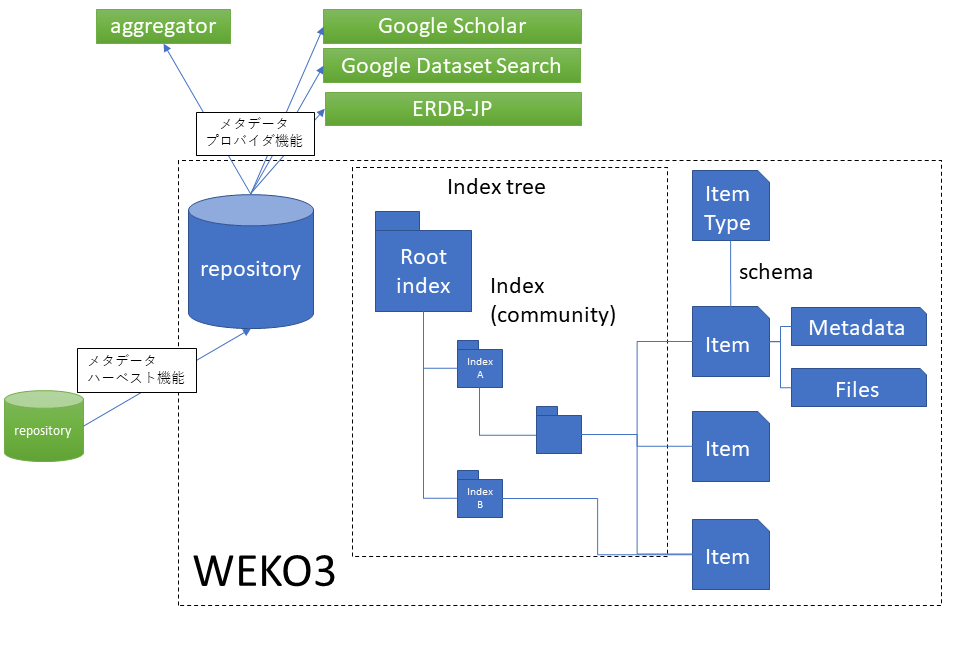

図 1-1 システムのデータ管理

アイテムを登録する場合、データ登録者はワークフローを作成してアイテムを登録し、査読者や承認者の承認を経てデータを登録・公開をします。

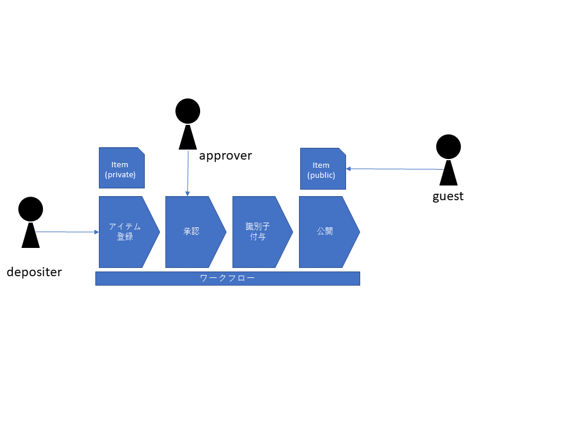

図1-2 データの登録

### 用語解説

システムで使用する用語を説明します。

表 1‑1システムの用語

<table>
<thead>
<tr class="header">
<th>用語</th>
<th>意味</th>
</tr>
</thead>
<tbody>
<tr class="odd">
<td>DDI</td>
<td>
DDI（Data Documentation Initiative）は、データアーカイブの国際化や、共同利用・共同研究拠点といった事業の一環で利用する、社会調査メタデータの国際規格のメタデータスキーマです（https://ddialliance.org/）。

WEKO3モジュールでは、OAI-PMHのメタデータスキーマとしてDDIを使用できます。
</td>
</tr>
<tr class="even">
<td>DublinCore</td>
<td>国際標準（ISO 15836）のメタデータスキーマです（http://dublincore.org/）。WEKO3モジュールでは、OAI-PMHのメタデータスキーマとしてDublinCoreを使用できます。</td>
</tr>
<tr class="odd">
<td>JPCOAR</td>
<td>
オープンアクセスリポジトリ推進協会（JPCOAR : Japan Consortium for Open Access Repositories）が策定したメタデータスキーマです（https://schema.irdb.nii.ac.jp/ja）。

WEKO3モジュールでは、OAI-PMHのメタデータスキーマとしてJPCOARを使用できます。
</td>
</tr>
<tr class="even">
<td>junii2</td>
<td>
国立情報学研究所（NII）が公開したメタデータスキーマです（http://www.nii.ac.jp/irp/archive/system/junii2.html）。

WEKO3モジュールでは、OAI-PMHのメタデータスキーマとしてjunii2は使用しません。
</td>
</tr>
<tr class="odd">
<td>OAI-PMH</td>
<td>OAI-PMH（The Open Archives Initiative Protocol for Metadata Harvesting）は、リポジトリ間でメタデータを交換する目的でOpen Archives Initiativeによって開発されたプロトコルです（http://www.openarchives.org/OAI/openarchivesprotocol.html）。リポジトリを含む外部システムは、WEKO3モジュールに登録されたアイテムのメタデータをOAI-PMHを利用して収集できます。</td>
</tr>
<tr class="even">
<td>UI</td>
<td>User Interfaceの略語です。システムとユーザの間で情報をやりとりするためのインターフェイスです。</td>
</tr>
<tr class="odd">
<td>WEKO3リポジトリ</td>
<td>WEKO3モジュールおよび関連ソフトを用いて構築したリポジトリです。</td>
</tr>
<tr class="even">
<td>アイテム</td>
<td>
リポジトリに保管する情報の１単位です。アイテムを構成するデータは、コンテンツファイルおよびメタデータです。メタデータには、メタデータスキーマに規定されている記述項目や記述形式に準拠した情報が記載されています。

各アイテムにはWEKO3リポジトリ内で一意となるアイテムIDが割り当てられます。アイテムは1つのアイテムタイプに紐付いており、複数のアイテムタイプと紐付けることはできません。

異なるメタデータで構成させるアイテムを登録したい場合、新たなアイテムタイプを作成することで対応できます。
</td>
</tr>
</tbody>
</table>

<table>
<thead>
<tr class="header">
<th>アイテムタイプ</th>
<th>
アイテムに登録するメタデータのデータ型を定義します。アイテムタイプは、JPCOARなどのメタデータスキーマで規定される要素から構成されます。

リポジトリ管理者はアイテムに必要なメタデータを検討し、アイテムタイプを独自に作成します。

例）

紀要論文と研究データをリポジトリに保管する場合、紀要論文のメタデータ項目と研究データのメタデータ項目は異なります。このような場合に、紀要論文向けのアイテムタイプと、研究データ向けのアイテムタイプをそれぞれ作成できます。
</th>
</tr>
</thead>
<tbody>
<tr class="odd">
<td>インデックス</td>
<td>WEKO3リポジトリに登録したアイテムをまとめる単位（カテゴリ）です。WEKO3リポジトリに登録したアイテムは必ず1つ以上のインデックスに所属します。インデックスは複数の子インデックスとアイテムを持つことができます。</td>
</tr>
<tr class="even">
<td>インデックスツリー</td>
<td>入れ子的に作成されたインデックスのツリー構造です。１つのWEKO3リポジトリは１つのリポジトリツリーを持ちます。</td>
</tr>
<tr class="odd">
<td>コミュニティ</td>
<td>リポジトリにアクセスできるユーザのグループです。コミュニティのユーザに限定したアイテムの公開などができます。</td>
</tr>
<tr class="even">
<td>コミュニティ管理者</td>
<td>コミュニティを管理するロールを持つユーザです。</td>
</tr>
<tr class="odd">
<td>コンテンツ</td>
<td>リポジトリに登録している研究論文や資料などの研究データです。本マニュアルではアイテムと同じ意味で使用します。</td>
</tr>
<tr class="even">
<td>コンテンツファイル</td>
<td>アイテムを構成する論文などのファイルを指します。</td>
</tr>
<tr class="odd">
<td>システム</td>
<td>WEKO3システムです。</td>
</tr>
<tr class="even">
<td>システム管理者</td>
<td>システムを管理するロールを持つユーザです。</td>
</tr>
<tr class="odd">
<td>スキーマ</td>
<td>リポジトリのデータベースの構造の定義です。データベースを構成するテーブルやリストといったオブジェクトの関係を定義しています。</td>
</tr>
<tr class="even">
<td>ダイアログ</td>
<td>主にメッセージおよび注意喚起の表示に使用するUIです。表示中も画面に表示したUIの操作を受け付けます。</td>
</tr>
<tr class="odd">
<td>登録ユーザ</td>
<td>保存されている学術成果を参照したり、学術の成果のデータをリポジトリに登録したりすることができるユーザです。</td>
</tr>
<tr class="even">
<td>ハーベスティング</td>
<td>外部システムがリポジトリのデータを定期的に収集することです。専用のプロトコルを使用します。メタデータをプロトコルにマッピングする必要があります。</td>
</tr>
<tr class="odd">
<td>フロー</td>
<td>アイテムをシステムに保存するまでの一連の作業をグループ化したものです。リポジトリへのデータの追加、メタデータの入力、査読・承認といった作業を定義します。</td>
</tr>
<tr class="even">
<td>メタデータ</td>
<td>アイテムに関連した情報です。例えば、タイトル、著者、ファイルサイズなどの情報が該当します。メタデータは、内容メタデータ、管理メタデータから構成されます。内容メタデータは、アイテムを要約した内容です。管理メタデータは、内容メタデータの作成者や、アイテムのアクセス数などの情報です。</td>
</tr>
<tr class="odd">
<td>リポジトリ</td>
<td>
大学とその構成員が創造したデジタル資料の管理や発信を行うために、大学がそのコミュニティの構成員に提供する一連のサービスです。原則として大学や学術団体（1機関）が1つのリポジトリを運用することができます。

このマニュアルでは、研究データ（アイテム）とそのメタデータを保管する領域の意味で使用しています。
</td>
</tr>
<tr class="even">
<td>リポジトリ管理者</td>
<td>リポジトリを管理するロールを持つユーザです。WEKO3モジュールの設定、インデックスツリー設定、アイテムタイプ設定ができます。</td>
</tr>
</tbody>
</table>

<table>
<thead>
<tr class="header">
<th>ログイン</th>
<th>コンピュータやインターネット上の様々なサービスを利用する際に、予め登録しておいたアカウント情報を用いて個々人のデータにアクセスする認証行為を指します。</th>
</tr>
</thead>
<tbody>
<tr class="odd">
<td>ログアウト</td>
<td>ログインによって認証された個々人のデータにアクセスするための権限を失効することです。</td>
</tr>
<tr class="even">
<td>ロール</td>
<td>システムやリポジトリなどを操作するための権限です。追加・変更・削除が可能です。</td>
</tr>
<tr class="odd">
<td>ワークフロー</td>
<td>
業務の一連の処理手続きを定義すること、またその業務の一連の流れを指します。WEKO3リポジトリでは、

リポジトリへのデータの追加、メタデータの入力、査読・承認といった作業（アイテムの登録から公開まで）の処理の流れを指します。
</td>
</tr>
<tr class="even">
<td>異体字</td>
<td>
旧字などで、読み方と意味が同じで表記の異なる字体、文字のことです。

例）「会」と「會」、「一」と「壱」など。
</td>
</tr>
</tbody>
</table>

### システムの機能

システムの機能を次の表に示します。

表 1‑2システムのデータ登録・閲覧に関する機能

| 機能          | 説明                                                                                              |
| ----------- | ----------------------------------------------------------------------------------------------- |
| アイテム一覧表示    | システムに登録されているアイテムを一覧で表示できます。一覧から選択されたアイテムの詳細情報を表示します。                                            |
| アイテム詳細表示    | アイテムのメタデータを表示できます。また、アイテムを構成する研究データのファイルをダウンロードできます。                                            |
| ランキング表示     | アイテムの参照回数などの統計情報を集計して、ランキングを表示できます。                                                             |
| インデックスツリー検索 | インデックスツリーのインデックス名を選択して、インデックス名に属するアイテムを一覧表示できます。                                                |
| キーワード検索     | キーワードを指定してアイテムの検索ができます。検索結果は、キーワードを含むアイテムを一覧表示します。検索対象は、アイテムのメタデータとコンテンツファイルです。                 |
| アイテム登録・公開   | 研究データや関連する資料、論文等を登録して、公開することができます。コンテンツファイルとそのメタデータは、アイテムという単位でリポジトリに登録されます。メタデータのみ登録することもできます。 |
| ワークフロー      | アイテムを登録するときにワークフローを設定し、査読・承認、そして公開という段階で処理します。承認待ちとなっているアイテムを一覧表示することもできます。                     |
| アイテム編集・削除   | いったん登録したアイテムの編集や削除ができます。                                                                        |

### 画面説明

#### ホーム画面

システムの［ホーム］画面を説明します。

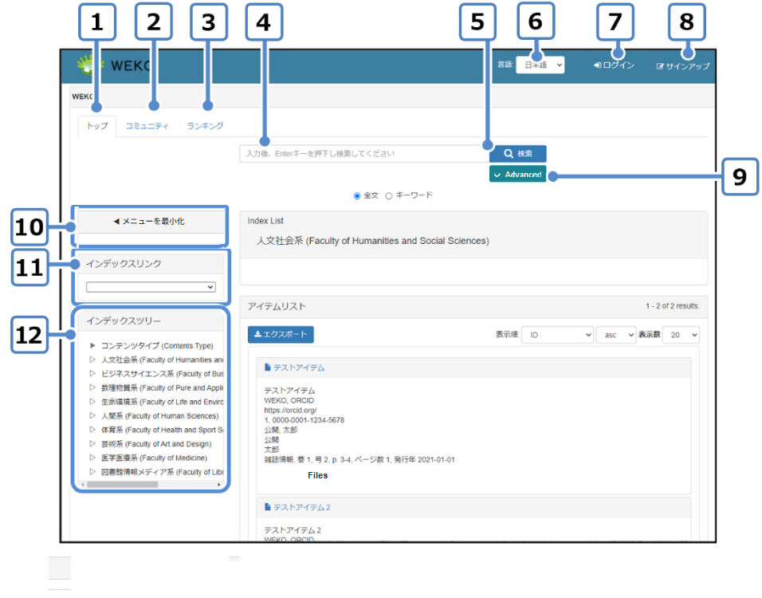

<table>
<thead>
<tr class="header">
<th>表 1‑3［ホーム］画面の項目と説明</th>
<th></th>
<th></th>
</tr>
</thead>
<tbody>
<tr class="odd">
<td>項番</td>
<td>項目</td>
<td>説明</td>
</tr>
<tr class="even">
<td>1</td>
<td>［トップ］タブ</td>
<td>
アイテム検索を実施します。詳細については、「3. アイテムを検索する」を参照してください。

クリックすると、［ホーム］画面に遷移します。
</td>
</tr>
<tr class="odd">
<td>2</td>
<td>［コミュニティ］タブ</td>
<td>コミュニティが確認できます。詳細については、「. コミュニティを確認する」を参照してください。</td>
</tr>
<tr class="even">
<td>3</td>
<td>［ランキング］タブ</td>
<td>アイテムの閲覧回数やファイルのダウンロード回数などのランキングを確認できます。詳細については、「3.2 ランキングで検索する」を参照してください。</td>
</tr>
<tr class="odd">
<td>4</td>
<td>［検索］テキストボックス</td>
<td>キーワード検索の条件を指定します。詳細については、「3.3 キーワードで検索する」を参照してください。</td>
</tr>
<tr class="even">
<td>5</td>
<td>［］ボタン</td>
<td>簡易検索ボタンです。詳細については、「3.3 キーワードで検索する」の「簡易検索」を参照してください。</td>
</tr>
<tr class="odd">
<td>6</td>
<td>［言語］プルダウンリスト</td>
<td>画面を表示する言語を指定します。詳細については、「2.1 ［ホーム］画面を表示する」を参照してください。</td>
</tr>
<tr class="even">
<td>7</td>
<td>［］</td>
<td>ログインを実施します。詳細については、「2.2 ログインする」を参照してください。</td>
</tr>
<tr class="odd">
<td>8</td>
<td>［］</td>
<td>アカウント登録を実施します。詳細については、「2.5 アカウントを登録する」を参照してください。</td>
</tr>
<tr class="even">
<td>9</td>
<td>［］ボタン</td>
<td>詳細検索ボタンです。詳細については、「3.3 キーワードで検索する」の「詳細検索」を参照してください。</td>
</tr>
<tr class="odd">
<td>10</td>
<td>［メニューを最小化］ボタン</td>
<td>インデックスリンク、インデックスツリーなどのメニューが表示・非表示できます。</td>
</tr>
<tr class="odd">
<td>11</td>
<td>［Index Link］画面</td>
<td>インデックスリンクが表示されます。</td>
</tr>
<tr class="even">
<td>12</td>
<td>［インデックスツリー］画面</td>
<td>インデックスツリーにインデックスリストが表示されます。</td>
</tr>
</tbody>
</table>

#### ログイン画面

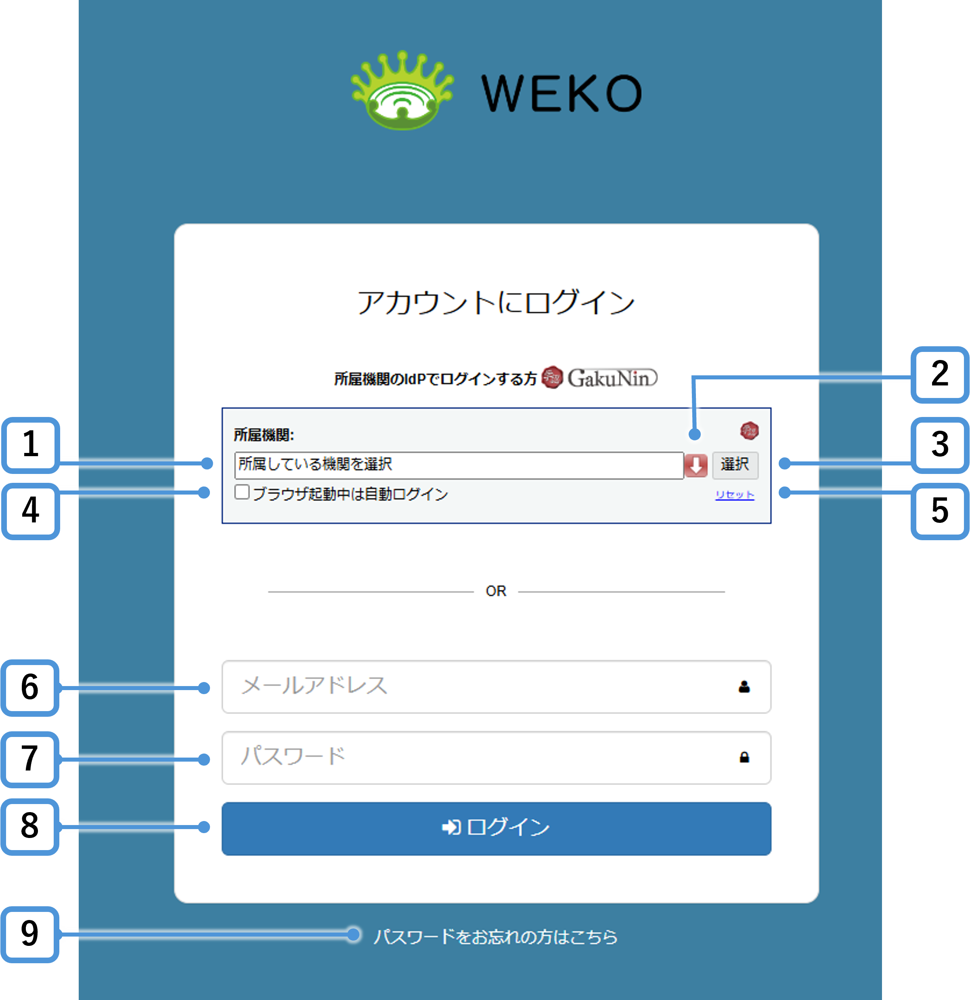

表 2‑1［ログイン］画面の項目と説明

| 項番 | 項目                                          | 説明                                                                                                             |
| -- | ------------------------------------------- | -------------------------------------------------------------------------------------------------------------- |
| 1  | ［所属機関］テキストボックス                                                  | 所属機関を入力します。入力すると、ヒットする所属機関の候補一覧に自動表示されます。                         |
| 2  | ［］「」ボタン | クリックすると、所属機関一覧が表示・非表示されます。詳細については、「図 2-2［所属機関］プルダウンリスト」を参照してください。 |
| 3  | ［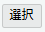］ボタン                               | クリックすると、選択した所属機関のログイン画面に移動します。                                    |
| 4  | ［ブラウザ起動中は自動ログイン］チェックボックス                                        | チェックを入れると、ブラウザ起動中に自動ログインされます。                                     |
| 5  | ［リセット］リンク                                                      | クリックすると、［所属機関］テキストボックスに入力した内容が削除されます。                             |
| 6  | ［アカウント］テキストボックス                             | ログインしたい一般閲覧者のアカウントを入力します。入力フォーマットは「*XXXXX*＠*XXX*.*XXX*」の形式で指定します。半角英数字、ハイフン（-）、アンダーバー（\_）を使用できます。16文字まで入力できます。 |
| 7  | ［パスワード］テキストボックス                             | 入力したメールアドレスのパスワードを入力します。6～16文字（半角英数字だけ）で入力してください。                                                              |
| 8  | ［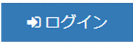］ボタン | クリックすると、入力したメールアドレスとパスワードでログインします。システムの［ホーム］画面が表示されます。                                                         |
| 9  | ［パスワードをお忘れの方はこちら］リンク                        | クリックすると、パスワードの再設定ができます。詳細については、「2.4 パスワードを変更する」を参照してください。                                                      |

#### 学認Embedded DSのログイン画面 パターン1

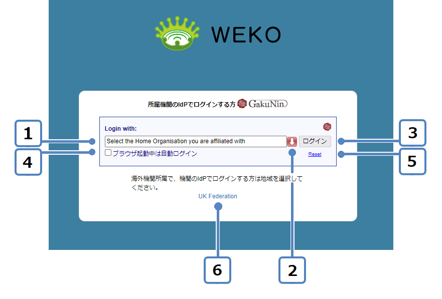

表 2‑2［学認Embedded DSのログイン（パターン①）］画面の項目と説明

| 項番 | 項目                                                              | 説明                                                                |
| -- | --------------------------------------------------------------- | ----------------------------------------------------------------- |
| 1  | ［所属機関］テキストボックス                                                  | 所属機関を入力します。入力すると、ヒットする所属機関の候補一覧に自動表示されます。                         |
| 2  | ［］「」ボタン | クリックすると、所属機関一覧が表示・非表示されます。詳細については、「図 2-2［所属機関］プルダウンリスト」を参照してください。 |
| 3  | ［］ボタン                               | クリックすると、選択した所属機関のログイン画面に移動します。                                    |
| 4  | ［ブラウザ起動中は自動ログイン］チェックボックス                                        | チェックを入れると、ブラウザ起動中に自動ログインされます。                                     |
| 5  | ［Reset］リンク                                                      | クリックすると、［所属機関］テキストボックスに入力した内容が削除されます。                             |
| 6  | ［UK Federation］リンク                                              | クリックすると、定義されている組織選択画面に移動します。                                      |

図2-2［所属機関］プルダウンリスト

#### 学認Embedded DSのログイン画面 パターン2

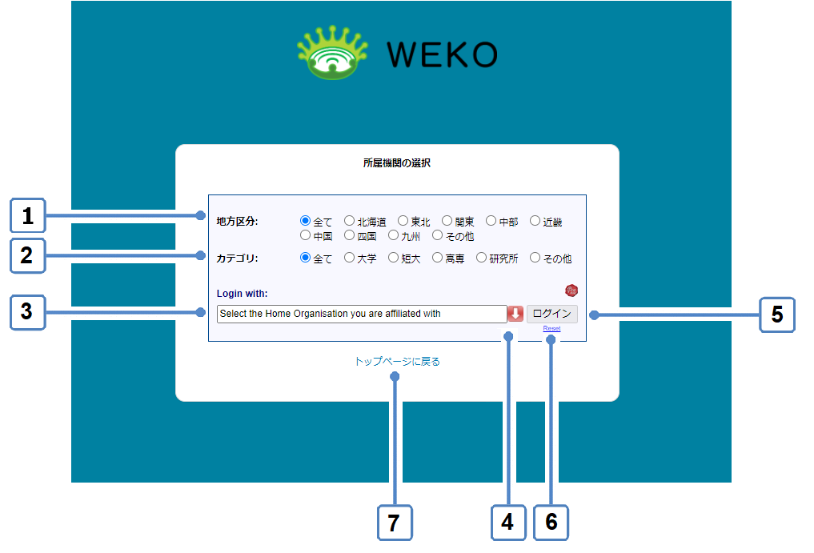

表 2‑3［学認Embedded DSのログイン（パターン②）］画面の項目と説明

<table>
<thead>
<tr class="header">
<th>項番</th>
<th>項目</th>
<th>説明</th>
</tr>
</thead>
<tbody>
<tr class="odd">
<td>1</td>
<td>［地方区分］ラジオボタン</td>
<td>
日本の地方を選択します。

選択すると、選択した地方の所属機関が［所属機関］一覧に自動フィルターされます。
</td>
</tr>
<tr class="even">
<td>2</td>
<td>［カテゴリ］ラジオボタン</td>
<td>
所属機関のカテゴリを選択します。

選択すると、選択したカテゴリの所属機関が［所属機関］一覧に自動フィルターされます。
</td>
</tr>
<tr class="odd">
<td>3</td>
<td>［所属機関］テキストボックス</td>
<td>所属機関を入力します。入力すると、ヒットする所属機関の候補一覧に自動表示されます。</td>
</tr>
<tr class="even">
<td>4</td>
<td>［］「」ボタン</td>
<td>クリックすると、所属機関一覧が表示・非表示されます。詳細については、「図 2-2［所属機関］プルダウンリスト」を参照してください。</td>
</tr>
<tr class="odd">
<td>5</td>
<td>［］ボタン</td>
<td>クリックすると、選択した所属機関のログイン画面に移動します。</td>
</tr>
<tr class="even">
<td>6</td>
<td>［Reset］リンク</td>
<td>クリックすると、［所属機関］テキストボックスに入力した内容が削除されます。</td>
</tr>
<tr class="odd">
<td>7</td>
<td>［トップページに戻る］リンク</td>
<td>クリックすると、定義されている地域選択画面に移動します。</td>
</tr>
</tbody>
</table>

## ログインまたはログアウトする

この章では、システムにログインおよびログアウトする方法、またパスワードを変更する方法について説明します。

### ［ホーム］画面を表示する

ここでは、［ホーム］画面を表示する手順を説明します。

1.  ブラウザにシステムのURLを入力します。

2.  システムへのアクセスが成功すると、［ホーム］画面が表示されます。ログイン操作は「2.2 ログインする」を参照してください。

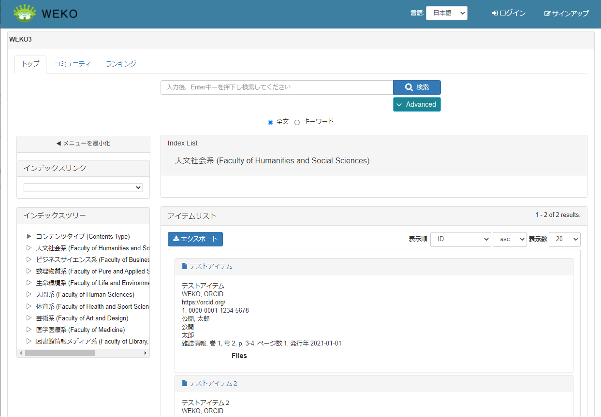

3.  画面右上の［言語］プルダウンリストから言語を選択します。表示言語が選択した言語に切り替わります。

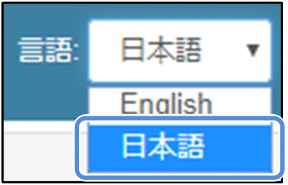

### ログインする

ここでは、システムにログインする手順を説明します。

1.  ［ホーム］画面右上の［］ボタンをクリックします。

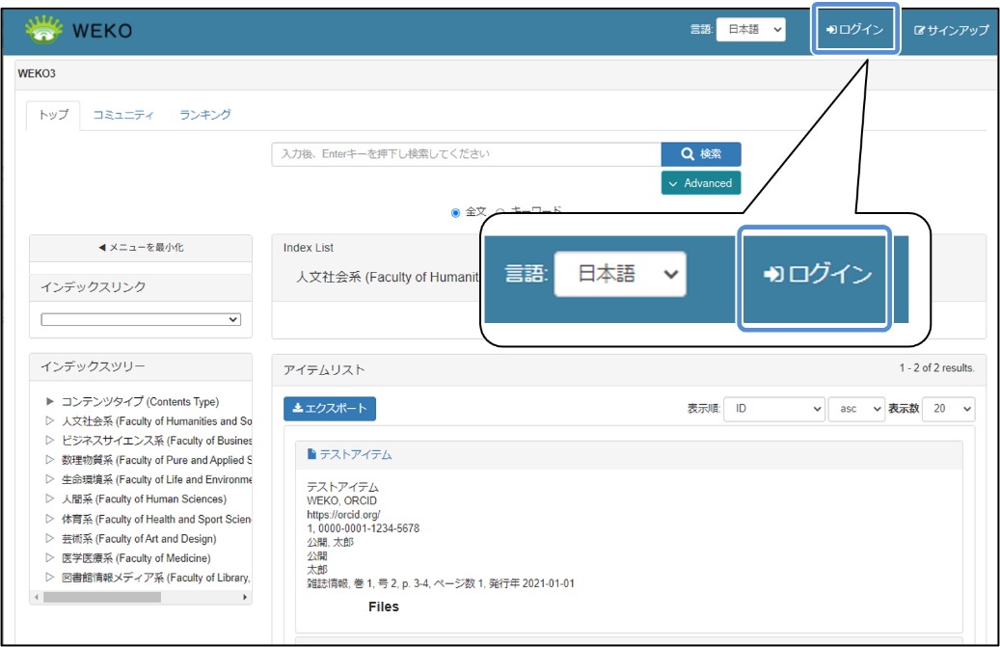

2.  ［ログイン］画面が表示されます。

3.  WEKO3の［ログイン］画面からログインします。

<!-- end list -->

1.  WEKO3の[［ログイン］画面](#ログイン画面)でアカウント情報を入力してログインします。

2.  ［］ボタンをクリックします。

3.  ログインに成功すると、 [ホーム画面](#ホーム画面) が表示されます。

<!-- end list -->

4.  Shibbolethで［ログイン］画面からログインします。

Shibbolethでログインする画面は、コンテンツファイルでの設定によって、JAIRO Cloudのログイン画面か、学認Embedded DSのログイン画面（[パターン①](#学認embedded-dsのログイン画面-パターン1)、[パターン②](#学認embedded-dsのログイン画面-パターン2)）が表示されます。

#### JAIRO Cloudのログイン画面からログインする

1.  JAIRO Cloudのログイン画面でアカウント情報を入力して、ログインします。

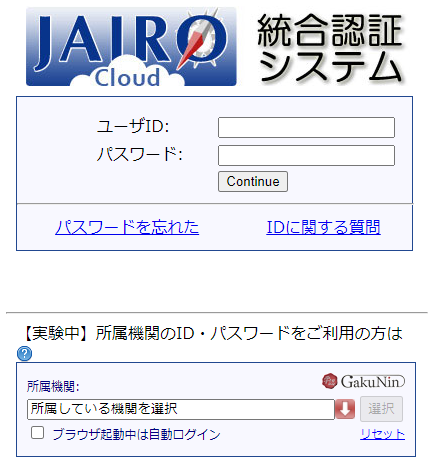

図2-1 ［JAIRO Cloudのログイン画面］

注：Shibbolethでログインするユーザ情報に従って、WEKO3のアカウントが自動作成されます。その際のユーザロールは以下のように割り当てられます。

  - 「管理者」→ システム管理者ロール

  - 「図書館員」→ リポジトリ管理者ロール

  - 「教員」→ 一般利用者ロール
    
#### 学認Embedded DSのログイン画面（パターン①）からログインする

<!-- end list -->

1.  [学認Embedded DSのログイン画面（パターン①）](#学認embedded-dsのログイン画面-パターン1)でログインします。

2.  選択された所属機関のログイン画面に、アカウント情報を入力して、ログインします。

3.  ログインに成功すると、WEKO3のホーム画面が表示されます。
    

#### 学認Embedded DSのログイン画面（パターン②）からログインする

<!-- end list -->

1.  [学認Embedded DSのログイン画面（パターン②）](#学認embedded-dsのログイン画面-パターン2) でログインします。

2.  選択された所属機関のログイン画面に、アカウント情報を入力して、ログインします。

3.  ログインに成功すると、WEKO3のホーム画面が表示されます。

注：学認Embedded DS経由でのログイン時にGakuNin mAP機能からの情報に従って、ユーザーに対してロールおよびグループを付与します。

  - ロール名、グループ名の定義は設定ファイルに従って定義されます。 定義されたグループ名は指定の属性に含まれます。

  - 学認によるログインユーザーはGakuNin mAP機能により定義されたグループによるアクセス制御を行います。

### ログアウトする

ここでは、システムからログアウトする手順を説明します。

1.  ［ホーム］画面右上のアカウント名右の［］をクリックすると、プルダウンメニューが表示されます。

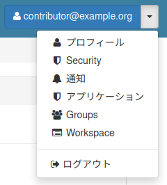

2.  ［ログアウト］をクリックすると、システムからログアウトすることができます。

### パスワードを変更する

ここでは、アカウントに設定されているパスワードを変更する手順を説明します。

1.  ［ホーム］画面右上のアカウント名右の［］をクリックすると、プルダウンメニューが表示されます。

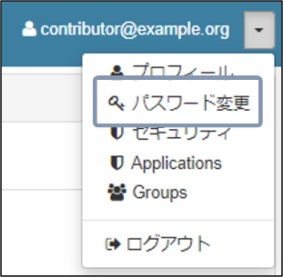

2.  「パスワード変更」をクリックすると、［パスワード変更］画面が表示されます。

3.  表示された［パスワード変更］画面に変更後パスワードを入力します。

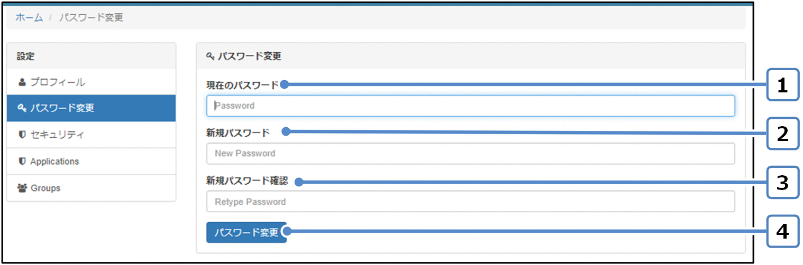

図 2-3［パスワード変更］画面

表 2‑4［パスワード変更］画面の項目と説明

| 項番 | 項目                                          | 説明                                            |
| -- | ------------------------------------------- | --------------------------------------------- |
| 1  | ［現在のパスワード］テキストボックス                          | 現在設定されているパスワードを入力します。                         |
| 2  | ［新規パスワード］テキストボックス                           | 新しいパスワードを入力します。6～16文字（半角英数字だけ）で入力してください。      |
| 3  | ［新規パスワード確認］テキストボックス                         | ［新規パスワード］で設定した値が正しいか確認するため、再度、新しいパスワードを入力します。 |
| 4  | ［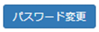］ボタン | クリックすると入力された情報を反映し、パスワードを変更します。               |

4.  ［］ボタンをクリックします。パスワードが変更されます。

### アカウントを登録する

ここでは、アカウントを新規登録する手順を説明します。

1.  ［ホーム］画面右上の［］をクリックすると、［アカウント登録］画面が表示されます。

<!-- end list -->

2.  表示された［アカウント登録］画面にアカウント名およびパスワードを入力します。

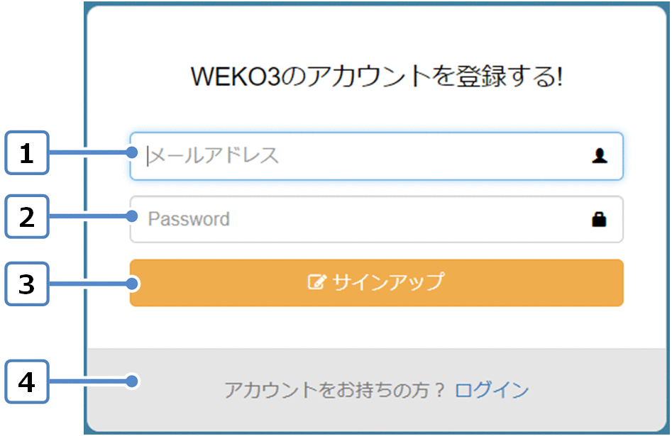

表 2‑5［アカウント登録］画面の項目と説明

| 項番 | 項目                                                      | 説明                                                                                                 |
| -- | ------------------------------------------------------- | -------------------------------------------------------------------------------------------------- |
| 1  | ［メールアドレス］テキストボックス                                       | メールアドレスを入力します。入力フォーマットは「*XXXXX*＠*XXX.XXX*」の形式で指定します。半角英数字、ハイフン（-）、アンダーバー（\_）を使用できます。255文字まで入力できます。 |
| 2  | ［パスワード］テキストボックス                                         | 新しいパスワードを入力します。6～255文字（半角英数字だけ）で入力してください。                                                          |
| 3  | ［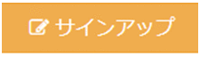］ボタン             | クリックすると、アカウントが登録されます。                                                                              |
| 4  | アカウントをお持ちの方？［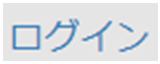］リンク | クリックすると、［ログイン］画面が表示されます。ログインして、作業を継続します。                                                           |

3.  ［］ボタンをクリックすると、登録したアカウントでシステムにログインします。

## アイテムを検索する

この章では、アイテムを検索するための操作手順について説明します。

### インデックスで検索する

ここでは、［ホーム］画面のインデックスリンクまたはインデックスツリーで、アイテムを検索する手順を説明します。

### インデックスリンク検索

インデックスリンク検索は、インデックスリンクを表示する設定が「有効」の場合に検索できます。詳細については、システム管理ガイドの「16.2 インデックスリンクを表示する」を参照してください。

ここではインデックスリンクでアイテムを検索する手順を説明します。

1.  ［ホーム］画面の［TOP］タブをクリックすると、インデックスリンクが表示されます。

2.  ［インデックスリンク］のプルダウンリストで、インデックス名を選択します。

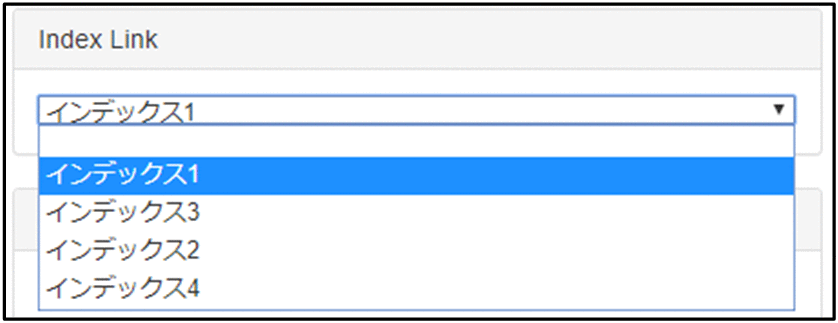

3.  検索結果が［アイテムリスト］画面に表示されます。

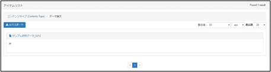

詳細については、「3.1 インデックスで検索する」の「アイテムリストを表示する」を参照してください。

#### インデックスツリー検索

インデックスツリーでアイテムを検索する手順を説明します。

1.  ［ホーム］画面の［TOP］タブをクリックします。

2.  インデックスツリーが表示されます。

インデックスツリーでの検索方法は次のいずれかの手順で検索できます。

1.  アイテムリストから検索する

<!-- end list -->

1.  ［インデックスツリー］のインデックス名をクリックします。

2.  アイテムの検索が実行されます。検索結果が［アイテムリスト］画面に表示されます。
    
    詳細については、「3.1 インデックスで検索する」の「アイテムリストを表示する」を参照してください。

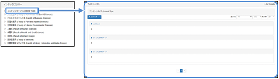

2.  インデックスリストから検索する

<!-- end list -->

1.  ［インデックスツリー］のインデックス名をクリックします。
    
    インデックスの配下に子インデックスが設定されている場合、［インデックスリスト］画面が表示されます。

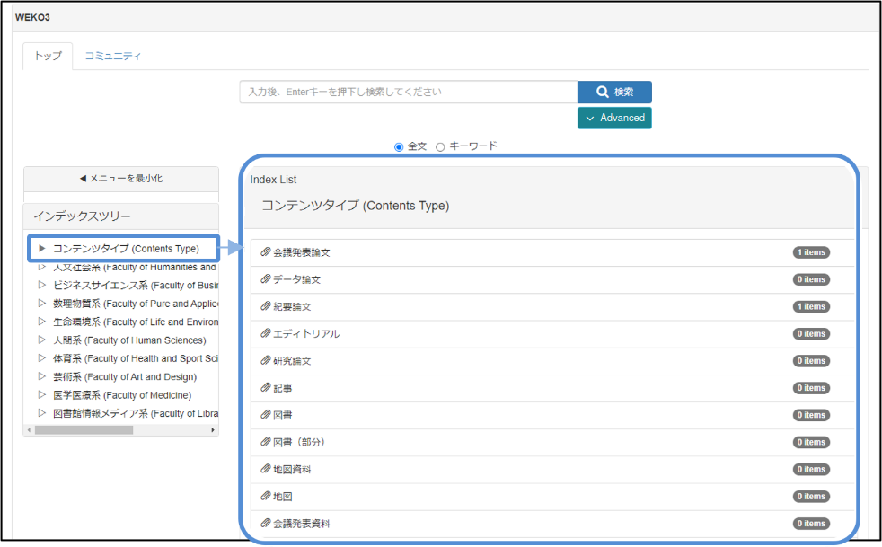

2.  ［インデックスリスト］画面に、インデックスに属する子インデックス一覧が表示されます。
    
    ゲストユーザに対しては、非公開インデックスは表示されません。

    【v2.1.0】注：インデックスツリー・インデックスリストには、閲覧できるインデックスだけが表示されます。インデックスを閲覧できるのは、インデックスが公開されていて（公開日が設定されている場合は公開日を過ぎていて）、かつインデックスの閲覧権限に設定されたロールを1つ以上持ち、さらに閲覧権限に設定されたグループのいずれかに所属している利用者です。グループに所属していないログインユーザおよびゲストユーザは「No Group」に所属しているものとして判定されます。閲覧権限の設定については、システム管理ガイドを参照してください。

3.  各インデックスに、本インデックスに属するアイテム件数が表示されます。公開アイテム及び非公開アイテムの件数が以下の通りに数えられます。

<!-- end list -->

  - > 公開アイテムとして数えるアイテムは、

<!-- end list -->

  - > 公開インデックスに属する公開アイテム

<!-- end list -->

  - > 非公開アイテムとして数えるアイテムは、

<!-- end list -->

  - > 非公開インデックスに属する公開・非公開アイテム

  - > 公開インデックスに属する非公開アイテム

<!-- end list -->

4.  ［インデックスリスト］でインデックス名をクリックします。
    
    アイテムの検索が実行されます。検索結果が［アイテムリスト］画面に表示されます。詳細については、「3.1 インデックスで検索する」の「アイテムリストを表示する」を参照してください。
    
    3.  インデックスツリーから検索する

<!-- end list -->

1.  ［インデックスツリー］の［］をクリックします。
    
    ［インデックスツリーのインデックスリスト］画面が表示されます。

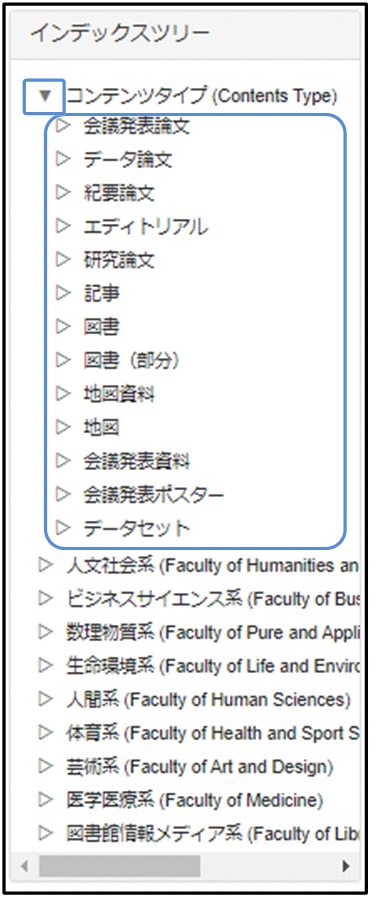

2.  ［インデックスリスト］でインデックス名をクリックします。
    
    アイテムの検索が実行されます。検索結果が［アイテムリスト］画面に表示されます。詳細については、「3.1 インデックスで検索する」の「アイテムリストを表示する」を参照してください。

#### 雑誌情報を表示する

インデックスに設定された雑誌情報を表示します。詳細については、システム管理ガイドの「4.2 雑誌情報を管理する」を参照してください。

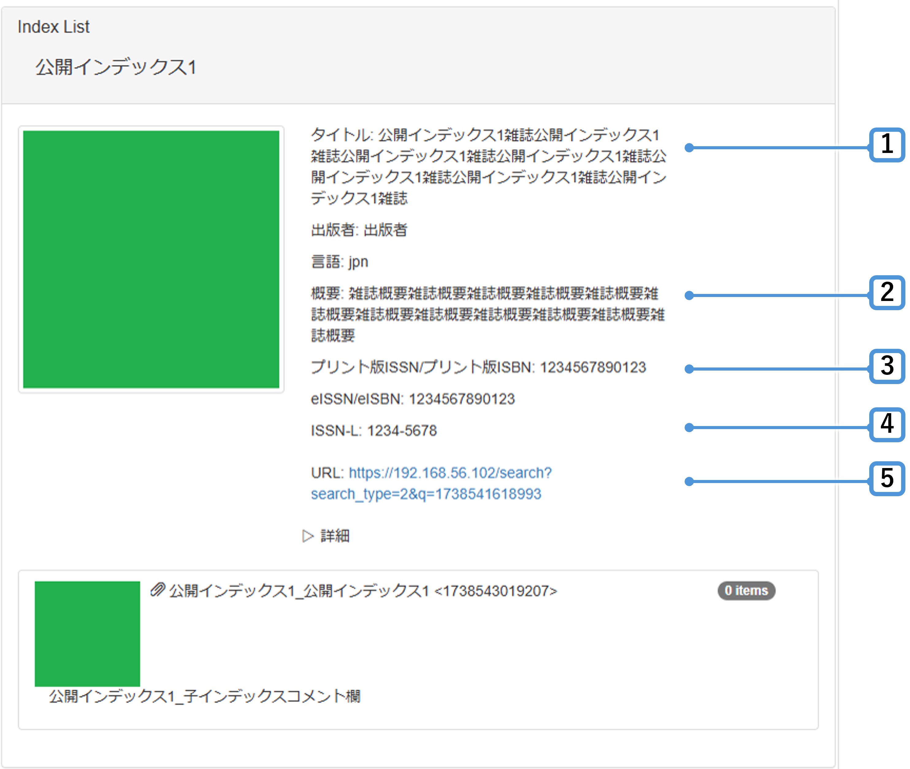

雑誌情報は、雑誌情報が設定され出力対象となっているインデックスで検索したときに、アイテムリストの上に表示されます。各項目は「項目名: 値」の形式で表示され、値が設定されている項目だけが表示されます。

| 項番 | 項目              | 説明                                   |
| --- | --- | ---|
| 1    | サムネイル   | インデックスにサムネイルが設定されている場合、サムネイル画像が表示されます。|
| 2    | ［タイトル］欄   | 雑誌情報の「タイトル」「出版者」「言語」「eISSN/eISBN」と、インデックスのコメントが表示されます。|
| 3    | URL  | 当該インデックスのURLが表示されます。|
| 4    | ［詳細］リンク  | クリックすると、「プリント版ISSN/プリント版ISBN」「NCID」「資料種別」「カバー範囲」、提供巻号など、その他の雑誌情報が展開して表示されます。|

#### アイテムリストを表示する

アイテムリストを一覧形式および目次形式で表示します。

1. アイテムリスト（一覧形式）

    検索結果をアイテムの一覧で表示します。デフォルトはこの形式で設定されています。アイテムのタイトルは、Web画面の表示言語にあわせて表示されます。

    表示順は「Web画面の表示言語＞英語＞アイテム登録時の１つ目の言語＞言語無しで登録した時の１つ目の値」となります。

    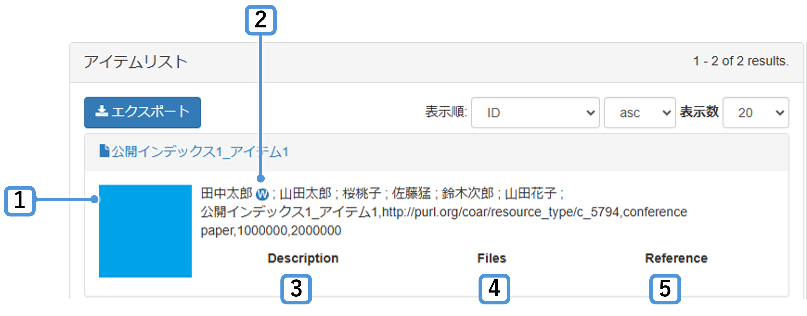

    <table>
    <thead>
    <tr>
    <th>項番</th>
    <th>項目</th>
    <th>説明</th>
    </tr>
    </thead>
    <tbody>
    <tr>
    <td>1</td>
    <td>サムネイル</td>
    <td>アイテムタイプのサムネイルプロパティのオプションで「Show List」が"ON"になっているときに、アイテムリストへアップロードされたサムネイルファイルを表示します。 ※アイテムに複数のサムネイルファイルがアップロードされている場合、アイテム詳細画面の１つ目のサムネイルファイルを表示します。</td>
    </tr>
    <tr>
    <td>2</td>
    <td>著者ID</td>
    <td>アイテムタイプの作成者プロパティのオプションで「Show List」が"ON"になっているときに、著者IDはアイコンで表示されます。</td>
    </tr>
    <tr>
    <td>3</td>
    <td>Description</td>
    <td>アイテムタイプのDescriptionプロパティのオプションで「Show List」が"ON"になっているときに表示されます。クリックすると項目下部にDescription情報が表示されます。</td>
    </tr>
    <tr>
    <td>4</td>
    <td>Files</td>
    <td>アイテムタイプのFilesプロパティのオプションで「Show List」が"ON"になっているときに表示されます。クリックすると項目下部にファイル情報が拡張子のリンク形式で表示されます（コンテンツファイルが無くURLのみ登録されている場合は"URL"と、拡張子が無いものは“unknown”と表示されます）。リンクをクリックすると、コンテンツファイルをダウンロードすることができます（コンテンツファイルが無くURLのみ登録されている場合はそのURLに遷移します）。また、登録されているコンテンツファイルが多い場合は、アイテムリストに「・・・」と表示されます。「・・・」をクリックすると、アイテム詳細画面が表示されます。</td>
    </tr>
    </tbody>
    </table>

   - Descriptionを表示する
        アイテムのDescription情報が表示されます。

    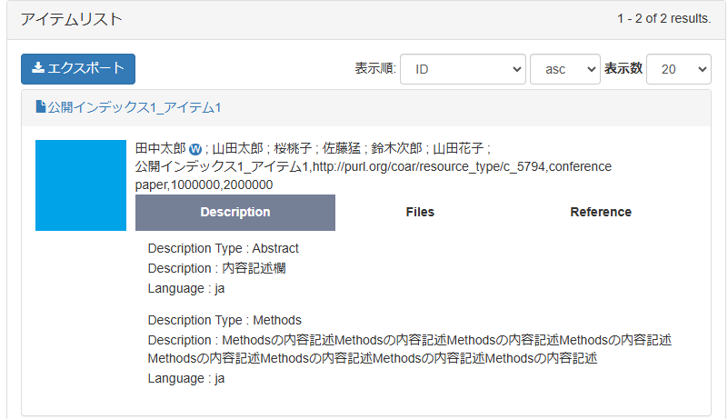

    - Filesを表示する
        アイテムのコンテンツファイルや本文URL情報が表示されます。

    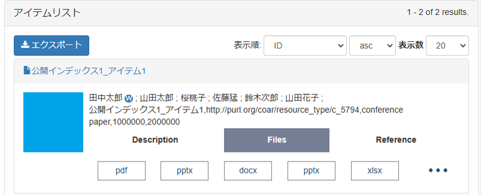

    - Referenceを表示する
        アイテムの関連識別子情報が表示されます。

    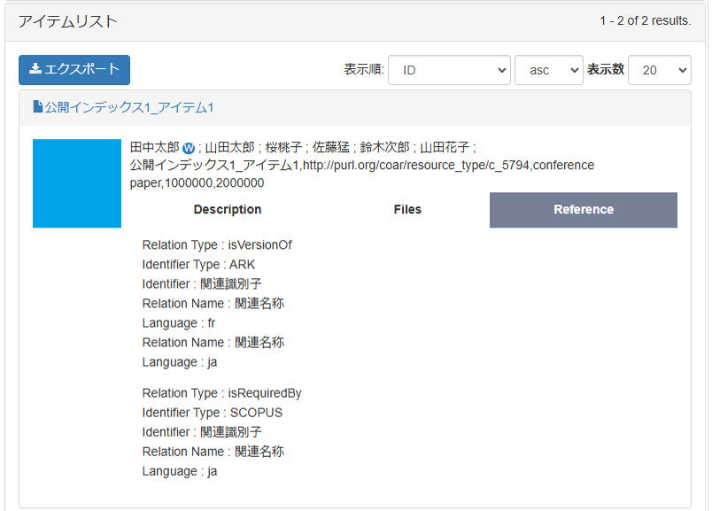

    表示順や表示件数の説明については「3.3 キーワードで検索する」の「簡易検索」を参照してください。

    1.  アイテムタイトルをクリックします。
        
        アイテム詳細画面が表示されます。
        
        画面項目の詳細については、「4 アイテムの詳細を表示する」を参照してください。

2.  アイテムリスト（目次形式）

    検索結果を見出しの一覧で表示します。この形式で表示するには、「システム管理ガイド」を参照してください。

    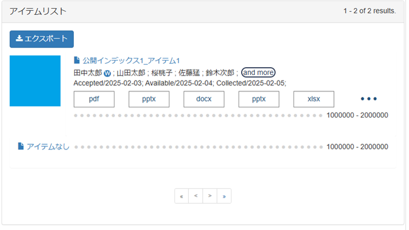

    1.  アイテムタイトルをクリックします。
        
        アイテム詳細画面が表示されます。詳細については、「4 アイテムの詳細を表示する」を参照してください。

### ランキングで検索する

ランキング検索は、ランキングを表示する設定が「オン」の場合に実施できます。詳細については、システム管理ガイドの「16.6 ランキング表示を設定する」を参照してください。

ここでは、ランキングでアイテムを検索する手順を説明します。

1.  ［ランキング］タブをクリックします。
    
    ［ランキング］画面が表示されます。

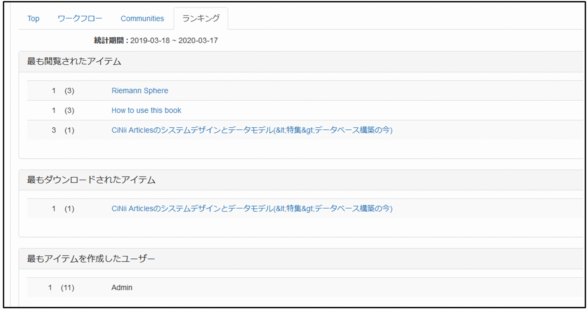

アイテムの閲覧回数やファイルのダウンロード回数、検索キーワードなどのランキングを閲覧できます。

#### 最も閲覧されたアイテム

公開中アイテムの閲覧回数によるランキングです。

アイテムタイトルおよび閲覧回数が表示されます。

1.  アイテムタイトルのリンクを選択します。
    
    その［アイテムの詳細］画面が表示されます。

2.  必要に応じて、ファイルをダウンロードします。

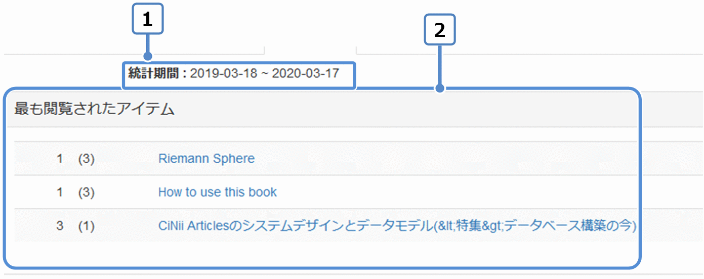

図 3-1［最も閲覧されたアイテム］画面

表 3‑1［最も閲覧されたアイテム］画面の項目と説明

| 項番 | 項目          | 説明                                                         |
| -- | ----------- | ---------------------------------------------------------- |
| 1  | 統計期間        | ランキングの統計期間が表示されます。表示フォーマットは、「*yyyy-mm-dd - yyyy-mm-dd*」です。 |
| 2  | 最も閲覧されたアイテム | 公開中アイテムの順位、閲覧回数、タイトルが表示されます。                               |

#### 最もダウンロードされたアイテム

公開中アイテムファイルのダウンロード回数によるランキングです。

アイテムタイトルおよびダウンロード回数が表示されます。

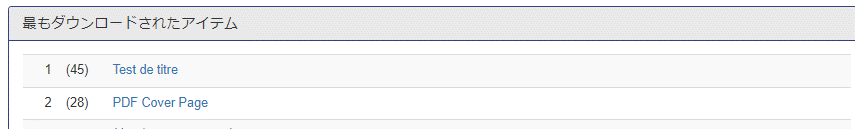

1.  アイテムタイトルのリンクを選択します。
    
    その［アイテムの詳細］画面が表示されます。

<!-- end list -->

2.  必要に応じて、ファイルをダウンロードします。

#### 最もアイテムを作成したユーザ

ユーザごとのアイテム作成数によるランキングです。

ユーザ名と作成したアイテム数が表示されます。

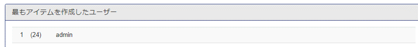

#### 最も検索されたキーワード

キーワードごとの検索回数によるランキングです。

検索されたキーワードおよび検索回数が表示されます。

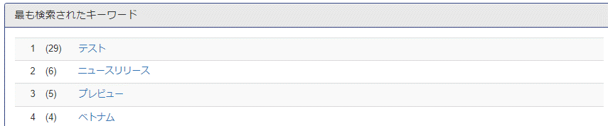

1.  キーワードを選択します。
    
    そのキーワードの検索結果画面が表示されます。

#### 新着アイテム

新たに公開されたアイテムが表示されます。

アイテムタイトルおよび公開日時が表示されます。

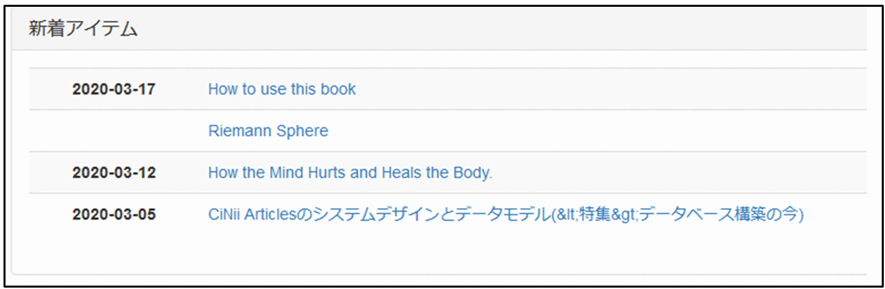

1.  アイテムタイトルのリンクを選択します。
    
    その［アイテムの詳細］画面が表示されます。

<!-- end list -->

2.  必要に応じて、ファイルをダウンロードします。

【補足】

・ランキング画面に以下のアイテムは表示されません。

‐削除済アイテム

‐アイテムが「非公開」に設定されているもの

‐アイテムの「公開日」が未来の日付のもの

・キーワードに何も入れずに検索しない場合(全検索)や空白スペースのみの検索は、検索キーワードには表示されません。また、検索キーワードとして入力された値はそのまま「最も検索されたキーワード」としてカウントされます。例えば「大人と子供」とキーワードで入力した場合は、そのまま「大人と子供」としてキーワードがカウントされます。（「大人」や「子供」だけのキーワードとは別のキーワードとなります）

#### キーワードで検索する

キーワード検索には、簡易検索と詳細検索があります。キーワードを指定して、アイテムを検索する手順を説明します。

#### 簡易検索

1.  ［TOP］タブをクリックします。
    
    キーワード検索テキストボックスが表示されます。
    
    キーワード検索テキストボックスにキーワードを入力後、検索方式を、［Full text］または［キーワード］のいずれかのラジオボタンを選択します。
    
    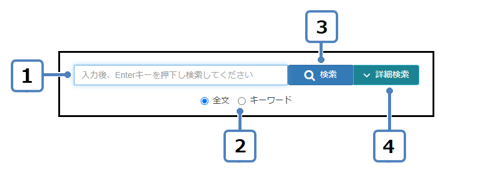
    
    表 3‑2［簡易検索］画面の項目と説明

<table>
<thead>
<tr class="header">
<th>項番</th>
<th>項目</th>
<th>説明</th>
</tr>
</thead>
<tbody>
<tr class="odd">
<td>1</td>
<td>キーワード検索テキストボックス</td>
<td>
アイテムを検索するためのキーワードを入力します。

以下の文字を含めた検索が可能です。

+ - = &amp;&amp; || ! ( ) { } [ ] ^ " ~ * ? : \ /

なお、「&lt;」「&gt;」を含めた検索はできません。

キーワードを「 OR 」または「 | 」 (どちらも前後にスペースが必要です)で区切ることで、OR検索を行うことが可能です。
</td>
</tr>
<tr class="even">
<td>2</td>
<td>検索方式ラジオボタン</td>
<td><ul>
<li>
検索方式が［全文］の場合
</li>
</ul>

登録されたアイテムのメタデータと登録されたコンテンツファイルの内容から検索されます。

<ul>
<li>
検索方式が［キーワード］の場合
</li>
</ul>

登録されたアイテムのメタデータから検索されます。
</td>
</tr>
<tr class="odd">
<td>3</td>
<td>［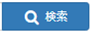］ボタン</td>
<td>クリックすると、キーワードで簡易検索を開始します。</td>
</tr>
<tr class="even">
<td>4</td>
<td>［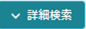］ボタン</td>
<td>クリックすると、［検索条件入力］画面が表示されます。詳細については、「3.3 キーワードで検索する」の「詳細検索」を参照してください。</td>
</tr>
</tbody>
</table>

2.  ［］ボタンをクリックします。
    
検索結果が表示されます。

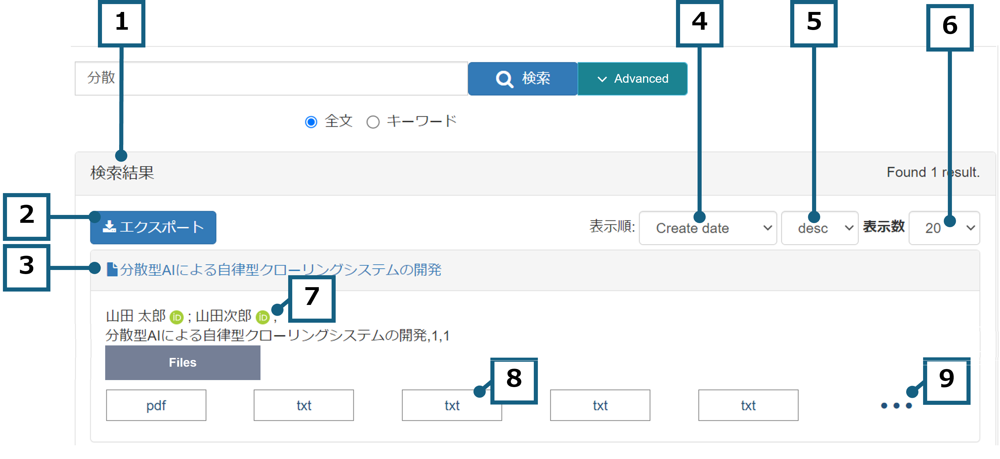

表 3‑3［検索結果］画面の項目と説明

<table>
<thead>
<tr class="header">
<th>項番</th>
<th>項目</th>
<th>説明</th>
</tr>
</thead>
<tbody>
<tr class="odd">
<td>1</td>
<td>検索結果</td>
<td>検索結果一覧が表示されます。</td>
</tr>
<tr class="even">
<td>2</td>
<td>［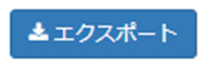］ボタン</td>
<td>クリックすると、［一括出力］画面に遷移します。アイテムの情報をエクスポートします。詳細については、「7. アイテムを一括出力する」を参照してください。</td>
</tr>
<tr class="odd">
<td>3</td>
<td>アイテム名</td>
<td>クリックすると、アイテム詳細画面に遷移します。詳細については、「4 アイテムの詳細を表示する」を参照してください。「図3-2 アイテムの詳細画面」を参照してください。</td>
</tr>
<tr class="even">
<td>4</td>
<td>［表示順］プルダウンリスト</td>
<td>
検索結果の表示順を［表示順］プルダウンリストから選択します。「図3-3 表示順プルダウンリストを参照してください。

検索結果表示設定で、一覧に表示する設定になっている表示順のみ表示されます。詳細については、システム管理ガイドの「16.12.2 検索結果の表示内容を設定する」を参照してください。
</td>
</tr>
<tr class="odd">
<td>5</td>
<td>［asc］プルダウンリスト</td>
<td>昇順、降順を［asc］プルダウンリストから選択します。「図3-4 ascプルダウンリスト」を参照してください。</td>
</tr>
<tr class="even">
<td>6</td>
<td>［表示数］プルダウンリスト</td>
<td>1ページ当たりの表示数を［表示数］プルダウンリストから選択します。「図3-5 表示数プルダウンリスト」を参照してください。</td>
</tr>
<tr class="odd">
<td>7</td>
<td>著者IDのアイコン</td>
<td>
著者に識別子が設定されている場合は、識別子名の先頭一文字をアイコンとして表示します。

ORCIDの場合はORCIDアイコンとなります。
</td>
</tr>
<tr class="odd">
<td>8</td>
<td>ファイルのリンク</td>
<td>
ファイルが添付されている場合はファイルのリンクを表示します。

</td>
</tr>
<tr class="odd">
<td>9</td>
<td>「・・・」リンク</td>
<td>
添付されているファイルが多い場合はこのリンクが表示されます。

このリンクをクリックすると、ファイルのリンクが展開されます。
</td>
</tr>
</tbody>
</table>

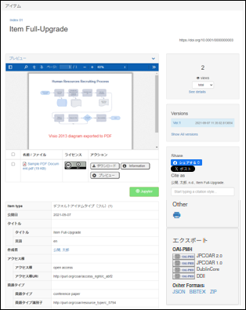

図 3-2アイテムの詳細画面

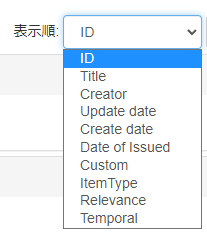

図 3-3表示順プルダウンリスト

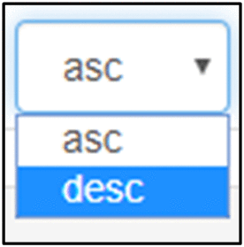

図 3-4 ascプルダウンリスト

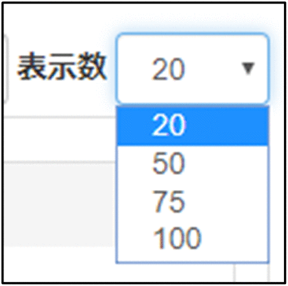

図 3-5表示数プルダウンリスト

#### 詳細検索

1.  ［TOP］タブをクリックします。キーワード検索テキストボックスが表示されます。

<!-- end list -->

2.  キーワード検索テキストボックスに入力後、検索方式を、［全文］か［キーワード］かいずれかのラジオボタンを選択します。

<!-- end list -->

3.  ［］ボタンをクリックします。

［検索条件入力］画面が表示されます。

本ボタンは［］に置換されます。

［］をクリックすることで、詳細検索エリアを非表示とします。本ボタンは［］に置換されます。

入力するテキストを「 OR 」または「 | 」 (どちらも前後にスペースが必要です)で区切ることで、OR検索を行うことが可能です。

簡易検索のテキストフィールドと詳細検索の各項目とのAND検索を行うことが可能です。

［ 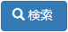］をクリックすると、設定した検索条件でアイテムの検索を実施します。検索結果がトップページでの「検索結果」エリアに表示されます。

> 注※

設定した検索条件を利用するには、詳細検索エリアの検索ボタンを利用してください。

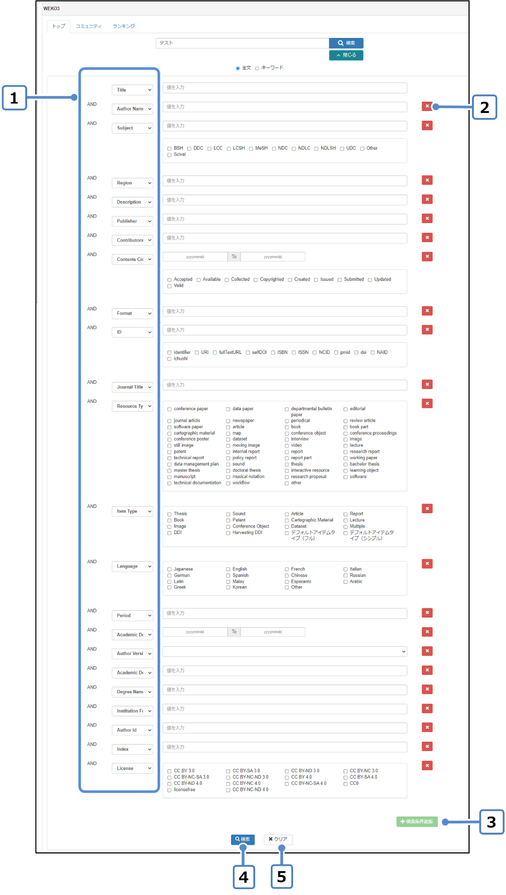

表 3‑4［検索条件入力］画面の項目と説明

<table>
<thead>
<tr class="header">
<th>項番</th>
<th>項目</th>
<th>説明</th>
</tr>
</thead>
<tbody>
<tr class="odd">
<td>1</td>
<td>［検索条件］プルダウンリスト</td>
<td>検索条件をプルダウンリストから選択します。</td>
</tr>
<tr class="even">
<td>2</td>
<td>［］ボタン</td>
<td>クリックすると、検索条件から削除されます。</td>
</tr>
<tr class="odd">
<td>3</td>
<td>［］ボタン</td>
<td>クリックすると、検索条件を追加できます。</td>
</tr>
<tr class="even">
<td>4</td>
<td>［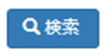］ボタン</td>
<td>クリックすると、検索が開始され［検索結果］画面が表示されます。「図3-6 ［検索結果］画面を参照してください。</td>
</tr>
<tr class="odd">
<td>5</td>
<td>［］ボタン</td>
<td>クリックすると、初期検索条件に戻ります。</td>
</tr>
<tr class="even">
<td>6</td>
<td>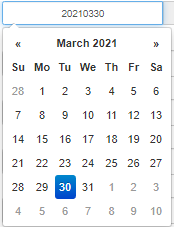</td>
<td>
検索条件の日付（Contents Created Date, Academic Degree Date）は次のどちらかの形式で値を入力します。

•yyyymmdd、yyyy形式で入力します。上記以外の入力値を指定した場合は「Field does not validate」を表示し、アイテム検索はできません(v1.0.7修正)。存在しない日付を入力した場合も「Field does not validate」エラーを発行します(v1.0.7修正)。

•エリアフォーカス時に表示するカレンダーで日付を選択して入力します。

•エリアフォーカス時に表示するカレンダーで日付を選択して入力します。
</td>
</tr>
</tbody>
</table>

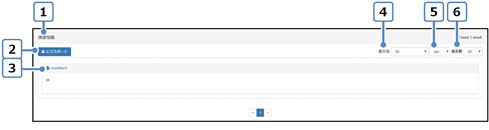

図 3-6［検索結果］画面

表 3‑5［検索結果］画面の項目と説明

| 項番 | 項目                                          | 説明                                                                          |
| -- | ------------------------------------------- | --------------------------------------------------------------------------- |
| 1  | 検索結果                                        | 検索結果一覧が表示されます。                                                              |
| 2  | ［］ボタン | クリックすると、［一括出力］画面に遷移します。アイテムの情報をエクスポートします。詳細については、「7. アイテムを一括出力する」を参照してください。 |
| 3  | アイテム名                                       | クリックすると、アイテム詳細画面に遷移します。「図3-2 アイテムの詳細画面」を参照してください。                           |
| 4  | ［表示順］プルダウンリスト                               | 検索結果の表示順を［表示順］プルダウンリストから選択します。「図3-3 表示順プルダウンリストを参照してください。                   |
| 5  | ［asc］プルダウンリスト                               | 昇順、降順を［asc］プルダウンリストから選択します。「図3-4 ascプルダウンリストを参照してください。                      |
| 6  | ［表示数］プルダウンリスト                               | 1ページ当たりの表示数を［表示数］プルダウンリストから選択します。「図3-5 表示数プルダウンリストを参照してください。                |

※　現在、\[Author Version Flag\]の「published」を指定しての検索は機能していません。

### 異体字検索について

意味と読みは同一であるが表記に差異のある語句による検索、いわゆる「異体字検索」をサポートしています。

例として、タイトルの検索キーワードとして「壱」を入力し、検索を実行したとき、「壱」の異体字である「一」などを含むアイテムも検索することができます。

注

日本語だけをサポートしています。英語での異体字検索は出来ません。

異体字のインデックス定義はNACSIS-CATの漢字統合インデックスを用いており、インデックス定義は下記サイトより取得可能です。

\[漢字統合インデックス提供に関するガイドライン\]  
https://www.nii.ac.jp/CAT-ILL/about/system/kui.html

### 著者名で検索する

登録されている著者名でアイテムを検索する手順を説明します。

著者の検索については、次のいずれかの方法で検索を行うことが可能です。

#### 著者名検索

詳細検索で「Author Name」検索を指定し、著者名を入力して検索をすることで、指定した著者名を含むアイテムを検索します。

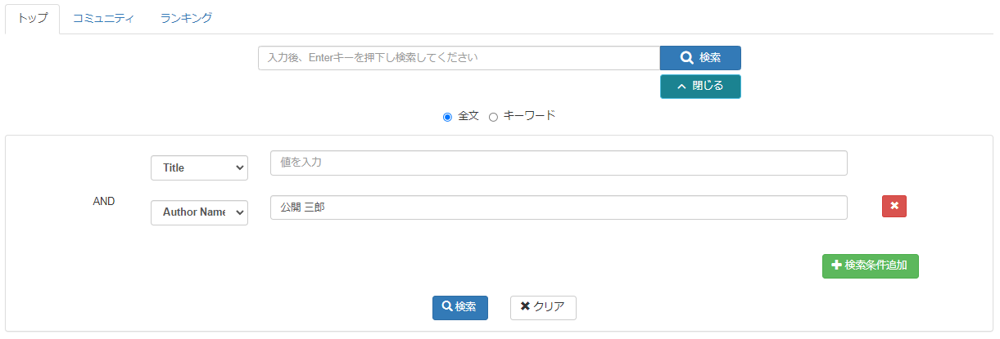

または、アイテム詳細画面で著者のリンクをクリックすると、著者情報がポップアップで表示されますので、そのポップアップ内にある「Search repository」リンクをクリックして、該当の著者名を含むアイテムを検索することもできます。

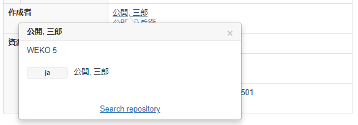

#### WEKO著者ID検索

詳細検索で「Author Id」検索を指定し、著者のWEKO著者ID（WEKO ID (author\_link)）を入力して検索をすることで、指定したWEKO著者IDを含むアイテムを検索します。

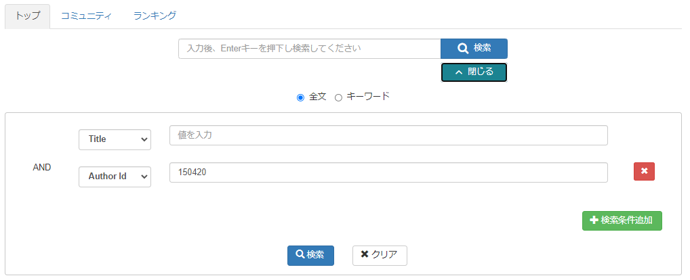

### ファセットで検索する

ファセット検索では、アイテムリストから取得された検索条件でアイテムを絞り込むことができます。

ファセット検索は、ファセット検索を表示する設定が「表示する」の場合に実施できます。詳細については、システム管理ガイドの「16.12.6 インデックスツリー/ファセットの表示を設定する」を参照してください。

ファセット検索でアイテムを絞り込む手順を説明します。

1.  ［ホーム］画面の［TOP］タブをクリックします。
    
    ファセット検索が表示されます。
    
    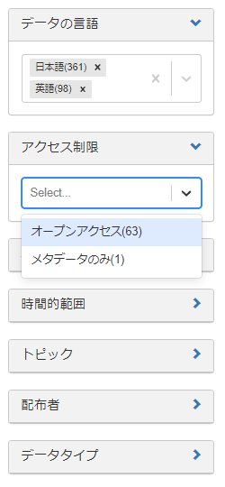

<!-- end list -->

2.  ファセット検索エリアに検索条件をクリックします。
    
    アイテムが絞り込まれます。検索結果が［アイテムリスト］画面に表示されます。

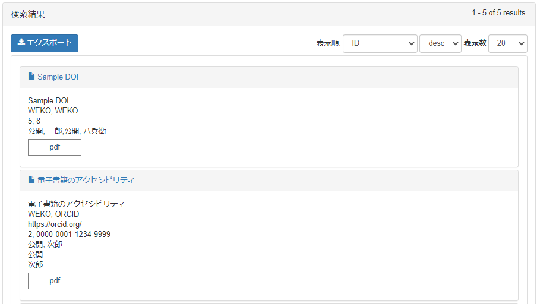

詳細については、「3.1 インデックスで検索する」の「アイテムリストを表示する」を参照してください。

【v2.1.0】注：設定ファイル（instance.cfg）で `WEKO_SEARCH_FIX_ACCESSRIGHTS = True` を設定している場合、アクセス権（accessRights）を対象とするファセットでは、アクセス権が「embargoed access」で登録されたアイテムを、現在の日付とコンテンツファイルのアクセス設定に基づいて次のように振り分けて件数を集計し、絞り込みます（既定の設定では、登録されたアクセス権の値のとおりに集計します）。

  - すべてのコンテンツファイルが［オープンアクセス］、または公開日を過ぎた［オープンアクセス日を指定する］の場合：「open access」

  - ［制限公開］のコンテンツファイルがある場合、または［ログインユーザのみ］のコンテンツファイルがあり、公開日が未来の［オープンアクセス日を指定する］のコンテンツファイルが無い場合：「restricted access」

  - 上記以外で、公開日が未来の［オープンアクセス日を指定する］のコンテンツファイルまたは［公開しない］のコンテンツファイルがある場合、およびコンテンツファイルが無い場合：「embargoed access」

## アイテムの詳細を表示する

この章では、アイテムに表示される項目を説明します。

### アイテム詳細画面

ここでは、アイテムの詳細画面に表示されている項目を説明します。

### メタデータ

アイテム詳細画面でアイテムのメタデータを確認することができます。

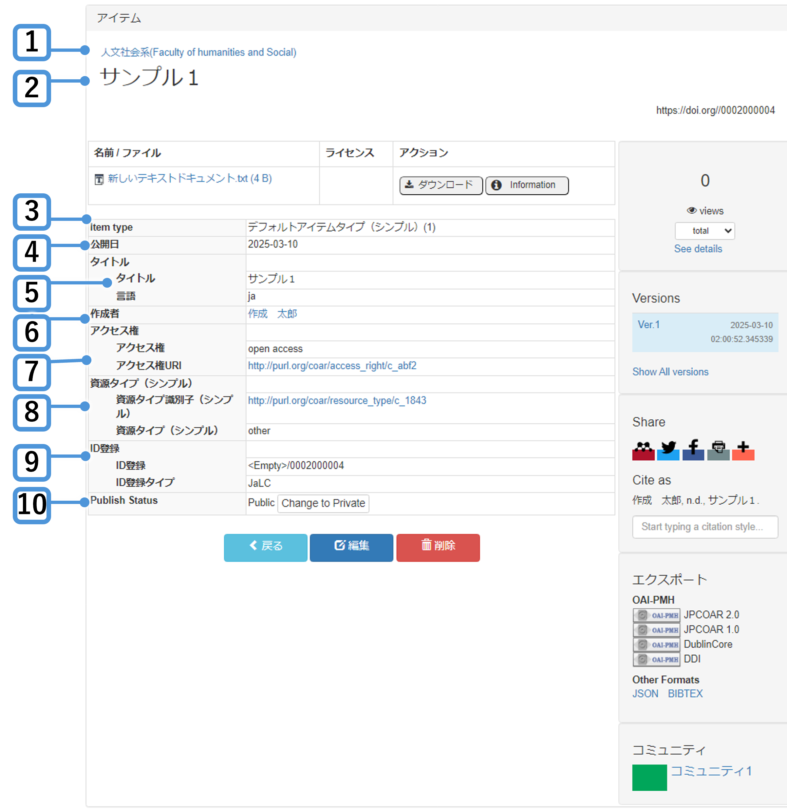

図 4-1アイテム詳細画面

表 4‑1アイテム詳細画面の項目と説明

<table>
<thead>
<tr class="header">
<th>項番</th>
<th>項目</th>
<th>説明</th>
</tr>
</thead>
<tbody>
<tr class="odd">
<td>1</td>
<td>インデックス名</td>
<td>アイテムのインデックス名が表示されます。</td>
</tr>
<tr class="even">
<td>2</td>
<td>アイテム名</td>
<td>アイテム名が表示されます。</td>
</tr>
<tr class="odd">
<td>3</td>
<td>アイテムタイプ</td>
<td>アイテムタイプが表示されます。</td>
</tr>
<tr class="even">
<td>4</td>
<td>公開日</td>
<td>公開日が表示されます。</td>
</tr>
<tr class="odd">
<td>5</td>
<td>タイトル※</td>
<td>タイトルおよびタイトルの言語が表示されます。</td>
</tr>
<tr class="even">
<td>6</td>
<td>作成者※</td>
<td>作成者名が表示されます。</td>
</tr>
<tr class="odd">
<td>7</td>
<td>アクセス権※</td>
<td>アクセス権とアクセス権URIが表示されます。</td>
</tr>
<tr class="even">
<td>8</td>
<td>資源タイプ※</td>
<td>資源タイプと資源タイプ識別子が表示されます。</td>
</tr>
<tr class="odd">
<td>9</td>
<td>ID登録</td>
<td>ID登録、ID登録タイプが表示されます。</td>
</tr>
<tr class="even">
<td>10</td>
<td>Publish Status</td>
<td>公開ステータスが表示されます。</td>
</tr>
<tr class="odd">
<td>11</td>
<td>［］ボタン</td>
<td>クリックすると、アイテム詳細画面を閉じて前画面に遷移します。</td>
</tr>
<tr class="even">
<td>12</td>
<td>［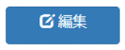］ボタン</td>
<td>クリックすると、編集します。</td>
</tr>
<tr class="odd">
<td>13</td>
<td>［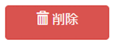］ボタン</td>
<td>
クリックすると、削除します。

［削除確認］画面が表示されます。
</td>
</tr>
</tbody>
</table>

注※

アイテムタイプによって表示される項目は異なります。

注意事項

DOI付与されているアイテムに対して、アイテムのステータスが非公開に変更できません。［非公開にする］ボタンをクリックすると、メッセージ「このアイテムはDOIが付与されているため非公開にできません。」が表示されます。

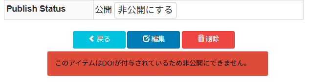

図 4-2エラーメッセージ「このアイテムはDOIが付与されているため非公開にできません。」

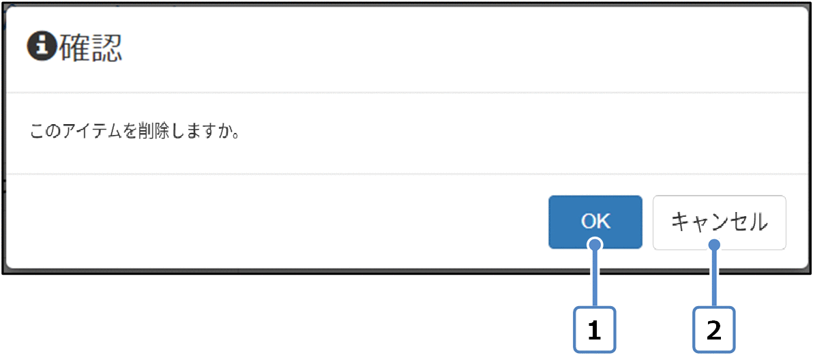

図 4‑3［削除確認］画面

表 4‑2［削除確認］画面の項目と説明

| 項番 | 項目                                          | 説明                               |
| -- | ------------------------------------------- | -------------------------------- |
| 1  | ［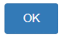］ボタン | クリックすると、アイテムが削除されます。             |
| 2  | ［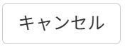］ボタン | クリックすると、アイテムは削除されず［削除確認］画面が閉じます。 |

注

DOI付与されているアイテムに対して、アイテムを削除できません。また、DOI付与されているアイテムに対して、アイテムが直接紐づいているインデックスとその上位のインデックスについて、１つでも非表示の設定のものがある場合も削除できません。［削除］ボタンをクリックすると、メッセージ「このアイテムはDOIが付与されているため削除できません。」が表示されます。

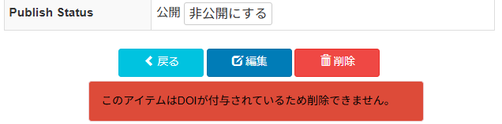

図 4‑4エラーメッセージ「このアイテムはDOIが付与されているため削除できません。」

【補足】

・作成者は氏名がリンクで表示されます。氏名のリンクをクリックすると、該当の作成者の詳細情報がポップアップで表示されます。

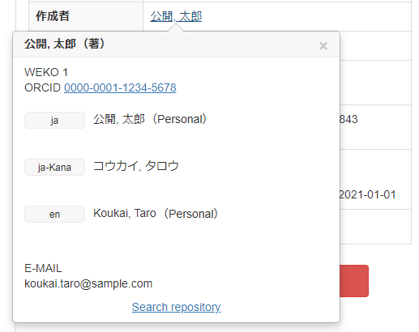

図 4‑5作成者の詳細情報

・書誌情報は以下のように登録された情報をまとめたテンプレートの形式で表示されます。

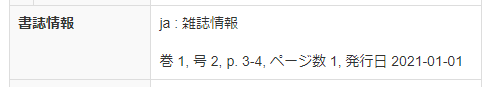

> 図 4‑6書誌情報

#### 統計

［統計］画面でアイテムの閲覧数が確認できます。

【v2.1.0】アイテムの閲覧数、およびコンテンツファイルのダウンロード回数・再生回数（「Information画面」の統計(Stats)タブ）は、そのアイテムの詳細画面を閲覧できる利用者だけが確認できます。

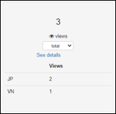

図 4-7［統計］画面

1.  ［期間］プルダウンリストから期間を選択します。
    
    選択した期間ごとの閲覧数が表示されます。

<!-- end list -->

2.  ［See details］をクリックします。
    
    アクセス元の国別のアイテム閲覧数が表示されます。

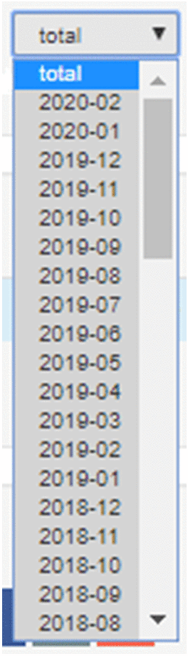

図 4-8［期間］プルダウンリスト

#### バージョン

［バージョン］画面でアイテムのバージョンが確認できます。

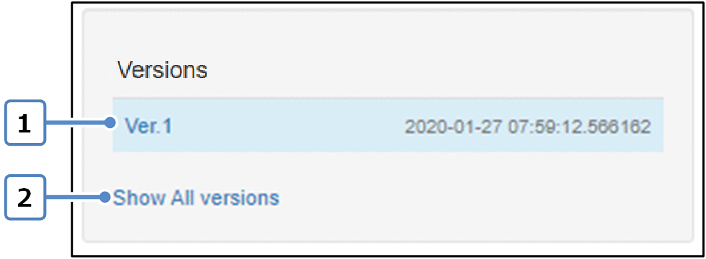

図 4-9［バージョン］画面

表 4‑3［バージョン］画面の項目と説明

| 項番 | 項目                | 説明                                                        |
| -- | ----------------- | --------------------------------------------------------- |
| 1  | Versions             | バージョンの表示フォーマットは、「*yyyy-mm-dd hh:mm:ss.999999*」の形式で表示されます。 |
| 2  | Show ALL versions | すべてのバージョンが表示されます。                                         |

#### コンテンツファイル

アイテムに登録しているコンテンツファイルは、アイテム登録時に選択された表示形式に応じてファイルの情報を一覧に表示することができます。

> 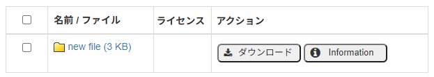
> 
> 図 4‑10表示形式：シンプル

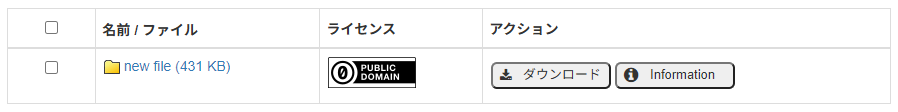

> 図 4‑11表示形式：詳細

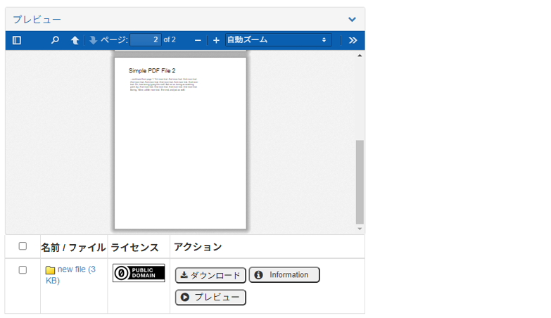

図 4‑12表示形式：プレビュー

・ プレビュー表示でコンテンツファイルのアクセス権が無い場合

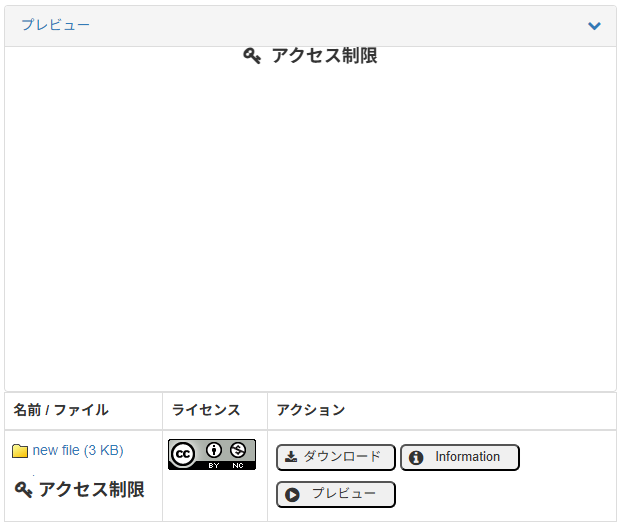

図 4‑13アクセス権無し

アクセス権が無い旨をファイル情報エリアとプレビューエリアに表示します。

【v2.1.0】なお、プレビューのURLに直接アクセスした場合も、コンテンツファイルのアクセス権が確認されます。アクセス権が無い場合、ログインしていなければ［ログイン］画面が表示され、ログインしていればアクセスが拒否されます。IIIFによる画像の配信も同様に、アイテムの閲覧権限とコンテンツファイルのアクセス権がある場合に限られます。

・ サイトライセンス対象の利用者の場合

【v2.1.0】サイトライセンスの対象から除外されていないアイテムタイプのアイテムでは、サイトライセンスを認可されたIPアドレスからアクセスした利用者は、［ログインユーザのみ］および［制限公開］のコンテンツファイルもダウンロードできます。［制限公開］のコンテンツファイルは、利用申請やワンタイムアドレスを介さずに直接ダウンロードできます。サイトライセンスの設定については、システム管理ガイドの「16.15 サイトライセンスを設定する」を参照してください。

・ プレビュー表示でコンテンツファイルの公開日が未来日の場合

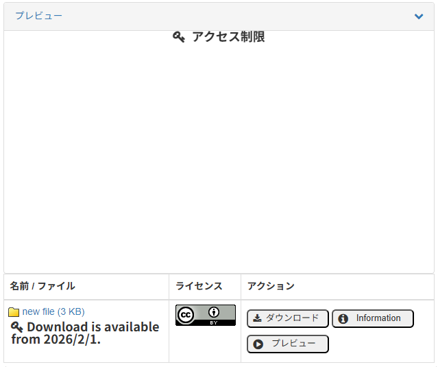

図 4‑14現在の日付が公開日より前

ダウンロード可能な年月日をファイル情報エリアに表示し、アクセス権が無い旨をプレビューエリアに表示します。

・ コンテンツファイルを参照できない等、予期せぬエラーが発生した場合

アイテム詳細画面が表示され、その上部にメッセージが表示されます。下記の画面が表示された際は、所属機関の管理者へお問い合わせください。

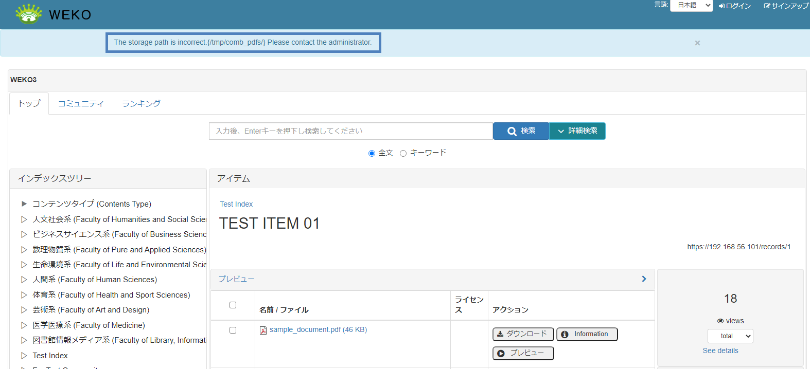

図 4‑15予期せぬエラー

＊以下の機能は、＜利用申請機能 先行利用機関＞に提供している機能です。当機能の先行利用を申請していな機関は、利用できません。
この機能の利用に興味のある方はwekosoftware@nii.ac.jpへお問い合わせください。

> ・コンテンツファイルのアクセスが「制限公開」と設定されているコンテンツはアクセスコントロールが設定されており、利用規約の同意等の手続きを行った後にコンテンツをダウンロードすることができます。制限公開の設定については「5.1 アイテムを登録する」を参照してください。

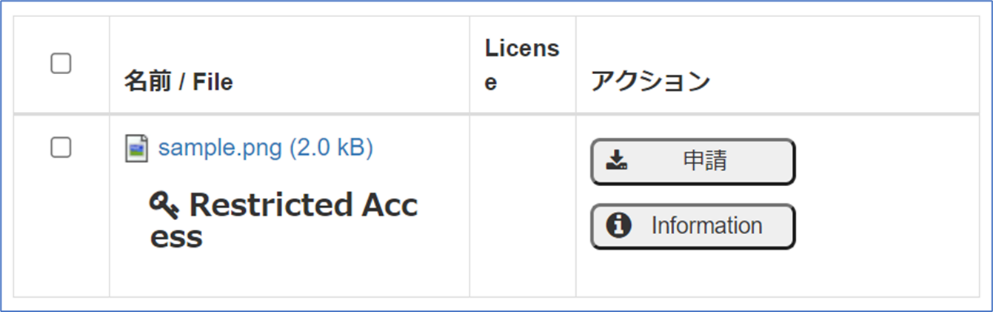

> 図 4‑16アイテム詳細画面

> 申請ボタンをクリックすると申請手続きが開始されます。コンテンツによっては、アカウント登録を行い、ログインをしないと申請手続きを行うことができない可能性があります。申請条件については、リポジトリ担当者にご確認ください。

> 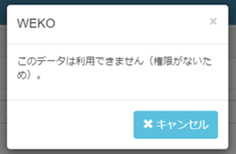

> 図 417申請時のエラーメッセージ

> 1.  アイテム詳細画面の［申請］ボタンを押下すると、利用規約を設定している場合、利用規約がモーダル画面に表示されます。

> 利用規約文表示エリア下部にチェックを入れることで、［次へ］ボタンを押下することができます。\[次へ\]ボタン押下後にコンテンツをダウンロードできます。

> このとき、\[利用規約を印刷\]ボタンを押下することで、表示されている利用規約を印刷するための印刷プレビューを開くことができます。

> ＊コンテンツファイルの提供方法を「利用申請」と設定している場合、次の工程に遷移します　　

> 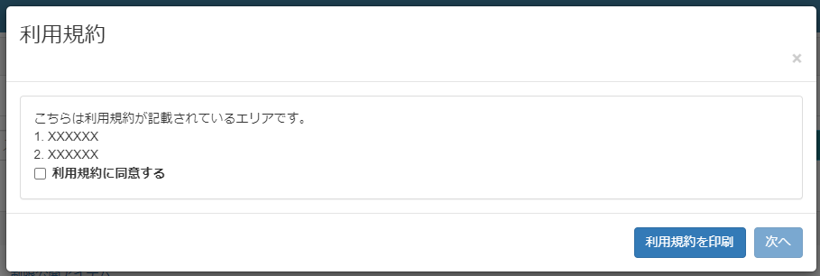

> 図 418利用規約同意画面

> 2.  ログインしていない状態で\[次へ\]ボタンを押下すると、メールアドレスが入力できるモーダル画面が表示されます。

> - パスワードチェック機能がOFFの時  
> 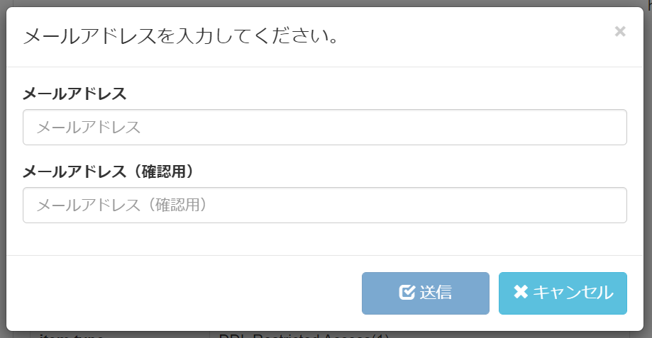

> - パスワードチェック機能がONの時  
> 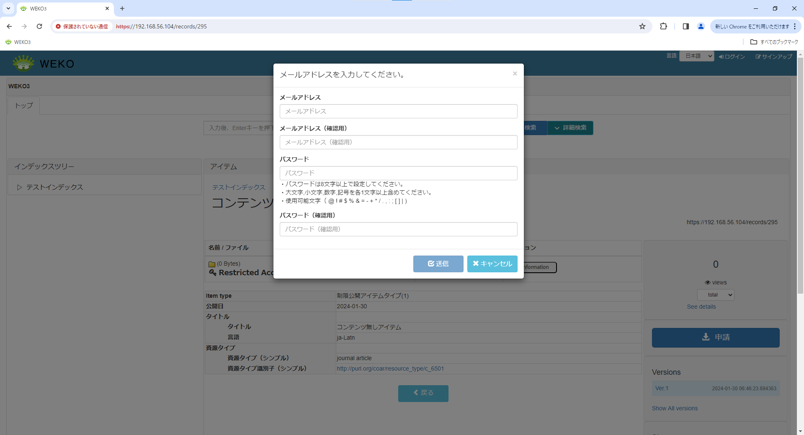

> 図 419メールアドレス入力画面

> モーダル画面で指定したメールアドレスに特定のワークフローの編集画面リンクを含めたメール文を送信します。受信したメール文のリンクをクリックすると、申請登録画面に遷移します。

> このとき、併せてパスワードの入力を要求される場合があります。この場合、パスワードポリシーに従い、パスワードを入力してください。

> - パスワードの入力可否の設定方法については、システム管理マニュアルを参照してください。

> 3.  申請登録画面で申請事項を入力し、\[次へ\]ボタンを押下すると、リポジトリ担当者に利用申請を行うことができます。利用申請後、リポジトリから申請結果がメールで通知されます。申請が承認された場合、送信されたメールにダウンロードリンクが記載されており、コンテンツをダウンロードすることができます。コンテンツをダウンロードした後、利用報告ワークフローへのアクセスリンクがメールで通知されます。

> ただし、未完了のワークフローが存在する場合、送信されるメール文のリンクには、そのワークフローのリンクが記載されます。未完了のワークフローを中止、または終了させてください。

> また、受信したメール文のリンクは、ワークフローを中止、または終了した場合に再利用できません。

> 誤って「強制終了」ボタンをクリックし、ワークフローを中止してしまった場合は利用申請を行うアイテムの詳細画面から\[申請\]ボタンを押下し、改めてメールを受け取ってください。

・コンテンツファイルが課金ファイルである場合

設定されたロールごとにコンテンツファイルの価格が表示されます。 

また、以下の操作が行えます。課金ファイルの設定については「5.1 アイテムを登録する」を参照してください。 

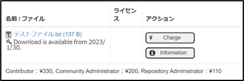

未課金かつ購入可能なロールを所持している場合、[charge]ボタンが表示されます。 

[charge]ボタンを押下することで、コンテンツファイルを購入できます。 

・コンテンツファイルが大容量の場合

1.  大容量のコンテンツファイルをダウンロードしようとすると、警告メッセージが表示されます。

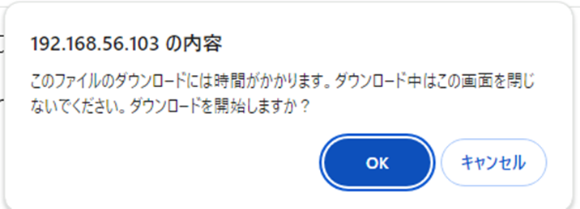

図4-20　大容量ファイルのダウンロード開始の警告

2.  警告の内容を確認し、OKを押下すると、「名前を付けて保存」のファイルピッカーが表示されるので、保存するファイルの名前をいれて、「保存」を押下してください。

3.  ダウンロード中はその画面の操作ができませんので、完了するまでそのままにしておいてください。（別の画面の操作は可能です。）

##### 「Import to GakuNin RDM」ボタン

この機能は、WEKO3で公開されているGakuNin RDMプロジェクトアーカイブを、GakuNin RDMに新しいプロジェクトとしてインポートするためのものです。GakuNin RDMプロジェクトアーカイブはGakuNin RDM上でプロジェクトをエクスポートすることで作成されます。

手順は以下の通りとなります。

1. GakuNin RDMでプロジェクトをエクスポートします。
2. WEKO3のアイテム個別登録画面からエクスポートしたファイル（GakuNin RDMプロジェクトアーカイブ）をアップロードします。
3. MIME Typeが「application/zip」となるため「application/rdm-project」に変更します。
4. ファイルのアクセスを「Open Access」または「Input Open Access Date」のいずれにかにします。
5. 以上で、GakuNin RDMプロジェクトアーカイブの公開準備が整いました。
6. アイテム詳細画面の当該ファイルに「Import to GakuNin RDM」ボタンが表示されます。アイテムが公開されていて、ファイルが公開されている（「Input Open Access Date」の場合は公開日を過ぎている）場合は、ボタンをクリックするとGakuNin RDMに移動してアーカイブをインポートできます。それ以外の場合はボタンが無効の状態で表示され、ボタンにマウスポインターを合わせると理由（「アイテムが公開されていません」「ファイルが公開されていません」「アイテムとファイルが公開されていません」のいずれか）が表示されます。なお、このボタンは［ダウンロード］ボタンと同じ条件で表示されます。制限公開のファイルで利用申請が承認されていないなど、［ダウンロード］ボタンの代わりに［申請］ボタンが表示される場合は表示されません。

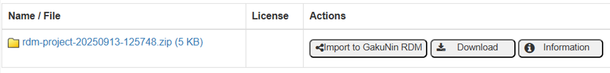
図4-20a　「Import to GakuNin RDM」ボタン

#### 共有

アイテムを各ソーシャルネットワーキングへ共有、印刷をすることができます(利用サービス停止に伴い機能が利用できません。後継機能を開発中です)。

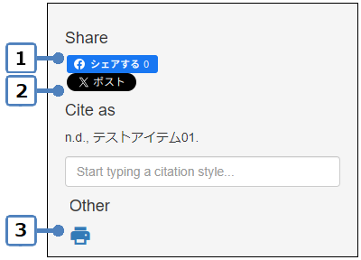

図 4-21［共有］画面

表 4‑4［共有］画面の項目と説明

| 項番 | 項目                                                | 説明                                                       |
| -- | ------------------------------------------------- | -------------------------------------------------------- |
| 1  | ［］ボタン      | クリックすると、「Facebook」が起動します。                                |
| 2  | ［］ボタン      | クリックすると、「Twitter」が起動します。                                 |
| 3  | ［］ボタン      | クリックすると、印刷が行なえます。                                        |

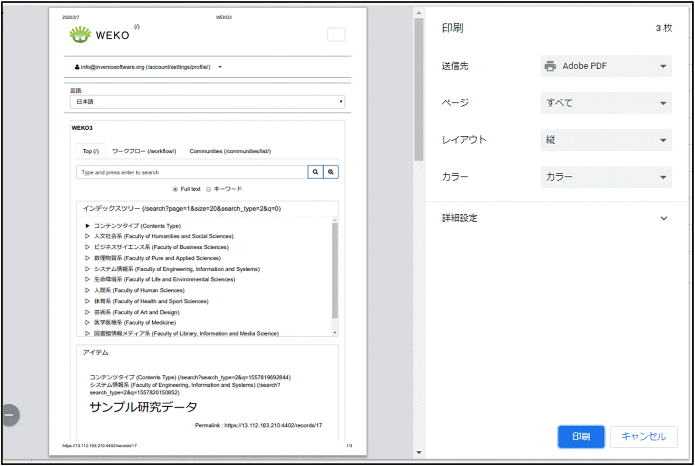

> 図 4-22［Print］画面

#### 引用情報

アイテムメタデータを引用情報として表示することができます。

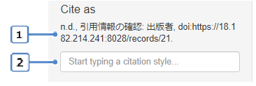

> 図 4-23 引用情報

表 4‑5［Cite as］画面の項目と説明

<table>
<thead>
<tr class="header">
<th>項番</th>
<th>項目</th>
<th>説明</th>
</tr>
</thead>
<tbody>
<tr class="odd">
<td>1</td>
<td>引用情報</td>
<td>
引用情報が表示されます。

引用情報のスタイルによって、引用情報の内容が異なります。

表示言語を切り替えると、選択した言語に応じる引用情報も切り替えます。対象言語のデータがない場合、英語表記のデータが表示されます。英語表記のデータもない場合、いちばん最初に登録された言語のデータが表示されます。
</td>
</tr>
<tr class="even">
<td>2</td>
<td>［Start typing a citation style］</td>
<td>
クリックすると、引用情報のスタイル一覧が表示されます。入力すると、ヒットするスタイル候補一覧に自動表示されます。

スタイル一覧は、「図 4-9［スタイル］プルダウンリスト」を参照してください。
</td>
</tr>
</tbody>
</table>

図 4-25［スタイル］プルダウンリスト

#### エクスポート

アイテムのメタデータをJPCOAR形式、DublinCore形式、DDI形式で出力することができます。

出力の対象について、最新バージョンのみのメタデータが出力されます。

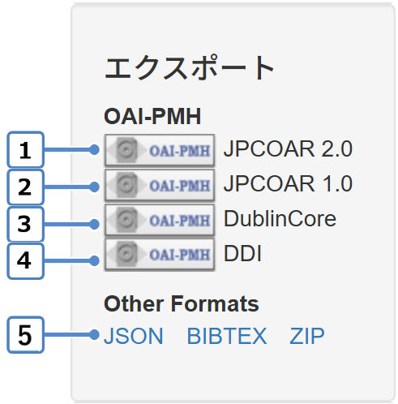

図 4-26［エクスポート］画面

表 4‑6［エクスポート］画面の項目と説明

| 項番 | 項目              | 説明                                   |
| -- | --------------- | ------------------------------------ |
| 1  | ［JPCOAR 2.0］ボタン   | クリックすると、JPCOAR 2.0形式で、OAI-PMH出力されます。     |
| 2  | ［JPCOAR 1.0］ボタン   | クリックすると、JPCOAR 1.0.2形式で、OAI-PMH出力されます。     |
| 3  | ［DublinCore］ボタン | クリックすると、DublinCore形式で、OAI-PMH出力されます。 |
| 4  | ［DDI］ボタン        | クリックすると、DDI形式で、OAI-PMH出力されます。        |
| 5  | JSONリンク         | クリックすると、JSON形式で出力されます。               |
|   | BIBTEXリンク       | クリックすると、BIBTEX形式で出力されます。             |
|   | ZIPリンク         | クリックすると、アイテムメダデータ資料をダウンロードできます。             |

#### コミュニティ

アイテムが所属するコミュニティを表示します。

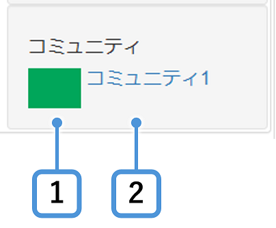

図 427［コミュニティ］画面

表 4‑7［コミュニティ］画面の項目と説明

| 項番 | 項目              | 説明                                   |
| -- | --------------- | ------------------------------------ |
| 1  | コミュニティロゴ     | コミュニティのロゴが設定されている場合、その画像が表示されます。     |
| 2  | コミュニティタイトル    | クリックすると、コミュニティのトップページが表示されます。     |

#### Information画面

ファイル情報エリアの [Information] ボタンをクリックすると、コンテンツファイルの詳細情報を確認することができます。

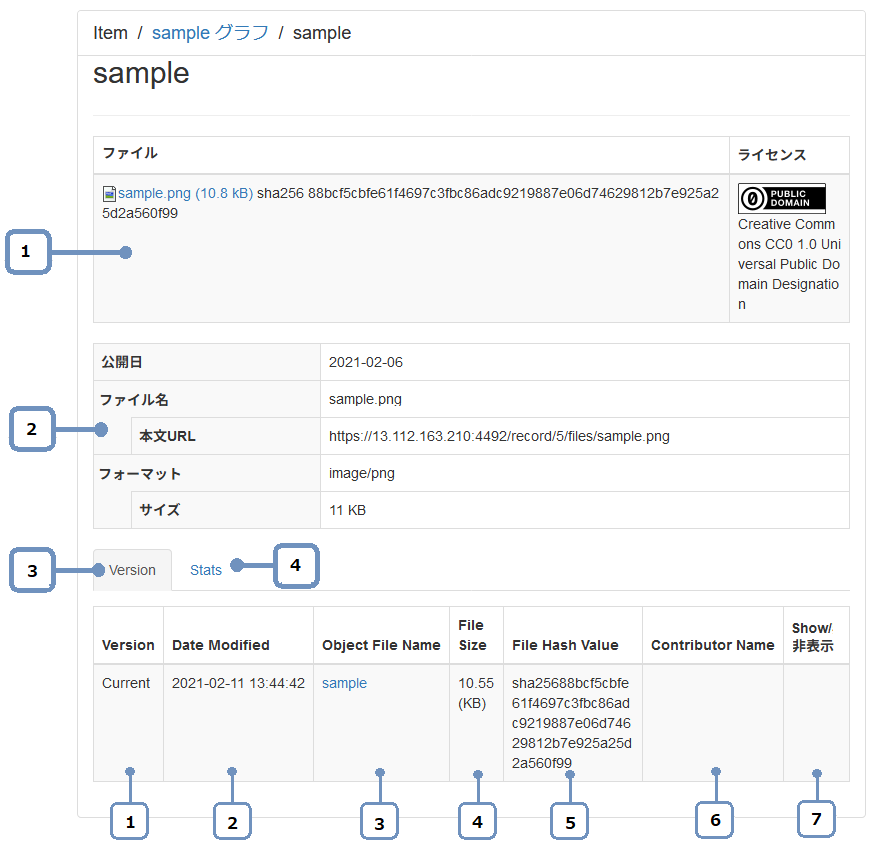

図 427 Information画面

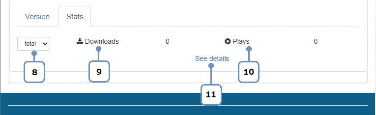

図 428 Information画面の統計(Stats)タブ選択状態

Information画面の各項目の内容は以下の通りです。

表 4‑7 Information画面の項目と説明

<table>
<thead>
<tr class="header">
<th>項番</th>
<th>項目</th>
<th>説明</th>
</tr>
</thead>
<tbody>
<tr class="even">
<td>1</td>
<td>ファイルエリア</td>
<td>
ファイル名のリンクとライセンス情報、シークレットURLボタン（注）を表示します。
</td>
</tr>
<tr class="odd">
<td>2</td>
<td>ファイル情報エリア</td>
<td>
コンテンツファイルの詳細情報を表示します。アイテム登録時のファイル情報プロパティに入力した情報が表示されます。

詳細は「5.1 アイテムを登録する」の「ファイルを登録する」をご参照ください。
</td>
</tr>
<tr class="even">
<td>3</td>
<td>バージョン（Version）タブ</td>
<td>ファイルに関するバージョン情報、ハッシュ値等の詳細情報が表示します。</td>
</tr>
<tr class="odd">
<td>4</td>
<td>統計(Stats)タブ</td>
<td>該当のコンテンツファイルのダウンロード回数と再生回数の統計値を表示します。</td>
</tr>
</tbody>
</table>

※（注）シークレットURLボタンは、管理者画面でシークレットURL機能を有効化した際に表示されます。この機能の詳細は以下の項目をご確認ください。

 [9.8 非公開コンテンツをワンタイムアドレスを利用して共有したい](#非公開コンテンツをワンタイムアドレスを利用して共有したい)

バージョン(Version)タブと統計(Stats)タブに表示される内容は以下の通りです。

表 4‑8Information画面のバージョン(Version)タブと統計(Stats)タブの説明

| 項番 | タブ             | 項目                 | 説明                                                                  |
| -- | -------------- | ------------------ | ------------------------------------------------------------------- |
| 1  | バージョン(Version) | Version            | コンテンツファイルのバージョン情報を表示します。                                            |
| 2  |                | Date Modified      | コンテンツファイルが作成された日時を表示します。                                            |
| 3  |                | Object File Name   | コンテンツファイル名を表示します。                                                   |
| 4  |                | File Size          | コンテンツファイルのファイルサイズを表示します。                                            |
| 5  |                | File Hash Value    | コンテンツファイルのハッシュ値を表示します。                                              |
| 6  |                | Contributor Name   | コンテンツファイルの登録者を表示します。                                                |
| 7  |                | Show/Hide          | コンテンツファイルの表示／非表示を表示します。                                             |
| 8  | 統計(Stats)      | ［total］プルダウン       | コンテンツファイルの統計情報を表示します。デフォルトは「total」で、プルダウンを選択すると月毎の統計情報を確認することができます。 |
| 9  |                | Downloads          | コンテンツファイルがダウンロードされた回数を表示します。※ファイルの差し替えを行った場合でも統計値は引き継いで集計します。       |
| 10 |                | Plays              | コンテンツファイルがプレビューで表示された回数を表示します。                                      |
| 11 |                | ［See details］プルダウン | コンテンツファイルのダウンロード回数、プレビュー回数を国毎の回数で表示します。                             |

図4-13課金ファイルの場合

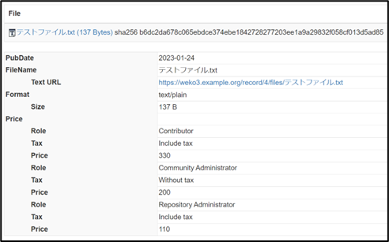

課金ファイルの場合、ファイル情報エリアにロールごとのコンテンツファイルの価格が表示される。

#### リクエストメール送信フォーム

本機能は、試験的な機能です。JAIRO Cloud環境で提供しておりません

> アイテム詳細画面の「Request Mail」ボタンを押下することで、リクエストメール送信フォームが表示されます。

> リクエストメールは、そのアイテムの作成または編集時にリクエストメール送信先として設定されたメールアドレスに送信されます。

> リクエストフォーム上では、以下の項目の入力が可能となります。

> - From  
  > この項目は、送信者のメールアドレスを入力する項目となります。  
  > メールアドレスの形式が不適切である場合は、送信ボタン押下時に、エラーメッセージが出力されます。  
  > 入力必須項目となります。

> - 件名（Subject）  
  > この項目は、メールの件名を入力する項目となります。  
  > 入力必須項目となります。

> - 本文（Message）  
  > この項目は、メールの本文を入力する項目となります。  
  > 入力必須項目となります。

> 上記項目を入力後に、表示されているCAPTCHA画像の計算結果をフォーム右下の入力欄に入力していただくことで送信が可能となります。

> CAPTCHA画像には有効期限が設定されてます。

> 有効期限が切れていた場合はメールの送信を行うことができず、画像が更新されます。デフォルトの有効期限は600秒となります。

> 図4-14 アイテム詳細画面

> 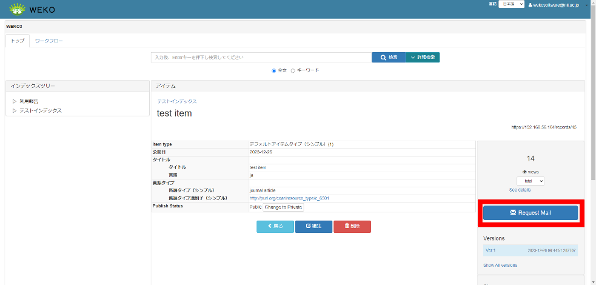

> 図4-15 リクエストメール送信フォーム

> 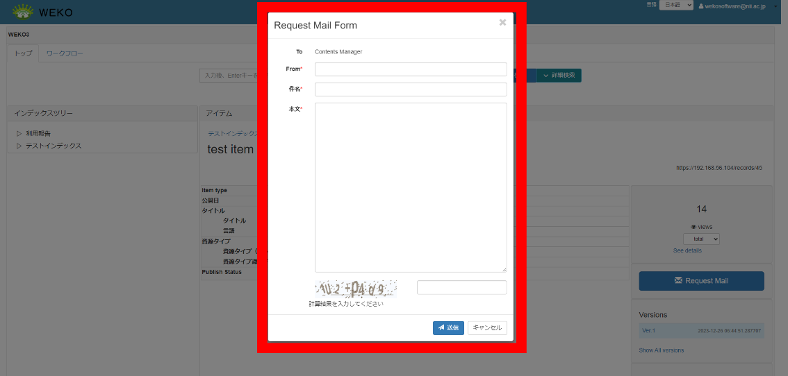

#### 外部データ利用申請

本機能は、試験的な機能です。JAIRO Cloud環境で提供しておりません

> アイテム詳細画面右側にある「申請」ボタンを押下することで、WEKO外部にあるデータの利用申請ができます。

> - 本機能は、以下の条件をすべて満たしている場合にのみ利用できます。

> - コンテンツファイルが登録されていない。

> - アイテムの利用申請方法が設定されている。

> 1.  ［申請］ボタンを押下すると、利用規約を設定している場合、利用規約がモーダル画面に表示されます。

> 利用規約文表示エリア下部にチェックを入れることで、［次へ］ボタンを押下することができます。ボタンを押下すると、メールアドレス入力のモーダル画面を表示します。

> また\[利用規約を印刷\]ボタンを押下することで、表示されている利用規約を印刷するための印刷プレビューを開くことができます。

> 

> 2. モーダル画面で指定したメールアドレスに特定のワークフローの編集画面リンクを含めたメール文を送信します。受信したメール文のリンクをクリックするとワークフローに定義されているアクション画面（アイテム登録画面など）に遷移して、ワークフローを登録して終了まで操作できます。

> 起動したワークフローが「作業済(Done)」になった際、ワークフローを起動したユーザーにファイルのダウンロードリンクをメールで送信します。

> なお、提供方法に一致しないユーザーが［申請］をクリックした場合は管理者が設定している警告メッセージをモーダルで表示します。

> メールで送られたリンクからコンテンツファイルのダウンロードをした際に、ユーザーのアカウントに応じた利用報告ワークフローリンクをメールで送信します。

> - ゲストユーザーの場合: アクセス期限のある利用報告ワークフローのアクセスリンクをメールで通知します
> - アカウント登録済ユーザーの場合: 制限のない利用報告ワークフローのアクセスリンクをメールで通知します

#### Google Scholarメタデータ出力

> アイテムのメタデータをもとに、WebページのヘッダにGoogle Scholarメタデータが出力されます。
> 
> 出力されたメタデータをもとに、Google Scholarへのメタデータの登録が行われます。
> 
> jpcoarのマッピング(jpcoar\_v2\_mapping)とGoogle Scholarメタデータとは、以下の通りに対応しています。
> 
> 表 4‑8 Google Scholarメタデータ

<table>
<thead>
<tr class="header">
<th><blockquote>

項番

</blockquote></th>
<th><blockquote>

jpcoarのマッピング

</blockquote></th>
<th><blockquote>

Google Scholarメタデータ

</blockquote></th>
</tr>
</thead>
<tbody>
<tr class="odd">
<td><blockquote>

1

</blockquote></td>
<td><blockquote>

dc:title

</blockquote></td>
<td><blockquote>

citation_title

</blockquote></td>
</tr>
<tr class="even">
<td><blockquote>

2

</blockquote></td>
<td><blockquote>

jpcoar:creatorName

</blockquote></td>
<td><blockquote>

citation_author

</blockquote></td>
</tr>
<tr class="odd">
<td><blockquote>

3

</blockquote></td>
<td><blockquote>

dc:publisher

</blockquote></td>
<td><blockquote>

citation_publisher

</blockquote></td>
</tr>
<tr class="even">
<td><blockquote>

4

</blockquote></td>
<td><blockquote>

jpcoar:subject

</blockquote></td>
<td><blockquote>

citation_keywords

</blockquote></td>
</tr>
<tr class="odd">
<td><blockquote>

5

</blockquote></td>
<td><blockquote>

jpcoar:sourceTitle

</blockquote></td>
<td><blockquote>

citation_journal_title

</blockquote></td>
</tr>
<tr class="even">
<td><blockquote>

6

</blockquote></td>
<td><blockquote>

jpcoar:volume

</blockquote></td>
<td><blockquote>

citation_volume

</blockquote></td>
</tr>
<tr class="odd">
<td><blockquote>

7

</blockquote></td>
<td><blockquote>

jpcoar:issue

</blockquote></td>
<td><blockquote>

citation_issue

</blockquote></td>
</tr>
<tr class="even">
<td><blockquote>

8

</blockquote></td>
<td><blockquote>

jpcoar:pageStart

</blockquote></td>
<td><blockquote>

citation_firstpage

</blockquote></td>
</tr>
<tr class="odd">
<td><blockquote>

9

</blockquote></td>
<td><blockquote>

jpcoar:pageEnd

</blockquote></td>
<td><blockquote>

citation_lastpage

</blockquote></td>
</tr>
</tbody>
</table>

#### Google Datasetメタデータ出力

> 以下の条件を満たすときに、Google Datasetメタデータが出力されます。

  - > アイテムのメタデータ「資源タイプ」が「dataset」であること

  - > アイテムのメタデータ「内容記述」が50字以上であること

> Google Datasetメタデータは、以下のように出力されます。
> 
> 表 4‑9 Google Datasetメタデータ

<table>
<thead>
<tr class="header">
<th><blockquote>

schema.org

</blockquote></th>
<th></th>
<th><blockquote>

利用元のJPCOARスキーマ要素

</blockquote></th>
<th><blockquote>

値例

</blockquote></th>
</tr>
</thead>
<tbody>
<tr class="odd">
<td><blockquote>

description

</blockquote></td>
<td><blockquote>

必須

</blockquote></td>
<td><blockquote>

datacite:description

</blockquote></td>
<td></td>
</tr>
<tr class="even">
<td><blockquote>

name

</blockquote></td>
<td><blockquote>

必須

</blockquote></td>
<td><blockquote>

dc:title

</blockquote></td>
<td></td>
</tr>
<tr class="odd">
<td><blockquote>

creator

</blockquote></td>
<td></td>
<td><blockquote>

jpcoar:creator

</blockquote></td>
<td><blockquote>

"creator": [ 
    { 
        "@type": "Person", 
        "sameAs": "http://orcid.org/0000-0000-0000-0000", 
        "givenName": "Jane", 
        "familyName": "Foo", 
        "name": "Jane Foo" 
    },

</blockquote></td>
</tr>
<tr class="even">
<td><blockquote>

citation

</blockquote></td>
<td></td>
<td><blockquote>

jpcoar:identifier

</blockquote></td>
<td><blockquote>

"citation": "https://doi.org/10.1111/111"

</blockquote></td>
</tr>
<tr class="odd">
<td><blockquote>

keywords

</blockquote></td>
<td></td>
<td><blockquote>

jpcoar:subject

</blockquote></td>
<td></td>
</tr>
<tr class="even">
<td><blockquote>

license

</blockquote></td>
<td></td>
<td><blockquote>

dc:rightsを想定

</blockquote></td>
<td><blockquote>

"license" : { 
  "@type": "CreativeWork", 
  "name": "Custom license", 
  "url": "https://example.com/custom_license" 
  }

</blockquote></td>
</tr>
</tbody>
</table>

<table>
<thead>
<tr class="header">
<th><blockquote>

spatialCoverage

</blockquote></th>
<th></th>
<th><blockquote>

datacite:geoLocation

</blockquote></th>
<th><blockquote>

"spatialCoverage:" {

"@type": "Place",

"geo": {

"@type": "GeoCoordinates",

"latitude": 39.3280,

"longitude": 120.1633

}

}

</blockquote></th>
</tr>
</thead>
<tbody>
<tr class="odd">
<td><blockquote>

temporalCoverage

</blockquote></td>
<td></td>
<td><blockquote>

dcterms:temporal

</blockquote></td>
<td><blockquote>

"temporalCoverage" : "2008"

</blockquote></td>
</tr>
<tr class="even">
<td><blockquote>

includedInDataCatalog

</blockquote></td>
<td></td>
<td></td>
<td><blockquote>

includedInDataCatalog":{

"@type":"DataCatalog",

"name":&lt;リポジトリのURL&gt;

}

</blockquote></td>
</tr>
<tr class="odd">
<td><blockquote>

distribution

</blockquote></td>
<td></td>
<td><blockquote>

jpcoar:file

</blockquote></td>
<td><blockquote>

"distribution":[

{

"@type":"DataDownload",

"encodingFormat":&lt;ファイルコンテンツのフォーマット&gt;,

"contentUrl":&lt;ファイルのURL&gt;

},

…

]

</blockquote></td>
</tr>
</tbody>
</table>

### ファイル詳細画面

ここでは、ファイルの詳細画面に表示されている項目を説明します。

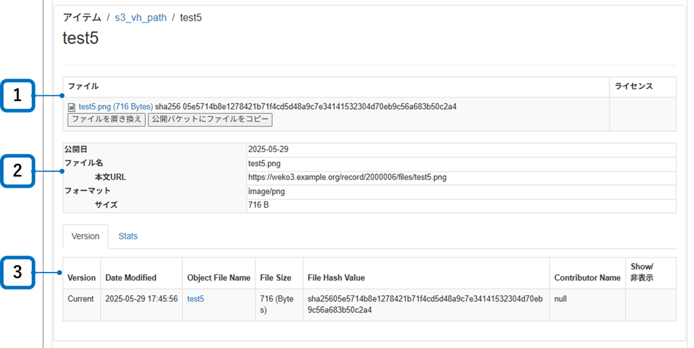  
図 430 ファイル詳細画面

表 4‑10ファイル詳細画面の項目と説明

<table>
<thead>
<tr class="header">
<th>項番</th>
<th>項目</th>
<th>説明</th>
</tr>
</thead>
<tbody>
<tr class="odd">
<td>1</td>
<td>ファイル名情報欄</td>
<td>ファイル名リンクやチェックサムが表示されます。</td>
</tr>
<tr class="even">
<td>2</td>
<td>メタデータ表示欄</td>
<td>ファイルのメタデータが表示されます。</td>
</tr>
<tr class="odd">
<td>3</td>
<td>Version、Status情報表示欄</td>
<td>上部タブの切り替えによって、バージョンや閲覧回数等の等のステータス情報が表示されます。</td>
</tr>
</tbody>
</table>

#### ファイルを置き換える
ワークフロー画面を経由することなく、ファイルの置き換えが行える機能です。  

注：［ファイル置き換え］ボタンおよび［公開バケットへコピー］ボタンは、設定ファイル（instance.cfg）で `WEKO_RECORDS_UI_USER_STORAGE_MODIFICATION_ENABLED = True` が設定されている場合にだけ表示されます（既定の設定は無効（False）です）。詳しくはシステム管理者にお問い合わせください。

1.  アイテムの編集権限があるアカウントでファイル詳細画面を開いた場合、  
    ファイル名情報欄に「ファイル置き換え」ボタンが表示されます。  
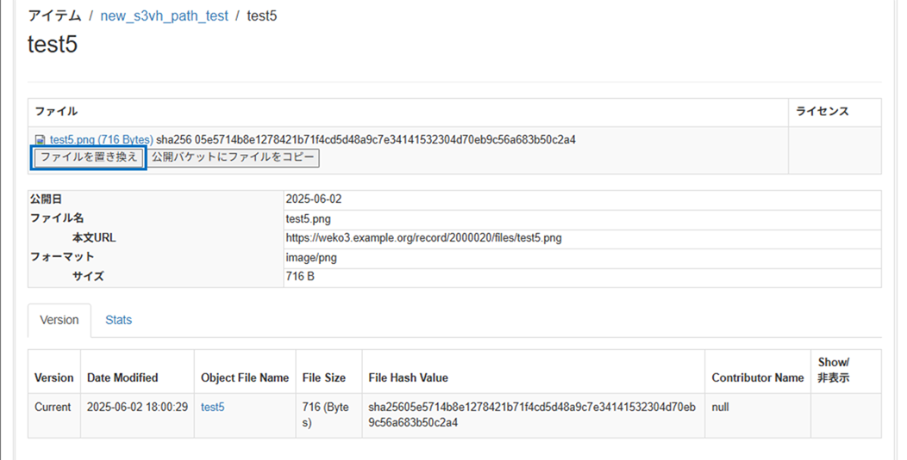  
図 431「ファイル置き換え」ボタン

2.  ボタンを押下すると、エクスプローラーのファイル選択ウィンドウが開きます。  
    置き換えたいファイルを選択し、「開く」ボタンを押下してください。  
    ※元のファイルと同名のファイルのみ選択可能です  
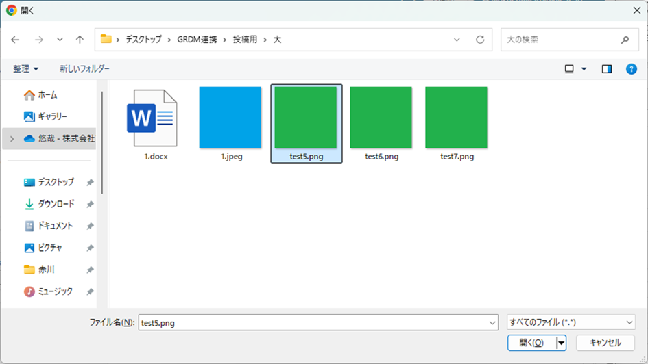  
図 432 ファイル選択画面

3.  置き換え処理が完了すると、処理が完了した旨のメッセージ表示後、アイテム詳細画面に遷移します。  
    該当のファイルは選択したものに置き換えられ、  
    アイテムのバージョンが更新されます。  
    置き換え前の状態に戻したい場合、
    「バージョン削除」ボタンから該当のバージョンを削除することで、元の状態に戻すことができます。  
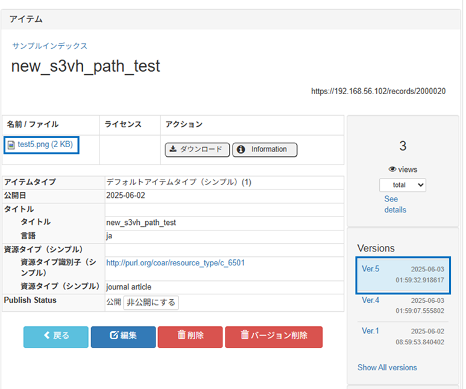  
図 432 ファイル置き換え完了後

#### ファイルを公開バケットへコピーする
該当のファイルを、Amazon S3等の公開バケットへコピーする機能です。  

注：本機能は、設定ファイル（instance.cfg）で `WEKO_RECORDS_UI_USER_STORAGE_MODIFICATION_ENABLED = True` が設定されている場合にだけ利用できます（既定の設定は無効（False）です）。無効の場合、［公開バケットへコピー］ボタンおよびプロフィール画面のS3アカウント情報の項目は表示されません。

1.  コピー先のバケットを取得/作成するために、  
    プロフィール情報にS3のアカウント情報設定が必要になります。  
    設定画面は画面右上のアカウント欄「▼」ボタン→「プロフィール」から開けます。  
    使用するS3アカウント情報を元に図の「6」～「9」の項目を設定してください。  
    （項目「8」：入力例「https://s3.{リージョン名}.amazonaws.com/」）  
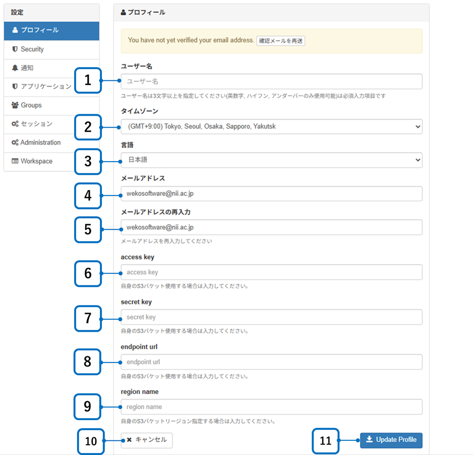  
図 433 プロフィール画面

2.  アイテムの編集権限があるアカウントでファイル詳細画面を開いた場合、  
    ファイル名情報欄に「公開バケットへコピー」ボタンが表示されます。  
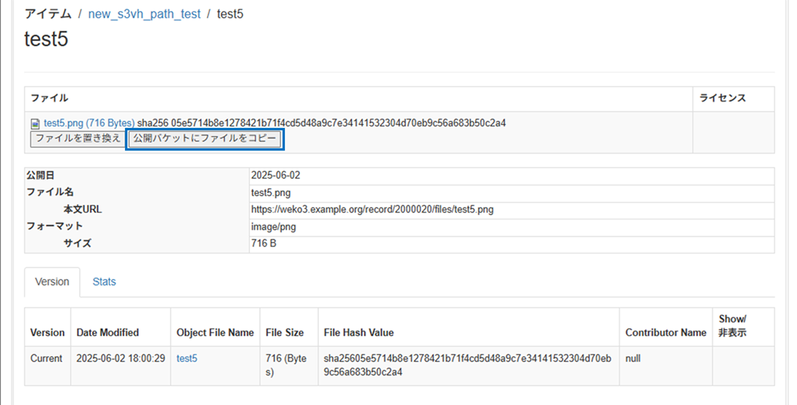  
図 434「公開バケットへコピー」ボタン

3.  ボタンを押下すると、コピー先バケットを選択するモーダルが開きます。  
    コピー先は、1.で設定したアカウント情報を元に取得された既存バケットから選択するか、  
    同アカウント情報を元に新規作成されるバケットとなります。  

    既存バケットを選択する場合、  
    対象のバケットは公開バケット(誰でも書き込み処理等行えるバケット)である必要があります。    
    （元ファイルがS3上に配置されている場合など、コピーを実行するために  
    元ファイル配置元のS3アカウントからコピー先のバケットに対して書き込み処理が行われるため）  
    事前に配置したいバケットの公開設定を行ってください。  

    新規作成バケットにする場合、ラジオボタンを「新規作成バケット名」に切り替えたうえで、  
    作成するバケット名を入力してください。  
    「実行」ボタン押下でコピー処理が実行されます。  
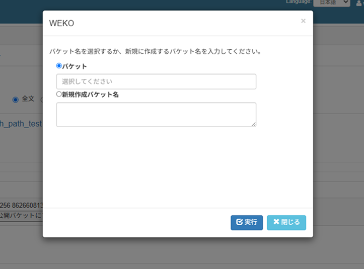  
図 435 バケット選択モーダル

4.  コピー処理が正常に完了すると、モーダル下部に  
    コピーされたファイルのURLが表示されます。URLを控えてください。  
    コピー先のファイルはWEKOの管理対象でないため、後からURLを確認することはできません。  
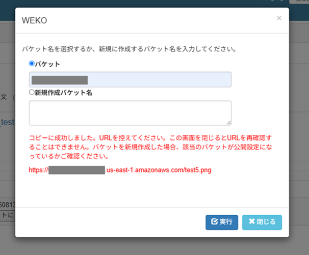  
図 434 コピー完了後

## アイテムを登録する

この章では、アイテムを登録するための操作手順について説明します。

### アイテムを登録する

システムにアイテムを登録する場合、ワークフローのアクティビティを登録する必要があります。ここでは、システムにアクティビティを登録する手順について説明します。

アクティビティの登録は、登録ユーザでログイン後の［ワークフロー］画面から実施します。［ワークフロー］画面の表示方法を次に示します。

1.  ［ホーム］画面から［ワークフロー］タブをクリックします。
    
    ［アクティビティ一覧］画面が表示されます。

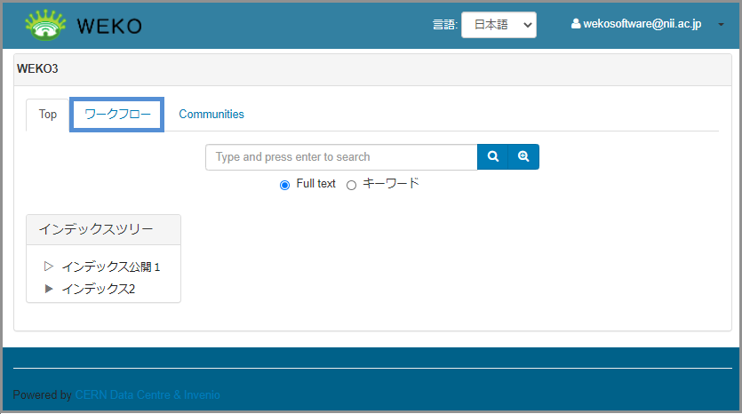

図 5‑1［ホーム］画面

2.  表示された［アクティビティ一覧］画面の［］ボタンをクリックします。
    
    ［ワークフロー選択］画面が表示されます。

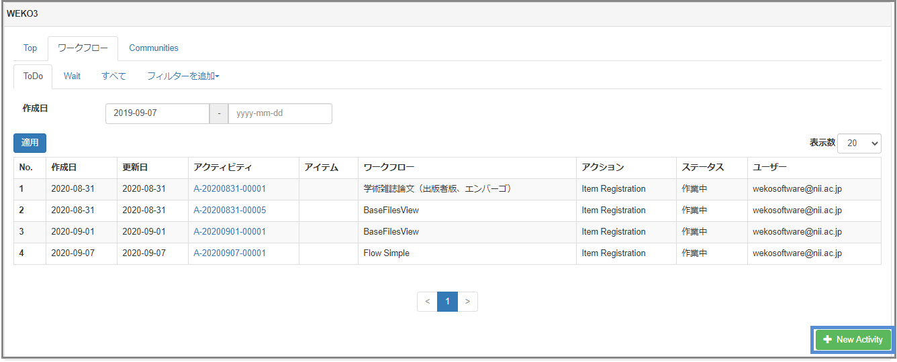

図 5‑2［アクティビティ一覧］画面

> 本画面の詳細については、本マニュアルの「5.2 アクティビティを参照する」を参照してください。

3.  表示された［ワークフロー選択］画面の登録するアイテムに対応するワークフローの［］ボタンをクリックします。

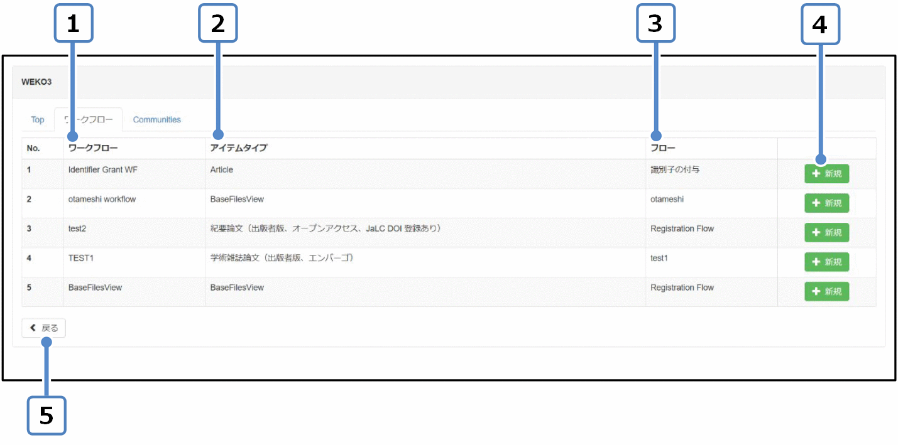

図 5‑3［ワークフロー選択］画面

表 5‑1［ワークフロー選択］画面の項目と説明

| 項番 | 項目                                           | 説明                                                                            |
| -- | -------------------------------------------- | ----------------------------------------------------------------------------- |
| 1  | ワークフロー                                       | アイテムタイプとフローを組み合わせたデータ登録の一連の処理です。管理者が作成します。                                    |
| 2  | アイテムタイプ                                      | 登録するデータのタイプです。                                                                |
| 3  | フロー                                          | データを登録する際に実行する処理（アクション）の組み合わせです。アクションについては、「表 5-2［ステップ］画面のアクション名と説明を参照してください。 |
| 4  | ［］ボタン | クリックすると、［アクション］画面に遷移します。                                                      |
| 5  | ［］ボタン | クリックすると、［アクティビティ一覧］画面に遷移します。                                                  |

> 選択したワークフローの先頭に登録されているフローの［ステップ］画面が表示されます。

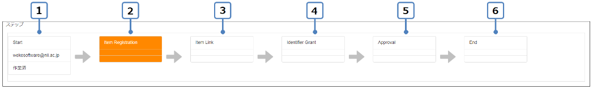

図 5‑4［ステップ］画面

表 5‑2［ステップ］画面のアクション名と説明

| 項番 | アクション名            | 説明                                |
| -- | ----------------- | --------------------------------- |
| 1  | Start             | アイテム登録開始のアクションです。                 |
| 2  | Item Registration | アイテムのメタデータとコンテンツファイルを登録するアクションです。 |
| 3  | Item Link         | アイテムにリンク設定するアクションです。              |
| 4  | Identifier Grant  | アイテムにDOIを付与するアクションです。             |
| 5  | Approval          | アイテムを査読／承認するアクションです。              |
| 6  | End               | アイテム登録終了のアクションです。                 |

4.  表示されたフローの［ステップ］画面に対応するアクションを実施します。
    
    詳細については、「5.1 アイテムを登録する」の「アイテムを登録する」から「DOIを付与する」までを参照してください。

#### アイテムを登録する

アクティビティにファイルおよびメタデータを入力する手順について説明します。

1.  アイテムのサムネイルを登録する

アイテムのサムネイルを登録する手順について説明します。

1.  表示されたItem Registration画面で、［Drop files or folders here］に登録するファイルをドラッグ＆ドロップするか、［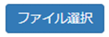］ボタンをクリックします。

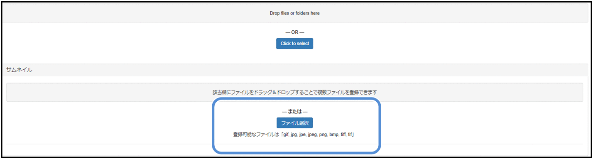

> 図 5‑5 Item Registration画面
> 
> 「アップロードファイル選択」ダイアログが表示されます。

2.  > 表示された「アップロードファイル選択」ダイアログでアップロードするファイルを選択後、［開く］ボタンをクリックします。

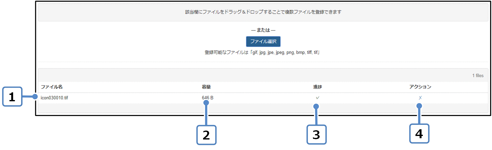

> 図 5‑6［サムネイル登録］画面
> 
> ファイル情報が表示されます。

表 5-5［サムネイル登録］画面の項目と説明

| 項番 | 項目                                   | 説明                                                             |
| -- | ------------------------------------ | -------------------------------------------------------------- |
| 1  | ファイル名                                | 登録するファイル名が表示されます。                                              |
| 2  | 容量                                   | 登録するファイルのサイズが表示されます。                                           |
| 3  | 進捗                                   | ファイルの登録が完了すると［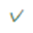］が表示されます。 |
| 4  | アクション［］ | クリックすると、登録したファイルが削除されます。                                       |

##### メタデータを自動的に入力する

外部データベースからメタデータを自動的に入力する手順について説明します

1.  表示されたItem Registration画面で、［］ボタンをクリックします。
    
    ［メタデータの自動入力］画面が表示されます。
    
    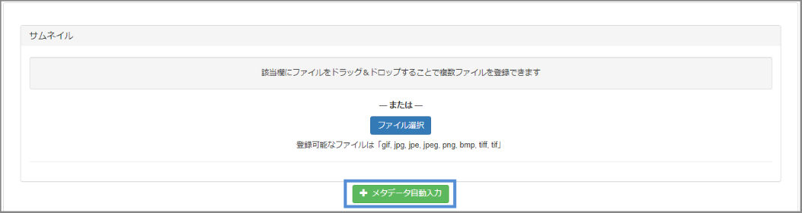

図 5‑7［メタデータの自動入力］画面

2.  表示された［メタデータの自動入力］で［ID選択］を選択し、IDを入力した後に［］ボタンをクリックします。
    
    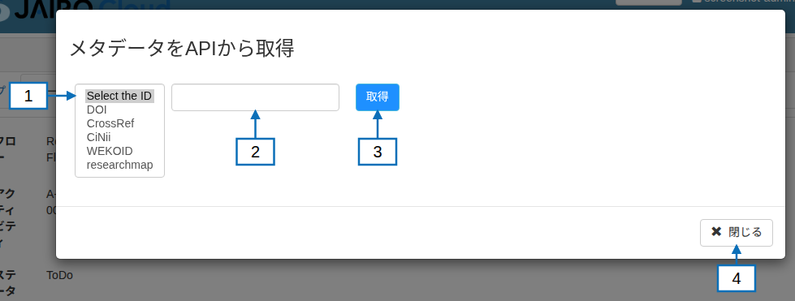

図 5‑8［メタデータの自動入力］画面

表 5‑6［メタデータの自動入力］画面の項目と説明

<table>
<thead>
<tr class="header">
<th>項番</th>
<th>項目</th>
<th>説明</th>
</tr>
</thead>
<tbody>
<tr class="odd">
<td>1</td>
<td>ID選択</td>
<td>
外部データベースを選択します。

外部データベースは、CrossRef、CiNii（CiNii Research）、WEKOID（WEKO内のアイテムのID）、researchmapが利用できます。CrossRefを利用するには、管理画面でCrossRefのAPI認証情報が設定されている必要があります。

instance.cfg の WEKO_ITEMS_AUTOFILL_TO_BE_USED に利用するAPI（JaLC API、医中誌 Web API、CrossRef、DataCite、CiNii Research）を設定している場合は、「DOI」も選択できます。「DOI」を選択した場合は、設定した各APIからメタデータを取得し、設定の先頭にあるAPIほど優先して統合した結果を入力します。
</td>
</tr>
<tr class="even">
<td>2</td>
<td>ID</td>
<td>該当するIDを入力します。</td>
</tr>
<tr class="odd">
<td>3</td>
<td>［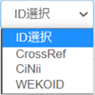］</td>
<td>
クリックすると、指定したタイプ及び入力したIDに従って情報取得が実行されます。取得結果は、Item Registration画面にて、JPCOARマッピング(jpcoar_v2_mapping)が設定されたメタデータ項目に自動的に入力されます。

<ul>
<li><blockquote>

CrossRef APIに対して、JPCOARスキーマのマッピングの情報は以下の通りです。

</blockquote></li>
</ul>
<ul>
<li><blockquote>

dc:title

</blockquote></li>
<li><blockquote>

dc:language

</blockquote></li>
<li><blockquote>

jpcoar:creatorName

</blockquote></li>
<li><blockquote>

jpcoar:numPages、jpcoar:pageStart、jpcoar:pageEnd

</blockquote></li>
<li><blockquote>

datacite:date

</blockquote></li>
<li><blockquote>

dc:publisher

</blockquote></li>
<li><blockquote>

jpcoar:relatedIdentifier

</blockquote></li>
</ul></td>
</tr>
<tr class="even">
<td>4</td>
<td>［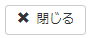］ボタン</td>
<td>クリックすると、Item Registration画面のメタデータ入力項目にメタデータを反映せず［メタデータの自動入力］画面が閉じます。</td>
</tr>
</tbody>
</table>

| **データ**   | **パス**                                          | **対応するJPCOARマッピング**                   |
| --------- | ----------------------------------------------- | ------------------------------------- |
| タイトル      | dc:title                                        | dc:title                              |
| 別タイトル     | dcterms:alternative                             | dc:title                              |
| 成果物識別子    | productIdentifier.identifier(type=xx)           | jpcoar:relation                       |
| 著者名       | creator.foaf:name                               | jpcoar:creatorName                            |
| 著者識別子     | creator.personIdentifier                        |                                       |
| 著者所属名     | creator.jpcoar:affiliationName                  |                                       |
| 寄与者名      | contributor.foaf:name                           | jpcoar:contributorName |
| 寄与者所属名    | contributor.jpcoar:affiliationName              |                                       |
| 寄与者識別子    | contributor.personIdentifier                    |                                       |
| 収録物識別子    | publication.publicationidentifier               |                                       |
| 収録物名      | publication.prism:publicationName               | jpcoar:sourceTitle                 |
| 収録物発行日    | publication.prism:publicationDate               |                                       |
| 巻         | publication.prism:volume                        | jpcoar:volume                          |
| 号         | publication.prism:number                        | jpcoar:issue                          |
| 開始ページ     | publication.prism:startingPage                  | jpcoar:pageStart                    |
| 終了ページ     | publication.prism:endingPage                    | jpcoar:pageEnd                      |
| 総ページ数     | publication.jpcoar:numPages                     | jpcoar:numPages                       |
| 発行者       | publication.dc:publisher                        | dc:publisher                          |
| 日付        | publication.prism:publicationDate               | datacite:date               |
| 収録誌のNCID  | publication.publicationIdentifier(@type=NCID)   |jpcoar:sourceIdentifier                            |
| 収録誌のISSN  | publication.publicationIdentifier(@type=ISSN)   | jpcoar:sourceIdentifier                            |
| 学位授与番号    | ndl:dissertationNumber                          |                                       |
| 学位名       | ndl:degreeName                                  |                                       |
| 学位授与年月日   | ndl:dateGranted                                 |                                       |
| 学位授与機関識別子 | degreeAwardInstitution.institutionIdentifier    |                                       |
| 学位授与機関名   | degreeAwardInstitution.jpcoar:degreeGrantorName |                                       |
| 学会、会議名    | jpcoar:conferenceName                           |                                       |
| 開催地       | jpcoar:conferencePlace                          |                                       |
| 開催期間(開始日) | jpcoar:conferenceDate.jpcoar:startDay           |                                       |
| 開催期間(開始月) | jpcoar:conferenceDate.jpcoar:startMonth         |                                       |
| 開催期間(開始年) | jpcoar:conferenceDate.jpcoar:startYear          |                                       |
| 開催期間(終了日) | jpcoar:conferenceDate.jpcoar:endDay             |                                       |
| 開催期間(終了月) | jpcoar:conferenceDate.jpcoar:endDay             |                                       |
| 開催期間(終了年) | jpcoar:conferenceDate.jpcoar:endDay             |                                       |
| 助成機関名     | fundingProgram.notation                         |                                       |
| 関連物関連タイプ  | relatedProduct.relationType                     |                                       |
| 関連物識別子    | relatedProduct.productIdentifier                |                                       |
| 関連物タイトル   | relatedProduct.jpcoar:relatedTitle              |                                       |
| 抄録タイプ     | description.type                                | typeはAbstraction固定                    |
| 抄録本文      | description.notation                            | dc:description                        |
| 主題URL     | foaf:topic.@id                                  | jpcoar:subject                        |
| 主題タイトル    | foaf:topic.dc:title                             | jpcoar:subject                        |
| バージョン     | datacite:version                                |                                       |
| 言語        | dc:language                                     |                                       |

【補足】

・複数のプロパティに同じマッピング情報が設定されている場合、1つ目（1番上）のプロパティにのみセットします。（例：アイテムタイプの中に「ISBN」「ISSN」の順でプロパティが含まれており、いずれも「jpcoar: sourceIdentifier」にマッピングされていた場合、［メタデータの自動入力］でデータを取り込むと「ISBN」にデータがセットされます。）

##### researchmap からメタデータを自動入力する

researchmapからメタデータを自動で入力する手順を説明します。

1.	Select the IDでresearchmapを選択します。
［メタデータの自動入力］画面が以下のようになります。

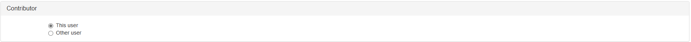

2.	parmalink、業績種別、業績IDを入力します。

ⅰ. parmalink

parmalinkとは、researchmapでの新規登録の際にご入力いただくリンク識別子のことを言います。「マイポータル」（researchmapの公開用ウェブページ）にアクセスするための研究者詳細ページURL末尾に付く文字列です。英数字記号混合で3～20文字で構成されており、以下の文字を含む場合、エラーとなります。

・使用不可文字
% # < > + ¥ " ' & ? = ~ : ; , @ $ ^ | ] [ ! ( ) * /

ⅱ. 業績種別

業績種別は、以下の6種に対応しています。
　論文、MISC、書籍等出版物、講演・口頭発表等、Works（作品等）、その他
デフォルトでは、「論文」が設定されています。

ⅲ. 業績ID

業績IDとは、researchmapに登録されている業績を特定するIDです。数字以外の文字を含むとエラーとなります。
上記ⅰ～ⅲのURL構成は、以下のようになります。

　https://researchmap.jp/{parmalink}/{業績種別}/{業績ID}

3.	[取得]ボタンをクリックします。
入力した情報に誤りがない場合、メタデータが自動入力されます。
自動入力の対象となるメタデータは、業績種別ごとに以下の表5-7のようになっています。

自動入力対象メタデータ一覧

|業績種別|メタデータ|
|---|---|
|論文|タイトル、作成者、内容記述、出版者、日付、収録物名、巻、号、開始ページ、終了ページ、言語、関連情報識別子、資源タイプ|
|MISC|タイトル、作成者、内容記述、出版者、日付、収録物名、巻、号、開始ページ、終了ページ、言語、関連情報識別子、資源タイプ|
|書籍等出版物|タイトル、作成者、内容記述、出版者、日付、ページ数、言語、関連情報識別子、資源タイプ|
|講演・口頭発表等|タイトル、作成者、内容記述、日付、会議記述、資源タイプ|
|Works（作品など）|タイトル、作成者、内容記述、関連情報識別子、資源タイプ|
|その他|タイトル、内容記述、資源タイプ|

##### 投稿者を設定する

投稿者を設定する手順について説明します。

1.  表示されたItem Registration画面で、投稿者の「This user」が選択されているところから「Other user」をラジオボタンから選択します。

図 5‑9 投稿者の設定画面

> ユーザ情報入力項目が表示されます。

2.  表示されたユーザ情報入力項目にユーザ名とメールアドレスを入力します。

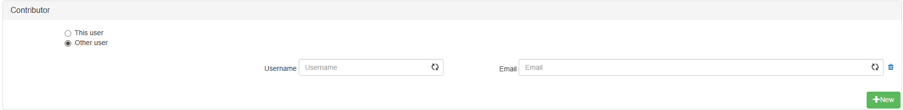

> 図 5‑10\[ユーザ情報入力項目\]画面

［Username］、または［Email］に入力すると、リポジトリに登録されているユーザが候補一覧に表示されます。ユーザ候補一覧からユーザを選択すると、選択したユーザのユーザ名とメールアドレスが設定されます。

投稿者として指定されたユーザは、アイテム登録者と同様に該当アイテムの編集権限が付与されます。投稿者の設定は1つのユーザのみにできます。

入力したユーザがリポジトリに存在しない場合、［Shared user information is not valid/Please check it again\!］というエラーメッセージが表示されます。

入力したユーザがアイテム登録ユーザの場合、［You cannot specify yourself in "Other users" setting.］というエラーメッセージが表示されます。

##### 代理投稿者を複数人登録する

・本機能は、試験的な機能です。JAIRO Cloud環境で提供しておりません

> 代理投稿者として指定されたユーザは、アイテム登録者と同様に該当アイテムの登録(編集)権限が付与されます。 

> 代理投稿拡張機能が有効の場合は代理投稿者を複数指定することができます。

> []ボタンをクリックすると新規行が表示されます。

> 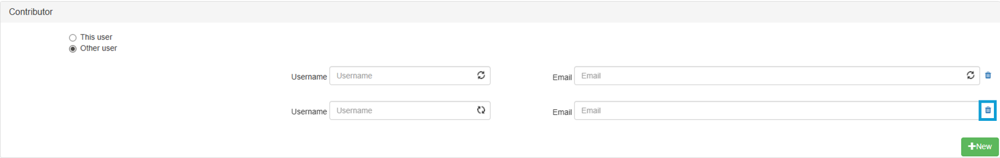

> 図511\[ユーザ情報入力項目\]画面 新規行

> \[\]ボタンをクリックすると、行が削除されます。

#### ファイルを登録する

コンテンツファイルを登録する手順について説明します。

1.  表示されたItem Registration画面で、［Drop files or folders here］に登録するファイルをドラッグ＆ドロップするか、または［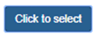］ボタンをクリックします。

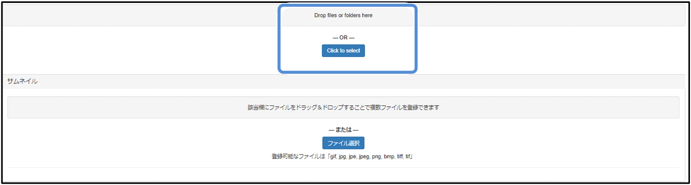

> 図 5‑11\[Item Registration\]画面
> 
> 「アップロードファイル選択」ダイアログが表示されます。

2.  表示された「アップロードファイル選択」ダイアログでアップロードするファイルを選択した後、［開く］ボタンをクリックします。
    
    ファイル情報が表示されます。
    
    同一のファイル名を選択する場合、エラーメッセージ「同一のファイル名は登録できません。」が表示されます。

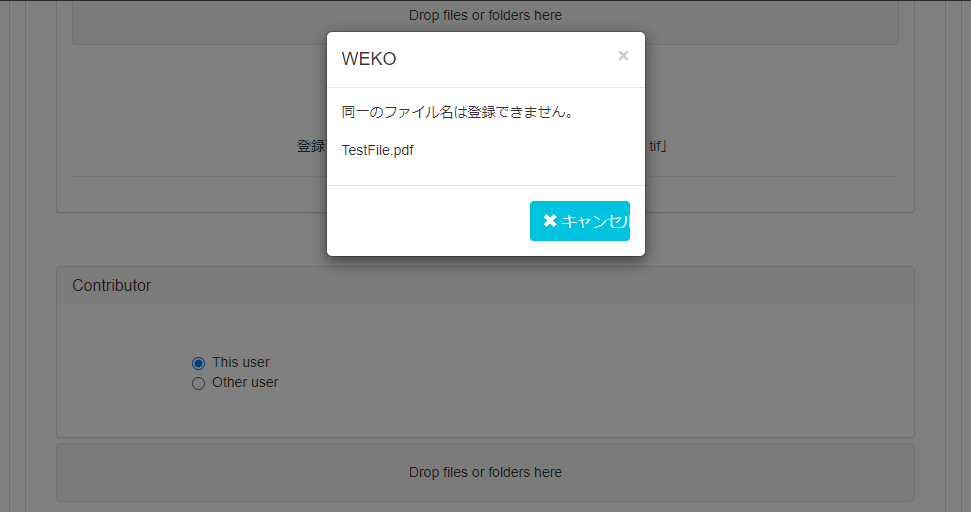

> 図 5‑12エラーメッセージ「同一のファイル名は登録できません。」

3.  表示されたファイル情報の［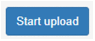］ボタンをクリックします。

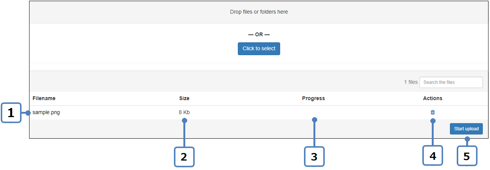

図 5‑13ファイル情報画面

　　

ファイルがアップロードされます。

アップロードするファイルがリポジトリ内で登録できる許容サイズを超える場合はエラーメッセージ「Error:Location has no quota」が表示され、登録することはできません。

また、アップロードに使用できるファイルのサイズは20GBまでとなっています。それを超える場合、アップロードを行うことはできません。

正常にアップロードが完了すると、「表示名」「本文URL」「フォーマット」「サイズ」の値が自動で入力されます。

【補足】

複数のファイルがある場合、アイテム詳細画面での表示順序は、\[Item

Registration\]画面で表示されるファイル情報の入力エリア順となります。また、入力エリアの順序をドラッグ&ドロップで変更することで、アイテム詳細画面でのファイルの表示順序を変更することができます。

表 5‑7［ファイル登録］画面の項目と説明

<table>
<thead>
<tr class="header">
<th>項番</th>
<th>項目</th>
<th>説明</th>
</tr>
</thead>
<tbody>
<tr class="odd">
<td>1</td>
<td>［Filename］</td>
<td>登録するファイル名が表示されます。</td>
</tr>
<tr class="even">
<td>2</td>
<td>［Size］</td>
<td>登録するファイルのサイズが表示されます。</td>
</tr>
<tr class="odd">
<td>3</td>
<td>［Progress］</td>
<td>
［］ボタンをクリック後アップロード進捗状況が「％」で表示されます。アップロードが完了すると［］が表示されます。

[Error]とともに[Resume]ボタンが表示される場合は、そのファイルのアップロードが中断したところから再度アップロードができます。
</td>
</tr>
<tr class="even">
<td>4</td>
<td>［］ボタン</td>
<td>クリックすると、登録したファイルが削除されます。</td>
</tr>
<tr class="odd">
<td>5</td>
<td>［］ボタン</td>
<td>クリックすると、アップロードが開始されます。</td>
</tr>
</tbody>
</table>

4.  ファイルの情報を入力します。

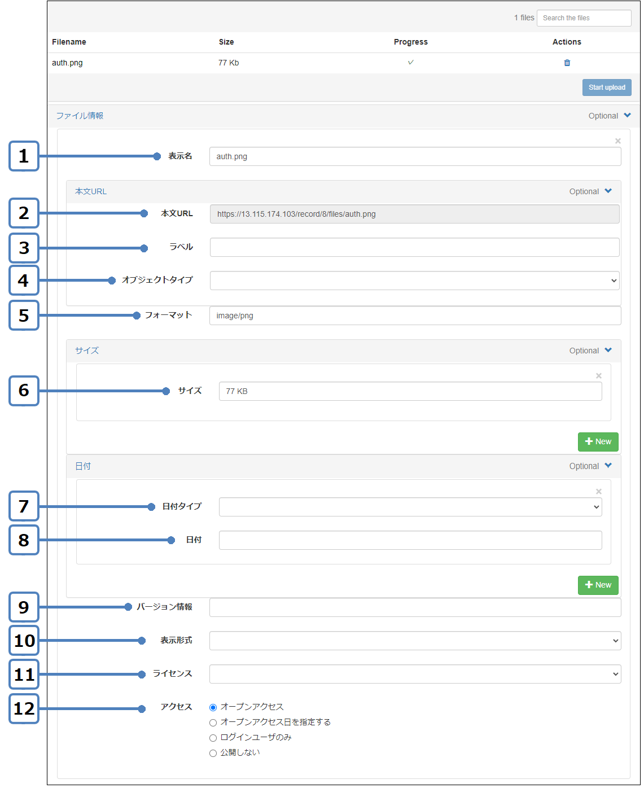

図 5‑14ファイル情報入力画面

以下機能は、＜利用申請機能 先行利用機関＞に提供している機能です。当機能の先行利用を申請していな機関は、利用できません。
この機能の利用に興味のある方はwekosoftware@nii.ac.jpへお問い合わせください

> 制限公開用アイテムタイプのファイルの情報は以下の通りです。

> ライセンス項目まではファイル情報と同じ構成です。

> 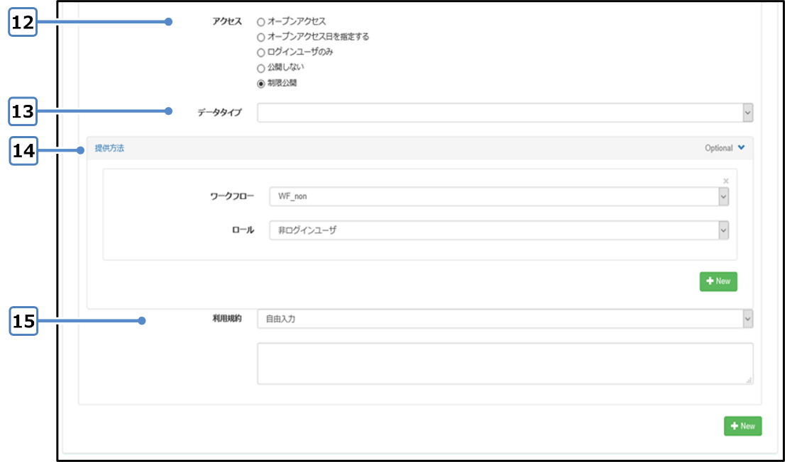

> 図 5‑15ファイル情報入力画面(制限公開用)

表 5-8［ファイル情報］画面の項目と説明

<table>
<thead>
<tr class="header">
<th>項番</th>
<th>項目</th>
<th>説明</th>
</tr>
</thead>
<tbody>
<tr class="odd">
<td>1</td>
<td>［表示名］</td>
<td>アップロードしたファイル名が表示されます。また、ファイルをアップロードせず手入力することも可能です。</td>
</tr>
<tr class="even">
<td>2</td>
<td>［本文URL］</td>
<td>
アップロードしたファイルのURLが表示されます。

ファイル名をWEKO3へアップロードしたファイルとした場合、そのファイルのURLが自動で設定され、変更不可となります。

ファイル名を手入力した場合はURLも手入力してください。
</td>
</tr>
<tr class="odd">
<td>3</td>
<td>［ラベル］</td>
<td>
アイテム詳細画面に表示するファイルのリンク名を入力します。入力しない場合はファイル名が表示されます。

リンク名の表示については、「ファイルを設定する」を参照してください。
</td>
</tr>
<tr class="even">
<td>4</td>
<td>［オブジェクトタイプ］</td>
<td>ファイルのオブジェクトタイプを指定します。選択肢は、「図 5-16［オブジェクトタイプ］プルダウンリストを参照してください。</td>
</tr>
<tr class="odd">
<th>5</th>
<th>［フォーマット］</th>
<th>
ファイルのフォーマットを入力します。

ファイル名をWEKO3へアップロードしたファイルとした場合、そのファイルのフォーマットが自動で設定されます（変更可能）

ファイル名を手入力した場合は自動で設定されません。
</th>
</tr>
<tr class="even">
<td>6</td>
<td>［サイズ］</td>
<td>
ファイルのサイズを入力します。

ファイル名にWEKO3へアップロードしたファイルを選択した場合、そのファイルのサイズが自動で設定されます。（変更可能）

ファイル名を手入力した場合は自動で設定されません。

サイズは複数指定できます。
</td>
</tr>
<tr class="odd">
<td>7</td>
<td>［日付］の［日付タイプ］</td>
<td>
日付タイプを選択します。

選択肢は、「図 5-17［日付タイプ］プルダウンリスト」を参照してください。
</td>
</tr>
<tr class="even">
<td>8</td>
<td>［日付］の［日付］</td>
<td>日付をプルダウンリストから選択または直接入力します。日付の入力フォーマットは、［<em>yyyy-mm-dd、yyyy-mm、yyyy</em>］のISO-8601形式で指定します。</td>
</tr>
<tr class="odd">
<td>9</td>
<td>［バージョン情報］</td>
<td>ファイルのバージョン情報を入力します。</td>
</tr>
<tr class="even">
<td>10</td>
<td>［表示形式］</td>
<td>
ファイルの表示形式を指定します。

詳細については、「ファイルを設定する」を参照してください。
</td>
</tr>
<tr class="odd">
<td>11</td>
<td>［ライセンス］</td>
<td>
ファイルのライセンスを指定します。

詳細については、「ファイルを設定する」を参照してください。

なお、詳細検索にある「License」の検索項目は本項目で設定した値で検索を行います。
</td>
</tr>
<tr class="even">
<td>12</td>
<td>［アクセス］</td>
<td>
ファイルの公開方法を設定します。

詳細については、「ファイルの公開方法を設定する」を参照してください。
</td>
</tr>
<tr class="odd">
<td>13</td>
<td>［データタイプ］</td>
<td>
［アクセス］で［制限公開］を選択している時に表示します。

設定の必要はありません。
</td>
</tr>
</tbody>
</table>

*本項目は、[アクセス]で[制限公開]を選択しているときに表示されます。

> <table>
> <thead>
> <tr class="header">
> <th>項番</th>
> <th>項目</th>
> <th>説明</th>
> </tr>
> </thead>
> <tbody>
> <tr class="odd">
> <td>14</td>
> <td>［提供方法］</td>
> <td>
> 
アイテム詳細画面で［申請］を押下した際、どの利用申請ワークフローを起動するか設定します。複数設定できる（繰り返し可）として、以下の項目を子項目とします。

> 
◾［ワークフロー］：Admin&gt;WorkFlow&gt;WorkFlow Listで管理しているワークフローのうち「制限公開フラグ」が有効なものをリストに表示します。

> 
＊実証実験に参加されている機関様に「利用規約」を提供しております。

> 
◾［ロール］：Admin&gt;UserManagement&gt;Roleで管理しているロールと「非ログインユーザ」をリストに表示します。
</th>
> </td>
> </thead>
> <tr class="even">
> <td>15</td>
> <td>［利用規約］</td>
> <td>
> 
管理画面で登録した利用規約をリストで表示します。選択肢に「自由入力」を設け、選択した際はテキストエリアが表示され、当該コンテンツの利用規約を設定することができます。
</td>
> </tr>
> </tbody>
> </table>

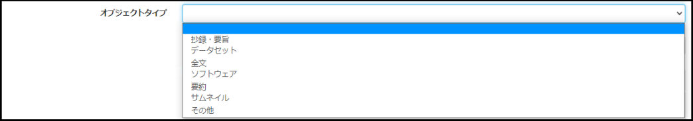

> 図 5‑16［オブジェクトタイプ］プルダウンリスト

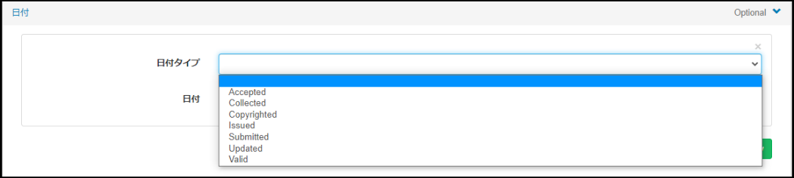

図 5‑17［日付タイプ］プルダウンリスト

1.  ファイルを設定する

ファイルの表示形式、本文へのリンク名とライセンス表記の設定をする手順について説明します。

1.  表示されたItem Registration画面で、コンテンツファイルの表示名に設定するファイルを選択します。

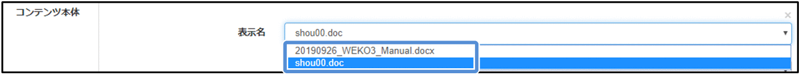

> 図 5‑18［表示名］プルダウンリスト

2.  表示形式をプルダウンリストから選択します。

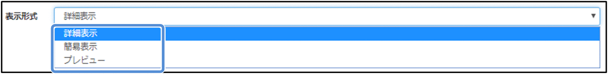

図 5‑19［表示形式］プルダウンリスト

表 5-9［表示形式］プルダウンリストの表示形式と説明

| 項番 | 表示形式  | 説明                                       |
| -- | ----- | ---------------------------------------- |
| 1  | 詳細表示  | 本文へのリンク名、ファイルサイズ、ライセンスを表示します。            |
| 2  | 簡易表示  | 本文へのリンク名のみを表示します。                        |
| 3  | プレビュー | ファイルのプレビュー、本文へのリンク名、ファイルサイズ、ライセンスを表示します。 |

【注意事項】

プレビューの表示にはWEKO管理で設定される必要があります。

［プレビュー］を表示できるファイル形式はmd、json、xml、csv、pdf、png、jpg、gif、zip、jpynb、mp3、mp4、webm、ogg、wav、 doc、docx、xls、xlsx、ppt、pptxです。

プレビューの表示でエラーが発生する場合、エラー内容がプレビュー表示エリアに表示されます。

3.  ライセンスをプルダウンリストから選択します。

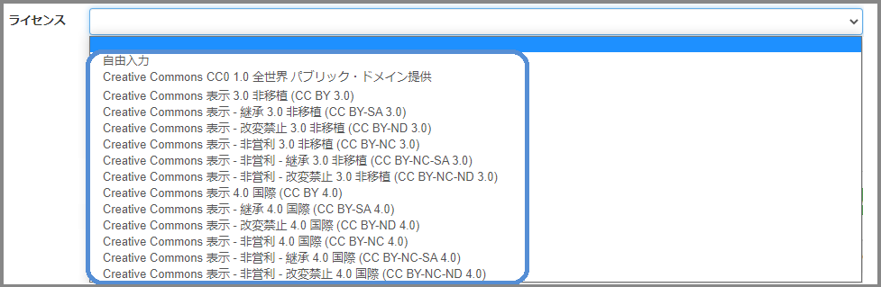

図 5‑20［ライセンス］プルダウンリスト

表 5-10［ライセンス］プルダウンリストの項目と説明

<table>
<thead>
<tr class="header">
<th>項番</th>
<th>項目</th>
<th>説明</th>
</tr>
</thead>
<tbody>
<tr class="odd">
<td>1</td>
<td>自由入力</td>
<td>テキストエリアが表示され、ユーザ自身でライセンス情報を入力できます。「図 5-21［自由入力］テキストボックス」を参照してください。</td>
</tr>
<tr class="even">
<td>2</td>
<td>Creative Commons CC0 1.0 全世界 パブリック・ドメイン提供</td>
<td>パブリック・ドメインとします。</td>
</tr>
<tr class="odd">
<td>3</td>
<td>Creative Commons 表示 3.0 非移植 (CC BY 3.0)</td>
<td><ul>
<li>
ライセンスバージョン：3.0
</li>
<li>
著作者の表示をします。
</li>
<li>
非移植とします。
</li>
</ul></td>
</tr>
<tr class="even">
<td>4</td>
<td>Creative Commons 表示 - 継承 3.0 非移植 (CC BY-SA 3.0)</td>
<td><ul>
<li>
ライセンスバージョン：3.0
</li>
<li>
著作者の表示をします。
</li>
<li>
派生作品に元のライセンスを継承します。
</li>
<li>
非移植とします。
</li>
</ul></td>
</tr>
<tr class="odd">
<td>5</td>
<td>Creative Commons 表示 - 改変禁止 3.0 非移植 (CC BY-ND 3.0)</td>
<td><ul>
<li>
ライセンスバージョン：3.0
</li>
<li>
著作者の表示をします。
</li>
<li>
作品の改変を禁止します。
</li>
<li>
非移植とします。
</li>
</ul></td>
</tr>
<tr class="even">
<td>6</td>
<td>Creative Commons 表示 - 非営利 3.0 非移植 (CC BY-NC 3.0)</td>
<td><ul>
<li>
ライセンスバージョン：3.0
</li>
<li>
著作者の表示をします。
</li>
<li>
非営利での利用に限定します。
</li>
<li>
非移植とします。
</li>
</ul></td>
</tr>
<tr class="odd">
<td>7</td>
<td>Creative Commons 表示 - 非営利 - 継承 3.0 非移植 (CC BY-NC-SA 3.0)</td>
<td><ul>
<li>
ライセンスバージョン：3.0
</li>
<li>
著作者の表示をします。
</li>
<li>
非営利での利用に限定します。
</li>
<li>
派生作品に元のライセンスを継承します。
</li>
<li>
非移植とします。
</li>
</ul></td>
</tr>
<tr class="even">
<td>8</td>
<td>Creative Commons 表示 - 非営利 - 改変禁止 3.0 非移植 (CC BY-NC-ND 3.0)</td>
<td><ul>
<li>
ライセンスバージョン：3.0
</li>
<li>
著作者の表示をします。
</li>
<li>
非営利での利用に限定します。
</li>
<li>
作品の改変を禁止します。
</li>
<li>
非移植とします。
</li>
</ul></td>
</tr>
<tr class="odd">
<td>9</td>
<td>Creative Commons 表示 4.0 国際 (CC BY 4.0)</td>
<td><ul>
<li>
ライセンスバージョン：4.0
</li>
<li>
著作者の表示をします。
</li>
</ul></td>
</tr>
<tr class="even">
<td>10</td>
<td>Creative Commons 表示 - 継承 4.0 国際 (CC BY-SA 4.0)</td>
<td><ul>
<li>
ライセンスバージョン：4.0
</li>
<li>
著作者の表示をします。
</li>
<li>
派生作品に元のライセンスを継承します。
</li>
</ul></td>
</tr>
<tr class="odd">
<td>11</td>
<td>Creative Commons 表示 - 改変禁止 4.0 国際 (CC BY-ND 4.0)</td>
<td><ul>
<li>
ライセンスバージョン：4.0
</li>
<li>
著作者の表示をします。
</li>
<li>
作品の改変を禁止します。
</li>
</ul></td>
</tr>
<tr class="even">
<td>12</td>
<td>Creative Commons 表示 - 非営利 4.0 国際 (CC BY-NC 4.0)</td>
<td><ul>
<li>
ライセンスバージョン：4.0
</li>
<li>
著作者の表示をします。
</li>
<li>
非営利での利用に限定します。
</li>
</ul></td>
</tr>
<tr class="odd">
<td>13</td>
<td>Creative Commons 表示 - 非営利 - 継承 4.0 国際 (CC BY-NC-SA 4.0)</td>
<td><ul>
<li>
ライセンスバージョン：4.0
</li>
<li>
著作者の表示をします。
</li>
<li>
非営利での利用に限定します。
</li>
<li>
派生作品に元のライセンスを継承します。
</li>
</ul></td>
</tr>
<tr class="even">
<td>14</td>
<td>Creative Commons 表示 - 非営利 - 改変禁止 4.0 国際 (CC BY-NC-ND 4.0)</td>
<td><ul>
<li>
ライセンスバージョン：4.0
</li>
<li>
著作者の表示をします。
</li>
<li>
非営利での利用に限定します。
</li>
<li>
作品の改変を禁止します。
</li>
</ul></td>
</tr>
</tbody>
</table>

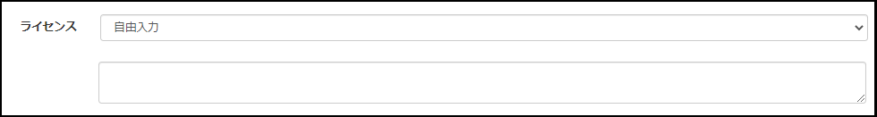

図 5‑21［自由入力］テキストボックス

1.  ファイルの公開方法を設定する

ファイルの公開方法を設定する手順について説明します。

1.  公開方法を［アクセス］ラジオボタンで指定します。

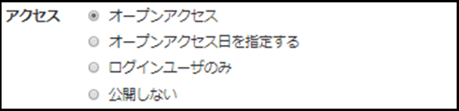

図 5‑22［アクセス］ラジオボタン

＜利用申請機能 先行利用機関＞に提供している機関には、以下のアクセス情報を持つアイテムを提供しております。

> 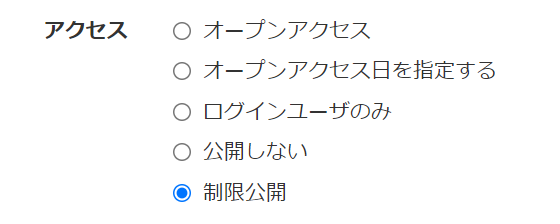

> 図 5‑23制限公開用のアクセス情報

表 5-11［アクセス］ラジオボタンの公開方法と説明

<table>
<thead>
<tr class="header">
<th>項番</th>
<th>公開方法</th>
<th>説明</th>
</tr>
</thead>
<tbody>
<tr class="odd">
<td>1</td>
<td>［オープンアクセス］</td>
<td>すべてのユーザがダウンロードできます。</td>
</tr>
<tr class="even">
<td>2</td>
<td>［オープンアクセス日を指定する］</td>
<td>
ファイルの公開日を指定することができます。

<ul>
<li>
公開日が過ぎるまではログインしたユーザのみがダウンロードできます。
</li>
<li>
公開日を過ぎた場合はすべてのユーザがダウンロードできます。

「図 5-24［公開日］テキストボックス」を参照してください。
</li>
</ul></td>
</tr>
<tr class="odd">
<td>3</td>
<td>［ログインユーザのみ］</td>
<td>
グループユーザを設定します。

設定されているグループに所属するユーザのみダウンロードできます。

「図 5-25［グループ］テキストボックス」を参照してください。
</td>
</tr>
<tr class="even">
<td>4</td>
<td>［公開しない］</td>
<td>管理者、アイテムの作成者・投稿者のみがダウンロードできます。</td>
</tr>
<!--
<tr class="odd">
<td>5</td>
<td>［制限公開］</td>
<td>
クリックしている場合は「表 5-8［ファイル情報］画面の項目と説明」の項番13～15を表示します。詳細については、「表 5-8［ファイル情報］画面の項目と説明」を参照してください。

［制限公開］を選択しても ［アクセス権］は自動的に設定されません。［アクセス権］については「アクセス権を設定する」を参照してください。
</td>
</tr>
-->
</tbody>
</table>

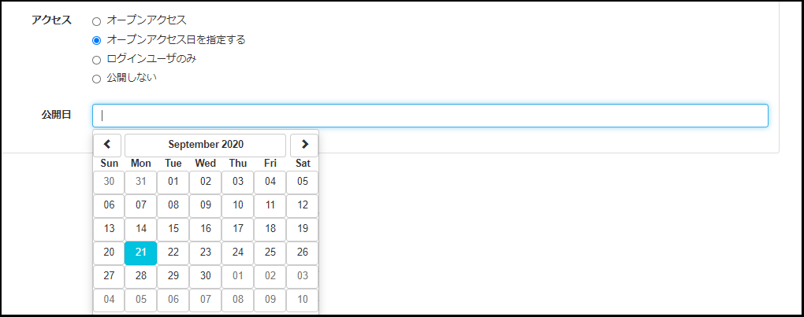

図 5‑24［公開日］テキストボックス

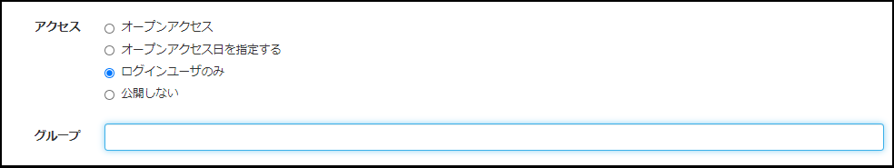

図 5‑25［グループ］テキストボックス

【ファイルの差し替えについて】

ファイルを添付しているアイテムを編集する際に、ファイルの差し替えを行うことができます（ファイルを差し替えて、統計情報を引き継がせることができます）。

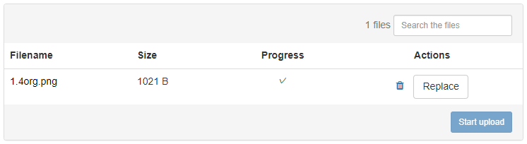

> 図 5‑26ファイルの差し替え

アイテム編集時にファイルが添付されている場合、Action欄に \[Replace\] ボタンが表示されます。ファイルを差し替える場合は、\[Replace\] ボタンを押下して、差し替えるファイルを登録してください。

> 図 5‑27ファイル差し替え後 画面

\[Replace\] ボタンを押下すると「アップロードファイル選択」ダイアログが開き、ファイルを選択すると、選択後のファイル名が画面上に赤文字で表示されます。\[Start upload\] ボタンを押下してファイルの取り込みを行ってください。差し替え前のファイル情報プロパティのファイル名、本文URL、フォーマット、サイズの情報が上書きされます。

1.  課金ファイルを設定する

メタデータ属性が課金ファイルである場合はグループごとに価格の設定をすることができます。

課金ファイルをアップロードする手順について、「ファイルを登録する」の手順1～3を参照してください。

課金ファイルの情報を入力する手順について説明します。

1.  課金ファイルを入力します。

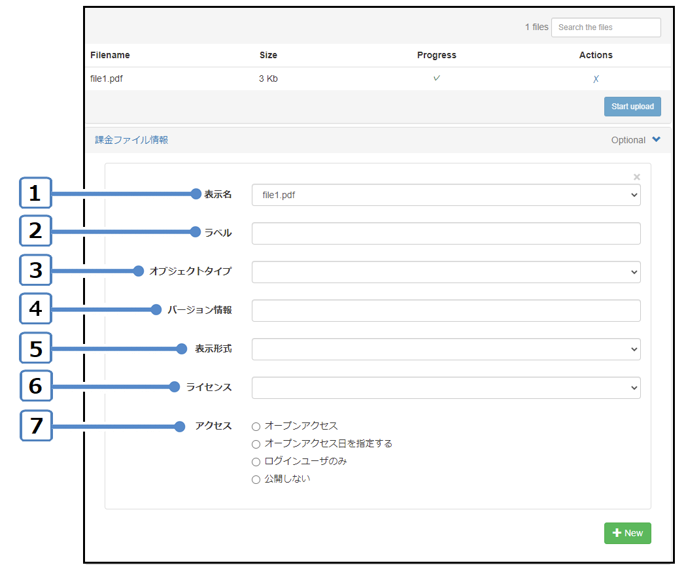

> 図 5‑28課金ファイル入力画面

表 5-12［課金ファイル情報］画面の項目と説明

<table>
<thead>
<tr class="header">
<th>項番</th>
<th>項目</th>
<th>説明</th>
</tr>
</thead>
<tbody>
<tr class="odd">
<td>1</td>
<td>［表示名］</td>
<td>登録したファイル名が表示されます。</td>
</tr>
<tr class="even">
<td>2</td>
<td>［ラベル］</td>
<td>
アイテム詳細画面に表示するファイルのリンク名を入力します。入力しない場合、アイテム詳細画面にはファイル名が表示されます。

リンク名の表示については、「ファイルを設定する」を参照してください。
</td>
</tr>
<tr class="odd">
<td>3</td>
<td>［オブジェクトタイプ］</td>
<td>
ファイルのオブジェクトタイプを選択します。

選択肢は、「図 5-16［オブジェクトタイプ］プルダウンリストを参照してください。
</td>
</tr>
<tr class="even">
<td>4</td>
<td>［バージョン情報］</td>
<td>ファイルのバージョン情報を入力します。</td>
</tr>
<tr class="odd">
<td>5</td>
<td>［表示形式］</td>
<td>
ファイルの表示形式を入力します。

詳細については、「ファイルを設定する」を参照してください。
</td>
</tr>
<tr class="even">
<td>6</td>
<td>［ライセンス］</td>
<td>
ファイルのライセンスを入力します。

詳細については、「ファイルを設定する」を参照してください。
</td>
</tr>
<tr class="odd">
<td>7</td>
<td>［アクセス］</td>
<td>
ファイルの公開方法を設定します。

詳細については、「課金ファイルの公開方法を設定する」を参照してください。
</td>
</tr>
</tbody>
</table>

1.  課金ファイルの公開方法を設定する

課金ファイルの公開方法を設定する手順について説明します。

1.  公開方法を［アクセス］ラジオボタンで指定します

図 5‑29［アクセス］ラジオボタン画面

表 5-13［アクセス］ラジオボタンの公開方法と説明

<table>
<thead>
<tr class="header">
<th>項番</th>
<th>公開方法</th>
<th>説明</th>
</tr>
</thead>
<tbody>
<tr class="odd">
<td>1</td>
<td>［オープンアクセス］</td>
<td>すべてのユーザがダウンロードできます。</td>
</tr>
<tr class="even">
<td>2</td>
<td>［オープンアクセス日を指定する］</td>
<td>
ファイルの公開日を指定することができます。

<ul>
<li>
公開日が過ぎるまではログインしたユーザのみがダウンロードできます。
</li>
<li>
公開日を過ぎた場合はすべてのユーザがダウンロードできます。

「図 5-25［グループ］テキストボックス」を参照してください。
</li>
</ul></td>
</tr>
<tr class="odd">
<td>3</td>
<td>［ログインユーザのみ］</td>
<td>
グループユーザ及び価格を指定します。

価格が設定されていないグループのユーザは課金ファイルをダウンロードできません。 
複数のグループに所属するユーザには該当する価格の最低値が適用されます。「図 5-30［グループ名・価格］エリア」を参照してください。
</td>
</tr>
<tr class="even">
<td>4</td>
<td>［公開しない］</td>
<td>管理者、アイテムの作成者・投稿者のみがダウンロードできます。</td>
</tr>
</tbody>
</table>

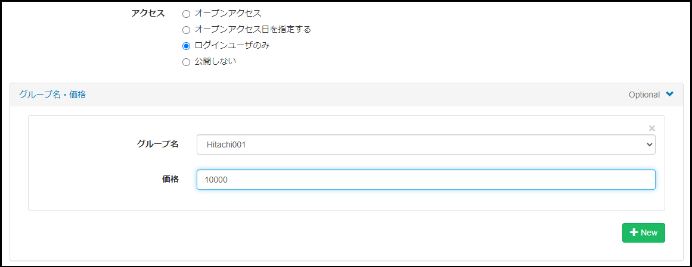

図 5‑30［グループ名・価格］エリア

1.  メタデータの入力項目

メタデータを入力する項目について説明します。

表示されたItem Registration画面で、登録するアイテムの入力項目（必須）に入力します。

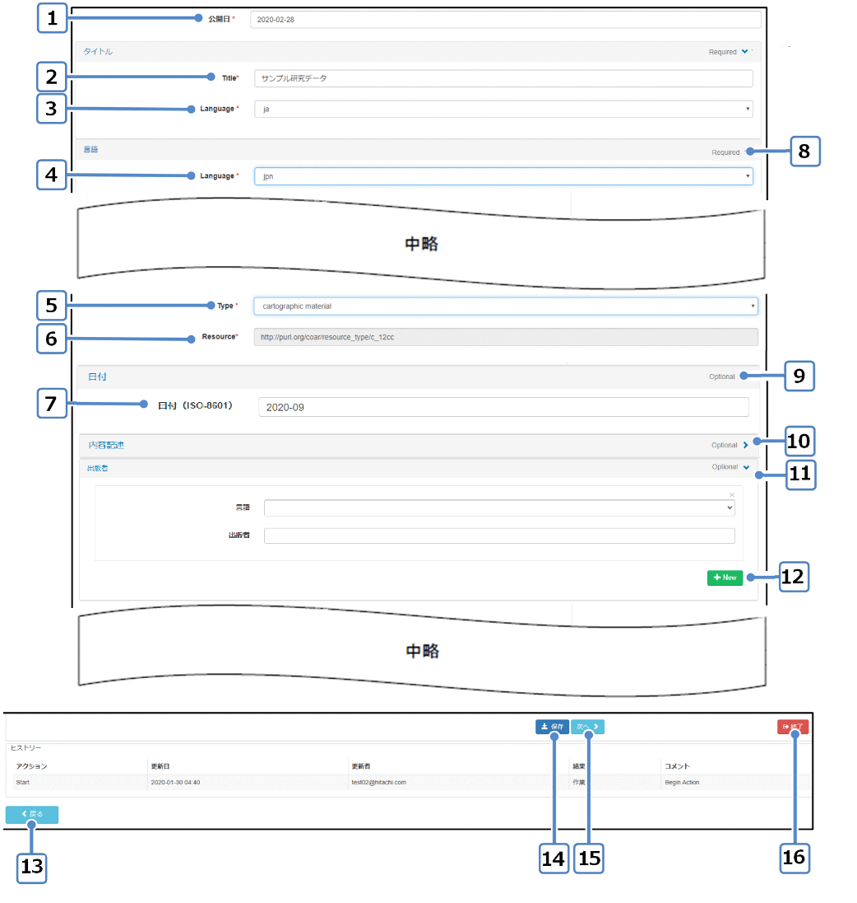

図 5‑31 Item Registration画面

表 5-14 Item Registration画面の項目と説明

<table>
<thead>
<tr class="header">
<th>項番</th>
<th>項目</th>
<th>説明</th>
</tr>
</thead>
<tbody>
<tr class="odd">
<td>1</td>
<td>［公開日］プルダウンリスト※</td>
<td>公開日をプルダウンリストから選択または直接入力します。日付の入力フォーマットは、［<em>yyyy-mm-dd</em>］の形式で指定します。プルダウンリストから選択する場合は、「図 5‑32［公開日］プルダウンリストを参照してください。</td>
</tr>
<tr class="even">
<td>2</td>
<td>「タイトル」の［Title］テキストボックス※</td>
<td>タイトルを入力します。</td>
</tr>
<tr class="odd">
<td>3</td>
<td>「タイトル」の［Language］プルダウンリスト※</td>
<td>対象をプルダウンリストから選択します。「図 5-33［Language］プルダウンリストを参照してください。</td>
</tr>
<tr class="even">
<td>4</td>
<td>「言語」の［Language］プルダウンリスト※</td>
<td>対象をプルダウンリストから選択します。「図 5-33［Language］プルダウンリストを参照してください。</td>
</tr>
<tr class="odd">
<td>5</td>
<td>「Resource Type」の［Type］プルダウンリスト※</td>
<td>対象をプルダウンリストから選択します。「図 5-34［Type］プルダウンリストを参照してください。</td>
</tr>
<tr class="even">
<td>6</td>
<td>「Resource Type」の［Resource］テキストボックス※</td>
<td>「Resource Type」の［Type］プルダウンリストを選択時、表示されます。</td>
</tr>
<tr class="odd">
<td>7</td>
<td>「日付」の［日付（ISO-8601）］プルダウンリスト</td>
<td>日付をプルダウンリストから選択または直接入力します。日付の入力フォーマットは、［<em>yyyy-mm-dd、yyyy-mm、yyyy</em>］です。（ISO-8601形式）</td>
</tr>
<tr class="even">
<td>8</td>
<td>［Required］パネル</td>
<td>
［Required］パネルは、管理画面の［Meta］画面で［Option］属性に［Required］を設定した項目が表示されます。

初期表示は展開状態となります。
</td>
</tr>
<tr class="odd">
<td>9</td>
<td>［Optional］パネル</td>
<td>
［Optional］パネルは、管理画面の［Meta］画面に［Option］属性に［Required］を設定していない項目が表示されます。

初期表示は閉じた状態とします。
</td>
</tr>
<tr class="even">
<td>10</td>
<td>［］ボタン</td>
<td>クリックすると、展開しているパネルを閉じます。</td>
</tr>
<tr class="odd">
<td>11</td>
<td>［］ボタン</td>
<td>クリックすると、折っているパネルを展開状態にします。</td>
</tr>
<tr class="even">
<td>12</td>
<td>［］ボタン</td>
<td>
クリックすると、該当項目の入力エリアを追加します。

管理画面の［Meta］画面で［Option］属性に［Allow Multiple］を設定した項目に［］ボタンが表示されます。
</td>
</tr>
<tr class="odd">
<td>13</td>
<td>［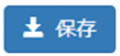］ボタン</td>
<td>クリックすると、入力した内容が一時保存されます。</td>
</tr>
</tbody>
</table>

| 14 | ［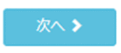］ボタン | クリックすると、［インデックス指定］画面に遷移します。「5.1 アイテムを登録する」の「インデックスを設定する」を参照してください。 |
| -- | -------------------------------------------- | ----------------------------------------------------------------------- |
| 15 | ［］ボタン | クリックすると、入力した内容は保存されず［ワークフロー選択］画面に遷移します。                                 |
| 16 | ［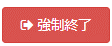］ボタン           | クリックすると、入力した内容を破棄し、作業中のアクティビティを中止します。                                   |

> 注※

入力必須項目です。

ただし、入力必須項目は、アイテムタイプによって異なります。

> 注1
> 
> ［Item Registration］アクションの完了時点にCNRIが登録されます。
> 
> プレフィックスはコンフィグファイルに設定される値です。
> 
> サフィックスはLHS（Local Handle Server）から返却されるユニークの値です。
>
> 注2
> 「強制終了」ボタンにより、アクティビティを中止した場合、戻るボタンを利用してアクティビティを再開できません。
> 改めてアイテムの登録をしてください。

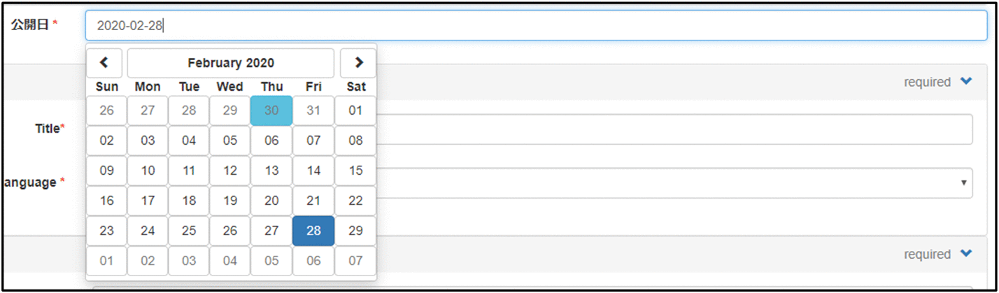

図 5‑32［公開日］プルダウンリスト

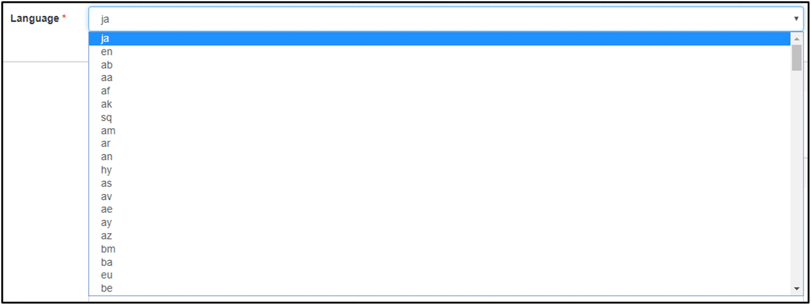

図 5‑33［Language］プルダウンリスト

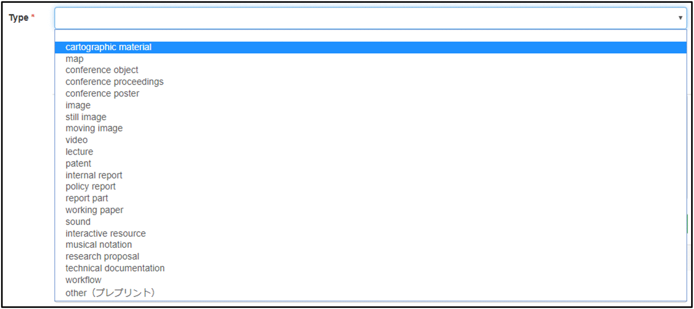

図 5‑34［Type］プルダウンリスト

【補足】

1つのメタデータ項目に複数の値を入力した場合、アイテム詳細画面での表示順序は、Item Registration画面で表示されるメタデータ項目の入力エリア順となります。また、入力エリアの順序をドラッグ&ドロップで変更することで、アイテム詳細画面での各メタデータ項目の表示順序を変更することができます。

#### 作成者を入力する

作成者情報を作成者検索画面から選択または直接入力します。

作成者検索画面から選択する手順を説明します。

1.  表示されたItem Registration画面で、作成者の画面右下の［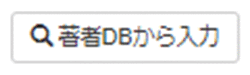］ボタンをクリックします。
    
    作成者検索画面が表示されます。

<!-- end list -->

2.  表示された作成者検索画面の［検索］テキストボックスに条件を入力後、［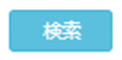］ボタンをクリックします。

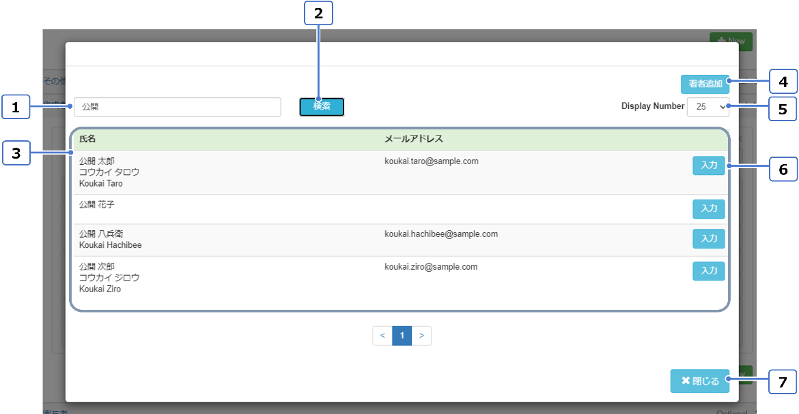

図 5‑35作成者検索画面

表 5-15作成者検索画面の項目と説明

<table>
<thead>
<tr class="header">
<th>項番</th>
<th>項目</th>
<th>説明</th>
</tr>
</thead>
<tbody>
<tr class="odd">
<td>1</td>
<td>［検索］テキストボックス（検索キー）</td>
<td>検索する氏名もしくはメールアドレスを入力します。入力した値の一致で検索されます。</td>
</tr>
<tr class="even">
<td>2</td>
<td>
［］ボタン
</td>
<td>クリックすると指定した検索条件に従って検索が実行されます。検索結果は一覧に表示されます。</td>
</tr>
<tr class="odd">
<td>3</td>
<td>作成者一覧</td>
<td>作成者の氏名、メールアドレス一覧が表示されます。</td>
</tr>
<tr class="even">
<td>4</td>
<td>［］ボタン</td>
<td>クリックすると、［著者追加］画面が表示されます。作成者情報を入力します。「図 5-36［著者追加］画面を参照してください。</td>
</tr>
<tr class="odd">
<td>5</td>
<td>［］プルダウンリスト</td>
<td>作成者の一覧に表示する行数をプルダウンリストから選択します。「図 5-37［Display Number］プルダウンリストを参照してください。</td>
</tr>
<tr class="even">
<td>6</td>
<td>［］ボタン</td>
<td>クリックすると、作成者検索画面が閉じItem Registration画面の作成者入力項目に作成者情報が反映されます。</td>
</tr>
<tr class="odd">
<td>7</td>
<td>［］ボタン</td>
<td>クリックすると、Item Registration画面の作成者入力項目に作成者情報を反映せず作成者検索画面が閉じます。</td>
</tr>
</tbody>
</table>

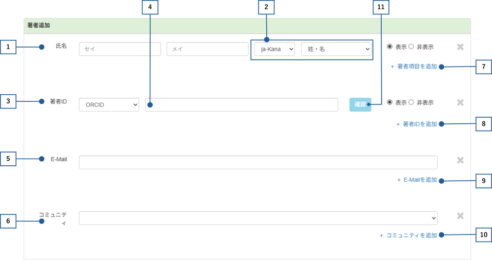

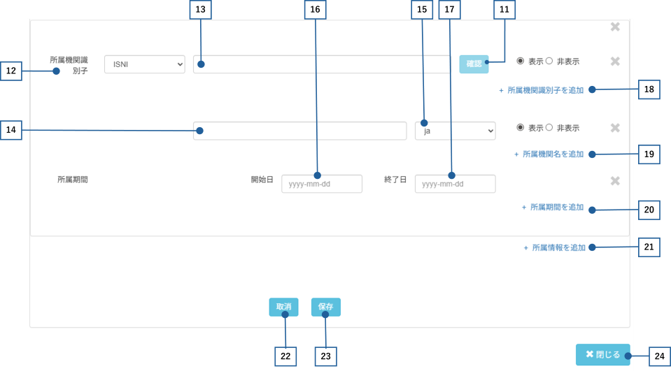

図 5‑36［著者追加］画面

表 5-16［著者追加］画面の項目と説明

<table>
<thead>
<tr class="header">
<th>項番</th>
<th>項目</th>
<th>説明</th>
</tr>
</thead>
<tbody>
<tr class="odd">
<td>1</td>
<td>［氏名］テキストボックス</td>
<td>氏名を入力します。</td>
</tr>
<tr class="even">
<td>2</td>
<td>［氏名］プルダウンリスト</td>
<td>プルダウンリストから選択します。「図5-38 ［氏名］プルダウンリスト」を参照してください。</td>
</tr>
<tr class="odd">
<td>3</td>
<td>［著者ID］プルダウンリスト</td>
<td>著者IDのスキーマ名をプルダウンリストから選択します。「図5-39 ［著者ID］プルダウンリスト」を参照してください。</td>
</tr>
<tr class="even">
<td>4</td>
<td>［著者ID］テキストボックス</td>
<td>著者IDを入力します。</td>
</tr>
<tr class="odd">
<td>5</td>
<td>［E-Mail］テキストボックス</td>
<td>E-Mailを入力します。</td>
</tr>
<tr class="even">
<td>6</td>
<td>［コミュニティ］テキストボックス</td>
<td>著者を管理するコミュニティを選択します。</td>
</tr>
<tr class="odd">
<td>7</td>
<td>［+著者項目を追加］リンク</td>
<td>クリックすると、氏名欄が追加されます。</td>
</tr>
<tr class="even">
<td>8</td>
<td>［+著者IDを追加］リンク</td>
<td>クリックすると、著者ID欄が追加されます。</td>
</tr>
<tr class="odd">
<td>9</td>
<td>［+E-Mailを追加］リンク</td>
<td>クリックすると、E-Mail欄が追加されます。</td>
</tr>
<tr class="even">
<td>10</td>
<td>［+コミュニティを追加］リンク</td>
<td>クリックするとコミュニティの入力欄が追加されます。</td>
</tr>
<tr class="odd">
<td>11</td>
<td>［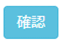］ボタン</td>
<td>クリックすると、著者が追加されず［作成者検索］画面に遷移します。</td>
</tr>
<tr class="even">
<td>12</td>
<td>［所属機関識別子］プルダウンリスト</td>
<td>所属機関識別子のスキーマ名をプルダウンリストから選択します。「図5-40 ［所属機関識別子］プルダウンリスト」を参照してください。</td>
</tr>
<tr class="odd">
<td>13</td>
<td>［所属機関識別子］テキストボックス</td>
<td>著者が所属する機関の識別子を入力します。</td>
</tr>
<tr class="even">
<td>14</td>
<td>［所属機関名］テキストボックス</td>
<td>所属機関名を入力します。</td>
</tr>
<tr class="odd">
<td>15</td>
<td>［所属機関名］プルダウンリスト</td>
<td>所属機関名の言語をプルダウンリストから選択します。</td>
</tr>
<tr class="even">
<td>16</td>
<td>［所属期間］開始日デートピッカー</td>
<td>機関の所属開始日をカレンダーから選択します。</td>
</tr>
<tr class="odd">
<td>17</td>
<td>［所属期間］終了日デートピッカー</td>
<td>機関の所属終了日をカレンダーから選択します。</td>
</tr>
<tr class="even">
<td>18</td>
<td>［+所属機関識別子を追加］リンク</td>
<td>クリックすると、所属機関識別子欄が追加されます。</td>
</tr>
<tr class="odd">
<td>19</td>
<td>［+所属機関名を追加］リンク</td>
<td>クリックすると、所属機関名欄が追加されます。</td>
</tr>
<tr class="even">
<td>20</td>
<td>［+所属期間を追加］リンク</td>
<td>クリックすると、所属期間欄が追加されます。</td>
</tr>
<tr class="odd">
<td>21</td>
<td>［+所属情報を追加］リンク</td>
<td>クリックすると、所属情報欄が追加されます。</td>
</tr>
<tr class="even">
<td>22</td>
<td>［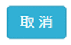］ボタン</td>
<td>クリックすると、［作成者検索］画面に遷移します。</td>
</tr>
<tr class="odd">
<td>23</td>
<td>［］ボタン</td>
<td>クリックすると、著者が追加され［作成者検索］画面に遷移します。</td>
</tr>
<tr class="even">
<td>24</td>
<td>［］ボタン</td>
<td>クリックすると、［著者追加］画面が閉じ、［作成者検索］画面に遷移します。</td>
</tr>
</tbody>
</table>

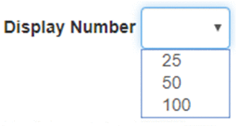

図 5‑37［Display Number］プルダウンリスト

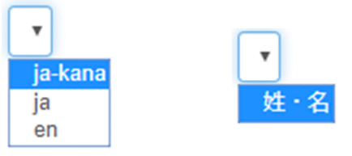

図 5‑38［氏名］プルダウンリスト

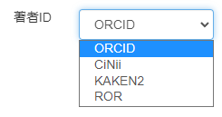

> 図 5‑39［著者ID］プルダウンリスト

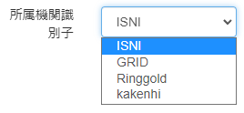

> 図 5‑40［所属機関識別子］プルダウンリスト

【補足】

・作成者検索画面から取り込んだ場合、「作成者識別子Scheme」が”WEKO”となっているエリア（「作成者識別子Scheme」「作成者識別子URI」「作成者識別子」）の項目は非活性となります。

・作成者検索画面から取り込んだ場合、著者DBとアイテムが紐づけ（リンク付け）されています（「作成者識別子Scheme」の”WEKO”によって紐づけされており、著者毎のアイテム数をカウントしています）。著者DBとアイテムの紐づけを解除したい場合は、\[×\]で”WEKO”の情報を削除してください。

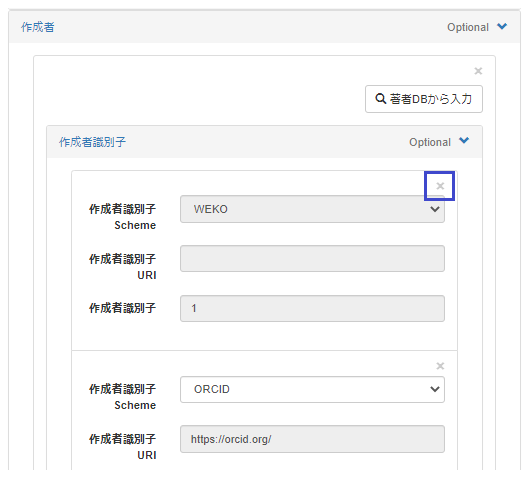

> 図 5‑41作成者識別子画面

#### 書誌情報を設定する

書誌情報を設定する手順について説明します。

1.  表示されたItem Registration画面で、書誌情報の［雑誌名］テキストボックスに雑誌名を入力する

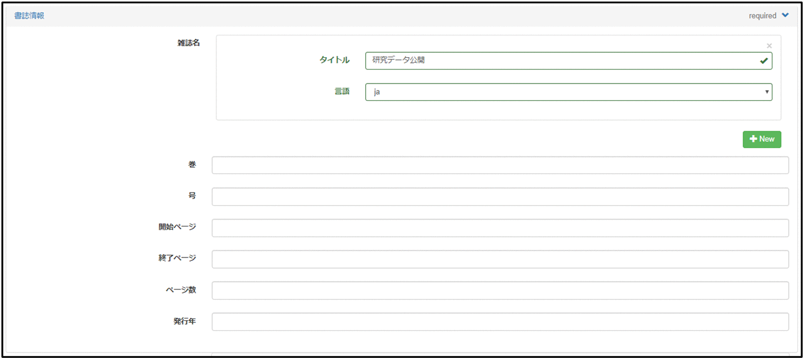

> 図 5‑42［雑誌名］テキストボックス

2.  ［言語］プルダウンリストから言語を選択します。

3.  ［巻］テキストボックスに何巻かを入力します。

4.  ［号］テキストボックスに何号かを入力します。

5.  ［開始ページ］テキストボックスに開始ページを入力します。

6.  ［終了ページ］テキストボックスに終了ページを入力します。

7.  ［ページ数］テキストボックスにページ数を入力します。

8.  ［発行年］テキストボックスに発行年を入力します。
    
#### 出版タイプを設定する

出版タイプを設定する手順について説明します。

1.  表示されたItem Registration画面で、出版タイプの［出版タイプ］プルダウンリストから選択します。

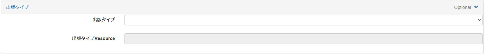

図 5‑43\[Item Registration\]画面 出版タイプ

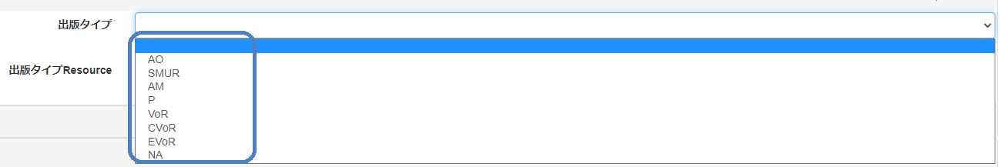

図 5‑44［出版タイプ］プルダウンリスト

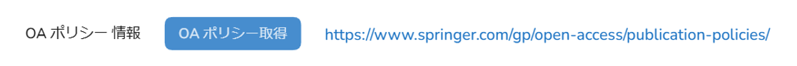

図 5‑45 [OAポリシー情報取得] 

#### ポリシー情報を取得する

ポリシー情報を取得する手順を説明します。

1.  表示されたItem Registration画面で、収録物識別子「ISSN、eISSN」を選択するまたは雑誌名を入力します。
2.  「」ボタンをクリックするとポリシー情報のリンクが表示されます。
3.  リンクをクリックすると別タブでポリシー情報を確認できます。

※ポリシー情報を取得するには、事前にシステム管理者によるOA Assist Web APIの設定が必要です。

#### フィードバックメール送信先を設定する

フィードバックメール送信先を設定する手順について説明します。

1.  表示されたItem Registration画面で、フィードバックメール送信先の［］ボタンをクリックします。  
    作成者検索画面が表示されます。

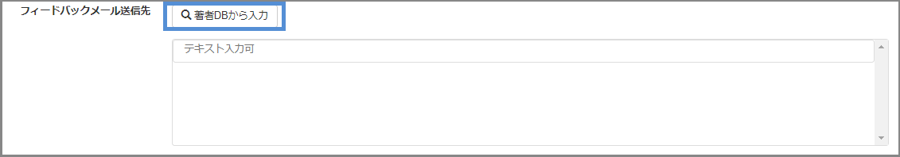

> 図 5‑46作成者検索画面

2.  表示された［作成者検索］画面の［検索］テキストボックスに条件を入力した後、［］ボタンをクリックします。  
    条件検索を満たしている作成者が表示されます。

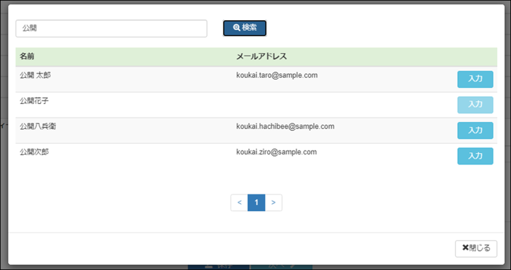

図 5‑47作成者検索結果

［作成者検索］画面の項目の説明については、［表 5-15［作成者検索］画面の項目と説明］を参照してください。入力ボタンを押下すると以下のフィードバックメール送信先一覧にメールアドレスが反映されます。

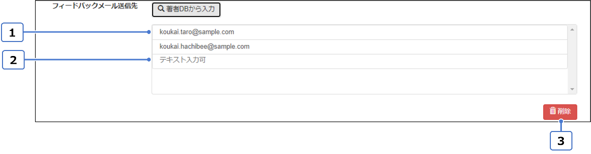

> 図 5‑47フィードバックメール送信先一覧

表 5‑17［フィードバックメール送信先］の項目と説明

<table>
<thead>
<tr class="header">
<th>項番</th>
<th>項目</th>
<th>説明</th>
</tr>
</thead>
<tbody>
<tr class="odd">
<td>1</td>
<td>フィードバックメール送信先一覧</td>
<td>設定したメールアドレス一覧が表示されます。</td>
</tr>
<tr class="even">
<td>2</td>
<td>［テキスト入力可］テキストボックス</td>
<td>
メールアドレスを手入力します。

Enterキーを押すことで手入力したメールアドレスを登録できます。
</td>
</tr>
<tr class="odd">
<td>3</td>
<td>［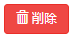］ボタン</td>
<td>クリックすると、選択されているメールアドレスがフィードバックメール送信先から削除されます。</td>
</tr>
</tbody>
</table>

1.  アクセス権を設定する

<!-- end list -->

1.  コンテンツのアクセス状態を設定する手順を説明します。統制語彙から選択して記入します。表示されたItem Registration画面で、アクセス権の［アクセス権］プルダウンリストからアクセス権を選択します。［アクセス権URI］にアクセス権URIが自動セットされます。
    
    「図 5-19［アクセス権］プルダウンリスト」を参照してください。

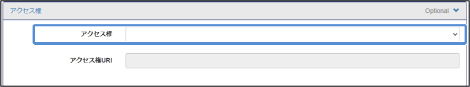

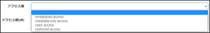

図 5‑48［アクセス権］プルダウンリスト

表 5-18［アクセス権］プルダウンリストの項目と説明

<table>
<thead>
<tr class="header">
<th>項番</th>
<th>項目</th>
<th>説明</th>
</tr>
</thead>
<tbody>
<tr class="odd">
<td>1</td>
<td>embargoed access</td>
<td>エンバーゴ期間中：特定の日にオープンアクセスとして公開されるまでの間、メタデータのみアクセスできるリソース。</td>
</tr>
<tr class="even">
<td>2</td>
<td>metadata only access</td>
<td>メタデータのみ：メタデータのみにアクセスが制限されているリソース。</td>
</tr>
<tr class="odd">
<td>3</td>
<td>open access</td>
<td>オープンアクセス：経済的、技術的な障壁なく直ちにかつ永続的にオンラインで無料で利用できるリソース。</td>
</tr>
<tr class="even">
<td>4</td>
<td>restricted access</td>
<td>
アクセス制限あり：システム的には利用可能なものの、完全なオープンアクセスにはいくつかのタイプの制限がかけられているリソース。

<!--

（補足）「ファイルの公開方法を設定する」で［制限公開］を選択しても、このオプションは自動的に設定されません。［制限公開］については「ファイルの公開方法を設定する」を参照してください。

-->
</td>
</tr>
</tbody>
</table>

> **※アクセス権語彙**の詳細説明はJPCOARスキーマガイドラインを参照ください。
> 
> https://schema.irdb.nii.ac.jp/ja/access_rights_vocabulary
> 
> **【入力したメタデータのチェック】**

  - > 必須項目を入力せずに［］ボタンをクリックした場合、エラーメッセージ「以下の項目が入力必須となります。ご確認の上、再度入力してください。」が表示されます。

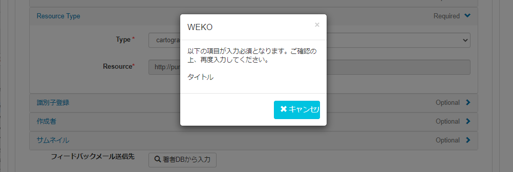

> 図 5‑49必須項目が未入力の場合のエラーメッセージ

  - > 不正なフォーマットを入力した場合、エラーメッセージが該当項目の直下に表示されます。

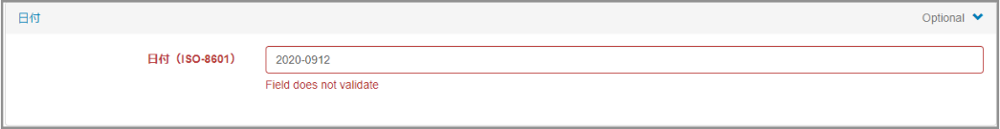

> 図 5‑50同一アイテムが登録されている可能性がある場合の重複チェックメッセージ

  - > 識別子、タイトル、リソースタイプ、著者を入力した場合、登録済のアイテムであれば警告メッセージが表示されます。
    > 同一と思われる登録済みアイテムの詳細ページへのリンクが表示されます。リンクをクリックすると別タブで詳細画面が表示されます。

図 5‑51不正なフォーマットを入力した場合のエラーメッセージ

  - > 入力している値が定義されている選択肢に存在しない場合、エラーメッセージ「{} is not one of {}.」が表示されます。

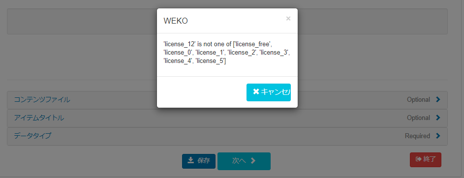

図 5‑52入力している値が定義されている選択肢に存在しない場合のエラーメッセージ

  - > Javascriptエラーが発生する場合、エラーメッセージ「An error occurred while processing the input data\!{}」が表示されます。

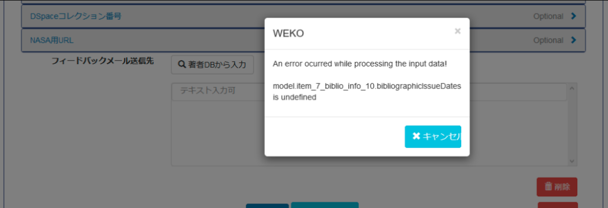

図 5‑53 Javascriptエラーが発生する場合のエラーメッセージ

#### アイテムの利用申請方法を設定する。

・本機能は、試験的な機能です。JAIRO Cloud環境で提供しておりません

> アイテムに対する利用申請方法を設定する手順について説明します。

> ※ この機能はコンテンツファイルが未登録の場合のみ利用可能です。

> 1.  Item Registration画面にある、「アイテムに利用申請ワークフローを設定」チェックボックスをチェック状態にすると、ワークフローと利用規約のプルダウンが表示されます。

> 2.  表示されたワークフローおよび利用規約のプルダウンから利用申請方法と利用規約を設定します。  
    利用申請方法として、設定できるワークフローおよび利用規約については「表 5-19［アイテムの利用申請方法］の項目と説明」を参照してください。

> 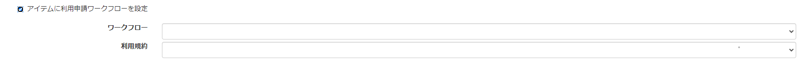

> 表 5-19［アイテムの利用申請方法］の項目と説明

> | 項番 | 項目 | 説明 |
> |----|----|----|
> | 1 | \[ワークフロー\] | Admin&gt;WorkFlow&gt;WorkFlow Listで管理しているワークフローのうち「制限公開フラグ」が有効なものをリストに表示します。
> | 2 | \[利用規約\] | 管理画面で登録した利用規約をリストで表示します。選択肢に「自由入力」を設け、選択した際はテキストエリアを表示します。

#### リクエストメール送信先を設定する

・本機能は、試験的な機能です。JAIRO Cloud環境で提供しておりません

> リクエストメール送信先を設定する手順について説明します。

> 1. 「リクエストボタンを表示」チェックボックスにチェックをいれます。

> 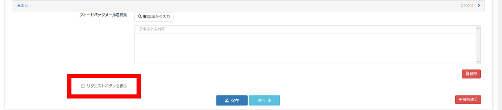

> 2. 表示されたItem Registration画面で、リクエストメール送信先の［］ボタンをクリックすると、作成者検索画面が表示されます。

> 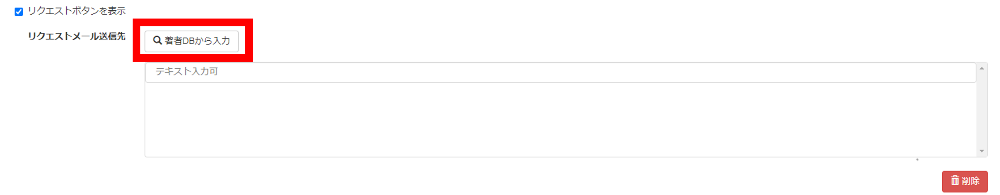

> 3. 表示された［作成者検索］画面の［検索］テキストボックスに条件を入力した後、［］ボタンをクリックします。
> 条件検索を満たしている作成者が表示されます。

> 

> ［作成者検索］画面の項目の説明については、［表 5-15［作成者検索］画面の項目と説明］を参照してください。入力ボタンを押下すると以下のリクエストメール送信先一覧にメールアドレスが反映されます。

> 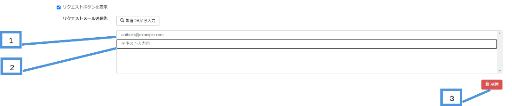

> 表 5‑20［リクエストメール送信先］の項目と説明

> | 項番 | 項目 | 説明 |
> |----|----|----|
> | 1 | リクエストメール送信先一覧 | 設定したメールアドレス一覧が表示されます。 |
> | 2 | テキストボックス | メールアドレスを手入力します。Enterキーを押すことで手入力したメールアドレスを登録できます。 |
> | 3 | 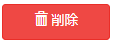 ボタン | クリックすると、選択されているメールアドレスがリクエストメール送信先から削除されます。|

#### CRIS連携機能(researchmap連携機能)

researchmap連携を行う手順について説明します。

1. researchmapの左部にあるチェックボックスにチェックを入れます。

　researchmapの下部には、連携結果が表示されています。表示結果は以下の4種となっています。

　ⅰ. なし：一度も連携が行われていない状態を指します。

　ⅱ. Running：WEKO上での操作を終え、CRIS機関との連携を待機または行っている状態です。

　ⅲ. 成功：CRIS機関との連携に成功した状態です。完了した日付も表示されます。

　ⅳ. 失敗：CRIS機関との連携に失敗した状態です。失敗した日付も表示されます。

2. チェック後、当該ワークフローを完了します。

ワークフロー完了時に、自動連携が予約されます。

連携対象の著者に関しては、アイテムに入力してある著者（Creater,Contributer）を対象にします。
連携には事前に著者DBにparmalinkを登録しておく必要があります。

また、自動連携が行われるタイミングはデフォルトで毎日0時となっています。

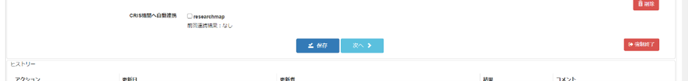

（補足）researhmapとの連携を行う際には、以下のメタデータが必須項目となります。

必須メタデータ一覧

|jpcoar_mapping|メタデータ名|
|---|---|
|dc:title|タイトル|
|jpcoar:creator|作成者*1|
|datacite:date|日付*2|
|jpcoar:resource_type|資源タイプ*3|

*1：作成者は、著者DBに登録されておりresearchmapのparmalinkが設定されている作成者を指定する必要があります。

*2：アイテムの公開日とは異なる項目なので、別途設定が必要となります。

*3：指定できる資源タイプには限りがあります。指定可能資源タイプは以下の表5-21に記載されているものとなります。

指定可能資源タイプ一覧

|資源タイプ名|researchmapでの業績種別|
|---|---|
|article|publish_papers|
|journal article|publish_papers|
|conference paper|publish_papers|
|departmental bulletin paper|publish_papers|
|master thesis|publish_papers|
|doctoral thesis|publish_papers|
|learning object|misc|
|technical report|misc|
|book|books_etc|
|report|books_etc|
|musical notation|books_etc|
|video|books_etc|
|image|books_etc|
|sound|books_etc|
|map|books_etc|
|conference presentation|presentations|
|conference poster|presentations|
|interactive resource|works|
|software|works|
|other|other|

#### インデックスを設定する

アイテムが所属するインデックスを設定します。

アイテムは同時に複数のインデックスに所属できます。

インデックス指定は必須項目です。

［インデックスツリー］でチェックしたインデックス名が表示されます。

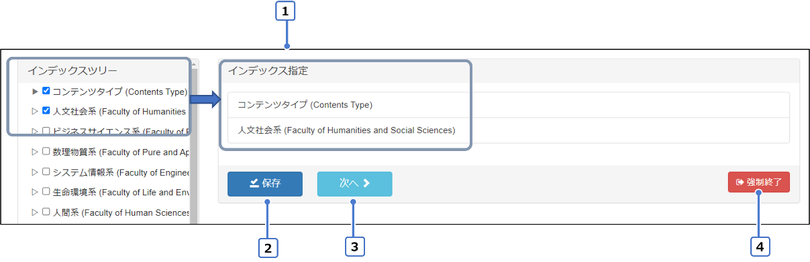

> 図 5‑54 \[インデックスツリー\]画面

表 5‑21［インデックス指定］画面の項目と説明

| 項番 | 項目                                           | 説明                                    |
| -- | -------------------------------------------- | ------------------------------------- |
| 1  | インデックス名                                      | ［インデックスツリー］でチェックしたインデックス名が表示されます。     |
| 2  | ［］ボタン | クリックすると、入力した内容が一時保存されます。              |
| 3  | ［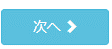］ボタン           | クリックすると、次の操作に進みます。                    |
| 4  | ［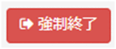］ボタン | クリックすると、入力した内容を破棄し、作業中のアクティビティを中止します。 |

注

インデックスを選択しない場合、［］ボタンまたは［］ボタンをクリックすると、［At least one index should be selected.］というエラーメッセージが表示されます。

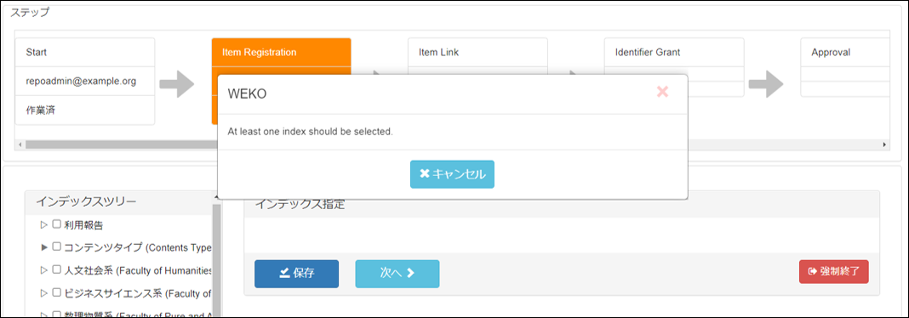

図 5‑55インデックス不選択エラー画面

1.  ［］ボタンをクリックします。
    
    ［コメント入力］画面が表示されます。

> 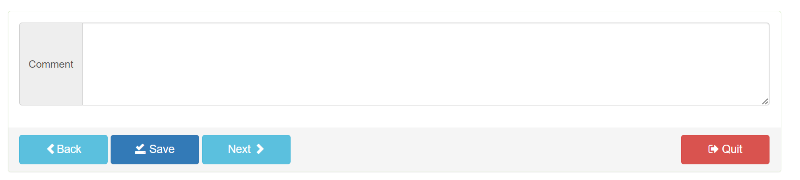
> 
> 図 5‑56［コメント入力］画面

表 5‑22［コメント入力］画面の項目と説明

| 項番 | 項目                                           | 説明                                            |
| -- | -------------------------------------------- | --------------------------------------------- |
| 1  | コメント                                         | コメントを入力します。                                   |
| 2  |                 | アイテムレジストレーション画面に戻ります。                         |
| 3  | ［］ボタン | クリックすると、入力した内容が一時保存されます。                      |
| 4  | ［］ボタン           | クリックすると、アイテムのメタデータとコンテンツファイルを登録するアクションが完了します。 |
| 5  | ［］ボタン           | クリックすると、入力した内容を破棄し、作業中のアクティビティを中止します。         |

2.  ［］ボタンをクリックします。
    
    フローの「Item Registration」が「作業済」の［ステップ］画面が表示されます。

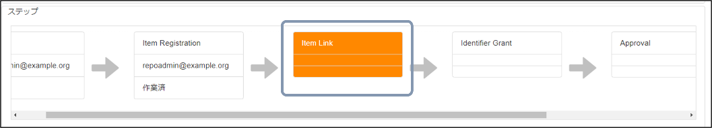

図 5‑57「作業済」の［ステップ］画面

次のアクションに進むときに、エラーメッセージ「Please make sure the item type mapping is correct.」が発生する場合があります。ログインのセッションが切れた場合に、下記のメッセージが表示されますので、再度ログインをし直してください。

なお、ログインのセッションが切れていないにも関わらず本メッセージが表示された場合はサーバ側の処理に問題が発生した時なので、システム管理者にお知らせください。

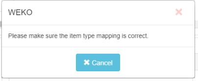

図 5‑58エラーメッセージ「Please make sure the item type mapping is correct.」

#### アイテム間リンクを設定する

登録済みアイテム同士を関連付けることができます。

1.  ［インデックスツリー］画面のインデックス名をクリックします。

そのインデックスに所属する［アイテムリンク］画面が表示されます。

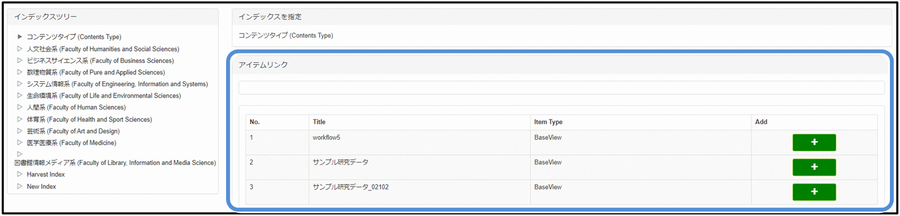

図 5‑59［アイテムリンク］画面

選択したインデックスに所属する複数のアイテムに対し、リンクを付けられます。なお、選択できるインデックスは１つだけです。

2.  表示された［アイテムリンク］画面からリンクしたいアイテムの「+」ボタンを選択します。

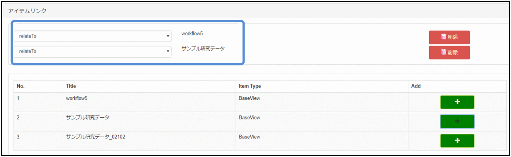

> 図 5‑60［アイテムリンク］画面(「+」ボタンを選択後)

3.  コメントを入力します。

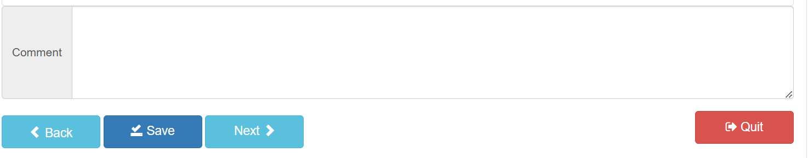

図 5‑61コメント入力画面

4.  ［］ボタンをクリックします。
    
    リンクが登録されます。
    
#### DOIを付与する

アイテムにDOIを付与されていない場合、そのアイテムにDOIを付与できます。DOIの取り扱いには、十分注意してください。アイテムにDOIを付与する場合の注意事項を次に示します。

  - アイテムに付与されたDOIは変更できません。

  - アイテムに付与されたDOIを取り下げることはできません。

アイテムにDOIを付与するフローの「Identifier Grant」の手順を説明します。

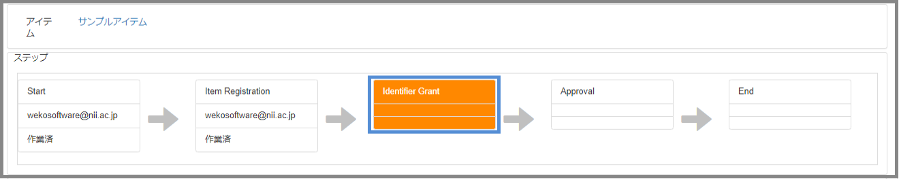

図 5‑62アイテム付与フロー

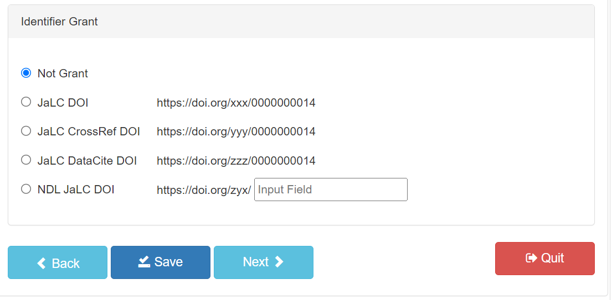

図 5‑63［識別子の付与］画面

表 5-23［識別子の付与］画面の項目と説明

<table>
<thead>
<tr class="header">
<th>項番</th>
<th>項目</th>
<th>説明</th>
</tr>
</thead>
<tbody>
<tr class="odd">
<td>1</td>
<td>［識別子の付与］ラジオボタン※</td>
<td>
DOI発行機関を表示された［識別子の付与］のラジオボタンで選択します。

<ul>
<li><blockquote>

対応している［識別子の付与］の種類は以下の通りです(現時点では、NDL JaLC DOIを付与することはできません(v1.0.7修正))。

</blockquote></li>
</ul>
<ul>
<li><blockquote>

JaLC DOI

</blockquote></li>
<li><blockquote>

JaLC CrossRef DOI

</blockquote></li>
<li><blockquote>

JaLC DataCite DOI

</blockquote></li>
<li><blockquote>

NDL JaLC DOI

</blockquote></li>
</ul></td>
</tr>
<tr class="even">
<td>2</td>
<td>戻るボタン</td>
<td>前のアクションに戻ります(v1.0.7追加)。</td>
</tr>
<tr class="odd">
<td>3</td>
<td>［］ボタン</td>
<td>クリックすると、入力した内容が一時保存されます。</td>
</tr>
<tr class="even">
<td>4</td>
<td>［］ボタン</td>
<td>
DOI付与条件のチェックを行います。

<ul>
<li><blockquote>

付与条件を満たしている場合、DOIが付与されます。次のアクションに進みます。

</blockquote></li>
<li><blockquote>

付与条件を満たしていない場合、［Identifier Grant］画面に戻ります。

</blockquote></li>
</ul></td>
</tr>
<tr class="odd">
<td>5</td>
<td>［］ボタン</td>
<td>クリックすると、入力した内容を破棄し、作業中のアクティビティを中止します。</td>
</tr>
</tbody>
</table>

> 注(1)
> 
> 設定によってDOIを三つの方法で付与することができます。
> 
> **［自動連番］**
> 
> ［Identifier Grant］画面に管理画面の［Identifier］で設定しているプレフィックスと自動採番されたサフィックスが表示されます。

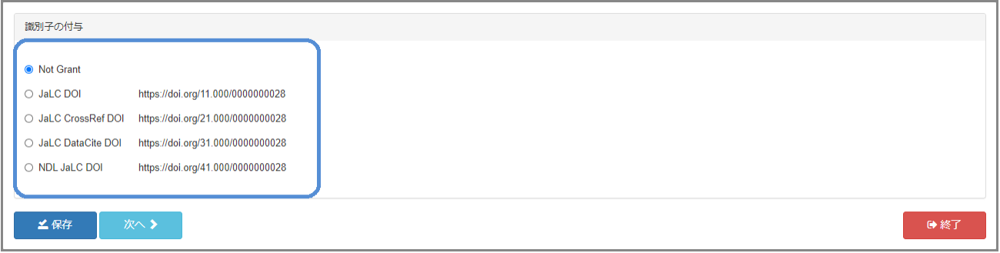

図 5‑64［識別子の付与(自動連番)］画面

> **［半自動入力］**
> 
> ［Identifier Grant］画面に管理画面の［Identifier］で設定しているプレフィックスと同画面で設定しているサフィックスの前半部分を表示し、サフィックスの後半部分を［入力欄］テキストボックスに入力します。
> 
> ［入力形式］

  - > 半角英数字または半角記号「\_-.;()/」のみ入力されている

  - > 「info:doi/\[DOIのPrefix\]/\[入力値\]」が255文字以内である

  - > 他のアイテムで既に使用されているDOIではない

  - > 取り下げられたDOIではない

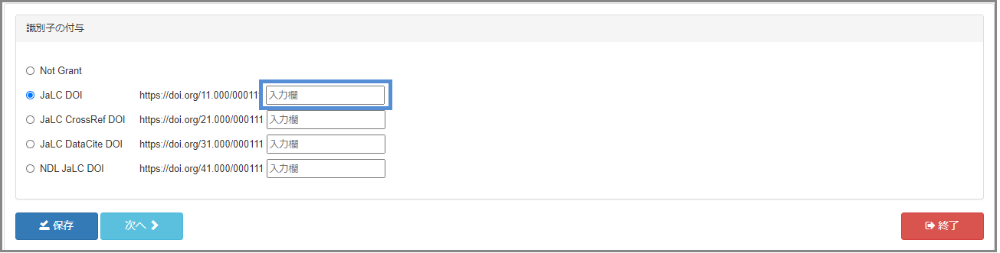

図 5‑65［識別子の付与(半自動入力)］画面

> **［自由入力］**
> 
> ［Identifier Grant］画面に管理画面の［Identifier］で設定しているプレフィックスを表示し、サフィックスを［入力欄］テキストボックスに入力します。
> 
> 入力値は［半自動入力の方法］での［入力形式］でチェックされます。

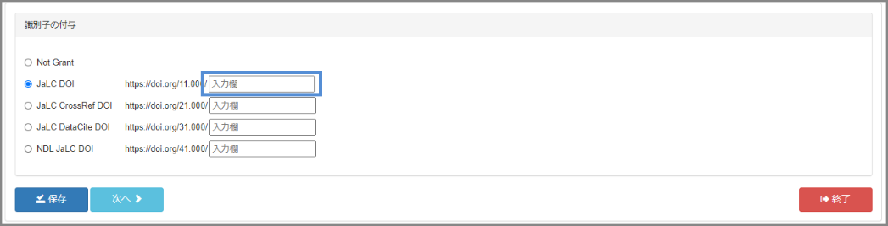

図 5‑66［識別子の付与(自動入力)］画面

> 注(2)
> 
> DOI付与条件は、選択しているDOI発行機関に応じて、アイテムの入力値を以下の資料を基にチェックしています。
> 
> 資料：［JPCOAR\_JaLC\_Guideline\_appendix\_v1.pdf］
> 
> 注(3)
> 
> アイテムにDOIを付与する場合、インデックス状態が「公開」かつハーベスト公開が「公開」のインデックスとの関連付けが必要です。
> 
> 注(4)
> 
> DOI付与条件の必須項目を満たしていない場合、Item Registration画面のアクティビティに戻り、エラーメッセージが表示されます。
> 
> 注(5)
> 
> 必須のマッピング項目がひとつのアイテムタイプ内に複数ある場合、複数あるうちのひとつに入力されていれば、DOI付与の条件を満たすものとします。
> 
> 注(6)
> 
> DOI付与済みアイテムを新規登録後、編集時に必須項目の値の削除や必須項目のプロパティの削除はできません。削除をした場合、［Identifier Grant］画面からItem Registration画面に遷移し、「PID付与の条件を満たしていません。」とエラーメッセージが表示されます。
> 
> また、編集時に資源タイプ（dc:type）の変更もできません。資源タイプを変更した場合、［Identifier Grant］画面からItem Registration画面に遷移し、「DOI付与済みアイテムの資源タイプの変更はできません。」とエラーメッセージが表示されます。

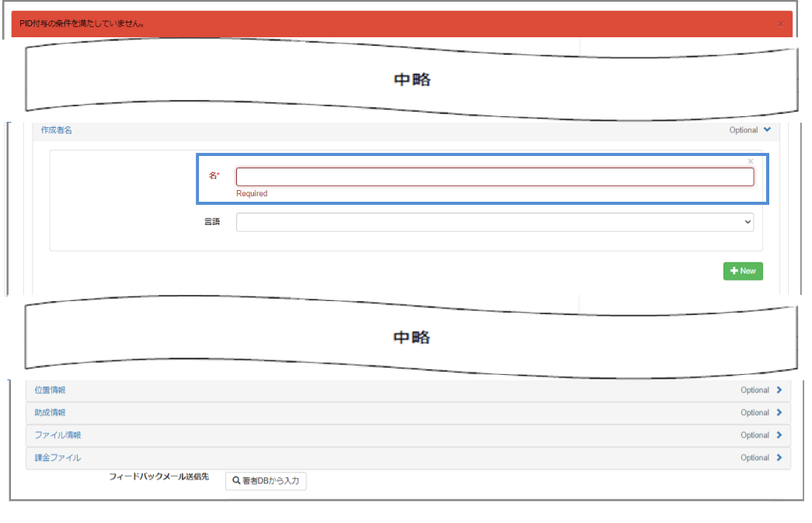

図 5‑67注(6)エラー画面

#### アイテムを承認する

アイテムを承認できるのは、基本的にリポジトリ管理者のロール権限を持つユーザーです。

リポジトリ管理者以外が承認できる場合は以下が存在します。

- 承認者に特定のロールが設定されていた場合：選択されているロールのユーザーが承認することができます。

- 承認者に特定のユーザーが設定されていた場合：選択されているユーザーが承認することができます。

・以下の事例は、＜利用申請機能 先行利用機関＞のみ利用可能です。当機能の先行利用を申請していな機関は、利用できません。

> - 承認者にプロパティが設定されていた場合：選択されているプロパティに設定されているユーザーが承認することができます。

> - 承認者に「アイテム登録者」が設定されていた場合：アイテムを登録した本人が承認することができます。

・以下の事例は、試験的な機能です。JAIRO Cloud環境で提供しておりません

> - 承認者に「リクエスト送信先」が設定されていた場合：アイテム登録の際に設定する「リクエスト送信先」のメールアドレスで登録しているユーザーが承認することができます。
> - 承認者が「リクエスト送信先」かつ、制限公開アイテムに対する「利用申請」、「二段階利用申請」ワークフローの場合：「利用申請の対象となった制限公開アイテムのリクエスト送信先のメールアドレス」のユーザーが承認することができます。

なお、承認者の設定方法はシステム管理マニュアルの「8.1フローを設定する」を参照してください。

登録者の承認待ちである登録するアイテムに対し、「却下(Reject)」、「保存(Save)」、「承認(Approval)」を行うことができます。

制限公開アイテムに対する「利用申請」、「二段階利用申請」ワークフローでの承認の際は、申請時に登録されたアイテムの表示形式に関係なくプレビュー機能が表示されます。

こちらの機能は、管理画面にてON/OFFの切り替えを行うことができます。

アイテムの承認は［ワークフロー］画面から実施します。

1.  ［ToDo］タブ、［Wait］タブ、または［All］タブのいずれかを選択します。

［アクティビティ一覧］画面が表示されます。アクションが「Approval」のアイテムが承認待ちのアイテムです。

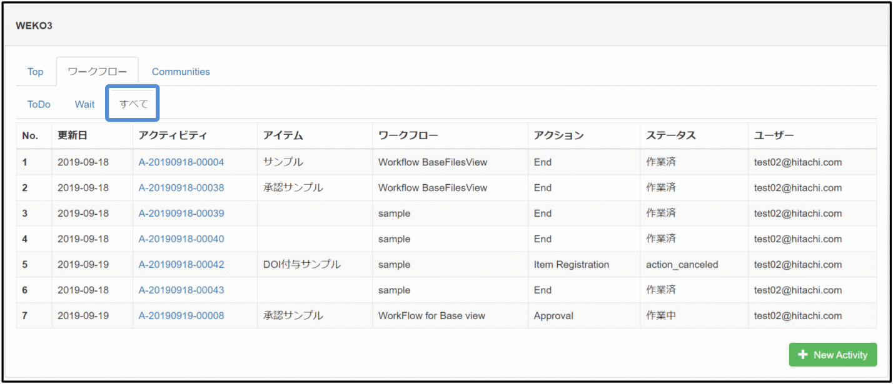

図 5‑68［アクティビティ一覧］画面

注

査読／承認の権限がない場合は、次の画面が表示されます。

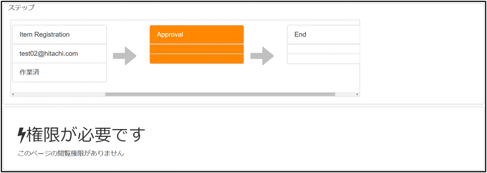

> 図 5‑69閲覧権限不足画面

2.  表示された［アクティビティ一覧］画面のアクションが「Approval」のアクティビティ名をクリックします。
    
    ［アイテム承認］画面が表示されます。

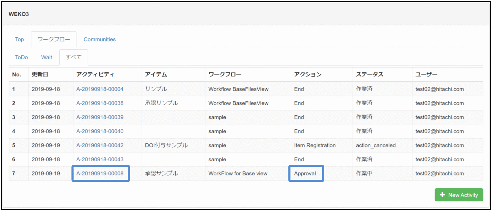

> 図 5‑70［アクティビティ一覧］画面

3.  表示された［アイテム承認］画面の［承認］ボタンをクリックします。

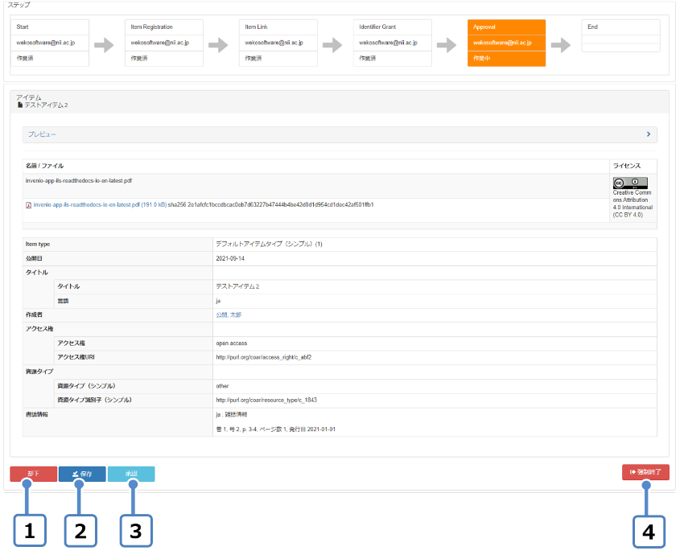

図 5‑71［アイテム承認］画面

表 5-24［アイテム承認］画面の項目と説明

| 項番 | 項目                                           | 説明                                    |
| -- | -------------------------------------------- | ------------------------------------- |
| 1  | ［］ボタン           | クリックすると、ワークフローの一つ前のアクションに戻ります。        |
| 2  | ［］ボタン | クリックすると、入力した内容が一時保存されます。              |
| 3  | ［］ボタン           | クリックすると、アイテムが「承認」されます。                |
| 4  | ［］ボタン           | クリックすると、入力した内容を破棄し、作業中のアクティビティを中止します。 |

登録されたアイテムがOAアシストから登録された場合、そのステータスを連携する。

### アクティビティを参照する

ここでは、システムに登録されたアクティビティを参照する手順を説明します。

アクティビティの参照は［ワークフロー］画面から実施します。

#### アクティビティの一覧を表示する

アクティビティの一覧を参照する手順を説明します。

##### アクティビティ一覧を参照する

各タブでアクティビティ一覧を参照する手順を説明します。

1.  ［ToDo］タブ、［Wait］タブ、または［すべて］タブのいずれかを選択します。
    
    ［アクティビティ一覧］画面が表示されます。アクティビティ一覧は次の３つのタブによって操作します。

<!-- end list -->

  - > ［ToDo］タブ
    
    クリックすると、登録・編集中のアクティビティと却下されたアクティビティが表示されます。

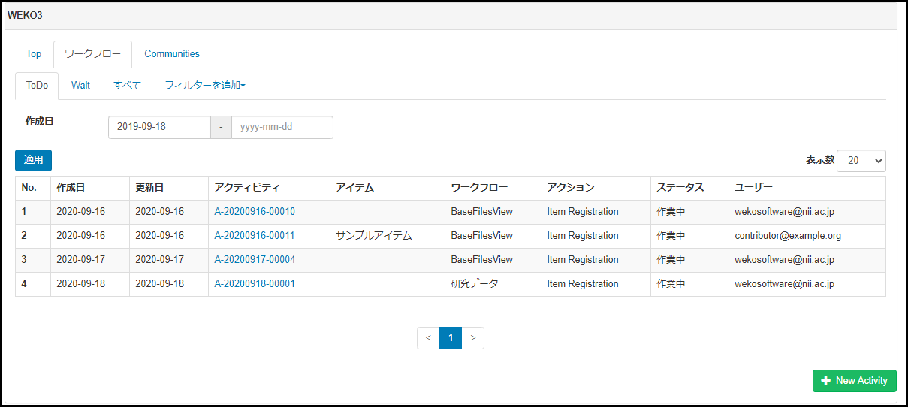

> 図 5‑72［ToDo］タブ

  - > ［Wait］タブ
    
    クリックすると、承認依頼待ちのアクティビティが表示されます。

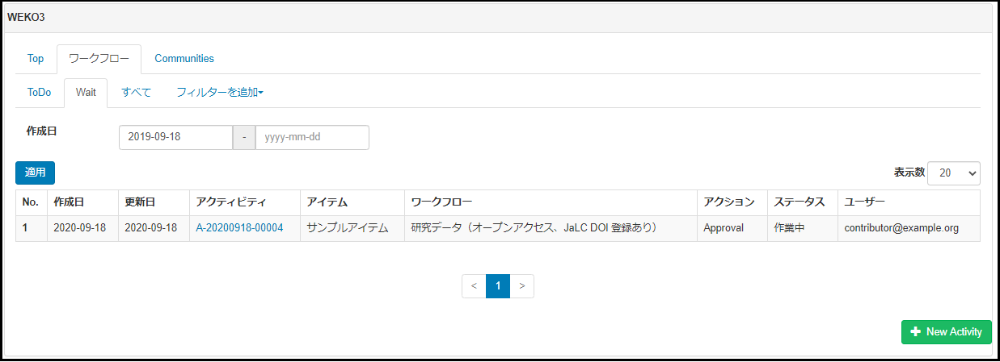

> 図 5‑73［Wait］タブ

  - > ［すべて］タブ
    
    クリックすると、登録・編集中・キャンセルしたアクティビティ、承認待ちのアクティビティ、および終了したアクティビティが表示されます。

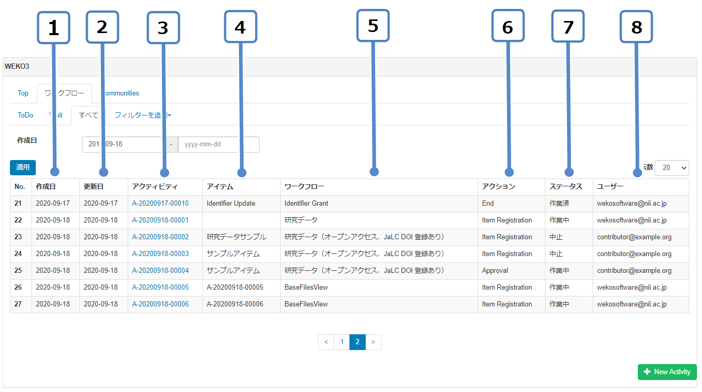

図 5‑74［すべて］タブ

表 5-25［アクティビティ一覧］画面の項目と説明

<table>
<thead>
<tr class="header">
<th>項番</th>
<th>項目</th>
<th>説明</th>
</tr>
</thead>
<tbody>
<tr class="odd">
<td>1</td>
<td>作成日</td>
<td>アクティビティの作成日が表示されます。表示フォーマットは、「<em>yyyy-mm-dd</em>」です。</td>
</tr>
<tr class="even">
<td>2</td>
<td>更新日</td>
<td>更新日が表示されます。表示フォーマットは、「<em>yyyy-mm-dd</em>」です。</td>
</tr>
<tr class="odd">
<td>3</td>
<td>［アクティビティ名］リンク</td>
<td>クリックすると、対象アクティビティの詳細が表示されます。</td>
</tr>
<tr class="even">
<td>4</td>
<td>アイテム</td>
<td>アイテム名が表示されます。</td>
</tr>
<tr class="odd">
<td>5</td>
<td>ワークフロー</td>
<td>アクティビティで使用しているワークフロー名が表示されます。</td>
</tr>
<tr class="even">
<td>6</td>
<td>アクション</td>
<td>実施しているアクションが表示されます。</td>
</tr>
<tr class="odd">
<td>7</td>
<td>ステータス</td>
<td>
アクティビティのステータスが表示されます。

ステータスの値は以下の通りです。

<ul>
<li><blockquote>

作業中

</blockquote></li>
<li><blockquote>

作業済

</blockquote></li>
<li><blockquote>

中止

</blockquote></li>
</ul></td>
</tr>
<tr class="even">
<td>8</td>
<td>ユーザ</td>
<td>アクティビティを最後に更新したユーザのメールアドレスが表示されます。</td>
</tr>
</tbody>
</table>

1.  アクティビティの一覧をフィルターする

アクティビティの一覧をフィルターする手順について説明します。

1.  ［フィルターを追加］ボタンをクリックします。
    
    フィルター項目一覧が表示されます。ただし、［作成日］は常時表示されています。

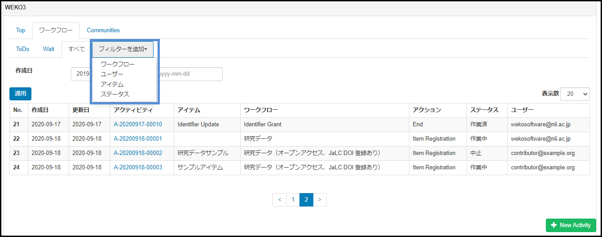

図 5‑75［フィルターを追加］ボタン

2.  表示されたフィルター項目をクリックします。
    
    クリックしたフィルターの入力エリアがアクティビティ一覧の上部に追加されます。
    
    適用されたフィルターの内容は各タブ（ToDo、Wait、すべて）間で引き継がれます。

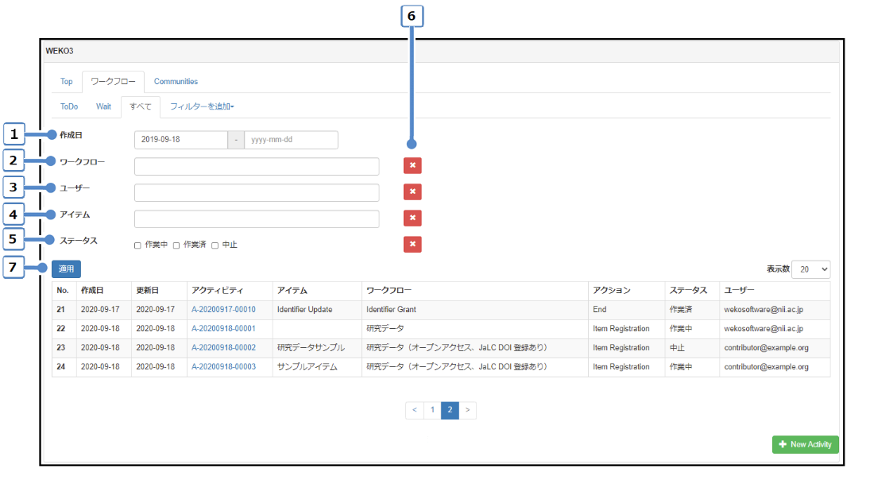

図 5‑76［フィルター］画面

表 5‑26［フィルター］の項目と説明

<table>
<thead>
<tr class="header">
<th>項番</th>
<th>項目</th>
<th>説明</th>
</tr>
</thead>
<tbody>
<tr class="odd">
<td>1</td>
<td>作成日</td>
<td>
アクティビティの作成日の範囲を入力します。表示フォーマットは、「<em>yyyy-mm-dd</em>」です。

作成日の開始日に1年前の当日が自動設定されます。
</td>
</tr>
<tr class="even">
<td>2</td>
<td>ワークフロー</td>
<td>
ワークフローを入力します。

フィルター形式は「前方一致」とします。

フィルター入力エリアが複数追加できます。
</td>
</tr>
<tr class="odd">
<td>3</td>
<td>ユーザ</td>
<td>
ユーザのメールアドレスを入力します。フィルター形式は「完全一致」とします。

フィルター入力エリアが複数追加できます。
</td>
</tr>
<tr class="even">
<td>4</td>
<td>アイテム</td>
<td>
アイテム名を入力します。

フィルター形式は「前方一致」とします。

フィルター入力エリアが複数追加できます。
</td>
</tr>
<tr class="odd">
<td>5</td>
<td>ステータス</td>
<td>
アクティビティのステータスを選択します。選択肢は「作業中、作業済、中止」になります。複数選択できます。

フィルター形式は「完全一致」とします。
</td>
</tr>
<tr class="even">
<td>6</td>
<td>［］ボタン</td>
<td>クリックすると、該当フィルターエリアが削除されます。</td>
</tr>
<tr class="odd">
<td>7</td>
<td>［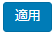］ボタン</td>
<td>クリックすると、設定されたフィルターが適用されます。</td>
</tr>
</tbody>
</table>

1.  アクティビティの一覧をページングする

アクティビティの一覧をページングする手順について説明します。

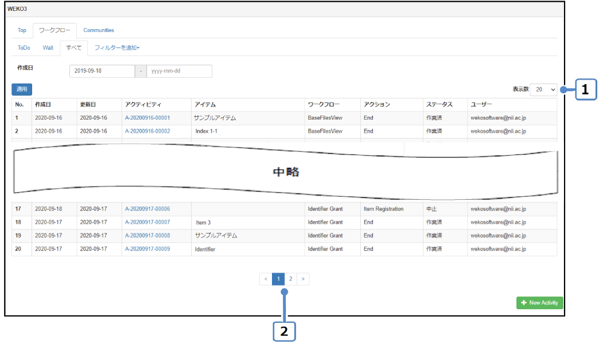

図 5‑77アクティビティ一覧のページング

表 5‑27［ページング］の項目と説明

<table>
<thead>
<tr class="header">
<th>項番</th>
<th>項目</th>
<th>説明</th>
</tr>
</thead>
<tbody>
<tr class="odd">
<td>1</td>
<td>［表示数］プルダウン</td>
<td>
アクティビティの表示数を選択します。デフォルトは「20」になります。「図 5-23［表示数］プルダウンを参照してください。

選択すると、タブでのアクティビティの表示数が適用されます。
</td>
</tr>
<tr class="even">
<td>2</td>
<td>ページングボタン</td>
<td>
ページングボタンをクリックすると、表示内容が切り替わります。

<ul>
<li><blockquote>

［］ボタンをクリックすると、前のページに移動します。

</blockquote></li>
<li><blockquote>

「ページ番号」ボタンをクリックすると、該当ページに移動します。

</blockquote></li>
<li><blockquote>

［］ボタンをクリックすると、次のページに移動します。

</blockquote></li>
</ul></td>
</tr>
</tbody>
</table>

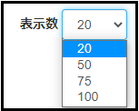

図 5‑78［表示数］プルダウン

### アクティビティをTSVファイルに出力する

アクティビティをTSVファイルに出力する手順を説明します。 

注：［ダウンロード］ボタンおよび［クリア］ボタンは、［All］タブを表示している場合にだけ表示されます。また、設定ファイル（instance.cfg）で `DELETE_ACTIVITY_LOG_ENABLE = True` が設定されていない場合は表示されません。

1.[アクティビティ一覧]画面をシステム管理者またはリポジトリ管理者アカウントで表示し、［All］タブをクリックします。 

2.出力したいアクティビティを［フィルターを追加］ボタンを用いて検索します。 

※手順の詳細は「アクティビティの一覧をフィルターする」と同様となります。 

3.[ダウンロード]ボタン押下すると、TSVファイルが出力されます。 

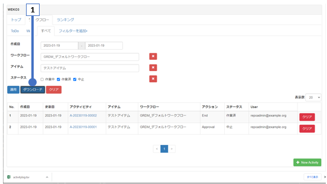

図 5‑79 ダウンロードボタン

表 5-26［ダウンロード］の項目と説明 

| 項番 | 項目                | 説明                                                                                       |
|------|---------------------|------------------------------------------------------------------------------------------|
| 1    | [ダウンロード]ボタン | ［All］タブで、システム管理者、リポジトリ管理者のみ表示されます。画面に表示しているアクティビティと同じ検索条件のアクティビティをTSV形式のファイルでダウンロードします。 |

### アクティビティを削除する 

アクティビティを削除する手順を説明します。 

注：［ダウンロード］ボタンおよび［クリア］ボタンは、［All］タブを表示している場合にだけ表示されます。また、設定ファイル（instance.cfg）で `DELETE_ACTIVITY_LOG_ENABLE = True` が設定されていない場合は表示されません。

削除される際はそのアクティビティのTSVファイルがダウンロードされます。  

1.[アクティビティ一覧]画面をシステム管理者またはリポジトリ管理者アカウントで表示し、［All］タブをクリックします。 

2.削除したいアクティビティを［フィルターを追加］ボタンを用いて検索します。 

※手順の詳細は「アクティビティの一覧をフィルターする」と同様となります。 

3.検索条件に一致するアクティビティをまとめて削除したい場合は、[ダウンロード]ボタンの隣にある[クリア]ボタンを押下します。１行だけ削除したい場合は、表示された行の[クリア]ボタンを押下します。 

4.確認ダイアログを[OK]を押下します。

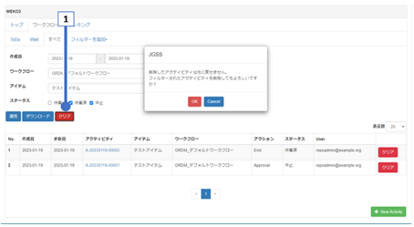

> 図 5‑80 ダウンロードボタン

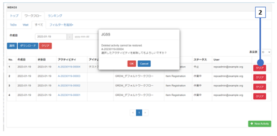

> 図 5‑81 ダウンロードボタン

表 5-27［Clear］の項目と説明 

| 項番 | 項目                          | 説明                                                                                                                         |
|------|-------------------------------|------------------------------------------------------------------------------------------------------------------------------|
| 1    | [クリア]ボタン（[ダウンロード]ボタン横） | ［All］タブで、システム管理者、リポジトリ管理者のみ表示されます。画面に表示しているアクティビティと同じ検索条件のアクティビティをTSV形式のファイルでダウンロードし、そのアクティビティを削除します。 |
| 2    | [クリア]ボタン（行内）         | ［All］タブで、システム管理者、リポジトリ管理者のみ表示されます。選択したアクティビティをTSV形式のファイルでダウンロードし、そのアクティビティを削除します。 

#### アクティビティの詳細を表示する

アクティビティの詳細を参照する手順を説明します。

1.  ［アクティビティ一覧］画面のアクティビティ名をクリックします。
    
    ［アクティビティの詳細］画面が表示されます。

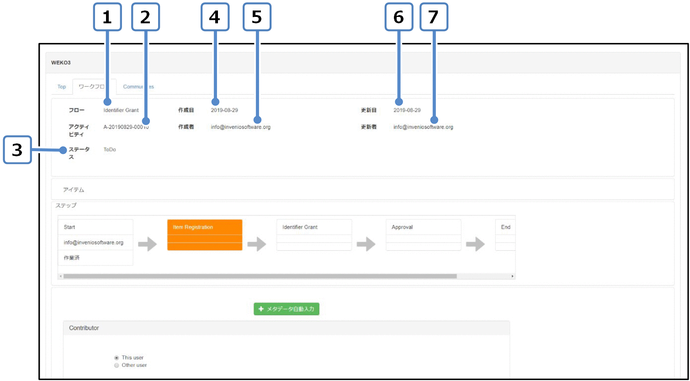

> 図 5‑82［アクティビティの詳細］画面

表 5-28［アクティビティの詳細］画面の項目と説明

| 項番 | 項目      | 説明                                             |
| -- | ------- | ---------------------------------------------- |
| 1  | フロー     | フローの名称が表示されます。                                 |
| 2  | アクティビティ | アクティビティの名称が表示されます。                             |
| 3  | ステータス   | アクティビティのステータスが表示されます。                          |
| 4  | 作成日     | アクティビティの作成日が表示されます。表示フォーマットは、「*yyyy-mm-dd*」です。 |
| 5  | 作成者     | アクティビティの作成者が表示されます。                            |
| 6  | 更新日     | アクティビティの更新日が表示されます。表示フォーマットは、「*yyyy-mm-dd*」です。 |
| 7  | 更新者     | アクティビティの更新者が表示されます。                            |

#### 5.2.3 アクティビティのログを取得、クリアする

> アクティビティのログを取得もしくはクリアする手順を説明します。

1.  > アクティビティ一覧画面で、\[すべて\]タブを押下します。アクティビティ一覧画面(すべて)が表示されます。
    
    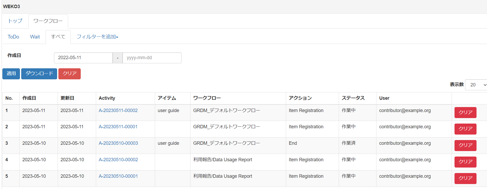

> 図 5‑80アクティビティ一覧画面(すべて)
> 
> \[ダウンロード\]を押下すると、アクティビティのログがダウンロードされます。
> 
> 画面中央左部の\[クリア\]を押下すると、ダウンロード後にすべてのアクティビティが削除されます。
> 
> それぞれのアクティビティごとの\[クリア\]を押下すると、それぞれのダウンロード後に対応する行のアクティビティが削除されます。

### アクティビティロック(v1.0.7)

複数のアクティビティを同時実行することはできません。
既に実行済みのアクティビティがある状態でアクティビティを実行しようとすると以下画面が表示されます。

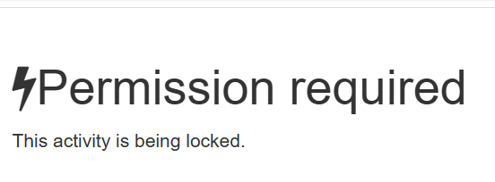

実行中のアクティビティを完了させるか、中止してください。

また、同一アクティビティを複数タブで開こうとすると、下記画面が表示されます。

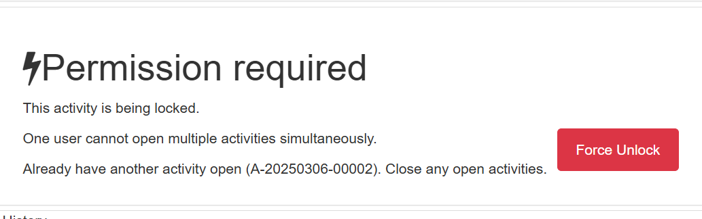

他に実行しているタブがないかを確認し、実行中のタブを終了してからアクティビティ再開してください。

※ウェブブラウザの状態によっては、同時実行判定に失敗する場合があります。
そのような場合は「force unlock」ボタンをクリックし、アクティビティを開始してください。

## アイテムを編集・削除する

この章では、登録済みのアイテムを編集および削除するための操作手順を説明します。

### アイテムを編集する

ここでは、システムに登録済みのアイテムを編集する手順を説明します。

アイテムを編集可能なユーザは、システム管理者、リポジトリ管理者、アイテムが所属するインデックスを管轄するコミュニティのコミュニティ管理者、アイテムの登録者（所有者）および投稿者（代理投稿者）です。
>アイテム編集可能なユーザ権限を所有している場合、下記手順2~8以外にも、直接URL（/workflow/edit_item_direct/<アイテムID>）を入力することでアイテム編集画面に遷移します。
>編集可能なユーザ且つ、当該アイテムが編集中ではない場合に編集画面に遷移でき、編集中の場合は図 6‑4のエラーが表示されます。
>ログインしていない場合はログイン画面を表示し、ログイン後に編集画面へ遷移します。ログインしていても編集権限がない場合は、エラー「You are not allowed to edit this item.」が表示されます。
>【v2.1.0】ログインしていないユーザや編集権限のないユーザは、画面を経由せずにアイテムの更新・公開などの操作を行うこともできません。

インデックスの配下のアイテムを編集できます。編集するアイテムをインデックスツリーで探します。

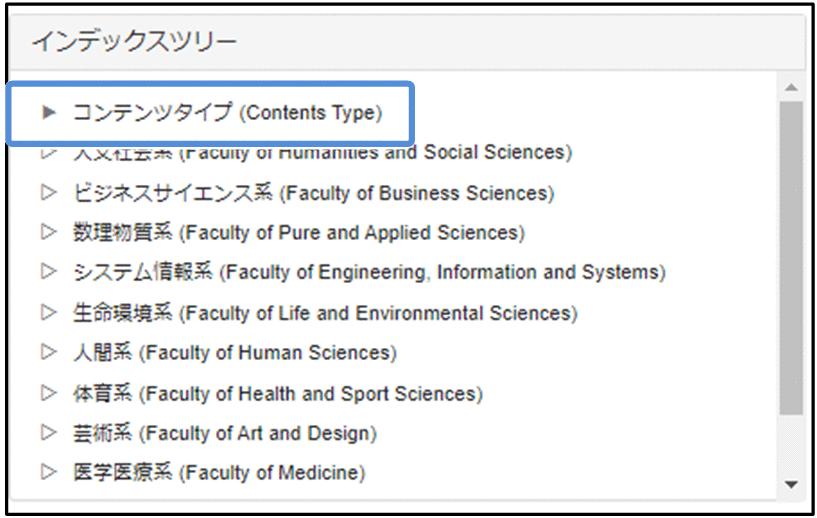

> 図 6‑1［インデックスツリー］画面

1.  ［インデックスツリー］画面からインデックスをクリックします。
    
    ［アイテムリスト］画面が表示されます。

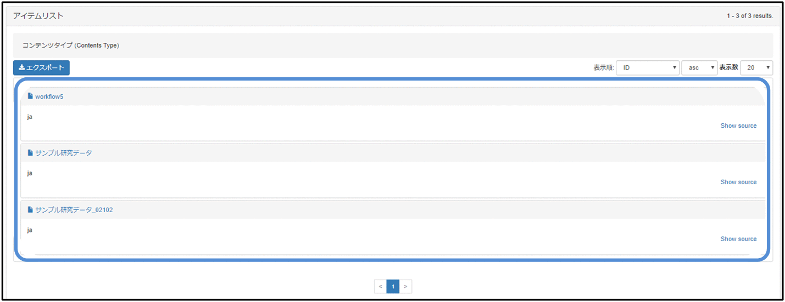

> 図 6‑2［アイテムリスト］画面

2.  > 表示された［アイテムリスト］画面から編集するアイテムのタイトルをクリックします。
    
    アイテム詳細画面が表示されます。

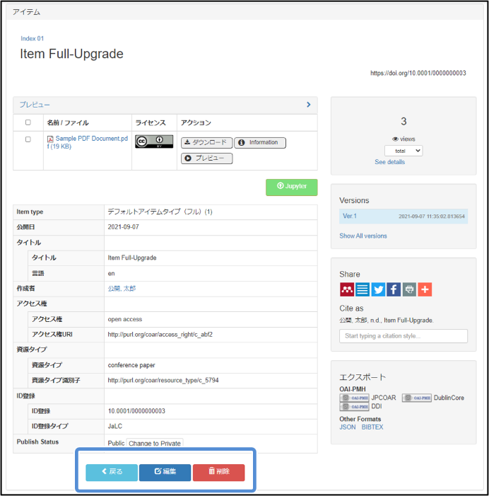

図 6‑3アイテム詳細画面

3.  表示されたアイテム詳細画面の［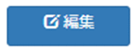］ボタンをクリックします。
    
    Item Registration画面が表示されます。
    
    一括登録を実行中に他端末および実行端末でアイテムの［編集］ボタンを押下した場合、メッセージ「インポートを実行中のためアイテムの編集はできません。」が表示されます。

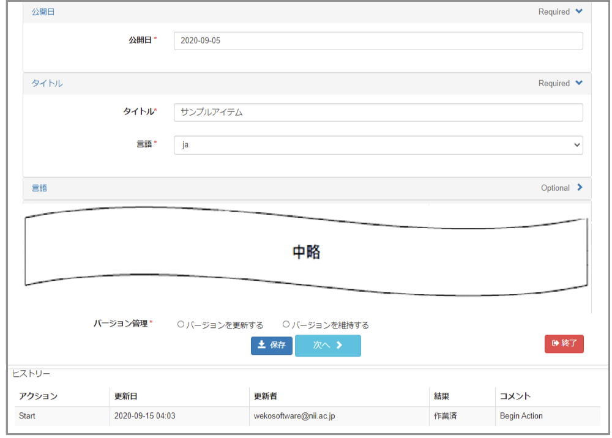

> 図 6‑4 Item Registration画面

該当アイテムが編集中の場合、［The item is being edited.］というメッセージが表示されます。この場合に、アイテムを編集するために、［アクティビティ一覧］画面から編集するアクティビティ名をクリックします。

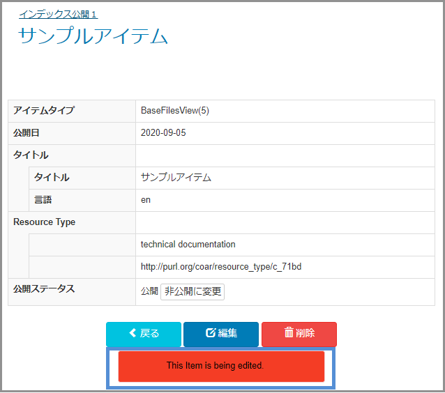

> 図 6‑5メッセージ［The item is being edited.］

4.  該当するアクティビティ名をクリックして編集します。
    
    1.  ［ホーム］画面から［ワークフロー］タブをクリックします。  
        ［アクティビティ一覧］画面が表示されます。

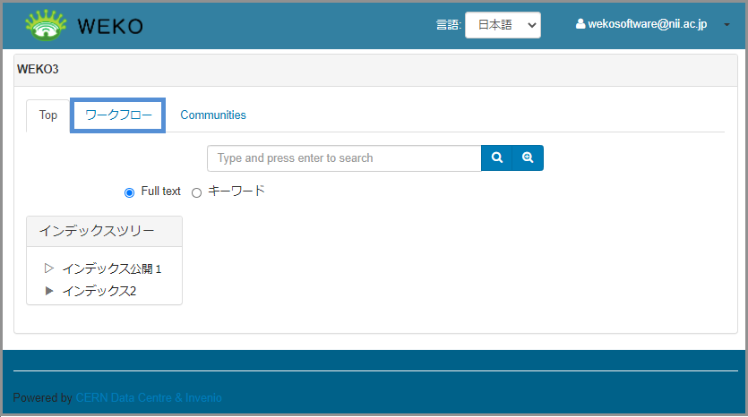

図 6‑6［ホーム］画面

2.  ［ToDo］タブ、または［すべて］タブのいずれかを選択します。

> ［アクティビティ一覧］画面が表示されます。

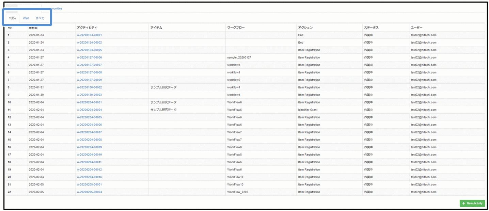

> 図 6‑7［アクティビティ一覧］画面

3.  表示された［アクティビティ一覧］画面から編集するアクティビティ名をクリックします。

> Item Registration画面が表示されます。

図 6‑8Item Registration画面

5.  該当項目を編集します。

6.  ［バージョン管理］を選択します。

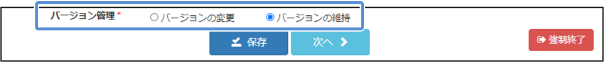

> 図 6‑9\[バージョン管理\]

［バージョンの変更］を選択する場合、編集したアイテムのバージョンがアップされて、アイテムが更新されます。

［バージョンの維持］を選択する場合、現在のバージョンが維持されて、アイテムが更新されます。

デフォルトは［バージョンの維持］です。

［バージョン管理］は入力必須項目です。

7.  ［］ボタンをクリックします。
    
    ［インデックス指定］画面が表示されます。詳細については、「5.1 アイテムを登録する」の「インデックスを設定する」を参照してください。
    
    注
    
    Item Registration画面の［］ボタンをクリックすると、入力したメタデータのチェックを行います。エラーがある場合、エラーメッセージが表示されます。エラーの内容は「5.1 アイテムを登録する」章の【入力したメタデータのチェック】の説明を参照してください。
    
    Item Registration画面の［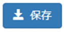］ボタン、［］ボタン、［］ボタンをクリックする時の挙動は「表 5-14Item Registration画面の項目と説明」を参照してください。

8.  ［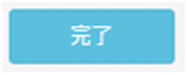］ボタンをクリックします。
    
    定義されているフローによって次のアクションに進みます。
    
    詳細については、「5.1 アイテムを登録する」の該当するアクションの章を参照してください。
    
    アイテムが［Approval］画面で「承認」されると、アイテムが更新されます。
    
    【注意事項】
    
    編集後、旧バージョンは以前の公開ステータスが引き継がれます。
    
### アイテムを削除する

ここでは、システムに登録済みのアイテムを削除する手順を説明します。

アイテムを削除可能なユーザは、アイテムを編集可能なユーザ（システム管理者、リポジトリ管理者、アイテムが所属するインデックスを管轄するコミュニティのコミュニティ管理者、アイテムの登録者（所有者）および投稿者（代理投稿者））です。

インデックスの配下のアイテムを削除できます。削除するアイテムをインデックスツリーで探します。

> 図 6‑10［インデックスツリー］画面

1.  ［インデックスツリー］画面からインデックスをクリックします。
    
    ［アイテムリスト］画面が表示されます。

> 図 6‑11［アイテムリスト］画面

2.  表示された［アイテムリスト］画面から削除するアイテムのタイトルをクリックします。
    
    アイテム詳細画面が表示されます。

> 図 6‑12アイテム詳細画面

3.  表示されたアイテム詳細画面の［］ボタンをクリックします。
    
    ［削除確認］画面が表示されます。
    
    一括登録を実行中に他端末および実行端末でアイテムの［削除］ボタンを押下した場合、アイテムの削除はできません。

図 6‑13［削除確認］画面

表 6‑1［削除確認］画面の項目と説明

| 項番 | 項目                                           | 説明                                    |
| -- | -------------------------------------------- | ------------------------------------- |
| 1  | ［］ボタン  | クリックすると、アイテムが削除されます。［アイテムリスト］画面に戻ります。 |
| 2  | ［］ボタン | クリックすると、アイテムは削除されず［削除確認］画面が閉じます。      |

注

権限がないユーザに対して、アイテム詳細画面に［］ボタンが表示されません。

アイテムの旧バージョンには、［］ボタンが表示されません。また、最新バージョンが削除された時は該当アイテムの旧バージョンもすべて論理削除されます。

4.  ［］ボタンをクリックします。
    
    アイテムが削除されます。
    
    アイテム削除後に、該当アイテムのURLを直接指定してアイテム詳細画面を表示すると、メッセージ「このアイテムは削除されています。」が表示されます。

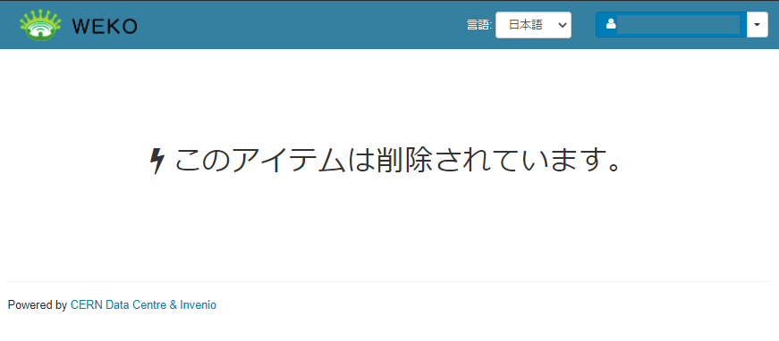

図 6‑14削除後のアイテム詳細画面

## アイテムを一括出力する

この章では、アイテムを一括出力する操作について説明します。

### アイテムを一括出力する

ここでは、アイテムを一括出力する手順を説明します。

1.  ［TOP］タブをクリックします。
    
    キーワード検索テキストボックスにキーワードを入力して検索、またはインデックスツリー検索を実施します。

<!-- end list -->

2.  検索結果が［アイテムリスト］画面に表示されます。
    
    ［］ボタンをクリックして［一括出力］画面を表示します。
    
    ［］ボタンは、管理画面のアイテム一括出力設定でアイテムの出力が許可されている場合に表示されます。

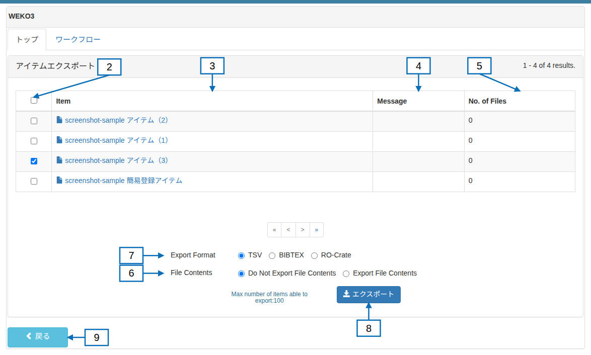

> 図 7‑1［一括出力］画面

表 7-1［一括出力］画面の項目と説明

<table>
<thead>
<tr class="header">
<th>項番</th>
<th>項目</th>
<th>説明</th>
</tr>
</thead>
<tbody>
<tr class="odd">
<td>1</td>
<td>インデックス名のテキスト</td>
<td>選択しているインデックス名を表示します。</td>
</tr>
<tr class="even">
<td>2</td>
<td>チェックボックス</td>
<td>出力するアイテムをチェックします。</td>
</tr>
<tr class="odd">
<td>3</td>
<td>［Item］</td>
<td>
一括出力するアイテム一覧を表示します。

リンクの形式で表示して、リンクをクリックすると、アイテム詳細画面に移動します。
</td>
</tr>
<tr class="even">
<td>【v2.1.0】4</td>
<td>［Message］</td>
<td>
システムからのメッセージを表示します。

ファイルのダウンロード権限がない場合、メッセージ「Contains restricted content」が表示されます。

［Export Format］で［BIBTEX］を選択して出力した際に、BibTeXの必須項目が不足しているアイテム、または閲覧権限のないアイテムには、メッセージ「必須項目がありません。」（英語表示の場合「Required item is not inputted.」）が表示され、そのアイテムは出力されません。
</td>
</tr>
<tr class="odd">
<td>5</td>
<td>［No. of Files］</td>
<td>アイテムに登録しているコンテンツファイルの件数を表示します。</td>
</tr>
<tr class="even">
<td>6</td>
<td>［File Contents］ラジオボタン</td>
<td>
［File Contents］ラジオボタンを選択します。

選択肢は［Do Not Export File Contents］、［Export File Contents］になります。

管理画面のアイテム一括出力設定でファイルの出力が許可されていない場合は選択できず、メッセージ「ファイルをエクスポートできません。」が表示されます。

［Export Format］で［RO-Crate］を選択した場合は、［Export File Contents］が自動的に選択されます。
</td>
</tr>
<tr class="odd">
<td>7</td>
<td>［Export Format］ラジオボタン</td>
<td>
表示された［Export Format］ラジオボタンを選択します。

選択肢は［TSV］、［BIBTEX］、［RO-Crate］になります。

［RO-Crate］は、管理画面のアイテム一括出力設定でファイルの出力が許可されている場合に選択できます。
</td>
</tr>
<tr class="even">
<td>8</td>
<td>［］ボタン</td>
<td>
Item一覧で選択したアイテムを出力します。

出力するアイテムを選択しない場合、ボタンが非活動になります。

一度に出力できるアイテムの最大件数がボタンの左に表示されます。選択したアイテム数が最大件数を超えた場合、メッセージ「Exceeded number of selectable items.」が表示され、ボタンが非活動になります。
</td>
</tr>
<tr class="odd">
<td>9</td>
<td>［］ボタン</td>
<td>クリックすると［簡易検索］画面に戻ります。</td>
</tr>
</tbody>
</table>

注）一括出力時、内部エラーが発生する場合、エラーメッセージ「Error occurred during item export.」が表示されます。

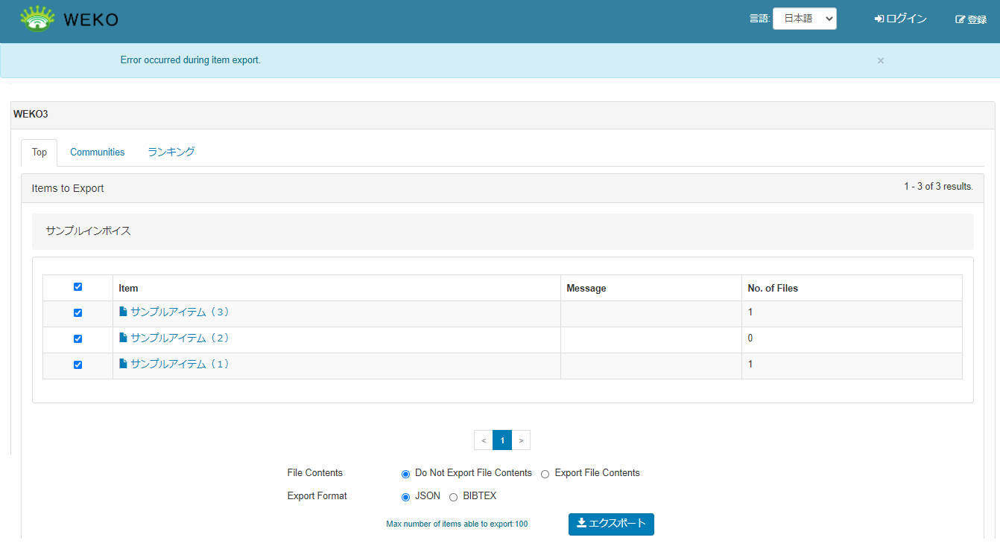

図 7‑2エラーメッセージ「Error occurred during item export.」

## 大容量のファイルをアップロードする

**本機能は未リリースです。**

大容量ファイルアップロード機能（専用の画面から大容量のファイルをアップロードし、アップロードが失敗した場合にアップロードIDを指定して途中から再開できる機能）は、リリースを見送りました。現在のバージョンでは利用できません。

## コミュニティを確認する

この章では、コミュニティを確認する操作について説明します。

### コミュニティを確認する

コミュニティは、コミュニティを表示する設定が有効な場合に確認できます。詳細については、システム管理ガイドの「16.12.6 インデックスツリー/ファセットの表示を設定する」を参照してください。

1.  ［ホーム］画面の［Communities］タブをクリックします。
    
    ［Communities］画面が表示されます。

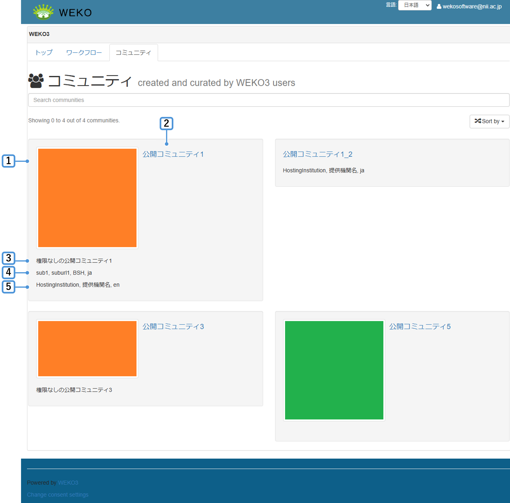

図 8‑1［Communities］画面

表 8-1［Communities］画面の項目と説明

| 項番 | 項目              | 説明                                   |
| -- | --------------- | ------------------------------------ |
| 1  | コミュニティロゴ     | コミュニティにロゴが設定されている場合に、その画像が表示されます。     |
| 2  | コミュニティ名    | クリックすると、そのコミュニティのトップページが表示されます。     |
| 3  | タグ情報    | コミュニティに設定された以下の主題情報がカンマ区切りで表示されます。<ul><li>主題</li><li>主題URL</li><li>タグスキーマ</li><li>言語</li></ul>     |
| 4  | 提供機関情報    | コミュニティに設定された以下の提供機関情報がカンマ区切りで表示されます。<ul><li>提供機関タイプ</li><li>提供機関名</li><li>言語</li></ul>     |

2. ［Communities］画面のリスト内からコミュニティ名のリンクをクリックします。

3. 選択したコミュニティのトップページが表示されます。

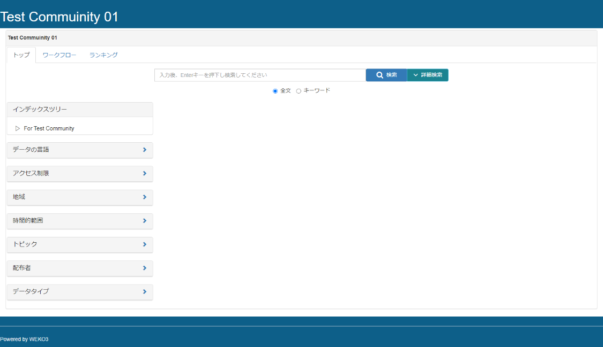

図 8‑2コミュニティ詳細画面

### コンテンツポリシーを表示する

コミュニティのコンテンツポリシーを表示します。

1. コミュニティのトップページから［コンテンツポリシー］タブをクリックします。

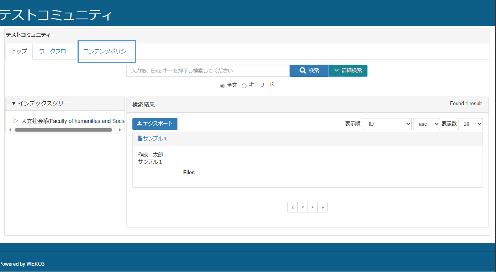

2. コミュニティに設定されているコンテンツポリシーが表示されます。

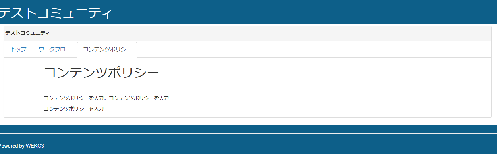

図 8‑3［コンテンツポリシー］画面

## こんなときは

この章では、操作に困ったときの解決方法を説明します。

### プロフィールを変更したい

ここでは、アカウントのプロフィールを変更する方法を説明します。

1.  画面右上のアカウント名右の［］をクリックします。
    
    ユーザカウントのプルダウンメニューが表示されます。

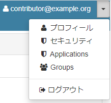

> 図 9‑1ユーザカウントのプルダウンメニュー

2.  「プロフィール」をクリックします。［プロフィール］画面が表示されます。

3.  表示された［プロフィール］画面でプロフィールを変更します。

図 9‑2［プロフィール］画面

表 9‑1［プロフィール］画面の項目と説明

| 項番 | 項目                                           | 説明                                                                                   |
| -- | -------------------------------------------- | ------------------------------------------------------------------------------------ |
| 1  | ［ユーザ名］テキストボックス                               | ユーザ名を入力します。半角英数字、ハイフン（-）、アンダーバー（\_）を使用できます。3文字以上255文字まで入力できます。                       |
| 2  | ［タイムゾーン］プルダウンリスト                             | タイムゾーンを［タイムゾーン］プルダウンリストから選択します。「図9-3 ［タイムゾーン］プルダウンリストを参照してください。                      |
| 3  | ［言語］プルダウンリスト                                 | 言語を［言語］プルダウンリストから選択します。「図9-4 ［言語］プルダウンリストを参照してください。                                  |
| 4  | ［メールアドレス］テキストボックス                            | 入力フォーマットは「*XXXXX*＠*XXX.XXX*」の形式で指定します。半角英数字、ハイフン（-）、アンダーバー（\_）を使用できます。254文字まで入力できます。 |
| 5  | ［メールアドレスの再入力］テキストボックス                        | ［メールアドレス］で設定した値が正しいか確認するため、再度、新しいメールアドレスを入力します。                                      |
| 6  | ［access key］テキストボックス                        | ファイル詳細画面から「公開バケットへのコピー」を行いたい場合、使用するS3アカウントの［access key］を入力します。                                      |
| 7  | ［secret key］テキストボックス                        | ファイル詳細画面から「公開バケットへのコピー」を行いたい場合、使用するS3アカウントの［secret key］を入力します。                                      |
| 8  | ［endpoint url］テキストボックス                        | ファイル詳細画面から「公開バケットへのコピー」を行いたい場合、使用するS3アカウントの［endpoint url］を入力します。                                      |
| 9  | ［region name］テキストボックス                        | ファイル詳細画面から「公開バケットへのコピー」を行いたい場合で、使用するS3アカウントの［region name］を指定する場合は入力します。                                      |
| 10  | ［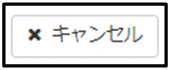］ボタン | クリックすると、変更内容を保存せず、［プロフィール］画面を再表示します。                                                 |
| 11  | ［］ボタン | クリックすると、プロフィールが変更され［プロフィール］画面を再表示します。                                                |

注：項番6～9（S3アカウント情報の項目）は、設定ファイル（instance.cfg）で `WEKO_RECORDS_UI_USER_STORAGE_MODIFICATION_ENABLED = True` が設定されている場合にだけ表示されます（既定の設定は無効（False）です）。

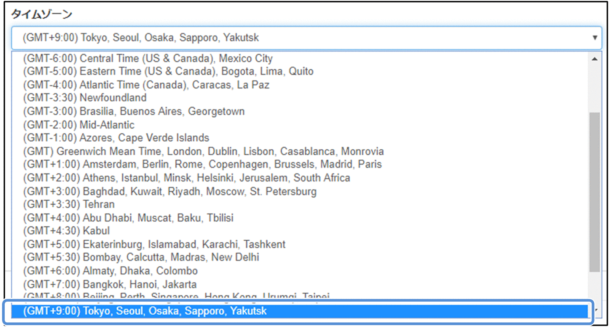

> 図 9‑3［タイムゾーン］プルダウンリスト

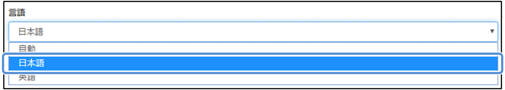

図 9‑4［言語］プルダウンリスト

4.  ［］ボタンをクリックします。プロファイルが変更されます。
    
### アカウントにログインしたデバイスを確認したい

アカウントにログインしたデバイスを確認する方法を説明します。

1.  画面右上のユーザカウントのプルダウンメニューから［セキュリティ］を選択します。
    
    ［セッション］画面が表示されます。

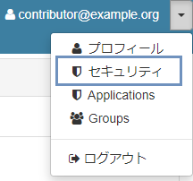

> 図 9‑5ユーザカウントのプルダウンメニュー

2.  必要に応じて、［ログアウト］または［撤回］をクリックします。
    
    セッションが削除されます。

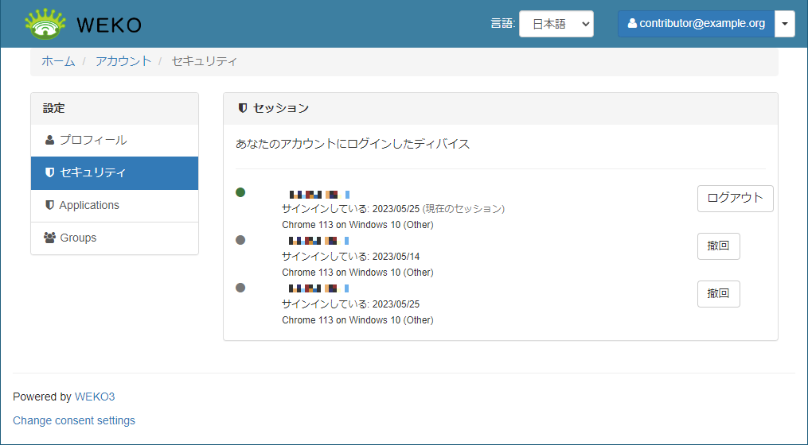

> 図 9‑6［セッション］画面

### アプリケーションを管理したい

アプリケーションを管理する方法を説明します。アプリケーション管理画面は、画面右上のユーザカウントのプルダウンメニューから［Applications］を選択すると表示されます。

#### 許可したアプリケーションを参照する

許可したアプリケーションを参照する方法を説明します。

1.  画面右上のユーザカウントのプルダウンメニューから［Applications］を選択します。
    
    アプリケーション管理画面の［Authorized applications］に、許可したアプリケーションのリストが表示されます。

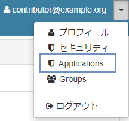

> 図 9‑7ユーザカウントのプルダウンメニュー

#### アプリケーションを追加する

アプリケーションを追加する方法を説明します。

1.  アプリケーション管理画面の［Developer Applications］で［+New application］をクリックします。
    
    ［New OAuth Application］画面が表示されます。

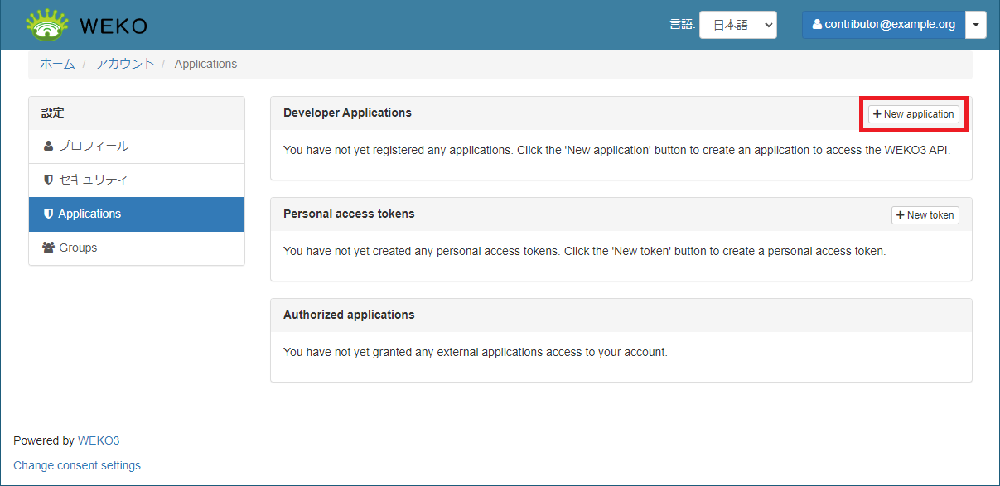

> 図 9‑8アプリケーション管理画面

2.  項目を入力します。

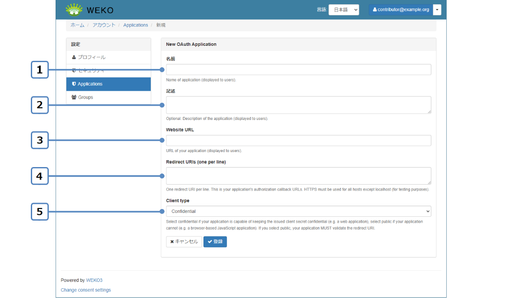

> 図 9‑9［New OAuth Application］画面

表 9‑2［New OAuth Application］画面の項目

<table>
<thead>
<tr class="header">
<th>項番</th>
<th>項目</th>
<th>説明</th>
</tr>
</thead>
<tbody>
<tr class="odd">
<td>1</td>
<td>名前</td>
<td>名前を入力します。</td>
</tr>
<tr class="even">
<td>2</td>
<td>説明</td>
<td>アプリケーションについての説明を入力します。</td>
</tr>
<tr class="odd">
<td>3</td>
<td>Website URL</td>
<td>アプリケーションのURLを入力します。</td>
</tr>
<tr class="even">
<td>4</td>
<td>Redirect URIs (one per line)</td>
<td>
リダイレクト先のURIを入力します。

１行につき、1つのURIを入力します。
</td>
</tr>
<tr class="odd">
<td>5</td>
<td>Client type</td>
<td>クライアントタイプを選択します。</td>
</tr>
</tbody>
</table>

3.  ［登録］をクリックします。
    
    アプリケーションが追加されます。
    
#### アクセストークンを追加する

アクセストークンを追加する方法を説明します。

1.  ［Personal access tokens］で［+New tokens］をクリックします。
    
    ［New personal access token］画面が表示されます。

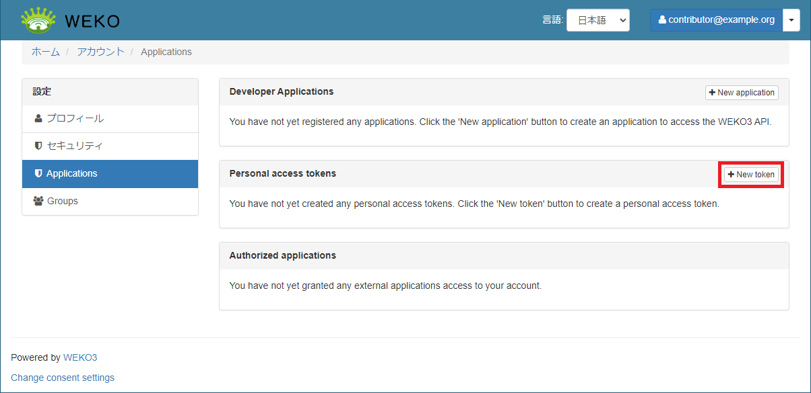

> 図 9‑10アプリケーション管理画面

2.  項目を入力します。

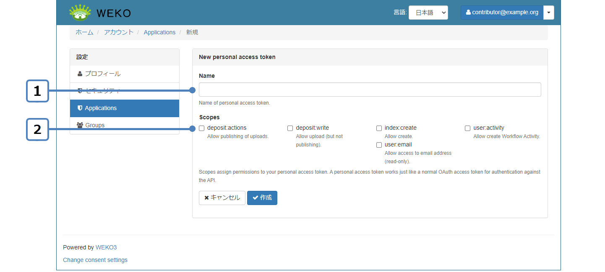

> 図 9‑11［New personal access token］画面

表 9‑3［New personal access token］の項目と説明

| 項番 | 項目     | 説明          |
| -- | ------ | ----------- |
| 1  | Name   | 名前を入力します。   |
| 2  | Scopes | スコープを選択します。 |

3.  ［作成］をクリックします。
    
    アクセストークンが追加されます。

※ Personal Access Tokenは有効期間は無期限となります。取り扱いは十分にご注意ください。また、アカウント停止前には必ず廃棄してください。
    

### グループに所属・グループを参照したい

グループに所属する方法と所属しているグループを参照する方法を説明します。

#### グループに所属する

グループに所属する方法を説明します。

1.  画面右上のユーザカウントのプルダウンメニューから［Groups］を選択します。［Groups］画面が表示されます。

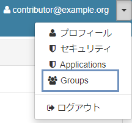

> 図 9‑12ユーザカウントのプルダウンメニュー

2.  自分が所属するグループが表示されます。グループへの招待がある場合は、以下のように表示されます。

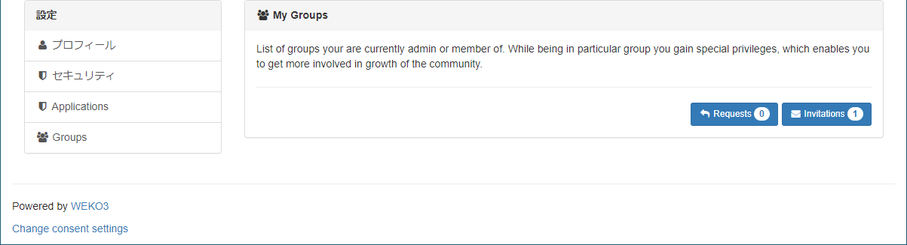

> 図 9‑13［Groups］画面

3.  ［Invitations］ボタンをクリックすると、招待されているグループが表示されます。［同意］ボタンをクリックします。

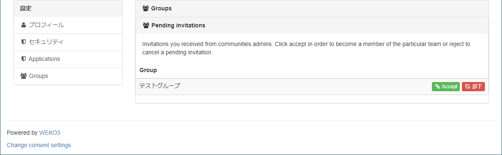

> 図 9‑14［Pending invitations］ 画面

4.  ［同意］ボタンをクリックすると、以下のように表示されます。

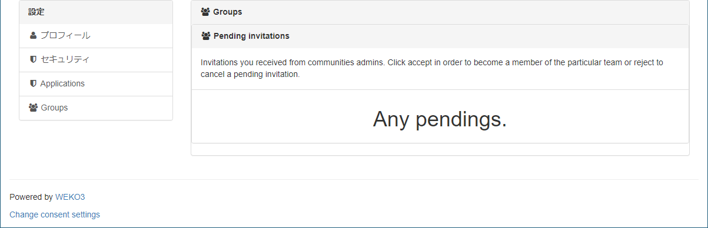

> 図 9‑15［Pending invitations］ 画面（招待なし）

#### グループを参照する

所属するグループを参照する方法を説明します。

1.  画面右上のユーザカウントのプルダウンメニューから［Groups］を選択します。［Groups］画面が表示されます。

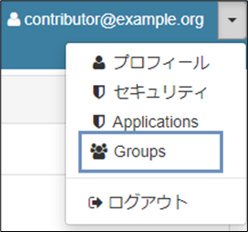

> 図 9‑16ユーザカウントのプルダウンメニュー

2.  自分が所属するグループが表示されます。グループに所属していない場合は以下のように表示されます。

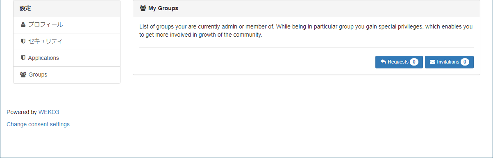

> 図 9‑17［My Groups］ 画面（グループ未所属）

3.  グループに所属している場合は以下のように表示されます。

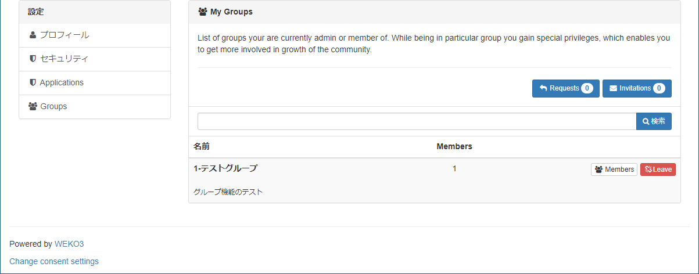

> 図 9‑18［My Groups］ 画面（グループ所属）

4.  ［Members］ボタンをクリックすると、［グループ詳細情報］画面が表示されます。

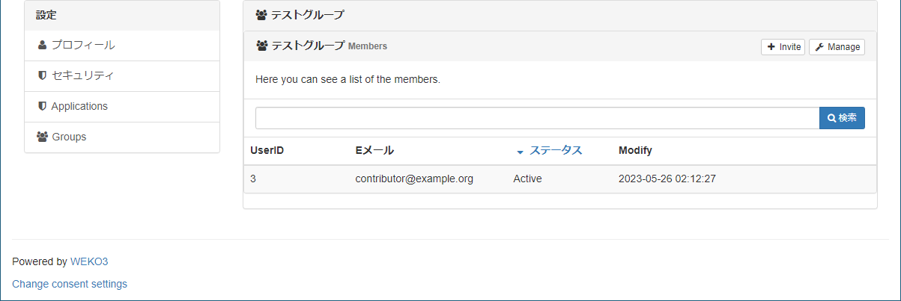

### セッションの有効時間を変更したい

操作方法については、「システム管理者ガイド」をご覧ください。

### 管理メニューを表示したい

管理者用のメニュー画面を表示する方法を説明します。

1.  管理者のアカウントでログインしてください。ログインの方法については、「2.2 ログインする」を参照してください。

<!-- end list -->

2.  ［ホーム］画面右上のアカウント名右の［］をクリックします。

プルダウンメニューが表示されます。

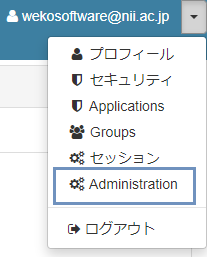

3.  「Administration」を選択します。［Administration］画面が表示されます。操作方法については、「システム管理者ガイド」をご覧ください。

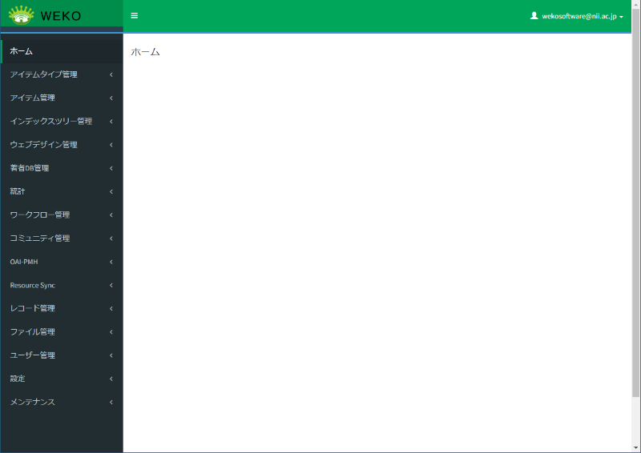

### Cookie使用確認画面を表示したい

Cookieの使用確認画面を表示する方法を説明します。
 
1.\[ホーム\]画面を下にスクロールし、画面左下「Change consent settings」をクリックしてください。\[Cookie使用確認\]画面が表示されます。
 
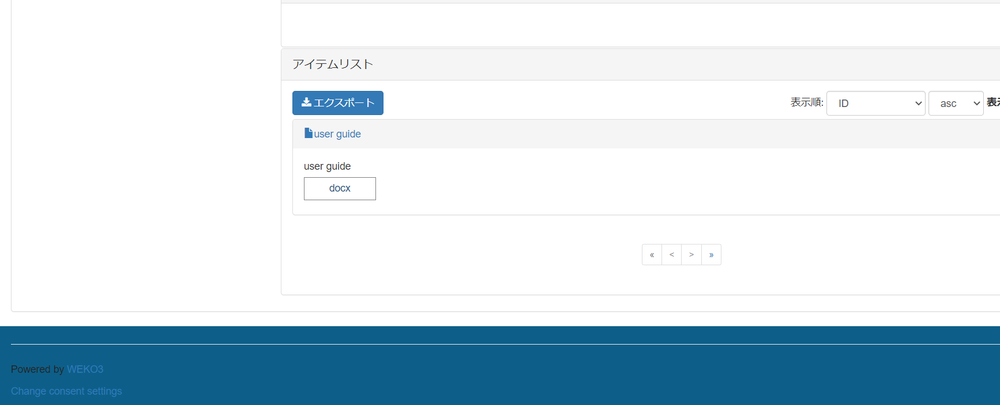
 
図9-21 \[ホーム\]画面
 
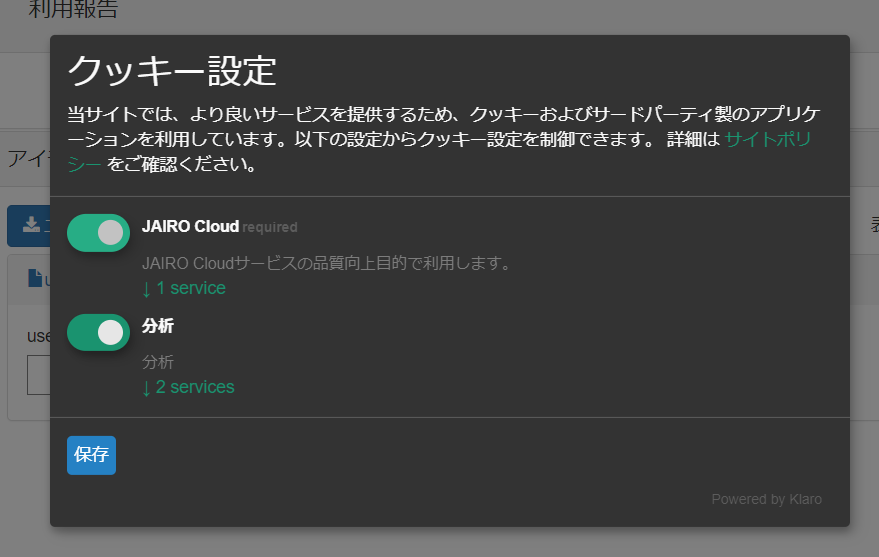
 
図 9-22 \[Cookie使用確認\]画面
 
\[Cookie使用確認\]画面で表示される項目は、以下の通りです。
 
表 9‑4 \[Cookie使用確認\]画面で表示される項目

<table>
<thead>
<tr class="header">
<th><blockquote>

項番

</blockquote></th>
<th><blockquote>

種類

</blockquote></th>
<th><blockquote>

目的

</blockquote></th>
<th><blockquote>

アプリケーション

</blockquote></th>
</tr>
</thead>
<tbody>
<tr class="odd">
<td><blockquote>

1

</blockquote></td>
<td><blockquote>

JAIRO Cloud

</blockquote></td>
<td><blockquote>

JAIRO Cloudサービスの品質向上目的で利用します。

※必須のため、無効化できません。

</blockquote></td>
<td><blockquote>

Google Analytics

</blockquote></td>
</tr>
<tr class="even">
<td><blockquote>

2

</blockquote></td>
<td><blockquote>

分析

</blockquote></td>
<td><blockquote>

分析

</blockquote></td>
<td><blockquote>

Google Analytics

</blockquote></td>
</tr>
<tr class="odd">
<td></td>
<td></td>
<td></td>
<td><blockquote>

Facebook

</blockquote></td>
</tr>
<tr class="even">
<td></td>
<td></td>
<td></td>
<td><blockquote>

X

</blockquote></td>
</tr>
</tbody>
</table>

> ご利用目的に応じて、設定が完了したら\[\]ボタンを押下し設定を保存してください。

注：「Change consent settings」は、設定ファイル（instance.cfg）で `ENABLE_COOKIE_CONSENT = True` が設定されている場合にだけ表示されます（既定の設定は無効（False）です）。

### 非公開コンテンツをワンタイムアドレスを利用して共有したい

#### シークレットURL機能

管理者画面でシークレットURL機能を有効化することで、シークレットURLを発行することができます。 
シークレットURLとは、投稿者（代理投稿者を含む）及びシステム、リポジトリ管理者が発行できるワンタイムアドレスであり、このURLを知っている人は、誰でも対象のコンテンツファイルをダウンロードできます

**本機能は、公開コンテンツ、ならびにサイトライセンス機能を利用してサイトライセンスユーザーに対してアクセス可能になっているコンテンツに対して、新たにアクセス権限を付与し、シークレットURLを通じたアクセスに制限する機能ではありません。**

 Information画面のファイルエリアに「Secret URL」ボタンが追加されるのは、以下の条件を満たした場合となります。
 
 1.管理画面の制限公開画面にて、シークレットURLの表示を有効化している。
 
 2.アイテム投稿者・アイテムの代理投稿者・リポジトリ管理者・システム管理者がログインしている。

 3.当該ファイルを「公開しない」と設定している。または、ファイルが「オープンアクセス日を指定する」と設定し、指定日が未来日である。

 注：アイテムの登録先インデックスが「公開」であること、およびアイテムのPublish Statusが「Public」であることは、ボタンの表示条件ではありません。これらはシークレットURLからのダウンロード時に確認され、満たさない場合はシークレットURLからダウンロードできません。
 
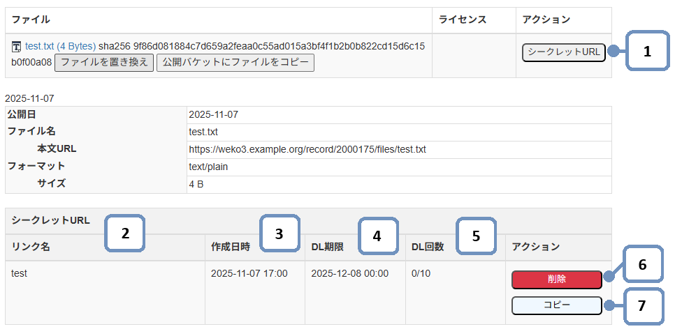
 
図9-23 シークレットURL機能を有効化した場合のInformation画面ファイルエリア

シークレットURL機能を有効化した場合、以下の項目が追加されます。

表 9‑5 シークレットURL機能有効化時に表示される項目と説明

<table>
<thead>
<tr class="header">
<th>項番</th>
<th>項目</th>
<th>説明</th>
</tr>
</thead>
<tbody>
<tr class="odd">
<td>1</td>
<td>シークレットURLボタン</td>
<td>
このボタンをクリックすることで、シークレットURLを作成欄が表示されます。
</td>
</tr>
<tr class="even">
<td>2</td>
<td>リンク名</td>
<td>
シークレットURLが作成されている場合に表示されます。

シークレットURL作成時に付与したリンク名、リンク名を付与しなかった場合は当該URLの識別子が表示されます
</td>
</tr>
<tr class="odd">
<td>3</td>
<td>作成日時</td>
<td>
シークレットURLが作成されている場合に表示されます。

当該シークレットURLの作成日時が表示されます
</td>
</tr>
<tr class="even">
<td>4</td>
<td>DL期限</td>
<td>
シークレットURLが作成されている場合に表示されます。

当該シークレットURLの有効期限が表示されます
</td>
</tr>
<tr class="odd">
<td>5</td>
<td>DL回数</td>
<td>
シークレットURLが作成されている場合に表示されます。

当該シークレットURLのDL回数と残DL回数が表示されます
</td>
</tr>
<tr class="even">
<td>6</td>
<td>削除ボタン</td>
<td>
シークレットURLが作成されている場合に表示されます。

このボタンをクリックすると、削除確認モーダル画面が表示され、このモーダル画面内の削除ボタンをクリックすると、当該シークレットURLが削除されます。削除をやめる場合は閉じるボタンをクリックし、モーダル画面を閉じてください。
</td>
</tr>
<tr class="odd">
<td>7</td>
<td>コピーボタン</td>
<td>
シークレットURLが作成されている場合に表示されます。

このボタンをクリックすると、モーダル画面が表示され、発行したシークレットURLをクリップボードにコピーすることができます。モーダル画面上の閉じるボタンをクリックすることで、モーダル画面を閉じることができます。
</td>
</tr>
</tbody>
</table>

「Secret URL」ボタンをクリックすると、シークレットURL編集作成欄が表示されます。

　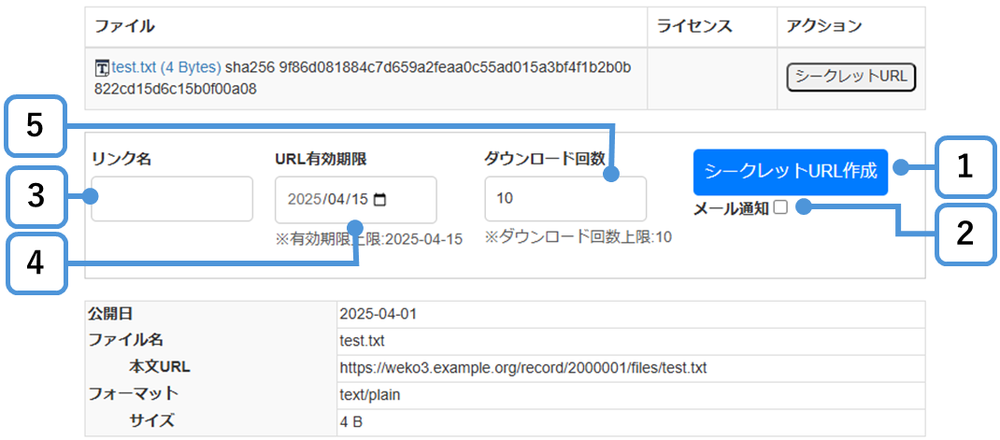

図 9-24 シークレットURLボタンをクリックし、シークレットURL作成欄を表示した状態

シークレットURL作成欄の各項目の内容は以下の通りです。

表 9‑6 シークレットURL作成欄の項目と説明

<table>
<thead>
<tr class="header">
<th>項番</th>
<th>項目</th>
<th>説明</th>
</tr>
</thead>
<tbody>
<tr class="odd">
<td>1</td>
<td>作成ボタン</td>
<td>
このボタンをクリックすることで、シークレットURLを作成します。
</td>
</tr>
<tr class="even">
<td>2</td>
<td>メール通知 チェックボックス</td>
<td>このチェックボックスにチェックを入れ、作成ボタンをクリックすると、シークレットURLボタンをクリックしたアカウントに対してメールで通知します。</td>
</tr>
<tr class="odd">
<td>3</td>
<td>リンク名フィールド</td>
<td>
作製するシークレットURLのファイル名を入力する。
</td>
</tr>
<tr class="even">
<td>4</td>
<td>DL期限フィールド</td>
<td>作製するシークレットURLのDL期限をカレンダーから選択し、設定します。</td>
></tr>
<tr class="odd">
<td>5</td>
<td>DL回数フィールド</td>
<td>作製するシークレットURLのDL回数を設定します。</td>
</tr>
</tbody>
</table>

## RSS

> この章では、WEKO RSS配信新着情報を取得してインデックス単位で購読する方法を説明します。

### インデックス単位でRSS配信新着情報を取得する

> インデックス単位でのRSS配信新着情報の取得は、対象となるインデックスでRSSアイコンを表示する設定が「表示する」の場合に利用できます。詳細については、システム管理ガイドの「4.1 インデックスツリーを管理する」を参照してください。

1.  > 新着情報を取得したいインデックスが表示されるように、インデックスリストを表示します。RSS配信新着情報の取得が可能なインデックスには、アイコンが表示されています。
    
    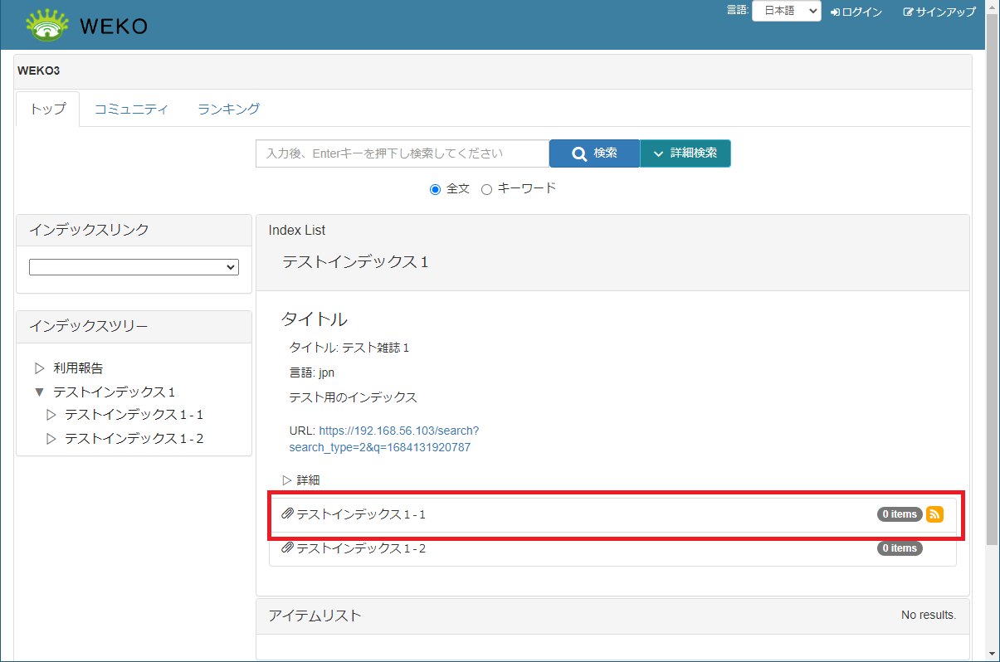

<!-- end list -->

2.  > アイコンをクリックすると、WEKO RSS配信新着情報を取得し、該当アイテム一覧のRSSを出力します。

### すべてのインデックスでRSS配信新着情報を取得する

> すべてのインデックスでのRSS配信新着情報の取得は、新着情報ウィジェットが表示されており、かつウィジェットのRSSアイコンを表示する設定が「表示する」の場合に利用できます。詳細については、システム管理ガイドの「5.1 ウィジェットを管理する」を参照してください。

1.  > 新着アイテムウィジェットのある画面を表示します。RSS配信新着情報の取得が可能な場合は、アイコンが表示されています。
    
    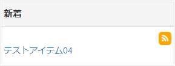

<!-- end list -->

2.  アイコンをクリックすると、WEKO RSS配信新着情報を取得し、該当アイテム一覧のRSSを出力します。

## ワークスペース

この章では、ワークスペース一覧画面について説明します。

### アイテム一覧を表示する

ここでは、WEKOからワークスペースのアイテム一覧画面を表示する手順を説明します。

1.  ログインしている場合、[ホーム]画面右上のアカウント名右の[]をクリックすると、プルダウンが表示されます。ワークスペースはログインユーザーであれば利用できます。

表11-1 ワークスペース
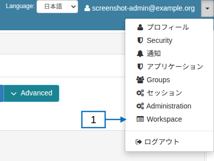

| 項番  | 項目   | 説明   |
| -- | ------ | ----------- |
| 1  | ワークスペース | ワークスペースに画面遷移します。 |

2.  [ワークスペース]をクリックすると、[ワークスペース一覧]画面が表示されます。
- ワークスペース一覧にはログインユーザーが所有するアイテムまたは代理投稿されたアイテムが表示されます。
- 保存済みの絞り込み条件がある場合は、その条件で絞り込まれた状態で表示されます。

表11-2 アイテム一覧（上部の説明）
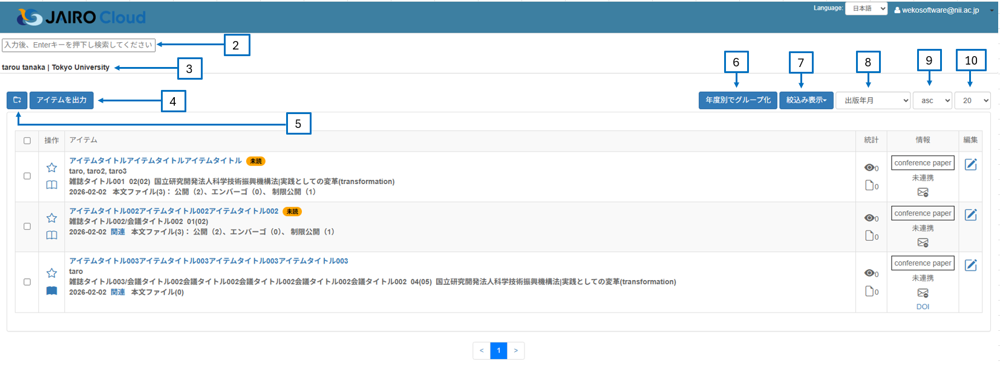

| 項番 | 項目     | 説明          |
| -- | ------ | ----------- |
| 2  | 検索   | DOI、タイトル、雑誌名、会議名、資金別情報（助成機関名、研究課題名）を検索します。入力後、Enterキーを押下すると検索します。   |
| 3  | ユーザ、所属情報 | ユーザ、所属情報を表示します。 |
| 4  | アイテムを出力   | アイテムリストをTSVファイルに出力します。   |
| 5  | アイテム登録   | アイテム登録画面に遷移します。   |
| 【v2.1.0】6  | 年度別でグループ化  | 表示を年単位で表示します。   |
| 7  | 絞込み表示 | 絞り込み条件設定画面を表示します。 |
| 8  | 並び変え条件   | 出版年月、タイトル、アクセス数、ダウンロード数で並び替えができます。   |
| 9  | 並び替え順 | 昇順、降順を選択できます。 |
| 10  | ページング   | 表示数を20,50,100に変更できます。   |

表11-3 アイテム一覧（アイテムリスト左部分の説明）
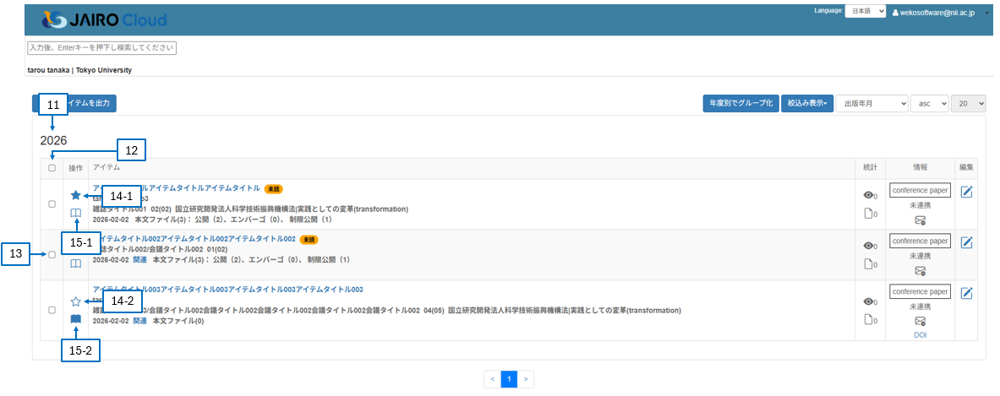

| 項番 | 項目     | 説明          |
| -- | ------ | ----------- |
| 11  | 年度のラベル   | グルーピングを押下すると年度別に表示されます。   |
| 【v2.1.0】12  | 一括選択チェックボックス | アイテムリストを一括選択します。 |
| 13  | チェックボックス   | 選択するとアイテム出力ができます。   |
| 14-1  | お気に入りボタン(お気に入り登録済み)  | お気に入り状態を切り替えできます。  |
| 14-2  | お気に入りボタン(お気に入り未登録)   | お気に入り状態を切り替えできます。   |
| 15-1  | 既読未読切り替えボタン(未読状態) | 既読状態、未読状態を切り替えできます。 |
| 15-2  | 既読未読切り替えボタン(既読状態) | 既読状態、未読状態を切り替えできます。 |

表11-4 アイテム一覧（アイテムリストの説明）
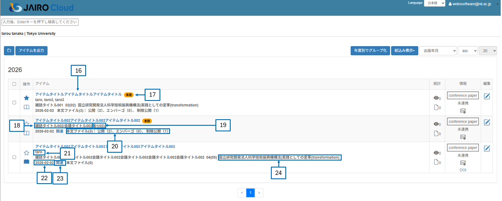

| 項番 | 項目     | 説明          |
| -- | ------ | ----------- |
| 16  | タイトル | タイトルが表示されクリックするとアイテム詳細画面に遷移します。 |
| 【v2.1.0】17  | 未読バッジ  | 未読状態を表示します。   |
| 18  | 雑誌名、会議名 | 雑誌名、会議名を表示します。 |
| 19  | 巻（号）  | 巻（号）が表示されます。   |
| 20  | 本文ファイル   | 本文ファイルの有無を表示します。  |
| 21  | 著者  | 著者名を表示します。   |
| 22  | 出版年月日   | 出版年月日を表示します。   |
| 23  | 関連リンク   | 関連有りの場合クリックすると詳細が表示されます。   |
| 24  | 資金別 | 助成機関名、研究課題名を表示します。 |

表11-5 アイテム一覧（アイテムリスト右部分の説明）
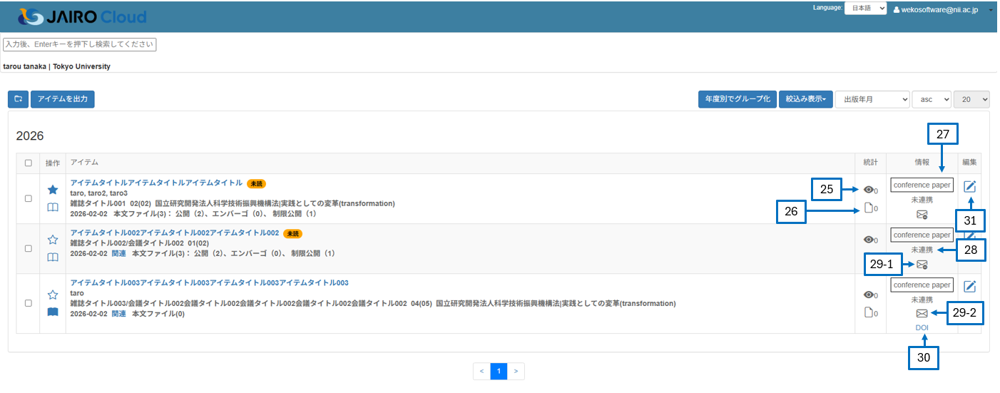

| 項番 | 項目     | 説明          |
| -- | ------ | ----------- |
| 25  | アクセス数 | アイテムのアクセス数が表示されます。 |
| 26  | ダウンロード数 | ダウンロード数を表示します。 |
| 27  | 資源タイプ   | 資源タイプが表示されます。   |
| 28  | ステータス | OAアシストのステータスと連携しステータスを表示します。 |
| 29-1  | フィードバックメールなし   | フィードバックメールの有無を表示します。   |
| 29-2  | フィードバックメールあり   | フィードバックメールの有無を表示します。   |
| 【v2.1.0】30  | DOI | アイテムの関連情報に、識別子タイプが「DOI」かつ関連タイプが「isVersionOf」の関連識別子が登録されている場合に表示されます。クリックすると、そのDOIのリンク先（doi.org）に遷移します。 |
| 31  | アイテム編集   | アイテム編集画面に遷移します。   |

表11-6 アイテム一覧（関連と下部の説明）
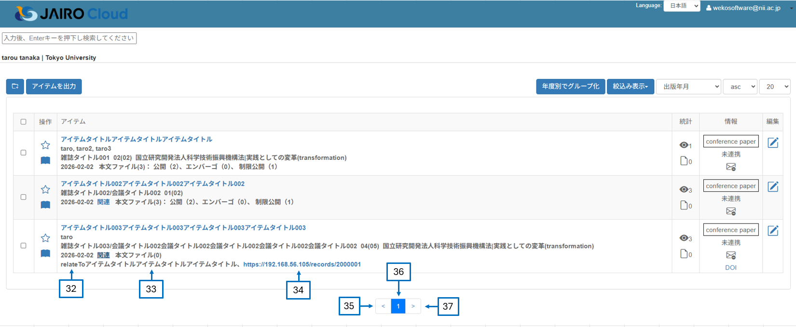

| 項番 | 項目     | 説明          |
| -- | ------ | ----------- |
| 32  | 関連タイプ   | 関連のタイプが表示されます。   |
| 33  | 関連タイトル | 関連のタイトルが表示されます。 |
| 34  | 関連URL   | 関連のURLが表示されます。   |
| 35  | ページング前 | 表示されている前のページが表示されます。 |
| 36  | ページ数  | ページ数を表示します。   |
| 37  | ページング次 | 表示されている次のページが表示されます。 |

表11-7 アイテム一覧（絞込み表示の説明）
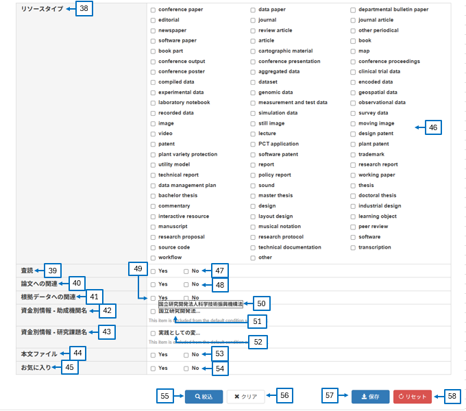

| 項番 | 項目     | 説明          |
| -- | ------ | ----------- |
| 38  | 資源タイプラベル | 絞り込みしたい項目をチェックボックスで選択できます。 |
| 39  | 査読ラベル   | ありなしの選択をできます。   |
| 40  | 論文関連ラベル   | ありなしの選択をできます。   |
| 41  | 根拠データへの関連   | ありなしの選択をできます。  |
| 42  | 資金別情報・助成機関名ラベル | 絞り込みしたい項目をチェックボックスで選択できます。 |
| 43  | 資金別情報・研究課題名ラベル   | 絞り込みしたい項目をチェックボックスで選択できます。   |
| 44  | 本文ファイルラベル | ありなしの選択をできます。 |
| 45  | お気に入りラベル  | ありなしの選択をできます。   |
| 46  | 資源タイプ   | 項目をチェックボックスで選択できます。   |
| 47  | 査読有無   | ありなしの選択をできます。  |
| 48  | 論文関連の有無 | ありなしの選択をできます。 |
| 49  | 根拠データへの関連   | ありなしの選択をできます。   |
| 【v2.1.0】50  | ツールチップ | 省略された文字をツールチップで表示できます |
| 51  | 資金別情報・助成機関名有無 | 項目をチェックボックスで選択できます。 |
| 52  | 資金別情報・研究課題名有無  | 項目をチェックボックスで選択できます。   |
| 53  | 本文ファイル有無 | ありなしの選択をできます。 |
| 54  | お気に入り有無   | ありなしの選択をできます。   |
| 55  | 絞込 | 絞込みを表示します。 |
| 56  | クリア   | 絞込み条件をクリアします。   |
| 57  | 保存 | 選択した絞り込み条件を保存します。 |
| 58  | リセット   | 絞込み条件をリセットします。   |

表11-8 アイテム出力
3.  [アイテムを出力]ボタンをクリックすると、出力方法を選択するダイアログが表示されます。アイテム一覧でチェックされたリスト、または全てのアイテムをTSVファイルで出力します。

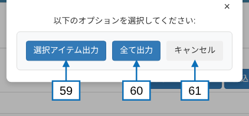

| 項番 | 項目     | 説明          |
| -- | ------ | ----------- |
| 59  | 選択アイテム出力 | チェックボックスで選択されているアイテムリストのみを出力します。 |
| 60  | 全て出力   | ワークスペース一覧の対象アイテム（絞り込み条件を適用している場合は、その条件に該当するアイテム）を全て出力します。検索欄による検索結果の絞り込みは反映されません。   |
| 61  | キャンセル   | アイテム出力の処理をキャンセルします。   |

表11-9 TSVファイル
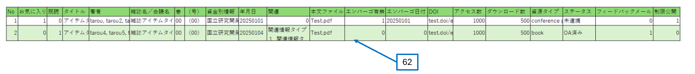

4.  出力されたTSVファイルの形式。

| 項番 | 項目     | 説明          |
| -- | ------ | ----------- |
| 62  | TSVファイル | TSV出力の例。 |

- ファイル名は「itemlist_export_YYYYMMDDhhmmss.tsv」の形式で、文字コードはUTF-8（BOM付き）です。
- 【v2.1.0】1行目は列見出しで、表示言語に応じた見出しが出力されます。列は先頭から次の順に出力されます。
  - No.（アイテム一覧内の通し番号。[選択アイテム出力]の場合も一覧内の番号が出力されます）
  - お気に入りステータス、既読未読ステータス、査読チェック状況（いずれも該当する場合は1、該当しない場合は0）
  - タイトル、DOIリンク、リソースタイプ、著者名、アクセス数、アイテムステータス、雑誌名、会議名、巻、号、資金別情報機関名、資金別情報課題名、ダウンロード数
  - フィードバックメースステータス（1または0）、出版年月日
  - 関連情報タイプ、関連情報タイトル、関連情報URLやDOI（複数ある場合はカンマ区切り）
  - 論文への関連チェック状況、根拠データへの関連チェック状況（1または0）
  - 本文ファイル数、公開ファイル数、エンバーゴ数、制限公開ファイル数

5.  出力が失敗した時のエラーメッセージ（[選択アイテム出力]をクリックした際にアイテムが1件も選択されていない場合など）
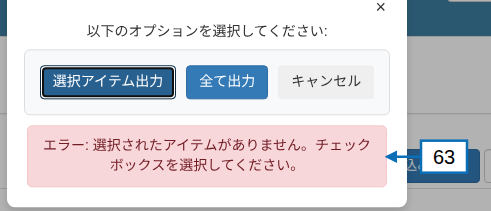

表11-10 TSVファイル出力エラー

| 項番 | 項目     | 説明          |
| -- | ------ | ----------- |
| 63  | エラー | 「エラー: 選択されたアイテムがありません。チェックボックスを選択してください。」と表示されます。 |

6.  アイテムの検索
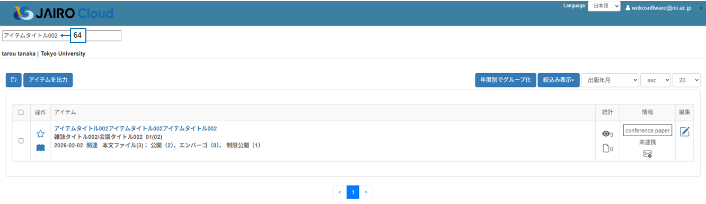

表11-11 アイテムの検索

| 項番 | 項目     | 説明          |
| -- | ------ | ----------- |
| 64  | 検索入力 | アイテムリストからDOI、タイトル、雑誌名、会議名、資金別情報（助成機関名、研究課題名）を検索します（大文字・小文字は区別しません）。 |

7.  検索の失敗
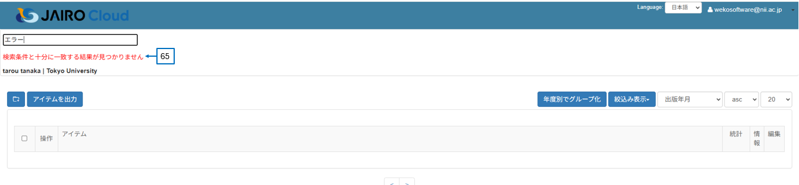

表11-12 検索の失敗

| 項番 | 項目     | 説明          |
| -- | ------ | ----------- |
| 65  | 検索入力 | 「検索条件と十分に一致する結果が見つかりません」と表示されます。 |

### アイテム簡易登録

この章では、ワークスペースのアイテムの登録について説明します。

1.  アイテム一覧のアイテム登録ボタンをクリックするとアイテム登録画面に遷移します。
2.  【v2.1.0】[DOI入力]欄にDOIを入力し、[取得]ボタンをクリックします。CrossRef、JaLC、CiNii、DataCite、arXivの各取得元からメタデータの取得を試み、取得できた取得元のラジオボタンが選択可能になります。
3.  【v2.1.0】メタデータの取得元（CrossRef MetaData、JaLC MetaData、CiNii MetaData、DataCite MetaData、arXiv MetaData）をラジオボタンで選択すると、取得できたメタデータが自動で入力されます。
4.  [ファイルを選択]ボタンをクリックすると、ファイルをアップロードできます。
5.  インデックスを選択し、登録ボタンをクリックするとアイテムが登録できます。
6.  アイテム簡易登録画面

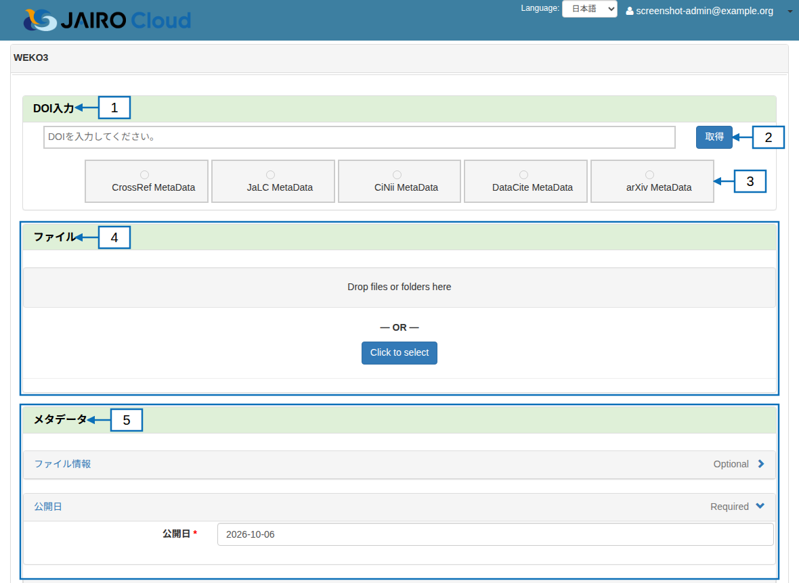
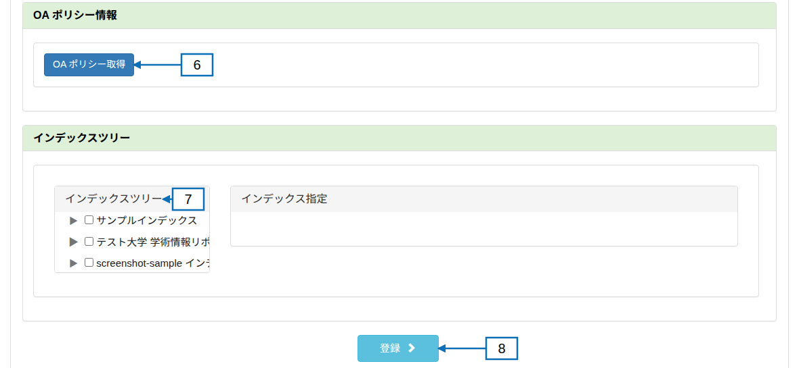

表11-13 アイテム簡易登録

| 項番 | 項目     | 説明          |
| -- | ------ | ----------- |
| 1  | DOI入力   | DOIを入力します。   |
| 2  | 取得ボタン   | 入力されたDOIで各取得元からメタデータを取得し、取得に成功した取得元のラジオボタンが活性化します。   |
| 【v2.1.0】3  | DOI取得元   | メタデータの取得元（CrossRef MetaData、JaLC MetaData、CiNii MetaData、DataCite MetaData、arXiv MetaData）をラジオボタンで選択します。選択した取得元のメタデータが自動入力されます。   |
| 4  | ファイル名 | ファイルをアップロードすると表示され登録者が編集もできます。 |
| 5  | メタデータ   | 取得時に設定されますが、編集もできます。   |
| 6  | OA ポリシー情報  | [OA ポリシー取得]ボタンをクリックすると、OAポリシーを取得します。ISSN、eISSN、または雑誌名の入力が必要です。   |
| 7  | アイテムの登録先インデックス  | アイテムの登録先インデックスを選択します。   |
| 8  | 登録 | 管理画面のワークスペースのワークフロー設定に応じて、ワークフロー経由か直接登録で登録ができます。 |

1.  アイテム登録画面

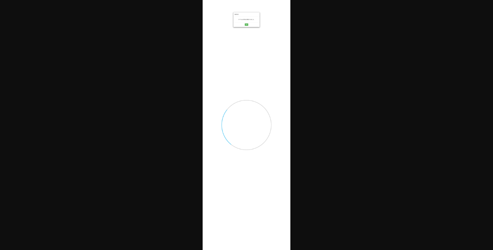

