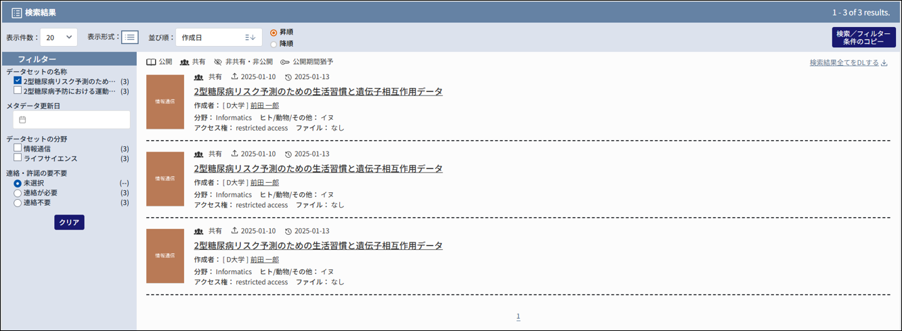
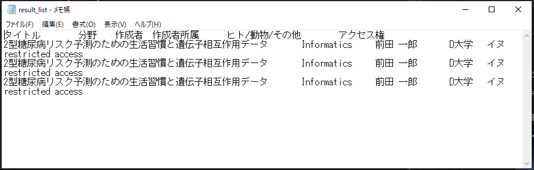

# 未病ユーザ操作マニュアル

一般閲覧者・登録ユーザ・管理者

## はじめに

このマニュアルは、未病用の WEKO3 システム（以下、システムと称す）で登録したアイテムを閲覧する未病データベース画面（以下、未病データベースと称す）の操作方法を説明したものです。

- 対象読者

本書は次の方を対象としています。

- コミュニティ管理者、リポジトリ管理者およびシステム管理者、登録ユーザ、一般閲覧者

### マニュアルの構成

本書は、次に示す章から構成されています。

第１章　未病データベースの概要 
　未病データベースの概要を説明しています。

第２章　ログインまたはログアウトする 
　未病データベースにログインおよびログアウトする方法を説明しています。

第３章　アイテムを検索する 
　アイテムを検索するための操作手順を説明しています。

第４章　アイテムをダウンロードする 
　アイテムをダウンロードする方法を説明しています。

第５章　アイテムの詳細を表示する 
　アイテムに表示される項目を説明しています。

第６章　添付ファイルを確認する 
　アイテムに添付されているファイルについて説明しています。

### このマニュアルで使用する書式

本書で使用する書式を説明します。

<table>
<tbody>
<tr class="odd">
<td>書式</td>
<td>説明</td>
</tr>
<tr class="even">
<td><em>文字列</em></td>
<td>
可変の値を示します。

（例）日付は<em>yyyy-mm-dd</em>の形式で指定します。
</td>
</tr>
<tr class="odd">
<td>[　]</td>
<td>ウインドウ、ダイアログボックス、メニュー、ボタンなどの画面上の要素名を示します。</td>
</tr>
</tbody>
</table>

## 目次

[第１章 未病データベースの概要](#第１章未病データベースの概要) 
　 ∟[1.1 未病データベースとは](#未病データベースとは) 
　 ∟[1.2 各画面説明](#各画面説明) 
　　 ∟[1.2.1 最新情報画面](#最新情報画面) 
　　 ∟[1.2.2 ログイン画面](#ログイン画面) 
　　 ∟[1.2.3 ログアウト画面](#ログアウト画面) 
　　 ∟[1.2.4 検索結果画面](#検索結果画面) 
　　 ∟[1.2.5 アイテム詳細画面](#アイテム詳細画面) 
　　 ∟[1.2.6 ファイル一覧画面](#ファイル一覧画面) 

[第２章 ログインまたはログアウトする](#第２章ログインまたはログアウトする) 
　 ∟[2.1 最新情報画面を表示する](#最新情報画面を表示する) 
　 ∟[2.2 ログインする](#ログインする) 
　 ∟[2.3 ログアウトする](#ログアウトする)

[第３章 アイテムを検索する](#第３章アイテムを検索する) 
　 ∟[3.1 検索フォーム 各部名称説明](#検索フォーム各部名称説明) 
　 ∟[3.2 詳細検索](#詳細検索) 
　 ∟[3.3 フィルター検索](#フィルター検索) 
　 ∟[3.4 検索条件をコピーする](#検索条件をコピーする)

[第４章 アイテムをダウンロードする](#第４章アイテムをダウンロードする) 
　 ∟[4.1 [サマリーテーブル] 各部名称説明](#サマリーテーブル各部名称説明) 
　 ∟[4.2 検索したアイテムをダウンロードする](#検索したアイテムをダウンロードする)

[第５章 アイテムの詳細を表示する](#第５章アイテムの詳細を表示する) 
　 ∟[5.1 アイテム詳細画面 各部名称説明](#アイテム詳細画面各部名称説明) 
　 ∟[5.2 タブの切り替え](#タブの切り替え) 
　 ∟[5.3 セクションの切り替え](#セクションの切り替え) 
　 ∟[5.4 リクエストメール](#リクエストメール) 
　 ∟[5.5 GakuNin RDM](#GakuNinRDM)

[第６章 添付ファイルを確認する](#第６章添付ファイルを確認する) 
　 ∟[6.1 ファイル一覧画面 各部名称説明](#ファイル一覧画面各部名称説明) 
　 ∟[6.2 ファイルをプレビューで確認する](#ファイルをプレビューで確認する) 
　 ∟[6.3 フィルターで絞り込みする](#フィルターで絞り込みする) 
　 ∟[6.4 ファイルをダウンロードする](#ファイルをダウンロードする) 
　　 ∟[6.4.1 全件ダウンロード](#全件ダウンロード) 
　　 ∟[6.4.2 選択ダウンロード](#選択ダウンロード) 
　　 ∟[6.4.3 個別ダウンロード](#個別ダウンロード) 
　 ∟[6.5 ライセンスを確認する](#ライセンスを確認する)

## 第１章　未病データベースの概要

この章では未病データベースについて説明します。

### 未病データベースとは

未病データベースとはシステムで登録された学術論文等アイテムを閲覧、およびダウンロードすることが出来る web アプリケーションです。

### 各画面説明

未病データベースは大きく分類して以下の 5 つの画面で構成されています。

#### 最新情報画面

直近に登録されたアイテム 5 件が表示されます。

- 図 1-1 最新情報画面 
  

#### ログイン画面

未病データベースへログインするための画面です。

- 図 1-2 ログイン画面 
  

#### ログアウト画面

未病データベースからログアウトするための画面です。

- 図 1-3 ログアウト画面 
  

#### 検索結果画面

詳細検索による検索結果が表示されます。

- 図 1-4 検索結果画面 
  

#### アイテム詳細画面

アイテムの詳細を閲覧することが出来ます。

- 図 1-5 アイテム詳細画面 
  

#### ファイル一覧画面

アイテムに添付されたファイルを確認することが出来ます。

- 図 1-6 ファイル一覧画面 
  

## 第２章　ログインまたはログアウトする

この章では、未病データベースにログインおよびログアウトする方法を説明します。

### 最新情報画面を表示する

#### 画面項目説明

- 図 2-1 最新情報画面 
  

<table>
<thead>
<tr class="header">
<th>表 2‑1 最新情報画面 項目と説明</th>
<th></th>
<th></th>
</tr>
</thead>
<tbody>
<tr class="odd">
<td>項番</td>
<td>項目</td>
<td>説明</td>
</tr>
<tr class="even">
<td>1</td>
<td>[]アイコン</td>
<td>

クリックすると最新情報画面に遷移します。
</td>
</tr>
<tr class="odd">
<td>2</td>
<td>[]プルダウンリスト</td>
<td>言語の切り替えが出来ます。 
切替はja（日本語）とen（英語）の二種類です。</td>
</tr>
<tr class="even">
<td>3</td>
<td>[]ボタン／ []ボタン
</td>
<td>クリックすると[ログイン]もしくは[ログアウト]画面へ遷移します。</td>
</tr>
<tr class="odd">
<td>4</td>
<td>[]ボタン</td>
<td>クリックするとインデックス一覧を表示します。</td>
</tr>
<tr class="even">
<td>5</td>
<td>[検索フォーム]</td>
<td>アイテムを検索することが出来ます。 
[]ボタンをクリックすると検索結果画面へ遷移します。
</td>
</tr>
<tr class="odd">
<td>6</td>
<td>[最新情報]</td>
<td>直近で登録されたアイテム5件が表示されます。</td>
</tr>
<tr class="even">
<td>7</td>
<td>[TOP]</td>
<td>クリックすると最新情報画面に遷移します。</td>
</tr>
<tr class="odd">
<td>8</td>
<td>[CONTACT]</td>
<td>クリックするとお問い合わせ画面へ遷移します。</td>
</tr>
</tbody>
</table>

#### 手順

ここでは、最新情報画面を表示する手順を説明します。

1. ブラウザに未病データベースの URL を入力します。

2. 未病データベースへのアクセスが成功すると、最新情報画面が表示されます。

### ログインする

#### 画面項目説明

- 図 2-2 ログイン画面 
  

<table>
<thead>
<tr class="header">
<th>表 2‑2 ログイン画面 項目と説明</th>
<th></th>
<th></th>
</tr>
</thead>
<tbody>
<tr class="odd">
<td>項番</td>
<td>項目</td>
<td>説明</td>
</tr>
<tr class="even">
<td>1</td>
<td>[]ボタン</td>
<td>

クリックすると最新情報画面に遷移します。
</td>
</tr>
<tr class="odd">
<td>2</td>
<td>[メールアドレス]テキストボックス</td>
<td>[メールアドレス]の入力欄です。</td>
</tr>
<tr class="even">
<td>3</td>
<td>[パスワード]テキストボックス</td>
<td>[パスワード]の入力欄です。</td>
</tr>
<tr class="odd">
<td>4</td>
<td>[]ボタン</td>
<td>[メールアドレス]、[パスワード]が正しく入力されていれば、クリックして[ログイン]することが出来ます。 
どちらかに誤りがある場合はバリデーションが表示され、[ログイン]することは出来ません。
</td>
</tr>
</tbody>
</table>

#### 手順

ここでは、未病データベースへ[ログイン]を行う手順を説明します。

1. 最新情報画面の[]ボタンをクリックします。

2. ログイン画面に遷移します。

3. メールアドレス、パスワードを入力します。

4. ログイン画面の[]ボタンをクリックします。

5. [ログイン]が完了し、最新情報画面に遷移します。

### ログアウトする

#### 画面項目説明

- 図 2-3 ログアウト画面 
  

<table>
<thead>
<tr class="header">
<th>表 2‑3 ログアウト画面 項目と説明</th>
<th></th>
<th></th>
</tr>
</thead>
<tbody>
<tr class="odd">
<td>項番</td>
<td>項目</td>
<td>説明</td>
</tr>
<tr class="even">
<td>1</td>
<td>[]ボタン</td>
<td>

クリックすると最新情報画面に遷移します。
</td>
</tr>
<tr class="even">
<td>2</td>
<td>[]ボタン</td>
<td>クリックすると未病データベースから[ログアウト]します。
</td>
</tr>
<tr class="odd">
<td>3</td>
<td>[]ボタン</td>
<td>クリックすると最新情報画面に遷移します。
</td>
</tr>
</tbody>
</table>

#### 手順

ここでは、未病データベースからの[ログアウト]を行う手順を説明します。

1. 最新情報画面の[]ボタンをクリックします。

2. ログアウト画面に遷移します。

3. ログアウト画面の[]ボタンをクリックします。

4. [ログアウト]が完了します。

## 第３章　アイテムを検索する

この章では、アイテムを検索する方法を説明します。

### 3.1 　検索フォーム各部名称説明

- 図 3-1 検索フォーム 
  

- 図 3-2 ③[]ボタンのクリックで折りたたみを開いた状態 
  

<table>
<thead>
<tr class="header">
<th>表 3-1, 3-2 検索フォーム 項目と説明</th>
<th></th>
<th></th>
</tr>
</thead>
<tbody>
<tr class="odd">
<td>項番</td>
<td>項目</td>
<td>説明</td>
</tr>
<tr class="even">
<td>1</td>
<td>[キーワード検索]テキストボックス</td>
<td>
検索したいキーワードを入力します。 
単語と単語を「 」（半角スペース）で区切るとAND検索、 
「<em>OR</em>」、「<em>｜</em>」で区切るとOR検索を行います。</td>
</tr>
<tr class="odd">
<td>2</td>
<td>[]ボタン</td>
<td>クリックすると「[キーワード入力]欄」と[詳細検索]欄の入力値で検索を行います。
</td>
</tr>
<tr class="even">
<td>3</td>
<td>[]ボタン</td>
<td>クリックすると折りたたまれた詳細検索欄が開きます。(図3-2 参照)
</td>
</tr>
<tr class="odd">
<td>4</td>
<td>[フィルター]</td>
<td>詳細検索結果を絞り込みします。 
チェックボックスにチェックを入れる等の入力を行うと即時絞り込みを実行します。
チェックを解除すると即時絞り込みも解除します。
</td>
</tr>
<tr class="even">
<td>5</td>
<td>[]ボタン</td>
<td>クリックすると[フィルター]による絞り込みを解除します。
</td>
</tr>
</tr>
<tr class="odd">
<td>6</td>
<td>[]ボタン</td>
<td>クリックすると[詳細検索]および[フィルター]で設定した検索条件のURLをコピーすることが出来ます。
</td>
</tr>
<tr class="even">
<td>7</td>
<td>[あいまい検索／完全一致]ラジオボタン</td>
<td>[データセットの名称]の検索方法を設定します。 
[あいまい検索]にチェックを入れて検索を行うと部分一致検索を行い、[完全一致]にチェックを入れて検索を行うと完全一致検索を行います。
</td>
</tr>
<tr class="odd">
<td>8</td>
<td>[]ボタン</td>
<td>クリックすると該当の検索条件項目を削除します。 
[データセットの名称の検索方法]、[データセットの名称]は削除出来ません。
</td>
</tr>
<tr class="even">
<td>9</td>
<td>[]プルダウン</td>
<td>クリックするとプルダウンが開き、検索条件項目を追加することが出来ます。
</td>
</tr>
<tr class="odd">
<td>10</td>
<td>[]ボタン</td>
<td>クリックすると詳細検索欄に入力した内容が解除されます。 
追加または削除した検索条件項目は変動しません。
</td>
</tr>
<tr class="even">
<td>11</td>
<td>[]ボタン</td>
<td>クリックすると詳細検索欄が折りたたまれます。 
詳細検索の入力内容は保持します。
</td>
</tr>
</tbody>
</table>

### 詳細検索

ここでは詳細検索の手順を説明します。

1. []ボタンをクリックし、詳細検索の折りたたみを開きます。

2. []プルダウンから追加したい検索条件項目を追加します。

   - 図 3-3 
     

3. 検索条件項目を削除したい場合は[]ボタンをクリックして削除します。

   - 図 3-4 
     

4. 検索条件を入力、選択します。 
   空欄、もしくは「未選択」を選択した場合は検索条件には使用しません。

   - 図 3-5 
     

5. []ボタンをクリックして検索を実行します。

6. 検索結果が表示されます。
   - 図 3-6 
     

### フィルター検索

ここではフィルター検索の手順を説明します。

1. 詳細検索を行い、検索結果を表示します。

   - 図 3-7 
     

2. フィルターで絞り込みたい条件を選択します。 
   長文で省略表示されている場合、ホバーすると全文を確認出来ます。

   - 図 3-8 
     

3. 検索結果が絞り込まれます。

   - 図 3-9 検索結果がフィルターにより絞り込まれた状態 
     

4. 2.で選択した項目を解除すると、絞り込みも解除します。

### 検索条件をコピーする

ここでは検索条件のコピー方法を説明します。

1. [詳細検索]、[フィルター]で検索結果を絞り込みます。

   - 図 3-10 検索結果がフィルターにより絞り込まれた状態 
     

2. []ボタンをクリックします。

   - 図 3-11 
     

3. コピー成功のアラートが表示されます。

   - 図 3-12 
     

4. 外部ページ（Google など）のアドレスバーにコピーした URL を入力します。

   - 図 3-13 
     

5. 1.と同様の検索条件の検索結果が表示されます。
   - 図 3-14 
     

## 第４章　アイテムをダウンロードする

この章では、アイテムをダウンロードする画面、および方法を説明します。

### サマリーテーブル各部名称説明

- 図 4-1 
   
  ※ [フィルター]、[検索／フィルター条件のコピーボタン]については
  「[第３章　アイテムを検索する](#第３章アイテムを検索する)」で説明しているため、本章では割愛します。

<table>
<thead>
<tr class="header">
<th>表 4-1 [サマリーテーブル] 項目と説明</th>
<th></th>
<th></th>
</tr>
</thead>
<tbody>
<tr class="odd">
<td>項番</td>
<td>項目</td>
<td>説明</td>
</tr>
<tr class="even">
<td>1</td>
<td>[表示件数]プルダウン</td>
<td>
表示する件数を設定出来ます。
</td>
</tr>
<tr class="odd">
<td>2</td>
<td>[並び順]プルダウン</td>
<td>並び順を変更出来ます。
</td>
</tr>
<tr class="even">
<td>3</td>
<td>[昇順／降順]ボタン</td>
<td>[並び順]プルダウンで選んだ項目を元に昇順／降順に並び替えします。
</td>
</tr>
<tr class="odd">
<td>4</td>
<td>[検索結果全てをDLする]リンク</td>
<td>検索結果を全てtsv形式でダウンロードします。
</td>
</tr>
<tr class="even">
<td>5</td>
<td>[データセットの名称]リンク</td>
<td>アイテムのタイトルです。 
クリックするとアイテム詳細画面に遷移します。
</td>
</tr>
<tr class="odd">
<td>6</td>
<td>[あり(<em>添付ファイル件数</em>)]リンク</td>
<td>アイテムにファイルが添付されている場合、[あり(<em>添付ファイル件数</em>)]と表示されます。添付ファイルがない場合は[なし]と表示されます。 
クリックするとファイル一覧画面に遷移します。
</td>
</tr>
<tr class="even">
<td>7</td>
<td>[ページ切替]</td>
<td>ページを切り替えします。
</td>
</tr>
</tbody>
</table>

### 検索したアイテムをダウンロードする

ここでは検索して絞り込んだアイテムをダウンロードする手順を説明します。

1. [詳細検索]、[フィルター]で検索結果を絞り込みます。

   - 図 4-2 
     

2. [検索結果全てを DL する]リンクをクリックします。

   - 図 4-3 
     

3. tsv 形式の検索結果をダウンロードします。

   - 図 4-4 
     

   - 図 4-5 検索結果とダウンロードした tsv ファイルの内容 
     

## 第５章　アイテムの詳細を表示する

この章では、アイテムの詳細を表示する方法を説明します。

### アイテム詳細画面各部名称説明

- 図 5-1 アイテム詳細画面 
  

<table>
<thead>
<tr class="header">
<th>表 5-1 アイテム詳細画面 項目と説明</th>
<th></th>
<th></th>
</tr>
</thead>
<tbody>
<tr class="odd">
<td>項番</td>
<td>項目</td>
<td>説明</td>
</tr>
<tr class="even">
<td>1</td>
<td>[インデックス]リンク</td>
<td>
アイテムが登録されているインデックス名が表示されます。 
クリックするとインデックスに登録されているアイテムの一覧画面に遷移します。
</td>
</tr>
<tr class="odd">
<td>2</td>
<td>[検索結果リストに戻る]リンク</td>
<td>クリックすると検索結果画面に遷移します。
</td>
</tr>
<tr class="even">
<td>3</td>
<td>[前のアイテムを表示]リンク</td>
<td>クリックすると前のアイテムの詳細画面に遷移します。
</td>
</tr>
<tr class="odd">
<td>4</td>
<td>[次のアイテムを表示]リンク</td>
<td>クリックすると次のアイテムの詳細画面に遷移します。
</td>
</tr>
<tr class="even">
<td>5</td>
<td>[サムネイル]</td>
<td>アイテムのサムネイルです。
</td>
</tr>
<tr class="odd">
<td>6</td>
<td>[アイテムの概要]</td>
<td>アイテムの概要が表示されます。</td>
</tr>
<tr class="even">
<td>7</td>
<td>[]ボタン</td>
<td>クリックするとファイル一覧画面に遷移します。
</td>
</tr>
<tr class="odd">
<td>8</td>
<td>[]タブ</td>
<td>タブを切り替えすることでアイテムに登録されているメタデータを確認出来ます。
</td>
</tr>
<tr class="even">
<td>9</td>
<td>[]ボタン</td>
<td>クリックすると画面上部へ移動します。
</td>
</tr>
<tr class="odd">
<td>10</td>
<td>[閲覧数]</td>
<td>これまでに閲覧された件数が表示されます。 
[See details]をクリックすると閲覧数の詳細を確認出来ます。
</td>
</tr>
<tr class="even">
<td>11</td>
<td>[DLランキング]</td>
<td>添付ファイルがある場合、これまでにダウンロードされたランキングが表示されます。 
ファイル名右横の  アイコンをクリックするとファイルをダウンロード出来ます。
</td>
</tr>
<tr class="odd">
<td>12</td>
<td>[エクスポート]</td>
<td>アイテムのメタデータのXMLファイル、JSONファイル等を確認することが出来ます。
</td>
</tr>
</tbody>
</table>

### タブの切り替え

ここではタブの切り替え手順を説明します。

1. 切り替えたいタブを選択します。

   - 図 5-2 
     

2. タブが切り替わり、表示されているアイテムの詳細が変わります。
   - 図 5-3 
     

### セクションの切り替え

ここではセクションの切り替え手順を説明します。

1. セクションのプルダウンを開き、内容を確認したいセクション名をクリックします。

   - 図 5-4 
     

2. 選択したセクションに画面が移動します。
   - 図 5-5 
     

### リクエストメール

ここではリクエストメールについて説明します。

1. 「ユーザーが未病データベースにログインしていないこと」および「アイテムにフィードバックメールアドレスが登録されていること」の条件を満たす場合、[閲覧数]の下に[リクエストメール]が表示されます。

   - 図 5-6 
     

2. []ボタンをクリックするとリクエストメールの[送信フォーム]が開きます。

   - 図 5-7 リクエストメール 送信フォーム 
     

3. [送信フォーム]に必要事項を入力のうえ、[送信]ボタンをクリックするとリクエストメールを送信することが出来ます。 （※現在は未実装です）

### GakuNinRDM

ここでは GakuNinRDM のデータセットを確認する手順を説明します。

1. 「ユーザーが未病データベースにログインしていること」および「アイテムにプロジェクト ID が登録されていること」の条件を満たす場合、[閲覧数]の下に[GakuNin RDM]が表示されます。

   - 図 5-8 
     

2. []アイコンをクリックすると GakuNinRDM のデータセットを開くことが出来ます。 （※現在は未実装です）

## 第６章　添付ファイルを確認する

この章では添付ファイルの確認方法を説明します。

### ファイル一覧画面各部名称説明

- 図 6-1 ファイル一覧画面 
  

<table>
<thead>
<tr class="header">
<th>表 6-1 ファイル一覧画面 項目と説明</th>
<th></th>
<th></th>
</tr>
</thead>
<tbody>
<tr class="odd">
<td>項番</td>
<td>項目</td>
<td>説明</td>
</tr>
<tr class="even">
<td>1</td>
<td>[表示件数]プルダウン</td>
<td>
表示する件数を設定出来ます。
</td>
</tr>
<tr class="odd">
<td>2</td>
<td>[DL回数統計対象期間]プルダウン</td>
<td>[ダウンロード]された回数の統計対象期間を変更出来ます。
</td>
</tr>
<tr class="even">
<td>3</td>
<td>[アイテム詳細画面に戻る]リンク</td>
<td>クリックすると該当の[アイテム詳細画面]に遷移します。
</td>
</tr>
<tr class="odd">
<td>4</td>
<td>[全件ダウンロード]リンク</td>
<td>表示されているファイルを全件ダウンロードします。
</td>
</tr>
<tr class="even">
<td>5</td>
<td>[フィルター]</td>
<td>表示されているファイルを絞り込みします。
</td>
</tr>
<tr class="odd">
<td>6</td>
<td>[]ボタン</td>
<td>[フィルター]の絞り込みを解除します。</td>
</tr>
<tr class="even">
<td>7</td>
<td>ファイル一覧テーブル</td>
<td>ファイルの一覧が表示されます。
</td>
</tr>
<tr class="odd">
<td>8</td>
<td>[ライセンス]アイコン</td>
<td>クリックすると該当の[ライセンス]ページに遷移します。
</td>
</tr>
<tr class="even">
<td>9</td>
<td>[]ボタン</td>
<td>クリックするとファイルのプレビュー画面が別ウィンドウで開きます。
</td>
</tr>
<tr class="odd">
<td>10</td>
<td>[]ボタン</td>
<td>クリックすると選択したファイルを[ダウンロード]します。
</td>
</tr>
<tr class="even">
<td>11</td>
<td>[格納場所URL]</td>
<td>ファイルが格納されているURLです。 
クリックすると選択したファイルを[ダウンロード]します。
</td>
</tr>
<tr class="odd">
<td>12</td>
<td>[]ボタン</td>
<td>ファイル一覧テーブルで選択したファイルを[ダウンロード]します。 (<em>0</em>件)には選択したファイル件数が入ります。
</td>
</tr>
<tr class="even">
<td>13</td>
<td>[<em>ページ数</em>]</td>
<td>複数ページがある場合、現在のページ数以外をクリックするとページを移動します。
</td>
</tr>
</tbody>
</table>

### ファイルをプレビューで確認する

ここではファイルの[プレビュー]を確認する手順を説明します。

1. []ボタンをクリックします。

   - 図 6-2 
     

2. 別ウィンドウでファイルの[プレビュー]が開きます。
   - 図 6-3 
     

### フィルターで絞り込みする

ここでは[ファイル一覧画面]のフィルターによる絞り込み手順を説明します。

1. フィルターに絞り込み条件を入力／選択します。

   - 図 6-4 
     

2. 即時絞り込みが実行されます。
   - 図 6-5 
     

### ファイルをダウンロードする

ここではファイルのダウンロード手順を説明します。
大まかに分けて、3 種類のダウンロード方法があります。

1. 全件ダウンロード
2. 選択ダウンロード
3. 個別ダウンロード

#### 全件ダウンロード

ここでは全件ダウンロードの手順を説明します。

1. [全件ダウンロード]をクリックします。

   - 図 6-6 
     

2. 表示されている 4 件を[ダウンロード]します。

   - 図 6-7 
     

   - 図 6-8 フォルダの中身 
     

#### 選択ダウンロード

ここでは選択ダウンロードの手順を説明します。

1. ダウンロードしたいファイルのチェックボックスにチェックを入れます。

   - 図 6-9 
     

2. []ボタンをクリックします。

   - 図 6-10 
     

3. 選択したファイルを 2 件を[ダウンロード]します。
   - 図 6-11 
     

#### 個別ダウンロード

ここでは個別ダウンロードの手順を説明します。
個別ダウンロードの方法は 2 種類あります。

1. [ダウンロード]ボタン

   1-1. []ボタンをクリックします。

   - 図 6-12 
     

   1-2. 選択したファイルが[ダウンロード]されます。

   - 図 6-13 
     

2. [格納場所 URL]

   2-1. [格納場所 URL]をクリックします。 
   URL が長文の場合は省略表示されるため、[すべてを表示]で折りたたみを開いてください。

   - 図 6-14 
     

   2-2. 選択したファイルが[ダウンロード]されます。

   - 図 6-15 
     

### ライセンスを確認する

ここではファイルに設定されたライセンスの確認方法を説明します。

1. [ライセンス]のアイコンをクリックします。 
   ※下記例では []アイコン をクリックします。

   - 図 6-16 
     

2. 別タブで該当の[ライセンス]ページが表示されます。 
   クリックする[ライセンス]のアイコンによって遷移先は異なります。
   - 図 6-17 遷移先の例 「コモンズ証 CC0 1.0 全世界」(https://creativecommons.org/publicdomain/zero/1.0/deed.ja) 
     
