System Administration Manual

(For Community Administrator, Repository Administrator, and System Administrator)

Introduction

This manual provides information on operating the WEKO3 system (referred to as the "System" in this document). The information in this manual will help users at academic institutions or public agencies carry out data registration, data referencing and other administrative tasks.

  - Intended Audience

This document is intended for administrators who perform data registration, i.e. community administrators, repository administrators, and system administrators.

  - Structure of the Manual

This manual consists of the following chapters:

Chapter 1: System Overview

Describes a high-level overview of the System.

Chapter 2: Item Types

Describes step-by-step instructions on how to manage item types.

Chapter 3: Items

Describes step-by-step instructions on how to manage items.

Chapter 4: Index Tree

Describes step-by-step instructions on how to manage the index tree.

Chapter 5: Web Design

Describes step-by-step instructions on how to manage the Web design.

Chapter 6: Author Management

Describes step-by-step instructions on managing author information.

Chapter 7: Statistics

Describes step-by-step instructions on how to manage statistics.

Chapter 8: WorkFlow

Describes step-by-step instructions on managing workflows.

Chapter 9: Communities

Describes step-by-step instructions on how to manage communities.

Chapter 10: OAI-PMH

Describes step-by-step instructions on managing OAI-PMH.

Chapter 11: Resource Sync

Describes step-by-step instructions on managing resource sync.

Chapter 12: Records

Describes step-by-step instructions on managing records.

Chapter 13: Files

Describes step-by-step instructions on how to manage files.

Chapter 14: User Management

Describes step-by-step instructions on managing users.

Chapter 15: Setting

Describes step-by-step instructions on how to manage the system settings.

Chapter 16: User Account

Describes step-by-step instructions on how to manage a user account.

  - Conventions

The format conventions used in this document are as follows:

<table>
<tbody>
<tr class="odd">
<td>Format</td>
<td>Description</td>
</tr>
<tr class="even">
<td><em>String</em></td>
<td>
Indicates a variable.

Example: Specify a date in the <em>yyyy-mm-dd</em> format.
</td>
</tr>
<tr class="odd">
<td>" "</td>
<td>Indicates the label of an element displayed on the screen, such as a window, dialog box, menu or button.</td>
</tr>
</tbody>
</table>

# Table of Contents

[1. Chapter 1: System Overview 11](#chapter-1-system-overview)

[1.1 About the System 12](#linkidwhatis参照先about-the-system)

[1.2 Glossary 14](#linkidterminology参照先glossary)

[1.3 System features 17](#linkidfeaturesandusers参照先system-features)

[1.4 Access the Administration screen 20](#linkidadminwindow参照先indexword-pronounceかんりかめん-indexitem管理画面access-the-administration-screenindexword)

[2. Item Types 22](#item-types)

[2.1 Set up properties 23](#linkidsetpropertyitemtype参照先set-up-properties)

[2.1.1 Add properties 23](#linkidaddpropertyitemtype参照先add-properties)

[2.1.2 Edit properties 28](#linkidmetadataattritemtype参照先edit-properties)

[2.2 Manage item types 32](#linkidaddordeleteitemtype参照先manage-item-types)

[2.2.1 Operations enabled for each item type 32](#operations-enabled-for-each-item-type)

[2.2.2 Default item types 33](#default-item-types)

[2.2.3 Add item types 30](#add-item-types)

[2.2.4 Copy item types 32](#copy-item-types)

[2.2.5 Edit item types 34](#edit-item-types)

[2.2.6 Rename item types 43](#rename-item-types)

[2.2.7 Delete item types 44](#delete-item-types)

[2.2.8 Restore item types 46](#restore-item-types)

[2.3 Set up OAI schemas 48](#linkidsetoaischema参照先set-up-oai-schemas)

[2.3.1 About schemas that support mapping 48](#about-schemas-that-support-mapping)

[2.3.2 Add schemas 48](#add-schemas)

[2.3.3 Delete schemas 50](#delete-schemas)

[2.4 Map item types to schemas 51](#linkidmapitemtypetoschema参照先map-item-types-to-schemas)

[2.4.1 Map item types 51](#indexword-pronounceあいてむたいふをまつひんく-indexitemアイテムタイプをマッピングindexwordmap-item-types)

[2.4.2 Map an item type added by the System 53](#map-an-item-type-added-by-the-system)

[3. Items 57](#items)

[3.1 Bulk update with a license or an embargo 58](#bulk-update-with-a-license-or-an-embargo)

[3.2 Bulk delete items 62](#linkidcustomsorting参照先linkidimportitems参照先bulk-delete-items)

[3.3 Export items 64](#export-items)

[3.4 Import items 67](#import-items)

[4. ‏Index Tree 88](#index-tree)

[4.1 ‏Manage the index tree 89](#manage-the-index-tree)

[4.1.1 ‏Set up the index display 89](#set-up-the-index-display)

[4.1.2 Add an index 89](#add-an-index)

[4.1.3 Modify an index 93](#linkidchangeindexitem参照先modify-an-index)

[4.1.4 Delete an index 94](#linkiddeleteindexitem参照先delete-an-index)

[4.2 Manage journal information 97](#manage-journal-information)

[4.2.1 Edit journal information 97](#edit-journal-information)

[4.2.2 Output journal information in the KBART format 101](#output-journal-information-in-the-kbart-format)

[4.3 Change a sort order 103](#change-a-sort-order)

[5. Web Design 105](#web-design)

[5.1 Managing widgets 106](#linkidmanagecommunity参照先managing-widgets)

[5.1.1 Display a list of widgets 106](#linkiddetailwidgets参照先display-a-list-of-widgets)

[5.1.2 Create a widget 107](#linkidcreatewidgets参照先create-a-widget)

[5.1.3 Edit a widget 126](#linkideditwidgets参照先edit-a-widget)

[5.1.4 Delete a widget 127](#linkiddeletewidgets参照先delete-a-widget)

[5.2 Manage the page layout 131](#linkidwidgetdesignsetting参照先manage-the-page-layout)

[5.2.1 Add or remove widgets from a page 131](#add-or-remove-widgets-from-a-page)

[5.2.2 Add a page 135](#add-a-page)

[5.2.3 Modify a page 137](#modify-a-page)

[5.2.4 Delete a page 138](#delete-a-page)

[5.2.5 Edit a widget on the page 140](#edit-a-widget-on-the-page)

[6. Author Management 141](#author-management)

[6.1 Manage author information 142](#linkidmanagecommunity参照先manage-author-information)

[6.1.1 Manage author name sources 142](#manage-author-name-sources)

[6.1.2 Manage external author ID Prefixes 151](#manage-external-author-id-prefixes)

[6.2 Export author information 156](#export-author-information)

[6.3 Import author information 159](#import-author-information)

[7. Statistics 167](#statistics)

[7.1 Set up reports 168](#linkidfeedbackmailsetting参照先linkidreportsetting参照先set-up-reports)

[7.1.1 Check the number of registered items 168](#linkidnumofitems参照先check-the-number-of-registered-items)

[7.1.2 Download fixed form reports 169](#linkidgetreports参照先download-fixed-form-reports)

[7.1.3 Types of fixed form reports 170](#linkidreportstype参照先types-of-fixed-form-reports)

[7.1.4 Send a fixed form report by email 176](#linkidmailreports参照先send-a-fixed-form-report-by-email)

[7.1.5 Sett up a custom report 181](#linkidcustomreports参照先sett-up-a-custom-report)

[7.2 Set up feedback mails 183](#linkidsitelicensestatisticssetting参照先-set-up-feedback-mails)

[7.3 Set up the site license 185](#set-up-the-site-license)

[7.3.1 Send site license statistics automatically 185](#linkidsitelicensestatisticsinfosetting参照先send-site-license-statistics-automatically)

[7.3.2 Send site license statistics manually 185](#linkidmanuallysendsitelicense参照先send-site-license-statistics-manually)

[7.3.3 Site license statistics 186](#linkidsitelicenseusage参照先site-license-statistics)

[8. WorkFlow 188](#workflow)

[8.1 Set up flows 189](#linkidsetflow参照先set-up-flows)

[8.1.1 Add a flow 189](#linkidaddflow参照先add-a-flow)

[8.1.2 Edit flow actions 191](#linkideditflow参照先edit-flow-actions)

[8.1.3 Delete a flow 195](#linkiddelflow参照先delete-a-flow)

[8.2 Set up workflows 197](#linkidsetworkflow参照先set-up-workflows)

[8.2.1 Add a workflow 197](#linkidaddworkflow参照先add-a-workflow)

[8.2.2 Edit a workflow 198](#linkideditworkflow参照先edit-a-workflow)

[8.2.3 Delete a workflow 199](#linkiddeleteworkflow参照先delete-a-workflow)

[9. Communities 202](#communities)

[9.1 Manage communities 203](#linkidmanagecommunity参照先manage-communities)

[9.1.1 View communities 203](#linkidviewcommunity参照先view-communities)

[9.1.2 Create a community 203](#linkidcreatecommunity参照先create-a-community)

[9.1.3 Edit a community 204](#linkideditcommunity参照先edit-a-community)

[9.2 Manage favorite communities 206](#linkidfeaturedcommunity参照先manage-favorite-communities)

[9.2.1 View favorite communities 206](#linkidviewfeaturedcommunity参照先view-favorite-communities)

[9.2.2 Create a favorite community 206](#linkidcreatefeaturedcommunity参照先create-a-favorite-community)

[9.2.3 Edit a favorite community 207](#linkideditfeaturedcommunity参照先edit-a-favorite-community)

[9.2.4 Delete favorite communities 208](#linkiddeletefeaturedcommunity参照先delete-favorite-communities)

[9.3 Manage inclusion requests 210](#linkidinclusionrequest参照先indexword-pronounceこみゆにていさんかようきゆう-indexitemコミュニティ参加要求manage-inclusion-requestsindexword)

[9.3.1 View inclusion requests 210](#linkidviewinclusionrequest参照先view-inclusion-requests)

[9.3.2 Delete inclusion requests 210](#linkiddeleteinclusionrequest参照先delete-inclusion-requests)

[10. OAI-PMH 212](#oai-pmh)

[10.1 Set up harvesting 213](#linkidsetharvesting参照先set-up-harvesting)

[10.1.1 Run a harvesting plan 213](#linkidviewplanforharvesting参照先run-a-harvesting-plan)

[10.1.2 Create a harvesting plan 217](#linkidcreateplanforharvesting参照先create-a-harvesting-plan)

[10.1.3 Edit a harvesting plan 218](#linkideditplanforharvesting参照先edit-a-harvesting-plan)

[10.1.4 Delete harvesting plans 220](#linkiddeleteplanforharvesting参照先delete-harvesting-plans)

[10.2 Identify 222](#linkididentify参照先identify)

[10.2.1 View output sets 222](#linkidviewoutputset参照先view-output-sets)

[10.2.2 Create an output set 222](#linkidcreateoutputset参照先create-an-output-set)

[10.2.3 Edit an output set 223](#linkideditoutputset参照先edit-an-output-set)

[10.3 Sets 224](#linkidset参照先sets)

[10.3.1 View Sets 224](#linkidviewset参照先view-sets)

[10.3.2 Create a Set 224](#linkidcreateset参照先create-a-set)

[10.3.3 Edit a Set 225](#linkideditset参照先edit-a-set)

[11. Resource Sync 228](#resource-sync)

[11.1 Manage Resource Lists 229](#manage-resource-lists)

[11.1.1 Output Resource Lists 229](#output-resource-lists)

[11.1.2 Create a Resource List 231](#create-a-resource-list)

[11.1.3 Edit a Resource List 232](#edit-a-resource-list)

[11.1.4 Delete a Resource List 232](#delete-a-resource-list)

[11.2 Manage Change Lists 234](#manage-change-lists)

[11.2.1 View Change Lists 234](#view-change-lists)

[11.2.2 Create a Change List 236](#create-a-change-list)

[11.2.3 Edit a Change List 238](#edit-a-change-list)

[11.2.4 Delete a Change List 239](#delete-a-change-list)

[11.3 Manage Resyncs 240](#manage-resyncs)

[11.3.1 Collect data 240](#collect-data)

[11.3.2 Create a Resync 242](#create-a-resync)

[11.3.3 Edit a Resync 244](#edit-a-resync)

[11.3.4 Delete a Resync 244](#delete-a-resync)

[12. Records 246](#records)

[12.1 View Persistent Identifiers 247](#linkidviewpersistentidentifier参照先view-persistent-identifiers)

[12.2 Manage Record Metadata 248](#linkidmanagerecordmetadata参照先manage-record-metadata)

[12.2.1 View Record Metadata 248](#linkidviewrecordmetadata参照先view-record-metadata)

[12.2.2 Delete Record Metadata 248](#linkiddeleterecordmetadata参照先delete-record-metadata)

[13. Files 250](#files)

[13.1 Manage Buckets 251](#linkidlocationmanagement参照先-manage-buckets)

[13.1.1 View Buckets 251](#linkidviewbucket参照先view-buckets)

[13.1.2 Create a Bucket 251](#linkidcreatebucket参照先create-a-bucket)

[13.1.3 Edit a Bucket 252](#linkideditbucket参照先edit-a-bucket)

[13.2 Manage File Instances 254](#manage-file-instances)

[13.2.1 View File Instances 254](#linkidviewfileinstance参照先view-file-instances)

[13.2.2 Run a fixity check 254](#linkidcheckfixity参照先run-a-fixity-check)

[13.3 Manage Locations 256](#manage-locations)

[13.3.1 View Locations 256](#linkidviewlocation参照先view-locations)

[13.3.2 Create a Location 256](#linkidcreatelocation参照先create-a-location)

[13.3.3 Edit a Location 257](#linkideditlocation参照先edit-a-location)

[13.3.4 Delete Locations 258](#linkiddeletelocation参照先delete-locations)

[13.4 Manage Multipart Objects 260](#linkidmanagebucket参照先linkidmanageobjectversion参照先manage-multipart-objects)

[13.4.1 View Multipart Objects 260](#linkidviewmultipartobject参照先view-multipart-objects)

[13.5 Manage Object Versions 261](#manage-object-versions)

[13.5.1 View Object Versions 261](#linkidviewobjectversion参照先view-object-versions)

[14. User Management 262](#linkidmanagemultipartobject参照先linkidmanagefileinstance参照先user-management)

[14.1 Access: Roles 263](#linkidaccessrolesetting参照先access-roles)

[14.1.1 View role-based actions 263](#linkidviewaccessrole参照先view-role-based-actions)

[14.1.2 Add an action to a role 263](#linkidaddaccessrole参照先add-an-action-to-a-role)

[14.1.3 Modify a role-based action 264](#linkidchangeaccessrole参照先modify-a-role-based-action)

[14.1.4 Delete actions from a role 265](#linkiddeleteaccessrole参照先delete-actions-from-a-role)

[14.2 Access: System Roles 267](#linkidaccesssystemrolesetting参照先access-system-roles)

[14.2.1 View system role-based actions 267](#linkidviewsystemrole参照先view-system-role-based-actions)

[14.2.2 Add an action to a system role 267](#linkidaddsystemrole参照先add-an-action-to-a-system-role)

[14.2.3 Modify a system role-based action 268](#linkidchangesystemrole参照先modify-a-system-role-based-action)

[14.2.4 Delete actions from a system role 269](#linkiddeletesystemrole参照先delete-actions-from-a-system-role)

[14.3 Access: Users 271](#linkidaccessusers参照先access-users)

[14.3.1 View user actions 271](#linkidviewusers参照先view-user-actions)

[14.3.2 Add an action to a user 271](#linkidaddusers参照先add-an-action-to-a-user)

[14.3.3 Modify a user action 272](#linkidchangeusers参照先modify-a-user-action)

[14.3.4 Delete user actions 273](#linkiddeleteusers参照先delete-user-actions)

[14.4 Manage Linked account identities 275](#linkidmanagelinkedaccountidentities参照先manage-linked-account-identities)

[14.4.1 View Linked account identities 275](#linkidviewlinkedaccountidentities参照先view-linked-account-identities)

[14.4.2 Delete Linked account identities 275](#linkiddeletelinkedaccountidentities参照先delete-linked-account-identities)

[14.5 Manage Linked account tokens 277](#linkidmanagelinkedaccounttokens参照先manage-linked-account-tokens)

[14.5.1 View Linked account tokens 277](#linkidviewlinkedaccounttokens参照先view-linked-account-tokens)

[14.5.2 Create a Linked account token 277](#linkidcreatelinkedaccounttokens参照先create-a-linked-account-token)

[14.5.3 Edit a Linked account token 278](#linkideditlinkedaccounttokens参照先edit-a-linked-account-token)

[14.5.4 Delete Linked account tokens 279](#linkiddeletelinkedaccounttokens参照先delete-linked-account-tokens)

[14.6 Manage Linked accounts 280](#linkidmanagelinkedaccounts参照先manage-linked-accounts)

[14.6.1 View Linked accounts 280](#linkidviewlinkedaccounts参照先view-linked-accounts)

[14.6.2 Create a Linked account 280](#linkidcreatelinkedaccounts参照先create-a-linked-account)

[14.6.3 Edit a Linked account 281](#linkideditlinkedaccounts参照先edit-a-linked-account)

[14.6.4 Delete Linked accounts 282](#linkiddeletelinkedaccounts参照先delete-linked-accounts)

[14.7 Manage OAuth Application Tokens 284](#linkidmanageoauthapplitokens参照先manage-oauth-application-tokens)

[14.7.1 View OAuth Application Tokens 284](#linkidviewoauthapplitokens参照先view-oauth-application-tokens)

[14.7.2 Delete OAuth Application Tokens 285](#linkiddeleteoauthapplitokens参照先delete-oauth-application-tokens)

[14.8 Manage OAuth Applications 286](#linkidmanageoauthappli参照先manage-oauth-applications)

[14.8.1 View OAuth Applications 286](#linkidviewoauthappli参照先view-oauth-applications)

[14.8.2 Delete OAuth Applications 286](#linkiddeleteoauthappli参照先delete-oauth-applications)

[14.9 Manage roles 288](#linkidmanageroles参照先manage-roles)

[14.9.1 View roles 288](#linkidviewroles参照先view-roles)

[14.9.2 Create a role 289](#linkidcreateroles参照先create-a-role)

[14.9.3 Edit a role 289](#linkideditroles参照先edit-a-role)

[14.9.4 Delete roles 290](#linkiddeleteroles参照先delete-roles)

[14.10 Manage Session Activities 292](#linkidmanagesessionact参照先manage-session-activities)

[14.10.1 View Session Activities 292](#linkidviewsessionact参照先view-session-activities)

[14.10.2 Delete Session Activities 292](#linkiddeletesessionact参照先delete-session-activities)

[14.11 Manage users 293](#linkidmanageuser参照先manage-users)

[14.11.1 View users 293](#linkidviewuser参照先view-users)

[14.11.2 Add a user 293](#linkidcreateuser参照先add-a-user)

[14.11.3 Edit a user 294](#linkidedituser参照先edit-a-user)

[14.11.4 Disable or enable users 295](#linkidinacivateuser参照先disable-or-enable-users)

[14.12 Manage User Profiles 297](#linkidmanageuserprofile参照先manage-user-profiles)

[14.12.1 View User Profiles 297](#linkidviewuserprofile参照先view-user-profiles)

[14.12.2 Delete User Profiles 297](#linkiddeleteuserprofile参照先delete-user-profiles)

[15. Setting 298](#setting)

[15.1 Configure the author display setting 299](#linkidauthormanagement参照先configure-the-author-display-setting)

[15.2 Display the Index Link 300](#display-the-index-link)

[15.3 Set up languages 301](#set-up-languages)

[15.4 Display the PDF cover page 302](#display-the-pdf-cover-page)

[15.5 Configure the ranking display 305](#configure-the-ranking-display)

[15.6 Modify the statistics setting 307](#modify-the-statistics-setting)

[15.7 Configure the Web page style 308](#configure-the-web-page-style)

[15.8 Set up Identifiers 312](#set-up-identifiers)

[15.8.1 View Identifiers 312](#linkidviewidentifier参照先view-identifiers)

[15.8.2 Create an Identifier 312](#linkidcreateidentifier参照先create-an-identifier)

[15.8.3 Edit an Identifier 315](#linkideditidentifier参照先edit-an-identifier)

[15.9 Modify the export settings 316](#modify-the-export-settings)

[15.10 Configure the log analysis settings 317](#configure-the-log-analysis-settings)

[15.11 Configure the search conditions, the number of results displayed, and the initial display 318](#configure-the-search-conditions-the-number-of-results-displayed-and-the-initial-display)

[15.11.1 Configure the author search setting 318](#configure-the-author-search-setting)

[15.11.2 Configure the search results settings 318](#configure-the-search-results-settings)

[15.11.3 Configure detail search results settings 319](#configure-detail-search-results-settings)

[15.11.4 Configure the index tree/facet display 321](#configure-the-index-treefacet-display)

[15.11.5 Configure the initial display 323](#configure-the-initial-display)

[15.12 Manage faceted searches 325](#manage-faceted-searches)

[15.12.1 Configure faceted searches 325](#_Toc99036165)

[15.13 Configure the site information 329](#configure-the-site-information)

[15.14 Configure IP addresses permitted by the site license 331](#configure-ip-addresses-permitted-by-the-site-license)

[15.15 Create a sitemap 334](#linkidsitemapcreating参照先create-a-sitemap)

[15.16 Set up emails 335](#set-up-emails)

[15.17 Set up a WebAPI Account 337](#set-up-a-webapi-account)

[15.18 Configure the file preview settings 339](#configure-the-file-preview-settings)

[15.19 Allow Shibboleth users 340](#allow-shibboleth-users)

[15.20 Manage restricted access 341](#linkideditindextree参照先linkidfilepreviewsetting参照先linkididentifiersetting参照先linkidsiteinfosetting参照先linkidwidgetsetting参照先manage-restricted-access)

[15.20.1 Configure restricted access 341](#configure-restricted-access)

[15.20.2 Email notifications on the result of the application for the restricted access 345](#email-notifications-on-the-result-of-the-application-for-the-restricted-access)

[15.20.3 Other email notifications for the restricted access 352](#other-email-notifications-for-the-restricted-access)

[15.21 Set up an institution name 367](#set-up-an-institution-name)

[16. User Account 368](#user-account)

[16.1 Update a profile 369](#linkidupdateprofile参照先update-a-profile)

[16.2 Change a password 370](#linkidchangepassword参照先change-a-password)

[16.3 Determine which device is used to log in to an account 371](#linkidchecklogindevice参照先determine-which-device-is-used-to-log-in-to-an-account)

[16.4 Manage applications 372](#linkidmanageapplication参照先manage-applications)

[16.5 Manage groups 373](#linkidmanagegroup参照先manage-groups)

[16.5.1 Accept a request or invitation to join a group 373](#linkidinclusiverequest参照先accept-a-request-or-invitation-to-join-a-group)

[16.5.2 Create a group 374](#linkidcreategroup参照先create-a-group)

[16.5.3 Invite members to a group 375](#linkidaddusertogroup参照先invite-members-to-a-group)

[16.5.4 Edit a group 377](#linkideditgroup参照先edit-a-group)

[16.5.5 Delete a group 378](#linkiddeletegroup参照先delete-a-group)

[16.6 Modify the session validity time 380](#linkidchangetimeout参照先modify-the-session-validity-time)

[16.7 Access the Administration screen 381](#linkidopenadmin参照先access-the-administration-screen)

#   
Chapter 1: System Overview

This chapter provides a high-level overview of the System.

## LINKID=whatis【参照先】About the System

\<INDEXWORD PRONOUNCE="しすてむ" INDEXITEM="システム"\>The System\</INDEXWORD\> allows you to store and publish academic research results. The System's repository can store \<INDEXWORD PRONOUNCE="こんてんつ" INDEXITEM="コンテンツ"\>content\</INDEXWORD\> in a variety of formats, including PDF files, videos, and images. You can efficiently manage research results by categorizing and arranging them in a tree structure. You can also reference data by keyword search or full-text search. The data in the \<INDEXWORD PRONOUNCE="りほしとり" INDEXITEM="リポジトリ"\>repository\</INDEXWORD\> can also be synchronized with other repositories. For information on the terminology used in this document, such as "item" or "index", see Secton ANCHORID=terminology【参照元】1.2. "Glossary"【E】.

Figure 1‑1. Data management in the System

zu0101010.tif

To register an \<INDEXWORD PRONOUNCE="あいてむ" INDEXITEM="アイテム"\>item\</INDEXWORD\>, you must first create a \<INDEXWORD PRONOUNCE="わあくふろお" INDEXITEM="ワークフロー"\>workflow\</INDEXWORD\> and register the item. You then need to get approval from reviewers/approvers before publishing the item.

Figure 1‑2. Registering data

zu0101020.tif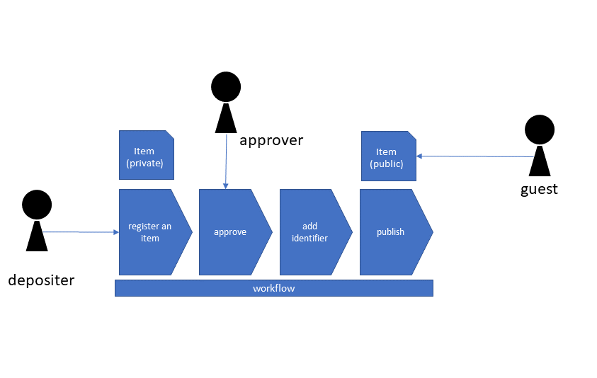

## LINKID=terminology【参照先】Glossary

This section explains the terminology used in the System.

\<TBLATT POSITION="1" SCALE="151"\>

LINKID=terminologylist【参照先】Table 1‑1. Terms used in the System

<table>
<thead>
<tr class="header">
<th>Term</th>
<th>Description</th>
</tr>
</thead>
<tbody>
<tr class="odd">
<td>DDI</td>
<td>
The Data Documentation Initiative (DDI) is an international standard for metadata schemas in social science research. It is utilized for data archive initiatives as internationalization, shared use or joint research centers (https://ddialliance.org/).

In the WEKO3 module, you can use DDI as a metadata schema for OAI-PMH.
</td>
</tr>
<tr class="even">
<td>&lt;INDEXWORD PRONOUNCE="dublincore" INDEXITEM="DublinCore"&gt;DublinCore&lt;/INDEXWORD&gt;</td>
<td>A metadata schema standardized by the International Organization for Standardization (ISO 15836) (http://dublincore.org/). In the WEKO3 module, you can use DublinCore as a metadata schema for OAI-PMH.</td>
</tr>
<tr class="odd">
<td>JPCOAR</td>
<td>
A metadata schema developed by JPCOAR (Japan Consortium for open access Repositories) (https://schema.irdb.nii.ac.jp/en).

In the WEKO3 module, you can use JPCOAR as a metadata schema for OAI-PMH.
</td>
</tr>
<tr class="even">
<td>&lt;INDEXWORD PRONOUNCE="junii2" INDEXITEM="junii2"&gt;junii2&lt;/INDEXWORD&gt;</td>
<td>
A metadata schema published by the National Institute of Informatics (NII) (http://www.nii.ac.jp/irp/archive/system/junii2.html).

In the WEKO3 module, you cannot use junii2 as a metadata schema for OAI-PMH.
</td>
</tr>
<tr class="odd">
<td>&lt;INDEXWORD PRONOUNCE="oai－pmh" INDEXITEM="OAI-PMH"&gt;OAI-PMH&lt;/INDEXWORD&gt;</td>
<td>OAI-PMH (The Open Archives Initiative Protocol for Metadata Harvesting) is a protocol developed by the Open Archives Initiative to exchange metadata between repositories (http://www.openarchives.org/OAI/openarchivesprotocol.html). External systems, including repositories, can use OAI-PMH to collect metadata of the items registered in the WEKO3 module.</td>
</tr>
<tr class="even">
<td>&lt;INDEXWORD PRONOUNCE="ui" INDEXITEM="UI"&gt;UI&lt;/INDEXWORD&gt;</td>
<td>Stands for "User Interface". It is an interface for exchanging information between the System and the user.</td>
</tr>
<tr class="odd">
<td>&lt;INDEXWORD PRONOUNCE="weko3りほしとり" INDEXITEM="WEKO3リポジトリ"&gt;WEKO3 repository&lt;/INDEXWORD&gt;</td>
<td>A repository created with the WEKO3 module and related software.</td>
</tr>
<tr class="even">
<td>&lt;INDEXWORD PRONOUNCE="あいてむ" INDEXITEM="アイテム"&gt;Item&lt;/INDEXWORD&gt;</td>
<td>
A unit of information stored in the repository. An item is made up of content files and metadata. Metadata contains information that conforms to the description elements and description formats specified in a metadata schema.

Each item is assigned an item ID that is unique within the WEKO3 repository. An item is tied to a single item type and cannot be linked to multiple item types.

You can associate different metadata with a single item by creating additional item types.
</td>
</tr>
<tr class="odd">
<td>&lt;INDEXWORD PRONOUNCE="あいてむたいふ" INDEXITEM="アイテムタイプ"&gt;Item type&lt;/INDEXWORD&gt;</td>
<td>
Defines the data type of metadata registered for an item. An item type consists of elements specified in a metadata schema such as JPCOAR.

The repository administrator needs to consider the metadata required for a particular item and create an item type to suit the needs.

Example:

When storing journal papers and research data in the repository, the metadata elements for journal papers are differentiated from those for research data. In such a case, you can create an item type for journal papers and an item type for research data, respectively.
</td>
</tr>
<tr class="even">
<td>&lt;INDEXWORD PRONOUNCE="いんてつくす" INDEXITEM="インデックス"&gt;Index&lt;/INDEXWORD&gt;</td>
<td>A unit (category) used to group items registered in the WEKO3 repository. Items registered in the WEKO3 repository will always have one or more indexes. An index can have multiple child indexes and items.</td>
</tr>
<tr class="odd">
<td>&lt;INDEXWORD PRONOUNCE="いんてつくすつりい" INDEXITEM="インデックスツリー"&gt;Index tree&lt;/INDEXWORD&gt;</td>
<td>A tree structure of nested indexes. A WEKO3 repository has a single repository tree.</td>
</tr>
<tr class="even">
<td>&lt;INDEXWORD PRONOUNCE="こみゆにてい" INDEXITEM="コミュニティ"&gt;Community&lt;/INDEXWORD&gt;</td>
<td>A group of users who can access the repository. You can make items available only to the users of the community.</td>
</tr>
<tr class="odd">
<td>&lt;INDEXWORD PRONOUNCE="こみゆにていかんりしや" INDEXITEM="コミュニティ管理者"&gt;Community administrator&lt;/INDEXWORD&gt;</td>
<td>A user with the role to manage the community.</td>
</tr>
<tr class="even">
<td>&lt;INDEXWORD PRONOUNCE="こんてんつ" INDEXITEM="コンテンツ"&gt;Content&lt;/INDEXWORD&gt;</td>
<td>Research data registered in the repository, such as research papers and materials. The word "content" is used interchangeably with "item" in this manual.</td>
</tr>
<tr class="odd">
<td>&lt;INDEXWORD PRONOUNCE="こんてんつふあいる" INDEXITEM="コンテンツファイル"&gt;Content file&lt;/INDEXWORD&gt;</td>
<td>Refers to the papers and other files that make up an item.</td>
</tr>
<tr class="even">
<td>&lt;INDEXWORD PRONOUNCE="しすてむ" INDEXITEM="システム"&gt;System&lt;/INDEXWORD&gt;</td>
<td>Refers to the WEKO3 system.</td>
</tr>
<tr class="odd">
<td>&lt;INDEXWORD PRONOUNCE="しすてむかんりしや" INDEXITEM="システム管理者"&gt;System administrator&lt;/INDEXWORD&gt;</td>
<td>A user with the role to administer the System.</td>
</tr>
<tr class="even">
<td>&lt;INDEXWORD PRONOUNCE="すきいま" INDEXITEM="スキーマ"&gt;Schema&lt;/INDEXWORD&gt;</td>
<td>A definition of the database structure for a repository. It defines the relationship between objects that make up a database, such as tables and lists.</td>
</tr>
<tr class="odd">
<td>&lt;INDEXWORD PRONOUNCE="たいあろく" INDEXITEM="ダイアログ"&gt;Dialog&lt;/INDEXWORD&gt;</td>
<td>A UI mainly used to display messages and alerts. The user can still interact with UI's on the screen while a dialog is displayed.</td>
</tr>
<tr class="even">
<td>&lt;INDEXWORD PRONOUNCE="とうろくゆうさあ" INDEXITEM="登録ユーザー"&gt;Registered user&lt;/INDEXWORD&gt;</td>
<td>User who can access stored academic research results and register data from academic research results in the repository.</td>
</tr>
<tr class="odd">
<td>&lt;INDEXWORD PRONOUNCE="はあへすていんく" INDEXITEM="ハーベスティング"&gt;Harvesting&lt;/INDEXWORD&gt;</td>
<td>Scheduled activity for collecting repository data by external systems. It uses a dedicated protocol. Metadata needs to be mapped to the protocol.</td>
</tr>
<tr class="even">
<td>&lt;INDEXWORD PRONOUNCE="ふろお" INDEXITEM="フロー"&gt;Flow&lt;/INDEXWORD&gt;</td>
<td>A series of actions used to save items to the System. It defines a sequence of actions such as adding data to the repository, entering metadata, and peer review/approval.</td>
</tr>
<tr class="odd">
<td>&lt;INDEXWORD PRONOUNCE="めたてえた" INDEXITEM="メタデータ"&gt;Metadata&lt;/INDEXWORD&gt;</td>
<td>Information related to an item. Examples include information for a title, author, and file size. Metadata consists of content metadata and administrative metadata. Content metadata is a summary of the item. Administrative metadata is information such as the creator of the content metadata or access count for the item.</td>
</tr>
<tr class="even">
<td>&lt;INDEXWORD PRONOUNCE="りほしとり" INDEXITEM="リポジトリ"&gt;Repository&lt;/INDEXWORD&gt;</td>
<td>
A set of services a university provides to its community members to manage and distribute digital materials created by the university and its members. In principle, a single entity (e.g. a university or academic institution) can operate one repository.

The term refers to, in this manual, a space where research data (i.e. items) and their metadata are stored.
</td>
</tr>
<tr class="odd">
<td>&lt;INDEXWORD PRONOUNCE="りほしとりかんりしや" INDEXITEM="リポジトリ管理者"&gt;Repository administrator&lt;/INDEXWORD&gt;</td>
<td>A user with the role to administer a repository. The repository administrator can configure the WEKO3 module, the index tree, and item types.</td>
</tr>
<tr class="even">
<td>&lt;INDEXWORD PRONOUNCE="ろくいん" INDEXITEM="ログイン"&gt;Log in&lt;/INDEXWORD&gt;</td>
<td>The action to authenticate with a computer or various services on the Internet using pre-registered account information to access data.</td>
</tr>
<tr class="odd">
<td>&lt;INDEXWORD PRONOUNCE="ろくあうと" INDEXITEM="ログアウト"&gt;Log out&lt;/INDEXWORD&gt;</td>
<td>The action to close one's access to data granted through authentication upon logging in.</td>
</tr>
<tr class="even">
<td>&lt;INDEXWORD PRONOUNCE="ろおる" INDEXITEM="ロール"&gt;Role&lt;/INDEXWORD&gt;</td>
<td>Defines the permissions granted to a user when operating the System, repository, and other elements. Permissions include adding, changing, and deleting data.</td>
</tr>
<tr class="odd">
<td>&lt;INDEXWORD PRONOUNCE="わあくふろお" INDEXITEM="ワークフロー"&gt;Workflow&lt;/INDEXWORD&gt;</td>
<td>Defines a series of tasks for business operations. It also refers to the sequence of those operations. A workflow for the WEKO3 repository defines a sequence of actions starting with registering items through publishing, including adding data to the repository, entering metadata, or peer review/approval.</td>
</tr>
<tr class="even">
<td>&lt;INDEXWORD PRONOUNCE="いたいし" INDEXITEM="異体字"&gt;Variant character&lt;/INDEXWORD&gt;</td>
<td>
The traditional alternative of kanji or a different form of character with the same pronunciation and meaning but written differently.

Example:

"會" instead of "会", or "壱" instead of "一".
</td>
</tr>
</tbody>
</table>

## LINKID=featuresandusers【参照先】System features

The following table shows the administrator roles for the System.

\<TBLATT POSITION="1" SCALE="151"\>

Table 1‑2. Administrator roles for the System

| Administrator role                                                                               | Description                                                                                                                                                                                                                                                    |
| ------------------------------------------------------------------------------------------------ | -------------------------------------------------------------------------------------------------------------------------------------------------------------------------------------------------------------------------------------------------------------- |
| \<INDEXWORD PRONOUNCE="しすてむかんりしや" INDEXITEM="システム管理者"\>System administrator\</INDEXWORD\>        | Responsible for such tasks as managing user accounts, managing workflows and integrating OAI-PMH. Some operations, including managing communities and managing user accounts, can only be performed by system administrators.                                  |
| \<INDEXWORD PRONOUNCE="りほしとりかんりしや" INDEXITEM="リポジトリ管理者"\>Repository administrator\</INDEXWORD\>  | Responsible for such tasks as registering schemas in the repository, creating item types and mapping metadata.                                                                                                                                                 |
| \<INDEXWORD PRONOUNCE="こみゆにていかんりしや" INDEXITEM="コミュニティ管理者"\>Community administrator\</INDEXWORD\> | Each research category, such as a faculty or department, represents a single index within the index tree. This administrative role is responsible for a particular index and performs harvesting, editing the index tree, registering widgets and other tasks. |

The following table shows the administrative features of the System and the administrator roles that can perform each operation.

\<TBLATT POSITION="1" SCALE="151"\>

Table 1‑3. System features and administrator roles

Legend: 〇: Feature available, ×: Feature not available

<table>
<thead>
<tr class="header">
<th>Features</th>
<th>Administrator role</th>
<th>Chapter to reference</th>
<th></th>
<th></th>
<th></th>
</tr>
</thead>
<tbody>
<tr class="odd">
<td></td>
<td>System</td>
<td>Repository</td>
<td>Community</td>
<td></td>
<td></td>
</tr>
<tr class="even">
<td>アイテムタイプ管理Item Types</td>
<td>-</td>
<td>-</td>
<td>-</td>
<td>2. Item Types</td>
<td></td>
</tr>
<tr class="odd">
<td></td>
<td>Mapping</td>
<td>〇</td>
<td>〇</td>
<td>×</td>
<td></td>
</tr>
<tr class="even">
<td></td>
<td>OAI Schema</td>
<td>〇</td>
<td>×</td>
<td>×</td>
<td></td>
</tr>
<tr class="odd">
<td></td>
<td>Properties</td>
<td>〇</td>
<td>×</td>
<td>×</td>
<td></td>
</tr>
<tr class="even">
<td>&lt;INDEXWORD PRONOUNCE="あいてむそうさ" INDEXITEM="アイテム操作"&gt;Items&lt;/INDEXWORD&gt;</td>
<td>-</td>
<td>-</td>
<td>-</td>
<td>ANCHORID=itemmanagement【参照元】3. Items【E】</td>
<td></td>
</tr>
<tr class="odd">
<td></td>
<td>Bulk Update</td>
<td>〇</td>
<td>〇</td>
<td>×</td>
<td></td>
</tr>
<tr class="even">
<td></td>
<td>Bulk Delete</td>
<td>〇</td>
<td>〇</td>
<td>×</td>
<td></td>
</tr>
<tr class="odd">
<td></td>
<td>Import</td>
<td>〇</td>
<td>〇</td>
<td>×</td>
<td></td>
</tr>
<tr class="even">
<td>Index Tree</td>
<td>-</td>
<td>-</td>
<td>-</td>
<td>4. Index Tree</td>
<td></td>
</tr>
<tr class="odd">
<td></td>
<td>Edit Tree</td>
<td>〇</td>
<td>〇</td>
<td>
〇

(*2)
</td>
<td></td>
</tr>
<tr class="even">
<td></td>
<td>Journal Information</td>
<td>〇</td>
<td>〇</td>
<td>
〇

(*2)
</td>
<td></td>
</tr>
<tr class="odd">
<td></td>
<td>Custom Sort</td>
<td>〇</td>
<td>〇</td>
<td>
〇

(*2)
</td>
<td></td>
</tr>
<tr class="even">
<td>Web Design</td>
<td>-</td>
<td>-</td>
<td>-</td>
<td>5. Web Design</td>
<td></td>
</tr>
<tr class="odd">
<td></td>
<td>Widget</td>
<td>〇</td>
<td>〇</td>
<td>
〇

(*2)
</td>
<td></td>
</tr>
<tr class="even">
<td></td>
<td>Page Layout</td>
<td>〇</td>
<td>〇</td>
<td>
〇

(*2)
</td>
<td></td>
</tr>
<tr class="odd">
<td>Author Management</td>
<td>-</td>
<td>-</td>
<td>-</td>
<td>6. Author Management</td>
<td></td>
</tr>
<tr class="even">
<td></td>
<td>Edit</td>
<td>〇</td>
<td>〇</td>
<td>×</td>
<td></td>
</tr>
<tr class="odd">
<td></td>
<td>Export</td>
<td>〇</td>
<td>〇</td>
<td>×</td>
<td></td>
</tr>
<tr class="even">
<td></td>
<td>Import</td>
<td>〇</td>
<td>〇</td>
<td>×</td>
<td></td>
</tr>
<tr class="odd">
<td>&lt;INDEXWORD PRONOUNCE="りようとうけい" INDEXITEM="利用統計"&gt;Statistics&lt;/INDEXWORD&gt;</td>
<td>-</td>
<td>-</td>
<td>-</td>
<td>7. Statistics【E】ANCHORID=statisticsmanagement【参照元】</td>
<td></td>
</tr>
<tr class="even">
<td></td>
<td>Statistics Report</td>
<td>〇</td>
<td>〇</td>
<td>
〇

(*2)
</td>
<td></td>
</tr>
<tr class="odd">
<td></td>
<td>Feedback Mail</td>
<td>〇</td>
<td>〇</td>
<td>×</td>
<td></td>
</tr>
<tr class="even">
<td></td>
<td>Site License</td>
<td>〇</td>
<td>〇</td>
<td>×</td>
<td></td>
</tr>
<tr class="odd">
<td>WorkFlowワーク風呂＾管理&lt;/INDEXWORD&gt;</td>
<td>-</td>
<td>-</td>
<td>-</td>
<td>ANCHORID=workflowmanagement【参照元】8. WorkFlow【E】</td>
<td></td>
</tr>
<tr class="even">
<td></td>
<td>Flow</td>
<td>〇</td>
<td>〇</td>
<td>×</td>
<td></td>
</tr>
<tr class="odd">
<td></td>
<td>Workflow</td>
<td>〇</td>
<td>〇</td>
<td>×</td>
<td></td>
</tr>
<tr class="even">
<td>Communities</td>
<td>-</td>
<td>-</td>
<td>-</td>
<td>ANCHORID=communitymanagement【参照元】9. Communities【E】</td>
<td></td>
</tr>
<tr class="odd">
<td></td>
<td>Community</td>
<td>〇</td>
<td>〇</td>
<td>
〇

(*2)
</td>
<td></td>
</tr>
<tr class="even">
<td></td>
<td>Featured Community</td>
<td>〇</td>
<td>×</td>
<td>×</td>
<td></td>
</tr>
<tr class="odd">
<td></td>
<td>Inclusion Request</td>
<td>〇</td>
<td>×</td>
<td>×</td>
<td></td>
</tr>
<tr class="even">
<td>&lt;INDEXWORD PRONOUNCE="oai－pmh" INDEXITEM="OAI-PMH"&gt;OAI-PMH&lt;/INDEXWORD&gt;</td>
<td>-</td>
<td>-</td>
<td>-</td>
<td>ANCHORID=oaipmhsetting【参照元】10. OAI-PMH【E】</td>
<td></td>
</tr>
<tr class="odd">
<td></td>
<td>Harvesting</td>
<td>〇</td>
<td>〇</td>
<td>
〇

(*2)
</td>
<td></td>
</tr>
<tr class="even">
<td></td>
<td>Identify</td>
<td>〇</td>
<td>〇</td>
<td>×</td>
<td></td>
</tr>
<tr class="odd">
<td></td>
<td>Sets</td>
<td>〇</td>
<td>×</td>
<td>×</td>
<td></td>
</tr>
<tr class="even">
<td>Resource Sync</td>
<td>-</td>
<td>-</td>
<td>-</td>
<td>11. Resource Sync【E】</td>
<td></td>
</tr>
<tr class="odd">
<td></td>
<td>Resource List</td>
<td>〇</td>
<td>×</td>
<td>×</td>
<td></td>
</tr>
<tr class="even">
<td></td>
<td>Change List</td>
<td>〇</td>
<td>×</td>
<td>×</td>
<td></td>
</tr>
<tr class="odd">
<td></td>
<td>Resync</td>
<td>〇</td>
<td>×</td>
<td>×</td>
<td></td>
</tr>
<tr class="even">
<td>&lt;INDEXWORD PRONOUNCE="れこおとかんり" INDEXITEM="レコード管理"&gt;Records&lt;/INDEXWORD&gt;</td>
<td>-</td>
<td>-</td>
<td>-</td>
<td>ANCHORID=recordmanagement【参照元】12. Records</td>
<td></td>
</tr>
<tr class="odd">
<td></td>
<td>Persistent Identifier</td>
<td>〇</td>
<td>×</td>
<td>×</td>
<td></td>
</tr>
<tr class="even">
<td></td>
<td>Record Metadata</td>
<td>〇</td>
<td>×</td>
<td>×</td>
<td></td>
</tr>
<tr class="odd">
<td>&lt;INDEXWORD PRONOUNCE="ふあいるかんり" INDEXITEM="ファイル管理"&gt;Files&lt;/INDEXWORD&gt;</td>
<td>-</td>
<td>-</td>
<td>-</td>
<td>ANCHORID=filemanagement【参照元】13. Files【E】</td>
<td></td>
</tr>
<tr class="even">
<td></td>
<td>Bucket</td>
<td>〇</td>
<td>×</td>
<td>×</td>
<td></td>
</tr>
<tr class="odd">
<td></td>
<td>File Instance</td>
<td>〇</td>
<td>×</td>
<td>×</td>
<td></td>
</tr>
<tr class="even">
<td></td>
<td>Location</td>
<td>〇</td>
<td>
〇

(*1)
</td>
<td></td>
<td></td>
</tr>
<tr class="odd">
<td></td>
<td>Multipart Object</td>
<td>〇</td>
<td>×</td>
<td>×</td>
<td></td>
</tr>
<tr class="even">
<td></td>
<td>Object Version</td>
<td>〇</td>
<td>×</td>
<td>×</td>
<td></td>
</tr>
<tr class="odd">
<td>&lt;INDEXWORD PRONOUNCE="ゆうさあかんり" INDEXITEM="ユーザー管理"&gt;User Management&lt;/INDEXWORD&gt;</td>
<td>-</td>
<td>-</td>
<td>-</td>
<td>ANCHORID=usermanagement【参照元】14. User Management【E】</td>
<td></td>
</tr>
<tr class="even">
<td></td>
<td>Access: Roles</td>
<td>〇</td>
<td>×</td>
<td>×</td>
<td></td>
</tr>
<tr class="odd">
<td></td>
<td>Access: System Roles</td>
<td>〇</td>
<td>×</td>
<td>×</td>
<td></td>
</tr>
<tr class="even">
<td></td>
<td>Access: Users</td>
<td>〇</td>
<td>×</td>
<td>×</td>
<td></td>
</tr>
<tr class="odd">
<td></td>
<td>Linked account identities</td>
<td>〇</td>
<td>×</td>
<td>×</td>
<td></td>
</tr>
<tr class="even">
<td></td>
<td>Linked account tokens</td>
<td>〇</td>
<td>×</td>
<td>×</td>
<td></td>
</tr>
<tr class="odd">
<td></td>
<td>Linked accounts</td>
<td>〇</td>
<td>×</td>
<td>×</td>
<td></td>
</tr>
<tr class="even">
<td></td>
<td>OAuth Application Tokens</td>
<td>〇</td>
<td>×</td>
<td>×</td>
<td></td>
</tr>
<tr class="odd">
<td></td>
<td>OAuth Applications</td>
<td>〇</td>
<td>×</td>
<td>×</td>
<td></td>
</tr>
<tr class="even">
<td></td>
<td>Role</td>
<td>〇</td>
<td>×</td>
<td>×</td>
<td></td>
</tr>
<tr class="odd">
<td></td>
<td>Session Activity</td>
<td>〇</td>
<td>×</td>
<td>×</td>
<td></td>
</tr>
<tr class="even">
<td></td>
<td>User</td>
<td>〇</td>
<td>×</td>
<td>×</td>
<td></td>
</tr>
<tr class="odd">
<td></td>
<td>User Profile</td>
<td>〇</td>
<td>×</td>
<td>×</td>
<td></td>
</tr>
<tr class="even">
<td>&lt;INDEXWORD PRONOUNCE="しすてむせつてい" INDEXITEM="システム設定"&gt;Setting&lt;/INDEXWORD&gt;</td>
<td>-</td>
<td>-</td>
<td>-</td>
<td>ANCHORID=systemsetting【参照元】15. Setting【E】</td>
<td></td>
</tr>
<tr class="odd">
<td></td>
<td>Items</td>
<td>〇</td>
<td>×</td>
<td>×</td>
<td></td>
</tr>
<tr class="even">
<td></td>
<td>Index Link</td>
<td>〇</td>
<td>×</td>
<td>×</td>
<td></td>
</tr>
<tr class="odd">
<td></td>
<td>Index Tree</td>
<td>〇</td>
<td>×</td>
<td>×</td>
<td></td>
</tr>
<tr class="even">
<td></td>
<td>Language</td>
<td>〇</td>
<td>×</td>
<td>×</td>
<td></td>
</tr>
<tr class="odd">
<td></td>
<td>PDF Cover Page</td>
<td>〇</td>
<td>×</td>
<td>×</td>
<td></td>
</tr>
<tr class="even">
<td></td>
<td>Ranking</td>
<td>〇</td>
<td>×</td>
<td>×</td>
<td></td>
</tr>
<tr class="odd">
<td></td>
<td>Stats</td>
<td>〇</td>
<td>×</td>
<td>×</td>
<td></td>
</tr>
<tr class="even">
<td></td>
<td>Style</td>
<td>〇</td>
<td>×</td>
<td>×</td>
<td></td>
</tr>
<tr class="odd">
<td></td>
<td>Identifier</td>
<td>〇</td>
<td>×</td>
<td>
〇

(*2)
</td>
<td></td>
</tr>
<tr class="even">
<td></td>
<td>Item Export</td>
<td>〇</td>
<td>×</td>
<td>
〇

(*2)
</td>
<td></td>
</tr>
<tr class="odd">
<td></td>
<td>Log Analysis</td>
<td>〇</td>
<td>×</td>
<td>×</td>
<td></td>
</tr>
<tr class="even">
<td></td>
<td>Setting Search</td>
<td>〇</td>
<td>×</td>
<td>×</td>
<td></td>
</tr>
<tr class="odd">
<td></td>
<td>Site Info</td>
<td>〇</td>
<td>×</td>
<td>×</td>
<td></td>
</tr>
<tr class="even">
<td></td>
<td>Site License</td>
<td>〇</td>
<td>×</td>
<td>×</td>
<td></td>
</tr>
<tr class="odd">
<td></td>
<td>Sitemap</td>
<td>〇</td>
<td>×</td>
<td>×</td>
<td></td>
</tr>
<tr class="even">
<td></td>
<td>Send Mail</td>
<td>〇</td>
<td>×</td>
<td>×</td>
<td></td>
</tr>
<tr class="odd">
<td></td>
<td>WebAPI Account</td>
<td>〇</td>
<td>×</td>
<td>×</td>
<td></td>
</tr>
<tr class="even">
<td></td>
<td>File Preview</td>
<td>〇</td>
<td>×</td>
<td>×</td>
<td></td>
</tr>
<tr class="odd">
<td></td>
<td>Shibboleth</td>
<td>〇</td>
<td>×</td>
<td>×</td>
<td></td>
</tr>
<tr class="even">
<td></td>
<td>Others</td>
<td>〇</td>
<td>×</td>
<td>×</td>
<td></td>
</tr>
<tr class="odd">
<td>Managing &lt;INDEXWORD PRONOUNCE="ゆうさああかうんと" INDEXITEM="ユーザーアカウント"&gt;User Accounts&lt;/INDEXWORD&gt;</td>
<td>〇</td>
<td>〇</td>
<td>〇</td>
<td>ANCHORID=useraccount【参照元】16. Managing User Accounts【E】</td>
<td></td>
</tr>
</tbody>
</table>

\*1: Read access only.

\*2: This feature is planned to be enabled only for the index to which the administrator is assigned.

## LINKID=adminwindow【参照先】\<INDEXWORD PRONOUNCE="かんりかめん" INDEXITEM="管理画面"\>Access the Administration screen\</INDEXWORD\>

This section explains how to access the "Administration" screen. The system management operations described in this manual are performed in the "Administration" screen. To display the setting screen for each menu, follow the steps below.

1.  Log in with an administrator account.

For information on logging in, refer to the Data Registration Guide.

2.  Select "Administration" from the pull-down menu next to the user account displayed in the upper right corner of the screen.
    
    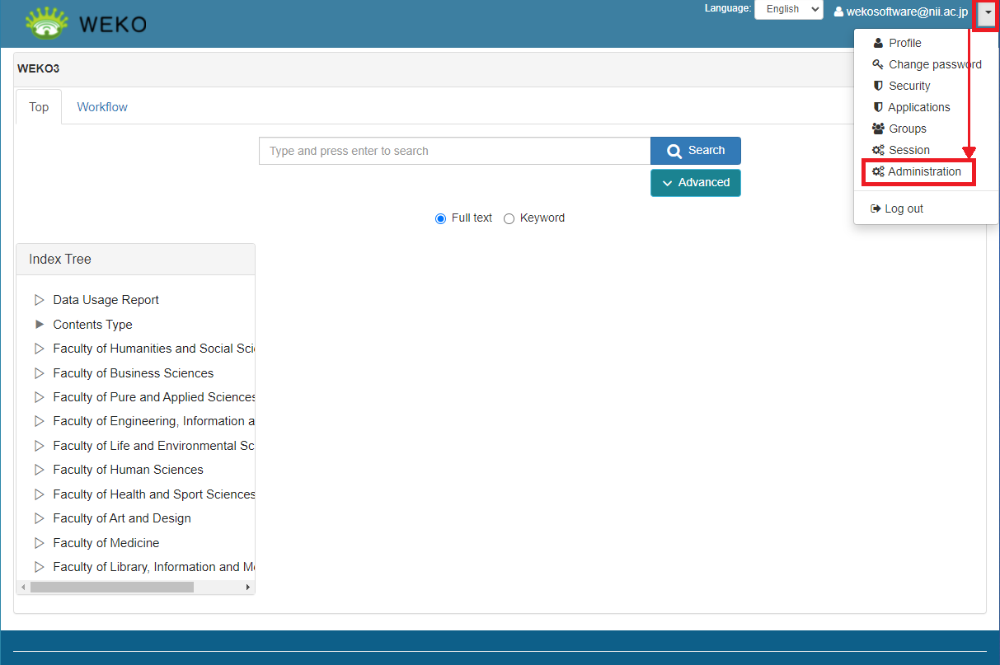

zu0104010.tifThe "Administration" screen appears.

3.  Click to expand a menu on the left side of the screen and select an element.

The setting screen appears.

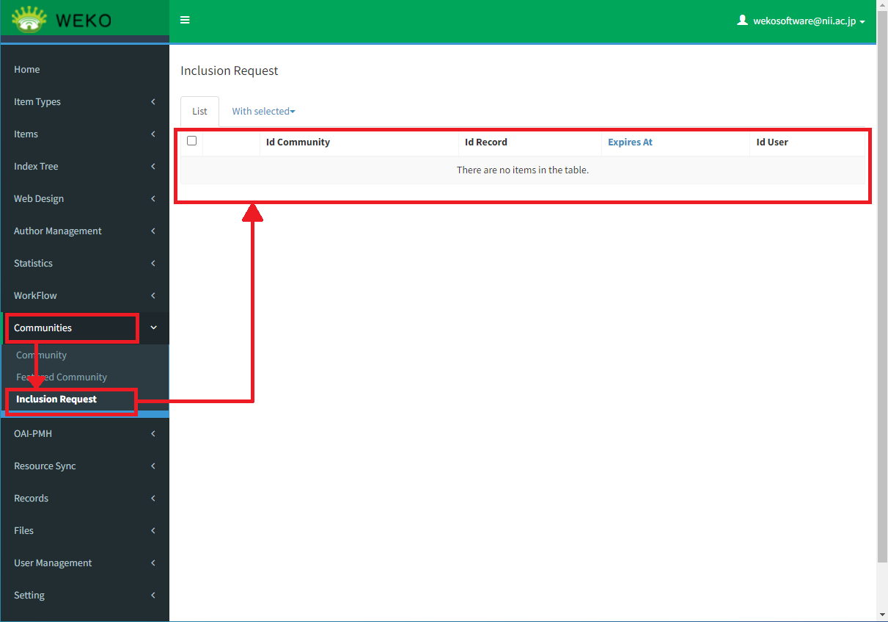

zu0104020.tif

See Table 1-3 for a list of the menus on the Administration screen and the roles that can operate each menu.

# Item Types

This chapter provides information on how to manage item types.

You can create item types by combining properties. An item type created is used as a format (i.e. a template) for registering items.

## LINKID=setpropertyitemtype【参照先】Set up properties

To access the \<INDEXWORD PRONOUNCE="properties" INDEXITEM="Properties"\>Properties\</INDEXWORD\> screen, click "Item Types" and then click "Properties". This screen allows you to register new properties and update saved properties.

### LINKID=addpropertyitemtype【**参照先**】Add properties

This section explains how to add a new property.

1.  Enter a property name.
    
    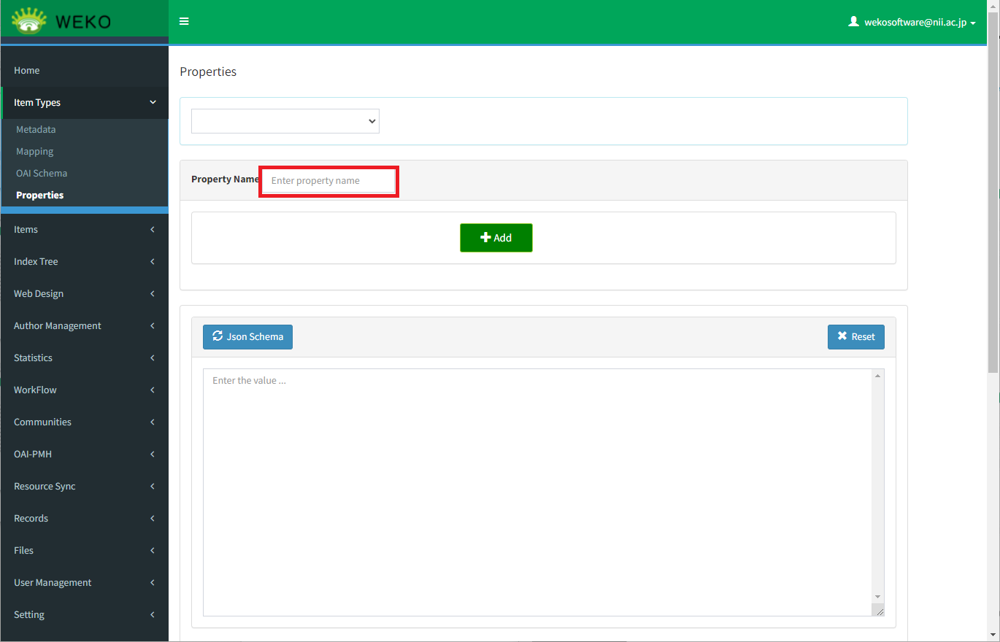

zu0404010.tif

2.  Click "+Add".

An attribute is added.

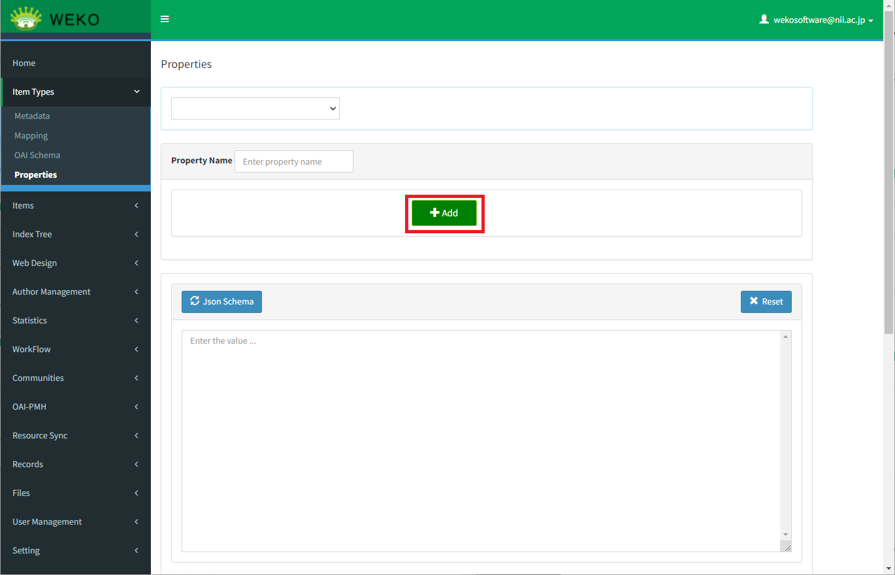

3.  Specify a name in the text area and select a metadata attribute from the drop-down list.

Check "Required" if you want to make the attribute required. To delete the entry, click "X".

For information on the input formats, see "ANCHORID=metadataattritemtype【参照元】Table 2-1. Input formats for metadata attributes【E】".

zu0404030.tif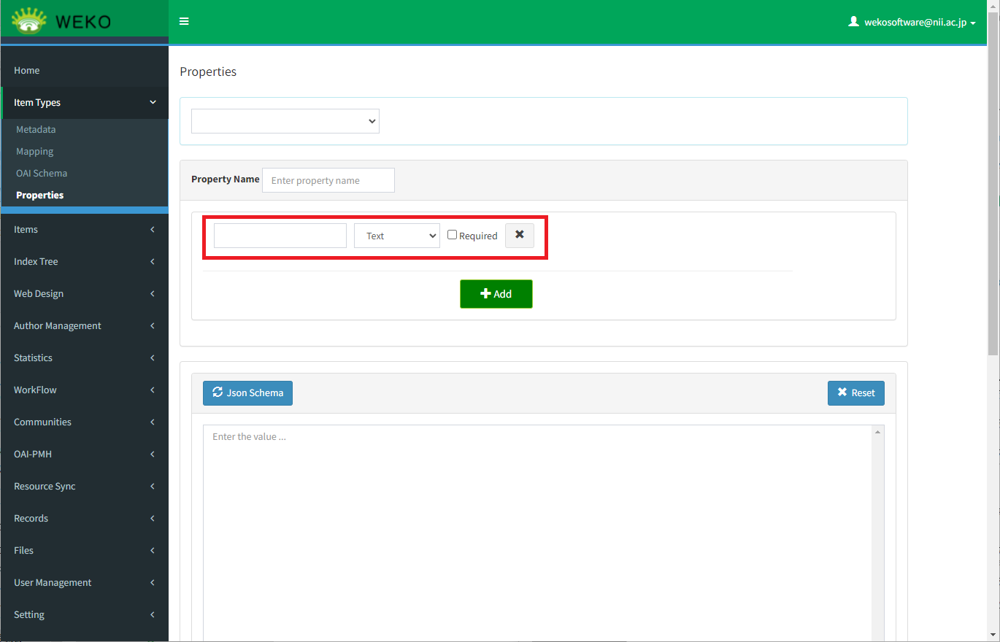\<TBLATT POSITION=”1” SCALE=”151”\>

Table 2‑1. Input formats for metadata attributes

<table>
<thead>
<tr class="header">
<th>Input format</th>
<th>Sample display</th>
<th>Description</th>
</tr>
</thead>
<tbody>
<tr class="odd">
<td>Text</td>
<td>zu0404050.tif</td>
<td>Accepts a single line of text as input.</td>
</tr>
<tr class="even">
<td>Text Area</td>
<td>zu0404060.tif</td>
<td>Accepts multiple lines of text as input.</td>
</tr>
<tr class="odd">
<td>Check Box*</td>
<td>zu0404070.tif</td>
<td>Accepts the values of one or more selected check boxes as input.</td>
</tr>
<tr class="even">
<td>Selective (radio)*</td>
<td>zu0404080.tif</td>
<td>Accepts the value of a selected radio button as input.</td>
</tr>
<tr class="odd">
<td>Selective (pull-down)*</td>
<td>zu0404090.tif</td>
<td>Accepts the value of a selected pull-down menu as input.</td>
</tr>
<tr class="even">
<td>Date</td>
<td>zu0404100.tif</td>
<td>
Accepts a value specified in either of the following ways as input.

<ul>
<li>
Enter a date with the <em>yyyy-mm-dd, yyyy-mm, or yyyy</em> format.
</li>
<li>
Pick a date from the calendar that appears when the area is focused.
</li>
</ul></td>
</tr>
<tr class="odd">
<td>Object</td>
<td>zu0404110.tif</td>
<td>Accepts multiple elements as input. These elements are grouped as a set. Examples include the Creator Affiliation for the Creator properties.</td>
</tr>
<tr class="even">
<td>List</td>
<td>zu0404120.tif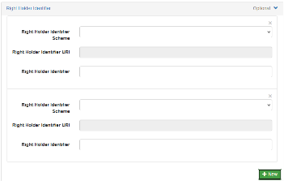</td>
<td>Accepts repetitive entries of the same element as input. These elements are grouped as a set. Examples include the Rights Holder Identifier for the Rights Holder Information properties.</td>
</tr>
</tbody>
</table>

\* Notes:

  - > If you have selected a check box, selective (radio), or selective (pull-down) format for input, an input field appears where you can provide choices for selection. These choices in this input field must be separated by a pipe (|).

> For example: AAA|BBB|CCC

  - > If you have selected a selective (pull-down) format, start with a pipe (|) before entering choices in this input field, which will provide an unselected state as the first choice.  
    > For example: |AAA|BBB|CCC

<!-- end list -->

4.  Click "JSON Schema".

The property information you specified appears in the JSON format underneath, in the text area, as well as in the "Form(Singular)" and "Form(Multiple)" areas.

zu0404040.tif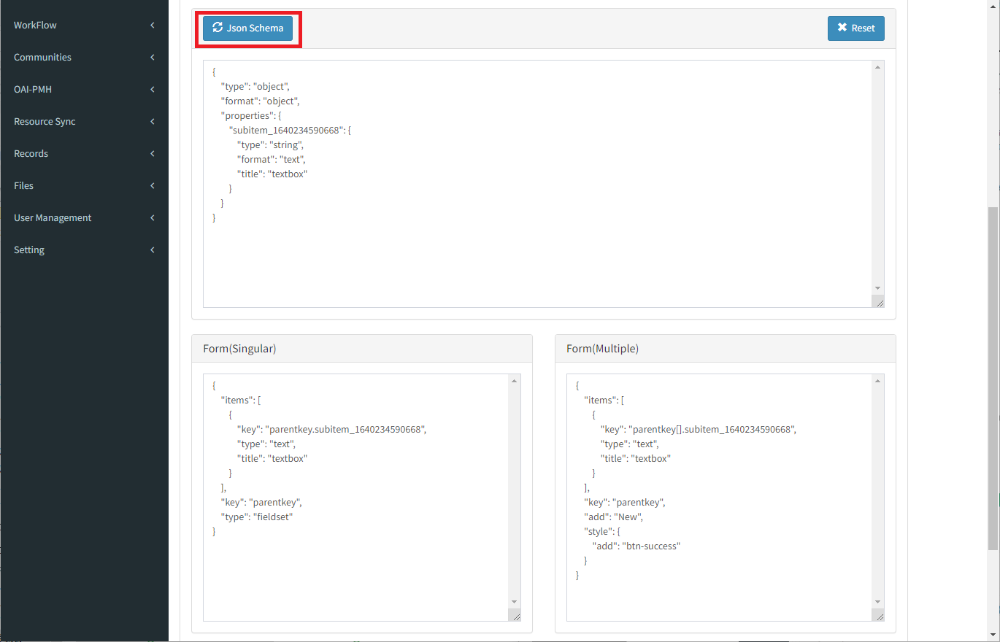

Notes:

If you have selected a selective (pull-down) format for input, add the following settings, which will provide an unselected state as the first choice.

Add the "null" element to "enum" and "type" of the corresponding subitem.

> For example:  
> 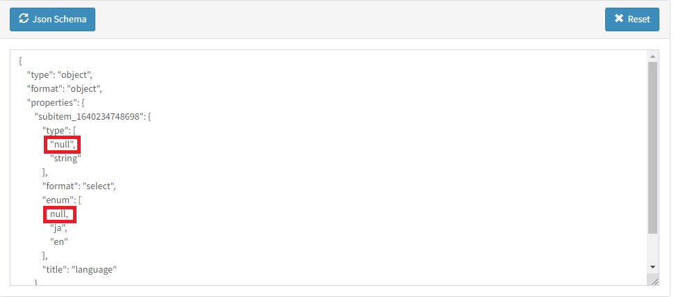
> 
> If you have selected a check box, selective (radio), or selective (pull-down) format for input, to make the choices editable in the "Metadata" screen, add "editAble":true to the corresponding subitem.
> 
> For example:  
> 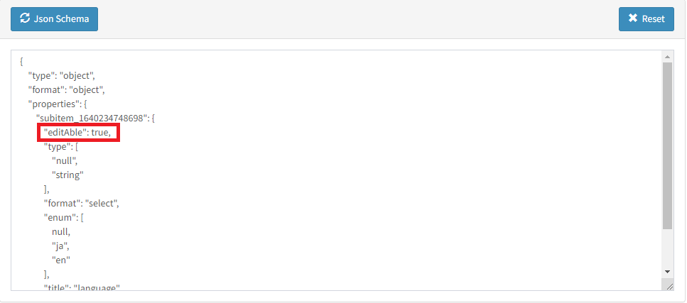
> 
> You can add comments for properties or attributes.
> 
> By adding a "description" tag to "Form(Singular)" and "Form(Multiple)" and adding comments in each "description", you can make the text appear in the item registration screen for the corresponding element.
> 
> For example:
> 
> 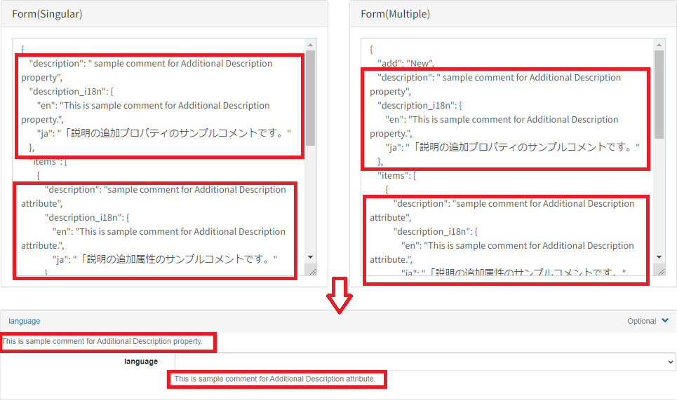

5.  Specify the information directly in the text area below the element, and then click "x Reset".

The property information will reflect the settings you have added.

Notes:

The property information will not reflect the "enum" setting you have added.

6.  Click "Save".

The property is added.

### LINKID=metadataattritemtype【参照先】Edit properties

This section explains how to edit existing properties.

1.  Select "Properties".

zu0404130.tif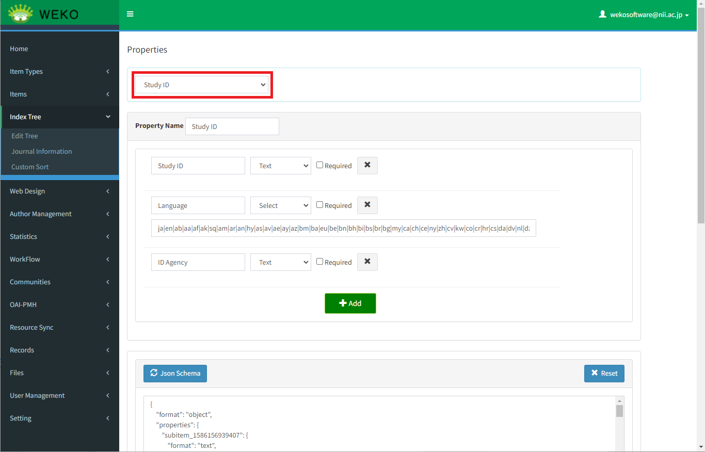

Notes:

You cannot edit the system properties, and they are not displayed in the properties list.

The following is a list of system properties.

  - File Info

  - Billing File

  - Thumbnail

  - Creator

  - Contributor

  - Rights Holder

  - Bibliographic Information

  - Resource Type

  - Version Type

  - Access Rights

<!-- end list -->

2.  Edit metadata elements.
    
    Enter an element name in the text area and select an input format from the drop-down list. For information on the input formats, see "ANCHORID=metadataattritemtype【参照元】Table 2-1. Input formats for metadata attributes【E】".
    
    Check "Required" if you want to make the attribute required. To delete the entry, click "X".
    
    To add an attribute, click "+Add".

zu0404140.tif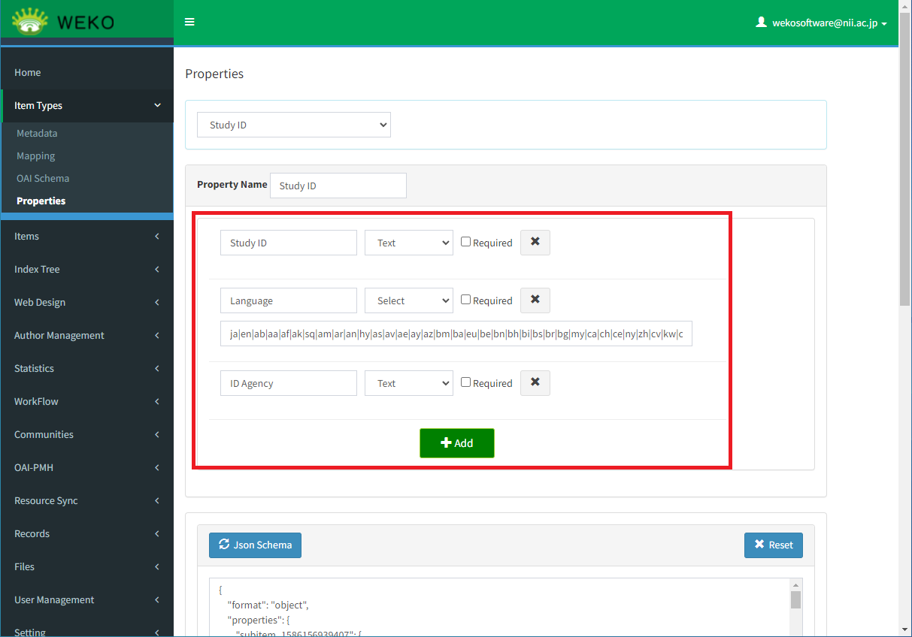

3.  Click "JSON Schema".

The property information you specified appears in the JSON format underneath, in the text area, as well as in the "Form(Singular)" and "Form(Multiple)" areas.

zu0404150.tif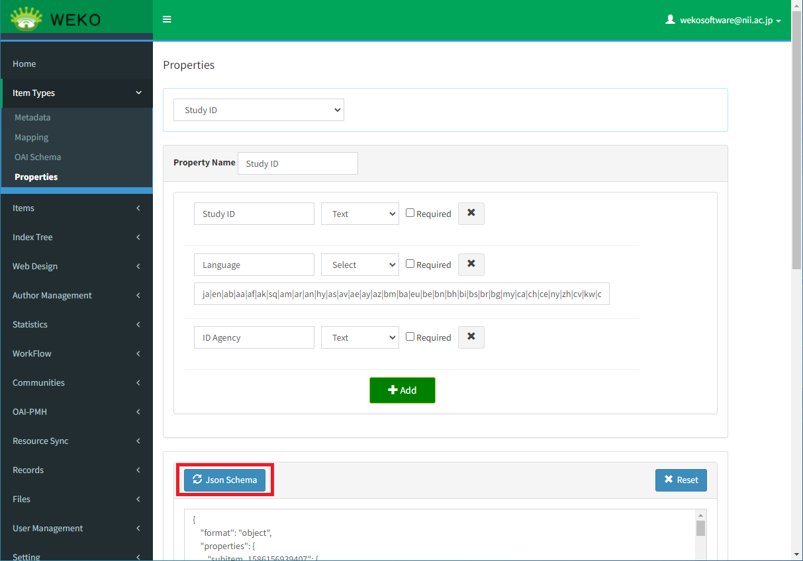

4.  Click "Save".

The property is added.

## LINKID=addordeleteitemtype【参照先】Manage item types

You can \<INDEXWORD PRONOUNCE="あいてむたいふをさくせい" INDEXITEM="アイテムタイプを作成"\>create item types\</INDEXWORD\> used for item registration. You can also edit them.

To access the screen where you can manage item types, click "Item Types" and then click "Metadata".

### Operations enabled for each item type

In the screen for editing metadata, you can switch between item types.

zu0402010.tif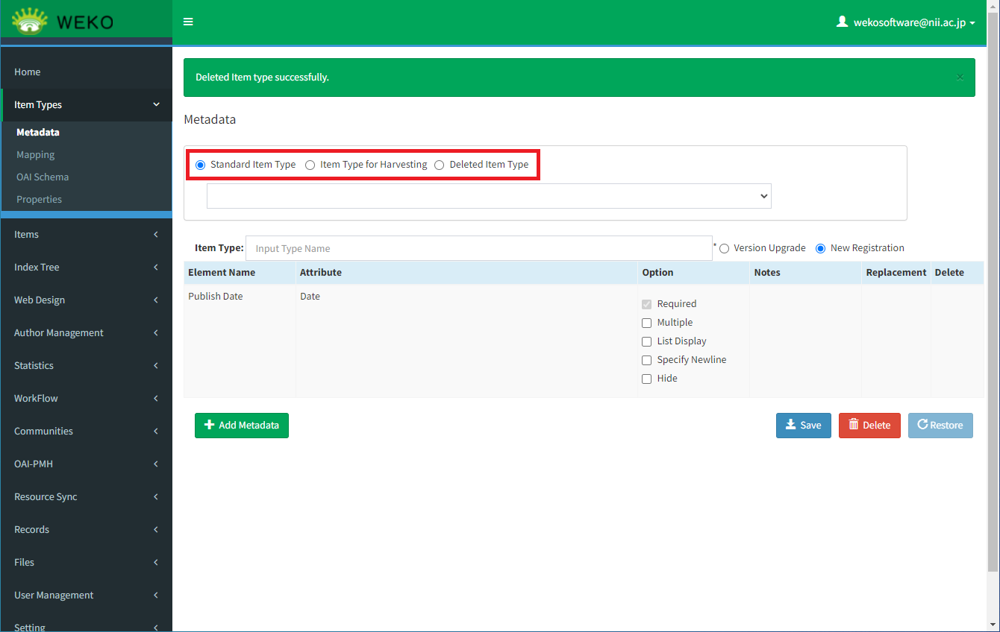

Select "\<INDEXWORD PRONOUNCE="ひようしゆんあいてむたいふ" INDEXITEM="標準アイテムタイプ"\>Standard Item Type\</INDEXWORD\>" to display the item types available for item registration.

Select "\<INDEXWORD PRONOUNCE="はあへすとようあいてむたいふ" INDEXITEM="ハーベスト用アイテムタイプ"\>Item Type for Harvesting\</INDEXWORD\>" to display the item types available for harvesting only. This item type is not available for item registration and can only be used for harvesting.

Select "\<INDEXWORD PRONOUNCE="さくしよすみあいてむたいふ" INDEXITEM="削除済みアイテムタイプ"\>Deleted Item Type\</INDEXWORD\>" to display the deleted item types.

The following table shows the operations that are enabled for each item type.

\<TBLATT POSITION="1" SCALE="151"\>

Table 2‑2. The operations that are enabled for each item type

Legend: 〇: Available, ×: Not available

| Operation     | Standard Item Type | Item Type for Harvesting | Deleted Item Type |
| ------------- | ------------------ | ------------------------ | ----------------- |
| Add           | 〇                  | 〇                        | ×                 |
| Edit metadata | 〇                  | 〇                        | ×                 |
| Set mapping   | 〇                  | 〇                        | ×                 |
| Rename        | 〇                  | 〇                        | ×                 |
| Copy          | 〇                  | 〇                        | ×                 |
| Delete        | 〇                  | ×                        | ×                 |
| Restore       | ×                  | ×                        | 〇                 |

### Default item types

The following two item types are available as default.

・ Default Item Type (Simple)

・ Default Item Type (Full)

The following two item types are available for restricted access.

・ Usage Application

・ Usage Report

There is also another item type available for DDI.

The following table shows the details for each item type.

・ Default Item Type (Simple)

<table>
<thead>
<tr class="header">
<th>#</th>
<th>Property Name</th>
<th>Option</th>
<th>Properties Defined</th>
<th></th>
<th></th>
<th></th>
<th></th>
<th></th>
<th></th>
<th></th>
<th></th>
<th></th>
</tr>
</thead>
<tbody>
<tr class="odd">
<td></td>
<td></td>
<td>Required</td>
<td>Allow Multiple</td>
<td>Show List</td>
<td>Specify Newline</td>
<td>Hide</td>
<td></td>
<td></td>
<td></td>
<td></td>
<td></td>
<td></td>
</tr>
<tr class="even">
<td>0</td>
<td>Publish Date</td>
<td>○</td>
<td>×</td>
<td>×</td>
<td>×</td>
<td>×</td>
<td>Date</td>
<td>Date</td>
<td>-</td>
<td>-</td>
<td>-</td>
<td>-</td>
</tr>
<tr class="odd">
<td>1</td>
<td>Title</td>
<td>○</td>
<td>○</td>
<td>○</td>
<td>○</td>
<td>×</td>
<td>Title</td>
<td>Text</td>
<td>-</td>
<td>-</td>
<td>-</td>
<td>-</td>
</tr>
<tr class="even">
<td></td>
<td></td>
<td></td>
<td></td>
<td></td>
<td></td>
<td></td>
<td>Language</td>
<td>Select</td>
<td>-</td>
<td>-</td>
<td>-</td>
<td>-</td>
</tr>
<tr class="odd">
<td>2</td>
<td>Alternative Title</td>
<td>×</td>
<td>○</td>
<td>×</td>
<td>×</td>
<td>×</td>
<td>Alternative Title</td>
<td>Text</td>
<td>-</td>
<td>-</td>
<td>-</td>
<td>-</td>
</tr>
<tr class="even">
<td></td>
<td></td>
<td></td>
<td></td>
<td></td>
<td></td>
<td></td>
<td>Language</td>
<td>Select</td>
<td>-</td>
<td>-</td>
<td>-</td>
<td>-</td>
</tr>
<tr class="odd">
<td>3</td>
<td>Creator</td>
<td>×</td>
<td>○</td>
<td>○</td>
<td>○</td>
<td>×</td>
<td>Creator Identifier</td>
<td>List</td>
<td>Creator Identifier</td>
<td>Text</td>
<td>-</td>
<td>-</td>
</tr>
<tr class="even">
<td></td>
<td></td>
<td></td>
<td></td>
<td></td>
<td></td>
<td></td>
<td></td>
<td></td>
<td>
Creator Identifier

Scheme
</td>
<td>Select</td>
<td>-</td>
<td>-</td>
</tr>
<tr class="odd">
<td></td>
<td></td>
<td></td>
<td></td>
<td></td>
<td></td>
<td></td>
<td></td>
<td></td>
<td>
Creator Identifier

URI
</td>
<td>Text</td>
<td>-</td>
<td>-</td>
</tr>
<tr class="even">
<td></td>
<td></td>
<td></td>
<td></td>
<td></td>
<td></td>
<td></td>
<td>Creator Name</td>
<td>List</td>
<td>Name</td>
<td>Text</td>
<td>-</td>
<td>-</td>
</tr>
<tr class="odd">
<td></td>
<td></td>
<td></td>
<td></td>
<td></td>
<td></td>
<td></td>
<td></td>
<td></td>
<td>Language</td>
<td>Select</td>
<td>-</td>
<td>-</td>
</tr>
<tr class="even">
<td></td>
<td></td>
<td></td>
<td></td>
<td></td>
<td></td>
<td></td>
<td>Creator Family Name</td>
<td>List</td>
<td>Family Name</td>
<td>Text</td>
<td>-</td>
<td>-</td>
</tr>
<tr class="odd">
<td></td>
<td></td>
<td></td>
<td></td>
<td></td>
<td></td>
<td></td>
<td></td>
<td></td>
<td>Language</td>
<td>Select</td>
<td>-</td>
<td>-</td>
</tr>
<tr class="even">
<td></td>
<td></td>
<td></td>
<td></td>
<td></td>
<td></td>
<td></td>
<td>Creator Given Name</td>
<td>List</td>
<td>Given Name</td>
<td>Text</td>
<td>-</td>
<td>-</td>
</tr>
<tr class="odd">
<td></td>
<td></td>
<td></td>
<td></td>
<td></td>
<td></td>
<td></td>
<td></td>
<td></td>
<td>Language</td>
<td>Select</td>
<td>-</td>
<td>-</td>
</tr>
<tr class="even">
<td></td>
<td></td>
<td></td>
<td></td>
<td></td>
<td></td>
<td></td>
<td>Creator Alternative Name</td>
<td>List</td>
<td>Alternative Name</td>
<td>Text</td>
<td>-</td>
<td>-</td>
</tr>
<tr class="odd">
<td></td>
<td></td>
<td></td>
<td></td>
<td></td>
<td></td>
<td></td>
<td></td>
<td></td>
<td>Language</td>
<td>Select</td>
<td>-</td>
<td>-</td>
</tr>
<tr class="even">
<td></td>
<td></td>
<td></td>
<td></td>
<td></td>
<td></td>
<td></td>
<td>Affiliation Name Identifier</td>
<td>List</td>
<td>Affiliation Name Identifier</td>
<td>List</td>
<td>Affiliation Name Identifier</td>
<td>Text</td>
</tr>
<tr class="odd">
<td></td>
<td></td>
<td></td>
<td></td>
<td></td>
<td></td>
<td></td>
<td></td>
<td></td>
<td></td>
<td></td>
<td>
Affiliation Name Identifier

Scheme
</td>
<td>Select</td>
</tr>
<tr class="even">
<td></td>
<td></td>
<td></td>
<td></td>
<td></td>
<td></td>
<td></td>
<td></td>
<td></td>
<td></td>
<td></td>
<td>
Affiliation Name Identifier

URI
</td>
<td>Text</td>
</tr>
<tr class="odd">
<td></td>
<td></td>
<td></td>
<td></td>
<td></td>
<td></td>
<td></td>
<td></td>
<td></td>
<td>Affiliation Name</td>
<td>List</td>
<td>Affiliation Name</td>
<td>Text</td>
</tr>
<tr class="even">
<td></td>
<td></td>
<td></td>
<td></td>
<td></td>
<td></td>
<td></td>
<td></td>
<td></td>
<td></td>
<td></td>
<td>Language</td>
<td>Select</td>
</tr>
<tr class="odd">
<td></td>
<td></td>
<td></td>
<td></td>
<td></td>
<td></td>
<td></td>
<td>Creator Email Address</td>
<td>List</td>
<td>Email Address</td>
<td>Text</td>
<td>-</td>
<td>-</td>
</tr>
<tr class="even">
<td>4</td>
<td>Contributor</td>
<td>×</td>
<td>○</td>
<td>×</td>
<td>×</td>
<td>×</td>
<td>Contributor Type</td>
<td>Select</td>
<td>-</td>
<td>-</td>
<td>-</td>
<td>-</td>
</tr>
<tr class="odd">
<td></td>
<td></td>
<td></td>
<td></td>
<td></td>
<td></td>
<td></td>
<td>Contributor Identifier</td>
<td>List</td>
<td>Contributor Identifier</td>
<td>Text</td>
<td>-</td>
<td>-</td>
</tr>
<tr class="even">
<td></td>
<td></td>
<td></td>
<td></td>
<td></td>
<td></td>
<td></td>
<td></td>
<td></td>
<td>
Contributor Identifier

Scheme
</td>
<td>Select</td>
<td>-</td>
<td>-</td>
</tr>
<tr class="odd">
<td></td>
<td></td>
<td></td>
<td></td>
<td></td>
<td></td>
<td></td>
<td></td>
<td></td>
<td>
Contributor Identifier

URI
</td>
<td>Text</td>
<td>-</td>
<td>-</td>
</tr>
<tr class="even">
<td></td>
<td></td>
<td></td>
<td></td>
<td></td>
<td></td>
<td></td>
<td>Contributor Name</td>
<td>List</td>
<td>Name</td>
<td>Text</td>
<td>-</td>
<td>-</td>
</tr>
<tr class="odd">
<td></td>
<td></td>
<td></td>
<td></td>
<td></td>
<td></td>
<td></td>
<td></td>
<td></td>
<td>Language</td>
<td>Select</td>
<td>-</td>
<td>-</td>
</tr>
<tr class="even">
<td></td>
<td></td>
<td></td>
<td></td>
<td></td>
<td></td>
<td></td>
<td>Contributor Family Name</td>
<td>List</td>
<td>Family Name</td>
<td>Text</td>
<td>-</td>
<td>-</td>
</tr>
<tr class="odd">
<td></td>
<td></td>
<td></td>
<td></td>
<td></td>
<td></td>
<td></td>
<td></td>
<td></td>
<td>Language</td>
<td>Select</td>
<td>-</td>
<td>-</td>
</tr>
<tr class="even">
<td></td>
<td></td>
<td></td>
<td></td>
<td></td>
<td></td>
<td></td>
<td>Contributor Given Name</td>
<td>List</td>
<td>Given Name</td>
<td>Text</td>
<td>-</td>
<td>-</td>
</tr>
<tr class="odd">
<td></td>
<td></td>
<td></td>
<td></td>
<td></td>
<td></td>
<td></td>
<td></td>
<td></td>
<td>Language</td>
<td>Select</td>
<td>-</td>
<td>-</td>
</tr>
<tr class="even">
<td></td>
<td></td>
<td></td>
<td></td>
<td></td>
<td></td>
<td></td>
<td>Contributor Alternative Name</td>
<td>List</td>
<td>Alternative Name</td>
<td>Text</td>
<td>-</td>
<td>-</td>
</tr>
<tr class="odd">
<td></td>
<td></td>
<td></td>
<td></td>
<td></td>
<td></td>
<td></td>
<td></td>
<td></td>
<td>Language</td>
<td>Select</td>
<td>-</td>
<td>-</td>
</tr>
<tr class="even">
<td></td>
<td></td>
<td></td>
<td></td>
<td></td>
<td></td>
<td></td>
<td>Affiliation Name Identifier</td>
<td>List</td>
<td>Affiliation Name Identifier</td>
<td>List</td>
<td>Affiliation Name Identifier</td>
<td>Text</td>
</tr>
<tr class="odd">
<td></td>
<td></td>
<td></td>
<td></td>
<td></td>
<td></td>
<td></td>
<td></td>
<td></td>
<td></td>
<td></td>
<td>
Affiliation Name Identifier

Scheme
</td>
<td>Select</td>
</tr>
<tr class="even">
<td></td>
<td></td>
<td></td>
<td></td>
<td></td>
<td></td>
<td></td>
<td></td>
<td></td>
<td></td>
<td></td>
<td>
Affiliation Name Identifier

URI
</td>
<td>Text</td>
</tr>
<tr class="odd">
<td></td>
<td></td>
<td></td>
<td></td>
<td></td>
<td></td>
<td></td>
<td></td>
<td></td>
<td>Affiliation Name</td>
<td>List</td>
<td>Affiliation Name</td>
<td>Text</td>
</tr>
<tr class="even">
<td></td>
<td></td>
<td></td>
<td></td>
<td></td>
<td></td>
<td></td>
<td></td>
<td></td>
<td></td>
<td></td>
<td>Language</td>
<td>Select</td>
</tr>
<tr class="odd">
<td></td>
<td></td>
<td></td>
<td></td>
<td></td>
<td></td>
<td></td>
<td>Contributor Email Address</td>
<td>List</td>
<td>Email Address</td>
<td>Text</td>
<td>-</td>
<td>-</td>
</tr>
<tr class="even">
<td>5</td>
<td>Access Rights</td>
<td>×</td>
<td>×</td>
<td>×</td>
<td>×</td>
<td>×</td>
<td>Access Rights</td>
<td>Select</td>
<td>-</td>
<td>-</td>
<td>-</td>
<td>-</td>
</tr>
<tr class="odd">
<td></td>
<td></td>
<td></td>
<td></td>
<td></td>
<td></td>
<td></td>
<td>Access Rights URI</td>
<td>Text</td>
<td>-</td>
<td>-</td>
<td>-</td>
<td>-</td>
</tr>
<tr class="even">
<td>6</td>
<td>Rights</td>
<td>×</td>
<td>○</td>
<td>×</td>
<td>×</td>
<td>×</td>
<td>Rights Information</td>
<td>Text</td>
<td>-</td>
<td>-</td>
<td>-</td>
<td>-</td>
</tr>
<tr class="odd">
<td></td>
<td></td>
<td></td>
<td></td>
<td></td>
<td></td>
<td></td>
<td>Rights Information Resource</td>
<td>Text</td>
<td>-</td>
<td>-</td>
<td>-</td>
<td>-</td>
</tr>
<tr class="even">
<td></td>
<td></td>
<td></td>
<td></td>
<td></td>
<td></td>
<td></td>
<td>Language</td>
<td>Select</td>
<td>-</td>
<td>-</td>
<td>-</td>
<td>-</td>
</tr>
<tr class="odd">
<td>7</td>
<td>Rights Holder</td>
<td>×</td>
<td>○</td>
<td>×</td>
<td>×</td>
<td>×</td>
<td>Rights Holder Identifier</td>
<td>List</td>
<td>Rights Holder Identifier</td>
<td>Text</td>
<td>-</td>
<td>-</td>
</tr>
<tr class="even">
<td></td>
<td></td>
<td></td>
<td></td>
<td></td>
<td></td>
<td></td>
<td></td>
<td></td>
<td>Rights Holder Identifier Scheme</td>
<td>Select</td>
<td>-</td>
<td>-</td>
</tr>
<tr class="odd">
<td></td>
<td></td>
<td></td>
<td></td>
<td></td>
<td></td>
<td></td>
<td></td>
<td></td>
<td>
Rights Holder Identifier

URI
</td>
<td>Text</td>
<td>-</td>
<td>-</td>
</tr>
<tr class="even">
<td></td>
<td></td>
<td></td>
<td></td>
<td></td>
<td></td>
<td></td>
<td>Rights Holder Name</td>
<td>List</td>
<td>Rights Holder Name</td>
<td>Text</td>
<td>-</td>
<td>-</td>
</tr>
<tr class="odd">
<td></td>
<td></td>
<td></td>
<td></td>
<td></td>
<td></td>
<td></td>
<td></td>
<td></td>
<td>Language</td>
<td>Select</td>
<td>-</td>
<td>-</td>
</tr>
<tr class="even">
<td>8</td>
<td>Subject</td>
<td>×</td>
<td>○</td>
<td>×</td>
<td>×</td>
<td>×</td>
<td>Subject</td>
<td>Text</td>
<td>-</td>
<td>-</td>
<td>-</td>
<td>-</td>
</tr>
<tr class="odd">
<td></td>
<td></td>
<td></td>
<td></td>
<td></td>
<td></td>
<td></td>
<td>Subject Scheme</td>
<td>Select</td>
<td>-</td>
<td>-</td>
<td>-</td>
<td>-</td>
</tr>
<tr class="even">
<td></td>
<td></td>
<td></td>
<td></td>
<td></td>
<td></td>
<td></td>
<td>Subject URI</td>
<td>Text</td>
<td>-</td>
<td>-</td>
<td>-</td>
<td>-</td>
</tr>
<tr class="odd">
<td></td>
<td></td>
<td></td>
<td></td>
<td></td>
<td></td>
<td></td>
<td>Language</td>
<td>Select</td>
<td>-</td>
<td>-</td>
<td>-</td>
<td>-</td>
</tr>
<tr class="even">
<td>9</td>
<td>Description</td>
<td>×</td>
<td>○</td>
<td>×</td>
<td>×</td>
<td>×</td>
<td>Description</td>
<td>Textarea</td>
<td>-</td>
<td>-</td>
<td>-</td>
<td>-</td>
</tr>
<tr class="odd">
<td></td>
<td></td>
<td></td>
<td></td>
<td></td>
<td></td>
<td></td>
<td>Description Type</td>
<td>Select</td>
<td>-</td>
<td>-</td>
<td>-</td>
<td>-</td>
</tr>
<tr class="even">
<td></td>
<td></td>
<td></td>
<td></td>
<td></td>
<td></td>
<td></td>
<td>Language</td>
<td>Select</td>
<td>-</td>
<td>-</td>
<td>-</td>
<td>-</td>
</tr>
<tr class="odd">
<td>10</td>
<td>Publisher</td>
<td>×</td>
<td>○</td>
<td>×</td>
<td>×</td>
<td>×</td>
<td>Publisher</td>
<td>Text</td>
<td>-</td>
<td>-</td>
<td>-</td>
<td>-</td>
</tr>
<tr class="even">
<td></td>
<td></td>
<td></td>
<td></td>
<td></td>
<td></td>
<td></td>
<td>Language</td>
<td>Select</td>
<td>-</td>
<td>-</td>
<td>-</td>
<td>-</td>
</tr>
<tr class="odd">
<td>11</td>
<td>Language</td>
<td>×</td>
<td>○</td>
<td>×</td>
<td>×</td>
<td>×</td>
<td>Language</td>
<td>Select</td>
<td>-</td>
<td>-</td>
<td>-</td>
<td>-</td>
</tr>
<tr class="even">
<td>12</td>
<td>Resource Type_Simple</td>
<td>○</td>
<td>×</td>
<td>×</td>
<td>×</td>
<td>×</td>
<td>Resource Type (Simple)</td>
<td>Select</td>
<td>-</td>
<td>-</td>
<td>-</td>
<td>-</td>
</tr>
<tr class="odd">
<td></td>
<td></td>
<td></td>
<td></td>
<td></td>
<td></td>
<td></td>
<td>Resource Type Identifier (Simple)</td>
<td>text</td>
<td>-</td>
<td>-</td>
<td>-</td>
<td>-</td>
</tr>
<tr class="even">
<td>13</td>
<td>Version Type</td>
<td>×</td>
<td>×</td>
<td>×</td>
<td>×</td>
<td>×</td>
<td>Version Type</td>
<td>Select</td>
<td>-</td>
<td>-</td>
<td>-</td>
<td>-</td>
</tr>
<tr class="odd">
<td></td>
<td></td>
<td></td>
<td></td>
<td></td>
<td></td>
<td></td>
<td>Version Type Resource</td>
<td>Text</td>
<td>-</td>
<td>-</td>
<td>-</td>
<td>-</td>
</tr>
<tr class="even">
<td>14</td>
<td>Relation</td>
<td>×</td>
<td>○</td>
<td>×</td>
<td>×</td>
<td>×</td>
<td>Relation Type</td>
<td>Select</td>
<td>-</td>
<td>-</td>
<td>-</td>
<td>-</td>
</tr>
<tr class="odd">
<td></td>
<td></td>
<td></td>
<td></td>
<td></td>
<td></td>
<td></td>
<td>Relation Identifier</td>
<td>Object</td>
<td>Relation Identifier</td>
<td>Text</td>
<td>-</td>
<td>-</td>
</tr>
<tr class="even">
<td></td>
<td></td>
<td></td>
<td></td>
<td></td>
<td></td>
<td></td>
<td></td>
<td></td>
<td>Identifier Type</td>
<td>Select</td>
<td>-</td>
<td>-</td>
</tr>
<tr class="odd">
<td></td>
<td></td>
<td></td>
<td></td>
<td></td>
<td></td>
<td></td>
<td>Related Title</td>
<td>List</td>
<td>Related Title</td>
<td>Text</td>
<td>-</td>
<td>-</td>
</tr>
<tr class="even">
<td></td>
<td></td>
<td></td>
<td></td>
<td></td>
<td></td>
<td></td>
<td></td>
<td></td>
<td>Language</td>
<td>Select</td>
<td>-</td>
<td>-</td>
</tr>
<tr class="odd">
<td>15</td>
<td>Funding Reference</td>
<td>×</td>
<td>○</td>
<td>×</td>
<td>×</td>
<td>×</td>
<td>Funder Identifier</td>
<td>Object</td>
<td>Funder Identifier</td>
<td>Text</td>
<td>-</td>
<td>-</td>
</tr>
<tr class="even">
<td></td>
<td></td>
<td></td>
<td></td>
<td></td>
<td></td>
<td></td>
<td></td>
<td></td>
<td>Funder Identifier Type</td>
<td>Select</td>
<td>-</td>
<td>-</td>
</tr>
<tr class="odd">
<td></td>
<td></td>
<td></td>
<td></td>
<td></td>
<td></td>
<td></td>
<td>Funder Name</td>
<td>List</td>
<td>Funder Name</td>
<td>Text</td>
<td>-</td>
<td>-</td>
</tr>
<tr class="even">
<td></td>
<td></td>
<td></td>
<td></td>
<td></td>
<td></td>
<td></td>
<td></td>
<td></td>
<td>Language</td>
<td>Select</td>
<td>-</td>
<td>-</td>
</tr>
<tr class="odd">
<td></td>
<td></td>
<td></td>
<td></td>
<td></td>
<td></td>
<td></td>
<td>Award Number</td>
<td>Object</td>
<td>Award Number</td>
<td>Text</td>
<td>-</td>
<td>-</td>
</tr>
<tr class="even">
<td></td>
<td></td>
<td></td>
<td></td>
<td></td>
<td></td>
<td></td>
<td></td>
<td></td>
<td>Award URI</td>
<td>Text</td>
<td>-</td>
<td>-</td>
</tr>
<tr class="odd">
<td></td>
<td></td>
<td></td>
<td></td>
<td></td>
<td></td>
<td></td>
<td>Award Title</td>
<td>List</td>
<td>Award Title</td>
<td>Text</td>
<td>-</td>
<td>-</td>
</tr>
<tr class="even">
<td></td>
<td></td>
<td></td>
<td></td>
<td></td>
<td></td>
<td></td>
<td></td>
<td></td>
<td>Language</td>
<td>Select</td>
<td>-</td>
<td>-</td>
</tr>
<tr class="odd">
<td>16</td>
<td>Source Identifier</td>
<td>×</td>
<td>○</td>
<td>×</td>
<td>×</td>
<td>×</td>
<td>Source Identifier</td>
<td>Text</td>
<td>-</td>
<td>-</td>
<td>-</td>
<td>-</td>
</tr>
<tr class="even">
<td></td>
<td></td>
<td></td>
<td></td>
<td></td>
<td></td>
<td></td>
<td>Source Identifier Type</td>
<td>Select</td>
<td>-</td>
<td>-</td>
<td>-</td>
<td>-</td>
</tr>
<tr class="odd">
<td>17</td>
<td>Bibliographic Information</td>
<td>×</td>
<td>×</td>
<td>○</td>
<td>×</td>
<td>×</td>
<td>Journal Title</td>
<td>List</td>
<td>Title</td>
<td>Text</td>
<td>-</td>
<td>-</td>
</tr>
<tr class="even">
<td></td>
<td></td>
<td></td>
<td></td>
<td></td>
<td></td>
<td></td>
<td></td>
<td></td>
<td>Language</td>
<td>Select</td>
<td>-</td>
<td>-</td>
</tr>
<tr class="odd">
<td></td>
<td></td>
<td></td>
<td></td>
<td></td>
<td></td>
<td></td>
<td>Volume Number</td>
<td>Text</td>
<td>-</td>
<td>-</td>
<td>-</td>
<td>-</td>
</tr>
<tr class="even">
<td></td>
<td></td>
<td></td>
<td></td>
<td></td>
<td></td>
<td></td>
<td>Issue Number</td>
<td>Text</td>
<td>-</td>
<td>-</td>
<td>-</td>
<td>-</td>
</tr>
<tr class="odd">
<td></td>
<td></td>
<td></td>
<td></td>
<td></td>
<td></td>
<td></td>
<td>Page Start</td>
<td>Text</td>
<td>-</td>
<td>-</td>
<td>-</td>
<td>-</td>
</tr>
<tr class="even">
<td></td>
<td></td>
<td></td>
<td></td>
<td></td>
<td></td>
<td></td>
<td>Page End</td>
<td>Text</td>
<td>-</td>
<td>-</td>
<td>-</td>
<td>-</td>
</tr>
<tr class="odd">
<td></td>
<td></td>
<td></td>
<td></td>
<td></td>
<td></td>
<td></td>
<td>Number of Pages</td>
<td>Text</td>
<td>-</td>
<td>-</td>
<td>-</td>
<td>-</td>
</tr>
<tr class="even">
<td></td>
<td></td>
<td></td>
<td></td>
<td></td>
<td></td>
<td></td>
<td>Issue Date</td>
<td>Object</td>
<td>Date</td>
<td>Datetime</td>
<td>-</td>
<td>-</td>
</tr>
<tr class="odd">
<td></td>
<td></td>
<td></td>
<td></td>
<td></td>
<td></td>
<td></td>
<td></td>
<td></td>
<td>Date Type</td>
<td>Select</td>
<td>-</td>
<td>-</td>
</tr>
<tr class="even">
<td>18</td>
<td>Dissertation Number</td>
<td>×</td>
<td>×</td>
<td>○</td>
<td>×</td>
<td>×</td>
<td>Dissertation Number</td>
<td>Text</td>
<td>-</td>
<td>-</td>
<td>-</td>
<td>-</td>
</tr>
<tr class="odd">
<td>19</td>
<td>Degree Name</td>
<td>×</td>
<td>○</td>
<td>○</td>
<td>×</td>
<td>×</td>
<td>Degree Name</td>
<td>Text</td>
<td>-</td>
<td>-</td>
<td>-</td>
<td>-</td>
</tr>
<tr class="even">
<td></td>
<td></td>
<td></td>
<td></td>
<td></td>
<td></td>
<td></td>
<td>Language</td>
<td>Select</td>
<td>-</td>
<td>-</td>
<td>-</td>
<td>-</td>
</tr>
<tr class="odd">
<td>20</td>
<td>Date Granted</td>
<td>×</td>
<td>×</td>
<td>○</td>
<td>×</td>
<td>×</td>
<td>Date Granted</td>
<td>Datetime</td>
<td>-</td>
<td>-</td>
<td>-</td>
<td>-</td>
</tr>
<tr class="even">
<td>21</td>
<td>Degree Grantor</td>
<td>×</td>
<td>○</td>
<td>○</td>
<td>×</td>
<td>×</td>
<td>Degree Grantor Name Identifier</td>
<td>List</td>
<td>Degree Grantor Name Identifier</td>
<td>Text</td>
<td>-</td>
<td>-</td>
</tr>
<tr class="odd">
<td></td>
<td></td>
<td></td>
<td></td>
<td></td>
<td></td>
<td></td>
<td></td>
<td></td>
<td>Degree Grantor Name Identifier Scheme</td>
<td>Select</td>
<td>-</td>
<td>-</td>
</tr>
<tr class="even">
<td></td>
<td></td>
<td></td>
<td></td>
<td></td>
<td></td>
<td></td>
<td>Degree Grantor Name</td>
<td>List</td>
<td>Degree Grantor Name</td>
<td>Text</td>
<td>-</td>
<td>-</td>
</tr>
<tr class="odd">
<td></td>
<td></td>
<td></td>
<td></td>
<td></td>
<td></td>
<td></td>
<td></td>
<td></td>
<td>Language</td>
<td>Select</td>
<td>-</td>
<td>-</td>
</tr>
<tr class="even">
<td>22</td>
<td>File</td>
<td>×</td>
<td>○</td>
<td>○</td>
<td>×</td>
<td>×</td>
<td>Publish Date</td>
<td>List</td>
<td>Publish Date</td>
<td>Datetime</td>
<td>-</td>
<td>-</td>
</tr>
<tr class="odd">
<td></td>
<td></td>
<td></td>
<td></td>
<td></td>
<td></td>
<td></td>
<td></td>
<td></td>
<td>Type</td>
<td>Select</td>
<td>-</td>
<td>-</td>
</tr>
<tr class="even">
<td></td>
<td></td>
<td></td>
<td></td>
<td></td>
<td></td>
<td></td>
<td>Text URL</td>
<td>Object</td>
<td>Text URL</td>
<td>Text</td>
<td>-</td>
<td>-</td>
</tr>
<tr class="odd">
<td></td>
<td></td>
<td></td>
<td></td>
<td></td>
<td></td>
<td></td>
<td></td>
<td></td>
<td>Label</td>
<td>Text</td>
<td>-</td>
<td>-</td>
</tr>
<tr class="even">
<td></td>
<td></td>
<td></td>
<td></td>
<td></td>
<td></td>
<td></td>
<td></td>
<td></td>
<td>Object Type</td>
<td>Select</td>
<td>-</td>
<td>-</td>
</tr>
<tr class="odd">
<td></td>
<td></td>
<td></td>
<td></td>
<td></td>
<td></td>
<td></td>
<td>Format</td>
<td>Text</td>
<td>-</td>
<td>-</td>
<td>-</td>
<td>-</td>
</tr>
<tr class="even">
<td></td>
<td></td>
<td></td>
<td></td>
<td></td>
<td></td>
<td></td>
<td>Size</td>
<td>List</td>
<td>Size</td>
<td>Text</td>
<td>-</td>
<td>-</td>
</tr>
<tr class="odd">
<td></td>
<td></td>
<td></td>
<td></td>
<td></td>
<td></td>
<td></td>
<td>Date</td>
<td>List</td>
<td>Date Type</td>
<td>Select</td>
<td>-</td>
<td>-</td>
</tr>
<tr class="even">
<td></td>
<td></td>
<td></td>
<td></td>
<td></td>
<td></td>
<td></td>
<td></td>
<td></td>
<td>Date</td>
<td>Datetime</td>
<td>-</td>
<td>-</td>
</tr>
<tr class="odd">
<td></td>
<td></td>
<td></td>
<td></td>
<td></td>
<td></td>
<td></td>
<td>Version Information</td>
<td>Text</td>
<td>-</td>
<td>-</td>
<td>-</td>
<td>-</td>
</tr>
<tr class="even">
<td></td>
<td></td>
<td></td>
<td></td>
<td></td>
<td></td>
<td></td>
<td>Access</td>
<td>Radios</td>
<td>-</td>
<td>-</td>
<td>-</td>
<td>-</td>
</tr>
<tr class="odd">
<td></td>
<td></td>
<td></td>
<td></td>
<td></td>
<td></td>
<td></td>
<td>Preview</td>
<td>Select</td>
<td>-</td>
<td>-</td>
<td>-</td>
<td>-</td>
</tr>
<tr class="even">
<td></td>
<td></td>
<td></td>
<td></td>
<td></td>
<td></td>
<td></td>
<td>File Name</td>
<td>Select</td>
<td>-</td>
<td>-</td>
<td>-</td>
<td>-</td>
</tr>
<tr class="odd">
<td></td>
<td></td>
<td></td>
<td></td>
<td></td>
<td></td>
<td></td>
<td>Free License</td>
<td>Textarea</td>
<td>-</td>
<td>-</td>
<td>-</td>
<td>-</td>
</tr>
<tr class="even">
<td></td>
<td></td>
<td></td>
<td></td>
<td></td>
<td></td>
<td></td>
<td>License</td>
<td>Select</td>
<td>-</td>
<td>-</td>
<td>-</td>
<td>-</td>
</tr>
<tr class="odd">
<td></td>
<td></td>
<td></td>
<td></td>
<td></td>
<td></td>
<td></td>
<td>Group</td>
<td>Select</td>
<td>-</td>
<td>-</td>
<td>-</td>
<td>-</td>
</tr>
<tr class="even">
<td>23</td>
<td>Heading</td>
<td>×</td>
<td>○</td>
<td>×</td>
<td>×</td>
<td>×</td>
<td>Banner Headline</td>
<td>Text</td>
<td>-</td>
<td>-</td>
<td>-</td>
<td>-</td>
</tr>
<tr class="odd">
<td></td>
<td></td>
<td></td>
<td></td>
<td></td>
<td></td>
<td></td>
<td>Subheading</td>
<td>Text</td>
<td>-</td>
<td>-</td>
<td>-</td>
<td>-</td>
</tr>
<tr class="even">
<td></td>
<td></td>
<td></td>
<td></td>
<td></td>
<td></td>
<td></td>
<td>Language</td>
<td>Select</td>
<td>-</td>
<td>-</td>
<td>-</td>
<td>-</td>
</tr>
</tbody>
</table>

・ Default Item Type (Full)

<table>
<thead>
<tr class="header">
<th>#</th>
<th>Property Name</th>
<th>Option</th>
<th>Properties Defined</th>
<th></th>
<th></th>
<th></th>
<th></th>
<th></th>
<th></th>
<th></th>
<th></th>
<th></th>
</tr>
</thead>
<tbody>
<tr class="odd">
<td></td>
<td></td>
<td>Required</td>
<td>Allow Multiple</td>
<td>Show List</td>
<td>Specify Newline</td>
<td>Hide</td>
<td></td>
<td></td>
<td></td>
<td></td>
<td></td>
<td></td>
</tr>
<tr class="even">
<td>0</td>
<td>Publish Date</td>
<td>○</td>
<td>×</td>
<td>×</td>
<td>×</td>
<td>×</td>
<td>Date</td>
<td>Date</td>
<td>-</td>
<td>-</td>
<td>-</td>
<td>-</td>
</tr>
<tr class="odd">
<td>1</td>
<td>Title</td>
<td>○</td>
<td>○</td>
<td>○</td>
<td>○</td>
<td>×</td>
<td>Title</td>
<td>Text</td>
<td>-</td>
<td>-</td>
<td>-</td>
<td>-</td>
</tr>
<tr class="even">
<td></td>
<td></td>
<td></td>
<td></td>
<td></td>
<td></td>
<td></td>
<td>Language</td>
<td>Select</td>
<td>-</td>
<td>-</td>
<td>-</td>
<td>-</td>
</tr>
<tr class="odd">
<td>2</td>
<td>Alternative Title</td>
<td>×</td>
<td>○</td>
<td>×</td>
<td>×</td>
<td>×</td>
<td>Alternative Title</td>
<td>Text</td>
<td>-</td>
<td>-</td>
<td>-</td>
<td>-</td>
</tr>
<tr class="even">
<td></td>
<td></td>
<td></td>
<td></td>
<td></td>
<td></td>
<td></td>
<td>Language</td>
<td>Select</td>
<td>-</td>
<td>-</td>
<td>-</td>
<td>-</td>
</tr>
<tr class="odd">
<td>3</td>
<td>Creator</td>
<td>×</td>
<td>○</td>
<td>○</td>
<td>○</td>
<td>×</td>
<td>Creator Identifier</td>
<td>List</td>
<td>Creator Identifier</td>
<td>Text</td>
<td>-</td>
<td>-</td>
</tr>
<tr class="even">
<td></td>
<td></td>
<td></td>
<td></td>
<td></td>
<td></td>
<td></td>
<td></td>
<td></td>
<td>Creator Identifier Scheme</td>
<td>Select</td>
<td>-</td>
<td>-</td>
</tr>
<tr class="odd">
<td></td>
<td></td>
<td></td>
<td></td>
<td></td>
<td></td>
<td></td>
<td></td>
<td></td>
<td>Creator Identifier URI</td>
<td>Text</td>
<td>-</td>
<td>-</td>
</tr>
<tr class="even">
<td></td>
<td></td>
<td></td>
<td></td>
<td></td>
<td></td>
<td></td>
<td>Creator Name</td>
<td>List</td>
<td>Name</td>
<td>Text</td>
<td>-</td>
<td>-</td>
</tr>
<tr class="odd">
<td></td>
<td></td>
<td></td>
<td></td>
<td></td>
<td></td>
<td></td>
<td></td>
<td></td>
<td>Language</td>
<td>Select</td>
<td>-</td>
<td>-</td>
</tr>
<tr class="even">
<td></td>
<td></td>
<td></td>
<td></td>
<td></td>
<td></td>
<td></td>
<td>Creator Family Name</td>
<td>List</td>
<td>Family Name</td>
<td>Text</td>
<td>-</td>
<td>-</td>
</tr>
<tr class="odd">
<td></td>
<td></td>
<td></td>
<td></td>
<td></td>
<td></td>
<td></td>
<td></td>
<td></td>
<td>Language</td>
<td>Select</td>
<td>-</td>
<td>-</td>
</tr>
<tr class="even">
<td></td>
<td></td>
<td></td>
<td></td>
<td></td>
<td></td>
<td></td>
<td>Creator Given Name</td>
<td>List</td>
<td>Given Name</td>
<td>Text</td>
<td>-</td>
<td>-</td>
</tr>
<tr class="odd">
<td></td>
<td></td>
<td></td>
<td></td>
<td></td>
<td></td>
<td></td>
<td></td>
<td></td>
<td>Language</td>
<td>Select</td>
<td>-</td>
<td>-</td>
</tr>
<tr class="even">
<td></td>
<td></td>
<td></td>
<td></td>
<td></td>
<td></td>
<td></td>
<td>Creator Alternative Name</td>
<td>List</td>
<td>Alternative Name</td>
<td>Text</td>
<td>-</td>
<td>-</td>
</tr>
<tr class="odd">
<td></td>
<td></td>
<td></td>
<td></td>
<td></td>
<td></td>
<td></td>
<td></td>
<td></td>
<td>Language</td>
<td>Select</td>
<td>-</td>
<td>-</td>
</tr>
<tr class="even">
<td></td>
<td></td>
<td></td>
<td></td>
<td></td>
<td></td>
<td></td>
<td>Affiliation Name Identifier</td>
<td>List</td>
<td>Affiliation Name Identifier</td>
<td>List</td>
<td>Affiliation Name Identifier</td>
<td>Text</td>
</tr>
<tr class="odd">
<td></td>
<td></td>
<td></td>
<td></td>
<td></td>
<td></td>
<td></td>
<td></td>
<td></td>
<td></td>
<td></td>
<td>Affiliation Name Identifier Scheme</td>
<td>Select</td>
</tr>
<tr class="even">
<td></td>
<td></td>
<td></td>
<td></td>
<td></td>
<td></td>
<td></td>
<td></td>
<td></td>
<td></td>
<td></td>
<td>Affiliation Name Identifier URI</td>
<td>Text</td>
</tr>
<tr class="odd">
<td></td>
<td></td>
<td></td>
<td></td>
<td></td>
<td></td>
<td></td>
<td></td>
<td></td>
<td>Affiliation Name</td>
<td>List</td>
<td>Affiliation Name</td>
<td>Text</td>
</tr>
<tr class="even">
<td></td>
<td></td>
<td></td>
<td></td>
<td></td>
<td></td>
<td></td>
<td></td>
<td></td>
<td></td>
<td></td>
<td>Language</td>
<td>Select</td>
</tr>
<tr class="odd">
<td></td>
<td></td>
<td></td>
<td></td>
<td></td>
<td></td>
<td></td>
<td>Creator Email Address</td>
<td>List</td>
<td>Email Address</td>
<td>Text</td>
<td>-</td>
<td>-</td>
</tr>
<tr class="even">
<td>4</td>
<td>Contributor</td>
<td>×</td>
<td>○</td>
<td>×</td>
<td>×</td>
<td>×</td>
<td>Contributor Type</td>
<td>Select</td>
<td>-</td>
<td>-</td>
<td>-</td>
<td>-</td>
</tr>
<tr class="odd">
<td></td>
<td></td>
<td></td>
<td></td>
<td></td>
<td></td>
<td></td>
<td>Contributor Identifier</td>
<td>List</td>
<td>Contributor Identifier</td>
<td>Text</td>
<td>-</td>
<td>-</td>
</tr>
<tr class="even">
<td></td>
<td></td>
<td></td>
<td></td>
<td></td>
<td></td>
<td></td>
<td></td>
<td></td>
<td>Contributor Identifier Scheme</td>
<td>Select</td>
<td>-</td>
<td>-</td>
</tr>
<tr class="odd">
<td></td>
<td></td>
<td></td>
<td></td>
<td></td>
<td></td>
<td></td>
<td></td>
<td></td>
<td>Contributor Identifier URI</td>
<td>Text</td>
<td>-</td>
<td>-</td>
</tr>
<tr class="even">
<td></td>
<td></td>
<td></td>
<td></td>
<td></td>
<td></td>
<td></td>
<td>Contributor Name</td>
<td>List</td>
<td>Name</td>
<td>Text</td>
<td>-</td>
<td>-</td>
</tr>
<tr class="odd">
<td></td>
<td></td>
<td></td>
<td></td>
<td></td>
<td></td>
<td></td>
<td></td>
<td></td>
<td>Language</td>
<td>Select</td>
<td>-</td>
<td>-</td>
</tr>
<tr class="even">
<td></td>
<td></td>
<td></td>
<td></td>
<td></td>
<td></td>
<td></td>
<td>Contributor Family Name</td>
<td>List</td>
<td>Family Name</td>
<td>Text</td>
<td>-</td>
<td>-</td>
</tr>
<tr class="odd">
<td></td>
<td></td>
<td></td>
<td></td>
<td></td>
<td></td>
<td></td>
<td></td>
<td></td>
<td>Language</td>
<td>Select</td>
<td>-</td>
<td>-</td>
</tr>
<tr class="even">
<td></td>
<td></td>
<td></td>
<td></td>
<td></td>
<td></td>
<td></td>
<td>Contributor Given Name</td>
<td>List</td>
<td>Given Name</td>
<td>Text</td>
<td>-</td>
<td>-</td>
</tr>
<tr class="odd">
<td></td>
<td></td>
<td></td>
<td></td>
<td></td>
<td></td>
<td></td>
<td></td>
<td></td>
<td>Language</td>
<td>Select</td>
<td>-</td>
<td>-</td>
</tr>
<tr class="even">
<td></td>
<td></td>
<td></td>
<td></td>
<td></td>
<td></td>
<td></td>
<td>Contributor Alternative Name</td>
<td>List</td>
<td>Alternative Name</td>
<td>Text</td>
<td>-</td>
<td>-</td>
</tr>
<tr class="odd">
<td></td>
<td></td>
<td></td>
<td></td>
<td></td>
<td></td>
<td></td>
<td></td>
<td></td>
<td>Language</td>
<td>Select</td>
<td>-</td>
<td>-</td>
</tr>
<tr class="even">
<td></td>
<td></td>
<td></td>
<td></td>
<td></td>
<td></td>
<td></td>
<td>Affiliation Name Identifier</td>
<td>List</td>
<td>Affiliation Name Identifier</td>
<td>List</td>
<td>Affiliation Name Identifier</td>
<td>Text</td>
</tr>
<tr class="odd">
<td></td>
<td></td>
<td></td>
<td></td>
<td></td>
<td></td>
<td></td>
<td></td>
<td></td>
<td></td>
<td></td>
<td>Affiliation Name Identifier Scheme</td>
<td>Select</td>
</tr>
<tr class="even">
<td></td>
<td></td>
<td></td>
<td></td>
<td></td>
<td></td>
<td></td>
<td></td>
<td></td>
<td></td>
<td></td>
<td>Affiliation Name Identifier URI</td>
<td>Text</td>
</tr>
<tr class="odd">
<td></td>
<td></td>
<td></td>
<td></td>
<td></td>
<td></td>
<td></td>
<td></td>
<td></td>
<td>Affiliation Name</td>
<td>List</td>
<td>Affiliation Name</td>
<td>Text</td>
</tr>
<tr class="even">
<td></td>
<td></td>
<td></td>
<td></td>
<td></td>
<td></td>
<td></td>
<td></td>
<td></td>
<td></td>
<td></td>
<td>Language</td>
<td>Select</td>
</tr>
<tr class="odd">
<td></td>
<td></td>
<td></td>
<td></td>
<td></td>
<td></td>
<td></td>
<td>Contributor Email Address</td>
<td>List</td>
<td>Email Address</td>
<td>Text</td>
<td>-</td>
<td>-</td>
</tr>
<tr class="even">
<td>5</td>
<td>Access Rights</td>
<td>×</td>
<td>×</td>
<td>×</td>
<td>×</td>
<td>×</td>
<td>Access Rights</td>
<td>Select</td>
<td>-</td>
<td>-</td>
<td>-</td>
<td>-</td>
</tr>
<tr class="odd">
<td></td>
<td></td>
<td></td>
<td></td>
<td></td>
<td></td>
<td></td>
<td>Access Rights URI</td>
<td>Text</td>
<td>-</td>
<td>-</td>
<td>-</td>
<td>-</td>
</tr>
<tr class="even">
<td>6</td>
<td>APC</td>
<td>×</td>
<td>×</td>
<td>×</td>
<td>×</td>
<td>×</td>
<td>APC</td>
<td>Select</td>
<td>-</td>
<td>-</td>
<td>-</td>
<td>-</td>
</tr>
<tr class="odd">
<td>7</td>
<td>Rights</td>
<td>×</td>
<td>○</td>
<td>×</td>
<td>×</td>
<td>×</td>
<td>Rights</td>
<td>Text</td>
<td>-</td>
<td>-</td>
<td>-</td>
<td>-</td>
</tr>
<tr class="even">
<td></td>
<td></td>
<td></td>
<td></td>
<td></td>
<td></td>
<td></td>
<td>Rights Information Resource</td>
<td>Text</td>
<td>-</td>
<td>-</td>
<td>-</td>
<td>-</td>
</tr>
<tr class="odd">
<td></td>
<td></td>
<td></td>
<td></td>
<td></td>
<td></td>
<td></td>
<td>Language</td>
<td>Select</td>
<td>-</td>
<td>-</td>
<td>-</td>
<td>-</td>
</tr>
<tr class="even">
<td>8</td>
<td>Rights Holder</td>
<td>×</td>
<td>○</td>
<td>×</td>
<td>×</td>
<td>×</td>
<td>Rights Holder Identifier</td>
<td>List</td>
<td>Rights Holder Identifier</td>
<td>Text</td>
<td>-</td>
<td>-</td>
</tr>
<tr class="odd">
<td></td>
<td></td>
<td></td>
<td></td>
<td></td>
<td></td>
<td></td>
<td></td>
<td></td>
<td>Rights Holder Identifier Scheme</td>
<td>Select</td>
<td>-</td>
<td>-</td>
</tr>
<tr class="even">
<td></td>
<td></td>
<td></td>
<td></td>
<td></td>
<td></td>
<td></td>
<td></td>
<td></td>
<td>Rights Holder Identifier URI</td>
<td>Text</td>
<td>-</td>
<td>-</td>
</tr>
<tr class="odd">
<td></td>
<td></td>
<td></td>
<td></td>
<td></td>
<td></td>
<td></td>
<td>Rights Holder Name</td>
<td>List</td>
<td>Rights Holder Name</td>
<td>Text</td>
<td>-</td>
<td>-</td>
</tr>
<tr class="even">
<td></td>
<td></td>
<td></td>
<td></td>
<td></td>
<td></td>
<td></td>
<td></td>
<td></td>
<td>Language</td>
<td>Select</td>
<td>-</td>
<td>-</td>
</tr>
<tr class="odd">
<td>9</td>
<td>Subject</td>
<td>×</td>
<td>○</td>
<td>×</td>
<td>×</td>
<td>×</td>
<td>Subject</td>
<td>Text</td>
<td>-</td>
<td>-</td>
<td>-</td>
<td>-</td>
</tr>
<tr class="even">
<td></td>
<td></td>
<td></td>
<td></td>
<td></td>
<td></td>
<td></td>
<td>Subject Scheme</td>
<td>Select</td>
<td>-</td>
<td>-</td>
<td>-</td>
<td>-</td>
</tr>
<tr class="odd">
<td></td>
<td></td>
<td></td>
<td></td>
<td></td>
<td></td>
<td></td>
<td>Subject URI</td>
<td>Text</td>
<td>-</td>
<td>-</td>
<td>-</td>
<td>-</td>
</tr>
<tr class="even">
<td></td>
<td></td>
<td></td>
<td></td>
<td></td>
<td></td>
<td></td>
<td>Language</td>
<td>Select</td>
<td>-</td>
<td>-</td>
<td>-</td>
<td>-</td>
</tr>
<tr class="odd">
<td>10</td>
<td>Description</td>
<td>×</td>
<td>○</td>
<td>×</td>
<td>×</td>
<td>×</td>
<td>Description</td>
<td>Textarea</td>
<td>-</td>
<td>-</td>
<td>-</td>
<td>-</td>
</tr>
<tr class="even">
<td></td>
<td></td>
<td></td>
<td></td>
<td></td>
<td></td>
<td></td>
<td>Description Type</td>
<td>Select</td>
<td>-</td>
<td>-</td>
<td>-</td>
<td>-</td>
</tr>
<tr class="odd">
<td></td>
<td></td>
<td></td>
<td></td>
<td></td>
<td></td>
<td></td>
<td>Language</td>
<td>Select</td>
<td>-</td>
<td>-</td>
<td>-</td>
<td>-</td>
</tr>
<tr class="even">
<td>11</td>
<td>Publisher</td>
<td>×</td>
<td>○</td>
<td>×</td>
<td>×</td>
<td>×</td>
<td>Publisher</td>
<td>Text</td>
<td>-</td>
<td>-</td>
<td>-</td>
<td>-</td>
</tr>
<tr class="odd">
<td></td>
<td></td>
<td></td>
<td></td>
<td></td>
<td></td>
<td></td>
<td>Language</td>
<td>Select</td>
<td>-</td>
<td>-</td>
<td>-</td>
<td>-</td>
</tr>
<tr class="even">
<td>12</td>
<td>Date</td>
<td>×</td>
<td>○</td>
<td>×</td>
<td>×</td>
<td>×</td>
<td>Date</td>
<td>Datetime</td>
<td>-</td>
<td>-</td>
<td>-</td>
<td>-</td>
</tr>
<tr class="odd">
<td></td>
<td></td>
<td></td>
<td></td>
<td></td>
<td></td>
<td></td>
<td>Date Type</td>
<td>Select</td>
<td>-</td>
<td>-</td>
<td>-</td>
<td>-</td>
</tr>
<tr class="even">
<td>13</td>
<td>Language</td>
<td>×</td>
<td>○</td>
<td>×</td>
<td>×</td>
<td>×</td>
<td>Language</td>
<td>Select</td>
<td>-</td>
<td>-</td>
<td>-</td>
<td>-</td>
</tr>
<tr class="odd">
<td>14</td>
<td>Resource Type</td>
<td>○</td>
<td>×</td>
<td>×</td>
<td>×</td>
<td>×</td>
<td>Resource Type</td>
<td>Select</td>
<td>-</td>
<td>-</td>
<td>-</td>
<td>-</td>
</tr>
<tr class="even">
<td></td>
<td></td>
<td></td>
<td></td>
<td></td>
<td></td>
<td></td>
<td>Resource Type Identifier</td>
<td>Text</td>
<td>-</td>
<td>-</td>
<td>-</td>
<td>-</td>
</tr>
<tr class="odd">
<td>15</td>
<td>Version</td>
<td>×</td>
<td>×</td>
<td>×</td>
<td>×</td>
<td>×</td>
<td>Version</td>
<td>Text</td>
<td>-</td>
<td>-</td>
<td>-</td>
<td>-</td>
</tr>
<tr class="even">
<td>16</td>
<td>Version Type</td>
<td>×</td>
<td>×</td>
<td>×</td>
<td>×</td>
<td>×</td>
<td>Version Type</td>
<td>Select</td>
<td>-</td>
<td>-</td>
<td>-</td>
<td>-</td>
</tr>
<tr class="odd">
<td></td>
<td></td>
<td></td>
<td></td>
<td></td>
<td></td>
<td></td>
<td>Version Type Resource</td>
<td>Text</td>
<td>-</td>
<td>-</td>
<td>-</td>
<td>-</td>
</tr>
<tr class="even">
<td>17</td>
<td>Identifier</td>
<td>×</td>
<td>○</td>
<td>×</td>
<td>×</td>
<td>×</td>
<td>Identifier</td>
<td>Text</td>
<td>-</td>
<td>-</td>
<td>-</td>
<td>-</td>
</tr>
<tr class="odd">
<td></td>
<td></td>
<td></td>
<td></td>
<td></td>
<td></td>
<td></td>
<td>Identifier Type</td>
<td>Select</td>
<td>-</td>
<td>-</td>
<td>-</td>
<td>-</td>
</tr>
<tr class="even">
<td>18</td>
<td>Identifier Registration</td>
<td>×</td>
<td>×</td>
<td>×</td>
<td>×</td>
<td>×</td>
<td>Identifier Registration</td>
<td>Text</td>
<td>-</td>
<td>-</td>
<td>-</td>
<td>-</td>
</tr>
<tr class="odd">
<td></td>
<td></td>
<td></td>
<td></td>
<td></td>
<td></td>
<td></td>
<td>Identifier Registration Type</td>
<td>Select</td>
<td>-</td>
<td>-</td>
<td>-</td>
<td>-</td>
</tr>
<tr class="even">
<td>19</td>
<td>Relation</td>
<td>×</td>
<td>○</td>
<td>×</td>
<td>×</td>
<td>×</td>
<td>Relation Type</td>
<td>Select</td>
<td>-</td>
<td>-</td>
<td>-</td>
<td>-</td>
</tr>
<tr class="odd">
<td></td>
<td></td>
<td></td>
<td></td>
<td></td>
<td></td>
<td></td>
<td>Relation Identifier</td>
<td>Object</td>
<td>Relation Identifier</td>
<td>Text</td>
<td>-</td>
<td>-</td>
</tr>
<tr class="even">
<td></td>
<td></td>
<td></td>
<td></td>
<td></td>
<td></td>
<td></td>
<td></td>
<td></td>
<td>Identifier Type</td>
<td>Select</td>
<td>-</td>
<td>-</td>
</tr>
<tr class="odd">
<td></td>
<td></td>
<td></td>
<td></td>
<td></td>
<td></td>
<td></td>
<td>Related Title</td>
<td>List</td>
<td>Related Title</td>
<td>Text</td>
<td>-</td>
<td>-</td>
</tr>
<tr class="even">
<td></td>
<td></td>
<td></td>
<td></td>
<td></td>
<td></td>
<td></td>
<td></td>
<td></td>
<td>Language</td>
<td>Select</td>
<td>-</td>
<td>-</td>
</tr>
<tr class="odd">
<td>20</td>
<td>Temporal</td>
<td>×</td>
<td>○</td>
<td>×</td>
<td>×</td>
<td>×</td>
<td>Temporal</td>
<td>Text</td>
<td>-</td>
<td>-</td>
<td>-</td>
<td>-</td>
</tr>
<tr class="even">
<td></td>
<td></td>
<td></td>
<td></td>
<td></td>
<td></td>
<td></td>
<td>Language</td>
<td>Select</td>
<td>-</td>
<td>-</td>
<td>-</td>
<td>-</td>
</tr>
<tr class="odd">
<td>
　

　

　

21

　

　

　
</td>
<td>Geo Location</td>
<td>×</td>
<td>○</td>
<td>×</td>
<td>×</td>
<td>×</td>
<td>Geo Location Point</td>
<td>Object</td>
<td>Point Latitude</td>
<td>Text</td>
<td>-</td>
<td>-</td>
</tr>
<tr class="even">
<td></td>
<td></td>
<td></td>
<td></td>
<td></td>
<td></td>
<td></td>
<td></td>
<td></td>
<td>Point Longitude</td>
<td>Text</td>
<td>-</td>
<td>-</td>
</tr>
<tr class="odd">
<td></td>
<td></td>
<td></td>
<td></td>
<td></td>
<td></td>
<td></td>
<td>Geo Location Box</td>
<td>Object</td>
<td>West Bound Longitude</td>
<td>Text</td>
<td>-</td>
<td>-</td>
</tr>
<tr class="even">
<td></td>
<td></td>
<td></td>
<td></td>
<td></td>
<td></td>
<td></td>
<td></td>
<td></td>
<td>East Bound Longitude</td>
<td>Text</td>
<td>-</td>
<td>-</td>
</tr>
<tr class="odd">
<td></td>
<td></td>
<td></td>
<td></td>
<td></td>
<td></td>
<td></td>
<td></td>
<td></td>
<td>South Bound Latitude</td>
<td>Text</td>
<td>-</td>
<td>-</td>
</tr>
<tr class="even">
<td></td>
<td></td>
<td></td>
<td></td>
<td></td>
<td></td>
<td></td>
<td></td>
<td></td>
<td>North Bound Latitude</td>
<td>Text</td>
<td>-</td>
<td>-</td>
</tr>
<tr class="odd">
<td></td>
<td></td>
<td></td>
<td></td>
<td></td>
<td></td>
<td></td>
<td>Geo Location Place</td>
<td>List</td>
<td>Geo Location Place</td>
<td>Text</td>
<td>-</td>
<td>-</td>
</tr>
<tr class="even">
<td>22</td>
<td>Funding Reference</td>
<td>×</td>
<td>○</td>
<td>×</td>
<td>×</td>
<td>×</td>
<td>Funder Identifier</td>
<td>Object</td>
<td>Funder Identifier</td>
<td>Text</td>
<td>-</td>
<td>-</td>
</tr>
<tr class="odd">
<td></td>
<td></td>
<td></td>
<td></td>
<td></td>
<td></td>
<td></td>
<td></td>
<td></td>
<td>Funder Identifier Type</td>
<td>Select</td>
<td>-</td>
<td>-</td>
</tr>
<tr class="even">
<td></td>
<td></td>
<td></td>
<td></td>
<td></td>
<td></td>
<td></td>
<td>Funder Name</td>
<td>List</td>
<td>Funder Name</td>
<td>Text</td>
<td>-</td>
<td>-</td>
</tr>
<tr class="odd">
<td></td>
<td></td>
<td></td>
<td></td>
<td></td>
<td></td>
<td></td>
<td></td>
<td></td>
<td>Language</td>
<td>Select</td>
<td>-</td>
<td>-</td>
</tr>
<tr class="even">
<td></td>
<td></td>
<td></td>
<td></td>
<td></td>
<td></td>
<td></td>
<td>Award Number</td>
<td>Object</td>
<td>Award Number</td>
<td>Text</td>
<td>-</td>
<td>-</td>
</tr>
<tr class="odd">
<td></td>
<td></td>
<td></td>
<td></td>
<td></td>
<td></td>
<td></td>
<td></td>
<td></td>
<td>Award URI</td>
<td>Text</td>
<td>-</td>
<td>-</td>
</tr>
<tr class="even">
<td></td>
<td></td>
<td></td>
<td></td>
<td></td>
<td></td>
<td></td>
<td>Award Title</td>
<td>List</td>
<td>Award Title</td>
<td>Text</td>
<td>-</td>
<td>-</td>
</tr>
<tr class="odd">
<td></td>
<td></td>
<td></td>
<td></td>
<td></td>
<td></td>
<td></td>
<td></td>
<td></td>
<td>Language</td>
<td>Select</td>
<td>-</td>
<td>-</td>
</tr>
<tr class="even">
<td>23</td>
<td>Source Identifier</td>
<td>×</td>
<td>○</td>
<td>×</td>
<td>×</td>
<td>×</td>
<td>Source Identifier</td>
<td>Text</td>
<td>-</td>
<td>-</td>
<td>-</td>
<td>-</td>
</tr>
<tr class="odd">
<td></td>
<td></td>
<td></td>
<td></td>
<td></td>
<td></td>
<td></td>
<td>Source Identifier Type</td>
<td>Select</td>
<td>-</td>
<td>-</td>
<td>-</td>
<td>-</td>
</tr>
<tr class="even">
<td>24</td>
<td>Source Title</td>
<td>×</td>
<td>○</td>
<td>○</td>
<td>×</td>
<td>×</td>
<td>Source Title</td>
<td>Text</td>
<td>-</td>
<td>-</td>
<td>-</td>
<td>-</td>
</tr>
<tr class="odd">
<td></td>
<td></td>
<td></td>
<td></td>
<td></td>
<td></td>
<td></td>
<td>Language</td>
<td>Select</td>
<td>-</td>
<td>-</td>
<td>-</td>
<td>-</td>
</tr>
<tr class="even">
<td>25</td>
<td>Volume Number</td>
<td>×</td>
<td>×</td>
<td>○</td>
<td>×</td>
<td>×</td>
<td>Volume Number</td>
<td>Text</td>
<td>-</td>
<td>-</td>
<td>-</td>
<td>-</td>
</tr>
<tr class="odd">
<td>26</td>
<td>Issue Number</td>
<td>×</td>
<td>×</td>
<td>○</td>
<td>×</td>
<td>×</td>
<td>Issue Number</td>
<td>Text</td>
<td>-</td>
<td>-</td>
<td>-</td>
<td>-</td>
</tr>
<tr class="even">
<td>27</td>
<td>Number of Pages</td>
<td>×</td>
<td>×</td>
<td>○</td>
<td>×</td>
<td>×</td>
<td>Number of Pages</td>
<td>Text</td>
<td>-</td>
<td>-</td>
<td>-</td>
<td>-</td>
</tr>
<tr class="odd">
<td>28</td>
<td>Page Start</td>
<td>×</td>
<td>×</td>
<td>○</td>
<td>×</td>
<td>×</td>
<td>Page Start</td>
<td>Text</td>
<td>-</td>
<td>-</td>
<td>-</td>
<td>-</td>
</tr>
<tr class="even">
<td>29</td>
<td>Page End</td>
<td>×</td>
<td>×</td>
<td>○</td>
<td>×</td>
<td>×</td>
<td>Page End</td>
<td>Text</td>
<td>-</td>
<td>-</td>
<td>-</td>
<td>-</td>
</tr>
<tr class="odd">
<td>30</td>
<td>Bibliographic Information</td>
<td>×</td>
<td>×</td>
<td>○</td>
<td>×</td>
<td>×</td>
<td>Journal Title</td>
<td>List</td>
<td>Title</td>
<td>Text</td>
<td>-</td>
<td>-</td>
</tr>
<tr class="even">
<td></td>
<td></td>
<td></td>
<td></td>
<td></td>
<td></td>
<td></td>
<td></td>
<td></td>
<td>Language</td>
<td>Select</td>
<td>-</td>
<td>-</td>
</tr>
<tr class="odd">
<td></td>
<td></td>
<td></td>
<td></td>
<td></td>
<td></td>
<td></td>
<td>Volume Number</td>
<td>Text</td>
<td>-</td>
<td>-</td>
<td>-</td>
<td>-</td>
</tr>
<tr class="even">
<td></td>
<td></td>
<td></td>
<td></td>
<td></td>
<td></td>
<td></td>
<td>Issue Number</td>
<td>Text</td>
<td>-</td>
<td>-</td>
<td>-</td>
<td>-</td>
</tr>
<tr class="odd">
<td></td>
<td></td>
<td></td>
<td></td>
<td></td>
<td></td>
<td></td>
<td>Page Start</td>
<td>Text</td>
<td>-</td>
<td>-</td>
<td>-</td>
<td>-</td>
</tr>
<tr class="even">
<td></td>
<td></td>
<td></td>
<td></td>
<td></td>
<td></td>
<td></td>
<td>Page End</td>
<td>Text</td>
<td>-</td>
<td>-</td>
<td>-</td>
<td>-</td>
</tr>
<tr class="odd">
<td></td>
<td></td>
<td></td>
<td></td>
<td></td>
<td></td>
<td></td>
<td>Number of Pages</td>
<td>Text</td>
<td>-</td>
<td>-</td>
<td>-</td>
<td>-</td>
</tr>
<tr class="even">
<td></td>
<td></td>
<td></td>
<td></td>
<td></td>
<td></td>
<td></td>
<td>Issue Date</td>
<td>Object</td>
<td>Date</td>
<td>Datetime</td>
<td>-</td>
<td>-</td>
</tr>
<tr class="odd">
<td></td>
<td></td>
<td></td>
<td></td>
<td></td>
<td></td>
<td></td>
<td></td>
<td></td>
<td>Date Type</td>
<td>Select</td>
<td>-</td>
<td>-</td>
</tr>
<tr class="even">
<td>31</td>
<td>Dissertation Number</td>
<td>×</td>
<td>×</td>
<td>○</td>
<td>×</td>
<td>×</td>
<td>Dissertation Number</td>
<td>Text</td>
<td>-</td>
<td>-</td>
<td>-</td>
<td>-</td>
</tr>
<tr class="odd">
<td>32</td>
<td>Degree Name</td>
<td>×</td>
<td>○</td>
<td>○</td>
<td>×</td>
<td>×</td>
<td>Degree Name</td>
<td>Text</td>
<td>-</td>
<td>-</td>
<td>-</td>
<td>-</td>
</tr>
<tr class="even">
<td></td>
<td></td>
<td></td>
<td></td>
<td></td>
<td></td>
<td></td>
<td>Language</td>
<td>Select</td>
<td>-</td>
<td>-</td>
<td>-</td>
<td>-</td>
</tr>
<tr class="odd">
<td>33</td>
<td>Date Granted</td>
<td>×</td>
<td>×</td>
<td>○</td>
<td>×</td>
<td>×</td>
<td>Date Granted</td>
<td>Datetime</td>
<td>-</td>
<td>-</td>
<td>-</td>
<td>-</td>
</tr>
<tr class="even">
<td>34</td>
<td>Degree Grantor</td>
<td>×</td>
<td>○</td>
<td>○</td>
<td>×</td>
<td>×</td>
<td>Degree Grantor Name Identifier</td>
<td>List</td>
<td>Degree Grantor Name Identifier</td>
<td>Text</td>
<td>-</td>
<td>-</td>
</tr>
<tr class="odd">
<td></td>
<td></td>
<td></td>
<td></td>
<td></td>
<td></td>
<td></td>
<td></td>
<td></td>
<td>Degree Grantor Name Identifier Scheme</td>
<td>Select</td>
<td>-</td>
<td>-</td>
</tr>
<tr class="even">
<td></td>
<td></td>
<td></td>
<td></td>
<td></td>
<td></td>
<td></td>
<td>Degree Grantor Name</td>
<td>List</td>
<td>Degree Grantor Name</td>
<td>Text</td>
<td>-</td>
<td>-</td>
</tr>
<tr class="odd">
<td></td>
<td></td>
<td></td>
<td></td>
<td></td>
<td></td>
<td></td>
<td></td>
<td></td>
<td>Language</td>
<td>Select</td>
<td>-</td>
<td>-</td>
</tr>
<tr class="even">
<td>35</td>
<td>Conference</td>
<td>×</td>
<td>○</td>
<td>○</td>
<td>○</td>
<td>×</td>
<td>Conference Name</td>
<td>List</td>
<td>Conference Name</td>
<td>Text</td>
<td>-</td>
<td>-</td>
</tr>
<tr class="odd">
<td></td>
<td></td>
<td></td>
<td></td>
<td></td>
<td></td>
<td></td>
<td></td>
<td></td>
<td>Language</td>
<td>Select</td>
<td>-</td>
<td>-</td>
</tr>
<tr class="even">
<td></td>
<td></td>
<td></td>
<td></td>
<td></td>
<td></td>
<td></td>
<td>Conference Sequence</td>
<td>Text</td>
<td>-</td>
<td>-</td>
<td>-</td>
<td>-</td>
</tr>
<tr class="odd">
<td></td>
<td></td>
<td></td>
<td></td>
<td></td>
<td></td>
<td></td>
<td>Conference Sponsor</td>
<td>List</td>
<td>Conference Sponsor</td>
<td>Text</td>
<td>-</td>
<td>-</td>
</tr>
<tr class="even">
<td></td>
<td></td>
<td></td>
<td></td>
<td></td>
<td></td>
<td></td>
<td></td>
<td></td>
<td>Language</td>
<td>Select</td>
<td>-</td>
<td>-</td>
</tr>
<tr class="odd">
<td></td>
<td></td>
<td></td>
<td></td>
<td></td>
<td></td>
<td></td>
<td>Conference Date</td>
<td>Object</td>
<td>Period</td>
<td>Text</td>
<td>-</td>
<td>-</td>
</tr>
<tr class="even">
<td></td>
<td></td>
<td></td>
<td></td>
<td></td>
<td></td>
<td></td>
<td></td>
<td></td>
<td>Start Year</td>
<td>Text</td>
<td>-</td>
<td>-</td>
</tr>
<tr class="odd">
<td></td>
<td></td>
<td></td>
<td></td>
<td></td>
<td></td>
<td></td>
<td></td>
<td></td>
<td>Start Month</td>
<td>Text</td>
<td>-</td>
<td>-</td>
</tr>
<tr class="even">
<td></td>
<td></td>
<td></td>
<td></td>
<td></td>
<td></td>
<td></td>
<td></td>
<td></td>
<td>Start Day</td>
<td>Text</td>
<td>-</td>
<td>-</td>
</tr>
<tr class="odd">
<td></td>
<td></td>
<td></td>
<td></td>
<td></td>
<td></td>
<td></td>
<td></td>
<td></td>
<td>End Year</td>
<td>Text</td>
<td>-</td>
<td>-</td>
</tr>
<tr class="even">
<td></td>
<td></td>
<td></td>
<td></td>
<td></td>
<td></td>
<td></td>
<td></td>
<td></td>
<td>End Month</td>
<td>Text</td>
<td>-</td>
<td>-</td>
</tr>
<tr class="odd">
<td></td>
<td></td>
<td></td>
<td></td>
<td></td>
<td></td>
<td></td>
<td></td>
<td></td>
<td>End Day</td>
<td>Text</td>
<td>-</td>
<td>-</td>
</tr>
<tr class="even">
<td></td>
<td></td>
<td></td>
<td></td>
<td></td>
<td></td>
<td></td>
<td></td>
<td></td>
<td>Language</td>
<td>Select</td>
<td>-</td>
<td>-</td>
</tr>
<tr class="odd">
<td></td>
<td></td>
<td></td>
<td></td>
<td></td>
<td></td>
<td></td>
<td>Conference Venue</td>
<td>List</td>
<td>Conference Venue</td>
<td>Text</td>
<td>-</td>
<td>-</td>
</tr>
<tr class="even">
<td></td>
<td></td>
<td></td>
<td></td>
<td></td>
<td></td>
<td></td>
<td></td>
<td></td>
<td>Language</td>
<td>Select</td>
<td>-</td>
<td>-</td>
</tr>
<tr class="odd">
<td></td>
<td></td>
<td></td>
<td></td>
<td></td>
<td></td>
<td></td>
<td>Conference Place</td>
<td>List</td>
<td>Conference Place</td>
<td>Text</td>
<td>-</td>
<td>-</td>
</tr>
<tr class="even">
<td></td>
<td></td>
<td></td>
<td></td>
<td></td>
<td></td>
<td></td>
<td></td>
<td></td>
<td>Language</td>
<td>Select</td>
<td>-</td>
<td>-</td>
</tr>
<tr class="odd">
<td></td>
<td></td>
<td></td>
<td></td>
<td></td>
<td></td>
<td></td>
<td>Conference Country</td>
<td>Text</td>
<td>-</td>
<td>-</td>
<td>-</td>
<td>-</td>
</tr>
<tr class="even">
<td>36</td>
<td>File</td>
<td>×</td>
<td>○</td>
<td>○</td>
<td>×</td>
<td>×</td>
<td>Publish Date</td>
<td>List</td>
<td>Publish Date</td>
<td>Datetime</td>
<td>-</td>
<td>-</td>
</tr>
<tr class="odd">
<td></td>
<td></td>
<td></td>
<td></td>
<td></td>
<td></td>
<td></td>
<td></td>
<td></td>
<td>Type</td>
<td>Select</td>
<td>-</td>
<td>-</td>
</tr>
<tr class="even">
<td></td>
<td></td>
<td></td>
<td></td>
<td></td>
<td></td>
<td></td>
<td>Text URL</td>
<td>Object</td>
<td>Text URL</td>
<td>Text</td>
<td>-</td>
<td>-</td>
</tr>
<tr class="odd">
<td></td>
<td></td>
<td></td>
<td></td>
<td></td>
<td></td>
<td></td>
<td></td>
<td></td>
<td>Label</td>
<td>Text</td>
<td>-</td>
<td>-</td>
</tr>
<tr class="even">
<td></td>
<td></td>
<td></td>
<td></td>
<td></td>
<td></td>
<td></td>
<td></td>
<td></td>
<td>Object Type</td>
<td>Select</td>
<td>-</td>
<td>-</td>
</tr>
<tr class="odd">
<td></td>
<td></td>
<td></td>
<td></td>
<td></td>
<td></td>
<td></td>
<td>Format</td>
<td>Text</td>
<td>-</td>
<td>-</td>
<td>-</td>
<td>-</td>
</tr>
<tr class="even">
<td></td>
<td></td>
<td></td>
<td></td>
<td></td>
<td></td>
<td></td>
<td>Size</td>
<td>List</td>
<td>Size</td>
<td>Text</td>
<td>-</td>
<td>-</td>
</tr>
<tr class="odd">
<td></td>
<td></td>
<td></td>
<td></td>
<td></td>
<td></td>
<td></td>
<td>Date</td>
<td>List</td>
<td>Date Type</td>
<td>Select</td>
<td>-</td>
<td>-</td>
</tr>
<tr class="even">
<td></td>
<td></td>
<td></td>
<td></td>
<td></td>
<td></td>
<td></td>
<td></td>
<td></td>
<td>Date</td>
<td>Datetime</td>
<td>-</td>
<td>-</td>
</tr>
<tr class="odd">
<td></td>
<td></td>
<td></td>
<td></td>
<td></td>
<td></td>
<td></td>
<td>Version Information</td>
<td>Text</td>
<td>-</td>
<td>-</td>
<td>-</td>
<td>-</td>
</tr>
<tr class="even">
<td></td>
<td></td>
<td></td>
<td></td>
<td></td>
<td></td>
<td></td>
<td>Access</td>
<td>Radios</td>
<td>-</td>
<td>-</td>
<td>-</td>
<td>-</td>
</tr>
<tr class="odd">
<td></td>
<td></td>
<td></td>
<td></td>
<td></td>
<td></td>
<td></td>
<td>Preview</td>
<td>Select</td>
<td>-</td>
<td>-</td>
<td>-</td>
<td>-</td>
</tr>
<tr class="even">
<td></td>
<td></td>
<td></td>
<td></td>
<td></td>
<td></td>
<td></td>
<td>File Name</td>
<td>Select</td>
<td>-</td>
<td>-</td>
<td>-</td>
<td>-</td>
</tr>
<tr class="odd">
<td></td>
<td></td>
<td></td>
<td></td>
<td></td>
<td></td>
<td></td>
<td>Free License</td>
<td>Textarea</td>
<td>-</td>
<td>-</td>
<td>-</td>
<td>-</td>
</tr>
<tr class="even">
<td></td>
<td></td>
<td></td>
<td></td>
<td></td>
<td></td>
<td></td>
<td>License</td>
<td>Select</td>
<td>-</td>
<td>-</td>
<td>-</td>
<td>-</td>
</tr>
<tr class="odd">
<td></td>
<td></td>
<td></td>
<td></td>
<td></td>
<td></td>
<td></td>
<td>Group</td>
<td>Select</td>
<td>-</td>
<td>-</td>
<td>-</td>
<td>-</td>
</tr>
<tr class="even">
<td>37</td>
<td>Heading</td>
<td>×</td>
<td>○</td>
<td>×</td>
<td>×</td>
<td>×</td>
<td>Banner Headline</td>
<td>Text</td>
<td>-</td>
<td>-</td>
<td>-</td>
<td>-</td>
</tr>
<tr class="odd">
<td></td>
<td></td>
<td></td>
<td></td>
<td></td>
<td></td>
<td></td>
<td>Subheading</td>
<td>Text</td>
<td>-</td>
<td>-</td>
<td>-</td>
<td>-</td>
</tr>
<tr class="even">
<td></td>
<td></td>
<td></td>
<td></td>
<td></td>
<td></td>
<td></td>
<td>Language</td>
<td>Select</td>
<td>-</td>
<td>-</td>
<td>-</td>
<td>-</td>
</tr>
</tbody>
</table>

Additional Information:

For "Creator Identifier Scheme", "Contributor Identifier Scheme", and "Rights Holder Identifier Scheme", "Separate options with the | character" is displayed in the area where the choices are displayed. These elements refer to the list under "Scheme" in the "ID Prefix" tab of the Author Management \> Edit screen and appear as a list in the pull-down for each element in the "Item Registration" screen when registering items.

・ Usage Application (Legend: ⦾ Required, ○ optional)

<table>
<thead>
<tr class="header">
<th>#</th>
<th>
Metadata Name

(Localization Settings)
</th>
<th><blockquote>

Allow Multiple

</blockquote></th>
<th>Properties Defined</th>
<th>Option</th>
<th>Usage Application</th>
<th>Usage Report</th>
<th>JPCOAR Schema</th>
<th>Remarks</th>
<th></th>
<th></th>
<th></th>
</tr>
</thead>
<tbody>
<tr class="odd">
<td></td>
<td></td>
<td></td>
<td></td>
<td>Required</td>
<td>Allow Multiple</td>
<td>Usage Application</td>
<td>
Two Steps

Usage

Application
</td>
<td>Usage Report</td>
<td></td>
<td></td>
<td></td>
</tr>
<tr class="even">
<td>0</td>
<td>
Dataset Usage

(Japanese: データ名)

(English: Dataset Usage)
</td>
<td>×</td>
<td>
Dataset Usage

(Japanese: データ名)

(English: Dataset Usage)
</td>
<td>Text</td>
<td></td>
<td>×</td>
<td>⦾</td>
<td>⦾</td>
<td>⦾</td>
<td>dc:title</td>
<td>Automatically entered when creating a user registration WF.</td>
</tr>
<tr class="odd">
<td>1</td>
<td>
Applicant

(JP: 申請者)

(EN: Applicant)
</td>
<td>×</td>
<td>
Name

(JP: 名前)

(EN: Name)
</td>
<td>Text</td>
<td></td>
<td>×</td>
<td>⦾</td>
<td>⦾</td>
<td>⦾</td>
<td>
jpcoar:creator&gt;

jpcoar:creatorName
</td>
<td></td>
</tr>
<tr class="even">
<td></td>
<td></td>
<td></td>
<td>
Email Address

(JP: メールアドレス)

(EN: Mail Address)
</td>
<td>Text</td>
<td></td>
<td>×</td>
<td>⦾</td>
<td>⦾</td>
<td>⦾</td>
<td></td>
<td>Automatically entered when creating a user registration WF.</td>
</tr>
<tr class="odd">
<td></td>
<td></td>
<td></td>
<td>
University/Institution

(JP: 所属大学・機関)

(EN: University/Institution)
</td>
<td>Text</td>
<td></td>
<td>×</td>
<td>⭘</td>
<td>⭘</td>
<td></td>
<td>jpcoar:creator&gt;jpcoar:affiliation&gt;jpcoar:affiliationName</td>
<td></td>
</tr>
<tr class="even">
<td></td>
<td></td>
<td></td>
<td>
Affiliated Division/Department

(JP: 所属部局・部署)

(EN: Affiliated Division/Department)
</td>
<td>Text</td>
<td></td>
<td>×</td>
<td>⭘</td>
<td>⭘</td>
<td></td>
<td></td>
<td></td>
</tr>
<tr class="odd">
<td></td>
<td></td>
<td></td>
<td>
Position

(JP: 役職)

(EN: Position)
</td>
<td>Select</td>
<td></td>
<td>×</td>
<td>⭘</td>
<td>⭘</td>
<td></td>
<td></td>
<td></td>
</tr>
<tr class="even">
<td></td>
<td></td>
<td></td>
<td>
Phone Number

(JP: 電話番号)

(EN: Phone Number)
</td>
<td>Text</td>
<td></td>
<td>×</td>
<td>⭘</td>
<td>⭘</td>
<td></td>
<td></td>
<td></td>
</tr>
<tr class="odd">
<td>2</td>
<td>
Applicant Affiliated Institution

(JP: 申請者所属学会)

(EN: Applicant Affiliated Institution)
</td>
<td>⭘</td>
<td>
Institution Name

(JP: 所属学会名

(EN: Institution Name)
</td>
<td>Text</td>
<td></td>
<td>×</td>
<td>⭘</td>
<td>⭘</td>
<td></td>
<td></td>
<td></td>
</tr>
<tr class="even">
<td></td>
<td></td>
<td></td>
<td>
Institution Position

(JP: 所属学会役職)

(EN: Institution Position)
</td>
<td>Select</td>
<td></td>
<td>×</td>
<td>⭘</td>
<td>⭘</td>
<td></td>
<td></td>
<td></td>
</tr>
<tr class="odd">
<td>3</td>
<td>
Guarantor

(JP: 保証人)

(EN: Guarantor)
</td>
<td>×</td>
<td>
Name

(JP: 名前)

(EN: Name)
</td>
<td>Text</td>
<td></td>
<td>×</td>
<td></td>
<td>⭘</td>
<td></td>
<td></td>
<td></td>
</tr>
<tr class="even">
<td></td>
<td></td>
<td></td>
<td>
Email Address

(JP: メールアドレス)

(EN: Mail Address)
</td>
<td>Text</td>
<td></td>
<td>×</td>
<td></td>
<td>⦾</td>
<td></td>
<td></td>
<td></td>
</tr>
<tr class="odd">
<td></td>
<td></td>
<td></td>
<td>
University/Institution

(JP: 所属大学・機関)

(EN: University/Institution)
</td>
<td>Text</td>
<td></td>
<td>×</td>
<td></td>
<td>⭘</td>
<td></td>
<td></td>
<td></td>
</tr>
<tr class="even">
<td></td>
<td></td>
<td></td>
<td>
Affiliated Division/Department

(JP: 所属部局・部署)

(EN: Affiliated Division/Department)
</td>
<td>Text</td>
<td></td>
<td>×</td>
<td></td>
<td>⭘</td>
<td></td>
<td></td>
<td></td>
</tr>
<tr class="odd">
<td></td>
<td></td>
<td></td>
<td>
Position

(JP: 役職)

(EN: Position)
</td>
<td>Select</td>
<td></td>
<td>×</td>
<td></td>
<td>⭘</td>
<td></td>
<td></td>
<td></td>
</tr>
<tr class="even">
<td></td>
<td></td>
<td></td>
<td>
Phone Number

(JP: 電話番号)

(EN: Phone Number)
</td>
<td>Text</td>
<td></td>
<td>×</td>
<td></td>
<td>⭘</td>
<td></td>
<td></td>
<td></td>
</tr>
<tr class="odd">
<td>4</td>
<td>
Usage Report ID

(JP: 利用報告ID )

(EN: Usage Report ID)
</td>
<td>×</td>
<td>
Usage Report ID

(JP: 利用報告ID )

(EN: Usage Report ID)
</td>
<td>Text</td>
<td></td>
<td>×</td>
<td>⦾</td>
<td>⦾</td>
<td></td>
<td></td>
<td>Automatically populated when approved by the administrator and when creating a usage report WF. Appears inactive.</td>
</tr>
<tr class="even">
<td>5</td>
<td>
Research Title

(JP: 研究題目)

(EN: Research Title)
</td>
<td>×</td>
<td>
Research Title

(JP: 研究題目)

(EN: Research Title)
</td>
<td>Text</td>
<td></td>
<td>×</td>
<td>⭘</td>
<td>⭘</td>
<td></td>
<td></td>
<td></td>
</tr>
<tr class="odd">
<td>6</td>
<td>
Research Plan

(JP: 研究計画)

(EN: Research Plan)
</td>
<td>×</td>
<td>
Research Plan

(JP: 研究計画)

(EN: Research Plan)
</td>
<td>Textarea</td>
<td></td>
<td>×</td>
<td>⦾</td>
<td>⦾</td>
<td>⦾</td>
<td>
datacite:description

descriptionType="Abstract"
</td>
<td></td>
</tr>
<tr class="even">
<td>7</td>
<td>
Co-user List

(JP: 共同利用者リスト)

(EN: Co-user List)
</td>
<td>×</td>
<td>
Co-user List

(JP: 共同利用者リスト)

(EN: Co-user List)
</td>
<td>File Downloads</td>
<td></td>
<td>×</td>
<td>⭘</td>
<td>⭘</td>
<td></td>
<td></td>
<td></td>
</tr>
<tr class="odd">
<td>8</td>
<td>
Usage Report

(JP: 利用報告)

(EN: Usage Report)
</td>
<td>×</td>
<td>
Usage Report

(JP: 利用報告)

(EN: Usage Report)
</td>
<td>Textarea</td>
<td></td>
<td>×</td>
<td></td>
<td></td>
<td>⦾</td>
<td></td>
<td></td>
</tr>
<tr class="even">
<td>9</td>
<td>
Stop/Continue

(JP: 終了／継続)

(EN: Stop/Continue)
</td>
<td>×</td>
<td>
Stop/Continue

(JP: 終了／継続)

(EN: Stop/Continue)
</td>
<td>Radio button</td>
<td></td>
<td>×</td>
<td></td>
<td></td>
<td></td>
<td></td>
<td></td>
</tr>
<tr class="odd">
<td>10</td>
<td>
WF Issued Date

(JP: WF起票日)

(EN: WF Issued Date)
</td>
<td>×</td>
<td>
WF Issued Date

(JP: WF起票日)

(EN: WF Issued Date)
</td>
<td>Datetime</td>
<td></td>
<td>×</td>
<td>⦾</td>
<td>⦾</td>
<td>⦾</td>
<td>
datacite:date

dateType="Created"
</td>
<td>Automatically populated when creating a WF. Appears inactive.</td>
</tr>
<tr class="even">
<td>11</td>
<td>
Application Date

(JP: 申請日)

(EN: Application Date)
</td>
<td>×</td>
<td>
Application Date

(JP: 申請日)

(EN: Application Date)
</td>
<td>Datetime</td>
<td></td>
<td>×</td>
<td>⦾</td>
<td>⦾</td>
<td>⦾</td>
<td>
datacite:date

dateType="Issued"
</td>
<td>Automatically populated when an application is made by a WF user. Appears inactive.</td>
</tr>
<tr class="odd">
<td>12</td>
<td>
Approval Date

(JP: 承認日)

(EN: Approval Date)
</td>
<td>×</td>
<td>
Approval Date

(JP: 承認日)

(EN: Approval Date)
</td>
<td>Datetime</td>
<td></td>
<td>×</td>
<td>⦾</td>
<td>⦾</td>
<td>⦾</td>
<td>
datacite:date

dateType="Accepted"
</td>
<td>Automatically populated when a WF is approved (overwriting involved). Appears inactive.</td>
</tr>
<tr class="even">
<td>13</td>
<td>
Item Title

(JP: アイテムタイトル)

(EN: Item Title)
</td>
<td>×</td>
<td>
Item Title

(JP: アイテムタイトル)

(EN: Item Title)
</td>
<td>Text</td>
<td></td>
<td>×</td>
<td>⦾</td>
<td>⦾</td>
<td>⦾</td>
<td>dcterms:alternative</td>
<td>
Usage application, deliverables, and usage reports are automatically generated per the rules below. Appears inactive.

User registration and usage application: "usage application" + WF issue date (YYYYMMDD) + data name + "_" + applicant name

Deliverables: "Deliverables" + user name

Usage Report: Corresponding usage application ID + "usage report" "user name"
</td>
</tr>
</tbody>
</table>

・ Usage Report (Legend: ⦾ Required, ○ optional)

<table>
<thead>
<tr class="header">
<th>#</th>
<th>
Metadata Name

(Localization Settings)
</th>
<th><blockquote>

Allow Multiple

</blockquote></th>
<th>Properties Defined</th>
<th>Option</th>
<th>Usage Application</th>
<th>Usage Report</th>
<th>JPCOAR Schema</th>
<th>Remarks</th>
<th></th>
<th></th>
<th></th>
</tr>
</thead>
<tbody>
<tr class="odd">
<td></td>
<td></td>
<td></td>
<td></td>
<td>Required</td>
<td>Allow Multiple</td>
<td>Usage Application</td>
<td>
Two Steps

Usage

Application
</td>
<td>Usage Report</td>
<td></td>
<td></td>
<td></td>
</tr>
<tr class="even">
<td>0</td>
<td>
Dataset Usage

(Japanese: データ名)

(English: Dataset Usage)
</td>
<td>×</td>
<td>
Dataset Usage

(Japanese: データ名)

(English: Dataset Usage)
</td>
<td>Text</td>
<td></td>
<td>×</td>
<td>⦾</td>
<td>⦾</td>
<td>⦾</td>
<td>dc:title</td>
<td>Automatically populated when creating a usage report WF. Appears inactive.</td>
</tr>
<tr class="odd">
<td>1</td>
<td>
Applicant

(JP: 申請者)

(EN: Applicant)
</td>
<td>×</td>
<td>
Name

(JP: 名前)

(EN: Name)
</td>
<td>Text</td>
<td></td>
<td>×</td>
<td>⦾</td>
<td>⦾</td>
<td>⦾</td>
<td>
jpcoar:creator&gt;

jpcoar:creatorName
</td>
<td>Automatically populated when creating a usage report WF. Appears inactive.</td>
</tr>
<tr class="even">
<td></td>
<td></td>
<td></td>
<td>
Email Address

(JP: メールアドレス)

(EN: Mail Address)
</td>
<td>Text</td>
<td></td>
<td>×</td>
<td>⦾</td>
<td>⦾</td>
<td>⦾</td>
<td></td>
<td>Automatically populated when creating a usage report WF. Appears inactive.</td>
</tr>
<tr class="odd">
<td></td>
<td></td>
<td></td>
<td>
University/Institution

(JP: 所属大学・機関)

(EN: University/Institution)
</td>
<td>Text</td>
<td></td>
<td>×</td>
<td>⭘</td>
<td>⭘</td>
<td></td>
<td>jpcoar:creator&gt;jpcoar:affiliation&gt;jpcoar:affiliationName</td>
<td>Automatically populated when creating a usage report WF. Appears inactive.</td>
</tr>
<tr class="even">
<td></td>
<td></td>
<td></td>
<td>
Affiliated Division/Department

(JP: 所属部局・部署)

(EN: Affiliated Division/Department)
</td>
<td>Text</td>
<td></td>
<td>×</td>
<td>⭘</td>
<td>⭘</td>
<td></td>
<td></td>
<td>Automatically populated when creating a usage report WF. Appears inactive.</td>
</tr>
<tr class="odd">
<td></td>
<td></td>
<td></td>
<td>
Position

(JP: 役職)

(EN: Position)
</td>
<td>Select</td>
<td></td>
<td>×</td>
<td>⭘</td>
<td>⭘</td>
<td></td>
<td></td>
<td>Automatically populated when creating a usage report WF. Appears inactive.</td>
</tr>
<tr class="even">
<td></td>
<td></td>
<td></td>
<td>
Phone Number

(JP: 電話番号)

(EN: Phone Number)
</td>
<td>Text</td>
<td></td>
<td>×</td>
<td>⭘</td>
<td>⭘</td>
<td></td>
<td></td>
<td>Automatically populated when creating a usage report WF. Appears inactive.</td>
</tr>
<tr class="odd">
<td>2</td>
<td>
Usage Report ID

(JP: 利用報告ID )

(EN: Usage Report ID)
</td>
<td>×</td>
<td>
Usage Report ID

(JP: 利用報告ID )

(EN: Usage Report ID)
</td>
<td>Text</td>
<td></td>
<td>×</td>
<td>⦾</td>
<td>⦾</td>
<td></td>
<td></td>
<td>Automatically populated when creating a usage report WF. Appears inactive.</td>
</tr>
<tr class="even">
<td>3</td>
<td>
Usage Report

(JP: 利用報告)

(EN: Usage Report)
</td>
<td>×</td>
<td>
Usage Report

(JP: 利用報告)

(EN: Usage Report)
</td>
<td>Textarea</td>
<td></td>
<td>×</td>
<td></td>
<td></td>
<td>⦾</td>
<td></td>
<td></td>
</tr>
<tr class="odd">
<td>4</td>
<td>
Stop/Continue

(JP: 終了／継続)

(EN: Stop/Continue)
</td>
<td>×</td>
<td>
Stop/Continue

(JP: 終了／継続)

(EN: Stop/Continue)
</td>
<td>Radio Button</td>
<td></td>
<td>×</td>
<td></td>
<td></td>
<td></td>
<td></td>
<td></td>
</tr>
<tr class="even">
<td>5</td>
<td>
WF Issued Date

(JP: WF起票日)

(EN: WF Issued Date)
</td>
<td>×</td>
<td>
WF Issued Date

(JP: WF起票日)

(EN: WF Issued Date)
</td>
<td>Datetime</td>
<td></td>
<td>×</td>
<td>⦾</td>
<td>⦾</td>
<td>⦾</td>
<td>
datacite:date

dateType="Created"
</td>
<td>Automatically populated when creating a usage report WF. Appears inactive.</td>
</tr>
<tr class="odd">
<td>6</td>
<td>
Application Date

(JP: 申請日)

(EN: Application Date)
</td>
<td>×</td>
<td>
Application Date

(JP: 申請日)

(EN: Application Date)
</td>
<td>Datetime</td>
<td></td>
<td>×</td>
<td>⦾</td>
<td>⦾</td>
<td>⦾</td>
<td>
datacite:date

dateType="Issued"
</td>
<td>Automatically populated when an application is made by a WF user. Appears inactive.</td>
</tr>
<tr class="even">
<td>7</td>
<td>
Approval Date

(JP: 承認日)

(EN: Approval Date)
</td>
<td>×</td>
<td>
Approval Date

(JP: 承認日)

(EN: Approval Date)
</td>
<td>Datetime</td>
<td></td>
<td>×</td>
<td>⦾</td>
<td>⦾</td>
<td>⦾</td>
<td>
datacite:date

dateType="Accepted"
</td>
<td>Automatically populated when a WF is approved (overwriting involved). Appears inactive.</td>
</tr>
<tr class="odd">
<td>8</td>
<td>
Item Title

(JP: アイテムタイトル)

(EN: Item Title)
</td>
<td>×</td>
<td>
Item Title

(JP: アイテムタイトル)

(EN: Item Title)
</td>
<td>Text</td>
<td></td>
<td>×</td>
<td>⦾</td>
<td>⦾</td>
<td>⦾</td>
<td>dcterms:alternative</td>
<td>
Automatically generated per the rule below. Appears inactive.

Corresponding usage application ID + "usage report" "user name"
</td>
</tr>
</tbody>
</table>

・DDI

| \#  | Element/attribute                    | Label                                | DDI-C                                                 | JPCOAR                                                                         | Dublin Core | Multiple entries | Input method |
| --- | ------------------------------------ | ------------------------------------ | ----------------------------------------------------- | ------------------------------------------------------------------------------ | ----------- | ---------------- | ------------ |
| 1   | title                                | Title                                | stdyDscr-\>citation-\>titlStmt-\>titl                 | dc:title                                                                       | title       | ○                | Text         |
| 2   | language                             | Language                             | stdyDscr-\>citation-\>titlStmt-\>titl@xml:lang        | dc:title＠xml:lang                                                              |             | ‐                | select       |
| 3   | Alternative title                    | Alternative Title                    | stdyDscr-\>citation-\>titlStmt-\>altTitl              | dcterms:alternative                                                            |             | ○                | Text         |
| 4   | language                             | Language                             | stdyDscr-\>citation-\>titlStmt-\>altTitl@xml:lang     | dcterms:alternative＠xml:lang                                                   |             | ‐                | select       |
| 5   | Study ID                             | Study ID                             | stdyDscr-\>citation-\>titlStmt-\>IDNo                 |                                                                                |             | ○                | Text         |
| 6   | language                             | Language                             | stdyDscr-\>citation-\>titlStmt-\>IDNo@xml:lang        |                                                                                |             | ‐                | select       |
| 7   | ID agency                            | ID Agency                            | stdyDscr-\>citation-\>titlStmt-\>IDNo@agency          |                                                                                |             | ‐                | Text         |
| 8   | DOI                                  | DOI                                  | stdyDscr-\>citation-\>titlStmt-\>IDNo                 | jpcoar:identifierRegistration, jpcoar:identifier@identifierType                | identifier  | ×                | Text         |
| 9   | language                             | Language                             | stdyDscr-\>citation-\>titlStmt-\>IDNo@xml:lang        |                                                                                |             | ‐                | select       |
| 10  | ID agency                            | ID Agency                            | stdyDscr-\>citation-\>titlStmt-\>IDNo@agency          |                                                                                |             | ‐                | select       |
| 11  | identifierType                       | Identifier Registration Type         |                                                       | jpcoar:identifierRegistration@identifierType                                   |             | ‐                | select       |
| 12  | Author                               | Author                               |                                                       |                                                                                |             | ○                | Properties   |
| 13  | author identifier                    | Author Identifier                    |                                                       |                                                                                |             | ‐                | Object       |
| 14  | Author ID                            | Author ID                            | stdyDscr-\>citation-\>rspStmt-\>AuthEnty@ID           | jpcoar:creator\>jpcoar:nameIdentifier                                          |             | ‐                | Text         |
| 15  | IdentifierSchema                     | IdentifierSchema                     |                                                       | jpcoar:creator\> jpcore:nameIdentifier＠nameIdentifierScheme                    |             | ‐                | select       |
| 16  | author name                          | Author Name                          |                                                       |                                                                                |             | ‐                | List         |
| 17  | author name                          | Author Name                          | stdyDscr-\>citation-\>rspStmt-\>AuthEnty              | jpcoar:creator\> jpcore:creatorName                                            | creator     | ‐                | Text         |
| 18  | language                             | Language                             | stdyDscr-\>citation-\>rspStmt-\>AuthEnty@xml:lang     | jpcoar:creator\> jpcore:creatorName＠xml:lang                                   |             | ‐                | select       |
| 19  | Author Affiliation                   | Author Affiliation                   |                                                       |                                                                                |             | ‐                | List         |
| 20  | author Affiliation                   | Author Affiliation                   | stdyDscr-\>citation-\>rspStmt-\>AuthEnty@affiliation  | jpcoar:creator\>jpcoar:affiliation\>jpcoar:affiliationName                     |             | ‐                | Text         |
| 21  | affiliation identifier               | Affiliation Name Identifier          |                                                       | jpcoar:creator\>jpcoar:affiliation\>jpcoar:nameidentifier                      |             | ‐                | Text         |
| 22  | IdentifierSchema                     | IdentifierSchema                     |                                                       | jpcoar:creator\>jpcoar:affiliation\>jpcoar:nameidentifier＠nameIdentifierScheme |             | ‐                | select       |
| 23  | Producer                             | Publisher                            | stdyDscr-\>citation-\>prodStmt-\>producer             | dc:publisher                                                                   | publisher   | ○                | Text         |
| 24  | language                             | Language                             | stdyDscr-\>citation-\>prodStmt-\>producer@xml:lang    | dc:publisher＠xml:lang                                                          |             | ‐                | select       |
| 25  | copyright                            | License                              | stdyDscr-\>citation-\>prodStmt-\>copyright            | dc:rights                                                                      | rights      | ○                | Text         |
| 26  | language                             | Language                             | stdyDscr-\>citation-\>prodStmt-\>copyright@xml:lang   | dc:rights＠xml:lang                                                             |             | ‐                | select       |
| 27  | fund agency                          | Fund Agency                          |                                                       |                                                                                |             | ○                | Properties   |
| 28  | funder Identifier                    | Funder Identifier                    |                                                       |                                                                                |             | ‐                | Object       |
| 29  | fund agency ID                       | Fund Agency ID                       | stdyDscr-\>citation-\>rspStmt-\>fundAg@ID             | jpcoar:fundingReference\>datacite:funderIdentifier                             |             | ‐                | Text         |
| 30  | funderIdentifierType                 | Funder Identifier Type               |                                                       | jpcoar:fundingReference\>datacite:funderIdentifier@funderIdentifierType        |             | ‐                | select       |
| 31  | funder name                          | Funder Name                          |                                                       |                                                                                |             | ‐                | List         |
| 32  | funder name                          | Funder Name                          | stdyDscr-\>citation-\>prodStmt-\>fundAg               | jpcoar:fundingReference\>jpcoar:funderName                                     |             | ‐                | Text         |
| 33  | language                             | Language                             | stdyDscr-\>citation-\>prodStmt-\>fundAg@xml:lang      | jpcoar:fundingReference\>jpcoar:funderName@xml:lang                            |             | ‐                | select       |
| 34  | grantNo                              | Grant No                             |                                                       |                                                                                |             | ‐                | Object       |
| 35  | grantNo                              | Grant No                             | stdyDscr-\>citation-\>prodStmt-\>grantNo              | jpcoar:fundingReference\>datacite:awardNumber                                  |             | ‐                | Text         |
| 36  | grantURI                             | Grant URI                            |                                                       |                                                                                |             | ‐                | Text         |
| 37  | awardTitle                           | Award Title                          |                                                       |                                                                                |             | ‐                | List         |
| 38  | awardTitle                           | Award Title                          |                                                       | jpcoar:fundingReference\>jpcoar:awardTitle                                     |             | ‐                | Text         |
| 39  | language                             | Language                             |                                                       | jpcoar:fundingReference\>jpcoar:awardTitle＠xml:lang                            |             | ‐                | select       |
| 40  | Distributor                          | Distributor                          |                                                       |                                                                                |             | ○                | Properties   |
| 41  | Distributor name                     | Distributor Name                     |                                                       |                                                                                |             | ‐                | List         |
| 42  | Distributor name                     | Distributor Name                     | stdyDscr-\>citation-\>distStmt-\>distrbtr             | jpcoar:contributor \>jpcoar:contributorName                                    | Contributor | ‐                | Text         |
| 43  | language                             | Language                             |                                                       | jpcoar:contributor \>jpcoar:contributorName＠xml:lang                           |             | ‐                | select       |
| 44  | Distributor Abbreviation             | Distributor Abbreviation             | stdyDscr-\>citation-\>distStmt-\>distrbtr@abbr        |                                                                                |             | ‐                | Text         |
| 45  | Distributor Affiliation              | Distributer Affiliation              | stdyDscr-\>citation-\>distStmt-\>distrbtr@affiliation | jpcoar:contributor \>jpcoar:affiliationName                                    |             | ‐                | Text         |
| 46  | Distributor URI                      | Distributor URI                      | stdyDscr-\>citation-\>distStmt-\>distrbtr@URL         |                                                                                |             | ‐                | Text         |
| 47  | Contributor IdentifierType           | Contributor IdentifierType           |                                                       | jpcoar:contributor contributorType                                             |             | ‐                | select       |
| 48  | series                               | Series                               | stdyDscr-\>citation-\>serStmt-\>serName               |                                                                                |             | ×                | Text         |
| 49  | language                             | Language                             | stdyDscr-\>citation-\>serStmt-\>serName@xml:lang      |                                                                                |             | ‐                | select       |
| 50  | version                              | Version                              | stdyDscr-\>citation-\>verStmt-\>version               | datacite:version                                                               |             | ×                | Text         |
| 51  | language                             | Language                             | stdyDscr-\>citation-\>verStmt-\>version@xml:lang      |                                                                                |             | ‐                | select       |
| 52  | version date                         | Version Date                         | stdyDscr-\>citation-\>verStmt-\>version@date          | datacite:date                                                                  |             | ‐                | Datetime     |
| 53  | dateType                             | Date Type                            |                                                       | datacite:date@dateType                                                         |             | ‐                | select       |
| 54  | Bibliographic Citation               | Bibliographic Citation               | stdyDscr-\>citation-\>bibleCit                        |                                                                                |             | ○                | Text         |
| 55  | language                             | Language                             | stdyDscr-\>citation-\>bibleCit@xml:lang               |                                                                                | identifier  | ‐                | select       |
| 56  | URI                                  | Landing Page Address for Data Access | stdyDscr-\>citation-\>holdings@URI                    | jpcoar:identifier                                                              |             | ○                | Text         |
| 57  | language                             | Language                             | stdyDscr-\>citation-\>holdings@xml:lang               |                                                                                |             | ‐                | select       |
| 58  | IdentifierType                       | IdentifierType                       |                                                       | jpcoar:identifier@identifierType                                               |             | ‐                | select       |
| 59  | topic\_j                             | Topic J                              | stdyDscr-\>stdyInfo-\>subject-\>topcClas              | jpcoar:subject                                                                 | subject     | ○                | select       |
| 60  | language                             | Language                             | stdyDscr-\>stdyInfo-\>subject-\>topcClas@xml:lang     | jpcoar:subject＠xml:lang                                                        |             | ‐                | select       |
| 61  | topic vocab                          | Topic Vocab                          | stdyDscr-\>stdyInfo-\>subject-\>topcClas@vocab        |                                                                                |             | ‐                | select       |
| 62  | topic vocabURI                       | Topic Vocab URI                      | stdyDscr-\>stdyInfo-\>subject-\>topcClas@vocabURI     | jpcoar:subject@subjectURI                                                      |             | ‐                | select       |
| 63  | subjectScheme                        | Subject Scheme                       |                                                       | jpcoar:subject@subjectScheme                                                   |             | ‐                | select       |
| 64  | topic\_e                             | Topic E                              | stdyDscr-\>stdyInfo-\>subject-\>topcClas              | jpcoar:subject                                                                 | subject     | ○                | select       |
| 65  | language                             | Language                             | stdyDscr-\>stdyInfo-\>subject-\>topcClas@xml:lang     | jpcoar:subject＠xml:lang                                                        |             | ‐                | select       |
| 66  | topic vocab                          | Topic Vocab                          | stdyDscr-\>stdyInfo-\>subject-\>topcClas@vocab        |                                                                                |             | ‐                | select       |
| 67  | topic vocabURI                       | Topic Vocab URI                      | stdyDscr-\>stdyInfo-\>subject-\>topcClas@vocabURI     | jpcoar:subject@subjectURI                                                      |             | ‐                | select       |
| 68  | subjectScheme                        | Subject Scheme                       |                                                       | jpcoar:subject@subjectScheme                                                   |             | ‐                | select       |
| 69  | topic                                | Topic (Free Description)             | stdyDscr-\>stdyInfo-\>subject-\>topcClas              | jpcoar:subject                                                                 | subject     | ‐                | Text         |
| 70  | language                             | Language                             | stdyDscr-\>stdyInfo-\>subject-\>topcClas@xml:lang     | jpcoar:subject＠xml:lang                                                        |             | ‐                | select       |
| 71  | topic vocab                          | Topic Vocab                          | stdyDscr-\>stdyInfo-\>subject-\>topcClas@vocab        |                                                                                |             | ‐                | Text         |
| 72  | topic vocabURI                       | Topic Vocab URI                      | stdyDscr-\>stdyInfo-\>subject-\>topcClas@vocabURI     | jpcoar:subject@subjectURI                                                      |             | ‐                | Text         |
| 73  | subjectScheme                        | Subject Scheme                       |                                                       | jpcoar:subject@subjectScheme                                                   |             | ‐                | select       |
| 74  | Summary                              | Summary                              | stdyDscr-\>stdyInfo-\>abstract                        | datacite:description                                                           | description | ○                | Textarea     |
| 75  | language                             | Language                             | stdyDscr-\>stdyInfo-\>abstract@xml:lang               | datacite:description＠xml:lang                                                  |             | ‐                | select       |
| 76  | descriptionType                      | Description Type                     |                                                       | datacite:description@descriptionType                                           |             | ‐                | select       |
| 77  | Time Period                          | Time Period                          | stdyDscr-\>stdyInfo-\>sumDscr-\>timePrd               | dcterms:temporal                                                               | coverage    | ○                | Datetime     |
| 78  | Time Period event                    | Time Period Event                    | stdyDscr-\>stdyInfo-\>sumDscr-\>timePrd@event         |                                                                                |             | ‐                | select       |
| 79  | Date of collection                   | Date of Collection                   | stdyDscr-\>stdyInfo-\>sumDscr-\>collDate              | datacite:description                                                           | description | ○                | Datetime     |
| 80  | language                             | Language                             | stdyDscr-\>stdyInfo-\>sumDscr-\>collDate@xml:lang     | datacite:description＠xml:lang                                                  |             | ‐                | select       |
| 81  | Date of collection event             | Event                                | stdyDscr-\>stdyInfo-\>sumDscr-\>collDate@event        |                                                                                |             | ‐                | select       |
| 82  | descriptionType                      | Description Type                     |                                                       | datacite:description@descriptionType                                           |             | ‐                | select       |
| 83  | geographic Coverage                  | Geographic Coverage                  | stdyDscr-\>stdyInfo-\>sumDscr-\>geogCover             | datacite:geoLocationPlace                                                      | description | ○                | text         |
| 84  | language                             | Language                             | stdyDscr-\>stdyInfo-\>sumDscr-\>geogCover@xml:lang    | datacite:geoLocationPlace＠xml:lang                                             |             | ‐                | select       |
| 85  | Unit of Analysis\_j                  | Unit of Analysis J                   | stdyDscr-\>stdyInfo-\>sumDscr-\>anlyUnit              | datacite:description                                                           | description | ○                | select       |
| 86  | language                             | Language                             | stdyDscr-\>stdyInfo-\>sumDscr-\>anlyUnit@xml:lang     | datacite:description＠xml:lang                                                  |             | ‐                | select       |
| 87  | descriptionType                      | Description Type                     |                                                       | datacite:description@descriptionType                                           |             | ‐                | select       |
| 88  | Unit of Analysis\_e                  | Unit of Analysis E                   | stdyDscr-\>stdyInfo-\>sumDscr-\>universe              | datacite:description                                                           | description | ○                | select       |
| 89  | language                             | Language                             | stdyDscr-\>stdyInfo-\>sumDscr-\>universe@xml:lang     | datacite:description＠xml:lang                                                  |             | ‐                | select       |
| 90  | descriptionType                      | Description Type                     |                                                       | datacite:description@descriptionType                                           |             | ‐                | select       |
| 91  | Unit of Analysis                     | Unit of Analysis                     | stdyDscr-\>stdyInfo-\>sumDscr-\>anlyUnit              | datacite:description                                                           | description | ○                | text         |
| 92  | language                             | Language                             | stdyDscr-\>stdyInfo-\>sumDscr-\>anlyUnit@xml:lang     | datacite:description＠xml:lang                                                  |             | ‐                | select       |
| 93  | descriptionType                      | Description Type                     |                                                       | datacite:description@descriptionType                                           |             | ‐                | select       |
| 94  | Universe / Population                | Universe / Population                | stdyDscr-\>stdyInfo-\>sumDscr-\>universe              | datacite:description                                                           | description | ○                | text         |
| 95  | language                             | Language                             | stdyDscr-\>stdyInfo-\>sumDscr-\>universe@xml:lang     | datacite:description＠xml:lang                                                  |             | ‐                | select       |
| 96  | descriptionType                      | Description Type                     |                                                       | datacite:description@descriptionType                                           |             | ‐                | select       |
| 97  | Data Type                            | Data Type J                          | stdyDscr-\>stdyInfo-\>sumDscr-\>dataKind              | datacite:description                                                           | description | ○                | select       |
| 98  | language                             | Language                             | stdyDscr-\>stdyInfo-\>sumDscr-\>dataKind@xml:lang     | datacite:description@xml:lang                                                  |             | ‐                | select       |
| 99  | descriptionType                      | Description Type                     |                                                       | datacite:description@descriptionType                                           |             | ‐                | select       |
| 100 | Data Type\_e                         | Data Type E                          | stdyDscr-\>stdyInfo-\>sumDscr-\>dataKind              | datacite:description                                                           | description | ○                | select       |
| 101 | language                             | Language                             | stdyDscr-\>stdyInfo-\>sumDscr-\>dataKind@xml:lang     | datacite:description@xml:lang                                                  |             | ‐                | select       |
| 102 | descriptionType                      | Description Type                     |                                                       | datacite:description@descriptionType                                           |             | ‐                | select       |
| 103 | Sampling Procedure\_j                | Sampling Procedure J                 | stdyDscr-\>method-\>datacol-\>sampProc                | datacite:description                                                           | description | ○                | select       |
| 104 | language                             | Language                             | stdyDscr-\>method-\>datacol-\>sampProc@xml:lang       | datacite:description＠xml:lang                                                  |             | ‐                | select       |
| 105 | descriptionType                      | Description Type                     |                                                       | datacite:description@descriptionType                                           |             | ‐                | select       |
| 106 | Sampling Procedure\_e                | Sampling Procedure E                 | stdyDscr-\>method-\>datacol-\>sampProc                | datacite:description                                                           | description | ○                | select       |
| 107 | language                             | Language                             | stdyDscr-\>method-\>datacol-\>sampProc@xml:lang       | datacite:description＠xml:lang                                                  |             | ‐                | select       |
| 108 | descriptionType                      | Description Type                     |                                                       | datacite:description@descriptionType                                           |             | ‐                | select       |
| 109 | Sampling Procedure                   | Sampling Procedure                   | stdyDscr-\>method-\>datacol-\>sampProc                | datacite:description                                                           | description | ○                | text         |
| 110 | language                             | Language                             | stdyDscr-\>method-\>datacol-\>sampProc@xml:lang       | datacite:description＠xml:lang                                                  |             | ‐                | select       |
| 111 | descriptionType                      | Description Type                     |                                                       | datacite:description@descriptionType                                           |             | ‐                | select       |
| 112 | collection method\_j                 | Collection Method J                  | stdyDscr-\>method-\>datacol-\>collMode                | datacite:description                                                           | description | ○                | select       |
| 113 | language                             | Language                             | stdyDscr-\>method-\>datacol-\>collMode@xml:lang       | datacite:description＠xml:lang                                                  |             | ‐                | select       |
| 114 | descriptionType                      | Description Type                     |                                                       | datacite:description@descriptionType                                           |             | ‐                | select       |
| 115 | collection method\_e                 | Collection Method E                  | stdyDscr-\>method-\>datacol-\>collMode                | datacite:description                                                           | description | ○                | select       |
| 116 | language                             | Language                             | stdyDscr-\>method-\>datacol-\>collMode@xml:lang       | datacite:description＠xml:lang                                                  |             | ‐                | select       |
| 117 | descriptionType                      | Description Type                     |                                                       | datacite:description@descriptionType                                           |             | ‐                | select       |
| 118 | collection method                    | Collection Method                    | stdyDscr-\>method-\>datacol-\>collMode                | datacite:description                                                           | description | ○                | text         |
| 119 | language                             | Language                             | stdyDscr-\>method-\>datacol-\>collMode@xml:lang       | datacite:description＠xml:lang                                                  |             | ‐                | select       |
| 120 | descriptionType                      | Description Type                     |                                                       | datacite:description@descriptionType                                           |             | ‐                | select       |
| 121 | Sampling Rate                        | Sampling Rate                        | stdyDscr-\>method-\>anlyInfo-\>respRate               | datacite:description                                                           | description | ○                | text         |
| 122 | language                             | Language                             | stdyDscr-\>method-\>anlyInfo-\>respRate@xml:lang      | datacite:description＠xml:lang                                                  |             | ‐                | select       |
| 123 | descriptionType                      | Description Type                     |                                                       | datacite:description@descriptionType                                           |             | ‐                | select       |
| 124 | access                               | Access                               | stdyDscr-\>dataAccs-\>setAvail-\>avlStatus            | dcterms:accessRights                                                           | rights      | ○                | select       |
| 125 | language                             | Language                             | stdyDscr-\>dataAccs-\>setAvail-\>avlStatus@xml:lang   |                                                                                |             | ‐                | select       |
| 126 | rdf:resource                         | Rdf:Resource                         |                                                       | dcterms:accessRights@rdf:resource                                              |             | ‐                | select       |
| 127 | access                               | Access                               | stdyDscr-\>dataAccs-\>setAvail-\>avlStatus            |                                                                                |             | ○                | select       |
| 128 | language                             | Language                             | stdyDscr-\>dataAccs-\>setAvail-\>avlStatus@xml:lang   |                                                                                |             | ‐                | select       |
| 129 | Datafile URI                         | Data File URI                        | stdyDscr-\>dataAccs-\>setAvail-\>accsPlac             | jpcoar:file -\> jpcoar:URI                                                     |             | ○                | Text         |
| 130 | Data Language                        | Language                             | stdyDscr-\>dataAccs-\>notes                           | dc:language                                                                    | language    | ○                | select       |
| 131 | Related Study                        | Related Study                        |                                                       |                                                                                |             | ○                | Properties   |
| 132 | Related Study Title                  | Related Study Title                  |                                                       |                                                                                | relation    | ‐                | List         |
| 133 | Related Study Title                  | Related Study Title                  | stdyDscr-\>othrStdyMat-\>relStdy                      | jpcoar:relation -\>jpcoar:relatedTitle                                         |             | ‐                | Text         |
| 134 | language                             | Language                             | stdyDscr-\>othrStdyMat-\>relStdy@xml:lang             | jpcoar:relation -\>jpcoar:relatedTitle@xml:lang                                |             | ‐                | select       |
| 135 | Related Study Identifier             | Related Study Identifier             |                                                       |                                                                                |             | ‐                | Object       |
| 136 | Related Study Identifier             | Related Study Identifier             | stdyDscr-\>othrStdyMat-\>relStdy@ID                   | jpcoar:relation -\>jpcoar:relatedIdentifier                                    |             | ‐                | Text         |
| 137 | Related Study Identifier Type        | Related Study Identifier Type        |                                                       | jpcoar:relation -\>jpcoar:relatedIdentifier@identifierType                     |             | ‐                | select       |
| 138 | RelationType                         | RelationType                         |                                                       | jpcoar:relation@relationType                                                   |             | ‐                | select       |
| 139 | Related Publications                 | Related Publications                 |                                                       |                                                                                |             | ○                | Properties   |
| 140 | Related Publications Title           | Related Publications Title           |                                                       |                                                                                | relation    | ‐                | List         |
| 141 | Related Publications Title           | Related Publications Title           | stdyDscr-\>othrStdyMat-\>relPubl                      | jpcoar:relation -\>jpcoar:relatedTitle                                         |             | ‐                | Text         |
| 142 | language                             | Language                             | stdyDscr-\>othrStdyMat-\>relPubl@xml:lang             | jpcoar:relation -\>jpcoar:relatedTitle@xml:lang                                |             | ‐                | select       |
| 143 | Related Publications Identifier      | Related Publications Identifier      |                                                       |                                                                                |             | ‐                | Object       |
| 144 | Related Publications Identifier      | Related Publications Identifier      | stdyDscr-\>othrStdyMat-\>relPubl@ID                   | jpcoar:relation -\>jpcoar:relatedIdentifier                                    |             | ‐                | Text         |
| 145 | Related Publications Identifier Type | Related Publications Identifier Type |                                                       | jpcoar:relation -\>jpcoar:relatedIdentifier@identifierType                     |             | ‐                | select       |
| 146 | RelationType                         | RelationType                         |                                                       | jpcoar:relation@relationType                                                   |             | ‐                | select       |
| 147 | Resource type                        | Resource Type                        |                                                       | dc:type                                                                        | type        | ×                | select       |

### Add item types

This section explains how to add an item type.

1.  Check the "Standard Item Type" or "Item Type for Harvesting" radio button.

zu0402020.tif

2.  Check the "New Registration" radio button.

zu0402030.tif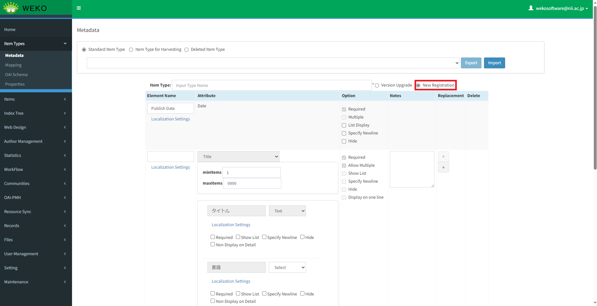

3.  Enter an item type name in the area next to "Item Type".

zu0402040.tif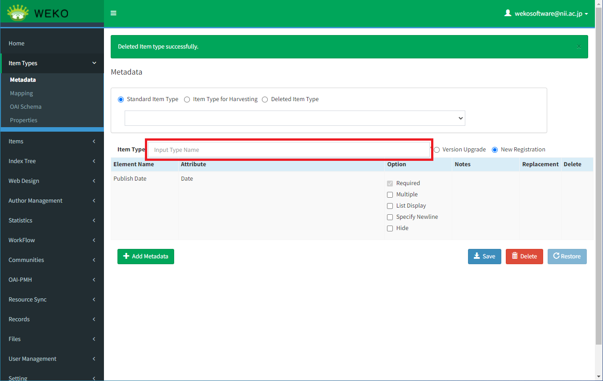

4.  To add a metadata attribute, click "Add Metadata".

An empty metadata attribute is added.

zu0402050.tif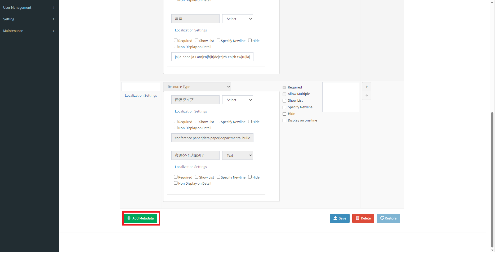

5.  Click "Save".

The item type is saved.

If you do not enter an item type name, the error message "Item type name is blank" appears when you click "Save".

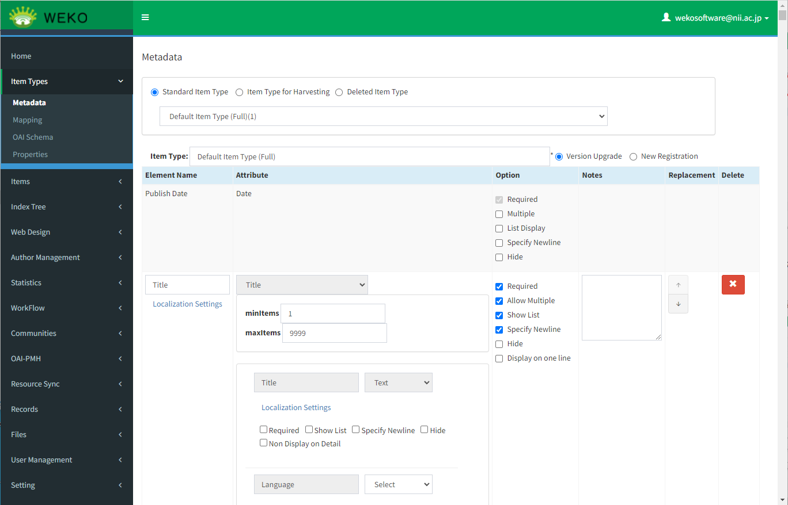

> The newly created item type name is suffixed with "(1)" in the "Standard Item Type" list.
> 
> "Publish Date" is always displayed as a default element. Since this is a required field on the item registration screen, the option "Required" is checked and cannot be changed.

### Copy item types

This section explains how to copy a specified item type.

1.  > Select an item type.
    
    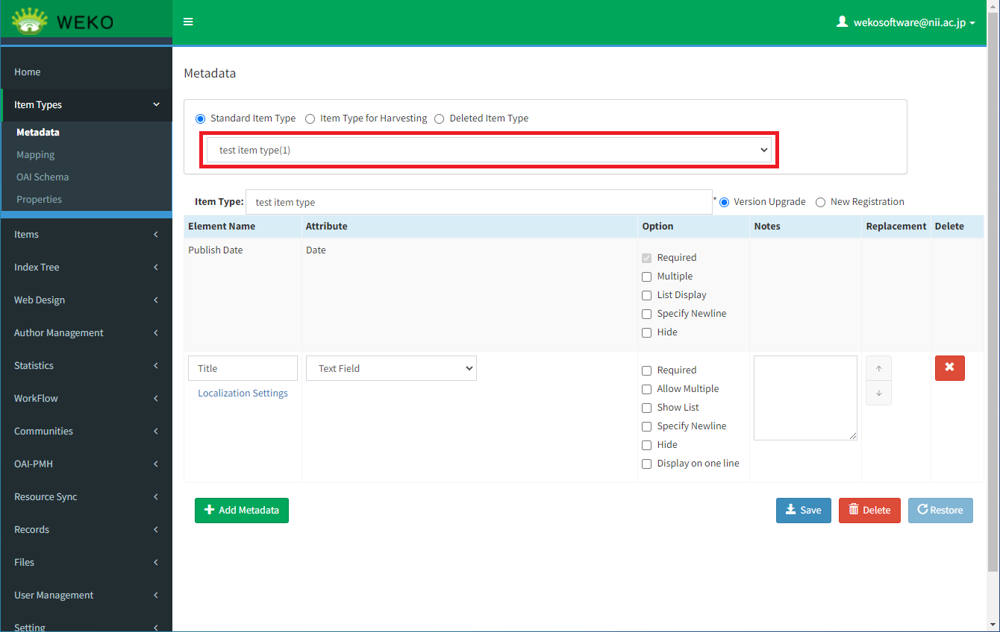

2.  > Check the "New Registration" radio button.

> 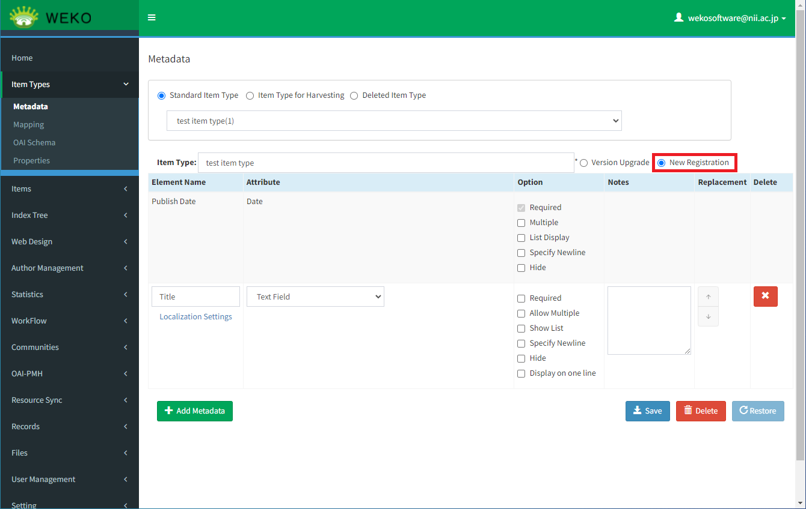

3.  > Enter an item type name.
    
    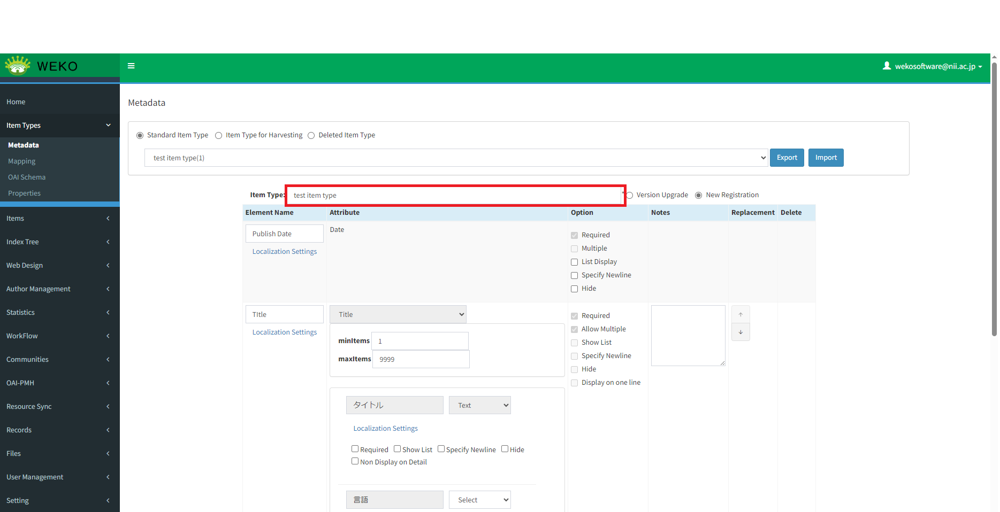

4.  > Click "Save".

> The item type is copied.

1.  ### Edit item types
    
    1.  #### Edit metadata element names

This section explains how to edit a metadata element name.

1.  Select an item type.

The metadata elements of the item type appear.

\* You cannot modify the properties set for the item types (i.e. they appear inactive).

zu0402060.tif

2.  In the "Element Name" column for this metadata element, click "Localization Settings".
    
    The input area for multilingual element names appears.
    
    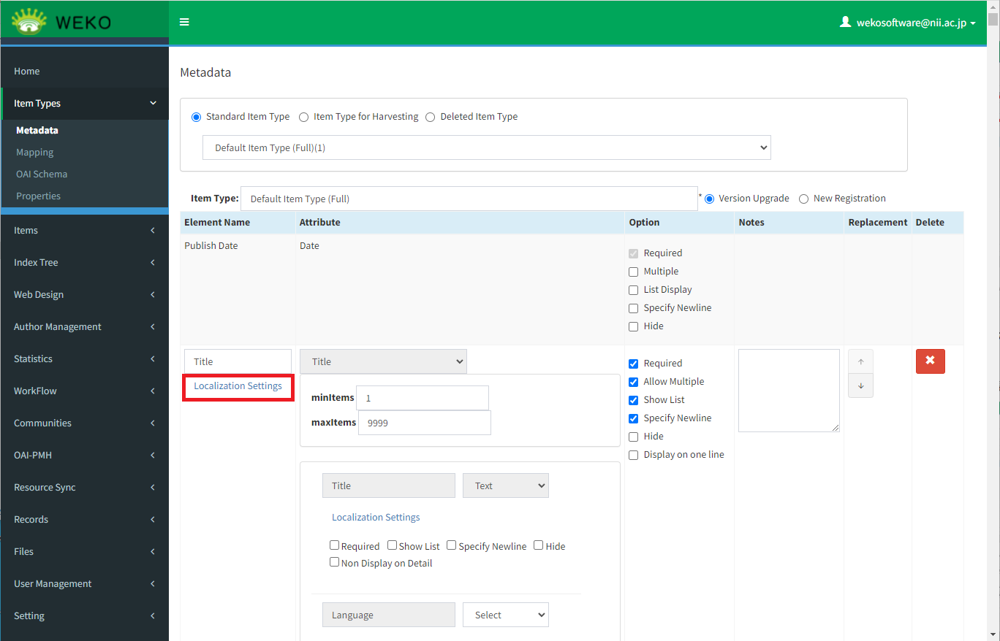

3.  Edit the multilingual settings of the element.
    
    The specified element name appears in the item registration/edit screen and the item detail screen. The supported languages are Japanese and English. If the system language is Japanese, the element name specified in "Japanese" appears. If the system language is set to other than Japanese, the element name specified in "English" appears.
    
    If you leave these settings blank, the element name set in this screen appears regardless of the language setting for display.
    
    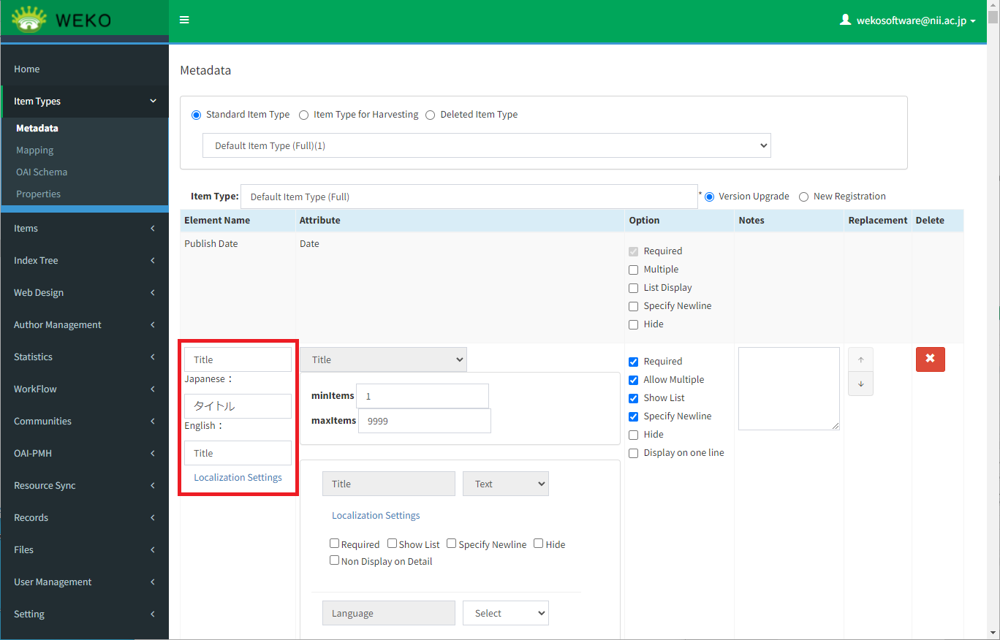

4.  Click "Localization Setting" in the "Attribute" column for this metadata element.
    
    The input area for multilingual child element names appears.
    
    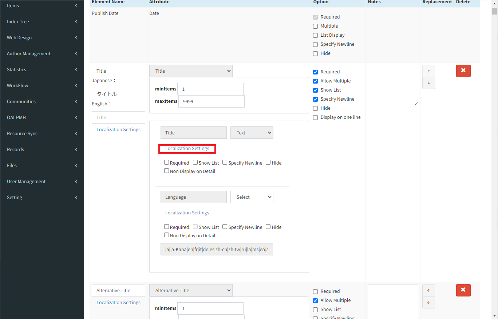

5.  Edit the multilingual settings of the child element.
    
    The specified information appears in the item registration/edit screen and the item detail screen.
    
    The supported languages are Japanese and English. If the language setting for WEKO3 is set to Japanese, the child element name specified in "Japanese" appears. If it is set to other than Japanese, the child element name specified in "English" appears.
    
    If you leave these child element names blank, the child element name set in the "Properties" screen appears.
    
    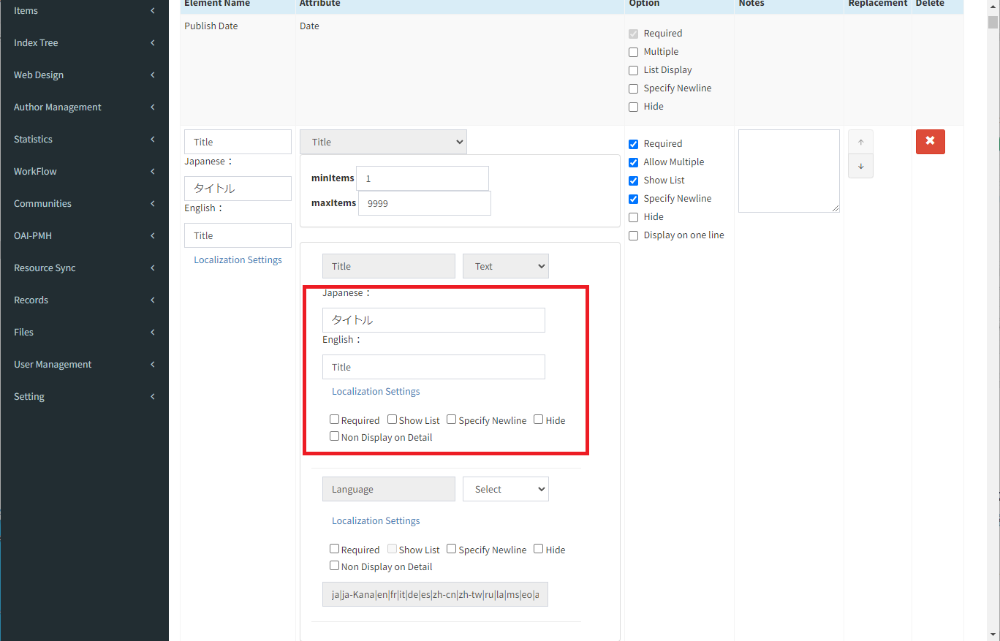

6.  > Click "Save".
    
    The information you edited is saved to the item type.
    
    1.  #### Edit metadata attributes

This section explains how to add an attribute and rearrange the display order of elements.

1.  > Select an item type.

The metadata elements of the item type appear.

zu0402060.tif

2.  > Below the metadata elements at the bottom of the screen, click "+Add Metadata".

An element is added.

zu0402070.tif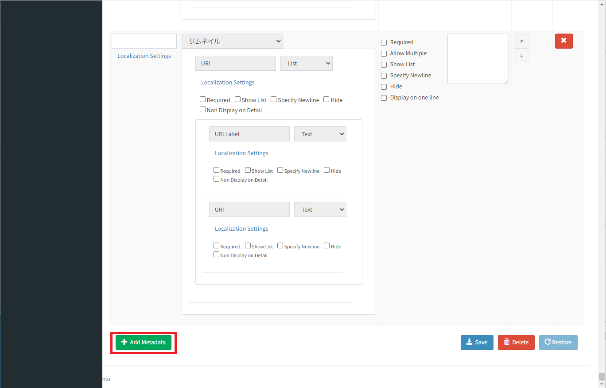

3.  > Click "X".
    
    Click the "X" button to delete the metadata element.
    
    

4.  > Edit the input format for a child element of this metadata element.
    
    If the input format of a child element is set to "Select", "Radios", or "Checkboxes", you can change the input format in the "Metadata" screen.
    
    You can change the input format to "Select", "Radios", or "Checkboxes". For information on the input format settings, see "Table 2-1. Input formats for metadata attributes".
    
    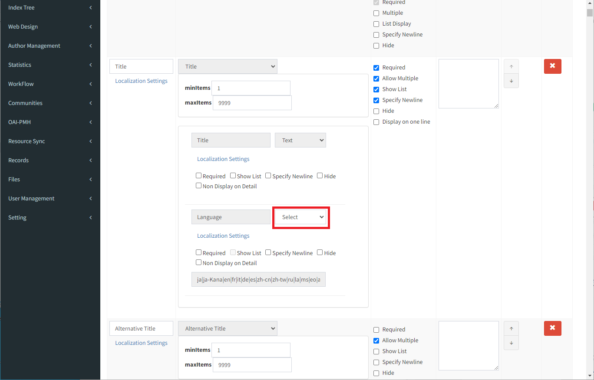

5.  Edit the choices for a child element of this metadata element.
    
    If you have specified "editAble":true in the "Properties" screen, you can edit the setting in this screen.
    
    If you do not specify "editAble":true, the input area for the choices appears inactive.
    
    For information on the setting of "editAble":true, see the notes in "Section 2.1.1. Add Properties".
    
    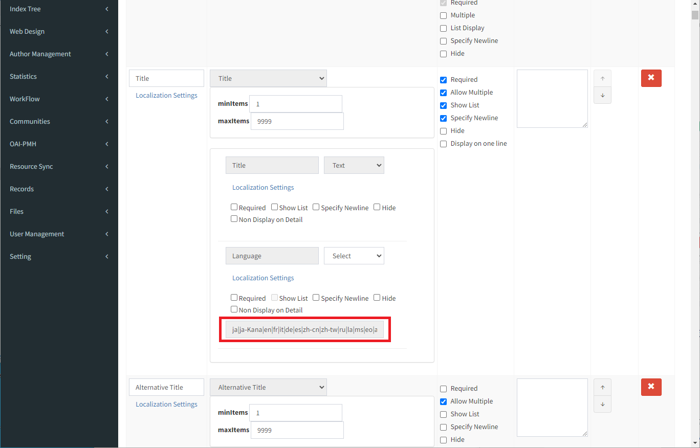

6.  Edit the options for a metadata element.
    
    You can specify options for an element by checking one or more of the "Required", "Allow Multiple", "Show List", "Specify Newline", or "Hide" checkboxes in the "Option" column.
    
    The options also appear directly under the child element. You can check one or more of the "Required", "Show List", "Specify Newline", or "Hide" checkboxes.

> \<TBLATT POSITION="1" SCALE="151"\>

Table 2‑3. Elements available in "Option"

| Option          | Description                                                                                              |
| --------------- | -------------------------------------------------------------------------------------------------------- |
| Required        | Displays "" during item registration and makes it a required metadata entry. |
| Allow Multiple  | Displays "+New" during item registration and allows multiple metadata entries.                           |
| Show List       | Displays metadata elements in the item list screen in a comma-separated form.                            |
| Specify Newline | Displays metadata elements in the item list screen in multiple lines with line breaks.                   |
| Hide            | You can hide metadata details in the index, keyword search results, and item details.                    |

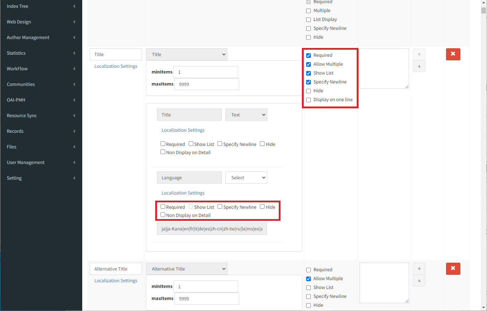

> For information on the prioritization of options for parent and child elements, see "Table 2-4. Prioritization of options".
> 
> Table 2-4. Prioritization of options
> 
> Legend: 〇: Checked, -: Unchecked

| Parent element | Child element | Option                                                                 |
| -------------- | ------------- | ---------------------------------------------------------------------- |
| 〇              | \-            | Applied to the entire child elements.                                  |
| \-             | 〇             | Applied only to a specified child element.                             |
| 〇              | 〇             | Works the same way as when the option is selected only for the parent. |

7.  > Rearrange the display order of elements.
    
    Click the "↑" or "↓" button to move up or down the position of a metadata attribute in the input area.
    
    The "↑" button is disabled for the element shown at the top. The "↓" button is disabled for the element shown at the bottom.
    
    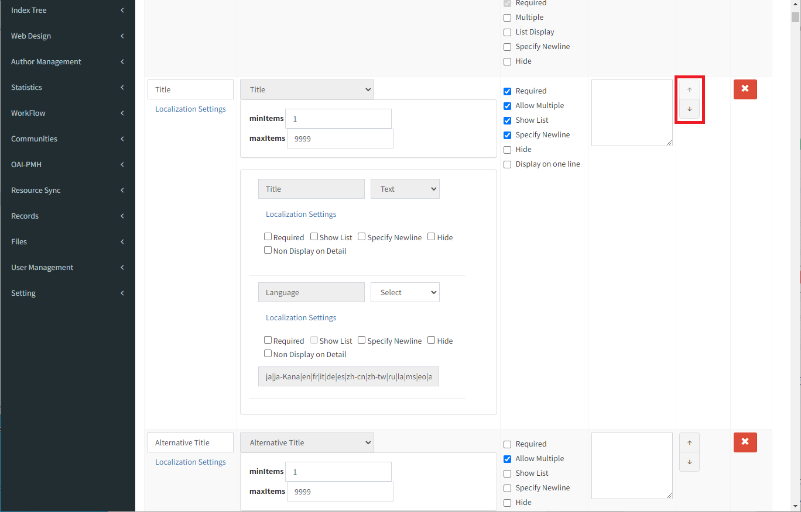

8.  > Click "Save".

The information you edited is saved to the item type.

> Additional Information:
> 
> You can control whether the item type version needs to be upgraded or kept in the configuration file.
> 
> If the item type version is configured to be kept, your changes will be saved without upgrading the version.
> 
> Even if the item type version is configured to be upgraded, the operations below will not be affected, and the version will be kept.

  - > Change the options.

  - > Rearrange the display order of elements.

  - > Edit the note in the "Notes".

  - > Keep the version and click "Save".

> You can change the properties of an item type only if the change is between a Text property and a Textarea property.
> 
> For the following child elements for the properties, "Separate options with the | character" is displayed. These elements do not control information in the "Properties" screen. The choices are automatically populated when you register/edit items.

  - > Creator properties: "Creator Identifier Scheme"

  - > Contributor properties: "Contributor Identifier Scheme"

  - > Rights holder properties: "Rights Holder Identifier Scheme"

  - > File information properties: "Date Type", "Group", and "License"

> "Creator Identifier Scheme", "Contributor Identifier Scheme", and "Rights Holder Identifier Scheme" appear when registering/editing items. These choices refer to "Scheme" in the "ID Prefix" tab of the Author Management \> Edit screen.

### Rename item types

This section explains how to rename an item type.

1.  Select an item type.

The name appears in the area next to "Item Type". Make sure that "Version Upgrade" is checked.

zu0402060.tif

2.  Rename the item type name.

zu0402090.tif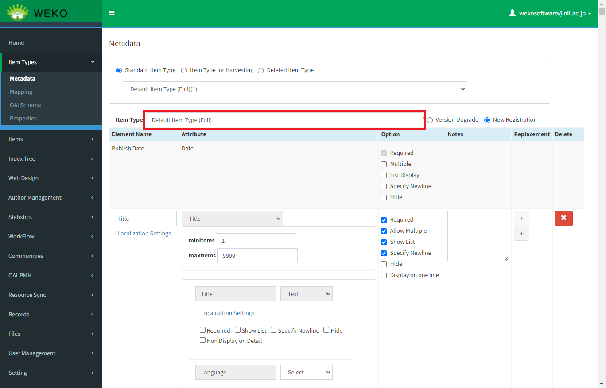

3.  Click "Save".

The new name of the item type is saved.

### Delete item types

This section explains how to delete an item type.

NotesNotes:

You cannot create a new item using a deleted item type.

1.  Select an item type.

The name appears in the area next to "Item Type".

zu0402060.tif

2.  Click "Delete".
    
    You are prompted to confirm the deletion.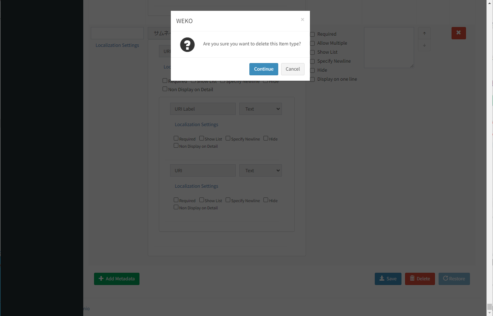

> Notes:
> 
> You cannot delete item types for harvesting. If you click "Delete" for these item types, "Cannot delete item type for harvesting" appears.

3.  Click "Continue".

The item type is deleted.

> Notes:
> 
> You cannot delete a standard item type if it is already used for registered items. If you try and click "Continue", a message appears stating that you cannot delete it because it is used for items.
> 
> 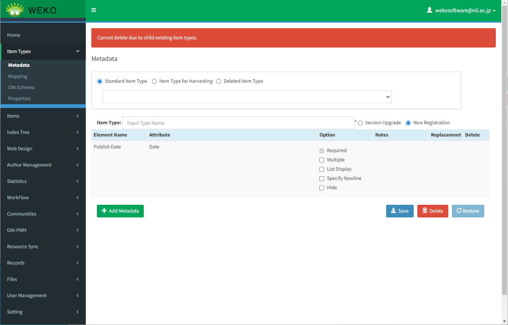

### Restore item types

This section explains how to restore a deleted item type. This operation can be performed only by the system administrator.

1.  Select "Deleted Item Type".

zu0402130.tif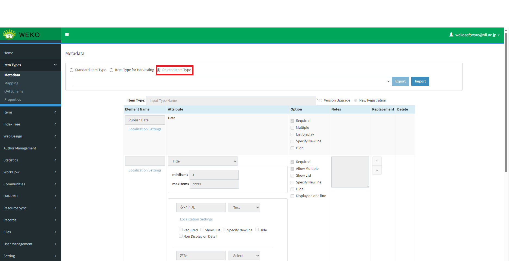

2.  Select an item type.

The metadata elements of the item type appear. Note that the elements and buttons appear inactive.

zu0402140.tif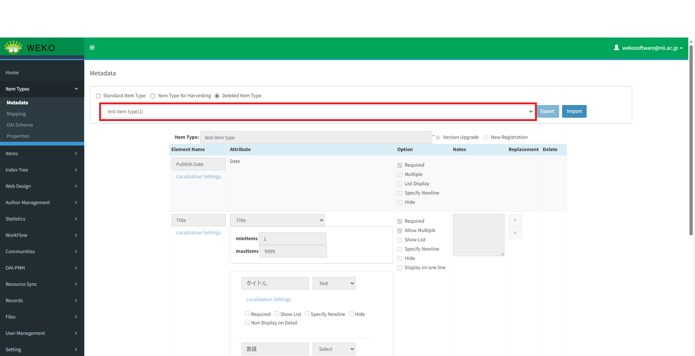

3.  Click "Restore".

The item type is restored.

The restored item type is added to the "Standard Item Type" list.

## LINKID=setoaischema【参照先】Set up OAI schemas

To access the \<INDEXWORD PRONOUNCE="oaischema" INDEXITEM="OAI Schema"\>OAI Schema\</INDEXWORD\> screen, click "Item Types" and then click "OAI Schema". This screen lists the schemas used for mapping, and you can add or remove any of the schemas.

### About schemas that support mapping

The WEKO3 system can provide metadata supported by other external systems using metadata harvesting protocols such as OAI-PMH or BIBTEX.

To link item metadata to protocol elements, you need to know what information each piece of metadata has.

Set the following schema associations and languages for each metadata attribute of an item type.

  - JPCOAR

  - Dublin Core

  - DDI
    
    \<INDEXWORD PRONOUNCE="jpcoar" INDEXITEM="JPCOAR"\>
    
    The metadata serving capabilities generate metadata output based on the mapping information for the item type. For detailed terminology, refer to the respective official Websites of these schemas.
    
    1.  ### Add schemas

The WEKO3 system supports adding and configuring JPCOAR, Dublin Core, and DDI schemas.

1.  Click "+Add Schema".

The setting screen appears.

zu0403010.tif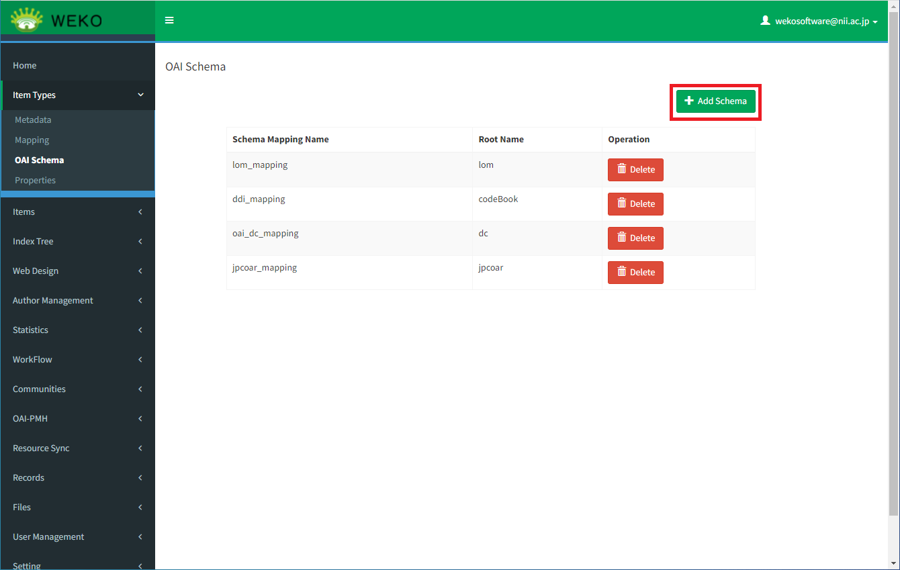

2.  Add a schema mapping file and specify information in the required fields.

zu0403020.tif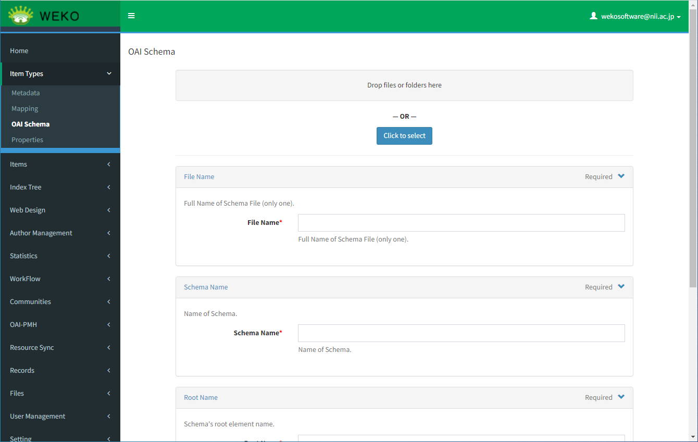

Notes:

For "Schema Name", you must specify the following schema names to generate OAI-PMH output.

  - Dublin Core schema: oai\_dc

  - JPCOAR schema: jpcoar

  - DDI schema: ddi

> For "Root Name", you need to specify the following schema names.

  - Dublin Core schema: dc

  - JPCOAR schema: jpcoar

  - DDI schema: codeBook

<!-- end list -->

3.  Click "Save".

The schemas are added.

### Delete schemas

1.  Click "Delete".

The schema is deleted.

zu0403030.tif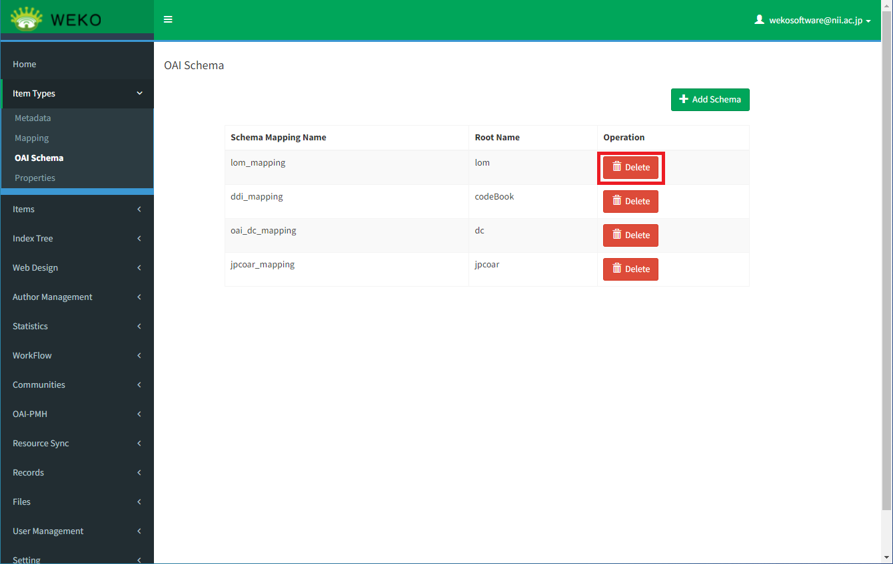

1.  ## LINKID=mapitemtypetoschema【参照先】Map item types to schemas
    
    1.  ### \<INDEXWORD PRONOUNCE="あいてむたいふをまつひんく" INDEXITEM="アイテムタイプをマッピング"\>\</INDEXWORD\>Map item types

This section explains how to map an item type to a schema. You first need to add the schema before starting this operation. For information on adding schemas, see "ANCHORID=setoaischema【参照元】Section 2.3. Set up OAI schemas【E】".

To access the screen where you can edit mapping, click "Item Types" and then click "Mapping".

The mapping information set in this screen is referenced when generating OAI-PMH output in the item detail screen.

1.  > Select an item type for "Item Type (Source)" and a schema for "Schema (Target)".

The values appear in "Element (Parent)" and "Schema (Parent)".

zu0401010.tif

2.  > Select an attribute for "Schema (Parent)" from the pull-down list to be mapped to "Element (Parent)", or check the radio button on the left in "Schema (Parent)".

> The child attributes appear.

zu0401020.tif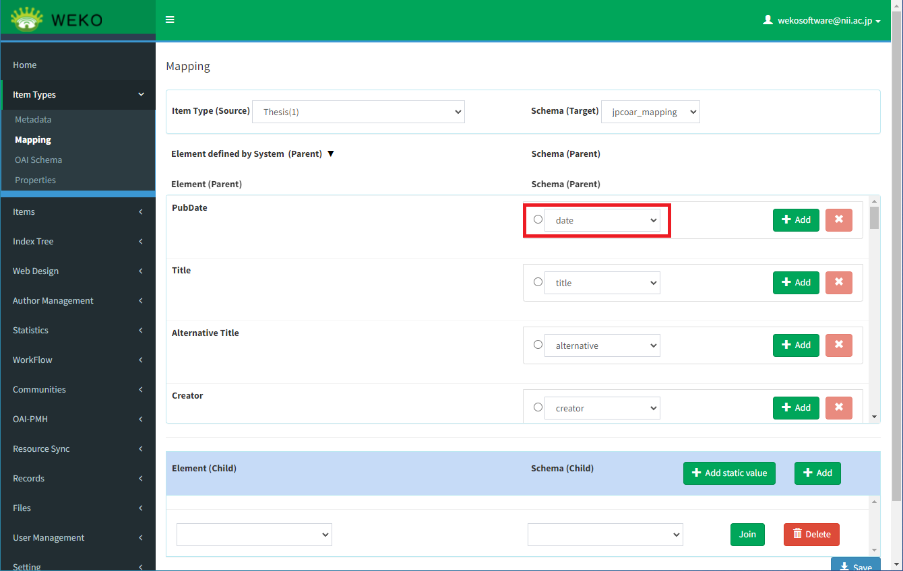

3.  > Select an attribute for "Schema (Child)" from the pull-down list.

zu0401030.tif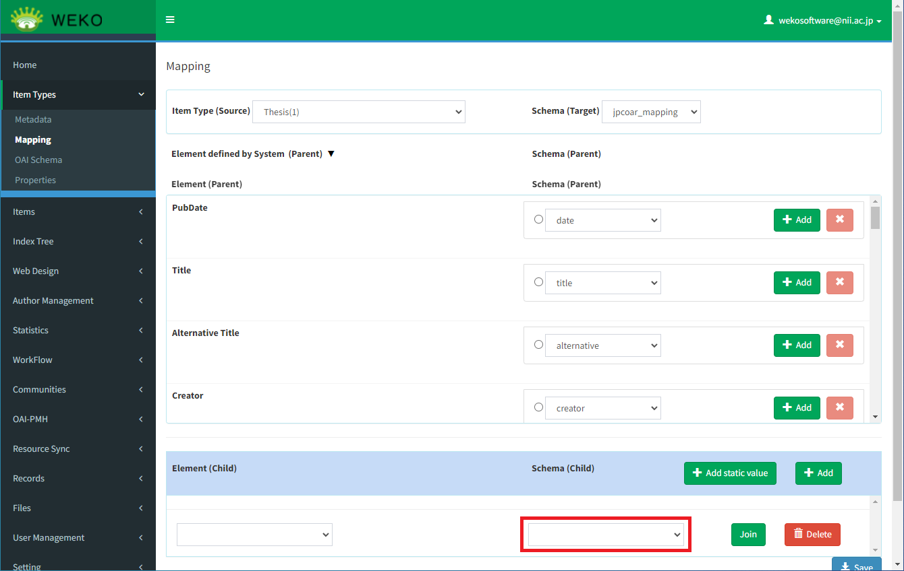

4.  > To add an attribute, click "+Add".

An element is added.

zu0401040.tif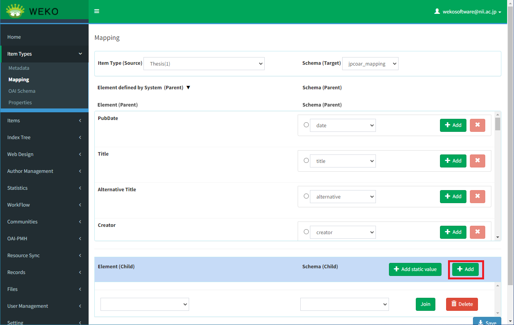

5.  > Click "Save".

The information you specified is saved.

6.  > If you want to map multiple child properties to a single child element, click "Join".

You can map multiple child properties to a single child element by inserting a comma (,) in the input field.

> 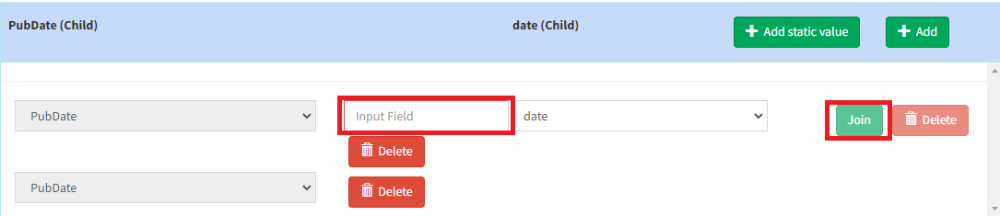

### Map an item type added by the System

1.  > Select an item type for "Item Type (Source)" and a schema for "Schema (Target)".

The values appear in "Element (Parent)" and "Schema (Parent)".

> zu0401010.tif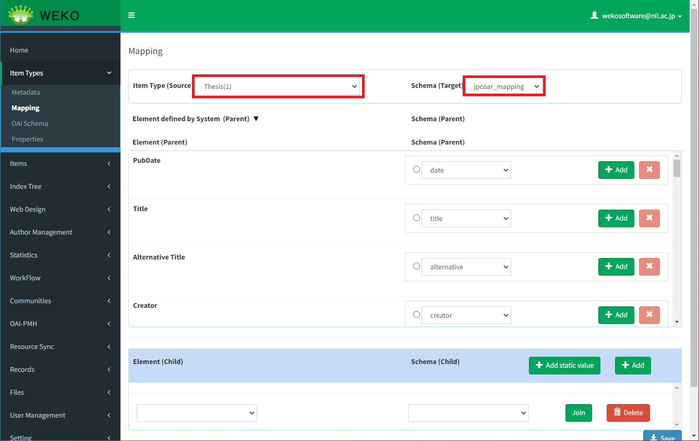

2.  > Click "Element defined by System (Parent)".
    
    The mapping area for "Element defined by System (Parent)" appears.
    
    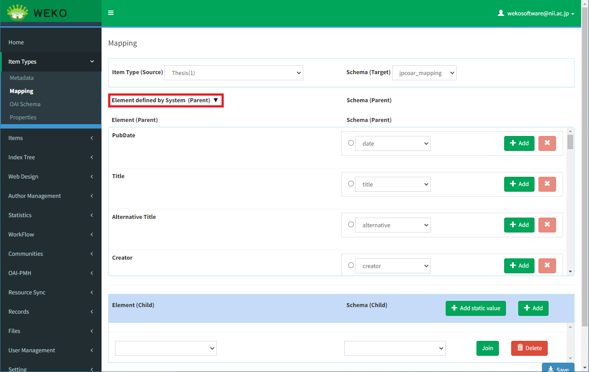

3.  > Select an attribute for "Schema (Parent)" from the pull-down list to be mapped to "Persistent Identifier (DOI)", then check the radio button on the left in "Schema (Parent)".

> The child attributes appear.
> 
> 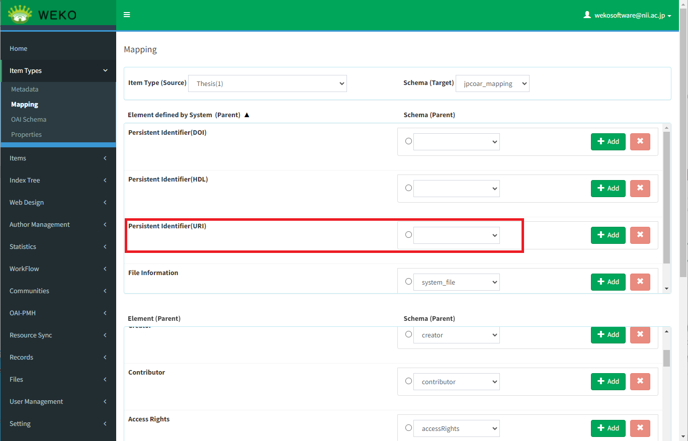

4.  > Select an attribute for "Schema (Parent)" from the pull-down list to be mapped to "File Information", then check the radio button on the left in "Schema (Parent)".

> For a file URL to generate OAI-PMH output for "File Information", you need to set up a mapping to "system\_file" for the JPCOAR schema (parent), along with a mapping to "Information" or "Billing File Information" in "Item Type (Parent)".
> 
> 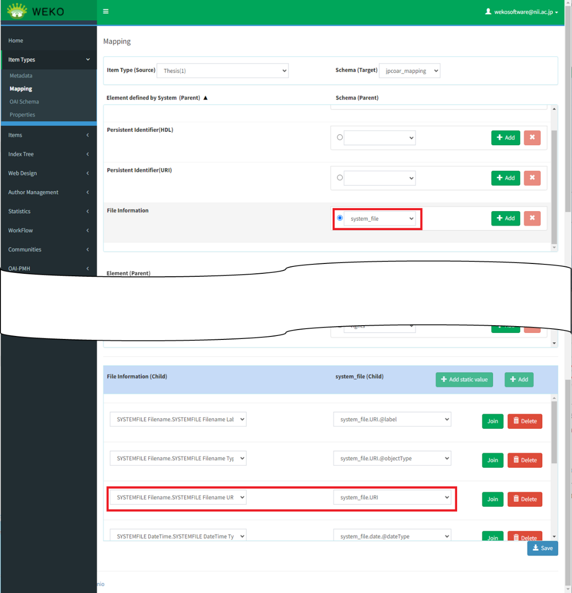

5.  > Click "Save".

> The information you specified is saved.

Notes:

If you want to map the same schema to different properties, you need to set up the same mappings for all those properties, including the Schema (child). If the same mappings are not used, the message "Duplicate mapping as below" will be displayed, and you cannot save the mapping information.

# Items

This chapter provides information on how to manage items.

## Bulk update with a license or an embargo

This section explains how to bulk update the file attributes of items belonging to the index with a license or an embargo.\<INDEXWORD PRONOUNCE="らいせんす" INDEXITEM="ライセンス"\>\</INDEXWORD\>\<INDEXWORD PRONOUNCE="えんはあこ" INDEXITEM="エンバーゴ"\>\</INDEXWORD\>

1.  Click "Items", and then click "Bulk Update".

A screen appears where you can bulk update items.

2.  In the "Index Tree", select the index you want to bulk update the items.

zu0502010.tif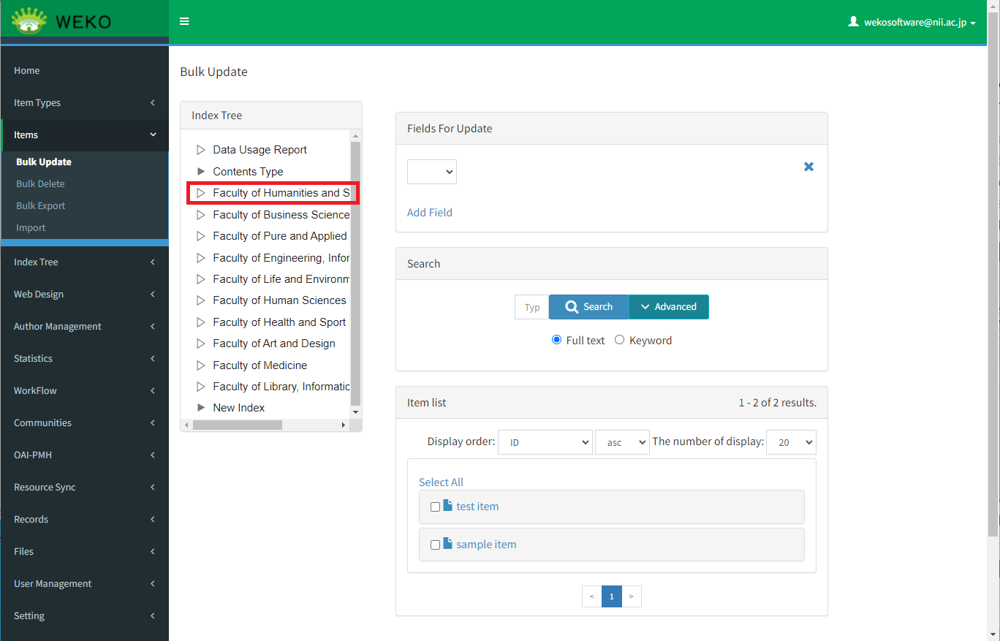

3.  Under "Fields for Update", select "Access Type" or "Licence".

An input field appears.

zu0502020.tif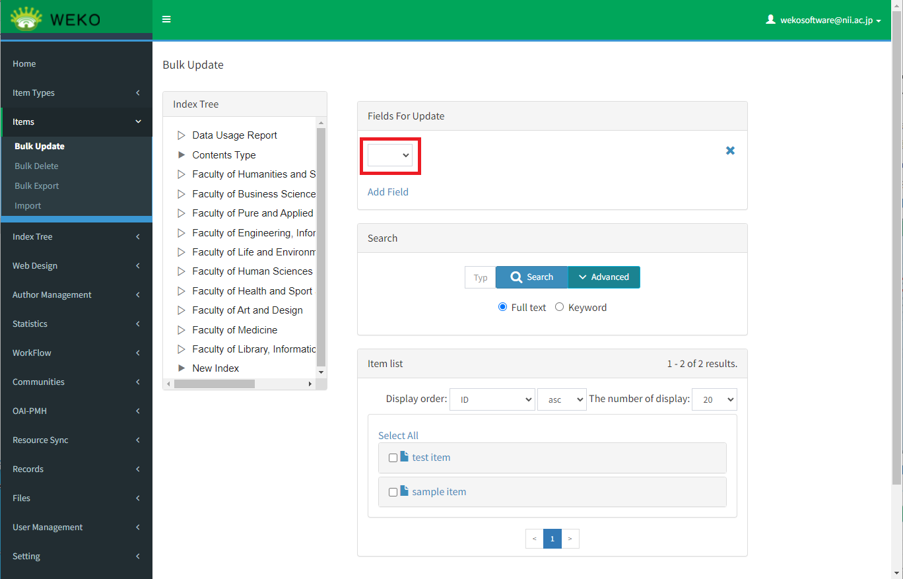

4.  Specify a value.

zu0502030.tif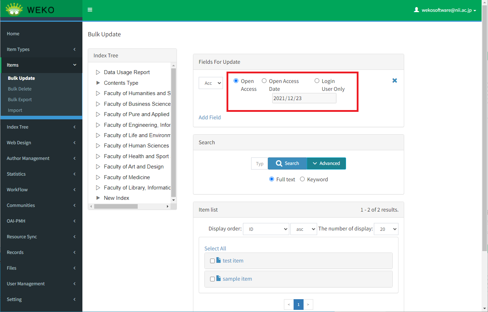

5.  In the "Item list", select the item you want to update.

If you want to select all items, click "Select All". To select individual items, select the corresponding check boxes.

zu0502040.tif

6.  Click "Update".

The confirmation dialog appears, showing how the selected items will be updated.

zu0502050.tif

7.  Click "Continue".

The information of the items displayed in the confirmation dialog is updated. The versions of these items are also updated.

> 

## LINKID=customsorting【参照先】LINKID=Importitems【参照先】Bulk delete items

This section explains how to \<INDEXWORD PRONOUNCE="あいてむをいつかつさくしよ" INDEXITEM="アイテムを一括削除"\>bulk delete items\</INDEXWORD\>.

1.  Click "Items", and then click "Bulk Delete".
    
    A screen appears where you can bulk delete items.

2.  In the "Index Tree", select the index you want to bulk delete the items.

> Clicking "Delete items of child index recursively" will delete items belonging to child indexes recursively.
> 
> 

3.  Click "Delete".
    
    The items are bulk deleted.
    
    When the items are deleted, all the previous versions will also be logically deleted.
    
    

zu0501020.tif

## Export items

This section explains how to bulk export items.

1.  Click "Items", and then click "Bulk Export".
    
    A screen appears where you can export items.


2.  To proceed, click "Export".
    
    When you click "Export", a confirmation dialog box will appear asking if you want to export all items. Select a button displayed in the dialog box.
    
    
    
    1.  #### If you select "Execute":
        
        Bulk export will be executed.
        
        If the process is executed successfully, the URL for the download appears on the screen.
        
        Click on the URL to download the zip file (export-all.zip).
        
        The exported file is structured as follows.
        
        
        
        A tsv file will be generated for each item type in the \<ItemTypeName (ItemTypeID)\> format. The content file for each item will not be generated.
        If the number of items to be exported within an item type exceeds a certain threshold, the TSV file will be split accordingly. In such cases, the file name will follow the format \<ItemTypeName (ItemTypeID).part(partNo)\>.
    
    2.  #### If you select "Cancel":
        
        The confirmation dialog will close without bulk exporting the items.
        
        While another user is performing the export operation, the "Export" button will be inactive, and you cannot click it.

3.  If you do not want to proceed with the operation, click "Cancel".
    
    The initial state of the button is set to inactive. While the export operation is in progress, the button becomes active, and you can click it.
    
    When you click "Cancel", a confirmation dialog box will appear asking if you want to cancel the bulk export operation. Select a button displayed in the dialog box.
    
    

<!-- end list -->

1)  If you select "Execute":
    
    You will close the confirmation dialog without bulk exporting the items.

2)  If you select "Cancel":
    
    The confirmation dialog will close without cancelling the bulk export.

The following temporary file is generated when creating the export file.

/home/invenio/.virtualenvs/invenio/var/instance/data/tmp/weko\_export\_xxxxxxxx

## Import items

This section explains how to import items by specifying a file. You import files in a zip file. A zip file for the imported items contains tsv files for item types and content files, organized under the data folder. The following steps explain the details of the operation.

1.  Click "Items", and then click "Import".

The "Select" tab is where you can start importing items.

> zu0504010.tif
> 
> If the "Administration" \> "Items" \> "Import" screen opens on another device while you are trying to import, the message "Import is in progress on another device" will appear on that device.
> 
> If the "Administration" \> "Items" \> "Import" screen opens on the same device on which you are trying to import, the message "Import is in progress" will appear. This situation happens when, for instance, the screen opens in a different browser, or you navigate from the "Result" tab back to the "Import" tab.

2.  Select an item type from the "Item Type" drop-down list, and click "Download".  
    The header information for the selected item type will be downloaded in the tsv format. The filename will be *\<item\_type\_name (item\_type\_ID)\>.tsv*.
    
    
    
    Notes:
    
    If the item type list cannot be retrieved, the message "Failed to get item type list" will appear.
    
    If an error occurs when downloading an item type, the error message "Failed to download" will appear.

Table 3‑1. The content of the downloaded item type template

<table>
<thead>
<tr class="header">
<th>Row</th>
<th>Description</th>
</tr>
</thead>
<tbody>
<tr class="odd">
<td>Row 1</td>
<td>
Displays an item type name.

<ul>
<li>
Column 1: #ItemType (fixed)
</li>
<li>
Column 2: Displays an item type name.
</li>
<li>
Column 3: Displays the URL of the jsonschema for the item type.
</li>
</ul></td>
</tr>
<tr class="even">
<td>Row 2</td>
<td>
Displays the internal key for each metadata element.

The following elements will be generated.

<ul>
<li>
ID
</li>
<li>
URI
</li>
<li>
IndexID##
</li>
<li>
POS_INDEX##
</li>
<li>
FEEDBACK_MAIL
</li>
<li>
PUBLISH_STATUS
</li>
<li>
CNRI
</li>
<li>
DOI_RA
</li>
<li>
DOI
</li>
<li>
EDIT_MODE
</li>
<li>
Metadata defined for the item type
</li>
</ul></td>
</tr>
<tr class="odd">
<td>Row 3</td>
<td>
Displays the label for each metadata element.

<ul>
<li>
Following the metadata hierarchy, labels for different layers are concatenated with ".".
</li>
<li>
For repeatable elements, suffix the label with #&lt;sequential_number (starting at 1)&gt;.
</li>
</ul></td>
</tr>
<tr class="even">
<td>Row 4</td>
<td>"System" is displayed for the elements that the user cannot edit in the item registration screen (i.e. configured automatically).</td>
</tr>
<tr class="odd">
<td>Row 5</td>
<td>
Displays the option information configured for each item type element.

The options are "Required", "Hide", and "Allow Multiple".
</td>
</tr>
</tbody>
</table>

For elements other than the metadata files defined for item types, see the "Supplemental Information" at the end of this chapter.

3.  Click "Select File" to specify a zip file.

> The filename appears.
> 
> 
> 
> There are two directory structures used for import.

  - The directory structure that includes a bagit.txt file  
    

  - The directory structure that does not include a bagit.txt file  
    

> You can include multiple tsv files for different item types in a single import operation.zu0504020.tif

4.  To import with the "Change Identifier Mode" option:

<!-- end list -->

1)  > Click "Change Identifier Mode".
    
    

2)  > Click "Next".
    
    A disclaimer appears in the "Change Identifier Mode" dialog box.

3)  > Click "I agree to the terms of use" and then click "OK".  
    > The file is loaded and checked, and the "Import" tab appears. The "Import" tab displays the check results on the loaded file.  
    > 

4)  > Make sure that the results displayed under "Check Result" are either "Register" or "Update".

The message "Register with \[Change Identifier Mode\]" appears above the "Import" button.

Items with "Error" results cannot be imported. Check the file and start again from Step 2.

> 

zu0504030.tif\<TBLATT POSITION="1" SCALE="151"\>

Table 3‑2. The elements on the "Import" tab

<table>
<thead>
<tr class="header">
<th>Element</th>
<th>Description</th>
</tr>
</thead>
<tbody>
<tr class="odd">
<td>Import</td>
<td>Registers the items included in the loaded file.</td>
</tr>
<tr class="even">
<td>Download*</td>
<td>
Downloads the items listed on the screen in tsv format.

<ul>
<li>
The character code is UTF-8 without BOM, and the line feed code is CR+LF.
</li>
<li>
The filename will show the download date in the "check_<em>YYYY</em>- <em>MM</em>-<em>DD</em>.tsv" format.
</li>
</ul></td>
</tr>
<tr class="odd">
<td>Summary</td>
<td>
Shows information on the file.

<ul>
<li>
Total: The total number of items included in the file.
</li>
<li>
New Item: The number of items that will be newly registered.
</li>
<li>
Update Item: The number of items that will be updated.
</li>
<li>
Result Error: The number of items that resulted in an error after the checking.
</li>
</ul></td>
</tr>
<tr class="even">
<td>No.</td>
<td>Shows the serial number of each item included in the file.</td>
</tr>
<tr class="odd">
<td>Item Type</td>
<td>Shows the name of the item type to be registered for the item.</td>
</tr>
<tr class="even">
<td>Item ID</td>
<td>
Shows whether this import will be a new registration or an update.

<ul>
<li>
New Item: Registers the item as new.
</li>
<li>
Item ID: Updates the item with new content.
</li>
</ul></td>
</tr>
<tr class="odd">
<td>Title</td>
<td>Shows the name of the item.</td>
</tr>
<tr class="even">
<td>Check Result</td>
<td>
Shows the check result, stating if the item can be imported or not.

<ul>
<li>
Error: XXXXX - There is a validation error.
</li>
<li>
Warning: XXXXX - There is a validation warning.
</li>
<li>
Register - This is a new item.
</li>
<li>
Update - This is an update.
</li>
</ul></td>
</tr>
</tbody>
</table>

> \* Notes:

If an error occurs when downloading, the error message "Failed to download" will appear.

Table 3‑3. Validation check results associated with the tsv format

<table>
<thead>
<tr class="header">
<th>Type</th>
<th>English</th>
<th>Japanese</th>
<th>Description</th>
</tr>
</thead>
<tbody>
<tr class="odd">
<td>Error</td>
<td>There is an error in the format of the first line of the header of the TSV file.</td>
<td>TSVファイルのヘッダ１行目の形式に誤りがあります。</td>
<td>The first line of the tsv file has incorrect formatting (e.g. it contains invalid characters).</td>
</tr>
<tr class="even">
<td>Error</td>
<td>Cannot read tsv file correctly.</td>
<td>tsvファイルが正しく読み込めません。</td>
<td>The tsv file contains line feeds.</td>
</tr>
<tr class="odd">
<td>Error</td>
<td>The item does not consistent with the specified item type.</td>
<td>指定されたアイテムタイプと項目が一致しません。</td>
<td>The specified item does not match the item type to be imported (the item is missing).</td>
</tr>
<tr class="even">
<td>Warning</td>
<td>The following items are not registered because they do not exist in the specified item type. {}</td>
<td>次の項目は指定されたアイテムタイプに存在しないため登録されません。{}</td>
<td>The specified item does not match the item type to be imported (the item needs to be added).</td>
</tr>
<tr class="odd">
<td>Error</td>
<td>The format of the specified file {} does not support import. Please specify a zip format file.</td>
<td>指定されたインポートファイル{}の形式はインポートに対応していません。zip形式のファイルを指定してください。</td>
<td>The specified compressed file is not a zip file.</td>
</tr>
<tr class="even">
<td>Error</td>
<td>The TSV file was not found in the specified file {}. Check if the directory structure is correct.</td>
<td>指定されたインポートファイル{}にTSVファイルが見つかりませんでした。ディレクトリ構成が正しいか確認してください。</td>
<td>
A tsv file is not found in the specified compressed file (the folder structure is wrong).

The tsv file must be placed under the data folder. The folder structure needs to be as follows.

xxxxx.zip

└data

　└{ItemType name(ItemType ID)}.tsv

* {ItemType name(ItemType ID)} is specified as the item type name and the item type ID.
</td>
</tr>
<tr class="odd">
<td>Error</td>
<td>The TSV file could not be read. Ensure the file format is TSV and that the file is UTF-8 encoded.</td>
<td>TSVファイルを読み込めませんでした。ファイル形式がTSVであること、またそのファイルがUTF-8でエンコードされているかを確認してください。</td>
<td>The tsv file is not in the correct format, or it is not encoded in UTF-8.</td>
</tr>
<tr class="even">
<td>Error</td>
<td>The item type ID specified in the TSV file does not exist.</td>
<td>TSVファイルで指定されたアイテムタイプIDは存在しません。</td>
<td>The specified item type does not exist.</td>
</tr>
<tr class="odd">
<td>Error</td>
<td>Cannot register because the specified item type is not the latest version.</td>
<td>指定されたアイテムタイプが最新のバージョンでないため登録できません。</td>
<td>The specified item type is not supported for import (i.e. it is not the latest version)</td>
</tr>
<tr class="even">
<td>Error</td>
<td>The file specified in (.file_path [#]) does not exist.</td>
<td>（.file_path[#]）に指定したファイルが存在しません。</td>
<td>The file does not exist in the path specified upon new registration.</td>
</tr>
<tr class="odd">
<td>Error</td>
<td>The file name specified in file_path[#] and {} do not match.</td>
<td>.file_path[#]に指定されたファイル名と{}が一致しません。</td>
<td>The filename specified in the file path does not match the filename set in the metadata.</td>
</tr>
<tr class="even">
<td>Warning</td>
<td>The file specified in (.file_path [#]) does not exist.The file will not be updated. Update only the metadata with tsv contents.</td>
<td>file_path[#]）に指定したファイルが存在しません。ファイルの更新はしません。tsv内容でメタデータのみ更新します。</td>
<td>The file does not exist in the path specified upon update.</td>
</tr>
<tr class="odd">
<td>Error</td>
<td>Internal server error</td>
<td>サーバ内部エラー</td>
<td>A runtime error occurred (e.g. ElasticSearch locked, server connection not available, or network connection not available).</td>
</tr>
</tbody>
</table>

Table 3‑4. Validation check results not associated with metadata elements

<table>
<thead>
<tr class="header">
<th>Type</th>
<th>Element</th>
<th>English</th>
<th>Japanese</th>
<th>Description</th>
</tr>
</thead>
<tbody>
<tr class="odd">
<td>Error</td>
<td>[ID]</td>
<td>Please specify item ID by half-width number.</td>
<td>アイテムIDは半角数字で指定してください。</td>
<td>Specified content does not exist.</td>
</tr>
<tr class="even">
<td>Error</td>
<td>[ID], [URI]</td>
<td>Specified URI and system URI do not match.</td>
<td>指定されたURIとシステムURIが一致しません。</td>
<td>The item ID and the URI do not match, or characters other than alphanumeric characters or a set of permitted symbols (:/._-) are used.</td>
</tr>
<tr class="odd">
<td>Error</td>
<td>[.IndexID#n]</td>
<td>The specified IndexID does not exist in the system.</td>
<td>指定されたIndexIDはシステムに存在しません。</td>
<td>Specified content does not exist.</td>
</tr>
<tr class="even">
<td>Error</td>
<td>[.POS_INDEX#n]</td>
<td>The specified POS_INDEX does not exist in the system.</td>
<td>指定されたPOS_INDEXはシステムに存在しません。</td>
<td>An IndexID is not specified, and the specified POS_INDEX does not exist.</td>
</tr>
<tr class="odd">
<td>Warning</td>
<td>[.IndexID#n], [.POS_INDEX#n]</td>
<td>Specified POS_INDEX does not match with existing index.</td>
<td>指定されたPOS_INDEXはシステムのものと一致していません。</td>
<td>Combination check: IndexID exists, and POS_INDEX does not match the specified IndexID.</td>
</tr>
<tr class="even">
<td>Error</td>
<td>[.IndexID#n], [.POS_INDEX#n]</td>
<td>The specified IndexID does not exist in the system.</td>
<td>指定されたIndexIDはシステムに存在しません。</td>
<td>Combination check: IndexID does not exist, and POS_INDEX exists.</td>
</tr>
<tr class="odd">
<td>Error</td>
<td>[.IndexID#n], [.POS_INDEX#n]</td>
<td>The specified IndexID, POS_INDEX does not exist in the system.</td>
<td>指定されたIndexID,POS_INDEXはシステムに存在しません。</td>
<td>Combination check: neither the specified IndexID nor POS_INDEX exists.</td>
</tr>
<tr class="even">
<td>Error</td>
<td>[.IndexID#n], [.POS_INDEX#n]</td>
<td>Both of Index ID and POS INDEX are not being set.</td>
<td>IndexID,POS_INDEXがどちらも設定されていません。</td>
<td>Combination check: neither IndexID nor POS_INDEX is specified.</td>
</tr>
<tr class="odd">
<td>Error</td>
<td>[.PUBLISH_STATUS]</td>
<td>{} is required item.</td>
<td>{}は必須項目です。</td>
<td>
The following values are not specified:

{}: PUBLISH_STATUS, DOI_RA, DOI
</td>
</tr>
<tr class="even">
<td>Error</td>
<td>[.PUBLISH_STATUS]</td>
<td>Please set "public" or "private" for PUBLISH_STATUS.</td>
<td>PUBLISH_STATUSはpublic,privateのいずれかを設定してください。</td>
<td>The specified content is invalid (public/private)</td>
</tr>
<tr class="odd">
<td>Error</td>
<td>[.FEEDBACK_MAIL#n]</td>
<td>Specified {} is invalid.</td>
<td>指定された{}が不正です。</td>
<td>
Any of the following values are specified in an invalid format:

{}: Email address format, DOI format
</td>
</tr>
<tr class="even">
<td>Error</td>
<td>[.CNRI]</td>
<td>CNRI cannot be set.</td>
<td>CNRIは設定できません。</td>
<td>CNRI is specified at new registration in the normal mode or set when the CNRI use flag is "False".</td>
</tr>
<tr class="odd">
<td>Error</td>
<td>[.CNRI]</td>
<td>Specified CNRI is different from existing CNRI.</td>
<td>指定されたCNRIは登録済みCNRIと異なっています。</td>
<td>CNRI was changed from the registered content when updating in the normal mode.</td>
</tr>
<tr class="even">
<td>Error</td>
<td>[.CNRI]</td>
<td>Please specify CNRI.</td>
<td>CNRIを設定してください。</td>
<td>CNRI is not set for new registration or update using the Change Identifier Mode.</td>
</tr>
<tr class="odd">
<td>Error</td>
<td>[.CNRI]</td>
<td>Specified Prefix of CNRI is incorrect.</td>
<td>指定されたCNRIのPrefixが誤っています。</td>
<td>Format check: does not match the Prefix registered in the administration panel.</td>
</tr>
<tr class="even">
<td>Error</td>
<td>[.CNRI]</td>
<td>Suffix of CNRI can only be used with half-width alphanumeric characters and half-width symbols "_-.; () /".</td>
<td>CNRIのSuffixは半角英数字、半角記号「_-.;()/」以外使用できません。</td>
<td>Format check: characters other than alphanumeric characters or a set of permitted symbols (_-. ;()/) are used for the CNRI suffix.</td>
</tr>
<tr class="odd">
<td>Error</td>
<td>[.CNRI]</td>
<td>The specified CNRI exceeds the maximum length.</td>
<td>指定された{}が最大長を超えています。</td>
<td>Format check: exceeds the maximum length.</td>
</tr>
<tr class="even">
<td>Error</td>
<td>[.DOI_RA], [.DOI]</td>
<td>DOI cannot be set.</td>
<td>DOIは設定できません。</td>
<td>Combination check: both are specified at new registration in normal mode.</td>
</tr>
<tr class="odd">
<td>Error</td>
<td>[.DOI_RA], [.DOI]</td>
<td>Specified {DOI_RA/DOI} is different from existing {DOI_RA/DOI}.</td>
<td>指定された{DOI_RA/DOI}が登録済みの{DOI_RA/DOI}と異なっています。</td>
<td>Combination check: Changed from the registered content when updating in the normal mode.</td>
</tr>
<tr class="even">
<td>Error</td>
<td>[.DOI_RA], [.DOI]</td>
<td>Please specify DOI_RA.</td>
<td>DOI_RAを設定してください。</td>
<td>Combination check: only DOI is specified at new registration in the Change Identifier Mode.</td>
</tr>
<tr class="odd">
<td>Error</td>
<td>[.DOI_RA], [.DOI]</td>
<td>Please specify DOI.</td>
<td>DOIを設定してください。</td>
<td>Combination check: only DOI_RA is specified at new registration in the Change Identifier Mode.</td>
</tr>
<tr class="even">
<td>Error</td>
<td>[.DOI_RA]</td>
<td>DOI_RA should be set by one of JaLC, Crossref, DataCite, NDL JaLC.</td>
<td>DOI_RAはJaLC,Crossref,DataCite,NDL JaLCのいずれかを設定してください。</td>
<td>Specified content is invalid.</td>
</tr>
<tr class="odd">
<td>Error</td>
<td>[.DOI]</td>
<td>Specified Prefix of DOI is incorrect.</td>
<td>指定されたDOIのPrefixが誤っています。</td>
<td>Format check: does not match the Prefix registered in the administration panel.</td>
</tr>
<tr class="even">
<td>Error</td>
<td>[.DOI]</td>
<td>Suffix of {} can only be used with half-width alphanumeric characters and half-width symbols "_-.; () /".</td>
<td>DOIのSuffixは半角英数字、半角記号「_-.;()/」以外使用できません。</td>
<td>Format check: characters other than alphanumeric characters or a set of permitted symbols (_-. ;()/) are used for the CNRI suffix.</td>
</tr>
<tr class="odd">
<td>Error</td>
<td>[.DOI]</td>
<td>The specified DOI exceeds the maximum length.</td>
<td>指定されたDOIが最大長を超えています。</td>
<td>Format check: exceeds the maximum length.</td>
</tr>
<tr class="even">
<td>Error</td>
<td>[Version]</td>
<td>Please specify either Keep or Upgrade.</td>
<td>Keep、Upgradeのいずれかを指定してください。</td>
<td>Not specified, or the specified information is invalid.</td>
</tr>
<tr class="odd">
<td>Error</td>
<td>[Publish Date]</td>
<td>Please specify PubDate with YYYY-MM-DD.</td>
<td>公開日はYYYY-MM-DDで指定してください。</td>
<td>Format check: YYYY-MM-DD is not used as a format.</td>
</tr>
<tr class="even">
<td>Error</td>
<td>[Publish Date]</td>
<td>'pubdate' is a required property.</td>
<td>'pubdate'は必須項目です。</td>
<td>'pubdate' is not specified.</td>
</tr>
<tr class="odd">
<td>Error</td>
<td>[Thumbnail path]</td>
<td>Please specify the image file(gif, jpg, jpe, jpeg, png, bmp) for the thumbnail.</td>
<td>サムネイルは画像ファイル（gif, jpg, jpe, jpeg, png, bmp）を指定してください</td>
<td>A file other than an image file is specified.</td>
</tr>
</tbody>
</table>

Table 3‑5. Validation check results associated with metadata elements

| Type  | Element                                                                                  | English                                                                                                                                | Japanese                                                         | Description                                                                                                                                               |
| ----- | ---------------------------------------------------------------------------------------- | -------------------------------------------------------------------------------------------------------------------------------------- | ---------------------------------------------------------------- | --------------------------------------------------------------------------------------------------------------------------------------------------------- |
| Error | An element for which select, checkboxes, or radios is configured as the input format.    | {} is not one of {}                                                                                                                    | {}は次の決めれられた選択肢に含まれていません。{}                                       | A selection was made other than the one defined in the properties.                                                                                        |
| Error | An element for which "Required" is specified in "Option".                                | {} is a required property.                                                                                                             | {}は必須項目です。                                                       | The required property is not specified.                                                                                                                   |
| Error | An element for which the maximum number of repetitions is specified in "Allow Multiple". | {} is too long.                                                                                                                        | {} の数が上限数を超えています。                                                | The maximum number of repetitions is exceeded.                                                                                                            |
| Error | Any element                                                                              | PID does not meet the conditions.                                                                                                      | PID付与の条件を満たしていません。                                               | There are missing entries when specifying a DOI.                                                                                                          |
| Error | Element                                                                                  | The following metadata keys are duplicated.{}                                                                                          | 以下のメタデータキーが重複しています。｛｝                                            | The specified metadata keys are duplicated.                                                                                                               |
| Error | Date entry                                                                               | Please specify the date with any format of YYYY-MM-DD, YYYY-MM, YYYY.                                                                  | 日付はYYYY-MM-DD、YYYY-MM、YYYYのいずれかで指定してください。                        | Date format check: YYYY-MM-DD, YYYY-MM, or YYYY is not used as a format.                                                                                  |
| Error | An error related to a DOI                                                                | You cannot keep an item private because it has a DOI.                                                                                  | アイテムにDOIが付与されているため、アイテムを非公開にすることはできません。                          | You tried to make an item private, although it had a DOI granted.                                                                                         |
| Error | An error related to a DOI                                                                | Since the item has a DOI, it must be associated with an index whose index status is "Public" and whose Harvest Publishing is "Public". | アイテムにDOIが付与されているため、インデックス状態が「公開」かつハーベスト公開が「公開」のインデックスに関連付けが必要です。 | You tried to grant an item a DOI, although it was not associated with an index whose index status was "Public" and whose Harvest Publishing was "Public". |
| Error | An error related to a DOI                                                                | Specified {DOI} is different from existing {DOI}.                                                                                      | 指定された{DOI}が登録済みの{DOI}と異なっています                                    | The DOI granted to an existing item differs from the DOI value specified in the import file.                                                              |

5)  > Click "Import".  
    > The files are imported. The "Result" tab appears.  
    > Specify the index to which you want to import the item based on the index ID and the value of POS\_INDEX.  
    > Register the DOI and CNRI specified for the new item you import.  
    > Edit the DOI and CNRI registered in the existing item.
    
    If you perform import while editing an individual item, the message "Cannot update because the corresponding item is being edited" will appear.
    
    If you perform import after deleting an individual item, the message "The corresponding item has been deleted" will appear.
    
    If the user's session validity time is exceeded, the import process will still be executed.

<!-- end list -->

1.  > To import without the "Change Identifier Mode" option:

<!-- end list -->

1)  > Click "Next".  
    > The file is loaded and checked, and the "Import" tab appears. The "Import" tab displays the check results on the loaded file.

2)  > Make sure that the results displayed under "Check Result" are either "Register" or "Update".  
    > Items with "Error" results cannot be imported. Check the file and start again from Step 2.
    
    For the description of the elements in the "Import" tab, see "Table 3-2. The elements on the "Import" tab".  
    For the description of the validation check results on the imported files, see "Table 3-3. Validation check results associated with the tsv format", "Table 3-4. Validation check results not associated with metadata elements", and "Table 3-5. Validation check results associated with metadata elements".

3)  > Click "Import".  
    > The files are imported. The "Result" tab appears.  
    > Specify the index to which you want to import the item based on the index ID and the value of POS\_INDEX.  
    > Register the CNRI specified for the new item you import. Once you have specified \[DOI\_RA\], register the DOI as well.  
    > Check the DOI and CNRI registered in the existing item and the content specified in the update.
    
    If you perform import while editing an individual item, the message "Cannot update because the corresponding item is being edited" will appear.
    
    If you perform import after deleting an individual item, the message "The corresponding item has been deleted" will appear.

<!-- end list -->

2.  Review the information in the "Result" tab.
    
    

zu0504040.tif\<TBLATT POSITION="1" SCALE="151"\>

Table 3‑6. The elements in the "Result" tab

<table>
<thead>
<tr class="header">
<th>Element</th>
<th>Description</th>
</tr>
</thead>
<tbody>
<tr class="odd">
<td>Download*</td>
<td>
Downloads the items listed on the screen in tsv format.

<ul>
<li>
The character code is UTF-8 without BOM, and the line feed code is CR+LF.
</li>
<li>
The filename will be "List_Download_&lt;Download_Date&gt;.tsv".
</li>
</ul></td>
</tr>
<tr class="even">
<td>No.</td>
<td>Shows the serial number of each item included in the imported file.</td>
</tr>
<tr class="odd">
<td>Start Day</td>
<td>Displays the date and time when the item registration process started after you had clicked "Import".</td>
</tr>
<tr class="even">
<td>End Day</td>
<td>Displays the date and time when the item registration process finished.</td>
</tr>
<tr class="odd">
<td>Item ID</td>
<td>Displays the item ID of the item.</td>
</tr>
<tr class="even">
<td>Action</td>
<td>Displays the actions included in the workflow for the item.</td>
</tr>
<tr class="odd">
<td>Work Flow Status</td>
<td>Displays the status of the workflow for the item.</td>
</tr>
</tbody>
</table>

> Notes\*

If an error occurs when downloading, the error message "Failed to download" will appear.

To edit an imported item, follow the workflow of the relevant item type if it exists. If no workflow of the item type exists, create a new workflow using the information below.

  - Flow name: "Registration Flow"

  - Action: "Start" -\> "Item Registration" -\> "End"

  - Workflow name: The name of the item type
    
    **Supplemental Information:**

Elements to be specified for a file

<table>
<thead>
<tr class="header">
<th>Element title</th>
<th>Description</th>
</tr>
</thead>
<tbody>
<tr class="odd">
<td>ID</td>
<td>Item ID. You must leave this information blank for new registration.</td>
</tr>
<tr class="even">
<td>URI</td>
<td>The URI of WEKO3. You must leave this information blank for new registration.</td>
</tr>
<tr class="odd">
<td>IndexID##</td>
<td>
The ID of the index with which the item is associated.*1

Index ID. This value is displayed within angle brackets (&lt; &gt;) when you select the index tree in the Web screen.

Example:
</td>
</tr>
<tr class="even">
<td>POS_INDEX##</td>
<td>The name of the index with which the item is associated.*1</td>
</tr>
<tr class="odd">
<td>FEEDBACK_MAIL</td>
<td>Email address assigned as the Feedback Mail Destination.</td>
</tr>
<tr class="even">
<td>PUBLISH_STATUS</td>
<td>The status of the item: public or private. You must set it to either public or private.</td>
</tr>
<tr class="odd">
<td>CNRI</td>
<td>
CNRI handle.*2

You must follow the rules below when specifying it.

Length: up to 290 characters, including the prefix and suffix.

Supported characters for the suffix: alphanumeric characters and a set of permitted symbols (_-. ;()/)
</td>
</tr>
<tr class="even">
<td>DOI_RA</td>
<td>The type of DOI. It must be JaLC, Datacite, Crossref, or NDL JaLC.*2</td>
</tr>
<tr class="odd">
<td>DOI</td>
<td>
DOI.*2

You must follow the rules below when specifying it.

Length: up to 290 characters, including the prefix and suffix.

Supported characters for the suffix: alphanumeric characters and a set of permitted symbols (_-. ;()/)
</td>
</tr>
<tr class="even">
<td>Keep/Upgrade Version</td>
<td>Upgrade or keep the version of the item. You must specify either Keep or Upgrade.</td>
</tr>
</tbody>
</table>

Registering file information for tsv files

<table>
<thead>
<tr class="header">
<th>Label name</th>
<th>Description</th>
</tr>
</thead>
<tbody>
<tr class="odd">
<td>.File Path[0]</td>
<td>
Enter the path to the content file to be registered. The path should be specified from the data folder.

For example, if you specify /tmp/Sample.pdf, Sample.pdf under the /data/tmp folder will be imported for registration.
</td>
</tr>
<tr class="even">
<td>File[0].Access</td>
<td>
Specify who can access the target content file. You can select from the following options. If you leave this unspecified, "open_access" will be set automatically.

・open_access: Open for public access

・open_date: You must specify the open-access date.

・open_login: Available to logged-in users only

・open_no: Private
</td>
</tr>
<tr class="odd">
<td>File[0].Publish Date[0].Type</td>
<td>Enter the date type of the open access for the content file. This element is fixed as "Available".</td>
</tr>
<tr class="even">
<td>File[0].Publish Date[0]. Publish Date</td>
<td>
Enter the date (YYYY-MM-DD) of open access for the content file.

If you specify File[0].access to "open_date", enter the open-access date. If you specify File[0].access to "open_access" or leave it blank, the registration date will be set to the open-access date.
</td>
</tr>
<tr class="odd">
<td>File[0].Preview</td>
<td>
Enter the display format of the content file. You can select from the following options.

・detail: Detailed display

・simple: Simple display

・preview: Preview display
</td>
</tr>
<tr class="even">
<td>File[0].Date[0].Date Type</td>
<td>
Enter the date type for the content file. (* Different dates can be set apart from the open-access date.)

You can select from the following options.

・Accepted

・Collected

・Copyrighted

・Created

・Issued

・Submitted

・Updated

・Valid
</td>
</tr>
<tr class="odd">
<td>File[0].Date[0].Date</td>
<td>Enter the date (YYYY-MM-DD) of the content file. (* Different dates can be set apart from the open-access date.)</td>
</tr>
<tr class="even">
<td>File[0].FileName</td>
<td>Enter the display name of the content file. If you leave this unspecified, the filename of the content file will be set automatically.</td>
</tr>
<tr class="odd">
<td>File[0].Size[0].Size</td>
<td>Enter the file size of the content file. If you leave this unspecified, it will be calculated and set automatically.</td>
</tr>
<tr class="even">
<td>File[0].Format</td>
<td>Enter the file format of the content file. If you leave this unspecified, it will be set automatically.</td>
</tr>
<tr class="odd">
<td>File[0].Group</td>
<td>If you specify File[0].access to "open_login", enter a group name when setting a group.</td>
</tr>
<tr class="even">
<td>File[0].Free License</td>
<td>If you specify File[0].license to "license_free", you must enter the license information manually.</td>
</tr>
<tr class="odd">
<td>File[0].License</td>
<td>
Enter the license information for the content file. If you leave this unspecified, it will be left blank.

You can select from the following options.

license_0: CC BY 4.0

license_1: CC BY-SA 4.0

license_2: CC BY-ND 4.0

license_3: CC BY-NC 4.0

license_4: CC BY-NC-SA 4.0

license_5: CC BY-NC-ND 4.0

license_6: CC BY 3.0

license_7: CC BY-SA 3.0

license_8: CC BY-ND 3.0

license_9: CC BY-NC 3.0

license_10: CC BY-NC-SA 3.0

license_11: CC BY-NC-ND 3.0

license_12: CC 0

license_free: Free License
</td>
</tr>
<tr class="even">
<td>File[0].Text URL.Label</td>
<td>
Enter the label name of the content file. The label name will be used to link to the content file in the item detail screen. If you leave this unspecified, the filename of the contents file will be set automatically.

When you register only a URL without registering a content file, the label will remain as a URL if this element is left blank.
</td>
</tr>
<tr class="odd">
<td>File[0].Text URL.Object Type</td>
<td>
Enter the object type for the content file. If you leave this unspecified, it will be left blank.

You can select from the following options.

・abstract

・summary

・fulltext

・thumbnail

・other
</td>
</tr>
<tr class="even">
<td>File[0].Text URL.Text URL</td>
<td>
When you register only a URL without registering a content file, enter the URL you want to register.

If you have a content file, leave this blank (a URL will be generated automatically).
</td>
</tr>
<tr class="odd">
<td>File[0].Text URL.Version Information</td>
<td>Enter the version information for the content file. The version information should be in a text format.</td>
</tr>
</tbody>
</table>

\*1 About specifying indexes

<table>
<thead>
<tr class="header">
<th>IndexID</th>
<th>POS_INDEX</th>
<th>Description</th>
</tr>
</thead>
<tbody>
<tr class="odd">
<td>Specified</td>
<td>Not specified</td>
<td>Registered to the index specified for IndexID.</td>
</tr>
<tr class="even">
<td>Not specified</td>
<td>Specified</td>
<td>Registered to the index specified for POS_INDEX. If there are multiple indexes, registration is made to those indexes.</td>
</tr>
<tr class="odd">
<td>Specified</td>
<td>Specified</td>
<td>
If the combination of IndexID and POS_INDEX is correct, registration is made to the index. If the combination does not match, registration is made to the index specified for IndexID.

・An error will be generated if you specify an IndexID and POS_INDEX that do not exist in the System.
</td>
</tr>
<tr class="even">
<td>Not specified</td>
<td>Not specified</td>
<td>An error is generated.</td>
</tr>
</tbody>
</table>

\*2 About setting the identifier

If the user has not set up a CNRI handle:

<table>
<thead>
<tr class="header">
<th></th>
<th><strong>When using the Change Identifier Mode</strong></th>
<th><strong>When not using the Change Identifier Mode</strong></th>
<th></th>
<th></th>
</tr>
</thead>
<tbody>
<tr class="odd">
<td></td>
<td>New</td>
<td>Update</td>
<td>New</td>
<td>Update</td>
</tr>
<tr class="even">
<td>CNRI</td>
<td>Blank</td>
<td>Blank</td>
<td>Blank</td>
<td>Blank</td>
</tr>
<tr class="odd">
<td>DOI_RA</td>
<td>Can be specified.</td>
<td>
Can be specified before you grant a DOI.

Cannot be modified after a DOI is granted.
</td>
<td>Can be specified.</td>
<td>
Can be specified before you grant a DOI.

Cannot be modified after a DOI is granted.
</td>
</tr>
<tr class="even">
<td>DOI</td>
<td>Can be specified.</td>
<td>Can be modified.</td>
<td>Can be left blank or set to either "prefix" or "prefix/".</td>
<td>
Can be left blank or set to either "prefix" or "prefix/" before assigning a DOI.

Cannot be modified after a DOI is granted.
</td>
</tr>
</tbody>
</table>

If the user has set up a CNRI handle:

<table>
<thead>
<tr class="header">
<th></th>
<th><strong>When using the Change Identifier Mode</strong></th>
<th><strong>When not using the Change Identifier Mode</strong></th>
<th></th>
<th></th>
</tr>
</thead>
<tbody>
<tr class="odd">
<td></td>
<td>New</td>
<td>Update</td>
<td>New</td>
<td>Update</td>
</tr>
<tr class="even">
<td>CNRI</td>
<td>Required (cannot be left blank)</td>
<td>Can be modified.</td>
<td>Blank</td>
<td>Cannot be modified</td>
</tr>
<tr class="odd">
<td>DOI_RA</td>
<td>Can be specified.</td>
<td>
Can be specified before you grant a DOI.

Cannot be modified after a DOI is granted.
</td>
<td>Can be specified.</td>
<td>
Can be specified before you grant a DOI.

Cannot be modified after a DOI is granted.
</td>
</tr>
<tr class="even">
<td>DOI</td>
<td>Can be specified.</td>
<td>Can be modified.</td>
<td>Can be left blank or set to either "prefix" or "prefix/".</td>
<td>
Can be left blank or set to either "prefix" or "prefix/" before assigning a DOI.

Cannot be modified after a DOI is granted.
</td>
</tr>
</tbody>
</table>

The JPCOAR schema guidelines ([https://schema.irdb.nii.ac.jp/en](https://schema.irdb.nii.ac.jp/ja)) provide information on the controlled vocabulary for each property when creating an import file.

The following temporary file is generated when creating the import file.

/home/invenio/.virtualenvs/invenio/var/instance/data/tmp/weko\_import\_xxxxxxxx

The following conditions must be met for automatic DOI numbering to occur during import.

・You are not using the Change Identifier Mode.

・The prefix is specified in Admin \> Setting \> Identifier.

・DOI is set to either "prefix" or "prefix/" or is left blank.

・DOI\_RA is set to JaLC, Crossref, DataCite, or NDL JalC.

If the import file contains doi or prefix, an error message will be displayed.

・If DOI is left blank:

‏"Please specify {}." (DOI will be displayed in {})

・If the import file contains doi or prefix (when "prefix" or "prefix/" is selected):

‏"Please specify DOI suffix."

・DOIs are granted according to the constraints table for granting PID's (JPCOAR\_JaLC\_Guideline\_appendix\_v1.pdf). Whether or not to grant a DOI is based on "Required" or "Selection required" conditions. If more than one required mapping element is contained in a single item type, the condition for granting a DOI is satisfied when one of the multiple elements is entered.

・Once you register a DOI-granted item, you cannot delete the value of a required field or the property of a required field when updating the item. If you delete any of them, the check process on the "Import" tab will generate the error message "PID does not meet the conditions".

You cannot modify the resource type (dc:type) when updating. If you modify one, the check process on the "Import" tab will generate the error message, "You cannot change the resource type of items that have been grant a DOI".

・When you update an item, if you leave the metadata values blank other than the required fields, the blank values will be removed from the metadata.

・When you update with an import file, if the original file of an existing item has the same name and contains the same file path, the following rules will be used to register the file.

‏- Keep: Do not register duplicates

‏- Upgrade: Register duplicates (\* The rationale behind this is that, based on the filename alone, it is impossible to determine whether the two files are the same or different files with the same name).

# ‏Index Tree

This chapter provides information on how to manage the index tree.

## ‏Manage the index tree

To access the screen where you can \<INDEXWORD PRONOUNCE="いんてつくすつりいのへんしゆう" INDEXITEM="インデックスツリーの編集"\>edit the index tree\</INDEXWORD\>, click "Index Tree" and then click "Edit Tree".

### ‏Set up the index display

You can set the display size of the index tree shown in such places as the home screen.

See "Section 15.11.4. Set up the index tree/facet display" for more information.

### Add an index

This section explains how to add an index. Select an index from the tree and add another index under it.

1.  Select the index that is one level higher than the position where you want to add an index. Then, click "+Add".

An index ("New Index") is added to the bottom line of that index. No selection is necessary to add an index directly under the root index.

zu0802010.tif

2.  Drag and drop the newly added index to the desired position.

zu0802020.tif

3.  Select the index you added and enter information in "Index Edit".
    
    zu0802030.tifThe following table lists the information you can enter for the index.

\<TBLATT POSITION=”1” SCALE=”151”\>

Table 4‑1. The elements in "Index Edit"

<table>
<thead>
<tr class="header">
<th>Element</th>
<th>Description</th>
</tr>
</thead>
<tbody>
<tr class="odd">
<td>Index</td>
<td>
Enter the index names. A name in English is required.

Japanese: Displayed when the site's display language is set to Japanese.

English: Displayed when the display language of the site is set to other than Japanese.
</td>
</tr>
<tr class="even">
<td>Comment</td>
<td>
Enter comments for the index. The comments you enter will appear in the following places.

<ul>
<li>
The screen displaying index search results
</li>
<li>
The journal information display
</li>
<li>
The index list
</li>
</ul>

To display a URL, use the following format:

Format: [[URL|display_name]]

Enter in this format, and the display name will be shown as a link. If you do not enter "|display_name", the URL will be shown as a link.
</td>
</tr>
<tr class="odd">
<td>Publish</td>
<td>
Specify whether you want to set the index public or private.

If you check the "Open to public" checkbox, you can set the date you want to publish the index.

If you check "Set the publication date of child indexes recursively", the publish date setting will be recursively applied to all child and descendant indexes.
</td>
</tr>
<tr class="even">
<td>Index Link</td>
<td>
Specify whether to show the index in the index link on the top page.

You can also specify the display names shown in the index link. A name in English is required. If you leave it blank, the index name will be shown.

See "Section ANCHORID=indexlinksetting【参照元】15.2. Display the Index Link"【E】 for more information.
</td>
</tr>
<tr class="odd">
<td>More Function</td>
<td>You can set the number of child indexes displayed as the default in the index tree.</td>
</tr>
<tr class="even">
<td>RSS Icon</td>
<td>
Specify whether you want to display or hide the RSS icon in "Index List".

If you check "Display", the RSS icon will be displayed in "Index List".
</td>
</tr>
<tr class="odd">
<td>PDF Cover Page</td>
<td>
Specify whether you want to create a PDF cover page or not.

A PDF cover page will be created if you check the "Enable" checkbox.

* To create a cover page, you also must go "Setting" &gt; "PDF Cover Page" and check "Enable".
</td>
</tr>
<tr class="even">
<td>Harvest Publish</td>
<td>Specify whether the data belonging to the item should be provided upon harvesting requests against the index.</td>
</tr>
<tr class="odd">
<td>Online ISSN</td>
<td>
Specify an online ISSN to the index.

Notes: Even if you check the "Aggregate usage statistics of items belonging to this index" check box, the setting will not be recursively applied to the child indexes, and the aggregation of usage statistics will not work at the moment.
</td>
</tr>
<tr class="even">
<td>Browsing Privilege</td>
<td>
Specify the browsing privileges for viewing the index.

Users who belong to the roles and groups listed in "Role Authorized" and "Group Authorized" can view the index.

<ul>
<li>
Role
</li>
</ul>

Specify the browsing privilege for each user role. If you check "Set the base authorities of child indexes recursively", the base authority setting will be recursively applied to all child and descendant indexes.

<ul>
<li>
Group
</li>
</ul>

Specify the browsing privilege for each group to which users belong. If you check "Set the group authorities of child indexes recursively", the group setting will be recursively applied to all child and descendant indexes.
</td>
</tr>
<tr class="odd">
<td>Deposit Privilege</td>
<td>
Specify the deposit privileges for viewing the index.

Users who belong to the roles and groups listed in "Role Authorized" and "Group Authorized" can register items to the index.

<ul>
<li>
Role
</li>
</ul>

Specify the deposit privilege for the base authority of each user role.

If you check "Set the base authorities of child indexes recursively", the base authority setting will be recursively applied to all child and descendant indexes.

<ul>
<li>
Group
</li>
</ul>

Specify the deposit privilege for each group to which users belong.

If you check "Set the group authorities of child indexes recursively", the group setting will be recursively applied to all child and descendant indexes.
</td>
</tr>
<tr class="even">
<td>Display Format (Search Results)</td>
<td>
Select the display format for search results.

<ul>
<li>
"List"
</li>
</ul>

Display search results as a list of items. This option is selected as the default.

<ul>
<li>
"Table Of Contents"
</li>
</ul>

Display search results in a list of headings.
</td>
</tr>
<tr class="odd">
<td>Thumbnails</td>
<td>
Specify thumbnails to the index.

You can set the following file types: gif, jpg, jpe, jpeg, png, bmp.

To delete a thumbnail, click the "Delete" button below the thumbnail and click the "Send" button to reflect the change.
</td>
</tr>
</tbody>
</table>

4.  Click "Send".

The information you enter is added to the index.

If you do not provide all the required information, the index will not be updated, and the error message "Please enter the required fields." will be displayed. Relevant error messages will also be displayed directly below the corresponding elements.

If there are no errors, the popup message "Index is updated successfully" appears.


### LINKID=changeindexitem【参照先】Modify an index

This section explains how to modify the information in the index.

1.  Select an index and enter information in "Index Edit".

zu0802030.tif

See "ANCHORID=addindexitem【参照元】Section 4.1.2. Add an index【E】" for information on the elements.

2.  Click "Send".

The information you enter is added to the index.

If there are no errors, the popup message "Index is updated successfully" appears.

**Note 1:**

You cannot set the index to private if any of its subordinate items has a DOI granted. You also cannot set harvesting private.


### LINKID=deleteindexitem【参照先】Delete an index

This section explains how to delete an index. When you delete an index, its child indexes and items are also deleted.

1.  Click an index, and then click "Delete".

A popup window appears for your to operate.

zu0802040.tif

2.  Select a relevant button on the popup to proceed.
    
    

<!-- end list -->

1)  > If you click "Delete All":

> All the child indexes and items will be deleted.
> 
> zu0802050.tif

2)  > If you click "Move Items To Parent Index":

> The items and child indexes under the index will be moved to be placed under the parent index.
> 
> 

If there are no errors, the index will be deleted, and the popup message "Index is deleted successfully" will appear. The buttons on the "Edit Tree" screen will become inactive during the deletion process.

Notes:

**Note 1:**

> The "Move Items To Parent Index" button does not appear if you select a parent index.
> 
> To move items to a parent index, drag and drop them to the desired position.

**Note 2:**

> You cannot delete the index if any subordinate item has a DOI granted.


## Manage journal information

You can specify \<INDEXWORD PRONOUNCE="さつししようほう" INDEXITEM="雑誌情報"\>journal information to the index in the tree. The journal information you specify can be generated in the KBART format.

### Edit journal information

This section explains how to edit journal information.

1.  Click "Index Tree", and then click "Journal Information".

The "Journal Information" screen appears.

2.  Click an index from the tree.

If you select the root index or do not select any index, you cannot set journal information.

zu0805010.tif

3.  To export journal information, select "Output" displayed under "Journal" (the default selection is "Do Not Output").

The setting elements for the journal information appear.

zu0805020.tif

4.  Enter journal information.
    
    The following shows the settings for the journal information.
    
    

Table 4‑2. "Journal Information" elements and their corresponding KBART values

<table>
<thead>
<tr class="header">
<th>Element</th>
<th>KBART values</th>
<th>Description</th>
</tr>
</thead>
<tbody>
<tr class="odd">
<td>Title*</td>
<td>publication_title</td>
<td>
Enter the title of the journal information.

This element is required.
</td>
</tr>
<tr class="even">
<td>Print format identifier</td>
<td>print_identifier</td>
<td>
Specify a print format ISSN or ISBN.

Supported characters:

ISSN:

　^[0-9]{4}-[0-9]{3}[0-9X]$

　* Specify a four-digit number, followed by a hyphen (-), a three-digit number, and a single-digit of "0" to "9" or "X".

ISBN:

　^[0-9]{13}$

　* Specify a thirteen-digit number.

　^97[8-9][0-9]{9}[0-9X]$

　* Specify "97", followed by "8" or "9", a nine-digit number, and a single-digit of "0" to "9" or "X".

　^97[8-9]-[0-9]+-[0-9]+-[0-9]+-[0-9X]$

　* Specify "97", followed by "8" or "9", a hyphen (-), one or more digits of "0" to "9", a hyphen (-), one or more digits of "0" to "9", a hyphen (-), one or more digits of "0" to "9", a hyphen (-), and a single-digit of "0" to "9" or "X".
</td>
</tr>
<tr class="odd">
<td>Online-format identifier</td>
<td>online_identifier</td>
<td>
Specify an eISSN or eISBN.

Supported characters:

Supported characters:

ISSN:

　^[0-9]{4}-[0-9]{3}[0-9X]$

　* Specify a four-digit number, followed by a hyphen (-), a three-digit number, and a single-digit of "0" to "9" or "X".

ISBN:

　^[0-9]{13}$

　* Specify a thirteen-digit number.

　^97[8-9][0-9]{9}[0-9X]$

　* Specify "97", followed by "8" or "9", a nine-digit number, and a single-digit of "0" to "9" or "X".

　^97[8-9]-[0-9]+-[0-9]+-[0-9]+-[0-9X]$

　* Specify "97", followed by "8" or "9", a hyphen (-), one or more digits of "0" to "9", a hyphen (-), one or more digits of "0" to "9", a hyphen (-), one or more digits of "0" to "9", a hyphen (-), and a single-digit of "0" to "9" or "X".
</td>
</tr>
<tr class="even">
<td> Date of first issue available online*</td>
<td>date_first_issue_online</td>
<td>
Enter the date of the first issue available online. This element is required.

Format: YYYY-MM-DD, YYYY-MM, or YYYY
</td>
</tr>
<tr class="odd">
<td>Number of first volume available online</td>
<td>num_first_vol_online</td>
<td>Enter the number of the first volume available online.</td>
</tr>
<tr class="even">
<td>Number of first issue available online</td>
<td>num_first_issue_online</td>
<td>Enter the number of the first issue available online.</td>
</tr>
<tr class="odd">
<td> Date of last issue available online</td>
<td>date_last_issue_online</td>
<td>
Enter the date of the last issue available online.

Format: YYYY-MM-DD, YYYY-MM, or YYYY
</td>
</tr>
<tr class="even">
<td>Number of last volume available online</td>
<td>num_last_vol_online</td>
<td>Enter the number of the last volume available online.</td>
</tr>
<tr class="odd">
<td>Number of last issue available online</td>
<td>num_last_issue_online</td>
<td>Enter the number of the last issue available online.</td>
</tr>
<tr class="even">
<td>Embargo information</td>
<td>embargo_info</td>
<td>
Enter the embargo information.

Supported characters:

^[PR](\d+)[DMY]$

^[PR](\d+)[DMY];[PR](\d+)[DMY]$ (if specifying the start date and the end date)
</td>
</tr>
<tr class="odd">
<td>Coverage depth*</td>
<td>coverage_depth</td>
<td>
Specify the coverage depth. This element is required.

Choices: Abstract, Fulltext, or Selected Articles
</td>
</tr>
<tr class="even">
<td>Coverage notes</td>
<td>coverage_notes</td>
<td>Enter notes on coverage depth.</td>
</tr>
<tr class="odd">
<td>Publisher name</td>
<td>publisher_name</td>
<td>Enter the publisher name.</td>
</tr>
<tr class="even">
<td>Publication type* </td>
<td>publication_type</td>
<td>
Select the publication type.

Choice: Serial
</td>
</tr>
<tr class="odd">
<td>Parent publication identifier</td>
<td>parent_publication_title_id</td>
<td>Enter the parent publication identifier.</td>
</tr>
<tr class="even">
<td>Preceding publication identifier</td>
<td></td>
<td>Enter the preceding publication identifier.</td>
</tr>
<tr class="odd">
<td>Access type*</td>
<td>access_type</td>
<td>
Select an access type. This element is required.

Choices: Free, Paid
</td>
</tr>
<tr class="even">
<td>Language*</td>
<td>language</td>
<td>Select the language. This element is required.</td>
</tr>
<tr class="odd">
<td>Title alternative</td>
<td>title_alternative</td>
<td>Enter an alternative title.</td>
</tr>
<tr class="even">
<td>Title transcription</td>
<td>title_transcription</td>
<td>Enter the title transcription.</td>
</tr>
<tr class="odd">
<td>NCID</td>
<td>ncid</td>
<td>
Enter the NCID.

Supported characters:

　^[A-Z]{2}[0-9]{7}[0-9X]$
</td>
</tr>
<tr class="even">
<td>NDL Call No.</td>
<td>ndl_callno</td>
<td>
Enter the NDL call number.

Length: maximum 20 characters

Supported characters: alphanumeric characters and symbols
</td>
</tr>
<tr class="odd">
<td>NDL Bibliographic ID</td>
<td>ndl_bibid</td>
<td>Enter the NDL bibliographic ID.</td>
</tr>
<tr class="even">
<td>J-STAGE CDJOURNAL</td>
<td>jstage_code</td>
<td>
Enter the J-STAGE CDJOURNAL.

Length: maximum 20 characters

Supported characters: alphanumeric characters and symbols
</td>
</tr>
<tr class="odd">
<td>Ichushi Code</td>
<td>ichushi_code</td>
<td>
Enter the Ichushi code.

Supported characters:

　^J[0-9]{5}$
</td>
</tr>
</tbody>
</table>

Notes:

The asterisk (\*) denotes a required entry.

Error messages will be automatically displayed if the entry does not meet the relevant restriction or format.

Figure 4‑1. An error message when the entry does not meet the relevant format


Figure 4‑2. An error message when the entry does not meet the relevant restriction


5.  Click "Save".

The information you enter is added to the index.

### Output journal information in the KBART format

This section explains how to output registered journal information in the KBART format.

  - > The file is output to "your institution's repository URL" + "/weko/kbart/filelist.txt", using the filename in the KBART2 extended format with the last update date.

> 

  - > The journal information is output to "your institution's repository URL" + "/weko/kbart/\[repository name\]\_Global\_AllTitles\_\[last modified date\].txt", as a tsv file in KBART2 extended format.

> 

## Change a sort order

You can specify the order in which items belonging to the index are displayed.

Notes:

To display the items in the order you specified, you must set the sort setting to "Custom".

You can specify the sort settings for index search in "Administration" \> "Setting" \> "Search" \> "Search Results Setting".

Make sure that you have changed this setting as well.

This section explains how to edit the order of the items.

1.  Click "Index Tree", and then click "Custom Sort".

A screen appears where you can bulk update the order in the listed items.

2.  In the "Index Tree", select the index you want to change the order of the items.

The list of items placed directly under the selected index appears.

zu0503010.tif

3.  Click "Edit".

zu0503020.tif

4.  Assign a number to each item's "Display Priority" and click "Save".

The order of the items is changed.

zu0503030.tif

# Web Design

This chapter provides information on how to manage Web design.

## LINKID=managecommunity【参照先】Managing widgets

Using widgets, you can specify different content for each language. The content of the widget displayed on the screen will change according to the display language setting of WEKO3. The English setting will apply if no widget corresponds to the display language setting.

To access the screen where you can \<INDEXWORD PRONOUNCE="ういしえつとのかんり" INDEXITEM="ウィジェットの管理"\>manage widgets\</INDEXWORD\>, click "Web Design" and then click "Widget".

### LINKID=detailwidgets【参照先】Display a list of widgets

This section explains how to display a list of widgets.

1.  Click on the "List" tab.

A list of created widgets appears.

zu0824009.tif

2.  Click on the eye icon (iconeye.tif) displayed at the beginning of the line.

The detailed information on the widget appears.

> 

### LINKID=createwidgets【参照先】Create a widget

This section explains how to create a widget.

1.  Click on the "Create" tab.

A screen appears where you can create a widget.

zu0824010.tif

2.  Enter information for each element.

zu0824020.tif

The following table lists the information you can enter.

\<TBLATT POSITION="1" SCALE="151"\>

Table 5‑1. Elements and descriptions for creating a widget

<table>
<thead>
<tr class="header">
<th>Element</th>
<th>Description</th>
</tr>
</thead>
<tbody>
<tr class="odd">
<td>Repository*</td>
<td>Specify the repository to which you want to add the widget from the options below.</td>
</tr>
<tr class="even">
<td>Type*</td>
<td>
Specify the widget type.

See "ANCHORID=typesetting【参照元】(1) Settings for the Type element【E】" for more information.

<ul>
<li>
Free description
</li>
<li>
Access counter
</li>
<li>
Notice
</li>
<li>
New arrivals
</li>
<li>
Main contents
</li>
<li>
Menu
</li>
<li>
Header
</li>
<li>
Footer
</li>
</ul></td>
</tr>
<tr class="odd">
<td>Language*</td>
<td>
Specify the display language.

The default setting is English.
</td>
</tr>
<tr class="even">
<td>Name*</td>
<td>Specify the label name for the widget.</td>
</tr>
<tr class="odd">
<td>Theme</td>
<td>
Specify the theme for the widget from the options below. See "ANCHORID=themesetting【参照元】(2) Settings for the Theme element【E】" for more information.

<ul>
<li>
Default
</li>
<li>
Simple
</li>
<li>
Side Line
</li>
</ul></td>
</tr>
<tr class="even">
<td>Label Enable</td>
<td>
Specify whether to show or hide the label of the widget.

The default is set to "Show" (checked).
</td>
</tr>
<tr class="odd">
<td>Label Color</td>
<td>Specify the background color of the label.</td>
</tr>
<tr class="even">
<td>Label Text Color</td>
<td>Specify the text color of the label.</td>
</tr>
<tr class="odd">
<td>Border Style</td>
<td>
Specify the border style of the widget from the options below. See "ANCHORID=borderstyle【参照元】(3) Settings for the Border Style element【E】" for more information.

<ul>
<li>
None
</li>
<li>
Solid
</li>
<li>
Dotted
</li>
<li>
Double
</li>
</ul></td>
</tr>
<tr class="even">
<td>Border Color</td>
<td>Specify the border color of the widget.</td>
</tr>
<tr class="odd">
<td>Background Color</td>
<td>Specify the background color of the widget.</td>
</tr>
<tr class="even">
<td>Enable</td>
<td>Specify whether to enable or disable the widget in the widget design. The default is set to "Enable" (checked).</td>
</tr>
</tbody>
</table>

The asterisk (\*) denotes a required entry.

3.  Click "Save".

The widget is created. Click on the "List" tab to check that the widget you have created appears.

If you click "Save" without entering the required fields, the error message "\<element\_name\> is required" will be displayed.


An error message appears if the label name of the widget you specified exists in the System.

> 

#### LINKID=typesetting【参照先】Settings for the Type element

Specify the widget type. The following are examples of input and display for each type.

##### Free description

Figure 5‑1. Elements for the Free description setting


zu0824030.tifTable 5‑2. Elements and descriptions for the free description setting

<table>
<thead>
<tr class="header">
<th>Element</th>
<th>Description</th>
</tr>
</thead>
<tbody>
<tr class="odd">
<td></td>
<td>
Click to switch between the HTML and script editors.

Click again to preview the edited HTML and script.
</td>
</tr>
<tr class="even">
<td></td>
<td>Click to undo the change you made.</td>
</tr>
<tr class="odd">
<td></td>
<td>Click to redo the operation.</td>
</tr>
<tr class="even">
<td></td>
<td>Click to select the format for the header. See "Figure 5-2. The formats for the header" for more information.</td>
</tr>
<tr class="odd">
<td></td>
<td>
Select a font.

See "Figure 5-3. Fonts" for details.
</td>
</tr>
<tr class="even">
<td></td>
<td>
Modify the size of the text.

See "Figure 5-4. Text size" for details.
</td>
</tr>
<tr class="odd">
<td></td>
<td>Specify the style of the font.</td>
</tr>
<tr class="even">
<td></td>
<td>
Specify the color of the text.

See "Figure 5-5. Text color" for details.
</td>
</tr>
<tr class="odd">
<td></td>
<td>Specify the background color of the text. See "Figure 5-6. The background color of the text" for details.</td>
</tr>
<tr class="even">
<td></td>
<td>
Insert or remove a link.

Click to select the "Insert Link" or "Remove Link" feature.

Click "Insert Link" to display the "Insert Link" popup.

See "Figure 5-7. The Insert Link popup" for details.
</td>
</tr>
<tr class="odd">
<td></td>
<td>
Insert or remove an image.

Click to select the "Insert Image" or "Image as base64" feature.
</td>
</tr>
<tr class="even">
<td></td>
<td>
Add a table.

Click to specify the number of rows and columns for the table.
</td>
</tr>
<tr class="odd">
<td></td>
<td>Change the alignment.</td>
</tr>
<tr class="even">
<td></td>
<td>Set the bullet points.</td>
</tr>
<tr class="odd">
<td></td>
<td>Set the paragraph numbering.</td>
</tr>
<tr class="even">
<td></td>
<td>Insert a horizontal line.</td>
</tr>
<tr class="odd">
<td></td>
<td>Click to clear the format settings you have specified.</td>
</tr>
</tbody>
</table>

Figure 5‑2. The formats for the header

Figure 5‑3. Fonts

Figure 5‑4. Text size

Figure 5‑5. Text color

Figure 5‑6. The background color of the text

Figure 5‑7. The Insert Link popup


Figure 5‑8. Sample Free description display

zu0824040.tif

##### Access counter

Figure 5‑9. Elements for the Access counter setting

zu0824050.tif

Table 5‑3. Elements and descriptions for the access counter setting

<table>
<thead>
<tr class="header">
<th>Element</th>
<th>Description</th>
</tr>
</thead>
<tbody>
<tr class="odd">
<td>"Access counter initial value"</td>
<td>
Specify the initial value of the access counter.

The default is set to "0".
</td>
</tr>
<tr class="even">
<td>"Preceding message"</td>
<td>Specify the message preceding the access counter value.</td>
</tr>
<tr class="odd">
<td>"Following message"</td>
<td>Specify the message following the access counter value.</td>
</tr>
<tr class="even">
<td>"Other message to display"</td>
<td>Specify other messages.</td>
</tr>
</tbody>
</table>

Figure 5.‑10. Sample Access counter display

zu0824060.tif

##### Notice

Figure 5‑11. Elements for the Notice setting


Table 5‑4. Elements and descriptions for the Notice setting

<table>
<thead>
<tr class="header">
<th>Element</th>
<th>Description</th>
</tr>
</thead>
<tbody>
<tr class="odd">
<td>Free description area in the first notice</td>
<td>
Specify the content of the first notice.

See "Table 5-2. Elements and descriptions for the free description setting" for the detailed settings.

The default is set to display.
</td>
</tr>
<tr class="even">
<td>The "Write more" check box</td>
<td>Click to add an area for a notice.</td>
</tr>
<tr class="odd">
<td>The "Read more" text box</td>
<td>
Specify the link for "Read More".

If the "Write more" check box is checked, it will be displayed.
</td>
</tr>
<tr class="even">
<td>Free description area in the second notice</td>
<td>
Specify the content of the second notice.

See "Table 5-2. Elements and descriptions for the free description setting" for the detailed settings.

This area is not displayed as default.
</td>
</tr>
<tr class="odd">
<td>The "Hide the rest" text box</td>
<td>
Specify the link for "Hide the rest".

If the "Write more" check box is checked, it will be displayed.
</td>
</tr>
</tbody>
</table>

zu0824070.tifFigure 5‑12. . Sample Notice display

zu0824080.tif

##### New arrivals

Figure 5‑13. Elements for the New arrivals setting


zu0824090.tifTable 5‑5. Elements and descriptions for New arrivals

<table>
<thead>
<tr class="header">
<th>Element</th>
<th>Description</th>
</tr>
</thead>
<tbody>
<tr class="odd">
<td>The "New date" pull-down</td>
<td>
Specify the number of days to be included in new arrivals.

The number of days included in new arrivals is determined based on the publish date.

See "Figure 5-14. The New date pull-down" for available choices.
</td>
</tr>
<tr class="even">
<td>The "Display Results" pull-down</td>
<td>
Specify the number of new arrivals to display.

See "Figure 5-15. The Display Results pull-down" for available choices.
</td>
</tr>
<tr class="odd">
<td>The "RSS feed" check box</td>
<td>
Specify whether to enable or disable the RSS feed.

You can check the "RSS feed" check box to enable the RSS feed.
</td>
</tr>
</tbody>
</table>

Figure 5‑14. The New date pull-down

Figure 5‑15. The "Display Results" pull-down

Figure 5‑16. Sample New arrivals display

zu0824100.tif

##### Main contents

Figure 5‑17. Elements for the Main contents setting

zu0824110.tif

The elements for "Main contents" are only those described in "Table 5-1. Elements and descriptions for creating a widget".

Figure 5‑18. Sample Main contents display

zu0824120.tif

##### Menu

Figure 5‑19. Elements for the Menu setting

zu0824130.tif

Table 5‑6. Elements and descriptions for Menu

<table>
<thead>
<tr class="header">
<th>Element</th>
<th>Description</th>
</tr>
</thead>
<tbody>
<tr class="odd">
<td>The "Orientation" radio button</td>
<td>
Specify the orientation of the menu.

The default is set to "Horizontal".
</td>
</tr>
<tr class="even">
<td>"Background Color"</td>
<td>
Specify the background color from the color table.

See "Figure 5-20. Color specification" for specifying a color.

The default is set to white.
</td>
</tr>
<tr class="odd">
<td>"Active Background Color"</td>
<td>
Specify the active background color.

See "Figure 5-20. Color specification" for specifying a color.

The default is set to white.
</td>
</tr>
<tr class="even">
<td>"Default Color"</td>
<td>
Specify the text color.

See "Figure 5-20. Color specification" for specifying a color.

The default is set to black.
</td>
</tr>
<tr class="odd">
<td>"Active Color"</td>
<td>
Specify the active text color.

See "Figure 5-20. Color specification" for specifying a color.

The default is set to black.
</td>
</tr>
<tr class="even">
<td>"Show/Hide Pages"</td>
<td>Specify the pages to be displayed in the menu. You can select from the list of pages you created in the "Page Layout" screen.</td>
</tr>
</tbody>
</table>

Figure 5‑20. Color specification

Figure 5‑21. Sample Menu display

zu0824140.tif

##### Header

Figure 5‑22. Elements for the Header setting


You can specify the background color and free description for the header.

See "Figure 5-20. Color specification" for specifying a color. The default is set to blue.

For the detailed settings for the Free description option, see "Table 5-2. Elements and descriptions for the free description setting".

Figure 5‑23. Sample Header display

zu0824160.tif

##### Footer

Figure 5‑24. Elements for the Footer setting

zu0824170.tif

Figure 5‑25. Sample Footer display

zu0824180.tif

You can specify the background color and free description for the footer.

See "Figure 5-20. Color specification" for specifying a color. The default is set to blue.

For the detailed settings for the Free description option, see "Table 5-2. Elements and descriptions for the free description setting".

#### LINKID=themesetting【参照先】Settings for the Theme element

Specify the theme of the widget.

\<TBLATT POSITION="1" SCALE="151"\>

Table 5‑7. Sample display for each theme

| Theme     | Sample display                             | Description                                                                                                |
| --------- | ------------------------------------------ | ---------------------------------------------------------------------------------------------------------- |
| Default   | zu0824190.tif | This is the default setting. A rectangular-shaped area is shown with a rounded border. Shading is applied. |
| Simple    | zu0824210.tif | This is a rectangular-shaped area with a hidden border. Shading is not applied.                            |
| Side Line | zu0824200.tif | This is a rectangular-shaped area with a vertical line on the left border. Shading is not applied.         |

#### LINKID=borderstyle【参照先】Settings for the Border Style element

Specify the border style of the widget.

\<TBLATT POSITION="1" SCALE="151"\>

Table 5‑8. Sample display for each border style

| Theme  | Sample display                             | Description                 |
| ------ | ------------------------------------------ | --------------------------- |
| None   | zu0824220.tif | No line is displayed.       |
| Solid  | zu0824230.tif | A solid line is displayed.  |
| Dotted | zu0824240.tif | A dotted line is displayed. |
| Double | zu0824250.tif | A double line is displayed. |

### LINKID=editwidgets【参照先】Edit a widget

This section explains how to edit a widget.

1.  In the "List" tab, click on the pencil icon (iconpen.tif) displayed at the beginning of the line for a widget.

The "Edit" tab appears.

2.  Modify the setting of the widget.

See "ANCHORID=createwidgets【参照元】Section 5.1.2. Create a widget【E】" for more information on the elements.

3.  Click "Save".

The widget is updated. The message "Widget item updated successfully" appears at the top of the edit screen.

### LINKID=deletewidgets【参照先】Delete a widget

This section explains how to delete a widget.

1.  > To delete a widget from the "List" tab:

<!-- end list -->

1)  > In the "List" tab, click on the trash can icon (icontrashbox.tif) displayed at the beginning of the line for a widget.

> The widget is deleted. The message "Record was successfully deleted" appears.
> 
> If the widget you want to delete is used in "Page Layout", the message "Cannot delete widget (ID: \<widget\_ID\>, because it's setting in Widget Design)" will appear.
> 
> 

2.  > To delete a widget from the "Edit" tab:

<!-- end list -->

1)  > On the "Edit" tab, click "Delete".

> You are prompted to confirm the deletion.  
> 

2)  > Click "OK".

> The widget is deleted. The message "Widget item has deleted successfully" appears.
> 
> 
> 
> If the widget you want to delete is used in "Page Layout", the message "Cannot delete widget (ID: \<widget\_ID\>, because it's setting in Widget Design)" will appear.
> 
> 

## LINKID=widgetdesignsetting【参照先】Manage the page layout

You can \<INDEXWORD PRONOUNCE="へえしついか" INDEXITEM="ページ追加"\>add\</INDEXWORD\>, modify or remove pages from the repository. You can also \<INDEXWORD PRONOUNCE="ういしえつとをはいち" INDEXITEM="ウィジェットを配置"\>place widgets\</INDEXWORD\> into the pages.

To access the screen where you can manage the page layout, click "Web Design" and then click "Page Layout".

### Add or remove widgets from a page

1.  In the "Repository" pull-down list, select a repository.

The "Main Layout" page of the selected repository appears. "Widget List" also displays widgets.

The widgets that are enabled in the "Widget" screen (i.e. "Enable" is checked) appear in "Widget List".

zu0825010.tif

2.  From the "Pages" pull-down list, select the page you want to specify the widget design.

zu0825020.tif

You can add a new page. See "Section ANCHORID=addpageonrepository【参照元】5.2.2. Add a page"【E】 for information on adding a page.

3.  To add a widget, click the "Add Widget" for the widget you want to add in "Widget List".

A widget will be added to the "Preview" panel. You can drag and drop the widgets to the desired position or resize them.

You need to adjust the position and the width of each widget.

(The height will be automatically adjusted as you modify the widgets.)

zu0825030.tif

Notes:

"Main Contents", "Header", and "Footer" cannot be set more than once on a page. The error message "\<widget\_type\_name\> has been existed in Preview panel" will be displayed if you try to set more than one widget for any of these types, and the "Add Widget" button will be disabled.


4.  To delete a widget, click the "X" in the upper right corner of the widget in the "Preview" panel.

The widget is removed from the "Preview" panel.

zu0825040.tif

5.  Click "Save".
    
    The widget is added to, or removed from, the page.
    
    Notes:
    
    You can only set the "Main Contents" widget to a single page for a repository.
    
    If you try to set the "Main Contents" widget to multiple pages, the error message "Failed to save design: Main contents may only be set to one layout" will be displayed.
    
    
    
    1.  ### Add a page

This section explains how to add a page to the repository.

1.  Click the "+" icon that appears to the right of the "Pages" pull-down list.

The "Page" dialog box appears.

zu0825050.tif

2.  Specify the URL and the title for each language, and click "Save".

The page is added. In the "Pages" pull-down list, the title of the page you added appears.

zu0825060.tif

> "URL" is a required element.
> 
> If you do not enter a URL, the error message "Not a valid URL" will be displayed.

Additional Information:

By placing the "Menu" widget, you can display a link to each page you add. The link will help in navigating to the corresponding page. You can specify which page to display in the menu while editing the "Menu" widget.

### Modify a page

This section explains how to change the title or URL of a page.

1.  Click the pencil icon (iconpen.tif) that appears to the right of the "Pages" pull-down list.

The "Page" dialog box appears.

zu0825070.tif

2.  Modify the information on the page and click "Save".

The change you made is saved. The message "Successfully saved page" appears.

zu0825060.tif

### Delete a page

This section explains how to delete a page from the repository.

1.  Click the trash can icon (icontrashbox.tif) that appears to the right of the "Pages" pull-down list.

You are prompted to confirm the deletion.

zu0825070.tif

The trash can icon () does not appear for the "Main Layout" page because it is not a deletable page.

2.  Click "Submit".

The page is deleted. The message "Successfully deleted page" appears.

zu0825080.tifLINKID=deletepageonrepository【参照先】

### Edit a widget on the page

This section explains how to edit the widgets on a page.

1.  Click the gear icon () displayed in the upper left corner of the widget in the "Preview" panel.
    
    "Web Design" \> "Widget" \> "Edit" tab appears in a separate window.

2.  Modify the setting of the widget.
    
    See "Section 5.1. Create a widget" for more information on the elements.

3.  Click "Save" on the "Widget" screen.
    
    The widget is updated, and the window will close.

4.  Click "Save" on the "Page Layout" screen.
    
    The page is updated with the changed widget content.

You can also edit the widget by clicking on the gear icon () on "Widget List" in "Page Layout".

Notes:

You can only open one window with the same widget.

You can choose to upload files (including images) to widgets if they have a WYSIWYG editor by Trumbowyg.

Image uploads will be converted to a file upload format through the BASE64 encoding.

#   
Author Management

This chapter provides information on how to manage the Author DB.

## LINKID=managecommunity【参照先】Manage author information

You can set up \<INDEXWORD PRONOUNCE="ちよしやめいてんきよ" INDEXITEM="著者名典拠"\>author name sources\</INDEXWORD\> and external author ID Prefixes.

To access the screen where you can manage author information, click "Author Management" and then click "Edit".

You can create associations between the author information under your administration and items.

1.  ### Manage author name sources
    
    1.  #### LINKID=viewauthorid【参照先】View author IDs

This section explains how to Authoview author IDs.

The registered author IDs appear on the list in the "Author ID" tab.


> The following table lists the information displayed.

Table 6‑1. The elements in the Author ID list

<table>
<thead>
<tr class="header">
<th>Element</th>
<th>Description</th>
</tr>
</thead>
<tbody>
<tr class="odd">
<td>"Origin"</td>
<td>A check box appears for this author.</td>
</tr>
<tr class="even">
<td>"Target"</td>
<td>A radio button appears for this author.</td>
</tr>
<tr class="odd">
<td>"Name"</td>
<td>The name of the author appears.</td>
</tr>
<tr class="even">
<td>"Mail Address"</td>
<td>The email address registered for this author ID appears.</td>
</tr>
<tr class="odd">
<td>"Item Count"</td>
<td>
The number of items for which this author ID is registered as the creator appears.

* The items counted have "WEKO" registered in the Creator Identifier Scheme.
</td>
</tr>
<tr class="even">
<td>"Edit"</td>
<td>Click this button to display the screen where you can edit this author ID.</td>
</tr>
</tbody>
</table>

#### Search for author IDs

This section explains how to search author IDs.

1.  You can search Author IDs using the search box in the "Author ID" tab.

zu0801010.tif

You can perform AND searches using the following elements.

  - Family Name

  - Given Name

  - Mail address

<!-- end list -->

2.  Click "Search".

The search results appear.

If there are no results, the message "Sorry, No results" appears.

> 

#### LINKID=addauthor【参照先】Add an author ID

This section explains how to add an author ID.

1.  In the "Author ID" tab, click "+Add Author".

The screen appears where you can add an author.

zu0801020.tif

2.  Enter the name.

zu0801030.tif

The following table lists the information you can enter.

\<TBLATT POSITION="1" SCALE="151"\>

Table 6‑2. The elements in the "Name" area

<table>
<thead>
<tr class="header">
<th>Element</th>
<th>Description</th>
</tr>
</thead>
<tbody>
<tr class="odd">
<td>"Last Name"</td>
<td>Enter the author's family name.</td>
</tr>
<tr class="even">
<td>"First Name"</td>
<td>Enter the author's given name.</td>
</tr>
<tr class="odd">
<td>Language</td>
<td>
Select the language.

You can choose from the following language options.

<ul>
<li><blockquote>

ja-Kana

</blockquote></li>
<li><blockquote>

ja

</blockquote></li>
<li><blockquote>

en

</blockquote></li>
</ul></td>
</tr>
<tr class="even">
<td>"First and Last Name"</td>
<td>Select the input format for the name.</td>
</tr>
<tr class="odd">
<td>The "Display" and "Hide" radio buttons</td>
<td>
Select "Display" if you want the name to be populated automatically by the "From author DB" feature.

Select "Hide" if you do not want the name populated automatically by the "From author DB" feature.
</td>
</tr>
<tr class="even">
<td>"+Add author item"</td>
<td>Click to add a field for entering another name.</td>
</tr>
<tr class="odd">
<td>"X"</td>
<td>
Click to remove the corresponding name field.

If only one input area is displayed, you cannot delete it.
</td>
</tr>
</tbody>
</table>

3.  Enter the author ID.

> 

The following table lists the information you can enter.

Table 6‑3. The elements in the "Author ID" area

<table>
<thead>
<tr class="header">
<th>Element</th>
<th>Description</th>
</tr>
</thead>
<tbody>
<tr class="odd">
<td>"Author"</td>
<td>
Select the external author for the author.

You can select from the external author IDs registered in the "ID Prefix" screen.

* "WEKO" in the ID Prefix indicates that it is an author ID that is managed in the repository. It is automatically assigned upon a new registration and cannot be edited or deleted.
</td>
</tr>
<tr class="even">
<td>"Author ID"</td>
<td>Enter the external author ID.</td>
</tr>
<tr class="odd">
<td>"Confirm"</td>
<td>
Click this button to open the landing page.

See Step "4. Click Confirm" for more information.
</td>
</tr>
<tr class="even">
<td>The "Display" and "Hide" radio buttons</td>
<td>
Select "Display" if you want the external author ID populated automatically via the "From author DB" feature.

Select "Hide" if you do not want the external author ID populated automatically via the "From author DB" feature.
</td>
</tr>
<tr class="odd">
<td>"+Add a new ID"</td>
<td>Click to add a field for entering another external author ID.</td>
</tr>
<tr class="even">
<td>"X"</td>
<td>
Click to remove the corresponding external author ID field.

If only one input area is displayed, you cannot delete it.
</td>
</tr>
</tbody>
</table>

4.  Click "Confirm".

> The landing page corresponding to the selected external author ID opens in a new tab.

Notes on the landing page URL:

  - If the URL specified in "ID Prefix" contains "\#\#", you need to replace "\#\#" with the author ID.

  - If the URL does not contain "\#\#", you can use this URL as it is.
    
    The "Confirm" button is inactive until the author ID is entered.

<!-- end list -->

5.  Enter an email address.
    
    

Table 6‑4. The elements in the "E-Mail" area

<table>
<thead>
<tr class="header">
<th>Element</th>
<th>Description</th>
</tr>
</thead>
<tbody>
<tr class="odd">
<td>"E-Mail"</td>
<td>Enter the email address.</td>
</tr>
<tr class="even">
<td>"+Add E-mail"</td>
<td>Click to add a field for entering another email address.</td>
</tr>
<tr class="odd">
<td>"X"</td>
<td>
Click to remove the corresponding email address field.

If only one input area is displayed, you cannot delete it.
</td>
</tr>
</tbody>
</table>

6.  If you want to delete the entry, click "Clear".
    
    The information you entered is cleared.

7.  Click "Save".

The author ID is added.

#### LINKID=editauthor【参照先】Edit an author ID

This section explains how to edit an author ID.

1.  In the "Author ID" tab, click "Edit".

The screen appears in which you can add an author.

zu0801040.tif

2.  Specify settings for each element.

See the section "ANCHORID=addauthor【参照元】 (3) Add an author ID【E】" for information on the elements.

3.  Click "Save".

The change you made is saved.

#### LINKID=deleteauthor【参照先】Delete an author ID

This section explains how to delete an author ID.

1.  In the "Author ID" tab, click "Edit".

The screen appears in which you can add an author.

zu0801040.tif

2.  Click "Delete".

The Author ID is deleted.

zu0801050.tif

#### LINKID=mergeauthorid【参照先】Merge author IDs

This section explains how to merge author information.

1.  In the "Author ID" tab, check the "Origin" check box from whom you are merging. Check the "Target" radio button to whom you are merging.

You can check more than one "Origin" check box. You have only one selection allowed for "Target".

zu0801060.tif

2.  Click "Merge".

A window appears showing the selected authors for "Origin" and "Target".

zu0801070.tif

3.  Click "Execute".

The authors' information will be merged into the author specified in "Target".

zu0801080.tif

1.  ### Manage external author ID Prefixes
    
    1.  #### LINKID=addidprefix【参照先】View external author ID Prefixes

This section explains how to Authoview ID Prefixes.

The registered ID Prefixes appear in the list on the "ID Prefix" tab.


> The following table lists the information displayed.

Table 6‑5. The elements in the ID Prefix list

<table>
<thead>
<tr class="header">
<th>Element</th>
<th>Description</th>
</tr>
</thead>
<tbody>
<tr class="odd">
<td>"Name"</td>
<td>Displays an ID Prefix name.</td>
</tr>
<tr class="even">
<td>"Scheme"</td>
<td>Displays the scheme of the ID Prefix.</td>
</tr>
<tr class="odd">
<td>"URL"</td>
<td>Displays the URL of the ID Prefix.</td>
</tr>
<tr class="even">
<td>"Control"</td>
<td>
Displays the control button available for the ID prefix.

The control button is either "Edit" or "Add".
</td>
</tr>
</tbody>
</table>

#### Add an external author ID Prefix

This section explains how to add an external author ID Prefix.

1.  In the "ID Prefix" tab, enter the information for the external author.
    
    zu0801090.tif

The following table lists the information you can enter.

\<TBLATT POSITION="1" SCALE="151"\>

Table 6‑6. The elements for the external author ID Prefix

<table>
<thead>
<tr class="header">
<th>Element</th>
<th>Description</th>
</tr>
</thead>
<tbody>
<tr class="odd">
<td>Name</td>
<td>Enter an ID Prefix name.</td>
</tr>
<tr class="even">
<td>Scheme</td>
<td>
Select a scheme.

You can select from the following schemes.

<ul>
<li><blockquote>

e-Rad

</blockquote></li>
<li><blockquote>

NRID

</blockquote></li>
<li><blockquote>

ORCID

</blockquote></li>
<li><blockquote>

ISNI

</blockquote></li>
<li><blockquote>

VIAF

</blockquote></li>
<li><blockquote>

AID

</blockquote></li>
<li><blockquote>

kakenhi

</blockquote></li>
<li><blockquote>

Ringgold

</blockquote></li>
<li><blockquote>

GRID

</blockquote></li>
<li><blockquote>

Other

</blockquote></li>
</ul>
<blockquote>

If you select "Other," enter the scheme value manually.

</blockquote></td>
</tr>
<tr class="odd">
<td>URL*</td>
<td>Enter the URL to access the author ID.</td>
</tr>
</tbody>
</table>

Notes\*

About the URL:

  - > You can insert "\#\#\#" to specify that it represents the identifier entered as part of the identifier URL.

  - If you do not insert "\#\#\#", the specified URL will be taken as the identifier URL as it is.

<!-- end list -->

2.  Click "+Add".

The external author ID Prefix is added. The message "Successfully added" appears.

You must enter "Name" and "Scheme". If you do not enter them, clicking "+Add" will display the error message "enter the correct \<element\_name\>".

You cannot set up the same scheme multiple times in "Scheme". If you select a scheme that is already configured, clicking "+Add" will display the error message "Specified scheme already exists".

#### LINKID=editidprefix【参照先】Edit an external author ID Prefix

This section explains how to edit an external author ID Prefix.

1.  Click "Edit" in the "ID Prefix" tab.

zu0801100.tif

2.  Specify settings for each element.

zu0801110.tif

See the section "ANCHORID=addidprefix【参照元】(2) Add an external author ID Prefix【E】" for information on the elements.

3.  Click "Save".

The change you made is saved. The message "Update completed" appears.

#### LINKID=deleteidprefix【参照先】Delete an external author ID Prefix

This section explains how to delete an external author ID prefix.

1.  Click "Edit" in the "ID Prefix" tab.

zu0801100.tif

2.  Click "Delete".

The external author ID Prefix is deleted. The message "Successfully deleted" appears.

zu0801120.tif

Notes:

　★"WEKO" in the ID Prefix indicates that it is an author ID that is managed in the repository. It is automatically assigned upon a new registration of the author. It cannot be edited or deleted on the screen displaying the external author ID Prefixes.

## Export author information

\<INDEXWORD PRONOUNCE="ちよしやめいてんきよ" INDEXITEM="著者名典拠"\>You can export author name source information as a batch file.\</INDEXWORD\>一括出力

This section explains how to bulk export author information.

1.  Click "Author Management", and then click "Export".

> A screen appears where you can export items.
> 
> 

2.  To proceed, click "Export".

> When you click "Export", a confirmation dialog box will appear asking if you want to export all items. Select a button displayed in the dialog box.
> 
> 
> 
> (1) If you select "Execute":
> 
> Bulk export will be executed.
> 
> If the process is executed successfully, the URL for the download appears on the screen.
> 
> Click on the URL to download the tsv file.

Table 6‑7. The elements of author information to be downloaded

<table>
<thead>
<tr class="header">
<th>Entry number</th>
<th>
Row 1

Header element (internal key)
</th>
<th>
Row 2

Label (English)
</th>
<th>
Row 3

Label (Japanese)
</th>
<th>Description</th>
</tr>
</thead>
<tbody>
<tr class="odd">
<td>1</td>
<td>pk_id</td>
<td>WEKO ID</td>
<td>WEKO ID</td>
<td>Exports the author ID (pk_id author_link) of WEKO3.</td>
</tr>
<tr class="even">
<td>2</td>
<td>authorNameInfo[0...n].familyName</td>
<td>Family Name</td>
<td>姓</td>
<td>Exports the author's family name.</td>
</tr>
<tr class="odd">
<td>3</td>
<td>authorNameInfo[0...n].firstName</td>
<td>Given Name</td>
<td>名</td>
<td>Exports the author's given name.</td>
</tr>
<tr class="even">
<td>4</td>
<td>authorNameInfo[0...n].language</td>
<td>Language</td>
<td>言語</td>
<td>Exports the author's language.</td>
</tr>
<tr class="odd">
<td>5</td>
<td>authorNameInfo[0...n].nameFormat</td>
<td>Name Format</td>
<td>フォーマット</td>
<td>Exports "familyNmAndNm" as a fixed value.</td>
</tr>
<tr class="even">
<td>6</td>
<td>authorNameInfo[0...n].nameShowFlg</td>
<td>Name Display</td>
<td>姓名・言語 表示／非表示</td>
<td>
Exports the show/hide setting of the author's name and language.

Y: Display

N: Hide
</td>
</tr>
<tr class="odd">
<td>7</td>
<td>authorNameInfo[0...n].idType</td>
<td>Identifier Scheme</td>
<td>外部著者ID 識別子</td>
<td>Exports the identifier of the external author ID.</td>
</tr>
<tr class="even">
<td>8</td>
<td>authorNameInfo[0...n].authorId</td>
<td>Identifier URI</td>
<td>外部著者ID URI</td>
<td>Exports the value of the external author ID.</td>
</tr>
<tr class="odd">
<td>9</td>
<td>authorNameInfo[0...n].authorIdShowFlg</td>
<td>Identifier Display</td>
<td>外部著者ID 表示／非表示</td>
<td>
Exports the show/hide setting of the external author ID.

Y: Display

N: Hide
</td>
</tr>
<tr class="even">
<td>10</td>
<td>emailInfo[0...n].email</td>
<td>Mail Address</td>
<td>メールアドレス</td>
<td>Exports the author's email address.</td>
</tr>
<tr class="odd">
<td>11</td>
<td>is_deleted</td>
<td>Delete Flag</td>
<td>削除フラグ</td>
<td>Exports header elements and labels because logically deleted author information is not bulk exported via the Export feature.</td>
</tr>
</tbody>
</table>

> Notes:
> 
> ・Repetitive elements will have incremental values, \[1\], \[2\], ..., \[N\] added at the end of their element name in the header line (the first element name has \[0\] added).
> 
> ・"WEKO ID" and "Delete Flag" are not repetitive elements.
> 
> (2) If you select "Cancel":
> 
> You will close the confirmation dialog without bulk exporting the items.
> 
> If another user is performing the export operation, the "Export" button will be inactive, and you cannot click it.

3.  If you do not want to proceed with the operation, click "Cancel".

> The initial state of the button is set to inactive. While the export operation is in progress, the button becomes active, and you can click it.
> 
> When you click "Cancel", a confirmation dialog box will appear asking if you want to cancel the bulk export operation. Select a button displayed in the dialog box.
> 
> 
> 
> (1) If you select "Execute":
> 
> You will close the confirmation dialog without bulk exporting the items.
> 
> (2) If you select "Cancel":
> 
> The confirmation dialog will close without canceling the bulk export.

Additional Information:

・When exporting, logically deleted author information will not be exported.

## Import author information

This section explains how to import author information by specifying a file.著者 You import files in a tsv file.

1.  Click "Author Management", and then click "Import".

> The "Select" tab is where you can start importing items.
> 
> 
> 
> If the "Administration" \> "Author Management" \> "Import" screen opens on another device while you are trying to import, the message "Import is in progress on another device" will appear on that device.
> 
> If the "Administration" \> "Author Management" \> "Import" screen opens on the same device on which you are trying to import, the message "Import is in progress" will appear. This situation happens when, for instance, the screen opens in a different browser, or you navigate from the "Result" tab back to the "Import" tab.

2.  Click "Select File" to specify a tsv file.

> The filename appears.
> 
> Table 6-8 lists the imported elements contained in the tsv file.

Table 6‑8. The imported elements of author information

<table>
<thead>
<tr class="header">
<th>Entry number</th>
<th>
Row 1

Header element (internal key)
</th>
<th>
Row 2

Label (English)
</th>
<th>
Row 3

Label (Japanese)
</th>
<th>Description</th>
</tr>
</thead>
<tbody>
<tr class="odd">
<td>1</td>
<td>pk_id</td>
<td>WEKO ID</td>
<td>WEKO ID</td>
<td>
Imports the author ID (pk_id author_link) of WEKO3.

This field is required when editing the author.
</td>
</tr>
<tr class="even">
<td>2</td>
<td>authorNameInfo[0...n].familyName</td>
<td>Family Name</td>
<td>姓</td>
<td>Imports the author's family name.</td>
</tr>
<tr class="odd">
<td>3</td>
<td>authorNameInfo[0...n].firstName</td>
<td>Given Name</td>
<td>名</td>
<td>Imports the author's given name.</td>
</tr>
<tr class="even">
<td>4</td>
<td>authorNameInfo[0...n].language</td>
<td>Language</td>
<td>言語</td>
<td>Imports the author's language.</td>
</tr>
<tr class="odd">
<td>5</td>
<td>authorNameInfo[0...n].nameFormat</td>
<td>Name Format</td>
<td>フォーマット</td>
<td>
Imports the format for the author's name.

"familyNmAndNm" is used as fixed at the moment.
</td>
</tr>
<tr class="even">
<td>6</td>
<td>authorNameInfo[0...n].nameShowFlg</td>
<td>Name Display</td>
<td>姓名・言語 表示／非表示</td>
<td>
Imports the show/hide setting of the author's name and language.

Y: Display

N: Hide
</td>
</tr>
<tr class="odd">
<td>7</td>
<td>authorNameInfo[0...n].idType</td>
<td>Identifier Scheme</td>
<td>外部著者ID 識別子</td>
<td>Imports the identifier of the external author ID.</td>
</tr>
<tr class="even">
<td>8</td>
<td>authorNameInfo[0...n].authorId</td>
<td>Identifier URI</td>
<td>外部著者ID URI</td>
<td>Imports the value of the external author ID.</td>
</tr>
<tr class="odd">
<td>9</td>
<td>authorNameInfo[0...n].authorIdShowFlg</td>
<td>Identifier Display</td>
<td>外部著者ID 表示／非表示</td>
<td>
Imports the show/hide setting of the external author ID.

Y: Display

N: Hide
</td>
</tr>
<tr class="even">
<td>10</td>
<td>emailInfo[0...n].email</td>
<td>Mail Address</td>
<td>メールアドレス</td>
<td>Imports the author's email address.</td>
</tr>
<tr class="odd">
<td>11</td>
<td>is_deleted</td>
<td>Delete Flag</td>
<td>削除フラグ</td>
<td>Imports "D" for the author to be deleted.</td>
</tr>
</tbody>
</table>

> Notes:
> 
> ・If you do not specify "Name Format (authorNameInfo\[0...n\].nameFormat)" for new registration, "familyNmAndNm" will be registered automatically.
> 
> ・Make sure you enter either "Y" or "N" for "Name Display (authorNameInfo\[0...n\].nameShowFlg" for new registration)". The corresponding author information may not be imported from the author DB for item registration if you do not specify this information. Also, make sure you enter either "Y" or "N" for "Identifier Display (authorNameInfo\[0...n\].authorIdShowFlg)".
> 
> See "Table 6-11 Validation checks" for information on the validation checks on tsv files.

3.  Click "Next".

> The file is loaded and checked, and the "Import" tab appears. The "Import" tab displays the check results on the loaded file.
> 
> 
> 
> Make sure that the results displayed under "Check Result" are either "Register" or "Update".
> 
> Items with "Error" results cannot be imported. Check the file and start again from Step 2.
> 
> For the description of the elements in the "Import" tab, see "Table 6-9. The elements on the "Import" tab".
> 
> See "Table 6-11 Validation checks" for information on the validation checks on import files.

Table 6‑9. The elements on the "Import" tab

<table>
<thead>
<tr class="header">
<th>Element</th>
<th>Description</th>
</tr>
</thead>
<tbody>
<tr class="odd">
<td>Import</td>
<td>Registers the author information included in the loaded file.</td>
</tr>
<tr class="even">
<td>Download*</td>
<td>
Downloads the author information listed on the screen in tsv format.

<ul>
<li>
The character code is UTF-8 without BOM, and the line feed code is CR+LF.
</li>
<li>
The filename will show the download date in the "Creator_check_YYYYMMDD.tsv" format.
</li>
</ul></td>
</tr>
<tr class="odd">
<td>No.</td>
<td>Shows the serial number of each author included in the file.</td>
</tr>
<tr class="even">
<td>WEKO ID</td>
<td>
Shows the WEKO author ID included in the file.

This element is blank for new registration.
</td>
</tr>
<tr class="odd">
<td>Name</td>
<td>Shows the name of the author included in the file.</td>
</tr>
<tr class="even">
<td>Mail address</td>
<td>Shows the email address included in the file.</td>
</tr>
<tr class="odd">
<td>Check Result</td>
<td>
Shows the check result, stating if the author information can be imported or not.

<ul>
<li>
Error: XXXXX - There is a validation error.
</li>
<li>
Warning: XXXXX - There is a validation warning.
</li>
<li>
Register - This is a new author.
</li>
<li>
Update - This is an update.
</li>
<li>
Delete - This author will be deleted.
</li>
</ul></td>
</tr>
</tbody>
</table>

\* Notes:

When an error occurs, the error message "Failed to download" will appear.

4.  Click "Import".

> The files are imported. The "Result" tab appears.
> 
> 

5.  Review the information in the "Result" tab.

> The import results appear. See "Table 6-10. The elements in the "Result" tab" for information on the elements in the "Result" tab.
> 
> See "Table 6-11 Validation checks" for information on the validation checks shown on the "Result" tab.

Table 6‑10. The elements in the "Result" tab

<table>
<thead>
<tr class="header">
<th>Element</th>
<th>Description</th>
</tr>
</thead>
<tbody>
<tr class="odd">
<td>Download*</td>
<td>
Downloads the author information listed on the screen in tsv format.

<ul>
<li>
The character code is UTF-8 without BOM, and the line feed code is CR+LF.
</li>
<li>
The filename will show the download date in the "Creator_List_Download_YYYYMMDD.tsv" format.
</li>
</ul></td>
</tr>
<tr class="even">
<td>No.</td>
<td>Shows the serial number of each author included in the file.</td>
</tr>
<tr class="odd">
<td>Start Day</td>
<td>Displays the date and time when the author registration process started after you had clicked "Import".</td>
</tr>
<tr class="even">
<td>End Day</td>
<td>Displays the date and time when the author registration process finished.</td>
</tr>
<tr class="odd">
<td>WEKO ID</td>
<td>
Shows the WEKO author ID included in the file.

This element is blank for new registration.
</td>
</tr>
<tr class="even">
<td>Status</td>
<td>
Shows the results of the author registration process.

<ul>
<li>
Error: XXXXX - An error has occurred in the registration process.
</li>
<li>
Register Success - The new author has been successfully registered.
</li>
<li>
Update Success - The author information has been successfully updated.
</li>
<li>
Delete Success - The author has been successfully deleted.
</li>
</ul></td>
</tr>
</tbody>
</table>

\* Notes:

When an error occurs, the error message "Failed to download" will appear.

**Supplemental Information:**

The following table lists the validation checks during the import process of author information.

Table 6‑11 Validation checks

<table>
<thead>
<tr class="header">
<th>Type</th>
<th>Tab to be checked</th>
<th>English</th>
<th>Japanese</th>
<th>Description</th>
</tr>
</thead>
<tbody>
<tr class="odd">
<td>Error</td>
<td>Select</td>
<td>The TSV file could not be read. Make sure the file format is TSV and that the file is UTF-8 encoded.</td>
<td>TSVファイルを読み込めませんでした。ファイル形式がTSVであること、またそのファイルがUTF-8でエンコードされているかを確認してください。</td>
<td>
The format of the tsv file was checked.

・The selected file is not a tsv file, or the character encoding of the tsv file is not UTF-8.

・Error in the format of the tsv file (e.g., no tabs, no header lines)
</td>
</tr>
<tr class="even">
<td>Error</td>
<td>Select</td>
<td>There is no data to import.</td>
<td>インポートのデータがありません。</td>
<td>The record is empty with only a header line.</td>
</tr>
<tr class="odd">
<td>Error</td>
<td>Select</td>
<td>The following metadata keys are duplicated.{1}</td>
<td>以下のメタデータキーが重複しています。{1}</td>
<td>
Duplicate internal key (metadata key) due to the wrong header.

{1}: metadata key name
</td>
</tr>
<tr class="even">
<td>Error</td>
<td>Select</td>
<td>Specified item does not consistency with DB item.{1}</td>
<td>指定された項目とDBの項目が一致しません。{1}</td>
<td>
Specified elements in the tsv are not consistent with elements in the DB.

{1}: element name
</td>
</tr>
<tr class="odd">
<td>Error</td>
<td>Select/Import</td>
<td>Celery is not running.</td>
<td>Celeryは動いていません。</td>
<td>Celery is not running.</td>
</tr>
<tr class="even">
<td>Error</td>
<td>Select/Import</td>
<td>Import is in progress.</td>
<td>インポートを実行中です。</td>
<td>Import is in progress on this device.</td>
</tr>
<tr class="odd">
<td>Error</td>
<td>Select/Import</td>
<td>Import is in progress on another device.</td>
<td>他の端末でインポートを実行中です。</td>
<td>Import is in progress on another device.</td>
</tr>
<tr class="even">
<td>Error</td>
<td>Import</td>
<td>{} is required item.</td>
<td>{}は必須項目です。</td>
<td>WEKO author ID is not entered for updating the author.</td>
</tr>
<tr class="odd">
<td>Error</td>
<td>Import</td>
<td>Specified WEKO ID does not exist.</td>
<td>指定されたWEKO IDが存在していません。</td>
<td>
・The author is not uniquely identified (non-existent WEKO author ID).

・The author to be deleted does not exist in the DB.
</td>
</tr>
<tr class="even">
<td>Error</td>
<td>Import</td>
<td>{1} should be set by one of {2}.</td>
<td>{1}は{2}のいずれかを設定してください。</td>
<td>
・The specified language does not exist in the DB.

・"Name Display" is set to a value other than "Y" or "N".

・"Identifier Display" is set to a value other than "Y" or "N".

{1}: language, nameShowFlg, authorIdShowFlg

{2}: list of languages, "Y", "N"
</td>
</tr>
<tr class="odd">
<td>Error</td>
<td>Import</td>
<td>{1} should be set by one of {2}.</td>
<td>{1}は{2}を設定してください。</td>
<td>
・The delete flag is set to a value other than "D".

・The name format is set to a value other than "familyNmAndNm".

{1}: is_deleted, nameFormat

{2}: "D", "familyNmAndNm"
</td>
</tr>
<tr class="even">
<td>Error</td>
<td>Import</td>
<td>Specified Identifier Scheme '{1}' does not exist.</td>
<td>指定された外部著者ID 識別子'{1}'が存在していません。</td>
<td>
・The specified identifier does not exist in the defined ID Prefixes.

{1}: external author ID identifier
</td>
</tr>
<tr class="odd">
<td>Error</td>
<td>Import</td>
<td>There is duplicated data in the TSV file.</td>
<td>TSVファイルの中に重複するデータがあります。</td>
<td>Duplicated data exist in the tsv file.</td>
</tr>
<tr class="even">
<td>Warning</td>
<td>Import</td>
<td>External author identifier exists in DB.{1}</td>
<td>外部著者識別子がDBに存在しています。{1}</td>
<td>
External author identifiers exist in the DB.

{1}: external author identifier
</td>
</tr>
<tr class="odd">
<td>Error</td>
<td>Select/Import/Result</td>
<td>Internal server error</td>
<td>サーバ内部エラー</td>
<td>An internal server error (e.g., network problem, unexpected exception) occurred.</td>
</tr>
<tr class="even">
<td>Error</td>
<td>Result</td>
<td>Failed to import.</td>
<td>インポートに失敗しました。</td>
<td>Import failed due to an error.</td>
</tr>
<tr class="odd">
<td>Warning</td>
<td>Result</td>
<td>The specified author has been deleted. Update author information with tsv content, but author remains deleted as it is.</td>
<td>指定された著者は削除済です。tsvの内容で著者情報を更新しますが、著者は削除されたままです。</td>
<td>Deleted authors were updated by specifying the relevant author information in the tsv file.</td>
</tr>
<tr class="even">
<td>Error</td>
<td>Result</td>
<td>The author is linked to items and cannot be deleted.</td>
<td>アイテムがリンクしているため、指定された著者は削除できません。</td>
<td>Attempt was made to delete the author associated with an item.</td>
</tr>
</tbody>
</table>

# Statistics

This chapter provides information on how to set up statistics.

## LINKID=feedbackmailsetting【参照先】LINKID=reportsetting【参照先】Set up reports

To access the screen where you can manage reports, click "Statistics" and then click "Reports".

### LINKID=numofitems【参照先】Check the number of registered items

In the "Number of items registered" section of the report management screen, you can see "Total number of items registered", "Number of public items registered" and "Number of private items registered".

Deleted items are not counted. Items for which the registration workflow for new items did not completed are not counted either. The following are the counting criteria for each number:

Number of public items registered:

・Both the index to which the item belongs and the index above it are in the "public" state, and the publish status of the item is "public", and the item's publish date is currently in the past.

Number of private items registered:

・Either the index to which the item belongs or the index above it is in the "private" state.

・The publish date of the index is in the future, even if the publish status of the index is "public".

・The publish status of the item is "private", even if the publish status of the index is "public".

・The publish date of the item is in the future, even if the publish status of the index is "public".

zu0902010.tif

### LINKID=getreports【参照先】Download fixed form reports

There are eleven different tsv (tab-separated values) formats available for downloading as the fixed form reports. This section explains how to download fixed form reports.

1.  In the report management screen, under "Fixed Form Reports", select "Type", "Year", and "Month" for "Aggregation month".

See "ANCHORID=reportstype【参照元】Section 7.1.3 Types of fixed form reports【E】" for information on the elements that can be selected for "Type".

zu0902020.tif

2.  Click "Download".

The specified fixed form reports are downloaded. See "ANCHORID=reportstype【参照元】Section 7.1.3 Types of fixed form reports【E】" for information on the downloaded files.

When an error occurs, the error message "Unexpected error occurred" will appear.

> 

### LINKID=reportstype【参照先】Types of fixed form reports

The following is a list of fixed form reports that can be downloaded in the tsv format.

Table 7‑1. The list of fixed form reports

<table>
<thead>
<tr class="header">
<th>Type</th>
<th>File Name</th>
<th>Log content</th>
</tr>
</thead>
<tbody>
<tr class="odd">
<td>File Downloads</td>
<td>logReport_FileDownload_YYYY-MM.tsv</td>
<td>
Outputs the download count for each file in the following order of classification.

<ul>
<li>
No. Of File Downloads
</li>
<li>
Open-Access No. Of File Downloads

The output elements for each classification are as follows:
</li>
<li>
File Name
</li>
<li>
Registered Index Name
</li>
<li>
No. Of Times Downloaded
</li>
<li>
Non-Logged In User
</li>
<li>
Logged In User
</li>
<li>
Site License
</li>
<li>
Admin
</li>
<li>
Registrar

See "Figure 7-1. File Downloads" for a sample output.

If the file replacement feature is performed when editing an item, the number of times the file is downloaded will be counted for each version.
</li>
</ul></td>
</tr>
<tr class="even">
<td>Paid File Downloads</td>
<td>logReport_PayFileDownload_YYYY-MM.tsv</td>
<td>
Outputs the download count for the paid file.

The output elements are as follows:

<ul>
<li>
File Name
</li>
<li>
Registered Index Name
</li>
<li>
No. Of Times Downloaded
</li>
<li>
Non-Logged In User
</li>
<li>
Logged In User
</li>
<li>
Site License
</li>
<li>
Admin
</li>
<li>
Registrar

See "Figure 7-2. Paid File Downloads" for a sample output.
</li>
</ul></td>
</tr>
<tr class="odd">
<td>File Previews</td>
<td>logReport_FilePreview_YYYY-MM.tsv</td>
<td>
Outputs the playing count for each file in the following order of classification.

<ul>
<li>
No. Of File Previews
</li>
<li>
Open-Access No. Of File Previews

The output elements for each classification are as follows:
</li>
<li>
File Name
</li>
<li>
Registered Index Name
</li>
<li>
No. Of Times Viewed
</li>
<li>
Non-Logged In User
</li>
<li>
Logged In User
</li>
<li>
Site License
</li>
<li>
Admin
</li>
<li>
Registrar

See "Figure 7-3. File Previews" for a sample output.

If the file replacement feature is performed when editing an item, the number of times the file is downloaded will be counted for each version.
</li>
</ul></td>
</tr>
<tr class="even">
<td>Paid File Previews</td>
<td>logReport_PayFilePreview_YYYY-MM.tsv</td>
<td>
Outputs the playing count for the billing file.

The output elements are as follows:

<ul>
<li>
File Name
</li>
<li>
Registered Index Name
</li>
<li>
No. Of Times Viewed
</li>
<li>
Non-Logged In User
</li>
<li>
Logged In User
</li>
<li>
Site License
</li>
<li>
Admin
</li>
<li>
Registrar

See "Figure 7-4. Paid File Previews" for a sample output.
</li>
</ul></td>
</tr>
<tr class="odd">
<td>Index Access</td>
<td>logReport_IndexAccess_YYYY-MM.tsv</td>
<td>
Outputs the view count of the item belonging to each index on the item detail screen.

The output elements are as follows:

<ul>
<li>
Total Detail Views
</li>
<li>
No. Of Views

See "Figure 7-5. Index Access" for a sample output.
</li>
</ul></td>
</tr>
<tr class="even">
<td>Item View</td>
<td>logReport_DetailView_YYYY-MM.tsv</td>
<td>
Outputs the playing count for each file.

The output elements are as follows:

<ul>
<li>
Title
</li>
<li>
Registered Index Name
</li>
<li>
View Count
</li>
<li>
Non-Logged In User

See "Figure 7-6. Item View" for a sample output.
</li>
</ul></td>
</tr>
<tr class="odd">
<td>File Using Per User</td>
<td>logReport_FileUsingPerUser_YYYY-MM.tsv</td>
<td>
Outputs the file download count and playing count for each user.

The output elements are as follows:

<ul>
<li>
Mail address
</li>
<li>
Username
</li>
<li>
File download count
</li>
<li>
File playing count

See "Figure 7-7. File Using Per User" for a sample output.
</li>
</ul></td>
</tr>
<tr class="even">
<td>Search Keyword</td>
<td>logReport_SearchCount_YYYY-MM.tsv</td>
<td>
Outputs the search count for each search keyword.

The output elements are as follows:

<ul>
<li>
Search Keyword
</li>
<li>
Number of Searches

See "Figure 7-8. Search Keyword" for a sample output.
</li>
</ul></td>
</tr>
<tr class="odd">
<td>Top Page Access</td>
<td>logReport_TopPageAccess_YYYY-MM.tsv</td>
<td>
Outputs the top page access count for each host.

The output elements are as follows:

<ul>
<li>
Host
</li>
<li>
IP Address
</li>
<li>
WEKO Top Page Access Count

See "Figure 7-9. Top Page Access" for a sample output.
</li>
</ul></td>
</tr>
<tr class="even">
<td>Users</td>
<td>logReport_UserAffiliate_YYYY-MM.tsv</td>
<td>
Outputs the number of registered users for each permission.

The output elements are as follows:

<ul>
<li>
Role
</li>
<li>
Number Of Users

See "Figure 7-10. Users" for a sample output.
</li>
</ul></td>
</tr>
<tr class="odd">
<td>Site Access</td>
<td>logReport_SiteAccess_YYYY-MM.tsv</td>
<td>
Outputs the Site Access count for hosts or users with a site license and those without a site license. The output is presented as follows.

<ul>
<li>
Access Count By Site License
</li>
<li>
Access Number Breakdown By Site License

The output elements are as follows:
</li>
<li>
Institution Name (output to "Access Count By Site License")
</li>
<li>
WEKO Top Page Access Count
</li>
<li>
Number of Searches
</li>
<li>
Number Of Views
</li>
<li>
Number Of File download
</li>
<li>
Number Of File Regeneration

See "Figure 7-11. Site Access" for a sample output.

If the file replacement feature is performed when editing an item, the number of times the file is downloaded will be counted for each version.
</li>
</ul></td>
</tr>
</tbody>
</table>

Figure 7‑1. File Downloads

Figure 7‑2. Paid File Downloads


Figure 7‑3. File Previews


Figure 7‑4. Paid File Previews


Figure 7‑5. Index Access


Figure 7‑6. Item View


Figure 7‑7. File Using Per User


Figure 7‑8. Search Keyword


Figure 7‑9. Top Page Access


Figure 7‑10. Users


Figure 7‑11. Site Access

\<TBLATT POSITION="1" SCALE="151"\>

### LINKID=mailreports【参照先】Send a fixed form report by email

This section explains how to send a fixed form report with a specified period to a registered email address.

There are eleven different tsv (tab-separated values) formats available for downloading as the fixed form reports. This section explains how to download fixed form reports.

1.  In the report management screen, under "Fixed Form Reports", select "Type", "Year", and "Month" for "Aggregation month".

See "ANCHORID=reportstype【参照元】Section 7.1.3 Types of fixed form reports【E】" for information on the elements that can be selected for "Type".

zu0902020.tif

2.  Enter an email address in "Receive Mail".

zu0902030.tif

3.  To add an email address, click "+Email Address".
    
    An email address field is added.
    
    

4.  To delete an email address, click "X".
    
    The email address field is deleted.

5.  Click "Save".
    
    The information you entered is saved. The message "Successfully saved email addresses" appears.

6.  Click "Enable".

You are prompted to confirm the operation to send the email.

zu0902040.tif

7.  Click "Confirm" on the confirmation dialog that appears.

> The fixed form report is sent to the specified email address. The message "Successfully sent the reports to the recipients" appears.
> 
> 

When an error occurs while sending the email, the error message "Unexpected error occurred" will appear.

> 

8.  If you want to send emails regularly, specify "Frequency" for "Transmission Interval" under "Report Email Schedule" and select the "On" radio button.

zu0902050.tif

9.  Click "Save".

The email schedule is set. Fixed form reports email will be sent based on the specified transmission interval.

zu0902060.tif

### LINKID=customreports【参照先】Sett up a custom report

1.  Enter the elements in "Custom Report".

zu0902070.tif

The following table lists the information you can enter.

Table 7‑2. The elements for "Custom Report"

\<TBLATT POSITION="0" SCALE="161"\>

<table>
<thead>
<tr class="header">
<th>Element</th>
<th>Description</th>
</tr>
</thead>
<tbody>
<tr class="odd">
<td>Start Date</td>
<td>
Specifies the first day of the period for aggregating the logs.

Pick a date from the calendar that appears when the area is focused, or enter the date. You must use the format "yyyy/mm/dd".
</td>
</tr>
<tr class="even">
<td>End Date</td>
<td>
Specifies the last day of the period for aggregating the logs.

Pick a date from the calendar that appears when the area is focused, or enter the date. You must use the format "yyyy/mm/dd".
</td>
</tr>
<tr class="odd">
<td>Target Report</td>
<td>
Specifies a report type. This is a required element.

<ul>
<li>
"Item registration report": The number of items registered during the period. This report counts the number of newly registered items via the workflow process and the import process.
</li>
<li>
"Item detail view report": The number of items viewed during the period.
</li>
<li>
"Contents download report": The number of items downloaded during the period.
</li>
</ul></td>
</tr>
<tr class="even">
<td>Unit</td>
<td>
Specifies a unit used for aggregation. This is a required element.

This element is inactive as the default state. It will become active when you specify "Target Report".

You can choose from the following units.

<ul>
<li>
Day
</li>
<li>
Week
</li>
<li>
Year
</li>
<li>
Item
</li>
<li>
Host
</li>
</ul></td>
</tr>
</tbody>
</table>

2.  Click "Display".

The results appear in "Result".

zu0902080.tif

## LINKID=sitelicensestatisticssetting【参照先】 Set up feedback mails

This section explains how to configure the \<INDEXWORD PRONOUNCE="ふいいとはつくめえる" INDEXITEM="フィードバックメール"\>Feedback Mail\</INDEXWORD\> settings.

1.  > Click "Statistics", and then click "Feedback Mail".

A screen appears where you can configure the feedback mail settings.

2.  > For "Feedback email feature", select "Enable" or "Disable".

zu0901010.tif

3.  > Specify "Exclusion from sending".

You can specify "Exclusion from sending" by using the "Input from author DB" screen or entering manually.

> See the User Operation Manual in "Section 5.1.2 Register Items", which provides the section"(13) Configure the Feedback Mail Destination setting", for information on how to configure the setting.

zu0901020.tif

4.  > Click "Save".

The setting is saved. Feedback mails will be sent based on the specified transmission interval.

The historical feedback mails sent are also displayed in the "Send logs" table.

> 

## Set up the site license

To access the screen where you can aggregate usage logs for the \<INDEXWORD PRONOUNCE="さいとらいせんす" INDEXITEM="サイトライセンス"\>site license\</INDEXWORD\>, click "Statistics" and then click "Site License".

You can aggregate and analyze usage logs by users with the site license and send feedback on the results.

You can specify certain item types to be excluded in the aggregation in the management screen.

### LINKID=sitelicensestatisticsinfosetting【参照先】Send site license statistics automatically

1.  For "Automatic Send", click the "Enable" radio button.

zu0903010.tif

2.  Click "Save".

See "ANCHORID=sitelicenseusage【参照元】Section 7.3.3 Site license statistics【E】" for information on the files attached to feedback mails for site license statistics.

### LINKID=manuallysendsitelicense【参照先】Send site license statistics manually

1.  In "Manual Send", specify the period for which you want to aggregate logs.

zu0903020.tif

2.  Click "Manual Send".

See "ANCHORID=sitelicenseusage【参照元】Section 7.3.3 Site license statistics【E】" for information on the files attached to feedback mails for site license statistics.

### LINKID=sitelicenseusage【参照先】Site license statistics

You obtain four types of tsv (tab-separated values) format files by unzipping the archive attached to a site license statistics feedback mail.

Notes:

  - The filename and aggregation period will be in the "YYYY-MM" format if the aggregation period is one month, instead of the "YYYY-MM - YYYY-MM" format.

  - When the aggregation period is one month, the "total" column will not be included in the output for each file.

\<TBLATT POSITION="1" SCALE="151"\>

Table 7‑3. Site license statistics

<table>
<thead>
<tr class="header">
<th>File Name</th>
<th>Description</th>
</tr>
</thead>
<tbody>
<tr class="odd">
<td>FileDownloadReport_YYYY-MM - YYYY-MM.tsv</td>
<td>
Outputs statistics on the file download count performed by users with the site license.

Outputs the file download count for each index for which online ISSN is configured.

All the indexes are included in the output even when the file download count is zero.
</td>
</tr>
<tr class="even">
<td>FileViewReport_YYYY-MM - YYYY-MM.tsv</td>
<td>
Outputs statistics on the file playing count performed by users with the site license.

Outputs the file playing count for each index for which online ISSN is configured.

All the indexes are included in the output even when the file playing count is zero.
</td>
</tr>
<tr class="odd">
<td>SearchReport_YYYY-MM - YYYY-MM.tsv</td>
<td>Outputs statistics on the keyword searches performed by users with the site license.</td>
</tr>
<tr class="even">
<td>UsagestatisticsReport_YYYY-MM - YYYY-MM.tsv</td>
<td>
Outputs statistics on the view count of the item detail screen and the file download count performed by users with the site license.

Outputs statistics on the view count of the item detail screen and the file download count for each index for which online ISSN is configured.

All the indexes are included in the output even when the view count of the item detail screen is zero, and the file download count is zero.
</td>
</tr>
</tbody>
</table>

# WorkFlow

This chapter provides information on how to manage workflows.

## LINKID=setflow【参照先】Set up flows

A \<INDEXWORD PRONOUNCE="ふろお" INDEXITEM="フロー"\>flow\</INDEXWORD\> refers to a sequence of processes (actions) involved in item registration. To access the "Flow List" screen, click "WorkFlow" and then clicking "Flow List". You can view a list of flows and add or delete specified flows in this screen.

### LINKID=addflow【参照先】Add a flow

This section explains how to add a new flow. A flow created in this step does not have actions registered. See "ANCHORID=editflow【参照元】Section 8.1.2 Edit flow actions【E】" for information on how to add actions to a flow.

1.  > Click "+Create Flow".

A screen appears where you can create a flow.

zu1101010.tif

2.  > Enter a flow name.

zu1101020.tif

3.  > Click "Save".

The flow is added.

The "Start" and "End" actions are automatically added to the flow, and the flow status becomes "Creating".

zu1101030.tif

You can then add actions to the flow. See "ANCHORID=editflow【参照元】Section 8.1.2 Edit flow actions【E】" for information on how to add actions to a flow.

> An error message appears when the flow name you specified already exists in the System.


### LINKID=editflow【参照先】Edit flow actions

This section explains how to add actions to the flow and change the order of actions.

1.  Click the flow name you want to edit.

A screen appears where you can edit the flow.

> zu1101040.tif

2.  You can limit the roles or users who can perform the action by selecting them in the drop-down list.

> zu1101050.tif

For "Action User", you can configure which email to send in which approval flow using this screen.

If you select the "Specify Property" option for "Action User", a modal screen will be displayed. This modal screen displays properties with a specific keyword ("approval":true) in the property definition.

3.  To add or delete an action, click "+More Action".

"Action List" appears.

> zu1101060.tif

4.  Click "Apply" to add an action. Click "Unusable" to delete an action.

The action is added/deleted.

See the User Operation Manual in "Section 5.1 Register Items", which provides "Table 5-2. The actions in the "Step" screen", for information on each action.

For "Approval", you can add multiple "Approval" actions to the action list by clicking the "Apply" button repeatedly. The action name will be assigned a branch number, for example, "Approval (1)".

You can also delete "Approval" actions from the action list by clicking the "Unusable" button. Clicking the button multiple times also deletes multiple actions. The "Approval" action with the largest branch number in the action list will be deleted first.

> zu1101070.tif

5.  To change the order of actions, use "Change Order" to move them up or down.

> zu1101080.tif

6.  Click "Save" at the bottom of the screen.

The flow is saved. The message "Updated flow action successfully" appears.

> zu1101090.tif

### LINKID=delflow【参照先】Delete a flow

1.  Click the flow name you want to edit.

A screen appears where you can edit the setting.

> zu1101040.tif

2.  Click "Delete".

The flow is deleted.

> zu1101100.tif

Notes:

You cannot delete a flow if it is used in a workflow. In this case, clicking "Delete" displays an error message.

> 

## LINKID=setworkflow【参照先】Set up workflows

A \<INDEXWORD PRONOUNCE="わあくふろお" INDEXITEM="ワークフロー"\>workflow\</INDEXWORD\> is a combination of flows and items. To access the "Flow List" screen, click "WorkFlow" and then clicking "WorkFlow List". You can view a list of workflows and add or delete specified workflows in this screen.

### LINKID=addworkflow【参照先】Add a workflow

1.  > Click "+Create WorkFlow".

A screen appears where you can create a new workflow.

zu1101200.tif


2.  > Specify a name for the workflow you want to create, select a flow, and select an item type.
    
    The "Flow" pull-down displays the list of flows registered in the "Flow List" screen.
    
    The "Item Type" pull-down displays the standard item types and the item types for harvesting registered in the "Metadata" screen.
    
    "Restricted Access Flag" is unchecked by default. If checked, it appears as a "WorkFlow" option for the content file in the "Providing Method" section of the item registration screen.
    
    "Registration Destination Index" is set to "Undesignated" as default. If you choose to select "Undesignated", you must designate an index when registering an item after entering the elements for the workflow. If you designate an index for the "Registration Destination Index" setting, you do not need to designate an index after entering the elements for the workflow; instead, the item will be registered automatically to the index specified in "Admin" \> "WorkFlow" \> "Flow List".

zu1101300.tif


3.  > Click "Save".

The workflow is saved. The message "Workflow created successfully" appears.

### LINKID=editworkflow【参照先】Edit a workflow

1.  Click on the Workflow name.

A screen appears where you can edit the workflow.

zu1101400.tif

2.  Specify a name for the workflow you want to edit, select a flow, and select an item type.zu1101500.tif


3.  Click "Save".

The workflow is saved. If it is saved successfully, the message "Workflow created successfully" appears.

### LINKID=deleteworkflow【参照先】Delete a workflow

1.  Click on the Workflow name.

A screen appears where you can edit the workflow.

zu1101400.tif

2.  Click "Delete".

The workflow is deleted.

zu1101600.tif

Notes:

You cannot delete a workflow if it is in use. In this case, clicking "Delete" displays an error message.


# Communities

This chapter provides information on how to manage communities.

## LINKID=managecommunity【参照先】Manage communities

This section explains how to manage \<INDEXWORD PRONOUNCE="こみゆにてい" INDEXITEM="コミュニティ"\>communities\</INDEXWORD\>.

★ To access the screen where you can manage communities, click "Communities" and then click "Community".

By creating a community, you can make items available only to the users of the community.

### LINKID=viewcommunity【参照先】View communities

This section explains how to \<INDEXWORD PRONOUNCE="こみゆにていをさんしよう" INDEXITEM="コミュニティを参照"\>view communities\</INDEXWORD\>.

1.  Click "Communities", and then click "Community".

The "List" tab shows a list of communities. ★\<You can filter the list by selecting criteria and specifying values in "Add Filter".\>★

zu0201010.tif

2.  Click on the eye icon (iconeye.tif) displayed at the beginning of the line.

The details appear.

### LINKID=createcommunity【参照先】Create a community

This section explains how to \<INDEXWORD PRONOUNCE="こみゆにていをさくせい" INDEXITEM="コミュニティを作成"\>create a community\</INDEXWORD\>.

1.  > Click on the "Create" tab.

A screen appears where you can create a community.

2.  > Enter information for each element.

zu0201020.tif

\<TBLATT POSITION="1" SCALE="151"\>

Table 9‑1. The elements in the "Create" tab

| Element         | Description                                                                           |
| --------------- | ------------------------------------------------------------------------------------- |
| Id              | Enter the ID. This element is required.                                               |
| Owner           | Specifies the role of the community owner. This element is required.                  |
| Index           | Select an index for which you want to set up the community. This element is required. |
| Title           | Enter a title.                                                                        |
| Description     | Enter a description.                                                                  |
| Page            | Enter the number of pages.                                                            |
| Curation Policy | Enter the policy.                                                                     |
| Ranking         | Specify the number of ranking entries to display.                                     |
| Fixed Points    | Enter a fixed point.                                                                  |

3.  > Click "Save".

A community is created.

### LINKID=editcommunity【参照先】Edit a community

This section explains how to \<INDEXWORD PRONOUNCE="こみゆにていをへんしゆう" INDEXITEM="コミュニティを編集"\>edit a community\</INDEXWORD\>.

1.  In the "List" tab, click on the pencil icon (iconpen.tif) displayed at the beginning of the line.

A screen appears where you can edit the setting.

2.  Modify the setting.

See "ANCHORID=createcommunity【参照元】Section 9.1.2 Create a community【E】" for information on the elements.

zu0201030.tif

3.  Click "Save".

The setting is saved.

## LINKID=featuredcommunity【参照先】Manage favorite communities

This section explains how to manage \<INDEXWORD PRONOUNCE="おきにいりのこみゆにてい" INDEXITEM="お気に入りのコミュニティ"\>favorite communities\</INDEXWORD\>. To access the screen where you can manage your favorite communities, click "Communities" and then click "Community".

### LINKID=viewfeaturedcommunity【参照先】View favorite communities

This section explains how to view your favorite communities.

1.  Click "Communities" and then click "Featured Community".

The "List" tab shows a list of communities.

zu0202010.tif

2.  Click on the eye icon (iconeye.tif) displayed at the beginning of the line.

The details appear.

### LINKID=createfeaturedcommunity【参照先】Create a favorite community

This section explains how to create a favorite community.

1.  Click on the "Create" tab.

A screen appears where you can specify your favorite community.

Enter information for each element.

zu0202020.tif

\<TBLATT POSITION="1" SCALE="151"\>

Table 9‑2. The elements in the "Create" tab

| Element    | Description                                   |
| ---------- | --------------------------------------------- |
| Community  | Select a community. This element is required. |
| Created    | Select the creation date.                     |
| Updated    | Select the updated date.                      |
| Start Date | Select the start date.                        |

2.  Click "Save".

A featured community is created.

### LINKID=editfeaturedcommunity【参照先】Edit a favorite community

This section explains how to edit a favorite community.

1.  In the "List" tab, click on the pencil icon (iconpen.tif) displayed at the beginning of the line.

A screen appears where you can edit the setting.

2.  Modify the setting.

See "ANCHORID=createfeaturedcommunity【参照元】Section 9.2.2 Create a favorite community【E】" for information on the elements.

zu0202030.tif

3.  Click "Save".

The setting is saved.

### LINKID=deletefeaturedcommunity【参照先】Delete favorite communities

To delete communities individually, do the following:

1.  In the "List" tab, click on the trash can icon (icontrashbox.tif) displayed at the beginning of the line you want to delete. The selected communities will be deleted.

To delete multiple communities at once, do the following:

1.  In the "List" tab, check the check boxes at the beginning of the lines.

zu0202040.tif

2.  Click on the "With selected" tab, and select "Delete".

You are prompted to confirm the deletion.

zu0202050.tif

3.  Click "OK".

The selected communities are deleted.

## LINKID=inclusionrequest【参照先】\<INDEXWORD PRONOUNCE="こみゆにていさんかようきゆう" INDEXITEM="コミュニティ参加要求"\>Manage inclusion requests\</INDEXWORD\>

This section explains how to manage inclusion requests for joining communities. To access the screen where you can manage inclusion requests, click "Communities" and then click "Inclusion Request".

### LINKID=viewinclusionrequest【参照先】View inclusion requests

This section explains how to view inclusion requests.

1.  Click "Communities" and then click "Inclusion Request".

The "List" tab shows a list of communities.

zu0203010.tif

### LINKID=deleteinclusionrequest【参照先】Delete inclusion requests

To delete inclusion requests individually, do the following:

1.  In the "List" tab, click on the trash can icon (icontrashbox.tif) displayed at the beginning of the line you want to delete. The selected inclusion requests will be deleted.

To delete multiple inclusion requests at once, do the following:

1.  In the "List" tab, check the check boxes at the beginning of the lines.

zu0203020.tif

2.  Click on the "With selected" tab, and select "Delete".

You are prompted to confirm the deletion.

zu0203030.tif

3.  Click "OK".

The selected inclusion requests are deleted.

#   
OAI-PMH

This chapter provides information on how to set up harvesting using the OAI-PMH.

## LINKID=setharvesting【参照先】Set up harvesting

You can perform harvesting from other institutions using \<INDEXWORD PRONOUNCE="oai－pmh" INDEXITEM="OAI-PMH"\>OAI-PMH\</INDEXWORD\>.

The schemas that support harvesting are "JPCOAR" and "DDI". For information on other schemas, contact wekosoftware@nii.ac.jp.\<INDEXWORD PRONOUNCE="はあへすていんく" INDEXITEM="ハーベスティング"\> To access the screen where you can set up \</INDEXWORD\>harvesting, click "OAI-PMH" and then click "Harvesting".

### LINKID=viewplanforharvesting【参照先】Run a harvesting plan

You can run harvesting plans automatically or choose to run them manually.

If you select automatic execution, harvesting will occur automatically at the interval specified in the Harvesting edit screen.

If you want to select manual execution, do the following steps:

1.  Click on the "List" tab to see a list of registered plans.

zu0601010.tif

2.  Click on the eye icon (iconeye.tif) displayed at the beginning of the line.

The details appear.

> 

3.  Click "Run".
    
    Harvesting is performed based on the settings on the screen. The results appear in "Running logs".

<!-- end list -->

  - If an item does not exist in the WEKO repository, it will be registered as a new item.

  - If an item exists in the WEKO repository, its metadata version and affiliation index will be updated.

  - If an item has been deleted from the WEKO repository, all versions of this item will be logically deleted.
    
    
    
    Notes:
    
    The error details appears in the "Error Message, Url" if an error occurs during the harvesting process.

> 

4.  If you want to suspend harvesting while the process is running, click "Pause".

> Harvesting is suspended.
> 
> 

5.  If you want to resume the suspended harvesting, click "Resume".

> Harvesting resumes.
> 
> 

6.  If you want to abort the suspended harvesting, click "Clear".

> Harvesting is aborted.
> 
> 

### LINKID=createplanforharvesting【参照先】Create a harvesting plan

1.  > Click on the "Create" tab.
    
    A screen appears where you can create an output set.

2.  > Enter information for each element.

zu0601020.tif

\<TBLATT POSITION="1" SCALE="151"\>

Table 10‑1. The elements in the "Create" tab

| Element           | Description                                                                                    |
| ----------------- | ---------------------------------------------------------------------------------------------- |
| Repository Name   | Specify a repository name for the harvesting target.                                           |
| Base Url          | Specify the base URL of the harvesting target.                                                 |
| From Date         | Specify the start date for harvesting.                                                         |
| Until Date        | Specify the end date for harvesting.                                                           |
| Set Spec          | Specify the set criteria for harvesting.                                                       |
| Metadata Prefix   | Specify the prefix for the metadata schema. You can use either "JPCOAR" or "DDI".              |
| Target Index      | Specify the registration destination index.                                                    |
| Update Style      | Specify the method of updating.                                                                |
| Auto Distribution | If you select "Run", indexes are created for the harvesting target, to which items are sorted. |

3.  > Click "Save".
    
    An output set is created.

### LINKID=editplanforharvesting【参照先】Edit a harvesting plan

1.  In the "List" tab, click on the pencil icon (iconpen.tif) displayed at the beginning of the line.

A screen appears where you can edit the setting.

2.  Modify the setting.

See "ANCHORID=createplanforharvesting【参照元】Section 10.1.2 Create a harvesting plan【E】" for information on the elements.

zu0601030.tif

3.  Click "Save".

The setting is saved.

zu0601040.tif

4.  In "Schedule", specify the interval at which harvesting is performed.

zu0601050.tif

5.  Click "Save".

The setting is saved.

zu0601060.tif

### LINKID=deleteplanforharvesting【参照先】Delete harvesting plans

To delete records individually, do the following:

1.  In the "List" tab, click on the trash can icon (icontrashbox.tif) displayed at the beginning of the line you want to delete. The selected records will be deleted.

To delete multiple records at once, do the following:

2.  In the "List" tab, check the check boxes at the beginning of the lines.

zu0601070.tif

3.  > Click on the "With selected" tab, and select "Delete".

You are prompted to confirm the deletion.

zu0601080.tif

4.  > Click "OK".

The records are deleted.

## LINKID=identify【参照先】Identify

You can take the information used to output repository information from OAI-PMH and the base URL of OAI-PMH and map them to the standard format. To access the screen where you can configure the Identify setting, click "OAI-PMH" and then click "Identify"

You use this setting to access the OAI-PMH provider feature.

### LINKID=viewoutputset【参照先】View output sets

1.  Click on the "List" tab to display a list of registered prefix IDs.

zu0602010.tif

### LINKID=createoutputset【参照先】Create an output set

1.  > Click on the "Create" tab.

> A screen appears where you can create an output set.

2.  > Enter information for each element.

> You can specify the information to be used when outputting repository information from OAI-PMH.

The repository information is available from "http://\[site\_URL\]/?action=repository\_oaipmh\&verb=Identify".

zu0602020.tif

3.  > Click "Save".

An output set is created.

### LINKID=editoutputset【参照先】Edit an output set

1.  In the "List" tab, click on the pencil icon (iconpen.tif) displayed at the beginning of the ID line.

A screen appears where you can edit the setting.

2.  Modify the setting.

zu0602030.tif

3.  Click "Save".

The setting is saved.

## LINKID=set【参照先】Sets

To access the screen where you can configure the Sets setting, click "OAI-PMH" and then click "Sets"

### LINKID=viewset【参照先】View Sets

1.  Click on the "List" tab to display a list of registered IDs.

zu0603010.tif

2.  Click on the eye icon (iconeye.tif) displayed at the beginning of the ID line.

The details of the ID appear.

### LINKID=createset【参照先】Create a Set

1.  Click on the "Create" tab.

A screen appears where you can create a Set.

2.  Enter information for each element.

zu0603020.tif

3.  Click "Save".

The Set is created.

### LINKID=editset【参照先】Edit a Set

1.  In the "List" tab, click on the pencil icon (iconpen.tif) displayed at the beginning of the ID line.

A screen appears where you can edit the setting.

2.  Modify the setting.

zu0603030.tif

3.  Click "Save".

The setting is saved.

Additional Information:

・When an index is created, the corresponding Set is configured and added.

・The OAI-PMH output is controlled as follows.

<table>
<tbody>
<tr class="odd">
<td>Verb</td>
<td>
WEKO3

(No oaiserver_identify record)
</td>
<td>
WEKO3

(outPutSetting = f)
</td>
<td>
WEKO3

(outPutSetting = T)
</td>
</tr>
<tr class="even">
<td>GetRecord</td>
<td>
No output

(noRecordsMatch)
</td>
<td>
No output

(noRecordsMatch)
</td>
<td>Output</td>
</tr>
<tr class="odd">
<td>ListRecords</td>
<td>
No output

(noRecordsMatch)
</td>
<td>
No output

(noRecordsMatch)
</td>
<td>Output</td>
</tr>
<tr class="even">
<td>ListIdentifiers</td>
<td>
No output

(noRecordsMatch)
</td>
<td>
No output

(noRecordsMatch)
</td>
<td>Output</td>
</tr>
<tr class="odd">
<td>ListMetadataFormats</td>
<td>Output</td>
<td>Output</td>
<td>Output</td>
</tr>
<tr class="even">
<td>ListSets</td>
<td>Output†</td>
<td>Output†</td>
<td>Output</td>
</tr>
<tr class="odd">
<td>Identify</td>
<td>Output</td>
<td>Output</td>
<td>Output</td>
</tr>
</tbody>
</table>

\* Private items are not included in the output.

† Private indexes (private or OAI-PMH private) are not included in the output.

#   
Resource Sync

This chapter provides information on how to manage Resource Sync.

## Manage Resource Lists

You can output Resource Lists and Resource Dumps for each WEKO3 public index. For the specification of Resource Lists, see [http://www.openarchives.org/rs/1.1/resourcesync\#ResourceList](http://www.openarchives.org/rs/1.1/resourcesync#http://www.openarchives.org/rs/1.1/resourcesync).For the specification of Resource Dumps, see <http://www.openarchives.org/rs/1.1/resourcesync#ResourceDump>.

The Resource List setting screen is displayed by clicking "Resource Sync" and "Resource List".

### Output Resource Lists

This section explains how to \</INDEXWORD\>output Resource Lists and Resource Dumps.

1.  Click on the "List" tab to display the registered Resource Lists.


2.  If the "Status" is set to "Publish" and the corresponding index is set to public, Resource Lists and Resource Dumps for the index will be output.

> The output will only include the latest version of the items.

1)  > Clicking on the link displayed in the "Resource List Url" will output the Resource Lists for the corresponding index.

> 

Figure 11‑1. Sample output Resource Lists

2)  > Clicking on the link displayed in the "Resource Dump Url" will output the Resource Dumps for the corresponding index.

Figure 11‑2. Sample output Resource Dumps

> 

3.  > If the "Status" is set to "Private" or the corresponding index is set to private, Resource Lists and Resource Dumps for the index will not be output.

> Clicking on the link displayed in the "Resource List Url" will display the error message "The page you are looking for could not be found" on the page that should have shown the Resource Lists for the corresponding index.
> 
> The same behavior also occurs for Resource Dumps.

### Create a Resource List

This section explains how to \</INDEXWORD\>create a Resource List.

1.  > Click on the "Create" tab.

> A screen appears where you can create a Resource List.
> 
> 
> 
> The following table lists the information you can enter for a Resource List.
> 
> 

Table 11‑1. The elements on the Resource List create tab

<table>
<thead>
<tr class="header">
<th>Element</th>
<th>Description</th>
</tr>
</thead>
<tbody>
<tr class="odd">
<td>Status</td>
<td>
Specify whether you want to set the Resource List output for the target index public or private.

If you check "Publish", the Resource List of the target index will be output.

* To output Resource Lists, you must first go to "Administration" &gt; "Index Tree" &gt; "Edit Tree", select this index, and check the " Open to public " check box for "Publish".
</td>
</tr>
<tr class="even">
<td>Repository</td>
<td>Specify a repository.</td>
</tr>
<tr class="odd">
<td>Resource Dump Manifest</td>
<td>
Specify whether or not to output the "manifest.xml" file for each Resource Dump.

The default is set to no output (unchecked).
</td>
</tr>
<tr class="even">
<td>Resource List uri</td>
<td>
Specify the Resource List URI corresponding to the index selected in "Repository".

This URL cannot be modified later.
</td>
</tr>
<tr class="odd">
<td>Resource Dump uri</td>
<td>
Specify the Resource Dump URI corresponding to the index selected in "Repository".

This URL cannot be modified later.
</td>
</tr>
</tbody>
</table>

2.  > Click "Create".

> The Resource List is created.
> 
> Notes:
> 
> Repositories cannot be registered multiple times. If you try to register a repository more than once, the error message "Selected repository has been registered already. Please select another repository" will be displayed.

### Edit a Resource List

This section explains how to \</INDEXWORD\>edit a Resource List.

1.  In the "List" tab, click on the pencil icon (iconpen.tif) displayed at the beginning of the line.

The Resource List edit screen appears.

2.  Modify the setting.

> See "ANCHORID=createcommunity【参照元】Section 11.1.2 Create a Resource List【E】" for information on the elements.

### Delete a Resource List

This section explains how to \</INDEXWORD\>delete a Resource List.

1.  In the "List" tab, click on the trash can icon (icontrashbox.tif) displayed at the beginning of the line.

> You are prompted to confirm the deletion.

2.  Click "OK" on the confirmation dialog that appears.

> The Resource List is deleted.

## Manage Change Lists

You can output Change Lists and Change Dumps for each WEKO3 public index. For the specification of Change Lists, see [http://www.openarchives.org/rs/1.1/resourcesync\#ChangeList](http://www.openarchives.org/rs/1.1/resourcesync#http://www.openarchives.org/rs/1.1/resourcesync).For the specification of Change Dumps, see [http://www.openarchives.org/rs/1.1/resourcesync\#ChangeDump](http://www.openarchives.org/rs/1.1/resourcesync#http://www.openarchives.org/rs/1.1/resourcesync).

The Change List setting screen is displayed by clicking "Resource Sync" and "Change List".

### View Change Lists

This section explains how to \</INDEXWORD\>output Change Lists and Change Dumps.

1.  > Click on the "List" tab to display the registered Change Lists.

> 

2.  > If the "Status" is set to "Publish" and the corresponding index is set to public, Change Lists and Change Dumps for the index will be output.

> The output will only include the latest version of the items.

1)  > Clicking on the link displayed in the "Change List Url" will output the Change Lists for the corresponding index.

> 

Figure 11‑3. Sample output Change Lists


2)  > Clicking on the URL shown for \<loc\> in the Change Lists will output the Change Lists for the corresponding date.

Figure 11‑4. Sample output Change Lists


3)  > Clicking on the link displayed in the "Change Dump Url" will output the Change Dumps for the corresponding index.

> 
> 
> Figure 11‑5. Sample output Change Dumps


4)  > Clicking on the URL shown for \<loc\> in the Change Dumps will output the Change Dumps for the corresponding date.

Figure 11‑6. Sample output Change Dumps


3.  > If the "Status" is set to "Private" or the corresponding index is set to private, Change Lists and Change Dumps for the index will not be output.

> Clicking on the link displayed in the "Change List Url" will display the error message "The page you are looking for could not be found" on the page that should have shown the Change Lists for the corresponding index.
> 
> The same behavior also occurs for Change Dumps.

### Create a Change List

This section explains how to \</INDEXWORD\>create a Change List.

1.  > Click on the "Create" tab.

> A screen appears where you can create a Change List.
> 
> 
> 
> The following table lists the information you can enter for a Change List.
> 
> 

Table 11‑2. The elements on the Change List create tab

<table>
<thead>
<tr class="header">
<th>Element</th>
<th>Description</th>
</tr>
</thead>
<tbody>
<tr class="odd">
<td>Status</td>
<td>
Specify whether you want to set the Change List output for the target index public or private.

If you check "Publish", the Change List of the target index will be output.

* To output Change Lists, you must first go to "Administration" &gt; "Index Tree" &gt; "Edit Tree", select this index, and check the " Open to public " check box for "Publish".
</td>
</tr>
<tr class="even">
<td>Repository</td>
<td>Specify a repository.</td>
</tr>
<tr class="odd">
<td>Publish date</td>
<td>
Specify the publish date.

The default is set to the current date.
</td>
</tr>
<tr class="even">
<td>Max change list</td>
<td>
Enter the maximum number of Change Lists.

The default is set to "10000".
</td>
</tr>
<tr class="odd">
<td>Interval by date</td>
<td>
Specify the interval in days at which the Change List is automatically output.

The default is set to "1".
</td>
</tr>
<tr class="even">
<td>Change tracking state</td>
<td>
Select a change tracking type.

"Created", "Updated" and "Deleted" are checked by default.
</td>
</tr>
<tr class="odd">
<td>Change dump manifest</td>
<td>
Specify whether or not to output the "manifest.xml" file for each Change Dump.

The default is set to no output (unchecked).
</td>
</tr>
<tr class="even">
<td>Change List uri</td>
<td>
Specify the Change List URI corresponding to the index selected in "Repository".

This URL cannot be modified later.
</td>
</tr>
<tr class="odd">
<td>Change Dump uri</td>
<td>
Specify the Change Dump URI corresponding to the index selected in "Repository".

This URL cannot be modified later.
</td>
</tr>
</tbody>
</table>

2.  > Click "Create".

> The Change List is created.
> 
> Notes:
> 
> Repositories cannot be registered multiple times. If you try to register a repository more than once, the error message "Selected repository has been registered already. Please select another repository" will be displayed.

### Edit a Change List

This section explains how to \</INDEXWORD\>edit a Change List.

1.  In the "List" tab, click on the pencil icon (iconpen.tif) displayed at the beginning of the line.

The Change List edit screen appears.

2.  Modify the setting.

> See "ANCHORID=createcommunity【参照元】Section 11.2.2 Create a Change List【E】" for information on the elements.
> 
> 

3.  Click "Save".

> The setting is saved.

### Delete a Change List

This section explains how to \</INDEXWORD\>delete a Change List.

1.  In the "List" tab, click on the trash can icon (icontrashbox.tif) displayed at the beginning of the line.

> You are prompted to confirm the deletion.

2.  Click "OK" on the confirmation dialog that appears.

> The Change List is deleted.

## Manage Resyncs

You can use Resyncs to collect data from external institutions.

The Resync setting screen is displayed by clicking "Resource Sync" and "Resync".

### Collect data

This section explains how to collect data.

1.  Collect data in the "Automatic" mode.

<!-- end list -->

1)  In the "List" tab, click on the eye icon (iconeye.tif) displayed at the beginning of the line with the "Status" column set to "Automatic".

> The Resync details screen appears.

2)  Click "OFF".

> The collection process will be executed automatically at the configured execution interval.
> 
> 
> 
> Notes:

  - > If "ON" is displayed for "Running", the collection process will be executed automatically at the configured execution interval.

  - > If "OFF" is displayed for "Running", the collection process will not be performed.

<!-- end list -->

2.  Collect data in the "Manual" mode.

<!-- end list -->

1)  In the "List" tab, click on the eye icon (iconeye.tif) displayed at the beginning of the line with the "Status" column set to "Manual".

> The Resync details screen appears.

2)  Click "Sync".

> Data collection is performed. The data collection results appear in the "Running logs" table with the "Log Type" set to "sync".
> 
> 

3)  Click "Import".

> The retrieved data is imported into your System.
> 
> 

### Create a Resync

This section explains how to create a Resync.

1.  Click "Create".

> A screen appears where you can create a Resync.
> 
> 
> 
> The following table lists the information you can enter for a Resync.
> 
> 

Table 11‑3. The elements on the Resync create tab

<table>
<thead>
<tr class="header">
<th>Element</th>
<th>Description</th>
</tr>
</thead>
<tbody>
<tr class="odd">
<td>Repository name*</td>
<td>
Specify the name of the repository from which to retrieve data.

This element is required.
</td>
</tr>
<tr class="even">
<td>Base Url*</td>
<td>
Specify the repository's URL.

This element is required.

* You can set the URL to that of an external institution or that of the configured repository.

If you use an external institution for this URL, data will be retrieved from the URL's of all the repositories set up there.

If you use a configured repository for this URL, data will be retrieved from the corresponding URL of that repository.
</td>
</tr>
<tr class="odd">
<td>Status</td>
<td>
Specify the status of the Resync.

Select "Manual" or "Automatic".

The default is set to "Automatic".
</td>
</tr>
<tr class="even">
<td>Interval By Day</td>
<td>
Specify the target repository and the interval for automatic execution.

The default is set to "1".

The input field will appear only when you specify "Status" to "Automatic".
</td>
</tr>
<tr class="odd">
<td>From Date</td>
<td>Enter the start date and time of the data collection.</td>
</tr>
<tr class="even">
<td>Until Date</td>
<td>Enter the end date and time of the data collection.</td>
</tr>
<tr class="odd">
<td>Target Index*</td>
<td>
Specify the registration destination index for the collected items.

This element is required.
</td>
</tr>
<tr class="even">
<td>Resync Mode</td>
<td>
Select a Resync mode.

You have three options: "Baseline", "Incremental" and "Audit".

<ul>
<li><blockquote>

If you select "Baseline", you can specify only the URL of the Resourcelist as the Base URL. 
　★In this case, you do not need to specify "From date" and "Until date" because the data collection is based on the date contained in the ResourceList.

</blockquote></li>
<li><blockquote>

If you select "Incremental", you can specify only the URL of the Changelist as the Base URL.

</blockquote></li>
<li><blockquote>

If you select "Audit", the Import button will not be displayed; it is a function that checks the sync state with the Source server and any changes to the ResourceList.

</blockquote></li>
</ul>
<blockquote>

For information on these three types, see <a href="http://www.openarchives.org/rs/1.1/resourcesync#DestPers">http://www.openarchives.org/rs/1.1/resourcesync#DestPers</a>.

</blockquote></td>
</tr>
<tr class="odd">
<td>Saving Format</td>
<td>
Specify a data format to be synchronized with the target repository.

The supported format is "JPCOAR-XML".
</td>
</tr>
</tbody>
</table>

> \* Notes:
> 
> This element is required.

2.  Click "Create".

> The Resync is created.
> 
> If you do not specify the required fields, the error message "\<element\_name\> is required" will be displayed.

### Edit a Resync

This section explains how to edit a Resync.

1.  In the "List" tab, click on the pencil icon (iconpen.tif) displayed at the beginning of the line.

The Resync edit screen appears.

2.  Modify the setting.

> See "ANCHORID=createcommunity【参照元】Section 13.3.2 Create a Resync【E】" for information on the elements.

### Delete a Resync 

This section explains how to delete a Resync.

1.  In the "List" tab, click on the trash can icon (icontrashbox.tif) displayed at the beginning of the line.

> You are prompted to confirm the deletion.

2.  Click "OK" on the confirmation dialog that appears.

> The Resync is deleted.

Additional Information:

The following temporary file is created when executing ResourceSyncServer with the API.

/home/invenio/.virtualenvs/invenio/var/instance/data/tmp/weko\_resync\_xxxxxxxx

#   
Records

This chapter provides information on how to manage records.

## LINKID=viewpersistentidentifier【参照先】View Persistent Identifiers

This section explains how to view \<INDEXWORD PRONOUNCE="persistentidentifier" INDEXITEM="Persistent Identifier"\>Persistent Identifiers\</INDEXWORD\>.

1.  Click "Records", and then click "Persistent Identifier".

The "List" tab displays a list of Persistent Identifiers. You can filter the list by selecting criteria and specifying values in "Add Filter".

zu0701010.tif

2.  > Click on the eye icon (iconeye.tif) displayed at the beginning of the ID line.
    
    The details of the ID appear.
    
    In the "Object" column, click "View" to see the details of the Record Metadata.

## LINKID=managerecordmetadata【参照先】Manage Record Metadata

The "List" tab appears when you click "Records" and then click "\<INDEXWORD PRONOUNCE="recordmetadata" INDEXITEM="Record Metadata"\>Record Metadata\</INDEXWORD\>".

### LINKID=viewrecordmetadata【参照先】View Record Metadata

This section explains how to view Record Metadata.

1.  Click "Records", and then click "Record Metadata".

The "List" tab displays a list of Record Metadata. You can filter the list by selecting criteria and specifying values in "Add Filter".

zu0702010.tif

2.  Click on the eye icon (iconeye.tif) displayed at the beginning of the ID line.
    
    The details of the Record Metadata appear.

### LINKID=deleterecordmetadata【参照先】Delete Record Metadata

This section explains how to delete Record Metadata.

To delete records individually, do the following:

1.  In the "List" tab, click on the trash can icon (icontrashbox.tif) displayed at the beginning of the line you want to delete. The selected records will be deleted.

To delete multiple records at once, do the following:

1.  In the "List" tab, check the check boxes at the beginning of the lines.

zu0702020.tif

2.  > Click on the "With selected" tab, and select "Delete".

You are prompted to confirm the deletion.

zu0702030.tif

3.  > Click "OK".

The records are deleted.

# Files

This chapter provides information on how to manage files.

## LINKID=locationmanagement【参照先】 Manage Buckets

The "List" tab appears when you click "Files" and then click "\<INDEXWORD PRONOUNCE="bucket" INDEXITEM="Bucket"\>Bucket\</INDEXWORD\>".

### LINKID=viewbucket【参照先】View Buckets

This section explains how to view Buckets.

1.  Click "Files", and then click "Bucket".

The "List" tab displays a list of Buckets. You can filter the list by selecting criteria and specifying values in "Add Filter".

zu0301010.tif

2.  Click on the eye icon (iconeye.tif) displayed at the beginning of the line.

The details appear.

### LINKID=createbucket【参照先】Create a Bucket

This section explains how to create a Bucket.

1.  Click on the "Create" tab.

A screen appears where you can create a Bucket.

2.  Enter information for each element.

zu0301020.tif

\<TBLATT POSITION="1" SCALE="151"\>

Table 13‑1. The elements in the "Create" tab

| Element               | Description                                                                                      |
| --------------------- | ------------------------------------------------------------------------------------------------ |
| Default Storage Class | Specify the default storage class (\*1). The default is set to "Standard".                       |
| Locked                | Select this option to lock the Bucket. A Bucket will become unavailable when you lock it.        |
| Deleted               | Select this option to delete the Bucket.                                                         |
| Quota Size            | Specify an upper limit for the capacity to be used by the Bucket. You must use byte as the unit. |
| Max File Size         | Specify the maximum size for a single file when it is registered. You must use byte as the unit. |

\*1: For the general-purpose object storage, see https://aws.amazon.com/jp/s3/storage-classes/.

3.  Click "Save".

The Bucket is created.

### LINKID=editbucket【参照先】Edit a Bucket

This section explains how to edit a Bucket.

1.  > In the "List" tab, click on the pencil icon (iconpen.tif) displayed at the beginning of the line.

A screen appears where you can edit the setting.

zu0301030.tif

2.  > Modify the setting.

See "ANCHORID=createbucket【参照元】Section 13.1.2 Create a Bucket【E】" for information on the elements.

3.  > Click "Save".

The setting is saved.

## Manage File Instances

The "List" tab appears when you click "Files" and then click "\<INDEXWORD PRONOUNCE="fileinstance" INDEXITEM="File Instance"\>File Instance\</INDEXWORD\>".

### LINKID=viewfileinstance【参照先】View File Instances

This section explains how to view File Instances.

1.  Click "Files", and then click "File Instance".

The "List" tab displays a list of File Instances. You can filter the list by selecting criteria and specifying values in "Add Filter".

zu0302010.tif

2.  Click on the eye icon (iconeye.tif) displayed at the beginning of the line.

The details appear.

### LINKID=checkfixity【参照先】Run a fixity check

This section explains how to run a fixity check to see if any file has been modified.

1.  In the "List" tab, check the check boxes at the beginning of the lines.

zu0302020.tif

2.  Click on the "With selected" tab, and select "Run fixity check".

A dialog appears. A fixity check on the files is performed.

zu0302030.tif

## Manage Locations

This section explains how to manage Locations.\<INDEXWORD PRONOUNCE="location" INDEXITEM="Location"\> To access the screen where you can manage \</INDEXWORD\>Locations, click "Files" and then click "Location".

### LINKID=viewlocation【参照先】View Locations

This section explains how to view Locations.

1.  > Click "Files", and then click "Location".

The "List" tab shows a list of Locations. You can filter the list by selecting criteria and specifying values in "Add Filter".

zu0303010.tif

2.  > Click on the eye icon (iconeye.tif) displayed at the beginning of the line.

The details appear.

### LINKID=createlocation【参照先】Create a Location

This section explains how to create a Location.

1.  Click on the "Create" tab.

A screen appears where you can create a Location.

Enter information for each element.

zu0303020.tif

\<TBLATT POSITION="1" SCALE="151"\>

Table 13‑2. The elements in the "Create" tab

| Element    | Description                                        |
| ---------- | -------------------------------------------------- |
| Name       | Specify a Location name. This element is required. |
| URI        | Specify the URI for the Location.                  |
| Type       | Select a type.                                     |
| Quota Size | Specify an upper limit for the capacity.           |
| Default    | Check if you want to use it as the default.        |

2.  Click "Save".

The location is created.

### LINKID=editlocation【参照先】Edit a Location

This section explains how to edit a Location.

1.  > In the "List" tab, click on the pencil icon (iconpen.tif) displayed at the beginning of the line.

A screen appears where you can edit the setting.

2.  > Modify the setting.

See "ANCHORID=createlocation【参照元】Section 13.3.2 Create a Location【E】" for information on the elements.

zu0303030.tif

3.  > Click "Save".

The setting is saved.

### LINKID=deletelocation【参照先】Delete Locations

To delete Locations individually, do the following:

1.  In the "List" tab, click on the trash can icon (icontrashbox.tif) displayed at the beginning of the line you want to delete. The selected locations will then be deleted.

To delete multiple Locations at once, do the following:

1.  > In the "List" tab, check the check boxes at the beginning of the lines.

zu0303050.tif

2.  > Click on the "With selected" tab, and select "Delete".

You are prompted to confirm the deletion.

zu0303060.tif

3.  > Click "OK".

The records are deleted.

## LINKID=managebucket【参照先】LINKID=manageobjectversion【参照先】Manage Multipart Objects

This section explains how to manage Multipart Objects. (This feature is currently unavailable.)

### LINKID=viewmultipartobject【参照先】View Multipart Objects

This section explains how to view \<INDEXWORD PRONOUNCE="multipartobject" INDEXITEM="Multipart Object"\>Multipart Objects\</INDEXWORD\>.

1.  Click "Files", and then click "Multipart Object".

The "List" tab displays a list of Multipart Objects. You can filter the list by selecting criteria and specifying values in "Add Filter".

zu0304010.tif

2.  Click on the eye icon (iconeye.tif) displayed at the beginning of the line.

The details appear.

## Manage Object Versions

This section explains how to manage Object Versions.

### LINKID=viewobjectversion【参照先】View Object Versions

This section explains how to view \<INDEXWORD PRONOUNCE="objectversion" INDEXITEM="Object Version"\>Object Versions\</INDEXWORD\>.

1.  Click "Files", and then click "Object Version".

The "List" tab displays a list of Object Versions. You can filter the list by selecting criteria and specifying values in "Add Filter".

zu0305010.tif

2.  Click on the eye icon (iconeye.tif) displayed at the beginning of the line.

The details appear.

# LINKID=managemultipartobject【参照先】LINKID=managefileinstance【参照先】User Management

This chapter provides information on how to manage users.

## LINKID=accessrolesetting【参照先】Access: Roles

This section explains how to add an action to a \<INDEXWORD PRONOUNCE="ろおる" INDEXITEM="ロール"\>role\</INDEXWORD\>. To access the screen where you can manage roles, click "User Management" and then click "Access: Roles".

### LINKID=viewaccessrole【参照先】View role-based actions

This section explains how to view role-based actions.

1.  Click "User Management" and then click "Access: Roles".

The "List" tab shows a list of actions added to the role.

zu1001010.tif

2.  Click on the eye icon (iconeye.tif) displayed at the beginning of the line.

The details appear.

### LINKID=addaccessrole【参照先】Add an action to a role

This section explains how to add an action to a role.

1.  Click on the "Create" tab.

A screen appears where you can create an action.

2.  Enter information for each element.

zu1001020.tif

\<TBLATT POSITION="1" SCALE="151"\>

Table 14‑1. The elements in the "Create" tab

| Element  | Description                              |
| -------- | ---------------------------------------- |
| Role     | Select a role. This element is required. |
| Action   | Select an action.                        |
| Argument | Specify an argument.                     |
| Deny     | Select this option to reject the action. |

3.  Click "Save".

The action is added to the role.

### LINKID=changeaccessrole【参照先】Modify a role-based action

This section explains how to edit a role-based action.

1.  In the "List" tab, click on the pencil icon (iconpen.tif) displayed at the beginning of the line.

A screen appears where you can edit the setting.

2.  Modify the setting.

See "ANCHORID=addaccessrole【参照元】Section 14.1.2 Add an action to a role【E】" for information on the elements.

zu1001030.tif

3.  Click "Save".

The setting is saved.

### LINKID=deleteaccessrole【参照先】Delete actions from a role

To delete actions individually, do the following:

1.  In the "List" tab, click on the trash can icon (icontrashbox.tif) displayed at the beginning of the line you want to delete. The selected actions will then be deleted.

To delete multiple actions at once, do the following:

1)  > In the "List" tab, check the check boxes at the beginning of the lines.

zu1001040.tif

2)  > Click on the "With selected" tab, and select "Delete".

> You are prompted to confirm the deletion.

zu1001050.tif

3)  > Click "OK".

> The actions are deleted.

## LINKID=accesssystemrolesetting【参照先】Access: System Roles

This section explains how to add an action to a \<INDEXWORD PRONOUNCE="しすてむろおる" INDEXITEM="システムロール"\>system role\</INDEXWORD\>. To access the screen where you can manage system roles, click "User Management" and then click "Access: System Roles".

### LINKID=viewsystemrole【参照先】View system role-based actions

1.  This section explains how to view system role-based actions

Click "User Management" and then click "Access: System Roles".

The "List" tab shows a list of actions added to the role.

zu1002010.tif

2.  Click on the eye icon (iconeye.tif) displayed at the beginning of the line.

The details appear.

### LINKID=addsystemrole【参照先】Add an action to a system role

This section explains how to add an action to a system role.

1.  Click on the "Create" tab.

A screen appears where you can create an action.

Enter information for each element.

zu1002020.tif

\<TBLATT POSITION="1" SCALE="151"\>

Table 14‑2. The elements in the "Create" tab

| Element     | Description                                     |
| ----------- | ----------------------------------------------- |
| System Role | Select a system role. This element is required. |
| Action      | Select an action.                               |
| Argument    | Specify an argument.                            |
| Deny        | Select this option to reject the action.        |

2.  Click "Save".

The action is added to the system role.

### LINKID=changesystemrole【参照先】Modify a system role-based action

This section explains how to edit a system role-based action.

1.  In the "List" tab, click on the pencil icon (iconpen.tif) displayed at the beginning of the line.

A screen appears where you can edit the setting.

2.  Modify the setting.

See "ANCHORID=addsystemrole【参照元】Section 14.2.2 Add an action to a system role【E】" for information on the elements.

zu1002030.tif

3.  Click "Save".

The setting is saved.

### LINKID=deletesystemrole【参照先】Delete actions from a system role

To delete actions individually, do the following:

1.  In the "List" tab, click on the trash can icon (icontrashbox.tif) displayed at the beginning of the line you want to delete. The selected actions will then be deleted.

To delete multiple actions at once, do the following:

1.  In the "List" tab, check the check boxes at the beginning of the lines.

zu1002040.tif

2.  Click on the "With selected" tab, and select "Delete".

You are prompted to confirm the deletion.

zu1002050.tif

3.  Click "OK".

The actions are deleted.

## LINKID=accessusers【参照先】Access: Users

This section explains how to add an action to a \<INDEXWORD PRONOUNCE="ゆうさあ" INDEXITEM="ユーザー"\>user\</INDEXWORD\>. To access the screen where you can manage users, click "User Management" and then click "Access: Users".

### LINKID=viewusers【参照先】View user actions

1.  This section explains how to view user actions.

Click "User Management" and then click "Access: Users".

The "List" tab shows a list of actions added to the role.

zu1003010.tif

2.  Click on the eye icon (iconeye.tif) displayed at the beginning of the line.

The details appear.

### LINKID=addusers【参照先】Add an action to a user

This section explains how to add an action to a user.

1.  Click on the "Create" tab.

A screen appears where you can create an action.

Enter information for each element.

zu1003020.tif

\<TBLATT POSITION="1" SCALE="151"\>

Table 14‑3. The elements in the "Create" tab

| Element  | Description                              |
| -------- | ---------------------------------------- |
| User     | Select a user. This element is required. |
| Action   | Select an action.                        |
| Argument | Specify an argument.                     |
| Deny     | Select this option to reject the action. |

2.  Click "Save".

The action is added to the user.

### LINKID=changeusers【参照先】Modify a user action

This section explains how to edit a user action.

1.  In the "List" tab, click on the pencil icon (iconpen.tif) displayed at the beginning of the line.

A screen appears where you can edit the setting.

2.  Modify the setting.

See "ANCHORID=addusers【参照元】Section 14.3.2 Add an action to a user【E】" for information on the elements.

zu1003030.tif

3.  Click "Save".

The setting is saved.

### LINKID=deleteusers【参照先】Delete user actions

To delete actions individually, do the following:

1.  In the "List" tab, click on the trash can icon (icontrashbox.tif) displayed at the beginning of the line you want to delete. The selected actions will then be deleted.

To delete multiple actions at once, do the following:

1.  In the "List" tab, check the check boxes at the beginning of the lines.

zu1003040.tif

2.  Click on the "With selected" tab, and select "Delete".

You are prompted to confirm the deletion.

zu1003050.tif

3.  Click "OK".

The actions are deleted.

## LINKID=managelinkedaccountidentities【参照先】Manage Linked account identities

This section explains how to manage \<INDEXWORD PRONOUNCE="linkedaccount" INDEXITEM="Linked account"\>Linked account\</INDEXWORD\> identities. To access the screen where you can manage Linked account identities, click "User Management" and then click "Linked account identities".

### LINKID=viewlinkedaccountidentities【参照先】View Linked account identities

This section explains how to view Linked account identities.

1.  > Click "User Management", and then click "Linked account identities".
    
    The "List" tab shows a list of identities. You can filter the list by selecting criteria and specifying values in "Add Filter".

zu1004010.tif

2.  > Click on the eye icon (iconeye.tif) displayed at the beginning of the line.
    
    The details appear.
    
    1.  ### LINKID=deletelinkedaccountidentities【参照先】Delete Linked account identities

To delete identities individually, do the following:

1.  In the "List" tab, click on the trash can icon (icontrashbox.tif) displayed at the beginning of the line you want to delete. The selected identities will be deleted.

To delete multiple identities at once, do the following:

1.  In the "List" tab, check the check boxes at the beginning of the lines.

2.  Click on the "With selected" tab, and select "Delete".

You are prompted to confirm the deletion.

3.  Click "OK".

The identities are deleted.

## LINKID=managelinkedaccounttokens【参照先】Manage Linked account tokens

This section explains how to manage \<INDEXWORD PRONOUNCE="linkedaccountのとおくん" INDEXITEM="Linked accountのトークン"\>Linked account\</INDEXWORD\> tokens. To access the screen where you can manage Linked account tokens, click "User Management" and then click "Linked account tokens".

### LINKID=viewlinkedaccounttokens【参照先】View Linked account tokens

This section explains how to view Linked account tokens.

1.  Click "User Management", and then click "Linked account tokens".

The "List" tab shows a list of identities. You can filter the list by selecting criteria and specifying values in "Add Filter".

zu1005010.tif

2.  Click on the eye icon (iconeye.tif) displayed at the beginning of the line.

The details appear.

### LINKID=createlinkedaccounttokens【参照先】Create a Linked account token

This section explains how to create a Linked account token.

1.  Click on the "Create" tab.

A screen appears where you can create a token.

Enter information for each element.

zu1005020.tif

\<TBLATT POSITION="1" SCALE="151"\>

Table 14‑4. The elements in the "Create" tab

| Element        | Description                                        |
| -------------- | -------------------------------------------------- |
| Remote Account | Select a Linked account. This element is required. |
| Token Type     | Enter a token type.                                |

2.  Click "Save".

The token is created.

### LINKID=editlinkedaccounttokens【参照先】Edit a Linked account token

This section explains how to edit a Linked account token.

1.  In the "List" tab, click on the pencil icon (iconpen.tif) displayed at the beginning of the line.

A screen appears where you can edit the setting.

2.  Modify the setting.

See "ANCHORID=createlinkedaccounttokens【参照元】Section 14.5.2 Create a Linked account token【E】" for information on the elements.

3.  Click "Save".

The setting is saved.

### LINKID=deletelinkedaccounttokens【参照先】Delete Linked account tokens

To delete tokens individually, do the following:

1.  In the "List" tab, click on the trash can icon (icontrashbox.tif) displayed at the beginning of the line you want to delete. The selected identities will be deleted.

To delete multiple tokens at once, do the following:

1.  In the "List" tab, check the check boxes at the beginning of the lines.

2.  Click on the "With selected" tab, and select "Delete".

You are prompted to confirm the deletion.

3.  Click "OK".

The tokens are deleted.

## LINKID=managelinkedaccounts【参照先】Manage Linked accounts

This section explains how to manage \<INDEXWORD PRONOUNCE="linkedaccount" INDEXITEM="Linked account"\>Linked accounts\</INDEXWORD\>. To access the screen where you can manage Linked accounts, click "User Management" and then click "Linked accounts".

### LINKID=viewlinkedaccounts【参照先】View Linked accounts

This section explains how to view Linked accounts.

1.  Click "User Management", and then click "Linked accounts".

The "List" tab shows a list of identities. You can filter the list by selecting criteria and specifying values in "Add Filter".

zu1006010.tif

2.  Click on the eye icon (iconeye.tif) displayed at the beginning of the line.

The details appear.

### LINKID=createlinkedaccounts【参照先】Create a Linked account

This section explains how to create a Linked account.

1.  Click on the "Create" tab.

A screen appears where you can create an account.

Enter information for each element.

zu1006020.tif

\<TBLATT POSITION="1" SCALE="151"\>

Table 14‑5. The elements in the "Create" tab

| Element       | Description                               |
| ------------- | ----------------------------------------- |
| User          | Select a user. This element is required.  |
| Client ID     | Enter a client ID.                        |
| Remote Tokens | Select this option to add a Remote Token. |

2.  Click "Save".

The account is created.

### LINKID=editlinkedaccounts【参照先】Edit a Linked account

This section explains how to edit a Linked account.

1.  In the "List" tab, click on the pencil icon (iconpen.tif) displayed at the beginning of the line.

A screen appears where you can edit the setting.

2.  Modify the setting.

See "ANCHORID=createlinkedaccounts【参照元】Section 14.6.2 Create a Linked account【E】" for information on the elements.

zu1006030.tif

3.  Click "Save".

The setting is saved.

### LINKID=deletelinkedaccounts【参照先】Delete Linked accounts

To delete accounts individually, do the following:

1.  In the "List" tab, click on the trash can icon (icontrashbox.tif) displayed at the beginning of the line you want to delete. The selected accounts will be deleted.

To delete multiple accounts at once, do the following:

1.  In the "List" tab, check the check boxes at the beginning of the lines.

zu1006040.tif

2.  Click on the "With selected" tab, and select "Delete".

You are prompted to confirm the deletion.

zu1006050.tif

3.  Click "OK".

The accounts are deleted.

## LINKID=manageoauthapplitokens【参照先】Manage OAuth Application Tokens

This section explains how to manage \<INDEXWORD PRONOUNCE="oauthapplicationのとおくん" INDEXITEM="OAuth Applicationのトークン"\>OAuth Application tokens\</INDEXWORD\>. To access the screen where you can manage OAuth Application Tokens, click "User Management", and then click "OAuth Application Tokens".

### LINKID=viewoauthapplitokens【参照先】View OAuth Application Tokens

This section explains how to view OAuth Application tokens.

1.  Click "User Management", and then click "OAuth Application Tokens".

The "List" tab shows a list of identities. You can filter the list by selecting criteria and specifying values in "Add Filter".

zu1007010.tif

2.  Click on the eye icon (iconeye.tif) displayed at the beginning of the line.

The details appear.

### LINKID=deleteoauthapplitokens【参照先】Delete OAuth Application Tokens

To delete tokens individually, do the following:

1.  In the "List" tab, click on the trash can icon (icontrashbox.tif) displayed at the beginning of the line you want to delete. The selected tokens will be deleted.

To delete multiple tokens at once, do the following:

1.  In the "List" tab, check the check boxes at the beginning of the lines.

2.  Click on the "With selected" tab, and select "Delete".

You are prompted to confirm the deletion.

3.  Click "OK".

The tokens are deleted.

## LINKID=manageoauthappli【参照先】Manage OAuth Applications

This section explains how to manage \<INDEXWORD PRONOUNCE="oauthapplication" INDEXITEM="OAuth Application"\>OAuth Applications\</INDEXWORD\>. To access the screen where you can manage OAuth Applications, click "User Management", and then click "OAuth Applications".

### LINKID=viewoauthappli【参照先】View OAuth Applications

This section explains how to view OAuth Applications.

1.  Click "User Management", and then click "OAuth Applications".

The "List" tab shows a list of identities. You can filter the list by selecting criteria and specifying values in "Add Filter".

zu1008010.tif

2.  Click on the eye icon (iconeye.tif) displayed at the beginning of the line.

The details appear.

### LINKID=deleteoauthappli【参照先】Delete OAuth Applications

To delete applications individually, do the following:

1.  In the "List" tab, click on the trash can icon (icontrashbox.tif) displayed at the beginning of the line you want to delete. The selected applications will be deleted.

To delete multiple applications at once, do the following:

1.  In the "List" tab, check the check boxes at the beginning of the lines.

2.  Click on the "With selected" tab, and select "Delete".

You are prompted to confirm the deletion.

3.  Click "OK".

The applications are deleted.

## LINKID=manageroles【参照先】Manage roles

This section explains how to \<INDEXWORD PRONOUNCE="ろおるかんり" INDEXITEM="ロール管理"\>manage roles\</INDEXWORD\>. To access the screen where you can manage roles, click "User Management" and then click "Role".

Depending on the role, the menus and actions that appear will differ (e.g., workflow approval permissions). For information on the features available for each role, see "Table 1-2. Administrator roles for the System" and "Table 1-3. System features and administrator roles".

### LINKID=viewroles【参照先】View roles

This section explains how to view roles.

1.  Click "User Management", and then click "Role".

The "List" tab shows a list of identities. You can filter the list by selecting criteria and specifying values in "Add Filter".

zu1009010.tif

2.  Click on the eye icon (iconeye.tif) displayed at the beginning of the line.

The details appear.

### LINKID=createroles【参照先】Create a role

This section explains how to create a role.

1.  Click on the "Create" tab.

A screen appears where you can create a role.

Enter information for each element.

zu1009020.tif

\<TBLATT POSITION="1" SCALE="151"\>

Table 14‑6. The elements in the "Create" tab

| Element     | Description          |
| ----------- | -------------------- |
| Name        | Enter a name.        |
| Description | Enter a description. |
| Users       | Select a user.       |

2.  Click "Save".

The account is created.

### LINKID=editroles【参照先】Edit a role

This section explains how to create a role.

1.  In the "List" tab, click on the pencil icon (iconpen.tif) displayed at the beginning of the line.

A screen appears where you can edit the setting.

2.  Modify the setting.

See "ANCHORID=createroles【参照元】Section 14.9.2 Create a role【E】" for information on the elements.

zu1009030.tif

3.  Click "Save".

The setting is saved.

### LINKID=deleteroles【参照先】Delete roles

To delete roles individually, do the following:

1.  In the "List" tab, click on the trash can icon (icontrashbox.tif) displayed at the beginning of the line you want to delete. The selected roles will be deleted.

To delete multiple roles at once, do the following:

1.  In the "List" tab, check the check boxes at the beginning of the lines.

zu1009040.tif

2.  Click on the "With selected" tab, and select "Delete".

You are prompted to confirm the deletion.

zu1009050.tif

3.  Click "OK".

The roles are deleted.

## LINKID=managesessionact【参照先】Manage Session Activities

This section explains how to manage \<INDEXWORD PRONOUNCE="sessionactivity" INDEXITEM="Session Activity"\>Session Activity\</INDEXWORD\>. To access the screen where you can manage Session Activity, click "User Management", and then click "Session Activity".

### LINKID=viewsessionact【参照先】View Session Activities

This section explains how to view Session Activities.

1.  Click "User Management", and then click "Session Activity".

The "List" tab shows a list of identities. You can filter the list by selecting criteria and specifying values in "Add Filter".

zu1010010.tif

### LINKID=deletesessionact【参照先】Delete Session Activities

This section explains how to delete sessions.

1.  In the "List" tab, check the check boxes at the beginning of the lines.

2.  Click on the "With selected" tab, and select "Delete".

You are prompted to confirm the deletion.

3.  Click "OK".

The sessions are deleted.

## LINKID=manageuser【参照先】Manage users

This section explains how to \<INDEXWORD PRONOUNCE="ゆうさあをかんり" INDEXITEM="ユーザー管理"\>manage users\</INDEXWORD\>. To access the screen where you can manage users, click "User Management" and then click "User".

### LINKID=viewuser【参照先】View users

This section explains how to view users.

1.  Click "User Management", and then click "User".

The "List" tab shows a list of identities. You can filter the list by selecting criteria and specifying values in "Add Filter".

zu1011010.tif

2.  Click on the eye icon (iconeye.tif) displayed at the beginning of the line.

The details appear.

### LINKID=createuser【参照先】Add a user

This section explains how to add a user.

1.  Click on the "Create" tab.

The screen appears where you can add a user.

Enter information for each element.

zu1011020.tif

\<TBLATT POSITION="1" SCALE="151"\>

Table 14‑7. The elements in the "Create" tab

| Element                | Description                                                  |
| ---------------------- | ------------------------------------------------------------ |
| Email                  | Enter an email address. This element is required.            |
| Password               | Enter the corresponding password.                            |
| Active                 | Check "Active" to allow the user you create to log in.       |
| Roles                  | Select a role for the user.                                  |
| Send User Notification | Check this box to send the user an email about this account. |

2.  Click "Save".

The user is created.

### LINKID=edituser【参照先】Edit a user

This section explains how to edit a user.

1.  In the "List" tab, click on the pencil icon (iconpen.tif) displayed at the beginning of the line.

A screen appears where you can edit the setting.

2.  Modify the setting.

See "ANCHORID=createuser【参照元】Section 14.11.2 Add a user【E】" for information on the elements.

zu1011030.tif

3.  Click "Save".

The setting is saved.

### LINKID=inacivateuser【参照先】Disable or enable users

This section explains how to disable or enable users.

1.  In the "List" tab, check the check boxes at the beginning of the lines.

zu1011040.tif

2.  Click on the "With selected" tab, and select "Inactivate" or "Activate".

You are prompted to confirm the operation.

zu1011050.tif

3.  Click "OK".

The users are disabled or enabled according to the configuration.

## LINKID=manageuserprofile【参照先】Manage User Profiles

This section explains how to manage \<INDEXWORD PRONOUNCE="userprofile" INDEXITEM="User Profile"\>User Profiles\</INDEXWORD\>. To access the screen where you can manage User Profiles, click "User Management" and then click "User Profile".

### LINKID=viewuserprofile【参照先】View User Profiles

This section explains how to view User Profiles.

1.  Click "User Management", and then click "User Profile".

The "List" tab shows a list of identities. You can filter the list by selecting criteria and specifying values in "Add Filter".

zu1012010.tif

2.  Click on the eye icon (iconeye.tif) displayed at the beginning of the line.

The details appear.

### LINKID=deleteuserprofile【参照先】Delete User Profiles

To delete User Profiles individually, do the following:

1.  In the "List" tab, click on the trash can icon (icontrashbox.tif) displayed at the beginning of the line you want to delete. The selected user profiles will be deleted.

To delete multiple User Profiles at once, do the following:

1.  In the "List" tab, check the check boxes at the beginning of the lines.

2.  Click on the "With selected" tab, and select "Delete".

You are prompted to confirm the deletion.

3.  Click "OK".

The User Profiles are deleted.

# Setting

This chapter provides information on how to manage the system settings.

## LINKID=authormanagement【参照先】Configure the author display setting

This section explains how to \<INDEXWORD PRONOUNCE="ちよしやしようほうをひようし" INDEXITEM="著者情報を表示"\>display author information\</INDEXWORD\> with items.

1.  Click "Setting", and then click "Items".

A screen appears where you can configure the setting.

2.  Specify settings for each element.

zu0809010.tif

The following table lists the information you can enter.

\<TBLATT POSITION="1" SCALE="151"\>

Table 15‑1. The elements in "Items".

<table>
<thead>
<tr class="header">
<th>Element</th>
<th>Description</th>
</tr>
</thead>
<tbody>
<tr class="odd">
<td>Display Email</td>
<td>
Specify whether or not to show the author's email address with items.

The default is set to "Display Email" (checked).
</td>
</tr>
<tr class="even">
<td>Open Date</td>
<td>
Specify whether or not to show the publish date in the item list and the item detail screen displayed for guest users.

The default is set to "Display" (checked).
</td>
</tr>
</tbody>
</table>

3.  Click "Save".

The setting is saved.

## Display the Index Link

This section explains how to display the \<INDEXWORD PRONOUNCE="いんてつくすりんく" INDEXITEM="インデックスリンク"\>Index Link\</INDEXWORD\>. For information on setting up the indexes in the index links, see "Section ANCHORID=addindexitem【参照元】4.1.2 "Add an index"【E】.

1.  Click "Setting", and then click "Index Link".

A screen appears where you can configure the display of the Index Link.

2.  Click "Enable" to display the Index Link. Click "Disable" to hide it.

zu0806010.tif

3.  Click "Update".

The setting is saved. "Index Link" is set to display on the Home screen.LINKID=indextreesetting【参照先】

## Set up languages

This section explains how to set up \<INDEXWORD PRONOUNCE="けんこをせつてい" INDEXITEM="言語を設定"\>display languages\</INDEXWORD\>. The languages you configure here will be displayed in the "Language" drop-down menu on the Home screen.

1.  Click "Setting", and then click "Language".

A screen appears where you can configure languages.

2.  To add a display language, select it from "Target language" and click "\>". To remove a display language, select it from "Registered language" and click "\<".

According to your action, the language is added to or removed from "Registered language".

zu0810010.tif

3.  Click "Save".

The setting is saved.

## Display the PDF cover page

You can set up the \<INDEXWORD PRONOUNCE="pdfのひようしかそう" INDEXITEM="PDFの表紙画像"\>PDF cover page\</INDEXWORD\> when displaying items. You can also choose to display text or an image in the header.

The following elements can be displayed on the PDF cover page.

| Element to be displayed | Description                                                                       |
| ----------------------- | --------------------------------------------------------------------------------- |
| Header                  | Displays text or image.                                                           |
| Title                   | Outputs the title of the item.                                                    |
| Metadata                | Outputs metadata associated with the item (e.g., publish date, author, keywords). |
| URL                     | Outputs the URL to access the item detail view.                                   |
| OA Policy               | Displays the publisher's OA policy.                                               |
| Footer                  | Outputs the license of the content file in a right-justified format.              |

Notes:

  - You can display either text or an image in the header.

  - The extension of the image displayed in the header can be "jpg", "png", or "gif".

  - The PDF cover page settings do not apply to child indexes.

  - To create a cover page, you need to go "Index Tree" \> "Edit Tree" \> "Index Edit" and check "Enable" for "PDF Cover Page".

<!-- end list -->

1.  Click "Setting", and then click "PDF Cover Page".

A screen appears where you can configure the PDF cover page.

2.  Under "PDF Cover Page", click "Enable".

This setting will display the PDF cover page.

zu0814010.tif

3.  Specify the elements in "Header Settings".

The following table lists the information displayed.

zu0814020.tif

\<TBLATT POSITION="1" SCALE="151"\>

Table 15‑2. The elements in "Header Settings"

<table>
<thead>
<tr class="header">
<th>Element</th>
<th>Description</th>
</tr>
</thead>
<tbody>
<tr class="odd">
<td>Header Display Setting</td>
<td>
String: Select this option to display text in the header.

Image: Select this option to display an image in the header.
</td>
</tr>
<tr class="even">
<td>Header Output String Setting</td>
<td>Specify the text you want to display in the header.</td>
</tr>
<tr class="odd">
<td>Header Output Image Setting</td>
<td>Specify the image you want to display in the header.</td>
</tr>
<tr class="even">
<td>Header Display Position Setting</td>
<td>Specify the position of the header.</td>
</tr>
</tbody>
</table>

4.  Click "Save".

The setting is saved.

## Configure the ranking display

This section explains how to configure the display, an aggregation method, and an aggregation period for \<INDEXWORD PRONOUNCE="らんきんく" INDEXITEM="ランキング"\>ranking\</INDEXWORD\>.

1.  Click "Setting", and then click "Ranking".

A screen appears where you can configure the ranking display.

2.  Specify the settings for each element.

The following table lists the elements displayed.

zu0815010.tif

\<TBLATT POSITION="1" SCALE="151"\>

Table 15‑3. The elements in "Ranking"

<table>
<thead>
<tr class="header">
<th>Element title</th>
<th>Description</th>
</tr>
</thead>
<tbody>
<tr class="odd">
<td>Show/Hide Ranking</td>
<td>
Specify whether to show or hide the "Ranking" tab.

If you select "On", the "Ranking" tab will appear on the Home screen.
</td>
</tr>
<tr class="even">
<td>Period To Judge As New Item</td>
<td>Specify the period that registered items are treated as new.</td>
</tr>
<tr class="odd">
<td>Statistical Period</td>
<td>Specify the period that the log is aggregated for ranking.</td>
</tr>
<tr class="even">
<td>Display Rank</td>
<td>Specify the number of ranks to be displayed.</td>
</tr>
<tr class="odd">
<td>Rankings</td>
<td>
Specify which ranking to display.

Check the desired ranking you want to display.
</td>
</tr>
</tbody>
</table>

3.  Click "Save".

The setting is saved. The ranking will appear on the Home screen.

Additional Information:

・Items that have been deleted will not be included in the count for "Period To Judge As New Item".

・If an item is private, or its publish date is a future date, it will not be included in the count.

## Modify the statistics setting

You can choose to display the view count on the item detail screen.

1.  Click "Setting", and then click "Stats".

A screen appears where you can configure the statistics setting.

2.  Select "On" for "Show/Hide Record Stats".

zu0821010.tif

3.  Click "Save".

The setting is saved.

## Configure the Web page style

This section explains how to configure the background color of the Web page. You can modify the background color of the entire Web page other than the widgets.

1.  Click "Setting", and then click "Style".

A screen appears where you can configure the color. The default is set to white.

2.  Click on the color displayed under "Color Setting".
    
    The color palette appears.

zu0822010.tif

3.  Pick a background color from the color palette.
    
    

4.  To specify the background color using the RGB color model:
    
    Specify the RGB values in the respective "R", G", and "B" boxes.
    
    The background color reflects the specified RGB value.
    
    

5.  To specify the background color using the HSL color model:

<!-- end list -->

1)  > Repeatedly click the "RGB" bar until the label displays "HSL".
    
    

2)  > Specify the HSL values in percentage points in the respective "H", "S", and "L" boxes.
    
    The background color reflects the specified HSL value.
    
    

<!-- end list -->

6.  To specify the background color using HEX:

<!-- end list -->

1)  > Repeatedly click the "RGB" bar until the label displays "HEX".

2)  > Specify the color code in the HEX text box.
    
    The background color reflects the specified color code.
    
    

<!-- end list -->

7.  Click "Save".

The background color you specified is saved. The message "Successfully update color" appears.

## Set up Identifiers

This section explains how to set up the Prefix IDs for the \<INDEXWORD PRONOUNCE="jalcdoi" INDEXITEM="JaLC DOI"\>JaLC DOI\</INDEXWORD\> handle server, the \<INDEXWORD PRONOUNCE="jalccrossrefdoi" INDEXITEM="JaLC CrossRef DOI"\>JaLC CrossRef DOI\</INDEXWORD\> handle server, and the \<INDEXWORD PRONOUNCE="jalcdatacitedoi" INDEXITEM="JaLC DataCite DOI"\>JaLC DataCite DOI\</INDEXWORD\> handle server. To access the screen where you can configure these settings, click "Setting" and then click "Identifier".

### LINKID=viewidentifier【参照先】View Identifiers

1.  > Click on the "List" tab to display a list of registered prefix IDs.

zu0804010.tif

2.  > Click on the eye icon (iconeye.tif) displayed at the beginning of the ID line.

The details of the ID appear.

### LINKID=createidentifier【参照先】Create an Identifier

1.  Click on the "Create" tab.

A screen appears where you can create a Prefix ID.

2.  Specify the values for "Prefix".

zu0804020.tif

\<TBLATT POSITION="1" SCALE="151"\>

Table 15‑4. The elements in "Prefix"

| Element           | Description                                                           |
| ----------------- | --------------------------------------------------------------------- |
| Repository        | Specify a repository.                                                 |
| JaLC DOI          | You can set up the Prefix ID for the JaLC DOI handle server.          |
| JaLC CrossRef DOI | You can set up the Prefix ID for the JaLC CrossRef DOI handle server. |
| JaLC DataCite DOI | You can set up the Prefix ID for the JaLC DataCite DOI handle server. |

3.  Specify the value for "Suffix".

When a single institution operates multiple WEKO Systems, you can avoid conflicting DOI values by adding a suffix to a Prefix ID.

zu0804030.tif

You cannot modify the setting if you have already registered an item with a DOI.

zu0804040.tif

4.  For "Enable/Disable", specify servers for which you want to enable Prefix ID by moving them to "Enable".

zu0804050.tif

5.  Click "Save".

The Prefix ID is created. The "List" tab will display the Prefix ID.

### LINKID=editidentifier【参照先】Edit an Identifier

1.  In the "List" tab, click on the pencil icon (iconpen.tif) displayed at the beginning of the ID line.

A screen appears where you can edit the setting.

2.  Modify the setting.
    
    See "ANCHORID=createidentifier【参照元】Section 15.8.2 Create an Identifier【E】" for information on the elements.

zu0804060.tif

3.  Click "Save".

The setting is saved.

Additional Information:

The registered Identifier setting will be reflected in the "Identifier Grant" screen when you register an item. The suffix display method at DOI issuance will also be modified depending on the System's config file settings. See the User Operation Manual in "Section 5.1.5 Gant DOIs" for more information.

(1) Suffix using automatic sequential numbering

(2) Suffix using semi-automatic input

(3) Suffix using free input

## Modify the export settings

When you \<INDEXWORD PRONOUNCE="えくすほおと" INDEXITEM="エクスポート"\>export\</INDEXWORD\> item data in the item detail screen or the item export screen, content files will be compressed into a single zip file (export file) and downloaded.

This section explains how to allow item export and allow content files to be exported.

1.  Click "Setting", and then click "Item Export".

A screen appears where you can configure item export.

2.  Specify settings for each element.

zu0808010.tif

The following table lists the information you can enter.

\<TBLATT POSITION="1" SCALE="151"\>

Table 15‑5. The elements in "Item Export"

| Element                       | Description                                       |
| ----------------------------- | ------------------------------------------------- |
| Allow/Disallow Item Exporting | Click "On" to allow items to be exported.         |
| Export File Contents          | Click "On" to allow content files to be exported. |

3.  Click "Save".

The setting is saved.

## Configure the log analysis settings

You can specify IP addresses to be excluded from \<INDEXWORD PRONOUNCE="ろくかいせき" INDEXITEM="ログ解析"\>log analysis\</INDEXWORD\>. You can also configure the shared crawler list provided by the NII.

1.  Click "Setting", and then click "Log Analysis".

A screen appears where you can configure the log analysis settings.

2.  Specify settings for each element.

zu0811010.tif

The following table lists the information you can enter.

\<TBLATT POSITION="1" SCALE="151"\>

Table 15‑6. The elements in "Items".

| Element                          | Description                                                    |
| -------------------------------- | -------------------------------------------------------------- |
| Enter the IP Addresses to Filter | Specify IP addresses to be excluded from log analysis.         |
| Shared Crawler Lists             | Specify the shared crawler list URL and turn on the check box. |

3.  Click "Save".

The setting is saved.

## Configure the search conditions, the number of results displayed, and the initial display

To access the screen where you can \<INDEXWORD PRONOUNCE="けんさくのせつてい" INDEXITEM="検索の設定"\>configure the search settings\</INDEXWORD\>, click "Setting" and then click "Search".

### Configure the author search setting

This section explains how to configure the author search.

1.  Specify the elements in "Search Author Setting".

> 
> 
> The following table lists the elements displayed.

Table 15‑7. The elements in the "Search Author Setting" area

<table>
<thead>
<tr class="header">
<th>Element title</th>
<th>Description</th>
</tr>
</thead>
<tbody>
<tr class="odd">
<td>Search Author</td>
<td>
Specify whether to search by author name or by author ID.

The default is set to "Search by Author Name" (checked).
</td>
</tr>
</tbody>
</table>

2.  Click "Save".

The setting is saved.

### Configure the search results settings

This section explains how to configure the search results settings.

1.  Specify the elements in "Search Results Setting".

The following table lists the elements displayed.

zu0816010.tif

\<TBLATT POSITION="1" SCALE="151"\>

Table 15‑8. The elements in "Search Results Setting"

<table>
<thead>
<tr class="header">
<th>Element title</th>
<th>Description</th>
</tr>
</thead>
<tbody>
<tr class="odd">
<td>Default Display Number</td>
<td>Specify the default number of search results from the select box.</td>
</tr>
<tr class="even">
<td>Default Display Sort (Index Search)</td>
<td>Specify the default sort condition for index search from the select box.</td>
</tr>
<tr class="odd">
<td>Default Display Sort (Keywords Search)</td>
<td>Specify the default sort condition for keyword search from the select box.</td>
</tr>
<tr class="even">
<td>Please set the sort of search results.</td>
<td>
Specify how search results should be sorted.

The sort conditions in the "Allow" list will be displayed in the sort condition selection column on the Home screen.

The sort condition in the "Deny" list will not be displayed in the sort condition selection column on the Home screen.
</td>
</tr>
</tbody>
</table>

2.  Click "Save".

The setting is saved.

### Configure detail search results settings

This section explains how to configure the detail search results settings.

1.  In "Detail Search Conditions Setting", specify items in the "Useable Item" and "Initial Condition" columns.

You can specify items you want to use for detail searches by checking the corresponding boxes under "Useable Item". The items with the "Initial Condition" turned on will be displayed as default in the detail search screen.

zu0816020.tif

2.  Click "Save".

The setting is saved.

The "JPCOAR Mapping" column in the "Detail Search Conditions Setting" area in the above image shows sample text and is not the actual JPCOAR mapping defined.

Informational: The items specified in the search condition will be used to search the following.

<table>
<thead>
<tr class="header">
<th>Condition Name</th>
<th>Search key</th>
</tr>
</thead>
<tbody>
<tr class="odd">
<td>Title</td>
<td>search_title, search_title.ja</td>
</tr>
<tr class="even">
<td>Creator</td>
<td>search_creator, search_creator.ja</td>
</tr>
<tr class="odd">
<td>Subject</td>
<td>subject, subject.subjectScheme</td>
</tr>
<tr class="even">
<td>Region</td>
<td>geoLocation.geoLocationPlace</td>
</tr>
<tr class="odd">
<td>Description</td>
<td>search_des, search_des.ja</td>
</tr>
<tr class="even">
<td>Publisher</td>
<td>search_publisher. search_publisher.ja</td>
</tr>
<tr class="odd">
<td>Contributor</td>
<td>search_contributor, search_contributor.ja</td>
</tr>
<tr class="even">
<td>Contents Created Date</td>
<td>filedate, file.date.dateType</td>
</tr>
<tr class="odd">
<td>Format</td>
<td>file.mimeType</td>
</tr>
<tr class="even">
<td>ID</td>
<td>
* The search key will change depending on the ID choice as follows.

identifier: relation.relatedIdentifier, identifierType=*

URI: identifier, identifierType=*

fullTextURL: file.URI, objectType=*

selfDOI: identifierRegistration, identifierType=*

ISBN: relation.relatedIdentifier, identifierType=ISBN

ISSN: sourceIdentifier, identifierType=ISSN

NCID: relation.relatedIdentifier, identifierType=NCID

NCID: sourceIdentifier, identifierType=NCID

pmid: relation.relatedIdentifier, identifierType=PMID

doi: relation.relatedIdentifier, identifierType=DOI

NAID: relation.relatedIdentifier, identifierType=NAID

ichushi: relation.relatedIdentifier, identifierType=ICHUSHI
</td>
</tr>
<tr class="odd">
<td>Journal Title</td>
<td>sourceTitle, sourceTitle.ja</td>
</tr>
<tr class="even">
<td>ResourceType</td>
<td>type.raw</td>
</tr>
<tr class="odd">
<td>ItemType</td>
<td>itemtype</td>
</tr>
<tr class="even">
<td>Language</td>
<td>language</td>
</tr>
<tr class="odd">
<td>Period</td>
<td>temporal</td>
</tr>
<tr class="even">
<td>Academic Degree Date</td>
<td>dateGranted</td>
</tr>
<tr class="odd">
<td>Author Version Flag</td>
<td>versionType</td>
</tr>
<tr class="even">
<td>Academic Degree Number</td>
<td>dissertationNumber</td>
</tr>
<tr class="odd">
<td>Degree Name</td>
<td>degreeName, degreeName.ja</td>
</tr>
<tr class="even">
<td>Institution For Academic Degree</td>
<td>dgName, dgName.ja</td>
</tr>
<tr class="odd">
<td>Author ID</td>
<td>creator.nameIdentifier</td>
</tr>
<tr class="even">
<td>Index</td>
<td>path.tree</td>
</tr>
</tbody>
</table>

### Configure the index tree/facet display

This section explains how to configure the index tree/facet display.

1.  Specify the elements in "Index Tree/Facet Display Setting".

> The following table lists the elements displayed.
> 
> 

Table 15‑9. The elements in "Index Tree/Facet Display Setting"

<table>
<thead>
<tr class="header">
<th>Element title</th>
<th>Description</th>
</tr>
</thead>
<tbody>
<tr class="odd">
<td>Index Tree</td>
<td>
Specify the index tree display.

Check the "Display" checkbox to display the index tree.

The default is set to the checked state.
</td>
</tr>
<tr class="even">
<td>Width (Grid)</td>
<td>Select a value from the drop-down menu. The value you specify is the number of grids. For information on the grid, see <a href="https://getbootstrap.com/docs/4.1/layout/grid/">https://getbootstrap.com/docs/4.1/layout/grid/</a>.</td>
</tr>
<tr class="odd">
<td>Height (Pixel)</td>
<td>Specify the height. If you do not specify the height and the width, they will be automatically adjusted according to the content of the index tree.</td>
</tr>
<tr class="even">
<td>Facet</td>
<td>
Specify the facet display.

Check the "Display" checkbox to display the facet.

The default is set to the unchecked state.
</td>
</tr>
</tbody>
</table>

2.  Click "Save".

> The setting is saved.

### Configure the initial display

You can configure the elements in the main content when the top page screen is initially displayed. This section explains how to configure the initial display.

1.  Specify the elements in "Main Screen Initial Display Setting".

> The following table lists the elements displayed.
> 
> 

Table 15‑10. The elements in "Main Screen Initial Display Setting"

<table>
<thead>
<tr class="header">
<th>Element title</th>
<th>Description</th>
</tr>
</thead>
<tbody>
<tr class="odd">
<td>Default Contents to Display</td>
<td>
Specify the default contents to display.

You can select "Index search result", "Ranking" or "Communities".

The default is set to "Index search result".

<ul>
<li><blockquote>

When you select "Index search result", you can set "Default Index to Display".

</blockquote></li>
<li><blockquote>

When you select "Ranking", the ranking displayed will be the same as the one displayed in the "Ranking" tab of the main content.

</blockquote></li>
<li><blockquote>

When you select "Communities", the community list displayed will be the same as the one displayed in the "Community" tab of the main content.

</blockquote></li>
</ul></td>
</tr>
<tr class="even">
<td>Default Index to Display</td>
<td>
Specify the default index to display.

You can select "Index of the newest item registered" or "Specific index".

The default is set to "Index of the newest item registered".

If you select "Specific index", you can specify the initial display index.
</td>
</tr>
<tr class="odd">
<td>Initial Display Index</td>
<td>
Specify the facet display.

You can select an index from the displayed index tree.

The default is set to "Root Index".
</td>
</tr>
</tbody>
</table>

2.  Click "Save".

> The setting is saved.

## Manage faceted searches

1.  

2.  
3.  
4.  
5.  
6.  
7.  
8.  
9.  
10. 
11. 
12. 
13. 
14. 
15. 1.  
    2.  
    3.  
    4.  
    5.  
    6.  
    7.  
    8.  
    9.  
    10. 
    11. 
    12. 
    13. 
    14. 
    15. 
    16. 
    17. 
    18. 
    19. 
    20. 
    21. 
    22. 
    23. 
    24. 
    25. 
    26. 
### Configure faceted searches

This section explains the setup used for restricted access.

The following facet elements are defined by default.

| Element title (Japanese) | Element title (English) | Corresponding JPCOAR schema  |
| ------------------------ | ----------------------- | ---------------------------- |
| トピック                     | Topic                   | subject.value                |
| 時間的範囲                    | Temporal                | temporal                     |
| 地域                       | Location                | geoLocation.geoLocationPlace |
| データの言語                   | Data Language           | language                     |
| データタイプ                   | Data Type               | description.value            |
| アクセス制限                   | Access                  | accessRights                 |
| 配布者                      | Distributor             | contributor.contributorName  |

The "List" tab shows a list of actions added to the role.


Click on the eye icon (iconeye.tif) displayed at the beginning of the line. The "Details" screen appears.

Click on the eye icon (iconpen.tif) displayed at the beginning of the line. The "Edit" screen appears.

The elements to configure are as follows

<table>
<thead>
<tr class="header">
<th>Element title</th>
<th>Description</th>
</tr>
</thead>
<tbody>
<tr class="odd">
<td>Item Name(EN)</td>
<td>Specify the name of the facet element in English.</td>
</tr>
<tr class="even">
<td>Item Name(JP)</td>
<td>Specify the name of the facet element in Japanese.</td>
</tr>
<tr class="odd">
<td>Mapping</td>
<td>Specify the corresponding JPCOAR schema.</td>
</tr>
<tr class="even">
<td>Aggregations List</td>
<td>
Shows the configured aggregation mappings and aggregation values.

The list reflects the settings you specify with the "Add" button. You can delete elements by selecting them from the list and clicking the "Delete" button.
</td>
</tr>
<tr class="odd">
<td>Aggregation Mapping</td>
<td>
Specify the mapping element to be counted as the number of faceted searches

For example, if you select publish_status, it will be referenced when aggregation is performed.
</td>
</tr>
<tr class="even">
<td>Aggregation Value</td>
<td>
Specify the elements to be counted as values for aggregation mapping.

For example, if you specify 0, publish_status with the value 0 will be counted.
</td>
</tr>
<tr class="odd">
<td>Display/Hide</td>
<td>Specify whether to show or hide the facet element on the Web screen.</td>
</tr>
</tbody>
</table>

Click on the "Create" tab, and the "Create" screen appears. You can add a facet element by specifying the elements shown.


In the "List" tab, click on the trash can icon (icontrashbox.tif) displayed at the beginning of the line you want to delete. The relevant "Delete" screen appears. When you click the "Delete" button, a popup window will appear asking you to confirm the action. Click the \[OK\] button to delete the facet element.


## Configure the site information

This section explains how to configure the site information.

1.  Click "Setting", and then click "Site Info".

A screen appears where you can configure the site information

2.  Specify the settings for each element.

The following table lists the elements displayed.

zu0818010.tif

\<TBLATT POSITION="1" SCALE="151"\>

Table 15‑11. The elements in "Site Info"

<table>
<thead>
<tr class="header">
<th>Element title</th>
<th>Description</th>
</tr>
</thead>
<tbody>
<tr class="odd">
<td>Site Name</td>
<td>
Select a language and specify a site name.

See the section "3. Specify a site name for each language" for more information.

If you do not set a site name, "No Site Name" will be shown in the statistics report.
</td>
</tr>
<tr class="even">
<td>Favicon</td>
<td>
Specify the icon image for the site.

See the section "4. Set up a favicon" for more information.
</td>
</tr>
<tr class="odd">
<td>CopyRight</td>
<td>Enter the copyright for the site.</td>
</tr>
<tr class="even">
<td>Description</td>
<td>Enter a description of the site.</td>
</tr>
<tr class="odd">
<td>Keyword</td>
<td>Enter keywords for the site.</td>
</tr>
<tr class="even">
<td>Tracking ID</td>
<td>Specify the tracking ID for Google Analytics.</td>
</tr>
<tr class="odd">
<td>AddThis ID</td>
<td>Specify the tracking ID for AddThis.</td>
</tr>
<tr class="even">
<td>OGP Image</td>
<td>
Select an image to upload for og:image.

The file must be in the JPG, PNG, WEBP, or GIF format and less than 5MB in size.

The full path of the image file you specify will be included in the meta tag content in the head tab of the Web page.
</td>
</tr>
</tbody>
</table>

3.  Specify a site name for each language.

<!-- end list -->

1)  > Specify a site name in the default language.
    
    The initial display is the language shown at the top of the "Registered language" list in the "Language" screen.

2)  > Click "+Add site name".
    
    A field is added for an additional site name

3)  > Select a language and specify a site name.
    
    The language options shown in the pull-down are those included in the "Registered language" list in the "Language" screen.

4)  > Click "Delete" to delete a site name.
    
    The field for the corresponding site name is deleted.
    
    The "Delete" button will only be displayed when multiple site names are specified.

<!-- end list -->

4.  Set up a favicon.

<!-- end list -->

1)  > Click "Select icon file".

> A dialog appears where you can select an icon file.

You can select an icon with the extension ".ico".

2)  > Select an icon and click the "Open" button.
    
    The selected icon name appears with the corresponding image.

<!-- end list -->

5.  Click "Save".

The setting is saved. The message "Site info is saved successfully" appears.

If you specify multiple site names for a single language, you will get the error message "The same language is set for many site names".

> 

## Configure IP addresses permitted by the site license

This section explains how to configure IP addresses permitted by a \<INDEXWORD PRONOUNCE="さいとらいせんす" INDEXITEM="サイトライセンス"\>site license\</INDEXWORD\>. Users can download paid files free of charge when they access from IP addresses permitted by the site license. You can also exclude certain item types from free downloads even when they access from permitted IP addresses. You can give feedback on usage by site license users on the report screen.

1.  Click "Setting", and then click "Site License".

A screen appears where you can configure permissions for the site license.

2.  Click "+More Input Row".

A screen appears where you can enter information for the site license.

zu0819010.tif

3.  Specify the elements for the site license.

zu0819020.tif

4.  To add a site license, click "+More Input Row".

To change the display order of site licenses, use the arrow buttons displayed on the right.

zu0819030.tif

5.  Specify the permitted item types in the "Allow" list and the excluded item types in the "Deny" list.

zu0819040.tif

6.  Click "Save".

The setting is saved.

## LINKID=sitemapcreating【参照先】Create a sitemap

You can create and update a \<INDEXWORD PRONOUNCE="さいとまつふ" INDEXITEM="サイトマップ"\>sitemap\</INDEXWORD\>. You must have administrative privileges to create and update a sitemap.

1.  Click "Setting", and then click "Sitemap".

A screen appears where you can create a sitemap.

2.  Click "Run".

When the sitemap has been created, "SUCCESS" appears in the "Status" column.

zu0820010.tif

Additional Information:

An output xml file is stored in the following place:

https://{FQDN}/weko/sitemaps/sitemapindex.xml

The file is output in the "sitemap\_\*\*\*\*.xml.gz" form (\*\*\*\* is incremented starting at 1). It can be accessed as follows:

https://{FQDN}/ weko/sitemaps/sitemap\_\*\*\*\*.xml.gz

## Set up emails

This section explains how to \</INDEXWORD\>set up emails\<INDEXWORD PRONOUNCE="めえるをせつてい" INDEXITEM="メールを設定"\> sent from the System.

1.  Click "Setting", and then click "Mail".

A screen appears where you can configure the email setting.

2.  Enter the elements in "Mail Setting".

zu0812010.tif

The following table lists the information you can enter.

\<TBLATT POSITION="1" SCALE="151"\>

Table 15.‑12. The elements in "Mail Setting"

| Element        | Description                              |
| -------------- | ---------------------------------------- |
| Server         | Specify the address of the email server. |
| Port           | Specify the port number to be used.      |
| Use TLS        | Check if you want to use TLS.            |
| Use SSL        | Check if you want to use SSL.            |
| Username       | Enter a username.                        |
| Password       | Enter the corresponding password.        |
| Default sender | Enter an email address.                  |

3.  Click "Update".

The setting is saved.

4.  Enter the elements in "Send Test Mail".

zu0812020.tif

The following table lists the information you can enter.

\<TBLATT POSITION="1" SCALE="151"\>

Table 15‑13. The elements in "Send Test Mail"

| Element   | Description                        |
| --------- | ---------------------------------- |
| Recipient | Enter a destination email address. |
| Subject   | Enter a subject of the email.      |
| Body      | Enter the body of the email.       |

5.  Click "Send".

A test email message is sent out. Verify that the recipient has received the test email message.

## Set up a WebAPI Account

This section explains how to set up a WebAPI account.

1.  Click "Setting", and then click "WebAPI Account".

A screen appears where you can configure the setting.

2.  Select an option from "Input Type".

zu0823010.tif

3.  Enter information for the field that appears when you select the option.

zu0823020.tif

4.  Click "Save".

The setting is saved.

## Configure the file preview settings

This section explains how to configure the \<INDEXWORD PRONOUNCE="ふれひゆう" INDEXITEM="プレビュー"\>preview\</INDEXWORD\> settings for PDF files.

1.  Click "Setting", and then click "File Preview".

The "File Preview" screen appears.

2.  Specify settings for each element.

zu0803010.tif

The following table lists the information you can enter.

\<TBLATT POSITION="1" SCALE="151"\>

Table 15‑14. The elements in "File Preview"

| Element       | Description                                                    |
| ------------- | -------------------------------------------------------------- |
| PDF Save Path | Specify the location for the previewed PDF files to be stored. |
| PDF TTL       | Specify the amount of time before the PDF files are deleted.   |

3.  Click "Save".

The "File Preview" settings are saved.

## Allow Shibboleth users

This section explains how to allow \<INDEXWORD PRONOUNCE="しほれすゆうさあ" INDEXITEM="シボレスユーザー"\>Shibboleth users\</INDEXWORD\> to log in.

1.  Click "Setting", and then click "Shibboleth".

A screen appears where you can configure the setting for Shibboleth users.

2.  Enable or disable Shibboleth user authentication by selecting the relevant radio button.

zu0817010.tif

3.  Click "Save".

The setting is saved.

## LINKID=editindextree【参照先】LINKID=filepreviewsetting【参照先】LINKID=identifiersetting【参照先】LINKID=siteinfosetting【参照先】LINKID=widgetsetting【参照先】Manage restricted access

### Configure restricted access

This section explains the setup used for restricted access.

1.  Content File Download

> When a workflow started from the "Apply" button on the item detail screen becomes "Done", a URI for downloading is notified by email. You can specify the period before the download link expires and the number of times the download can be performed.
> 
> ・Expiration Date
> 
> 　The default is set to 30 days. The expiration date of the download link will be set when the approver approves it. Check the "Unlimited" check box to make the link available indefinitely. (\* The System will set the date to 999999.)
> 
> 　An error will occur if you neither specify the expiration date nor check the "Unlimited" check box.
> 
> ・Download Limit
> 
> 　The default is set to 10. A failed download will be counted as one. Check the "Unlimited" check box to make the download available indefinitely. (\* The System will set the count to 999999.)
> 
> 　An error will occur if you neither specify the download limit nor check the "Unlimited" check box.
> 
> When you download a content file from a download link, it will be added to the download count in the statistics.
> 
> An error page will be displayed if you access the download link after the expiration date or the download count has been exceeded.
> 
> The error message when the expiration date is reached:
> 
> 
> 
> The error message when the count reached the download limit:
> 
> 
> 
> Note that if an item is set to public at registration but is later made private or deleted, the file will no longer be available for download even if the expiration date has not been met. The file will also become unavailable for download even within the download period if you change the index to private.

2.  Usage Report Workflow Access

> You can specify an expiration date for non-logged-in users to access the Usage Report Workflow when they download a content file registered with restricted access.
> 
> ・Expiration Date
> 
> 　The default is set to 500 days. Check the "Unlimited" check box to make the link available indefinitely. (\* The System will set the date to 999999.)
> 
> 　When the set expiration date is reached, the status of the target usage report workflow will be automatically updated to "Cancel".
> 
> 　If you access a link that has exceeded the specified expiration date, an error page will be displayed.

3.  Terms and Conditions

> You can set up a template that can be selected for the terms and conditions pull-down for the workflow.
> 
> ・The list of terms and conditions
> 
> 　The list shows the names of the terms and conditions according to the WEKO3 display language setting. If the language is not set in Japanese, the English names of the terms and conditions will be displayed.
> 
> 　"X" will be shown at the right end of the terms and conditions. The terms and conditions will be deleted when you press "X" and click the "Save" button.
> 
> 　Click the "+Add" button to register new terms and conditions.
> 
> ・The input area for the Japanese name of the terms and conditions
> 
> 　Use this text box to specify the Japanese name of the terms and conditions. It appears as an option if you specify the WEKO3 display language to Japanese when registering the item.
> 
> ・The input area for the Japanese text of the terms and conditions
> 
> 　Use this text area to specify the Japanese text of the terms and conditions. There is no limit to the number of characters.
> 
> ・The input area for the English name of the terms and conditions
> 
> 　Use this text box to specify the English name of the terms and conditions. It appears as an option if the WEKO3 display language of the item is set to other than Japanese at registration.
> 
> ・The input area for the English text of the terms and conditions
> 
> 　Use this text area to specify the English text of the terms and conditions. There is no limit to the number of characters.

4.  Usage Report Reminder Email

> Displays the history of the usage report reminder emails sent. Clicking on an activity link will launch the corresponding workflow.

　　　Additional Information:

> A server error occurs if the same browser environment is used for both the application by a guest user and the approval.

(The error does not occur if these actions are performed with different client PCs.)

> If you receive a server error during the approval process, log out of the working browser and log back in.

### Email notifications on the result of the application for the restricted access

The approval actions, explained in "Chapter 8.1.2 Edit flow actions", trigger email notifications, i.e., "Approval Request", "Approval Rejection", and "Approval".

The following are sample messages for these three types of automatic email notifications.

1.  Approval Request Notification Email

> 　Recipient: approver (the user specified in "Action User")
> 
> 　Summary: requesting approval by an approver
> 
> 　The message is shown in both Japanese and English.

<table>
<thead>
<tr class="header">
<th>Subject：　利用申請の承認のお願い／Request for Approval of Application for Use</th>
</tr>
</thead>
<tbody>
<tr class="odd">
<td></td>
</tr>
<tr class="even">
<td>[Affiliation] です。</td>
</tr>
<tr class="odd">
<td>[Repository name (Japanese)] をご利用いただいて、ありがとうございます。。</td>
</tr>
<tr class="even">
<td></td>
</tr>
<tr class="odd">
<td>[Affiliation] [Applicant name]様から、下記の利用申請がありました。</td>
</tr>
<tr class="even">
<td></td>
</tr>
<tr class="odd">
<td>　申請番号：[Application No.]</td>
</tr>
<tr class="even">
<td>　登録者名：[Applicant name]</td>
</tr>
<tr class="odd">
<td>　メールアドレス：[Applicant email address]</td>
</tr>
<tr class="even">
<td>　所属機関：[Applicant Affiliation]</td>
</tr>
<tr class="odd">
<td>　研究題目：[Research title]</td>
</tr>
<tr class="even">
<td>　申請データ：[Dataset usage]</td>
</tr>
<tr class="odd">
<td>　申請年月日：[Application date]</td>
</tr>
<tr class="even">
<td></td>
</tr>
<tr class="odd">
<td>
[Repository name (Japanese)]（[Repository URL]）にアクセスしていただき、画面左上からログインしていただけますと、「ワークフロー」タブが現れます。

ここから上記の申請内容をご確認ください。「承認」または「却下」のボタンをクリックしてください。
</td>
</tr>
<tr class="even">
<td></td>
</tr>
<tr class="odd">
<td>このメールに心当たりのない方は、[Repository name (Japanese)]までご連絡ください。</td>
</tr>
<tr class="even">
<td></td>
</tr>
<tr class="odd">
<td>[Repository name (Japanese)]：[Repository URL]</td>
</tr>
<tr class="even">
<td>問い合わせ窓口：[Repository email address]</td>
</tr>
<tr class="odd">
<td>----------------------------------------------------------------------------------</td>
</tr>
<tr class="even">
<td></td>
</tr>
<tr class="odd">
<td>This is a message from [Repository name (English)].</td>
</tr>
<tr class="even">
<td>We received the below application.</td>
</tr>
<tr class="odd">
<td></td>
</tr>
<tr class="even">
<td>　Application No.: [Application No.]</td>
</tr>
<tr class="odd">
<td>　Name: [Applicant name]</td>
</tr>
<tr class="even">
<td>　E-mail: [Email address]</td>
</tr>
<tr class="odd">
<td>　Affiliation: [Applicant Affiliation]</td>
</tr>
<tr class="even">
<td>　Title of research: [Research title]</td>
</tr>
<tr class="odd">
<td>　Dataset requested: [Dataset usage]</td>
</tr>
<tr class="even">
<td>　Application date: [Application date]</td>
</tr>
<tr class="odd">
<td></td>
</tr>
<tr class="even">
<td></td>
</tr>
<tr class="odd">
<td>Please access [Repository name (English)] ([Repository URL]) and log in from the upper left corner of the screen, and the [Workflow] tab will appear. From here, please confirm the above application by clicking on “approve” or “reject”.</td>
</tr>
<tr class="even">
<td></td>
</tr>
<tr class="odd">
<td>If you received this message in error, please notify the [Repository name (English)].</td>
</tr>
<tr class="even">
<td></td>
</tr>
<tr class="odd">
<td>[Repository name (English)]: [URL]</td>
</tr>
<tr class="even">
<td>E-mail: [Repository email address]</td>
</tr>
</tbody>
</table>

2.  Approval Rejection Notification Email

> 　Recipient: the user who applied for a usage approval of an item
> 
> 　Summary: notifying an applicant that the application has been rejected
> 
> 　The message is shown in both Japanese and English.

| Subject：　利用申請の審査結果について／The results of the review of your application                                                       |
| -------------------------------------------------------------------------------------------------------------------------- |
|                                                                                                                            |
| \[Affiliation\]                                                                                                            |
| \[Applicant name\]様                                                                                                        |
|                                                                                                                            |
| \[Repository name (Japanese)\] をご利用いただいて、ありがとうございます。                                                                       |
|                                                                                                                            |
| 下記の利用申請を\[Affiliation\]で審査した結果、申請データの提供を見送らせていただくことになりました。                                                                 |
|                                                                                                                            |
| 申請番号：\[Application No.\]                                                                                                   |
| 登録者名：\[Applicant name\]                                                                                                    |
| メールアドレス：\[Applicant email address\]                                                                                        |
| 所属機関：\[Applicant Affiliation\]                                                                                             |
| 研究題目：\[Research title\]                                                                                                    |
| 申請データ：\[Dataset usage\]                                                                                                    |
| 申請年月日：\[Application date\]                                                                                                 |
|                                                                                                                            |
| このメールに心当たりのない方は、\[Repository name (Japanese)\]までご連絡ください。                                                                   |
|                                                                                                                            |
| \[Repository name (Japanese)\]：\[Repository URL\]                                                                          |
| 問い合わせ窓口：\[Repository email address\]                                                                                       |
| \----------------------------------------------------------------------------------                                        |
|                                                                                                                            |
| Dear \[Approver name\],                                                                                                    |
|                                                                                                                            |
| This is a message from \[Affiliation\].                                                                                    |
| Thank you for using \[Repository name (English)\].                                                                         |
|                                                                                                                            |
| After reviewing the following application, \[Affiliation\] is sorry to inform you that your application has been rejected. |
|                                                                                                                            |
| Application No.: \[Application No.\]                                                                                       |
| Name: \[Applicant name\]                                                                                                   |
| E-mail: \[Email address\]                                                                                                  |
| Affiliation: \[Applicant Affiliation\]                                                                                     |
| Title of research: \[Research title\]                                                                                      |
| Dataset requested: \[Dataset usage\]                                                                                       |
| Application date: \[Application date\]                                                                                     |
|                                                                                                                            |
| Please do not reply to this email as it has been sent automatically.                                                       |
| Please direct all inquiries to the following address.                                                                      |
| Also, if you received this message in error, please notify \[Repository name (English)\].                                  |
|                                                                                                                            |
| \[Repository name (English)\]: \[URL\]                                                                                     |
| E-mail: \[Repository email address\]                                                                                       |

3.  Approval Notification Email

> 　Recipient: the user who applied for registration
> 
> 　Summary: notifying the applicant that the application has been approved
> 
> 　The message is shown in both Japanese and English.

| Subject：　利用申請の承認のお知らせ／Your application was approved                                                               |
| ----------------------------------------------------------------------------------------------------------------- |
|                                                                                                                   |
| \[Applicant Affiliation\]                                                                                         |
| \[Applicant name\]様                                                                                               |
|                                                                                                                   |
| \[Affiliation\]です。                                                                                                |
| \[Repository name (Japanese)\]をご利用いただいて、ありがとうございます。                                                               |
|                                                                                                                   |
| 下記の利用申請を承認しました。                                                                                                   |
|                                                                                                                   |
| 申請番号：\[Application No.\]                                                                                          |
| 登録者名：\[Applicant name\]                                                                                           |
| メールアドレス：\[Applicant email address\]                                                                               |
| 所属機関：\[Applicant Affiliation\]                                                                                    |
| 研究題目：\[Research title\]                                                                                           |
| 申請データ：\[Dataset usage\]                                                                                           |
| 申請年月日：\[Application date\]                                                                                        |
|                                                                                                                   |
| データは、下記アドレスよりダウンロードすることができます。                                                                                     |
|                                                                                                                   |
| \[Download link\]                                                                                                 |
|                                                                                                                   |
| データは、\[Repository name (Japanese)\]から、当日より\[Data download expiration date\]までダウンロードすることができます。                     |
| ダウンロード期限を過ぎると、再申請が必要です。                                                                                           |
|                                                                                                                   |
| このメールは自動送信されているので返信しないでください。                                                                                      |
| このメールに心当たりのない方は、\[Repository name (Japanese)\]までご連絡ください。                                                          |
|                                                                                                                   |
| \[Repository name (Japanese)\]：\[Repository URL\]                                                                 |
| 問い合わせ窓口：\[Repository email address\]                                                                              |
| \----------------------------------------------------------------------------------                               |
| Dear \[Applicant name\],                                                                                          |
|                                                                                                                   |
| This is a message from \[Affiliation\].                                                                           |
| Thank you for using \[Repository name (English)\].                                                                |
|                                                                                                                   |
| Your application below has been approved.                                                                         |
|                                                                                                                   |
| Application No.: \[Application No.\]                                                                              |
| Name: \[Applicant name\]                                                                                          |
| E-mail: \[Email address\]                                                                                         |
| Affiliation: \[Applicant Affiliation\]                                                                            |
| Title of research: \[Research title\]                                                                             |
| Dataset requested: \[Dataset usage\]                                                                              |
| Application date: \[Application date\]                                                                            |
|                                                                                                                   |
| The data can be downloaded from the address below.                                                                |
|                                                                                                                   |
| \[Download link\]                                                                                                 |
|                                                                                                                   |
| Above dataset is available to download from \[Repository name (English)\]until \[Data download expiration date\]. |
| You will need to resubmit your application once the link becomes unavailable.                                     |
|                                                                                                                   |
| Please do not reply to this email as it has been sent automatically.                                              |
| If you received this message in error, please notify the \[Repository name (English)\].                           |
|                                                                                                                   |
| \[Repository name (English)\]: \[URL\]                                                                            |
| E-mail: \[Repository email address\]                                                                              |

### Other email notifications for the restricted access

Other email notifications for restricted access are as follows.

1.  Notification email for usage application

> 　Recipient: guest user
> 
> 　Summary: providing a link for user registration for a guest user who has given consent to the terms of use and specified an email address
> 
> 　The message is shown in both Japanese and English.

| Subject: 利用申請登録のご案内／Register Application for Use                                          |
| ----------------------------------------------------------------------------------------- |
|                                                                                           |
| \[Affiliation\]です。                                                                        |
| \[Repository name (Japanese)\] をご利用いただいて、ありがとうございます。                                      |
|                                                                                           |
| 下記のリンクにアクセスしていただき、利用申請の登録を行ってください。                                                        |
|                                                                                           |
| \[Access link to usage application WF for a guest user\]                                  |
|                                                                                           |
| このメールは自動送信されているので返信しないでください。                                                              |
| お問い合わせは下記までお願いします。 また、このメールに心当たりのない方は、\[Repository name (Japanese)\]までご連絡ください。            |
|                                                                                           |
| \[Repository name (Japanese)\]：\[Repository URL\]                                         |
| 問い合わせ窓口：\[Repository email address\]                                                      |
| \----------------------------------------------------------------------------------       |
| This is a message from \[Affiliation\].                                                   |
| Thank you for using \[Repository name (English)\].                                        |
|                                                                                           |
| Please access the link below and register your Application.                               |
|                                                                                           |
| \[Access link to usage application WF for a guest user\]                                  |
|                                                                                           |
| Please do not reply to this email as it has been sent automatically.                      |
| Please direct all inquiries to the following address.                                     |
| Also, if you received this message in error, please notify \[Repository name (English)\]. |
|                                                                                           |
| \[Repository name (English)\]: \[URL\]                                                    |
| E-mail: \[Repository email address\]                                                      |

2.  Approval Request Notification Email

> 　Recipient: the user specified as approver
> 
> 　Summary: providing a link to the user registration workflow for a guarantor specified for the two-step usage application
> 
> 　The message is shown in both Japanese and English.

<table>
<thead>
<tr class="header">
<th>Subject：　利用申請の承認のお願い／Request for Approval of Application for Use</th>
</tr>
</thead>
<tbody>
<tr class="odd">
<td></td>
</tr>
<tr class="even">
<td>[Affiliation]です。</td>
</tr>
<tr class="odd">
<td>[Repository name (Japanese)] をご利用いただいて、ありがとうございます。</td>
</tr>
<tr class="even">
<td></td>
</tr>
<tr class="odd">
<td>[Applicant affiliation] [Applicant name]から、下記の利用申請がありました。</td>
</tr>
<tr class="even">
<td></td>
</tr>
<tr class="odd">
<td>　申請番号：[Application No.]</td>
</tr>
<tr class="even">
<td>　登録者名：[Applicant name]</td>
</tr>
<tr class="odd">
<td>　メールアドレス：[Applicant email address]</td>
</tr>
<tr class="even">
<td>　所属機関：[Applicant affiliation]</td>
</tr>
<tr class="odd">
<td>　研究題目：[Research title]</td>
</tr>
<tr class="even">
<td>　申請データ：[Dataset usage]</td>
</tr>
<tr class="odd">
<td>　申請年月日：[Application date]</td>
</tr>
<tr class="even">
<td></td>
</tr>
<tr class="odd">
<td>
[Repository name (Japanese)]（[Repository URL]）にアクセスしていただき、画面左上からログインしていただけますと、「ワークフロー」タブが現れます。

ここから上記の申請内容をご確認ください。 「承認」または「却下」のボタンをクリックしてください。
</td>
</tr>
<tr class="even">
<td></td>
</tr>
<tr class="odd">
<td>このメールに心当たりのない方は、[Repository name (Japanese)]までご連絡ください。</td>
</tr>
<tr class="even">
<td></td>
</tr>
<tr class="odd">
<td>[Repository name (Japanese)]：[Repository URL]</td>
</tr>
<tr class="even">
<td>問い合わせ窓口：[Repository email address]</td>
</tr>
<tr class="odd">
<td>----------------------------------------------------------------------------------</td>
</tr>
<tr class="even">
<td></td>
</tr>
<tr class="odd">
<td>This is a message from [Affiliation].</td>
</tr>
<tr class="even">
<td>We received the below application.</td>
</tr>
<tr class="odd">
<td></td>
</tr>
<tr class="even">
<td>　Application No.: [Application No.]</td>
</tr>
<tr class="odd">
<td>　Name: [Applicant name]</td>
</tr>
<tr class="even">
<td>　E-mail: [Email address]</td>
</tr>
<tr class="odd">
<td>　Affiliation: [Applicant affiliation]</td>
</tr>
<tr class="even">
<td>　Title of research: [Research title]</td>
</tr>
<tr class="odd">
<td>　Dataset requested: [Dataset usage]</td>
</tr>
<tr class="even">
<td>　Application date: [Application date]</td>
</tr>
<tr class="odd">
<td></td>
</tr>
<tr class="even">
<td>Please access [Repository name (English)] ([Repository URL]) and log in from the upper left corner of the screen, and the [Workflow] tab will appear. From here, please confirm the above application by clicking on “approve” or “reject”.</td>
</tr>
<tr class="odd">
<td></td>
</tr>
<tr class="even">
<td>If you received this message in error, please notify the [Repository name (English)].</td>
</tr>
<tr class="odd">
<td></td>
</tr>
<tr class="even">
<td>[Repository name (English)]: [URL]</td>
</tr>
<tr class="odd">
<td>E-mail: [Repository email address]</td>
</tr>
</tbody>
</table>

3.  Approval Rejection Notification Email

> 　Recipient: the user who applied for a usage approval of an item
> 
> 　Summary: notifying an applicant that the application has been rejected by the guarantor during the two-step usage application. The message is also sent to an applicant when the repository administrator rejects the usage application.
> 
> 　The message is shown in both Japanese and English.

| Subject：　利用申請の審査結果について／The results of the review of your application                                                                             |
| ------------------------------------------------------------------------------------------------------------------------------------------------ |
|                                                                                                                                                  |
| \[Applicant Affiliation\]                                                                                                                        |
| \[Applicant name\]様                                                                                                                              |
|                                                                                                                                                  |
| \[Affiliation\]です。                                                                                                                               |
| \[Repository name (Japanese)\]をご利用いただいて、ありがとうございます。                                                                                              |
|                                                                                                                                                  |
| 下記の利用申請を\[Affiliation\]で審査した結果、申請データの提供を見送らせていただくことになりました。                                                                                       |
|                                                                                                                                                  |
| 申請番号：\[Application No.\]                                                                                                                         |
| 登録者名：\[Applicant name\]                                                                                                                          |
| メールアドレス：\[Applicant email address\]                                                                                                              |
| 所属機関：\[Applicant affiliation\]                                                                                                                   |
| 研究題目：\[Research title\]                                                                                                                          |
| 申請データ：\[Dataset usage\]                                                                                                                          |
| 申請年月日：\[Application date\]                                                                                                                       |
|                                                                                                                                                  |
| このメールは自動送信されているので返信しないでください。                                                                                                                     |
| お問い合わせは下記までお願いします。 また、このメールに心当たりのない方は、\[Repository name (Japanese)\]までご連絡ください。                                                                   |
|                                                                                                                                                  |
| \[Repository name (Japanese)\]：\[Repository URL\]                                                                                                |
| 問い合わせ窓口：\[Repository email address\]                                                                                                             |
| \----------------------------------------------------------------------------------                                                              |
|                                                                                                                                                  |
| Dear \[Applicant name\],                                                                                                                         |
|                                                                                                                                                  |
| This is a message from \[Affiliation\].                                                                                                          |
| Thank you for using \[Repository name (English)\].                                                                                               |
|                                                                                                                                                  |
| After reviewing the following application, \[Affiliation\] is sorry to inform you that your applicationYour application below has been rejected. |
|                                                                                                                                                  |
| Application No.: \[Application No.\]                                                                                                             |
| Name: \[Applicant name\]                                                                                                                         |
| E-mail: \[Email address\]                                                                                                                        |
| Affiliation: \[Applicant affiliation\]                                                                                                           |
| Title of research: \[Research title\]                                                                                                            |
| Dataset requested: \[Dataset usage\]                                                                                                             |
| Application date: \[Application date\]                                                                                                           |
|                                                                                                                                                  |
| Please do not reply to this email as it has been sent automatically.                                                                             |
| Please direct all inquiries to the following address.                                                                                            |
| Also, if you received this message in error, please notify \[Repository name (English)\].                                                        |
|                                                                                                                                                  |
| \[Repository name (English)\]: \[URL\]                                                                                                           |
| E-mail: \[Repository email address\]                                                                                                             |

4.  Approval Notification Email

> 　Recipient: the user who applied for a usage approval of an item
> 
> 　Summary: providing a download link when the repository administrator has approved an application
> 
> 　The message is shown in both Japanese and English.

| Subject：　利用申請の承認のお知らせ／Your application was approved                                                               |
| ----------------------------------------------------------------------------------------------------------------- |
|                                                                                                                   |
| \[Applicant Affiliation\]                                                                                         |
| \[Applicant name\]様                                                                                               |
|                                                                                                                   |
| \[Affiliation\]です。                                                                                                |
| \[Repository name (Japanese)\]をご利用いただいて、ありがとうございます。                                                               |
|                                                                                                                   |
| 下記の利用申請を承認しました。                                                                                                   |
|                                                                                                                   |
| 申請番号：\[Application No.\]                                                                                          |
| 登録者名：\[Applicant name\]                                                                                           |
| メールアドレス：\[Applicant email address\]                                                                               |
| 所属機関：\[Applicant affiliation\]                                                                                    |
| 研究題目：\[Research title\]                                                                                           |
| 申請データ：\[Dataset usage\]                                                                                           |
| 申請年月日：\[Application date\]                                                                                        |
|                                                                                                                   |
| データは、下記アドレスよりダウンロードすることができます。                                                                                     |
|                                                                                                                   |
| \[Download link\]                                                                                                 |
|                                                                                                                   |
| データは、\[Repository name (Japanese)\]から、当日より\[Data download expiration date\]までダウンロードすることができます。                     |
| ダウンロード期限を過ぎると、再申請が必要です。                                                                                           |
|                                                                                                                   |
| このメールは自動送信されているので返信しないでください。                                                                                      |
| このメールに心当たりのない方は、\[Repository name (Japanese)\]までご連絡ください。                                                          |
|                                                                                                                   |
| \[Repository name (Japanese)\]：\[Repository URL\]                                                                 |
| 問い合わせ窓口：\[Repository email address\]                                                                              |
| \----------------------------------------------------------------------------------                               |
|                                                                                                                   |
| Dear \[Applicant name\],                                                                                          |
|                                                                                                                   |
| This is a message from \[Affiliation\].                                                                           |
| Thank you for using \[Repository name (English)\].                                                                |
|                                                                                                                   |
| Your application below has been approved.                                                                         |
|                                                                                                                   |
| Application No.: \[Application No.\]                                                                              |
| Name: \[Applicant name\]                                                                                          |
| E-mail: \[Email address\]                                                                                         |
| Affiliation: \[Applicant affiliation\]                                                                            |
| Title of research: \[Research title\]                                                                             |
| Dataset requested: \[Dataset usage\]                                                                              |
| Application date: \[Application date\]                                                                            |
|                                                                                                                   |
| The data can be downloaded from the address below.                                                                |
|                                                                                                                   |
| \[Download link\]                                                                                                 |
|                                                                                                                   |
| Above dataset is available to download from \[Repository name (English)\]until \[Data download expiration date\]. |
| You will need to resubmit your application once the link becomes unavailable.                                     |
|                                                                                                                   |
| Please do not reply to this email as it has been sent automatically.                                              |
| If you received this message in error, please notify the \[Repository name (English)\].                           |
|                                                                                                                   |
| \[Repository name (English)\]: \[URL\]                                                                            |
| E-mail: \[Repository email address\]                                                                              |

5.  Notification email for the usage report workflow

> 　Recipient: The user who downloaded a content file of an item that quires a usage application
> 
> 　Summary: providing a link to the usage report workflow when an applicant downloads data
> 
> 　The message is shown in both Japanese and English.

| Subject: 利用報告の登録のお願い／Request for register Data Usage Report                               |
| ----------------------------------------------------------------------------------------- |
|                                                                                           |
| \[Applicant Affiliation\]                                                                 |
| \[Applicant name\]様                                                                       |
| \[Affiliation\]です。                                                                        |
| \[Repository name (Japanese)\]をご利用いただいて、ありがとうございます。                                       |
|                                                                                           |
| 下記で申請いただいデータについてダウンロードされたことを確認しました。                                                       |
|                                                                                           |
| 申請番号：\[Application No.\]                                                                  |
| 登録者名：\[Applicant name\]                                                                   |
| メールアドレス：\[Applicant email address\]                                                       |
| 所属機関：\[Applicant affiliation\]                                                            |
| 研究題目：\[Research title\]                                                                   |
| 申請データ：\[Dataset usage\]                                                                   |
| 申請年月日：\[Application date\]                                                                |
|                                                                                           |
| ダウンロードしたデータについて、下記のリンクから利用報告の登録をお願いします。                                                   |
|                                                                                           |
| \[Access link to usage report WF\]                                                        |
|                                                                                           |
| このメールは自動送信されているので返信しないでください。                                                              |
| お問い合わせは下記までお願いします。 また、このメールに心当たりのない方は、\[Repository name (Japanese)\]までご連絡ください。            |
|                                                                                           |
| \[Repository name (Japanese)\]：\[Repository URL\]                                         |
| 問い合わせ窓口：\[Repository email address\]                                                      |
| \----------------------------------------------------------------------------------       |
|                                                                                           |
| Dear \[Applicant name\],                                                                  |
|                                                                                           |
| This is a message from \[Affiliation\].                                                   |
| Thank you for using \[Repository name (English)\].                                        |
|                                                                                           |
| We have confirmed that the dataset which you registered at below has been downloaded.     |
|                                                                                           |
| Application No.: \[Application No.\]                                                      |
| Name: \[Applicant name\]                                                                  |
| E-mail: \[Email address\]                                                                 |
| Affiliation: \[Applicant affiliation\]                                                    |
| Title of research: \[Research title\]                                                     |
| Dataset requested: \[Dataset usage\]                                                      |
| Application date: \[Application date\]                                                    |
|                                                                                           |
| For the downloaded data, please register the Data Usage Report by the link below.         |
|                                                                                           |
| \[Access link to usage report WF\]                                                        |
|                                                                                           |
| Please do not reply to this email as it has been sent automatically.                      |
| Please direct all inquiries to the following address.                                     |
| Also, if you received this message in error, please notify \[Repository name (English)\]. |
|                                                                                           |
| \[Repository name (English)\]: \[URL\]                                                    |
| E-mail: \[Repository email address\]                                                      |

6.  Usage Report Reminder Email

> 　Recipient: The user who has not submitted a usage report in a timely manner
> 
> 　Summary: Reminder email requesting registering data usage report
> 
> 　The message is shown in both Japanese and English.

| Subject: 利用報告の登録のお願い／Request for register Data Usage Report                                                                      |
| -------------------------------------------------------------------------------------------------------------------------------- |
|                                                                                                                                  |
| \[Report - Applicant Affiliation\]                                                                                               |
| \[Report - Applicant name\]様                                                                                                     |
|                                                                                                                                  |
| \[Affiliation\]です。                                                                                                               |
| \[Repository name (Japanese)\]をご利用いただいて、ありがとうございます。                                                                              |
| 次のデータの利用期限が間近となりましたが、下記の利用報告が登録されていません                                                                                           |
|                                                                                                                                  |
| 報告番号：\[Report No.\]                                                                                                              |
| 登録者名：\[Report - Applicant name\]                                                                                                 |
| メールアドレス：\[Report - Applicant email address\]                                                                                     |
| 所属機関：\[Report - Applicant affiliation\]                                                                                          |
| 利用データ：\[Report - Dataset usage\]                                                                                                 |
| データダウンロード日：\[Report - WF issued date\]                                                                                           |
|                                                                                                                                  |
| つきましては、至急利用報告の登録を下記のリンクからお願いします。                                                                                                 |
|                                                                                                                                  |
| \[Access link to usage report WF\]                                                                                               |
|                                                                                                                                  |
| このメールは自動送信されているので返信しないでください。                                                                                                     |
| お問い合わせは下記までお願いします。 また、このメールに心当たりのない方は、\[Repository name (Japanese)\]までご連絡ください。                                                   |
|                                                                                                                                  |
| \[Repository name (Japanese)\]：\[Repository URL\]                                                                                |
| 問い合わせ窓口：\[Repository email address\]                                                                                             |
| \----------------------------------------------------------------------------------                                              |
|                                                                                                                                  |
| Dear \[Applicant name\],                                                                                                         |
|                                                                                                                                  |
| This is a message from \[Affiliation\].                                                                                          |
| Thank you for using \[Repository name (English)\].                                                                               |
|                                                                                                                                  |
| The following data is about to expire, but no usage report hasAt this time, the Data Usage Report below has not been registered. |
|                                                                                                                                  |
| Usage Report No.: \[Report No.\]                                                                                                 |
| Name: \[Report - Applicant name\]                                                                                                |
| E-mail: \[Report - Applicant email address\]                                                                                     |
| Affiliation: \[Report - Applicant affiliation\]                                                                                  |
| Usage Dataset: \[Report - Dataset usage\]                                                                                        |
| Download date: \[Report - WF issued date\]                                                                                       |
|                                                                                                                                  |
| Please register the Data Usage Report from the link below.                                                                       |
|                                                                                                                                  |
| \[Access link to usage report WF\]                                                                                               |
|                                                                                                                                  |
| Please do not reply to this email as it has been sent automatically.                                                             |
| Please direct all inquiries to the following address.                                                                            |
| Also, if you received this message in error, please notify \[Repository name (English)\].                                        |
|                                                                                                                                  |
| \[Repository name (English)\]: \[URL\]                                                                                           |
| E-mail: \[Repository email address\]                                                                                             |

The following describes the text embedded in the messages.

\[Repository name (Japanese)\]: The site name in Japanese as specified in "Admin" \> "Setting" \> "Site Info"

\[Repository name (English)\]: The site name in English as specified in "Admin" \> "Setting" \> "Site Info"

\[Access link to usage application WF for a guest user\]: Temporary link supported in \#24088

\[Repository URL\]: The URL specified in "THEME\_SITEURL"

\[Repository email address\]: The default sender specified in "Admin" \> "Setting" \> "Mail"

\[Application No.\]: The activity ID of the usage application in question

\[Applicant name\]: The applicant's name specified for the Usage Application item type

\[Applicant email address\]: The applicant's email address specified for the Usage Application item type

\[Applicant affiliation\]: The applicant's affiliation specified for the Usage Application item type

\[Research title\]: The research title specified for the Usage Application item type

\[Dataset usage\]: The dataset usage specified for the Usage Application item type

\[Application date\]: The date of application specified for the Usage Application item type

\[Download link\]: Temporary link supported in \#24088

\[Data download expiration date\]: The date that corresponds to "Expiration Date" specified in "Admin" \> "Setting" \> "Restricted Access" from the approval date for the Usage Application item type

\[Access link to usage report WF\]: Access link supported in \#24327

\[Report No.\]: The activity ID of the usage report in question

\[Report - Applicant name\]: The applicant's name specified for the item type in the usage report

\[Report - Applicant email address\]: The applicant's email address specified for the item type in the usage report

\[Report - Applicant affiliation\]: The applicant's affiliation specified for the item type in the usage report

\[Report - Dataset usage\]: The dataset usage specified for the item type in the usage report

\[Report - WF issued date\]: The WF issued date specified for the item type in the usage report

## Set up an institution name

\<INDEXWORD PRONOUNCE="きかんめいをせつてい" INDEXITEM="機関名を設定"\>This section explains how to set up an institution name\</INDEXWORD\>.

1.  Click "Setting", and then click "Others".

A screen appears where you can set up an institution name.

2.  Specify a name in "Institution Name".

zu0813010.tif

3.  Click "Save".

The setting is saved.

# User Account

This chapter provides information on how to manage user accounts.

## LINKID=updateprofile【参照先】Update a profile

See the Data Registration Guide for information on updating a \<INDEXWORD PRONOUNCE="ゆうさあふろふいいる" INDEXITEM="ユーザープロフィール"\>user profile\</INDEXWORD\>.

## LINKID=changepassword【参照先】Change a password

See the Data Registration Guide for information on how to \<INDEXWORD PRONOUNCE="はすわあとをへんこう" INDEXITEM="パスワードを変更"\>change a password\</INDEXWORD\>.

## LINKID=checklogindevice【参照先】Determine which device is used to log in to an account

See the Data Registration Guide for information on how to determine which device is used to log in to an account.

## LINKID=manageapplication【参照先】Manage applications

See the Data Registration Guide for information on how to manage applications.

## LINKID=managegroup【参照先】Manage groups

This section explains how to manage \<INDEXWORD PRONOUNCE="くるうふ" INDEXITEM="グループ"\>groups\</INDEXWORD\>. To access the screen where you can manage groups, select "Groups" from the user account pull-down menu in the upper right corner of the screen.

### LINKID=inclusiverequest【参照先】Accept a request or invitation to join a group

1.  Select "Groups" from the user account pull-down menu in the upper right corner of the screen.

The "My Groups" screen appears.

zu1205010.tif

2.  Click "Requests" or "Invitations".

The "Pending requests" or "Pending invitations" screen appears.

zu1205020.tif

3.  Click "Accept" to join the group.

Group membership is granted.

### LINKID=creategroup【参照先】Create a group

This section explains how to create a group.

1.  Click "+New Group" in the "My Groups" screen.

A screen appears where you can create a group.

zu1205030.tif

2.  Enter information for each element.

zu1205040.tif

\<TBLATT POSITION="1" SCALE="151"\>

Table 16‑1. The elements in "New group"

| Element     | Description                       |
| ----------- | --------------------------------- |
| Name        | Enter a name.                     |
| Description | Enter a description of the group. |

3.  Click "Create".

The group is created.

### LINKID=addusertogroup【参照先】Invite members to a group

This section explains how to invite members to a group.

1.  Click on "Members" for the group you created.

A list of members appears.

zu1205050.tif

2.  Click "+Invite".

A screen appears where you can enter information.

zu1205060.tif

3.  Enter an email address.

Enter one email address per line to send the invitation to multiple addresses.

zu1205070.tif

4.  Click "Invite".

An email is sent out.

### LINKID=editgroup【参照先】Edit a group

This section explains how to modify the information of a group.

1.  Click on "Manage" for the group you created.

A screen appears where you can edit the setting.

zu1205080.tif

2.  Enter information for each element.

zu1205090.tif

\<TBLATT POSITION="1" SCALE="151"\>

Table 16‑2. The input elements

| Element     | Description                       |
| ----------- | --------------------------------- |
| Name        | Enter a name.                     |
| Description | Enter a description of the group. |

3.  Click "Update".

The group information is updated.

### LINKID=deletegroup【参照先】Delete a group

This section explains how to delete a group.

1.  Click on "Manage" for the group you created.

A screen appears where you can edit the setting.

zu1205100.tif

2.  Click "Delete".

You are prompted to confirm the deletion.

zu1205110.tif

3.  Click "Delete".

The group is deleted.

zu1205120.tif

## LINKID=changetimeout【参照先】Modify the session validity time

This section explains how to modify the session validity time.

1.  Select "Session" from the user account pull-down menu in the upper right corner of the screen.

The "Life Time" screen appears.

zu1206010.tif

2.  Select the session validity time.

zu1206020.tif

3.  Click "Update".

The validity time is updated.

## LINKID=openadmin【参照先】Access the Administration screen

See "ANCHORID=adminwindow【参照元】Section 1.4 Access the Administration screen【E】" for instruction.
