User Operation Manual

For General User, Registered User,  
and Community/Repository/System Administrator

Introduction

This manual provides information on operating the WEKO3 System (referred to as the "System" in this document). The information in this manual will help users carry out data registration, data referencing, and other tasks.

  - Intended Audience

This manual is intended for the following users who operate the System:

  - General users browsing the data

  - Registered users who register and edit data

  - Administrators who perform data registration, i.e., community administrators, repository administrators, and system administrators

<!-- end list -->

  - Structure of the Manual

This manual consists of the following chapters:

Chapter 1: System overview

This chapter describes a high-level overview of the System.

Chapter 2: Log in and log out

This chapter describes step-by-step instructions on logging in and out of the System and changing passwords.

Chapter 3: Search for items

This chapter describes step-by-step instructions on searching for items.

Chapter 4: View item details

This chapter describes elements that are included in items.

Chapter 5: Register items

This chapter describes step-by-step instructions on registering items.

Chapter 6: Edit and delete items

This chapter describes step-by-step instructions on editing and deleting registered items.

Chapter 7: Export items

This chapter describes step-by-step instructions on exporting items.

Chapter 8: Explore communities

This chapter describes step-by-step instructions on exploring communities.

Chapter 9: Operating tips

This chapter provides tips for working with the System.

  - Conventions

The format conventions used in this document are as follows:

<table>
<tbody>
<tr class="odd">
<td>Format</td>
<td>Description</td>
</tr>
<tr class="even">
<td><em>String</em></td>
<td>
Indicates a variable.

Example: Specify a date in the <em>yyyy-mm-dd</em> format.
</td>
</tr>
<tr class="odd">
<td>" "</td>
<td>Indicates the label of an element displayed on the screen, such as a window, dialog box, menu, or button.</td>
</tr>
</tbody>
</table>

# Table of Contents

[1. System overview 6](#system-overviewindexword)

[1.1 About the System 7](#linkidwhatis参照先indexword-pronounceしすてむとは-indexitemシステムとはabout-the-systemindexword)

[1.2 Glossary 9](#linkidterminology参照先indexword-pronounceようこかいせつ-indexitem用語解説glossaryindexword)

[1.3 System features 12](#linkidfeaturesandusers参照先indexword-pronounceしすてむのきのう-indexitemシステムの機能system-featuresindexword)

[1.4 The elements of the Home screen. 13](#indexword-pronounceほおむかめんのかくふめいしよう-indexitemホーム画面の各部名称the-elements-of-the-home-screen.indexword)

[2. Log in and log out 14](#log-in-and-log-outindexword)

[2.1 Access the Home screen 15](#linkiddisplayhome参照先indexword-pronounceほおむかめんをひようしする-indexitemホーム画面を表示するaccess-the-home-screenindexword)

[2.2 Log in to the System 16](#linkidlogin参照先indexword-pronounceろくいんする-indexitemログインするlog-in-to-the-systemindexword)

[2.3 Log out of the System 21](#linkidlogout参照先indexword-pronounceろくあうとする-indexitemログアウトするlog-out-of-the-systemindexword)

[2.4 Change a password 22](#linkidchangepassword参照先indexword-pronounceはすわあとをへんこうする-indexitemパスワードを変更するchange-a-passwordindexword)

[2.5 Sign-up for a new account 23](#linkidsetacount参照先sign-up-for-a-new-account)

[3. Search for items 24](#search-for-itemsindexword)

[3.1 Search for items using indexes 25](#linkidsearchwithindex参照先indexword-pronounceいんてつくすてけんさくする-indexitemインデックスで検索するsearch-for-items-using-indexesindexword)

[3.1.1 Search in "Index Link" 25](#linkidsearchwithindexlink参照先search-in-index-link)

[3.1.2 Search in "Index Tree" 25](#linkidsearchwithindextree参照先search-in-index-tree)

[3.1.3 View the Item Lists 28](#linkidviewitemlist参照先view-the-item-lists)

[3.2 Search using the ranking 31](#linkidsearchwithitemranking参照先indexword-pronounceらんきんくてけんさくする-indexitemランキングで検索するsearch-using-the-rankingindexword)

[3.3 Search by keywords 34](#linkidsearchwithkeywords参照先indexword-pronounceきいわあとてけんさくする-indexitemキーワードで検索するsearch-by-keywordsindexword)

[3.3.1 Simple search 34](#linkidkanikensaku参照先simple-search)

[3.3.2 Advanced search 37](#linkidsyousaikensaku参照先advanced-search)

[3.4 About variant character search 41](#linkidvariantcharasearch参照先indexword-pronounceいたいしけんさくについて-indexitem異体字検索についてabout-variant-character-searchindexword)

[3.5 Search by author name 42](#linkidsearchwithauthorname参照先indexword-pronounceちよしやめいてけんさくする-indexitem著者名で検索するsearch-by-author-nameindexword)

[3.5.1 Search by author name 42](#search-by-author-name)

[3.5.2 Search by WEKO author ID 43](#search-by-weko-author-id)

[3.6 Faceted search 44](#faceted-search)

[4. View item details 46](#view-item-detailsindexword)

[4.1 The item details screen 47](#linkiditemdetailswindow参照先indexword-pronounceあいてむしようさいかめん-indexitemアイテム詳細画面the-item-details-screenindexword)

[4.1.1 Metadata 47](#metadata)

[4.1.2 Statistics 49](#statistics)

[4.1.3 Version 50](#version)

[4.1.4 Content files 51](#content-files)

[4.1.5 Share items 55](#share-items)

[4.1.6 Bibliographic Citation 56](#bibliographic-citation)

[4.1.7 Export 57](#export)

[4.1.8 The Information screen 58](#the-information-screen)

[5. Register items 61](#register-itemsindexword)

[5.1 Register items 62](#linkidaddactivities参照先indexword-pronounceあいてむをとうろくする-indexitemアイテムを登録するregister-itemsindexword)

[5.1.1 Register items 64](#linkidadditem参照先register-items)

[5.1.2 Set up an index 88](#set-up-an-index)

[5.1.3 Set up an item link 90](#linkidcreatelink参照先set-up-an-item-link)

[5.1.4 Gant DOIs 91](#linkidadddoi参照先gant-dois)

[5.1.5 Approve items 94](#approve-items)

[5.2 View activities 97](#linkidviewactivities参照先indexword-pronounceあくていひていをさんしようする-indexitemアクティビティを参照するview-activitiesindexword)

[5.2.1 Display the activities list 97](#display-the-activities-list)

[5.2.2 View the activity details 101](#linkidviewactivitydetails参照先view-the-activity-details)

[6. Edit and delete items 102](#edit-and-delete-itemsindexword)

[6.1 Edit items 103](#linkidedititemsprocedure参照先indexword-pronounceあいてむをへんしゆうする-indexitemアイテムを編集するedit-itemsindexword)

[6.2 Delete items 108](#delete-items)

[7. Export items 111](#export-itemsindexword)

[7.1 Export items 112](#linkidcommunitykakunin参照先indexword-pronounceこみゆにていをかくにんする-indexitemコミュニティを確認するexport-itemsindexword)

[8. Explore communities 114](#explore-communitiesindexword)

[8.1 Explore communities 115](#linkidcommunitykakunin参照先indexword-pronounceこみゆにていをかくにんする-indexitemコミュニティを確認するexplore-communitiesindexword)

[9. Operating tips 116](#operating-tipsindexword)

[9.1 Modify your profile 117](#linkidviewprofile参照先modify-your-profile)

[9.2 Determine which device is used to log in to an account 120](#linkidchecklogindevice参照先determine-which-device-is-used-to-log-in-to-an-account)

[9.3 Manage applications 121](#linkidmanageapplication参照先manage-applications)

[9.3.1 View the authorized applications 121](#linkidviewapplications参照先view-the-authorized-applications)

[9.3.2 Add an application 121](#linkidaddapplication参照先add-an-application)

[9.3.3 Add an access token 123](#linkidaddaccesstoken参照先add-an-access-token)

[9.4 Join and view a group 124](#linkidmanagegroup参照先join-and-view-a-group)

[9.4.1 Join a group 124](#join-a-group)

[9.4.2 View groups 125](#view-groups)

[9.5 Modify the session validity time 127](#linkidchangetimeout参照先modify-the-session-validity-time)

[9.6 Display the Administration screen. 128](#linkidopenadminmenu参照先display-the-administration-screen.)

#   
System overview\</INDEXWORD\>

This chapter provides a high-level overview of the System.

## LINKID=whatis【参照先】\<INDEXWORD PRONOUNCE="しすてむとは" INDEXITEM="システムとは"\>About the System\</INDEXWORD\>

The System allows you to store and publish academic research results. The System's \<INDEXWORD PRONOUNCE="りほしとり" INDEXITEM="リポジトリ"\>repository\</INDEXWORD\> can store \<INDEXWORD PRONOUNCE="こんてんつ" INDEXITEM="コンテンツ"\>content\</INDEXWORD\> in various formats, including PDF files, videos, and images. You can efficiently manage research results by categorizing and arranging them in a tree structure. You can also reference research results by keyword search or full-text search. The data in the repository can also be synchronized with other repositories. For information on the terminology used in this document, such as "item" or "index", see "ANCHORID=terminology【参照元】Section 1.2. "Glossary"【E】.

Figure 1-1. Data management in the System

zu010010.tif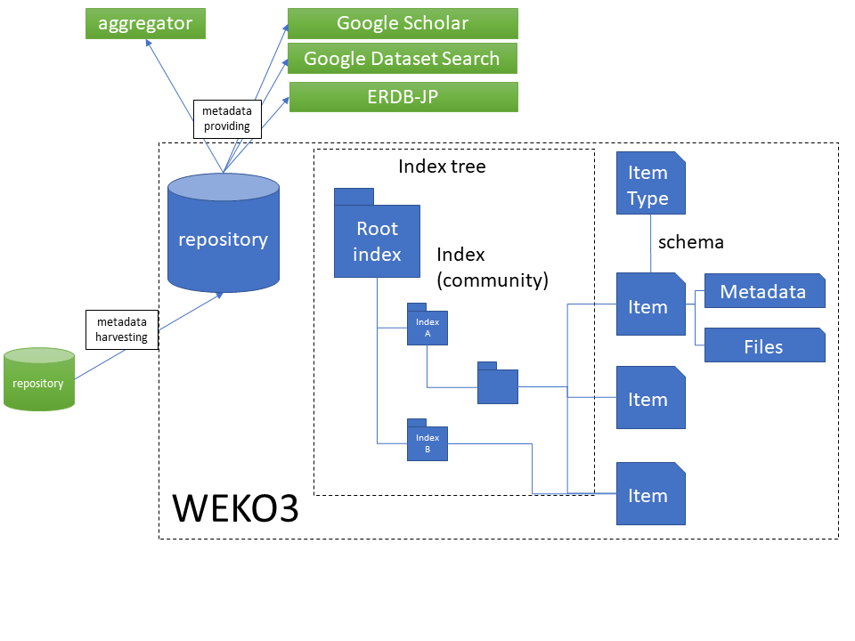

To register an \<INDEXWORD PRONOUNCE="あいてむ" INDEXITEM="アイテム"\>item\</INDEXWORD\>, you must first create a \<INDEXWORD PRONOUNCE="わあくふろお" INDEXITEM="ワークフロー"\>workflow\</INDEXWORD\> and register the item. You then need to get approval from reviewers/approvers before publishing the item.

Figure 1-2. Data registration

zu010020.tif

## LINKID=terminology【参照先】\<INDEXWORD PRONOUNCE="ようこかいせつ" INDEXITEM="用語解説"\>Glossary\</INDEXWORD\>

This section explains the terminology used in the System.

\<TBLATT POSITION="1" SCALE="151"\>

LINKID=terminologylist【参照先】Table 1‑1. Terms used in the System

<table>
<thead>
<tr class="header">
<th>Term</th>
<th>Description</th>
</tr>
</thead>
<tbody>
<tr class="odd">
<td>DDI</td>
<td>
The Data Documentation Initiative (DDI) is an international standard for metadata schemas in social science research. It is utilized for data archive initiatives such as internationalization, shared use, or joint research centers (https://ddialliance.org/).

In the WEKO3 module, you can use DDI as a metadata schema for OAI-PMH.
</td>
</tr>
<tr class="even">
<td>&lt;INDEXWORD PRONOUNCE="dublincore" INDEXITEM="DublinCore"&gt;DublinCore&lt;/INDEXWORD&gt;</td>
<td>A metadata schema standardized by the International Organization for Standardization (ISO 15836) (http://dublincore.org/). In the WEKO3 module, you can use DublinCore as a metadata schema for OAI-PMH.</td>
</tr>
<tr class="odd">
<td>JPCOAR</td>
<td>
A metadata schema developed by JPCOAR (Japan Consortium for open access Repositories) (https://schema.irdb.nii.ac.jp/en).

In the WEKO3 module, you can use JPCOAR as a metadata schema for OAI-PMH.
</td>
</tr>
<tr class="even">
<td>&lt;INDEXWORD PRONOUNCE="junii2" INDEXITEM="junii2"&gt;junii2&lt;/INDEXWORD&gt;</td>
<td>
A metadata schema published by the National Institute of Informatics (NII) (https://www.nii.ac.jp/irp/archive/system/junii2.html).

In the WEKO3 module, you cannot use junii2 as a metadata schema for OAI-PMH.
</td>
</tr>
<tr class="odd">
<td>&lt;INDEXWORD PRONOUNCE="oai－pmh" INDEXITEM="OAI-PMH"&gt;OAI-PMH&lt;/INDEXWORD&gt;</td>
<td>OAI-PMH (The Open Archives Initiative Protocol for Metadata Harvesting) is a protocol developed by the Open Archives Initiative to exchange metadata between repositories (http://www.openarchives.org/OAI/openarchivesprotocol.html). External systems, including repositories, can use OAI-PMH to collect metadata of the items registered in the WEKO3 module.</td>
</tr>
<tr class="even">
<td>&lt;INDEXWORD PRONOUNCE="ui" INDEXITEM="UI"&gt;UI&lt;/INDEXWORD&gt;</td>
<td>Stands for "User Interface". It is an interface for exchanging information between the System and the user.</td>
</tr>
<tr class="odd">
<td>&lt;INDEXWORD PRONOUNCE="weko3りほしとり" INDEXITEM="WEKO3リポジトリ"&gt;WEKO3 repository&lt;/INDEXWORD&gt;</td>
<td>A repository created with the WEKO3 module and related software.</td>
</tr>
<tr class="even">
<td>&lt;INDEXWORD PRONOUNCE="あいてむ" INDEXITEM="アイテム"&gt;Item&lt;/INDEXWORD&gt;</td>
<td>
A unit of information stored in a repository. An item is made up of content files and metadata. Metadata contains information that conforms to the description elements and description formats specified in a metadata schema.

Each item is assigned an item ID that is unique within a WEKO3 repository. An item is tied to a single item type and cannot be linked to multiple item types.

You can associate different metadata with a single item by creating additional item types.
</td>
</tr>
<tr class="odd">
<td>&lt;INDEXWORD PRONOUNCE="あいてむたいふ" INDEXITEM="アイテムタイプ"&gt;Item type&lt;/INDEXWORD&gt;</td>
<td>
Defines the data type of metadata registered for an item. An item type consists of elements specified in a metadata schema such as JPCOAR.

The repository administrator needs to consider the metadata required for a particular item and create an item type to suit the needs.

Example:

When storing journal papers and research data in the repository, the metadata elements for journal papers are differentiated from those for research data. In such a case, you can create an item type for journal papers and an item type for research data, respectively.
</td>
</tr>
<tr class="even">
<td>&lt;INDEXWORD PRONOUNCE="いんてつくす" INDEXITEM="インデックス"&gt;Index&lt;/INDEXWORD&gt;</td>
<td>A unit (category) used to group items registered in the WEKO3 repository. Items registered in the WEKO3 repository will always have one or more indexes. An index can have multiple child indexes and items.</td>
</tr>
<tr class="odd">
<td>&lt;INDEXWORD PRONOUNCE="いんてつくすつりい" INDEXITEM="インデックスツリー"&gt;Index tree&lt;/INDEXWORD&gt;</td>
<td>A tree structure of nested indexes. A WEKO3 repository has a single repository tree.</td>
</tr>
<tr class="even">
<td>&lt;INDEXWORD PRONOUNCE="こみゆにてい" INDEXITEM="コミュニティ"&gt;Community&lt;/INDEXWORD&gt;</td>
<td>A group of users who can access a particular repository. You can make items available only to the users of the community.</td>
</tr>
<tr class="odd">
<td>&lt;INDEXWORD PRONOUNCE="こみゆにていかんりしや" INDEXITEM="コミュニティ管理者"&gt;Community administrator&lt;/INDEXWORD&gt;</td>
<td>A user with the role to manage the community.</td>
</tr>
<tr class="even">
<td>&lt;INDEXWORD PRONOUNCE="こんてんつ" INDEXITEM="コンテンツ"&gt;Content&lt;/INDEXWORD&gt;</td>
<td>Research data registered in a repository, such as research papers and materials. The word "content" is used interchangeably with "item" in this manual.</td>
</tr>
<tr class="odd">
<td>&lt;INDEXWORD PRONOUNCE="こんてんつふあいる" INDEXITEM="コンテンツファイル"&gt;Content file&lt;/INDEXWORD&gt;</td>
<td>Refers to the papers and other files that make up an item.</td>
</tr>
<tr class="even">
<td>&lt;INDEXWORD PRONOUNCE="しすてむ" INDEXITEM="システム"&gt;System&lt;/INDEXWORD&gt;</td>
<td>Refers to the WEKO3 System.</td>
</tr>
<tr class="odd">
<td>&lt;INDEXWORD PRONOUNCE="しすてむかんりしや" INDEXITEM="システム管理者"&gt;System administrator&lt;/INDEXWORD&gt;</td>
<td>A user with the role to administer the System.</td>
</tr>
<tr class="even">
<td>&lt;INDEXWORD PRONOUNCE="すきいま" INDEXITEM="スキーマ"&gt;Schema&lt;/INDEXWORD&gt;</td>
<td>A definition of a repository database structure. It defines the relationship between objects that make up a database, such as tables and lists.</td>
</tr>
<tr class="odd">
<td>&lt;INDEXWORD PRONOUNCE="たいあろく" INDEXITEM="ダイアログ"&gt;Dialog&lt;/INDEXWORD&gt;</td>
<td>A UI mainly used to display messages and alerts. The user can still interact with UIs on the screen while a dialog is displayed.</td>
</tr>
<tr class="even">
<td>&lt;INDEXWORD PRONOUNCE="とうろくゆうさあ" INDEXITEM="登録ユーザー"&gt;Registered user&lt;/INDEXWORD&gt;</td>
<td>User who can access stored academic research results and register data from academic research results in the repository.</td>
</tr>
<tr class="odd">
<td>&lt;INDEXWORD PRONOUNCE="はあへすていんく" INDEXITEM="ハーベスティング"&gt;Harvesting&lt;/INDEXWORD&gt;</td>
<td>Scheduled activity for collecting repository data by external systems. It uses a dedicated protocol. Metadata needs to be mapped to the protocol.</td>
</tr>
<tr class="even">
<td>&lt;INDEXWORD PRONOUNCE="ふろお" INDEXITEM="フロー"&gt;Flow&lt;/INDEXWORD&gt;</td>
<td>A series of actions used to save items to the System. It defines a sequence of actions such as adding data to a repository, entering metadata, and peer review/approval.</td>
</tr>
<tr class="odd">
<td>&lt;INDEXWORD PRONOUNCE="めたてえた" INDEXITEM="メタデータ"&gt;Metadata&lt;/INDEXWORD&gt;</td>
<td>Information related to an item. Examples include information for a title, author, and file size. Metadata consists of content metadata and administrative metadata. Content metadata is a summary of the item. Administrative metadata is information such as the creator of the content metadata or access count for the item.</td>
</tr>
<tr class="even">
<td>&lt;INDEXWORD PRONOUNCE="りほしとり" INDEXITEM="リポジトリ"&gt;Repository&lt;/INDEXWORD&gt;</td>
<td>
A set of services a university provides to its community members to manage and distribute digital materials created by the university and its members. In principle, a university or academic organization (i.e., a single institution) can operate one repository.

The term refers to, in this manual, a space where research data (i.e., items) and their metadata are stored.
</td>
</tr>
<tr class="odd">
<td>&lt;INDEXWORD PRONOUNCE="りほしとりかんりしや" INDEXITEM="リポジトリ管理者"&gt;Repository administrator&lt;/INDEXWORD&gt;</td>
<td>A user with the role to administer a repository. The repository administrator can configure the WEKO3 module, the index tree, and item types.</td>
</tr>
<tr class="even">
<td>&lt;INDEXWORD PRONOUNCE="ろくいん" INDEXITEM="ログイン"&gt;Log in&lt;/INDEXWORD&gt;</td>
<td>The action to authenticate with a computer or various services on the Internet using pre-registered account information to access data.</td>
</tr>
<tr class="odd">
<td>&lt;INDEXWORD PRONOUNCE="ろくあうと" INDEXITEM="ログアウト"&gt;Log out&lt;/INDEXWORD&gt;</td>
<td>The action to close one's access to data granted through authentication upon logging in.</td>
</tr>
<tr class="even">
<td>&lt;INDEXWORD PRONOUNCE="ろおる" INDEXITEM="ロール"&gt;Role&lt;/INDEXWORD&gt;</td>
<td>Defines the permissions granted to a user when operating the System, repository, and other elements. Permissions include adding, changing, and deleting data.</td>
</tr>
<tr class="odd">
<td>&lt;INDEXWORD PRONOUNCE="わあくふろお" INDEXITEM="ワークフロー"&gt;Workflow&lt;/INDEXWORD&gt;</td>
<td>Defines a series of processes for business operations. It also refers to the sequence of those operations. A workflow for the WEKO3 repository defines a sequence of actions starting with registering items through publishing, including adding data to the repository, entering metadata, or peer review/approval.</td>
</tr>
<tr class="even">
<td>&lt;INDEXWORD PRONOUNCE="いたいし" INDEXITEM="異体字"&gt;Variant character&lt;/INDEXWORD&gt;</td>
<td>
The traditional alternative of kanji or a different form of character with the same pronunciation and meaning but written differently.

Example:

"會" instead of "会", or "壱" instead of "一".
</td>
</tr>
</tbody>
</table>

## LINKID=featuresandusers【参照先】\<INDEXWORD PRONOUNCE="しすてむのきのう" INDEXITEM="システムの機能"\>System features\</INDEXWORD\>

The following table shows the System features.

\<TBLATT POSITION="1" SCALE="151"\>

Table 1‑2. The features related to registering and viewing data in the System

| Features                                                                                              | Description                                                                                                                                                                                                      |
| ----------------------------------------------------------------------------------------------------- | ---------------------------------------------------------------------------------------------------------------------------------------------------------------------------------------------------------------- |
| \<INDEXWORD PRONOUNCE="あいてむいちらんひようし" INDEXITEM="アイテム一覧表示"\>View a list of items\</INDEXWORD\>         | View a list of items registered in the System. You can drill down the information by selecting an item from the list.                                                                                            |
| \<INDEXWORD PRONOUNCE="あいてむしようさいひようし" INDEXITEM="アイテム詳細表示"\>View item details\</INDEXWORD\>           | View the metadata of an item. You can also download research papers and other files that make up an item.                                                                                                        |
| \<INDEXWORD PRONOUNCE="らんきんくひようし" INDEXITEM="ランキング表示"\>View ranking\</INDEXWORD\>                     | Aggregate statistics such as the view count of an item and show the ranking.                                                                                                                                     |
| \<INDEXWORD PRONOUNCE="いんてつくすつりいけんさく" INDEXITEM="インデックスツリー検索"\>Search the index tree\</INDEXWORD\>    | List items belonging to an index by selecting the index from the index tree.                                                                                                                                     |
| \<INDEXWORD PRONOUNCE="きいわあとけんさく" INDEXITEM="キーワード検索"\>Search by keywords\</INDEXWORD\>               | Search for items via keyword searches. The search results will show the items containing specified keywords. You can search for metadata and content files.                                                      |
| \<INDEXWORD PRONOUNCE="あいてむとうろく・こうかい" INDEXITEM="アイテム登録・公開"\>Register and publish items\</INDEXWORD\> | Register and publish your research data and other related materials and papers. Content files and their metadata are organized into an "item" and stored in the repository. You can also register only metadata. |
| \<INDEXWORD PRONOUNCE="わあくふろお" INDEXITEM="ワークフロー"\>Workflow\</INDEXWORD\>                             | Set up a workflow when you register an item so that it will go through the stages of peer review/approval before publication. You can also view a list of items pending approval.                                |
| \<INDEXWORD PRONOUNCE="あいてむへんしゆう・さくしよ" INDEXITEM="アイテム編集・削除"\>Edit and delete items\</INDEXWORD\>     | Edit or delete a registered item.                                                                                                                                                                                |

## \<INDEXWORD PRONOUNCE="［ほおむ］かめんのかくふめいしよう" INDEXITEM="［ホーム］画面の各部名称"\>The elements of the Home screen.\</INDEXWORD\>

You will find the following elements in the Home screen.

> zu010030.tif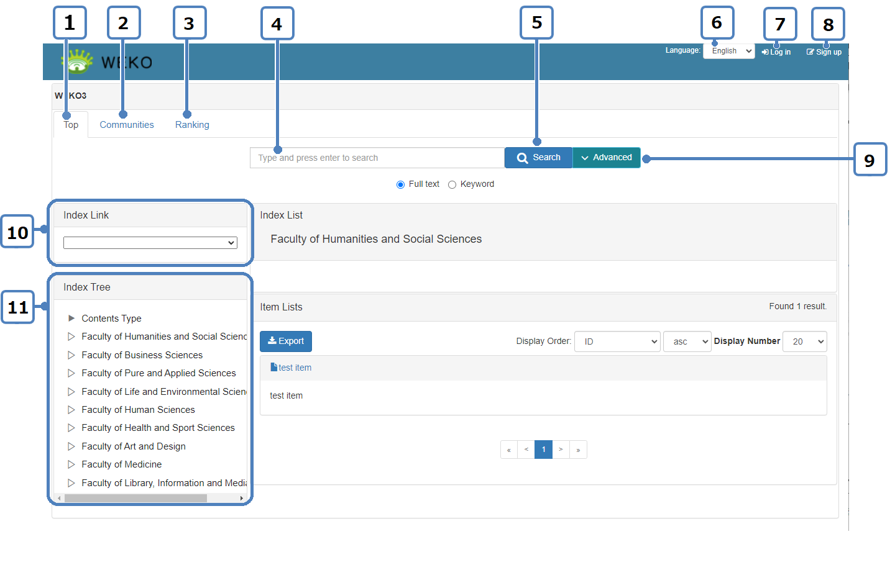

\<TBLATT POSITION="1" SCALE="151"\>

Table 1‑3. The elements in the Home screen

<table>
<thead>
<tr class="header">
<th>No.</th>
<th>Element</th>
<th>Description</th>
</tr>
</thead>
<tbody>
<tr class="odd">
<td>1</td>
<td>The "Top" tab</td>
<td>
Search for items here. See "ANCHORID=searchitems【参照元】Chapter 3: Search for items【E】" for more information.

Click to navigate to the Home screen.
</td>
</tr>
<tr class="even">
<td>2</td>
<td>The "Communities" tab</td>
<td>Explore communities. See "ANCHORID=community【参照元】8Chapter 8: Explore communities【E】" for more information.</td>
</tr>
<tr class="odd">
<td>3</td>
<td>The "Ranking" tab</td>
<td>View rankings such as the item view count or download count. See "Section 3.2. Search using the ranking" for more information.</td>
</tr>
<tr class="even">
<td>4</td>
<td>The "Search" text box</td>
<td>Specify the conditions for keyword searches here. See "ANCHORID=searchwithkeywords【参照元】Section 3.3. Search by keywords【E】" for more information.</td>
</tr>
<tr class="odd">
<td>5</td>
<td>The icon010010.tif button</td>
<td>Use this button for a simple search. See "ANCHORID=kanikensaku【参照元】Section 3.3.1. Simple search【E】" for more information.</td>
</tr>
<tr class="even">
<td>6</td>
<td>The "Language" pull-down list</td>
<td>Specify the display language here. See "ANCHORID=displayhome【参照元】Section 2.1. Access the Home screen【E】" for more information.</td>
</tr>
<tr class="odd">
<td>7</td>
<td>The "icon010020.tif" button</td>
<td>Use this button to log in to an account. See "ANCHORID=login【参照元】Section 2.2. Log in to the System【E】" for more information.</td>
</tr>
<tr class="even">
<td>8</td>
<td>The "icon010030.tif" button</td>
<td>Use this button to sign-up for an account. See "ANCHORID=setacount【参照元】Section 2.5. Sign-up for a new account【E】" for more information.</td>
</tr>
<tr class="odd">
<td>9</td>
<td>The icon010040.tif button</td>
<td>Use this button for advanced searches. See "ANCHORID=syousaikensaku【参照元】Section 3.3.2. Advanced search【E】" for more information.</td>
</tr>
<tr class="even">
<td>10</td>
<td>The "Index Link" screen</td>
<td>This screen shows index links.</td>
</tr>
<tr class="odd">
<td>11</td>
<td>The "Index Tree" screen</td>
<td>This screen shows indexes organized under the index tree.</td>
</tr>
</tbody>
</table>

#   
Log in and log out\</INDEXWORD\>

This chapter provides information on logging in to and out of the System and changing passwords.

## LINKID=displayhome【参照先】\<INDEXWORD PRONOUNCE="［ほおむ］かめんをひようしする" INDEXITEM="［ホーム］画面を表示する"\>Access the Home screen\</INDEXWORD\>

This section explains how to display the Home screen.

1.  Specify the URL of the System in your browser.

The Home screen of the System The search results appear s. See "ANCHORID=login【参照元】Section 2.2. Log in to the System【E】" for information on logging in to the System.

zu020010.tif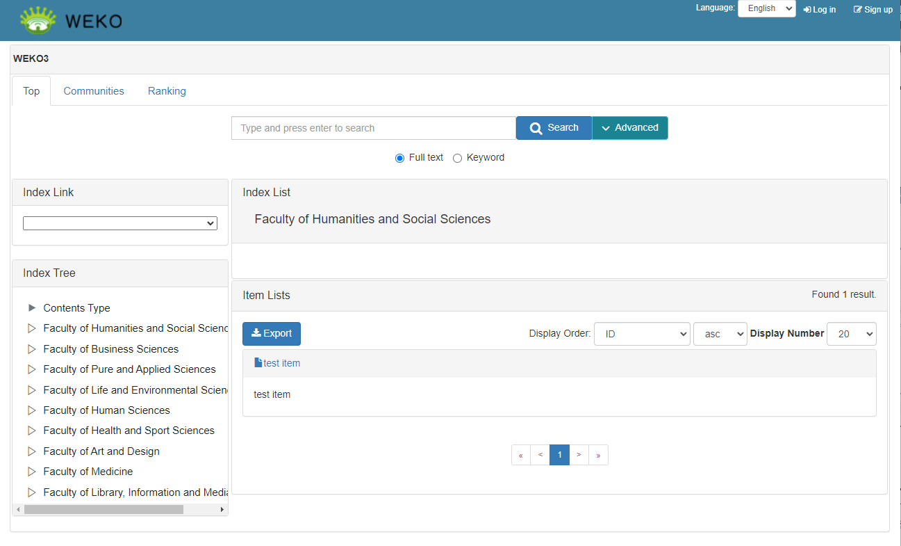

2.  Select a language from the "Language" pull-down list in the upper right corner of the screen.

zu020020.tif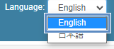

The screen refreshes to display in the language selected.

## LINKID=login【参照先】\<INDEXWORD PRONOUNCE="ろくいんする" INDEXITEM="ログインする"\>Log in to the System\</INDEXWORD\>

This section explains how to log in to the System.

3.  Click the icon020010.tif button in the upper right corner of the Home screen.

zu020030.tif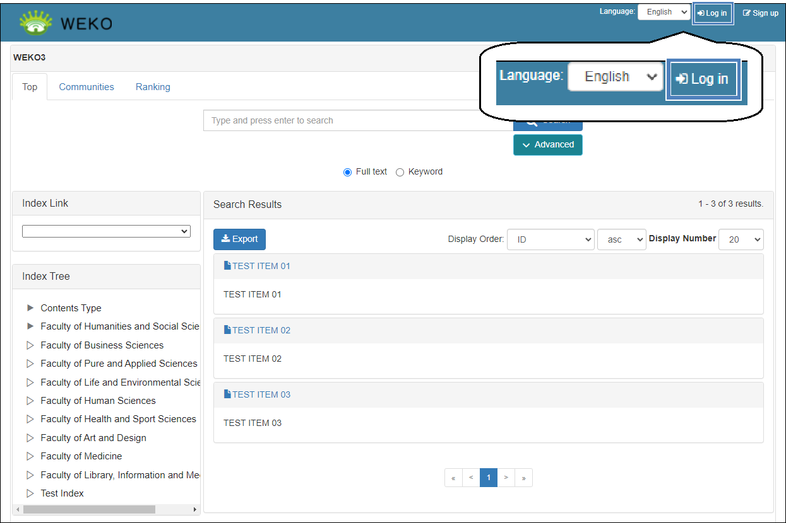

The login screen appears.

4.  To log in from the WEKO3 login screen:

<!-- end list -->

1)  > Enter the account information in the WEKO3 login screen and click the "Log In" button to log in.

zu020040.tif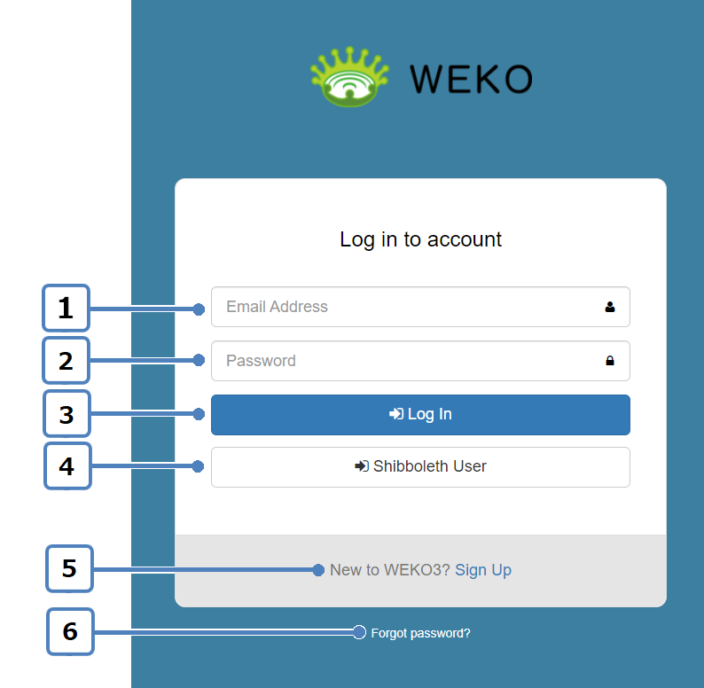

\<TBLATT POSITION=”1” SCALE=”151”\>

Table 2‑1. The elements in the "Log in" screen

| No. | Element                                                         | Description                                                                                                                                                                                                                  |
| --- | --------------------------------------------------------------- | ---------------------------------------------------------------------------------------------------------------------------------------------------------------------------------------------------------------------------- |
| 1   | The account text box                                            | Enter the account information (email address) of a general user. The input format should be "*XXXX@XXX*.*XXX*". You can use alphanumeric characters, hyphens (-), and underscores (\_). The maximum length is 16 characters. |
| 2   | The password text box                                           | Enter the password for the account (email address) you entered. You can enter 6 to 16 characters (alphanumeric characters only).                                                                                             |
| 3   | The icon020010.tif button            | Click to log in with the account (email address) and password you entered. The Home screen of the System appears.                                                                                                            |
| 4   | The icon020020.tif button | Single sign-on to open sources.                                                                                                                                                                                              |
| 5   | The "Sign Up" link                                              | Click to display the sign-up screen.                                                                                                                                                                                         |
| 6   | The "Forgot Password" link                                      | Click to reset your password. See "ANCHORID=changepassword【参照元】Section 2.4. Change a password【E】" for more information.                                                                                                      |

2)  > Click the icon020010.tif button.
    
    The Home screen of the System appears.

<!-- end list -->

5.  To log in from the Shibboleth login screen:
    
    JAIRO Cloud or GakuNin Embedded DS (Pattern 1 or Pattern 2) is used for the Shibboleth login, based on the settings of the content file.

<!-- end list -->

1)  > Enter the account information in the JAIRO Cloud login screen to log in to the System.

> Figure 2-1. The JAIRO Cloud login screen

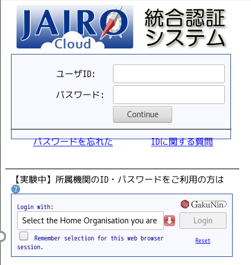

2)  > Log in to the System from the GakuNin Embedded DS login screen (pattern 1).
    
    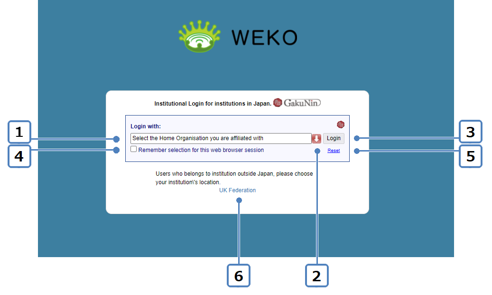

Table 2‑2. The elements in the GakuNin Embedded DS login screen (pattern 1)

| No. | Element                                                              | Description                                                                                                                          |
| --- | -------------------------------------------------------------------- | ------------------------------------------------------------------------------------------------------------------------------------ |
| 1   | The entry field for an affiliated institution                        | Enter your institution. As you type, the matching candidates are filtered and displayed.                                             |
| 2   | The / button | Click to show/hide the list of institutions. See "Figure 1. The pull-down list showing candidate institutions" for more information. |
| 3   | The icon020010.tif button                | Click to navigate to the corresponding login screen for the selected institution.                                                    |
| 4   | The "Remember selection for this web browser session" check box      | If checked, you will be automatically logged in to the System while the browser is running.                                          |
| 5   | The "Reset" link                                                     | Click to delete the information you entered in the institution entry box.                                                            |
| 6   | The "UK Federation" link                                             | Click to navigate to the predefined institution selection screen.                                                                    |

> Figure 2-2. The pull-down list showing candidate institutions
> 
> 

Enter the account information in the login screen for the selected institution to log in to the System.

The WEKO3 home screen appears.

3)  > Log in to the System from the GakuNin Embedded DS login screen (pattern 2).

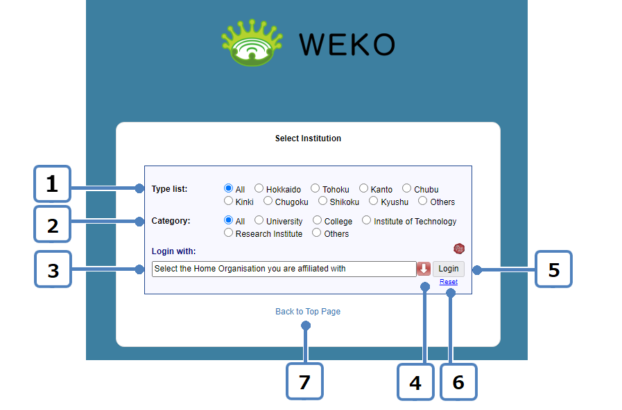

Table 2‑3. The elements in the GakuNin Embedded DS login screen (pattern 2)

<table>
<thead>
<tr class="header">
<th>No.</th>
<th>Element</th>
<th>Description</th>
</tr>
</thead>
<tbody>
<tr class="odd">
<td>1</td>
<td>The "Type list" radio buttons</td>
<td>
Select a region in Japan.

When you select one, the corresponding institutions in the region will be automatically filtered into the list of institutions.
</td>
</tr>
<tr class="even">
<td>2</td>
<td>The "Category" radio buttons</td>
<td>
Select a category of the institution.

When you select one, the corresponding institutions in the category will be automatically filtered into the list of institutions.
</td>
</tr>
<tr class="odd">
<td>3</td>
<td>The entry field for an affiliated institution</td>
<td>Enter your institution. As you type, the matching candidates are filtered and displayed.</td>
</tr>
<tr class="even">
<td>4</td>
<td>The / button</td>
<td>Click to show/hide the list of institutions. See "Figure 2-2. The pull-down list showing candidate institutions" for more information.</td>
</tr>
<tr class="odd">
<td>5</td>
<td>The icon020010.tif button</td>
<td>Click to navigate to the corresponding login screen for the selected institution.</td>
</tr>
<tr class="even">
<td>6</td>
<td>The "Reset" link</td>
<td>Click to delete the information you entered in the institution entry box.</td>
</tr>
<tr class="odd">
<td>7</td>
<td>The "Back to Top Page" link</td>
<td>Click to navigate back to the top of the page.</td>
</tr>
</tbody>
</table>

Enter the account information in the login screen for the selected institution to log in to the System.

The WEKO3 home screen appears.

Notes:

According to the user information used in the Shibboleth login, the System creates a WEKO3 account and assigns a role in the following way.

  - An administrator will be assigned a system administrator role.

  - A library staff member will be assigned a repository administrator role.

  - A faculty member will be assigned a general user role.

## LINKID=logout【参照先】\<INDEXWORD PRONOUNCE="ろくあうとする" INDEXITEM="ログアウトする"\>Log out of the System\</INDEXWORD\>

This section explains how to log out of the System.

1.  Click icon020040.tif next to the account name in the upper right corner of the Home screen.

A pull-down menu appears.

zu020050.tif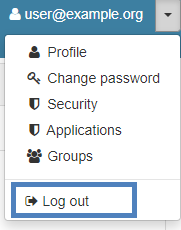

6.  Click "Log out".

You will log out of the System.

## LINKID=changepassword【参照先】\<INDEXWORD PRONOUNCE="はすわあとをへんこうする" INDEXITEM="パスワードを変更する"\>Change a password\</INDEXWORD\>

This section explains how to change the password configured for an account.

1.  Click icon020040.tif next to the account name in the upper right corner of the Home screen.

A pull-down menu appears.

zu020060.tif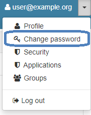

7.  Click "Change password".

The "Change password" screen appears.

8.  Specify a new password in the "Change password" screen.

Figure 2-3. The "Change password" screen

zu020070.tif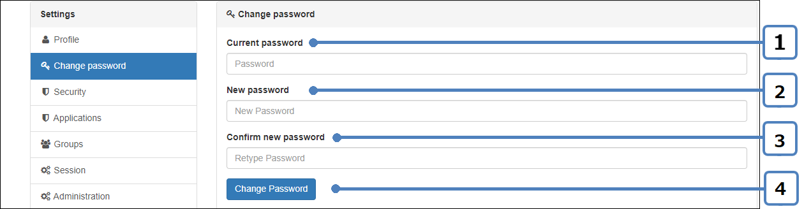

\<TBLATT POSITION="1" SCALE="151"\>

Table 2‑4. The elements in the "Change password" screen

| No. | Element                                               | Description                                                                                        |
| --- | ----------------------------------------------------- | -------------------------------------------------------------------------------------------------- |
| 1   | The "Current password" text box                       | Enter the password that is currently configured.                                                   |
| 2   | The "New password" text box                           | Enter a new password. You can enter 6 to 16 characters (alphanumeric characters only).             |
| 3   | The "Confirm new password" text box                   | Enter the new password again to confirm that the value you specified in "New password" is correct. |
| 4   | The icon020050.tif button | Click to reflect the specified information and update your password.                               |

9.  Click the icon020050.tif button.

The password is updated.

## LINKID=setacount【参照先】Sign-up for a new account

This section explains how to create a new account.

1.  Click icon020060.tif in the upper right corner of the Home screen.

The "Sign up" screen appears.

10. Enter an account name and password in the "Sign up" screen that appears.

zu020080.tif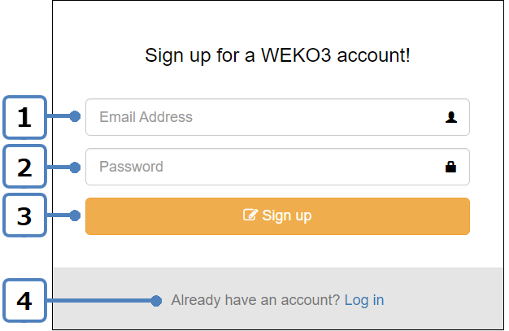

\<TBLATT POSITION="1" SCALE="151"\>

Table 2‑5. The elements in the "Sign up" screen

| No. | Element                                               | Description                                                                                                                                                                          |
| --- | ----------------------------------------------------- | ------------------------------------------------------------------------------------------------------------------------------------------------------------------------------------ |
| 1   | The "Email Address" text box                          | Enter an email address. The input format should be "*XXXXX*＠*XXX.XXX*". You can use alphanumeric characters, hyphens (-), and underscores (\_). The maximum length is 16 characters. |
| 2   | The "Password" text box                               | Enter a new password. You can enter 6 to 16 characters (alphanumeric characters only).                                                                                               |
| 3   | The icon020070.tif button | Click to sign-up for the service.                                                                                                                                                    |
| 4   | The icon020080.tif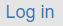 link   | Click to navigate to the login screen. Log in and continue working.                                                                                                                  |

11. Click the icon020070.tif button.

Log in with the account you created.

#   
Search for items\</INDEXWORD\>

This chapter provides information on searching for items.

## LINKID=searchwithindex【参照先】\<INDEXWORD PRONOUNCE="いんてつくすてけんさくする" INDEXITEM="インデックスで検索する"\>Search for items using indexes\</INDEXWORD\>

This section explains how to search for items on the Home screen using index links or the index tree.

### LINKID=searchwithindexlink【参照先】Search in "Index Link"

The index link search is available when index links are configured "Enable". See the System Administration Manual in "Section 15.2. Display the Index Link" for more information.

This section explains how to search for items using index links.

1.  Click on the "Top" tab on the Home screen.

This screen shows "Index link".

zu030010.tif

12. Select an index name from the "Index Link" pull-down list.

A search for items is performed.

zu030020.tif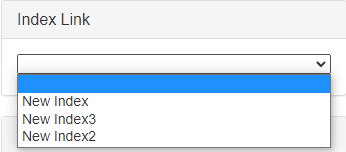

13. The search results appear in the "Item Lists" screen.

zu030030.tif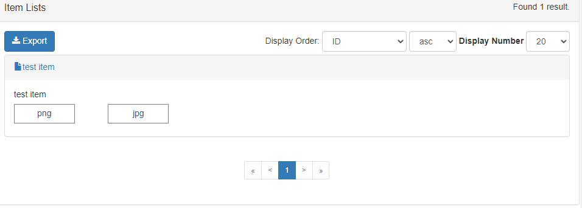

See "ANCHORID=viewitemlist【参照元】Section 3.1.3. View the Item Lists【E】" for more information.

### LINKID=searchwithindextree【参照先】Search in "Index Tree"

This section explains how to search for items using the index tree.

1.  Click on the "Top" tab on the Home screen.

This screen shows "Index Tree".

zu030040.tif

You can use the index tree to search for items in the following ways.

#### To search in "Item Lists":

1.  Click on an index name under "Index Tree".

A search for items is performed. The search results appear in the "Item Lists" screen. See "ANCHORID=viewitemlist【参照元】Section 3.1.3. View the Item Lists【E】" for more information.

zu030050.tif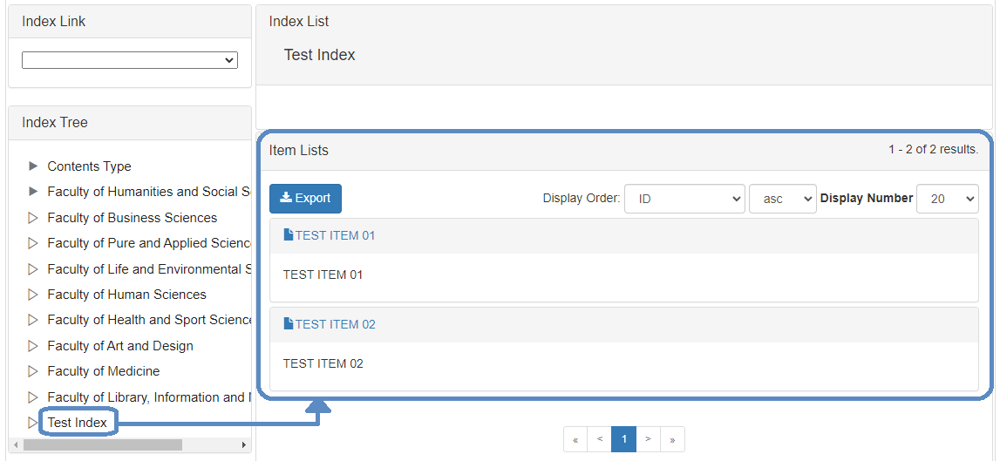

#### To search from "Index List":

1.  Click on an index name under "Index Tree".

If child indexes are placed under the index, the "Index List" screen will appear.

zu030060.tif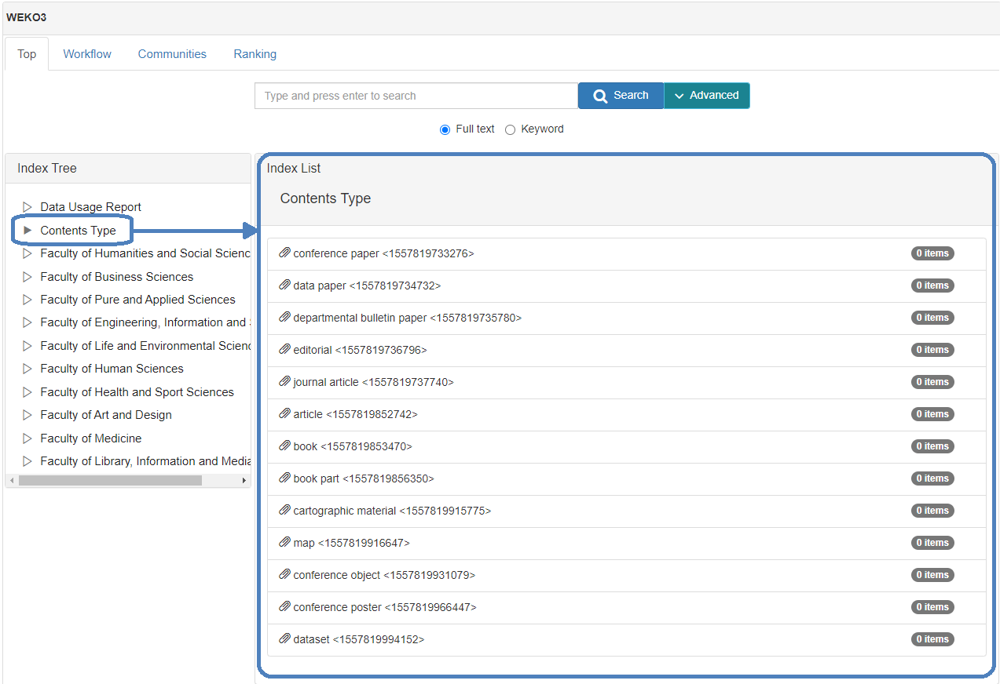

A list of child indexes belonging to the index appears in the "Index List" screen. Private indexes are not displayed for guest users.

Each index shows the number of items it contains. Public and private items are counted as follows.

  - The following items are counted as public:

<!-- end list -->

  - Public items belonging to a public index

<!-- end list -->

  - The following items are counted as private:

<!-- end list -->

  - Public or private items belonging to a private index

  - Private items belonging to a public index

<!-- end list -->

14. Click on an index name in "Index List".

A search for items is performed. The search results appear in the "Item Lists" screen. See "ANCHORID=viewitemlist【参照元】Section 3.1.3. View the Item Lists【E】" for more information.

#### To search from "Index Tree":

1.  Click icon030030.tif next to an index in "Index Tree".

Child indexes belonging to the index appear.

zu030070.tif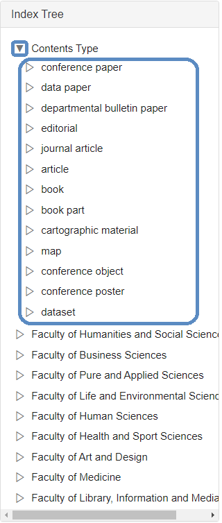

15. Click on an index name.

A search for items is performed. The search results appear in the "Item Lists" screen. See "ANCHORID=viewitemlist【参照元】Section 3.1.3. View the Item Lists【E】" for more information.

### LINKID=viewitemlist【参照先】View the Item Lists

This section explains how to view the information in "Item Lists" in two ways: a list and a table of contents.

#### To view "Item Lists" as a list:

Display search results as a list of items. The default is set to this format. The titles of items appear in the language selected in the Web screen.

The display language is chosen according to the following priority order: the language selected for the Web page display \> English \> the first language configured when registering the item \> the first value when registering without configuring languages.

> zu030080.tif

When a content file is registered, and the file information is configured to be displayed in "Item Lists", the link of the content file extension appears (If there is no content file and only a URL is registered, the link will appear as a URL. If there is no file extension, the link will appear "unknown". You can download the content file by clicking on the link (If there is no content file and only a URL is registered, you will be redirected to that URL).

"..." in "Item Lists" indicates that there are more registered content files in addition to what is being displayed. Clicking "..." will display the item details screen.

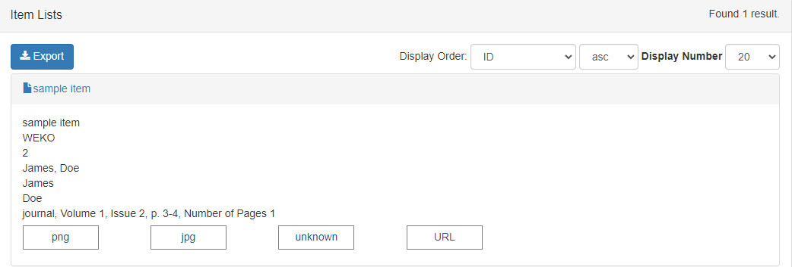

When "Show List" is set to "ON" in the thumbnail property options for the item type, the thumbnail files uploaded for "Item Lists" will be displayed.

If multiple thumbnail files have been uploaded, the first thumbnail file on the item details screen will appear.

See "Section 3.3.1. Simple search" for information on the display order and the number of items displayed.

1.  Click the title of an item.

The item details screen appears.

See "ANCHORID=displayitem【参照元】Chapter 4: View item details【E】" for more information on the screen elements.

#### To view "Item Lists" as a table of contents:

Display search results in a list of headings. See the System Administration Manual for information on viewing the information in this format.

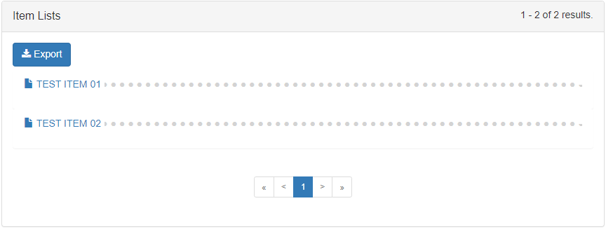

1.  Click the title of an item.

The item details screen appears. See "ANCHORID=displayitem【参照元】Chapter 4: View item details【E】" for more information.

## LINKID=searchwithitemranking【参照先】\<INDEXWORD PRONOUNCE="らんきんくてけんさくする" INDEXITEM="ランキングで検索する"\>Search using the ranking\</INDEXWORD\>

This section explains how to search for items using the ranking display.

1.  Click on the "Ranking" tab.

The "Ranking" screen appears.

zu030200.tif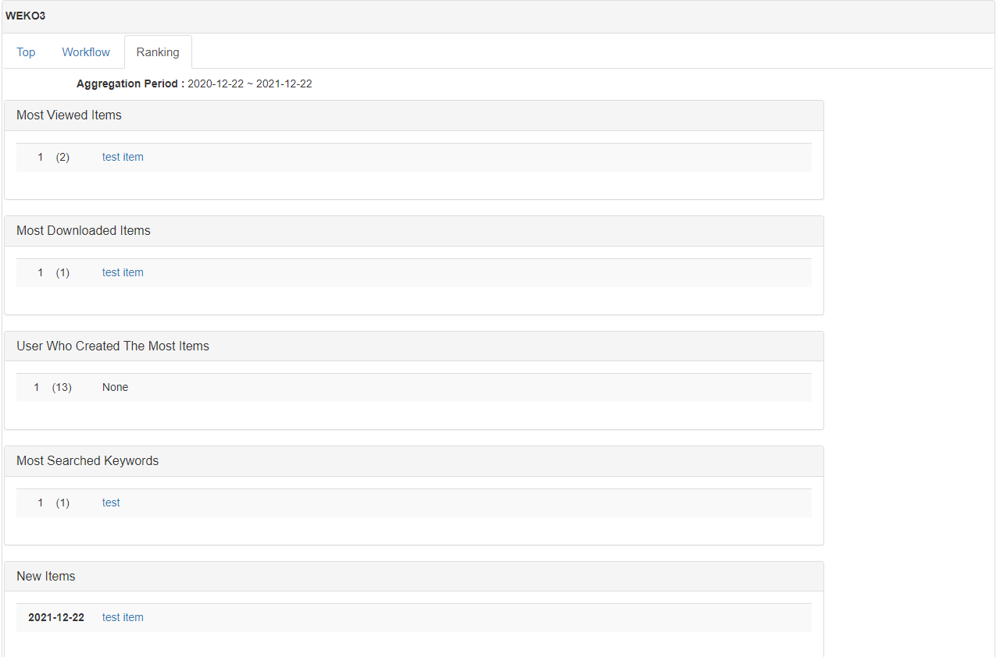

You can view rankings such as the most viewed items, the most downloaded items, or the most searched keywords.

#### Most Viewed Items

It ranks the most-viewed public items.

You can view the title and the number of views for each item.

1.  Click on an item title.

The item details screen for the item appears.

16. Download the file as needed.

Figure 3-1. The "Most Viewed Items" screen

zu030210.tif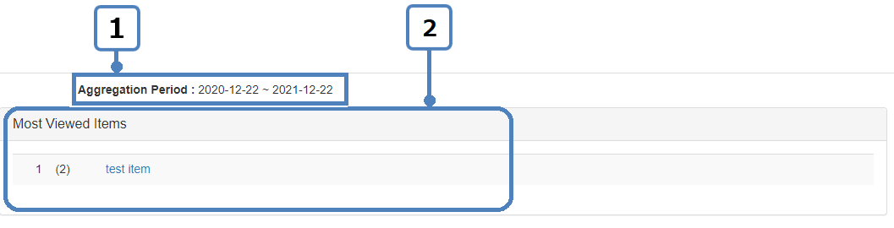

\<TBLATT POSITION="1" SCALE="151"\>

Table 3‑1. The elements in the "Most Viewed Items" screen

| No. | Element            | Description                                                                                              |
| --- | ------------------ | -------------------------------------------------------------------------------------------------------- |
| 1   | Aggregation Period | It shows the aggregation period used for the ranking. The display format is "*yyyy-mm-dd - yyyy-mm-dd*". |
| 2   | Most Viewed Items  | It ranks the most-viewed public items, showing the number of views and the titles.                       |

#### Most Downloaded Items

It ranks the most-downloaded public item files.

You can view the title and the number of downloads for each item.

zu030220.tif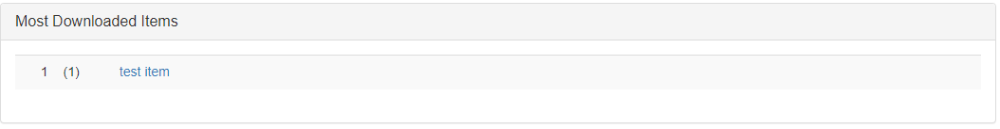

1.  Click on an item title.

The item details screen for the item appears.

17. Download the file as needed.
    
    1.  #### User Who Created The Most Items

It ranks the users based on the number of items they created.

You can view the user and the number of items each created.

zu030230.tif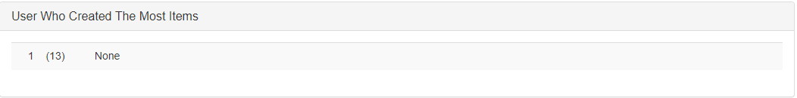

#### Most Searched Keywords

It ranks the keywords based on the number of times they were used for searches.

You can view keywords and the number of times searched.

zu030240.tif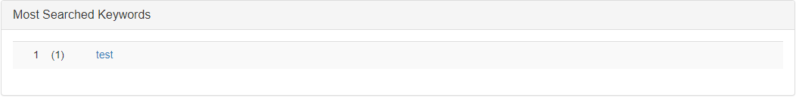

1.  Click on a keyword.

The search result screen appears for the keyword.

#### New Items

Recently released items appear here.

You can view the title and published date for each item.

zu030250.tif

1.  Click on an item title.

The item details screen for the item appears.

18. Download the file as needed.
    
    Additional Information:
    
    ・The "Ranking" screen does not show the following items.
    
    \- Deleted items
    
    \- Items that have been configured to be private.
    
    \- Items whose publish date is in the future
    
    ・Searches without keywords (i.e. listing all data) or searches using only blank spaces are not included in the keyword ranking. The "Most Searched Keywords" ranking shows the searched text as it is specified. For example, if you specify "adults and children", this phrase will be counted as one keyword. (It is handled as a different keyword than "adults" or "children.")
    
    1.  ## LINKID=searchwithkeywords【参照先】\<INDEXWORD PRONOUNCE="きいわあとてけんさくする" INDEXITEM="キーワードで検索する"\>Search by keywords\</INDEXWORD\>

There are two types of keyword searches: simple search and advanced search. This section explains how to search for items by specifying keywords.

### LINKID=kanikensaku【参照先】Simple search

1.  Click on the "Top" tab.

The keyword search text box appears.

Enter a keyword in the keyword search text box and check the "Full text" or "Keyword" radio button as the search method.

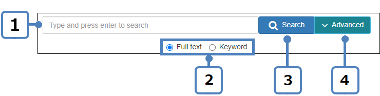

19. \<TBLATT POSITION="1" SCALE="151"\>

Table 3‑2. The elements in the simple search screen

<table>
<thead>
<tr class="header">
<th>No.</th>
<th>Element</th>
<th>Description</th>
</tr>
</thead>
<tbody>
<tr class="odd">
<td>1</td>
<td>The keyword search text box</td>
<td>
You can enter a keyword for searching for items.

You can use the following characters with searches:

+ - = &amp;&amp; || ! ( ) { } [ ] ^ " ~ * ? : \ /

Note that you cannot use the "&lt;" and "&gt;" characters in searches.

You can perform an OR search by separating keywords with " OR " or " | " (both require spaces before and after).
</td>
</tr>
<tr class="even">
<td>2</td>
<td>The search method radio buttons</td>
<td><ul>
<li>
When the search method is "Full text":
</li>
</ul>

A search will run against metadata of the registered items and information included in the registered content files.

<ul>
<li>
When the search method is "Keyword":
</li>
</ul>

A search will run against metadata of the registered items.
</td>
</tr>
<tr class="odd">
<td>3</td>
<td>The icon030010.tif button</td>
<td>Click to run a simple search by keywords.</td>
</tr>
<tr class="even">
<td>4</td>
<td>The icon030020.tif button</td>
<td>Click to display the advanced search screen to specify more details. See "ANCHORID=syousaikensaku【参照元】Section 3.3.2. Advanced search【E】" for more information.</td>
</tr>
</tbody>
</table>

2.  Click the icon030010.tif button.

The search results appear. See "ANCHORID=displayitem【参照元】Chapter 4: View item details【E】" for more information on search results.

zu030120.tif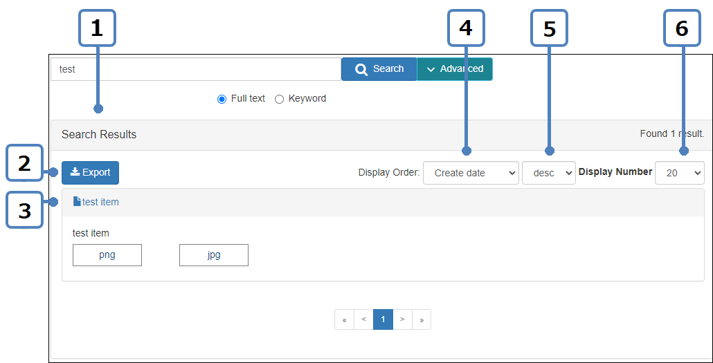

\<TBLATT POSITION="1" SCALE="151"\>

Table 3‑3. The elements in the "Search Results" screen

| No. | Element                                               | Description                                                                                                                                                                                                      |
| --- | ----------------------------------------------------- | ---------------------------------------------------------------------------------------------------------------------------------------------------------------------------------------------------------------- |
| 1   | "Search Results"                                      | The search results appear.                                                                                                                                                                                       |
| 2   | The icon030080.tif button | Click to open the "Items to Export" screen. You can export information contained in the items. See "Chapter 7: Export items" for more information.                                                               |
| 3   | An item name                                          | Clicking on a name takes you to the item details screen. See "ANCHORID=displayitem【参照元】Chapter 4: View item details【E】" for more information. See "ANCHORID=preview【参照元】Figure 3-2. The item details screen【E】". |
| 4   | The "Display Order" pull-down list                    | Select the order in which the search results are displayed from the "Display Order" pull-down list. See "ANCHORID=displaypulldownlist【参照元】Figure 3-3. The "Display Order" pull-down list【E】".                    |
| 5   | The "asc/desc" pull-down list                         | Select "asc" (ascending) or "desc" (descending) for a sort order. See "ANCHORID=ascpulldownlist【参照元】Figure 3-4. The "asc/desc" pull-down list【E】" for more information.                                          |
| 6   | The "Display Number" pull-down list                   | Select the number of items to display from the "Display Number" pull-down list. See "ANCHORID=displaycountpulldownlist【参照元】Figure 3-5. The "Display Number" pull-down list【E】" for more information.             |

LINKID=preview【参照先】Figure 3-2. The item details screen

zu030130.tif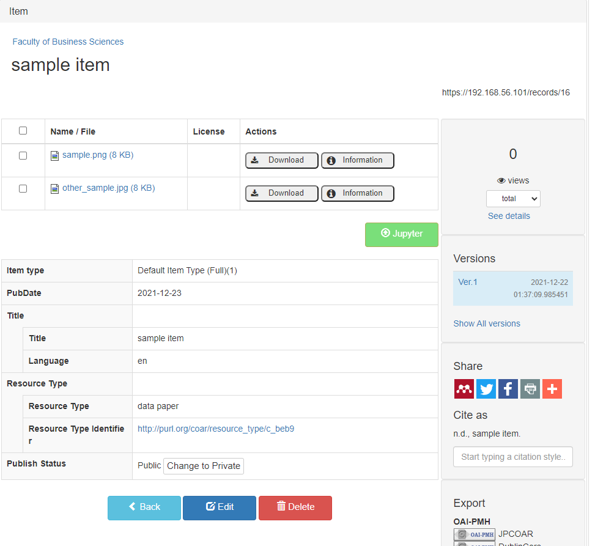

LINKID=displaypulldownlist【参照先】Figure 3-3. The "Display Order" pull-down list

zu030140.tif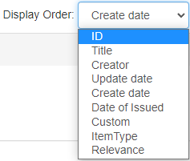

LINKID=ascpulldownlist【参照先】Figure 3-4. The "asc/desc" pull-down list

zu030150.tif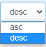

LINKID=displaycountpulldownlist【参照先】Figure 3-5. The "Display Number" pull-down list

zu030160.tif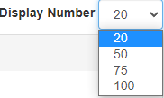

### LINKID=syousaikensaku【参照先】Advanced search

1.  Click on the "Top" tab.

The keyword search text box appears.

20. Enter a keyword in the keyword search text box and check the "Full text" or "Keyword" radio button as the search method.

21. Click the icon030020.tif button.

The advanced search screen appears where you can specify more details.

The button has a label replaced, showing .

Clicking  will collapse the advanced search area. The button has a label replaced, showing .

You can perform an OR search by separating text with " OR " or " | " (both require spaces before and after).

You can perform an AND search using a combination of the simple search text field and any element of the advanced search.

Click Enter to search for items matching the search criteria. The search results appear in the "Search Results" area on the "Top" tab.

zu030310.tif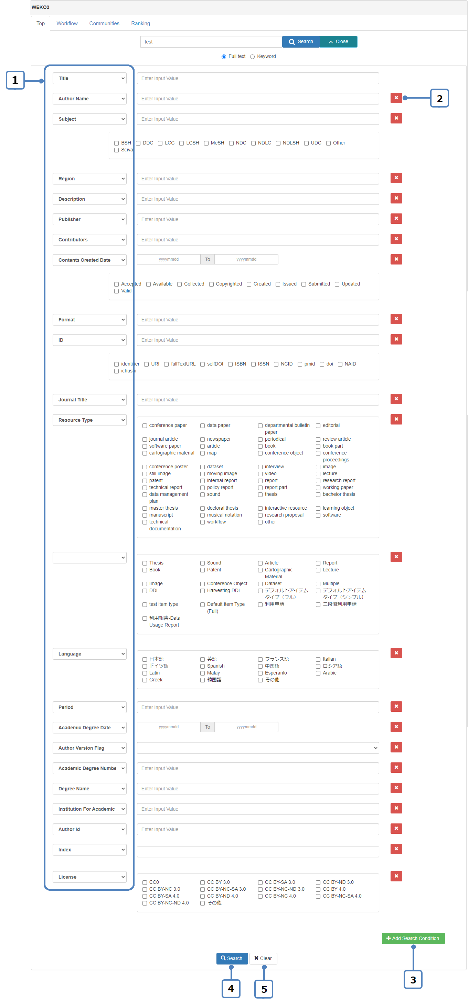\<TBLATT POSITION=”1” SCALE=”151”\>

Table 3‑4. The elements in the advanced search screen

<table>
<thead>
<tr class="header">
<th>No.</th>
<th>Element</th>
<th>Description</th>
</tr>
</thead>
<tbody>
<tr class="odd">
<td>1</td>
<td>The search criteria pull-down lists</td>
<td>Select the search criteria of your choice from the pull-down lists.</td>
</tr>
<tr class="even">
<td>2</td>
<td>The icon030040.tif button</td>
<td>Click to delete the criteria.</td>
</tr>
<tr class="odd">
<td>3</td>
<td>The icon030050.tif button</td>
<td>Click to add criteria.</td>
</tr>
<tr class="even">
<td>4</td>
<td>The icon030060.tif button</td>
<td>Click to run a search. The "Search Results" screen will then appear. See "ANCHORID=kensakukekka【参照元】Figure 3-6. The "Search Results" screen【E】" for more information.</td>
</tr>
<tr class="odd">
<td>5</td>
<td>The icon030070.tif button</td>
<td>Click to clear the criteria.</td>
</tr>
<tr class="even">
<td>6</td>
<td>icon030070.tif</td>
<td>
Use either of the following date formats for search criteria (Contents Created Date, Academic Degree Date).

• Specify a date in the yyyy-mm-dd, yyyy-mm, or yyyy format. Using any other format will result in the message "Field does not validate," and the item search will not be completed.

• Pick a date from the calendar that appears when the area is focused.
</td>
</tr>
</tbody>
</table>

LINKID=kensakukekka【参照先】Figure 3-6. The "Search Results" screen

zu030320.tif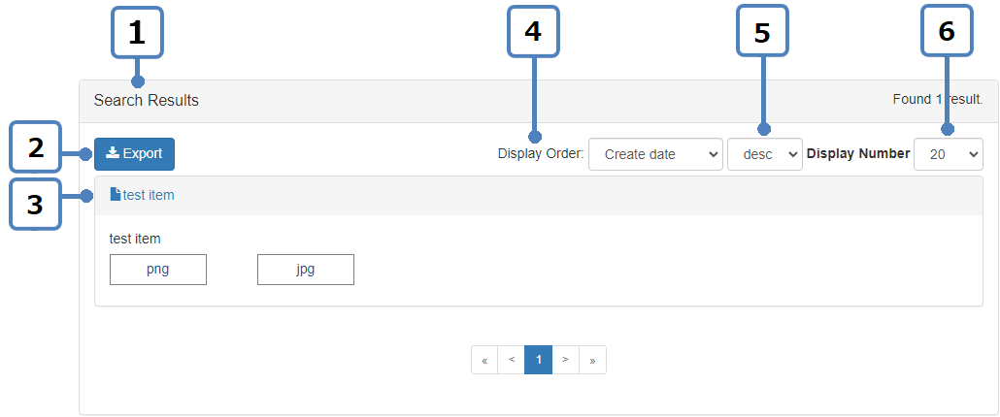

\<TBLATT POSITION="1" SCALE="151"\>

Table 3‑5. The elements in the "Search Results" screen

| No. | Element                                               | Description                                                                                                                                                                                          |
| --- | ----------------------------------------------------- | ---------------------------------------------------------------------------------------------------------------------------------------------------------------------------------------------------- |
| 1   | "Search Results"                                      | The search results appear.                                                                                                                                                                           |
| 2   | The icon030080.tif button | Click to open the "Items to Export" screen. You can export information contained in the items. See "Chapter 7: Export items" for more information.                                                   |
| 3   | An item name                                          | Clicking on a name takes you to the item details screen. See "ANCHORID=preview【参照元】Figure 3-2. The item details screen【E】".                                                                          |
| 4   | The "Display Order" pull-down list                    | Select the order in which the search results are displayed from the "Display Order" pull-down list. See "ANCHORID=displaypulldownlist【参照元】Figure 3-3. The "Display Order" pull-down list【E】".        |
| 5   | The "asc/desc" pull-down list                         | Select "asc" (ascending) or "desc" (descending) for a sort order. See "ANCHORID=ascpulldownlist【参照元】Figure 3-4. The "asc/desc" pull-down list【E】" for more information.                              |
| 6   | The "Display Number" pull-down list                   | Select the number of items to display from the "Display Number" pull-down list. See "ANCHORID=displaycountpulldownlist【参照元】Figure 3-5. The "Display Number" pull-down list【E】" for more information. |

## LINKID=variantcharasearch【参照先】\<INDEXWORD PRONOUNCE="いたいしけんさくについて" INDEXITEM="異体字検索について"\>About variant character search\</INDEXWORD\>

The System supports the "variant character search" feature. Variant characters are the traditional alternative of kanji or a different form of character with the same pronunciation and meaning but written differently.

For example, if you enter "壱" for a search keyword as the title and run a search, the results will include those items containing "一" and other variants of "壱".

Notes:

This feature applies to the Japanese language only. Variant character searches in English are not supported.

The index definition of variant characters is based on the integrated index of kanji in NACSIS-CAT. You can obtain the index definition from the following Web site:

"Guidelines for providing the integrated index of kanji" (Japanese)  
https://www.nii.ac.jp/CAT-ILL/about/system/kui.html

## LINKID=searchwithauthorname【参照先】\<INDEXWORD PRONOUNCE="ちよしやめいてけんさくする" INDEXITEM="著者名で検索する"\>Search by author name\</INDEXWORD\>

This section explains how to search for items by specifying registered author names.

You can search authors using the following methods.

### Search by author name

By specifying "Author Name" in the advanced search and entering an author name, you can search for items matching the specified author name.

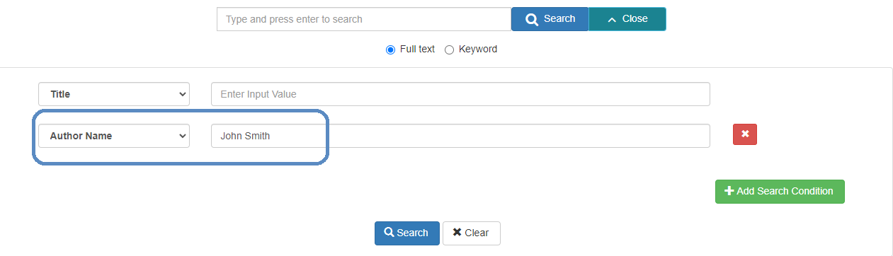

Alternatively, you can click on the author's name in the item details screen. A popup then appears with the author's information. You can search for items matching the author's name by clicking the "Search repository" link in the popup.

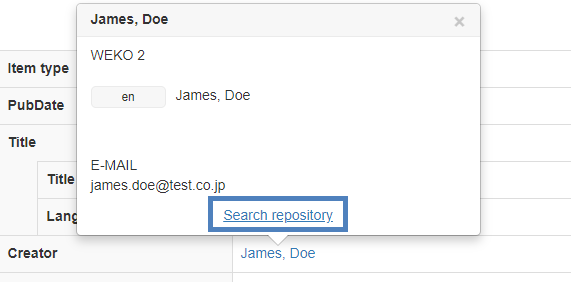

### Search by WEKO author ID

By specifying "Author Id" in the advanced search and entering the author's WEKO author ID (author\_link), you can search for items matching the specified WEKO author ID.

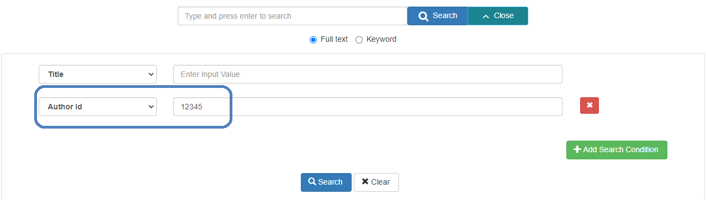

## Faceted search

Faceted searches allow you to filter items using the search criteria retrieved from "Item Lists".

Faceted searches can be performed when the System is configured to show the index tree/facet display. See the System Administration Manual in "Section 15.11.4. Set up the index tree/facet display" for more information.

This section explains how to filter items using faceted searches.

1.  Click on the "Top" tab on the Home screen.
    
    The faceted search area appears.
    
    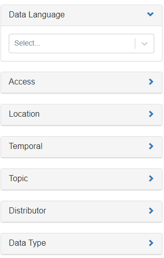

<!-- end list -->

22. Select search criteria in the faceted search area.
    
    The items will be filtered out. The search results appear in the "Item Lists" screen.

zu030030.tif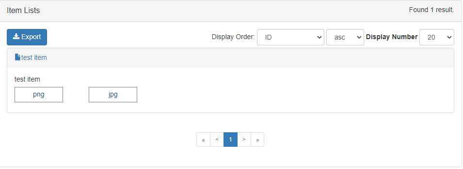

See "ANCHORID=viewitemlist【参照元】Section 3.1.3. View the Item Lists【E】" for more information.

# View item details\</INDEXWORD\>

This chapter describes elements that are included in items.

## LINKID=itemdetailswindow【参照先】\<INDEXWORD PRONOUNCE="あいてむしようさいかめん" INDEXITEM="アイテム詳細画面"\>The item details screen\</INDEXWORD\>

This chapter describes elements that are included in the item details screen.

### Metadata

You can view the metadata of an item in the item details screen.

Figure 4-1. The item details screen

zu040010.tif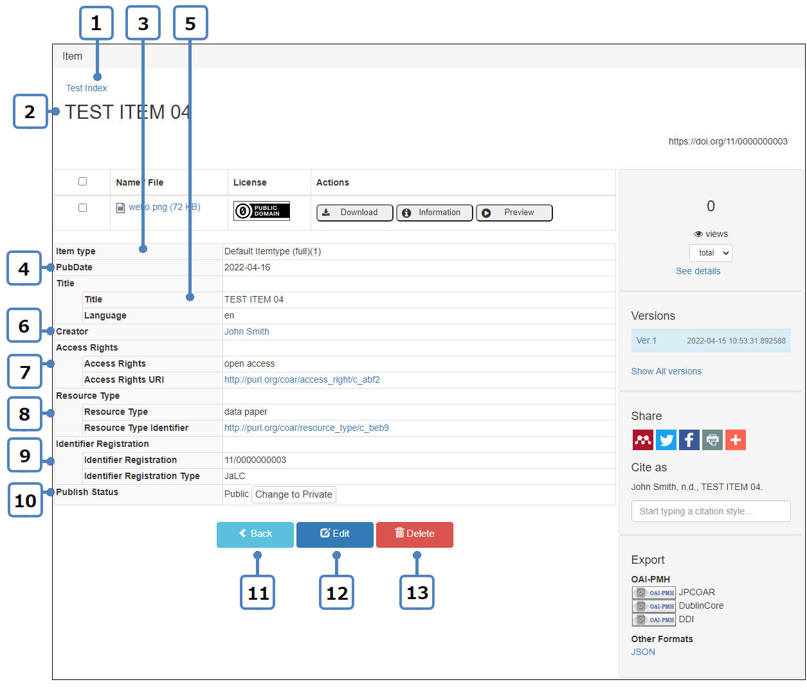

\<TBLATT POSITION="1" SCALE="151"\>

Table 4‑1. The elements in the item details screen

<table>
<thead>
<tr class="header">
<th>No.</th>
<th>Element</th>
<th>Description</th>
</tr>
</thead>
<tbody>
<tr class="odd">
<td>1</td>
<td>Index name</td>
<td>Displays the index name of the item.</td>
</tr>
<tr class="even">
<td>2</td>
<td>An item name</td>
<td>Displays the item name.</td>
</tr>
<tr class="odd">
<td>3</td>
<td>Item type</td>
<td>Displays the item type.</td>
</tr>
<tr class="even">
<td>4</td>
<td>PubDate</td>
<td>Displays the publish date.</td>
</tr>
<tr class="odd">
<td>5</td>
<td>Title*</td>
<td>Display the title and its language.</td>
</tr>
<tr class="even">
<td>6</td>
<td>Creator*</td>
<td>Displays the creator's name.</td>
</tr>
<tr class="odd">
<td>7</td>
<td>Access Rights*</td>
<td>Display the access rights and the access rights URI.</td>
</tr>
<tr class="even">
<td>8</td>
<td>Resource Type*</td>
<td>Display the resource type and the resource type identifier.</td>
</tr>
<tr class="odd">
<td>9</td>
<td>Identifier Registration</td>
<td>Display the identifier registration and the identifier registration type.</td>
</tr>
<tr class="even">
<td>10</td>
<td>Publish Status</td>
<td>Displays the publish status.</td>
</tr>
<tr class="odd">
<td>11</td>
<td>The icon040010.tif button</td>
<td>Click to close the item details screen and return to the previous screen.</td>
</tr>
<tr class="even">
<td>12</td>
<td>The icon040020.tif button</td>
<td>Click to edit the information.</td>
</tr>
<tr class="odd">
<td>13</td>
<td>The icon040030.tif button</td>
<td>
Click to delete the item.

The "Confirm" screen appears.
</td>
</tr>
</tbody>
</table>

\* Notes:

The elements that appear on the screen depend on the item type.

> Notes:

You cannot change an item's status to private when it has a DOI assigned. If you click the "Change to Private" button in this case, the message "This item cannot be set to private because a DOI is granted" will appear.

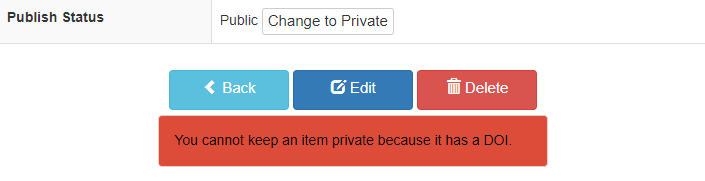

Figure 4-2. The "Confirm" screen

msg040010.tif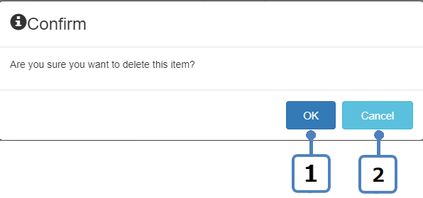

\<TBLATT POSITION="1" SCALE="151"\>

Table 4‑2. The elements in the "Confirm" screen

| No. | Element                                                         | Description                                                          |
| --- | --------------------------------------------------------------- | -------------------------------------------------------------------- |
| 1   | The icon040040.tif button | Click to delete the item.                                            |
| 2   | The icon040050.tif button           | Click to cancel the delete operation and close the "Confirm" screen. |

> Notes:

You cannot delete an item when it has a DOI granted. If you click the "Delete" button in this case, the message "This item cannot be deleted because a DOI is granted" will appear.

> 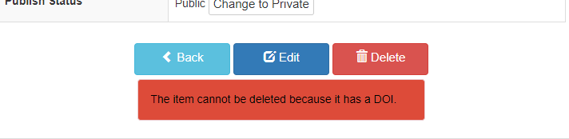
> 
> Additional Information:
> 
> ・The creator name appears with a link. Clicking on the name link will display a popup window with detailed information about this creator.
> 
> 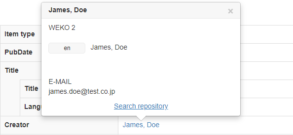
> 
> ・The bibliographic information appears in the following form, summarizing the registered information.
> 
> 

### Statistics

You can check the number of views for an item in the statistics screen.

Figure 4-3. The statistics screen

zu040020.tif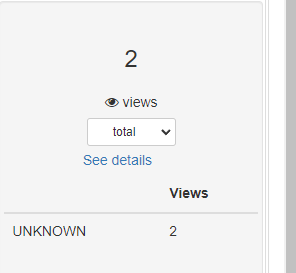

1.  Select a period from the period pull-down list.

The screen refreshes to display the view count for the period selected.

1.  Click "See details".

The view count that appears is broken down by country from which access was made.

Figure 4-4. The period pull-down list

zu040030.tif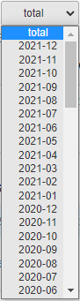

### Version

You can check the version of the item in the "Versions" screen.

Figure 4-5. The "Versions" screen

zu040040.tif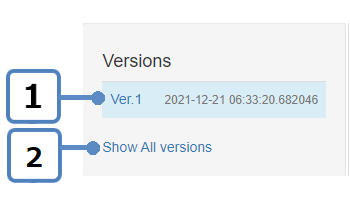

\<TBLATT POSITION="1" SCALE="151"\>

Table 4‑3. The elements in the "Versions" screen

| No. | Element           | Description                                           |
| --- | ----------------- | ----------------------------------------------------- |
| 1   | Version           | The display format is "*yyyy-mm-dd hh:mm:ss.999999*". |
| 2   | Show All versions | Displays all versions.                                |

### Content files

You can view content files registered with an item in a list of file information according to the preview selected at item registration.

1)  > The "Preview" option: Simple

> 

2)  > The "Preview" option: Detail

> 

3)  > The "Preview" option: Preview

> 
> 
> ・If you do not have access rights to the content file, the preview will appear as follows.
> 
> 
> 
> The preview is not displayed, and the file information area shows that you do not have access to the file.
> 
> ・If the content file's publish date is in the future, the preview will appear as follows.
> 
> 
> 
> The preview is not displayed, and the file information area shows when the file becomes downloadable.
> 
> ・When an unexpected error occurs, e.g. you cannot view the content file:
> 
> 　The item details screen appears, with a specific message at the top. For support when the following screen appears, contact your administrator.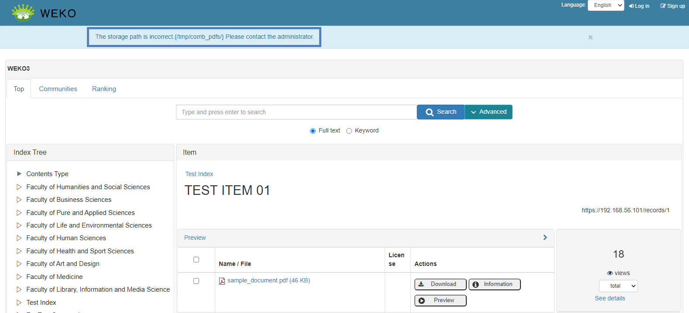
> 
> ・When the access to the content file is configured as "Restricted Access", and "Providing Method: Role" is set to "Non-Logged In User":
> 
> You can perform the operations shown below. See "Section 5.1.1. Register items" for details on setting up restricted access.
> 
> 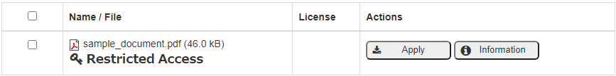

1.  When you click the "Apply" button on the item details screen, the terms and conditions appear on the modal screen (if any).

> The "Next" button becomes active when you select the check box below the terms and conditions. Press the button, and a modal screen appears where you can enter the email address.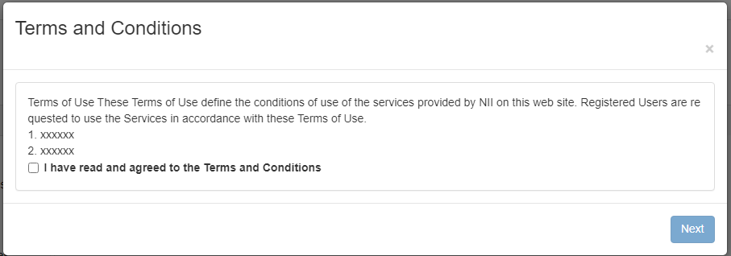

2.  A modal screen appears where you can enter your email address.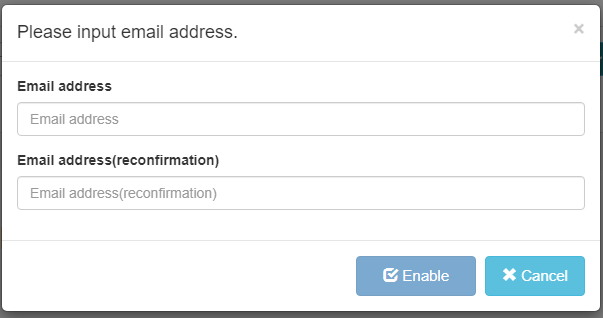

> An email message with a link to the edit screen of a specific workflow is sent to the email address specified in the modal screen. Clicking on the link will take you to an action screen defined in the workflow (e.g., the item registration screen), and you can carry on with the operation to complete the workflow.
> 
> When the workflow is "Done", the user who started the workflow will receive an email with a link to download the file.
> 
> A modal warning message will be displayed if a user who clicks "Apply" does not match the providing method setting.
> 
> When the user downloads a content file using an email link, an email message with a usage report workflow link will be sent according to the user's account.
> 
> ・For a guest user:
> 
> 　→ The user receives an email with a link to a usage report workflow available for a limited period.
> 
> ・For a registered user:
> 
> 　→ The user receives an email with a link to a usage report workflow available indefinitely.

### Share items

You can share items using various social media or print them.

Figure 4-6. The "Share" screen

zu040050.tif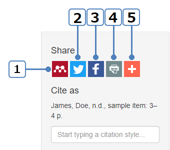

\<TBLATT POSITION="1" SCALE="151"\>

Table 4‑4. The elements in the "Share" screen

| No. | Element                                                                 | Description                                                                                                                                    |
| --- | ----------------------------------------------------------------------- | ---------------------------------------------------------------------------------------------------------------------------------------------- |
| 1   | The icon040060.tif button         | Click to share the item using "Mendeley".                                                                                                      |
| 2   | The icon040080.tif button         | Click to share the item using "Twitter".                                                                                                       |
| 3   | The icon040090.tif button         | Click to share the item using "Facebook".                                                                                                      |
| 4   | The icon040100.tif button         | Click to open the "Print" screen.                                                                                                              |
| 5   | The icon040110.tif pull-down list | Select the media from the pull-down list to add to social sharing. See "ANCHORID=pulldpwnlist【参照元】Figure 4-8. The "AddThis" pull-down list【E】. |

Figure 4-7. The "Print" screen

zu040060.tif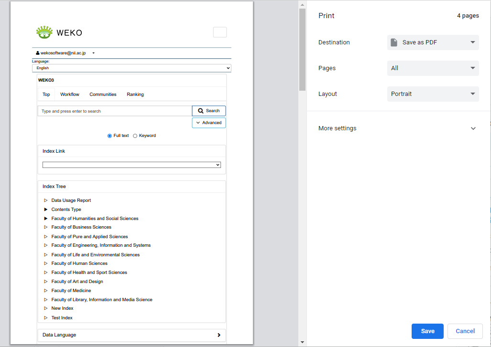

LINKID=pulldpwnlist【参照先】Figure 4-8. The "AddThis" pull-down list

zu040070.tif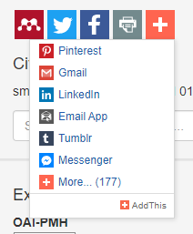

### Bibliographic Citation

You can view item metadata as bibliographic citation.

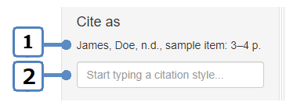

Table 4‑5. The elements in the "Cite as" screen

<table>
<thead>
<tr class="header">
<th>No.</th>
<th>Element</th>
<th>Description</th>
</tr>
</thead>
<tbody>
<tr class="odd">
<td>1</td>
<td>A bibliographic citation</td>
<td>
Displays a bibliographic citation.

The content of the bibliographic citation depends on the style specified.

The information appears differently depending on the display language. If there is no data specified for the language being used at a given time, the data set for English will be displayed. If there is no data specified for English, the data that is first displayed will be used.
</td>
</tr>
<tr class="even">
<td>2</td>
<td>The box showing "Start typing a citation style"</td>
<td>
Click to display a list of styles used for bibliographic citation. As you type, the matching candidates are filtered and displayed.

See "Figure 4-9. The style pull-down list" for information on the styles.
</td>
</tr>
</tbody>
</table>

Figure 4-9. The style pull-down list

### Export

Item metadata can be output in the JPCOAR, DublinCore, or DDI format.

Note that only the latest version of the metadata will be output.

Figure 4-10. The "Export" screen

zu040080.tif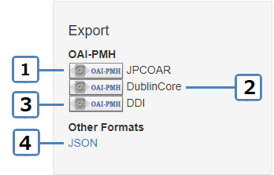

\<TBLATT POSITION="1" SCALE="151"\>

Table 4‑6. The elements in the "Export" screen

| No. | Element                 | Description                                                                 |
| --- | ----------------------- | --------------------------------------------------------------------------- |
| 1   | The "JPCOAR" button     | Click to generate OAI-PMH output in the JPCOAR format.                      |
| 2   | The "DublinCore" button | Click to generate OAI-PMH output in the DublinCore format.                  |
| 3   | The "DDI" button        | Click to generate OAI-PMH output in the DDI format.                         |
| 4   | The "JSON" link         | Click to generate output in the JSON format as an "Other Formats" option.   |
|     | The "BIBTEX" link       | Click to generate output in the BIBTEX format as an "Other Formats" option. |

### The Information screen

You can view the detailed information of the content file by clicking the "Information" button in the file information area.

Figure 4-11. The Information screen

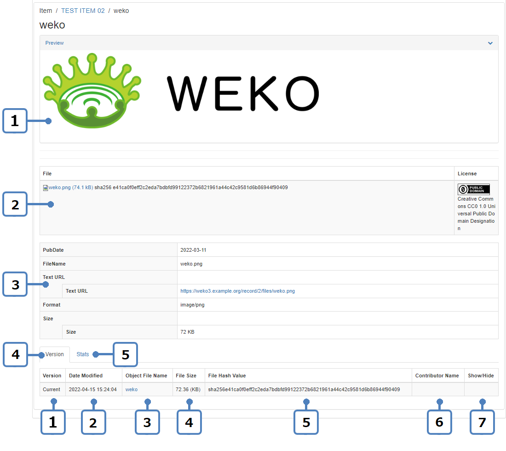

Figure 4-12. The "Stats" tab

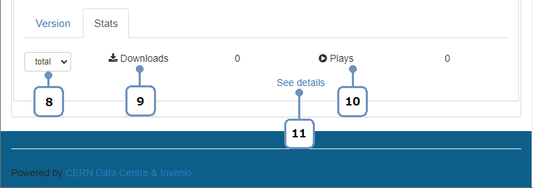

The following table explains each element in the Information screen.

Table 4‑7. The elements in the Information screen

<table>
<thead>
<tr class="header">
<th>No.</th>
<th>Element</th>
<th>Description</th>
</tr>
</thead>
<tbody>
<tr class="odd">
<td>1</td>
<td>The preview area</td>
<td>
Displays a preview of the corresponding content file.

* It is enabled when you specified the display format to "Preview" when registering the content file.
</td>
</tr>
<tr class="even">
<td>2</td>
<td>The file area</td>
<td>Displays a link to the filename and license information.</td>
</tr>
<tr class="odd">
<td>3</td>
<td>The file information area</td>
<td>
Displays detailed information about the content file. The information is based on the file information properties you specified when registering the item.

See "Section 5.1.1. Register items" under "(4) Register a file" for more information.
</td>
</tr>
<tr class="even">
<td>4</td>
<td>The "Version" tab</td>
<td>Displays detailed information about the file, including the version and hash value.</td>
</tr>
<tr class="odd">
<td>5</td>
<td>The "Stats" tab</td>
<td>Displays statistics of the content file, including the download count and playing count.</td>
</tr>
</tbody>
</table>

The following table explains the elements displayed in the "Version" and "Stats" tabs.

Table 4‑8. The "Version" and "Stats" tabs on the Information screen

| No. | Tab   | Element                     | Description                                                                                                                                                      |
| --- | ----- | --------------------------- | ---------------------------------------------------------------------------------------------------------------------------------------------------------------- |
| 1   | View  | Version                     | Displays the version information of the content file.                                                                                                            |
| 2   |       | Date Modified               | Displays the date and time when the content file was created.                                                                                                    |
| 3   |       | Object File Name            | Displays the content filename.                                                                                                                                   |
| 4   |       | File Size                   | Displays the file size of the content file.                                                                                                                      |
| 5   |       | File Hash Value             | Displays the hash value of the content file.                                                                                                                     |
| 6   |       | Contributor Name            | Displays the name of the user who registered the content file.                                                                                                   |
| 7   |       | Show/Hide                   | Indicates the show/hide setting of the contents file.                                                                                                            |
| 8   | Stats | The "total" pull-down       | Displays statistics of the content file. While the default is set to "total", you can also view the monthly statistics by selecting from the pull-down.          |
| 9   |       | Downloads                   | Displays the download count of the content file\*. The information will not reset even when the file is replaced, and the count will carry over to the new file. |
| 10  |       | Plays                       | Displays the preview count of the content file.                                                                                                                  |
| 11  |       | The "See details" pull-down | Displays the download count and the preview count of the content file for each country.                                                                          |

#   
Register items\</INDEXWORD\>

This chapter provides information on registering items.

## LINKID=addactivities【参照先】\<INDEXWORD PRONOUNCE="あいてむをとうろくする" INDEXITEM="アイテムを登録する"\>Register items\</INDEXWORD\>

When you register items in the System, you need to register workflow activities. This section explains how to register activities in the System.

After logging in to the System as a registered user, you can register activities from the "Workflow" screen. The following explains how to access the "Workflow" screen.

1.  From the Home screen, click the "Workflow" tab.

zu050010.tif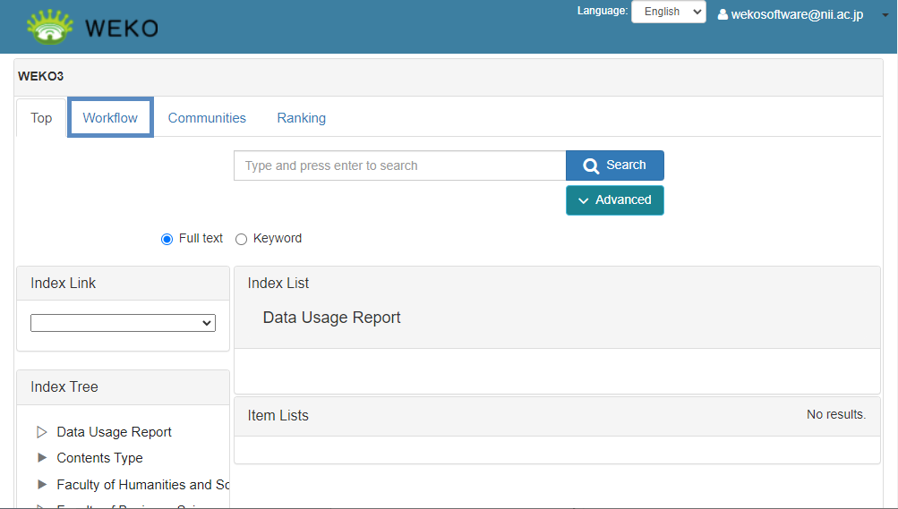

The activities list screen appears.

2.  Click the icon050010.tif button below the activities list.

zu050020.tif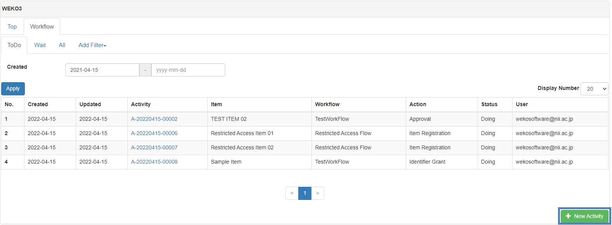

The workflow selection screen appears.

See "Section 5.2. View activities" for more information on this screen.

3.  In the workflow selection screen, click on the icon050020.tif button corresponding to the workflow of the item you want to register.

zu050030.tif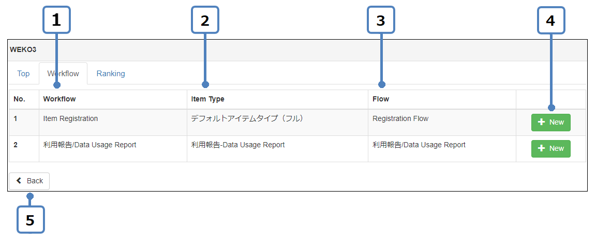

\<TBLATT POSITION="1" SCALE="151"\>

Table 5‑1. The elements in the workflow selection screen

| No. | Element                                                | Description                                                                                                                                                                               |
| --- | ------------------------------------------------------ | ----------------------------------------------------------------------------------------------------------------------------------------------------------------------------------------- |
| 1   | Workflow                                               | A series of data registration processes that combine an item type and flows. It is created by the administrator.                                                                          |
| 2   | Item Type                                              | The data type to be registered.                                                                                                                                                           |
| 3   | Flow                                                   | A combination of processes (actions) to be performed when registering data. For information on each action, see "ANCHORID=stepaction【参照元】Table 5-2. The actions in the "Step" screen【E】". |
| 4   | The icon050020.tif button | Click to access to the "Action" screen.                                                                                                                                                   |
| 5   | The icon050270.tif button  | Click to access to the activities list screen.                                                                                                                                            |

The "Step" screen for the flow set at the start of the selected workflow appears.zu050035.tif

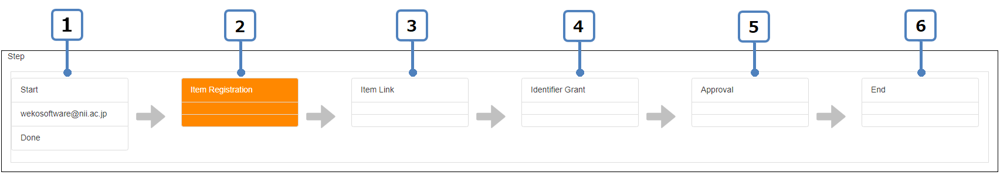

\<TBLATT POSITION="1" SCALE="151"\>

LINKID=stepaction【参照先】Table 5‑2. The actions in the "Step" screen

| No. | Action Name       | Description                                                   |
| --- | ----------------- | ------------------------------------------------------------- |
| 1   | Start             | The action to start item registration.                        |
| 2   | Item Registration | The action to register the item's metadata and content files. |
| 3   | Item Link         | The action to set a link to the item.                         |
| 4   | Identifier Grant  | The action to grant the item a DOI.                           |
| 5   | Approval          | The action to review/approve the item.                        |
| 6   | End               | The action to end item registration.                          |

4.  Perform the actions corresponding to the "Step" screen for the flow displayed.

See "ANCHORID=additem【参照元】Section 5.1.1. Register items【E】" through "ANCHORID=adddoi【参照元】Section 5.1.4. Gant DOIs【E】" for more information.

### LINKID=additem【参照先】Register items

This section explains how to specify files and metadata for an activity.

#### Register an item thumbnail

This section explains how to register an item thumbnail.

1.  In the Item Registration screen, drag and drop the file you want to register in the "Drop files or folders here" section, or click the icon050070.tif button.

zu050110.tif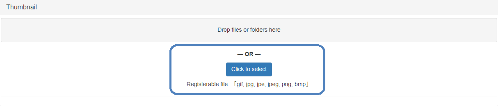

The file selection dialog appears.

5.  In the file selection dialog, select a file to upload and click the "Open" button.

The file information appears.

zu050120.tif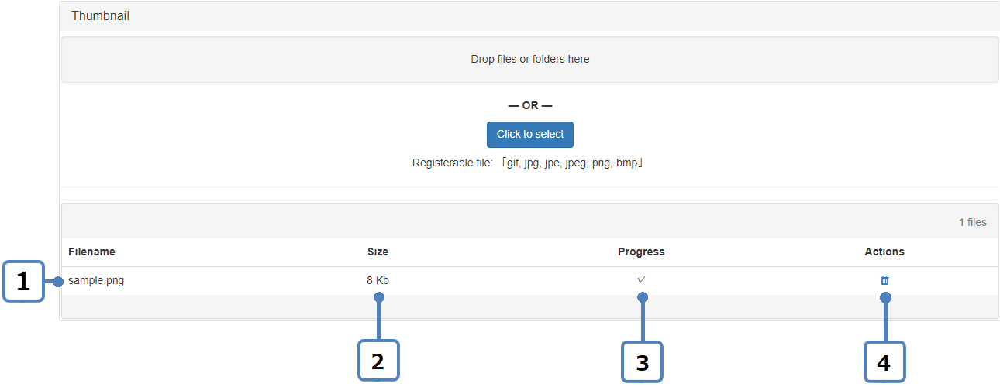

\<TBLATT POSITION="1" SCALE="151"\>

Table 5-5. The elements in the thumbnail registration screen

| No. | Element                                              | Description                                                                                          |
| --- | ---------------------------------------------------- | ---------------------------------------------------------------------------------------------------- |
| 1   | Filename                                             | Displays the name of the file to be registered.                                                      |
| 2   | Size                                                 | Displays the size of the file to be registered.                                                      |
| 3   | Progress                                             | Displays icon050060.tif when the file registration completes. |
| 4   | Action (icon050040.tif) | Click to delete the registered file.                                                                 |

#### Automatically populate metadata

This section explains how to automatically populate metadata from an external database.

1.  In the Item Registration screen, click the  button.
    
    The "Automatic metadata input" screen appears.
    
    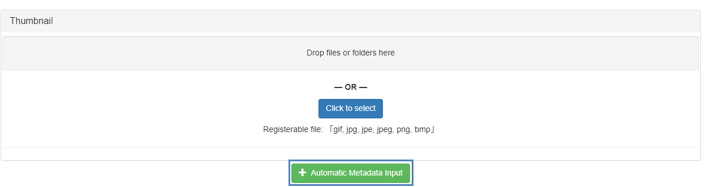

<!-- end list -->

6.  In the "Automatic metadata input" window, select "Select the ID", enter the ID, and then click the  button.
    
    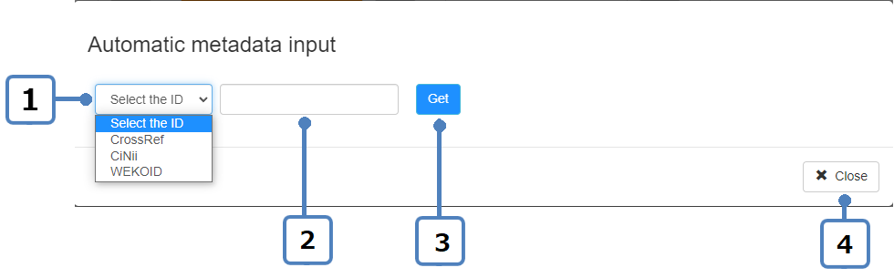

Table 5‑6. The elements in the "Automatic metadata input" screen

<table>
<thead>
<tr class="header">
<th>No.</th>
<th>Element</th>
<th>Description</th>
</tr>
</thead>
<tbody>
<tr class="odd">
<td>1</td>
<td>Select the ID</td>
<td>
Select an external database.

You can use <a href="http://www.crossref.org/">CrossRef</a>, CiNii and WEKOID as external databases.

* With WEKOID, you can utilize metadata by specifying the id. You cannot import elements that are not mapped with the JPCOAR schema. You also cannot import Hide elements. Your WEKOID needs to have permission to edit.
</td>
</tr>
<tr class="even">
<td>2</td>
<td>ID</td>
<td>Enter the relevant ID.</td>
</tr>
<tr class="odd">
<td>3</td>
<td>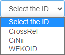icon050050.tif</td>
<td>
Click to retrieve the information according to the specified type and the ID. The retrieved results will be automatically entered into the metadata element with JPCOAR mapping in the Item Registration screen.

<ul>
<li><blockquote>

For the CrossRef API, the JPCOAR schema is mapped as follows:

</blockquote></li>
</ul>
<ul>
<li><blockquote>

dc:title

</blockquote></li>
<li><blockquote>

dc:language

</blockquote></li>
<li><blockquote>

jpcoar:creatorName

</blockquote></li>
<li><blockquote>

jpcoar:numPages, jpcoar:pageStart, jpcoar:pageEnd

</blockquote></li>
<li><blockquote>

datacite:date

</blockquote></li>
<li><blockquote>

dc:publisher

</blockquote></li>
<li><blockquote>

jpcoar:relatedIdentifier

</blockquote></li>
</ul></td>
</tr>
<tr class="even">
<td>4</td>
<td>The icon050050.tif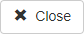 button</td>
<td>Click to close the "Automatic metadata input" screen without saving the information in the metadata entry fields of the Item Registration screen.</td>
</tr>
</tbody>
</table>

Additional Information:

・When multiple properties share the same mapping information, only the first property (the top one) will be used. For example, if an item type contains properties "ISBN" and "ISSN" in this order, and both are mapped to "jpcoar:sourceIdentifier", data imported via the "Automatic metadata input" screen will be mapped to "ISBN".

#### Set up a proxy contributor

This section explains how to set up a proxy contributor.

1.  In the Item Registration screen, select the "Other user" radio button to specify a proxy contributor.

zu050540.tif

The entry fields for the user information appear.

7.  Enter the username and email address in the user information entry fields.

zu050545.tif

As you enter text in the "Username" or "Email", the matching users registered in the repository are filtered and displayed in the list of candidates. When you select a user from the list of users, the username and email address of the selected user will be populated.

If the user you specify does not exist in the repository, the error message "Shared user information is not valid/Please check it again\!" will appear.

If you specify the user who registered the item, the error message "You cannot specify yourself in 'Other users' setting" will appear.

#### Register a file

This section explains how to register a file.

1.  In the Item Registration screen, drag and drop the file you want to register in the "Drop files or folders here" section, or click the icon050030.tif button.

zu050090.tif

The file selection dialog appears.

8.  In the file selection dialog, select a file to upload and click the "Open" button.

The file information appears.

If another file with the same name is already being used, the error message "The same file name cannot be registered" will appear.

> 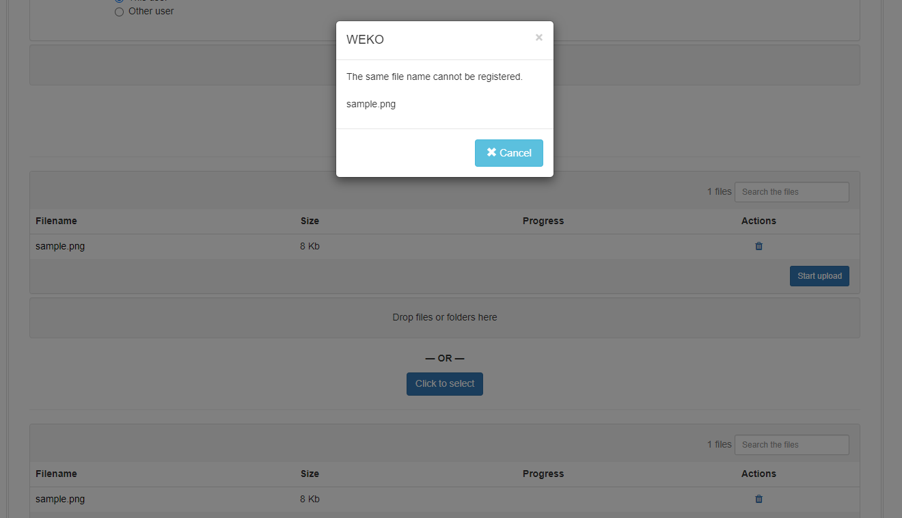

9.  Click on the icon050050.tif button in the displayed file information.

zu050100.tif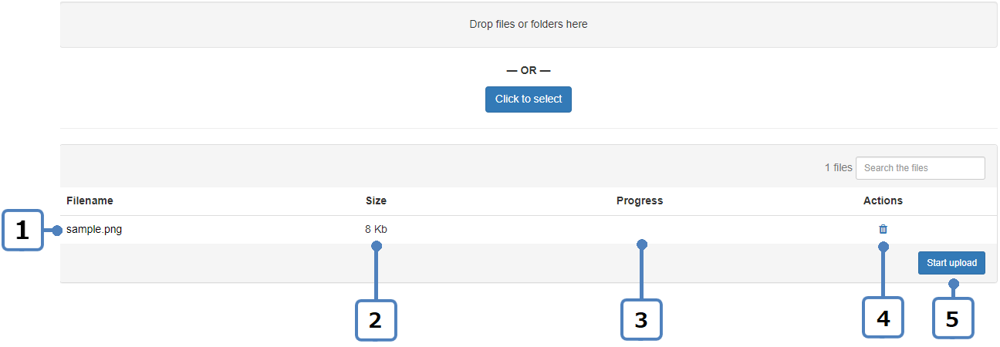

\<TBLATT POSITION=”1” SCALE=”151”\>　　The file is uploaded.

If the file exceeds the maximum size allowed for the repository, the error message "Error:Location has no quota" will be displayed and the file cannot be registered.

When the upload completes successfully, the filename, text URL, format, and size information will be automatically populated.

Additional Information:

> If you enter multiple values, their display order in the item details screen will be the same as that of the file information entry area in the Item Registration screen.
> 
> You can also change the file display order in the item details screen by dragging and dropping the files to rearrange them in the input area.

Table 5‑7. The elements in the Item Registration screen

| No. | Element                                                          | Description                                                                                                                                                                                                                    |
| --- | ---------------------------------------------------------------- | ------------------------------------------------------------------------------------------------------------------------------------------------------------------------------------------------------------------------------ |
| 1   | "Filename"                                                       | Displays the name of the file to be registered.                                                                                                                                                                                |
| 2   | "Size"                                                           | Displays the size of the file to be registered.                                                                                                                                                                                |
| 3   | "Progress"                                                       | When you click the icon050050.tif button, the upload starts, and its progress appears in "%". Displays icon050060.tif when the upload completes. |
| 4   | The icon050040.tif button           | Click to delete the registered file.                                                                                                                                                                                           |
| 5   | The icon050050.tif button | Click to start uploading the file.                                                                                                                                                                                             |

10. Enter the file information.

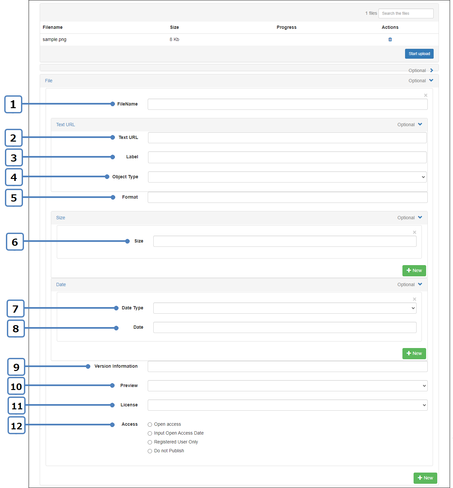

The information in the file for restricted access is as follows

The entry elements are the same as the file information up to the license field.

> 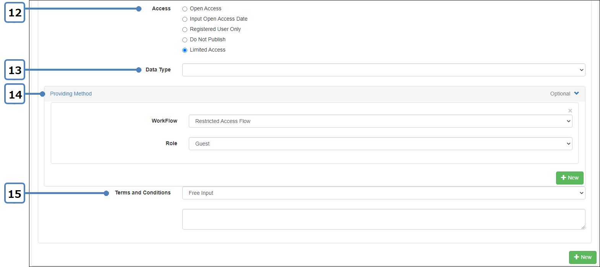

Table 5-8. The elements in the file information screen

<table>
<thead>
<tr class="header">
<th>No.</th>
<th>Element</th>
<th>Description</th>
</tr>
</thead>
<tbody>
<tr class="odd">
<td>1</td>
<td>Filename</td>
<td>Displays the name of the uploaded file. You can also enter the information manually without uploading a file.</td>
</tr>
<tr class="even">
<td>2</td>
<td>Text URL</td>
<td>
Displays the URL of the uploaded file.

If you specify a file uploaded to WEKO3, the URL of the file will be automatically set up and cannot be changed.

If you entered the filename manually, you also need to enter the URL manually.
</td>
</tr>
<tr class="odd">
<td>3</td>
<td>Label</td>
<td>
Enter the link name of the file to be displayed on the item details screen. The filename will be displayed when you do not enter this information.

See the section "(5) Set up a file" for information on the link name.
</td>
</tr>
<tr class="even">
<td>4</td>
<td>Object Type</td>
<td>Specify the object type of the file. See "ANCHORID=language【参照元】Figure 5-1. The "Object Type" pull-down list【E】" for options.</td>
</tr>
<tr class="odd">
<td>5</td>
<td>Format</td>
<td>
Enter the file format.

If you specify a file uploaded to WEKO3, the format of the file will be automatically set up but can be changed.

If you enter the filename manually, it will not be set up automatically.
</td>
</tr>
<tr class="even">
<td>6</td>
<td>Size</td>
<td>
Enter the file size.

If you specify a file uploaded to WEKO3, the file size will be automatically set up but can be changed.

If you enter the filename manually, it will not be set up automatically.

You can specify multiple sizes.
</td>
</tr>
<tr class="odd">
<td>7</td>
<td>Date Type (for "Date")</td>
<td>
Select a date type.

See "Figure 5-2. The "Date Type" pull-down list" for options.
</td>
</tr>
<tr class="even">
<td>8</td>
<td>Date (for "Date")</td>
<td>Select the date from the pull-down list or enter it manually. Enter a date as <em>yyyy-mm-dd, yyyy-mm, or yyyy</em> in the ISO-8601 format.</td>
</tr>
<tr class="odd">
<td>9</td>
<td>Version Information</td>
<td>Enter the version information of the file.</td>
</tr>
<tr class="even">
<td>10</td>
<td>Preview</td>
<td>
Specify the file preview format.

See the section "(5) Set up a file" for more information.
</td>
</tr>
<tr class="odd">
<td>11</td>
<td>License</td>
<td>
Specify the license of the file.

See the section "(5) Set up a file" for more information.

Note that the "License" search for advanced searches is performed based on the value configured in this field.
</td>
</tr>
<tr class="even">
<td>12</td>
<td>Access</td>
<td>
Specify how the file is published.

See the section "(6) Specify how the file is published" for more information.
</td>
</tr>
<tr class="odd">
<td>13</td>
<td>Data Type</td>
<td>
This element appears when "Access" is set to "Restricted Access".

The options defined in the properties are shown.
</td>
</tr>
<tr class="even">
<td>14</td>
<td>Providing Method</td>
<td>
This element appears when "Access" is set to "Restricted Access".

Specify which usage application workflow will launch when a user who clicks "Apply" on the item details screen. When multiple options can be set up (repeatable), the following elements will be included as child elements:

◾"Workflow": From the workflows managed in "Admin" &gt; "WorkFlow" &gt; "WorkFlow List", lists those with "Restricted Access Flag" enabled.

◾"Role": Lists the roles managed by "Admin" &gt; "UserManagement" &gt; "Role" and "non-logged-in users"
</td>
</tr>
<tr class="odd">
<td>15</td>
<td>Terms and Conditions</td>
<td>
This element appears when "Access" is set to "Restricted Access".

Displays a list of terms and conditions configured in the Administration screen. A "Free Input" option is provided, and a text area will be displayed when it is selected.
</td>
</tr>
</tbody>
</table>

> Figure 5-1. The "Object Type" pull-down list
> 
> 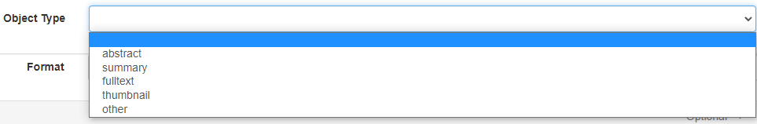
> 
> Figure 5-2. The "Date Type" pull-down list
> 
> 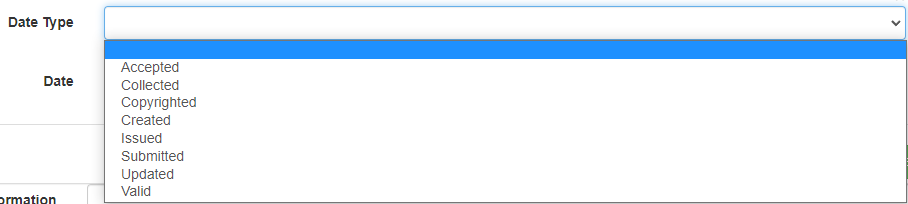

#### Set up a file

This section explains how to set up the file preview format, the link name to the text, and license display.

1.  In the Item Registration screen, select the file you want to set as the display name of the contents file.

LINKID=displayname【参照先】Figure 5-3. The "Display Name" pull-down list

zu050190.tif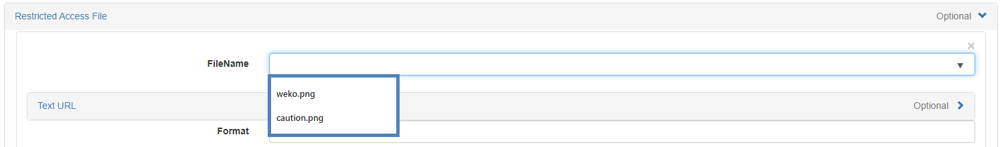

11. Select the preview format from the pull-down list.

LINKID=displaycase【参照先】Figure 5-4. The "Preview" pull-down list

zu050200.tif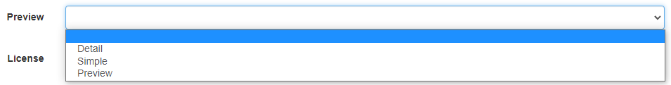

\<TBLATT POSITION="1" SCALE="151"\>

Table 5-9. The elements in the "Preview" pull-down list

| No. | Preview | Description                                                                                |
| --- | ------- | ------------------------------------------------------------------------------------------ |
| 1   | Detail  | Displays the link name to the text, the file size, and the license.                        |
| 2   | Simple  | Displays the link name to the text only.                                                   |
| 3   | Preview | Displays a preview of the file, the link name to the text, the file size, and the license. |

Notes:

The Preview display must be configured in the WEKO Administration.

> The file formats that can be used for "Preview" are as follows: md, json, xml, csv, pdf, png, jpg, gif, zip, jpynb, mp3, mp4, webm, ogg, wav, doc, docx, xls, xlsx, ppt, and pptx.
> 
> If an error occurs in the preview display, the error message will appear in the preview display area.

12. Select a license from the pull-down list.

LINKID=displaylicense【参照先】Figure 5-5. The "License" pull-down listzu050210.tif

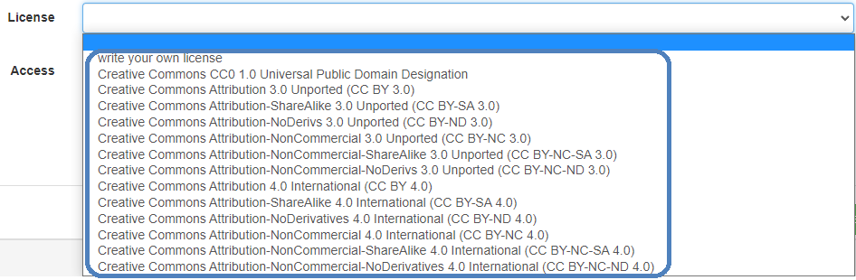

\<TBLATT POSITION="1" SCALE="151"\>

Table 5-10. The elements in the "License" screen

<table>
<thead>
<tr class="header">
<th>No.</th>
<th>Element</th>
<th>Description</th>
</tr>
</thead>
<tbody>
<tr class="odd">
<td>1</td>
<td>Free Input</td>
<td>A text area will appear when this option is selected. You can enter the license information manually. See "Figure 5-6. The "Free Input" text boxLINKID=displaycase【参照先】.</td>
</tr>
<tr class="even">
<td>2</td>
<td>Creative Commons CC0 1.0 Universal Public Domain Designation</td>
<td>Publishes to the public domain.</td>
</tr>
<tr class="odd">
<td>3</td>
<td>Creative Commons Attribution 3.0 Unported (CC BY 3.0)</td>
<td><ul>
<li>
License version: 3.0
</li>
<li>
Displays the author.
</li>
<li>
It is an unported license.
</li>
</ul></td>
</tr>
<tr class="even">
<td>4</td>
<td>Creative Commons Attribution - ShareAlike 3.0 Unported (CC BY-SA 3.0)</td>
<td><ul>
<li>
License version: 3.0
</li>
<li>
Displays the author.
</li>
<li>
Inherits the original license in derivative works.
</li>
<li>
It is an unported license.
</li>
</ul></td>
</tr>
<tr class="odd">
<td>5</td>
<td>Creative Commons Attribution - NoDerivs 3.0 Unported (CC BY-ND 3.0)</td>
<td><ul>
<li>
License version: 3.0
</li>
<li>
Displays the author.
</li>
<li>
Prohibits modification to the work.
</li>
<li>
It is an unported license.
</li>
</ul></td>
</tr>
<tr class="even">
<td>6</td>
<td>Creative Commons Attribution - NonCommercial 3.0 Unported (CC BY-NC 3.0)</td>
<td><ul>
<li>
License version: 3.0
</li>
<li>
Displays the author.
</li>
<li>
Limits the use to non-commercial purposes only.
</li>
<li>
It is an unported license.
</li>
</ul></td>
</tr>
<tr class="odd">
<td>7</td>
<td>Creative Commons Attribution - NonCommercial - ShareAlike 3.0 Unported (CC BY-NC-SA 3.0)</td>
<td><ul>
<li>
License version: 3.0
</li>
<li>
Displays the author.
</li>
<li>
Limits the use to non-commercial purposes only.
</li>
<li>
Inherits the original license in derivative works.
</li>
<li>
It is an unported license.
</li>
</ul></td>
</tr>
<tr class="even">
<td>8</td>
<td>Creative Commons Attribution - NonCommercial - NoDerivs 3.0 Unported (CC BY-NC-ND 3.0)</td>
<td><ul>
<li>
License version: 3.0
</li>
<li>
Displays the author.
</li>
<li>
Limits the use to non-commercial purposes only.
</li>
<li>
Prohibits modification to the work.
</li>
<li>
It is an unported license.
</li>
</ul></td>
</tr>
<tr class="odd">
<td>9</td>
<td>Creative Commons Attribution 4.0 International (CC BY 4.0)</td>
<td><ul>
<li>
License version: 4.0
</li>
<li>
Displays the author.
</li>
</ul></td>
</tr>
<tr class="even">
<td>10</td>
<td>Creative Commons Attribution - ShareAlike 4.0 International (CC BY-SA 4.0)</td>
<td><ul>
<li>
License version: 4.0
</li>
<li>
Displays the author.
</li>
<li>
Inherits the original license in derivative works.
</li>
</ul></td>
</tr>
<tr class="odd">
<td>11</td>
<td>Creative Commons Attribution - NoDerivatives 4.0 International (CC BY-ND 4.0)</td>
<td><ul>
<li>
License version: 4.0
</li>
<li>
Displays the author.
</li>
<li>
Prohibits modification to the work.
</li>
</ul></td>
</tr>
<tr class="even">
<td>12</td>
<td>Creative Commons Attribution - NonCommercial 4.0 International (CC BY-NC 4.0)</td>
<td><ul>
<li>
License version: 4.0
</li>
<li>
Displays the author.
</li>
<li>
Limits the use to non-commercial purposes only.
</li>
</ul></td>
</tr>
<tr class="odd">
<td>13</td>
<td>Creative Commons Attribution - NonCommercial - ShareAlike 4.0 International (CC BY-NC-SA 4.0)</td>
<td><ul>
<li>
License version: 4.0
</li>
<li>
Displays the author.
</li>
<li>
Limits the use to non-commercial purposes only.
</li>
<li>
Inherits the original license in derivative works.
</li>
</ul></td>
</tr>
<tr class="even">
<td>14</td>
<td>Creative Commons Attribution - NonCommercial - NoDerivatives 4.0 International (CC BY-NC-ND 4.0)</td>
<td><ul>
<li>
License version: 4.0
</li>
<li>
Displays the author.
</li>
<li>
Limits the use to non-commercial purposes only.
</li>
<li>
Prohibits modification to the work.
</li>
</ul></td>
</tr>
</tbody>
</table>

Figure 5-6. The "Free Input" text box

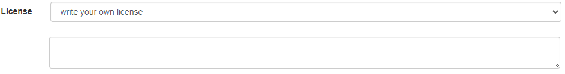

#### Specify how the file is published

This section explains how to set up how the file is published.

1.  Specify the publishing method by selecting an "Access" radio button.

zu050220.tif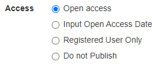

The access information for restricted access appears as follows

\<TBLATT POSITION="1" SCALE="151"\>

Table 5-11 The "Access" radio buttons with publishing options

<table>
<thead>
<tr class="header">
<th>No.</th>
<th>Publishing option</th>
<th>Description</th>
</tr>
</thead>
<tbody>
<tr class="odd">
<td>1</td>
<td>Open access</td>
<td>All users can download the file.</td>
</tr>
<tr class="even">
<td>2</td>
<td>Input Open Access Date</td>
<td>
Specify when the file is published

<ul>
<li>
Only logged-in users can download the file before the specified publish date.
</li>
<li>
All users can download the file from the specified publish date.

See "Figure 5-7. The "PubDate" text box".
</li>
</ul></td>
</tr>
<tr class="odd">
<td>3</td>
<td>Registered User Only</td>
<td>
Specify the user's group.

Only users who belong to the group can download the file.

See "Figure 5-8. The "Group" text box".
</td>
</tr>
<tr class="even">
<td>4</td>
<td>Do not Publish</td>
<td>Only the administrator, creator and proxy contributor of the item can download the file.</td>
</tr>
<tr class="odd">
<td>5</td>
<td>Restricted Access</td>
<td>
When you click this option, the elements No. 13 through No. 15 described in "Table 5-8. The elements in the file information screen" will be displayed. See the table for more information.

Selecting "Restricted Access" does not automatically set up "Access Rights". See Section (14) for "Access Rights".
</td>
</tr>
</tbody>
</table>

> Figure 5-7. The "PubDate" text box
> 
> 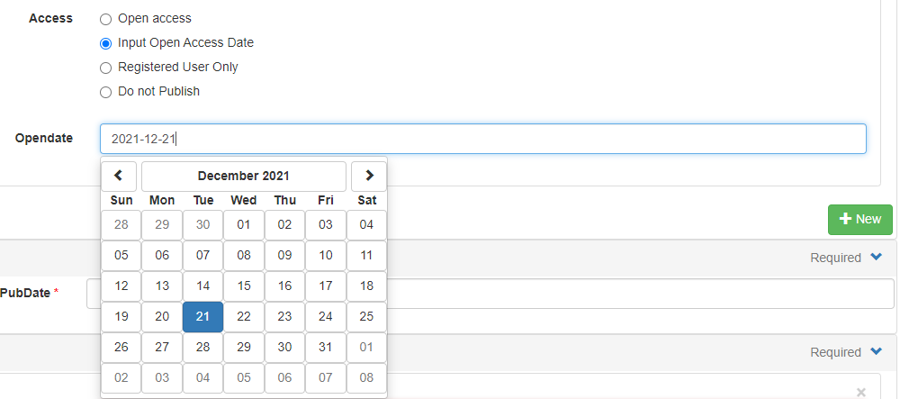
> 
> Figure 5-8. The "Group" text box
> 
> 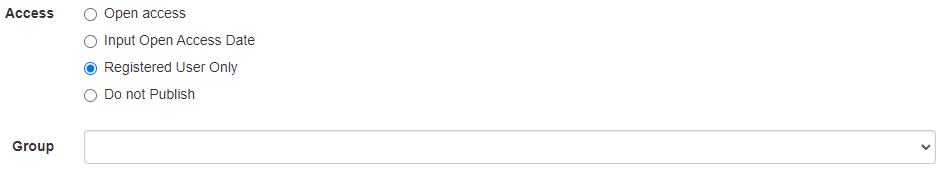

Additional Information: How to replace files

You may replace a file attached to the item while editing an item (you can replace the file and still carry over the statistics using the new file).

If a file is attached to the file, the "Replace" button will appear in the "Actions" column. To replace a file, click on the "Replace" button and select a replacement.

Clicking the "Replace" button will open where you can select a replacement file. The name of the selected file will appear in red text on the screen. You can then click the "Start upload" button to import the file. The file information, including the filename, text URL, format, and size, will be overwritten to reflect the change.

#### Set up a billing file

When the metadata attribute is a billing file, you can set a price for each group.

See Steps 1, 2, and 3 in "(4) Register a file" for information on how to upload a billing file.

This section explains how to specify information on a billing file.

1.  Enter the billing file information.
    
    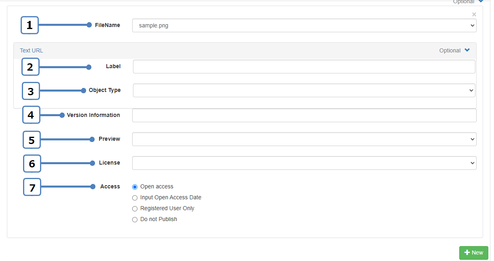
    
    Table 5-12. The elements in the "Billing File Information" screen

<table>
<thead>
<tr class="header">
<th>No.</th>
<th>Element</th>
<th>Description</th>
</tr>
</thead>
<tbody>
<tr class="odd">
<td>1</td>
<td>Display Name</td>
<td>Displays the name of the registered file.</td>
</tr>
<tr class="even">
<td>2</td>
<td>Label</td>
<td>
Enter the link name of the file to be displayed on the item details screen. The filename will be displayed in the item details screen when you do not enter this information.

See the section "(5) Set up a file" for information on the link name.
</td>
</tr>
<tr class="odd">
<td>3</td>
<td>Object Type</td>
<td>
Select the object type of the file.

See "ANCHORID=language【参照元】Figure 5-1. The "Object Type" pull-down list【E】" for options.
</td>
</tr>
<tr class="even">
<td>4</td>
<td>Version Information</td>
<td>Enter the version information of the file.</td>
</tr>
<tr class="odd">
<td>5</td>
<td>Preview</td>
<td>
Specify the file preview format.

See the section "(5) Set up a file" for more information.
</td>
</tr>
<tr class="even">
<td>6</td>
<td>License</td>
<td>
Specify the license of the file.

See the section "(5) Set up a file" for more information.
</td>
</tr>
<tr class="odd">
<td>7</td>
<td>Access</td>
<td>
Specify how the file is published.

See the section "(8) Specify how the billing file is published" for more information.
</td>
</tr>
</tbody>
</table>

3)  \<TBLATT POSITION="1" SCALE="151"\>
    
    1.  #### Specify how the billing file is published

This section explains how to set up how the billing file is published.

1.  Specify the publishing method by selecting an "Access" radio button.

zu050220.tif

\<TBLATT POSITION="1" SCALE="151"\>

Table 5-13 The "Access" radio buttons with publishing options

<table>
<thead>
<tr class="header">
<th>No.</th>
<th>Publishing option</th>
<th>Description</th>
</tr>
</thead>
<tbody>
<tr class="odd">
<td>1</td>
<td>Open access</td>
<td>All users can download the file.</td>
</tr>
<tr class="even">
<td>2</td>
<td>Input Open Access Date</td>
<td>
Specify when the file is published

<ul>
<li>
Only logged-in users can download the file before the specified publish date.
</li>
<li>
All users can download the file from the specified publish date.

See "Figure 5-8. The "Group" text box".
</li>
</ul></td>
</tr>
<tr class="odd">
<td>3</td>
<td>Registered User Only</td>
<td>
Specify the user's group and price.

Users will not be able to download the billing file if their group does not have a price set up. 
If the user belongs to more than one group, the lowest applicable price will be used. See "Figure 5-9. The "Group/Price" area".
</td>
</tr>
<tr class="even">
<td>4</td>
<td>Do not Publish</td>
<td>Only the administrator, creator and proxy contributor of the item can download the file.</td>
</tr>
</tbody>
</table>

> Figure 5-9. The "Group Name/Price" area
> 
> 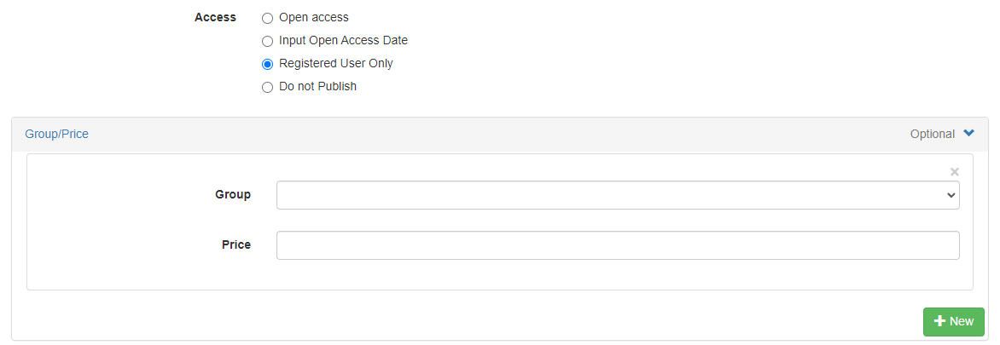

#### Metadata input elements

This section explains the elements used for specifying metadata.

In the Item Registration screen, enter the required elements for the item.

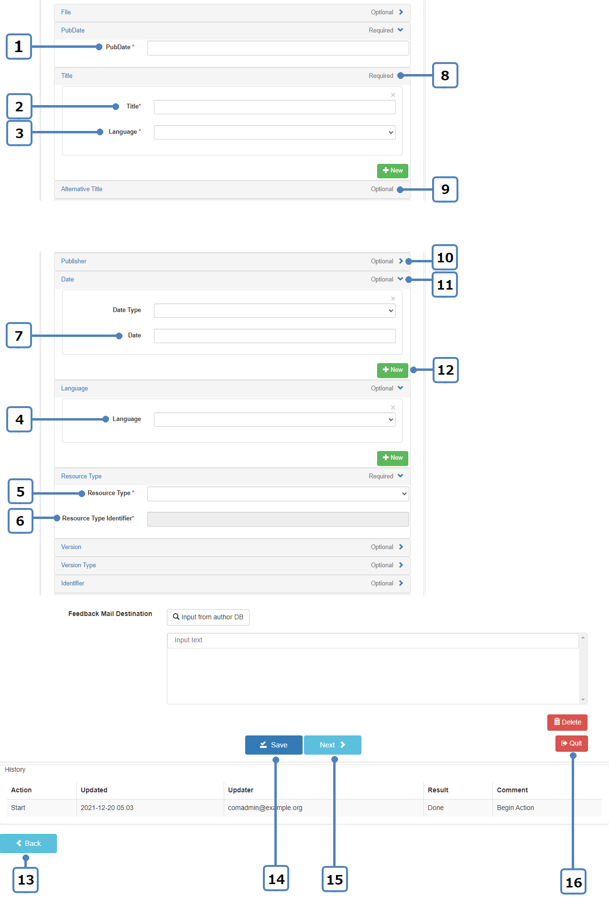

\<TBLATT POSITION="1" SCALE="151"\>

Table 5-14. The elements in the Item Registration screen

<table>
<thead>
<tr class="header">
<th>No.</th>
<th>Element</th>
<th>Description</th>
</tr>
</thead>
<tbody>
<tr class="odd">
<td>1</td>
<td>"PubDate" pull-down list*</td>
<td>Select the publish date from the pull-down list or enter it manually. Enter a date in the <em>yyyy-mm-dd</em> format. To select from the pull-down list, see "ANCHORID=pubdate【参照元】Figure 5‑10. "PubDate" pull-down list【E】".</td>
</tr>
<tr class="even">
<td>2</td>
<td>The "Title" text box under "Title"*</td>
<td>Enter a title.</td>
</tr>
<tr class="odd">
<td>3</td>
<td>The "Language" pull-down list under "Title"*</td>
<td>Select an option from the pull-down list. See "ANCHORID=language【参照元】Figure 5-11. The "Language" pull-down list【E】".</td>
</tr>
<tr class="even">
<td>4</td>
<td>The "Language" pull-down list under "Language"**</td>
<td>Select an option from the pull-down list. See "ANCHORID=country【参照元】Figure 5-12. The "Language" pull-down list【E】".</td>
</tr>
<tr class="odd">
<td>5</td>
<td>The "Resource Type" pull-down list under "Resource Type"*</td>
<td>Select an option from the pull-down list. See "Figure 5-13. The "Resource Type" pull-down list【E】".</td>
</tr>
<tr class="even">
<td>6</td>
<td>The "Resource Type Identifier" text box under "Resource Type"*</td>
<td>The value is populated automatically when you select an option from the "Resource Type" pull-down.</td>
</tr>
<tr class="odd">
<td>7</td>
<td>The "Date" pull-down list under "Date"</td>
<td>Select the date from the pull-down list or enter it manually. Enter a date as <em>yyyy-mm-dd, yyyy-mm, or yyyy</em> in the ISO-8601 format.</td>
</tr>
<tr class="even">
<td>8</td>
<td>The "Required" panel</td>
<td>
The "Required" panel displays for those elements whose "Option" attribute is set to "Required" in the "Metadata" screen from the Administration screen.

The panel is shown expanded as the initial state.
</td>
</tr>
<tr class="odd">
<td>9</td>
<td>The "Optional" panel</td>
<td>
The "Optional" panel displays for those elements whose "Option" attribute is not set to "Required" in the "Metadata" screen from the Administration screen.

The panel is shown collapsed as the initial state.
</td>
</tr>
<tr class="even">
<td>10</td>
<td>The  button</td>
<td>Click to collapse the panel.</td>
</tr>
<tr class="odd">
<td>11</td>
<td>The  button</td>
<td>Click to expand the panel.</td>
</tr>
<tr class="even">
<td>12</td>
<td>The  button</td>
<td>
Click to add an input area for the corresponding element.

Displays the  button for those elements whose "Option" attribute is set to "Allow Multiple" in the "Metadata" screen from the Administration screen.
</td>
</tr>
<tr class="odd">
<td>13</td>
<td>The icon050085.tif button</td>
<td>Click to save the specified information temporarily.</td>
</tr>
<tr class="even">
<td>14</td>
<td>The icon050250.tif button</td>
<td>Click to navigate to the "Specific index" screen. See "ANCHORID=createindex【参照元】Section 5.1.2. Set up an index【E】".</td>
</tr>
<tr class="odd">
<td>15</td>
<td>The icon050260.tif button</td>
<td>Clicking this button will not save the information entered, and you will return to the workflow selection screen.</td>
</tr>
<tr class="even">
<td>16</td>
<td>The icon050240.tif button</td>
<td>Click to discard the input and terminate the activity you are working on.</td>
</tr>
</tbody>
</table>

> \* Notes:

The asterisk (\*) denotes a required entry.

The required elements, however, vary depending on the item type.

> **Notes:**
> 
> CNRI will be registered when the Item Registration action is complete.
> 
> The prefix is a value set in the configuration file.
> 
> The suffix is a unique value returned by the LHS (Local Handle Server).

LINKID=pubdate【参照先】Figure 5-10. The "PubDate" pull-down list

zu050050.tif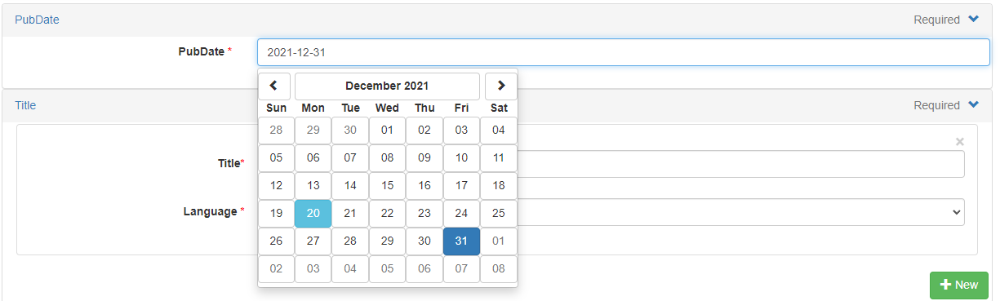

LINKID=language【参照先】Figure 5-11. The "Language" pull-down list

zu050060.tif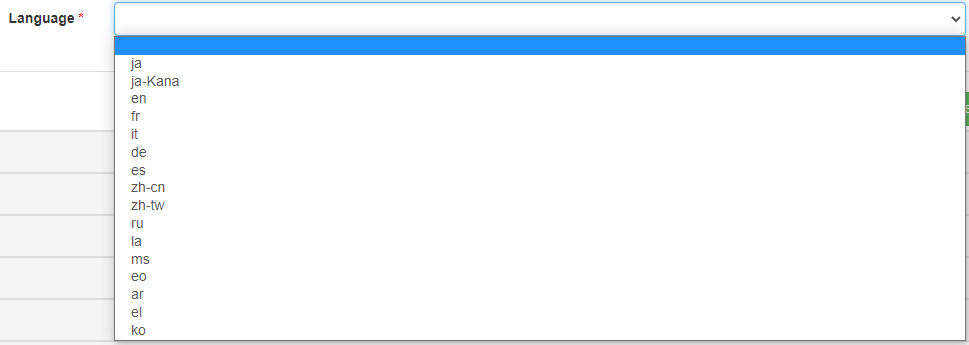

LINKID=country【参照先】Figure 5-12. The "Language" pull-down list

zu050070.tif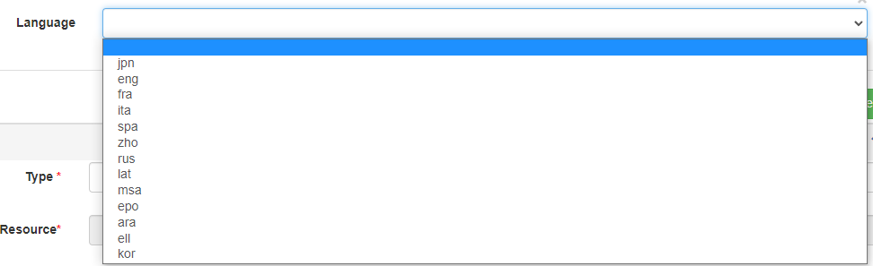

LINKID=type【参照先】Figure 5-13. The "Resource Type" pull-down list

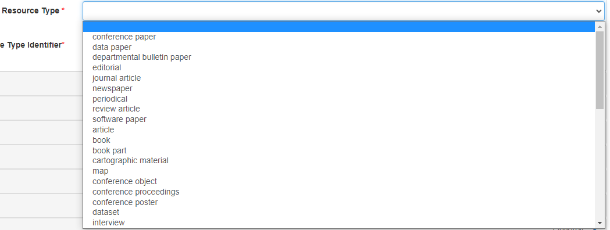

Additional Information:

If you enter multiple values for a single metadata element, their display order in the item details screen will be the same as that of the metadata element entry area in the Item Registration screen. You can also change the metadata display order in the item details screen by dragging and dropping the metadata to rearrange them in the input area.

zu050080.tif

#### Enter a creator name

Select or directly enter a creator information from the creator search screen.

This section explains how to select a creator in the creator search screen.

1.  In the Item Registration screen, click the icon050110.tif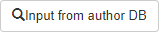 button displayed in the creator section.

The creator search screen appears.

13. In the creator search screen, enter a keyword in the "Search" text box and click the icon050120.tif button.

zu050130.tif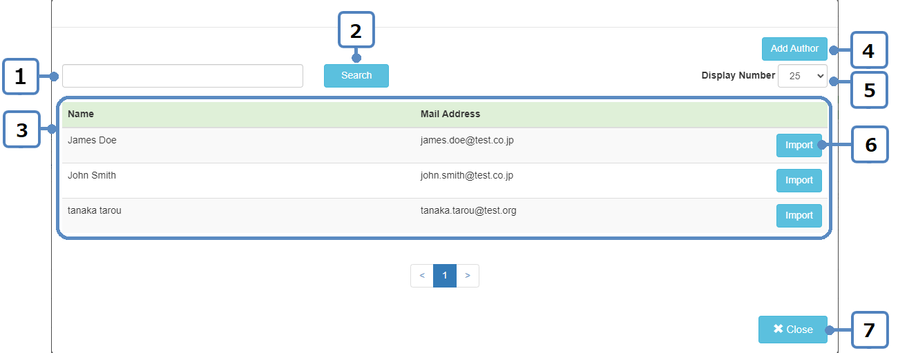

\<TBLATT POSITION="1" SCALE="151"\>

Table 5-15. The elements in the creator search screen

<table>
<thead>
<tr class="header">
<th>No.</th>
<th>Element</th>
<th>Description</th>
</tr>
</thead>
<tbody>
<tr class="odd">
<td>1</td>
<td>The "Search" text box (search key)</td>
<td>Enter the name or email address you are searching. The search will be performed for matching values.</td>
</tr>
<tr class="even">
<td>2</td>
<td>
The icon050120.tif button
</td>
<td>Click to perform the search according to the specified search criteria. The search results will be displayed in a list.</td>
</tr>
<tr class="odd">
<td>3</td>
<td>A list of creators</td>
<td>A list of creators is shown, including the names and email addresses.</td>
</tr>
<tr class="even">
<td>4</td>
<td>The icon050150.tif button</td>
<td>Click to display the "Add Author" screen. Enter the creator information. See "ANCHORID=writeradd【参照元】Figure 5-14. The "Add Author" screen【E】".</td>
</tr>
<tr class="odd">
<td>5</td>
<td>The icon050160.tif pull-down list</td>
<td>Select the number of rows displayed in the list of creators from the pull-down list. See "ANCHORID=displaynumber【参照元】Figure 5-15. The "Display Number" pull-down list【E】".</td>
</tr>
<tr class="even">
<td>6</td>
<td>The icon050130.tif button</td>
<td>Click to close the creator search screen. The creator information will be populated in the creator entry fields of the Item Registration screen.</td>
</tr>
<tr class="odd">
<td>7</td>
<td>The icon050140.tif button</td>
<td>Click to close the creator search screen without saving the information in the creator entry fields of the Item Registration screen.</td>
</tr>
</tbody>
</table>

LINKID=writeradd【参照先】Figure 5-14. The "Add Author" screen

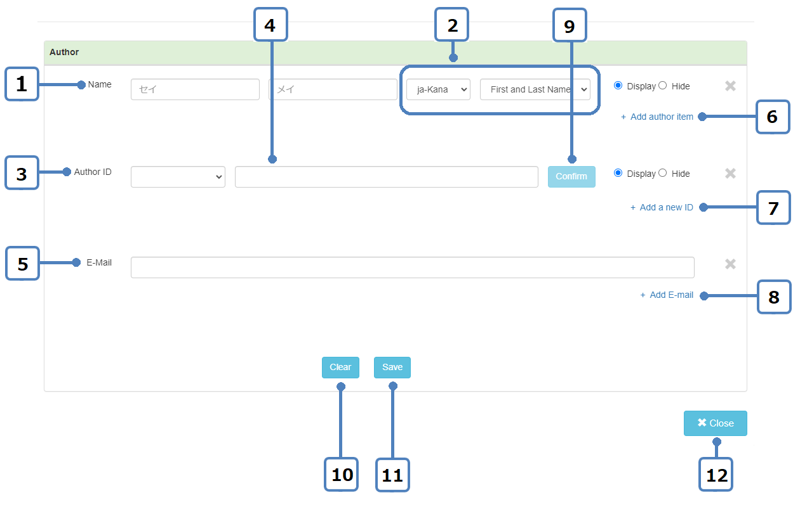zu050150.tif

\<TBLATT POSITION="1" SCALE="151"\>

Table 5-16. The elements in the "Add Author" screen

| No. | Element                                                | Description                                                                                                               |
| --- | ------------------------------------------------------ | ------------------------------------------------------------------------------------------------------------------------- |
| 1   | The "Name" text box                                    | Enter a name.                                                                                                             |
| 2   | The "Name" pull-down lists                             | Select an option from the pull-down list. See "ANCHORID=name【参照元】Figure 5-16. The "Name" pull-down lists【E】".             |
| 3   | The "Author ID" pull-down list                         | Select the Author ID from the pull-down list. See "ANCHORID=authorid【参照元】Figure 5-17. The "Author ID" pull-down list【E】". |
| 4   | The "Author ID" text box                               | Enter the author ID.                                                                                                      |
| 5   | The "E-mail" text box                                  | Enter an email address.                                                                                                   |
| 6   | The "+ Add author item" link                           | Click to add a field for entering another name.                                                                           |
| 7   | The "+ Add a new ID" link                              | Click to add a field for entering another author ID.                                                                      |
| 8   | The "+ Add E-mail" link                                | Click to add an email field.                                                                                              |
| 9   | The icon050170.tif button | Click to navigate to the creator search screen without adding an author.                                                  |
| 10  | The icon050180.tif button | Click to navigate to the creator search screen.                                                                           |
| 11  | The icon050190.tif button | Click to add the author and navigate to the creator search screen.                                                        |
| 12  | The icon050140.tif button | Click to close the "Add Author" screen and navigate to the creator search screen.                                         |

LINKID=displaynumber【参照先】Figure 5-15. The "Display Number" pull-down list

zu050140.tif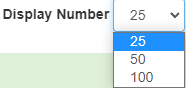

LINKID=name【参照先】Figure 5-16. The "Name" pull-down lists

zu050153.tif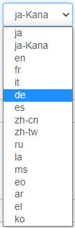 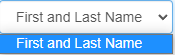

LINKID=authorid【参照先】Figure 5-17. The "Author ID" pull-down list

zu050156.tif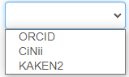

Additional Information:

・When imported from the creator search screen, the elements in the area where "Creator Identifier Scheme" is set to "WEKO" ("Creator Identifier Scheme", "Creator Identifier URI", "Creator Identifier") will be inactive.

・When imported from the creator search screen, the items are linked to the Author DB (linked via "WEKO" in the "Creator Identifier Scheme" and the number of items per author is counted). If you want to remove the link between the author DB and the item, click "X" to delete the "WEKO" information.

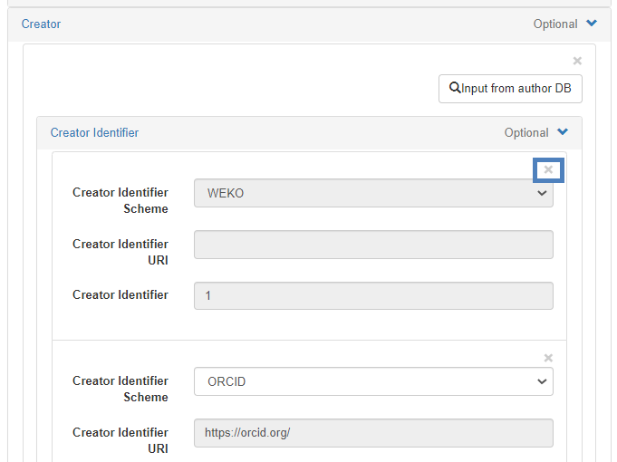

#### Set up bibliographic information

This section explains how to set up the bibliographic information.

1.  In the Item Registration screen, enter the journal title in the "Title" text box for the bibliographic information.

zu050570.tif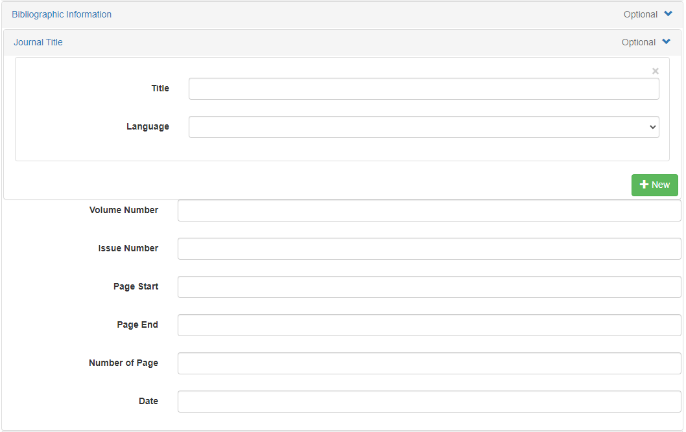

14. Select a language from the "Language" pull-down list.

15. Enter the volume number in the "Volume Number" text box.

16. Enter the issue number in the "Issue Number" text box.

17. Enter the start page in the "Page Start" text box.

18. Enter the end page in the "Page End" text box.

19. Enter the number of pages in the "Number of Page" text box.

20. Enter the issued date in the "Date" text box.
    
    1.  #### Set up the version type

This section explains how to set up the version type.

1.  In the Item Registration screen, select the version type from the "Version Type" pull-down list.

zu050580.tif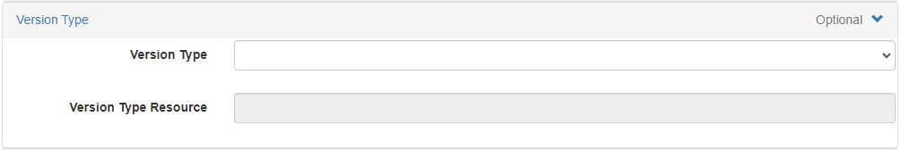

Figure 5‑18. The "Version Type" pull-down list

zu050590.tif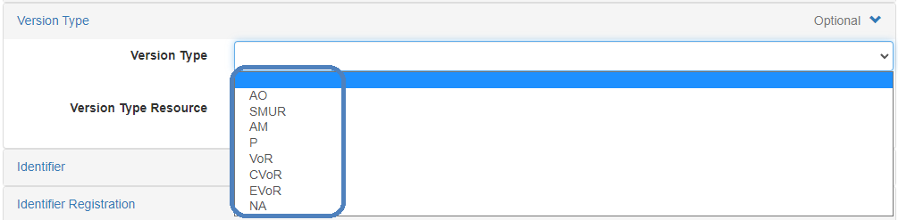

#### Configure the Feedback Mail Destination setting

This section explains how to configure the Feedback Mail Destination setting.

1.  In the Item Registration screen, click the icon050110.tif button for the recipient of the feedback mail.  
    The creator search screen appears.

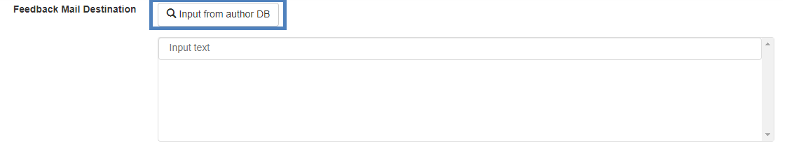

21. In the creator search screen, enter a keyword in the "Search" text box and click the  button.  
    Creators who satisfy the search criteria appear.
    
    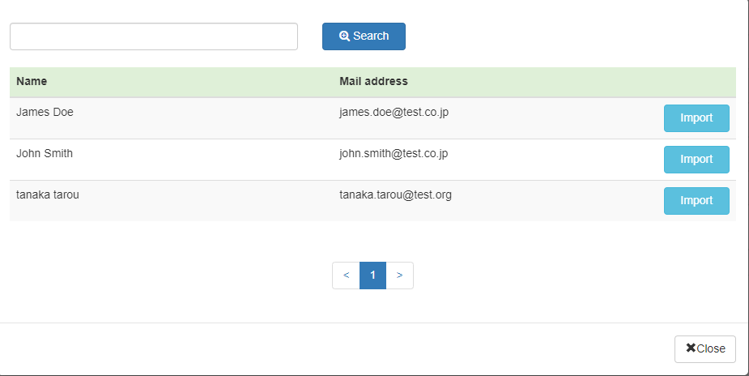

See "Table 5-15. The elements in the creator search screen" for information on the elements in the creator search screen. When you click the "Import" button, the email address will be populated in the "Feedback Mail Destination" list as shown below.

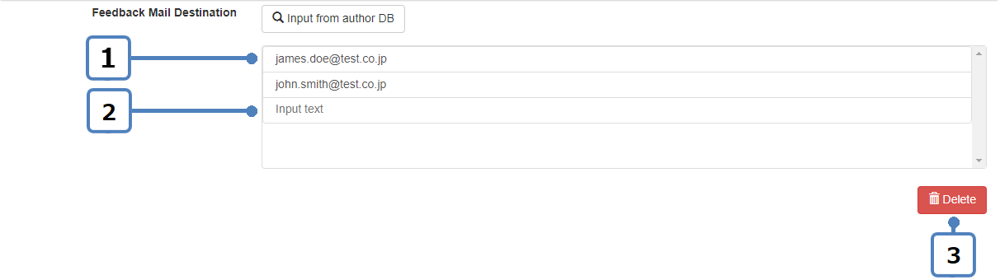

> Table 5‑17. The elements in the "Feedback Mail Destination" screen

<table>
<thead>
<tr class="header">
<th>No.</th>
<th>Element</th>
<th>Description</th>
</tr>
</thead>
<tbody>
<tr class="odd">
<td>1</td>
<td>The list of feedback mail destinations</td>
<td>Displays a list of email addresses configured.</td>
</tr>
<tr class="even">
<td>2</td>
<td>The text box showing "Input text"icon050120.tif</td>
<td>
You can enter an email address here manually.

Press the Enter key to register the mail address entered.
</td>
</tr>
<tr class="odd">
<td>3</td>
<td>The icon050140.tif button</td>
<td>Click to remove the selected email address from the list.</td>
</tr>
</tbody>
</table>

#### Set up access rights

1.  This section explains how to set up the availability of the content. You can select and fill in the information using the controlled vocabulary. In the Item Registration screen, select the access rights from the zu050160.tif"Access Rights" pull-down list. "Access Rights URI" is automatically populated with the relevant access rights URI.

See "Figure 5-19. The "Access Rights" pull-down listANCHORID=access【参照元】【E】".

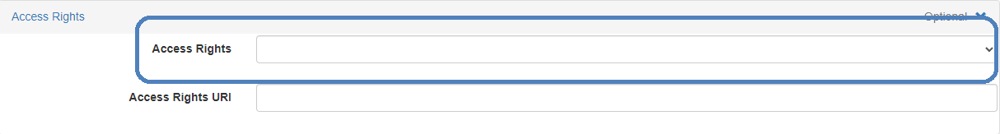zu050170.tif

LINKID=access【参照先】Figure 5-19. The "Access Rights" pull-down list

zu050180.tif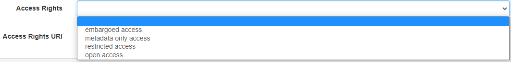

\<TBLATT POSITION="1" SCALE="151"\>

Table 5-18. The options in the "Access Rights" pull-down list

<table>
<thead>
<tr class="header">
<th>No.</th>
<th>Element</th>
<th>Description</th>
</tr>
</thead>
<tbody>
<tr class="odd">
<td>1</td>
<td>embargoed access</td>
<td>In the embargo period: Only metadata is available for access until this resource is released for open access on a specified date.</td>
</tr>
<tr class="even">
<td>2</td>
<td>metadata only access</td>
<td>Metadata only: Only metadata is available for access.</td>
</tr>
<tr class="odd">
<td>3</td>
<td>open access</td>
<td>Open access: This resource is available for online access free of charge, immediately and permanently upon its release, eliminating economic or technical barriers.</td>
</tr>
<tr class="even">
<td>4</td>
<td>restricted access</td>
<td>
Restricted access: This resource is systemically available but has some type of restriction placed for fully open access.

Additional Information: Selecting "Restricted Access" does not automatically set up this option. See Section (6) for "Restricted Access".
</td>
</tr>
</tbody>
</table>

> \* See the JPCOAR schema guidelines for detailed information on the vocabulary relating to access rights.
> 
> https://schema.irdb.nii.ac.jp/ja/access\_rights\_vocabulary
> 
> **Additional Information: Verification on the metadata you have entered**

  - > If you click the icon050250.tif button without entering the required fields, the error message "The following items is required. Please recheck and input" will be displayed.

> 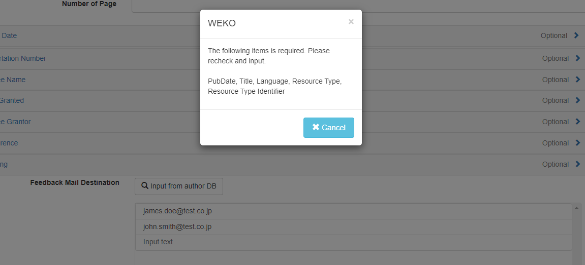

  - > If you use an incorrect format, an error message will appear directly below the corresponding field.

> 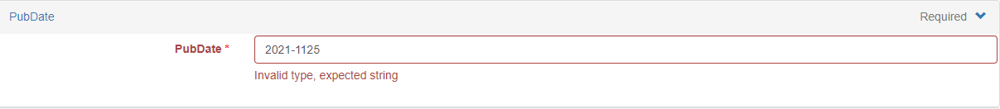

  - > If the value you enter does not exist in the defined choices, the error message "{} is not one of {}" will appear.

> 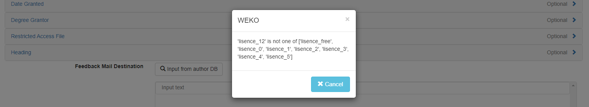

  - > If a JavaScript error occurs, the error message "An error occurred while processing the input data\!{}" will appear.

> 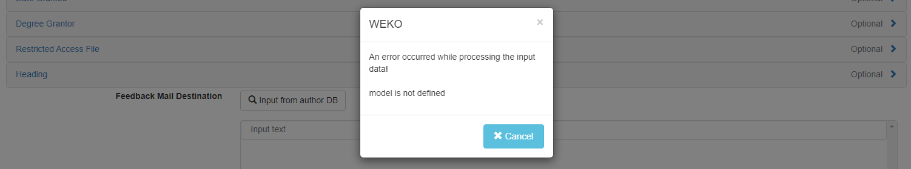

### Set up an index

You can set up an index to which items belong.

An item can belong to multiple indexes at the same time.

You must specify which index each item belongs to.

Displays the name of the index checked in the Index Tree.

zu050280.tif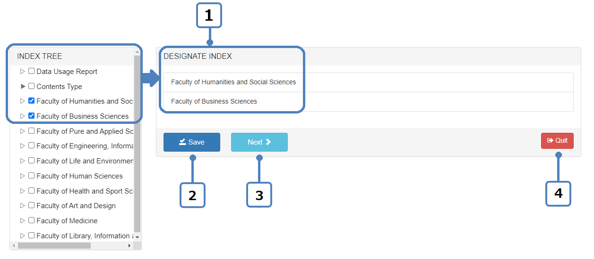

\<TBLATT POSITION="1" SCALE="151"\>

Table 5‑19. The elements in the "Specific index" screen

| No. | Element                                                | Description                                                               |
| --- | ------------------------------------------------------ | ------------------------------------------------------------------------- |
| 1   | Index name                                             | Displays the name of the index checked in the Index Tree.                 |
| 2   | The icon050080.tif button | Click to save the specified information temporarily.                      |
| 3   | The icon050090.tif button | Click to proceed with the operation for the selected items.               |
| 4   | The icon050100.tif button | Click to discard the input and terminate the activity you are working on. |

Notes:

If you click the  or  button without selecting any index, you will get the error message "At least one index should be selected".

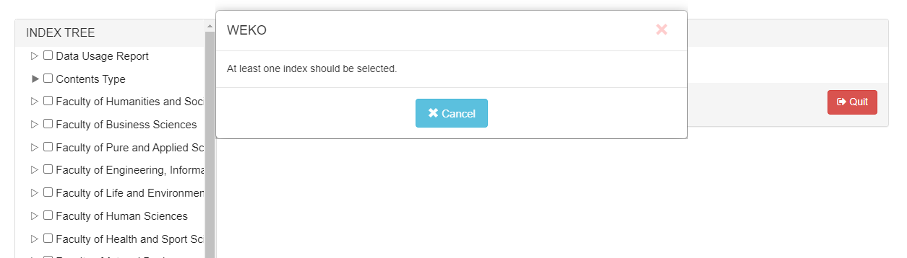

1.  Click the icon050090.tif button.

The comment input screen appears.

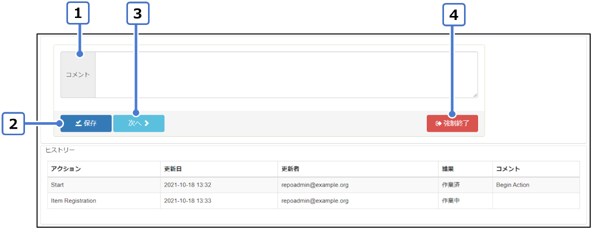zu050290.tif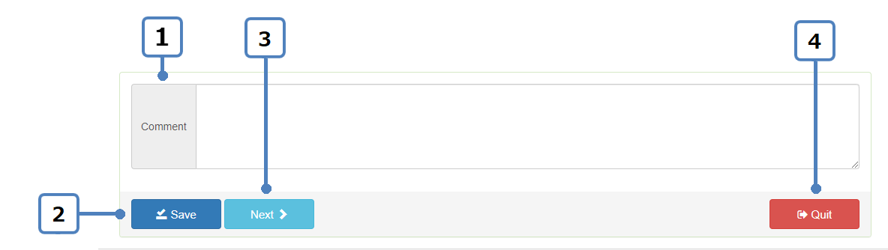

\<TBLATT POSITION="1" SCALE="151"\>

Table 5‑20. The elements in the comment input screen

| No. | Element                                                                             | Description                                                                  |
| --- | ----------------------------------------------------------------------------------- | ---------------------------------------------------------------------------- |
| 1   | Comment                                                                             | Enter comments.                                                              |
| 2   | The icon050080.tif button                              | Click to save the specified information temporarily.                         |
| 3   | The icon050230.tif button                              | Click to complete the registration of the item's metadata and content files. |
| 4   | The icon050240.tif button | Click to discard the input and terminate the activity you are working on.    |

22. Click the icon050230.tif button.

The "Step" screen appears, and "Item Registration" shows "Done" in the flow.

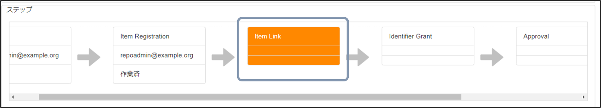zu050300.tif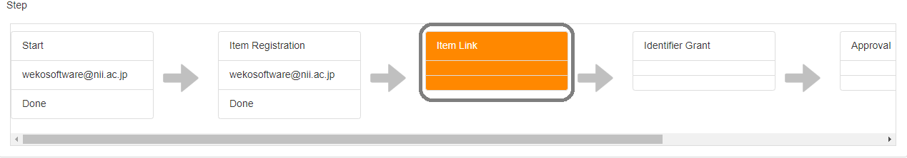

When you proceed to the next action, you may receive the error message "Please make sure the item type mapping is correct". This message will be displayed if the login session has expired, in which case you need to log in again.

Encountering this message when your login session has not expired suggests that there is a problem with the back-end processing. Contact your system administrator in such a case.

### LINKID=createlink【参照先】Set up an item link

You can link up registered items with each other.

1.  Click on an index name under the "Index Tree" screen.

The "Item Link" screen belonging to that index appears.

zu050660.tif

You can add links to multiple items that belong to the selected index. Note that only one index can be selected.

23. Select the "+" button for the item you want to link in the "Item Link" screen that appears.

zu050670.tif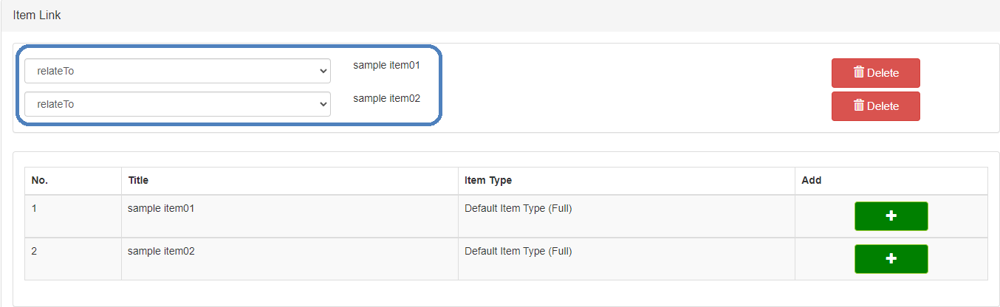

24. Enter comments.

zu050680.tif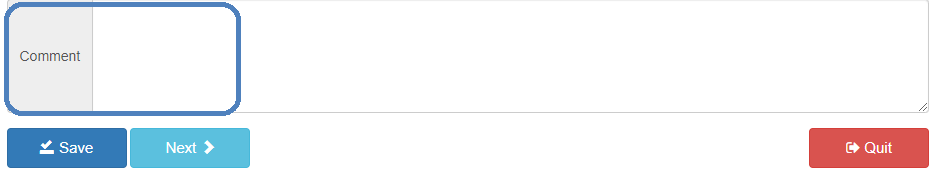

25. Click the icon050230.tif button.

The link will be registered.

### LINKID=adddoi【参照先】Gant DOIs

You can grant a DOI to an item if it has not already been granted one. You must take cautions when working with DOIs. The following cautions apply when granting DOIs to items.

  - The DOI granted to an item cannot be changed.

  - You cannot revoke a DOI once it is granted to an item.

This section explains how to grant a DOI to an item in the Identifier Grant action.

zu050310.tif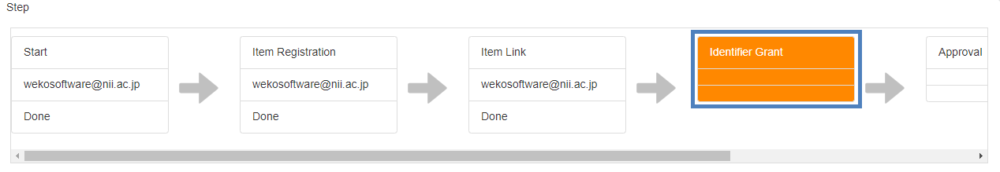

\<TBLATT POSITION="1" SCALE="151"\>

Figure 5‑20. The "Identifier Grant" screen

zu050330.tif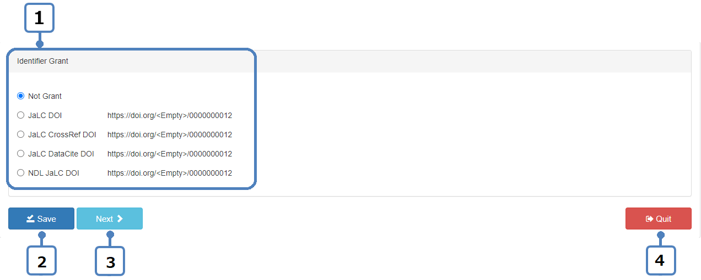

\<TBLATT POSITION="1" SCALE="151"\>

Table 5-21. The elements in the "Identifier Grant" screen

<table>
<thead>
<tr class="header">
<th>No.</th>
<th>Element</th>
<th>Description</th>
</tr>
</thead>
<tbody>
<tr class="odd">
<td>1</td>
<td>The "Identifier Grant" radio buttons*</td>
<td>
Select a DOI-issuing organization from the "Identifier Grant" radio buttons.

<ul>
<li><blockquote>

The following "Identifier Grant" options are supported:

</blockquote></li>
</ul>
<ul>
<li><blockquote>

JaLC DOI

</blockquote></li>
<li><blockquote>

JaLC CrossRef DOI

</blockquote></li>
<li><blockquote>

JaLC DataCite DOI

</blockquote></li>
<li><blockquote>

NDL JaLC DOI

</blockquote></li>
</ul></td>
</tr>
<tr class="even">
<td>2</td>
<td>The icon050080.tif button</td>
<td>Click to save the specified information temporarily.</td>
</tr>
<tr class="odd">
<td>3</td>
<td>The icon050250.tif button</td>
<td>
Proceed to verify whether the conditions for granting a DOI is met.

<ul>
<li><blockquote>

If the conditions are met, a DOI will be granted. You can proceed to the next action.

</blockquote></li>
<li><blockquote>

If the conditions are not met, you will be returned to the Identifier Grant screen.

</blockquote></li>
</ul></td>
</tr>
<tr class="even">
<td>4</td>
<td>The icon050240.tif button</td>
<td>Click to discard the input and terminate the activity you are working on.</td>
</tr>
</tbody>
</table>

> **Note 1:**
> 
> Depending on the configuration, DOIs can be granted in the following three methods:
> 
> **Automatic sequential numbering:**
> 
> In the "Identifier Grant" screen, the prefix set in the "Identifier" screen from the Administration screen appears. The suffix is assigned automatically.
> 
> Figure 5-21. The "Identifier Grant" screen (automatic sequential numbering)
> 
> 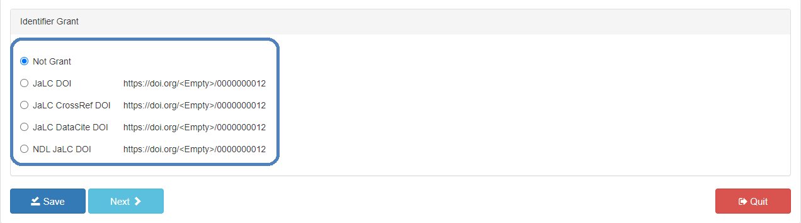
> 
> **Semi-automatic input:**
> 
> In the "Identifier Grant" screen, the prefix set in the "Identifier" screen from the Administration screen appears. The first half of the suffix, also set in the same screen, is assigned automatically. Enter the second half of the suffix in the "Input Field" text box.
> 
> The following input rules are applied:

  - > Only alphanumeric characters and the following symbols are allowed: \_-.;()/.

  - > The format must be "info:doi/\<prefix for DOI\>/\<input value\>" and the length must not exceed 255 characters.

  - > This DOI is not already being used with another item.

  - > This DOI is not one of those that have been revoked.

　　　　　　　　　　Figure 5-22. The "Identifier Grant" screen (semi-automatic input)

> 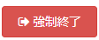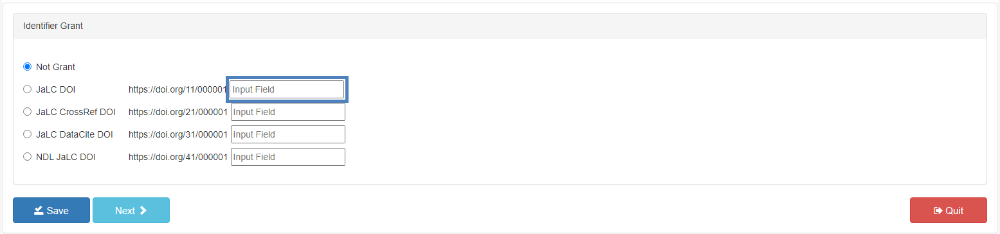
> 
> **"Free Input"**
> 
> In the "Identifier Grant" screen, the prefix set in the "Identifier" screen from the Administration screen appears. Enter the suffix in the "Input Field" text box.
> 
> The input value is checked against the input rules used for the semi-automatic input method.
> 
> Figure 5-23. The "Identifier Grant" screen (automatic input)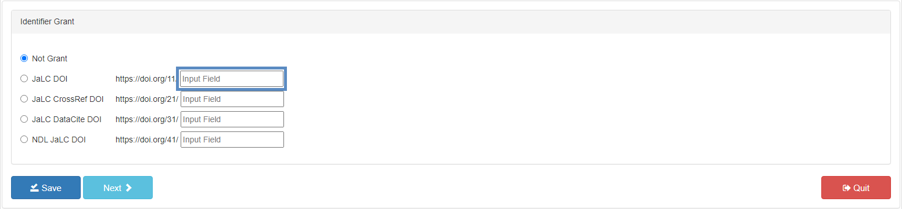
> 
> **Note 2:**
> 
> Depending on the DOI-issuing organization selected, the input values for the item are checked against the criteria for granting DOIs as defined in the following documents.
> 
> Document: "JPCOAR\_JaLC\_Guideline\_appendix\_v1.pdf".
> 
> **Note 3:**
> 
> When assigning a DOI to an item, it must be associated with an index whose index status is "Public" and Harvest Publishing is "Public".
> 
> **Note 4:**
> 
> If the condition for granting a DOI is not met, you will be returned to the activities in the Item Registration screen and an error message appears.
> 
> **Note 5:**
> 
> If there is more than one required mapping element contained in a single item type, the condition for granting a DOI is satisfied when one of the multiple elements is entered.
> 
> **Note 6:**
> 
> ・Once you register a DOI-granted item, you cannot delete the value of a required field or the property of a required field when editing the item. If you delete any, you will be redirected from the Identifier Grant screen to the Item Registration screen, and the message "PID does not meet the conditions" will be displayed.
> 
> You cannot modify the resource type (dc:type) when editing. If you modify it, you will be redirected from the Identifier Grant screen to the Item Registration screen, and the message "You cannot change the resource type of items that have been grant a DOI" will be displayed.
> 
> 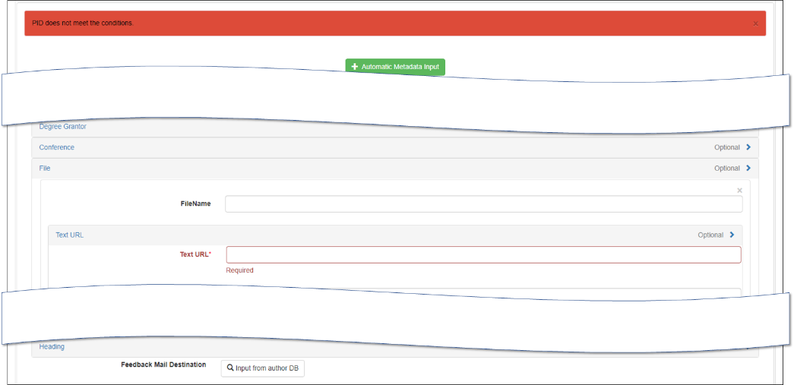

### Approve items

Items must be approved by a user with the role to administer a repository.

The approver can "Reject", "Save", or "Approve" items that are pending approval.

You can approve items from the "Workflow" screen.

1.  Click on the "ToDo", "Wait", or "All" tab.

The activities list screen appears. The items that are currently pending approval appear.

zu050340.tif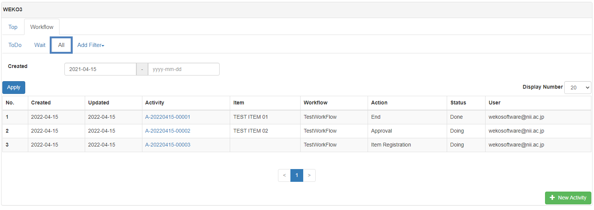

Notes:

If you do not have the review/approval privilege, the following screen will appear.

zu050350.tif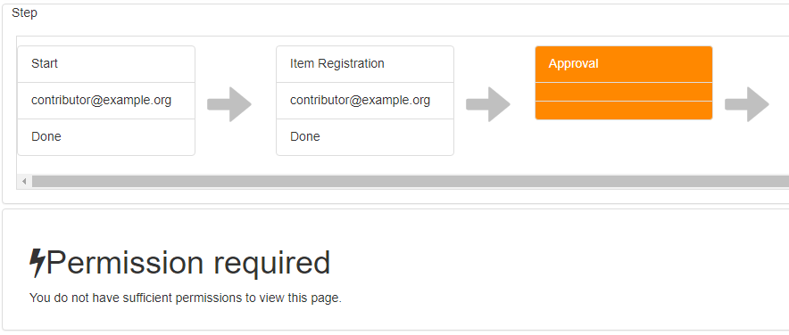

26. From the activities list screen that appears, click on the name of the activity whose action is "Approval".

The item approval screen appears.

zu050360.tif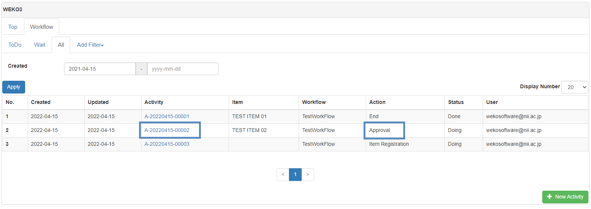

27. Click the "Approve" button in the item approval screen.

zu050370.tif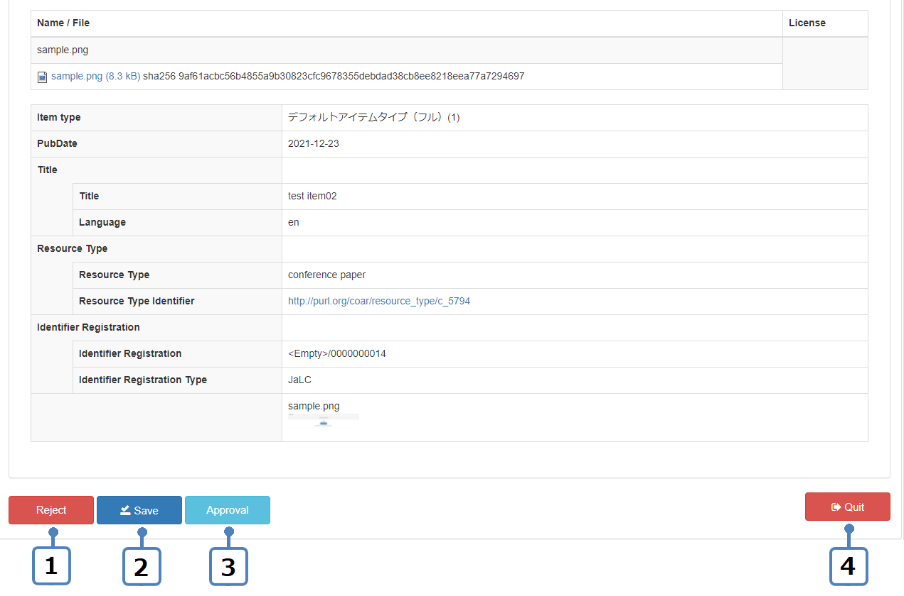

\<TBLATT POSITION=”1” SCALE=”151”\>

Table 5-22. The elements in the item approval screen

| No. | Element                                                | Description                                                               |
| --- | ------------------------------------------------------ | ------------------------------------------------------------------------- |
| 1   | The icon050200.tif button | Click to return to the previous action in the workflow.                   |
| 2   | The icon050080.tif button | Click to save the specified information temporarily.                      |
| 3   | The icon050220.tif button | Click to approve the item.                                                |
| 4   | The icon050240.tif button | Click to discard the input and terminate the activity you are working on. |

## LINKID=viewactivities【参照先】\<INDEXWORD PRONOUNCE="あくていひていをさんしようする" INDEXITEM="アクティビティを参照する"\>View activities\</INDEXWORD\>

This section explains how to view activities registered in the System.

You can view activities from the "Workflow" screen.

### Display the activities list

This section explains how to view the activities list.

#### View the activities list

> This section explains how to view the activities list in each tab.

1.  Click on the "ToDo", "Wait", or "All" tab.

The activities list screen appears. You can work with the activities list using the following three tabs.

  - The "ToDo" tab

Click to view the activities that are being registered or edited, as well as those that have been rejected.

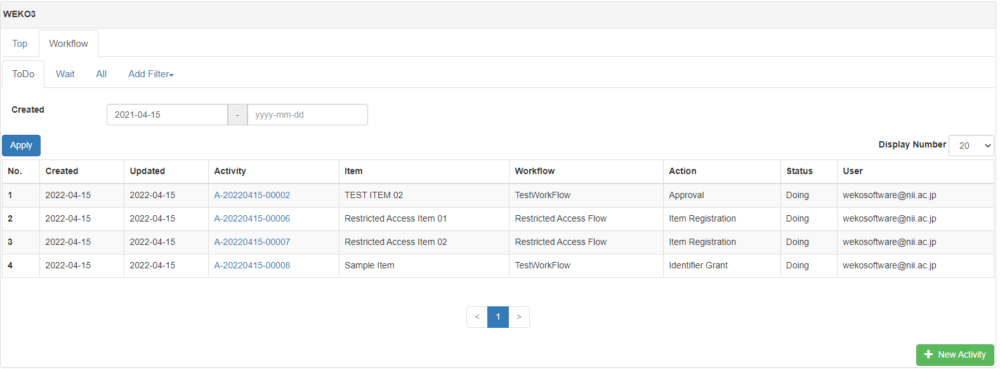zu050400.tif

  - The "Wait" tab

Click to view the activities that are pending approval.

zu050410.tif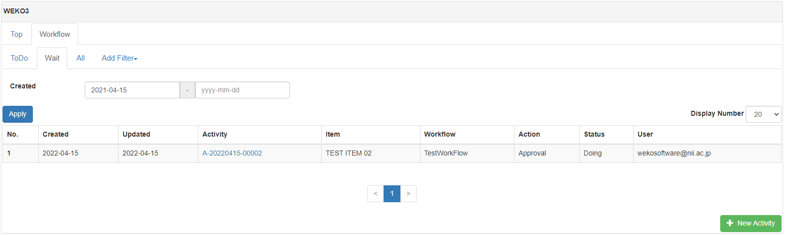

  - The "All" tab

Click to view the activities that are being registered or edited, those that have been cancelled, those that are pending approval, and those that are complete.

zu050420.tif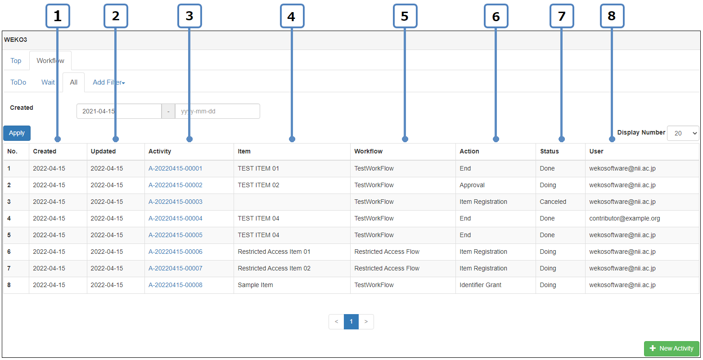

> \<TBLATT POSITION="1" SCALE="151"\>

Table 5-23. The elements in the activities list screen

<table>
<thead>
<tr class="header">
<th>No.</th>
<th>Element</th>
<th>Description</th>
</tr>
</thead>
<tbody>
<tr class="odd">
<td>1</td>
<td>Created</td>
<td>Displays the date the activity was created. You must use the display format "<em>yyyy-mm-dd</em>".</td>
</tr>
<tr class="even">
<td>2</td>
<td>Updated</td>
<td>Displays the updated date. You must use the display format "<em>yyyy-mm-dd</em>".</td>
</tr>
<tr class="odd">
<td>3</td>
<td>Activity (with links)</td>
<td>Click to view the activity details.</td>
</tr>
<tr class="even">
<td>4</td>
<td>Item</td>
<td>Displays the item name.</td>
</tr>
<tr class="odd">
<td>5</td>
<td>Workflow</td>
<td>Displays the name of the workflow used in the activity.</td>
</tr>
<tr class="even">
<td>6</td>
<td>Action</td>
<td>Displays the current action.</td>
</tr>
<tr class="odd">
<td>7</td>
<td>Status</td>
<td>
Displays the status of the activity.

The status is shown as one of the following:

<ul>
<li><blockquote>

Doing

</blockquote></li>
<li><blockquote>

Done

</blockquote></li>
<li><blockquote>

Canceled

</blockquote></li>
</ul></td>
</tr>
<tr class="even">
<td>8</td>
<td>User</td>
<td>Displays the email address of the user who last updated the activity.</td>
</tr>
</tbody>
</table>

#### Filter the activities list

> This section explains how to filter the activities list.

28. > Click the "Add Filter" button.
    
    The filter options appear. Note that the "Created" is always displayed.

> 

29. > Click on a filter.
    
    The input area for the filter you selected appears above the activities list.
    
    The content of the applied filter will be carried over among the "ToDo", "Wait", and "All" tabs.

> 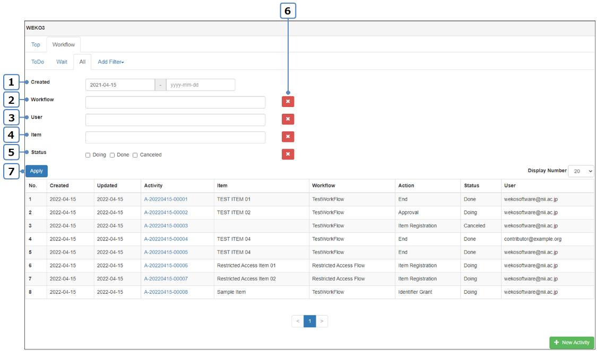

Table 5‑24. The elements in the filter screen

<table>
<thead>
<tr class="header">
<th>No.</th>
<th>Element</th>
<th>Description</th>
</tr>
</thead>
<tbody>
<tr class="odd">
<td>1</td>
<td>Created</td>
<td>
Enter a range of the activity creation date. You must use the display format "<em>yyyy-mm-dd</em>".

The start date of the creation date will be automatically set to one year ago today.
</td>
</tr>
<tr class="even">
<td>2</td>
<td>Workflow</td>
<td>
Enter a workflow.

The "forward match" search applies.

You can add multiple input areas for this filter.
</td>
</tr>
<tr class="odd">
<td>3</td>
<td>User</td>
<td>
Enter an email address for the user. The "exact match" search applies.

You can add multiple input areas for this filter.
</td>
</tr>
<tr class="even">
<td>4</td>
<td>Item</td>
<td>
Enter an item name.

The "forward match" search applies.

You can add multiple input areas for this filter.
</td>
</tr>
<tr class="odd">
<td>5</td>
<td>Status</td>
<td>
Select the status of the activity. The options are "Doing," "Done," and "Canceled". Multiple selections are allowed.

The "exact match" search applies.
</td>
</tr>
<tr class="even">
<td>6</td>
<td>The  button</td>
<td>Click to delete the corresponding filter.</td>
</tr>
<tr class="odd">
<td>7</td>
<td>The  button</td>
<td>Click to apply the specified filters.</td>
</tr>
</tbody>
</table>

1.  #### Page through the activities list
    
    This section explains how to page through the activities list.
    
    

Table 5‑25. The elements for paging

<table>
<thead>
<tr class="header">
<th>No.</th>
<th>Element</th>
<th>Description</th>
</tr>
</thead>
<tbody>
<tr class="odd">
<td>1</td>
<td>The "Display Number" pull-down</td>
<td>
Specify the number of activities to display. The default is set to "20". See "Figure 5-23. The "Display Number" pull-down【E】".

Clicking an option will refresh the display, applying the number of activities selected.
</td>
</tr>
<tr class="even">
<td>2</td>
<td>The paging buttons</td>
<td>
Click the paging buttons to switch the display content.

<ul>
<li><blockquote>

Click the button to go to the previous page.

</blockquote></li>
<li><blockquote>

Click the number button to go to the corresponding page.

</blockquote></li>
<li><blockquote>

Click the button to go to the next page.

</blockquote></li>
</ul></td>
</tr>
</tbody>
</table>

> Figure 5-23. The "Display Number" pull-down
> 
> 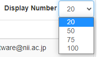

### LINKID=viewactivitydetails【参照先】View the activity details

This section explains how to view the activity details.

1.  Click on an activity name in the activities list screen.

The activity details screen appears.

Figure 5‑24. The activity details screen

zu050430.tif

\<TBLATT POSITION="1" SCALE="151"\>

Table 5-26. The elements in the activity details screen

| No. | Element  | Description                                                                                      |
| --- | -------- | ------------------------------------------------------------------------------------------------ |
| 1   | Flow     | Displays the name of the flow.                                                                   |
| 2   | Activity | Displays the name of the activity.                                                               |
| 3   | Status   | Displays the status of the activity.                                                             |
| 4   | Created  | Displays the date the activity was created. You must use the display format "*yyyy-mm-dd*".      |
| 5   | Creator  | Displays the creator of the activity.                                                            |
| 6   | Updated  | Displays the date the activity was last updated. You must use the display format "*yyyy-mm-dd*". |
| 7   | Updater  | Displays the user who last updated the activity.                                                 |

#   
Edit and delete items\</INDEXWORD\>

This chapter provides information on editing and deleting registered items.

## LINKID=edititemsprocedure【参照先】\<INDEXWORD PRONOUNCE="あいてむをへんしゆうする" INDEXITEM="アイテムを編集する"\>Edit items\</INDEXWORD\>

This section explains how to edit items registered in the Systems.

Only the administrator, the user who registered the item, and the proxy contributor have permission to edit the item.

You can edit items belonging to the index. Locate the item to be edited in the index tree.

Figure 6-1. The "Index Tree" screen

zu060010.tif

1.  Click on an index from the "Index Tree" screen.

The "Item Lists" screen appears.

zu060020.tif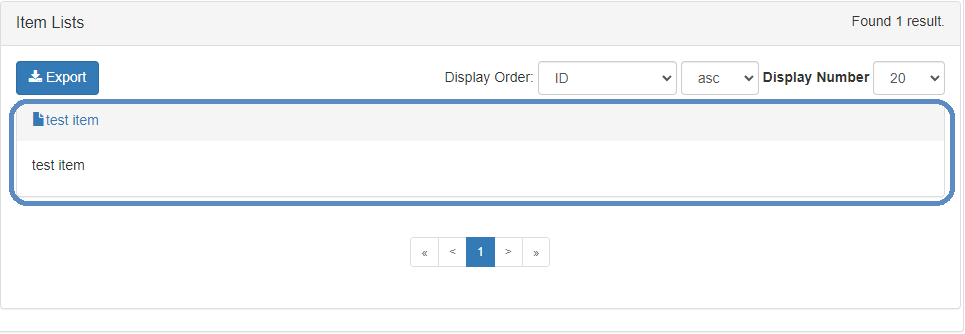

30. Click on the title of the item you want to edit in the "Item Lists" screen that appears.

The item details screen appears.

zu060030.tif

31. Click on the icon060020.tif button in the item details screen.
    
    The Item Registration screen appears.
    
    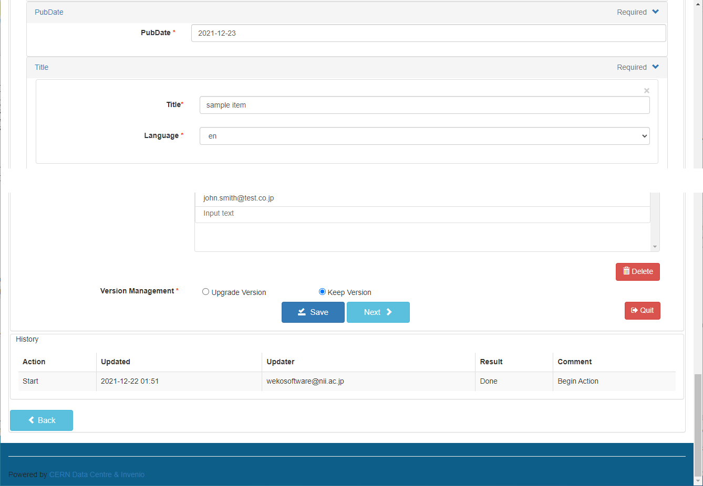If the "Edit" button of an item is pressed on another device or on the same device where import is in progress, the message "Item cannot be edited because the import is in progress" will appear.

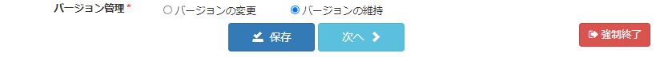zu060110.tif

If the item is being edited, you will see the message "The item is being edited". In this case, to edit an item, click on the name of the activity you want to edit from the activities list screen.

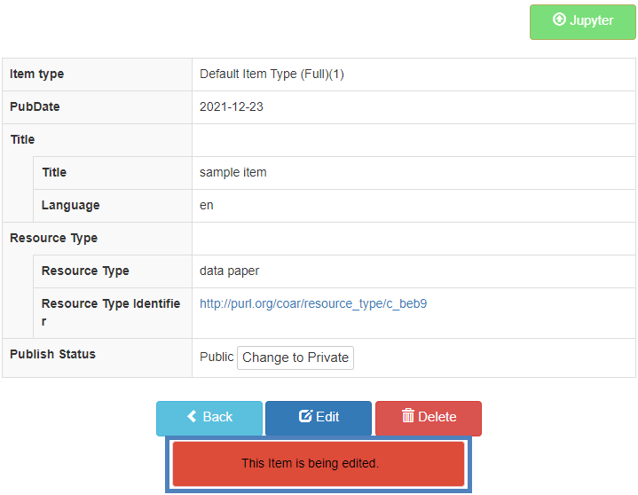

32. Click on the appropriate activity name to edit.
    
    1.  > From the Home screen, click the "Workflow" tab.  
        > The activities list screen appears.

> 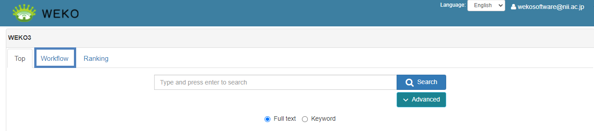

2.  > Click on the "ToDo" or "All" tab.

> The activities list screen appears.
> 
> 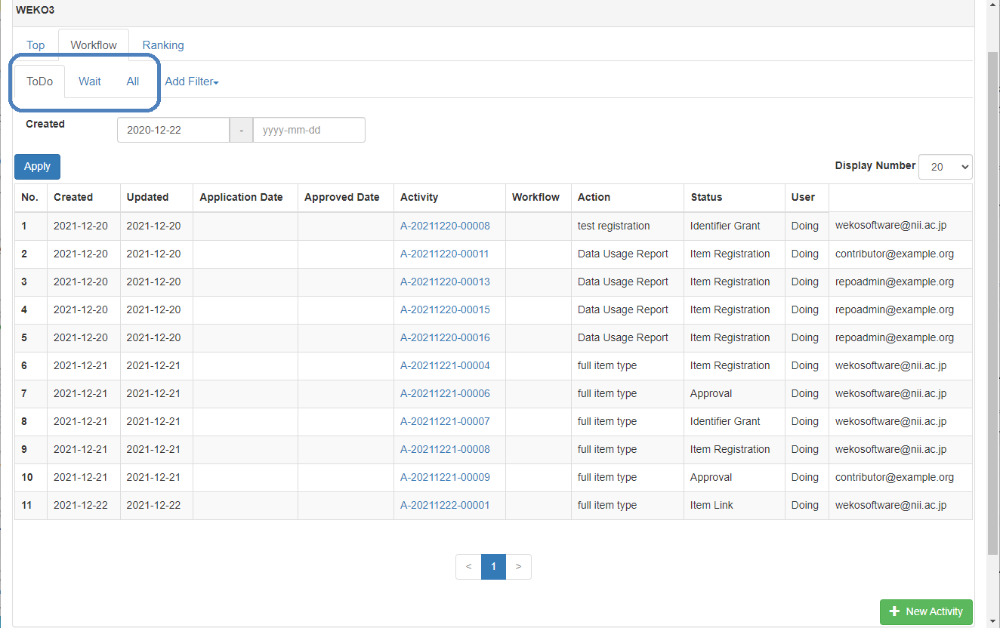

3.  > Click on the activity name you want to edit from the activities list screen that appears.

> The Item Registration screen appears.

33. Edit the appropriate elements.

34. Select "Version Management".
    
    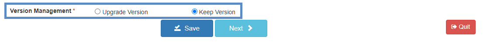
    
    When you select "Upgrade Version", the item will be updated, and the version will be upgraded.
    
    When you select "Keep Version", the item will be updated but the version will be kept.
    
    The default is set to "Keep Version".
    
    You must specify an option for "Version Management".

35. Click the icon060040.tif button.

The "Specific index" screen appears. See "ANCHORID=createindex【参照元】Section 5.1.2. Set up an index【E】" for more information.

Notes:

> Click the icon050250.tif button in the Item Registration screen to check the specified metadata. If there is an error, you will see a message. For the details of the error, see "Section 5.1.1. Register items," under "Additional Information: Verification on the metadata you have entered".

See "Table 5-14. The elements in the Item Registration screen" for information on how the icon060030.tif, , and icon050240.tif buttons work on the Item Registration screen.

36. Click the icon060070.tif button.

You can proceed to the next action defined in the flow.

See "Section 5.1. Register items" for more information on the relevant action.

Once the item is "approved" in the Approval screen, the item will be updated.

Notes:

After editing, the old version will inherit the previous publish status.

## Delete items

This section explains how to delete items registered in the Systems.

Only the administrator, the user who registered the item, and the proxy contributor have permission to delete the item.

You can delete items belonging to the index. Locate the item to be deleted in the index tree.

Figure 6-2. The "Index Tree" screen

zu060010.tif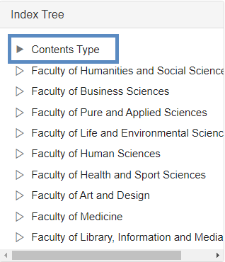

1.  Click on an index from the "Index Tree" screen.

The "Item Lists" screen appears.

zu060020.tif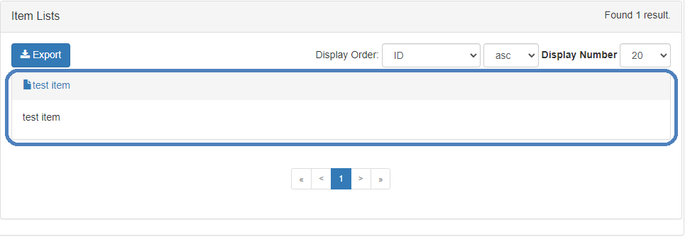

37. Click on the title of the item you want to delete in the "Item Lists" screen that appears.

The item details screen appears.

zu060030.tif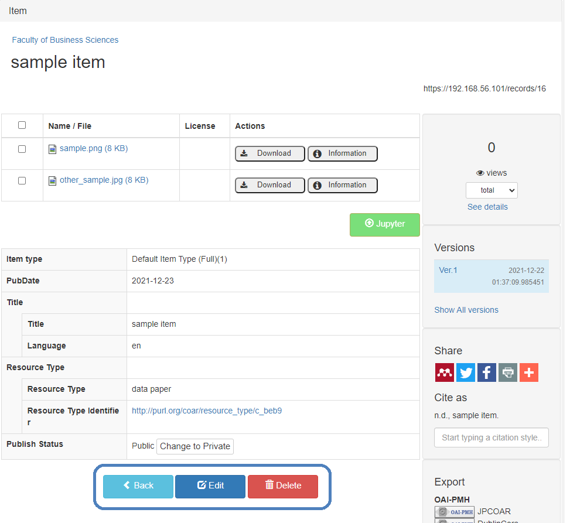

38. Click on the icon060030.tif button in the item details screen.

The "Confirm" screen appears.

If the "Delete" button of an item is pressed on another device or on the same device where import is in progress, the message "Item cannot be deleted because the import is in progress" will appear.

msg060010.tif

\<TBLATT POSITION="1" SCALE="151"\>

Table 6‑1. The elements in the "Confirm" screen

| No. | Element                                                         | Description                                                            |
| --- | --------------------------------------------------------------- | ---------------------------------------------------------------------- |
| 1   | The icon060050.tif button | Click to delete the item. You are returned to the "Item Lists" screen. |
| 2   | The icon060060.tif button           | Click to cancel the delete operation and close the "Confirm" screen.   |

Notes:

The  button does not appear in the item details screen for users who do not have the permission.

Older versions of the item do not display the  button. When the latest version is deleted, all the previous versions will also be logically deleted.

39. Click the icon060050.tif button.

The item will be deleted.

After deleting an item, if you try to display it in the item details screen by directly entering the URL, the message "This item has been deleted" will appear.

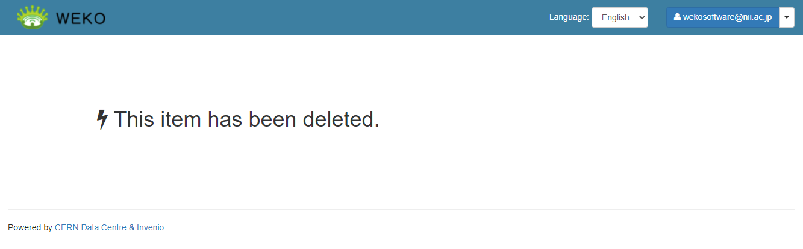

#   
Export items\</INDEXWORD\>

This chapter provides information on exporting items.

## LINKID=communitykakunin【参照先】\<INDEXWORD PRONOUNCE="こみゆにていをかくにんする" INDEXITEM="コミュニティを確認する"\>Export items\</INDEXWORD\>

This section explains how to export items.

1.  Click on the "Top" tab.

Run a search by entering keywords in the keyword search text box or run an index tree search.

2.  The search results appear in the "Item Lists" screen.
    
    Click the icon030080.tif button to display the "Items to Export" screen.

zu070010.tifFigure 7-1. The "Items to Export" screenzu030180.tif

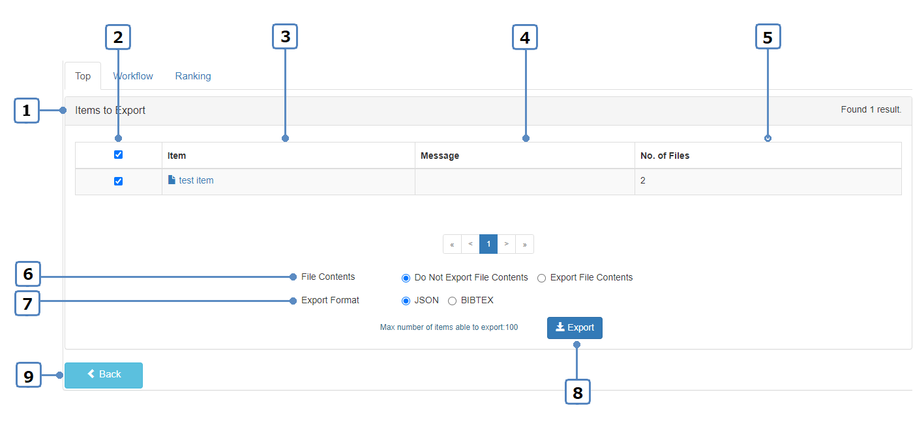

\<TBLATT POSITION="1" SCALE="151"\>

LINKID=exportitemstable【参照先】Table 7-1. The elements in the "Items to Export" screen

<table>
<thead>
<tr class="header">
<th>No.</th>
<th>Element</th>
<th>Description</th>
</tr>
</thead>
<tbody>
<tr class="odd">
<td>1</td>
<td>The index name</td>
<td>Displays the name of the selected index.</td>
</tr>
<tr class="even">
<td>2</td>
<td>Check boxes</td>
<td>Exports the items selected.</td>
</tr>
<tr class="odd">
<td>3</td>
<td>"Item"</td>
<td>
Displays items to be exported in a list.

Lists items with a link. Clicking on a link will display the item details screen.
</td>
</tr>
<tr class="even">
<td>4</td>
<td>"Message"</td>
<td>
Displays a message from the System.

If you do not have the permission to download the file, the message "Contains restricted content" will appear.
</td>
</tr>
<tr class="odd">
<td>5</td>
<td>"No. of Files."</td>
<td>Displays the number of content files registered in the item.</td>
</tr>
<tr class="even">
<td>6</td>
<td>The "File Contents" radio buttons</td>
<td>
Select an option for "File Contents".

The choices are "Do Not Export File Contents" and "Export File Contents".
</td>
</tr>
<tr class="odd">
<td>7</td>
<td>The "Export Format" radio buttons</td>
<td>
Select an option for "Export Format".

The choices are "JSON" and "BIBTEX".
</td>
</tr>
<tr class="even">
<td>8</td>
<td>The icon030080.tif button</td>
<td>
Exports the items selected in the "Item" list.

The button will remain inactive until you select items.
</td>
</tr>
<tr class="odd">
<td>9</td>
<td>The icon030090.tif button</td>
<td>Click to return to the simple search screen.</td>
</tr>
</tbody>
</table>

> Notes: If an internal error occurs during the export process, the error message "Error occurred during item export" will appear.
> 
> 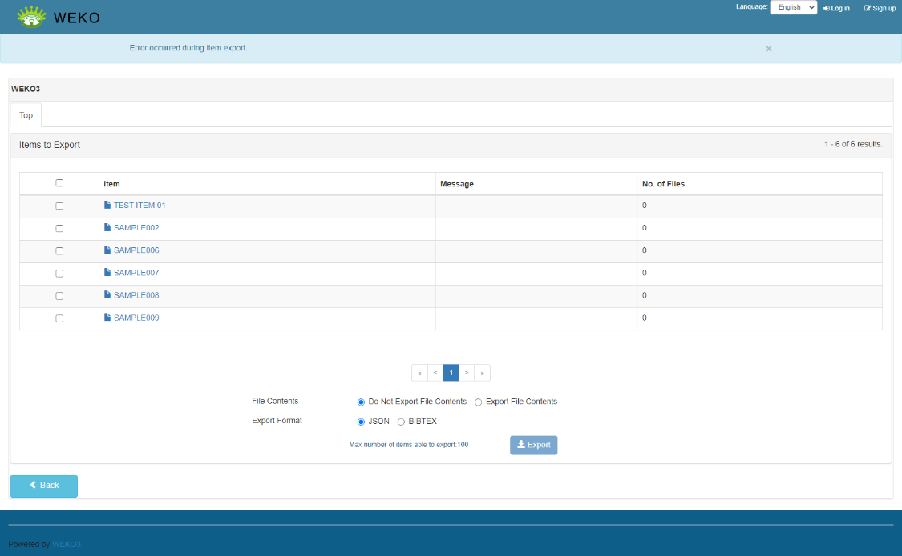

# Explore communities\</INDEXWORD\>

This chapter provides information on exploring communities.

## LINKID=communitykakunin【参照先】\<INDEXWORD PRONOUNCE="こみゆにていをかくにんする" INDEXITEM="コミュニティを確認する"\>Explore communities\</INDEXWORD\>

This section explains how to explore communities.

1.  Click on the "Communities" tab in the Home screen.

The "Communities" screen appears.

zu070010.tif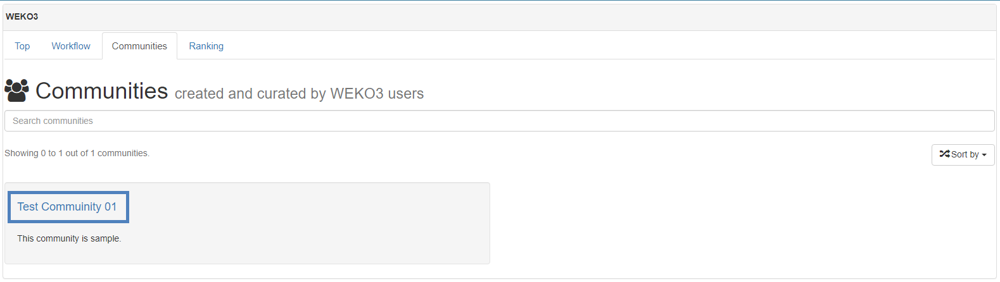

2.  Click on the community name link from the list in the "Communities" screen.

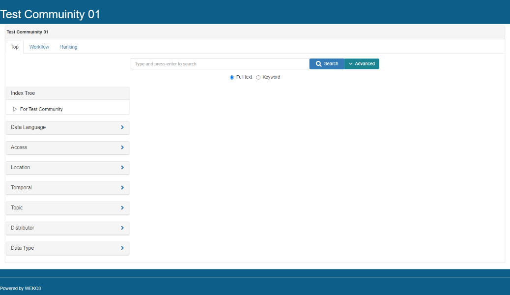

#   
Operating tips\</INDEXWORD\>

This chapter provides tips for working with the System.

## LINKID=viewprofile【参照先】Modify your profile

This section explains how to modify your account profile.

1.  Click icon080010.tif next to the account name in the upper right corner of the Home screen.

A pull-down menu appears.

zu080010.tif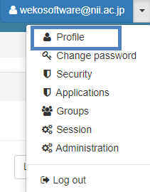

40. Click "Profile".

The "Profile" screen appears.

41. Edit your profile in the "Profile" screen.

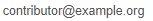zu080020.tif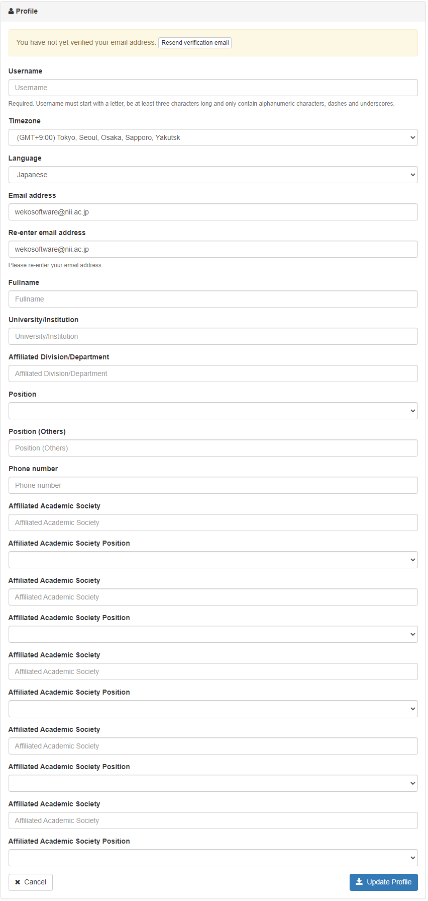

\<TBLATT POSITION=”1” SCALE=”151”\>

Table 9‑1. The elements in the "Profile" screen

| No. | Element                                                          | Description                                                                                                                                                            |
| --- | ---------------------------------------------------------------- | ---------------------------------------------------------------------------------------------------------------------------------------------------------------------- |
| 1   | The "Username" text box                                          | Enter a username. You can use alphanumeric characters, hyphens (-), and underscores (\_). The minimum length is 3 characters, and the maximum length is 16 characters. |
| 2   | The "Timezone" pull-down list                                    | Select a time zone from the "Timezone" pull-down list. See "ANCHORID=timezone【参照元】Figure 8-1. The "Timezone" pull-down list【E】".                                       |
| 3   | The "Language" pull-down list                                    | Select a language from the "Language" pull-down list. See "ANCHORID=gengopulldownlist【参照元】Figure 8-2. The "Language" pull-down list【E】".                               |
| 4   | The "Email Address" text box                                     | The input format should be "*XXXXX*＠*XXX.XXX*". You can use alphanumeric characters, hyphens (-), and underscores (\_). The maximum length is 254 characters.          |
| 5   | The "Re-enter email address" text box                            | Enter the new email address again to confirm that the value you specified in "Email Address" is correct.                                                               |
| 6   | The icon080020.tif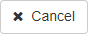 button           | Click to close the "Profile" screen without saving the changes you have made.                                                                                          |
| 7   | The icon080030.tif button | Click to update the profile with the changes and close the "Profile" screen.                                                                                           |

LINKID=timezone【参照先】Figure 9-1. The "Timezone" pull-down list

zu080030.tif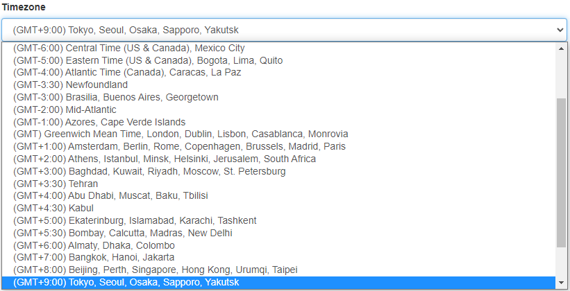

LINKID=gengopulldownlist【参照先】Figure 9-2. The "Language" pull-down list

zu080040.tif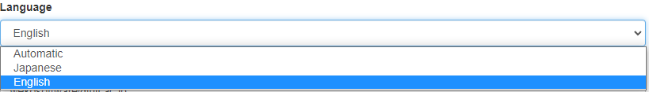

42. Click the icon080030.tif button.

The profile is updated.

## LINKID=checklogindevice【参照先】Determine which device is used to log in to an account

This section explains how to determine which device is used to log in to an account

1.  Select "Security" from the user account pull-down menu in the upper right corner of the screen.

The "Session" screen appears.

zu080070.tif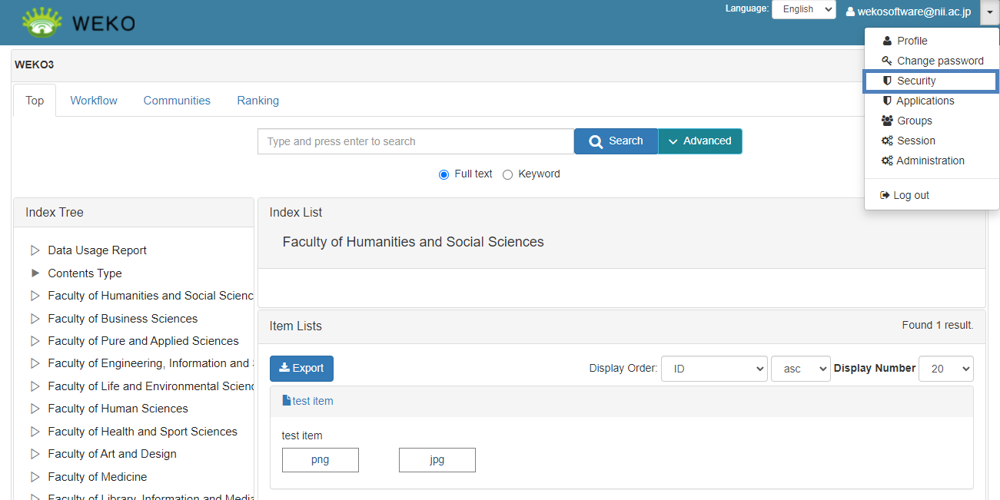

2.  Click the "Logout" or "Revoke" button as required.

The sessions are deleted.

zu080080.tif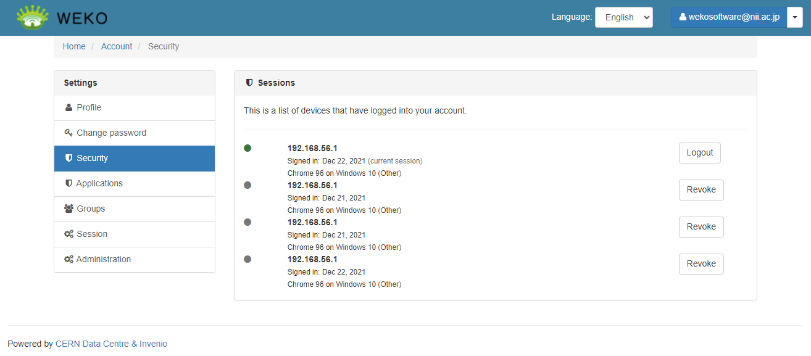

## LINKID=manageapplication【参照先】Manage applications

This section explains how to manage applications. To access the screen where you can manage groups, select "Applications" from the user account pull-down menu in the upper right corner of the screen.

### LINKID=viewapplications【参照先】View the authorized applications

This section explains how to view the authorized applications.

1.  Select "Applications" from the pull-down menu next to the user account displayed in the upper right corner of the screen.

A list of the authorized applications appears in "Authorized applications".

zu080090.tif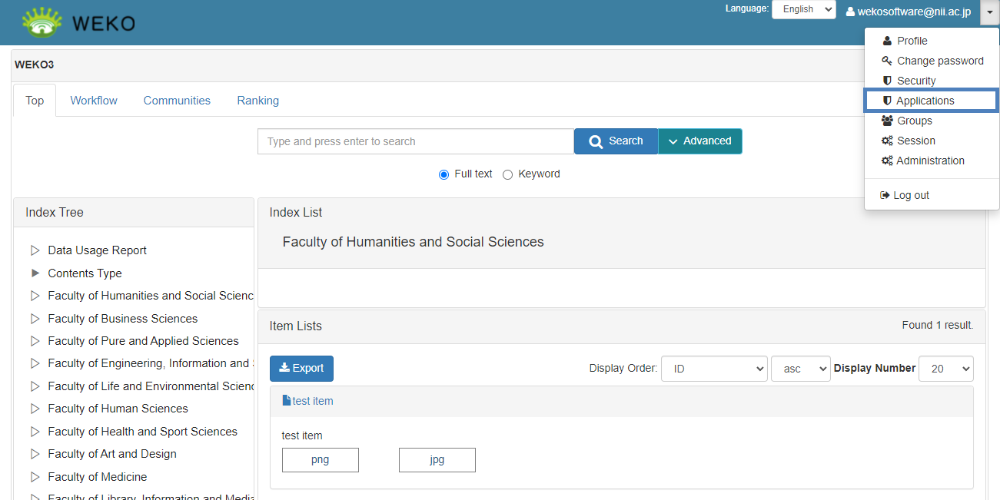

### LINKID=addapplication【参照先】Add an application

This section explains how to add an application.

1.  Under "Developer Applications", click "+ New application".

A screen appears where you can create an action.

zu080100.tif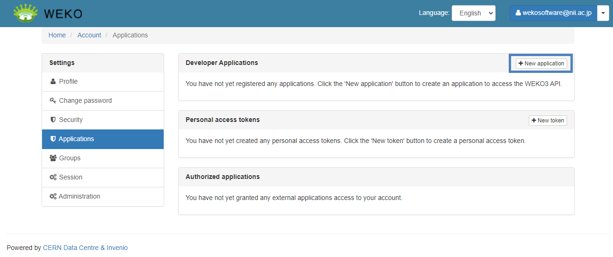

2.  Enter information for each element.

zu080110.tif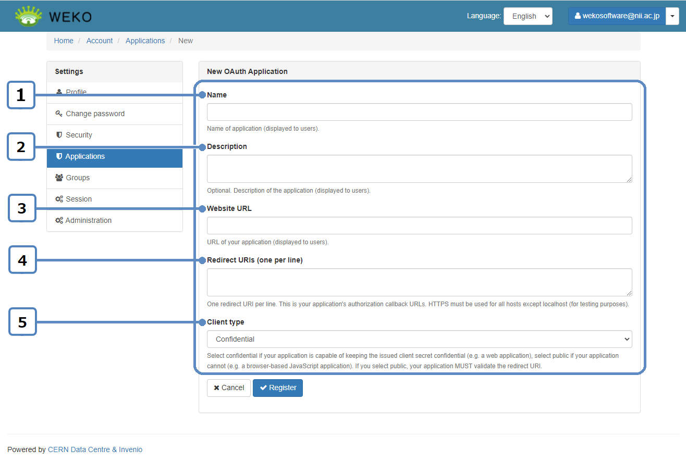

\<TBLATT POSITION="1" SCALE="151"\>

Table 9‑2. The elements in the "New OAuth Application" screen

<table>
<thead>
<tr class="header">
<th>No.</th>
<th>Element</th>
<th>Description</th>
</tr>
</thead>
<tbody>
<tr class="odd">
<td>1</td>
<td>Name</td>
<td>Enter a name.</td>
</tr>
<tr class="even">
<td>2</td>
<td>Description</td>
<td>Enter a description of the application.</td>
</tr>
<tr class="odd">
<td>3</td>
<td>Website URL</td>
<td>Enter the URL of the application.</td>
</tr>
<tr class="even">
<td>4</td>
<td>Redirect URIs (one per line)</td>
<td>
Enter the destination URI to redirect to.

Enter one URI per line.
</td>
</tr>
<tr class="odd">
<td>5</td>
<td>Client type</td>
<td>Select a client type.</td>
</tr>
</tbody>
</table>

3.  Click "Register".

The application is added.

### LINKID=addaccesstoken【参照先】Add an access token

This section explains how to add an access token.

1.  Under "Personal access tokens", click "+ New tokens".

A screen appears where you can create an action.

zu080120.tif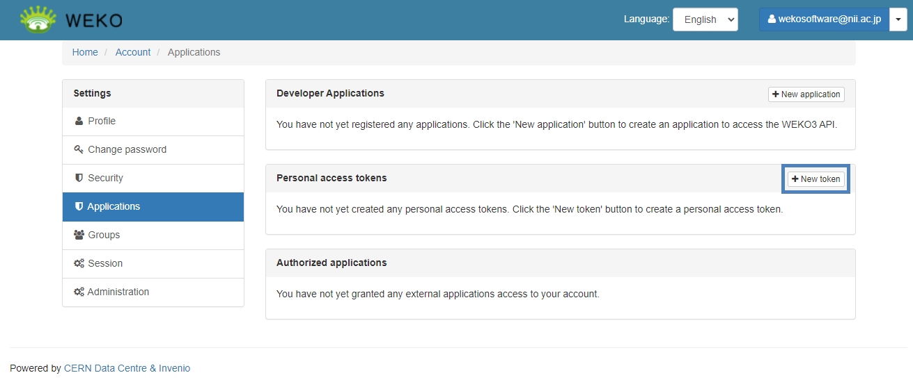

2.  Enter information for each element.

zu080130.tif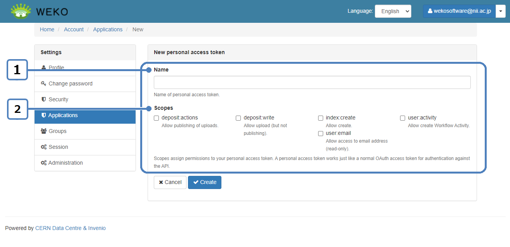

\<TBLATT POSITION="1" SCALE="151"\>

Table 9‑3. The elements in the "New personal access token" screen

| No. | Element | Description     |
| --- | ------- | --------------- |
| 1   | Name    | Enter a name.   |
| 2   | Scopes  | Select a scope. |

3.  Click "Create".

The access token is added.

## LINKID=managegroup【参照先】Join and view a group

This section explains how to join a group and view a group to which you belong.

### Join a group

This section explains how to join a group.

1.  Select "Groups" from the user account pull-down menu in the upper right corner of the screen.

The "Groups" screen appears.

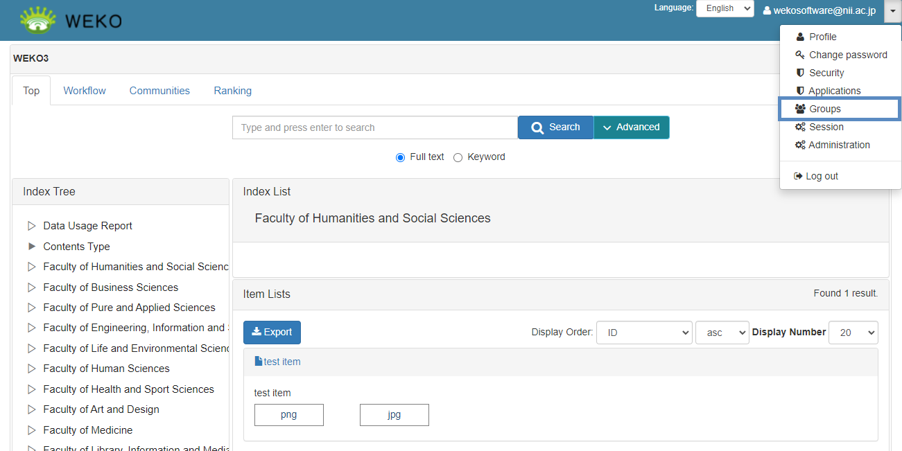

2.  The group to which you belong appears.

If there is an invitation to join a group, the display will look as follows.

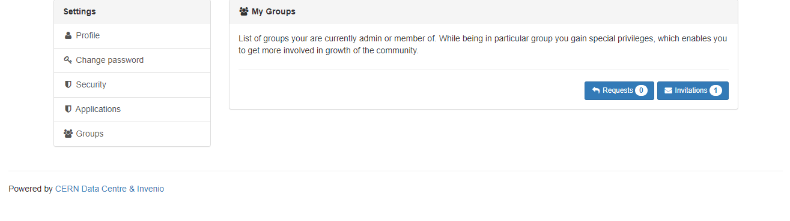

Click the "Invitations" button to display the group you are invited to join. Click "Accept".

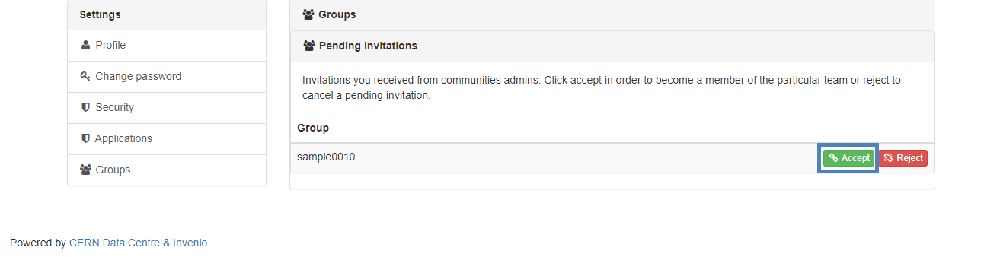Clicking the "Accept" button will update the display as follows.

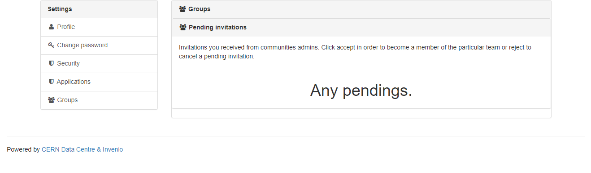

### View groups

This section explains how to view groups to which you belong.

1.  Select "Groups" from the user account pull-down menu in the upper right corner of the screen.

The "Groups" screen appears.

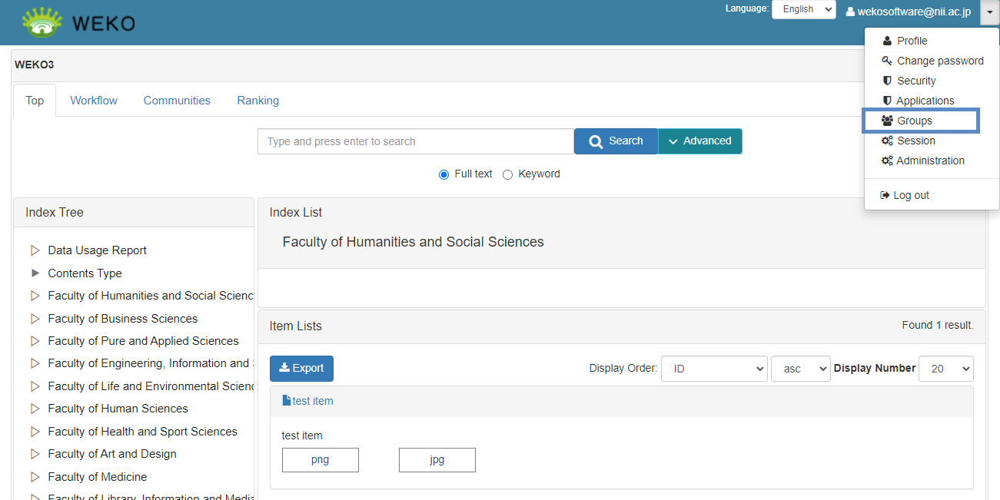

2.  The groups to which you belong appear.

If you do not belong to any group, the display will look as follows.

> If you belong to any groups, the display will look as follows.
> 
> 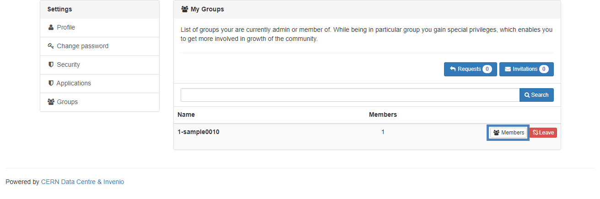

Click on the "Members" button to display details on the group.

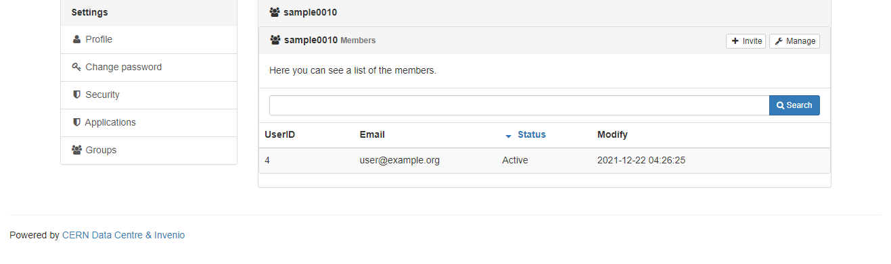

## LINKID=changetimeout【参照先】Modify the session validity time

See the System Administration Manual for instruction.

## LINKID=openadminmenu【参照先】Display the Administration screen.

This section explains how to display the Administration screen.

1.  Log in with an administrator account.

See "ANCHORID=login【参照元】Section 2.2. Log in to the System【E】" for information on how to log in.

2.  Click icon020040.tif next to the account name in the upper right corner of the Home screen.

A pull-down menu appears.

zu080050.tif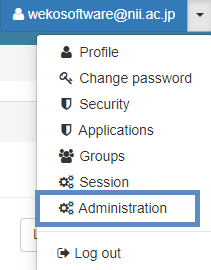

3.  Select Administration.

The Administration screen will be displayed. See the System Administration Manual for instruction.

zu080060.tif
