User Operation Manual

For General User, Registered User,  
and Community/Repository/System Administrator

v2.1.0

| Version | Changes |
| ------- | ------- |
| v2.1.0  | Reviewed against the release_v2.1.0 implementation and reflected the corrections made to the Japanese version (permissions to download, preview and view statistics of files including site license users, index viewing conditions, item edit and delete permissions, bulk export formats). Added the Workspace chapter and the sections that were only in the Japanese version: file details screen (replace and copy), activity TSV export, deletion and lock, large file upload (not released), content policy, cookie consent screen, secret URLs, RSS, journal information, communities, request mail form, Google Scholar/Dataset output, Import to GakuNin RDM, and autofill from researchmap. Marked the changes in v2.1.0 with [v2.1.0]. Replaced screenshots with the release_v2.1.0 English screens. Removed the Word field codes left in the text and fixed broken links and table/figure numbers |

Introduction

This manual provides information on operating the WEKO3 System (referred to as the "System" in this document). The information in this manual will help users carry out data registration, data referencing, and other tasks.

  - Intended Audience

This manual is intended for the following users who operate the System:

  - General users browsing the data

  - Registered users who register and edit data

  - Administrators who perform data registration, i.e., community administrators, repository administrators, and system administrators

<!-- end list -->

  - Structure of the Manual

This manual consists of the following chapters:

Chapter 1: System overview

This chapter describes a high-level overview of the System.

Chapter 2: Log in and log out

This chapter describes step-by-step instructions on logging in and out of the System and changing passwords.

Chapter 3: Search for items

This chapter describes step-by-step instructions on searching for items.

Chapter 4: View item details

This chapter describes elements that are included in items.

Chapter 5: Register items

This chapter describes step-by-step instructions on registering items.

Chapter 6: Edit and delete items

This chapter describes step-by-step instructions on editing and deleting registered items.

Chapter 7: Export items

This chapter describes step-by-step instructions on exporting items.

Chapter 8: Upload large files

This chapter notes that the large file upload feature has not been released.

Chapter 9: Explore communities

This chapter describes step-by-step instructions on exploring communities.

Chapter 10: Operating tips

This chapter provides tips for working with the System.

Chapter 11: RSS

This chapter describes how to get new arrivals by RSS feed.

Chapter 12: Workspace

This chapter describes how to view and register your own items in the workspace.

  - Conventions

The format conventions used in this document are as follows:

<table>
<tbody>
<tr class="odd">
<td>Format</td>
<td>Description</td>
</tr>
<tr class="even">
<td><em>String</em></td>
<td>
Indicates a variable.

Example: Specify a date in the <em>yyyy-mm-dd</em> format.
</td>
</tr>
<tr class="odd">
<td>" "</td>
<td>Indicates the label of an element displayed on the screen, such as a window, dialog box, menu, or button.</td>
</tr>
</tbody>
</table>

# Table of Contents

[1. System overview](#system-overview)

[1.1 About the System](#about-the-system)

[1.2 Glossary](#glossary)

[1.3 System features](#system-features)

[1.4 The elements of the Home screen.](#the-elements-of-the-home-screen)

[2. Log in and log out](#log-in-and-log-out)

[2.1 Access the Home screen](#access-the-home-screen)

[2.2 Log in to the System](#log-in-to-the-system)

[2.3 Log out of the System](#log-out-of-the-system)

[2.4 Change a password](#change-a-password)

[2.5 Sign-up for a new account](#sign-up-for-a-new-account)

[3. Search for items](#search-for-items)

[3.1 Search for items using indexes](#search-for-items-using-indexes)

[3.1.1 Search in "Index Link"](#search-in-index-link)

[3.1.2 Search in "Index Tree"](#search-in-index-tree)

[3.1.3 Display journal information](#display-journal-information)

[3.1.4 View the Item Lists](#view-the-item-lists)

[3.2 Search using the ranking](#search-using-the-ranking)

[3.3 Search by keywords](#search-by-keywords)

[3.3.1 Simple search](#simple-search)

[3.3.2 Advanced search](#advanced-search)

[3.4 About variant character search](#about-variant-character-search)

[3.5 Search by author name](#search-by-author-name)

[3.5.1 Search by author name](#search-by-author-name-1)

[3.5.2 Search by WEKO author ID](#search-by-weko-author-id)

[3.6 Faceted search](#faceted-search)

[4. View item details](#view-item-details)

[4.1 The item details screen](#the-item-details-screen)

[4.1.1 Metadata](#metadata)

[4.1.2 Statistics](#statistics)

[4.1.3 Version](#version)

[4.1.4 Content files](#content-files)

[4.1.5 Share items](#share-items)

[4.1.6 Bibliographic Citation](#bibliographic-citation)

[4.1.7 Export](#export)

[4.1.8 Communities](#communities)

[4.1.9 The Information screen](#the-information-screen)

[4.1.10 The file details screen](#the-file-details-screen)

[4.1.11 The request mail form](#the-request-mail-form)

[4.1.12 Apply to use external data](#apply-to-use-external-data)

[4.1.13 Google Scholar metadata output](#google-scholar-metadata-output)

[4.1.14 Google Dataset metadata output](#google-dataset-metadata-output)

[5. Register items](#register-items)

[5.1 Register items](#register-items-1)

[5.1.1 Register items](#register-items-2)

[5.1.2 Set up an index](#set-up-an-index)

[5.1.3 Set up an item link](#set-up-an-item-link)

[5.1.4 Gant DOIs](#gant-dois)

[5.1.5 Approve items](#approve-items)

[5.2 View activities](#view-activities)

[5.2.1 Display the activities list](#display-the-activities-list)

[5.2.2 Export activities to a TSV file](#export-activities-to-a-tsv-file)

[5.2.3 Delete activities](#delete-activities)

[5.2.4 View the activity details](#view-the-activity-details)

[5.3 Activity lock (v1.0.7)](#activity-lock-v107)

[6. Edit and delete items](#edit-and-delete-items)

[6.1 Edit items](#edit-items)

[6.2 Delete items](#delete-items)

[7. Export items](#export-items)

[7.1 Export items](#export-items-1)

[8. Upload large files](#upload-large-files)

[9. Explore communities](#explore-communities)

[9.1 Explore communities](#explore-communities-1)

[9.2 View the content policy](#view-the-content-policy)

[10. Operating tips](#operating-tips)

[10.1 Modify your profile](#modify-your-profile)

[10.2 Determine which device is used to log in to an account](#determine-which-device-is-used-to-log-in-to-an-account)

[10.3 Manage applications](#manage-applications)

[10.3.1 View the authorized applications](#view-the-authorized-applications)

[10.3.2 Add an application](#add-an-application)

[10.3.3 Add an access token](#add-an-access-token)

[10.4 Join and view a group](#join-and-view-a-group)

[10.4.1 Join a group](#join-a-group)

[10.4.2 View groups](#view-groups)

[10.5 Modify the session validity time](#modify-the-session-validity-time)

[10.6 Display the Administration screen.](#display-the-administration-screen)

[10.7 Display the cookie consent screen](#display-the-cookie-consent-screen)

[10.8 Share non-public content using a one-time address](#share-non-public-content-using-a-one-time-address)

[10.8.1 Secret URL feature](#secret-url-feature)

[11. RSS](#rss)

[11.1 Get new arrivals by RSS feed for each index](#get-new-arrivals-by-rss-feed-for-each-index)

[11.2 Get new arrivals by RSS feed for all indexes](#get-new-arrivals-by-rss-feed-for-all-indexes)

[12. Workspace](#workspace)

[12.1 View the item list](#view-the-item-list)

[12.1.1 Export the item list](#export-the-item-list)

[12.2 Register an item quickly](#register-an-item-quickly)

# System overview

This chapter provides a high-level overview of the System.

## About the System

The System allows you to store and publish academic research results. The System's repository can store content in various formats, including PDF files, videos, and images. You can efficiently manage research results by categorizing and arranging them in a tree structure. You can also reference research results by keyword search or full-text search. The data in the repository can also be synchronized with other repositories. For information on the terminology used in this document, such as "item" or "index", see "Section 1.2. "Glossary".

Figure 1-1. Data management in the System

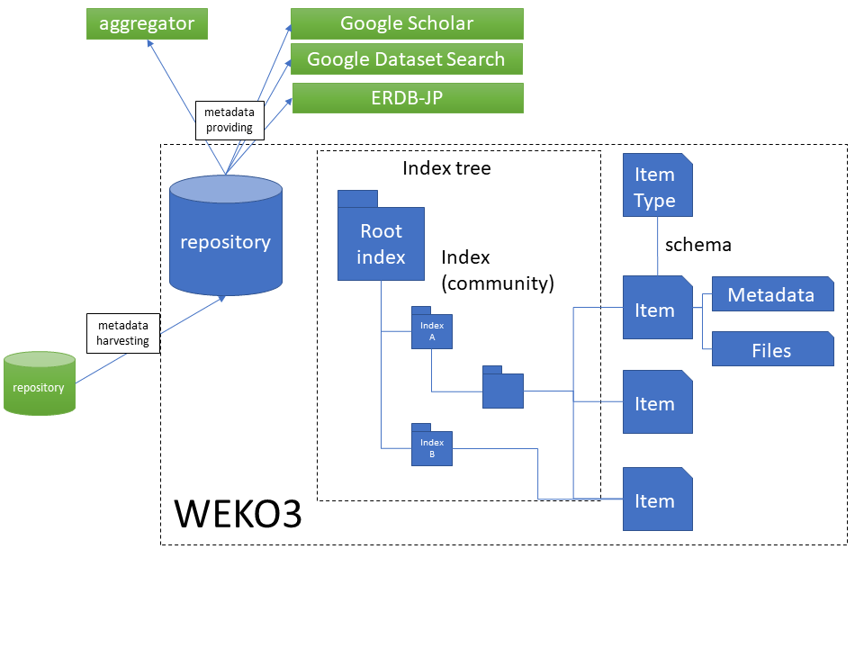

To register an item, you must first create a workflow and register the item. You then need to get approval from reviewers/approvers before publishing the item.

Figure 1-2. Data registration

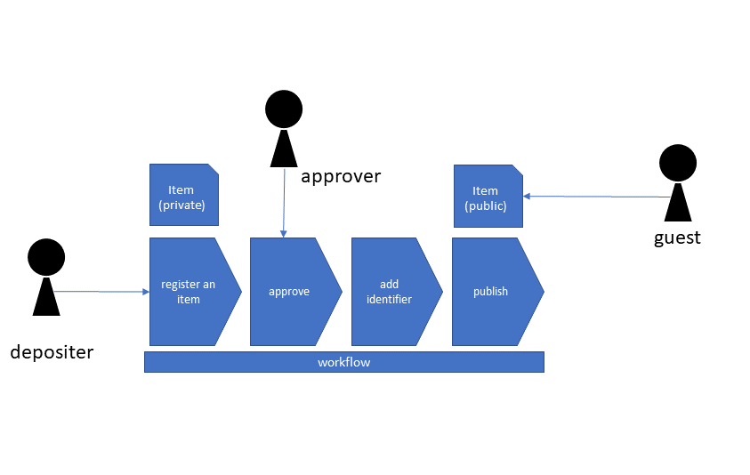

## Glossary

This section explains the terminology used in the System.

Table 1-1. Terms used in the System

<table>
<thead>
<tr class="header">
<th>Term</th>
<th>Description</th>
</tr>
</thead>
<tbody>
<tr class="odd">
<td>DDI</td>
<td>
The Data Documentation Initiative (DDI) is an international standard for metadata schemas in social science research. It is utilized for data archive initiatives such as internationalization, shared use, or joint research centers (https://ddialliance.org/).

In the WEKO3 module, you can use DDI as a metadata schema for OAI-PMH.
</td>
</tr>
<tr class="even">
<td>DublinCore</td>
<td>A metadata schema standardized by the International Organization for Standardization (ISO 15836) (http://dublincore.org/). In the WEKO3 module, you can use DublinCore as a metadata schema for OAI-PMH.</td>
</tr>
<tr class="odd">
<td>JPCOAR</td>
<td>
A metadata schema developed by JPCOAR (Japan Consortium for open access Repositories) (https://schema.irdb.nii.ac.jp/en).

In the WEKO3 module, you can use JPCOAR as a metadata schema for OAI-PMH.
</td>
</tr>
<tr class="even">
<td>junii2</td>
<td>
A metadata schema published by the National Institute of Informatics (NII) (https://support.irdb.nii.ac.jp/sites/default/files/2018-07/junii2guide_ver3.1.pdf).

In the WEKO3 module, you cannot use junii2 as a metadata schema for OAI-PMH.
</td>
</tr>
<tr class="odd">
<td>OAI-PMH</td>
<td>OAI-PMH (The Open Archives Initiative Protocol for Metadata Harvesting) is a protocol developed by the Open Archives Initiative to exchange metadata between repositories (http://www.openarchives.org/OAI/openarchivesprotocol.html). External systems, including repositories, can use OAI-PMH to collect metadata of the items registered in the WEKO3 module.</td>
</tr>
<tr class="even">
<td>UI</td>
<td>Stands for "User Interface". It is an interface for exchanging information between the System and the user.</td>
</tr>
<tr class="odd">
<td>WEKO3 repository</td>
<td>A repository created with the WEKO3 module and related software.</td>
</tr>
<tr class="even">
<td>Item</td>
<td>
A unit of information stored in a repository. An item is made up of content files and metadata. Metadata contains information that conforms to the description elements and description formats specified in a metadata schema.

Each item is assigned an item ID that is unique within a WEKO3 repository. An item is tied to a single item type and cannot be linked to multiple item types.

You can associate different metadata with a single item by creating additional item types.
</td>
</tr>
<tr class="odd">
<td>Item type</td>
<td>
Defines the data type of metadata registered for an item. An item type consists of elements specified in a metadata schema such as JPCOAR.

The repository administrator needs to consider the metadata required for a particular item and create an item type to suit the needs.

Example:

When storing journal papers and research data in the repository, the metadata elements for journal papers are differentiated from those for research data. In such a case, you can create an item type for journal papers and an item type for research data, respectively.
</td>
</tr>
<tr class="even">
<td>Index</td>
<td>A unit (category) used to group items registered in the WEKO3 repository. Items registered in the WEKO3 repository will always have one or more indexes. An index can have multiple child indexes and items.</td>
</tr>
<tr class="odd">
<td>Index tree</td>
<td>A tree structure of nested indexes. A WEKO3 repository has a single repository tree.</td>
</tr>
<tr class="even">
<td>Community</td>
<td>A group of users who can access a particular repository. You can make items available only to the users of the community.</td>
</tr>
<tr class="odd">
<td>Community administrator</td>
<td>A user with the role to manage the community.</td>
</tr>
<tr class="even">
<td>Content</td>
<td>Research data registered in a repository, such as research papers and materials. The word "content" is used interchangeably with "item" in this manual.</td>
</tr>
<tr class="odd">
<td>Content file</td>
<td>Refers to the papers and other files that make up an item.</td>
</tr>
<tr class="even">
<td>System</td>
<td>Refers to the WEKO3 System.</td>
</tr>
<tr class="odd">
<td>System administrator</td>
<td>A user with the role to administer the System.</td>
</tr>
<tr class="even">
<td>Schema</td>
<td>A definition of a repository database structure. It defines the relationship between objects that make up a database, such as tables and lists.</td>
</tr>
<tr class="odd">
<td>Dialog</td>
<td>A UI mainly used to display messages and alerts. The user can still interact with UIs on the screen while a dialog is displayed.</td>
</tr>
<tr class="even">
<td>Registered user</td>
<td>User who can access stored academic research results and register data from academic research results in the repository.</td>
</tr>
<tr class="odd">
<td>Harvesting</td>
<td>Scheduled activity for collecting repository data by external systems. It uses a dedicated protocol. Metadata needs to be mapped to the protocol.</td>
</tr>
<tr class="even">
<td>Flow</td>
<td>A series of actions used to save items to the System. It defines a sequence of actions such as adding data to a repository, entering metadata, and peer review/approval.</td>
</tr>
<tr class="odd">
<td>Metadata</td>
<td>Information related to an item. Examples include information for a title, author, and file size. Metadata consists of content metadata and administrative metadata. Content metadata is a summary of the item. Administrative metadata is information such as the creator of the content metadata or access count for the item.</td>
</tr>
<tr class="even">
<td>Repository</td>
<td>
A set of services a university provides to its community members to manage and distribute digital materials created by the university and its members. In principle, a university or academic organization (i.e., a single institution) can operate one repository.

The term refers to, in this manual, a space where research data (i.e., items) and their metadata are stored.
</td>
</tr>
<tr class="odd">
<td>Repository administrator</td>
<td>A user with the role to administer a repository. The repository administrator can configure the WEKO3 module, the index tree, and item types.</td>
</tr>
<tr class="even">
<td>Log in</td>
<td>The action to authenticate with a computer or various services on the Internet using pre-registered account information to access data.</td>
</tr>
<tr class="odd">
<td>Log out</td>
<td>The action to close one's access to data granted through authentication upon logging in.</td>
</tr>
<tr class="even">
<td>Role</td>
<td>Defines the permissions granted to a user when operating the System, repository, and other elements. Permissions include adding, changing, and deleting data.</td>
</tr>
<tr class="odd">
<td>Workflow</td>
<td>Defines a series of processes for business operations. It also refers to the sequence of those operations. A workflow for the WEKO3 repository defines a sequence of actions starting with registering items through publishing, including adding data to the repository, entering metadata, or peer review/approval.</td>
</tr>
<tr class="even">
<td>Variant character</td>
<td>
The traditional alternative of kanji or a different form of character with the same pronunciation and meaning but written differently.

Example:

"會" instead of "会", or "壱" instead of "一".
</td>
</tr>
</tbody>
</table>

## System features

The following table shows the System features.

Table 1-2. The features related to registering and viewing data in the System

| Features                                                                                              | Description                                                                                                                                                                                                      |
| ----------------------------------------------------------------------------------------------------- | ---------------------------------------------------------------------------------------------------------------------------------------------------------------------------------------------------------------- |
| View a list of items         | View a list of items registered in the System. You can drill down the information by selecting an item from the list.                                                                                            |
| View item details           | View the metadata of an item. You can also download research papers and other files that make up an item.                                                                                                        |
| View ranking                     | Aggregate statistics such as the view count of an item and show the ranking.                                                                                                                                     |
| Search the index tree    | List items belonging to an index by selecting the index from the index tree.                                                                                                                                     |
| Search by keywords               | Search for items via keyword searches. The search results will show the items containing specified keywords. You can search for metadata and content files.                                                      |
| Register and publish items | Register and publish your research data and other related materials and papers. Content files and their metadata are organized into an "item" and stored in the repository. You can also register only metadata. |
| Workflow                             | Set up a workflow when you register an item so that it will go through the stages of peer review/approval before publication. You can also view a list of items pending approval.                                |
| Edit and delete items     | Edit or delete a registered item.                                                                                                                                                                                |

## The elements of the Home screen.

You will find the following elements in the Home screen.

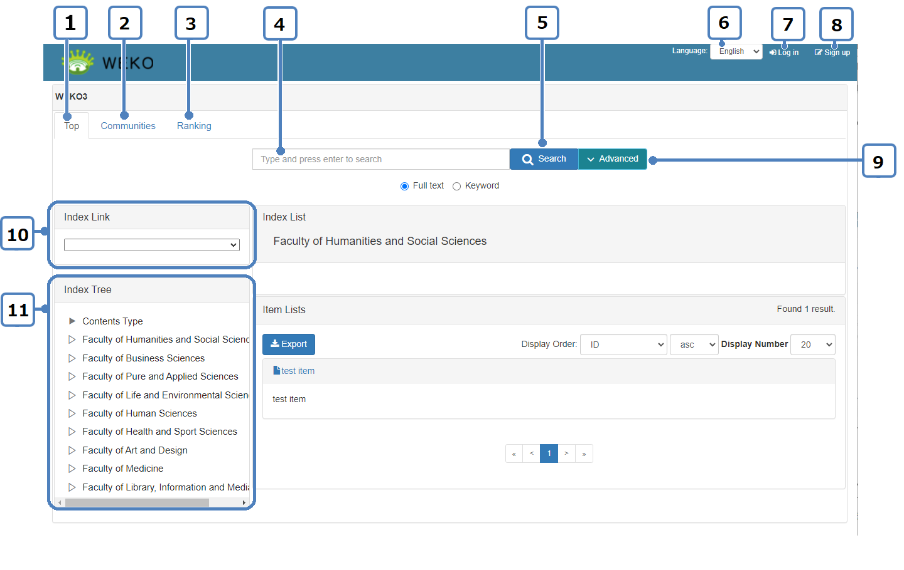

Table 1-3. The elements in the Home screen

<table>
<thead>
<tr class="header">
<th>No.</th>
<th>Element</th>
<th>Description</th>
</tr>
</thead>
<tbody>
<tr class="odd">
<td>1</td>
<td>The "Top" tab</td>
<td>
Search for items here. See "Chapter 3: Search for items" for more information.

Click to navigate to the Home screen.
</td>
</tr>
<tr class="even">
<td>2</td>
<td>The "Communities" tab</td>
<td>Explore communities. See "Chapter 9: Explore communities" for more information.</td>
</tr>
<tr class="odd">
<td>3</td>
<td>The "Ranking" tab</td>
<td>View rankings such as the item view count or download count. See "Section 3.2. Search using the ranking" for more information.</td>
</tr>
<tr class="even">
<td>4</td>
<td>The "Search" text box</td>
<td>Specify the conditions for keyword searches here. See "Section 3.3. Search by keywords" for more information.</td>
</tr>
<tr class="odd">
<td>5</td>
<td>The  button</td>
<td>Use this button for a simple search. See "Section 3.3.1. Simple search" for more information.</td>
</tr>
<tr class="even">
<td>6</td>
<td>The "Language" pull-down list</td>
<td>Specify the display language here. See "Section 2.1. Access the Home screen" for more information.</td>
</tr>
<tr class="odd">
<td>7</td>
<td>The "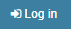" button</td>
<td>Use this button to log in to an account. See "Section 2.2. Log in to the System" for more information.</td>
</tr>
<tr class="even">
<td>8</td>
<td>The "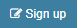" button</td>
<td>Use this button to sign-up for an account. See "Section 2.5. Sign-up for a new account" for more information.</td>
</tr>
<tr class="odd">
<td>9</td>
<td>The 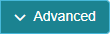 button</td>
<td>Use this button for advanced searches. See "Section 3.3.2. Advanced search" for more information.</td>
</tr>
<tr class="even">
<td>10</td>
<td>The "Minimize menu" button</td>
<td>Shows or hides the menus such as the index links and the index tree.</td>
</tr>
<tr class="odd">
<td>11</td>
<td>The "Index Link" screen</td>
<td>This screen shows index links.</td>
</tr>
<tr class="even">
<td>12</td>
<td>The "Index Tree" screen</td>
<td>This screen shows indexes organized under the index tree.</td>
</tr>
</tbody>
</table>

# Log in and log out

This chapter provides information on logging in to and out of the System and changing passwords.

## Access the Home screen

This section explains how to display the Home screen.

1.  Specify the URL of the System in your browser.

When you access the System successfully, the Home screen appears. See "Section 2.2. Log in to the System" for information on logging in to the System.

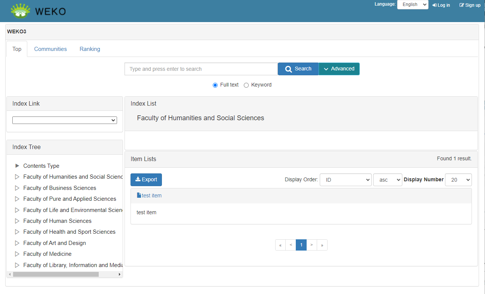

2.  Select a language from the "Language" pull-down list in the upper right corner of the screen.

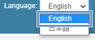

The screen refreshes to display in the language selected.

## Log in to the System

This section explains how to log in to the System.

3.  Click the  button in the upper right corner of the Home screen.

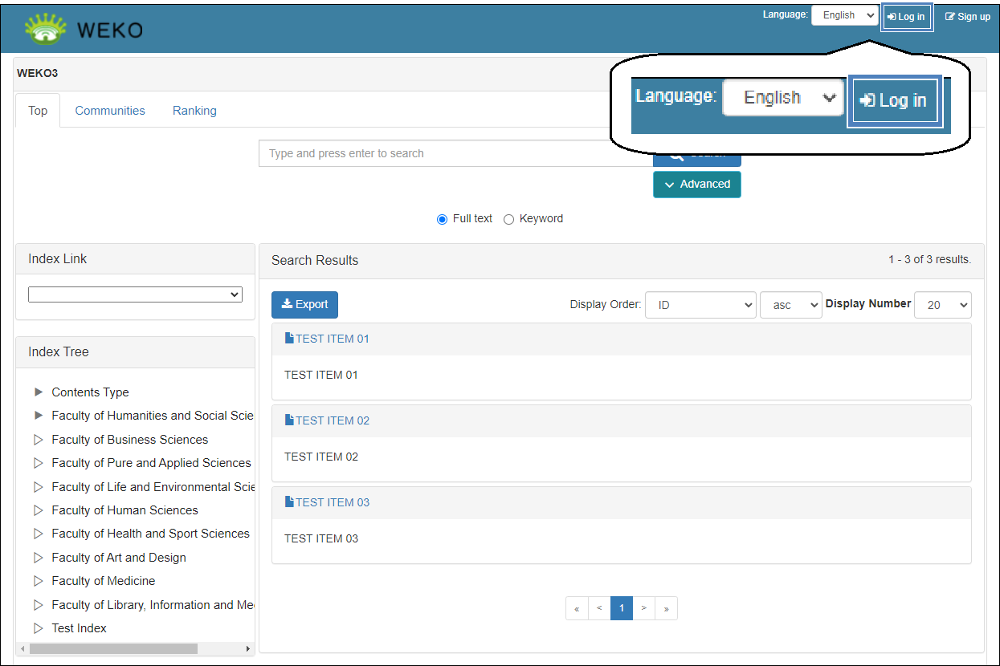

The login screen appears.

4.  To log in from the WEKO3 login screen:

<!-- end list -->

1.  > Enter the account information in the WEKO3 login screen and click the "Log In" button to log in.

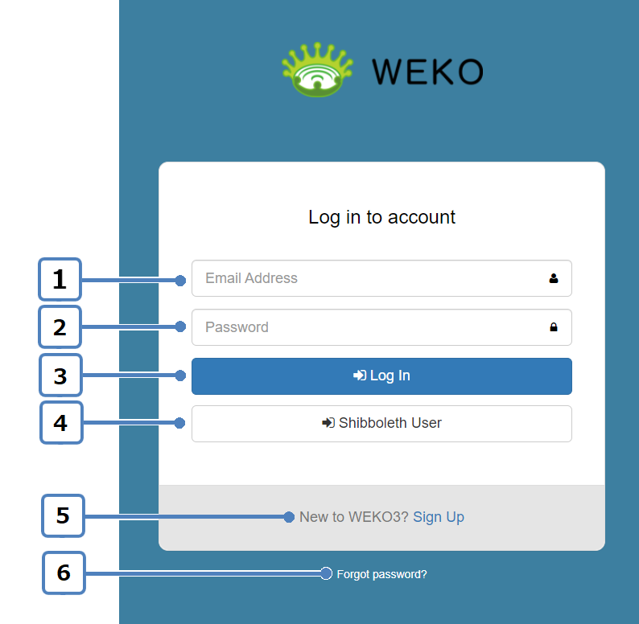

Table 2-1. The elements in the "Log in" screen

| No. | Element                                                         | Description                                                                                                                                                                                                                  |
| --- | --------------------------------------------------------------- | ---------------------------------------------------------------------------------------------------------------------------------------------------------------------------------------------------------------------------- |
| 1   | The account text box                                            | Enter the account information (email address) of a general user. The input format should be "*XXXX@XXX*.*XXX*". You can use alphanumeric characters, hyphens (-), and underscores (\_). The maximum length is 16 characters. |
| 2   | The password text box                                           | Enter the password for the account (email address) you entered. You can enter 6 to 16 characters (alphanumeric characters only).                                                                                             |
| 3   | The  button            | Click to log in with the account (email address) and password you entered. The Home screen of the System appears.                                                                                                            |
| 4   | The 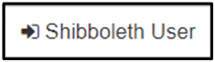 button | Single sign-on to open sources.                                                                                                                                                                                              |
| 5   | The "Sign Up" link                                              | Click to display the sign-up screen.                                                                                                                                                                                         |
| 6   | The "Forgot Password" link                                      | Click to reset your password. See "Section 2.4. Change a password" for more information.                                                                                                      |

2.  > Click the  button.
    
    The Home screen of the System appears.

<!-- end list -->

5.  To log in from the Shibboleth login screen:
    
    JAIRO Cloud or GakuNin Embedded DS (Pattern 1 or Pattern 2) is used for the Shibboleth login, based on the settings of the content file.

<!-- end list -->

1.  > Enter the account information in the JAIRO Cloud login screen to log in to the System.

Figure 2-1. The JAIRO Cloud login screen

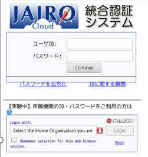

2.  > Log in to the System from the GakuNin Embedded DS login screen (pattern 1).
    
    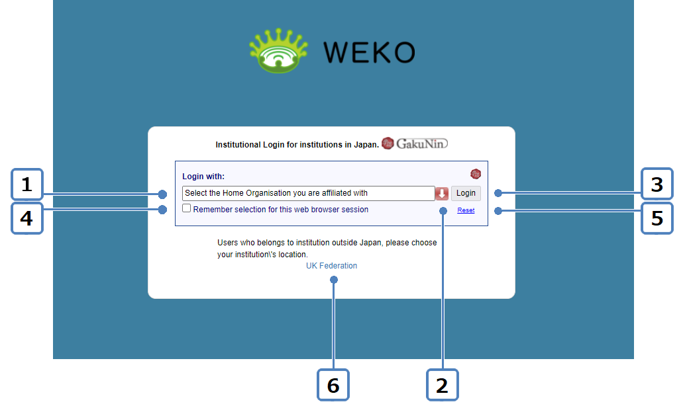

Table 2-2. The elements in the GakuNin Embedded DS login screen (pattern 1)

| No. | Element                                                              | Description                                                                                                                          |
| --- | -------------------------------------------------------------------- | ------------------------------------------------------------------------------------------------------------------------------------ |
| 1   | The entry field for an affiliated institution                        | Enter your institution. As you type, the matching candidates are filtered and displayed.                                             |
| 2   | The / button | Click to show/hide the list of institutions. See "Figure 1. The pull-down list showing candidate institutions" for more information. |
| 3   | The 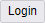 button                | Click to navigate to the corresponding login screen for the selected institution.                                                    |
| 4   | The "Remember selection for this web browser session" check box      | If checked, you will be automatically logged in to the System while the browser is running.                                          |
| 5   | The "Reset" link                                                     | Click to delete the information you entered in the institution entry box.                                                            |
| 6   | The "UK Federation" link                                             | Click to navigate to the predefined institution selection screen.                                                                    |

Figure 2-2. The pull-down list showing candidate institutions

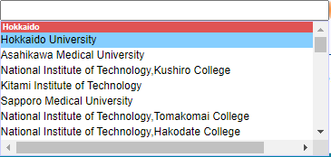

Enter the account information in the login screen for the selected institution to log in to the System.

The WEKO3 home screen appears.

3.  > Log in to the System from the GakuNin Embedded DS login screen (pattern 2).

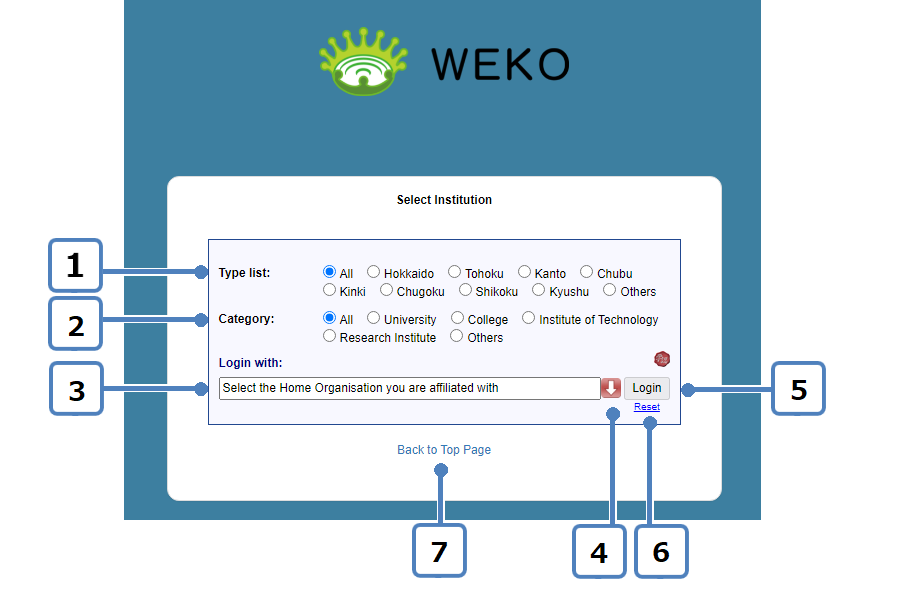

Table 2-3. The elements in the GakuNin Embedded DS login screen (pattern 2)

<table>
<thead>
<tr class="header">
<th>No.</th>
<th>Element</th>
<th>Description</th>
</tr>
</thead>
<tbody>
<tr class="odd">
<td>1</td>
<td>The "Type list" radio buttons</td>
<td>
Select a region in Japan.

When you select one, the corresponding institutions in the region will be automatically filtered into the list of institutions.
</td>
</tr>
<tr class="even">
<td>2</td>
<td>The "Category" radio buttons</td>
<td>
Select a category of the institution.

When you select one, the corresponding institutions in the category will be automatically filtered into the list of institutions.
</td>
</tr>
<tr class="odd">
<td>3</td>
<td>The entry field for an affiliated institution</td>
<td>Enter your institution. As you type, the matching candidates are filtered and displayed.</td>
</tr>
<tr class="even">
<td>4</td>
<td>The / button</td>
<td>Click to show/hide the list of institutions. See "Figure 2-2. The pull-down list showing candidate institutions" for more information.</td>
</tr>
<tr class="odd">
<td>5</td>
<td>The  button</td>
<td>Click to navigate to the corresponding login screen for the selected institution.</td>
</tr>
<tr class="even">
<td>6</td>
<td>The "Reset" link</td>
<td>Click to delete the information you entered in the institution entry box.</td>
</tr>
<tr class="odd">
<td>7</td>
<td>The "Back to Top Page" link</td>
<td>Click to navigate back to the top of the page.</td>
</tr>
</tbody>
</table>

Enter the account information in the login screen for the selected institution to log in to the System.

The WEKO3 home screen appears.

Notes:

According to the user information used in the Shibboleth login, the System creates a WEKO3 account and assigns a role in the following way.

  - An administrator will be assigned a system administrator role.

  - A library staff member will be assigned a repository administrator role.

  - A faculty member will be assigned a general user role.

Note: When a user logs in through GakuNin Embedded DS, roles and groups are assigned to the user according to the information from the GakuNin mAP feature.

  - The role names and group names are defined according to the configuration file. The defined group names are included in the specified attribute.

  - Access control for users who log in through GakuNin is performed based on the groups defined by the GakuNin mAP feature.

## Log out of the System

This section explains how to log out of the System.

1.  Click  next to the account name in the upper right corner of the Home screen.

A pull-down menu appears.

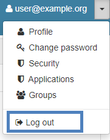

6.  Click "Log out".

You will log out of the System.

## Change a password

This section explains how to change the password configured for an account.

1.  Click  next to the account name in the upper right corner of the Home screen.

A pull-down menu appears.

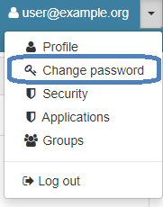

7.  Click "Change password".

The "Change password" screen appears.

8.  Specify a new password in the "Change password" screen.

Figure 2-3. The "Change password" screen

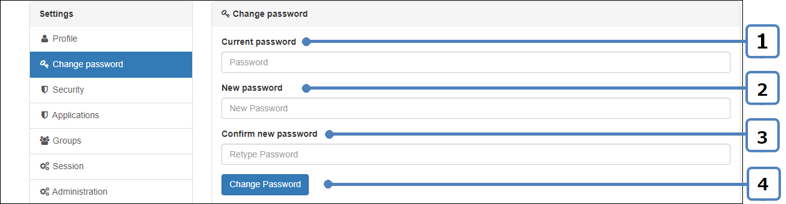

Table 2-4. The elements in the "Change password" screen

| No. | Element                                               | Description                                                                                        |
| --- | ----------------------------------------------------- | -------------------------------------------------------------------------------------------------- |
| 1   | The "Current password" text box                       | Enter the password that is currently configured.                                                   |
| 2   | The "New password" text box                           | Enter a new password. You can enter 6 to 16 characters (alphanumeric characters only).             |
| 3   | The "Confirm new password" text box                   | Enter the new password again to confirm that the value you specified in "New password" is correct. |
| 4   | The 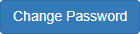 button | Click to reflect the specified information and update your password.                               |

9.  Click the  button.

The password is updated.

## Sign-up for a new account

This section explains how to create a new account.

1.  Click  in the upper right corner of the Home screen.

The "Sign up" screen appears.

10. Enter an account name and password in the "Sign up" screen that appears.

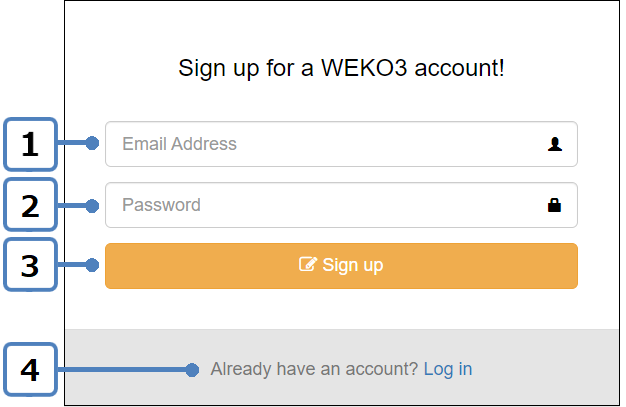

Table 2-5. The elements in the "Sign up" screen

| No. | Element                                               | Description                                                                                                                                                                          |
| --- | ----------------------------------------------------- | ------------------------------------------------------------------------------------------------------------------------------------------------------------------------------------ |
| 1   | The "Email Address" text box                          | Enter an email address. The input format should be "*XXXXX*＠*XXX.XXX*". You can use alphanumeric characters, hyphens (-), and underscores (\_). The maximum length is 255 characters. |
| 2   | The "Password" text box                               | Enter a new password. You can enter 6 to 255 characters (alphanumeric characters only).                                                                                              |
| 3   | The  button | Click to sign-up for the service.                                                                                                                                                    |
| 4   | The 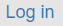 link   | Click to navigate to the login screen. Log in and continue working.                                                                                                                  |

11. Click the  button.

Log in with the account you created.

# Search for items

This chapter provides information on searching for items.

## Search for items using indexes

This section explains how to search for items on the Home screen using index links or the index tree.

### Search in "Index Link"

The index link search is available when index links are configured "Enable". See the System Administration Manual in "Section 15.2. Display the Index Link" for more information.

This section explains how to search for items using index links.

1.  Click on the "Top" tab on the Home screen.

This screen shows "Index link".

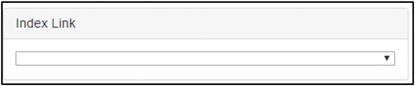

12. Select an index name from the "Index Link" pull-down list.

A search for items is performed.

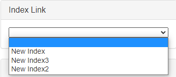

13. The search results appear in the "Item Lists" screen.

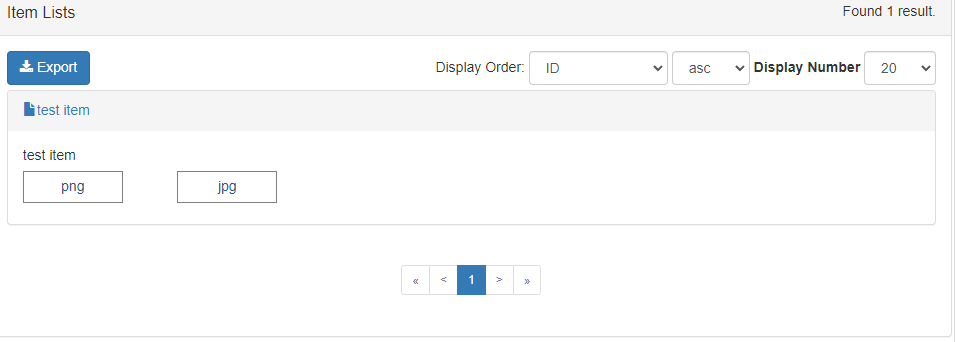

See "Section 3.1.3. View the Item Lists" for more information.

### Search in "Index Tree"

This section explains how to search for items using the index tree.

1.  Click on the "Top" tab on the Home screen.

This screen shows "Index Tree".

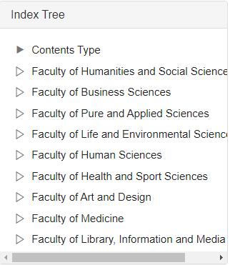

You can use the index tree to search for items in the following ways.

#### To search in "Item Lists":

1.  Click on an index name under "Index Tree".

A search for items is performed. The search results appear in the "Item Lists" screen. See "Section 3.1.3. View the Item Lists" for more information.

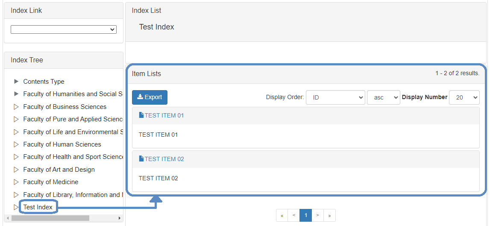

#### To search from "Index List":

1.  Click on an index name under "Index Tree".

If child indexes are placed under the index, the "Index List" screen will appear.

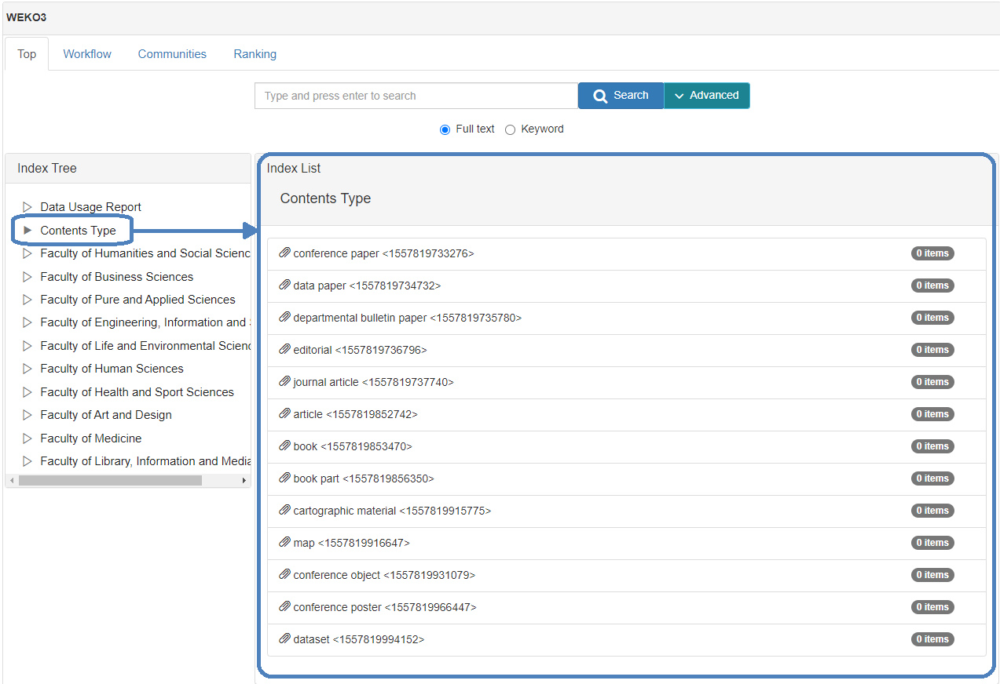

A list of child indexes belonging to the index appears in the "Index List" screen. Private indexes are not displayed for guest users.

[v2.1.0] Note: Only the indexes you are allowed to view are displayed in "Index Tree" and "Index List". You can view an index when the index is public (and its publish date, if set, has passed), you have at least one of the roles specified in the browsing privileges of the index, and you belong to one of the groups specified in the browsing privileges. Logged-in users who do not belong to any group and guest users are treated as belonging to "No Group". See the System Administration Manual for details on setting browsing privileges.

Each index shows the number of items it contains. Public and private items are counted as follows.

  - The following items are counted as public:

<!-- end list -->

  - Public items belonging to a public index

<!-- end list -->

  - The following items are counted as private:

<!-- end list -->

  - Public or private items belonging to a private index

  - Private items belonging to a public index

<!-- end list -->

14. Click on an index name in "Index List".

A search for items is performed. The search results appear in the "Item Lists" screen. See "Section 3.1.3. View the Item Lists" for more information.

#### To search from "Index Tree":

1.  Click  next to an index in "Index Tree".

Child indexes belonging to the index appear.

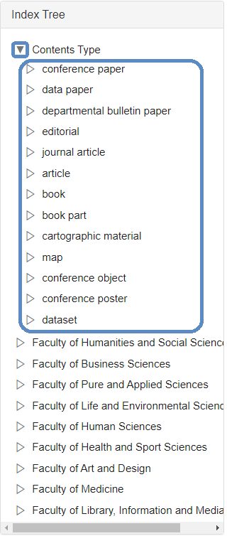

15. Click on an index name.

A search for items is performed. The search results appear in the "Item Lists" screen. See "Section 3.1.3. View the Item Lists" for more information.

### Display journal information

When journal information is configured for an index and set to be output, the journal information appears above "Item Lists" when you search with that index. See "Manage journal information" in the System Administration Manual for details on configuring journal information.

Each piece of journal information is displayed in the format "*item name*: *value*", and only the items that have a value are displayed.

| No. | Element | Description |
| --- | ------- | ----------- |
| 1   | Thumbnail | The thumbnail image of the index appears if one is set. |
| 2   | "Title" area | Displays the "Title", "Publisher name", "Language" and "Online-format identifier" of the journal information, and the comment of the index. |
| 3   | URL | Displays the URL of the index. |
| 4   | "Details" link | Click to expand the other journal information, such as "Print-format identifier", "NCID", "Publication type", "Coverage depth" and the volumes and issues available online. |

### View the Item Lists

This section explains how to view the information in "Item Lists" in two ways: a list and a table of contents.

#### To view "Item Lists" as a list:

Display search results as a list of items. The default is set to this format. The titles of items appear in the language selected in the Web screen.

The display language is chosen according to the following priority order: the language selected for the Web page display \> English \> the first language configured when registering the item \> the first value when registering without configuring languages.

| No. | Element     | Description |
| --- | ----------- | ----------- |
| 1   | Thumbnail   | When "Show List" is set to "ON" in the thumbnail property options for the item type, the thumbnail files uploaded for "Item Lists" will be displayed. If multiple thumbnail files have been uploaded, the first thumbnail file on the item details screen will appear. |
| 2   | Author ID   | When "Show List" is set to "ON" in the creator property options for the item type, author IDs are displayed as icons. |
| 3   | Description | Displayed when "Show List" is set to "ON" in the Description property options for the item type. Click to display the Description information below the element. |
| 4   | Files       | Displayed when "Show List" is set to "ON" in the Files property options for the item type. Click to display the file information below the element as links with the file extensions (if there is no content file and only a URL is registered, the link will appear as "URL"; if there is no file extension, the link will appear as "unknown"). You can download the content file by clicking on the link (if there is no content file and only a URL is registered, you will be redirected to that URL). If many content files are registered, "..." appears in "Item Lists". Clicking "..." will display the item details screen. |

  - Display Description

    The Description information of the item is displayed.

  - Display Files

    The content files and text URL information of the item are displayed.

  - Display Reference

    The related identifier information of the item is displayed.

See "Section 3.3.1. Simple search" for information on the display order and the number of items displayed.

1.  Click the title of an item.

The item details screen appears.

See "Chapter 4: View item details" for more information on the screen elements.

#### To view "Item Lists" as a table of contents:

Display search results in a list of headings. See the System Administration Manual for information on viewing the information in this format.

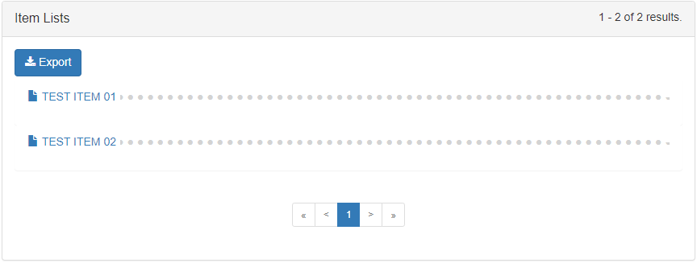

1.  Click the title of an item.

The item details screen appears. See "Chapter 4: View item details" for more information.

## Search using the ranking

The ranking search is available when the ranking display is set to "On". See "Configure the ranking display" in the System Administration Manual for more information.

This section explains how to search for items using the ranking display.

1.  Click on the "Ranking" tab.

The "Ranking" screen appears.

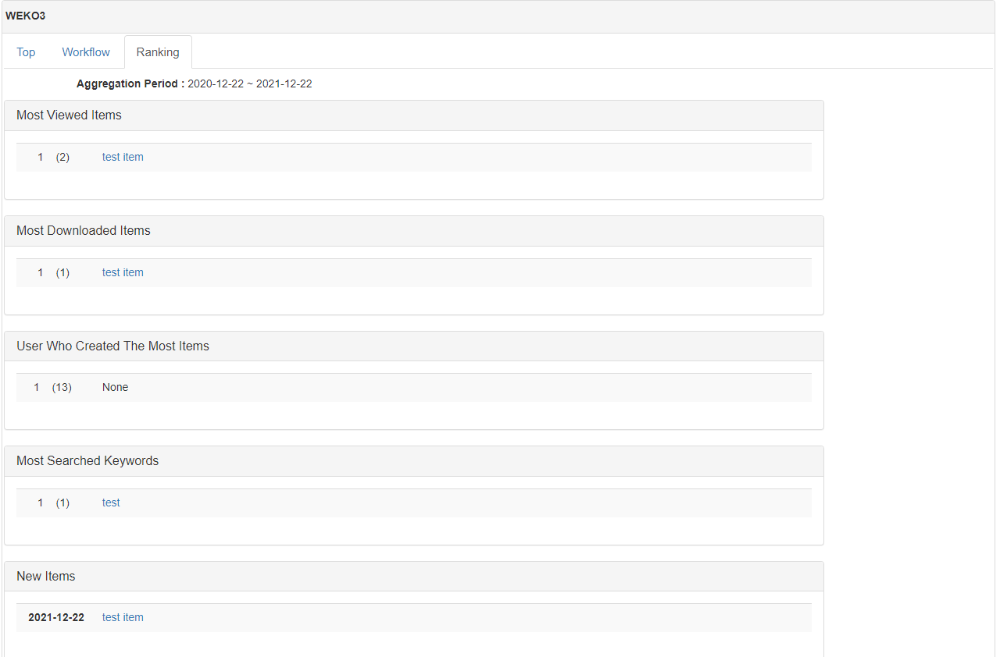

You can view rankings such as the most viewed items, the most downloaded items, or the most searched keywords.

#### Most Viewed Items

It ranks the most-viewed public items.

You can view the title and the number of views for each item.

1.  Click on an item title.

The item details screen for the item appears.

16. Download the file as needed.

Figure 3-1. The "Most Viewed Items" screen

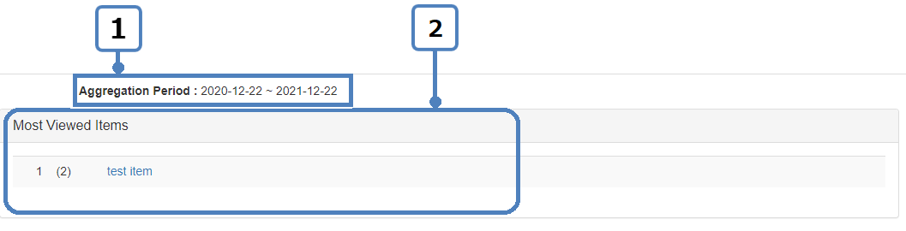

Table 3-1. The elements in the "Most Viewed Items" screen

| No. | Element            | Description                                                                                              |
| --- | ------------------ | -------------------------------------------------------------------------------------------------------- |
| 1   | Aggregation Period | It shows the aggregation period used for the ranking. The display format is "*yyyy-mm-dd - yyyy-mm-dd*". |
| 2   | Most Viewed Items  | It ranks the most-viewed public items, showing the number of views and the titles.                       |

#### Most Downloaded Items

It ranks the most-downloaded public item files.

You can view the title and the number of downloads for each item.

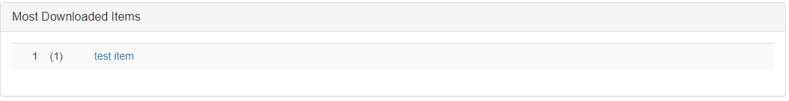

1.  Click on an item title.

The item details screen for the item appears.

17. Download the file as needed.
    
#### User Who Created The Most Items

It ranks the users based on the number of items they created.

You can view the user and the number of items each created.

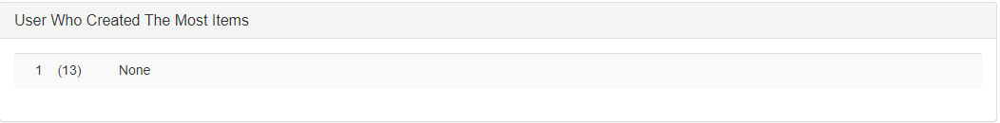

#### Most Searched Keywords

It ranks the keywords based on the number of times they were used for searches.

You can view keywords and the number of times searched.

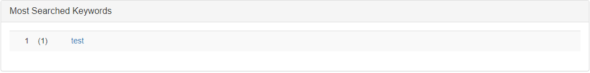

1.  Click on a keyword.

The search result screen appears for the keyword.

#### New Items

Recently released items appear here.

You can view the title and published date for each item.

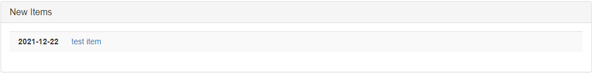

1.  Click on an item title.

The item details screen for the item appears.

18. Download the file as needed.
    
    Additional Information:
    
    ・The "Ranking" screen does not show the following items.
    
    \- Deleted items
    
    \- Items that have been configured to be private.
    
    \- Items whose publish date is in the future
    
    ・Searches without keywords (i.e. listing all data) or searches using only blank spaces are not included in the keyword ranking. The "Most Searched Keywords" ranking shows the searched text as it is specified. For example, if you specify "adults and children", this phrase will be counted as one keyword. (It is handled as a different keyword than "adults" or "children.")
    
## Search by keywords

There are two types of keyword searches: simple search and advanced search. This section explains how to search for items by specifying keywords.

### Simple search

1.  Click on the "Top" tab.

The keyword search text box appears.

Enter a keyword in the keyword search text box and check the "Full text" or "Keyword" radio button as the search method.

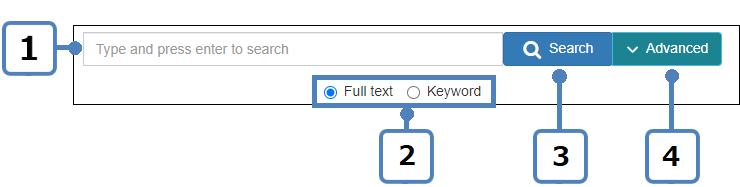

19. 

Table 3-2. The elements in the simple search screen

<table>
<thead>
<tr class="header">
<th>No.</th>
<th>Element</th>
<th>Description</th>
</tr>
</thead>
<tbody>
<tr class="odd">
<td>1</td>
<td>The keyword search text box</td>
<td>
You can enter a keyword for searching for items.

You can use the following characters with searches:

+ - = &amp;&amp; || ! ( ) { } [ ] ^ " ~ * ? : \ /

Note that you cannot use the "&lt;" and "&gt;" characters in searches.

You can perform an OR search by separating keywords with " OR " or " | " (both require spaces before and after).
</td>
</tr>
<tr class="even">
<td>2</td>
<td>The search method radio buttons</td>
<td><ul>
<li>
When the search method is "Full text":
</li>
</ul>

A search will run against metadata of the registered items and information included in the registered content files.

<ul>
<li>
When the search method is "Keyword":
</li>
</ul>

A search will run against metadata of the registered items.
</td>
</tr>
<tr class="odd">
<td>3</td>
<td>The  button</td>
<td>Click to run a simple search by keywords.</td>
</tr>
<tr class="even">
<td>4</td>
<td>The  button</td>
<td>Click to display the advanced search screen to specify more details. See "Section 3.3.2. Advanced search" for more information.</td>
</tr>
</tbody>
</table>

2.  Click the  button.

The search results appear. See "Chapter 4: View item details" for more information on search results.

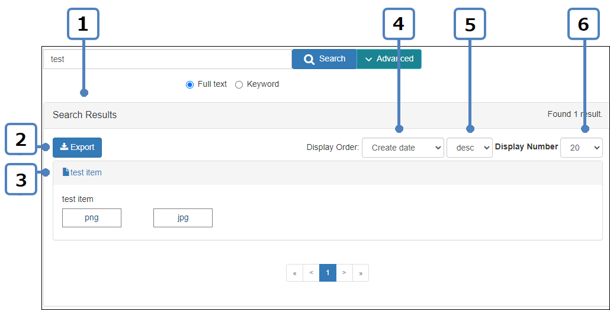

Table 3-3. The elements in the "Search Results" screen

| No. | Element                                               | Description                                                                                                                                                                                                      |
| --- | ----------------------------------------------------- | ---------------------------------------------------------------------------------------------------------------------------------------------------------------------------------------------------------------- |
| 1   | "Search Results"                                      | The search results appear.                                                                                                                                                                                       |
| 2   | The 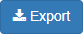 button | Click to open the "Items to Export" screen. You can export information contained in the items. See "Chapter 7: Export items" for more information.                                                               |
| 3   | An item name                                          | Clicking on a name takes you to the item details screen. See "Chapter 4: View item details" for more information. See "Figure 3-2. The item details screen". |
| 4   | The "Display Order" pull-down list                    | Select the order in which the search results are displayed from the "Display Order" pull-down list. See "Figure 3-3. The "Display Order" pull-down list". Only the display orders that are set to be shown in the list in the search result display settings are displayed. See "Configure the search results settings" in the System Administration Manual for more information. |
| 5   | The "asc/desc" pull-down list                         | Select "asc" (ascending) or "desc" (descending) for a sort order. See "Figure 3-4. The "asc/desc" pull-down list" for more information.                                          |
| 6   | The "Display Number" pull-down list                   | Select the number of items to display from the "Display Number" pull-down list. See "Figure 3-5. The "Display Number" pull-down list" for more information.             |
| 7   | The author ID icon                                    | If an identifier is set for an author, the first letter of the identifier name is displayed as an icon. For ORCID, the ORCID icon is displayed.                                                                   |
| 8   | The file links                                        | If files are attached to the item, links to the files are displayed.                                                                                                                                             |
| 9   | The "..." link                                        | Displayed when many files are attached to the item. Click to expand the file links.                                                                                                                              |

Figure 3-2. The item details screen

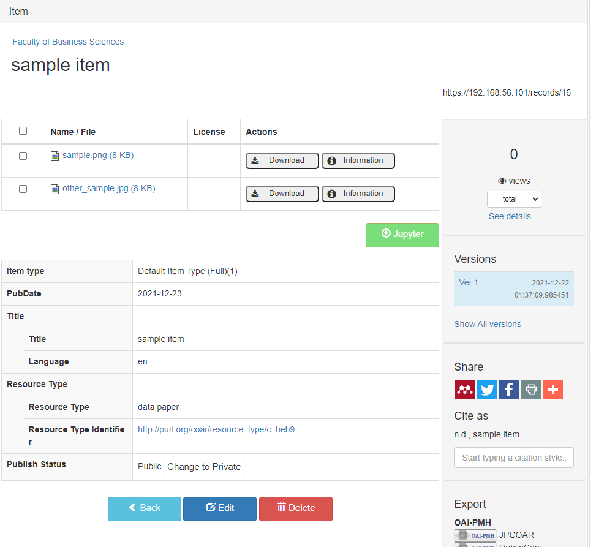

Figure 3-3. The "Display Order" pull-down list

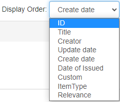

Figure 3-4. The "asc/desc" pull-down list

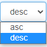

Figure 3-5. The "Display Number" pull-down list

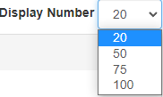

### Advanced search

1.  Click on the "Top" tab.

The keyword search text box appears.

20. Enter a keyword in the keyword search text box and check the "Full text" or "Keyword" radio button as the search method.

21. Click the  button.

The advanced search screen appears where you can specify more details.

The button has a label replaced, showing 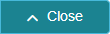.

Clicking  will collapse the advanced search area. The button has a label replaced, showing .

You can perform an OR search by separating text with " OR " or " | " (both require spaces before and after).

You can perform an AND search using a combination of the simple search text field and any element of the advanced search.

Click Enter to search for items matching the search criteria. The search results appear in the "Search Results" area on the "Top" tab.

Note: To use the search criteria you have set, use the search button in the advanced search area.

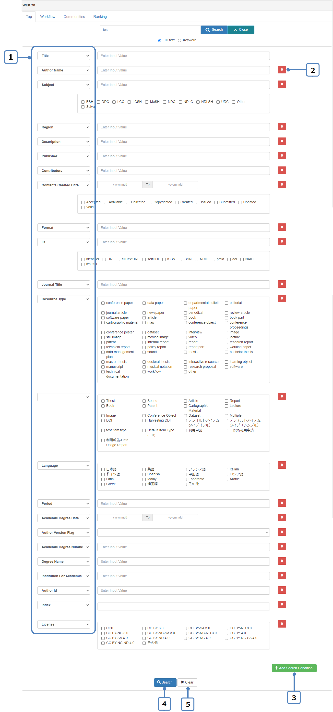

Table 3-4. The elements in the advanced search screen

<table>
<thead>
<tr class="header">
<th>No.</th>
<th>Element</th>
<th>Description</th>
</tr>
</thead>
<tbody>
<tr class="odd">
<td>1</td>
<td>The search criteria pull-down lists</td>
<td>Select the search criteria of your choice from the pull-down lists.</td>
</tr>
<tr class="even">
<td>2</td>
<td>The 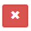 button</td>
<td>Click to delete the criteria.</td>
</tr>
<tr class="odd">
<td>3</td>
<td>The 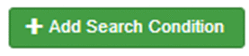 button</td>
<td>Click to add criteria.</td>
</tr>
<tr class="even">
<td>4</td>
<td>The  button</td>
<td>Click to run a search. The "Search Results" screen will then appear. See "Figure 3-6. The "Search Results" screen" for more information.</td>
</tr>
<tr class="odd">
<td>5</td>
<td>The 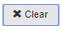 button</td>
<td>Click to clear the criteria.</td>
</tr>
<tr class="even">
<td>6</td>
<td>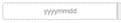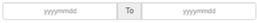</td>
<td>
Use either of the following date formats for search criteria (Contents Created Date, Academic Degree Date).

• Specify a date in the yyyy-mm-dd, yyyy-mm, or yyyy format. Using any other format will result in the message "Field does not validate," and the item search will not be completed.

• Pick a date from the calendar that appears when the area is focused.
</td>
</tr>
</tbody>
</table>

Figure 3-6. The "Search Results" screen

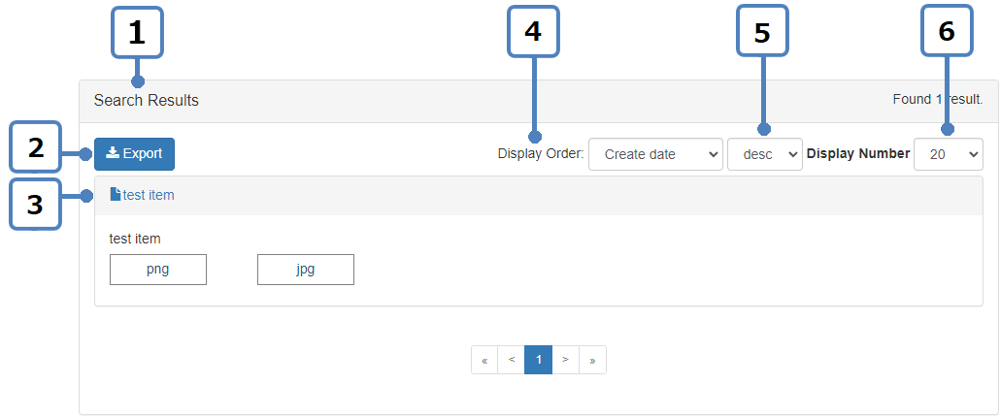

Table 3-5. The elements in the "Search Results" screen

| No. | Element                                               | Description                                                                                                                                                                                          |
| --- | ----------------------------------------------------- | ---------------------------------------------------------------------------------------------------------------------------------------------------------------------------------------------------- |
| 1   | "Search Results"                                      | The search results appear.                                                                                                                                                                           |
| 2   | The  button | Click to open the "Items to Export" screen. You can export information contained in the items. See "Chapter 7: Export items" for more information.                                                   |
| 3   | An item name                                          | Clicking on a name takes you to the item details screen. See "Figure 3-2. The item details screen".                                                                          |
| 4   | The "Display Order" pull-down list                    | Select the order in which the search results are displayed from the "Display Order" pull-down list. See "Figure 3-3. The "Display Order" pull-down list".        |
| 5   | The "asc/desc" pull-down list                         | Select "asc" (ascending) or "desc" (descending) for a sort order. See "Figure 3-4. The "asc/desc" pull-down list" for more information.                              |
| 6   | The "Display Number" pull-down list                   | Select the number of items to display from the "Display Number" pull-down list. See "Figure 3-5. The "Display Number" pull-down list" for more information. |

Note: Currently, searching with "published" specified for "Author Version Flag" does not work.

## About variant character search

The System supports the "variant character search" feature. Variant characters are the traditional alternative of kanji or a different form of character with the same pronunciation and meaning but written differently.

For example, if you enter "壱" for a search keyword as the title and run a search, the results will include those items containing "一" and other variants of "壱".

Notes:

This feature applies to the Japanese language only. Variant character searches in English are not supported.

The index definition of variant characters is based on the integrated index of kanji in NACSIS-CAT. You can obtain the index definition from the following Web site:

"Guidelines for providing the integrated index of kanji" (Japanese)  
http://web.archive.org/web/20220819013647/https://www.nii.ac.jp/CAT-ILL/about/system/kui.html (archived copy on the Internet Archive)

## Search by author name

This section explains how to search for items by specifying registered author names.

You can search authors using the following methods.

### Search by author name

By specifying "Author Name" in the advanced search and entering an author name, you can search for items matching the specified author name.

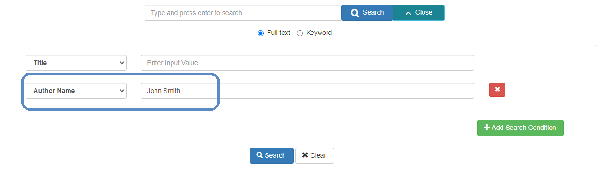

Alternatively, you can click on the author's name in the item details screen. A popup then appears with the author's information. You can search for items matching the author's name by clicking the "Search repository" link in the popup.

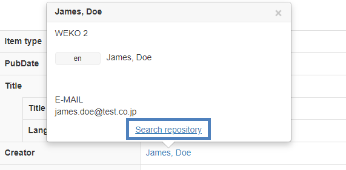

### Search by WEKO author ID

By specifying "Author Id" in the advanced search and entering the author's WEKO author ID (author\_link), you can search for items matching the specified WEKO author ID.

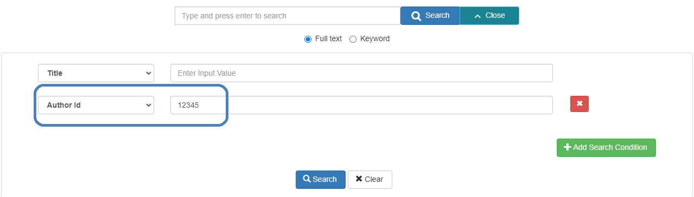

## Faceted search

Faceted searches allow you to filter items using the search criteria retrieved from "Item Lists".

Faceted searches can be performed when the System is configured to show the index tree/facet display. See the System Administration Manual in "Section 15.11.4. Set up the index tree/facet display" for more information.

This section explains how to filter items using faceted searches.

1.  Click on the "Top" tab on the Home screen.
    
    The faceted search area appears.
    
    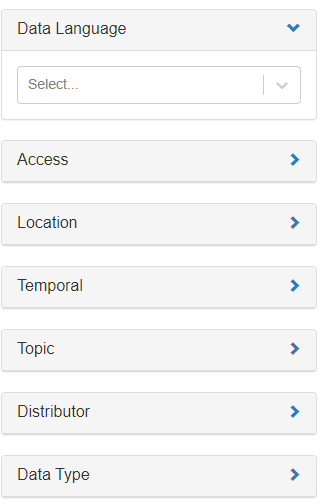

<!-- end list -->

22. Select search criteria in the faceted search area.
    
    The items will be filtered out. The search results appear in the "Item Lists" screen.

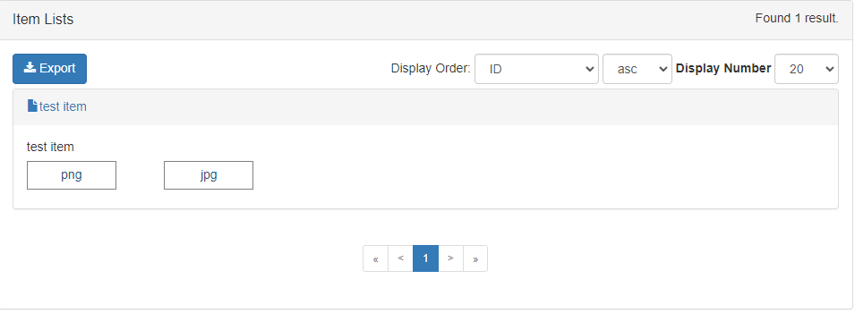

See "Section 3.1.3. View the Item Lists" for more information.

[v2.1.0] Note: If `WEKO_SEARCH_FIX_ACCESSRIGHTS = True` is set in the configuration file (instance.cfg), the facet for access rights (accessRights) counts and filters items registered with the access right "embargoed access" according to the current date and the access settings of their content files, as follows (with the default setting, items are counted according to the registered access right value).

  - If all content files are set to "Open access", or to "Input Open Access Date" with a publish date that has passed: "open access"

  - If there is a content file set to "Restricted Access", or there is a content file set to "Registered User Only" and no content file is set to "Input Open Access Date" with a future publish date: "restricted access"

  - Otherwise, if there is a content file set to "Input Open Access Date" with a future publish date or set to "Do not Publish", or if there is no content file: "embargoed access"

# View item details

This chapter describes elements that are included in items.

## The item details screen

This chapter describes elements that are included in the item details screen.

### Metadata

You can view the metadata of an item in the item details screen.

Figure 4-1. The item details screen

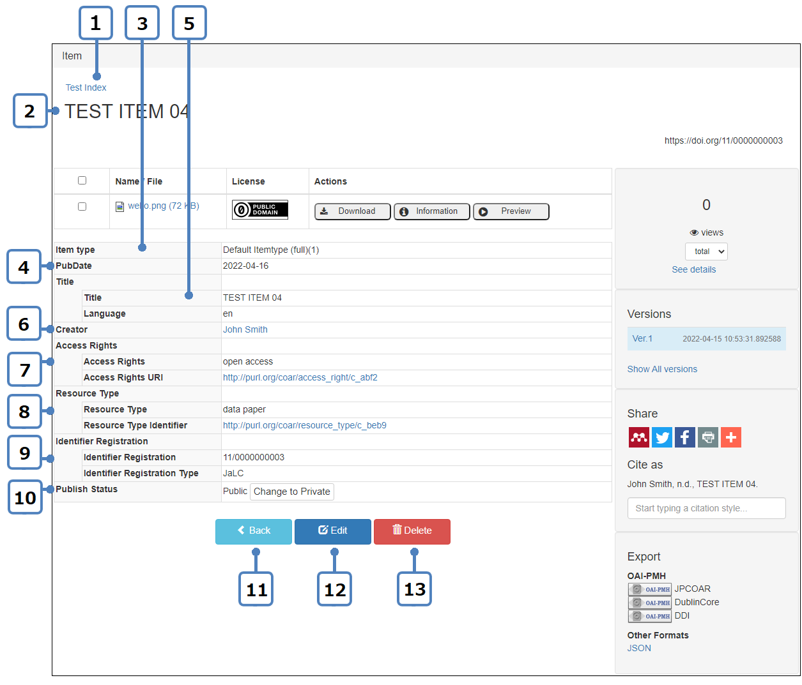

Table 4-1. The elements in the item details screen

<table>
<thead>
<tr class="header">
<th>No.</th>
<th>Element</th>
<th>Description</th>
</tr>
</thead>
<tbody>
<tr class="odd">
<td>1</td>
<td>Index name</td>
<td>Displays the index name of the item.</td>
</tr>
<tr class="even">
<td>2</td>
<td>An item name</td>
<td>Displays the item name.</td>
</tr>
<tr class="odd">
<td>3</td>
<td>Item type</td>
<td>Displays the item type.</td>
</tr>
<tr class="even">
<td>4</td>
<td>PubDate</td>
<td>Displays the publish date.</td>
</tr>
<tr class="odd">
<td>5</td>
<td>Title*</td>
<td>Display the title and its language.</td>
</tr>
<tr class="even">
<td>6</td>
<td>Creator*</td>
<td>Displays the creator's name.</td>
</tr>
<tr class="odd">
<td>7</td>
<td>Access Rights*</td>
<td>Display the access rights and the access rights URI.</td>
</tr>
<tr class="even">
<td>8</td>
<td>Resource Type*</td>
<td>Display the resource type and the resource type identifier.</td>
</tr>
<tr class="odd">
<td>9</td>
<td>Identifier Registration</td>
<td>Display the identifier registration and the identifier registration type.</td>
</tr>
<tr class="even">
<td>10</td>
<td>Publish Status</td>
<td>Displays the publish status.</td>
</tr>
<tr class="odd">
<td>11</td>
<td>The  button</td>
<td>Click to close the item details screen and return to the previous screen.</td>
</tr>
<tr class="even">
<td>12</td>
<td>The  button</td>
<td>Click to edit the information.</td>
</tr>
<tr class="odd">
<td>13</td>
<td>The 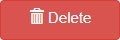 button</td>
<td>
Click to delete the item.

The "Confirm" screen appears.
</td>
</tr>
</tbody>
</table>

\* Notes:

The elements that appear on the screen depend on the item type.

> Notes:

You cannot change an item's status to private when it has a DOI assigned. If you click the "Change to Private" button in this case, the message "This item cannot be set to private because a DOI is granted" will appear.

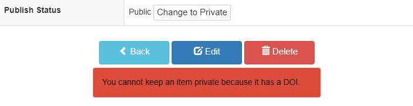

Figure 4-2. The "Confirm" screen

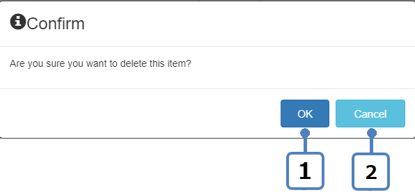

Table 4-2. The elements in the "Confirm" screen

| No. | Element                                                         | Description                                                          |
| --- | --------------------------------------------------------------- | -------------------------------------------------------------------- |
| 1   | The  button | Click to delete the item.                                            |
| 2   | The  button           | Click to cancel the delete operation and close the "Confirm" screen. |

> Notes:

You cannot delete an item when it has a DOI granted. You also cannot delete an item that has a DOI granted when any of the indexes to which the item directly belongs or their parent indexes is set to be hidden. If you click the "Delete" button in these cases, the message "This item cannot be deleted because a DOI is granted" will appear.

> 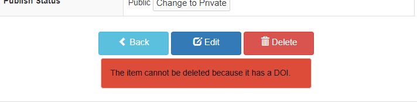
> 
> Additional Information:
> 
> ・The creator name appears with a link. Clicking on the name link will display a popup window with detailed information about this creator.
> 
> 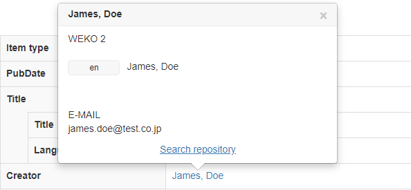
> 
> ・The bibliographic information appears in the following form, summarizing the registered information.
> 
> 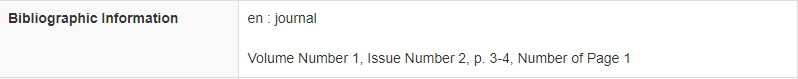

### Statistics

You can check the number of views for an item in the statistics screen.

[v2.1.0] The view count of an item and the download and playing counts of its content files (the "Stats" tab on the Information screen) are available only to users who can view the item details screen of the item.

Figure 4-3. The statistics screen

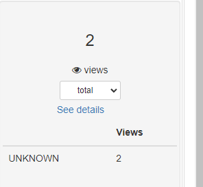

1.  Select a period from the period pull-down list.

The screen refreshes to display the view count for the period selected.

1.  Click "See details".

The view count that appears is broken down by country from which access was made.

Figure 4-4. The period pull-down list

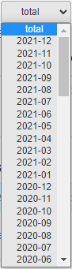

### Version

You can check the version of the item in the "Versions" screen.

Figure 4-5. The "Versions" screen

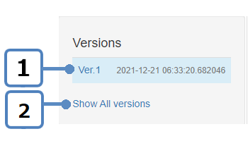

Table 4-3. The elements in the "Versions" screen

| No. | Element           | Description                                           |
| --- | ----------------- | ----------------------------------------------------- |
| 1   | Version           | The display format is "*yyyy-mm-dd hh:mm:ss.999999*". |
| 2   | Show All versions | Displays all versions.                                |

### Content files

You can view content files registered with an item in a list of file information according to the preview selected at item registration.

1.  > The "Preview" option: Simple

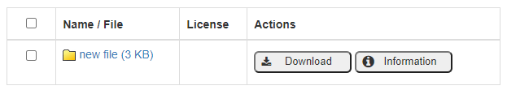

2.  > The "Preview" option: Detail

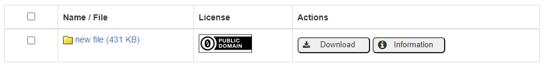

3.  > The "Preview" option: Preview

> 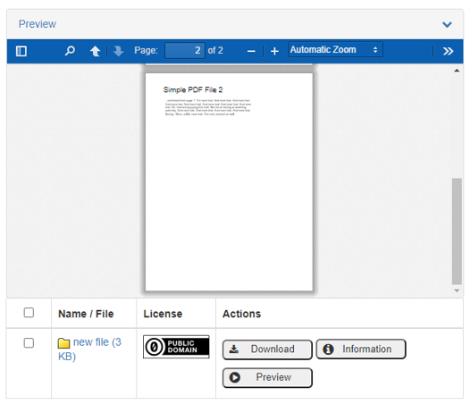
> 
> ・If you do not have access rights to the content file, the preview will appear as follows.
> 
> 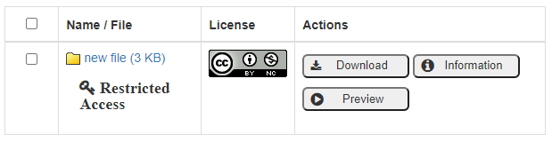
> 
> The preview is not displayed, and the file information area shows that you do not have access to the file.
> 
> [v2.1.0] Access rights to the content file are also checked when you access the preview URL directly. If you do not have access rights, the Login screen appears when you are not logged in, and access is denied when you are logged in. Likewise, images delivered via IIIF are available only when you have permission to view the item and access rights to the content file.
> 
> ・For site license users:
> 
> [v2.1.0] For items whose item type is not excluded from the site license, users accessing from an IP address authorized by the site license can also download content files set to "Registered User Only" and "Restricted Access". Content files set to "Restricted Access" can be downloaded directly without an application or a one-time URL. See "Configure IP addresses permitted by the site license" in the System Administration Manual for details on site license settings.
> 
> ・If the content file's publish date is in the future, the preview will appear as follows.
> 
> 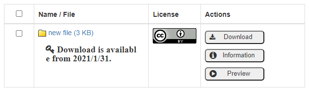
> 
> The preview is not displayed, and the file information area shows when the file becomes downloadable.
> 
> ・When an unexpected error occurs, e.g. you cannot view the content file:
> 
> 　The item details screen appears, with a specific message at the top. For support when the following screen appears, contact your administrator.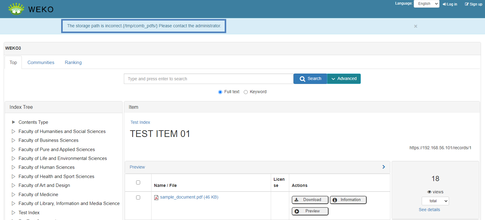
> 
> ・The following feature is provided to the institutions participating in the early use of the usage application feature. Institutions that have not applied for the early use of this feature cannot use it. If you are interested in using this feature, contact wekosoftware@nii.ac.jp.
> 
> ・Access control is set for content whose content file access is set to "Restricted Access". You can download the content after completing procedures such as agreeing to the terms and conditions.
> 
> Clicking the "Apply" button starts the application procedure. Depending on the content, you may not be able to apply unless you sign up for an account and log in. Ask the repository staff about the conditions for applying.
> 
> ・When the access to the content file is configured as "Restricted Access", and "Providing Method: Role" is set to "Non-Logged In User":
> 
> You can perform the operations shown below. See "Section 5.1.1. Register items" for details on setting up restricted access.
> 
> 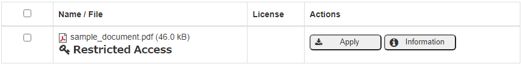

1.  When you click the "Apply" button on the item details screen, the terms and conditions appear on the modal screen (if any).

> You can click the "Print Terms and Conditions" button to open a print preview for printing the displayed terms and conditions.
> 
> The "Next" button becomes active when you select the check box below the terms and conditions. Press the button, and a modal screen appears where you can enter the email address.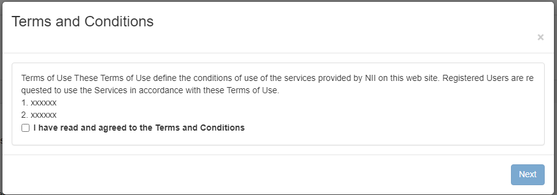

2.  A modal screen appears where you can enter your email address.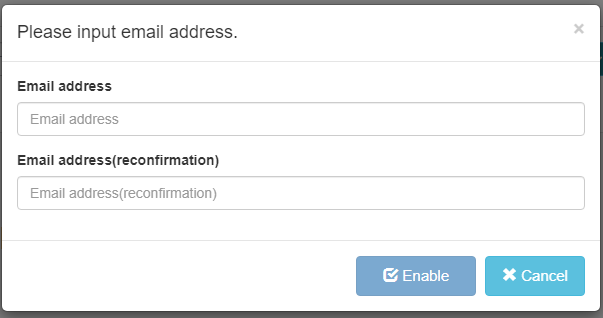

> An email message with a link to the edit screen of a specific workflow is sent to the email address specified in the modal screen. Clicking on the link will take you to an action screen defined in the workflow (e.g., the item registration screen), and you can carry on with the operation to complete the workflow.
> 
> At this time, you may also be asked to enter a password. In this case, enter a password that complies with the password policy. See the System Administration Manual for how to configure whether a password is required.
> 
> However, if there is an incomplete workflow, the link in the email message is the link to that workflow. Cancel or complete the incomplete workflow.
> 
> The link in the received email message cannot be reused after the workflow is canceled or completed.
> 
> If you have canceled the workflow by mistake by clicking the button for discarding the input and terminating the activity, click the "Apply" button on the details screen of the item to apply for, and receive an email message again.
> 
> When the workflow is "Done", the user who started the workflow will receive an email with a link to download the file.
> 
> A modal warning message will be displayed if a user who clicks "Apply" does not match the providing method setting.
> 
> When the user downloads a content file using an email link, an email message with a usage report workflow link will be sent according to the user's account.
> 
> ・For a guest user:
> 
> 　→ The user receives an email with a link to a usage report workflow available for a limited period.
> 
> ・For a registered user:
> 
> 　→ The user receives an email with a link to a usage report workflow available indefinitely.

・When the content file is a billing file:

The price of the content file is displayed for each configured role. You can also perform the following operations. See "Section 5.1.1. Register items" for information on setting up a billing file.

If the file has not been purchased and you have a role that can purchase it, the "charge" button is displayed. Click the "charge" button to purchase the content file.

・When the content file is large:

1.  When you try to download a large content file, a warning message appears.

2.  Check the warning and click "OK". A file picker for saving the file appears. Enter the name of the file to save, and click "Save".

3.  You cannot operate the screen during the download. Leave it as it is until the download completes. (You can operate other screens.)

#### The "Import to GakuNin RDM" button

This feature imports a GakuNin RDM project archive published in WEKO3 into GakuNin RDM as a new project. A GakuNin RDM project archive is created by exporting a project in GakuNin RDM.

The procedure is as follows.

1.  Export the project in GakuNin RDM.

2.  Upload the exported file (the GakuNin RDM project archive) in the item registration screen of WEKO3.

3.  The MIME type of the file is set to "application/zip". Change it to "application/rdm-project".

4.  Set the access of the file to either "Open Access" or "Input Open Access Date".

5.  The GakuNin RDM project archive is now ready to be published.

6.  The "Import to GakuNin RDM" button appears for the file in the item details screen. When the item is published and the file is publicly accessible (for "Input Open Access Date", after the open access date has passed), clicking the button takes you to GakuNin RDM to import the archive. Otherwise, the button is disabled, and hovering over it shows the reason ("Item is not published", "File is not publicly accessible", or "Item is not published and file is not publicly accessible").

### Share items

You can share items using various social media or print them. (This feature is not available because the services used have been discontinued. A successor feature is under development.)

Figure 4-6. The "Share" screen

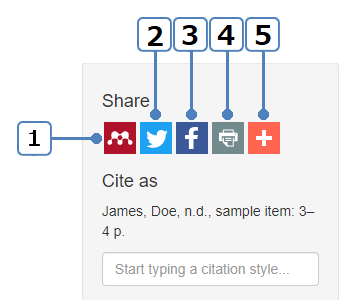

Table 4-4. The elements in the "Share" screen

| No. | Element                                                                 | Description                                                                                                                                    |
| --- | ----------------------------------------------------------------------- | ---------------------------------------------------------------------------------------------------------------------------------------------- |
| 1   | The  button         | Click to share the item using "Mendeley".                                                                                                      |
| 2   | The  button         | Click to share the item using "Twitter".                                                                                                       |
| 3   | The  button         | Click to share the item using "Facebook".                                                                                                      |
| 4   | The  button         | Click to open the "Print" screen.                                                                                                              |
| 5   | The  pull-down list | Select the media from the pull-down list to add to social sharing. See "Figure 4-8. The "AddThis" pull-down list. |

Figure 4-7. The "Print" screen

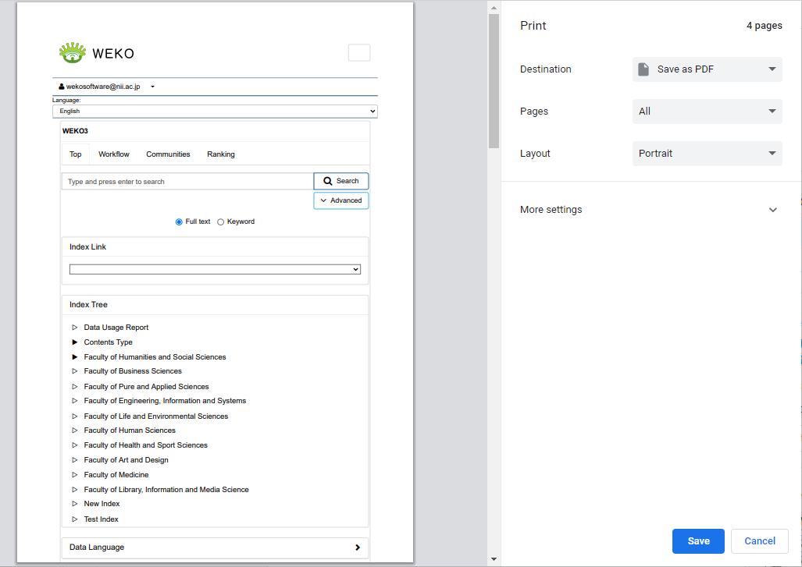

Figure 4-8. The "AddThis" pull-down list

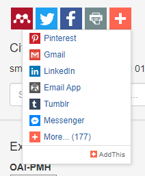

### Bibliographic Citation

You can view item metadata as bibliographic citation.

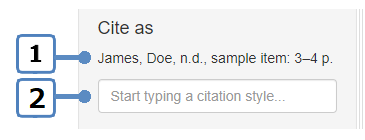

Table 4-5. The elements in the "Cite as" screen

<table>
<thead>
<tr class="header">
<th>No.</th>
<th>Element</th>
<th>Description</th>
</tr>
</thead>
<tbody>
<tr class="odd">
<td>1</td>
<td>A bibliographic citation</td>
<td>
Displays a bibliographic citation.

The content of the bibliographic citation depends on the style specified.

The information appears differently depending on the display language. If there is no data specified for the language being used at a given time, the data set for English will be displayed. If there is no data specified for English, the data that is first displayed will be used.
</td>
</tr>
<tr class="even">
<td>2</td>
<td>The box showing "Start typing a citation style"</td>
<td>
Click to display a list of styles used for bibliographic citation. As you type, the matching candidates are filtered and displayed.

See "Figure 4-9. The style pull-down list" for information on the styles.
</td>
</tr>
</tbody>
</table>

Figure 4-9. The style pull-down list

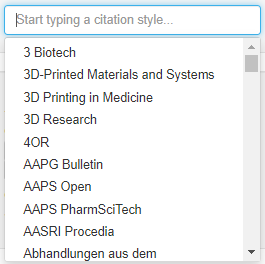

### Export

Item metadata can be output in the JPCOAR, DublinCore, or DDI format.

Note that only the latest version of the metadata will be output.

Figure 4-10. The "Export" screen

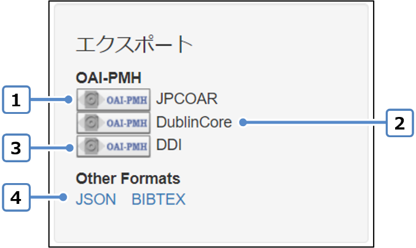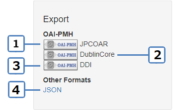

Table 4-6. The elements in the "Export" screen

| No. | Element                 | Description                                                                 |
| --- | ----------------------- | --------------------------------------------------------------------------- |
| 1   | The "JPCOAR 2.0" button | Click to generate OAI-PMH output in the JPCOAR 2.0 format.                  |
| 2   | The "JPCOAR 1.0" button | Click to generate OAI-PMH output in the JPCOAR 1.0.2 format.                |
| 3   | The "DublinCore" button | Click to generate OAI-PMH output in the DublinCore format.                  |
| 4   | The "DDI" button        | Click to generate OAI-PMH output in the DDI format.                         |
| 5   | The "JSON" link         | Click to generate output in the JSON format as an "Other Formats" option.   |
|     | The "BIBTEX" link       | Click to generate output in the BIBTEX format as an "Other Formats" option. |
|     | The "ZIP" link          | Click to download the item metadata as an "Other Formats" option.           |

### Communities

The "Communities" area displays the communities to which the item belongs.

Table 4-7. The elements in the "Communities" area

| No. | Element         | Description                                                    |
| --- | --------------- | -------------------------------------------------------------- |
| 1   | Community logo  | The logo image of the community appears if one is set. Click it to display the top page of the community. |
| 2   | Community title | Click to display the top page of the community.                |

### The Information screen

You can view the detailed information of the content file by clicking the "Information" button in the file information area.

Figure 4-11. The Information screen

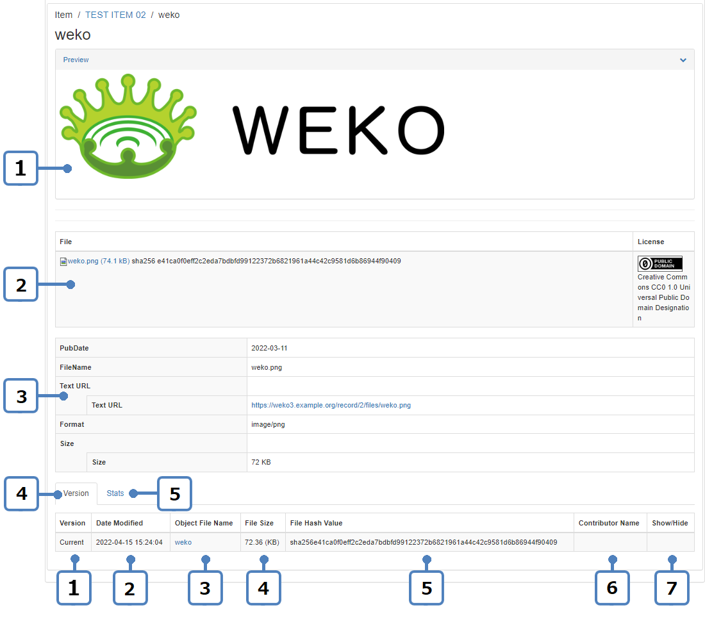

Figure 4-12. The "Stats" tab

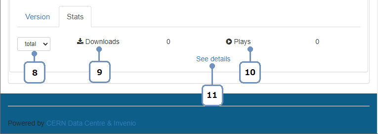

The following table explains each element in the Information screen.

Table 4-8. The elements in the Information screen

<table>
<thead>
<tr class="header">
<th>No.</th>
<th>Element</th>
<th>Description</th>
</tr>
</thead>
<tbody>
<tr class="odd">
<td>1</td>
<td>The preview area</td>
<td>
Displays a preview of the corresponding content file.

* It is enabled when you specified the display format to "Preview" when registering the content file.
</td>
</tr>
<tr class="even">
<td>2</td>
<td>The file area</td>
<td>Displays a link to the filename and license information.</td>
</tr>
<tr class="odd">
<td>3</td>
<td>The file information area</td>
<td>
Displays detailed information about the content file. The information is based on the file information properties you specified when registering the item.

See "Section 5.1.1. Register items" under "(4) Register a file" for more information.
</td>
</tr>
<tr class="even">
<td>4</td>
<td>The "Version" tab</td>
<td>Displays detailed information about the file, including the version and hash value.</td>
</tr>
<tr class="odd">
<td>5</td>
<td>The "Stats" tab</td>
<td>Displays statistics of the content file, including the download count and playing count.</td>
</tr>
</tbody>
</table>

The following table explains the elements displayed in the "Version" and "Stats" tabs.

Table 4-9. The "Version" and "Stats" tabs on the Information screen

| No. | Tab   | Element                     | Description                                                                                                                                                      |
| --- | ----- | --------------------------- | ---------------------------------------------------------------------------------------------------------------------------------------------------------------- |
| 1   | View  | Version                     | Displays the version information of the content file.                                                                                                            |
| 2   |       | Date Modified               | Displays the date and time when the content file was created.                                                                                                    |
| 3   |       | Object File Name            | Displays the content filename.                                                                                                                                   |
| 4   |       | File Size                   | Displays the file size of the content file.                                                                                                                      |
| 5   |       | File Hash Value             | Displays the hash value of the content file.                                                                                                                     |
| 6   |       | Contributor Name            | Displays the name of the user who registered the content file.                                                                                                   |
| 7   |       | Show/Hide                   | Indicates the show/hide setting of the contents file.                                                                                                            |
| 8   | Stats | The "total" pull-down       | Displays statistics of the content file. While the default is set to "total", you can also view the monthly statistics by selecting from the pull-down.          |
| 9   |       | Downloads                   | Displays the download count of the content file\*. The information will not reset even when the file is replaced, and the count will carry over to the new file. |
| 10  |       | Plays                       | Displays the preview count of the content file.                                                                                                                  |
| 11  |       | The "See details" pull-down | Displays the download count and the preview count of the content file for each country.                                                                          |

[v2.1.0] Note: The "Stats" tab is available only to users who can view the item details screen of the item.

Note: When the Secret URL feature is enabled on the Administration screen, a "Secret URL" button is also displayed in the file area. See "Share non-public content using a one-time address" for more information on this feature.

For a billing file, the price of the content file for each role is displayed in the file information area.

### The request mail form

This is an experimental feature. It is not provided in the JAIRO Cloud environment.

Clicking the "Request Mail" button on the item details screen displays the "Request Mail Form".

The request mail is sent to the email addresses set as the request mail destinations when the item was created or edited.

You can enter the following items in the form.

  - From  
    Enter the sender's email address. If the email address is not in a valid format, an error message appears when you click the "Send" button. This item is required.

  - Subject  
    Enter the subject of the email. This item is required.

  - Body  
    Enter the body of the email. This item is required.

After entering the above items, enter the result of the calculation shown in the CAPTCHA image in the input field at the bottom right of the form. You can then send the email.

The CAPTCHA image has an expiration time. If it has expired, the email cannot be sent and the image is refreshed. The default expiration time is 600 seconds.

### Apply to use external data

This is an experimental feature. It is not provided in the JAIRO Cloud environment.

You can apply to use data located outside WEKO by clicking the "Apply" button on the right side of the item details screen.

This feature is available only when all of the following conditions are met:

  - No content file is registered with the item.

  - The usage application method is configured for the item.

1.  Click the "Apply" button. If terms and conditions are configured, they appear on a modal screen.
    
    The "Next" button becomes active when you select the "I have read and agreed to the Terms and Conditions" check box below the terms and conditions. Click the button, and a modal screen appears where you can enter your email address.
    
    You can also click the "Print Terms and Conditions" button to open a print preview of the displayed terms and conditions.

2.  An email message with a link to the edit screen of a specific workflow is sent to the email address specified in the modal screen. Clicking on the link in the email takes you to an action screen defined in the workflow (e.g., the item registration screen), and you can carry on with the operation to complete the workflow.

When the workflow is "Done", the user who started the workflow receives an email with a link to download the file.

A modal warning message configured by the administrator is displayed if a user who clicks "Apply" does not match the providing method setting.

When the user downloads a content file using the link sent by email, an email message with a usage report workflow link is sent according to the user's account.

  - For a guest user: The user receives an email with a link to a usage report workflow available for a limited period.

  - For a registered user: The user receives an email with a link to a usage report workflow available indefinitely.

### Google Scholar metadata output

Google Scholar metadata is output in the header of the Web page based on the metadata of the item.

The metadata is registered with Google Scholar based on the output metadata.

The JPCOAR mapping (jpcoar_v2_mapping) corresponds to the Google Scholar metadata as follows.

Table 4-10. Google Scholar metadata

| No. | JPCOAR mapping     | Google Scholar metadata |
| --- | ------------------ | ----------------------- |
| 1   | dc:title           | citation_title          |
| 2   | jpcoar:creatorName | citation_author         |
| 3   | dc:publisher       | citation_publisher      |
| 4   | jpcoar:subject     | citation_keywords       |
| 5   | jpcoar:sourceTitle | citation_journal_title  |
| 6   | jpcoar:volume      | citation_volume         |
| 7   | jpcoar:issue       | citation_issue          |
| 8   | jpcoar:pageStart   | citation_firstpage      |
| 9   | jpcoar:pageEnd     | citation_lastpage       |

### Google Dataset metadata output

Google Dataset metadata is output when the following conditions are met:

  - The "Resource Type" in the item metadata is "dataset".

  - The "Description" in the item metadata is 50 characters or more.

Google Dataset metadata is output as follows.

Table 4-11. Google Dataset metadata

<table>
<thead>
<tr class="header">
<th>schema.org</th>
<th></th>
<th>Source JPCOAR schema element</th>
<th>Example value</th>
</tr>
</thead>
<tbody>
<tr class="odd">
<td>description</td>
<td>Required</td>
<td>datacite:description</td>
<td></td>
</tr>
<tr class="even">
<td>name</td>
<td>Required</td>
<td>dc:title</td>
<td></td>
</tr>
<tr class="odd">
<td>creator</td>
<td></td>
<td>jpcoar:creator</td>
<td>"creator": [ 
    { 
        "@type": "Person", 
        "sameAs": "http://orcid.org/0000-0000-0000-0000", 
        "givenName": "Jane", 
        "familyName": "Foo", 
        "name": "Jane Foo" 
    },</td>
</tr>
<tr class="even">
<td>citation</td>
<td></td>
<td>jpcoar:identifier</td>
<td>"citation": "https://doi.org/10.1111/111"</td>
</tr>
<tr class="odd">
<td>keywords</td>
<td></td>
<td>jpcoar:subject</td>
<td></td>
</tr>
<tr class="even">
<td>license</td>
<td></td>
<td>dc:rights (assumed)</td>
<td>"license" : { 
  "@type": "CreativeWork", 
  "name": "Custom license", 
  "url": "https://example.com/custom_license" 
  }</td>
</tr>
<tr class="odd">
<td>spatialCoverage</td>
<td></td>
<td>datacite:geoLocation</td>
<td>"spatialCoverage:" { 
"@type": "Place", 
"geo": { 
"@type": "GeoCoordinates", 
"latitude": 39.3280, 
"longitude": 120.1633 
} 
}</td>
</tr>
<tr class="even">
<td>temporalCoverage</td>
<td></td>
<td>dcterms:temporal</td>
<td>"temporalCoverage" : "2008"</td>
</tr>
<tr class="odd">
<td>includedInDataCatalog</td>
<td></td>
<td></td>
<td>includedInDataCatalog":{ 
"@type":"DataCatalog", 
"name":&lt;URL of the repository&gt; 
}</td>
</tr>
<tr class="even">
<td>distribution</td>
<td></td>
<td>jpcoar:file</td>
<td>"distribution":[ 
{ 
"@type":"DataDownload", 
"encodingFormat":&lt;format of the file content&gt;, 
"contentUrl":&lt;URL of the file&gt; 
}, 
… 
]</td>
</tr>
</tbody>
</table>

### The file details screen

The Information screen described in "The Information screen" is also called the file details screen. It consists of the file name information area (the link to the filename and the checksum), the metadata display area (the metadata of the file), and the Version and Stats information area (the version information and status information such as the view count, switched by the tabs at the top).

From the file details screen, users who have permission to edit the item can replace the file and copy the file to an open bucket as described below.

Note: The "Replace the file content" and "Copy file to open bucket" buttons are displayed only when user storage modification is enabled in the System settings (disabled by default). Contact the system administrator for more information.

#### Replace a file

You can replace a file without going through the workflow screen.

1.  Open the file details screen with an account that has permission to edit the item.

    The "Replace the file content" button is displayed in the file name information area.

2.  Click the "Replace the file content" button.

    The file selection window of your computer opens.

3.  Select the replacement file and click "Open".

    Note: You can only select a file with the same name as the original file. If you select a file with a different name, the message "Please select the same named file as the original file." appears.

4.  When the replacement is complete, the message "File replacement successful." appears and the item details screen is displayed.

    The file is replaced with the selected file, and the version of the item is updated. To restore the state before the replacement, delete the corresponding version of the item. See "Version" for information on item versions.

#### Copy a file to an open bucket

You can copy the file to an open bucket on Amazon S3 or other storage.

1.  To retrieve or create the destination bucket, set up your S3 account information in your profile.

    Click the icon next to the account name in the upper right corner of the screen and select "Profile". In the "Profile" screen, enter the following items based on the S3 account to use, and save the profile.

| No. | Element                          | Description                                                                                                  |
| --- | -------------------------------- | ------------------------------------------------------------------------------------------------------------ |
| 1   | The "access key" text box        | Enter the access key of the S3 account used for copying files to an open bucket from the file details screen. |
| 2   | The "secret key" text box        | Enter the secret key of the S3 account used for copying files to an open bucket from the file details screen. |
| 3   | The "endpoint url" text box      | Enter the endpoint URL of the S3 account. Example: "https://s3.*region-name*.amazonaws.com/"                  |
| 4   | The "region name" text box       | Enter the region name when you specify the region of the S3 bucket to use.                                   |

2.  Open the file details screen with an account that has permission to edit the item.

    The "Copy file to open bucket" button is displayed in the file name information area.

3.  Click the "Copy file to open bucket" button.

    A dialog box for selecting the destination bucket appears.

4.  Select the destination bucket.

    - To use an existing bucket, select the "Bucket" radio button and select a bucket from the list of existing buckets retrieved with the account information you set up in Step 1. The bucket must be an open bucket (a bucket that anyone can write to), because the copy is written to the destination bucket from the S3 account where the original file is stored (for example, when the original file is stored on S3). Configure the bucket as public in advance.

    - To create a new bucket with the account information you set up in Step 1, select the "New Creating Bucket Name" radio button and enter the name of the bucket to create.

5.  Click the "Execution" button.

    The file is copied. When the copy is completed successfully, the URL of the copied file is displayed at the bottom of the dialog box.

    Note: Take note of the URL. The copied file is not managed by the System, and you cannot check the URL again after closing the dialog box. If you have created a new bucket, check that the bucket is set to public.

# Register items

This chapter provides information on registering items.

## Register items

When you register items in the System, you need to register workflow activities. This section explains how to register activities in the System.

After logging in to the System as a registered user, you can register activities from the "Workflow" screen. The following explains how to access the "Workflow" screen.

1.  From the Home screen, click the "Workflow" tab.

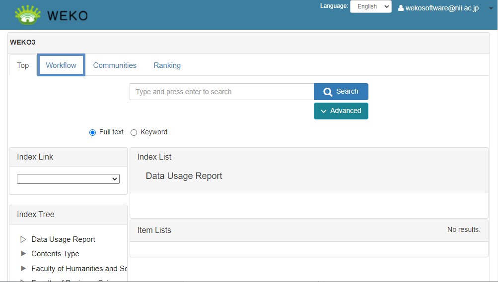

The activities list screen appears.

2.  Click the  button below the activities list.

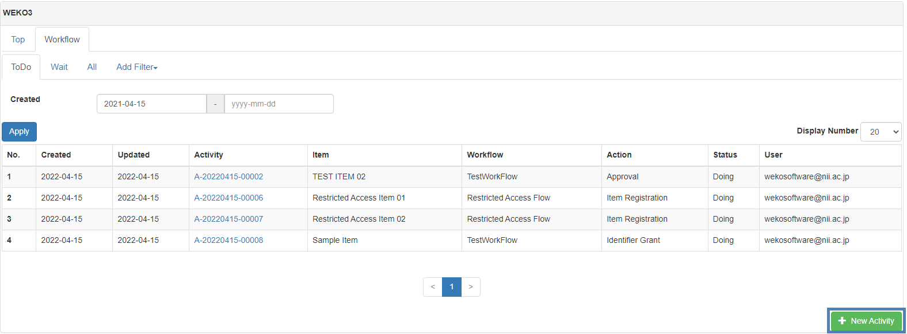

The workflow selection screen appears.

See "Section 5.2. View activities" for more information on this screen.

3.  In the workflow selection screen, click on the  button corresponding to the workflow of the item you want to register.

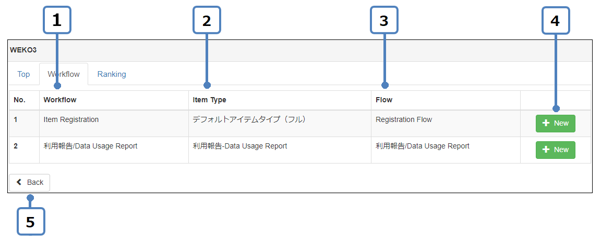

Table 5-1. The elements in the workflow selection screen

| No. | Element                                                | Description                                                                                                                                                                               |
| --- | ------------------------------------------------------ | ----------------------------------------------------------------------------------------------------------------------------------------------------------------------------------------- |
| 1   | Workflow                                               | A series of data registration processes that combine an item type and flows. It is created by the administrator.                                                                          |
| 2   | Item Type                                              | The data type to be registered.                                                                                                                                                           |
| 3   | Flow                                                   | A combination of processes (actions) to be performed when registering data. For information on each action, see "Table 5-2. The actions in the "Step" screen". |
| 4   | The  button | Click to access to the "Action" screen.                                                                                                                                                   |
| 5   | The  button  | Click to access to the activities list screen.                                                                                                                                            |

The "Step" screen for the flow set at the start of the selected workflow appears.

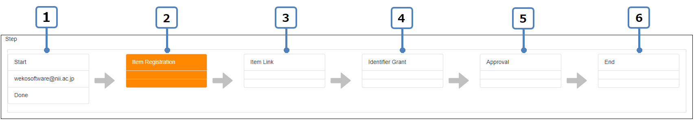

Table 5-2. The actions in the "Step" screen

| No. | Action Name       | Description                                                   |
| --- | ----------------- | ------------------------------------------------------------- |
| 1   | Start             | The action to start item registration.                        |
| 2   | Item Registration | The action to register the item's metadata and content files. |
| 3   | Item Link         | The action to set a link to the item.                         |
| 4   | Identifier Grant  | The action to grant the item a DOI.                           |
| 5   | Approval          | The action to review/approve the item.                        |
| 6   | End               | The action to end item registration.                          |

4.  Perform the actions corresponding to the "Step" screen for the flow displayed.

See "Section 5.1.1. Register items" through "Section 5.1.4. Gant DOIs" for more information.

### Register items

This section explains how to specify files and metadata for an activity.

#### Register an item thumbnail

This section explains how to register an item thumbnail.

1.  In the Item Registration screen, drag and drop the file you want to register in the "Drop files or folders here" section, or click the 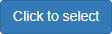 button.

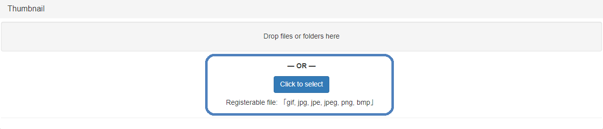

The file selection dialog appears.

5.  In the file selection dialog, select a file to upload and click the "Open" button.

The file information appears.

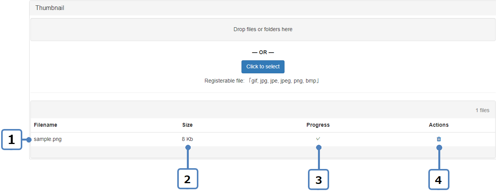

Table 5-3. The elements in the thumbnail registration screen

| No. | Element                                              | Description                                                                                          |
| --- | ---------------------------------------------------- | ---------------------------------------------------------------------------------------------------- |
| 1   | Filename                                             | Displays the name of the file to be registered.                                                      |
| 2   | Size                                                 | Displays the size of the file to be registered.                                                      |
| 3   | Progress                                             | Displays  when the file registration completes. |
| 4   | Action (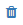) | Click to delete the registered file.                                                                 |

#### Automatically populate metadata

This section explains how to automatically populate metadata from an external database.

1.  In the Item Registration screen, click the 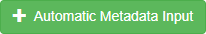 button.
    
    The "Automatic metadata input" screen appears.
    
    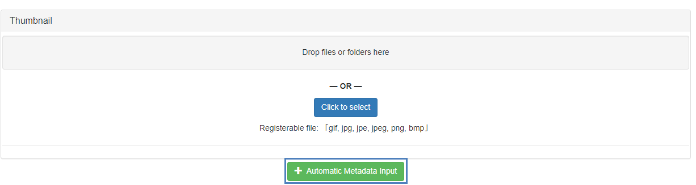

<!-- end list -->

6.  In the "Automatic metadata input" window, select "Select the ID", enter the ID, and then click the  button.
    
    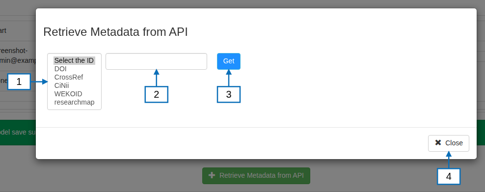

Table 5-4. The elements in the "Automatic metadata input" screen

<table>
<thead>
<tr class="header">
<th>No.</th>
<th>Element</th>
<th>Description</th>
</tr>
</thead>
<tbody>
<tr class="odd">
<td>1</td>
<td>Select the ID</td>
<td>
Select an external database.

You can use <a href="http://www.crossref.org/">CrossRef</a>, CiNii (CiNii Research), WEKOID (the ID of an item in WEKO) and researchmap as external databases. To use CrossRef, the CrossRef API credentials must be configured on the Administration screen.

If the APIs to be used (JaLC API, 医中誌 Web API (Ichushi Web), CrossRef, DataCite, CiNii Research) are set in WEKO_ITEMS_AUTOFILL_TO_BE_USED in instance.cfg, you can also select "DOI". When "DOI" is selected, metadata is retrieved from each configured API and merged, giving priority to the APIs listed earlier in the setting.

* With WEKOID, you can utilize metadata by specifying the id. You cannot import elements that are not mapped with the JPCOAR schema. You also cannot import Hide elements. Your WEKOID needs to have permission to edit.
</td>
</tr>
<tr class="even">
<td>2</td>
<td>ID</td>
<td>Enter the relevant ID.</td>
</tr>
<tr class="odd">
<td>3</td>
<td>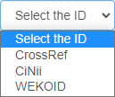</td>
<td>
Click to retrieve the information according to the specified type and the ID. The retrieved results will be automatically entered into the metadata element with JPCOAR mapping in the Item Registration screen.

<ul>
<li><blockquote>

For the CrossRef API, the JPCOAR schema is mapped as follows:

</blockquote></li>
</ul>
<ul>
<li><blockquote>

dc:title

</blockquote></li>
<li><blockquote>

dc:language

</blockquote></li>
<li><blockquote>

jpcoar:creatorName

</blockquote></li>
<li><blockquote>

jpcoar:numPages, jpcoar:pageStart, jpcoar:pageEnd

</blockquote></li>
<li><blockquote>

datacite:date

</blockquote></li>
<li><blockquote>

dc:publisher

</blockquote></li>
<li><blockquote>

jpcoar:relatedIdentifier

</blockquote></li>
</ul></td>
</tr>
<tr class="even">
<td>4</td>
<td>The 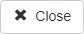 button</td>
<td>Click to close the "Automatic metadata input" screen without saving the information in the metadata entry fields of the Item Registration screen.</td>
</tr>
</tbody>
</table>

| **Data**                      | **Path**                                        | **Corresponding JPCOAR mapping**    |
| ----------------------------- | ----------------------------------------------- | ----------------------------------- |
| Title                         | dc:title                                        | dc:title                            |
| Alternative title             | dcterms:alternative                             | dc:title                            |
| Product identifier            | productIdentifier.identifier(type=xx)           | jpcoar:relation                     |
| Creator name                  | creator.foaf:name                               | jpcoar:creatorName                  |
| Creator identifier            | creator.personIdentifier                        |                                     |
| Creator affiliation name      | creator.jpcoar:affiliationName                  |                                     |
| Contributor name              | contributor.foaf:name                           | jpcoar:contributorName              |
| Contributor affiliation name  | contributor.jpcoar:affiliationName              |                                     |
| Contributor identifier        | contributor.personIdentifier                    |                                     |
| Publication identifier        | publication.publicationidentifier               |                                     |
| Publication name              | publication.prism:publicationName               | jpcoar:sourceTitle                  |
| Publication date              | publication.prism:publicationDate               |                                     |
| Volume                        | publication.prism:volume                        | jpcoar:volume                       |
| Issue                         | publication.prism:number                        | jpcoar:issue                        |
| Starting page                 | publication.prism:startingPage                  | jpcoar:pageStart                    |
| Ending page                   | publication.prism:endingPage                    | jpcoar:pageEnd                      |
| Number of pages               | publication.jpcoar:numPages                     | jpcoar:numPages                     |
| Publisher                     | publication.dc:publisher                        | dc:publisher                        |
| Date                          | publication.prism:publicationDate               | datacite:date                       |
| NCID of the journal           | publication.publicationIdentifier(@type=NCID)   | jpcoar:sourceIdentifier             |
| ISSN of the journal           | publication.publicationIdentifier(@type=ISSN)   | jpcoar:sourceIdentifier             |
| Dissertation number           | ndl:dissertationNumber                          |                                     |
| Degree name                   | ndl:degreeName                                  |                                     |
| Date granted                  | ndl:dateGranted                                 |                                     |
| Degree grantor identifier     | degreeAwardInstitution.institutionIdentifier    |                                     |
| Degree grantor name           | degreeAwardInstitution.jpcoar:degreeGrantorName |                                     |
| Conference name               | jpcoar:conferenceName                           |                                     |
| Conference place              | jpcoar:conferencePlace                          |                                     |
| Conference date (start day)   | jpcoar:conferenceDate.jpcoar:startDay           |                                     |
| Conference date (start month) | jpcoar:conferenceDate.jpcoar:startMonth         |                                     |
| Conference date (start year)  | jpcoar:conferenceDate.jpcoar:startYear          |                                     |
| Conference date (end day)     | jpcoar:conferenceDate.jpcoar:endDay             |                                     |
| Conference date (end month)   | jpcoar:conferenceDate.jpcoar:endDay             |                                     |
| Conference date (end year)    | jpcoar:conferenceDate.jpcoar:endDay             |                                     |
| Funder name                   | fundingProgram.notation                         |                                     |
| Related product relation type | relatedProduct.relationType                     |                                     |
| Related product identifier    | relatedProduct.productIdentifier                |                                     |
| Related product title         | relatedProduct.jpcoar:relatedTitle              |                                     |
| Abstract type                 | description.type                                | The type is fixed to "Abstraction". |
| Abstract text                 | description.notation                            | dc:description                      |
| Subject URL                   | foaf:topic.@id                                  | jpcoar:subject                      |
| Subject title                 | foaf:topic.dc:title                             | jpcoar:subject                      |
| Version                       | datacite:version                                |                                     |
| Language                      | dc:language                                     |                                     |

Additional Information:

・When multiple properties share the same mapping information, only the first property (the top one) will be used. For example, if an item type contains properties "ISBN" and "ISSN" in this order, and both are mapped to "jpcoar:sourceIdentifier", data imported via the "Automatic metadata input" screen will be mapped to "ISBN".

#### Automatically populate metadata from researchmap

This section explains how to automatically populate metadata from researchmap.

1.  In the "Automatic metadata input" screen, select "researchmap" in "Select the ID".

    The "parmalink", "achievement type" and "achievement id" entry fields appear.

2.  Enter "parmalink", "achievement type" and "achievement id".

    - "parmalink": The link identifier that the researcher entered when registering with researchmap. It is the string at the end of the URL of the researcher's details page used to access "My Portal" (the researcher's public web page on researchmap). It consists of 3 to 20 alphanumeric characters and symbols. An error occurs if it contains any of the following characters:

      % # < > + ¥ " ' & ? = ~ : ; , @ $ ^ | ] [ ! ( ) * /

    - "achievement type": The following six types are supported: "published papers", "MISC", "book etc", "presentations", "Works" and "others". The default is "published papers".

    - "achievement id": The ID that identifies the achievement registered in researchmap. An error occurs if it contains characters other than numerals.

    These three values correspond to the URL of the achievement on researchmap as follows:

    https://researchmap.jp/{parmalink}/{achievement type}/{achievement id}

3.  Click the "Get" button.

    If the information you entered is correct, the metadata is populated automatically. The metadata populated for each achievement type is shown in the table below.

Table 5-5. Metadata populated from researchmap

| Achievement type | Metadata |
| --- | --- |
| published papers | Title, Creator, Description, Publisher, Date, Source Title, Volume Number, Issue Number, Page Start, Page End, Language, Related Identifier, Resource Type |
| MISC | Title, Creator, Description, Publisher, Date, Source Title, Volume Number, Issue Number, Page Start, Page End, Language, Related Identifier, Resource Type |
| book etc | Title, Creator, Description, Publisher, Date, Number of Pages, Language, Related Identifier, Resource Type |
| presentations | Title, Creator, Description, Date, Conference, Resource Type |
| Works | Title, Creator, Description, Related Identifier, Resource Type |
| others | Title, Description, Resource Type |

#### Set up a proxy contributor

This section explains how to set up a proxy contributor.

1.  In the Item Registration screen, select the "Other user" radio button to specify a proxy contributor.

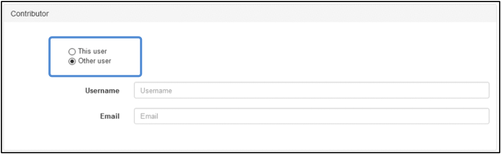

The entry fields for the user information appear.

7.  Enter the username and email address in the user information entry fields.

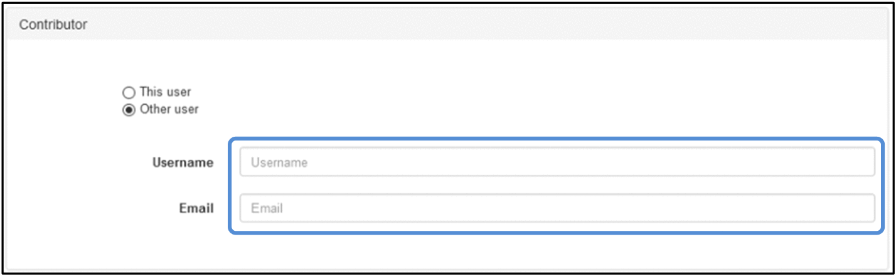

As you enter text in the "Username" or "Email", the matching users registered in the repository are filtered and displayed in the list of candidates. When you select a user from the list of users, the username and email address of the selected user will be populated.

The user specified as the proxy contributor is granted permission to edit the item, in the same way as the user who registered the item. You can specify only one user as the proxy contributor.

If the user you specify does not exist in the repository, the error message "Shared user information is not valid/Please check it again\!" will appear.

If you specify the user who registered the item, the error message "You cannot specify yourself in 'Other users' setting" will appear.

#### Register multiple proxy contributors

Note: This is an experimental feature. It is not provided in the JAIRO Cloud environment.

The users specified as proxy contributors are granted the permission to register (edit) the item, in the same way as the user who registered the item.

When the extended proxy posting feature is enabled (`WEKO_ITEMS_UI_PROXY_POSTING = True` in the configuration file (instance.cfg)), you can specify multiple proxy contributors.

- Click the "New" button to add a new row of the user information entry fields.
- Click the trash icon in a row to delete the row.

#### Register a file

This section explains how to register a file.

1.  In the Item Registration screen, drag and drop the file you want to register in the "Drop files or folders here" section, or click the  button.

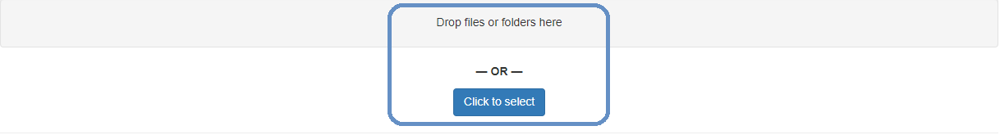

The file selection dialog appears.

8.  In the file selection dialog, select a file to upload and click the "Open" button.

The file information appears.

If another file with the same name is already being used, the error message "The same file name cannot be registered" will appear.

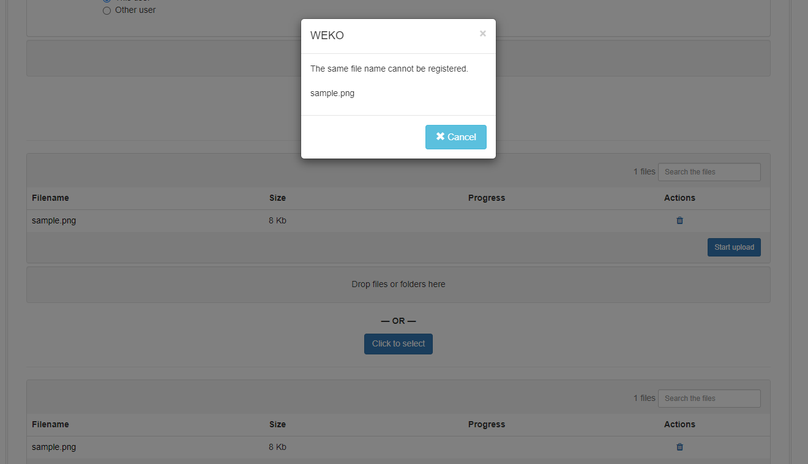

9.  Click on the  button in the displayed file information.

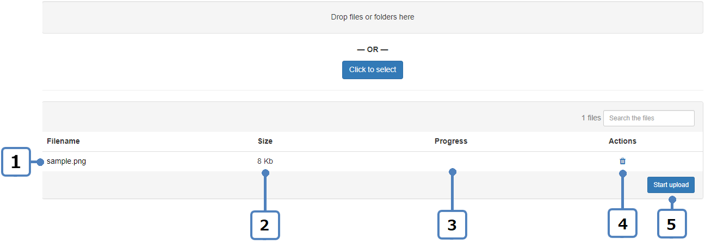

　　The file is uploaded.

If the file exceeds the maximum size allowed for the repository, the error message "Error:Location has no quota" will be displayed and the file cannot be registered.

The maximum size of a file that can be uploaded is 20 GB. Files larger than this cannot be uploaded.

When the upload completes successfully, the filename, text URL, format, and size information will be automatically populated.

Additional Information:

> If you enter multiple values, their display order in the item details screen will be the same as that of the file information entry area in the Item Registration screen.
> 
> You can also change the file display order in the item details screen by dragging and dropping the files to rearrange them in the input area.

Table 5-6. The elements in the Item Registration screen

| No. | Element                                                          | Description                                                                                                                                                                                                                    |
| --- | ---------------------------------------------------------------- | ------------------------------------------------------------------------------------------------------------------------------------------------------------------------------------------------------------------------------ |
| 1   | "Filename"                                                       | Displays the name of the file to be registered.                                                                                                                                                                                |
| 2   | "Size"                                                           | Displays the size of the file to be registered.                                                                                                                                                                                |
| 3   | "Progress"                                                       | When you click the  button, the upload starts, and its progress appears in "%". Displays  when the upload completes. |
| 4   | The  button           | Click to delete the registered file.                                                                                                                                                                                           |
| 5   | The  button | Click to start uploading the file.                                                                                                                                                                                             |

10. Enter the file information.

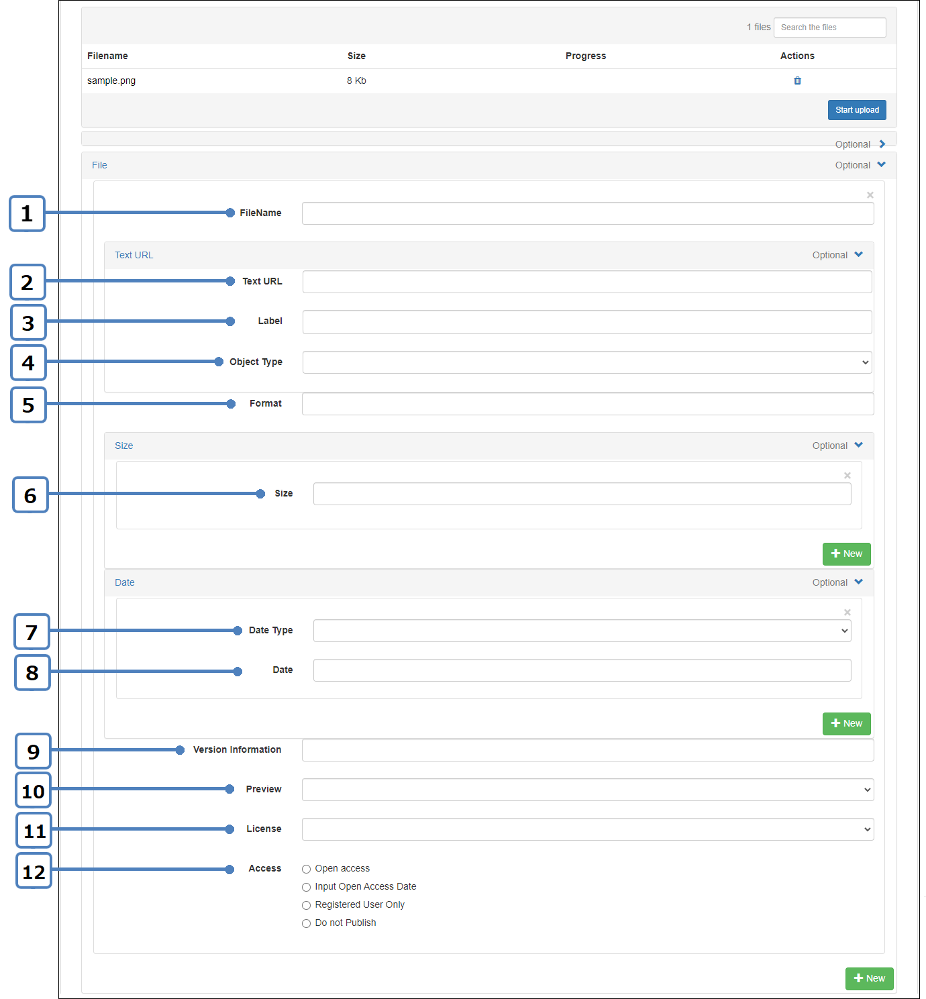

The following feature is provided to the institutions participating in the early use of the usage application feature. Institutions that have not applied for the early use of this feature cannot use it. If you are interested in using this feature, contact wekosoftware@nii.ac.jp.

The information in the file for restricted access is as follows

The entry elements are the same as the file information up to the license field.

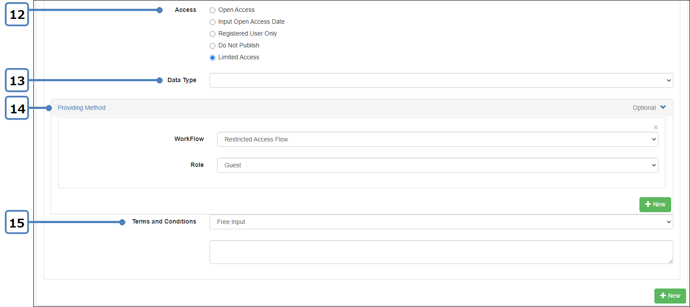

Table 5-7. The elements in the file information screen

<table>
<thead>
<tr class="header">
<th>No.</th>
<th>Element</th>
<th>Description</th>
</tr>
</thead>
<tbody>
<tr class="odd">
<td>1</td>
<td>Filename</td>
<td>Displays the name of the uploaded file. You can also enter the information manually without uploading a file.</td>
</tr>
<tr class="even">
<td>2</td>
<td>Text URL</td>
<td>
Displays the URL of the uploaded file.

If you specify a file uploaded to WEKO3, the URL of the file will be automatically set up and cannot be changed.

If you entered the filename manually, you also need to enter the URL manually.
</td>
</tr>
<tr class="odd">
<td>3</td>
<td>Label</td>
<td>
Enter the link name of the file to be displayed on the item details screen. The filename will be displayed when you do not enter this information.

See the section "(5) Set up a file" for information on the link name.
</td>
</tr>
<tr class="even">
<td>4</td>
<td>Object Type</td>
<td>Specify the object type of the file. See "Figure 5-1. The "Object Type" pull-down list" for options.</td>
</tr>
<tr class="odd">
<td>5</td>
<td>Format</td>
<td>
Enter the file format.

If you specify a file uploaded to WEKO3, the format of the file will be automatically set up but can be changed.

If you enter the filename manually, it will not be set up automatically.
</td>
</tr>
<tr class="even">
<td>6</td>
<td>Size</td>
<td>
Enter the file size.

If you specify a file uploaded to WEKO3, the file size will be automatically set up but can be changed.

If you enter the filename manually, it will not be set up automatically.

You can specify multiple sizes.
</td>
</tr>
<tr class="odd">
<td>7</td>
<td>Date Type (for "Date")</td>
<td>
Select a date type.

See "Figure 5-2. The "Date Type" pull-down list" for options.
</td>
</tr>
<tr class="even">
<td>8</td>
<td>Date (for "Date")</td>
<td>Select the date from the pull-down list or enter it manually. Enter a date as <em>yyyy-mm-dd, yyyy-mm, or yyyy</em> in the ISO-8601 format.</td>
</tr>
<tr class="odd">
<td>9</td>
<td>Version Information</td>
<td>Enter the version information of the file.</td>
</tr>
<tr class="even">
<td>10</td>
<td>Preview</td>
<td>
Specify the file preview format.

See the section "(5) Set up a file" for more information.
</td>
</tr>
<tr class="odd">
<td>11</td>
<td>License</td>
<td>
Specify the license of the file.

See the section "(5) Set up a file" for more information.

Note that the "License" search for advanced searches is performed based on the value configured in this field.
</td>
</tr>
<tr class="even">
<td>12</td>
<td>Access</td>
<td>
Specify how the file is published.

See the section "(6) Specify how the file is published" for more information.
</td>
</tr>
<tr class="odd">
<td>13</td>
<td>Data Type</td>
<td>
This element appears when "Access" is set to "Restricted Access".

The options defined in the properties are shown.
</td>
</tr>
<tr class="even">
<td>14</td>
<td>Providing Method</td>
<td>
This element appears when "Access" is set to "Restricted Access".

Specify which usage application workflow will launch when a user who clicks "Apply" on the item details screen. When multiple options can be set up (repeatable), the following elements will be included as child elements:

◾"Workflow": From the workflows managed in "Admin" &gt; "WorkFlow" &gt; "WorkFlow List", lists those with "Restricted Access Flag" enabled.

◾"Role": Lists the roles managed by "Admin" &gt; "UserManagement" &gt; "Role" and "non-logged-in users"
</td>
</tr>
<tr class="odd">
<td>15</td>
<td>Terms and Conditions</td>
<td>
This element appears when "Access" is set to "Restricted Access".

Displays a list of terms and conditions configured in the Administration screen. A "Free Input" option is provided, and a text area will be displayed when it is selected.
</td>
</tr>
</tbody>
</table>

Figure 5-1. The "Object Type" pull-down list

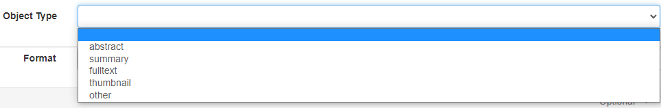

Figure 5-2. The "Date Type" pull-down list

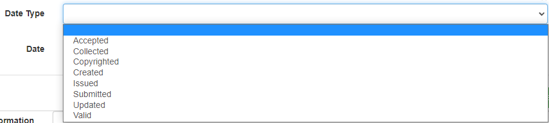

#### Set up a file

This section explains how to set up the file preview format, the link name to the text, and license display.

1.  In the Item Registration screen, select the file you want to set as the display name of the contents file.

Figure 5-3. The "Display Name" pull-down list

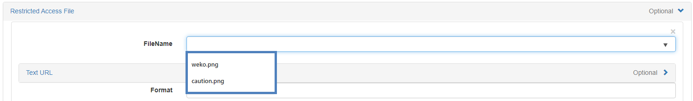

11. Select the preview format from the pull-down list.

Figure 5-4. The "Preview" pull-down list

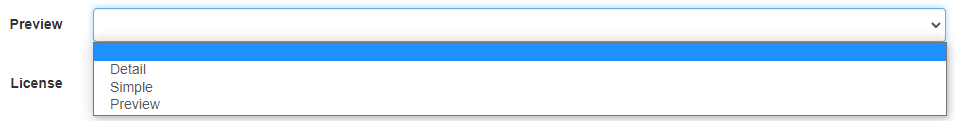

Table 5-8. The elements in the "Preview" pull-down list

| No. | Preview | Description                                                                                |
| --- | ------- | ------------------------------------------------------------------------------------------ |
| 1   | Detail  | Displays the link name to the text, the file size, and the license.                        |
| 2   | Simple  | Displays the link name to the text only.                                                   |
| 3   | Preview | Displays a preview of the file, the link name to the text, the file size, and the license. |

Notes:

The Preview display must be configured in the WEKO Administration.

> The file formats that can be used for "Preview" are as follows: md, json, xml, csv, pdf, png, jpg, gif, zip, jpynb, mp3, mp4, webm, ogg, wav, doc, docx, xls, xlsx, ppt, and pptx.
> 
> If an error occurs in the preview display, the error message will appear in the preview display area.

12. Select a license from the pull-down list.

Figure 5-5. The "License" pull-down list

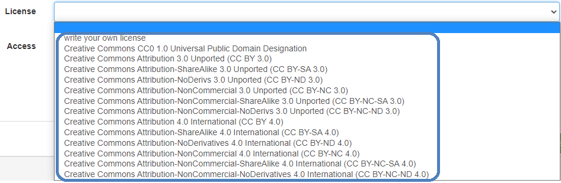

Table 5-9. The elements in the "License" screen

<table>
<thead>
<tr class="header">
<th>No.</th>
<th>Element</th>
<th>Description</th>
</tr>
</thead>
<tbody>
<tr class="odd">
<td>1</td>
<td>Free Input</td>
<td>A text area will appear when this option is selected. You can enter the license information manually. See "Figure 5-6. The "Free Input" text box.</td>
</tr>
<tr class="even">
<td>2</td>
<td>Creative Commons CC0 1.0 Universal Public Domain Designation</td>
<td>Publishes to the public domain.</td>
</tr>
<tr class="odd">
<td>3</td>
<td>Creative Commons Attribution 3.0 Unported (CC BY 3.0)</td>
<td><ul>
<li>
License version: 3.0
</li>
<li>
Displays the author.
</li>
<li>
It is an unported license.
</li>
</ul></td>
</tr>
<tr class="even">
<td>4</td>
<td>Creative Commons Attribution - ShareAlike 3.0 Unported (CC BY-SA 3.0)</td>
<td><ul>
<li>
License version: 3.0
</li>
<li>
Displays the author.
</li>
<li>
Inherits the original license in derivative works.
</li>
<li>
It is an unported license.
</li>
</ul></td>
</tr>
<tr class="odd">
<td>5</td>
<td>Creative Commons Attribution - NoDerivs 3.0 Unported (CC BY-ND 3.0)</td>
<td><ul>
<li>
License version: 3.0
</li>
<li>
Displays the author.
</li>
<li>
Prohibits modification to the work.
</li>
<li>
It is an unported license.
</li>
</ul></td>
</tr>
<tr class="even">
<td>6</td>
<td>Creative Commons Attribution - NonCommercial 3.0 Unported (CC BY-NC 3.0)</td>
<td><ul>
<li>
License version: 3.0
</li>
<li>
Displays the author.
</li>
<li>
Limits the use to non-commercial purposes only.
</li>
<li>
It is an unported license.
</li>
</ul></td>
</tr>
<tr class="odd">
<td>7</td>
<td>Creative Commons Attribution - NonCommercial - ShareAlike 3.0 Unported (CC BY-NC-SA 3.0)</td>
<td><ul>
<li>
License version: 3.0
</li>
<li>
Displays the author.
</li>
<li>
Limits the use to non-commercial purposes only.
</li>
<li>
Inherits the original license in derivative works.
</li>
<li>
It is an unported license.
</li>
</ul></td>
</tr>
<tr class="even">
<td>8</td>
<td>Creative Commons Attribution - NonCommercial - NoDerivs 3.0 Unported (CC BY-NC-ND 3.0)</td>
<td><ul>
<li>
License version: 3.0
</li>
<li>
Displays the author.
</li>
<li>
Limits the use to non-commercial purposes only.
</li>
<li>
Prohibits modification to the work.
</li>
<li>
It is an unported license.
</li>
</ul></td>
</tr>
<tr class="odd">
<td>9</td>
<td>Creative Commons Attribution 4.0 International (CC BY 4.0)</td>
<td><ul>
<li>
License version: 4.0
</li>
<li>
Displays the author.
</li>
</ul></td>
</tr>
<tr class="even">
<td>10</td>
<td>Creative Commons Attribution - ShareAlike 4.0 International (CC BY-SA 4.0)</td>
<td><ul>
<li>
License version: 4.0
</li>
<li>
Displays the author.
</li>
<li>
Inherits the original license in derivative works.
</li>
</ul></td>
</tr>
<tr class="odd">
<td>11</td>
<td>Creative Commons Attribution - NoDerivatives 4.0 International (CC BY-ND 4.0)</td>
<td><ul>
<li>
License version: 4.0
</li>
<li>
Displays the author.
</li>
<li>
Prohibits modification to the work.
</li>
</ul></td>
</tr>
<tr class="even">
<td>12</td>
<td>Creative Commons Attribution - NonCommercial 4.0 International (CC BY-NC 4.0)</td>
<td><ul>
<li>
License version: 4.0
</li>
<li>
Displays the author.
</li>
<li>
Limits the use to non-commercial purposes only.
</li>
</ul></td>
</tr>
<tr class="odd">
<td>13</td>
<td>Creative Commons Attribution - NonCommercial - ShareAlike 4.0 International (CC BY-NC-SA 4.0)</td>
<td><ul>
<li>
License version: 4.0
</li>
<li>
Displays the author.
</li>
<li>
Limits the use to non-commercial purposes only.
</li>
<li>
Inherits the original license in derivative works.
</li>
</ul></td>
</tr>
<tr class="even">
<td>14</td>
<td>Creative Commons Attribution - NonCommercial - NoDerivatives 4.0 International (CC BY-NC-ND 4.0)</td>
<td><ul>
<li>
License version: 4.0
</li>
<li>
Displays the author.
</li>
<li>
Limits the use to non-commercial purposes only.
</li>
<li>
Prohibits modification to the work.
</li>
</ul></td>
</tr>
</tbody>
</table>

Figure 5-6. The "Free Input" text box

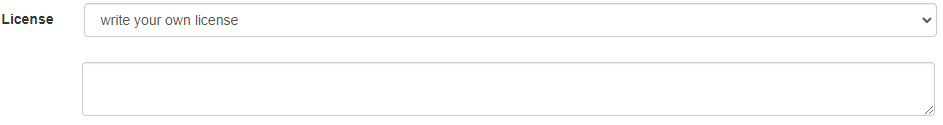

#### Specify how the file is published

This section explains how to set up how the file is published.

1.  Specify the publishing method by selecting an "Access" radio button.

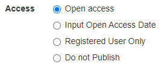

The access information for restricted access appears as follows

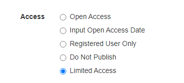

Table 5-10. The "Access" radio buttons with publishing options

<table>
<thead>
<tr class="header">
<th>No.</th>
<th>Publishing option</th>
<th>Description</th>
</tr>
</thead>
<tbody>
<tr class="odd">
<td>1</td>
<td>Open access</td>
<td>All users can download the file.</td>
</tr>
<tr class="even">
<td>2</td>
<td>Input Open Access Date</td>
<td>
Specify when the file is published

<ul>
<li>
Only logged-in users can download the file before the specified publish date.
</li>
<li>
All users can download the file from the specified publish date.

See "Figure 5-7. The "PubDate" text box".
</li>
</ul></td>
</tr>
<tr class="odd">
<td>3</td>
<td>Registered User Only</td>
<td>
Specify the user's group.

Only users who belong to the group can download the file.

See "Figure 5-8. The "Group" text box".
</td>
</tr>
<tr class="even">
<td>4</td>
<td>Do not Publish</td>
<td>Only the administrator, creator and proxy contributor of the item can download the file.</td>
</tr>
<tr class="odd">
<td>5</td>
<td>Restricted Access</td>
<td>
When you click this option, the elements No. 13 through No. 15 described in "Table 5-7. The elements in the file information screen" will be displayed. See the table for more information.

Selecting "Restricted Access" does not automatically set up "Access Rights". See Section (14) for "Access Rights".
</td>
</tr>
</tbody>
</table>

Figure 5-7. The "PubDate" text box

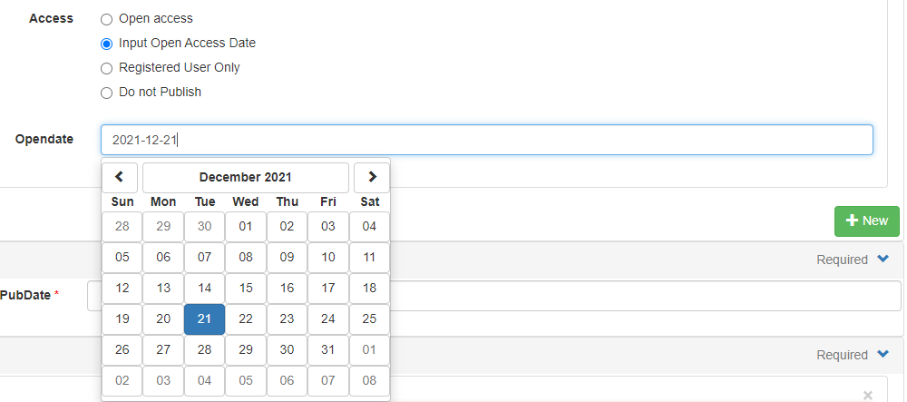

Figure 5-8. The "Group" text box

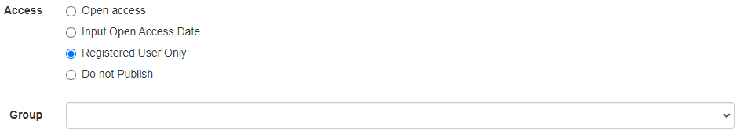

Additional Information: How to replace files

You may replace a file attached to the item while editing an item (you can replace the file and still carry over the statistics using the new file).

If a file is attached to the file, the "Replace" button will appear in the "Actions" column. To replace a file, click on the "Replace" button and select a replacement.

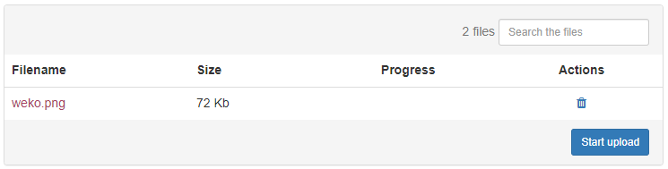

Clicking the "Replace" button will open where you can select a replacement file. The name of the selected file will appear in red text on the screen. You can then click the "Start upload" button to import the file. The file information, including the filename, text URL, format, and size, will be overwritten to reflect the change.

#### Set up a billing file

When the metadata attribute is a billing file, you can set a price for each group.

See Steps 1, 2, and 3 in "(4) Register a file" for information on how to upload a billing file.

This section explains how to specify information on a billing file.

1.  Enter the billing file information.
    
    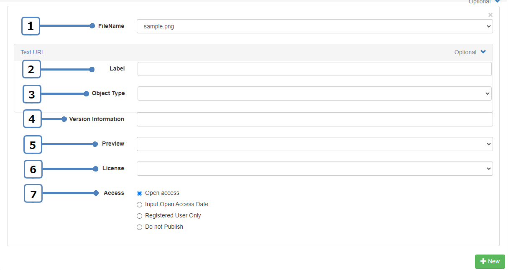
    
    Table 5-11. The elements in the "Billing File Information" screen

<table>
<thead>
<tr class="header">
<th>No.</th>
<th>Element</th>
<th>Description</th>
</tr>
</thead>
<tbody>
<tr class="odd">
<td>1</td>
<td>Display Name</td>
<td>Displays the name of the registered file.</td>
</tr>
<tr class="even">
<td>2</td>
<td>Label</td>
<td>
Enter the link name of the file to be displayed on the item details screen. The filename will be displayed in the item details screen when you do not enter this information.

See the section "(5) Set up a file" for information on the link name.
</td>
</tr>
<tr class="odd">
<td>3</td>
<td>Object Type</td>
<td>
Select the object type of the file.

See "Figure 5-1. The "Object Type" pull-down list" for options.
</td>
</tr>
<tr class="even">
<td>4</td>
<td>Version Information</td>
<td>Enter the version information of the file.</td>
</tr>
<tr class="odd">
<td>5</td>
<td>Preview</td>
<td>
Specify the file preview format.

See the section "(5) Set up a file" for more information.
</td>
</tr>
<tr class="even">
<td>6</td>
<td>License</td>
<td>
Specify the license of the file.

See the section "(5) Set up a file" for more information.
</td>
</tr>
<tr class="odd">
<td>7</td>
<td>Access</td>
<td>
Specify how the file is published.

See the section "(8) Specify how the billing file is published" for more information.
</td>
</tr>
</tbody>
</table>

3.  
    
#### Specify how the billing file is published

This section explains how to set up how the billing file is published.

1.  Specify the publishing method by selecting an "Access" radio button.

Table 5-12. The "Access" radio buttons with publishing options

<table>
<thead>
<tr class="header">
<th>No.</th>
<th>Publishing option</th>
<th>Description</th>
</tr>
</thead>
<tbody>
<tr class="odd">
<td>1</td>
<td>Open access</td>
<td>All users can download the file.</td>
</tr>
<tr class="even">
<td>2</td>
<td>Input Open Access Date</td>
<td>
Specify when the file is published

<ul>
<li>
Only logged-in users can download the file before the specified publish date.
</li>
<li>
All users can download the file from the specified publish date.

See "Figure 5-8. The "Group" text box".
</li>
</ul></td>
</tr>
<tr class="odd">
<td>3</td>
<td>Registered User Only</td>
<td>
Specify the user's group and price.

Users will not be able to download the billing file if their group does not have a price set up. 
If the user belongs to more than one group, the lowest applicable price will be used. See "Figure 5-9. The "Group/Price" area".
</td>
</tr>
<tr class="even">
<td>4</td>
<td>Do not Publish</td>
<td>Only the administrator, creator and proxy contributor of the item can download the file.</td>
</tr>
</tbody>
</table>

Figure 5-9. The "Group Name/Price" area

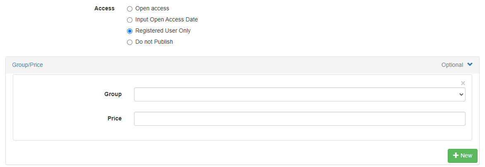

#### Metadata input elements

This section explains the elements used for specifying metadata.

In the Item Registration screen, enter the required elements for the item.

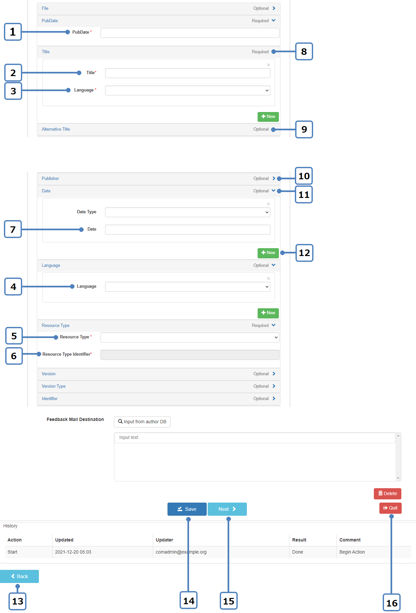

Table 5-13. The elements in the Item Registration screen

<table>
<thead>
<tr class="header">
<th>No.</th>
<th>Element</th>
<th>Description</th>
</tr>
</thead>
<tbody>
<tr class="odd">
<td>1</td>
<td>"PubDate" pull-down list*</td>
<td>Select the publish date from the pull-down list or enter it manually. Enter a date in the <em>yyyy-mm-dd</em> format. To select from the pull-down list, see "Figure 5-10. "PubDate" pull-down list".</td>
</tr>
<tr class="even">
<td>2</td>
<td>The "Title" text box under "Title"*</td>
<td>Enter a title.</td>
</tr>
<tr class="odd">
<td>3</td>
<td>The "Language" pull-down list under "Title"*</td>
<td>Select an option from the pull-down list. See "Figure 5-11. The "Language" pull-down list".</td>
</tr>
<tr class="even">
<td>4</td>
<td>The "Language" pull-down list under "Language"*</td>
<td>Select an option from the pull-down list. See "Figure 5-12. The "Language" pull-down list".</td>
</tr>
<tr class="odd">
<td>5</td>
<td>The "Resource Type" pull-down list under "Resource Type"*</td>
<td>Select an option from the pull-down list. See "Figure 5-13. The "Resource Type" pull-down list".</td>
</tr>
<tr class="even">
<td>6</td>
<td>The "Resource Type Identifier" text box under "Resource Type"*</td>
<td>The value is populated automatically when you select an option from the "Resource Type" pull-down.</td>
</tr>
<tr class="odd">
<td>7</td>
<td>The "Date" pull-down list under "Date"</td>
<td>Select the date from the pull-down list or enter it manually. Enter a date as <em>yyyy-mm-dd, yyyy-mm, or yyyy</em> in the ISO-8601 format.</td>
</tr>
<tr class="even">
<td>8</td>
<td>The "Required" panel</td>
<td>
The "Required" panel displays for those elements whose "Option" attribute is set to "Required" in the "Metadata" screen from the Administration screen.

The panel is shown expanded as the initial state.
</td>
</tr>
<tr class="odd">
<td>9</td>
<td>The "Optional" panel</td>
<td>
The "Optional" panel displays for those elements whose "Option" attribute is not set to "Required" in the "Metadata" screen from the Administration screen.

The panel is shown collapsed as the initial state.
</td>
</tr>
<tr class="even">
<td>10</td>
<td>The 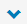 button</td>
<td>Click to collapse the panel.</td>
</tr>
<tr class="odd">
<td>11</td>
<td>The  button</td>
<td>Click to expand the panel.</td>
</tr>
<tr class="even">
<td>12</td>
<td>The 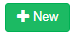 button</td>
<td>
Click to add an input area for the corresponding element.

Displays the  button for those elements whose "Option" attribute is set to "Allow Multiple" in the "Metadata" screen from the Administration screen.
</td>
</tr>
<tr class="odd">
<td>13</td>
<td>The 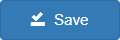 button</td>
<td>Click to save the specified information temporarily.</td>
</tr>
<tr class="even">
<td>14</td>
<td>The  button</td>
<td>Click to navigate to the "Specific index" screen. See "Section 5.1.2. Set up an index".</td>
</tr>
<tr class="odd">
<td>15</td>
<td>The  button</td>
<td>Clicking this button will not save the information entered, and you will return to the workflow selection screen.</td>
</tr>
<tr class="even">
<td>16</td>
<td>The 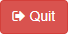 button</td>
<td>Click to discard the input and terminate the activity you are working on.</td>
</tr>
</tbody>
</table>

> \* Notes:

The asterisk (\*) denotes a required entry.

The required elements, however, vary depending on the item type.

> **Notes:**
> 
> CNRI will be registered when the Item Registration action is complete.
> 
> The prefix is a value set in the configuration file.
> 
> The suffix is a unique value returned by the LHS (Local Handle Server).

Figure 5-10. The "PubDate" pull-down list

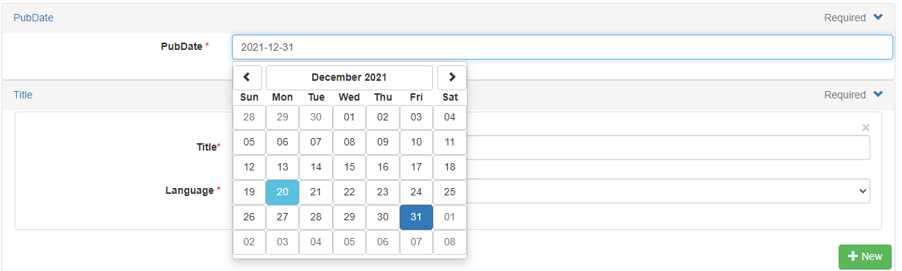

Figure 5-11. The "Language" pull-down list

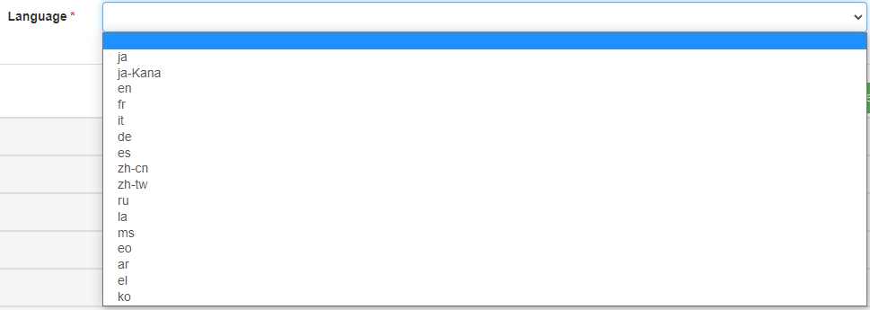

Figure 5-12. The "Language" pull-down list

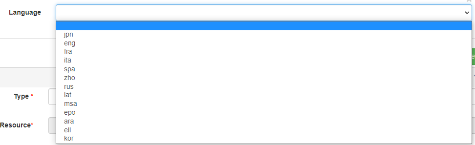

Figure 5-13. The "Resource Type" pull-down list

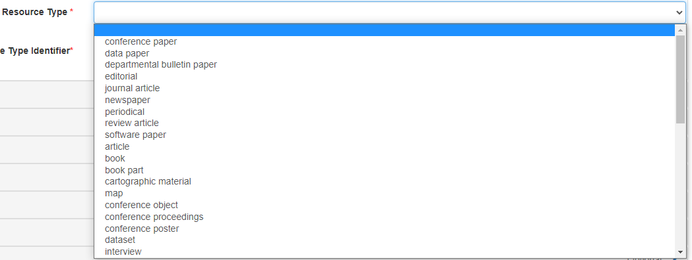

Additional Information:

If you enter multiple values for a single metadata element, their display order in the item details screen will be the same as that of the metadata element entry area in the Item Registration screen. You can also change the metadata display order in the item details screen by dragging and dropping the metadata to rearrange them in the input area.

#### Enter a creator name

Select or directly enter a creator information from the creator search screen.

This section explains how to select a creator in the creator search screen.

1.  In the Item Registration screen, click the 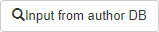 button displayed in the creator section.

The creator search screen appears.

13. In the creator search screen, enter a keyword in the "Search" text box and click the  button.

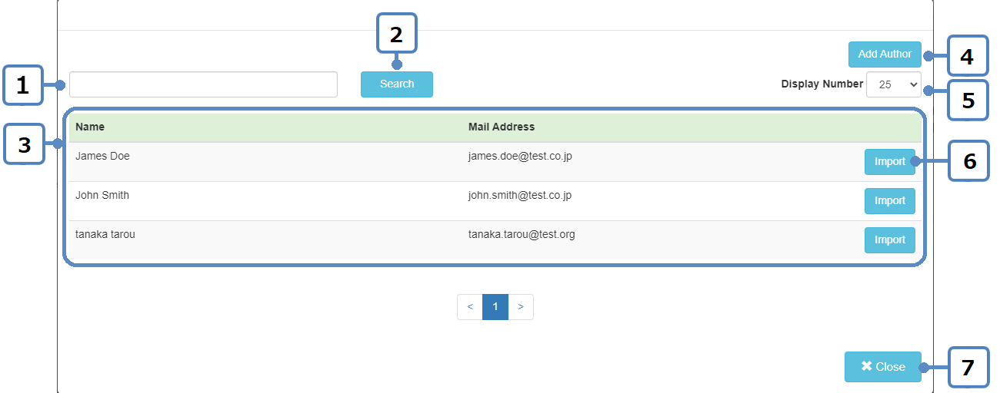

Table 5-14. The elements in the creator search screen

<table>
<thead>
<tr class="header">
<th>No.</th>
<th>Element</th>
<th>Description</th>
</tr>
</thead>
<tbody>
<tr class="odd">
<td>1</td>
<td>The "Search" text box (search key)</td>
<td>Enter the name or email address you are searching. The search will be performed for matching values.</td>
</tr>
<tr class="even">
<td>2</td>
<td>
The  button
</td>
<td>Click to perform the search according to the specified search criteria. The search results will be displayed in a list.</td>
</tr>
<tr class="odd">
<td>3</td>
<td>A list of creators</td>
<td>A list of creators is shown, including the names and email addresses.</td>
</tr>
<tr class="even">
<td>4</td>
<td>The 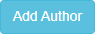 button</td>
<td>Click to display the "Add Author" screen. Enter the creator information. See "Figure 5-14. The "Add Author" screen".</td>
</tr>
<tr class="odd">
<td>5</td>
<td>The 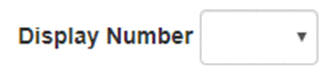 pull-down list</td>
<td>Select the number of rows displayed in the list of creators from the pull-down list. See "Figure 5-15. The "Display Number" pull-down list".</td>
</tr>
<tr class="even">
<td>6</td>
<td>The  button</td>
<td>Click to close the creator search screen. The creator information will be populated in the creator entry fields of the Item Registration screen.</td>
</tr>
<tr class="odd">
<td>7</td>
<td>The  button</td>
<td>Click to close the creator search screen without saving the information in the creator entry fields of the Item Registration screen.</td>
</tr>
</tbody>
</table>

Figure 5-14. The "Add Author" screen

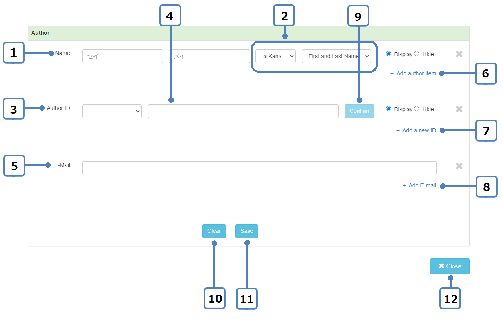

Table 5-15. The elements in the "Add Author" screen

| No. | Element                                                | Description                                                                                                               |
| --- | ------------------------------------------------------ | ------------------------------------------------------------------------------------------------------------------------- |
| 1   | The "Name" text box                                    | Enter a name.                                                                                                             |
| 2   | The "Name" pull-down lists                             | Select an option from the pull-down list. See "Figure 5-16. The "Name" pull-down lists".             |
| 3   | The "Author ID" pull-down list                         | Select the Author ID from the pull-down list. See "Figure 5-17. The "Author ID" pull-down list". |
| 4   | The "Author ID" text box                               | Enter the author ID.                                                                                                      |
| 5   | The "E-Mail" text box                                  | Enter an email address.                                                                                                   |
| 6   | The "Community" text box                               | Select the community that manages the author.                                                                             |
| 7   | The "+ Add author item" link                           | Click to add a field for entering another name.                                                                           |
| 8   | The "+ Add a new ID" link                              | Click to add a field for entering another author ID.                                                                      |
| 9   | The "+ Add E-mail" link                                | Click to add an email field.                                                                                              |
| 10  | The "+ Add Community" link                             | Click to add a field for entering another community.                                                                      |
| 11  | The  button | Click to navigate to the creator search screen without adding an author.                                                  |
| 12  | The "Identifier" pull-down list                        | Select the scheme name of the affiliation identifier from the pull-down list.                                             |
| 13  | The "Identifier" text box                              | Enter the identifier of the institution the author is affiliated with.                                                    |
| 14  | The "Affiliation Name" text box                        | Enter the name of the affiliated institution.                                                                             |
| 15  | The "Affiliation Name" pull-down list                  | Select the language of the affiliation name from the pull-down list.                                                      |
| 16  | The "Start Date" date picker of "Affiliation Period"   | Select the start date of the affiliation from the calendar.                                                               |
| 17  | The "End Date" date picker of "Affiliation Period"     | Select the end date of the affiliation from the calendar.                                                                 |
| 18  | The "+ Add Identifier" link                            | Click to add a field for entering another affiliation identifier.                                                         |
| 19  | The "+ Add Affiliation Name" link                      | Click to add a field for entering another affiliation name.                                                               |
| 20  | The "+ Add Affiliation Period" link                    | Click to add a field for entering another affiliation period.                                                             |
| 21  | The "+ Add Affiliation" link                           | Click to add a field for entering another set of affiliation information.                                                 |
| 22  | The  button | Click to navigate to the creator search screen.                                                                           |
| 23  | The  button | Click to add the author and navigate to the creator search screen.                                                        |
| 24  | The  button | Click to close the "Add Author" screen and navigate to the creator search screen.                                         |

Figure 5-15. The "Display Number" pull-down list

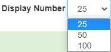

Figure 5-16. The "Name" pull-down lists

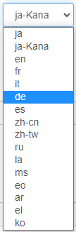 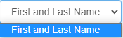

Figure 5-17. The "Author ID" pull-down list

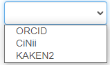

Additional Information:

・When imported from the creator search screen, the elements in the area where "Creator Identifier Scheme" is set to "WEKO" ("Creator Identifier Scheme", "Creator Identifier URI", "Creator Identifier") will be inactive.

・When imported from the creator search screen, the items are linked to the Author DB (linked via "WEKO" in the "Creator Identifier Scheme" and the number of items per author is counted). If you want to remove the link between the author DB and the item, click "X" to delete the "WEKO" information.

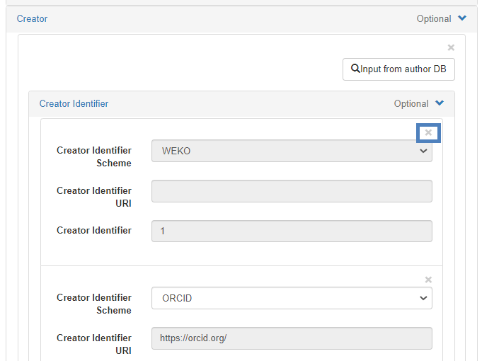

#### Set up bibliographic information

This section explains how to set up the bibliographic information.

1.  In the Item Registration screen, enter the journal title in the "Title" text box for the bibliographic information.

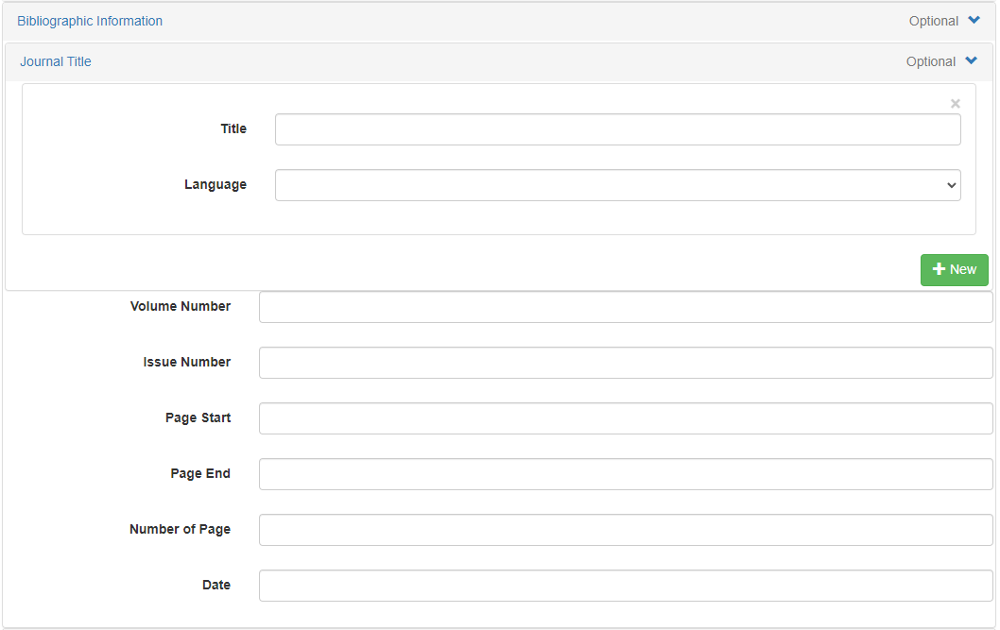

14. Select a language from the "Language" pull-down list.

15. Enter the volume number in the "Volume Number" text box.

16. Enter the issue number in the "Issue Number" text box.

17. Enter the start page in the "Page Start" text box.

18. Enter the end page in the "Page End" text box.

19. Enter the number of pages in the "Number of Page" text box.

20. Enter the issued date in the "Date" text box.
    
#### Set up the version type

This section explains how to set up the version type.

1.  In the Item Registration screen, select the version type from the "Version Type" pull-down list.

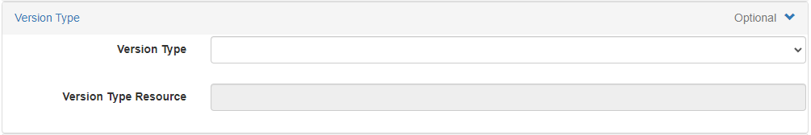

Figure 5-18. The "Version Type" pull-down list

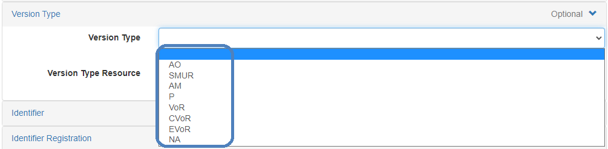

#### Retrieve policy information

This section explains how to retrieve the OA policy information of the journal.

1.  In the Item Registration screen, select "ISSN" or "eISSN" as the source identifier, or enter the journal title.

2.  Click the "OA Policy" button in "OA policy Information:".

    A link to the policy information appears.

    If none of ISSN, eISSN and the journal title is entered, the message "Please enter ISSN, eISSN, or journal title" appears. If no policy information is found, the message "No Policy Information found" appears.

3.  Click the link to view the policy information in a new tab.

Note: To retrieve policy information, the system administrator must configure the OA Assist Web API in advance.

#### Configure the Feedback Mail Destination setting

This section explains how to configure the Feedback Mail Destination setting.

1.  In the Item Registration screen, click the  button for the recipient of the feedback mail.  
    The creator search screen appears.

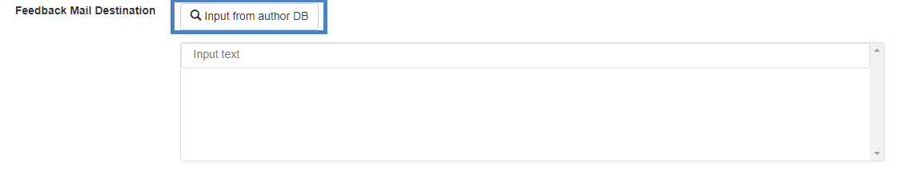

21. In the creator search screen, enter a keyword in the "Search" text box and click the 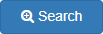 button.  
    Creators who satisfy the search criteria appear.
    
    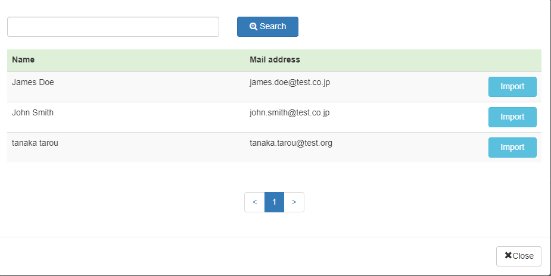

See "Table 5-14. The elements in the creator search screen" for information on the elements in the creator search screen. When you click the "Import" button, the email address will be populated in the "Feedback Mail Destination" list as shown below.

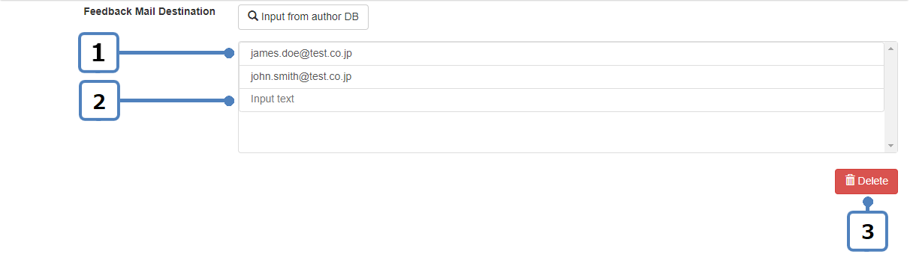

Table 5-16. The elements in the "Feedback Mail Destination" screen

<table>
<thead>
<tr class="header">
<th>No.</th>
<th>Element</th>
<th>Description</th>
</tr>
</thead>
<tbody>
<tr class="odd">
<td>1</td>
<td>The list of feedback mail destinations</td>
<td>Displays a list of email addresses configured.</td>
</tr>
<tr class="even">
<td>2</td>
<td>The text box showing "Input text"</td>
<td>
You can enter an email address here manually.

Press the Enter key to register the mail address entered.
</td>
</tr>
<tr class="odd">
<td>3</td>
<td>The  button</td>
<td>Click to remove the selected email address from the list.</td>
</tr>
</tbody>
</table>

#### Set up access rights

1.  This section explains how to set up the availability of the content. You can select and fill in the information using the controlled vocabulary. In the Item Registration screen, select the access rights from the "Access Rights" pull-down list. "Access Rights URI" is automatically populated with the relevant access rights URI.

See "Figure 5-19. The "Access Rights" pull-down list".

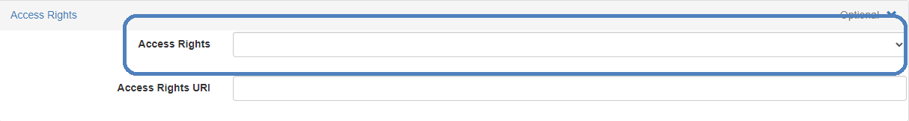

Figure 5-19. The "Access Rights" pull-down list

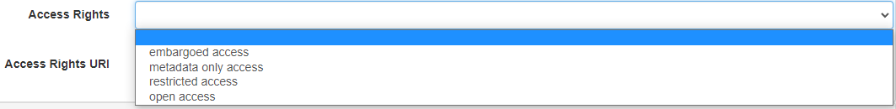

Table 5-17. The options in the "Access Rights" pull-down list

<table>
<thead>
<tr class="header">
<th>No.</th>
<th>Element</th>
<th>Description</th>
</tr>
</thead>
<tbody>
<tr class="odd">
<td>1</td>
<td>embargoed access</td>
<td>In the embargo period: Only metadata is available for access until this resource is released for open access on a specified date.</td>
</tr>
<tr class="even">
<td>2</td>
<td>metadata only access</td>
<td>Metadata only: Only metadata is available for access.</td>
</tr>
<tr class="odd">
<td>3</td>
<td>open access</td>
<td>Open access: This resource is available for online access free of charge, immediately and permanently upon its release, eliminating economic or technical barriers.</td>
</tr>
<tr class="even">
<td>4</td>
<td>restricted access</td>
<td>
Restricted access: This resource is systemically available but has some type of restriction placed for fully open access.

Additional Information: Selecting "Restricted Access" does not automatically set up this option. See Section (6) for "Restricted Access".
</td>
</tr>
</tbody>
</table>

> \* See the JPCOAR schema guidelines for detailed information on the vocabulary relating to access rights.
> 
> https://schema.irdb.nii.ac.jp/ja/access_rights_vocabulary
> 
> **Additional Information: Verification on the metadata you have entered**

  - > If you click the  button without entering the required fields, the error message "The following items is required. Please recheck and input" will be displayed.

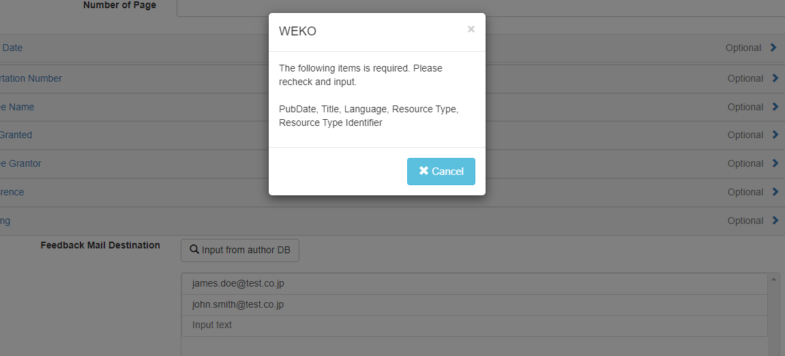

  - > If you use an incorrect format, an error message will appear directly below the corresponding field.

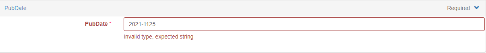

  - > If you enter an identifier, title, resource type, and creator that match an item already registered, the warning message "The same item may have been registered." appears.
    > Links to the details pages of the registered items that seem to be the same are displayed. Click a link to display the item details screen in a new tab.

  - > If the value you enter does not exist in the defined choices, the error message "{} is not one of {}" will appear.

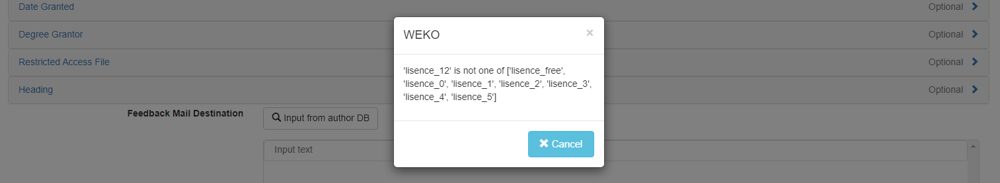

  - > If a JavaScript error occurs, the error message "An error occurred while processing the input data\!{}" will appear.

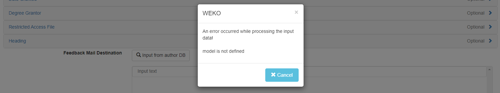

#### Set up how users apply to use the item

Note: This is an experimental feature. It is not provided in the JAIRO Cloud environment.

This section explains how to set up how users apply to use the item.

Note: This feature is available only when no content file is registered in the item.

1.  In the Item Registration screen, select the "Set usage application workflow for item" check box.

    The "WorkFlow" and "Terms and Conditions" pull-down lists appear.

2.  Select the usage application workflow and the terms and conditions from the "WorkFlow" and "Terms and Conditions" pull-down lists.

    See "Table 5-18. The elements for setting up how users apply to use the item" for the workflows and terms and conditions that can be set.

Table 5-18. The elements for setting up how users apply to use the item

| No. | Element | Description |
| --- | --- | --- |
| 1 | "WorkFlow" | Lists the workflows with "Restricted Access Flag" enabled among those managed in "Admin" > "WorkFlow" > "WorkFlow List". |
| 2 | "Terms and Conditions" | Displays a list of terms and conditions configured in the Administration screen. A "Free Input" option is provided, and a text area will be displayed when it is selected. |

#### Set up the request mail destination

Note: This is an experimental feature. It is not provided in the JAIRO Cloud environment.

This section explains how to set up the request mail destination.

1.  In the Item Registration screen, select the "Display Request Mail Button" check box.

2.  Click the "Input from author DB" button for "Request Mail Destination".

    The creator search screen appears.

3.  In the creator search screen, enter a keyword in the "Search" text box and click the "Search" button.

    Creators who satisfy the search criteria appear.

See "Table 5-14. The elements in the creator search screen" for information on the elements in the creator search screen. When you click the "Import" button, the email address will be populated in the "Request Mail Destination" list.

Table 5-19. The elements in the "Request Mail Destination" screen

| No. | Element | Description |
| --- | --- | --- |
| 1 | The list of request mail destinations | Displays a list of email addresses configured. |
| 2 | The text box showing "Input text" | You can enter an email address here manually. Press the Enter key to register the mail address entered. |
| 3 | The "Delete" button | Click to remove the selected email address from the request mail destinations. |

#### CRIS linkage (researchmap linkage)

This section explains how to link the item with researchmap.

1.  In the Item Registration screen, select the "researchmap" check box in "Auto Linkage to CRIS Institution".

    The result of the latest linkage is displayed in "Latest Linkage Result：". The result is one of the following four:

    - "Nothing": No linkage has been performed yet.
    - "Running": The operations in WEKO have been completed, and the linkage with the CRIS institution is waiting or in progress.
    - "Successful": The linkage with the CRIS institution has succeeded. The date of completion is also displayed.
    - "Failed": The linkage with the CRIS institution has failed. The date of failure is also displayed.

2.  After selecting the check box, complete the workflow.

    Automatic linkage is scheduled when the workflow is completed.

The creators entered in the item (Creator and Contributor) are the targets of the linkage. For the linkage, the parmalink of researchmap must be registered for the author in the author DB in advance.

By default, automatic linkage is performed every day at 0:00.

Additional Information: The following metadata is required for linkage with researchmap.

Table 5-20. Metadata required for linkage with researchmap

| jpcoar_mapping | Metadata name |
| --- | --- |
| dc:title | Title |
| jpcoar:creator | Creator \*1 |
| datacite:date | Date \*2 |
| jpcoar:resource\_type | Resource Type \*3 |

\*1: You must specify a creator who is registered in the author DB and for whom the parmalink of researchmap is set.

\*2: This element is different from the publication date of the item and must be set separately.

\*3: Only some resource types can be specified. The resource types that can be specified are listed in the table below.

Table 5-21. Resource types that can be specified for linkage with researchmap

| Resource type | Achievement type in researchmap |
| --- | --- |
| article | publish\_papers |
| journal article | publish\_papers |
| conference paper | publish\_papers |
| departmental bulletin paper | publish\_papers |
| master thesis | publish\_papers |
| doctoral thesis | publish\_papers |
| learning object | misc |
| technical report | misc |
| book | books\_etc |
| report | books\_etc |
| musical notation | books\_etc |
| video | books\_etc |
| image | books\_etc |
| sound | books\_etc |
| map | books\_etc |
| conference presentation | presentations |
| conference poster | presentations |
| interactive resource | works |
| software | works |
| other | other |

### Set up an index

You can set up an index to which items belong.

An item can belong to multiple indexes at the same time.

You must specify which index each item belongs to.

Displays the name of the index checked in the Index Tree.

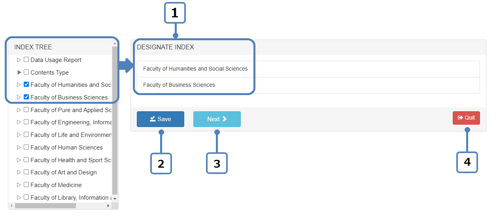

Table 5-22. The elements in the "Specific index" screen

| No. | Element                                                | Description                                                               |
| --- | ------------------------------------------------------ | ------------------------------------------------------------------------- |
| 1   | Index name                                             | Displays the name of the index checked in the Index Tree.                 |
| 2   | The  button | Click to save the specified information temporarily.                      |
| 3   | The  button | Click to proceed with the operation for the selected items.               |
| 4   | The  button | Click to discard the input and terminate the activity you are working on. |

Notes:

If you click the  or  button without selecting any index, you will get the error message "At least one index should be selected".

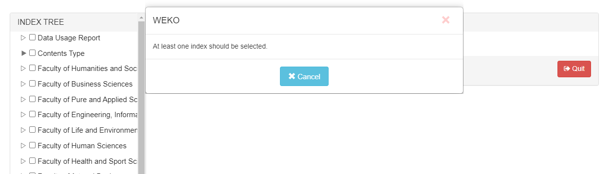

1.  Click the  button.

The comment input screen appears.

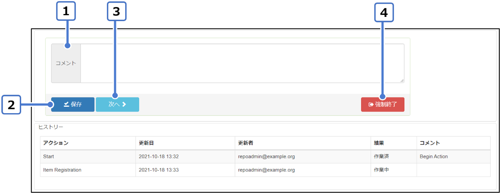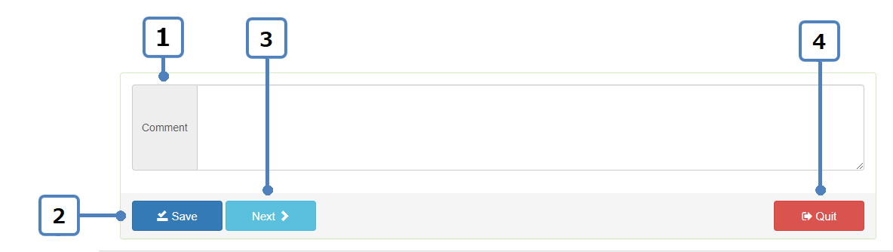

Table 5-23. The elements in the comment input screen

| No. | Element                                                                             | Description                                                                  |
| --- | ----------------------------------------------------------------------------------- | ---------------------------------------------------------------------------- |
| 1   | Comment                                                                             | Enter comments.                                                              |
| 2   | The "Back" button                                                                   | Click to return to the Item Registration screen.                             |
| 3   | The  button                              | Click to save the specified information temporarily.                         |
| 4   | The  button                              | Click to complete the registration of the item's metadata and content files. |
| 5   | The  button | Click to discard the input and terminate the activity you are working on.    |

22. Click the  button.

The "Step" screen appears, and "Item Registration" shows "Done" in the flow.

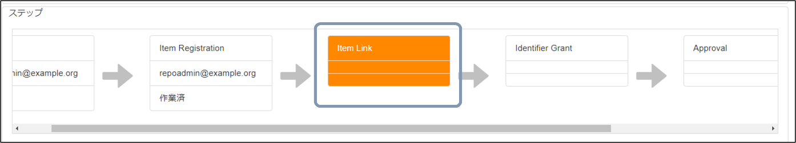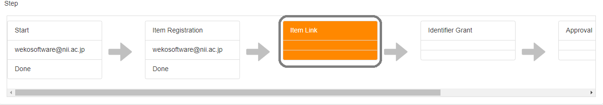

When you proceed to the next action, you may receive the error message "Please make sure the item type mapping is correct". This message will be displayed if the login session has expired, in which case you need to log in again.

Encountering this message when your login session has not expired suggests that there is a problem with the back-end processing. Contact your system administrator in such a case.

### Set up an item link

You can link up registered items with each other.

1.  Click on an index name under the "Index Tree" screen.

The "Item Link" screen belonging to that index appears.

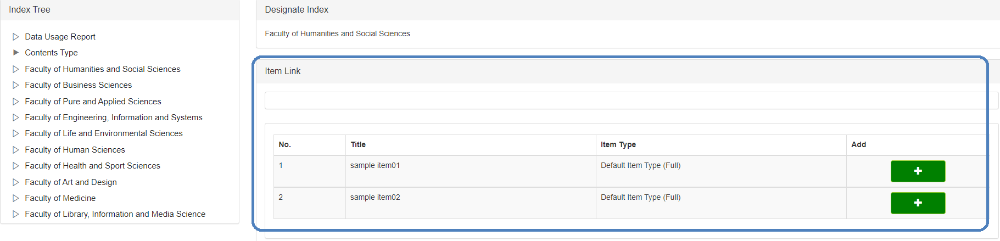

You can add links to multiple items that belong to the selected index. Note that only one index can be selected.

23. Select the "+" button for the item you want to link in the "Item Link" screen that appears.

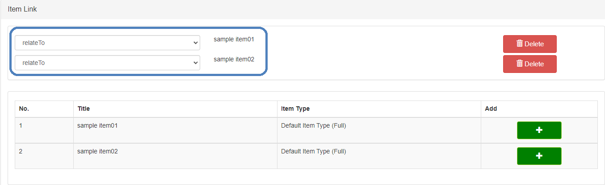

24. Enter comments.

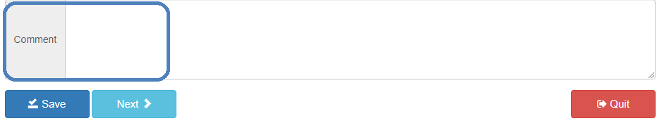

25. Click the  button.

The link will be registered.

### Gant DOIs

You can grant a DOI to an item if it has not already been granted one. You must take cautions when working with DOIs. The following cautions apply when granting DOIs to items.

  - The DOI granted to an item cannot be changed.

  - You cannot revoke a DOI once it is granted to an item.

This section explains how to grant a DOI to an item in the Identifier Grant action.

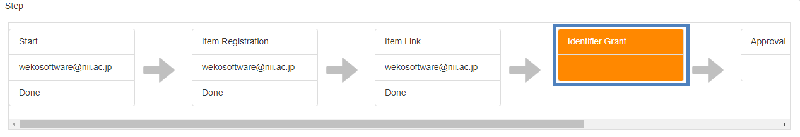

Figure 5-20. The "Identifier Grant" screen

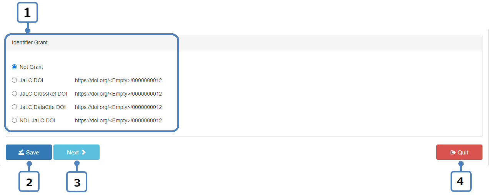

Table 5-24. The elements in the "Identifier Grant" screen

<table>
<thead>
<tr class="header">
<th>No.</th>
<th>Element</th>
<th>Description</th>
</tr>
</thead>
<tbody>
<tr class="odd">
<td>1</td>
<td>The "Identifier Grant" radio buttons*</td>
<td>
Select a DOI-issuing organization from the "Identifier Grant" radio buttons.

<ul>
<li><blockquote>

The following "Identifier Grant" options are supported (currently, NDL JaLC DOI cannot be granted (fixed in v1.0.7)).

</blockquote></li>
</ul>
<ul>
<li><blockquote>

JaLC DOI

</blockquote></li>
<li><blockquote>

JaLC CrossRef DOI

</blockquote></li>
<li><blockquote>

JaLC DataCite DOI

</blockquote></li>
<li><blockquote>

NDL JaLC DOI

</blockquote></li>
</ul></td>
</tr>
<tr class="even">
<td>2</td>
<td>The "Back" button</td>
<td>Returns to the previous action (added in v1.0.7).</td>
</tr>
<tr class="odd">
<td>3</td>
<td>The  button</td>
<td>Click to save the specified information temporarily.</td>
</tr>
<tr class="even">
<td>4</td>
<td>The  button</td>
<td>
Proceed to verify whether the conditions for granting a DOI is met.

<ul>
<li><blockquote>

If the conditions are met, a DOI will be granted. You can proceed to the next action.

</blockquote></li>
<li><blockquote>

If the conditions are not met, you will be returned to the Identifier Grant screen.

</blockquote></li>
</ul></td>
</tr>
<tr class="odd">
<td>5</td>
<td>The  button</td>
<td>Click to discard the input and terminate the activity you are working on.</td>
</tr>
</tbody>
</table>

> **Note 1:**
> 
> Depending on the configuration, DOIs can be granted in the following three methods:
> 
> **Automatic sequential numbering:**
> 
> In the "Identifier Grant" screen, the prefix set in the "Identifier" screen from the Administration screen appears. The suffix is assigned automatically.
> 
> Figure 5-21. The "Identifier Grant" screen (automatic sequential numbering)
> 
> 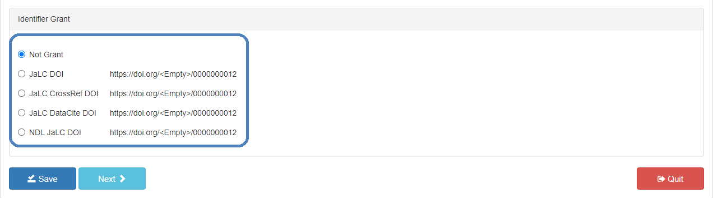
> 
> **Semi-automatic input:**
> 
> In the "Identifier Grant" screen, the prefix set in the "Identifier" screen from the Administration screen appears. The first half of the suffix, also set in the same screen, is assigned automatically. Enter the second half of the suffix in the "Input Field" text box.
> 
> The following input rules are applied:

  - > Only alphanumeric characters and the following symbols are allowed: \_-.;()/.

  - > The format must be "info:doi/&lt;prefix for DOI&gt;/&lt;input value&gt;" and the length must not exceed 255 characters.

  - > This DOI is not already being used with another item.

  - > This DOI is not one of those that have been revoked.

　　　　　　　　　　Figure 5-22. The "Identifier Grant" screen (semi-automatic input)

> 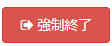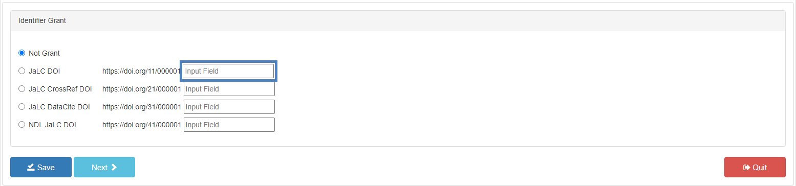
> 
> **"Free Input"**
> 
> In the "Identifier Grant" screen, the prefix set in the "Identifier" screen from the Administration screen appears. Enter the suffix in the "Input Field" text box.
> 
> The input value is checked against the input rules used for the semi-automatic input method.
> 
> Figure 5-23. The "Identifier Grant" screen (automatic input)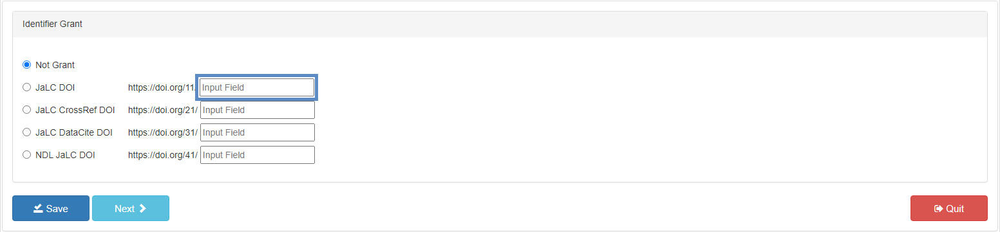
> 
> **Note 2:**
> 
> Depending on the DOI-issuing organization selected, the input values for the item are checked against the criteria for granting DOIs as defined in the following documents.
> 
> Document: "JPCOAR\_JaLC\_Guideline\_appendix\_v1.pdf".
> 
> **Note 3:**
> 
> When assigning a DOI to an item, it must be associated with an index whose index status is "Public" and Harvest Publishing is "Public".
> 
> **Note 4:**
> 
> If the condition for granting a DOI is not met, you will be returned to the activities in the Item Registration screen and an error message appears.
> 
> **Note 5:**
> 
> If there is more than one required mapping element contained in a single item type, the condition for granting a DOI is satisfied when one of the multiple elements is entered.
> 
> **Note 6:**
> 
> ・Once you register a DOI-granted item, you cannot delete the value of a required field or the property of a required field when editing the item. If you delete any, you will be redirected from the Identifier Grant screen to the Item Registration screen, and the message "PID does not meet the conditions" will be displayed.
> 
> You cannot modify the resource type (dc:type) when editing. If you modify it, you will be redirected from the Identifier Grant screen to the Item Registration screen, and the message "You cannot change the resource type of items that have been grant a DOI" will be displayed.
> 
> 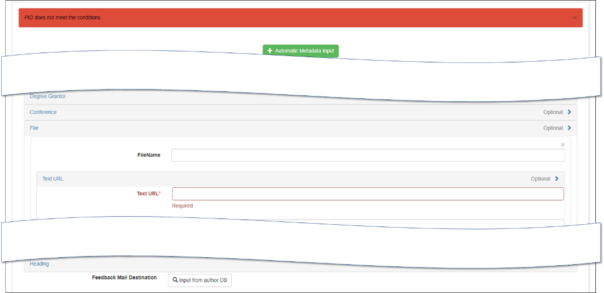

### Approve items

Items must basically be approved by a user with the role to administer a repository.

Users other than repository administrators can approve items in the following cases.

- When a specific role is set as the approver: users with the selected role can approve items.

- When a specific user is set as the approver: the selected user can approve items.

・The following cases are available only to the institutions participating in the early use of the usage application feature. Institutions that have not applied for the early use of this feature cannot use them.

> - When a property is set as the approver: the user set in the selected property can approve items.

> - When "Item registrant" is set as the approver: the user who registered the item can approve the item.

・The following cases are experimental features. They are not provided in the JAIRO Cloud environment.

> - When "Request mail" is set as the approver: the user registered with the email address of the request mail destination set when registering the item can approve items.
> - When "Request mail" is set as the approver in the "Usage Application" or "Two-Step Usage Application" workflow for a restricted access item: the user with the email address of the request destination of the restricted access item for which the usage application was made can approve items.

See "Set up flows" in the System Administration Manual for information on how to set up approvers.

The approver can "Reject", "Save", or "Approve" items that are pending approval.

When approving in the "Usage Application" or "Two-Step Usage Application" workflow for a restricted access item, the preview is displayed regardless of the display format of the item registered at the time of the application.

This feature can be turned on and off on the Administration screen.

You can approve items from the "Workflow" screen.

1.  Click on the "ToDo", "Wait", or "All" tab.

The activities list screen appears. The items that are currently pending approval appear.

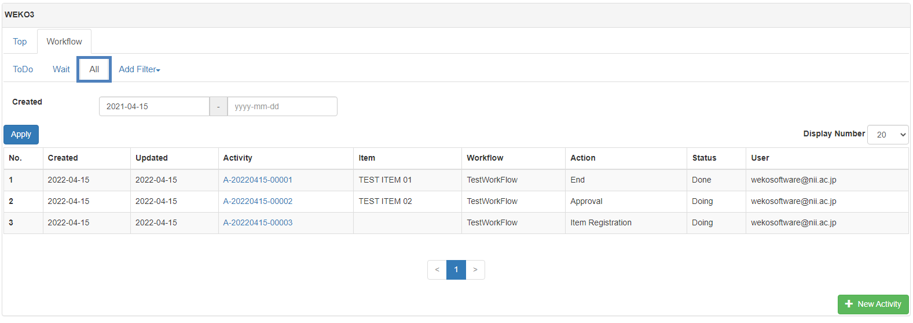

Notes:

If you do not have the review/approval privilege, the following screen will appear.

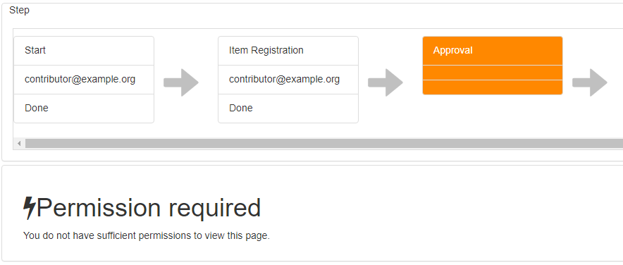

26. From the activities list screen that appears, click on the name of the activity whose action is "Approval".

The item approval screen appears.

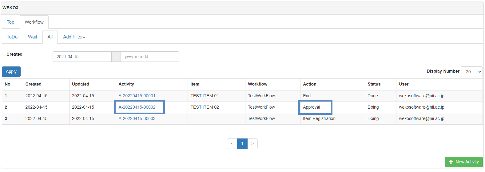

27. Click the "Approve" button in the item approval screen.

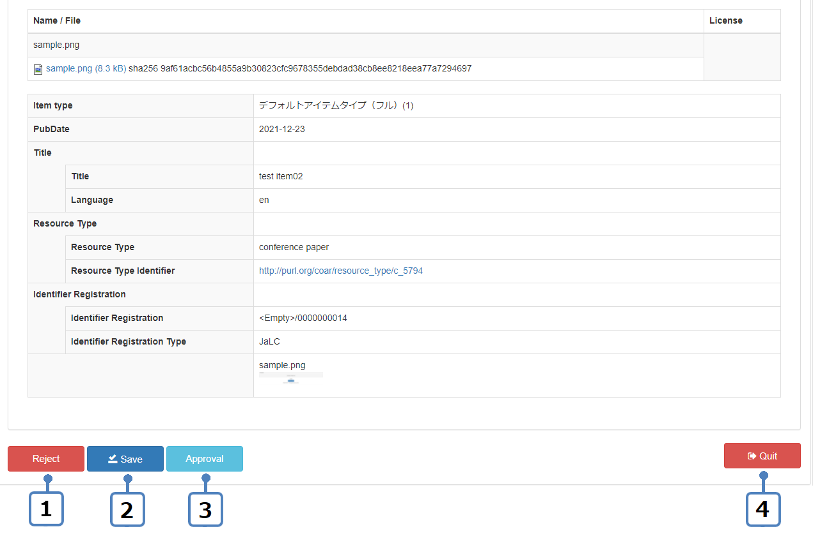

Table 5-25. The elements in the item approval screen

| No. | Element                                                | Description                                                               |
| --- | ------------------------------------------------------ | ------------------------------------------------------------------------- |
| 1   | The  button | Click to return to the previous action in the workflow.                   |
| 2   | The  button | Click to save the specified information temporarily.                      |
| 3   | The 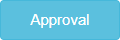 button | Click to approve the item.                                                |
| 4   | The  button | Click to discard the input and terminate the activity you are working on. |

If the registered item was registered from OA Assist, its status is linked to OA Assist.

## View activities

This section explains how to view activities registered in the System.

You can view activities from the "Workflow" screen.

### Display the activities list

This section explains how to view the activities list.

#### View the activities list

> This section explains how to view the activities list in each tab.

1.  Click on the "ToDo", "Wait", or "All" tab.

The activities list screen appears. You can work with the activities list using the following three tabs.

  - The "ToDo" tab

Click to view the activities that are being registered or edited, as well as those that have been rejected.

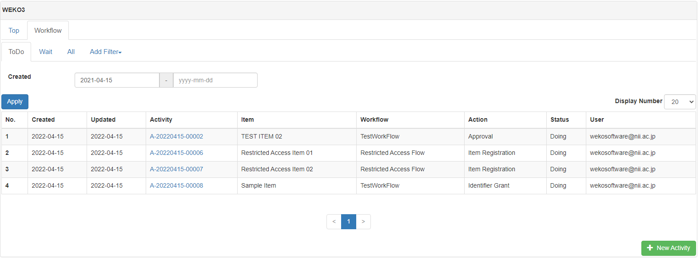

  - The "Wait" tab

Click to view the activities that are pending approval.

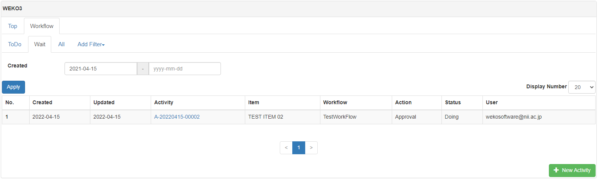

  - The "All" tab

Click to view the activities that are being registered or edited, those that have been cancelled, those that are pending approval, and those that are complete.

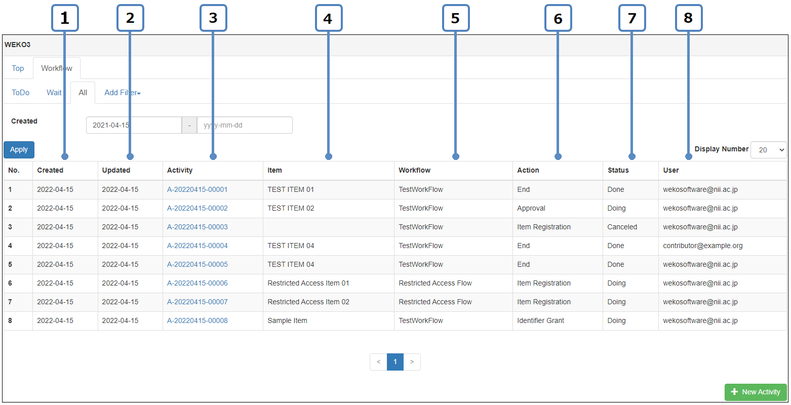

Table 5-26. The elements in the activities list screen

<table>
<thead>
<tr class="header">
<th>No.</th>
<th>Element</th>
<th>Description</th>
</tr>
</thead>
<tbody>
<tr class="odd">
<td>1</td>
<td>Created</td>
<td>Displays the date the activity was created. You must use the display format "<em>yyyy-mm-dd</em>".</td>
</tr>
<tr class="even">
<td>2</td>
<td>Updated</td>
<td>Displays the updated date. You must use the display format "<em>yyyy-mm-dd</em>".</td>
</tr>
<tr class="odd">
<td>3</td>
<td>Activity (with links)</td>
<td>Click to view the activity details.</td>
</tr>
<tr class="even">
<td>4</td>
<td>Item</td>
<td>Displays the item name.</td>
</tr>
<tr class="odd">
<td>5</td>
<td>Workflow</td>
<td>Displays the name of the workflow used in the activity.</td>
</tr>
<tr class="even">
<td>6</td>
<td>Action</td>
<td>Displays the current action.</td>
</tr>
<tr class="odd">
<td>7</td>
<td>Status</td>
<td>
Displays the status of the activity.

The status is shown as one of the following:

<ul>
<li><blockquote>

Doing

</blockquote></li>
<li><blockquote>

Done

</blockquote></li>
<li><blockquote>

Canceled

</blockquote></li>
</ul></td>
</tr>
<tr class="even">
<td>8</td>
<td>User</td>
<td>Displays the email address of the user who last updated the activity.</td>
</tr>
</tbody>
</table>

#### Filter the activities list

> This section explains how to filter the activities list.

28. > Click the "Add Filter" button.
    
    The filter options appear. Note that the "Created" is always displayed.

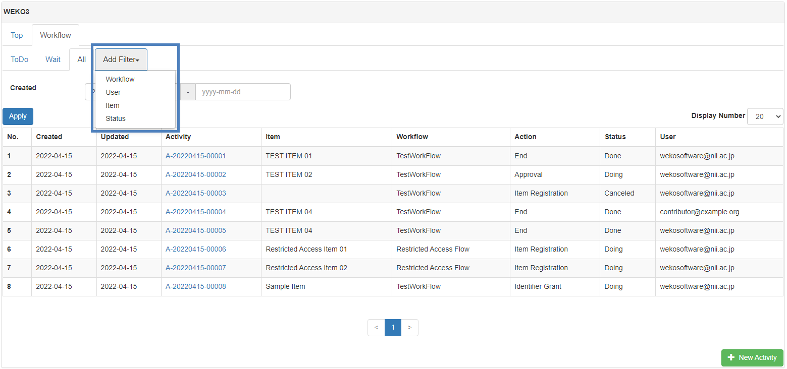

29. > Click on a filter.
    
    The input area for the filter you selected appears above the activities list.
    
    The content of the applied filter will be carried over among the "ToDo", "Wait", and "All" tabs.

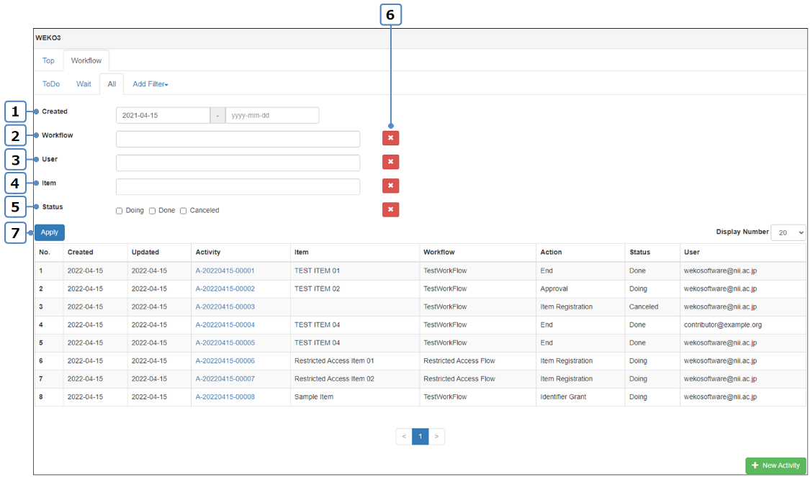

Table 5-27. The elements in the filter screen

<table>
<thead>
<tr class="header">
<th>No.</th>
<th>Element</th>
<th>Description</th>
</tr>
</thead>
<tbody>
<tr class="odd">
<td>1</td>
<td>Created</td>
<td>
Enter a range of the activity creation date. You must use the display format "<em>yyyy-mm-dd</em>".

The start date of the creation date will be automatically set to one year ago today.
</td>
</tr>
<tr class="even">
<td>2</td>
<td>Workflow</td>
<td>
Enter a workflow.

The "forward match" search applies.

You can add multiple input areas for this filter.
</td>
</tr>
<tr class="odd">
<td>3</td>
<td>User</td>
<td>
Enter an email address for the user. The "exact match" search applies.

You can add multiple input areas for this filter.
</td>
</tr>
<tr class="even">
<td>4</td>
<td>Item</td>
<td>
Enter an item name.

The "forward match" search applies.

You can add multiple input areas for this filter.
</td>
</tr>
<tr class="odd">
<td>5</td>
<td>Status</td>
<td>
Select the status of the activity. The options are "Doing," "Done," and "Canceled". Multiple selections are allowed.

The "exact match" search applies.
</td>
</tr>
<tr class="even">
<td>6</td>
<td>The 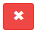 button</td>
<td>Click to delete the corresponding filter.</td>
</tr>
<tr class="odd">
<td>7</td>
<td>The 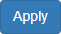 button</td>
<td>Click to apply the specified filters.</td>
</tr>
</tbody>
</table>

#### Page through the activities list

This section explains how to page through the activities list.

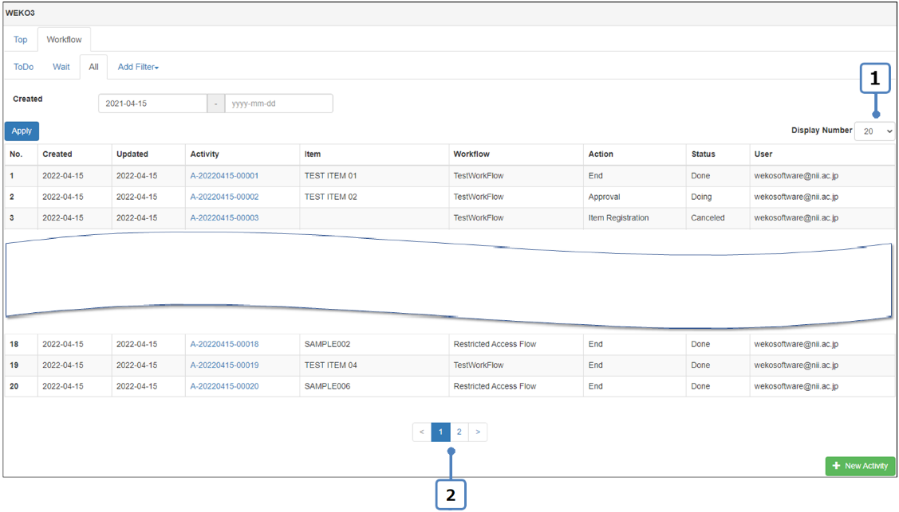

Table 5-28. The elements for paging

<table>
<thead>
<tr class="header">
<th>No.</th>
<th>Element</th>
<th>Description</th>
</tr>
</thead>
<tbody>
<tr class="odd">
<td>1</td>
<td>The "Display Number" pull-down</td>
<td>
Specify the number of activities to display. The default is set to "20". See "Figure 5-24. The "Display Number" pull-down".

Clicking an option will refresh the display, applying the number of activities selected.
</td>
</tr>
<tr class="even">
<td>2</td>
<td>The paging buttons</td>
<td>
Click the paging buttons to switch the display content.

<ul>
<li><blockquote>

Click the button to go to the previous page.

</blockquote></li>
<li><blockquote>

Click the number button to go to the corresponding page.

</blockquote></li>
<li><blockquote>

Click the button to go to the next page.

</blockquote></li>
</ul></td>
</tr>
</tbody>
</table>

Figure 5-24. The "Display Number" pull-down

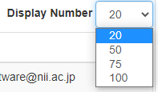

### Export activities to a TSV file

This section explains how to export activities to a TSV file.

Note: The "Download" and "Clear" buttons are displayed only when the "All" tab is displayed. They are not displayed unless `DELETE_ACTIVITY_LOG_ENABLE = True` is set in the configuration file (instance.cfg).

1.  Display the activities list screen with a system administrator or repository administrator account, and click the "All" tab.

2.  Search for the activities to export by using the "Add Filter" button.

    See "Filter the activities list" for details of the procedure.

3.  Click the "Download" button.

    A TSV file is exported.

Table 5-29. The "Download" button

| No. | Element               | Description                                                                                                                                                                                  |
| --- | --------------------- | -------------------------------------------------------------------------------------------------------------------------------------------------------------------------------------------- |
| 1   | The "Download" button | Displayed only to system administrators and repository administrators. Click to download the activities that match the same search conditions as the activities displayed on the screen as a TSV file. |

### Delete activities

This section explains how to delete activities.

Note: The "Download" and "Clear" buttons are displayed only when the "All" tab is displayed. They are not displayed unless `DELETE_ACTIVITY_LOG_ENABLE = True` is set in the configuration file (instance.cfg).

When activities are deleted, a TSV file of the activities is downloaded.

1.  Display the activities list screen with a system administrator or repository administrator account, and click the "All" tab.

2.  Search for the activities to delete by using the "Add Filter" button.

    See "Filter the activities list" for details of the procedure.

3.  To delete all the activities that match the search conditions, click the "Clear" button next to the "Download" button. To delete only one activity, click the "Clear" button in the row of that activity.

    The "Clear Confirm" dialog box appears.

4.  Click "OK" in the confirmation dialog box.

    Note: Deleted activities cannot be restored.

Table 5-30. The "Clear" buttons

| No. | Element                                          | Description                                                                                                                                                                                                              |
| --- | ------------------------------------------------ | ------------------------------------------------------------------------------------------------------------------------------------------------------------------------------------------------------------------------ |
| 1   | The "Clear" button (next to the "Download" button) | Displayed only to system administrators and repository administrators. Click to download the activities that match the same search conditions as the activities displayed on the screen as a TSV file, and delete those activities. |
| 2   | The "Clear" button (in each row)                 | Displayed only to system administrators and repository administrators. Click to download the selected activity as a TSV file, and delete that activity.                                                                  |

### View the activity details

This section explains how to view the activity details.

1.  Click on an activity name in the activities list screen.

The activity details screen appears.

Figure 5-25. The activity details screen

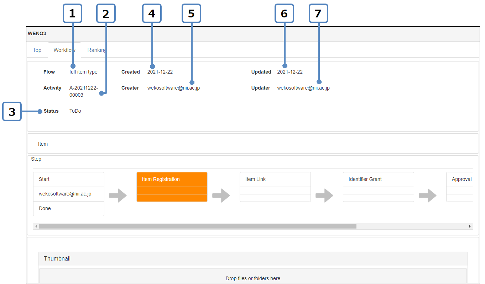

Table 5-31. The elements in the activity details screen

| No. | Element  | Description                                                                                      |
| --- | -------- | ------------------------------------------------------------------------------------------------ |
| 1   | Flow     | Displays the name of the flow.                                                                   |
| 2   | Activity | Displays the name of the activity.                                                               |
| 3   | Status   | Displays the status of the activity.                                                             |
| 4   | Created  | Displays the date the activity was created. You must use the display format "*yyyy-mm-dd*".      |
| 5   | Creator  | Displays the creator of the activity.                                                            |
| 6   | Updated  | Displays the date the activity was last updated. You must use the display format "*yyyy-mm-dd*". |
| 7   | Updater  | Displays the user who last updated the activity.                                                 |

## Activity lock (v1.0.7)

You cannot run multiple activities at the same time.

If you try to run an activity while another activity is already running, a screen with the message "One user cannot open multiple activities simultaneously." appears. Complete or cancel the running activity.

If you try to open the same activity in multiple tabs, a screen with the message "This activity is being locked" appears. Check whether the activity is open in another tab, close that tab, and then resume the activity.

Note: Depending on the state of the web browser, the System may fail to determine whether an activity is running. In that case, click the "Force Unlock" button and start the activity.

# Edit and delete items

This chapter provides information on editing and deleting registered items.

## Edit items

This section explains how to edit items registered in the Systems.

The following users can edit an item: system administrators, repository administrators, community administrators of the community that manages the index to which the item belongs, the user who registered the item (the owner), and the proxy contributor.

> If you have permission to edit the item, you can also open the item edit screen by directly entering the URL (/workflow/edit_item_direct/*item ID*), in addition to the procedure below. The edit screen opens only when you have permission to edit the item and the item is not being edited by another activity.
> 
> If you are not logged in, the Login screen appears, and the edit screen opens after you log in. If you are logged in but do not have permission to edit the item, the error "You are not allowed to edit this item." appears.
> 
> [v2.1.0] Users who are not logged in or who do not have permission to edit the item cannot update or publish the item without going through the screens either.

You can edit items belonging to the index. Locate the item to be edited in the index tree.

Figure 6-1. The "Index Tree" screen

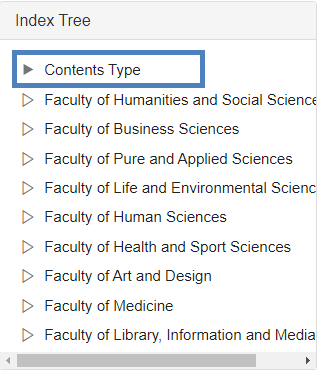

1.  Click on an index from the "Index Tree" screen.

The "Item Lists" screen appears.

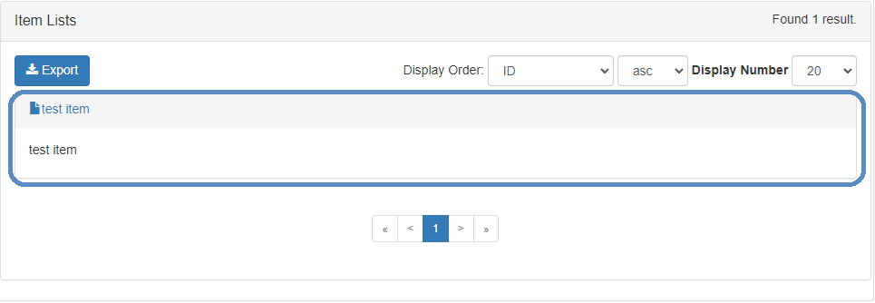

30. Click on the title of the item you want to edit in the "Item Lists" screen that appears.

The item details screen appears.

31. Click on the  button in the item details screen.
    
    The Item Registration screen appears.
    
    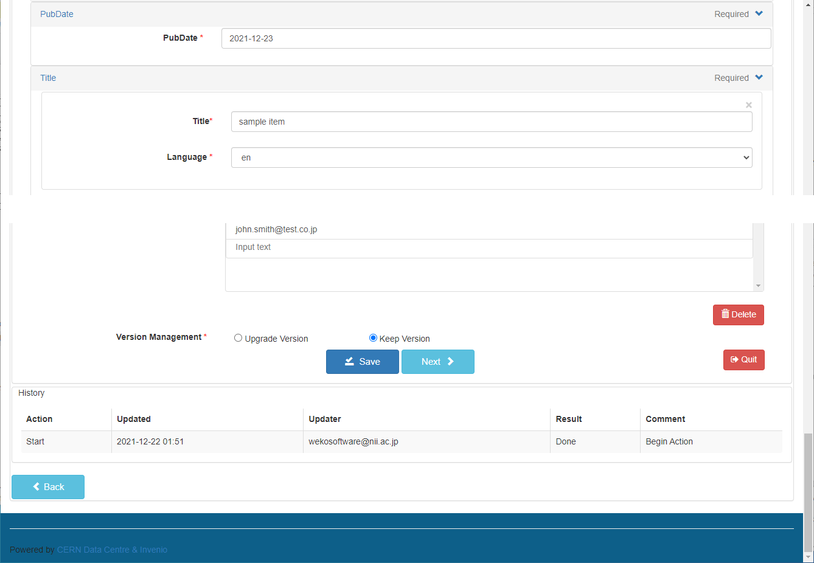If the "Edit" button of an item is pressed on another device or on the same device where import is in progress, the message "Item cannot be edited because the import is in progress" will appear.

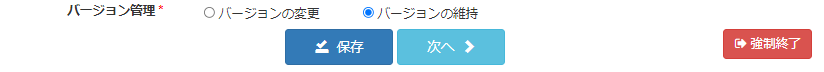

If the item is being edited, you will see the message "The item is being edited". In this case, to edit an item, click on the name of the activity you want to edit from the activities list screen.

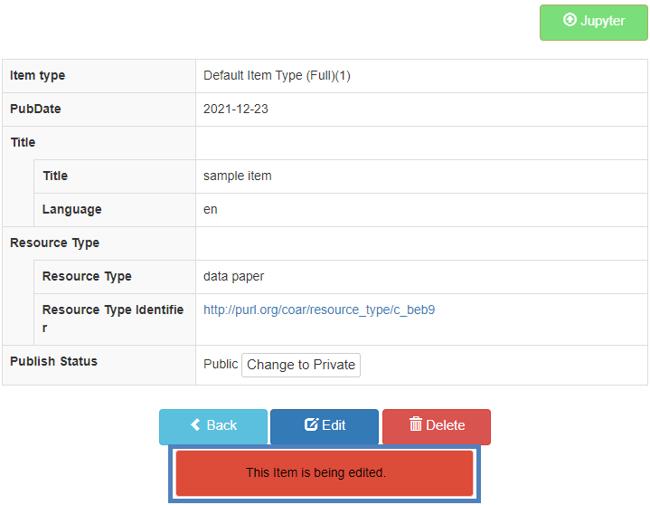

32. Click on the appropriate activity name to edit.
    
    1.  > From the Home screen, click the "Workflow" tab.  
        > The activities list screen appears.

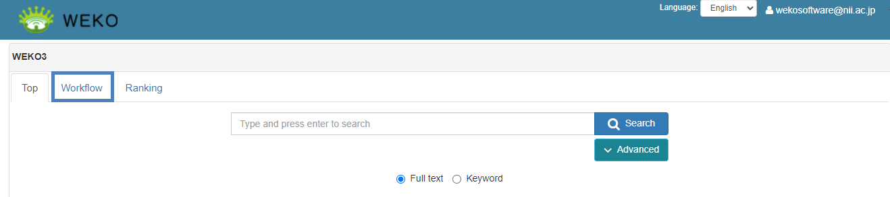

2.  > Click on the "ToDo" or "All" tab.

> The activities list screen appears.
> 
> 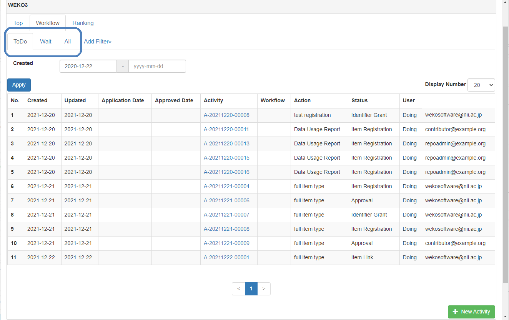

3.  > Click on the activity name you want to edit from the activities list screen that appears.

> The Item Registration screen appears.

33. Edit the appropriate elements.

34. Select "Version Management".
    
    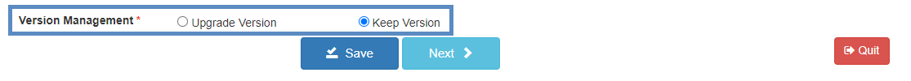
    
    When you select "Upgrade Version", the item will be updated, and the version will be upgraded.
    
    When you select "Keep Version", the item will be updated but the version will be kept.
    
    The default is set to "Keep Version".
    
    You must specify an option for "Version Management".

35. Click the  button.

The "Specific index" screen appears. See "Section 5.1.2. Set up an index" for more information.

Notes:

> Click the  button in the Item Registration screen to check the specified metadata. If there is an error, you will see a message. For the details of the error, see "Section 5.1.1. Register items," under "Additional Information: Verification on the metadata you have entered".

See "Table 5-13. The elements in the Item Registration screen" for information on how the , , and  buttons work on the Item Registration screen.

36. Click the  button.

You can proceed to the next action defined in the flow.

See "Section 5.1. Register items" for more information on the relevant action.

Once the item is "approved" in the Approval screen, the item will be updated.

Notes:

After editing, the old version will inherit the previous publish status.

## Delete items

This section explains how to delete items registered in the Systems.

The users who can delete an item are the same as those who can edit it: system administrators, repository administrators, community administrators of the community that manages the index to which the item belongs, the user who registered the item (the owner), and the proxy contributor.

You can delete items belonging to the index. Locate the item to be deleted in the index tree.

Figure 6-2. The "Index Tree" screen

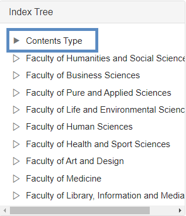

1.  Click on an index from the "Index Tree" screen.

The "Item Lists" screen appears.

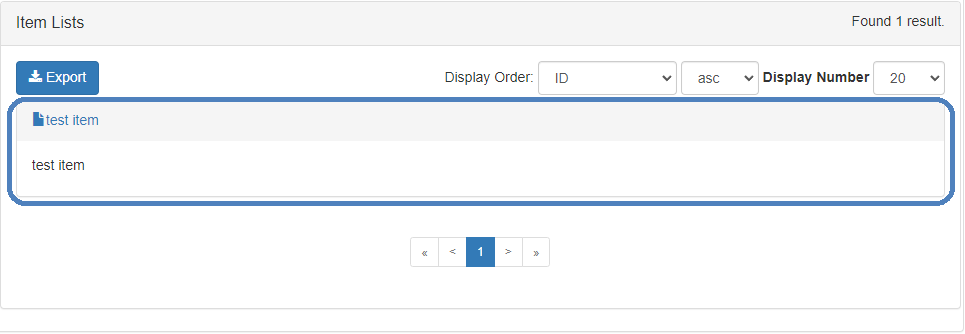

37. Click on the title of the item you want to delete in the "Item Lists" screen that appears.

The item details screen appears.

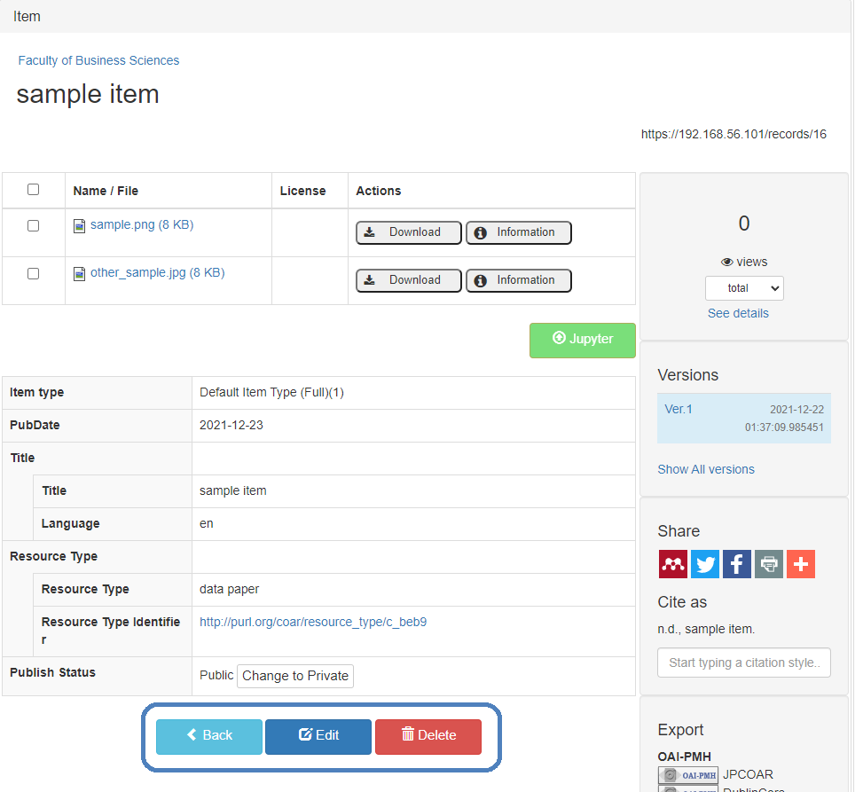

38. Click on the  button in the item details screen.

The "Confirm" screen appears.

If the "Delete" button of an item is pressed on another device or on the same device where import is in progress, the message "Item cannot be deleted because the import is in progress" will appear.

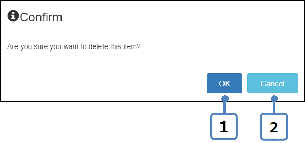

Table 6-1. The elements in the "Confirm" screen

| No. | Element                                                         | Description                                                            |
| --- | --------------------------------------------------------------- | ---------------------------------------------------------------------- |
| 1   | The  button | Click to delete the item. You are returned to the "Item Lists" screen. |
| 2   | The  button           | Click to cancel the delete operation and close the "Confirm" screen.   |

Notes:

The  button does not appear in the item details screen for users who do not have the permission.

Older versions of the item do not display the  button. When the latest version is deleted, all the previous versions will also be logically deleted.

39. Click the  button.

The item will be deleted.

After deleting an item, if you try to display it in the item details screen by directly entering the URL, the message "This item has been deleted" will appear.

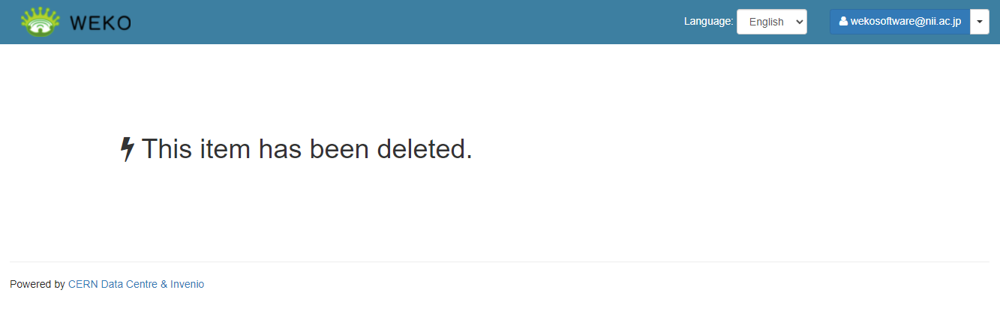

# Export items

This chapter provides information on exporting items.

## Export items

This section explains how to export items.

1.  Click on the "Top" tab.

Run a search by entering keywords in the keyword search text box or run an index tree search.

2.  The search results appear in the "Item Lists" screen.
    
    Click the  button to display the "Items to Export" screen.
    
    The  button is displayed when exporting items is permitted in the item export settings on the Administration screen.

Figure 7-1. The "Items to Export" screen

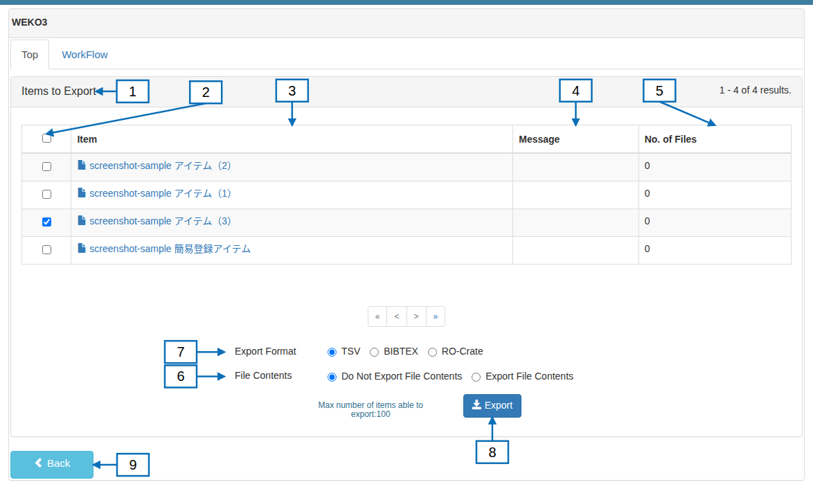

Table 7-1. The elements in the "Items to Export" screen

<table>
<thead>
<tr class="header">
<th>No.</th>
<th>Element</th>
<th>Description</th>
</tr>
</thead>
<tbody>
<tr class="odd">
<td>1</td>
<td>The index name</td>
<td>Displays the name of the selected index.</td>
</tr>
<tr class="even">
<td>2</td>
<td>Check boxes</td>
<td>Exports the items selected.</td>
</tr>
<tr class="odd">
<td>3</td>
<td>"Item"</td>
<td>
Displays items to be exported in a list.

Lists items with a link. Clicking on a link will display the item details screen.
</td>
</tr>
<tr class="even">
<td>[v2.1.0] 4</td>
<td>"Message"</td>
<td>
Displays a message from the System.

If you do not have the permission to download the file, the message "Contains restricted content" will appear.

When you export with "BIBTEX" selected in "Export Format", the message "Required item is not inputted." appears for items that lack the required BibTeX fields or that you do not have permission to view, and those items are not exported.
</td>
</tr>
<tr class="odd">
<td>5</td>
<td>"No. of Files."</td>
<td>Displays the number of content files registered in the item.</td>
</tr>
<tr class="even">
<td>6</td>
<td>The "File Contents" radio buttons</td>
<td>
Select an option for "File Contents".

The choices are "Do Not Export File Contents" and "Export File Contents".

If exporting files is not permitted in the item export settings on the Administration screen, these options cannot be selected and the message "File contents cannot be exported." appears.

If you select "RO-Crate" in "Export Format", "Export File Contents" is selected automatically.
</td>
</tr>
<tr class="odd">
<td>7</td>
<td>The "Export Format" radio buttons</td>
<td>
Select an option for "Export Format".

The choices are "TSV", "BIBTEX" and "RO-Crate".

"RO-Crate" can be selected when exporting files is permitted in the item export settings on the Administration screen.
</td>
</tr>
<tr class="even">
<td>8</td>
<td>The  button</td>
<td>
Exports the items selected in the "Item" list.

The button will remain inactive until you select items.

The maximum number of items that can be exported at once is displayed to the left of the button ("Max number of items able to export"). If the number of selected items exceeds the maximum, the message "Exceeded number of selectable items." appears and the button becomes inactive.
</td>
</tr>
<tr class="odd">
<td>9</td>
<td>The  button</td>
<td>Click to return to the simple search screen.</td>
</tr>
</tbody>
</table>

> Notes: If an internal error occurs during the export process, the error message "Error occurred during item export" will appear.
> 
> 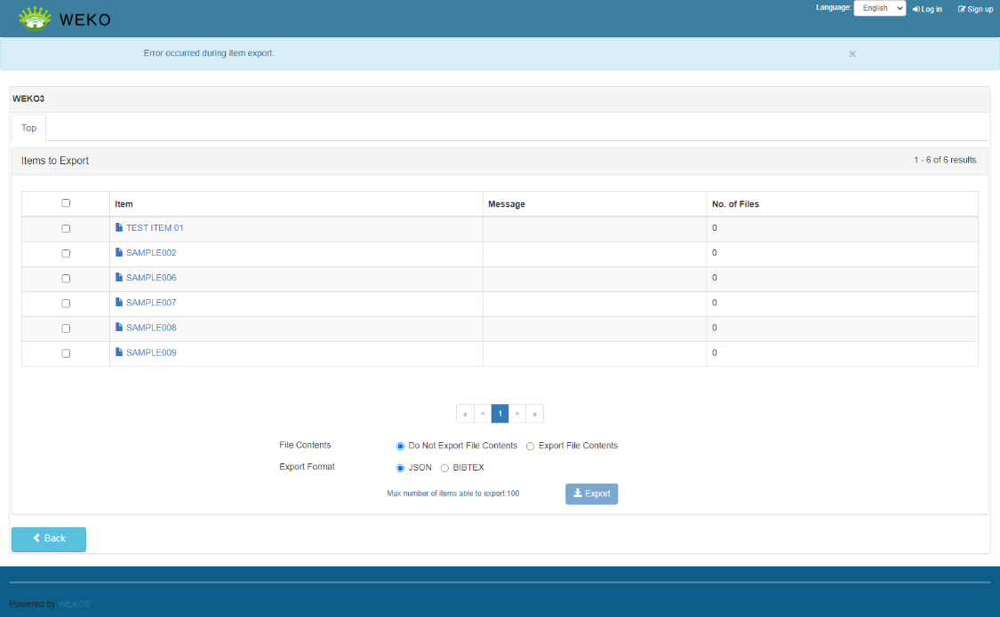

# Upload large files

**This feature has not been released.**

The release of the large file upload feature (a feature for uploading large files from a dedicated screen and, if an upload fails, resuming it from where it stopped by specifying the upload ID) has been postponed. It is not available in the current version.

# Explore communities

This chapter provides information on exploring communities.

## Explore communities

This section explains how to explore communities.

Communities can be explored when the System is configured to display communities. See "Configure the index tree/facet display" in the System Administration Manual for more information.

1.  Click on the "Communities" tab in the Home screen.

The "Communities" screen appears.

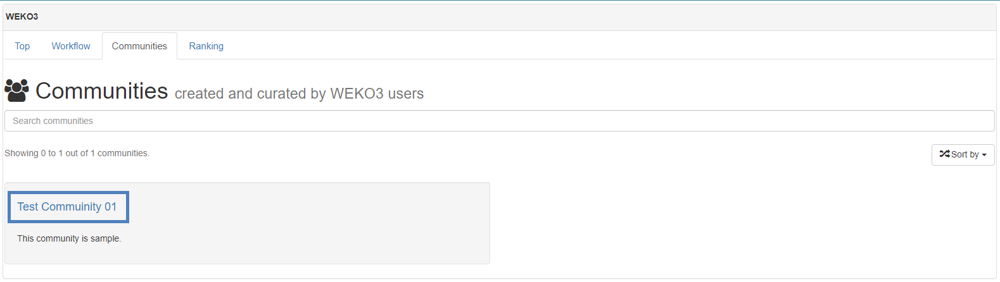

Table 9-1. The elements in the "Communities" screen

| No. | Element                     | Description                                                                                                                                                                  |
| --- | --------------------------- | ---------------------------------------------------------------------------------------------------------------------------------------------------------------------------- |
| 1   | Community logo              | Displays the logo image of the community, if a logo is set for the community.                                                                                               |
| 2   | Community name              | Click to display the top page of the community.                                                                                                                              |
| 3   | Tag information             | Displays the following subject information set for the community, separated by commas.<ul><li>Subject</li><li>Subject URI</li><li>Subject Scheme</li><li>Language</li></ul> |
| 4   | Hosting institution information | Displays the following hosting institution information set for the community, separated by commas.<ul><li>Hosting Institution Type</li><li>Hosting Institution Name</li><li>Language</li></ul> |

2.  Click on the community name link from the list in the "Communities" screen.

3.  The top page of the selected community appears.

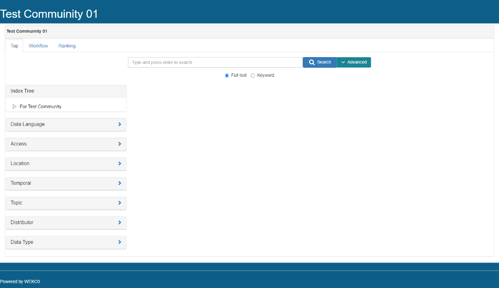

## View the content policy

This section explains how to view the content policy of a community.

1.  Click the "コンテンツポリシー" (Content Policy) tab on the top page of the community.

    Note: The label of this tab is displayed in Japanese regardless of the display language.

2.  The content policy set for the community is displayed.

# Operating tips

This chapter provides tips for working with the System.

## Modify your profile

This section explains how to modify your account profile.

1.  Click  next to the account name in the upper right corner of the Home screen.

A pull-down menu appears.

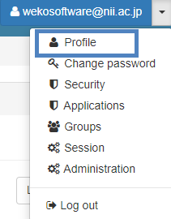

40. Click "Profile".

The "Profile" screen appears.

41. Edit your profile in the "Profile" screen.

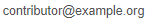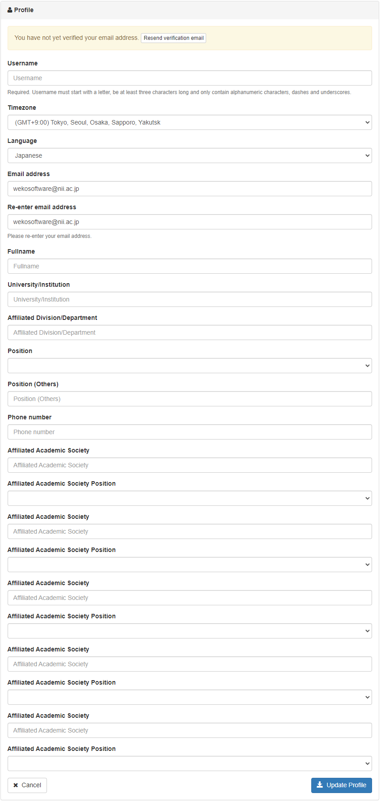

Table 10-1. The elements in the "Profile" screen

| No. | Element                                                          | Description                                                                                                                                                            |
| --- | ---------------------------------------------------------------- | ---------------------------------------------------------------------------------------------------------------------------------------------------------------------- |
| 1   | The "Username" text box                                          | Enter a username. You can use alphanumeric characters, hyphens (-), and underscores (\_). The minimum length is 3 characters, and the maximum length is 255 characters. |
| 2   | The "Timezone" pull-down list                                    | Select a time zone from the "Timezone" pull-down list. See "Figure 10-1. The "Timezone" pull-down list".                                       |
| 3   | The "Language" pull-down list                                    | Select a language from the "Language" pull-down list. See "Figure 10-2. The "Language" pull-down list".                               |
| 4   | The "Email Address" text box                                     | The input format should be "*XXXXX*＠*XXX.XXX*". You can use alphanumeric characters, hyphens (-), and underscores (\_). The maximum length is 254 characters.          |
| 5   | The "Re-enter email address" text box                            | Enter the new email address again to confirm that the value you specified in "Email Address" is correct.                                                               |
| 6   | The "access key" text box                                        | If you want to use "Copy a file to an open bucket" from the file details screen, enter the access key of the S3 account to use.                                        |
| 7   | The "secret key" text box                                        | If you want to use "Copy a file to an open bucket" from the file details screen, enter the secret key of the S3 account to use.                                        |
| 8   | The "endpoint url" text box                                      | If you want to use "Copy a file to an open bucket" from the file details screen, enter the endpoint URL of the S3 account to use.                                      |
| 9   | The "region name" text box                                       | If you want to use "Copy a file to an open bucket" from the file details screen and need to specify the region of the S3 account to use, enter the region name.         |
| 10  | The 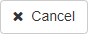 button           | Click to close the "Profile" screen without saving the changes you have made.                                                                                          |
| 11  | The 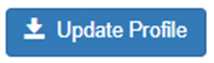 button | Click to update the profile with the changes and close the "Profile" screen.                                                                                           |

Note: Items 6 to 9 (the S3 account information) are displayed only when `WEKO_RECORDS_UI_USER_STORAGE_MODIFICATION_ENABLED = True` is set in the configuration file (instance.cfg). This setting is disabled (False) by default.

Figure 10-1. The "Timezone" pull-down list

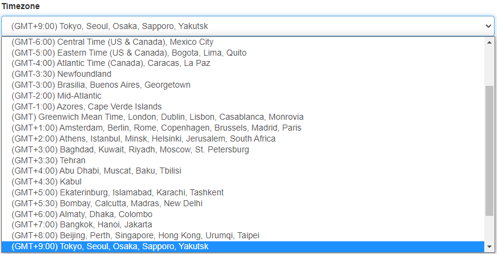

Figure 10-2. The "Language" pull-down list

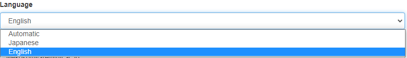

42. Click the  button.

The profile is updated.

## Determine which device is used to log in to an account

This section explains how to determine which device is used to log in to an account

1.  Select "Security" from the user account pull-down menu in the upper right corner of the screen.

The "Session" screen appears.

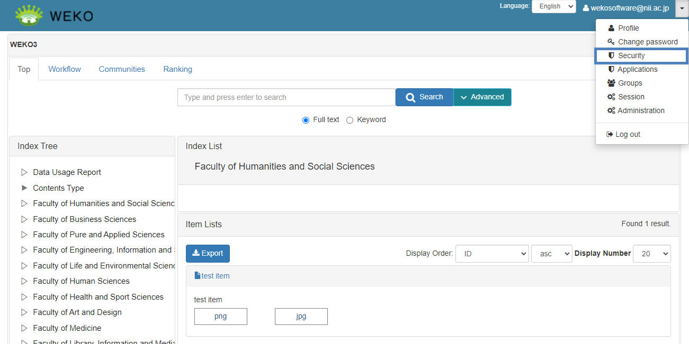

2.  Click the "Logout" or "Revoke" button as required.

The sessions are deleted.

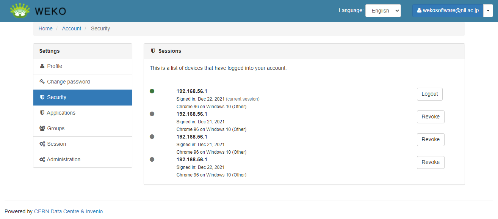

## Manage applications

This section explains how to manage applications. To access the screen where you can manage groups, select "Applications" from the user account pull-down menu in the upper right corner of the screen.

### View the authorized applications

This section explains how to view the authorized applications.

1.  Select "Applications" from the pull-down menu next to the user account displayed in the upper right corner of the screen.

A list of the authorized applications appears in "Authorized applications".

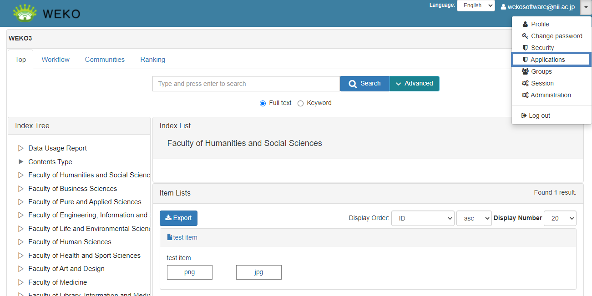

### Add an application

This section explains how to add an application.

1.  Under "Developer Applications", click "+ New application".

A screen appears where you can create an action.

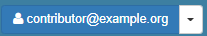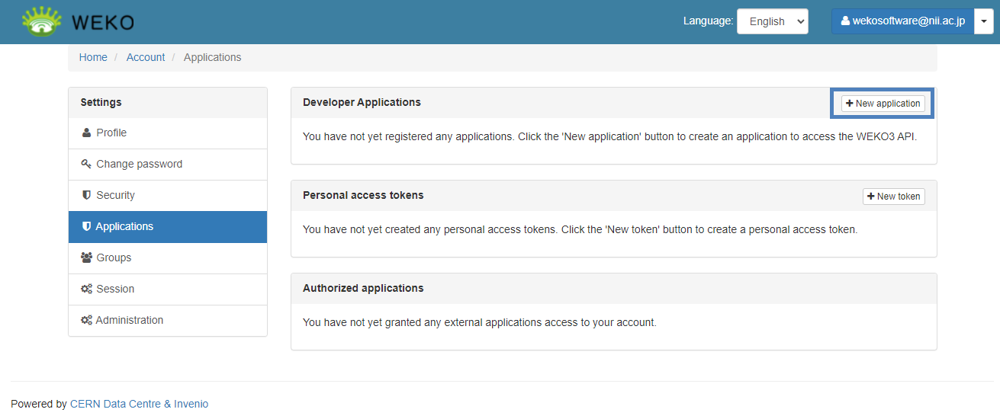

2.  Enter information for each element.

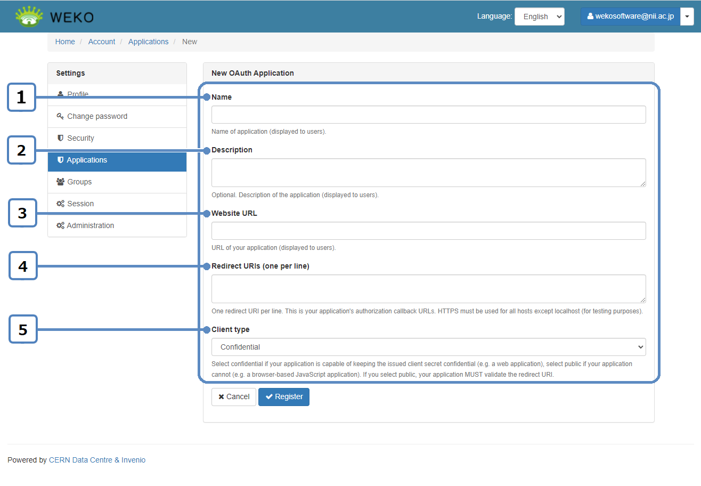

Table 10-2. The elements in the "New OAuth Application" screen

<table>
<thead>
<tr class="header">
<th>No.</th>
<th>Element</th>
<th>Description</th>
</tr>
</thead>
<tbody>
<tr class="odd">
<td>1</td>
<td>Name</td>
<td>Enter a name.</td>
</tr>
<tr class="even">
<td>2</td>
<td>Description</td>
<td>Enter a description of the application.</td>
</tr>
<tr class="odd">
<td>3</td>
<td>Website URL</td>
<td>Enter the URL of the application.</td>
</tr>
<tr class="even">
<td>4</td>
<td>Redirect URIs (one per line)</td>
<td>
Enter the destination URI to redirect to.

Enter one URI per line.
</td>
</tr>
<tr class="odd">
<td>5</td>
<td>Client type</td>
<td>Select a client type.</td>
</tr>
</tbody>
</table>

3.  Click "Register".

The application is added.

### Add an access token

This section explains how to add an access token.

1.  Under "Personal access tokens", click "+ New tokens".

A screen appears where you can create an action.

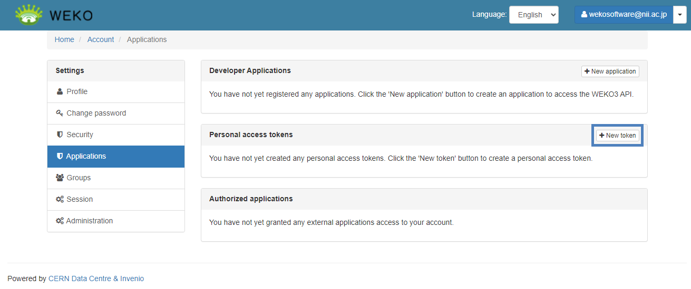

2.  Enter information for each element.

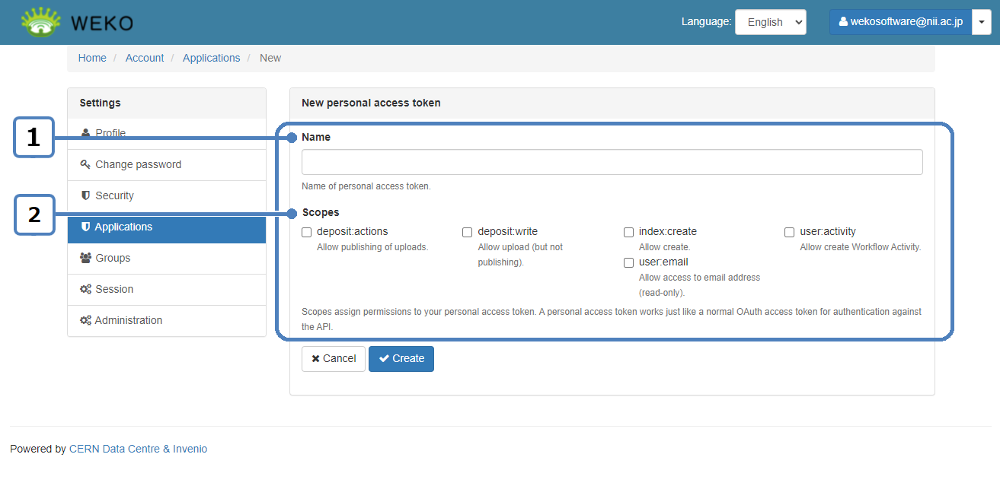

Table 10-3. The elements in the "New personal access token" screen

| No. | Element | Description     |
| --- | ------- | --------------- |
| 1   | Name    | Enter a name.   |
| 2   | Scopes  | Select a scope. |

3.  Click "Create".

The access token is added.

Note: A personal access token has no expiration date. Handle it with sufficient care, and be sure to delete it before your account is suspended.

## Join and view a group

This section explains how to join a group and view a group to which you belong.

### Join a group

This section explains how to join a group.

1.  Select "Groups" from the user account pull-down menu in the upper right corner of the screen.

The "Groups" screen appears.

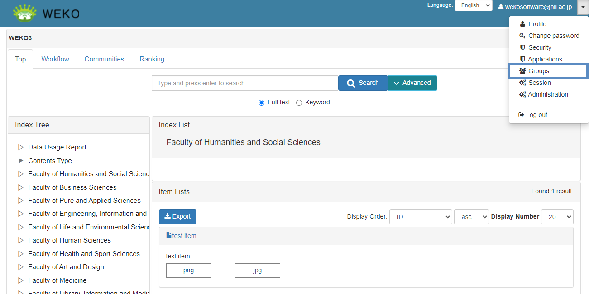

2.  The group to which you belong appears.

If there is an invitation to join a group, the display will look as follows.

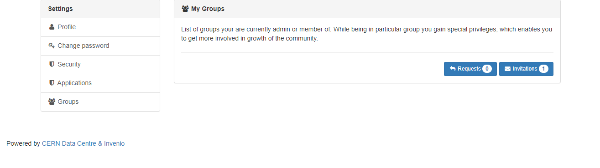

Click the "Invitations" button to display the group you are invited to join. Click "Accept".

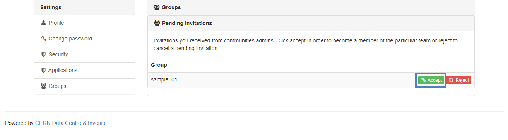Clicking the "Accept" button will update the display as follows.

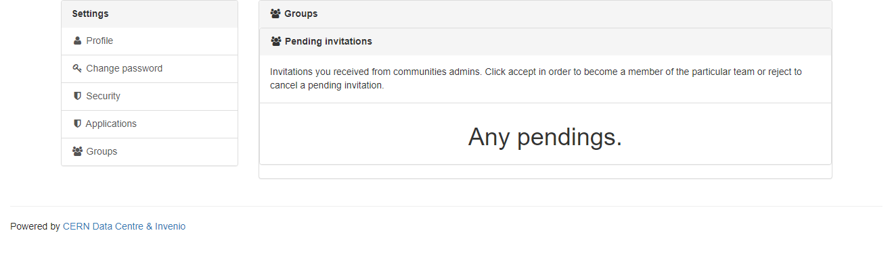

### View groups

This section explains how to view groups to which you belong.

1.  Select "Groups" from the user account pull-down menu in the upper right corner of the screen.

The "Groups" screen appears.

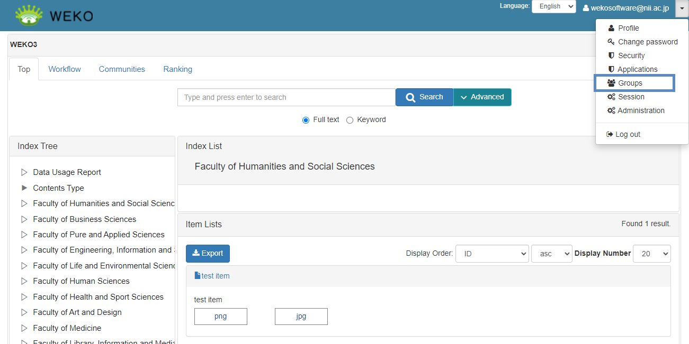

2.  The groups to which you belong appear.

If you do not belong to any group, the display will look as follows.

> If you belong to any groups, the display will look as follows.
> 
> 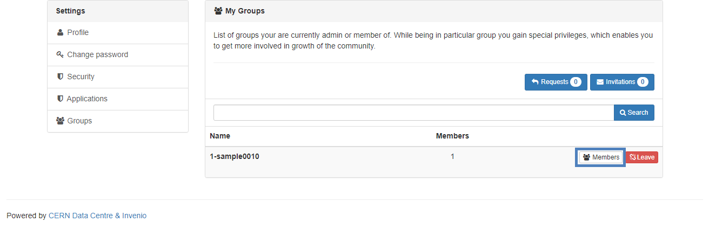

Click on the "Members" button to display details on the group.

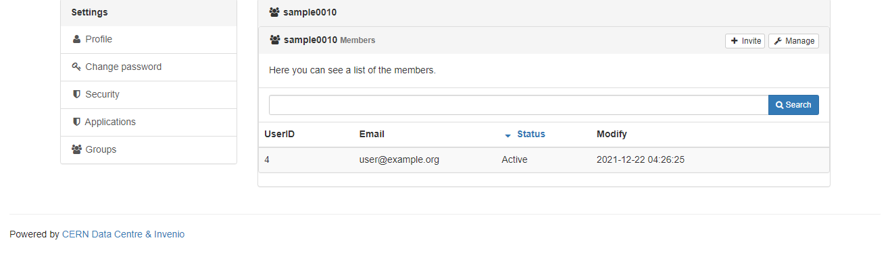

## Modify the session validity time

See the System Administration Manual for instruction.

## Display the Administration screen.

This section explains how to display the Administration screen.

1.  Log in with an administrator account.

See "Section 2.2. Log in to the System" for information on how to log in.

2.  Click  next to the account name in the upper right corner of the Home screen.

A pull-down menu appears.

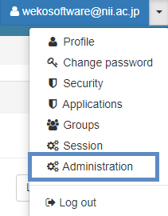

3.  Select Administration.

The Administration screen will be displayed. See the System Administration Manual for instruction.

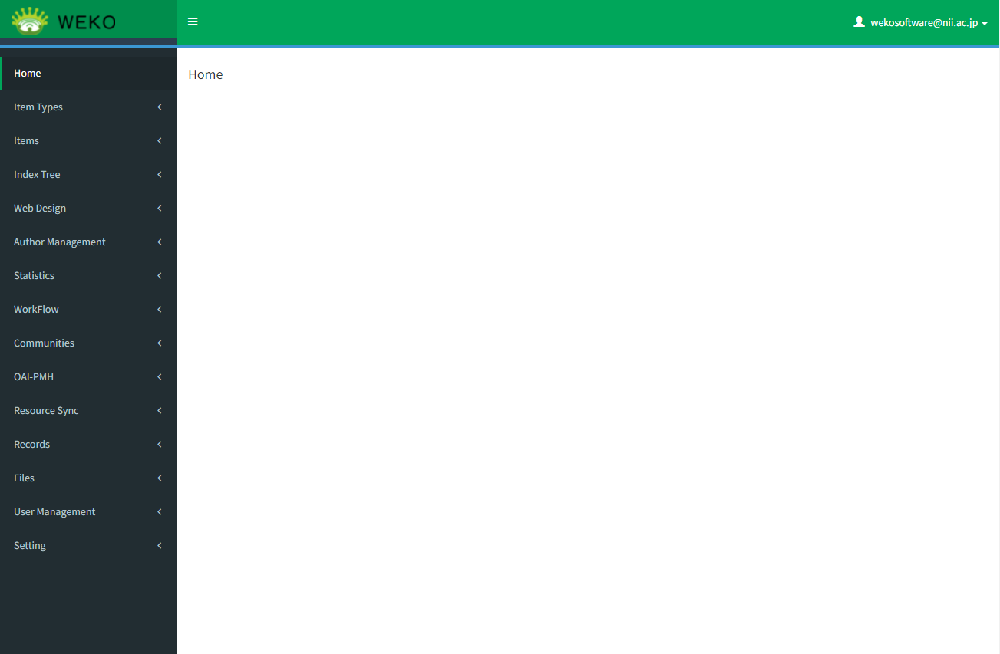

## Display the cookie consent screen

This section explains how to display the cookie consent screen.

1.  Scroll down the Home screen and click "Change consent settings" at the bottom of the screen.

    The cookie consent screen ("Services we would like to use") appears.

The following table shows the items displayed in the cookie consent screen.

Table 10-4. The items displayed in the cookie consent screen

| No. | Type        | Purpose                                                                                   | Application                     |
| --- | ----------- | ----------------------------------------------------------------------------------------- | ------------------------------- |
| 1   | JAIRO Cloud | Used to improve the quality of the JAIRO Cloud service. This item is required and cannot be disabled. | Google Analytics                |
| 2   | Analytics   | Analytics                                                                                 | Google Analytics, Facebook, X   |

After completing the settings according to your purpose, click the "Save" button to save the settings.

Note: The "Change consent settings" link is displayed only when `ENABLE_COOKIE_CONSENT = True` is set in the configuration file (instance.cfg). This setting is disabled (False) by default.

## Share non-public content using a one-time address

### Secret URL feature

When the Secret URL feature is enabled on the Administration screen, you can issue secret URLs.

A secret URL is a one-time address that can be issued by the contributor (including proxy contributors) of the item, system administrators, and repository administrators. Anyone who knows the URL can download the target content file.

**This feature does not grant new access permissions to, or restrict access via secret URLs to, public content or content that is accessible to site license users through the site license feature.**

The "Secret URL" button is added to the file area of the Information screen when the following conditions are met:

1.  The display of secret URLs is enabled in the "Restricted Access" screen of the Administration screen.

2.  The contributor of the item, a proxy contributor of the item, a repository administrator, or a system administrator is logged in.

3.  The file is set to "Do not Publish", or the file is set to "Input Open Access Date" and the specified date is in the future.

Note: That the index where the item is registered is public and that the Publish Status of the item is "Public" are not conditions for displaying the button. These conditions are checked when a file is downloaded through a secret URL, and if they are not met, the file cannot be downloaded through the secret URL.

When the Secret URL feature is enabled, the following items are added.

Table 10-5. The items displayed when the Secret URL feature is enabled

| No. | Element                 | Description                                                                                                                                                                                                                      |
| --- | ----------------------- | -------------------------------------------------------------------------------------------------------------------------------------------------------------------------------------------------------------------------------- |
| 1   | The "Secret URL" button | Click to display the area for creating a secret URL.                                                                                                                                                                             |
| 2   | Label Name              | Displayed when a secret URL has been created. Displays the link name given when the secret URL was created, or the identifier of the URL if no link name was given.                                                              |
| 3   | Create Date             | Displayed when a secret URL has been created. Displays the date and time when the secret URL was created.                                                                                                                         |
| 4   | Expiration Date         | Displayed when a secret URL has been created. Displays the expiration date of the secret URL.                                                                                                                                     |
| 5   | Download Count          | Displayed when a secret URL has been created. Displays the download count and the download limit of the secret URL.                                                                                                              |
| 6   | The "Delete" button     | Displayed when a secret URL has been created. Click to display a confirmation dialog box. Clicking the delete button in the dialog box deletes the secret URL. To cancel the deletion, click the close button to close the dialog box. |
| 7   | The "Copy" button       | Displayed when a secret URL has been created. Click to display a dialog box, and you can copy the issued secret URL to the clipboard. Click the close button in the dialog box to close it.                                      |

Click the "Secret URL" button to display the area for creating a secret URL.

The following table explains the items in the area for creating a secret URL.

Table 10-6. The items in the area for creating a secret URL

| No. | Element                        | Description                                                                                                                      |
| --- | ------------------------------ | -------------------------------------------------------------------------------------------------------------------------------- |
| 1   | The "Create Secret URL" button | Click to create a secret URL.                                                                                                    |
| 2   | The "Send Email" check box     | If you select this check box and click the "Create Secret URL" button, a notification email is sent to the account that clicked the "Secret URL" button. |
| 3   | Link Name                      | Enter the link name of the secret URL to create.                                                                                 |
| 4   | URL Expiry Date                | Select the expiration date of the secret URL to create from the calendar. The maximum expiration date is displayed below the field.   |
| 5   | Download Limit                 | Specify the download limit of the secret URL to create. The maximum download count is displayed below the field.                 |

# RSS

This chapter explains how to get the new arrivals from the WEKO RSS feed and subscribe to them for each index.

## Get new arrivals by RSS feed for each index

You can get the new arrivals by RSS feed for each index when the RSS icon display setting of the target index is set to "Display". See "Manage the index tree" in the System Administration Manual for more information.

1.  Display "Index List" so that the index for which you want to get the new arrivals is displayed. The RSS icon is displayed for the indexes for which the new arrivals by RSS feed are available.

2.  Click the RSS icon.

    The new arrivals are retrieved from the WEKO RSS feed, and the RSS of the corresponding item list is output.

## Get new arrivals by RSS feed for all indexes

You can get the new arrivals by RSS feed for all indexes when the New arrivals widget is displayed and the RSS feed setting of the widget is enabled. See "Managing widgets" in the System Administration Manual for more information.

1.  Display a screen that has the New arrivals widget. The RSS icon is displayed when the new arrivals by RSS feed are available.

2.  Click the RSS icon.

    The new arrivals are retrieved from the WEKO RSS feed, and the RSS of the corresponding item list is output.

# Workspace

This chapter provides information on the workspace, where you can view and register your own items.

## View the item list

This section explains how to display the item list in the workspace.

1.  Log in to the System and click the pull-down icon next to the account name in the upper right corner of the Home screen.

A pull-down menu appears. The workspace is available to all logged-in users.

2.  Select "Workspace".

The workspace item list screen appears.

  - The list shows the items owned by the logged-in user and the items for which the user is set as the proxy contributor.

  - If you have saved filter conditions, the list is displayed filtered by those conditions.

The following table explains the main elements of the workspace item list screen.

Table 12-1. The elements in the workspace item list screen

| No. | Element | Description |
| --- | ------- | ----------- |
| 1   | The search box ("Type and press enter to search") | Searches the item list by DOI, title, journal title, conference name and funding reference (funder name and award title). Press the Enter key after typing to run the search. The search is case-insensitive. If no item matches, the message "No results found matching your search criteria." appears. |
| 2   | User and affiliation information | Displays the user name and affiliation information. |
| 3   | The item registration button (folder icon) | Displays the item registration screen of the workspace. See "Register an item quickly" for more information. |
| 4   | The "Export Item List" button | Exports the item list to a TSV file. |
| [v2.1.0] 5   | The "Grouping by year" button | Groups the items by year. |
| 6   | The "Filter Display" button | Displays the filter condition panel. |
| 7   | Sort conditions | Sorts the items by "Publication Date", "Title", "Number of accesses" or "Number of downloads", in ascending or descending order. |
| 8   | Paging | Changes the number of items displayed per page to 20, 50 or 100. |
| 9   | Year labels | When the items are grouped by year, they are displayed under the label of each year. |
| [v2.1.0] 10  | Check boxes | Select items to be exported. The check box in the header selects all items. |
| 11  | Favorite and read/unread buttons | Switch the favorite status and the read/unread status of the item. |
| 12  | Item information | Displays the title (click to display the item details screen), journal title or conference name, volume (issue), whether document files exist, authors, publication date, related links and funding references. |
| 13  | Number of accesses and downloads | Displays the access count and download count of the item. |
| 14  | Resource type and status | Displays the resource type and the status linked with OA Assist, and whether feedback mail is set. |
| [v2.1.0] 15  | DOI | Displayed when a related identifier with the identifier type "DOI" and the relation type "isVersionOf" is registered in the related information of the item. Click to go to the DOI link (doi.org). |
| 16  | Edit | Displays the item edit screen. |
| 17  | Related information | When the item has related information, click the related link to display the relation type, the relation title and the relation URL. |
| 18  | Page navigation | Displays the previous page, the page numbers and the next page of the item list. |

Table 12-2. The elements in the filter condition panel

| No. | Element | Description |
| --- | ------- | ----------- |
| 1   | Filter conditions | Filter by "Resource Type", "Peer Review", "Related To Paper", "Related To Data", "Funding Reference - Funder Name", "Funding Reference - Award Title", "File" and "Favorite". |
| [v2.1.0] 2   | Tooltips | Truncated text of the options is displayed in a tooltip. |
| 3   | The "Filter" button | Filters the item list by the selected conditions. |
| 4   | The "Clear" button | Clears the filter conditions. |
| 5   | The "Save" button | Saves the selected filter conditions. |
| 6   | The "Reset" button | Resets the filter conditions. |

### Export the item list

1.  Click the "Export Item List" button.

A dialog for selecting the export method appears ("Please select the following option:").

Table 12-3. The elements in the export dialog

| No. | Element | Description |
| --- | ------- | ----------- |
| 1   | "Selected Items" | Exports only the items selected with the check boxes. |
| 2   | "All Items" | Exports all items in the workspace item list (if filter conditions are applied, the items that match the conditions). Results narrowed down by the search box are not reflected. |
| 3   | "Cancel" | Cancels the export. |

If you click "Selected Items" without selecting any items, the error message "Error: There is no Selected items. Please check the item you want to export" appears.

The exported TSV file is as follows.

  - The file name is in the format "itemlist\_export\_*YYYYMMDDhhmmss*.tsv", and the character encoding is UTF-8 (with BOM).

  - [v2.1.0] The first line contains column headers in the display language. The columns are output in the following order:

      - No. (the sequence number in the item list; the numbers in the list are output even for "Selected Items")

      - Favorite Status, Read Status, Peer Review Status (1 if applicable, otherwise 0)

      - Title, DOI Link, Resource Type, Author Name, Number of Accesses, Item Status, Journal Title, Conference Name, Volume, Issue, Funder Name, Award Title, Number of Downloads

      - Feedback Mail Status (1 or 0), Publication Date

      - Relation Type, Relation Title, Relation URL or DOI (comma-separated if there are multiple)

      - Related to Paper Status, Related to Data Status (1 or 0)

      - Number of Document Files, Number of Published Files, Number of Embargo Files, Number of Restricted Files

## Register an item quickly

This section explains how to register an item from the workspace.

1.  Click the item registration button (folder icon) in the workspace item list screen.

The item registration screen of the workspace appears.

2.  Enter a DOI in the "DOI Input" field and click the "Get" button.

[v2.1.0] The System tries to retrieve metadata from CrossRef, JaLC, CiNii, DataCite and arXiv. The radio buttons of the sources from which metadata was retrieved become selectable.

3.  [v2.1.0] Select a metadata source ("CrossRef MetaData", "JaLC MetaData", "CiNii MetaData", "DataCite MetaData" or "arXiv MetaData") with the radio buttons.

The retrieved metadata is entered automatically.

4.  Upload files using the file selection button in the "File" area.

5.  Select the index in which to register the item, and click the "Regist" button.

Table 12-4. The elements in the item registration screen of the workspace

| No. | Element | Description |
| --- | ------- | ----------- |
| 1   | "DOI Input" | Enter a DOI. |
| 2   | The "Get" button | Retrieves metadata for the entered DOI from each source. The radio buttons of the sources from which metadata was retrieved become active. |
| [v2.1.0] 3   | Metadata source radio buttons | Select the metadata source ("CrossRef MetaData", "JaLC MetaData", "CiNii MetaData", "DataCite MetaData" or "arXiv MetaData"). The metadata from the selected source is entered automatically. |
| 4   | "File" | Displays the uploaded files. The registrant can edit the file information. |
| 5   | "Metadata" | Set when the metadata is retrieved. You can also edit it. |
| 6   | OA policy information | Click the button for retrieving OA policy to retrieve the OA policy of the journal. ISSN, eISSN or journal title must be entered ("Please enter ISSN, eISSN, or journal title"). |
| 7   | "Index Tree" | Select the index in which to register the item. |
| 8   | The "Regist" button | Registers the item, either through a workflow or directly, according to the workflow setting for the workspace on the Administration screen. |
