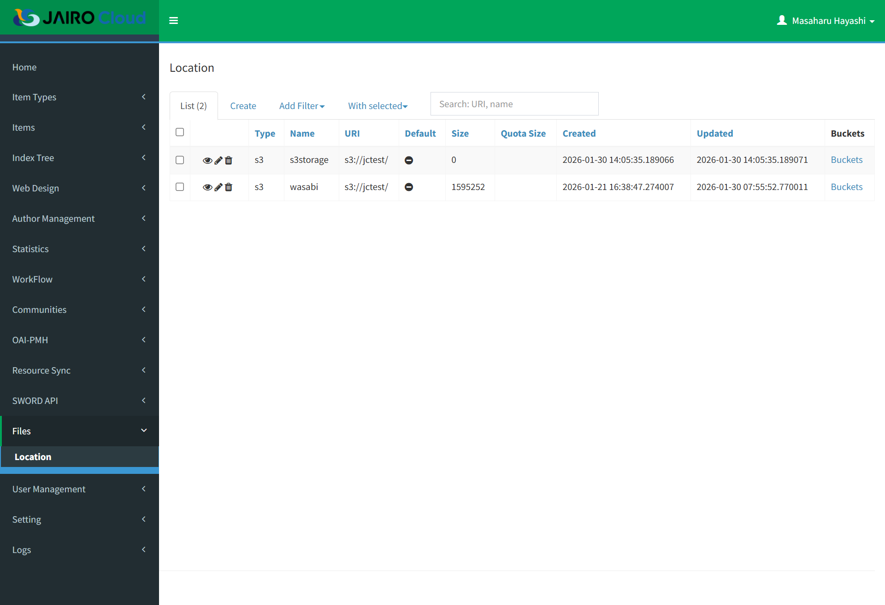
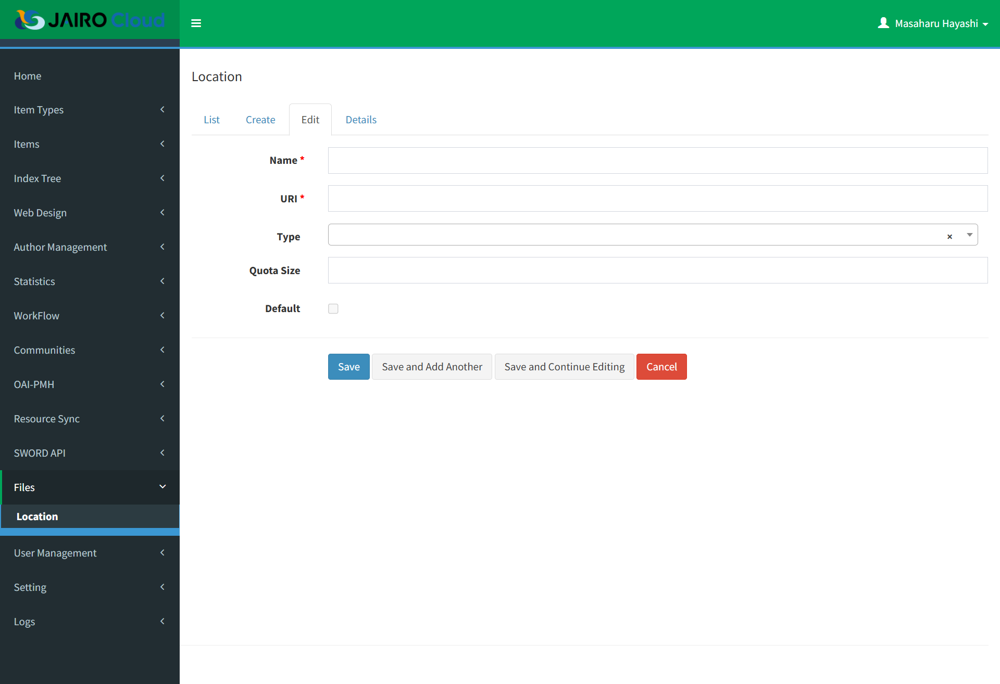
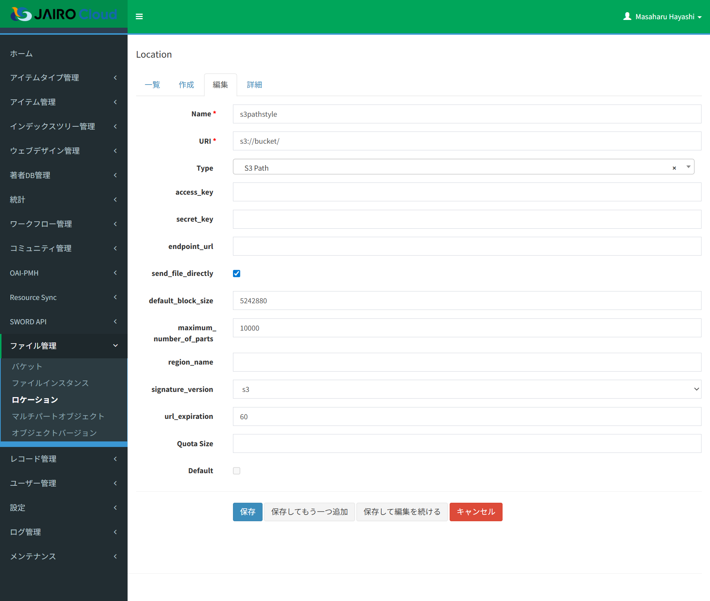
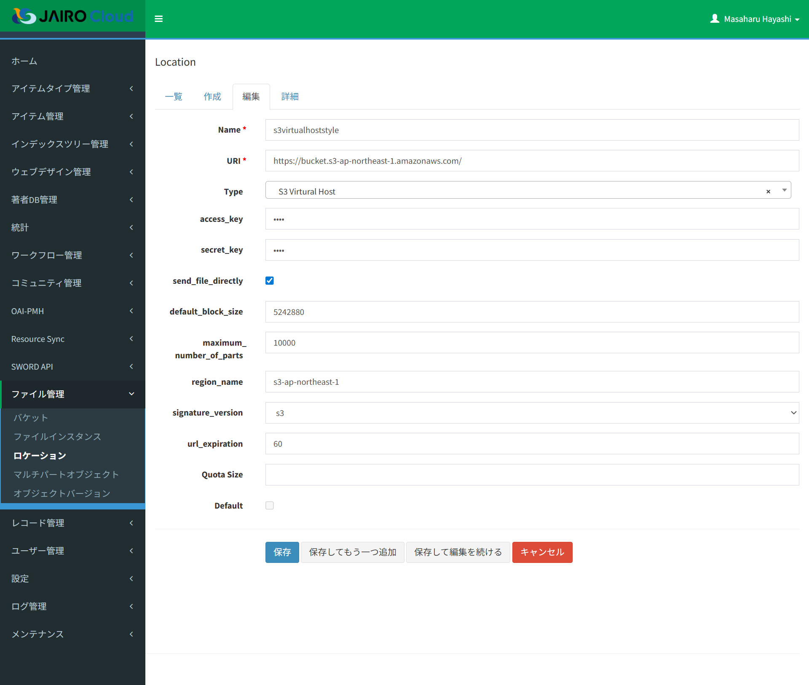

# ロケーション

## 目的・用途

本機能は、管理者として、アップロードしているファイルの配置先及びロケーションごとの使用量の情報を管理する機能である

## 利用方法

【Administration > ファイル管理（Files）> ロケーション（Location）】から、ロケーションの情報の閲覧、編集、作成をする。

## 利用可能なロール

| ロール | システム管理者 | リポジトリ管理者 | コミュニティ管理者 | 登録ユーザー | 一般ユーザー | ゲスト(未ログイン) |
|:---:|:---:|:---:|:---:|:---:|:---:|:---:|
| 利用可否 | ○ | ○※ | | | | |

- リポジトリ管理者はデフォルトに指定されたロケーションの操作ができない。

## 画面内容

### ロケーション一覧画面



- 【ロケーション（Location）画面】には以下のタブが表示される
  - 一覧（List）
  - 作成（Create）
  - フィルターを追加▼（Add Filter▼）
    - 一覧（List）タブ選択中のみ表示
    - 外観はタブだが機能としてはプルダウンメニュー
      - Default
      - Created
      - Updated
  - 選択▼（With selected▼）
    - 一覧（List）タブ選択中のみ表示
    - 外観はタブだが機能としてはプルダウンメニュー
      - 削除（Delete）
        - 選択したロケーションを削除

### ロケーション設定画面



- 【ロケーション（Location）設定画面】には以下のタブが表示される
  - 一覧（List）
  - 作成（Create）
  - 編集（Edit）
  - 詳細（Details）

### ロケーション一覧画面(S3互換オブジェクトストレージ)

- ロケーションタイプが「S3 Path」または「S3 Virtual Host」である場合の設定画面である。







## 機能内容

### ロケーションを一覧で表示する。
- 「一覧」（List）タブにロケーション一覧を表示する
  - 表示項目は以下の通りである
    - チェックボックス
    - アクション（閲覧・編集・削除）
    - 「Type」：ロケーションタイプ  
      押下すると一覧のロケーションをソートする。
    - 「Name」  
      押下すると一覧のロケーションをソートする。
    - 「URI」  
      押下すると一覧のロケーションをソートする。
    - 「Default」：デフォルトの状態  
      押下すると一覧のロケーションをソートする。
    - 「Size」：使用量の情報  
      押下すると一覧のロケーションをソートする。
    - 「Quota Size」：ロケーションの使用上限  
      押下すると一覧のロケーションをソートする。
    - 「Created」：ロケーションの作成時間  
      フォーマット：「YYYY-MM-DD hh:mm:ss.tttttt」  
      押下すると一覧のロケーションをソートする。
    - 「Updated」：ロケーションの更新時間  
       フォーマット：「YYYY-MM-DD hh:mm:ss.tttttt」  
       押下すると一覧のロケーションをソートする。
    - 「Buckets」リンク  
        リンクをクリックすると、【Admin > Files > Bucket画面】に移動し、当該ロケーションが属するバケット一覧がフィルターされる

- システム管理者以外はデフォルト指定されたロケーションを表示および操作することができない。

### ロケーション一覧をフィルタ表示する。

- 「フィルターを追加▼」（Add Filter▼）ボタンをクリックすると、以下の追加可能なフィルターリストを表示し、フィルター名をクリックすると当該フィルタの入力エリアを追加する
  - フィルター名
    - 「Default」
      - フィルター方式の選択肢：等しい（equals）、等しくない（not equal）
      - 選択したフィルター方式に対して「はい」「いいえ」
    - 「Created」
      - フィルター方式の選択肢：等しい（equals）、等しくない（not equal）、より大きい（greater than）、より小さい（smaller than）、間（between）、間ではなく（not between）、空（empty）
      - 入力された文字列を使い、選択したフィルター方式で絞り込む
    - 「Updated」
      - フィルター方式の選択肢：「Created」と同じである
        - 入力された文字列を使い、選択したフィルター方式で絞り込む
  - 設定したフィルターは「適用」（Apply）ボタンを押下することで一覧に適用される
  - 「フィルターをリセット」（Reset filter）ボタンを押下すると、設定したフィルターがリセットされる

### 指定したロケーションを一括削除する。

- 「選択▼」（With selected▼）ボタンをクリックすると、以下の追加可能な機能（現在削除ボタンのみ）を表示する
  - レコードにチェックを入れない場合、「削除」（Delete）ボタンを押すと、エラーメッセージを表示する  
    メッセージ：  
      日本語：「少なくとも一つのレコードを選択してください。」  
      英語：「Please select at least one record.」

  - レコードにチェックを入れる場合、「削除」（Delete）ボタンを押すと、確認ダイヤログを表示する  
    メッセージ：  
      日本語：「選択したレコードを削除してもよろしいですか。」  
      英語：「Are you sure you want to delete selected records?」
      - 「OK」ボタンを押すと、該当ロールを削除し、メッセージを画面上部に表示する  
        メッセージ：  
          日本語：「レコード数＋レコードが正常に削除されました。」  
          英語：「Record was successfully deleted.」      
      - 「キャンセル」（Cancel）ボタンを押すと、確認ダイヤログを閉じる

### ロケーションを検索する

- 検索テキストボックスでロケーションを検索する
  - プレースホルダー：「Search: URI, name」
    - 任意テキストを入力し、キーボードでの「Enter」を押すと、ロケーション検索を行う
    - テキストボックスの右端での「X」ボタンを押すと、検索条件がクリアーされる

### ロケーションの詳細を表示する

- ロケーション行に目アイコンを押すと、該当ロケーションの詳細情報を「詳細」（Details）タブに表示する
  - 表示項目：Type、Name、URI、Default、Size、Quota Size、Created、Updated、Buckets

### バケットを表示する

- 「Buckets」リンクをクリックすると、【Administration > Files (ファイル管理) > Bucket (バケット) 画面】に移動し、当該ロケーションが属するバケット一覧がフィルターされる

### ロケーションを作成する

- 「一覧」（List）から「作成」（Create）タブを押すと、「編集」(edit)タブに移動しロケーションを新規作成できる
  - 入力情報：
    - 「Name」：ロケーションを識別するための名前。必須項目
      入力パターン：`^[a-z][a-z0-9-]+$`
    - 「URI」：必須項目
    - 「Type」：ロケーションのタイプ。
      選択肢：「」「S3 Path」、「S3 Virtual Host」
    - 「access_key」：S3互換オブジェクトストレージのアクセスキー  
     「Type」に「S3 Path」、「S3 Virtual Host」を選択する時表示する
    - 「secret_key」：S3互換オブジェクトストレージのシークレットキー  
      「Type」に「S3 Path」、「S3 Virtual Host」を選択する時表示する
    - 「endpoint_url」：S3互換オブジェクトストレージのエンドポイントURL  
      「Type」に「S3 Path」を選択する時表示する  
       保存時、入力内容の末尾に'/'が無い場合、補完する
    - 「send_file_directly」： ストレージからの直接ダウンロードとするか、Webアプリを経由しての間接ダウンロードとするか。チェックを外すと、ストレージからの直接ダウンロードとなる。
      「Type」に「S3 Path」、「S3 Virtual Host」を選択する時表示するチェックボックス  
        デフォルト：チェックあり
    - 「default_block_size」  
      「Type」に「S3 Path」、「S3 Virtual Host」を選択する時表示する  
      デフォルト：5242880
    - 「maximum_number_of_parts」  
      「Type」に「S3 Path」、「S3 Virtual Host」を選択する時表示する  
        デフォルト：10000
    - 「region_name」  
      「Type」に「S3 Path」、「S3 Virtual Host」を選択する時表示する  
      「Type」に「S3 Path」、「S3 Virtual Host」を選択している場合、必須項目
    - 「signature_version」：署名バージョン。通常はs3v4を選択します。動かない場合はs3に変更してください。  
      「Type」に「S3 Path」、「S3 Virtual Host」を選択する時表示する  
        選択肢：s3、s3v4
    - 「url_expiration」  
      「Type」に「S3 Path」、「S3 Virtual Host」を選択する時表示する  
      デフォルト：60
    - 「Quota Size」：使用上限
    - 「Default」  
       既にデフォルト設定されたロケーションが存在する場合は非活性で表示する  
      デフォルト：チェックなし
  - 「保存」（Save）ボタンを押すと、設定内容をバリデーションチェックし、エラーがない場合、設定されたロケーション内容をロケーション一覧に追加させ、メッセージをロケーション一覧に表示させる  
    メッセージ：  
      日本語：「レコードが正常に作成されました。」  
      英語：「Record was successfully created.」

  - 各種設定はデータベースに格納される
    - テーブル名：「files_location」
      - フィールド名：  
        ・「id」  
        ・「name」  
        ・「uri」  
        ・「default」  
        ・「type」  
        ・「access_key」  
        ・「secret_key」  
        ・「size」  
        ・「quota_size」  
        ・「max_file_size」
        ・「s3_endpoint_url」
        ・「s3_send_file_directly」
        ・「s3_default_block_size」
        ・「s3_maximum_number_of_parts」
        ・「s3_region_name」
        ・「s3_signature_version」
        ・「s3_url_expiration」

  - エラーメッセージは以下の通りである
    - 必須項目を指定しない場合、エラーメッセージを該当テキストボックスの下に表示する  
      メッセージ：  
        日本語：「このフィールドは必須です。」  
        英語：「This field is required.」
    - 「Name」のフォーマットが不正の場合、エラーメッセージを「Name」テキストボックスの下に表示する  
        メッセージ：「Invalid location name.」

  - 「デフォルト設定 (default=True)」を有効にした場合に、他のロケーションが既にデフォルトに設定されていると、保存を中止して画面上部にエラーメッセージを表示する。  
    メッセージ：  
      日本語：「他のロケーションがすでにデフォルトに設定されているため、保存できません。」
      英語：「Cannot save because another location is already set as default.」

  - 「uri」が「https://」から始まらない場合エラーメッセージを表示する  
      メッセージ：「Invalid URL. It should start with https://」

  - 「保存してもう一つ追加」（Save and Add Another）ボタンを押すと、設定されたロケーション内容をロケーション一覧に追加させ、他のロケーションを追加設定可能とする  
    メッセージを画面上部に表示させる  
      メッセージ：  
        日本語：「レコードが正常に作成されました。」  
        英語：「Record was successfully created.」

  - 「保存して編集を続ける」（Save and Continute Editing）ボタンを押すと、設定されたロケーション内容をロケーション一覧に追加させ、該当ロケーションの編集を続けることを可能とする  
    メッセージを画面上部に表示させる  
      メッセージ：  
        日本語：「レコードが正常に作成されました。」  
        英語：「Record was successfully created.」

- 「キャンセル」（Cancel）ボタンを押すと、設定されたロケーション内容をロール一覧に追加せず、「一覧」（List）タブに戻る


### ロケーションを編集する

- ロケーション行に鉛筆アイコンを押すと、該当ロケーションを「編集」（Edit）タブに表示し、ロケーションの情報が編集できる

### ロケーションを削除する

- ロケーション行に削除アイコンを押すと、該当ロケーションを削除し、メッセージを画面上部に表示する  
  メッセージ：  
    日本語：「レコード数＋レコードが正常に削除されました。」  
    英語：「Record was successfully deleted.」

- デフォルトに設定されたロケーションが0件または2件以上存在する場合に警告メッセージを表示する。
  - 0件の場合：
    - 日本語：「デフォルトに設定されたロケーションが存在しません。いずれか1つのロケーションをデフォルトに設定してください。」
    - 英語：「No default location is set. Please configure one location as default.」
      - 2件以上の場合：
        - 日本語：「複数のロケーションがデフォルトに設定されています。デフォルトのロケーションは1つのみ設定可能です。設定を修正してください。」
        - 英語：「Multiple locations are set as default. Only one default location can be configured. Please correct the settings.」

### ロケーション毎の使用量を確認する

- ロケーションごとの使用量（Size）を確認できる
      - 「一覧」（List）タブ及び「詳細」（Detail）タブに確認できる
      - 「Size」の値について
          - 当該ロケーション配下に登録されているコンテンツファイルのサイズ合計
          - 使用量の合計はコンテンツアップロード時に集計する
          - 以下のファイルはシステムで自動削除し、使用量に集計されないようにする
              - ワークフローで強制終了したアクティビティに登録していたファイル
              - アイテム登録後に削除したファイル
          - ファイルアップロード時に Quota Size を越えるときの判定条件として利用する  
            Location で表⽰される Size ＋ アップロードした Size ＞ Quota Size で判定する

### ストレージの使用状況をメールする

- 設定キー：「update_location_size」
  - 合計された「Size」の値はデータベースに保存し、表示の際はデータベースに保存した値をつかう
  - リポジトリ管理者として、ストレージ使用状況をメール通知で確認できる  
    ロケーションの「Size」が指定された閾値を超えていた場合、当該ロケーションが属する機関のリポジトリ管理者にメール通知を行う

- メール通知は定期実行とし、実行頻度はコンフィグファイルに変更可能とする
  - 設定キー：「storage_check_settings」
  - デフォルトは週次とする
    - ロケーションの「Size」が指定する閾値を超えた場合メール通知の対象する
    - ロケーションの「Quota Size」が設定されていない場合は処理の対象としない
    - 閾値はコンフィグファイルに指定する
      - 設定キー：「storage_check_settings」
        - デフォルトは、Quota Sizeに対して「80％」とする
      - 通知先は「リポジトリ管理者」ロールを持つユーザーとする
      - メール本文は以下の資料を参照する  
        別紙「ディスク容量メールひな形.docx」を参照。


## 関連モジュール

- invenio-files-rest

## 処理概要

- ロケーション画面の処理
  - ロケーション画面を表示した際に、`invenio_files_rest.admin.LocationModelView`が継承した`ModelView`より`flask_admin.model.base.index_view`メソッドが呼び出される。このメソッドで`files_location`テーブルより情報を取得し、`LocationModelView`の`column_list`にあるキーに対応する情報を画面に表示する。

  - 目アイコンを押下してロケーション詳細情報を表示する際に、`invenio_files_rest.admin.LocationModelView`が継承した`ModelView`より`flask_admin.model.base.details_view`メソッドを呼び出す。このメソッド下で`files_location`テーブルより情報を取得し、`LocationModelView`の`column_details_list`にあるキーに対応する情報を画面に表示する。

  - 鉛筆アイコンを押下して編集画面を表示する際に、`invenio_files_rest.admin.LocationModelView`が継承した`ModelView`より`flask_admin.model.base.edit_view`メソッドをGETで呼び出す。このメソッドでidを用いて、`files_location`テーブルより情報を取得し、表示する。

  - 編集画面で「保存」ボタンを押下する。そうすると、`flask_admin.model.base.edit_view`メソッドをPOSTで呼び出す。このメソッド下で、`get_save_return_url`メソッドが呼ばれ、編集内容を`files_location`テーブルに保存し、更新する。

  - 保存時には`LocationModelView.on_model_change()`メソッド内でバリデーションを実行する。保存対象のロケーションが`default=True`に設定されている場合、他に`default=True`のロケーションが存在しないかを確認する。存在する場合は`ValidationError`を発生させ、保存を中止し、画面上部にエラーメッセージを表示する。

  - 削除アイコンを押下した際に、`invenio_files_rest.admin.LocationModelView`が継承した`ModelView`より`flask_admin.model.base.delete_view`メソッドをGETで呼び出して`files_location`テーブルから削除する。

  - 作成タブを押下した際に、`invenio_files_rest.admin.LocationModelView`が継承した`ModelView`より`flask_admin.model.base.create_view`メソッドをGETで呼び出す。`LocationModelView`の`form_columns`の項目の入力欄を表示する。

  - 入力欄に入力後「保存」ボタンを押下する。そうすると、`invenio_files_rest.admin.LocationModelView`が継承した`ModelView`より`flask_admin.model.base.create_view`メソッドをPOSTで呼び出す。このメソッド下で`get_save_return_url`メソッドが呼ばれ、新しいバケットの情報を`files_bucket`テーブルに保存する。

  - 保存時には`LocationModelView.on_model_change()`メソッド内でバリデーションを実行する。保存対象のロケーションが`default=True`に設定されている場合、他に`default=True`のロケーションが存在しないかを確認する。存在する場合は`ValidationError`を発生させ、保存を中止し、画面上部にエラーメッセージを表示する。

  - ロケーションの使用量合計はコンテンツアップロード時に集計する
    - パス：<https://github.com/RCOSDP/weko/blob/v0.9.22/modules/invenio-files-rest/invenio_files_rest/utils.py#L123-L131>

  - メール通知の定期実行を設定する
    - パス：<https://github.com/RCOSDP/weko/blob/v0.9.22/scripts/populate-instance.sh#L460-L462>
    - 設定キー：「storage_check_settings」
    - 現在の設定値：
      ```
      ${INVENIO_WEB_INSTANCE} admin_settings create_settings \
          2 "storage_check_settings" \
          "{'threshold_rate': 80, 'cycle': 'weekly', 'day': 0}"
      ```

  - バケットごとでの使用上限（QUOTA_SIZE）を設定する
    - パス：<https://github.com/RCOSDP/weko/blob/v0.9.22/modules/weko-deposit/weko_deposit/config.py#L27>
    - 設定キー：「WEKO_BUCKET_QUOTA_SIZE」
    - 現在の設定値：
      ```
      WEKO_BUCKET_QUOTA_SIZE = 50 * 1024 * 1024 * 1024  # 50 GB
      ```

  - 一つのファイルの最大容量を設定する
    - パス：<https://github.com/RCOSDP/weko/blob/v0.9.22/modules/weko-deposit/weko_deposit/config.py#L30>
    - 設定キー：「WEKO_MAX_FILE_SIZE」
    - 現在の設定値：
      ```
      WEKO_MAX_FILE_SIZE = WEKO_BUCKET_QUOTA_SIZE
      ```


### 保存先

#### Path Style URL

Path Styleの場合、
管理画面で設定したURIが「s3://jctest/」とすると、
オブジェクトの保存先は例えば以下のようになる。

```
jctest/b6/a5/1012-dea5-4ca0-82e1-ee6c9fed8908/data
```

#### Virtual Hosted Style

Virtual Hosted Styleの場合、
管理画面で設定したURIが「https://jctest.s3.ap-northeast-1-ntt.wasabisys.com/」とすると、
オブジェクトの保存先は例えば以下のようになる。

```
jctest/jctest/b6/a5/1012-dea5-4ca0-82e1-ee6c9fed8908/data
```


## 実装補足（v2.0.2 実装との突き合わせ）

- 画面/ハンドラ：`invenio_files_rest.admin.LocationModelView`（テーブル `files_location`、endpoint `location`）。`can_create`/`can_edit`/`can_delete` はいずれも System Administrator **と** Repository Administrator の両ロールに許可（環境変数 `INVENIO_ROLE_SYSTEM`/`INVENIO_ROLE_REPOSITORY`）。Repository 管理者は既定ロケーション（`default=True`）を操作不可（`get_query` が `default=False` に限定）。
- 実装補足（訂正）：「URI は https:// で始まること」の検証は **S3 Virtual Host 型のときのみ**適用される。`s3_signature_version` は作成時に None にされる（フォーム選択値は破棄）。Type の選択肢は config `FILES_REST_LOCATION_TYPE_LIST`（`s3` / `s3_vh`）。`slug` は `^[a-z][a-z0-9-]+$`。

## 更新履歴

| 日付 | GitHubコミットID | 更新内容 |
|:---:|:---:|:---:|
| 2023/08/31 | 353ba1deb094af5056a58bb40f07596b8e95a562 | 初版作成 |
