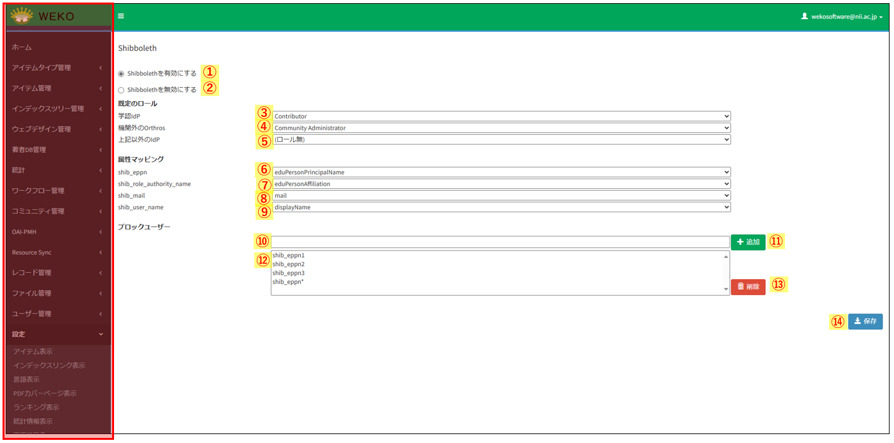
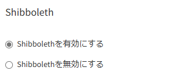
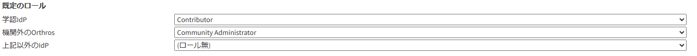
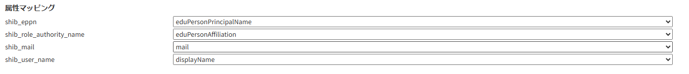
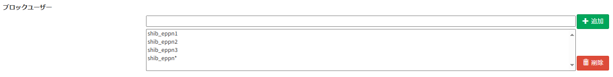

### Shibboleth

  - > 目的・用途

本画面の機能は以下の通りである。 

  ・システム利用者がログインする際のシボレスユーザーの許可／拒否を設定

  ・システム利用者のデフォルトロールの設定

  ・Shibboleth 属性と WEKO3 属性値のマッピング操作

  ・ブロックユーザーの管理

  - > 利用方法

【Administration \> 設定（Setting） \> Shibboleth画面】にて操作を行う。

  - > 利用可能なロール

<table>
<thead>
<tr class="header">
<th>ロール</th>
<th>システム 
管理者</th>
<th>リポジトリ 
管理者</th>
<th>コミュニティ 
管理者</th>
<th>登録ユーザー</th>
<th>一般ユーザー</th>
<th>ゲスト 
(未ログイン)</th>
</tr>
</thead>
<tbody>
<tr class="odd">
<td>利用可否</td>
<td>○</td>
<td>○</td>
<td></td>
<td></td>
<td></td>
<td></td>
</tr>
</tbody>
</table>

  - > 画面説明
      - 図 1 管理画面：Shibboleth 
        

<table>
<thead>
<tr class="header">
<th>No</th>
<th>項目名</th>
<th>表示</th>
<th>形式</th>
<th>I/O</th>
<th>データ取得元API</th>
<th>備考</th>
</tr>
</thead>
<tbody>
<tr class="odd">
<td>①</td>
<td>Shibboleth有効化</td>
<td>Shibbolethを有効にする</td>
<td>ラジオボタン</td>
<td>N/A</td>
<td></td>
<td>Shibboleth認証によるログインを有効化する。</td>
</tr>
<tr class="even">
<td>②</td>
<td>Shibboleth無効化</td>
<td>Shibbolethを無効にする</td>
<td>ラジオボタン</td>
<td>N/A</td>
<td></td>
<td>Shibboleth認証によるログインを無効化する。</td>
</tr>
<tr class="odd">
<td>③</td>
<td>[学認IdP]経由ログイン デフォルトロール設定</td>
<td>[ System Administrator, Repository Administrator, Contributor, Community Administrator, （ロール無）]</td>
<td>リストボックス</td>
<td>N/A</td>
<td></td>
<td>[学認IdP]経由でログインしたユーザーのデフォルトロールを設定する。 
</td>
</tr>
<tr class="even">
<td>④</td>
<td>[機関外のOrthros]経由ログイン デフォルトロール設定</td>
<td>[ System Administrator, Repository Administrator, Contributor, Community Administrator, （ロール無）]</td>
<td>リストボックス</td>
<td>N/A</td>
<td></td>
<td>[機関外のOrthros]経由でログインしたユーザーのデフォルトロールを設定する。</td>
</tr>
<tr class="odd">
<td>⑤</td>
<td>[上記以外のIdP]経由ログイン デフォルトロール設定</td>
<td>[ System Administrator, Repository Administrator, Contributor, Community Administrator, （ロール無）]</td>
<td>リストボックス</td>
<td>N/A</td>
<td></td>
<td>[学認IdP]、[Orthros]以外の方法でログインしたユーザーのデフォルトロールを設定する。</td>
</tr>
<tr class="even">
<td>⑥</td>
<td>shib_eppn 属性マッピング</td>
<td>['mail', 'sn', 'o', 'ou', 'givenName', 'displayName', 'eduPersonAffiliation', 'eduPersonPrincipalName', 'eduPersonEntitlement', 'eduPersonScopedAffiliation', 'eduPersonTargetedID', 'eduPersonAssurance', 'eduPersonUniqueId', 'eduPersonOrcid']</td>
<td>リストボックス</td>
<td>N/A</td>
<td></td>
<td>初期値は'eduPersonPrincipalName'</td>
</tr>
<tr class="odd">
<td>⑦</td>
<td>shib_role_authority_name 属性マッピング</td>
<td>['mail', 'sn', 'o', 'ou', 'givenName', 'displayName', 'eduPersonAffiliation', 'eduPersonPrincipalName', 'eduPersonEntitlement', 'eduPersonScopedAffiliation', 'eduPersonTargetedID', 'eduPersonAssurance', 'eduPersonUniqueId', 'eduPersonOrcid']</td>
<td>リストボックス</td>
<td>N/A</td>
<td></td>
<td>初期値は'eduPersonAffiliation'</td>
</tr>
<tr class="even">
<td>⑧</td>
<td>shib_mail 属性マッピング</td>
<td>['mail', 'sn', 'o', 'ou', 'givenName', 'displayName', 'eduPersonAffiliation', 'eduPersonPrincipalName', 'eduPersonEntitlement', 'eduPersonScopedAffiliation', 'eduPersonTargetedID', 'eduPersonAssurance', 'eduPersonUniqueId', 'eduPersonOrcid']</td>
<td>リストボックス</td>
<td>N/A</td>
<td></td>
<td>初期値は'mail'</td>
</tr>
<tr class="odd">
<td>⑨</td>
<td>shib_user_name 属性マッピング</td>
<td>['mail', 'sn', 'o', 'ou', 'givenName', 'displayName', 'eduPersonAffiliation', 'eduPersonPrincipalName', 'eduPersonEntitlement', 'eduPersonScopedAffiliation', 'eduPersonTargetedID', 'eduPersonAssurance', 'eduPersonUniqueId', 'eduPersonOrcid']</td>
<td>リストボックス</td>
<td>N/A</td>
<td></td>
<td>初期値は'displayName'</td>
</tr>
<tr class="even">
<td>⑩</td>
<td>ブロックユーザー ePPN入力欄</td>
<td></td>
<td>テキストボックス</td>
<td>N/A</td>
<td></td>
<td>アカウント作成前にブロックしたい新規ユーザーのePPNを入力する。 
ワイルドカードでの指定も可能。</td>
</tr>
<tr class="odd">
<td>⑪</td>
<td>ブロックユーザー 追加ボタン</td>
<td>追加</td>
<td>ボタン</td>
<td>N/A</td>
<td></td>
<td>⑩で入力したePPNを⑫ブロックユーザー一覧に登録する。</td>
</tr>
<tr class="even">
<td>⑫</td>
<td>登録済み ブロックユーザー一覧</td>
<td></td>
<td>セレクトボックス</td>
<td>N/A</td>
<td></td>
<td>登録済みのブロックユーザー一覧。</td>
</tr>
<tr class="odd">
<td>⑬</td>
<td>登録済み ブロックユーザー削除ボタン</td>
<td>削除</td>
<td>ボタン</td>
<td>N/A</td>
<td></td>
<td>⑫のリストから選択したユーザーを一覧から削除できる。</td>
</tr>
<tr class="even">
<td>⑭</td>
<td>保存ボタン</td>
<td>保存</td>
<td>ボタン</td>
<td>O</td>
<td></td>
<td>設定画面での変更内容を保存する。</td>
</tr>
</tbody>
</table>

<!-- end list -->

### シボレスユーザーの許可拒否を設定

  - > 機能内容

      - 画面には以下のラジオボタンがあり、現在の許可/拒否設定を反映して表示される。 

        図 2 
        

          - 「Shibbolethを有効にする」(Enable Shibboleth Authentication)

              - シボレスユーザーを許可とし、「Shibboleth User」ボタンをログイン画面に表示させる。

          - 「Shibbolethを無効にする」（Disable Shibboleth Authentication）

              - シボレスユーザーを拒否とし、「Shibboleth User」ボタンをログイン画面に表示させない。

      - ［保存（Save）］ボタンを押すと、設定内容を保存し、以下のメッセージを画面上部に表示する。  
        JP：「Shibboleth設定を更新しました」  
        EN：「Updated Shibboleth settings」
  - > 関連モジュール

      - weko\_accounts

  - > 処理概要

      - 画面表示時に、weko\_accounts.admin.ShibSettingView.index 関数を GET で呼び出して、instance.cfg または weko-accounts で以下のコンフィグから Shibbolethの許可設定を読み込む。 
      両方で設定されている場合、instance.cfgの設定が優先される。また、画面で設定を変更した場合は、その変更が最優先される。

          - パス（instance.cfg）：  
            <https://github.com/RCOSDP/weko/blob/v0.9.22/scripts/instance.cfg#L436>

          - パス（config.py）：  
            <https://github.com/RCOSDP/weko/blob/v0.9.22/modules/weko-accounts/weko_accounts/config.py#L29>

          - 設定キー：WEKO\_ACCOUNTS\_SHIB\_LOGIN\_ENABLED

      - ［保存（Save）］ボタンを押すと、weko\_accounts.admin.ShibSettingView.index関数をPOSTで呼び出して、以下のようにしてコンテキストに設定を保存する。

> \_app = LocalProxy(lambda: current\_app.extensions\['weko-admin'\].app)
>
> ※上記はShibSettingViewクラスの外で定義
>
> if shib\_flg != new_shib_flg:
>
> shib\_flg = request.form.get('shibbolethRadios', '0')
>
> if shib\_flg == '1':
>
> \_app.config\['WEKO\_ACCOUNTS\_SHIB\_LOGIN\_ENABLED'\] = True
>
> else:
>
> \_app.config\['WEKO\_ACCOUNTS\_SHIB\_LOGIN\_ENABLED'\] = False

### デフォルトロールの設定

  - > 機能内容

      - [既定のロール]ではシステム利用者のデフォルトロールを設定することができる。 

        図 3 
        

      - 候補として選択できるロールは以下の 5 種類

          - System Administrator(システム管理者)

          - Repository Administrator(リポジトリ管理者)

          - Community Administrator(コミュニティ管理者)

          - Contributor(登録ユーザー)

          - ロール無(一般ユーザー)

      - システム利用者は以下のように分類されており、それぞれのデフォルトロールを変更することができる。

          - [学認 IdP]

              - 学認 IdP からログインしたシステム利用者のデフォルトロールを設定できる。

                初期値は「Contributor(登録ユーザー)」

          - [機関外の Orthros]

              - 機関外の Orthros からログインしたシステム利用者のデフォルトロールを設定できる。

                初期値は「Community Administrator(コミュニティ管理者)」

                ※[機関内の Orthros]からログインしたシステム利用者には「Repository Administrator(リポジトリ管理者)」が付与される。

                [機関内の Orthros]は設定画面からは変更しない。

          - [上記以外の IdP]

              - 上記以外の IdP からログインしたシステム利用者のデフォルトロールを設定できる。

                初期値は「ロール無(一般ユーザー)」

          - ※(補足)「機関内外」の判定方法

              - 機関内外の判定は GakuNinmAP から取得できる[o]属性('organizationName')で判定する。

                取得した[o]属性が[機関の'organizationName']と一致したら[機関内]と判定することができる。

      - ［保存（Save）］ボタンを押すと、設定内容を保存し、以下のメッセージを画面上部に表示する。

        (例：学認 IdP のロールを更新した場合)  
        JP：「学認 IdP のロール設定を更新しました」  
        EN：「Gakunin Role was updated.」

  - > 関連モジュール

      - weko\_accounts

  - > 処理概要

      - ログイン時に、weko\_accounts.views.\_adjust\_shib\_admin\_DB 関数で admin\_settings テーブルを設定ファイルの内容で新規作成、もしくは更新する。

        また、画面で設定を変更した場合は、その変更が最優先される。

          - パス（config.py）：  
            <https://github.com/RCOSDP/weko/blob/v0.9.22/modules/weko-accounts/weko_accounts/config.py#L110-L116>

          - 設定キー：WEKO\_ACCOUNTS\_GAKUNIN\_ROLE, WEKO\_ACCOUNTS\_ORTHROS\_OUTSIDE\_ROLE, WEKO\_ACCOUNTS\_EXTRA\_ROLE
          > if AdminSettings.query.filter_by(name='default_role_settings').first() is None:
          >
          > new_setting = AdminSettings(
          >
          > id=8,
          >
          > name="default_role_settings",
          >
          > settings={
            >
          > "gakunin_role": \_app.config['WEKO_ACCOUNTS_GAKUNIN_ROLE']['defaultRole'],
          >
          > "orthros_outside_role": \_app.config['WEKO_ACCOUNTS_ORTHROS_OUTSIDE_ROLE']['defaultRole'],
          >
          > "extra_role": \_app.config['WEKO_ACCOUNTS_EXTRA_ROLE']['defaultRole']}
          >
          > )
          >
          > db.session.add(new_setting)
          >
          > db.session.commit()
          >
          > else:
          >
          > setting = AdminSettings.query.filter_by(name='default_role_settings').first()
          >
          > setting.settings = {
          >
          > "gakunin_role": \_app.config['WEKO_ACCOUNTS_GAKUNIN_ROLE']['defaultRole'],
          >
          > "orthros_outside_role": \_app.config['WEKO_ACCOUNTS_ORTHROS_OUTSIDE_ROLE']['defaultRole'],
          >
          > "extra_role": \_app.config['WEKO_ACCOUNTS_EXTRA_ROLE']['defaultRole']}
          >
          > db.session.commit()

      - 選択肢の一覧はコンフィグから読み込んで weko\_accounts.shibuser.createDefaultRoleSettingArea 関数 で生成する。

          - パス（config.py）：  
            <https://github.com/RCOSDP/weko/blob/v0.9.22/modules/weko-accounts/weko_accounts/config.py#L121-L144>

          - 設定キー：WEKO\_ACCOUNTS\_ROL\_LIST

              - admin.py

                  > role_list = current_app.config['WEKO_ACCOUNTS_ROLE_LIST']

      - ［保存（Save）］ボタンを押すと、weko\_accounts.admin.ShibSettingView.index 関数で、以下のようにして admin\_settings テーブルに設定を保存する。

          - 最初に roles を宣言する（GET,POST 関わらず）

            > default_roles = AdminSettings.get('default_role_settings', dict_to_object=False)
            >
            > roles = {
            >
            > 'gakunin_role': default_roles.get('gakunin_role', current_app.config['WEKO_ACCOUNTS_GAKUNIN_ROLE']['defaultRole']),
            >
            > 'orthros_outside_role': default_roles.get('orthros_outside_role', current_app.config['WEKO_ACCOUNTS_ORTHROS_OUTSIDE_ROLE']['defaultRole']),
            >
            > 'extra_role': default_roles.get('extra_role', current_app.config['WEKO_ACCOUNTS_EXTRA_ROLE']['defaultRole'])
            >
            > }

          - POST で更新する

            > for key in roles:
            >
            > if roles[key] != new_roles[key]:
            >
            > roles[key] = new_roles[key]
            >
            > flash(_(f'{key.replace("_", " ").title()} was updated.'), category='success')
            >Add commentMore actions
            > AdminSettings.update('default_role_settings', roles)

### Shibboleth 属性と WEKO3 属性値のマッピング操作

  - > 機能内容

      - [属性マッピング]では WEKO3 属性のマッピングを行うことができる。 
        図 4 
        

      - マッピングの設定を行えるのは以下の 4 項目

          - shib\_eppn

          - shib\_role\_authority\_name

          - shib\_mail

          - shib\_user\_name

      - 選択肢からマッピングしたい属性値を設定する。

      - ［保存（Save）］ボタンを押すと、設定内容を保存し、以下のメッセージを画面上部に表示する。

        (例：shib\_eppn を更新した場合)  
        JP：「属性マッピング設定（shib\_eppn）を更新しました」  
        EN：「Shibboleth Eppn mapping was updated.」

  - > 関連モジュール

      - weko\_accounts

  - > 処理概要

      - ログイン時に、weko\_accounts.views.\_adjust\_shib\_admin\_DB 関数で admin\_settings テーブルを設定ファイルの内容で新規作成、もしくは更新する。

        また、画面で設定を変更した場合は、その変更が最優先される。

          - パス（config.py）：  
            <https://github.com/RCOSDP/weko/blob/v0.9.22/modules/weko-accounts/weko_accounts/config.py#L77-L82>

          - 設定キー：WEKO\_ACCOUNTS\_ATTRIBUTE\_MAP

            > if AdminSettings.query.filter_by(name='attribute_mapping').first() is None:
            >
            > new_setting = AdminSettings(id=9, name="attribute_mapping", settings=\_app.config['WEKO_ACCOUNTS_ATTRIBUTE_MAP'])
            >
            > db.session.add(new_setting)
            >
            > db.session.commit()
            >
            > else:
            >
            > setting = AdminSettings.query.filter_by(name='attribute_mapping').first()
            >
            > setting.settings = \_app.config['WEKO_ACCOUNTS_ATTRIBUTE_MAP']
            >
            > db.session.commit()

      - 選択肢の一覧はコンフィグから読み込んで weko\_accounts.shibuser.createAttrMapSettingArea 関数 で生成する。

          - パス（config.py）：   
            <https://github.com/RCOSDP/weko/blob/v0.9.22/modules/weko-accounts/weko_accounts/config.py#L85-L100>

          - 設定キー：WEKO\_ACCOUNTS\_ATTRIBUTE\_LIST

              - admin.py

                > role_list = current_app.config['WEKO_ACCOUNTS_ATTRIBUTE_LIST']

      - ［保存（Save）］ボタンを押すと、weko\_accounts.admin.ShibSettingView.index 関数で、以下のようにして admin\_settings テーブルに設定を保存する。

          - 最初に attributes を宣言する（GET,POST 関わらず）

            > attribute_mappings = AdminSettings.get('attribute_mapping', dict_to_object=False)
            >
            > attributes = {
            >
            > 'shib_eppn': attribute_mappings.get('shib_eppn', current_app.config['WEKO_ACCOUNTS_ATTRIBUTE_MAP']['shib_eppn']),
            >
            > 'shib_role_authority_name': attribute_mappings.get('shib_role_authority_name', current_app.config['WEKO_ACCOUNTS_ATTRIBUTE_MAP']['shib_role_authority_name']),
            >
            > 'shib_mail': attribute_mappings.get('shib_mail', current_app.config['WEKO_ACCOUNTS_ATTRIBUTE_MAP']['shib_mail']),
            >
            > 'shib_user_name': attribute_mappings.get('shib_user_name', current_app.config['WEKO_ACCOUNTS_ATTRIBUTE_MAP']['shib_user_name'])
            >
            > }

          - POST で更新する

            > for key in attributes:
            >
            > if attributes[key] != new_attributes[key]:
            >
            > attributes[key] = new_attributes[key]
            >
            > flash(_(f'{key.replace("_", " ").title()} mapping was updated.'), category='success')
            >
            > AdminSettings.update('attribute_mapping', attributes)

      - 属性マッピングは Invenio コマンドでも更新出来るようにする。

      - weko-admin/cli.py に update_attribute_mapping 関数を作成。

      - マッピングを変更したい属性名(shib\_eppn や shib\_mail など)と、マッピングしたい属性値（'eduPersonPrincipalName'や'mail'など）をコマンド送信することで更新を行う。

          - コマンド例
            > invenio admin_settings mapping_update --shib_eppn 'eduPersonPrincipalName' --shib_mail 'mail'

### ブロックユーザーの管理

  - > 機能内容

      - [ブロックユーザー]ではあらかじめログインをブロックしたいシステム利用者の ePPN を登録しておくことができる。

        図 5 
        

      - システム利用者が WEKO3 アカウントを未所持の場合、アカウント作成前にブロックすることができる

      - ePPN はワイルドカードでの指定も可能で、特定の機関からのシステム利用者を丸ごとブロックすることも可能

          - ワイルドカードに指定された機関の中にすでに WEKO3 アカウントの所持者の ePPN が含まれていた場合でもログインブロックの対象として登録可能。

      - WEKO3 のアカウント所持者をブロックする場合、［保存（Save）］ボタンを押した際にアラートを表示した上でブロックの一覧に追加する。

      - ［保存（Save）］ボタンを押すと、設定内容を保存し、以下のメッセージを画面上部に表示する。  
        JP：「ユーザーログインブロック設定を更新しました」  
        EN：「Updated User Login Block settings」

  - > 関連モジュール

      - weko\_accounts

  - > 処理概要

      - ブロックユーザーの ePPN 管理は admin\_settings テーブルで行う。

      - レコードがない場合、ログイン時に weko\_accounts.views.\_adjust\_shib\_admin\_DB 関数で admin\_settings テーブルを設定ファイルの内容で新規作成する。

        > if AdminSettings.query.filter_by(name='blocked_user_settings').first() is None:
        >
        > new_setting = AdminSettings(
        >
        > id=6,
        >
        > name="blocked_user_settings",
        >
        > settings={"blocked_ePPNs": []}
        >
        > )
        >
        > db.session.add(new_setting)
        >
        > db.session.commit()

      - システム管理者、およびリポジトリ管理者はブロックしたいユーザーの ePPN を settings.blocked\_ePPNs に追加する。 

          - ユーザー操作 

              - > 追加

                [ブロックユーザー]の上部テキストボックスに ePPN を入力し、[追加]ボタンを押下する。

                下部セレクトボックスに 入力した ePPN が追加された後、最下部の[保存]ボタンを押下することでテーブルに追加される。

              - > 削除

                ブロックユーザーの一覧（セレクトボックス）よりブロックを解除したいユーザーの ePPN を選択肢、[削除]ボタンを押下する。

          - ブロックユーザーの一覧

            ブロックユーザーの一覧はセレクトボックスで確認できる。

            セレクトボックスの内容はセレクトボックスのすぐ上にある隠れリストに格納し、POST で送信のうえ更新を行う。

            > \<input type="hidden" id="block-eppn-option-list" name="block-eppn-option-list" value="">
            >
            > // ブロックユーザー一覧を更新
            >
            > function updateBlockUserList() {
            >
            > let blockUserEPPNList = [];Add commentMore actions
            >
            > const selectBox = document.getElementById('block-user-lists');
            >
            > const optionValues = Array.from(selectBox.options).map(option => option.value);
            >
            > blockUserEPPNList = optionValues;
            >
            > document.getElementById('block-eppn-option-list').value = JSON.stringify(blockUserEPPNList);
            >
            > }

      - ［保存（Save）］ボタンを押すと、weko\_accounts.admin.ShibSettingView.index 関数を POST で呼び出して、以下のようにしてテーブルを更新する。

        > new_block_user_list = request.form.get('block-eppn-option-list', '0')
        >
        > if block_user_list != new_block_user_list:
        >
        > new_eppn_list = json.loads(new_block_user_list)
        >
        > new_eppn_list.sort()
        >
        > updateSettings = {'blocked_ePPNs': new_eppn_list}
        >
        > AdminSettings.update('blocked_user_settings', updateSettings)
        >
        > flash(\_('Blocked user list was updated.'), category='success')
        >
         block_user_list = str(new_eppn_list).replace('"', '\\"')

<!-- end list -->

  - > 更新履歴

<table>
<thead>
<tr class="header">
<th>日付</th>
<th>GitHubコミットID</th>
<th>更新内容</th>
</tr>
</thead>
<tbody>
<tr class="odd">
<td><blockquote>

2023/08/31

</blockquote></td>
<td>353ba1deb094af5056a58bb40f07596b8e95a562</td>
<td>初版作成</td>
</tr>
<tr class="even">
<td><blockquote>

2025/03/12

</blockquote></td>
<td>0f85ae90a32efc2981229ffdb9dae67b30f8d6c6</td>
<td>Shibboleth 管理画面の機能を追加</td>
</tr>
</tbody>
</table>
