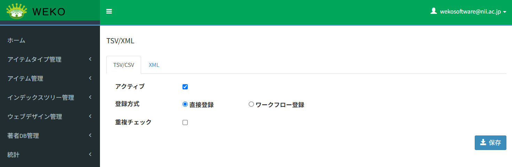
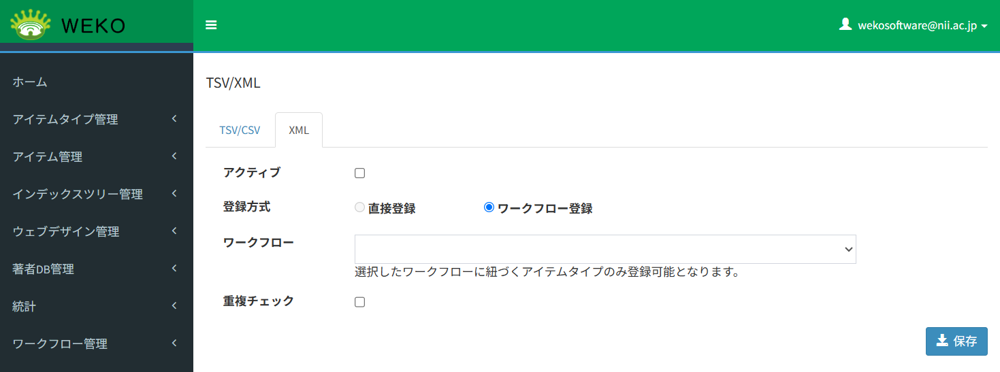

# SWORD API TSV/XML

## 目的・用途

本機能は、メタデータ形式がTSVおよびXMLのZIPファイルをSWORD APIを利用して登録する際の設定を行う機能である。

## 利用方法

管理者は、【Administration > SWORD API > TSV/XML】を開き、設定を行う。

## 利用可能なロール

|  ロール  | システム管理者 | リポジトリ管理者 | コミュニティ管理者 | 登録ユーザー | 一般ユーザー | ゲスト(未ログイン) |
| -------- | :------------: | :--------------: | :----------------: | :----------: | :----------: | :----------------: |
| 利用可否 |       〇       |        〇        |         ×         |      ×      |      ×      |        ×          |

## 機能内容
SWORD APIを利用してメタデータがTSVおよびXML形式で記述されたZIPファイルをアイテムとして登録する際に使用する登録方式の設定を可能とする。

- TSV/CSV
  - 設定項目
    - 機能の有効化
    - 登録方式（直接登録 or ワークフローを経由した登録）
    - アイテム重複チェックの有効化

- XML
  - 設定項目
    - 機能の有効化
    - 登録方式（直接登録 or ワークフローを経由した登録）
    - 使用するワークフローの選択
    - アイテム重複チェックの有効化

  ※ XML形式のZIPファイルを登録する場合、現時点ではインデックスを指定することができないため、ワークフローを経由した登録のみを選択することができる。

## 画面仕様

画面は、TSV/CSVとXMLでタブで切り替えることができる。

### TSV/CSVタブ

- 機能の有効化
  - チェックボックスで機能の有効化を設定する。

- 登録方式
  - ラジオボタンで登録方式を選択する。
  - ワークフロー登録を選択した時、登録するアイテムのアイテムタイプから Item Registrationアクションを持つワークフローを自動で選択する。

- アイテム重複チェック
  - チェックボックスでアイテム重複チェックの有効化を設定する。

### XMLタブ

- 機能の有効化
  - チェックボックスで機能の有効化を設定する。

- 登録方式
  - ラジオボタンで登録方式を選択する。
  - 現時点ではワークフロー登録のみを選択することができる。

- 使用するワークフローの選択
  - ドロップダウンリストでワークフローを選択する。
  - 登録方式にワークフローを選択しているときにのみ活性化する。
  - ワークフローを選択すると、登録できるアイテムはそのワークフローに対応するアイテムタイプに限定される。

- アイテム重複チェック
  - チェックボックスでアイテム重複チェックの有効化を設定する。

## 関連モジュール

  - weko_admin：設定画面を提供するモジュール

  - weko_swordserver：SWORD API利用してアイテム登録機能を提供するモジュール

## 関連テーブル

  - admin_settings：設定情報を保持するテーブル

## 処理概要

設定値をJSON形式でデータベースに永続化する。

- TSV/CSV
  - 機能の有効化
    - チェックボックスの値に応じて真偽値を永続化する。
  - 登録方式（直接登録 or ワークフローを経由した登録）
    - ラジオボタンで登録方式を選択し、選択値を永続化する。
  - ワークフローを経由した登録を選択した場合
    - アイテム登録時には、メタデータに記載されたアイテムタイプから使用できるワークフローを選択し、実行する。
  - アイテム重複チェックの有効化
    - チェックボックスの値に応じて真偽値を永続化する。

- XML
  - 機能の有効化
    - チェックボックスの値に応じて真偽値を永続化する。
  - 登録方式（直接登録 or ワークフローを経由した登録）
    - ラジオボタンで登録方式を選択し、選択値を永続化する。
  - 使用するワークフローの選択
    - ドロップダウンリストでワークフローを選択し、選択値を永続化する。
    - 登録方式にワークフローを選択しているときにのみ活性化する。
  - アイテム重複チェックの有効化
    - チェックボックスの値に応じて真偽値を永続化する。

## 変更履歴

| 日付       | GitHubコミットID                           | 更新内容                                        |
| ---------- | ------------------------------------------ | ----------------------------------------------- |
| 2024/03/09 |                                            | 初版作成                                        |
| 2025/06/05 |6a5718e870a46276869b2ad24d3f78793ca27012    | タブ分け、重複チェック設定、TSVのワークフロー選択許容 |
