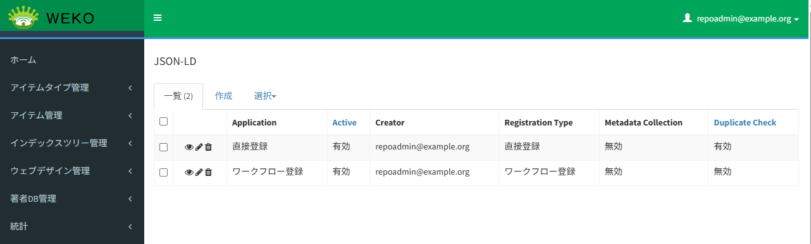
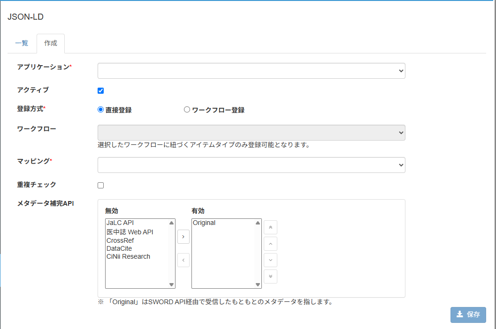

# SWORD API JSON-LD

## 目的・用途

本機能は、メタデータ形式がJSON-LDのZIPファイルをSWORD APIを利用して登録する際の設定を行う機能である。

## 利用方法

管理者は、【Administration > SWORD API > JSON-LD】を開き、設定を行う。

## 利用可能なロール

|  ロール  | システム管理者 | リポジトリ管理者 | コミュニティ管理者 | 登録ユーザー | 一般ユーザー | ゲスト(未ログイン) |
| -------- | :------------: | :--------------: | :----------------: | :----------: | :----------: | :----------------: |
| 利用可否 |       〇       |        〇        |         ×         |      ×      |      ×      |        ×          |

※ リポジトリ管理者は、自身が作成したアプリケーションに対してのみ設定を行うことができる。

## 機能内容

SWORD APIを利用してメタデータがJSON-LD形式で記述されたZIPファイルをアイテムとして登録する際に使用する登録方式の設定を可能とする。

- TSV/XMLの場合と異なり、OAuth認証で使用するクライアント（アプリケーション）ごとに設定を行う。
- 一覧からアプリケーションを選択し、設定の変更・閲覧・削除ができる。
- 設定項目
  - アプリケーション
  - 機能の有効化
  - 登録方式（直接登録 or ワークフローを経由した登録）
  - 使用するワークフローの選択
  - 使用するマッピング定義（[ADMIN_1_5：JSON-LDマッピング](./ADMIN_1_5.md)で管理者によって定義される）
  - アイテム重複チェックの有効化
  - [メタデータ自動補完機能](../user/USER_4_6.md#3-web-apiによるdoiを使用したメタデータ補完機能)で使用するWebAPIの優先順位

## 画面仕様

### 一覧画面

- 表示項目
  - 詳細表示・編集・削除ボタン
      - 各アプリケーションの設定の閲覧ボタン、編集ボタン、削除ボタンを表示する。
  - アプリケーション名
      - OAuth認証で使用するクライアント（アプリケーション）名を表示する。
  - 機能の有効化
      - 機能の有効/無効を表示する。
  - 作成者
      - 設定を作成したユーザー名を表示する。
  - 登録方式
      - 登録方式を表示する。
  - DOIによるメタデータ入力支援機能の有効/無効
      - DOIによるメタデータ入力支援機能の有効/無効を表示する。
  - アイテム重複チェックの有効/無効
      - アイテム重複チェックの有効/無効を表示する。

- 設定されたワークフローに承認待ちのアクティビティがある場合、その設定の削除はできない。

### 新規作成、編集画面

- 以下の項目を設定する。
  - アプリケーション名
    - 新規作成時に必須項目。プルダウンからアプリケーションを選択する。
    - 編集時は表示のみ。
  - 機能の有効化
    - チェックボックスにチェックを入れることでアプリケーションの機能を有効化する。
  - 登録方式（直接登録 or ワークフローを経由した登録）
    - 必須項目。
    - ラジオボタンで登録方式を選択する。
  - 使用するワークフローの選択
    - ドロップダウンリストでワークフローを選択する。
    - 登録方式にワークフローを選択した時のみ活性化する。
  - 使用するマッピング定義
    - 必須項目。
    - ドロップダウンリストでマッピング定義を選択する。
    - 登録方式にワークフローを選択した時は、ワークフローに設定されたアイテムタイプとマッピング先が一致する定義に絞って表示する。
  - マッピング定義の整合性表示
    - マッピング定義を選択すると[整合性チェック](./ADMIN_1_5.md#整合性チェック機能)の結果を取得し、エラーがなければ「✔」、エラーが  あれば「✘」を表示する。
  - アイテム重複チェックの有効化
    - チェックボックスにチェックを入れると、アイテム重複チェックで重複が疑われるアイテムがあったとき、登録を拒否する。
  - メタデータ自動補完機能で使用するWebAPIの優先順位
    - 使用するAPI、優先順位を設定する。右側の有効欄に移動したAPIが上から順に優先される。
    - 無効欄に「Original」を設定して保存することはできない。

- 設定されたワークフローに承認待ちのアクティビティがある場合、設定の変更はできない。  
  編集画面に遷移した時にメッセージを表示し、保存ボタンを非活性化する。

## 処理概要

### 設定値の永続化

- アプリケーション名
  - 選択されたアプリケーションのクライアントIDを永続化する。
- 機能の有効化
  - チェックボックスの値に応じて真偽値を永続化する。
- 登録方式（直接登録 or ワークフローを経由した登録）
  - ラジオボタンで登録方式を選択し、選択値を永続化する。
- 使用するワークフローの選択
  - 選択されたワークフローIDを永続化する。
- 使用するマッピング定義
  - 選択されたマッピング定義IDを永続化する。
- メタデータ自動補完機能で使用するWebAPIの優先順位
  - 使用するAPI、優先順位を永続化する。
  - 有効欄が「Original」のみの場合は、設定を空として永続化する。

## 関連モジュール

  - weko_admin：設定画面を提供するモジュール

  - weko_record：マッピング定義を提供するモジュール

  - weko_swordserver：SWORD API利用してアイテム登録機能を提供するモジュール

  - weko_workflow：ワークフローを提供するモジュール

## 関連テーブル

  - sword_client：設定情報を保持するテーブル

## 変更履歴

| 日付       | GitHubコミットID                           | 更新内容                                        |
| ---------- | ------------------------------------------ | ----------------------------------------------- |
| 2025/06/06 | af6848b8b3da420eaaf5aa3e3a36c1786708e7cf   | 初版作成                                        |
