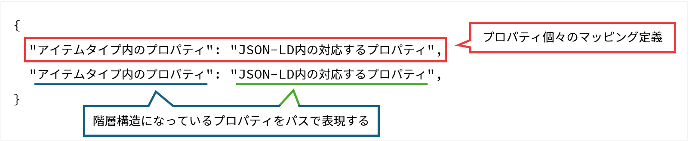

# JSON-LD マッピング

## 目的・用途
本機能は、アイテムタイプとJSON-LDのマッピングを設定する機能である。

## 利用方法
管理者は、【Administration > アイテム管理（Items） > JSON-LD マッピング（JSON-LD Mapping）】を開き、アイテムタイプのプロパティとJSON-LDのマッピング定義を設定する。

## 利用可能なロール

|  ロール  | システム管理者 | リポジトリ管理者 | コミュニティ管理者 | 登録ユーザー | 一般ユーザー | ゲスト(未ログイン) |
| -------- | :------------: | :--------------: | :----------------: | :----------: | :----------: | :----------------: |
| 利用可否 |       〇       |        〇        |         ×         |      ×      |      ×      |        ×          |

## 機能内容

- WEKOのアイテムタイプとJSON-LD形式のメタデータのマッピングを設定する。
- マッピング定義はリスト表示され、新規登録、編集、削除が可能である。
- マッピング定義の編集画面では、マッピング定義名、マッピング先のアイテムタイプ、マッピング定義の内容を設定する。
- マッピング定義の削除は論理削除とし、削除済みのマッピング定義は一覧に表示されない。
- 設定されたマッピング定義は、RO-Crate+BagItファイルのインポートや、SWORD APIを利用したアイテム登録時、RO-Crate形式でのアイテムエクスポート時に使用される。

## 画面仕様

## マッピング定義の仕様

### 語句

- **JSON-LD形式のメタデータ**：  
  JSON-LD（JavaScript Object Notation for Linked Data）で記述されたアイテムのメタデータ。  
  インポート対象のRO-Crate+BagItファイルに含まれる`ro-crate-metadata.json`ファイルや、SWORD BagItの`metadata/sword.json`内容がこれに該当する。

- **マッピング定義**：  
  登録先アイテムタイプと、JSON-LD形式のメタデータのスキーマの対応をJSON形式で記したもの。  
  データベースの"_public.sword_item_type_mappings"テーブルに以下のフィールドで保存される。

  - マッピング定義ID: int
  - マッピング定義: json
  - マッピング定義の名前: string
  - マッピング先のアイテムタイプID: int
  - バージョン: int
  - 論理削除フラグ: boolean

### マッピング定義の構成



アイテムタイプのプロパティごとのマッピング定義をJSON形式で記述する。  
キーはアイテムタイプの各プロパティのパスとし、対応する値はJSON-LDのメタデータのパスとする。  
ここで、パスとはプロパティの階層構造をピリオド区切りで表現したものである。

以下にマッピング定義の例を示す。  
アイテムタイプにマッピングするのは、アイテムのタイトル、メタデータの登録日、著者の3つのプロパティとする。  
JSON-LDのメタデータにないプロパティをアイテムタイプにマッピングする場合、`$`をプレフィックスとして指定することで固定値として扱うことができる。  
また、マッピング先のないプロパティをまとめて保持するプロパティを"extra"に対応付けて定義することができる。

```json
{
  "Title": "dc:title",                                // アイテムタイプの "Title" に対応するメタデータのパス
  "Title.タイトル": "dc:title.value",                 // アイテムタイプの "Title.タイトル" に対応するメタデータのパス
  "Title.言語": "dc:title.language",                  // アイテムタイプの "Title.言語" に対応するメタデータのパス
  "メタデータ登録日.日付": "dateCreated",             // アイテムタイプの "メタデータ登録日.日付" に対応するメタデータのパス
  "メタデータ登録日.日付タイプ": "$Created",          // アイテムタイプの "メタデータ登録日.日付タイプ" に対応する固定値
  "Creator": "creator",                               // アイテムタイプの "Creator" に対応するメタデータのパス
  "Creator.作成者姓名.姓名": "creator.name",          // アイテムタイプの "Creator.作成者姓名.姓名" に対応するメタデータのパス
  "Extra": "extra"                                    // マッピングが定義されていないプロパティをまとめて保持するプロパティ
}
```

このとき、アイテムタイプのJSONは以下に示すように、`properties` 配下に各プロパティについて記述される。  
マッピング定義ではこのスキーマから `title` を抽出してパスとして使用する。  
例えば、アイテムタイプではアイテムのタイトルは`item_1730255238992`(`"タイトル"`)、JSON-LDのメタデータでは`"dc:title"`に記述されるため、マッピング定義は`"Title": "dc:title"`となる。  
また、タイトルの言語は`item_1730255238992`(`"タイトル"`)のサブプロパティ`"subitem_title_language"`(`"言語"`)に記述されるため、マッピング定義は`"Title.言語": "dc:title.language"`となる。

```json
{
  "type": "object",
  "$schema": "http://json-schema.org/draft-04/schema#",
  "required": ["pubdate", "item_1730255238992", "item_1730255318606"],
  "properties": {
    "pubdate": {
      "type": "string",
      "title": "PubDate",
      "format": "datetime"
    },
    "item_1730255238992": {
      "type": "object",
      "title": "タイトル",
      "required": ["subitem_title", "subitem_title_language"],
      "properties": {
        "subitem_title": {
          "type": "string",
          "title": "タイトル",
          "format": "text"
        },
        "subitem_title_language": {
          "enum": [null, "ja", "en"],
          "type": ["null", "string"],
          "title": "言語",
          "format": "select"
        }
      }
    },
    "item_1736145554459": {
      "type": "object",
      "title": "メタデータ登録日",
      "properties": {
        "subitem_date_issued_type": {
          "enum": [null, "Accepted", "Available", "Collected", "Updated"],
          "type": ["null", "string"],
          "title": "日付タイプ",
          "format": "select"
        },
        "subitem_date_issued_datetime": {
          "type": "string",
          "title": "日付",
          "format": "datetime"
        }
      }
    },
    "item_1730255318606": {
      "type": "object",
      "title": "著者",
      "required": ["subitem_author_name"],
      "properties": {
        "subitem_author_name": {
          "type": "string",
          "title": "著者名",
          "format": "text"
        }
      }
    },
    "item_1730529252389": {
      "type": "object",
      "title": "Extra",
      "properties": {
        "interim": {
          "type": "string",
          "format": "text"
        }
      }
    }
  }
}
```

そして、メタデータは以下のようなJSON-LD形式であることを想定する。  
各プロパティは`@graph`の配列に格納されており、すべてのメタデータは`@id`の値が`"./`であるルートデータセットに記述される。  
ルートデータセット直下のキーと`@id`による参照を辿りながら使用されるキーをつなげてパスとする。  
例えばアイテムタイトルは、`@id`:"./"の要素内の `dc:title` で `"#title"` を参照しており、参照先の`"value"`に記述されている。
したがって、パスは`"dc:title.value"`とする。

```json
{
  "@context": "https://w3id.org/ro/crate/1.1/context",
  "@graph": [
    {
      "@id": "ro-crate-metadata.json",
      "@type": "CreativeWork",
      "about": { "@id": "./" },
      "conformsTo": { "@id": "https://w3id.org/ro/crate/1.1" }
    },
    {
      "@id": "./",
      "@type": "Dataset",
      "creator": [
        { "@id": "http://orcid.org/0000-0002-1825-0097" }
      ],
      "datePublished": "2023-01-18",
      "dc:title": { "@id": "#title" },
      "name": "The Sample"
    },
    {
      "@id": "http://orcid.org/0000-0002-1825-0097",
      "@type": "Person",
      "name": "Egon Willighagen",
      "affiliation": "Maastricht University"
    },
    {
      "@id": "#title",
      "@type": "Property",
      "value": "アイテムのサンプル",
      "language": "ja"
    }
  ]
}
```

[ADMIN_2_5：RO-Crate インポート](./ADMIN_2_5.md#マッピング機能)に記すマッピング機能は、このマッピング定義に基づきJSON-LD形式のメタデータをアイテムタイプへマッピングする。  
以下にマッピング結果の例を示す。

```json
{
  "item_1730255238992": [
    { "subitem_title": "アイテムのサンプル",
      "subitem_title_language": "ja"
    }
  ],
  "item_1736145554459": {
    "subitem_date_issued_type": "Created",
    "subitem_date_issued_datetime": "2023-01-18"
  },
  "item_1730255318606": [
    { "subitem_author_name": "Egon Willighagen" }
  ],
  "item_1730529252389": {
    "interim": "\"creator\": [{ \"@id\": \"http://orcid.org/0000-0002-1825-0097\", \"affiliation\": \"Maastricht University\" }]"
  }
}
```

## 関連モジュール

- weko_search_ui：マッピング定義の永続化およびマッピング処理を実行する。

## 関連テーブル

## 処理概要

## 更新履歴

| 日付       | GitHubコミットID                           | 更新内容                                        |
| ---------- | ------------------------------------------ | ----------------------------------------------- |
| 2024/03/07 |                                            | 初版作成                                        |
