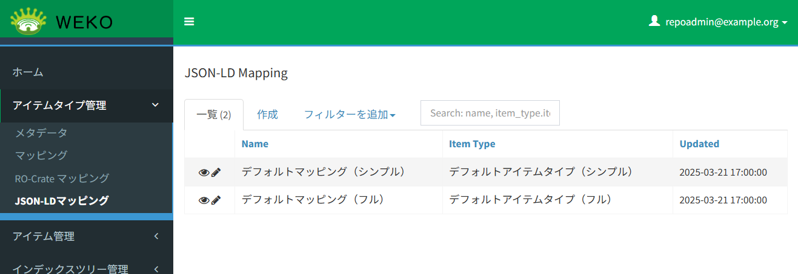
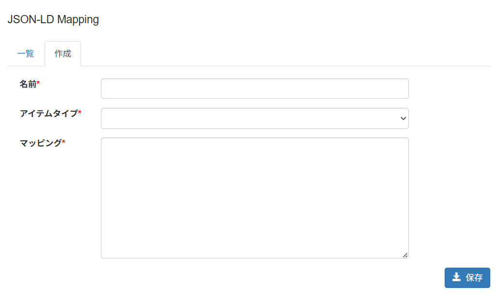
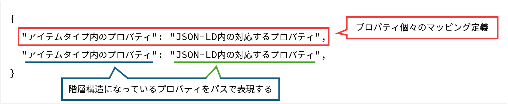

# JSON-LD マッピング

## 目的・用途
本機能は、アイテムタイプとJSON-LDのマッピングを設定する機能である。

## 利用方法
管理者は、【Administration > アイテム管理（Items） > JSON-LD マッピング（JSON-LD Mapping）】を開き、アイテムタイプのプロパティとJSON-LDのマッピング定義を設定する。

## 利用可能なロール

|  ロール  | システム管理者 | リポジトリ管理者 | コミュニティ管理者 | 登録ユーザー | 一般ユーザー | ゲスト(未ログイン) |
| -------- | :------------: | :--------------: | :----------------: | :----------: | :----------: | :----------------: |
| 利用可否 |       〇       |        〇        |         ×         |      ×      |      ×      |        ×          |

## 機能内容

- WEKOのアイテムタイプとJSON-LD形式のメタデータのマッピングを設定する。
- マッピング定義はリスト表示され、新規登録、編集、削除が可能である。
- マッピング定義の作成・編集画面では、マッピング定義名、マッピング先のアイテムタイプ、マッピング定義の内容を設定する。
- マッピング定義の削除は論理削除とし、削除済みのマッピング定義は一覧に表示されない。
- 設定されたマッピング定義は、RO-Crate+BagItファイルのインポートや、SWORD APIを利用したアイテム登録時、RO-Crate形式でのアイテムエクスポート時に使用される。
- マッピング定義は SQLAlchemy-Continuum を使用してバージョン管理され、過去のバージョンをデータベースに保持する。

## 画面仕様

### 一覧表示



- マッピング定義の一覧を表示する。
- 各マッピング定義の名前、マッピング先のアイテムタイプ名、更新日時を表示する。
- マッピング定義の名前とアイテムタイプ名で、フィルター機能を使用した絞り込みと、検索が可能である。

### マッピング定義の作成・編集



- マッピング定義の作成・編集画面では、以下の項目を設定する。すべてが必須項目である。
  - マッピング定義名：マッピング定義の名前を入力する。
  - マッピング先のアイテムタイプ：ドロップダウンリストからマッピング先のアイテムタイプを選択する。
  - マッピング定義：JSON形式でマッピング定義を入力する。  
    入力例は、[マッピング定義の仕様](#マッピング定義の仕様)を参照。  
    アイテムタイプないプロパティが記述された場合、保存ボタンを押下時のバリデーションチェックでエラーとなる。

- 以下の場合は、マッピング定義の編集に制限がかかる。
  - そのマッピング定義を使用しているSWORD API設定があるとき、マッピング先のアイテムタイプは変更できない。
  - そのマッピング定義を使用しているSWORD API設定に指定されたワークフローに、承認待ちのアクティビティがあるとき、マッピング定義の編集はできない。


## マッピング定義の仕様
### 語句

- **JSON-LD形式のメタデータ**：  
  JSON-LD（JavaScript Object Notation for Linked Data）で記述されたアイテムのメタデータ。  
  インポート対象のRO-Crate+BagItファイルに含まれる`ro-crate-metadata.json`ファイルや、SWORD BagItの`metadata/sword.json`の内容がこれに該当する。

- **マッピング定義**：  
  登録先アイテムタイプと、JSON-LD形式のメタデータのスキーマの対応をJSON形式で記したもの。  
  データベースの"_public.jsonld_mappings"テーブルに以下のフィールドで保存される。

  - マッピング定義ID: int
  - マッピング定義: json
  - マッピング定義の名前: string
  - マッピング先のアイテムタイプID: int
  - バージョン: int
  - 論理削除フラグ: boolean

### マッピング定義の構成



アイテムタイプのプロパティごとのマッピング定義をJSON形式で記述する。  
キーはアイテムタイプの各プロパティのパスとし、対応する値はJSON-LDのメタデータのパスとする。  
ここで、パスとはプロパティの階層構造をピリオド区切りで表現したものである。

以下にマッピング定義の例を示す。  
アイテムタイプにマッピングするのは、アイテムのタイトル、メタデータの登録日、作成者の3つのプロパティとする。  
JSON-LDのメタデータにないプロパティをアイテムタイプにマッピングする場合、`$`をプレフィックスとして指定することで固定値として扱うことができる。  

また、マッピング先のないプロパティをまとめて保持するプロパティを"extra"に対応付けて定義することができる。  
ただし、アイテムタイプにテキストエリアとして`Extra`という名前でプロパティが定義されている必要がある。

```json
{
  "Title": "dc:title",
  "Title.タイトル": "dc:title.value",
  "Title.言語": "dc:title.language",
  "メタデータ登録日.日付": "dateCreated",
  "メタデータ登録日.日付タイプ": "$Created",
  "Creator": "creator",
  "Creator.作成者姓名.姓名": "creator.creatorName",
  "Creator.作成者姓名.言語": "creator.creatorNameLang",
  "Extra": "extra"
}
```

| アイテムタイプのプロパティのパス | JSON-LDのメタデータのパス | 説明                                                                  |
| -------------------------------- | ------------------------- | --------------------------------------------------------------------- |
| Title                            | dc:title                  | アイテムタイプの "Title" に対応するメタデータのパス                   |
| Title.タイトル                   | dc:title.value            | アイテムタイプの "Title.タイトル" に対応するメタデータのパス          |
| Title.言語                       | dc:title.language         | アイテムタイプの "Title.言語" に対応するメタデータのパス              |
| メタデータ登録日.日付            | dateCreated               | アイテムタイプの "メタデータ登録日.日付" に対応するメタデータのパス   |
| メタデータ登録日.日付タイプ      | $Created                  | アイテムタイプの "メタデータ登録日.日付タイプ" に対応する固定値       |
| Creator                          | creator                   | アイテムタイプの "Creator" に対応するメタデータのパス                 |
| Creator.作成者姓名.姓名          | creator.creatorName       | アイテムタイプの "Creator.作成者姓名.姓名" に対応するメタデータのパス |
| Creator.作成者姓名.言語          | creator.creatorNameLang   | アイテムタイプの "Creator.作成者姓名.言語" に対応するメタデータのパス |
| Extra                            | extra                     | マッピングが定義されていないプロパティをまとめて保持するプロパティ    |

このとき、アイテムタイプのJSONは以下に示すように、`properties` 配下に各プロパティについて記述される。  
マッピング定義ではこのスキーマから `title` を抽出してパスとして使用する。  
例えば、アイテムタイプではアイテムのタイトルは`item_30001_title0`(`"タイトル"`)、JSON-LDのメタデータでは`"dc:title"`に記述されるため、マッピング定義は`"Title": "dc:title"`となる。  
また、タイトルの言語は`item_30001_title0`(`"タイトル"`)のサブプロパティ`"subitem_title_language"`(`"言語"`)に記述されるため、マッピング定義は`"Title.言語": "dc:title.language"`となる。

```json
{
  "type": "object",
  "$schema": "http://json-schema.org/draft-04/schema#",
  "required": ["pubdate", "item_30001_title0", "item_30001_creator2"],
  "properties": {
    "pubdate": {
      "type": "string",
      "title": "PubDate",
      "format": "datetime"
    },
    "item_30001_title0": {
      "type": "object",
      "title": "タイトル",
      "required": ["subitem_title", "subitem_title_language"],
      "properties": {
        "subitem_title": {
          "type": "string",
          "title": "タイトル",
          "format": "text"
        },
        "subitem_title_language": {
          "enum": [null, "ja", "en"],
          "type": ["null", "string"],
          "title": "言語",
          "format": "select"
        }
      }
    },
    "item_1736145554459": {
      "type": "object",
      "title": "メタデータ登録日",
      "properties": {
        "subitem_date_issued_type": {
          "enum": [null, "Accepted", "Available", "Collected", "Updated"],
          "type": ["null", "string"],
          "title": "日付タイプ",
          "format": "select"
        },
        "subitem_date_issued_datetime": {
          "type": "string",
          "title": "日付",
          "format": "datetime"
        }
      }
    },
    "item_30001_creator2": {
      "type": "array",
      "title": "Creator",
      "items": {
        "type": "object",
        "properties": {
          "creatorNames": {
            "type": "array",
            "title": "作成者姓名",
            "items": {
              "type": "object",
              "format": "object",
              "properties": {
                "creatorName": {
                  "type": "string",
                  "title": "作成者姓名",
                  "format": "text"
                },
                "creatorNameLang": {
                  "enum": [null, "ja", "en"],
                  "type": ["null", "string"],
                  "title": "言語",
                  "format": "select"
                }
              }
            }
          }
        }
      }
    },
    "item_1730529252389": {
      "type": "object",
      "title": "Extra",
      "properties": {
        "interim": {
          "type": "string",
          "format": "text"
        }
      }
    }
  }
}
```

そして、メタデータは以下のようなJSON-LD形式であることを想定する。  
各プロパティは`@graph`の配列に格納されており、すべてのメタデータは`@id`の値が`"./`であるルートデータセットに記述される。  
ルートデータセット直下のキーと`@id`による参照を辿りながら使用されるキーをつなげてパスとする。  
例えばアイテムタイトルは、`@id`:"./"の要素内の `dc:title` で `"#:title"` を参照しており、参照先の`"value"`に記述されている。
したがって、パスは`"dc:title.value"`とする。  

JSON-LDのメタデータの階層的な深さは、アイテムタイプのプロパティの階層的な深さと一致する必要はないが、情報のレイヤーが一致するキーとサブプロパティを対応付ける必要がある。  
例えば、作成者の情報は、`creator`の配列に格納されており、各作成者の情報は`creatorName`と`creatorNameLang`のサブプロパティを持つオブジェクトとして表現される。  
アイテムタイプでは、作成者の情報は`item_30001_creator2`の配列に格納され、各作成者の情報は`creatorNames`の中にさらにサブプロパティを持つオブジェクトとして表現される。  
したがって、マッピング定義では`"Creator"`を`"creator"`に対応付け、`"Creator.作成者姓名.姓名"`を`"creator.creatorName"`、`"Creator.作成者姓名.言語"`を`"creator.creatorNameLang"`に対応付ける。  
`"Creator.作成者姓名"`とレイヤーが合致するキーはJSON-LDのメタデータには存在しないため、マッピング定義を定義しない。

```json
{
  "@context": "https://w3id.org/ro/crate/1.1/context",
  "@graph": [
    {
      "@id": "ro-crate-metadata.json",
      "@type": "CreativeWork",
      "about": { "@id": "./" },
      "conformsTo": { "@id": "https://w3id.org/ro/crate/1.1" }
    },
    {
      "@id": "./",
      "@type": "Dataset",
      "creator": [
        { "@id": "http://orcid.org/0000-0002-1825-0097" },
        { "@id": "http://orcid.org/0000-0002-1825-0128" }
      ],
      "datePublished": "2023-01-18",
      "dc:title": { "@id": "#:title" },
      "name": "The Sample"
    },
    {
      "@id": "http://orcid.org/0000-0002-1825-0097",
      "@type": "Person",
      "creatorName": "Egon Willighagen",
      "creatorNameLang": "en",
      "affiliation": "Maastricht University"
    },
    {
      "@id": "http://orcid.org/0000-0002-1825-0128",
      "@type": "Person",
      "creatorName": "Janneke H. van der Werf",
      "creatorNameLang": "en",
      "affiliation": "University of Groningen"
    },
    {
      "@id": "#:title",
      "@type": "Property",
      "value": "アイテムのサンプル",
      "language": "ja"
    }
  ]
}
```

[ADMIN_2_5：RO-Crate インポート](./ADMIN_2_5.md#マッピング機能)に記すマッピング機能は、このマッピング定義に基づきJSON-LD形式のメタデータをアイテムタイプへマッピングする。  
以下にマッピング結果の例を示す。  
アイテムタイプでサブプロパティをオブジェクトとして配列にもつプロパティは、JSON-LDに配列として複数記述されていない場合でも、配列としてマッピングされる。  
逆に、JSON-LDにオブジェクトの配列として複数記述されていいても、アイテムタイプでサブプロパティをオブジェクトとして配列にもたないプロパティは、先頭の要素が単一のオブジェクトとしてマッピングされる。

```json
{
  "item_30001_title0": [
    { "subitem_title": "アイテムのサンプル",
      "subitem_title_language": "ja"
    }
  ],
  "item_1736145554459": {
    "subitem_date_issued_type": "Created",
    "subitem_date_issued_datetime": "2023-01-18"
  },
  "item_30001_creator2": [
    {
      "creatorNames": [
        {
          "creatorName": "Egon Willighagen",
          "creatorNameLang": "en"
        }
      ]
    },
    {
      "creatorNames": [
        {
          "creatorName": "Janneke H. van der Werf",
          "creatorNameLang": "en"
        }
      ]
    }
  ],
  "item_1730529252389": {
    "interim": "{\"creator[0].affiliation\": \"Maastricht University\", \"creator[1].affiliation\": \"University of Groningen\"}"
  }
}
```

### 制約事項

- マッピング処理は、原則として`ro-crate-metadata.json`および`sword.json`に記述される値のみをアイテムタイプにマッピングする。
- 日付のフォーマットを変換する処理など、メタデータの値を加工することはない。  
  日付のフォーマットが異なる場合は、アイテムタイプのバリエーションチェックエラーとなるため、`YYYY-MM-DD`形式で記述する必要がある。  
  また、アイテムタイプのスキーマとして一部のプロパティは値を統制しているが、それに合わせた変換は行わない。
- アイテムタイプとJSON-LDのメタデータが相互に可換であることを保証するために、マッピング定義はアイテムタイプのプロパティとJSON-LDのキーに1対1で定義する。


## 関連モジュール

- weko_search_ui：マッピング処理を実行する

- weko_records：マッピング定義を管理する


## 関連テーブル

  - jsond_mapping：アイテムタイプとjpcoar語彙のマッピング情報を保持する

    - id：マッピング定義ID
    - name：マッピング定義名
    - mapping：マッピング定義(JSON)
    - item_type_id：アイテムタイプID
    - version_id：バージョンID
    - is_delete：論理削除フラグ

  - item_type：アイテムタイプの情報を保持する

    - id：アイテムタイプID
    - name_id：アイテムタイプ名ID
    - harvesting_type：ハーベスト用フラグ
    - schema：アイテムタイプのJSONスキーマ
    - form：アイテムタイプのフォーム定義
    - render：アイテムタイプのレンダリング定義
    - tag：アイテムタイプのタグ
    - version_id：バージョンID
    - is_delete：論理削除フラグ

## 処理概要

## 更新履歴

| 日付       | GitHubコミットID                           | 更新内容                                        |
| ---------- | ------------------------------------------ | ----------------------------------------------- |
| 2024/06/05 | 81c37b544bd0d561183447be220d543d911d5bb7   | 初版作成                                        |
