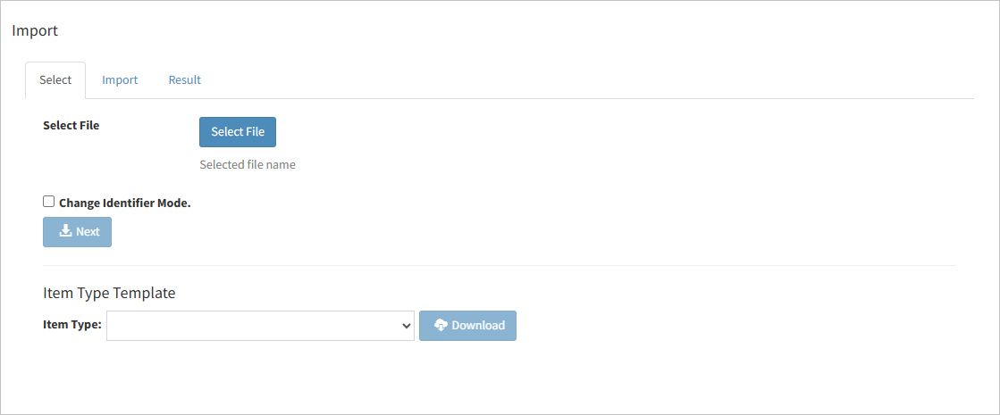
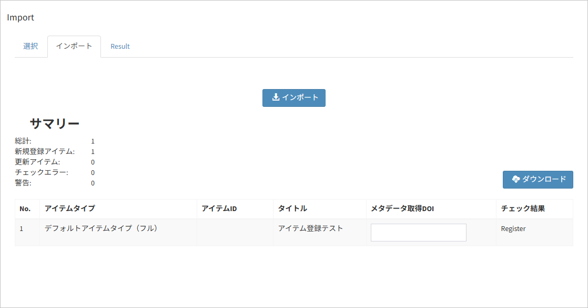
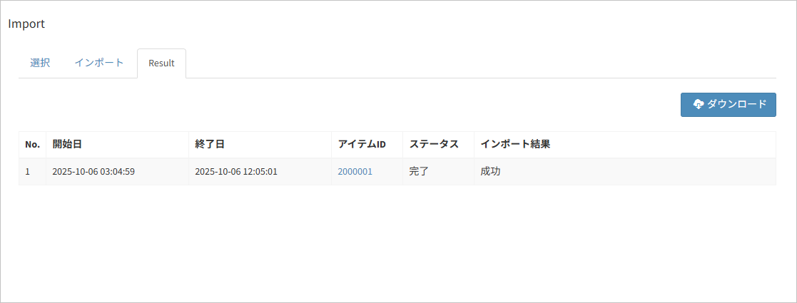

# インポート

## 目的・用途

本機能は、管理者として、アイテムの一括登録を実行する機能である。

## 利用方法

管理者は 【Administration > アイテム管理（Items） > インポート（Import）画面】を開き、アイテム一括登録用のzipファイルを登録する。

## 利用可能なロール

|  ロール  | システム管理者 | リポジトリ管理者 | コミュニティ管理者 | 登録ユーザー | 一般ユーザー | ゲスト(未ログイン) |
| -------- | :------------: | :--------------: | :----------------: | :----------: | :----------: | :----------------: |
| 利用可否 |       〇       |        〇        |         〇※       |      ×      |      ×      |        ×          |


※サブリポジトリ管理者は、自身の管理下にあるサブリポジトリに関連付けられたインデックスへのインポートのみ可能

## 機能内容

### 1. 概要

  - 複数のアイテムを一括で登録する機能。システム管理者、リポジトリ管理者のみ使用できる。
  - 登録形式はBagitだが、ユーザにそれを意識させないようにしている。詳細はの1を参照。
  - 機能は3つの画面で構成されている。
  - 以下は各画面の関連と役割。
  - WEB APIを利用してDOIによるメタデータ補完を提供する。

```
    +-----------+ ≪選択画面≫
    |           | ●各アイテムタイプのTSVファイルテンプレートのダウンロード
    |  Select   | ●インポートファイルの指定
    |           | ●「識別子変更モード」の設定と利用規約への同意
    +-----------+
        ↓
        ↓【Next】 button click!
        ↓
    +-----------+ ≪インポート画面≫
    |           | ●TSVファイルで指定した項目のチェック結果の確認
    |  Import   | ●メタデータ補完に使用するDOIの入力
    |           | ●チェック結果のダウンロード
    +-----------+
        ↓
        ↓【Import】 button click!
        ↓
    +-----------+ ≪結果画面≫
    |           | ●アイテムごとのインポート実行結果の確認
    |  Result   | ●インポート実行結果のダウンロード
    |           |
    +-----------+
```

### 2. 画面仕様

#### 2.1 選択画面(Select)

  - 各アイテムタイプのTSVファイルテンプレートのダウンロードとインポートファイルを指定する画面。  
    また「識別子変更モード」の設定と利用規約への同意を実施する



★Message Area（管理画面共通）

  - インポートファイルのチェックでエラーが発生した際、画面上部にメッセージを表示する。
  - 表示されるエラーメッセージは[3.2(4)-1](#形式チェック)参照。

①［ファイル選択（Select File）］ボタン

  - 押下するとファイル選択ダイアログを表示する。選択可能なファイルはzip形式で1つのみ。

② Selected file name ラベル

  - ①で選択したファイル名を表示する。未選択時は「選択したファイル名（Selected file name）」を表示。

③ [識別子変更モード（Change Identifier Mode）] チェックボックス<span id="change-identifier-mode">

  - DOIやCNRIを変更する際に設定する。チェックありで④を押下すると「免責事項ダイアログ」が表示される。  
    免責事項の文面は以下（テキストファイルで保持。ファイルパスはコンフィグ管理→処理概要の2を参照）

  - 免責事項ダイアログには［OK］ボタンと［キャンセル（Cancel）］ボタンがある。［OK］ボタンは、「利用規約に同意します（I agree to the terms of use.）」がチェックされるまでは非活性。［OK］ボタンを押下するとインポートファイルのチェックを行い、通過するとImport画面に遷移する。

  - チェックありの状態でImport画面に遷移してから選択画面に戻ると、選択ファイルを変更するまでは非活性になっており変更できない。

> Japanese:
>
> 免責事項：  
> - 本機能は設定にかかわらずDOIを強制的に変更します。  
> - 本機能は内容及び自機関で登録されているDOIについて十分に理解した上で作業を行なってください。  
> - 本機能の利用は、自機間の責任で行なってください。  
> - 本機能の利用により負った損害などについては、国立情報学研究所は一切の責任を追いません。

> English:
>
> Disclaimer:  
> - This function forcibly changes the DOI regardless of the setting.  
> - Before starting this operation, you need fully understand the contents and DOI registered at your institution.  
> - Use this function on your own responsibility.  
> - National Institute of Informatics (NII) does not take any responsibility for damages caused by using this function.

④［次へ（Next）］ボタン

  - ①でファイルが選択されるまでは非活性。  
    ただし、拡張子が「zip」でないファイルが選択された場合は活性化しない。  
    押下するとインポートファイルのチェックを行い、通過するとImport画面に遷移する。  
    チェック処理については、3.2(4)を参照。

⑤Item Type セレクタ―

  - TSVファイルテンプレートをダウンロードする際、対象とするアイテムタイプを選択する。  
    【Administration > アイテムタイプ管理（Item Types） > メタデータ（Metadata）】画面で確認できる標準アイテムタイプ（Standard Item Type）を表示。  
    表示形式は「Item Type name(Item Type ID)」。

⑥Download ボタン

  - 押下すると⑤で選択したアイテムタイプのTSVファイルテンプレートをダウンロードする。  
    ファイルについては4.1参照。

#### 2.2 インポート画面(Import)

  - TSVファイルで指定した項目のチェック結果の確認とチェック結果のダウンロードができる。



①Message ラベル

  - ※名称は要検討  
    Select画面の「③Change Identifier Mode チェックボックス」にチェックを入れた場合。メッセージ「識別子変更モードで登録します(Register with [Change Identigier Mode].)」を表示する。

②Import ボタン

  - 押下するとインポートを実行する。  
    対象データがすべてエラーなど、インポートできない場合は非活性。

③Summary/Total ラベル

  - TSVファイルで設定されたアイテムの総数。TSVファイルが複数存在した場合、各ファイルで設定されたアイテムの合計を表示する。

④Summary/New Item ラベル

  - ③の内、新規登録アイテムとなる件数を表示する。

⑤Summary/Update ラベル

  - ③の内、更新アイテムとなる件数を表示する。

⑥Summary/Check error ラベル

  - ③の内、TSVファイルの設定内容にエラーがある件数を表示する。

⑦Download ボタン

  - インポートファイルのチェック結果をTSV形式で出力する。出力項目が当該画面の⑧～⑫。  
    ダウンロードするファイルは4.2を参照。

⑧表/No.

  - 項番。Not処理順。

⑨表/アイテムタイプ

  - アイテムをインポートする際に使用するアイテムタイプ名を表示する

⑩表/アイテムID

  - 新規登録の場合 → 空白
  - 更新の場合 → TSVファイルで指定したIDを表示する

⑪表/タイトル

  - アイテムのタイトルを以下のルールで表示する。
      - システムの言語属性に合わせたタイトルを表示する
      - 一致するものがない場合は英語表記で表示する
      - 画面の横幅に応じて表示する文字数をトリミング（末尾を「…」に置換）する

⑫表/メタデータ取得DOI

  - 入力したDOIをもとにWEB APIからメタデータ補完を行う。
    
      - prefix/suffixの形式で入力する。

⑬表/チェック結果

  - 入力したDOIをもとにWEB APIからメタデータ補完を行う。
      - prefix/suffixの形式で入力する。

⑬表/チェック結果

  - TSVファイルの設定内容について、チェックした結果を以下の形式（()は英語表記）で表示する。
      - 新規登録→「登録(Registre)」
      - 更新→「更新(Update)」
    
      - エラー→「エラー(ERROR)：<エラーメッセージ>」
    
      - ワーニング→「警告(Warning)：<警告メッセージ>」

  - チェック仕様については、3.2(4)-2\~3を参照

#### 2.3 結果画面(Result)

  - アイテムごとのインポート実行結果の確認とインポート実行結果のダウンロードができる。

  - 現状、処理中に一度画面を離れた場合、処理はCeleryで管理されて継続するが、画面で進捗状況を再度確認することはできない。



①ダウンロード ボタン

  - インポート処理の実行結果を出力する。項目は当該画面の②～⑦．

  - ダウンロードファイルについては4.3参照。

②表/No.

  - 項番。Not処理順。

③表/開始日

  - アイテムの登録処理を開始した日時。YYYY-MM-DD hh:mm:ssで表示する。

④表/終了日

  - アイテムの登録処理が完了した日時。YYYY-MM-DD hh:mm:ssで表示する。

⑤表/アイテムID

  - 処理対処のアイテムIDを表示する。新規登録の場合は空欄。

⑥表/アクション

  - 以下の形式でインポート処理の状態を表示する。
      - 「待機中」：インポート処理がキューに登録され、処理待ちの状態である。
      - 「処理中」：インポート処理が実行中である。
      - 「完了」：インポート処理が完了している。
      - 「エラー」：実行中にエラーが発生。

⑦表/ワークフローステータス

  - 以下の形式でインポート結果を表示する。
      - 登録成功→「成功」
      - エラー→「<エラーメッセージ>」

## インポートファイル／TSVファイルについて

#### 3.1 インポートファイル
### 3.1 インポートファイル

  - エクスポート（一括出力）したファイルを流用できる

  - 対応しているファイル形式：zip（他の圧縮形式は不可）実装の詳細は処理概要の1を参照。

  - フォルダ構成

```plaintext
./ (bagit root)
  ├─bagit.txt ※
  ├─bag-info.txt ※
  ├─/data
  │   ├─/recid_n
  │   │   └─<Files>
  │   ├─ItemTypeName1(ItemType ID).tsv
  │   └─ItemTypeName2(ItemType ID).tsv
  ├─manifest-sha256.txt ※
  ├─manifest-sha512.txt ※
  ├─tagmanifest-sha256.txt ※
  └─tagmanifest-shar512.txt ※
```

※はBagit形式のファイル。インポート時は省略可能
  - 「/data」は変更不可
  - 「/recid_n」は変更可
  - アイテムタイプのTSVファイルは複数指定可能

### 3.2 アイテムタイプごとのTSVファイル

当該ファイルは以下で共通のレイアウトとしている。
    
- Select画面でダウンロードできるテンプレートファイル(4.1)
- インポートファイルに含めるアイテムタイプTSVファイル
- エクスポート（一括出力）ファイルに含まれるアイテムタイプTSVファイル

##### (1) ヘッダ行

ヘッダ行は先頭が「#」とする。

##### 1行目：インポートするアイテムタイプの情報

| 1列目 | 「#ItemType」固定                                                                       |
| ----- | ---------------------------------------------------------------------------------------- |
| 2列目 | アイテムタイプ名                                                                         |
| 3列目 | アイテムタイプのjsonschemaのURI。形式は「https://FQDN/items/jsonschema/<ItemType ID>」 |

##### 2行目：各項目のJSONパス。各種処理に使用される項目。

##### 3行目：各項目のラベル。

- アイテムタイプ以外の項目  
    → 項目ごとにラベルの内容を定義。

- アイテムタイプ項目  
    → 【Administration > アイテムタイプ管理（ItemTypes） > メタデータ（Metadata）画面】のLocalization Settingで設定している内容を出力。設定がない場合は項目名を出力。

##### 4行目：インポート実行時に値を自動で設定する項目について「System」を出力 。対象はプロパティ定義内で「"readonly":true」を設定している項目。

##### 5行目：各項目について「Allow Multiple」（繰り返し可）「Requierd」（必須）を出力

- アイテムタイプ以外の項目  
    → 項目ごとにラベルの内容を定義。

- アイテムタイプ項目  
    → 【Administration > アイテムタイプ管理（ItemTypes） > メタデータ（Metadata）画面】のOptionの設定内容がチェックありの項目について出力

#### (2) アイテムタイプ項目以外の項目

| JSONパス          | ラベル               | 説明                                                                                                                                      |
| ----------------- | -------------------- | ----------------------------------------------------------------------------------------------------------------------------------------- |
| .id               | ID                   | アイテムID。新規登録時、指定なしの場合は自動採番、未使用の番号を指定することもできる。更新時は登録済みの内容が必須。                      |
| .uri              | URI                  | アイテムのURI。新規登録時は指定なし。更新時は登録済みの内容が必須となる。                                                                 |
| .metadata.path[0] | .IndexID[0]          | アイテムを登録するインデックスをID指定する。複数指定可。.pos_index[n]とペアで指定する。<br>.pos_index[n]が指定されていない場合は必須。存在しないインデックスを指定した場合はエラーメッセージを出力する。 |
| .pos_index[0]     | .POS_INDEX[0]        | アイテムを登録するインデックスを名称(※1)で指定する。.metadata.path[n]とペアで指定する。<br>.metadata.path[n]が指定されてない場合は必須。 |
| .publish_status   | .PUBLISH_STATUS      | アイテムの公開／非公開を指定する。public/privateのいずれかを設定する。必須項目。                                                          |
| .feedback_mail[0] | .FEEDBACK_MAIL[0]    | フィードバックメールの送信先メールアドレスを指定する。複数指定可。                                                                        |
| .request_mail[0]  | .REQUEST_MAIL[0]     | リクエストメールの送信先メールアドレスを指定する。複数指定可。                                                                            |
| .researchmap_linkage  | .RESEAECHMAP_LINKAGE | Researchmapへの連携フラグ |
| .item_application.workflow | .ITEM_APPLICATION<br>.WORKFLOW | コンテンツファイルがない場合の利用申請のワークフローIDを指定する。                                                     |
| .item_application.terms | .ITEM_APPLICATION.TERMS |コンテンツファイルがない場合の利用規約IDを指定する。この列のデータ行にterm_freeが入力された場合、利用規約を自由入力として.item_application.terms_descriptionが表示される。 |
| .item_application<br>.terms_description | .ITEM_APPLICATION<br>.TERMS_DESCRIPTION | コンテンツファイルがない場合の利用規約（自由入力）を指定する。                                   |
| .cnri             | .CNRI                | CNRIハンドルサーバを使用する場合(※2)に設定できる。CNRIは「prefix/suffix」の形式で設定される。通常モードの時は自動採番(※3)される。識別子変更モードの時に「prefix」または「prefix/」を指定すると自動採番となる。 |
| .doi_ra           | .DOI_RA              | DOIの種類を指定する。JaLC/Crossref/DataCite(※4)/NDL JaLC (※5)のいずれかを設定する。                                                     |
| .doi              | .DOI                 | DOIを「prefix/suffix」の形式で設定する。通常モードの時は自動採番(※3)される。識別子変更モードの時は手入力で変更可能。                     |
| .edit_mode        | Keep/Upgrade Version | 対象のアイテムのバージョン更新可否を指定する。新規登録の場合は空、更新の場合は必須でKeep/Upgradeのいずれかを指定する。<br>※インポートファイル（zip）に既存アイテムの元ファイルが同名、ファイルパスも同一で含まれていた場合（元ファイルを変更しない） <br>・Keep: 重複登録されない <br>・Upgrade: 重複登録する。ファイル名だけでは、同名同ファイルなのか同名異ファイルなのかが判断できない |
| .bulk_doi         | .BULK_DOI            | メタデータ補完に用いるDOIを「prefix/suffix」の形式で指定する。インポート（Import）画面のDOI入力欄（内部キー `bulk_doi`）に保持され、`handle_metadata_by_doi` による補完対象DOIとして使用される。設定キー `WEKO_EXPORT_TEMPLATE_BASIC_ID`（`.bulk_doi`）/ `WEKO_EXPORT_TEMPLATE_BASIC_NAME`（`.BULK_DOI`）。 |

#### ※2) CNRIハンドルサーバの使用について  
CNRIハンドルの使用状態は「WEKO_HANDLE_ALLOW_REGISTER_CRNI」(modules/weko-handle/weko_handle/config.py)の設定値で判断している
    
- 「False」：初期値。CNRIハンドルサーバを使用しない
- 「True」：CNRIハンドルサーバを使用する

#### ※3) CNRIとDOIの自動採番時の指定について  
    
現状は以下の通り。
    
- 識別子変更モード
  - DOIの自動採番は行わない。  
    インポートファイルにdoiやprefixが含まれている場合はエラーメッセージを表示する。
  - DOIが空欄の場合  
    「Please specify DOI prefix/suffix.」
  - インポートファイルにdoiやprefixが含まれている場合　(「prefix」もしくは「prefix/」を指定した場合）  
    「DOI suffixを設定してください。」／「Please specify DOI suffix.」
- Not 識別子変更モード        
  - Admin > Setting > Identifier でprefixの設定があること
    - DOI：空欄であること
    - DOI_RA：JaLC, Crossref, DataCite のいずれかであること
    - DOI_RA：NDL JaLCの場合、自動採番は行われない。
      インポートファイルにdoiやprefixが含まれている場合はエラーメッセージを表示する。
    - DOIが空欄の場合
　     「Please specify DOI prefix/suffix.」
    - インポートファイルにdoiやprefixが含まれている場合　(「prefix」もしくは「prefix/」を指定した場合）
　      「DOI suffixを設定してください。」／「Please specify DOI suffix.」

※4) DataCiteについて  
    制限等は現状設けていない

※5) NDL JaLCについて  
DOI RA：NDL JaLCの場合、資源タイプは「doctoral thesis」である必要があります。

CNRIハンドルの未設定・設定ユーザーのDOI付与状況は以下の通り。

| | 識別子変更モード | | Not 識別子変更モード | |
|:---|:---|:---|:---|:---|
| 登録時のモード | 新規 | 更新 | 新規 | 更新 |
| CNRI（CNRIハンドル未設定ユーザー） | 空欄 | 空欄 | 空欄 | 空欄 |
| CNRI（CNRIハンドル設定ユーザー） | 必須。「prefix」または「prefix/」を指定すると自動採番。「prefix/suffix」を指定すると指定された形式でCNRIハンドルを発行。 | 変更可能 | 空欄 | 変更不可 |
| DOI_RA | 設定可能 | DOI付与前は設定可能<br>DOI付与後は変更不可 | 設定可能 | DOI付与前は設定可能<br>DOI付与後は変更不可 |
| DOI | 設定可能 | 変更可能 | 空欄 | DOI付与前は空欄<br>DOI付与後は変更不可 |

##### (3) アイテムタイプ項目

基本はアイテムタイプに定義されている項目（プロパティ）に対して、TSVファイル内で設定されている内容を登録する。  
次の項目は項目の設定以外の処理を行っている。

### 2.1 コンテンツファイル

コンテンツファイルを指定してアップロードする。  
自動設定は本文URLのみ対応済。

プロパティID：  
項目：

| **JSONパス** | **初期設定ラベル** | **System(自動設定)** | **説明** |
| ---- | ---- | ---- | ---- |
| .file_path[0] | .ファイルパス[0] | | |
| .upload_id[0] | . ファイルアップロードID[0] | | |
| .metadata.item_files[0].accessrole | ファイル情報[0].アクセス | 空欄で「オープンアクセス」を自動設定／手入力 | |
| .metadata.item_files[0].date[0].dateType | ファイル情報[0].公開日[0].タイプ | | |
| .metadata.item_files[0].date[0].dateValue | ファイル情報[0].公開日[0].公開日 | 「アクセス」＝オープンアクセス日を指定 の際に手入力可／それ以外は空白 | |
| .metadata.item_files[0].displaytype | ファイル情報[0].表示形式 | | |
| .metadata.item_files[0].fileDate[0].fileDateType | ファイル情報[0].日付[0].日付タイプ | | |
| .metadata.item_files[0].fileDate[0].fileDateValue | ファイル情報[0].日付[0].日付 | | |
| .metadata.item_files[0].filename | ファイル情報[0].ファイル名 | | ファイルパス[0] が空欄ではない時に、空欄、ファイルパス[0] のファイル名と一致しない場合、登録できない |
| .metadata.item_files[0].filesize[0].value | ファイル情報[0].サイズ[0].サイズ | 空欄で自動設定／手入力 | |
| .metadata.item_files[0].format | ファイル情報[0].フォーマット | ファイルアップロードIDを入力の場合、必須 | |
| .metadata.item_files[0].groups | ファイル情報[0].グループ | | |
| .metadata.item_files[0].licensefree | ファイル情報[0].自由ライセンス | | |
| .metadata.item_files[0].licensetype | ファイル情報[0].ライセンス | | |
| .metadata.item_files[0].url.label | ファイル情報[0].本文URL.ラベル | | |
| .metadata.item_files[0].url.objectType | ファイル情報[0].本文URL.オブジェクトタイプ | | |
| .metadata.item_files[0].url.url | ファイル情報[0].本文URL.本文URL | 空欄で自動設定(※1)／手入力 | |
| .metadata.item_files[0].version | ファイル情報[0].バージョン情報 | | |

※1: 本文URLは「THEME_SITEURL」(/home/invenio/.virtualenvs/invenio/var/instance/invenio.cfg") を利用して生成している。ルールは以下の通り。

  - file_path & 本文URLの両方を指定された場合、本文URLを無視し、システムがURLを生成し上書きする。

  - file_path のみ指定された場合、URLを生成し登録する。

  - 本文URLのみ指定された場合、URLを使って登録する。

### 2.2 サムネイルファイル

プロパティID：  
項目：

| **JSONパス**                                                                  | **初期設定ラベル**                       | **System(自動設定)** | **説明**                                               |
| --------------------------------------------------------------------------- | --------------------------------- | ---------------- | ---------------------------------------------------- |
| .thumbnail_path[0]                                                       | .サムネイルパス[0]                     |                  | 設定値ありで登録、設定値なしで削除する。指定したパスに該当ファイルがあれば常にアップロードして登録する。 |
| .metadata.item_1568286766453[0].subitem_thumbnail[0].thumbnail_label | Thumbnail[0].URI[0].URI Label | 〇                | インポート時に設定されても無視する                                    |
| .metadata.item_1568286766453[0].subitem_thumbnail[0].thumbnail_url   | Thumbnail[0].URI[0].URI       | 〇                | インポート時に設定されても無視する                                    |

### 3.3 自動設定の項目

  - **出版タイプ** （JPCOARスキーマ「出版タイプ」：<https://schema.irdb.nii.ac.jp/ja/schema/1.0.2/16> の統制語彙に基づく）  
    プロパティID：  
    項目：

| **JSONパス**                                           | **初期設定ラベル**         | **JPCOAR[※]**           | **System(自動設定)** | **説明** |
| ---------------------------------------------------- | ------------------- | ------------------------- | ---------------- | ------ |
| .metadata.item_1531978917933.subitem_1522305645492 | 出版タイプ.出版タイプ         | versiontype               |                  |        |
| .metadata.item_1531978917933.subitem_1600292170262 | 出版タイプ.出版タイプResource | versiontype.@rdf:resource | 〇                |        |

  - **アクセス権** （JPCOARスキーマ「アクセス権」：<https://schema.irdb.nii.ac.jp/ja/schema/1.0.2/5> の統制語彙に基づく）  
    プロパティID：  
    項目：

| **JSONパス**                                           | **初期設定ラベル**           | **JPCOAR[※]**            | **System(自動設定)** | **説明** |
| ---------------------------------------------------- | --------------------- | -------------------------- | ---------------- | ------ |
| .metadata.item_1531978848664.subitem_1522299639480 | Access Right.アクセス権    | accessRights               |                  |        |
| .metadata.item_1531978848664.subitem_1600958577026 | Access Right.アクセス権URI | accessRights.@rdf:resource | 〇                |        |

  - **資源タイプ** （JPCOARスキーマ「資源タイプ」：https://schema.irdb.nii.ac.jp/ja/schema/1.0.2/14 の統制語彙に基づく）  
    プロパティID：  
    項目：

| **JSONパス**                                 | **初期設定ラベル**            | **JPCOAR[※]**    | **System(自動設定)** | **説明** |
| ------------------------------------------ | ---------------------- | ------------------ | ---------------- | ------ |
| .metadata.item_1569380275317.resourcetype | Resource Type.Type     | type               |                  |        |
| .metadata.item_1569380275317.resourceuri  | Resource Type.Resource | type.@rdf:resource | 〇                |        |

[※]各Resource項目の自動設定機能は、【Administration > アイテムタイプ管理（ItemTypes） > マッピング（Mapping）画面】で対象のアイテムタイプについてJPCOARスキーマのマッピングが設定されている必要があります。  
　「出版タイプ」と「アクセス権」については、移行ツール作成のアイテムタイプに含まれていない項目なので、該当環境で項目を追加した際は必ずマッピング設定をしてください。

### 4. チェック仕様

### 4.1. インポートファイル、TSVファイルの形式チェック<span id="形式チェック">

最初に実施。  
エラーの場合は、Select（選択）画面の#Message Area#にメッセージを出力する。ただし、#2はImport（インポート）画面の表/Check Resultに出力。

| **#** | **条件** | **処理** | **メッセージ(日本語)** | **メッセージ(英語)** | **備考** |
| ---- | ---- | ---- | ---- | ---- | ---- |
| 1 | 指定された項目が一括登録対象のアイテムタイプと一致しない（項目不足） | エラー | 指定されたアイテムタイプと項目が一致しません。 | The item does not consistent with the specified item type. | |
| 2 | 指定された項目が一括登録対象のアイテムタイプと一致しない（項目追加） | 警告 | 次の項目指定されたアイテムタイプに存在しないため登録されません。{} | The following items are not registered because they do not exist in the specified item type. {} | |
| 3 | 指定された圧縮ファイルの形式がzip以外 | エラー | 指定されたファイル{}の形式はインポートに対応していません。zip ,tar,gztar,bztar,xztarいずれかの形式を指定してください。 | The format of the specified file {} does not support import. Please specify one of the following formats: zip, tar, gztar, bztar, xztar. | 対応している圧縮形式がzipのみで、<br>ファイル選択時のバリデーションチェックでzip以外のファイルでは［次へ（Next）］ボタンが活性化しないためこのチェックに到達しない。 |
| 4 | 指定された圧縮ファイル内でTSVファイルが見つからない（フォルダ構成誤り） | エラー | 指定されたファイル{}にtsv/csvファイルが見つかりませんでした。ディレクトリ構成が正しいか確認してください。 | The tsv/csv file was not found in the specified file {}. Check if the directory structure is correct. | |
| 5 | UTF-8でエンコードされていない | エラー | {}ファイルを読み込めませんでした。ファイル形式が{}であること、またそのファイルがUTF-8でエンコードされているかを確認してください。 | The {} file could not be read. Make sure the file format is {} and that the file is UTF-8 encoded. | {}に拡張子が入る |
| 6 | ファイルの１行目のフォーマットが正しくない（3列名にアイテムタイプIDが指定されていない など） | エラー | {}ファイルのヘッダ１行目の形式に誤りがあります。 | There is an error in the format of the first line of the header of the {} file. | |
| 7 | 指定したアイテムタイプが存在しない | エラー | {}ファイルで指定されたアイテムタイプIDは存在しません。 | The item type ID specified in the {} file does not exist. | |
| 8 | TSV ファイルに改行が含まれている場合 | エラー | {}ファイルが正しく読み込めません。 | Cannot read {} file correctly. | |
| 9 | 指定したアイテムタイプが一括登録可能（最新版）でない場合 | エラー | 指定されたアイテムタイプが最新のバージョンでないため登録できません。 | Cannot register because the specified item type is not the latest version. | 現在はアイテムタイプのバージョン管理はしていないため使用していない |
| 10 | Runtimeエラー（ElasticSearchがロックされた、サーバ接続不可、ネットワーク接続不可など） | エラー | サーバ内部エラー | Internal server error | |
| | | エラー | | The specified {} does not exist in system. | |

### 4.2. メタデータ項目以外のチェック

アイテムタイプのメタデータ以外の項目についてチェック仕様。  
各項目は「JSONパス（ラベル）」で記載。  
エラーメッセージはImport（インポート）画面の表/Check Resultに出力。

  - .id（ID）

| **#** | **条件**                          | **処理** | **メッセージ(日本語)**                       | **メッセージ(英語)**                                                              | **備考**                 |
| ------ | ------------------------------- | ------ | ------------------------------------ | -------------------------------------------------------------------------- | ---------------------- |
| 1      | 半角数字以外                          | エラー    | アイテムIDは半角数字で指定してください。                | Please specify item ID by half-width number.                               |                        |
| 2      | 指定されたアイテムIDをpidとしてもつアイテムが存在しない  | エラー    |                                      | Item does not exits in the system                                          | 多言語対応ができていない           |
| 3      | 指定されたアイテムIDがシステムでは削除済み          | エラー    |                                      | Item already DELETED in the system                                         | 多言語対応ができていない           |
| 4      | アイテムIDが指定されていて、項目「status」が「new」 | ワーニング  | 新規登録アイテムにIDが指定されています。IDを無視して登録を行います。 | ID is specified for the newly registered item. Ignore the ID and register. | 項目「status」はチェック中に付与される |

  - .id（ID）と.uri（URI）

| **#** | **条件**                 | **処理** | **メッセージ(日本語)**           | **メッセージ(英語)**                              | **備考** |
| ------ | ---------------------- | ------ | ------------------------ | ------------------------------------------ | ------ |
| 1      | アイテムIDとURIの組み合わせが一致しない | エラー    | 指定されたURIとシステムURIが一致しません。 | Specified URI and system URI do not match. |        |

  - .metadata.path[0]（.IndexID[0]）

| **#** | **条件**        | **処理** | **メッセージ(日本語)**       | **メッセージ(英語)**                                  | **備考**          |
| ------ | ------------- | ------ | -------------------- | ---------------------------------------------- | --------------- |
| 1      | 指定された内容が存在しない | エラー    | 指定された{}はシステムに存在しません。 | The specified {} does not exist in the system. | {}に「IndexID」が入る |

  - .pos_index[0]（.POS_INDEX[0]）

| **#** | **条件**                                 | **処理** | **メッセージ(日本語)**       | **メッセージ(英語)**                                | **備考**             |
| ------ | -------------------------------------- | ------ | -------------------- | -------------------------------------------- | ------------------ |
| 1      | IndexIDが指定されていない際、指定したPOS_INDEXが存在しない | エラー    | 指定された{}はシステムに存在しません。 | The specified {}does not exist in the system | {}に「POS_INDEX」が入る |

  - .metadata.path[0]（.IndexID[0]）と.pos_index[0]（.POS_INDEX[0]）

| **#** | **条件**                                                | **処理** | **メッセージ(日本語)**                    | **メッセージ(英語)**                                     | **備考**                     |
| ------ | ----------------------------------------------------- | ------ | --------------------------------- | ------------------------------------------------- | -------------------------- |
| 1      | 組合せチェック（IndexID→存在している、POS_INDEX→指定されたIndexIDと一致しない） | 警告     | 指定された{}はシステムのものと一致していません。         | Specified {} does not match with existing index.  | {}に「POS_INDEX」が入る         |
| 2      | 組合せチェック（IndexID→存在していない、POS_INDEX→存在している）            | エラー    | 指定された{}はシステムに存在しません。              | The specified {} does not exist in system.        | {}に「IndexID」が入る            |
| 3      | 組合せチェック（指定されたIndexIDとPOS_INDEXがどちらも存在しない）            | エラー    | 指定された{}はシステムに存在しません。              | The specified {} does not exist in system.        | {}に「IndexID,POS_INDEX」が入る |
| 4      | 組合せチェック（IndexIDとPOS_INDEXIDがどちらも指定されていない）            | エラー    | IndexID,POS_INDEXがどちらも設定されていません。 | Both of Index ID and POS INDEX are not being set. |                            |

  - .publish_status（.PUBLISH_STATUS）

| **#** | **条件**                     | **処理** | **メッセージ(日本語)**                   | **メッセージ(英語)**                            | **備考**                  |
| ------ | -------------------------- | ------ | -------------------------------- | ---------------------------------------- | ----------------------- |
| 1      | 指定されていない                   | エラー    | {}は必須項目です。                       | {} is required item.                     | {}に「PUBLISH_STATUS」が入る |
| 2      | 指定された内容が不正（public/private） | エラー    | {}はpublic,privateのいずれかを設定してください。 | Please set "public" or "private" for {}. | {}に「PUBLISH_STATUS」が入る |

  - .feedback_mail[0]（.FEEDBACK_MAIL[0]）と.request_mail[0]（.REQUEST_MAIL[0]）

| **#** | **条件**               | **処理** | **メッセージ(日本語)** | **メッセージ(英語)**            | **備考**        |
| ------ | -------------------- | ------ | -------------- | ------------------------ | ------------- |
| 1      | 形式チェック（メールアドレスの形式不正） | エラー    | 指定された{}が不正です。  | Specified {} is invalid. | {}にメールアドレスが入る |

  - .item_application.workflow(.ITEM_APPLICATION.WORKFLOW)と.item_application.terms(.ITEM_APPLICATION.TERMS)と.item_application.terms_description(.ITEM_APPLICATION.TERMS_DESCRIPTION)

| **#** | **条件**                                                               | **処理** | **メッセージ(日本語)**                                       | **メッセージ(英語)**                                          | **備考** |
| ------ | ---------------------------------------------------------------------- | -------- | ------------------------------------------------------------ | ------------------------------------------------------------- | -------- |
| 1      | 利用規約系に入力があるときにコンテンツファイルがアップロードされている | エラー   | コンテンツファイル情報がある場合、利用規約は設定できません。 | If there is info of content file, terms of use cannot be set. |          |

  - .cnri（.CNRI）

| **#** | **条件** | **処理** | **メッセージ(日本語)** | **メッセージ(英語)** | **備考** |
| ---- | ---- | ---- | ---- | ---- | ---- |
| 1 | CNRI使用フラグが「False」の時にCNRIを設定した | エラー | {}は設定できません。 | {} cannot be set. | {}に「CNRI」が入る |
| 2 | 通常モードで新規登録時に指定 | エラー | {}は設定できません。 | {} cannot be set. | {}に「CNRI」が入る |
| 3 | 通常モードで更新時に登録内容から変更 | エラー | 指定されたCNRIは登録しているCNRIと異なっています。 | Specified {} is different from existing {}. | 両方の{}に「CNRI」が入る |
| 4 | 識別子変更モードで新規／更新時にCNRIを設定しない | エラー | {}を設定してください。 | Please specify {}. | {}に「CNRI」が入る |
| 5 | 形式チェック（管理画面で登録されているPrefixと一致しない) | エラー | 指定された{}のPrefixが誤っています。 | Specified Prefix of {} is incorrect. | {}に「CNRI」が入る |
| 6 | 形式チェック（Suffixに半角英数字、半角記号「_-.;()/」以外を使用） | エラー | CNRIのSuffixは半角英数字、半角記号「_-.;()/」以外使用できません。 | Suffix of CNRI can only be used with half-width alphanumeric characters and half-width symbols “_-.; () /”. | エラーチェックが存在しない |
| 7 | 形式チェック（最大長超え） | エラー | 指定された{}が最大長を超えています。 | The specified {} exceeds the maximum length. | {}に「CNRI」が入る<br>pidstoreの上限が255のため、http://～とprefix/を含めて255が上限となるようにチェックする |

  - .doi_ra（.DOI_RA）と.doi（.DOI）

| **#** | **条件**                              | **処理** | **メッセージ(日本語)**              | **メッセージ(英語)**                                 | **備考**                     |
| ------ | ----------------------------------- | ------ | --------------------------- | --------------------------------------------- | -------------------------- |
| 1      | 組合せチェック（通常モードで新規登録時にどちらも指定）         | エラー    | {}は設定できません。                 | {} cannot be set.                             | {}に「DOI」が入る                |
| 2      | 組合せチェック（通常モードで更新時に登録内容から変更）         | エラー    | 指定された{ }が登録している{ }と異なっています。 | Specified { } is different from existing { }. | 両方の{}に「DOI_RA」または「DOI」が入る |
| 3      | 組合せチェック（識別子変更モードで新規登録時にDOIのみ指定）     | エラー    | DOI_RAを設定してください。           | Please specify DOI_RA.                       |                            |
| 4      | 組合せチェック（識別子変更モードで新規登録時にDOI_RAのみ指定） | エラー    | {}を設定してください。                | Please specify {}.                            | {}に「DOI」が入る                |

  - .doi_ra（.DOI_RA）

| **#** | **条件**                                                               | **処理** | **メッセージ(日本語)**                                          | **メッセージ(英語)**                                                                          | **備考**       |
| ------ | -------------------------------------------------------------------- | ------ | ------------------------------------------------------- | -------------------------------------------------------------------------------------- | ------------ |
| 1      | 指定された内容が不正（DOI_RAが設定されており、JaLC,Crrossref,DataCite,NDL JaLCのいずれでもない） | エラー    | DOI_RAはJaLC,Crrossref,DataCite,NDL JaLCのいずれかを設定してください。 | DOI_RA should be set by one of JaLC, Crossref, DataCite, NDL JaLC.                    |              |
| 2      | 通常モードで更新時に登録内容から変更                                                   | ワーニング  |                                                         | The specified DOI RA is wrong and fixed with the correct DOI RA of the registered DOI. | 多言語対応ができていない |

  - .doi（.DOI）
       
| **#** | **条件**                                                          | **処理**   | **メッセージ(日本語)**                                                           | **メッセージ(英語)**                                                                                       | **備考**                                                                               |
| ------ | ----------------------------------------------------------------- | ---------- | -------------------------------------------------------------------------------- | ---------------------------------------------------------------------------------------------------------- | -------------------------------------------------------------------------------------- |
| 1      | 形式チェック（管理画面で登録されているPrefixと一致しない）        | エラー     | 指定されたDOIのPrefixが誤っています。                                            | Specified Prefix of DOI is incorrect.                                                                      |                                                                                        |
| 2      | 形式チェック（Suffixに半角英数字、半角記号「_-.;()/」以外を使用）| エラー     | DOIのSuffixは半角英数字、半角記号「_-.;()/」以外使用できません。                | Suffix of {} can only be used with half-width alphanumeric characters and half-width symbols "_-.; () /". | エラーチェックがなく、このメッセージは表示されない                                     |
| 3      | 形式チェック（最大長超え）                                        | エラー     | 指定されたDOIが最大長を超えています                                              | The specified DOI exceeds the maximum length.                                                              | pidstoreの上限が255のため、http://～とprefix/を含めて255が上限となるようにチェックする |
| 4      | 指定された内容が不正（通常モードで更新時に登録内容から変更）      | ワーニング |                                                                                  | The specified DOI is wrong and fixed with the registered DOI.                                              | 多言語対応ができていない                                                               |
| 5      | 識別子変更モードでDOIが指定されていない                           | エラー     |                                                                                  | Please specify DOI prefix/suffix.                                                                          | 多言語対応ができていない                                                               |
| 6      | 識別子変更モードでDOIに「/」が含まれていない                      | エラー     |                                                                                  | Please specify DOI suffix.                                                                                 | 多言語対応ができていない                                                               |
| 7      | 識別子変更モードでDOIがシステムに登録済みの他のアイテムと重複する | エラー     | 指定されたDOIは既に別のアイテムに付与されています。別のDOIを指定してください。   | Specified DOI has been used already for another item. Please specify another DOI.                          | アイテム更新時、自身の登録済みDOIとは重複にならない。                                  |
| 8      | 識別子変更モードでDOIがすでに取り下げられている                   | エラー     | 指定されたDOIは取り下げられました。別のDOIを指定してください。                   | Specified DOI was withdrawn. Please specify another DOI.                                                   |                                                                                        |
| 9      | 識別子変更モードでDOIがインポートファイル内で重複する             | エラー     | 指定されたDOIはインポートファイル内で重複しています。別のDOIを指定してください。 | Specified DOI is duplicated with another import item. Please specify another DOI.                          |                                                                                        |

  - .edit_mode（Keep/Upgrade Version）

| **#** | **条件**                                            | **処理** | **メッセージ(日本語)**              | **メッセージ(英語)**                              | **備考** |
| ------ | ------------------------------------------------- | ------ | --------------------------- | ------------------------------------------ | ------ |
| 1      | 指定されていない、指定された内容が不正（edit_modeがKeepでもUpgradeでもない） | エラー    | Keep、Upgradeのいずれかを指定してください。 | Please specify either “Keep” or “Upgrade”. |        |

  - .file_path[0]（.ファイルパス[#]）または.thumbnail_path[#]（.サムネイルパス[#]）

| **#** | **条件**                      | **処理** | **メッセージ(日本語)**                                                         | **メッセージ(英語)**                                                                                                                           | **備考**                                              |
| ------ | --------------------------- | ------ | ---------------------------------------------------------------------- | --------------------------------------------------------------------------------------------------------------------------------------- | --------------------------------------------------- |
| 1      | 新規登録時に指定したパスに該当するファイルが存在しない | エラー    | （.file_path[#]）に指定したファイルが存在しません。                                   | The file specified in (.file_path [#]) does not exist.                                                                              | 複数ファイルの場合は（.file_path[0],.file_path[1]…）と表示する |
| 2      | 更新時に指定したパスに該当するファイルが存在しない   | ワーニング  | file_path[#]）に指定したファイルが存在しません。ファイルの更新はしません。csv/tsv内容でメタデータのみ更新します。 | The file specified in (.file_path [#]) does not exist.The file will not be updated. Update only the metadata with csv/tsv contents. | 複数ファイルの場合は（.file_path[0],.file_path[1]…）と表示する |

  - .file_path[0]（.ファイルパス[#]）とメタデータのファイル名／表示名 ※メタデータ項目の関連チェックだがここに記載

| **#** | **条件**                                  | **処理** | **メッセージ(日本語)**            | **メッセージ(英語)**                                       | **備考**                                                 |
| ------ | --------------------------------------- | ------ | ------------------------- | --------------------------------------------------- | ------------------------------------------------------ |
| 1      | ファイルパスで指定したファイル名とメタデータに設定されたファイル名が一致しない | エラー    | {}に指定されたファイル名と{ }が一致しません。 | The file name specified in {} and { } do not match. | ひとつ目の{}には.file_path[#]、ふたつ目の{}にはファイル名のJSON Pathが入る |

  - .thumbnail_path[#]（.サムネイルパス[#]）

| **#** | **条件**      | **処理** | **メッセージ(日本語)**                                                   | **メッセージ(英語)**                                                                              | **備考** |
| ------ | ----------- | ------ | ---------------------------------------------------------------- | ------------------------------------------------------------------------------------------ | ------ |
| 1      | 画像ファイル以外を指定 | エラー    | サムネイルは画像ファイル（gif, jpg, jpe, jpeg, png, bmp, tiff, tif）を指定してください。 | Please specify the image file(gif, jpg, jpe, jpeg, png, bmp, tiff, tif) for the thumbnail. |        |

  - .upload_id[#]（.ファイルアップロードID[#]）

| **#** | **条件** | **処理** | **メッセージ(日本語)** | **メッセージ(英語)** | **備考** |
| ---- | ---- | ---- | ---- | ---- | ---- |
| 1 | アップロードIDがUUID型でない | エラー | アップロードIDを正しく入力してください | Upload_id is invalid format | |
| 2 | アップロードIDが見つからない | エラー | 指定されたアップロードIDが見つかりません | Specified upload_id is not found | |
| 3 | 未完了かすでにアイテムのバケットに紐づいているアップロードIDを指定している | エラー | 指定されたアップロードIDは完了していないか、すでにアイテムに紐づけられています | Specified upload_id not completed or already linked to the item | |
| 4 | アップロードIDがファイル内で被っている | エラー | アップロードIDが重複しています | Duplicate upload_id | |
| 5 | クォータサイズ超過 | エラー | ファイルの合計サイズがバケットのサイズを超えています | Total file size exceeds bucket size | |
| 6 | ファイルパス[0],<br>.ファイルアップロードID[0]が同時に入力 | エラー | ファイルパスかアップロードIDのみ入力してください | Please enter only file_path or upload_id | |
| 7 | .ファイルアップロードID[0]が入力されているが、<br>File[0].フォーマットが未入力または正しくない場合 | エラー | ファイル形式を正しく設定してください | Please set the file format corrctly | |
| 8 | アップロードIDで指定されているファイルと、ロケーションが異なる。 | エラー | ファイルとアイテムのロケーションが異なります | Files and Items have different locations | |

### 4.3. メタデータ項目のチェック

基本的なチェックはライブラリを使用している。(#1～3が該当)  
4～8はそれぞれ実装。  
エラーメッセージはImport（インポート）画面の表/Check Resultに出力。

| **#** | **対象項目** | **条件** | **処理** | **メッセージ(日本語)** | **メッセージ(英語)** | **備考** |
| ---- | ---- | ---- | ---- | ---- | ---- | ---- |
| 1 | 入力形式がselect,checkboxes,radiosの項目 | プロパティに定義されている選択肢以外を指定した | エラー | {}は次の決められた選択肢に含まれていません。{} | "%r is not one of %r" | 英語はライブラリ出力メッセージ。日本語はマッピングして出力。 |
| 2 | Optoinで「Required」を指定している項目 | 指定されていない | エラー | {}は必須項目です。 | "%r is a required property" | 英語はライブラリ出力メッセージ。日本語はマッピングして出力。 |
| 3 | Multipleで繰り返しの上限数が指定されている | 上限数を超えている | エラー | {} の数が上限数を超えています。 | {} is too long | 英語はライブラリ出力メッセージ。日本語はマッピングして出力。 |
| 4 | 項目 | メタデータキーが重複指定している場合 | エラー | 以下のメタデータキーが重複しています。<br>｛｝ | The following metadata keys are duplicated.<br>{} | 重複するメタデータは改行で区切って出力 |
| 5 | タイトル | 指定されていない | エラー | {}は必須項目です。 | Title is required item. | 2のエラーメッセージも同時に出力<br>日本語ではフォーマットできずに｛｝のまま表示される |
| 6 | 日付項目 | 日付形式チェック（YYYY/MM/DDで指定） | ワーニング | 日付はYYYY-MM-DD、YYYY-MM、YYYYのいずれかで指定してください。 | Please specify the date with any format of YYYY-MM-DD, YYYY-MM, YYYY. | YYYY-MM-DD 形式で解釈できないときのエラーメッセージは設定されているが、YYYY-MM-DD 形式でYYYY/MM/DDを解釈できるため実際には出力されない |
| 7 | 日付項目 | 日付形式チェック（YYYY-MM-DD、YYYY-MM、YYYY以外で指定） | エラー | 日付はYYYY-MM-DD、YYYY-MM、YYYYのいずれかで指定してください。 | Please specify the date with any format of YYYY-MM-DD, YYYY-MM, YYYY. | |
| 8 | .metadata.pubdate（公開日） | 形式チェック（YYYY-MM-DD以外で指定） | エラー | 公開日はYYYY-MM-DDで指定してください。 | Please specify PubDate with YYYY-MM-DD. | |
| 9 | .metadata.pubdate（公開日） | 指定されていない | エラー | %rは必須項目です。 | %r is a required property | %rが「’pubdate’」 と置き換わる |
| 10 | コンテンツファイルのオープンアクセスの日付 | 形式チェック（YYYY-MM-DD以外で指定） | エラー | オープンアクセスの日付はYYYY-MM-DDで指定してください。 | Please specify Open Access Date with YYYY-MM-DD. | |
| 11 | マッピングによって必須になっている項目 | 設定されていない | エラー | {}は必須項目です。 | The following metadata are required.<br>{} | |
| 12 | マッピングによって必須になっている項目（複数のうちいずれか１つを設定するもの） | １つも設定されていない | エラー | {}のいずれかを設定してください。 | One of the following metadata is required.<br>{} | |

### 4.4. DOI付与アイテムの項目チェック

DOIを指定したアイテムについて、指定された項目が各DOI付与の要件を見ているかを確認。  
当該処理は個別登録のチェック処理を呼び出し実施している。

| **#** | **対象項目** | **条件**                                                        | **処理** | **メッセージ(日本語)**                                                   | **メッセージ(英語)**                                                                                                                          | **備考**      |
| ------ | -------- | ------------------------------------------------------------- | ------ | ---------------------------------------------------------------- | -------------------------------------------------------------------------------------------------------------------------------------- | ----------- |
| 1      | 各項目      | DOIを指定した際に入力項目が不足している                                         | エラー    | PID付与の条件を満たしていません。                                               | PID does not meet the conditions.                                                                                                      |             |
| 2      | -       | DOI が付与されているアイテムに対して、アイテムを非公開として更新しようとした場合                    | エラー    | アイテムにDOIが付与されているため、アイテムを非公開にすることはできません。                          | You cannot keep an item private because it has a DOI.                                                                                  |             |
| 3      | -       | インデックス状態が「公開」かつハーベスト公開が「公開」のインデックスに紐づいていないアイテムにDOIを付与しようとした場合 | エラー    | アイテムにDOIが付与されているため、インデックス状態が「公開」かつハーベスト公開が「公開」のインデックスに関連付けが必要です。 | Since the item has a DOI, it must be associated with an index whose index status is "Public" and whose Harvest Publishing is "Public". |             |
| 4      | -       | 既存アイテムに付与されているDOIとインポートファイルで指定されたDOIの値が異なる場合                  | エラー    | 指定された{}が登録している{}と異なっています。                                        | Specified {} is different from existing {}.                                                                                            | {}に「DOI」が入る |

### 4.5. ファイル以外のチェック

操作アカウントの権限チェックを行う。

| **#** | **対象** | **条件**                                                      | **処理** | **メッセージ(日本語)**                   | **メッセージ(英語)**                                  | **備考** |
| ------ | ------ | ----------------------------------------------------------- | ------ | -------------------------------- | ---------------------------------------------- | ------ |
| 1      | -     | 操作アカウントが、アイテムの登録先インデックス（またはその親インデックス）へのインポートに必要な権限を持っていない場合 | エラー    | ロールの権限が足りずこのインデックスにアイテム登録ができません。 | Your role cannot register items in this index. |        |

### 4.6 アイテム重複チェック
同一のメタデータを持つアイテムがすでに登録されていないかをチェックする。  
以下の条件で登録済みのアイテムのメタデータを検索し、同一のメタデータを持つアイテムが存在する場合は、そのアイテムのURLのリストを警告メッセージとして表示する。

1. 論文の識別子による検索  
  DOIが**完全一致**するアイテムがあるか  
  ┗  DOIが完全一致すれば同一判定とし、2.以降の検索は行わない ※DOIは一意であるため

1. 「タイトル」「資源タイプ」「著者」の組み合わせによる検索  
    1. タイトルが**完全一致**するアイテムを検索（大文字小文字・全角半角の表記ゆれは補正）  
       ┗ タイトルの完全一致を対象とする。言語は検索対象外とする
    2. i.でヒットしたアイテムの内、資源タイプが**完全一致**するものを検索
    3. ii.でヒットしたアイテムの内、著者全員が一致するものを検索  
       ┗ 著者が複数あった場合、一つでも一致する著者があれば同一判定とし警告のメッセージを表示する


### 4. ダウンロードファイルについて

#### 4.1 テンプレートファイル

  - Select（選択）画面でダウンロードできる。アイテムタイプ（Item Type）セレクタ―で選択したアイテムタイプについて、ヘッダ行のみ出力したインポートに使用するTSVファイル。

  - ファイル名は「アイテムタイプ名(アイテムタイプID).tsv」で、詳細は3.2を参照。

  - TSV形式で文字コードはBOMありUTF-8、改行コードはLF

◆出力イメージ

> #ItemType 紀要論文（出版者版、オープンアクセス、JaLC_DOI_登録あり）(16) https://FQDN/items/jsonschema/16
> 
> #.id .uri .metadata.path[0] .pos_index[0] .publish_status .feedback_mail[0] .request_mail[0] .item_application.workflow .item_application.terms .item_application.terms_description .cnri .doi_ra .doi .edit_mode .metadata.pubdate　 …
> 
> #ID URI .IndexID[0] .POS_INDEX[0] .PUBLISH_STATUS .FEEDBACK_MAIL[0] .REQUEST_MAIL[0] .ITEM_APPLICATION.WORKFLOW .ITEM_APPLICATION.TERMS .ITEM_APPLICATION.TERMS_DESCRIPTION .CNRI .DOI_RA .DOI Keep/Upgrade Version PubDate …
> 
> # …
> 
> # Allow Multiple Allow Multiple Required Allow Multiple Allow Multiple Required Required …

#### 4.2 インポート前チェック結果ファイル

  - Import（インポート）画面でダウンロードできる。同画面の表に表示されているチェック結果をTSV形式で出力したファイル。

  - ファイル名は「Check_ダウンロード日付.tsv」で、2.2⑧～⑫の項目を出力。

 ◆出力イメージ

>#No. Item Type Item ID Title Check Result


#### 4.3 インポート実行結果ファイル

  - Result（結果）画面でダウンロードできる。同画面の表に表示されているインポート実行結果をTSV形式で出力したファイル。

  - ファイル名は「List_ダウンロード日付.tsv」で、2.3②～⑦の項目を出力。

  - TSV形式で文字コードはBOM無しUTF-8、改行コードはLF

 ◆出力イメージ

>#No. Start Date End Date Item Id Action WorkFlow Status


#### 4.4. 「インポート」（Import）タブで一括登録のアイテムを確認・登録する

  - インポート」（Import）タブ  
    読み込んだzipファイルの内容を表示し、一括登録して良いかの確認を促す  
    表示項目は以下の通りである
      - 「識別子 変更モード」で登録する旨のメッセージを表示する
          - ［Import］ボタンの上に赤字で以下のメッセージを表示する  
            メッセージ：  
            日本語：「 識別子で登録します」  
            英語：「Register with [Change Identifier Mode].」
          - 「Import」タブから「Selectタブ」に遷移した場合、「識別子変更モード」チェックボックスはチェックありで非活性となっている
      - 「サマリー」(Summary)  
        読み込んだファイルのアイテム情報について、以下の件数を表示する
          - 総計(Total)：読み込んだファイルのアイテム数
          - 新規登録アイテム(New Item)：読み込んだファイルのアイテムの内、新規登録となるアイテム数
          - 更新アイテム(Update Item)：読み込んだファイルのアイテムの内、更新のアイテム数
          - チェックエラー(Result Error)：バリデートチェックでバリデートエラーとなったアイテム数
      - 詳細情報
          - 「No.」  
            読み込んだファイルのアイテムの通し番号を表示する
          - 「アイテムタイプ」（Item Type）  
            読み込んだファイルのアイテムについて、登録されるアイテムタイプ名を表示する
          - 「アイテムID」（Item Id）  
            読み込んだファイルのアイテムについて、新規登録／更新によって表示する内容を変更する
              - 新規：””表示なし
              - 更新：画面上にアイテムIDを表示する
          - 「タイトル」（Title）  
            読み込んだファイルのアイテム名を表示する
              - タイトル名はシステムの言語属性に合わせたtitleを表示する
              - システムの言語属性に合うtitleが無い場合は英語表記で表示する
              - タイトルが長い場合は、横スクロールにならないようにタイトルをトリミングする
                  - タイトルを表示上限文字数まで表示して、その直後に「...」をつける
          - 「メタデータ取得DOI」
              - DOIを入力できるテキストボックスを表示する
              - DOIが入力されている場合、インポート開始時にそのアイテムには<b>[DOIを使用したメタデータ補完機能](../user/USER_4_6.md#3-web-apiによるdoiを使用したメタデータ補完機能)</b>を適用する
          - 「チェック結果」（Check Result）  
            読み込んだファイルの各アイテムについて、インポートが可能かバリデートチェックを実施する  
            エリアに表示する内容は以下の通りである
              - エラーが無く、新規のアイテムの場合：「登録」（Register）と表示する
              - エラーが無く、アイテムの「.edit_mode」が「Upgrade」の場合：「バージョンの変更」（Upgrade Version）と表示する
              - エラーが無く、アイテムの「.edit_mode」が「Keep」の場合：「バージョンの維持」（Keep Version）と表示する
              - バリデーションエラーがある場合：「エラー: XXXXX」（Error: XXXXX）とエラー内容を表示する
              - バリデーションワーニングがある場合：「警告: XXXXX」（Warning: XXXXX）とワーニング内容を表示する
      - インポートファイルのバリデーションチェックは以下とする
          - Bagit形式の仕様に従っていること
          - メタデータの必須項目が入力されていること
          - メタデータの入力内容が、入力制約に合致していること
              - DOI付与：DOI_RA の設定に従い、資源タイプ、必須、いずれか必須のチェックを行うこと  
                <https://redmine.devops.rcos.nii.ac.jp/attachments/download/6107/JPCOAR_JaLC_Guideline_appendix_v1.pdf>
              - dc:titleのxml:langは必須としない。
              - 日付項目：ISO-8601で規定する3 形式（YYYY-MM-DD、YYYY-MM、YYYY）のチェックを行うこと
          - 存在するインデックスツリーであること
          - 新規登録の場合、既に登録されているDOIが割当されないこと
          - 更新の場合、アイテムがWEKO上に存在し、論理削除されていないこと
          - 更新の場合、更新前のアイテムタイプが変更後のアイテムタイプと一致していること
          - WEKOに登録されていないアイテムタイプがインポートファイルに含まれる場合はエラーとすること
          - TSVファイルの項目のバリデーションチェックは以下とする
              - POS_INDEX[n]：インデックス名
                  - インデックス名が指定されていること
                  - 指定したインデックス名が存在していること
              - FEEDBACK_MAIL：フィードバックメール送信先メールアドレス
                  - 指定されたメールアドレスはメールアドレスの形式チェックをすること
              - REQUEST_MAIL：リクエスト送信先メールアドレス
                  - 指定されたメールアドレスはメールアドレスの形式チェックをすること
              - ITEM_APPLICATION.…：コンテンツファイル非所持時の利用申請設定
                  - この列のデータ行に値が存在するとき、コンテンツファイルがないことをチェックすること
              - PUBLISH_STATUS：アイテムの公開／非公開設定
                  - 指定されたPUBLISH_STATUSがprivate, publicのいずれかであること
              - CNRI：CNRIハンドル
                  - 「 識別子 変更モード」を指定している場合  
                    ・CNRIの値が空白になること
                  - 「 識別子 変更モード」を指定していない場合  
                    ・新規アイテム登録の場合、CNRIが指定されること  
                    ・既存アイテムへの更新の場合、指定されたCNRIが登録内容と同一であること
              - DOI_RA：DOI付与の種類
                  - DOIが指定されている場合、DOI_RAが指定していることは必須である
                  - DOI_RAが空白になること
                  - 指定されたDOI_RAがJaLC, Crossref, DataCite, NDL JaLC のいずれかであること
                  - 「 識別子 変更モード」を指定している場合  
                    ・指定した形式に応じてメタデータの項目チェックを行うこと  
                    ・既存アイテムへの更新の場合、指定された内容が登録内容と同一であること
                  - 「 識別子 変更モード」を指定していない場合  
                    ・新規アイテム登録の場合、 DOIが指定されていること  
                    ・既存アイテムへの更新の場合、指定された内容が登録内容と同一であること
              - DOI ：DOI
                  - 「 識別子 変更モード」を指定している場合  
                    ・DOIが空白になること
                  - 「 識別子 変更モード」を指定していない場合  
                    ・新規アイテム登録の場合、 DOIが指定されていること  
                    ・既存アイテムへの更新の場合、指定された内容が登録内容と同一であること  
                    ・指定されたDOIがすでに登録されているDOIと重複しないこと
          - 環境変数で設定した格納先が下記の状況の場合エラーメッセージを出力する。あわせて、エラーログにも出力する
              - 格納先のパスが無かった場合
              - 格納先の書き込み権限が無かった場合
              - 格納先の容量が不足している場合
          - 一括登録の実行時に他端末から実行した場合エラーメッセージを出力する。エラーメッセージが200文字を超える場合は以降の文字を省略する。
              - 一括登録を実行中に他の端末が【Administration > アイテム管理（Items） > （Import）画面を開いた場合
              - 一括登録を実行している端末が【Administration > アイテム管理（Items） > インポート（Import）画面を開いた場合（他のブラウザで開いたとき，"Result"タブから再度"Import"タブに遷移したとき等）
              - 個別のアイテム編集中に、一括登録を実施した場合
              - 個別のアイテム削除後に、一括登録を実施した場合
      - バリデーションのエラーメッセージ及びワーニングメッセージは以下の通りである

| **No.** | **タイプ** | **英語** | **日本語** | **利用場合** |
| ---- | ---- | ---- | ---- | ---- |
| 1 | エラー | Specified item type does not exist. | 指定されたアイテムタイプが存在していません。 | 指定されたアイテムタイプがシステムに存在しない場合 |
| 2 | エラー | Please specify item ID by half-width number. | アイテムIDは半角数字で指定してください。 | アイテムIDが不正な形式で指定した場合 |
| 3 | エラー | Item ID does not match the specified URI information. | アイテムIDが指定されたURIの情報と一致しません | アイテムIDが指定されたURIの情報と一致しない場合 |
| 4 | エラー | Specified URI and system URI do not match. | 指定されたURIとシステムURIが一致しません。 | 指定されたURIとシステムURIが一致しない場合 |
| 5 | エラー | Please specify {}. | {}を設定してください。 | PUBLISH_STATUS, CNRI, DOI_RA, DOI, POS_INDEX, IndexIDが空白の場合 |
| 6 | エラー | {} is required item. | {}は必須項目です。 | DOI_RA, DOI, PUBLISH_STATUSが指定されない場合 |
| 7 | エラー | {} cannot be set. | {}は設定できません。 | 指定できない識別子（CNRI, DOI_RA, DOI）を指定した場合 |
| 8 | エラー | {} must be one of JaLC, Crossref, DataCite. | {}は JaLC, Crossref, DataCiteのいずれかである必須があります。 | DOI_RAにJaLC, Crossref, DataCite以外のものを指定した場合 |
| 9 | エラー | Specified {} is different from existing {}. | 指定された{}は登録している{}と異なっています。 | CNRI, DOI_RA, DOIに指定された内容が登録内容と異なる場合 |
| 10 | エラー | Specified {} is invalid. | 指定された{}は不正です。 | FEEDBACK_MAIL, REQUEST_MAIL, DOI, PUBLISH_STATUSが不正な形式で指定した場合 |
| 11 | エラー | PID does not meet the conditions. | PID付与の条件を満たしていません。 | DOIバリデーションチェックの場合 |
| 12 | エラー | The storage path is incorrect.{} Please contact the administrator. | 格納先のパスが正しくありません。{} 管理者へお問い合わせください。 | 格納先のパスが無かった場合<br>※v0.9.22ではエラーチェックがないため出力されない |
| 13 | エラー | The storage location cannot be accessed.{} Please contact the administrator. | 格納先にアクセスできません。{} 管理者へお問い合わせください。 | 格納先の書き込み権限が無かった場合<br>※v0.9.22ではエラーチェックがないため出力されない |
| 14 | エラー | There is not enough storage space. Please contact the administrator. | 格納先の容量が不足しています。管理者へお問い合わせください。 | 格納先の容量が不足している場合<br>※v0.9.22ではエラーチェックがないため出力されない |
| 15 | エラー | Import is in progress on another device. | 他の端末でインポートを実行中です。 | 一括登録を実行中に他の端末が Admin>Items>Import 画面を開いた場合 |
| 16 | エラー | Import is in progress. | インポートを実行中です。 | 一括登録を実行している端末が Admin>Items>Import 画面を開いた場合（他のブラウザで開いたとき，"Result"タブから再度"Import"タブに遷移したとき等） |
| 17 | エラー | Cannot update because the corresponding item is being edited. | 該当アイテムが編集中のため更新できません。 | 個別のアイテム編集中に、一括登録を実施した場合 |
| 18 | エラー | The corresponding item has been deleted. | 該当アイテムは削除済です。 | 個別のアイテム削除後に、一括登録を実施した場合 |
| 19 | ワーニング | The specified {} does not exist in system. | 指定された{}はシステムに存在しません。 | 指定したPOS_INDEXなどの指定した１つの項目がシステムに存在しない場合 |
| 20 | ワーニング | Specified {} and {} do not exist in system. | 指定された{}と{}はシステムに存在していません。 | 指定したPOS_INDEX、INDEX_IDなどの複数項目がシステムに存在しない場合 |
| 21 | ワーニング | Specified {} does not match with existing index. | 指定された{}はシステムのものと一致していません。 | 指定したPOS_INDEXはシステムのものと一致していない場合 |
| 22 | エラー | If there is a info of content file, terms of use cannot be set | コンテンツファイルがある場合、「利用申請」は設定できません。 | コンテンツファイルのアップロードとともに「利用申請」を設定している場合 |

- 「ダウンロード」（Download）ボタン  
  画面に表示されているアイテムのリストをTSV形式でダウンロードできる
    - 文字コードはBOM無しUTF-8、改行コードはLFとする
    - タイトル等トリミングされている場合は、ファイルにはすべて出力されるようにする
    - ファイル名は「Check_ダウンロード日付.tsv」とする

- 「インポート」（Import）ボタン  
  読み込んだTSVファイルのアイテムを登録する

    - 処理途中に問題があるアイテムがあっても、一括登録処理は中断させず、次のアイテムの処理に進む
    - 大量登録時のセッションタイムアウトを防ぐように、処理は非同期処理とする
    - インデックスにはインデックスID及びPOS_INDEX[n]を元に指定する
      - POS_INDEX#nnが複数指定されている場合はそれぞれに登録する
      - インデックスIDとPOS_INDEX[n]が不整合の場合は、ワーニングメッセージを出力して、IndexID[n]で指定したインデックスに登録する
    - DOI/CNRI付与には（「識別子変更モード」（Change Identifier Mode.）チェックボックスにチェックを入れる場合）
      - 新規で一括登録するアイテムに、DOI_RAの設定に従い、指定したDOI（JaLC, Crossref, DataCite, NDL JaLC）及びCNRIをpidstoreに登録できる
      - 既存のアイテムに、DOI_RAの設定に従い、登録されているDOI（JaLC, Crossref, DataCite, NDL JaLC）及びCNRIを変更できる  
        pidstoreに存在する該当レコードを論理削除して指定したDOIを登録する
      - DOI/CNRI付与の処理はワークフローのIdentifier Grantで指定した時と同じ処理である

    - 該当アイテムタイプのワークフローが存在しない場合、新しいワークフローを作成する
        - デフォルトフロー名：「Registration Flow」  
          アクション：Start -> Item registration -> End
        - デフォルトワークフロー名：該当アイテムタイプ名

    - アイテム公開／非公開は、一括登録用ファイルの内容に合わせる
    - 既存のアイテムを更新するときに値（必須項目以外）を空欄にしてインポート更新をした場合、空欄となったメタデータは削除として更新される
    - 「インポート」（Import）ボタン押下後、結果タブの画面に遷移する

#### 4.5. 「結果」（Result）タブで一括登録の結果を表示する

- 「結果」（Result）タブ  
  最後に実施したアイテム一括登録の状況をリスト形式で確認する  
  初期値は表のヘッダ部分のみ表示されているものとし、以降は最後に一括登録を実施したときのリストが表示される  
  1000ミリ秒ごとに状況を取得し、画面に表示する  
  すべてのインポートが成功または失敗したら、それ以降は状況を取得しない

    - 表示項目は以下の通りである
        - 「No.」  
          読み込んだTSVファイルのアイテムの通し番号を表示する
        - 「開始日」（Start Date）  
          [Import]ボタン押下後、1アイテムに対して登録処理を開始した日時を表示する  
          フォーマット：YYYY-MM-DD hh:mm:ss  
          登録処理開始後でも、ソース上で定義されていないエラーによる異常終了の場合は空白となる
        - 「終了日」（End Date）  
          1アイテムに対して登録処理が完了した日時を表示する
        - フォーマット：YYYY-MM-DD hh:mm:ss
        - 「アイテムID」（Item Id）  
          各アイテムのアイテムIDを表示する
        - 「ステータス」（Status）  
            各アイテムの登録処理のステータスを表示する
            - 登録処理待機中：待機中（Waiting）    
            - 登録処理中：進行中（Processing）
            - 登録処理終了：完了（Done）
        - 「インポート結果」（Import Result）  
          各アイテムの登録処理結果を表示する
              - 登録処理成功：成功（Success）
              - 登録処理失敗：エラー: XXXXX（Error: XXXXX）とエラー内容を表示する

    - 「ダウンロード」（Download）ボタン  
    画面に表示されているアイテムのリストをTSV形式でダウンロードできる
      - 文字コードはBOM無しUTF-8、改行コードはLFとする
      - タイトル等トリミングされている場合は、ファイルにはすべて出力されるようにする
      - ファイル名は「List_ダウンロード日付.tsv」とする

- エラーメッセージ
エラー発生時は、登録処理がロールバックされ、以下のエラーメッセージを表示する


| No. | 条件                                                  | error_id           | 英語                                                                          | 日本語                                                                   |
| --- | ----------------------------------------------------- | ------------------ | ----------------------------------------------------------------------------- | ------------------------------------------------------------------------ |
|  1  | 指定したDOIが既存のアイテムと重複する                 | is_duplicated_doi  | This DOI has been already grant for another item. Please specify another DOI. | このDOIは既に別のアイテムに付与されています。別のDOIを指定してください。 |
|  2  | 指定したDOIがすでに取り下げられている                 | is_withdraw_doi    | This DOI was withdrawn. Please input another DOI.                             | このDOIは取り下げられました。別のDOIを指定してください。                 |
|  3  | インポート対象のアイテムが既に削除されている          | item_is_deleted    | The corresponding item has been deleted.                                      | 該当アイテムは削除済です。                                               |
|  4  | インポート対象のアイテムが編集中である                | item_is_being_edit | Cannot update because the corresponding item is being edited.                 | 該当アイテムが編集中のため更新できません。                               |


その他

  - インポートのtsvファイルでファイル情報が無いにもかかわらず、「ファイル情報 [1] 」や「ファイル情報 [2] 」のヘッダがインポートファイルの中に存在している（ファイル情報 [0] は存在している）場合であっても、エラーとならないように対応

  - DOIの自動採番ルールは以下の通り
      - 識別子変更モード
      - DOIの自動採番は行わない
          - インポートファイルにdoiやprefixが含まれている場合はエラーメッセージを表示する。
              - DOIが空欄の場合  
                　「Please specify DOI prefix/suffix.」
              - インポートファイルにdoiやprefixが含まれている場合　(「prefix」もしくは「prefix/」を指定した場合）  
                　「DOI suffixを設定してください。」／「Please specify DOI suffix.」
      - Not 識別子変更モード
          - 以下の条件をすべて満たしたときにDOIを付与する
              - Admin > Setting > Identifier でprefixの設定があること
              - DOI：空欄であること
              - DOI_RA：JaLC, Crossref, DataCite, NDL JalC のいずれかであること

  - 「Not 識別子変更モード」で、既存アイテム(DOI付与無し)に自由記述でDOIをインポートしようとした際にエラーメッセージを出す
      - 「指定された{DOI}が登録済みの{DOI}と異なっています」

  - DOIの付与はPID付与の制約条件表 ( JPCOAR_JaLC_Guideline_appendix_v1.pdf ) に従って、「必須」と「いずれか必須」の条件をもとにDOI付与可否を決定している。  
    なお、必須のマッピング項目がひとつのアイテムタイプ内に複数ある場合、複数あるうちのひとつだけ入力されていれば、DOI付与の条件を満たすものとする。

  - DOI付与済みアイテムを新規登録後、更新時に必須項目の値の削除や必須項目のプロパティの削除はできない。  
    削除をした場合、インポートタブのチェック処理で「PID付与の条件を満たしていません。」とエラーメッセージが表示される。  
    また、更新時に資源タイプ（dc:type）の変更は同じコンテンツ種類内でのみ許可される。それ以外の資源タイプに変更した場合、インポートタブのチェック処理で「DOI付与済みアイテムの資源タイプの変更はできません。」とエラーメッセージが表示される。

  - 制限公開用プロパティもインポートすることができる
      - 制限公開用プロパティ: 利用規約情報、アクセス(制限公開)、データタイプ、提供方法（ワークフロー、ロール）

  - インポートしたアイテムは、操作アカウントによって作成されたものとして扱われる。


## 関連モジュール

- weko-admin
- weko-search-ui
- weko-items-autofill


## 処理概要

### 1 処理に関するエトセトラ

  - アイテムタイプ項目のチェックに使用しているライブラリ

  - zipファイルの解凍に使用しているライブラリ：zipfile

  - インポート実行時のceleryタスク

  - 識別子変更モードを指定した際のpidstroreの処理について

  - 作成者プロパティの「iscreator」画面表示同様、TSVファイルに出力しないよう制御している

  - depositの「owners」が空欄になっていた場合でも"list index out of range"のエラーが発生しないようにエラーハンドリング処理を追加

  - インポート処理に例外が発生してもESに存在しているアイテム情報が消えないように実装

  - DOIを取り下げたアイテムは、インデックスの状態に関係なくインポートが機能し、ワークフローで編集できる

  - ユーザのセッション有効時間を超過した場合でもインポート処理は完了する

  - ※インポート処理完了後に、celeryタスクの処理で、作業用のテンポラリディレクトリを削除する

### 2. tmpディレクトリ

  - 登録されたインポートファイルのチェックをする際に作成するテンポラリファイルは以下のように生成する
    
      - /home/invenio/.virtualenvs/invenio/var/instance/data/tmp/weko_import_xxxxxxxx

  - アイテムをインポートする際に作成するテンポラリファイルは以下のように生成する
    
      - /home/invenio/.virtualenvs/invenio/var/instance/data/tmp/weko_import_YYYYMMDDhhmmss

### 3. 設定

  - 一括登録画面のテンプレートを設定する
      - パス：<https://github.com/RCOSDP/weko/blob/v0.9.22/modules/weko-search-ui/weko_search_ui/config.py#L87>
      - 設定キー：WEKO_ITEM_ADMIN_IMPORT_TEMPLATE
      - 現在の設定値：
        ```
        WEKO_ITEM_ADMIN_IMPORT_TEMPLATE = 'weko_search_ui/admin/import.html'
        ```

  - 「インポート」（Import）タブ にてダウンロードファイルに表示する項目を設定する
      - パス：<https://github.com/RCOSDP/weko/blob/v0.9.22/modules/weko-search-ui/weko_search_ui/config.py#L512>
      - 設定キー：WEKO_IMPORT_CHECK_LIST_NAME
      - 現在の設定値：
        ```
        WEKO_IMPORT_CHECK_LIST_NAME = ["No", "Item Type", "Item Id", "Title", "Check result"]
        ```
  - 「結果」（Result）タブにてダウンロードファイルに表示する項目を設定する
      - パス：<https://github.com/RCOSDP/weko/blob/v0.9.22/modules/weko-search-ui/weko_search_ui/config.py#L514>
      - 設定キー：WEKO_IMPORT_LIST_NAME
      - 現在の設定値：
        ```
        WEKO_IMPORT_LIST_NAME = [
            "No",
            "Start Date",
            "End Date",
            "Item Id",
            "Action",
            "Work Flow ",
        ]
        ```
  - メール形式（フィードバックメール）を設定する
      - パス：<https://github.com/RCOSDP/weko/blob/v0.9.22/modules/weko-search-ui/weko_search_ui/config.py#L524>
      - 設定キー：WEKO_IMPORT_EMAIL_PATTERN
      - 現在の設定値：
        ```
        WEKO_IMPORT_EMAIL_PATTERN = r"(^[a-zA-Z0-9_.+-]+@[a-zA-Z0-9-]+\.[a-zA-Z0-9-.]+$)"
        ```

  - tsvファイルに正当となる公開ステータスを設定する
      - パス：<https://github.com/RCOSDP/weko/blob/v0.9.22/modules/weko-search-ui/weko_search_ui/config.py#L525>
      - 設定キー：WEKO_IMPORT_PUBLISH_STATUS
      - 現在の設定値：
        ```
        WEKO_IMPORT_PUBLISH_STATUS = ['public', 'private']
        ```

  - tsvファイルに正当となるDOI_RAの値を設定する
      - パス：<https://github.com/RCOSDP/weko/blob/v0.9.22/modules/weko-search-ui/weko_search_ui/config.py#L526>
      - 設定キー：WEKO_IMPORT_DOI_TYPE
      - 現在の設定値：
        ```
        WEKO_IMPORT_DOI_TYPE = ["JaLC", "Crossref", "DataCite", "NDL JaLC" ]
        ```

  - 日付(ISO-8601)プロパティのサブアイテムキーを設定する  
    日付形式のバリデーションチェックに使用する
      - パス：<https://github.com/RCOSDP/weko/blob/v0.9.22/modules/weko-search-ui/weko_search_ui/config.py#L528>
      - 設定キー：WEKO_IMPORT_SUBITEM_DATE_ISO
      - 現在の設定値：
        ```
        WEKO_IMPORT_SUBITEM_DATE_ISO = "subitem_1582683677698"
        ```

  - 免責事項表示の対応言語を設定する
      - パス：<https://github.com/RCOSDP/weko/blob/v0.9.22/modules/weko-search-ui/weko_search_ui/config.py#L532>
      - 設定キー：WEKO_ADMIN_IMPORT_CHANGE_IDENTIFIER_MODE_FILE_LANGUAGES
      - 現在の設定値：
        ```
        WEKO_ADMIN_IMPORT_CHANGE_IDENTIFIER_MODE_FILE_LANGUAGES = ['en', 'ja']
        ```

  - 免責事項ファイルの配置先を設定する
      - パス：<https://github.com/RCOSDP/weko/blob/v0.9.22/modules/weko-search-ui/weko_search_ui/config.py#L534>
      - 設定キー：WEKO_ADMIN_IMPORT_CHANGE_IDENTIFIER_MODE_FILE_LOCATION
      - 現在の設定値：
        ```
        WEKO_ADMIN_IMPORT_CHANGE_IDENTIFIER_MODE_FILE_LOCATION = "/code/modules/weko-search-ui/weko_search_ui/static/change_identifier_mode/"
        ```

  - 免責事項ファイルのプレフィックスを設定する
      - パス：<https://github.com/RCOSDP/weko/blob/v0.9.22/modules/weko-search-ui/weko_search_ui/config.py#L538>
      - 設定キー：WEKO_ADMIN_IMPORT_CHANGE_IDENTIFIER_MODE_FIRST_FILE_NAME
      - 現在の設定値：
        ```
        WEKO_ADMIN_IMPORT_CHANGE_IDENTIFIER_MODE_FIRST_FILE_NAME = "change_identifier_mode"
        ```

  - 免責事項ファイルの拡張子を設定する
      - パス：<https://github.com/RCOSDP/weko/blob/v0.9.22/modules/weko-search-ui/weko_search_ui/config.py#L540>
      - 設定キー：WEKO_ADMIN_IMPORT_CHANGE_IDENTIFIER_MODE_FILE_EXTENSION
      - 現在の設定値：
        ```
        WEKO_ADMIN_IMPORT_CHANGE_IDENTIFIER_MODE_FILE_EXTENSION = ".txt"
        ```

  - POS_INDEXの区切り文字を設定する
      - パス：modules/weko-items-ui/weko_items_ui/config.py
      - 設定キー：WEKO_ITEMS_UI_INDEX_PATH_SPLIT
      - 現在の設定値：
        ```
        WEKO_ITEMS_UI_INDEX_PATH_SPLIT = '///'
        ```

  - インポート実行時のセッション
      - パス：modules/ weko-admin/weko_admin/config.py
      - 設定キー：WEKO_ADMIN_IMPORT_PAGE_LIFETIME
      - 現在の設定値：
        ```
        WEKO_ADMIN_IMPORT_PAGE_LIFETIME = 43200
        ```

### 4. 実装方法

- 対応しているモジュール：weko_search_ui

- depositの「owners」が空欄になっていた場合でも"list index out of range"のエラーが発生しないようにエラーハンドリング処理を追加

- インポート処理に例外が発生してもESに存在しているアイテム情報が消えないように実装

- /weko-search-ui/weko_search_ui/admin.py

  -   ItemImportView:check(/admin/items/import/check method=[post])\
      インポートアイテムのバリデーションを行う。

      -   ログインユーザーの権限チェックを行う。

      -   check_tsv_import_itemsを呼び出し、インポートファイルを1件ずつチェックする。

      -   1件でもチェックがNGの場合、インポートをキャンセルする。

-   /weko-search-ui/weko_search_ui/utils.py

    -   check_tsv_import_items

        -   インポートファイルのファイル名にセパレータが入っていた場合、"/"に置換し、ファイルの拡張子がcsvまたはtsvであるかチェックする。

        -   インポートするアイテムが存在するレコードかチェックする。(handle_check_exist_record)

        -   インポートするアイテムのメタデータのタイトルが設定されているかチェックする。(handle_item_title)

        -   インポートするアイテムのメタデータの日付のフォーマットがYYYY-MM-DD,YYYY-MM,YYYYのいずれかであるかチェックする。(handle_check_date)

        -   新規登録のアイテムIDは、データベースに登録する際、自動でIDが振られる為無視するようにNoneに設定する。(handle_check_id)

        -   インデックスツリーが存在するか、インポート可能か、インデックスIDを指定しているかチェックを行う。(handle_check_and_prepare_index_tree)

        -   公開状態が設定されているか、publicまたはprivateであるかチェックを行う。(handle_check_and_prepare_publish_status)

        -   フィードバックメールのフォーマットとメールが存在するかチェックを行う。(handle_check_and_prepare_feedback_mail)

        -   ファイルのコンテンツ、サムネイル、メタデータのファイルパス、拡張子が正しいかチェックを行う。(handle_check_file_metadata)

        -   提供方法のロールとワークフローがシステムに存在するかチェックする。(handle_check_exist_provide)

        -   利用規約がシステムに存在するかチェックする。(handle_check_exist_terms)

        -   学位論文以外、以下のチェックを行う。

            -   識別子変更モードでCNRIの登録を許可していた場合、CNRIが指定されているか、CNRIが290字以内か、フォーマットが正しいかチェックを行う。(handle_check_cnri)

            -   アイテムの公開状態がpublishであるか、インデックスが公開状態、ハーベスト公開であるかチェックを行う。(handle_check_doi_indexes)

            -   アイテムにdoiが指定されているとき、doi_raも指定されているか、インポート可能なタイプであるか、識別子変更モードでないときはアイテムが新規登録であることのチェックを行う。(handle_check_doi_ra)

            -   識別子変更モードであるときdoi_raが設定されているときはdoiも設定されていること、doiが290字以内か、フォーマットが正しいかチェックを行う。(handle_check_doi)

    -   handle_check_restricted_access_property

        -   インポートファイルから読み込んだアイテムリスト内で、
            check_terms_in_systemを呼び出し、falseが返却された場合、以下のエラーメッセージを返却する。\
            英語：「ERROR:The specified terms does not exist in the
            system」\
            日本語：「エラー：指定する利用規約はシステムに存在しません。」

        -   インポートファイルから読み込んだアイテムリスト内で、
            check_terms_in_systemを呼び出し、falseが返却された場合、以下のエラーメッセージを返却する。\
            英語：「ERROR:The specified provinding method does not exist
            in the system」\
            日本語：「エラー：指定する提供方法はシステムに存在しません。」

    -   check_provide_in_system

        -   提供方法(provide)のロール(role)とワークフロー(workflow)を取得する。

        -   roleが取得できた場合、invenio_accounts.modelのUserクラスからaccounts_roleテーブルのrole一覧を取得する。上記で取得したロールが一覧に存在しない場合、
            falseを返却する。

        -   workflowが取得できた場合、weko_workflow.apiのweko_workflow/weko_workflow/api.pyのget_workflow_listを呼び、取得した一覧にworkflowが存在しない場合、falseを返却する。

    -   check_terms_in_system

        -   weko_admin.utilsのget_restricted_accessを呼び出しadmin_settingsテーブルから、restricted_accessの値を取得する。

        -   取得件数が0件の場合、 falseを返却する。

-   /weko-records-ui/weko_records_ui/permittions.py

    -   check_file_download_permission\
        コンテンツファイルがダウンロードできるかチェックする。

        -   accessroleがopen_access(オープンアクセス)の場合、コンテンツの公開日はアイテム公開日に設定し、現在日時と比較して公開日を過ぎていた場合はダウンロード可能とする。

        -   accessroleがopen_date(オープンアクセス日を指定する)の場合、コンテンツの公開日は、attribute_typeがfileの属性のdateに設定する。また、現在日時と比較してdateが公開日を過ぎている、且つログインユーザーがroleに設定されているroleを持つ場合はダウンロード可能とする。

        -   accessroleがopen_login(ログインユーザーのみ)の場合、ログインユーザーがroleに設定されているroleを持つ場合はダウンロード可能とする。

        -   accessroleがopen_no(公開しない)の場合、アイテムの登録ユーザーまたは管理者の場合、またはログインユーザーのEmailアドレスがシステムのユーザーに設定されている場合はダウンロード可能とする。

        -   accessroleがopen_restricted(制限公開)の場合、コンテンツがダウンロード可能期間であればダウンロード可能とする。

### 5\. tmpディレクトリ

  - 登録されたインポートファイルのチェックをする際に作成するテンポラリファイルは以下のように生成する
    
      - /home/invenio/.virtualenvs/invenio/var/instance/data/tmp/weko_import_xxxxxxxx

  - アイテムをインポートする際に作成するテンポラリファイルは以下のように生成する
    
      - /home/invenio/.virtualenvs/invenio/var/instance/data/tmp/weko_import_YYYYMMDDhhmmss

  - テンポラリファイルの格納先は環境変数(docker-compose.yml) で設定できるようにする  
    <https://docs.python.org/3/library/tempfile.html#tempfile.gettempdir>


### 6. 排他処理

インポート処理中「cache::import_start_time」キーに現在時間を格納する。キーは/admin/items/import/check_import_is_availableを呼び出すことでインポート処理の有無を確認しキーを削除する。


【補足】Import機能と個別登録(WorkFlow)の違い

  - Import機能はTSVファイルの文法チェックを実施しています。

  - メタデータ項目チェック（※）は共通処理（Draft4Validator）を使っていますが、他のチェック処理（tsvのインデックス名・ID、CNRI/DOIのチェック）は共通化できないので、別々に実装されています。  
    ※必須項目チェック、入力データ型とアイテムタイプに定義されたデータ型と同じになるかのチェック。

  - 個別登録と一括登録のチェック処理を別に実装している理由は、チェックするタイミングでデータの構成が違っているため、共通処理が使えません。
    
      - 個別登録のチェックタイミング：Identifier Grantの時に、メタデータが存在しているので、それを元にチェックする。
    
      - 一括登録のチェックタイミング：メタデータがなくて、tsvファイルに指定されたデータを変換しチェックする。

### その他補足

（Wikiより）

  - 「System」としている項目（"資源タイプResource", "出版タイプResource", "アクセス権Resource"）を一括登録時に自動で設定する機能に関して、  
    自動設定の前提として、対象のアイテムタイプについて各項目がAdmin>ItemTypes>MappingでJPCOARスキーマのマッピングが設定されている必要があります

  - インポート更新時にに資源タイプ（dc:type）の変更は同じコンテンツ種類内でのみ許可される。それ以外の資源タイプにを変更した場合、インポートタブのチェック処理で以下のようにエラーメッセージが表示される。
    
      - 「DOI 付与済みアイテムの資源タイプの変更はできません。」

  - 同じコンテンツファイル（ファイル名とファイルパスが同一）を含んだインポートファイル（zip）をインポートした場合のファイルの格納方法は以下の通り。
    
      - Keep: ファイルは上書きされる
    
      - Upgrade: ファイルは新しく格納される

  - インポートのtsvファイル内のメタデータにおける"<br/>"は、インポートの際に"\\n"に置換する

- 「リクエスト送信先」の情報を保存するため、request_mail_listテーブルを追加する。  
  カラムは以下の表のものとする。

  | カラム名  | 説明                                                                  |
  | --------- | --------------------------------------------------------------------- |
  | created   | 作られた日時秒                                                        |
  | updated   | 更新された日時秒                                                      |
  | id        | 一意なID。主キー                                                      |
  | item_id   | アイテムのID。Item_metadataテーブルのidカラムの外部キー。uuidとする。 |
  | mail_list | emailとauthor_idを対応させた辞書をリスト型でもつ。                    |

  - 「リクエスト送信先」の情報がインポートされたとき、その情報をrequest_mail_listテーブルに追加、編集、削除をする。

  - インポート画面では、zipファイルを登録して「次へ」ボタンを押下したとき、ファイル内容のチェックを行っている。このとき、「リクエスト送信先」について以下の形式チェックを行う。
    - 「リクエスト送信先」がメールアドレスとして不正な形式だった場合に、以下のエラーメッセージを表示する。
      - 日本語：指定された{}が不正です。  
        英語：Specified {} is invalid.  
        ※{}にメールアドレスが入る。  
        ※形式チェックとエラーメッセージは、フィードバックメールのチェックと共通のものを利用する。

  - 「利用申請」の情報がインポートされたとき、その情報をapplication_itemテーブルに追加、編集、削除をする。なお、tsvファイルのapplication_item.*の情報は以下の表のように対応させ、json形式でitem_applicationカラムに保存するものとする。

    | キー               | 値                                  |
    | ------------------ | ----------------------------------- |
    | “workflow”         | .item_application.workflow_id       |
    | “terms”            | .item_application.terms             |
    | “termsDescription” | .item_application.terms_description |

  - インポート画面にてダウンロードされるテンプレートtsvファイルに    ".item_application.workflow",".item_application.terms",".item_application.terms_description"の３つの列を追加する。

  - インポート画面では、zipファイルを登録して「次へ」ボタンを押下したとき、ファイル内容のチェックを行っている。このとき、「利用申請」について以下の形式チェックを行う。

    - 「利用申請」の情報が入力されている場合に、コンテンツファイルがアップロードされている。

      - コンテンツファイルがある場合、以下のエラーメッセージをチェック結果に表示する。

        英語：「ERROR: If there is a info of content file, terms of use cannot be set」  
        日本語：「エラー：コンテンツファイルがある場合、「利用申請」は設定できません。」

    - インポートファイル内で指定されている「提供方法」のロールとワークフローがシステム内への存在

      - 存在しない場合、以下のエラーメッセージをチェック結果に表示する

        英語：「ERROR:The specified provinding method does not exist in the system」  
        日本語：「エラー：指定する提供方法はシステムに存在しません。」

    - インポートファイル内で指定されている「利用規約」がシステム内への存在

      - 存在しない場合、以下のエラーメッセージをチェック結果に表示する。

        英語：「ERROR:The specified provinding user policy does not exist in the system」  
        日本語：「エラー：指定する利用規約はシステムに存在しません。」

  - weko_search_ui/config.py: WEKO_SEARCH_FIX_ACCESSRIGHTSがTrueに設定されている場合
    - accessRigthsの修正条件にインポートするメタデータ情報が該当する場合、修正後のAccess Rightsの値でアイテムが登録される
      - Access Rights:embargoed accessの場合
        1. コンテンツファイルのアクセスにopen_restrictredが存在する場合、restricted accessに修正される
        2. 1を満たさずコンテンツファイルのアクセスがopen_date、日付が未来である場合embargoed accessに修正される
        3. 1,2を満たさずコンテンツファイルのアクセスがopen_loginが存在する場合、restricted accessに修正される
        4. すべてのコンテンツファイルが「open_access」または「アクセスがopen_date,日付が処理日以前」である場合open accessに修正される
        5. 1~4を満たさない場合、embargoed accessのままとなる
## 実装補足（v2.0.2 実装との突き合わせ）

- 画面/ハンドラ：`weko_search_ui.admin.ItemImportView`（endpoint `items/import`、テンプレート `weko_search_ui/admin/import.html`。3画面は単一SPA）。
- 実メソッド名：チェック入口は `check_tsv_import_items`、取り込みタスクは `import_item`、統計ファイル生成は `make_stats_file`。重複チェックは weko-items-ui の `check_duplicate` / `is_duplicate_item`（DOI→タイトル→リソースタイプ→著者。公開かつ非バージョンのみ対象）。メタデータ補完は weko-items-autofill の `fetch_metadata_by_doi`（CrossRef/DataCite/CiNii/JaLC/医中誌）。
- 関連モジュール（追記）：weko-search-ui / weko-admin / weko-items-autofill に加え、weko-deposit（永続化）・weko-items-ui（重複/スキーマ）・weko-workflow・weko-index-tree・weko-authors・invenio-pidstore。出力/取込形式は `WEKO_ADMIN_OUTPUT_FORMAT`（tsv/csv）。

## 詳細リファレンス（v2.0.2 実装：チェック分岐・エラー・処理フロー）

TSV/CSV/ZIP インポートは「チェック（check）」と「登録（import）」の二段階で、いずれも Celery で非同期実行される。中核は `weko-search-ui`（`utils.py` / `tasks.py` / `admin.py`）。

### 1. チェック処理の分岐（check_tsv_import_items）

`POST /admin/items/import/check`（`ItemImportView.check`）→ Celery `check_import_items_task` → `check_tsv_import_items`。非スーパーロールには編集可能インデックス `can_edit_indexes` を算出して渡す。

- ファイル形式：ZIP を `zipfile.ZipFile` で展開（プレフィックス `WEKO_SEARCH_UI_IMPORT_TMP_PREFIX="weko_import_"`）。文字化けは `chardet` で判定し cp437→cp932 再デコード。`data/` 直下の `.csv`/`.tsv` を列挙。無い場合 `FileNotFoundError`、ZIP不正は `BadZipFile`。各ファイルを `unpackage_import_file(..., 'csv'|'tsv', ...)` で集約（XML/RO-Crate は別関数）。
- ヘッダ検査（`read_stats_file`）：1行目は列数3未満/アイテムタイプID非数値でエラー。アイテムタイプ不存在・非最新版でエラー。2行目はキー重複（`handle_check_duplication_item_id`）・マッピング不整合（`handle_check_consistence_with_mapping`）・存在しないキー（`handle_check_metadata_not_existed`＝warning）。6行目以降を `parse_to_json_form` で JSON 化（UTF-8 でなければ `UnicodeDecodeError`）。続けて `handle_set_change_identifier_flag`・`handle_fill_system_item`・`handle_validate_item_import`（Draft4Validator。和訳は `WEKO_IMPORT_VALIDATE_MESSAGE`）。
- 集約後に順次適用：`handle_check_duplicate_record`（重複=warning）／`handle_check_exist_record`（new/keep/upgrade/None 判定）／`handle_item_title`／`handle_check_date`／`handle_check_id`／`handle_check_and_prepare_index_tree`（インデックス整合・権限）／`handle_check_and_prepare_publish_status`（public/private 必須）／feedback/request/item_application 各チェック／`handle_check_file_metadata`／`handle_check_restricted_access_property`／`handle_shared_ids`／著者 prefix/affiliation ／CNRI・DOI 関連（`handle_check_cnri`/`handle_check_doi_indexes`/`handle_check_doi_ra`/`handle_check_doi`）。結果は各レコードの `errors`/`warnings` に追記。
- new/update 判定（`handle_check_exist_record`）：ID未指定=`new`。ID指定時、システムURI不一致・PID不存在・削除済み・`edit_mode` 不正で `None`（不合格）、正しければ `keep`（同版更新）/`upgrade`（新版作成）。
- インデックス整合（`handle_check_and_prepare_index_tree`）：IndexID/POS_INDEX 双方未設定・不存在でエラー、不一致は warning、`can_edit_indexes` 外は権限エラー。
- 可否判定（`check_import_items_task`）：**1件でもエラーがあればインポート不可**（2023/08/26 仕様変更。旧「全件エラー時のみ不可」から変更）。チェック結果DLは `make_stats_file`（見出し `WEKO_IMPORT_CHECK_LIST_NAME`）。

### 2. 主なエラー種別（代表例）

| カテゴリ | 代表メッセージ（原文） | 発生箇所 |
| --- | --- | --- |
| ファイル形式 | The format of the specified file ... does not support import ... | check_tsv_import_items(BadZipFile) |
| ファイル未検出 | The csv/tsv file was not found ... | check_tsv_import_items(FileNotFoundError) |
| エンコーディング | The {} file could not be read. ... UTF-8 ... | read_stats_file(UnicodeDecodeError) |
| ヘッダ書式 | There is an error in the format of the first line ... | read_stats_file |
| アイテムタイプ | The item type ID ... does not exist. / ... not the latest version. | read_stats_file |
| キー重複 | The following metadata keys are duplicated. | handle_check_duplication_item_id |
| マッピング不整合 | The item does not consistent with the specified item type. | handle_check_consistence_with_mapping |
| スキーマ/必須 | (schema由来, 和訳) / Please specify item ID by half-width number. | handle_validate_item_import |
| 公開状態 | PUBLISH_STATUS is required item. / Please set "public" or "private" ... | handle_check_and_prepare_publish_status |
| 既存レコード | Item does not exist in the system. / Item already DELETED ... / Please specify either "Keep" or "Upgrade". | handle_check_exist_record |
| インデックス | Both of IndexID and POS_INDEX are not being set. / ... does not exist in system. | handle_check_and_prepare_index_tree |
| 権限 | Your role cannot register items in this index. | handle_check_and_prepare_index_tree |
| CNRI | Please specify CNRI. / ... exceeds the maximum length. / Specified Prefix ... is incorrect. | handle_check_cnri |
| DOI | You cannot keep an item private because it has a DOI. / Specified DOI has been used already ... / Specified DOI was withdrawn. | handle_check_doi_indexes / handle_check_doi |
| DOI_RA | Please specify DOI_RA. / DOI_RA should be set by one of JaLC, Crossref, DataCite, NDL JaLC. | handle_check_doi_ra |
| 重複(警告) | The same item may have been registered.（リンク付き warning） | handle_check_duplicate_record → is_duplicate_item |

### 3. 登録処理フロー（import → 永続化）

- `POST /admin/items/import/import`（`ItemImportView.import_items`）：`errors` の無いレコードのみ抽出、`create_flow_define`/`handle_workflow` でWF準備、DOI補完対象は `handle_metadata_by_doi`、`import_item.s(item, request_info)` を Celery chord でまとめ完了後に一時ディレクトリ削除。監査ログ `ITEM_IMPORT`/`ITEM_BULK_CREATE`。進捗は `/check_status` でポーリング。
- `import_item` → `import_items_to_system`：new は `create_deposit`、keep/upgrade は `handle_check_item_is_locked` でロック確認＋ES退避。`register_item_metadata` で永続化（weko-deposit）、CNRI/DOI 登録、公開状態を `WEKO_IMPORT_PUBLISH_STATUS`（public=0/private=1）で反映、new は ES へ `item_created`。1トランザクションで commit 後、`call_external_system`・監査ログ（ITEM_CREATE/UPDATE）・researchmap 連携。
- バージョン管理（`register_item_metadata`）：`upgrade`/`new` は `deposit.newversion(pid)`、`keep` は `merge_data_to_record_without_version(keep_version=True, is_import=True)`。FeedbackMailList/RequestMailList/ItemApplication を制限公開設定に応じ更新。
- Change Identifier Mode（`handle_set_change_identifier_flag`）：ON なら CSV/TSV 記載の CNRI/DOI をそのまま登録し、プレフィックス整合・重複・取り下げ済み検査が働く。OFF は既存識別子との整合確認が中心。
- 成功時 `{"success": True, "recid": ...}`。失敗時は `SQLAlchemyError`/`ElasticsearchException`/`RedisError`/一般例外で `handle_remove_es_metadata` によりロールバックし監査ログ error 記録。登録結果一覧は `make_stats_file`（見出し `WEKO_IMPORT_LIST_NAME`、形式 `WEKO_ADMIN_OUTPUT_FORMAT`）。

主な設定キー：`WEKO_SEARCH_UI_IMPORT_TMP_PREFIX` / `WEKO_IMPORT_PUBLISH_STATUS`（["public","private"]）/ `WEKO_IMPORT_DOI_TYPE`（JaLC/Crossref/DataCite/NDL JaLC）/ `WEKO_IMPORT_CHECK_LIST_NAME` / `WEKO_IMPORT_LIST_NAME` / `WEKO_IMPORT_VALIDATE_MESSAGE` / `WEKO_ITEMS_UI_ENABLE_DUPLICATE_CHECK` / `WEKO_ADMIN_OUTPUT_FORMAT` / `WEKO_HANDLE_ALLOW_REGISTER_CNRI`。


## 更新履歴

| 日付       | GitHubコミットID                       | 更新内容          |
|:----------:|:--------------------------------------:|:-----------------:|
| 2023/08/31|353ba1deb094af5056a58bb40f07596b8e95a562|初版作成            |
| 2024/07/01 |7733de131da9ad59ab591b2df1c70ddefcfcad98|v1.0.7対応         |
| 2025/01/23 |-                                       |サブリポジトリ対応 |
| 2025/06/05 |218410fd51f7dce1ca7df00cdbe851033e936f2d|メタデータ補完機能 |
| 2026/07/17 |                                        |v2.1.0差分反映：テンプレート列 `.bulk_doi`/`.BULK_DOI`（DOI補完用）を追記 |
