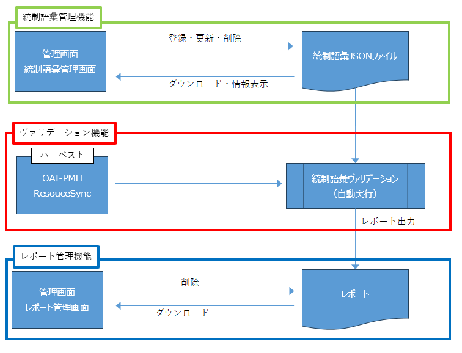
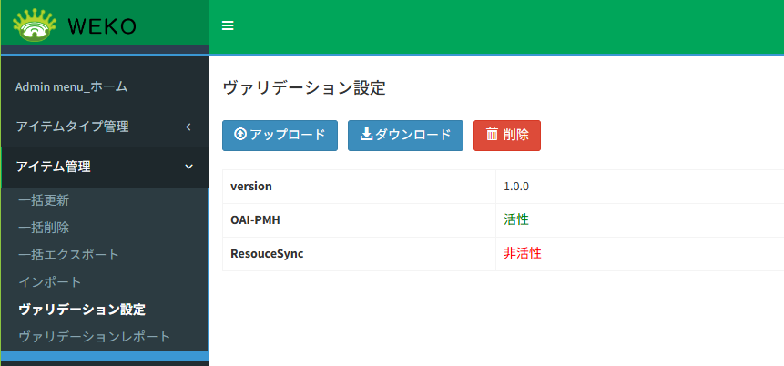
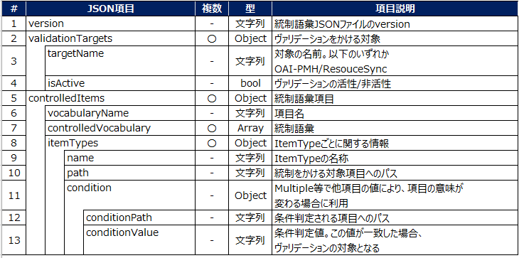
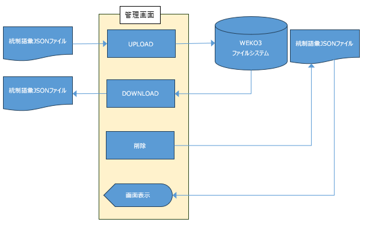
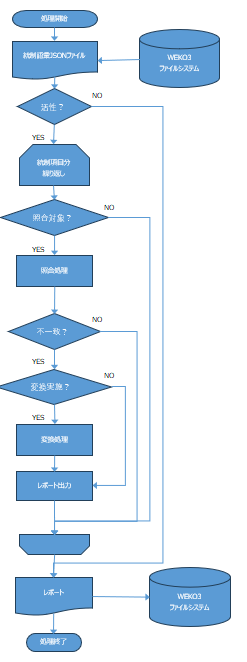

# ヴァリデーション設定

## 目的・用途
本機能は、管理者が統制語彙ヴァリデーションの設定ファイルを管理するための機能である。

## 利用方法
管理者は【Administration > アイテム管理（Items） > ヴァリデーション設定】を開き、  
統制語彙ヴァリデーション用の設定ファイルを登録する。

## 利用可能なロール

| ロール | システム管理者 | リポジトリ管理者 | コミュニティ管理者 | 登録ユーザー | 一般ユーザー | ゲスト（未ログイン） |
|------|:--------------:|:----------------:|:------------------:|:------------:|:------------:|:--------------------:|
| 利用可否 | 〇 | 〇 | × | × | × | × |

## 機能内容

### 統制語彙ヴァリデーション機能

統制語彙ヴァリデーション機能は、設定ファイルを登録し、その内容に基づいてヴァリデーションを実行し、  
ヴァリデーション結果のレポートを出力する機能である。

本機能が提供する機能は、以下の3つに分類される。

- 統制語彙管理機能
- ヴァリデーション機能
- レポート管理機能



なお、本機能を利用するには、コンフィグ値「WEKO_ADMIN_VALIDATION_ENABLE」が `True` に設定されている必要がある。

#### 統制語彙管理機能

ヴァリデーション設定は、この「統制語彙管理機能」に該当する。  
統制語彙に関する各種設定は、統制語彙 JSON ファイルに記載して管理する。
統制語彙 JSON ファイルは、WEKO のファイル管理機能により管理される。

#### ヴァリデーション機能

アイテム登録時に、登録されている統制語彙 JSON ファイルの内容に基づいてヴァリデーションを実行する。  
対象アイテムに統制語彙項目が定義されている場合、当該項目が統制語彙に一致しているかを検証する。
統制語彙に一致しない場合は、その内容をヴァリデーション結果としてレポートに出力する。
現時点では、ハーベスト（OAI-PMH、ResouceSync）によるアイテム登録時のみ、  
本ヴァリデーション機能を実行することが可能である。

#### レポート管理機能

レポート管理機能の詳細については、  
[ADMIN-2-7: ヴァリデーションレポート](./ADMIN_2_7.md) を参照すること。

## 画面仕様

### ヴァリデーション設定画面



| 機能 | 項目説明 |
|---|---|
| アップロードボタン | 設定ファイルをアップロードするボタンである。ボタンを押下すると OS 標準のファイル選択ダイアログが表示され、ファイルを選択すると登録される。<br>既に設定ファイルが登録されている状態で新しいファイルをアップロードした場合は更新扱いとなり、既存のファイルは削除され、新しくアップロードされたファイルが登録される。本機能ではバージョン管理を行わないため、更新前のファイルを取得することはできない。 |
| ダウンロードボタン | 登録されている設定ファイルをダウンロードするボタンである。設定ファイルが登録されていない場合は非活性となる。 |
| 削除ボタン | 登録されている設定ファイルを削除するボタンである。設定ファイルが登録されていない場合は非活性となる。 |
| バージョン情報 | 登録されている統制語彙 JSON ファイルに記載されたバージョン情報を表示する。設定ファイルが登録されていない場合は表示されない。 |
| OAI-PMH に関する設定状況 | 統制語彙 JSON ファイルにおいて、OAI-PMH のヴァリデーション機能が有効な場合は「活性」、無効な場合は「非活性」を表示する。設定ファイルが登録されていない場合は表示されない。 |
| ResouceSync に関する設定状況 | 統制語彙 JSON ファイルにおいて、ResouceSync のヴァリデーション機能が有効な場合は「活性」、無効な場合は「非活性」を表示する。設定ファイルが登録されていない場合は表示されない。 |

## ファイル仕様

### ファイルの保存場所

ファイルはコンフィグ値「WEKO_ADMIN_VALIDATION_STORAGE_LOCATION」で定義された名前のロケーションに保存される。

### 統制語彙 JSON ファイルの構成



実際の統制語彙 JSON ファイルは、以下のような構成となる。


```
{
  "version" : "0.0.1_sample",
  "validationTargets" : [
    { "targetName" : "OAI-PMH",  "isActive" : true  },
    {  "targetName" : "ResouceSync",  "isActive" : true }
  ],
  "controlledItems" : [
    {  "vocabularyName" : "Data Type",  "controlledVocabulary" : [・・・ 統制語彙 ・・・]  ],
      "itemTypes" : [
        {
          "identifier" : "/items/jsonschema/20",
          "name" : "Harvesting_DDI",
          "path" : "$.item_1588260046718[*].subitem_1591178807921"
        },
        {
          "identifier" : "/items/jsonschema/12",
          "name" : "Multiple",
          "path" : "$.item_1636460428217[*].subitem_1522657697257",
          "condition" : [
            {
              "conditionPath" : "$.item_1636460428217[*].subitem_1522657647525",
              "conditionValue" : "Other"
            }
          ]
        }
      ]
    }
    ・・・その他の統制語彙項目・・・
  ]
}
```

## 処理概要

### 統制語彙管理機能の処理概要



統制語彙は、統制語彙 JSON ファイルに記載された設定内容に基づいて管理される。  
登録された JSON ファイルは、WEKO3 のファイルシステム（S3 等）上で管理される。

統制語彙管理画面から、以下の操作を実施することが可能である。

- 統制語彙 JSON ファイルのアップロード  
- 統制語彙 JSON ファイルのダウンロード  
- 統制語彙 JSON ファイルの削除  
- 一部設定情報の画面表示  

---

### ヴァリデーション機能の処理概要



統制語彙 JSON ファイルに定義された設定内容を基に、対象アイテムに対してヴァリデーションを実行する。  
対象アイテムが統制語彙の対象項目を含む場合、その値が統制語彙に一致しているかを検証する。

統制語彙に一致しない場合は、以下の処理を実施する。

- 不一致の単語が変換条件を満たす場合、当該項目の値を変換する  
- 不一致情報をヴァリデーション結果としてレポートに出力する  

ヴァリデーション処理完了後、出力されたレポート情報をファイルシステムに登録する。

---

## 関連モジュール

- weko_admin：画面表示、ヴァリデーションの設定等を行う。

- weko_deposit：統制語彙ヴァリデーションを実施する。

## 更新履歴

| 日付       | GitHubコミットID                           | 更新内容                                        |
| ---------- | ------------------------------------------ | ----------------------------------------------- |
| 2026/01/15 |                                            | 初版作成                                        |
