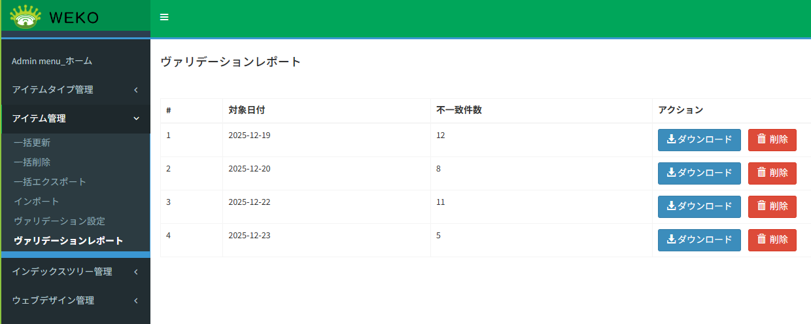
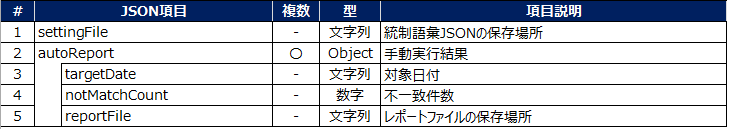
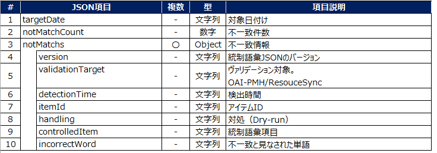
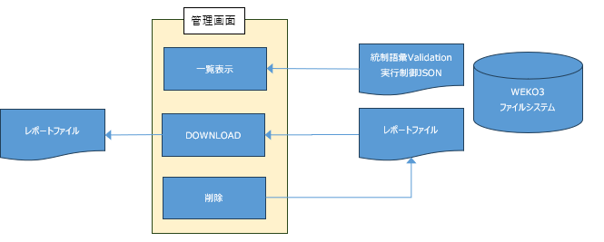

# ヴァリデーションレポート

## 目的・用途
本機能は、管理者が統制語彙ヴァリデーションにより生成されたレポートファイルを管理するための機能である。

## 利用方法
管理者は【Administration > アイテム管理（Items） > ヴァリデーションレポート】を開き、  
統制語彙ヴァリデーション結果のレポートファイルを取得または削除する。

## 利用可能なロール

| ロール | システム管理者 | リポジトリ管理者 | コミュニティ管理者 | 登録ユーザー | 一般ユーザー | ゲスト（未ログイン） |
|------|:--------------:|:----------------:|:------------------:|:------------:|:------------:|:--------------------:|
| 利用可否 | 〇 | 〇 | × | × | × | × |

## 機能内容

統制語彙ヴァリデーション機能の詳細については、  
[ADMIN-2-6: ヴァリデーション設定](./ADMIN_2_6.md) を参照すること。

### ヴァリデーションレポート機能

統制語彙ヴァリデーション機能により出力されたレポートを管理する機能である。
レポートの一覧情報は、統制語彙ヴァリデーション実行制御 JSON ファイルに記載されており、  
その内容を基に一覧表示を行う。
個別のレポートファイルは、ダウンロード操作により取得することが可能である。
レポートに対して削除操作が実行された場合、以下の処理を行う。

- レポートファイルの物理削除  
- 統制語彙ヴァリデーション実行制御 JSON ファイルに記載されている一覧情報からの削除  

なお、本機能を利用するには、コンフィグ値「WEKO_ADMIN_VALIDATION_ENABLE」が  
`True` に設定されている必要がある。

## 画面仕様

### ヴァリデーションレポート画面



| 項目 | 項目説明 |
|---|---|
| 対象日付 | ヴァリデーションレポートの対象日付である。レポートは日付単位で生成される。 |
| 不一致件数 | 対象日付に実施されたヴァリデーションにおいて、不一致が検出された件数である。 |
| ダウンロードボタン | ヴァリデーションレポートをダウンロードするボタンである。 |
| 削除ボタン | ヴァリデーションレポートを削除するボタンである。削除後は一覧から表示されなくなる。 |

## ファイル仕様

### 統制語彙ヴァリデーション実行制御 JSON のファイル構成



実際の統制語彙ヴァリデーション実行制御 JSON ファイルは、以下のような構成となる。


```
{
  "settingFile" : "XXXXXXXXXXXX",
  "autoReport" :  [
    { "targetDate" : "2025-12-19",  "notMatchCount" : 12, "reportFile" : "XXXXXXXXXXX"  },
    { "targetDate" : "2025-12-20",  "notMatchCount" : 8, "reportFile" : "XXXXXXXXXXX"  },
    { "targetDate" : "2025-12-22",  "notMatchCount" : 11, "reportFile" : "XXXXXXXXXXX"  },
    { "targetDate" : "2025-12-23",  "notMatchCount" : 5, "reportFile" : "XXXXXXXXXXX"  },
  ]
}

```

### ヴァリデーションレポートのファイル構成



実際のヴァリデーションレポートファイルは、以下のような構成となる。

```json
{
  "targetDate": "2025-10-17",
  "notMatchCount": 27,
  "notMatchs": [
    {
      "version": "0.0.1_sample",
      "validationTarget": "OAI-PMH",
      "detectionTime": "2025-10-17T12:07:33",
      "itemId": "HarvestingDDI_item1.json",
      "handling": "Dry-run",
      "controlledItem": "Topic",
      "incorrectWord": "テスト変換項目（Topic）"
    }
    ・・・その他の不一致項目・・・
  ]
}
```

## 処理概要

### ヴァリデーションレポート機能の処理概要



本機能は、統制語彙ヴァリデーションにより出力されたレポートを管理するための機能である。
レポートの一覧情報は、統制語彙ヴァリデーション実行制御 JSON ファイルに記載されており、  
その内容を基に一覧表示を行う。
個別のレポートファイルは、ダウンロード操作により取得することが可能である。
レポートに対して削除操作が実行された場合、以下の処理を行う。

- レポートファイルの物理削除  
- 統制語彙ヴァリデーション実行制御 JSON ファイルに記載されている一覧情報からの削除  

---

## 関連モジュール

- weko_admin：画面表示、ヴァリデーションのレポート管理を行う。

## 更新履歴

| 日付       | GitHubコミットID                           | 更新内容                                        |
| ---------- | ------------------------------------------ | ----------------------------------------------- |
| 2026/01/15 |                                            | 初版作成                                        |
