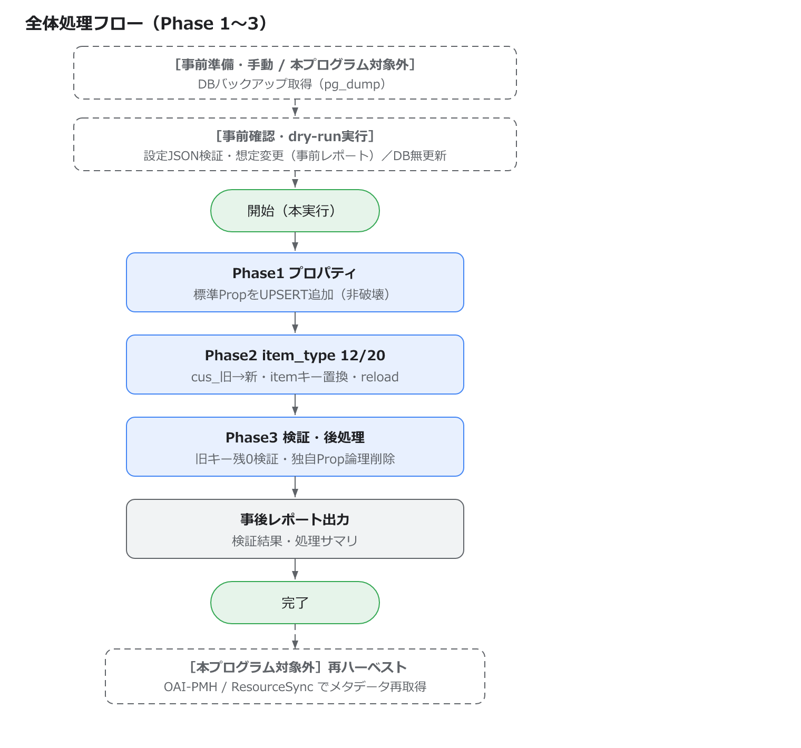

# JDCat マスタデータ移行プログラム 設計書

対象システム: Weko3（JDCatインスタンス）
対象作業: develop_v1.0.8系（＋JDCat固有対応 `feature/jdcat_202601`）→ develop_v2.0.0 へのバージョンアップに伴うマスタデータ移行

| 項目 | 内容 |
|---|---|
| 要求仕様 | 要求仕様：J2026-01_v4.docx |
| 関連資料（別紙） | [別紙_v3.xlsx](attachments/別紙_v3.xlsx)（NII様提供資料。別紙1〜3を各シートに収録。1.3参照） |
| 利用者マニュアル | [JDCat マスタデータ移行プログラム 利用者マニュアル](JDCat_Master_Data_Migration_Tool_Manual.md) |

---

# 1. 変更対象

## 1.1 ソースコード追加対象

https://github.com/RCOSDP/weko

本移行は既存スクリプトを修正せず、新規の移行プログラム一式を `scripts/demo/jdcat_migration/` 配下に**追加**する。各ファイルの役割と本書内の記載箇所を下表に示す。

| 記載箇所 | 追加ファイル |
|----------|----------|
| 3.2 | mapping_config.json（変換ルール設定ファイル。`convert_xlsx.py` の生成物。リポジトリ管理外の運用成果物） |
| 4.1 | scripts/demo/jdcat_migration/convert_xlsx.py（xlsx回答→設定JSON変換ツール） |
| 4.2 | scripts/demo/jdcat_migration/gen_properties.py（プロパティ定義 .py 生成補助ツール・開発時） |
| 5（全体） | scripts/demo/jdcat_migration/__init__.py |
| 5.1<br>5.3 | scripts/demo/jdcat_migration/config.py（設定JSON読込・検証） |
| 5.2 | scripts/demo/jdcat_migration/migrate.py（CLIエントリ） |
| 6（全体） | scripts/demo/jdcat_migration/engine.py（変換エンジン本体／フェーズ1〜3） |
| 6.1（参考） | scripts/demo/properties/ 配下のプロパティ定義 `.py`（「新設」プロパティがある場合のみ） |
| 6.3 | scripts/demo/jdcat_migration/report.py（dry-run／進捗／事後検証レポート） |

## 1.2 代替対象（本プログラムが置き換える既存スクリプト）

当初の移行依頼で実行予定だった次の4つの既存スクリプトを、本プログラムが置き換える。これらは新規構築環境を前提としており、JDCat本番に適用すると問題が生じるため、本プログラムに統合・再設計した（経緯は2.1参照）。各スクリプトの役割を下表に示す。

| 既存スクリプト（実行コマンド） | 役割 |
|----------|----------|
| `scripts/demo/register_properties.py overwrite_all` | item_type_property の再登録（TRUNCATE→静的ファイルで全置換） |
| `scripts/demo/renew_all_item_types.py only_specified ALL` | 全item_typeのproperty/mapping情報の再読込 |
| `scripts/demo/update_itemtype_multiple.py` | Multiple系item_typeのproperty/mapping書き換え（別紙3相当） |
| `scripts/demo/fix_issue_47128_jdcat.py` | 旧item/cus_プロパティID変換（別紙1・別紙2相当）※item/records_metadata変換は本プログラムでは行わない（2.4参照） |

<br/>

## 1.3 関連資料（別紙の定義）

変換ルールの参考資料として、NII様提供の [`別紙_v3.xlsx`](attachments/別紙_v3.xlsx) を参照する。本書で「別紙1」「別紙2」「別紙3」と記載するものは、いずれも同ファイル内の各シートを指す。

| シート | 内容 | 本プログラムでの扱い |
|---|---|---|
| 別紙1 | v2.0.0に伴う識別子（subitemキー）の変更仕様。 | 検証の正本。subitemキーは Phase2 の `reload()` が `properties/*.py` から再構成するため別紙1を直接は適用しないが、**`properties/*.py` のsubitem構造が別紙1どおりか**の検証に用いる（6.2前提条件）。 |
| 別紙2 | 「現在のitemキー ／ 項目タイトル(プロパティID) ／ 変換先プロパティ構造（subitem構成と型）」の定義。主に Harvesting DDI(20) と構造系フィールド。select値は `properties/property_config.py` を参照。 | 参考。①itemキー変換・③プロパティID変換の妥当性検証に使用。 |
| 別紙3 | v2.0.0で値が追加され、ハーベストでの値取得対応が必要な項目（作成者・寄与者・権利情報・助成情報 等）の要件一覧。 | 参考。記載の要件は v2.0.0 のプロパティ定義(`properties/*.py`)・mappingに反映済みで、Phase2 の `reload()` を通じて適用される（③ update_itemtype_multiple 相当）。本プログラムは別紙3を直接読み込まない。 |

※ [`別紙_v3.xlsx`](attachments/別紙_v3.xlsx) はNII様提供資料。

<br/>

---

# 2. 変更概要

## 2.1 背景

JDCatを `develop_v2.0.0` ベースへバージョンアップするにあたり、DDL変更・マスタデータ変更等の各種移行対応が必要となる。本書はそのうち**マスタデータ（item_type / item_type_property / item_type_mapping）の移行**を対象とする。

当初、NII様からは「1.2 代替対象」の4つの既存スクリプトを順に実行する移行が依頼された。しかし事前調査（`変換ツールの調査結果.xlsx`、および本番相当DBの実態調査）により、以下の問題が判明した。

- これらのスクリプトは「**新規構築(newbuild)環境＝静的ファイルの定義＝DBの実状態**」という前提で作られており、JDCat本番のように**独自の `item_type_property.id` 体系・独自プロパティを持つ既存DB**に適用すると、ID不一致と全置換によりデータを破壊する。
  - 本番DB調査の結果、`item_type_property` 全139件のうち**136件（97.8%）がJDCat独自ID**（3〜176, 10001〜10011）で、標準静的定義のID（123, 301-316, 1001-1057, 3001-3021）とほぼ重複しない。
  - `register_properties.py overwrite_all` の TRUNCATE により、この136件の独自プロパティが消失し、参照する全item_typeが破損する。
  - `update_itemtype_multiple.py` は `item_type_property.id` を基準に処理するため、本番と静的定義でIDが異なり、実行するとデータが壊れる。

以上より、**既存4スクリプトを置き換える、新規の移行プログラムを作成する**こととなった。本プログラムは、JDCat本番のID体系・独自プロパティを破壊せず、変換ルールを外部ファイルに切り出した**設定駆動・非破壊・冪等**な方式とする。

## 2.2 基本方針

| 方針 | 内容 |
|---|---|
| マスタデータのみ対象 | 本プログラムは `item_type` / `item_type_property` / `item_type_mapping` の移行のみを行う。**登録済みメタデータ（item_metadata / records_metadata）は更新しない**（2.4参照）。 |
| 設定駆動 | 変換ルールを**外部ファイル(JSON：`mapping_config.json`)に集約**する。プログラム本体は汎用エンジンとし、ルール変更時にコード修正を不要とする。 |
| 非破壊 | `item_type_property` を **TRUNCATEしない**。v2.0.0標準プロパティはUPDATEで更新し、JDCat独自プロパティと共存させる（独自IDと標準IDは数値域が重複しないため安全）。 |
| 冪等 | 変換済み（新キー形式）のitem_typeはスキップする。**再実行を安全に行える**。 |
| 安全 | dry-run（無更新の事前確認）・実行前バックアップ（運用手順。5.3）・トランザクション・失敗の記録継続。 |
| 検証可能 | 実行前（dry-run）・実行後（旧キー残存0件・未知プロパティ参照0件）のレポートを出力する。 |

## 2.3 対象範囲

- 対象 item_type: **12（Multiple） / 20（Harvesting DDI）** のみ（既存スクリプト踏襲。本番DBに実在することを確認済み）。


## 2.4 メタデータの扱い（重要）

**登録済みメタデータ（`item_metadata` / `records_metadata`）は本プログラムでは変換・更新しない。**

- バージョンアップ後、Wekoのハーベスト機能（**OAI-PMH / ResourceSync**）でメタデータを取得し直すため、既存メタデータをプログラムで個別変換する必要がない。
- したがって本プログラムは、ハーベストの取り込み先となる **item_type定義・mapping・プロパティ（マスタデータ）を v2.0.0 形へ整える**ことに専念する。整備後、再ハーベストにより v2.0.0 構造でメタデータが再生成される。
- これに伴い、旧設計にあった「メタデータ1件ごとのキー/subitem/値変換」（subitemキー変換②・構造変換 `transforms.py`・値変換 `value_maps`）は**不要となり、本設計から除外した**。

<br/>

---

# 3. 入出力

## 3.1 変換ルールの入力元（NII様回答資料）

変換ルールは、NII様に記入いただく次のExcelを正本とする。

- ファイル: `マッピング必要データ_XXXXXXXX.xlsx`（`XXXXXXXX` は版日付。例: `マッピング必要データ_20260423.xlsx`）
- 各シート（「変更後」列を item_type 12/20 分のみ記入）と、本プログラムでの扱い:

| シート | 内容（列） | 本プログラムでの扱い |
|---|---|---|
| item | 旧itemトップキー（`item_15xxxx`）→ 列「変更後」(=prop_name)、列「item_type_ids」 | ① itemトップキー変換に使用 |
| property | 旧プロパティID（列「旧id」）→ 列「変更後ID / 新id」 | ③ プロパティID変換に使用 |
| subitem | 旧subitemキー → 列「変更後」(=新subitemキー)、列「item_type_ids」 | **`gen_properties.py`（4.2）の subitemキー変換に使用**。移行本体（Phase1〜3）では未使用（subitemキーは `reload()` が `properties/*.py` から再構成。6.2参照）。 |

※ 上記のsubitemキー再構成は「`properties/*.py` の subitem 構造が v2.0.0仕様と一致していること」が前提となる。**別紙1・別紙2** は、`properties/*.py` がその仕様どおりかを確認する**検証の正本**として用いる（6.2 前提条件参照）。

## 3.2 変換ルール設定ファイル `mapping_config.json`（プログラムの実入力）

`マッピング必要データ_XXXXXXXX.xlsx` の回答内容を、変換ツール（4.1 `convert_xlsx.py`）でJSONへ変換したもの。本プログラムはこのJSONのみを参照して動作する。

```jsonc
{
  "meta": { "source": "マッピング必要データ_20260423.xlsx", "target_item_types": [12, 20] },

  // ③ propertyシート「旧id→新id」由来。render の input_type "cus_<旧>" を "cus_<新>" に変換する
  "property_id_map": { "8": 1014, "17": 1010, "67": 1001, "176": 1017 /* ... */ },

  // ① itemシート由来。item_type別に「旧itemトップキー → prop_name」
  "item_key_map": {
    "12": { "item_1551264308487": "title", "item_1636457801246": "identifier" /* ... */ },
    "20": { "item_1551264308487": "title", "item_1586253224033": "unit_of_analysis" /* ... */ }
  }
}
```

## 3.3 出力（レポート）

`report.py` が次を出力する（出力先・形式は実装時に確定）。

- dry-runレポート: 変換対象（item_type 12/20）の件数、未マッピング識別子の一覧、想定変更内容。
- 進捗ログ: フェーズごとの処理結果。
- 事後検証レポート: item_type定義に旧キー（`item_15xxxx`）残存件数、未知プロパティ参照件数。
- **対象なしの明記**: 各フェーズで処理対象が無い場合（例: Phase1 で UPDATE対象が無い）は、レポートにその旨（対象なし）を明記する。

## 3.4 item_type定義に対する変換内容（itemキー変換・プロパティID変換）

本プログラムは item_type 定義（schema/form/render/mapping）に対する2階層の変換のみを行う。いずれも `マッピング必要データ_XXXXXXXX.xlsx`「property」シートで決まる「旧プロパティID → 新プロパティID」の対応を起点として導出される。`render.meta_list[<itemキー>].input_type` の値 `"cus_<id>"` の `<id>` は `item_type_property.id` を指すため、③はpropertyシートと一対一で対応する。

```
起点: マッピング必要データ_XXXXXXXX.xlsx「property」シート（列「旧id」→「変更後ID/新id」）
   │
   ├─ ③ プロパティID変換 : render.meta_list[key].input_type の "cus_<旧id>" → "cus_<新id>"
   └─ ① itemトップキー変換 : "item_15xxxx" → "item_<item_type_id>_<prop_name>_<連番>"
```

- subitemキー・各プロパティの内部構造は、変換後に `ItemTypes.reload()` が `properties/*.py` のプロパティ定義から再構成するため、本プログラムが個別に変換することはない。
- （メタデータ側の subitem/構造/値の変換は再ハーベストで対応するため対象外。2.4参照。）

<br/>

---

# 4. 追加ファイルの詳細（ツール）

## 4.1 scripts/demo/jdcat_migration/convert_xlsx.py（xlsx回答 → 設定JSON変換ツール）

- 入力: 記入済み `マッピング必要データ_XXXXXXXX.xlsx`（item / property シート）。
- 出力: `mapping_config.json`（3.2のスキーマ）。
- 処理: 各シートを読み、レイヤー別（`property_id_map` / `item_key_map`）に整形する。未記入（#N/A）や不整合（itemシートの prop_name と propertyシートの新idが同一のv2.0.0プロパティを指していない等）を**警告として出力**する。

<br/>

## 4.2 scripts/demo/jdcat_migration/gen_properties.py（プロパティ定義 .py の生成補助ツール・開発時）

`properties/*.py` を0から手書きする工数を抑えるため、現状DBの `item_type_property` を雛形に `properties/*.py` のドラフトを生成する**開発時ツール**。生成時に subitemキーを別紙1のマップで変換する。

- 入力: DB接続、対象プロパティID、subitemキー変換マップ（`マッピング必要データ` の subitem シート／別紙1 由来）、出力先ディレクトリ。
- 出力: 既存 `properties/*.py` と同体裁の `.py`（`property_id` / `name_ja`(=DBの `name`) / `schema()` / `form()` / `forms` / `mapping`(=`DEFAULT_MAPPING`) / `add()`）。`schema`/`form`/`forms` はDB値にsubitemキー変換を適用。文字列は**UTF-8**で出力する。
- 確認済みのDB構造（実DB調査）: `item_type_property` は `schema`/`form`/`forms`（JSONB）を持ち、**`mapping` カラムは持たない**。`schema` は `properties.<subitemキー> = {type,title,format,(enum)}`、`form` は既に `parentkey.<subitemキー>` 形式（reloadの `parentkey` 置換規約と一致）。構造が規則的なため機械生成が可能。
- 位置づけ・注意:
  - **開発時に `.py` のたたき台を作るための補助ツール**であり、移行本体（Phase1〜3）では使用しない。
  - **主用途は「新設」プロパティのドラフト生成**。対応先が既存標準にあるプロパティは既存 `properties/*.py` を用いる（旧構造の再現を避けるため生成しない）。
  - 別紙2/3が対象とするフィールドの v2.0.0定義は概ね既存 `properties/*.py` に揃っているため、本ツールの主対象（既存定義が無い新設プロパティ）で別紙2/3の追加対応が要るケースは少ない。該当する少数のみ、生成後に別紙2・別紙3を見て**手修正で補完・検証**する（現状DBは v1.0.8世代のため、v2.0.0の追加 subitem/値は自動では入らない）。
  - `mapping` はDBに無いため `DEFAULT_MAPPING` を置く。JPCOAR等の実マッピングは別途設定する。
  - 補助として、生成物と既存標準 `properties/*.py` を diff すれば「現状DB構造 vs v2.0.0標準」のズレを洗い出せる（検証に有用）。

<br/>

---

# 5. プログラム構成

## 5.1 ファイル構成

```
scripts/demo/jdcat_migration/
  __init__.py
  config.py          # mapping_config.json の読込・スキーマ検証・整合チェック
  convert_xlsx.py    # xlsx回答 → mapping_config.json（4.1）
  gen_properties.py  # DB → properties/*.py ドラフト生成（開発時。4.2）
  engine.py          # 変換エンジン本体（フェーズ1〜3。6章）
  migrate.py         # CLIエントリ（invenio shell から実行）
  report.py          # dry-run / 進捗 / 事後検証レポート
  JDCat_Master_Data_Migration_Design_Spec.md          # 本書
```

依存するDB構造（本番相当DBで確認済み）:
- `item_type(schema jsonb, form jsonb, render jsonb)` … `render.meta_list[<itemキー>].input_type = "cus_<item_type_property.id>"`
- `item_type_mapping(item_type_id, mapping jsonb)`
- `item_type_property(id, name, schema jsonb, form jsonb, forms jsonb, delflg)`
- プロパティ定義: `scripts/demo/properties/<name>.py`（`property_id`／`schema()`／`form()`／`forms`／`mapping`／`add()` を公開）

※ `item_metadata` / `records_metadata` は本プログラムの更新対象外（2.4）。

## 5.2 実行方法（scripts/demo/jdcat_migration/migrate.py）

```
invenio shell scripts/demo/jdcat_migration/migrate.py \
    --config mapping_config.json --item-types 12,20 \
    --dry-run
```

- `--config` : 3.2 の設定JSONファイルのパス
- `--item-types` : 対象item_type（既定 12,20）
- `--dry-run` : 無更新で検証・想定変更のみ出力（事前確認用。5.3）

> **補足**: `invenio shell`（実体は IPython）経由では `--` フラグが IPython に横取りされスクリプトへ届かないため、本番実行時は環境変数（`JDCAT_*`）で引数を渡す。具体的なコマンド例は[利用者マニュアル](JDCat_Master_Data_Migration_Tool_Manual.md)を参照。

<br/>

## 5.3 実行前の準備・事前確認（運用手順）

本プログラムの本実行（Phase1〜3）の前に、運用手順として次を実施する。

1. **DBバックアップ取得**（手動・本プログラム対象外）: 対象テーブル（`item_type` / `item_type_mapping` / `item_type_property`）を `pg_dump` 等で取得する。異常時はこのバックアップからリストアする（7章）。
2. **dry-run実行で事前確認**: `migrate.py --dry-run` を実行し、次を確認する（DB無更新）。
   - 設定JSON（`mapping_config.json`）の検証: 参照する新idに対応する property定義が `properties/` に存在するか／ID重複がないか／item_type 12・20 が実際に参照する全 `cus_<id>` が `property_id_map` で網羅されているか（未網羅は警告一覧として出力）。
   - 変換対象・未マッピング識別子・想定変更内容（**事前レポート**）。

<br/>

---

# 6. 処理フェーズ（engine.py）

## 6.0 処理フロー概要



- 本実行（Phase1〜3）の前提として、DBバックアップ取得と dry-run による事前確認を運用手順で行う（5.3参照）。本実行時も開始時に設定JSONを検証し、不正があれば中断する。
- **Timestamp更新の抑止**：`migrate.py` は実行全体を try/finally で囲み、開始時に `weko_records` の `Timestamp.before_update` イベントリスナーを一時解除、終了時に復元する。これにより移行に伴う更新で `item_type` / `item_type_property` / `item_type_mapping` の `updated` 列が自動書き換えされないようにする（newbuild の `update_W2025-29.py` と同方式）。
- 移行後、メタデータは OAI-PMH / ResourceSync の**再ハーベスト**により v2.0.0 構造で再取得される（本プログラム対象外。2.4参照）。

<br/>

## 6.1 Phase 1: properties（register_properties.py の代替・非破壊）

- TRUNCATEしない。`scripts/demo/properties/` の定義から**v2.0.0標準プロパティをUPDATEで更新**する。これにより不足している標準ID（123, 301-316, 1001-1057, 3001-3021）が追加される。
- 新設プロパティは、`properties/` 配下に `.py` を追加し `properties/__init__.py` に取り込めば本フェーズで**自動的に登録**される（設定ファイルへの記載は不要）。JDCat独自プロパティは**この時点では残置**（Phase3で掃除）。
- **UPDATE対象（追加・更新すべきプロパティ）が無い場合は、レポートに「対象なし」を明記する**（処理が空振りしたのか、対象が元々無いのかを判別できるようにする）。
- UPDATEのため冪等。

## 6.2 Phase 2: itemtype（renew_all_item_types.py / update_itemtype_multiple.py / fix_issue_47128_jdcat.py 前半の代替）

対象 item_type 12/20 について:
1. `render.meta_list[<itemキー>].input_type` を `property_id_map` で `cus_<旧>` → `cus_<新>` に置換（既に新IDならスキップ）。
2. `item_key_map[<item_type_id>]` から `id_match_key` を構築（旧itemキー → `item_<item_type_id>_<prop_name>_<連番>`）。**既に `item_<item_type_id>_*` 形式ならスキップ**（冪等）。
3. `schema` / `form` / `render` および `item_type_mapping.mapping` を旧→新キーで置換。
4. `ItemTypes.reload(<item_type_id>, mapping, [], 'ALL')` で対応先プロパティの schema/form/mapping を反映する（対象を12/20に限定し、他item_typeをWeko共通定義で無差別上書きしない）。subitemキー・プロパティ内部構造はこの `reload()` で `properties/*.py` から再構成される（schema/formは置換、mappingはプロパティ既定を土台に再構成。`update_mapping_without_static`）。
- item_type単位でcommit。

**前提条件（重要）**: 上記4の `reload()` は `properties/*.py` の内容をそのまま反映するため、**対象プロパティの `properties/*.py` が v2.0.0仕様（別紙1・別紙2の subitem 構造）と一致していること**が前提となる。新設プロパティや構造変更があるプロパティは、本実行前に `properties/*.py` を別紙1・別紙2どおりに整備・検証しておく必要がある。なお、新設プロパティの `.py` は `gen_properties.py`（4.2）で現状DBから雛形生成し（subitemキー変換込み）、別紙2・別紙3で補完・検証できる。

## 6.3 Phase 3: verify & cleanup（report.py）

- 検証: 対象item_typeの `item_type` 定義（schema/form/render/mapping）に旧 `item_15xxxx` の残存が0件、未知プロパティ参照が0件であること。
- （opt-in）どの item_type からも参照されなくなったJDCat独自プロパティを論理削除（`delflg=true`）。
- 事後レポートを出力する。

<br/>

---

# 7. 冪等性・再実行・ロールバック

- dry-run（`--dry-run`）により、DBを更新せず想定変更を事前確認できる（5.3）。
- Phase1はUPDATE、Phase2はキー形式で「変換済み」を判定してスキップするため、**何度実行しても安全**。
- **処理中にエラーが発生した場合は当該トランザクションがロールバックされ、DBは変更前の状態に保たれる**。通常のエラーはこれで回復し、冪等な再実行で続行できる（リストアは不要）。
- バックアップ（5.3）からのリストアは、トランザクションのロールバックや再実行で回復できない**想定外の事態**（例: 部分コミット後の不整合・データ破損）に備えた**最終手段**である。

<br/>

---

# 8. 性能

- 処理対象はマスタデータ（プロパティ群＋item_type 2件）のみで件数が小さく、性能上の懸念はない（メタデータ約14.9万件はハーベスト側で再取得するため本プログラムでは処理しない）。
