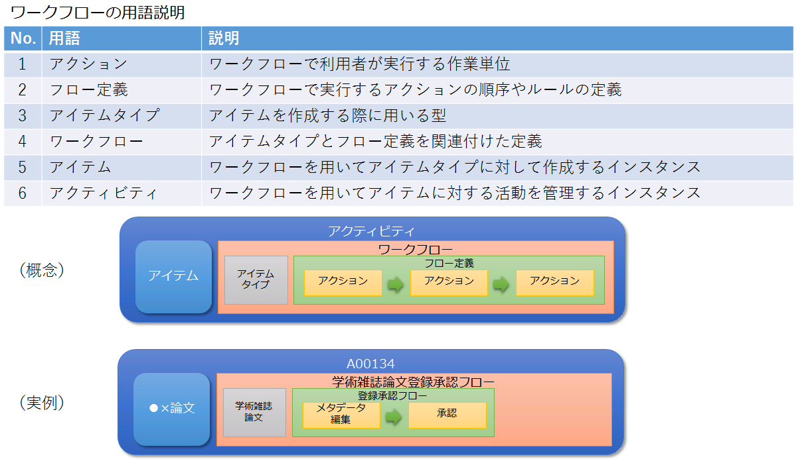

# アクティビティ一覧表示

## 目的・用途

アクティビティとは、ワークフローを用いてアイテムに対する活動を管理するインスタンスである。

アクティビティ一覧はアイテムが登録中／編集中／終了のいずれであるかを一覧化して管理している機能である。

## 利用方法

WEKO3へログイン後、[WorkFlow]タブを押下することで、アクティビティ一覧が表示される。

アイテムを登録するには、アクティビティ一覧の[New Activity]ボタンを押下することで、ワークフロー一覧が表示される。

## 利用可能なロール

| ロール   | システム管理者 | リポジトリ管理者 | コミュニティ管理者 | 登録ユーザー | 一般ユーザー | ゲスト(未ログイン) |
| -------- | :------------: | :--------------: | :----------------: | :----------: | :----------: | :-----------------: |
| 利用可否 |       ○       |        ○        |         ○         |      ○      |               |                      |

## 機能内容

### 1. アクティビティ一覧を表示する

  - TOPページから「ワークフロー」タブを押すと、アクティビティ一覧が状態別に表示される

      - デフォルト：「ToDo」タブ

      - アクティビティに対して、以下の情報を表示する

| #   | 表示項目               | 説明                                                                                                                                |
| --- | ---------------------- | ----------------------------------------------------------------------------------------------------------------------------------- |
| 1   | No.                    |                                                                                                                                       |
| 2   | 作成日（Created）      | アクティビティの作成日付 フォーマット：YYYY-MM-DD デフォルト値としてサーバ日付を設定する（サーバ日付は/api/admin/get_server_dateから取得する） |
| 3   | 更新日（Updated）      | アクティビティの更新日付 フォーマット：YYYY-MM-DD                                                                                |
| 4   | Activity               | アクティビティID リンクを押すと、ワークフローの該当アクション画面に遷移する                                                      |
| 5   | アイテム（Item）       | アイテムのタイトル※1                                                                                                                |
| 6   | ワークフロー（WorkFlow） | ワークフロー名                                                                                                                     |
| 7   | アクション（Action）   | アクティビティの実行中アクション                                                                                                    |
| 8   | ステータス（Status）   | アクティビティのステータス 「作業中」(Doing)：アクティビティが登録中/編集中/承認待ち 「作業済」(Done)：アクティビティが終了 「中止」(Canceled)：アクティビティが強制終了 |
| 9   | User                   | アイテム編集中はアクティビティを作成したユーザーのメールアドレス、Approval後は承認者のメールアドレスを表示する                       |
| 10  | Approver               | 承認者のユーザー名を表示する。ユーザー名が設定されていない場合、承認者のメールアドレスを表示する                                    |
| 11  | Approver Email         | 承認者のメールアドレスを表示する。設定により非表示にできる                                                                          |

  - 各タブの概要

      - 「ToDo」タブ

          - 登録者または、処理権限を有するユーザーに対して、登録中/編集中のアクティビティを表示する

          - 承認者の場合、承認待ちのアクティビティも表示する

      - 「Wait」タブ

          - 登録者または、処理権限を有するユーザーに対して、承認者の承認待ちのアクティビティを表示する

      - 「すべて（All）」タブ

          - 登録者または、処理権限を有するユーザーに対して、登録中/編集中／完了のアクティビティを表示する（承認待ちのものは表示しない）

          - 承認者の場合、承認待ちのアクティビティも表示する

          - アクティビティ一覧のダウンロード、クリアができる。

  - 各タブに表示される内容

| ロール             | ToDo                                                                                                                                                                                        | Wait                                          | All                                                                                                                                                                                                                                                                                                    |
| ------------------ | -------------------------------------------------------------------------------------------------------------------------------------------------------------------------------------------- | ---------------------------------------------- | ------------------------------------------------------------------------------------------------------------------------------------------------------------------------------------------------------------------------------------------------------------------------------------------------------- |
| システム管理者     | 自分で作成したアイテムの承認待ちのもの 自分が入力途中のもの リポジトリ管理者が作成したアイテムの承認待ちのもの コミュニティ管理者が作成したアイテムの承認待ちのもの 登録者が作成したアイテムの承認待ちのもの 代理登録が設定されたアクティビティは表示されない |                                                 | 自分で作成したアイテムの承認待ちのもの 自分が入力途中のもの 自分が入力をキャンセルしたアクティビティ リポジトリ管理者が作成したアイテムの承認待ちのもの リポジトリ管理者の入力途中のもの リポジトリ管理者が入力をキャンセルしたアクティビティ コミュニティ管理者が作成したアイテムの承認待ちのもの コミュニティ管理者の入力途中のもの コミュニティ管理者が入力をキャンセルしたアクティビティ 登録者が作成したアイテムの承認待ちのもの 登録者の入力途中のもの 登録者が入力をキャンセルしたアクティビティ 他のシステム管理者が入力途中のアクティビティ |
| リポジトリ管理者   | 自分で作成したアイテムの承認待ちのもの 自分が入力途中のもの システム管理者が作成したアイテムの承認待ちのもの コミュニティ管理者の承認待ちのもの 登録者が作成したアイテムの承認待ちのもの 代理登録が設定されたアクティビティは表示されない | | 自分で作成したアイテムの承認待ちのもの 自分が入力途中のもの 自分が入力をキャンセルしたアクティビティ システム管理者が作成したアイテムの承認待ちのもの システム管理者の入力途中のもの システム管理者が入力をキャンセルしたアクティビティ コミュニティ管理者が作成したアイテムの承認待ちのもの コミュニティ管理者の入力途中のもの コミュニティ管理者が入力をキャンセルしたアクティビティ 登録者が作成したアイテムの承認待ちのもの 登録者の入力途中のもの 登録者が入力をキャンセルしたアクティビティ 他のリポジトリ管理者が入力途中のアクティビティ |
| コミュニティ管理者 | 自分が入力途中のもの 代理登録が設定されたアクティビティは表示されない 自分で作成したアイテムの承認待ちのものは表示されない | | 自分で作成したアイテムの承認待ちのもの 自分が入力途中のもの 自分が入力をキャンセルしたアクティビティ 他のコミュニティ管理者が入力途中のアクティビティ |
| 登録者             | 自分が入力途中のもの 代理登録が設定されたアクティビティは表示されない ※ | 自分で作成したアイテムの承認待ちのものを表示する | 自分が入力途中のもの 自分が入力をキャンセルしたアクティビティ ※ |

※何らかのフローでAction Userに指定されており、実行中アクションがそれであるワークフローはすべて表示される

  - 代理登録機能

      - アクティビティのItem RegistrationアクションにあるContributorエリアに"Other User"としてユーザ名またはEmailを設定しておけば、設定されたユーザは以下の条件に合致する場合のみ該当アイテムに「編集」ボタンが表示されて、アイテムの編集をすることが可能

          - WEKO_ITEMS_UI_PROXY_POSTING が True の場合、設定されたすべてのユーザ

          - WEKO_ITEMS_UI_PROXY_POSTING が False の場合、設定されたユーザの末尾のユーザ

  - ゲストユーザーがアクティビティ一覧のURLを直接入力してアクセスしようとした際はログイン画面に移動する

  -   
    承認アクションが複数ある場合の挙動は以下の通り

### 2. アクティビティ一覧にフィルタリングとページングできる

  - フィルタリング

      - フィルタリングがアクティビティ一覧の上部に表示される

          - デフォルトの表示項目：登録日（Created）  
            登録日での開始日：1年前の当日

          - 「フィルターを追加▼」をクリックすると、以下の追加可能なフィルタリストを表示し、フィルタ名をクリックすると当該フィルタの入力エリアを追加する

              - ワークフロー

              - User

              - アイテム

              - ステータス  
                選択肢：作業中、作業済、中止

              - アクション  
                選択肢：Start、End、Item Registration、Approval、Item Link、OA Policy Confirmation、Identifier Grant

          - 各フィルタ項目の入力形式／検索方式／初期値

              - 登録日（日付／範囲指定／(自)1年前の当日(至)入力なし ）常設とする

              - アイテム（テキスト／前方一致／入力なし）。複数可。

              - ワークフロー（テキスト／前方一致／入力なし）。複数可。

              - ステータス（チェックボックス／完全一致／選択なし）。1つのみ。

              - アクション（チェックボックス／完全一致／選択なし）。1つのみ。

              - User（テキスト／完全一致／入力なし）。複数可。

          - 追加されたフィルタの入力エリアに[×]ボタンを押すと、該当フィルターの入力エリアを削除する

          - 設定したフィルタは[Apply(適用)]ボタンを押下することで一覧に適用される

          - 表示されている条件についてAND検索する

          - 適用されたフィルタの内容は各タブ（ToDo, Wait, All）間で引き継がれる

  - ページング

      - ページ当たりの表示数（Display Number）をプルダウンより選択できる

      - 選択可能な件数は「20, 50, 75, 100」でデフォルトは「20」とする

      - ページングナビゲーションを操作することで、表示内容が切り替わる

      - 表示数は、ToDo、Wait、Allタブそれぞれ個別に適用される

  - アクティビティとアイテムとの関連は以下の通り。

      - アイテムを新規登録：　アクティビティXが作られる

      - アイテムAとして登録してワークフロー終了：　アイテムAはアクティビティXに紐づいている

      - アイテムAを編集する：　アクティビティYが作られ、編集中のアイテムAはアクティビティYに紐づく

      - アイテムAの編集完了（バージョンを上げない）：　編集後のアイテムAはアクティビティYに紐づいている。編集前のアイテムAはアクティビティXに紐づいたまま

      - 再度アイテムAを編集する：　アクティビティZが作られ、編集中のアイテムAはアクティビティZに紐づく

      - アイテムAの編集完了（バージョンを上げる）：　アイテムA(ver2)がアクティビティZに紐づく。アイテムA(ver1)はアクティビティYに紐づいたまま

### 3. TSVファイルダウンロード

アクティビティをDBから物理削除する前のバックアップとして、TSVファイルにアクティビティログをダウンロードする。

【前提条件】

  - 利用者のロールが、システム管理者またはリポジトリ管理者であること。

  - アクティビティ一覧で、「すべて（All）」タブの内容を表示していること。

  - instance.cfg(invenio.cfg) で、DELETE_ACTIVITY_LOG_ENABLE = Trueであること。

［ダウンロード（Download）］ボタンを押すと、表示中のフィルタリング条件に従った内容のTSVファイルがダウンロードされる。

TSVファイルに書き込まれる件数は、以下の定数によって制限されている。

  - パス：modules/weko-workflow/weko_workflow/config.py

      - 設定キー：WEKO_WORKFLOW_ACTIVITYLOG_BULK_MAX

制限より多い件数のアクティビティログをダウンロードするときは、workflow_activityテーブルのid降順で制限まで取得する。

### 4. アクティビティ削除

アクティビティを、表示中の全件または１件物理削除する。

【前提条件】

  - 利用者のロールが、システム管理者またはリポジトリ管理者であること。

  - アクティビティ一覧で、「すべて（All）」タブの内容を表示していること。

  - 表示中のフィルタリング条件で、アクティビティが１件以上表示されていること。

  - instance.cfg(invenio.cfg) で、DELETE_ACTIVITY_LOG_ENABLE = Trueであること。

  - ［ダウンロード（Download）］ボタンの隣に表示されている［クリア（Clear）］ボタンを押すと、表示中のフィルタリング条件に従ったアクティビティが全件物理削除される。

  - アクティビティ一覧の各行に表示されている［クリア（Clear）］ボタンを押すと、その行のアクティビティが物理削除される。

  - 削除時、確認ダイアログを表示することで確認を行う。

  - 実行中のアクティビティを削除する場合は、アクティビティを強制終了する。

  - 削除すると同時に削除対象のアクティビティのTSVファイルがダウンロードされる。

  - 全件削除時、削除件数は以下の定数によって制限されている。

      - パス：modules/weko-workflow/weko_workflow/config.py

      - 設定キー：WEKO_WORKFLOW_ACTIVITYLOG_BULK_MAX

  - 制限より多い件数のアクティビティを削除するときは、workflow_activityテーブルのid降順で制限に達するまで削除する。

### 5. 制限公開用のコンテンツファイル

制限公開用のコンテンツファイルプロパティ（以下、コンテンツプロパティ）を利用し、登録したコンテンツファイルのライセンスとアクセス制限のフローを指定できる。

アクセスには、以下の5つがあり、ラジオボタンで１つのみ選択できる。

1.  オープンアクセス\
    コンテンツファイルに誰でもアクセスできる。

2.  オープンアクセス日を指定する\
    指定された公開日以降かつ指定されたロールのユーザーのみ、コンテンツファイルにアクセスできる。\
    以下が表示される。

    1.  ロール\
        コンテンツファイルにアクセスできるユーザーのロールをプルダウンから指定する。(複数指定可能)\
        accounts_roleテーブルにロールの一覧が定義されている。

        1.  Newボタン押下：ロールを1セット追加する。

        2.  ×ボタン押下：ロールを1セット削除する。

        3.  同一ロールは選択できない。

3.  ログインユーザーのみ\
    指定されたロールのユーザーのみ、コンテンツファイルにアクセスできる。\
    以下が表示される。

    1.  ロール\
        コンテンツファイルにアクセスできるユーザーのロールをプルダウンから指定する。(複数指定可能)\
        accounts_roleテーブルにロールの一覧が定義されている。

        1.  Newボタン押下：ロールを1セット追加する。

        2.  ×ボタン押下：ロールを1セット削除する。

        3.  同一ロールは選択できない。

4.  公開しない\
    システム管理者、アイテム登録者以外にはコンテンツファイルを公開しない。

5.  制限公開\
    以下が表示される。※データタイプは削除する。

    1.  提供方法

        1.  ワークフロー\
            コンテンツファイルを提供するワークフローをプルダウンから指定する。\
            workflow_workflowテーブルのopen_restrictedがONのワークフローの一覧が定義されている。

        2.  ロール\
            コンテンツファイルにアクセスできるユーザーのロールをプルダウンから指定する。\
            accounts_roleテーブルにロールの一覧が定義されている。

        3.  Newボタン押下：①②を1セット追加する。

            1.  上限は設定しない。

            2.  重複チェックは行わない。

        4.  ×ボタン押下：①②を1セット削除する。

    2.  利用規約\
        自由入力または登録済みの利用規約からプルダウンで選択する。\
        自由入力を選択した場合、利用規約入力欄が表示され、任意の利用規約を入力できる。

  - 関連モジュール

  - weko_workflow

  - 処理概要

1. 設定

- アクティビティの各タブを定義する（開発に使用している）

  - パス： <https://github.com/RCOSDP/weko/blob/v0.9.22/modules/weko-workflow/weko_workflow/config.py#L278-L182>

  - 設定キー及び設定値：

- WEKO_WORKFLOW_TODO_TAB = 'todo'

- WEKO_WORKFLOW_WAIT_TAB = 'wait'

- WEKO_WORKFLOW_ALL_TAB = 'all'

2. 実装方法

- 対応しているモジュール：weko_workflow

- アクティビティ一覧

  - ログインしているユーザーの権限に応じてデータを「get_activity_list」メソッドでデータベースから取得する

      - 「ToDo」タブに対して

          - 管理者の権限には、以下の条件でデータを取得する

- 【条件】  
- ステータス：作業中、承認待ちではない

  - フローに設定されている承認者には、追加で以下の条件でデータを取得する

- 【条件】  
- ステータス：作業中、承認待ち  
- アクティビティの承認者

  - 他の権限には、以下の条件でデータを取得する

- 【条件】  
- ステータス：作業中、承認待ちではない  
- アクティビティの作成者、または代理者

  - 「Wait」タブに対して

      - 該当承認者には、以下の条件でデータを取得する

- ステータス：作業中、承認待ち

  - 取得されたデータをUIに以下のテンプレートで表示する

- テンプレート： <https://github.com/RCOSDP/weko/blob/v0.9.22/modules/weko-workflow/weko_workflow/templates/weko_workflow/activity_list.html>

- デフォルトの表示数：20  
- ページ：1

- フィルタリング

  - アクティビティ一覧での「適用」ボタンを押すと、UIに入力されているフィルタリングの情報を検索条件とし、満たすデータを「filter_conditions」メソッドでデータベースから取得する  
    - フィルタリングの対象：「createdfrom」、「createdto」、「workflow」、「user」、「item」、「status」

  - フィルタリングされたデータをUIに選択されている表示数で表示する

- ページング

  - データをデータベースから取得する時、表示数を元に、表示のページを取得されたアクティビティ一の総数で数える

- TSVファイルダウンロード

  - views.py::download_activitylog()メソッド

- アクティビティ削除

  - views.py::clear_activitylog()メソッド

【補足】

  - バージョンを「上げる/上げない」それぞれのアクティビティの挙動

    1. アイテムバージョンを上げないときにはアクティビティはver1に紐づく

    2. 編集終了後にver2になったときにはアクティビティはver2に紐づく

  - アクティビティが生成されるタイミングは、以下の時点

    1. アクティビティの作成画面（workflow/activity/new）に［新規］（New）ボタンを押す時点

    2. アイテム詳細画面に［編集］（Edit）ボタンを押す時点

  - アイテム編集時、バージョンを変えない場合はアクティビティが増えていく

  - ワークフロー一覧のユーザはユーザメールアドレスが表示される

  - ワークフロー一覧のwaitに表示されるものは承認待ちの状態。  
    - 処理（承認）できる権限は、システム管理者、リポジトリ管理者、該当のコミュニティ管理者、または【Administration - ワークフロー管理（WorkFlow） - フロー（Flow List）画面】の該当のフローにて、「Approval」に指定されているアクションロール、アクションユーザ

  - アクティビティが終了とするとき、アクティビティのアクションが「End」に移動、「End」アクションのステータスが「作業済」となる。

  - アイテム編集時、アイテムバージョンを上げた場合、アイテムを新規レコードとして作成し、アイテムの情報を保存する

  - 過去のアイテムが、どのアクティビティに紐づいていたのかの関係は画面上確認ができない。  
    - 各アイテムバージョンの情報及び、アクティビティの情報は【Administration - レコード管理（Records） - 永続識別子（Persistent Identifier）】画面で管理されている。

  - アクティビティが生成されると新規UUIDへ紐づけを行う

  - アイテム削除したアクティビティもAllタブには残る。アクティビティのリンクを押下すると、エラー画面が表示される。

- アイテムメタデータのエスケープ処理は以下の通り。インデックス名や著者名に対しても同様に処理する

  - メタデータ保存時

      - メタデータをJSON形式で保存。メタデータの文字で、JSON形式の文字の同じと文字がある場合、JSONに「￥"」に変換して保存する。

  - メタデータの出力時

      - OAI-PMH出力  
        - DBに保存しているメタデータから、pythonでOAI-PMH出力される。  
        - python処理でJSONからの「￥"」文字を「"」に変換して出力するため、OAI-PMH出力時にメタデータと同じように表示される

      - NFKD正規化を行う。

      - 一括エクスポート、JSON出力  
        - エクスポートファイルの形式によって、特殊文字がエスケープされる。  
        - 一括エクスポートファイルの形式は「.tsv」であり、「"」を「""」文字に変換して出力する。  
        - JSON出力ファイルの形式は「.json」であり、出力時の処理は上記のDB保存の処理と同様。

## 実装補足（v2.0.2 実装との突き合わせ）

- `weko_workflow.api.WorkActivity.get_activity_list` / `filter_conditions`。ログのダウンロード/削除は `weko_workflow.views.download_activitylog` / `clear_activitylog`（`DELETE_ACTIVITY_LOG_ENABLE`、instance.cfg 既定 True）。サーバ日時は `/api/admin/get_server_date`。config `WEKO_WORKFLOW_TODO_TAB`/`WAIT_TAB`/`ALL_TAB`, `WEKO_WORKFLOW_ACTIVITYLOG_BULK_MAX`。

## 更新履歴

| 日付       | GitHubコミットID                         | 更新内容   |
| ---------- | ----------------------------------------- | ---------- |
| 2023/08/31 | 353ba1deb094af5056a58bb40f07596b8e95a562 | 初版作成   |
| 2024/07/1  | 7733de131da9ad59ab591b2df1c70ddefcfcad98 | v1.0.7対応 |
| 2025/02/28 |                                           | v1.1.0対応 |
